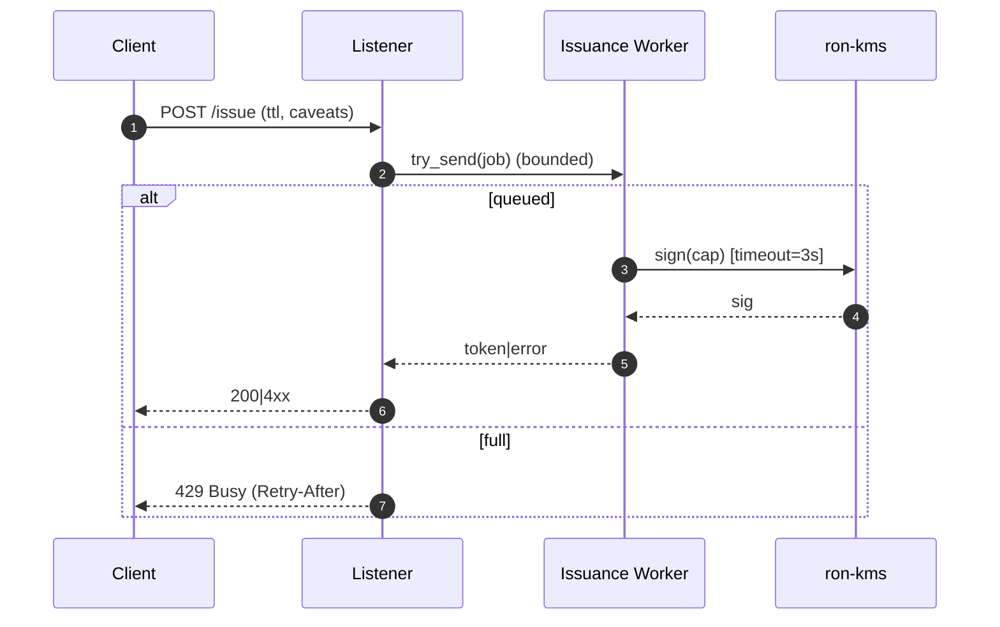
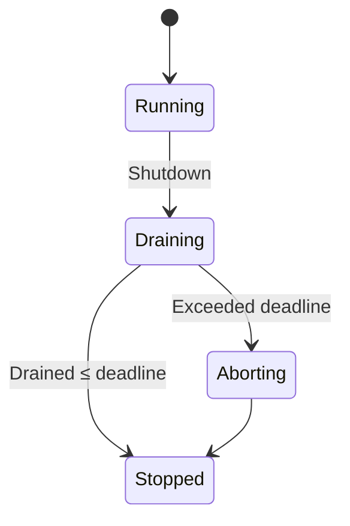
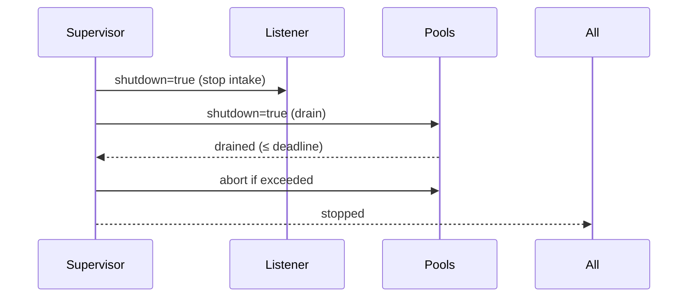

---

title: Concurrency Model — svc-passport
crate: svc-passport
owner: Stevan White
last-reviewed: 2025-10-09
status: draft
template_version: 1.1
msrv: 1.80.0
tokio: "1.x (pinned at workspace root)"
loom: "0.7+ (dev-only)"
lite_mode: "N/A (service crate)"
--------------------------------

# Concurrency Model — svc-passport

This document makes the concurrency rules **explicit**: tasks, channels, locks, shutdown, timeouts,
and validation (property/loom/TLA+). It complements `docs/SECURITY.md`, `docs/CONFIG.md`,
and the crate’s `README.md` and `IDB.md`.

> **Golden rule:** never hold a lock across `.await` in supervisory or hot paths.

---

## 0) Lite Mode

**N/A** — `svc-passport` is a service with background tasks.

---

## 1) Invariants (MUST)

* **I-1 — No lock across `.await`.** If unavoidable, split the critical section and pass owned data across the await point.
* **I-2 — Single writer per mutable resource.** Readers obtain snapshots; short read guards only.
* **I-3 — Bounded channels only.** All mpsc/broadcast are bounded with explicit overflow policy and metrics.
* **I-4 — Explicit timeouts.** All I/O (HTTP, KMS, registry, bus RPC) carry deadlines and convert to typed errors.
* **I-5 — Cancel-safe awaits.** Every `.await` is either cancel-safe or guarded by `select!` with shutdown/watch.
* **I-6 — Graceful shutdown.** Observe `Shutdown`; stop intake, drain within deadline, abort stragglers; readiness flips accordingly.
* **I-7 — No blocking in async.** Use `spawn_blocking` for rare CPU-bound or filesystem calls (e.g., PEM load), never on hot paths.
* **I-8 — No task leaks.** Track `JoinHandle`s in the supervisor; detach only for one-shot fire-and-forget with rationale.
* **I-9 — Backpressure over buffering.** Prefer early **Busy**/shed to deep buffers; expose drop counters.
* **I-10 — Framing & parse limits.** HTTP JSON bodies ≤ configured cap; strict deserialization with `deny_unknown_fields`.
* **I-11 — Async Drop policy.** No blocking in `Drop`; expose `async close()/shutdown()` for explicit teardown.

---

## 2) Runtime Topology

**Runtime:** Tokio multi-threaded (worker threads = CPU cores, bounded by workspace defaults).

**Primary tasks (by responsibility / criticality):**

1. **Supervisor** (critical)

   * Owns config snapshot, spawn/monitor children, receives `KernelEvent::Shutdown`.
   * Exposes `/readyz` flip logic based on child health and backpressure.

2. **HTTP Listener** (critical, intake)

   * Accepts requests on `bind_addr`; enforces body/time caps and converts to work units.
   * Pushes issuance/verify/revoke work into bounded queues; returns `202|200` or `429|413|5xx`.

3. **Issuance Worker Pool (N=M)** (critical, CPU-light)

   * Consumes issuance jobs; applies policy, calls KMS sign with timeout; returns token or typed error.
   * Size defaults to min(available cores, 8); dynamically bounded by inflight/backpressure.

4. **Revocation Worker** (high)

   * Processes revoke requests; rotates epoch via KMS and publishes bus events.

5. **Bus Subscriber** (medium)

   * Subscribes to revocation/policy updates; updates local verify/epoch cache (RAM-only in Micronode).

6. **Registry Sync** (medium)

   * Periodically fetches signed issuer/alg policy descriptors; jittered schedule; updates local snapshot.

7. **Config Watcher** (medium)

   * Reacts to SIGHUP or `ConfigUpdated` bus events; rebuilds snapshot; triggers controlled rebinds if needed.

8. **Metrics/Health Exporter** (supporting)

   * Serves `/metrics`, `/healthz`, `/readyz` on `metrics_addr`.

```mermaid
flowchart TB
  subgraph Runtime
    SUP[Supervisor] -->|spawn| HTTP[HTTP Listener]
    SUP -->|spawn| ISS[Issuance Pool]
    SUP -->|spawn| REV[Revocation Worker]
    SUP -->|spawn| BUS[Bus Subscriber]
    SUP -->|spawn| REG[Registry Sync]
    SUP -->|spawn| CFG[Config Watcher]
    HTTP -->|mpsc(work)| ISS
    HTTP -->|mpsc(revoke)| REV
    BUS -->|broadcast(policy/epoch)| ISS
    REG -->|watch/update| SUP
    SUP -->|watch Shutdown| HTTP
    SUP -->|watch Shutdown| ISS
    SUP -->|watch Shutdown| REV
    SUP -->|watch Shutdown| BUS
    SUP -->|watch Shutdown| REG
    SUP -->|watch Shutdown| CFG
  end
  style SUP fill:#0ea5e9,stroke:#0c4a6e,color:#fff
```

**Text diagram:** Supervisor spawns Listener, Pools, and system daemons; listener feeds bounded mpsc queues to workers; subscribers feed read-only updates; all children observe a shutdown `watch`.

---

## 3) Channels & Backpressure

**Inventory (all bounded):**

| Name          | Kind       | Capacity | Producers → Consumers | Backpressure Policy                    | Drop Semantics                          |
| ------------- | ---------- | -------: | --------------------- | -------------------------------------- | --------------------------------------- |
| `issue_tx`    | mpsc       |      512 | HTTP → Issuance Pool  | `try_send` → return `Busy` (HTTP 429)  | `queue_dropped_total{queue="issue"}`++  |
| `revoke_tx`   | mpsc       |      256 | HTTP → Revoke Worker  | `try_send` → `Busy`                    | `queue_dropped_total{queue="revoke"}`++ |
| `policy_tx`   | broadcast  |     1024 | Bus/Registry → N subs | lag counter; drop-oldest for slow subs | `bus_lagged_total`++, warn log          |
| `shutdown_rx` | watch      |        1 | Supervisor → N        | last-write-wins                        | N/A                                     |
| `ready_gauge` | gauge feed |        — | Workers → Health      | sample depth (not a queue)             | N/A                                     |

**Guidelines:**

* Accept/Reject decisions made at **ingress** to keep queues shallow.
* HTTP emits `429 Too Many Requests` with `Retry-After` when `try_send` fails.
* Record `queue_depth{issue|revoke}` gauges (sampled) and per-queue drop counters.

---

## 4) Locks & Shared State

**Allowed**

* Short-lived `Mutex/RwLock` around **small metadata** (policy snapshot pointer swap), never held across `.await`.
* **Copy-on-write snapshots**: `Arc<PolicySnapshot>` swapped atomically on updates.
* Per-request ephemeral state lives in task-local stack, not shared.

**Forbidden**

* Holding any lock over KMS/registry/HTTP `.await`.
* Nested locks without an explicit hierarchy.

**Hierarchy (if ever needed)**

1. `policy_meta` (outer)
2. `issuer_epoch` (inner)
3. `counters` (innermost)

*(But prefer snapshot swapping to avoid nested locks altogether.)*

---

## 5) Timeouts, Retries, Deadlines

* **HTTP I/O:** `read=5s`, `write=5s`, `idle=60s` (configurable). Body cap ≤ `1MiB` by default.
* **KMS RPC:** deadline = `kms.timeout` (default 3s). **No implicit retries** on sign; callers may retry issuance idempotently with jitter (50–100ms, cap 2s, max 3).
* **Registry fetch:** deadline = `registry.timeout` (default 3s). Retry with backoff on transient network failures.
* **Bus publish/subscribe:** non-blocking; slow consumers observed via lag counters.
* **Circuit breaker (optional):** open KMS path on p95 latencies breaching SLO for 60s; half-open probes thereafter.



---

## 6) Cancellation & Shutdown

* **Signal source:** `KernelEvent::Shutdown` or `wait_for_ctrl_c()`.
* **Propagation:** `watch::Sender<bool>` set to `true`; tasks `select!` on `shutdown_rx.changed()` alongside work.
* **Draining sequence:**

  1. **Stop intake**: Listener rejects new work (`503/429`) and sets `/readyz` **Not Ready** for issuance path (verification preflight may remain OK).
  2. **Drain deadline**: configurable (default 3–5s). Workers finish in-flight jobs.
  3. **Abort stragglers**: `JoinHandle::abort()` and increment `tasks_aborted_total{kind}`.
* **Idempotency:** Double-shutdown signals are benign.



---

## 7) I/O & Framing

* **Transport:** HTTP/1.1 (axum/hyper) + JSON DTOs with `#[serde(deny_unknown_fields)]`.
* **Maximums:** Request body ≤ `limits.max_body_bytes`; reject compressed payloads exceeding `decompress_ratio_cap`.
* **Partial reads:** handled by hyper; ensure `.shutdown().await` on connection close when applicable.
* **Integrity:** KMS responses validated by type; token envelope length-checked before encode.

---

## 8) Error Taxonomy (Concurrency-Relevant)

| Error       | When                        | Retry?       | Metric                               | Notes                                  |
| ----------- | --------------------------- | ------------ | ------------------------------------ | -------------------------------------- |
| `Busy`      | mpsc full on `try_send`     | yes (client) | `busy_rejections_total{endpoint}`    | Include `Retry-After`                  |
| `Timeout`   | I/O deadline exceeded       | maybe        | `io_timeouts_total{op}`              | `op` = `read`/`write`/`kms`/`registry` |
| `Canceled`  | shutdown while awaiting     | no           | `tasks_canceled_total{kind}`         | cooperative cancellation               |
| `Lagging`   | broadcast overflow/slow sub | no           | `bus_lagged_total`                   | log subscriber identity if safe        |
| `OverLimit` | body/ratio cap exceeded     | no           | `rejects_total{reason="over_limit"}` | HTTP 413 / 400                         |

---

## 9) Metrics (Concurrency Health)

* `queue_depth{queue}` gauge (sampled)
* `queue_dropped_total{queue}` counter
* `busy_rejections_total{endpoint}` counter
* `tasks_spawned_total{kind}` / `tasks_aborted_total{kind}` counters
* `io_timeouts_total{op}` counter
* `backoff_retries_total{op}` counter
* `bus_lagged_total` counter
* `config_reload_duration_seconds` histogram (reload path)
* `config_reloads_total`, `config_reload_errors_total` counters

---

## 10) Validation Strategy

**Unit / Property**

* Backpressure: enqueue up to cap, ensure `try_send` fails with `Busy` and increments drop metrics.
* Deadlines: operations exceed `timeout` → typed `Timeout` within ±50ms tolerance.
* Lock discipline: static lint (`clippy::await_holding_lock`), plus runtime assertions in debug builds.

**Loom (dev-only)**

* **Model:** one producer (listener) → bounded mpsc → one consumer (worker); a `watch` shutdown flips.
* **Asserts:** no deadlock, no unobserved shutdown, no missed job finalization, no double drop of job resources.

**Fuzz**

* DTO fuzz (unknown fields, boundary sizes).
* Ratio-cap fuzz for compressed payloads (if enabled).

**Chaos**

* Kill a worker under load; supervisor restarts with jittered backoff; `/readyz` shows partial degradation then recovery.
* Stall the registry/KMS endpoints to test breaker and timeouts.

**TLA+ (optional)**

* Token issuance state machine: prove **safety** (no mint without policy snapshot) and **liveness** (jobs drain under finite failures).

---

## 11) Code Patterns (Copy-Paste)

**Spawn + cooperative shutdown**

```rust
let (shutdown_tx, mut shutdown_rx) = tokio::sync::watch::channel(false);
let (work_tx, mut work_rx) = tokio::sync::mpsc::channel(512);

let worker = tokio::spawn(async move {
  loop {
    tokio::select! {
      _ = shutdown_rx.changed() => break,
      maybe_job = work_rx.recv() => {
        let Some(job) = maybe_job else { break };
        if let Err(err) = handle_issue(job).await {
          tracing::warn!(%err, "issuance failed");
        }
      }
    }
  }
});
/* ... later ... */
// shutdown_tx.send(true).ok();
// let _ = worker.await;
```

**Bounded mpsc with `try_send`**

```rust
match work_tx.try_send(job) {
  Ok(_) => {}
  Err(tokio::sync::mpsc::error::TrySendError::Full(_)) => {
    metrics::busy_rejections_total().with_label_values(&["/v1/passport/issue"]).inc();
    return Err(Error::Busy);
  }
  Err(e) => return Err(Error::Queue(e.to_string())),
}
```

**Timeout with deadline**

```rust
let res = tokio::time::timeout(cfg.kms.timeout, kms.sign(cap_bytes)).await;
let sig = res.map_err(|_| Error::Timeout("kms"))??;
```

**No lock across `.await`**

```rust
let snapshot = {
  let g = policy_meta.read();     // cheap, short
  g.current_snapshot.clone()
}; // drop guard before awaiting
let token = issue_with_snapshot(snapshot, req).await?;
```

**Async Drop pattern**

```rust
pub struct Client { inner: Option<Conn> }

impl Client {
  pub async fn close(&mut self) -> anyhow::Result<()> {
    if let Some(mut c) = self.inner.take() {
      c.shutdown().await.ok();
    }
    Ok(())
  }
}

impl Drop for Client {
  fn drop(&mut self) {
    if self.inner.is_some() {
      tracing::debug!("Client dropped without close(); reclaimed non-blockingly");
    }
  }
}
```

**Jittered backoff**

```rust
let mut delay = std::time::Duration::from_millis(50);
for _ in 0..3 {
  if try_op().await.is_ok() { break; }
  tokio::time::sleep(delay + rand::rng().random_range(0..50).into()).await;
  delay = std::cmp::min(delay * 2, std::time::Duration::from_secs(2));
}
```

---

## 12) Configuration Hooks (Quick Reference)

* `limits.rps`, `limits.inflight` → sheds at ingress; worker pool sizes respect inflight.
* `read_timeout`, `write_timeout`, `idle_timeout` → HTTP I/O.
* `kms.timeout`, `registry.timeout` → RPC deadlines.
* `drain_deadline` (service-level; default 3–5s) → graceful shutdown bound.
* `issuer_policy.*`, `pq.mode` → do **not** require restart; snapshot-swap safe.

See `docs/CONFIG.md` for authoritative schema.

---

## 13) Known Trade-offs / Nonstrict Areas

* **Drop-oldest vs reject-new** for broadcast subscribers: we drop oldest to keep latest policy visible; slow subscribers receive lag warnings.
* **No retries on KMS sign**: favors idempotency and budget caveats; caller may retry; we avoid queue amplification.
* **Graceful verify preflight**: on heavy load, issuance sheds while verification preflight remains up (readiness split-brain avoided via separate checks).

---

## 14) Mermaid Diagrams

### 14.1 Task & Queue Topology

```mermaid
flowchart LR
  IN[HTTP Ingress] -->|mpsc:issue(512)| W1[Issuance A]
  IN -->|mpsc:issue(512)| W2[Issuance B]
  IN -->|mpsc:revoke(256)| RV[Revoker]
  subgraph Control
    SHUT[Shutdown watch] --> W1
    SHUT --> W2
    SHUT --> RV
  end
```

**Text:** Ingress feeds two issuance workers and one revoker via bounded mpsc queues; a shutdown watch signals all workers.

### 14.2 Shutdown Sequence



---

## 15) CI & Lints (Enforcement)

**Clippy / Rustflags**

* `-D warnings`
* `-W clippy::await_holding_lock`
* `-W clippy::needless_collect`
* `-W clippy::useless_async`

**GitHub Actions suggestion**

```yaml
name: svc-passport-concurrency-guardrails
on: [push, pull_request]
jobs:
  clippy:
    runs-on: ubuntu-latest
    steps:
      - uses: actions/checkout@v4
      - uses: dtolnay/rust-toolchain@stable
      - run: cargo clippy -p svc-passport -- -D warnings -W clippy::await_holding_lock

  loom:
    if: github.event_name == 'pull_request'
    runs-on: ubuntu-latest
    steps:
      - uses: actions/checkout@v4
      - uses: dtolnay/rust-toolchain@stable
      - name: Run Loom tests (ignored)
        run: RUSTFLAGS="--cfg loom" cargo test -p svc-passport --tests -- --ignored

  fuzz:
    runs-on: ubuntu-latest
    steps:
      - uses: actions/checkout@v4
      - uses: dtolnay/rust-toolchain@stable
      - run: cargo install cargo-fuzz
      - run: cargo fuzz build -p svc-passport
```

---

## 16) Schema Generation (Optional)

Automate **Channels/Locks** tables from code:

* Annotate declarations (doc comments or attributes), or keep a tiny `concurrency_registry.rs`.
* Golden test compares generated table to doc to prevent rot.

Example annotation:

```rust
/// @channel name=issue kind=mpsc cap=512 policy=try_send
let (issue_tx, issue_rx) = tokio::sync::mpsc::channel(512);
```

---

## 17) Review & Maintenance

* **Cadence:** review every 90 days, or with any change to tasks/channels/locks/limits.
* **Keep header fields current** (`owner`, `msrv`, `last-reviewed`).
* **PR checklist:** if you modify concurrency, update this file **and** add/adjust Loom/property tests.

---
