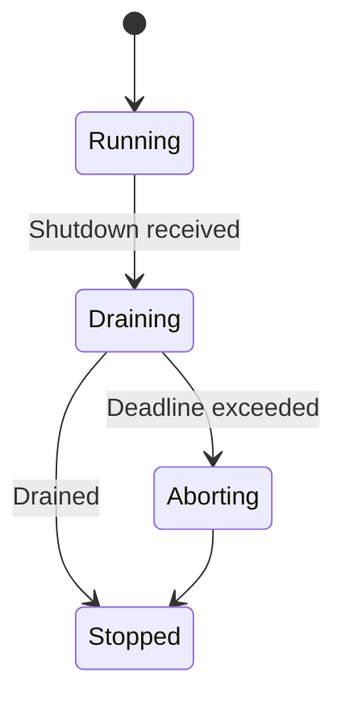
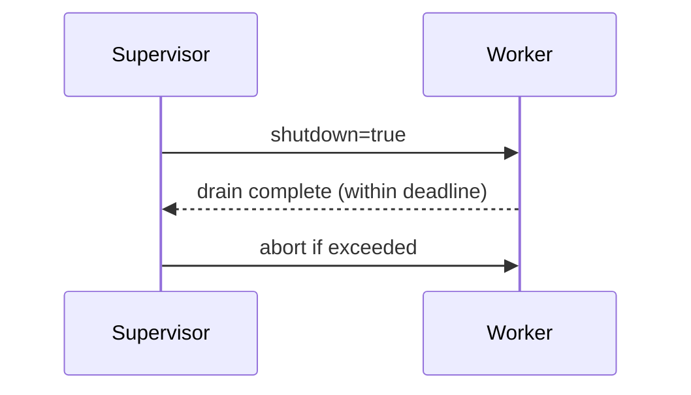

---
title: Concurrency Model — <CRATE_NAME>
crate: <CRATE_NAME>
owner: Stevan White
last-reviewed: YYYY-MM-DD
status: draft
template_version: 1.1
msrv: 1.80.0
tokio: "1.x (pinned at workspace root)"
loom: "0.7+ (dev-only)"
lite_mode: "For small library crates: fill §§1,3,4,5,10,11 and mark others N/A"
---

# Concurrency Model — <CRATE_NAME>

This document makes the concurrency rules **explicit**: tasks, channels, locks, shutdown, timeouts,
and validation (property/loom/TLA+). It complements `docs/SECURITY.md`, `docs/CONFIG.md`,
and the crate’s `README.md` and `IDB.md`.

> **Golden rule:** never hold a lock across `.await` in supervisory or hot paths.

---

## 0) Lite Mode (for tiny lib crates)

If this crate is a small **library** with no background tasks:
- Complete **§1 Invariants**, **§3 Channels**, **§4 Locks**, **§5 Timeouts**, **§10 Validation**, **§11 Code Patterns**.
- Mark **§2 Runtime**, **§6 Shutdown**, **§7 I/O framing** N/A if not applicable.

---

## 1) Invariants (MUST)

- [ ] **No lock across `.await`**. If unavoidable, split the critical section.
- [ ] **Single writer** per mutable resource; readers use snapshots or short read guards.
- [ ] **Bounded channels** only (mpsc/broadcast) with explicit overflow policy.
- [ ] **Explicit timeouts** on all I/O and RPCs; fail-fast with typed errors.
- [ ] **Cooperative cancellation**: every `.await` is cancel-safe or guarded by `select!`.
- [ ] **Graceful shutdown**: observe `Shutdown` signal; drain within deadline; abort stragglers.
- [ ] **No blocking syscalls** on the async runtime; use `spawn_blocking` if required.
- [ ] **No task leaks**: track joins; detach only with rationale.
- [ ] **Backpressure over buffering**: drop/reject with metrics; never grow unbounded queues.
- [ ] **Framing**: length-delimited/checked; handle split reads.

**Async Drop**
- [ ] Do **not** block in `Drop`. For teardown, expose an **async `close()`/`shutdown()`** API and call it before the value is dropped. `Drop` should only release cheap, non-blocking resources.

---

## 2) Runtime Topology

Describe Tokio runtime & task layout (if applicable).

- **Runtime:** tokio multi-threaded.
- **Primary tasks:**
  - `<task name>` — purpose, cadence, criticality.
  - `<task name>` — …
- **Supervision:** jittered backoff on panic; escalation/limits documented.

```mermaid
flowchart TB
  subgraph Runtime
    A[Supervisor] -->|spawn| B[Listener]
    A -->|spawn| C[Worker Pool]
    B -->|mpsc (bounded)| C
    A -->|watch Shutdown| B
    A -->|watch Shutdown| C
  end
  C -->|results| A
  style A fill:#0ea5e9,stroke:#0c4a6e,color:#fff
````

**Diagram (text description for accessibility):** The Supervisor task spawns one Listener and a Worker Pool. The Listener feeds a bounded mpsc queue into the Worker Pool. Both Listener and Workers subscribe to a Shutdown watch channel from the Supervisor.

---

## 3) Channels & Backpressure

**Inventory (bounded unless noted):**

| Name          | Kind      | Capacity | Producers → Consumers | Backpressure Policy       | Drop Semantics              |
| ------------- | --------- | -------: | --------------------- | ------------------------- | --------------------------- |
| `<events_tx>` | broadcast |     1024 | 1 → N                 | lag counter + drop oldest | increment metric + warn log |
| `<work_tx>`   | mpsc      |      512 | N → M                 | `try_send` → `Busy`       | return 429/`Busy` upstream  |
| `<ctrl_rx>`   | watch     |        1 | 1 → N                 | last-write wins           | N/A                         |

Guidelines:

* Prefer `try_send` + explicit error over buffering.
* Emit `queue_dropped_total{queue="work"}` on shed; keep a depth gauge.

---

## 4) Locks & Shared State

**Allowed**

* Short-lived `Mutex`/`RwLock` for metadata (no `.await` under guard).
* Read-mostly snapshots via `Arc<StateSnapshot>`.
* Per-connection state owned by its task; cross-task via channels.

**Forbidden**

* Holding locks across `.await`.
* Nested locks without a documented hierarchy.

**Hierarchy (if needed)**

1. `state_meta`
2. `routing_table`
3. `counters`

---

## 5) Timeouts, Retries, Deadlines

* **I/O:** `read=5s`, `write=5s`, `idle=60s` (override via config).
* **RPC:** total deadline enforced; retry idempotent ops only with jittered backoff (50–100ms → cap 2s, max 3 tries).
* **Circuit breaker (opt):** open on error rate; half-open probes recover.

```mermaid
sequenceDiagram
  autonumber
  participant Caller
  participant S as <CRATE_NAME>
  Caller->>S: Request (deadline=2s)
  S-->>Caller: 202 Accepted or Result
  Note over S: On backpressure → Busy<br/>On timeout → typed error
```

**Diagram (text):** Caller sends a request with a 2s deadline; service either accepts work or returns a Busy/timeout error deterministically.

---

## 6) Cancellation & Shutdown

* **Signal:** `KernelEvent::Shutdown` or `wait_for_ctrl_c()`.
* **Propagation:** `tokio::select! { _ = shutdown.changed() => ..., _ = work => ... }`.
* **Draining:** stop intake; flush in-flight within deadline (1–5s).
* **Abort:** tasks exceeding deadline → `handle.abort()`; count `aborted_tasks_total`.



**Diagram (text):** On shutdown signal, system enters Draining; if deadline passes, remaining tasks are Aborted; otherwise transitions to Stopped.

---

## 7) I/O & Framing

* Length-prefix or delimiter with strict maximums.
* Use `AsyncReadExt/AsyncWriteExt`; call `.shutdown().await` on success/error.
* Handle partial reads; verify checksums when protocol requires.

---

## 8) Error Taxonomy (Concurrency-Relevant)

| Error      | When               | Retry?    | Metric                  | Notes          |
| ---------- | ------------------ | --------- | ----------------------- | -------------- |
| `Busy`     | queue full         | maybe     | `busy_rejections_total` | caller-visible |
| `Timeout`  | deadline exceeded  | sometimes | `io_timeouts_total{op}` | attach op      |
| `Canceled` | shutdown           | no        | `tasks_canceled_total`  | cooperative    |
| `Lagging`  | broadcast overflow | no        | `bus_lagged_total`      | slow consumer  |

---

## 9) Metrics (Concurrency Health)

* `queue_depth{queue}` gauge (sampled)
* `queue_dropped_total{queue}` counter
* `tasks_spawned_total{kind}` / `tasks_aborted_total{kind}`
* `io_timeouts_total{op}` (`read`,`write`,`connect`)
* `backoff_retries_total{op}`
* `busy_rejections_total{endpoint}`

---

## 10) Validation Strategy

**Unit / Property**

* Backpressure behavior (drop vs reject).
* Deadline honored within tolerance.
* Lock discipline (runtime asserts if needed).

**Loom**

* Model producer → bounded queue → consumer + shutdown.
* Assert: no deadlocks, no missed shutdown, no double-drop.

**Fuzz**

* Frame/decoder fuzz (malformed/boundary inputs).

**Chaos**

* Kill/restart workers under load; `/readyz` flips correctly; drains respected.

**TLA+ (if ordering matters)**

* Specify message/state; prove safety (no dup/loss) & liveness (eventual drain).

---

## 11) Code Patterns (Copy-Paste)

**Spawn + cooperative shutdown**

```rust
let (shutdown_tx, mut shutdown_rx) = tokio::sync::watch::channel(false);
let worker = tokio::spawn({
  let mut rx = work_rx;
  async move {
    loop {
      tokio::select! {
        _ = shutdown_rx.changed() => break,
        maybe_job = rx.recv() => {
          let Some(job) = maybe_job else { break };
          if let Err(e) = handle_job(job).await {
            tracing::warn!(error=%e, "job failed");
          }
        }
      }
    }
  }
});
// shutdown_tx.send(true).ok(); let _ = worker.await;
```

**Bounded mpsc with try\_send**

```rust
if let Err(tokio::sync::mpsc::error::TrySendError::Full(_)) = tx.try_send(job) {
  metrics::busy_rejections_total().inc();
  return Err(Error::Busy);
}
```

**Timeout with deadline**

```rust
let res = tokio::time::timeout(cfg.read_timeout, read_frame(&mut stream)).await;
```

**Async Drop pattern**

```rust
pub struct Client { inner: Option<Conn> }

impl Client {
  pub async fn close(&mut self) -> anyhow::Result<()> {
    if let Some(conn) = self.inner.take() {
      conn.shutdown().await?;
    }
    Ok(())
  }
}

impl Drop for Client {
  fn drop(&mut self) {
    // Best-effort: log if still open; do NOT block here.
    if self.inner.is_some() {
      tracing::debug!("Client dropped without close(); resources will be reclaimed");
    }
  }
}
```

**No lock across `.await`**

```rust
let value = { let g = state.lock(); g.derive_value() }; // drop guard
do_async(value).await;
```

---

## 12) Configuration Hooks (Quick Reference)

* `max_conns`, `read_timeout`, `write_timeout`, `idle_timeout`
* channel capacities
* `drain_deadline`
* retry/backoff window

See `docs/CONFIG.md` for authoritative schema.

---

## 13) Known Trade-offs / Nonstrict Areas

* Justify **drop-oldest vs reject-new** choice per queue.
* Call out eventual consistency / best-effort areas.

---

## 14) Mermaid Diagrams (REQUIRED)

### 14.1 Task & Queue Topology

```mermaid
flowchart LR
  IN[Ingress] -->|mpsc:work(512)| W1[Worker A]
  IN -->|mpsc:work(512)| W2[Worker B]
  subgraph Control
    SHUT[Shutdown watch] --> W1
    SHUT --> W2
  end
```

**Text description:** Ingress feeds two workers via a bounded mpsc(512); a Shutdown watch channel notifies both workers.

### 14.2 Shutdown Sequence



**Text description:** Supervisor signals shutdown; Worker drains and acknowledges; if time limit exceeded, Supervisor aborts Worker.

---

## 15) CI & Lints (Enforcement)

**Clippy lints to enable**

* `-D clippy:await_holding_lock`
* `-D clippy:needless_collect`
* `-D clippy:useless_async`
* `-D warnings` (repo standard)

**GitHub Actions suggestions**

```yaml
name: concurrency-guardrails
on: [push, pull_request]
jobs:
  clippy:
    runs-on: ubuntu-latest
    steps:
      - uses: actions/checkout@v4
      - uses: dtolnay/rust-toolchain@stable
      - run: cargo clippy -p <CRATE_NAME> -- -D warnings -W clippy::await_holding_lock

  loom:
    if: github.event_name == 'pull_request'
    runs-on: ubuntu-latest
    steps:
      - uses: actions/checkout@v4
      - uses: dtolnay/rust-toolchain@stable
      - run: RUSTFLAGS="--cfg loom" cargo test -p <CRATE_NAME> --tests -- --ignored

  fuzz:
    runs-on: ubuntu-latest
    steps:
      - uses: actions/checkout@v4
      - uses: dtolnay/rust-toolchain@stable
      - run: cargo install cargo-fuzz
      - run: cargo fuzz build -p <CRATE_NAME>
```

---

## 16) Schema Generation (Optional, Nice-to-Have)

Automate **Channels/Locks tables** from code to avoid rot:

* Annotate channels/locks with macros or attributes, e.g.:

  ```rust
  #[doc_channel(name="work", kind="mpsc", cap=512, policy="try_send")]
  let (tx, rx) = tokio::sync::mpsc::channel(512);
  ```
* A small **proc-macro** or a **build script** (`build.rs`) can emit `docs/_generated/concurrency.mdfrag` which you include via an md include.
* Alternatively, keep a `concurrency.rs` registry module and unit-test that the doc table matches the registry entries (golden test).

---

## 17) Review & Maintenance

* **Review cadence:** every 90 days or on any change to tasks/channels/locks.
* **Keep `owner`, `msrv`, `last-reviewed` current.**
* **PR checklist:** if you modify concurrency, update this file + Loom/property tests.

```

---
