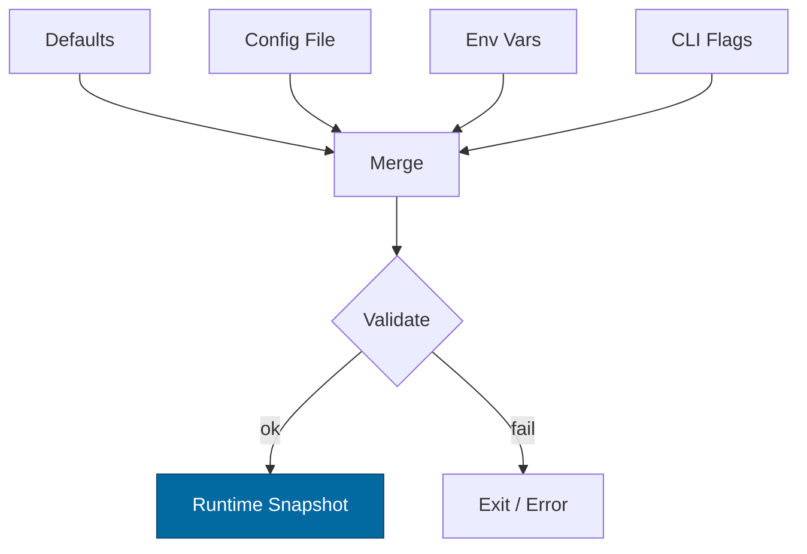

---

title: Configuration — svc-passport
crate: svc-passport
owner: Stevan White
last-reviewed: 2025-10-09
status: draft
template_version: 1.1
---------------------

# Configuration — svc-passport

This document defines **all configuration** for `svc-passport`, including sources,
precedence, schema (types/defaults), validation, feature flags, live-reload behavior,
and security implications. It complements `README.md`, `docs/SECURITY.md`, and the IDB.

> **Tiering:**
> **Service crate** — all sections apply (network, readiness, observability, etc.).
> Verification is performed by `ron-auth`; keys are custodied by `ron-kms`.
> **Micronode/Macronode parity:**
>
> * Micronode defaults: `amnesia.enabled=true`, `pq.mode="mirror"`, `limits.rps=300`, `limits.inflight=256`.
> * Macronode defaults: `amnesia.enabled=false` (unless mandated), `pq.mode="mirror"`, `limits.rps>=500`, `limits.inflight>=512`.
> * Both expose identical keys; only defaults differ by profile.

---

## 1) Sources & Precedence (Authoritative)

Configuration may come from multiple sources. **Precedence (highest wins):**

1. **Process flags** (CLI)
2. **Environment variables**
3. **Config file** (`Config.toml` beside the binary or provided via `--config`)
4. **Built-in defaults** (compiled)

When reloading dynamically, the effective config is recomputed under the same precedence.

**Supported file formats:** TOML (preferred), JSON (optional).
**Path resolution order for `--config` (if relative):** `./`, `$CWD`, crate dir.

> **Note:** During reload, the system re-parses the file on disk, re-reads the environment,
> and re-applies CLI flag overrides (if managed by the supervisor) before recomputing the snapshot.

---

## 2) Quickstart Examples

### 2.1 Minimal service start

```bash
RUST_LOG=info \
SVC_PASSPORT_BIND_ADDR=0.0.0.0:8080 \
SVC_PASSPORT_METRICS_ADDR=127.0.0.1:0 \
cargo run -p svc-passport
```

### 2.2 Config file (TOML)

```toml
# Config.toml
bind_addr     = "0.0.0.0:8080"
metrics_addr  = "127.0.0.1:0"
max_conns     = 1024
read_timeout  = "5s"
write_timeout = "5s"
idle_timeout  = "60s"

[limits]
max_body_bytes       = "1MiB"
decompress_ratio_cap = 10
rps                  = 500
inflight             = 512

[tls]
enabled   = false
# cert_path = "/etc/ron/cert.pem"
# key_path  = "/etc/ron/key.pem"

[amnesia]
enabled = true

[pq]
mode = "mirror"       # mirror|require|enforce|off

[issuer_policy]
max_ttl       = "1h"
default_ttl   = "15m"
rotation_days = 30
grace         = "10m"  # overlap window for epoch rotation
alg_set       = ["ed25519", "ed25519+ml-dsa"]

[caveats]
# Enable/disable standard caveat families
enable_budget     = true
enable_rate       = true
enable_route      = true
enable_region     = true
max_budget_bytes  = "1MiB"
max_budget_reqs   = 100
max_rate_rps      = 5

[registry]
endpoint = "http://127.0.0.1:7700"  # svc-registry API/base
timeout  = "3s"

[kms]
# opaque key/issuer identifiers resolved by ron-kms
issuer_kid   = "issuer-v1"
signer_label = "passport-mint"
timeout      = "3s"

[uds]
path       = ""   # e.g., "/var/run/svc-passport.sock"
allow_uids = []   # [1000, 1001]

[log]
format = "json"   # json|text
level  = "info"   # trace|debug|info|warn|error

[readiness]
# When under pressure, deny issuance but keep verification preflight available.
shed_issue_on_high_load = true
```

### 2.3 CLI flags (override file/env)

```bash
cargo run -p svc-passport -- \
  --bind 0.0.0.0:8080 \
  --metrics 127.0.0.1:0 \
  --max-conns 2048 \
  --pq-mode require \
  --amnesia
```

---

## 3) Schema (Typed, With Defaults)

> **Prefix convention:** All env vars begin with `SVC_PASSPORT_`.
> **Durations** accept `s`, `ms`, `m`, `h`. **Sizes** accept `B`, `KB`, `MB`, `MiB`.

| Key / Env Var                                                           | Type                | Default                        | Description                                                            | Security Notes                     |         |                                 |                               |                       |
| ----------------------------------------------------------------------- | ------------------- | ------------------------------ | ---------------------------------------------------------------------- | ---------------------------------- | ------- | ------------------------------- | ----------------------------- | --------------------- |
| `bind_addr` / `SVC_PASSPORT_BIND_ADDR`                                  | socket              | `127.0.0.1:0`                  | HTTP ingress bind address                                              | Public binds require threat review |         |                                 |                               |                       |
| `metrics_addr` / `SVC_PASSPORT_METRICS_ADDR`                            | socket              | `127.0.0.1:0`                  | Prometheus metrics bind                                                | Prefer localhost scrape            |         |                                 |                               |                       |
| `max_conns` / `SVC_PASSPORT_MAX_CONNS`                                  | u32                 | `1024`                         | Max concurrent connections                                             | Prevent FD exhaustion              |         |                                 |                               |                       |
| `read_timeout` / `SVC_PASSPORT_READ_TIMEOUT`                            | duration            | `5s`                           | Per-request read timeout                                               | DoS mitigation                     |         |                                 |                               |                       |
| `write_timeout` / `SVC_PASSPORT_WRITE_TIMEOUT`                          | duration            | `5s`                           | Per-request write timeout                                              | DoS mitigation                     |         |                                 |                               |                       |
| `idle_timeout` / `SVC_PASSPORT_IDLE_TIMEOUT`                            | duration            | `60s`                          | Keep-alive idle shutdown                                               | Resource hygiene                   |         |                                 |                               |                       |
| `limits.max_body_bytes` / `SVC_PASSPORT_MAX_BODY_BYTES`                 | size                | `1MiB`                         | Request payload cap                                                    | Zip-bomb guard                     |         |                                 |                               |                       |
| `limits.decompress_ratio_cap` / `SVC_PASSPORT_DECOMPRESS_RATIO_CAP`     | u32                 | `10`                           | Max decompression ratio                                                | Zip-bomb guard                     |         |                                 |                               |                       |
| `limits.rps` / `SVC_PASSPORT_RPS`                                       | u32                 | `500`                          | Shed requests above this rate (per instance)                           | Backpressure                       |         |                                 |                               |                       |
| `limits.inflight` / `SVC_PASSPORT_INFLIGHT`                             | u32                 | `512`                          | Concurrent inflight request ceiling                                    | Backpressure                       |         |                                 |                               |                       |
| `tls.enabled` / `SVC_PASSPORT_TLS_ENABLED`                              | bool                | `false`                        | Enable TLS                                                             | Use tokio-rustls only              |         |                                 |                               |                       |
| `tls.cert_path` / `SVC_PASSPORT_TLS_CERT_PATH`                          | path                | `""`                           | PEM cert path                                                          | Secrets on disk; perms 0600        |         |                                 |                               |                       |
| `tls.key_path` / `SVC_PASSPORT_TLS_KEY_PATH`                            | path                | `""`                           | PEM key path                                                           | Zeroize in memory                  |         |                                 |                               |                       |
| `uds.path` / `SVC_PASSPORT_UDS_PATH`                                    | path                | `""`                           | Unix Domain Socket path (optional)                                     | Dir 0700, sock 0600                |         |                                 |                               |                       |
| `uds.allow_uids` / `SVC_PASSPORT_UDS_ALLOW_UIDS`                        | list<u32>           | `[]`                           | PEERCRED allowlist                                                     | Strict control                     |         |                                 |                               |                       |
| `amnesia.enabled` / `SVC_PASSPORT_AMNESIA`                              | bool                | `false`                        | RAM-only mode (no persistent state)                                    | Disables disk persistence          |         |                                 |                               |                       |
| `pq.mode` / `SVC_PASSPORT_PQ_MODE`                                      | enum                | `"mirror"`                     | `off                                                                   | mirror                             | require | enforce` (hybrid rollout phase) | Interop risk if peers lack PQ |                       |
| `issuer_policy.max_ttl` / `SVC_PASSPORT_MAX_TTL`                        | duration            | `1h`                           | Cap for `ttl_s` on issuance                                            | Controls blast radius              |         |                                 |                               |                       |
| `issuer_policy.default_ttl` / `SVC_PASSPORT_DEFAULT_TTL`                | duration            | `15m`                          | Default TTL when unspecified                                           | Short-lived by design              |         |                                 |                               |                       |
| `issuer_policy.rotation_days` / `SVC_PASSPORT_ROTATION_DAYS`            | u16                 | `30`                           | Key/epoch rotation cadence                                             | Align with org policy              |         |                                 |                               |                       |
| `issuer_policy.grace` / `SVC_PASSPORT_ROTATION_GRACE`                   | duration            | `10m`                          | Overlap window where old+new epochs verify                             | Smooth rotation                    |         |                                 |                               |                       |
| `issuer_policy.alg_set` / `SVC_PASSPORT_ALG_SET`                        | list<string>        | `["ed25519","ed25519+ml-dsa"]` | Allowed alg families for minting                                       | Drives negotiation                 |         |                                 |                               |                       |
| `caveats.enable_budget` / `SVC_PASSPORT_CAVEAT_BUDGET`                  | bool                | `true`                         | Allow budget caveats                                                   |                                    |         |                                 |                               |                       |
| `caveats.enable_rate` / `SVC_PASSPORT_CAVEAT_RATE`                      | bool                | `true`                         | Allow rate caveats                                                     |                                    |         |                                 |                               |                       |
| `caveats.enable_route` / `SVC_PASSPORT_CAVEAT_ROUTE`                    | bool                | `true`                         | Allow route caveats                                                    |                                    |         |                                 |                               |                       |
| `caveats.enable_region` / `SVC_PASSPORT_CAVEAT_REGION`                  | bool                | `true`                         | Allow region caveats                                                   |                                    |         |                                 |                               |                       |
| `caveats.max_budget_bytes` / `SVC_PASSPORT_CAVEAT_MAX_BUDGET_BYTES`     | size                | `1MiB`                         | Upper bound for byte budgets minted                                    | Prevents overscoped caps           |         |                                 |                               |                       |
| `caveats.max_budget_reqs` / `SVC_PASSPORT_CAVEAT_MAX_BUDGET_REQS`       | u32                 | `100`                          | Upper bound for request budgets minted                                 |                                    |         |                                 |                               |                       |
| `caveats.max_rate_rps` / `SVC_PASSPORT_CAVEAT_MAX_RATE_RPS`             | u32                 | `5`                            | Upper bound for rate caveats                                           |                                    |         |                                 |                               |                       |
| `registry.endpoint` / `SVC_PASSPORT_REGISTRY_ENDPOINT`                  | url                 | `http://127.0.0.1:7700`        | svc-registry base URL                                                  | TLS/MTLS in prod                   |         |                                 |                               |                       |
| `registry.timeout` / `SVC_PASSPORT_REGISTRY_TIMEOUT`                    | duration            | `3s`                           | Registry client timeout                                                |                                    |         |                                 |                               |                       |
| `kms.issuer_kid` / `SVC_PASSPORT_KMS_ISSUER_KID`                        | string              | `"issuer-v1"`                  | Primary issuer key identifier (opaque to us)                           | Never log; rotate ≤ 30d            |         |                                 |                               |                       |
| `kms.signer_label` / `SVC_PASSPORT_KMS_SIGNER_LABEL`                    | string              | `"passport-mint"`              | Label/handle for KMS signing context                                   |                                    |         |                                 |                               |                       |
| `kms.timeout` / `SVC_PASSPORT_KMS_TIMEOUT`                              | duration            | `3s`                           | KMS client timeout                                                     |                                    |         |                                 |                               |                       |
| `log.format` / `SVC_PASSPORT_LOG_FORMAT`                                | enum(`json`,`text`) | `json`                         | Structured logs                                                        | JSON in prod                       |         |                                 |                               |                       |
| `log.level` / `SVC_PASSPORT_LOG_LEVEL`                                  | enum                | `info`                         | `trace                                                                 | debug                              | info    | warn                            | error`                        | Avoid `trace` in prod |
| `readiness.shed_issue_on_high_load` / `SVC_PASSPORT_SHED_ISSUE_ON_LOAD` | bool                | `true`                         | Under pressure, deny issuance; verification preflight stays responsive | Fail-closed for mint path          |         |                                 |                               |                       |

---

## 4) Validation Rules (Fail-Closed)

On startup or reload, apply **strict validation**:

* `bind_addr` / `metrics_addr` parse to valid sockets; privileged ports require privileges.
* If `tls.enabled=true`: `cert_path` and `key_path` exist, readable, and not world-readable.
* `max_conns > 0`, `limits.max_body_bytes ≥ 1 KiB`, `limits.inflight ≥ 32`, `limits.rps ≥ 1`.
* `decompress_ratio_cap ≥ 1`.
* If `uds.path` set: parent dir exists; dir `0700`, socket `0600`; on Linux, validate `SO_PEERCRED` and `allow_uids`.
* `issuer_policy.default_ttl ≤ issuer_policy.max_ttl`.
* `issuer_policy.rotation_days ∈ [1, 365]`.
* `pq.mode` ∈ `{off, mirror, require, enforce}`; if `require|enforce` ensure `ed25519+ml-dsa` (or configured hybrid) present in `issuer_policy.alg_set`.
* `registry.endpoint` must be a valid URL and reachable during readiness (best-effort).
* `kms.issuer_kid` non-empty; KMS health probe must pass at boot.

**On violation:** log structured error, **exit non-zero** (service). Reload violations revert to previous good snapshot.

---

## 5) Dynamic Reload (If Supported)

**Triggers**

* SIGHUP (preferred), or kernel bus event `ConfigUpdated { version: u64 }`.

**Reload semantics**

* **Non-disruptive:** timeouts, limits, `log.*`, `issuer_policy.*` (except rotation causing KMS swap), `pq.mode` (subject to policy), caveat toggles.
* **Disruptive:** `bind_addr`, `tls.*`, `uds.*` (requires socket rebind), switching `registry.endpoint`.

**Atomicity**

* Build a new immutable snapshot; swap under a lock with **no `.await` held** (copy-on-write).

**SLO**

* Reload application time (parse+validate+swap) should complete **<100ms p95** and **<250ms p99** under nominal load; alert if exceeded for 5 minutes.

**Audit**

* Emit `KernelEvent::ConfigUpdated { version }` plus a redacted diff (no secrets). Increment `config_reloads_total`.
* **Audit sink:** On successful reload, emit a **redacted** config snapshot to `ron-audit` with fields: `version`, `changed_keys[]`, and `timestamp`. Secret-bearing fields are omitted or `"***"`.

---

## 6) CLI Flags (Canonical)

```
--config <path>                   # Load Config.(toml|json)
--bind <ip:port>                  # Override bind_addr
--metrics <ip:port>               # Override metrics_addr
--max-conns <num>
--read-timeout <dur>              # e.g., 5s, 250ms
--write-timeout <dur>
--idle-timeout <dur>
--rps <num>                       # limits.rps
--inflight <num>                  # limits.inflight
--tls                             # sets tls.enabled=true
--tls-cert <path>
--tls-key <path>
--uds <path>
--amnesia                         # sets amnesia.enabled=true
--pq-mode <off|mirror|require|enforce>
--max-ttl <dur>                   # issuer_policy.max_ttl
--default-ttl <dur>               # issuer_policy.default_ttl
--rotation-days <days>            # issuer_policy.rotation_days
--rotation-grace <dur>            # issuer_policy.grace
--alg-set <csv>                   # issuer_policy.alg_set
--registry-endpoint <url>
--kms-kid <id>
--kms-label <label>
--log-format <json|text>
--log-level <trace|debug|info|warn|error>
```

---

## 7) Feature Flags (Cargo)

| Feature | Default | Effect                                                      |
| ------- | ------: | ----------------------------------------------------------- |
| `tls`   |     off | Enables tokio-rustls TLS listeners and TLS config keys      |
| `pq`    |     off | Enables PQ hybrid code paths; unlocks `pq.mode` enforcement |
| `kameo` |     off | Optional actor integration                                  |
| `cli`   |      on | Enables CLI parsing for flags above (bins only)             |
| `uds`   |     off | Enables Unix Domain Socket listener and PEERCRED checks     |

> **Feature interactions:**
>
> * If `feature = "pq"` is **disabled**, effective `pq.mode` is forced to `"off"` at runtime even if configured otherwise, and a WARN is logged once at startup.
> * If `feature = "tls"` is **disabled**, `tls.enabled=true` is rejected at validate().

> Keep cross-crate alignment (ron-kernel pins tokio-rustls 0.26.x, etc.).

---

## 8) Security Implications

* **Public binds (`0.0.0.0`)** require strict **limits** and production **TLS** at the edge.
* **TLS:** only `tokio_rustls::rustls::ServerConfig`; never use `rustls::ServerConfig` directly.
* **KMS custody:** private keys never hit process memory; all signing happens via `ron-kms`.
* **Macaroons/Capabilities:** do not log tokens; TTLs short; rotation ≤ 30 days.
* **PQ rollout:** `require|enforce` may lock out older clients—coordinate via `svc-registry` signed policy.
* **Amnesia:** disables persistence; ensure external audit/log sinks if compliance needs exist.
* **UDS:** enforce `SO_PEERCRED` and `allow_uids` when enabled.

---

## 9) Compatibility & Migration

* **Backwards compatibility:** add keys with safe defaults; prefer additive changes.
* **Renames:** keep env var aliases ≥ 1 minor; emit deprecation warnings.
* **Breaking:** bump **major** and provide migration steps in `CHANGELOG.md`.

| Old Key            | New Key                 | Removal Target | Notes                |
| ------------------ | ----------------------- | -------------- | -------------------- |
| `pq.hybrid` (bool) | `pq.mode` (enum)        | v1.1.0         | Maps `true`→`mirror` |
| `limits.max_bytes` | `limits.max_body_bytes` | v1.1.0         | Rename for clarity   |

### Worked Migration Example — Key Rename

**Change:** `limits.max_bytes` → `limits.max_body_bytes` (v1.1.0)

1. **Release v1.0.x**: Accept both keys; prefer `max_body_bytes` when both provided. Log WARN when using deprecated key.
2. **Release v1.1.0**: Emit deprecation notice in `CHANGELOG.md` and in startup logs; CI docs-sync updated.
3. **Release v2.0.0**: Remove `limits.max_bytes` support; `Config::validate()` fails closed with explicit message.

**Sample CHANGELOG.md excerpt**

* *Changed*: Rename `limits.max_bytes` → `limits.max_body_bytes` for clarity.
* *Deprecation*: `limits.max_bytes` accepted until `v2.0.0` (logs WARN).
* *Action*: Update your Config.toml and env vars. See `docs/config.md#compatibility`.

---

## 10) Reference Implementation (Rust)

> Minimal `Config` shape with defaults and validation. Keep it small; service wiring lives elsewhere.

```rust
use std::{net::SocketAddr, path::PathBuf, time::Duration};
use serde::{Deserialize, Serialize};

#[derive(Debug, Clone, Serialize, Deserialize, Default)]
pub struct TlsCfg {
    pub enabled: bool,
    pub cert_path: Option<PathBuf>,
    pub key_path: Option<PathBuf>,
}

#[derive(Debug, Clone, Serialize, Deserialize)]
pub struct Limits {
    #[serde(default = "d_1mib")]
    pub max_body_bytes: u64,
    #[serde(default = "d_ratio")]
    pub decompress_ratio_cap: u32,
    #[serde(default = "d_rps")]
    pub rps: u32,
    #[serde(default = "d_inflight")]
    pub inflight: u32,
}
fn d_1mib() -> u64 { 1 * 1024 * 1024 }
fn d_ratio() -> u32 { 10 }
fn d_rps() -> u32 { 500 }
fn d_inflight() -> u32 { 512 }

#[derive(Debug, Clone, Serialize, Deserialize)]
#[serde(rename_all = "lowercase")]
pub enum PqMode { Off, Mirror, Require, Enforce }
impl Default for PqMode { fn default() -> Self { PqMode::Mirror } }

#[derive(Debug, Clone, Serialize, Deserialize, Default)]
pub struct Amnesia { pub enabled: bool }

#[derive(Debug, Clone, Serialize, Deserialize, Default)]
pub struct UdsCfg {
    pub path: Option<PathBuf>,
    pub allow_uids: Option<Vec<u32>>,
}

#[derive(Debug, Clone, Serialize, Deserialize)]
pub struct IssuerPolicy {
    #[serde(with="humantime_serde", default = "d_1h")]
    pub max_ttl: Duration,
    #[serde(with="humantime_serde", default = "d_15m")]
    pub default_ttl: Duration,
    #[serde(default = "d_rot_days")]
    pub rotation_days: u16,
    #[serde(with="humantime_serde", default = "d_10m")]
    pub grace: Duration,
    #[serde(default = "d_algset")]
    pub alg_set: Vec<String>,
}
fn d_1h() -> Duration { Duration::from_secs(3600) }
fn d_15m() -> Duration { Duration::from_secs(900) }
fn d_rot_days() -> u16 { 30 }
fn d_10m() -> Duration { Duration::from_secs(600) }
fn d_algset() -> Vec<String> { vec!["ed25519".into(), "ed25519+ml-dsa".into()] }

#[derive(Debug, Clone, Serialize, Deserialize)]
pub struct RegistryCfg {
    #[serde(default = "d_registry")]
    pub endpoint: String,
    #[serde(with="humantime_serde", default = "d_3s")]
    pub timeout: Duration,
}
fn d_registry() -> String { "http://127.0.0.1:7700".into() }
fn d_3s() -> Duration { Duration::from_secs(3) }

#[derive(Debug, Clone, Serialize, Deserialize)]
pub struct KmsCfg {
    #[serde(default = "d_kid")]
    pub issuer_kid: String,
    #[serde(default = "d_label")]
    pub signer_label: String,
    #[serde(with="humantime_serde", default = "d_3s")]
    pub timeout: Duration,
}
fn d_kid() -> String { "issuer-v1".into() }
fn d_label() -> String { "passport-mint".into() }

#[derive(Debug, Clone, Serialize, Deserialize)]
pub struct Readiness {
    #[serde(default = "d_true")]
    pub shed_issue_on_high_load: bool
}
fn d_true() -> bool { true }

#[derive(Debug, Clone, Serialize, Deserialize)]
pub struct Config {
    pub bind_addr: Option<SocketAddr>,
    pub metrics_addr: Option<SocketAddr>,
    #[serde(default = "d_max_conns")]
    pub max_conns: u32,
    #[serde(with="humantime_serde", default = "d_5s")]
    pub read_timeout: Duration,
    #[serde(with="humantime_serde", default = "d_5s")]
    pub write_timeout: Duration,
    #[serde(with="humantime_serde", default = "d_60s")]
    pub idle_timeout: Duration,
    #[serde(default)]
    pub limits: Limits,
    #[serde(default)]
    pub tls: TlsCfg,
    #[serde(default)]
    pub uds: UdsCfg,
    #[serde(default)]
    pub amnesia: Amnesia,
    #[serde(default)]
    pub pq: PqMode,
    #[serde(default)]
    pub issuer_policy: IssuerPolicy,
    #[serde(default)]
    pub registry: RegistryCfg,
    #[serde(default)]
    pub kms: KmsCfg,
    #[serde(default)]
    pub readiness: Readiness,
}
fn d_max_conns() -> u32 { 1024 }
fn d_5s() -> Duration { Duration::from_secs(5) }
fn d_60s() -> Duration { Duration::from_secs(60) }

#[cfg(not(feature = "pq"))]
fn coerce_pq_mode_to_off(pq: &mut PqMode) {
    if !matches!(pq, PqMode::Off) {
        tracing::warn!("feature 'pq' disabled; forcing pq.mode=off");
        *pq = PqMode::Off;
    }
}
#[cfg(feature = "pq")]
fn coerce_pq_mode_to_off(_: &mut PqMode) {}

impl Config {
    pub fn validate(&self) -> anyhow::Result<()> {
        if self.max_conns == 0 { anyhow::bail!("max_conns must be > 0"); }
        if self.limits.max_body_bytes < 1024 { anyhow::bail!("limits.max_body_bytes too small"); }
        if self.limits.decompress_ratio_cap == 0 { anyhow::bail!("decompress_ratio_cap must be >= 1"); }
        if let Some(path) = &self.uds.path {
            if !path.as_os_str().is_empty() && !path.parent().map(|p| p.exists()).unwrap_or(false) {
                anyhow::bail!("uds.path parent dir missing");
            }
        }
        if matches!(self.pq, PqMode::Require | PqMode::Enforce)
            && !self.issuer_policy.alg_set.iter().any(|a| a.contains("ml-dsa")) {
            anyhow::bail!("pq.mode requires hybrid alg in issuer_policy.alg_set");
        }
        #[cfg(not(feature = "tls"))]
        if self.tls.enabled {
            anyhow::bail!("tls.enabled=true but 'tls' feature is disabled");
        }
        Ok(())
    }

    /// Apply feature coercions and then validate.
    pub fn finalize(mut self) -> anyhow::Result<Self> {
        coerce_pq_mode_to_off(&mut self.pq);
        self.validate()?;
        Ok(self)
    }
}

// Increment these in your reload path:
// - prometheus counter: config_reloads_total
// - prometheus counter: config_reload_errors_total
// - prometheus histogram: config_reload_duration_seconds
```

---

## 11) Test Matrix

| Scenario                                   | Expected Outcome                                                                                                   |
| ------------------------------------------ | ------------------------------------------------------------------------------------------------------------------ |
| Missing `Config.toml`                      | Start with defaults; info log about defaults in effect                                                             |
| Invalid `bind_addr`                        | Fail fast with explicit error                                                                                      |
| TLS enabled but no keys                    | Fail fast                                                                                                          |
| Body over `limits.max_body_bytes`          | HTTP 413                                                                                                           |
| Ratio > `limits.decompress_ratio_cap`      | HTTP 400 + `passport_rejects_total{reason="ratio_cap"}`                                                            |
| SIGHUP                                     | Non-disruptive reload for safe keys; disruptive keys trigger rebind                                                |
| `pq.mode=require` with no hybrid alg       | Fail fast with configuration error                                                                                 |
| Rotation overlap (`grace`)                 | Old+new tokens verify during grace; `/readyz` remains 200                                                          |
| PQ mode switch during rotation             | Switch `pq.mode: mirror→require` while `issuer_policy.grace` active → classical-only clients OK until grace expiry |
| PQ feature disabled with `pq.mode=require` | Startup fails closed (or coerced to off with WARN if policy set to soft mode)                                      |
| Reload with invalid new config             | Reject new snapshot; retain previous config; emit `config_reload_errors_total` and WARN log                        |

---

## 12) Mermaid — Config Resolution Flow



---

## 13) Operational Notes

* Keep **prod config versioned** (private repo or secret store).
* For containers, prefer **env vars**, mount secrets read-only.
* Document **default ports** and **FW rules** next to `bind_addr`.
* Any change to `pq.mode`, `issuer_policy.*`, or `kms.*` should be coordinated via **svc-registry** and announced on the bus.
* **Monitoring suggested alerts**

  * `config_reloads_total` rate == 0 for ≥ 24h in staging (exercise reloads).
  * `config_reload_errors_total > 0` over 5m → page.
  * p99 reload time > 250ms over 5m → warn.
* Include this file in PR reviews whenever config changes are introduced.

---

## 14) CI Hooks (Config Discipline)

* **config-validate** gate (required): builds the crate and runs `Config::validate()`/`finalize()` against:

  * Defaults snapshot
  * Example `Config.toml` in repo
  * A matrix of env/CLI overrides (incl. `pq.mode` phases)
* **deny-unknown-fields** lint: schema fuzz ensures unknown keys fail.
* **config-drift** check: compares golden JSON snapshot of effective defaults to current; PR must update snapshot if intentional.
* **docs-sync** check: ensures Schema table keys match `Config` fields (scripted extractor).
* **secrets-scan**: forbids committing real paths/keys in examples.

---
