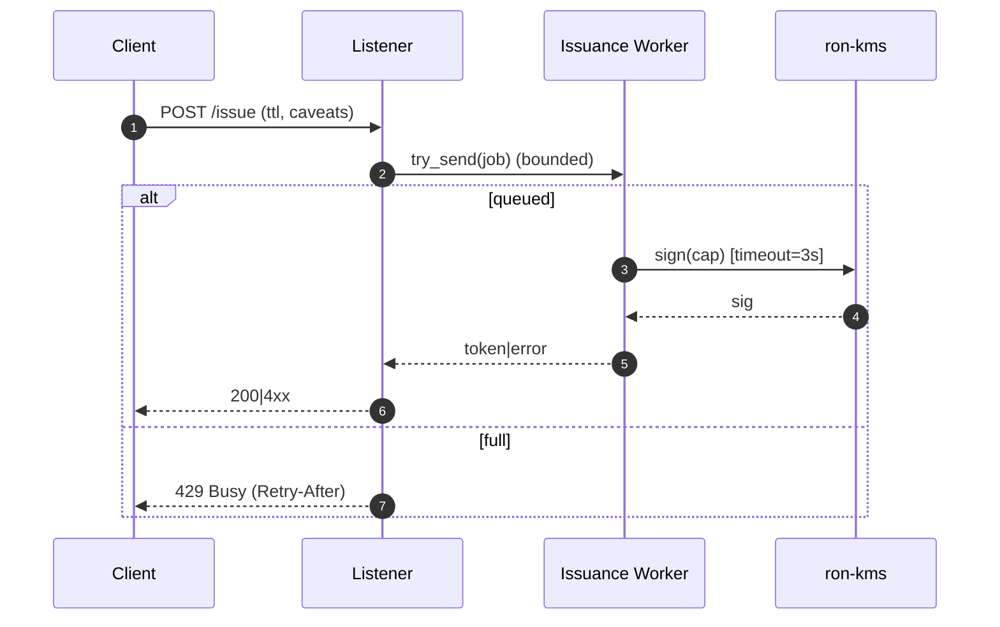
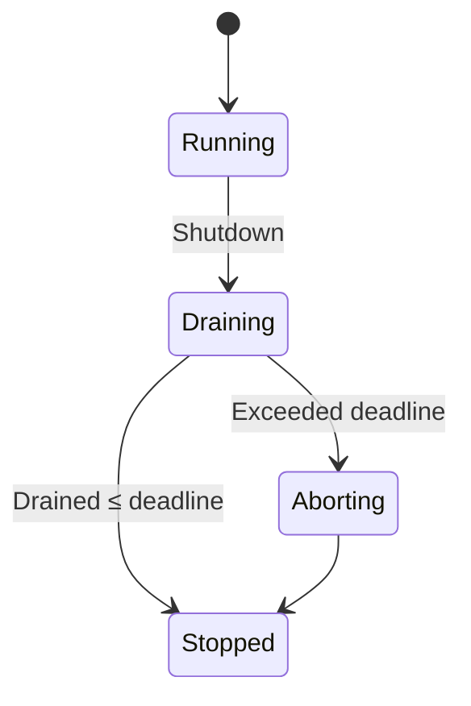
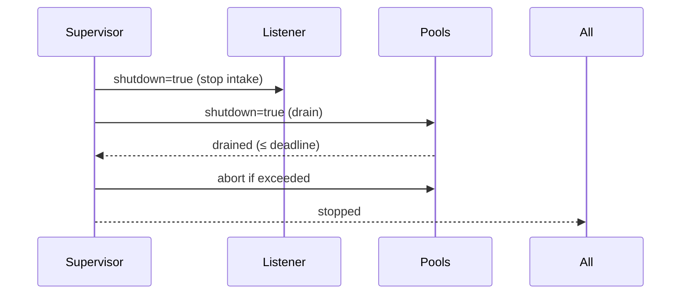
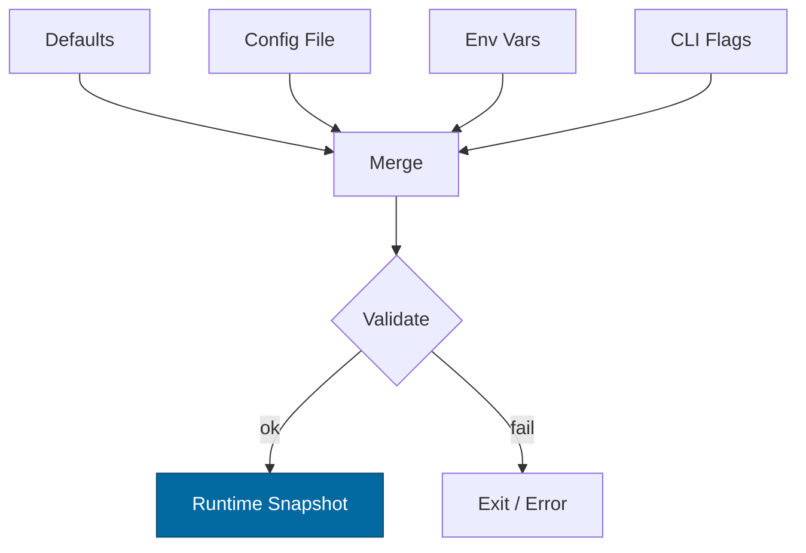

# Combined Markdown

_Source directory_: `crates/svc-passport/docs`  
_Files combined_: 12  
_Recursive_: 0

---

### Table of Contents

- API.MD
- CONCURRENCY.MD
- CONFIG.MD
- GOVERNANCE.MD
- IDB.md
- INTEROP.MD
- OBSERVABILITY.MD
- PERFORMANCE.MD
- QUANTUM.MD
- RUNBOOK.MD
- SECURITY.MD
- TESTS.MD

---

## API.MD
_File 1 of 12_

````markdown
---
title: API Surface & SemVer Reference — svc-passport
status: draft
msrv: 1.80.0
last-updated: 2025-10-09
audience: contributors, auditors, API consumers
---

# API.md — svc-passport

## 0. Purpose

This document captures the **public API surface** of `svc-passport`:

- Snapshot of exported **Rust** symbols (if any) and the **HTTP surface**.
- SemVer discipline for both **Rust** and **HTTP** (path/DTO/versioning).
- CHANGELOG alignment and CI gates (`cargo public-api`, OpenAPI diff).
- “Spec you can build to” for integrators, with examples and error model.

> `svc-passport` is primarily a **service crate** (bin-first). The authoritative integration surface is **HTTP**; the **Rust** surface is intentionally minimal.

---

## 1. Public API Surface

### 1.1 Rust surface (crate `svc-passport`)

`svc-passport` ships as a binary. A tiny `lib.rs` may exist for testing, but **no stable Rust API is guaranteed** to external users. CI still snapshots any public items to prevent accidental exposure.

Generate via:

```bash
cargo public-api -p svc-passport --simplified --deny-changes
````

#### Current Surface (expected)

```text
# Binary crate: no stable public Rust items intended for external use.
# If present (internal-use only, guarded by #[doc(hidden)]):
pub fn run() -> impl Future<Output = anyhow::Result<()>>   # NOT STABLE
pub mod metrics                                            # NOT STABLE
```

> If any new public items appear, CI will fail until they are **documented here** and acknowledged in CHANGELOG.

---

### 1.2 HTTP surface (stable contract)

Base URL: internal cluster via `svc-gateway`
Versioned path prefix: **/v1**
Content-Type: `application/json; charset=utf-8`
Authn: caller must be **trusted upstream** (e.g., via gateway policy/MTLS).
Rate/size: governed by config (RPS, inflight, body cap, ratio cap).

#### Endpoints

1. **POST /v1/passport/issue** — mint a capability token

* **Request**

  ```json
  {
    "subject_ref": "opaque-user-or-service-handle",
    "audience": "svc-mailbox",
    "ttl_s": 900,
    "caveats": [
      "svc=svc-mailbox",
      "route=/mailbox/send",
      "budget.bytes=1048576",
      "rate.rps=5"
    ],
    "accept_algs": ["ed25519+ml-dsa","ed25519"],
    "proof": null
  }
  ```
* **Response 200**

  ```json
  {
    "token": "base64url(...)",       // macaroon-style envelope (opaque)
    "kid": "issuer-v1",
    "alg": "ed25519+ml-dsa",
    "exp": "2025-10-09T14:30:00Z",
    "caveats": ["svc=svc-mailbox","route=/mailbox/send","budget.bytes=1048576","rate.rps=5"]
  }
  ```
* **Common 4xx**

  * `400` `{"reason":"ttl_too_long"}` (exceeds policy)
  * `400` `{"reason":"unknown_caveat"}` (not in registry)
  * `400` `{"reason":"no_acceptable_alg"}` (PQ negotiation)
  * `413` `{"reason":"over_limit"}` (body cap)
  * `429` `{"reason":"busy","retry_after":2}`
* **5xx**

  * `504` `{"reason":"kms_timeout"}`
  * `503` `{"reason":"degraded"}` (readiness shed)

2. **POST /v1/passport/verify** — non-authoritative preflight decode/echo

* **Request**

  ```json
  {"token":"base64url(...)"}
  ```
* **Response 200**

  ```json
  {
    "ok": true,
    "parsed": {
      "alg": "ed25519+ml-dsa",
      "kid": "issuer-v1",
      "epoch": 42,
      "aud": "svc-mailbox",
      "sub": "opaque-subject",
      "exp": "2025-10-09T14:30:00Z",
      "caveats": ["svc=svc-mailbox","route=/mailbox/send","budget.bytes=1048576","rate.rps=5"]
    }
  }
  ```

> **Note:** Authoritative verification is in **`ron-auth`**. This endpoint is a diagnostic/preflight convenience for integrators.

3. **POST /v1/passport/revoke** — revoke via epoch/key policy

* **Request**

  ```json
  {"epoch": 43, "reason": "compromise"}  // or {"kid":"issuer-v2", "reason":"rotation"}
  ```
* **Response 200**

  ```json
  {"current_epoch": 43}
  ```

4. **GET /healthz** — liveness
5. **GET /readyz** — readiness (issuance may fail-closed while verify preflight stays OK)
6. **GET /metrics** — Prometheus text

#### Error envelope (all 4xx/5xx)

```json
{
  "reason": "ttl_too_long | unknown_caveat | no_acceptable_alg | kms_timeout | degraded | busy | over_limit | ratio_cap",
  "message": "human-friendly diagnostic",
  "corr_id": "ULID"
}
```

#### Headers

* `X-Corr-ID`: correlation id (ingest or generate)
* `Retry-After`: on `429` or `503` (seconds)
* `Cache-Control: no-store`

---

## 2. SemVer Discipline

We treat **Rust** and **HTTP** surfaces distinctly.

### 2.1 Rust (binary-first)

* **Breaking (Major)**: expose/remove/rename public items; change signatures/types/traits.
* **Additive (Minor)**: add new `pub` items marked `#[non_exhaustive]` where applicable.
* **Patch**: impl/behavioral changes without public surface change.

> Default stance: **no stable Rust API**. If exporting helpers for tests, hide under `#[doc(hidden)]` and feature flags.

### 2.2 HTTP (path + DTOs)

* **Path versioning**: `/v1/...` is the stable contract for DTOs and semantics.
* **Additive (Non-breaking)**:

  * Add **optional** request fields with defaults.
  * Add response fields (consumers must ignore unknown fields).
  * Add new caveat families in registry (issuance still clamps to policy).
* **Breaking (Requires `/v2`)**:

  * Remove or rename fields without aliases.
  * Change field semantics or types incompatibly.
  * Tighten defaults in a way that rejects previously valid conformant requests (outside policy config).
* **Policy-driven changes**:

  * Changing **default alg** set, rotation cadence, or PQ rollout **does not** change HTTP version if DTOs unchanged; must be announced via `svc-registry` policy and CHANGELOG.

---

## 3. Stability Guarantees

* **MSRV**: 1.80.0.
* DTOs: `#[serde(deny_unknown_fields)]` for requests; responses may gain fields (consumers must ignore unknowns).
* Unsafe code: forbidden unless explicitly justified and reviewed.
* Tokens are **opaque** strings; envelope structure may evolve behind the stable contract fields (`alg`, `kid`, `exp`, `caveats` advertised).
* **No** durable PII fields exist; `subject_ref` is opaque and caller-provided.

---

## 4. Invariants (API-aligned)

* Issued artifacts are **capability tokens** with **short TTLs**; max TTL enforced by policy.
* Keys live in **`ron-kms`**; this service never exposes key material.
* PQ-hybrid negotiation via `accept_algs`; explicit `no_acceptable_alg` on mismatch (no silent downgrade).
* Revocation via **epoch bump**; propagation SLO ≤ 5s p99 is observable (metrics).

---

## 5. Tooling

### 5.1 Rust surface

```bash
cargo public-api -p svc-passport --simplified --deny-changes
```

Artifacts:

* Store snapshots in `docs/api-history/svc-passport/<version>.txt`.

### 5.2 HTTP surface

* `docs/openapi/svc-passport.v1.yaml` generated & linted.

**Generate (for maintainers using oas tooling):**

```bash
npx @redocly/cli lint docs/openapi/svc-passport.v1.yaml
```

**Diff on PRs:**

```bash
npx openapi-diff docs/openapi/svc-passport.v1.yaml origin/main:docs/openapi/svc-passport.v1.yaml
```

---

## 6. CI & Gates

* **cargo-public-api**: fails PR if Rust surface changes without doc/CHANGELOG updates.
* **OpenAPI lint/diff**: PR fails if spec drifts versus main.
* **Docs-sync**: DTO structs ↔ OpenAPI schema checked by script (field parity).
* **SemVer checks** (optional): `cargo semver-checks` job for library surfaces.

---

## 7. Acceptance Checklist (Definition of Done)

* [ ] Current Rust API snapshot generated & committed under `docs/api-history/...`.
* [ ] `docs/openapi/svc-passport.v1.yaml` updated; lints pass.
* [ ] CHANGELOG updated for any surface-affecting change.
* [ ] Integration examples (`curl`) updated.
* [ ] CI gates green (`cargo public-api`, OpenAPI diff).
* [ ] For breaking HTTP changes, a **/v2** path is introduced with migration notes.

---

## 8. OpenAPI (excerpt, normative for integrators)

```yaml
openapi: 3.0.3
info:
  title: svc-passport API
  version: "1.0.0"
servers:
  - url: https://gateway.internal
paths:
  /v1/passport/issue:
    post:
      summary: Mint a capability token
      operationId: issuePassport
      requestBody:
        required: true
        content:
          application/json:
            schema:
              type: object
              required: [subject_ref, audience, ttl_s]
              additionalProperties: false
              properties:
                subject_ref: { type: string, minLength: 1 }
                audience: { type: string, pattern: "^svc-[a-z0-9-]+$" }
                ttl_s: { type: integer, minimum: 1 }
                caveats:
                  type: array
                  items: { type: string }
                accept_algs:
                  type: array
                  items: { type: string, enum: [ed25519, ed25519+ml-dsa] }
                proof:
                  nullable: true
      responses:
        "200":
          description: Capability minted
          content:
            application/json:
              schema:
                type: object
                required: [token, kid, alg, exp]
                additionalProperties: false
                properties:
                  token: { type: string }
                  kid: { type: string }
                  alg: { type: string }
                  exp: { type: string, format: date-time }
                  caveats:
                    type: array
                    items: { type: string }
        "400":
          $ref: "#/components/responses/BadRequest"
        "413":
          $ref: "#/components/responses/OverLimit"
        "429":
          $ref: "#/components/responses/Busy"
        "503":
          $ref: "#/components/responses/Degraded"
        "504":
          $ref: "#/components/responses/UpstreamTimeout"

  /v1/passport/verify:
    post:
      summary: Preflight decode/echo (non-authoritative)
      operationId: verifyPassport
      requestBody:
        required: true
        content:
          application/json:
            schema:
              type: object
              required: [token]
              additionalProperties: false
              properties:
                token: { type: string }
      responses:
        "200":
          description: Parsed view
          content:
            application/json:
              schema:
                type: object
                required: [ok, parsed]
                properties:
                  ok: { type: boolean }
                  parsed:
                    type: object
                    properties:
                      alg: { type: string }
                      kid: { type: string }
                      epoch: { type: integer }
                      aud: { type: string }
                      sub: { type: string }
                      exp: { type: string, format: date-time }
                      caveats:
                        type: array
                        items: { type: string }
        "400":
          $ref: "#/components/responses/BadRequest"

  /v1/passport/revoke:
    post:
      summary: Revoke via epoch/key policy
      operationId: revokePassport
      requestBody:
        required: true
        content:
          application/json:
            schema:
              oneOf:
                - type: object
                  required: [epoch]
                  properties:
                    epoch: { type: integer, minimum: 0 }
                    reason: { type: string }
                - type: object
                  required: [kid]
                  properties:
                    kid: { type: string }
                    reason: { type: string }
      responses:
        "200":
          description: Current epoch after update
          content:
            application/json:
              schema:
                type: object
                required: [current_epoch]
                properties:
                  current_epoch: { type: integer }

components:
  responses:
    BadRequest:
      description: Validation error
      content:
        application/json:
          schema:
            $ref: "#/components/schemas/Error"
    Busy:
      description: Backpressure
      headers:
        Retry-After:
          schema: { type: integer }
      content:
        application/json:
          schema: { $ref: "#/components/schemas/Error" }
    OverLimit:
      description: Payload too large or ratio cap
      content:
        application/json:
          schema: { $ref: "#/components/schemas/Error" }
    Degraded:
      description: Service degraded; issuance shed
      content:
        application/json:
          schema: { $ref: "#/components/schemas/Error" }
    UpstreamTimeout:
      description: Timeout while contacting KMS/Registry
      content:
        application/json:
          schema: { $ref: "#/components/schemas/Error" }

  schemas:
    Error:
      type: object
      required: [reason]
      additionalProperties: false
      properties:
        reason:
          type: string
          enum:
            - ttl_too_long
            - unknown_caveat
            - no_acceptable_alg
            - kms_timeout
            - degraded
            - busy
            - over_limit
            - ratio_cap
        message: { type: string }
        corr_id: { type: string }
security: []
```

> The full OpenAPI spec lives at `docs/openapi/svc-passport.v1.yaml` and MUST be kept in sync with DTO code and this document.

---

## 9. Examples

### 9.1 Mint a token

```bash
curl -sS -X POST http://localhost:8080/v1/passport/issue \
  -H "Content-Type: application/json" \
  -H "X-Corr-ID: 01J9XYZABCDEF" \
  -d '{
    "subject_ref":"sub-abc123",
    "audience":"svc-mailbox",
    "ttl_s":900,
    "caveats":["svc=svc-mailbox","route=/mailbox/send","budget.bytes=1048576","rate.rps=5"],
    "accept_algs":["ed25519+ml-dsa","ed25519"]
  }'
```

### 9.2 Revoke by epoch

```bash
curl -sS -X POST http://localhost:8080/v1/passport/revoke \
  -H "Content-Type: application/json" \
  -d '{"epoch":43,"reason":"compromise"}'
```

### 9.3 Verify (preflight)

```bash
curl -sS -X POST http://localhost:8080/v1/passport/verify \
  -H "Content-Type: application/json" \
  -d '{"token":"<opaque>"}'
```

---

## 10. History (selected)

* **v1.0.0** — Initial `/v1` with `issue`, `verify`, `revoke`. PQ negotiation via `accept_algs`. Error reasons standardized.

(Record future notable shifts here: new caveat families, response field additions, etc.)

---

## 11. Perfection Gates tie-in

* **Gate G:** No undocumented API (Rust or HTTP).
* **Gate H:** Breaking changes require **major** (Rust) or **/v2** (HTTP).
* **Gate J:** CHANGELOG entry required when public surface diff exists.
* **Gate K:** OpenAPI and DTOs **must** match (CI docs-sync).

---

```
```


---

## CONCURRENCY.MD
_File 2 of 12_

---

title: Concurrency Model — svc-passport
crate: svc-passport
owner: Stevan White
last-reviewed: 2025-10-09
status: draft
template_version: 1.1
msrv: 1.80.0
tokio: "1.x (pinned at workspace root)"
loom: "0.7+ (dev-only)"
lite_mode: "N/A (service crate)"
--------------------------------

# Concurrency Model — svc-passport

This document makes the concurrency rules **explicit**: tasks, channels, locks, shutdown, timeouts,
and validation (property/loom/TLA+). It complements `docs/SECURITY.md`, `docs/CONFIG.md`,
and the crate’s `README.md` and `IDB.md`.

> **Golden rule:** never hold a lock across `.await` in supervisory or hot paths.

---

## 0) Lite Mode

**N/A** — `svc-passport` is a service with background tasks.

---

## 1) Invariants (MUST)

* **I-1 — No lock across `.await`.** If unavoidable, split the critical section and pass owned data across the await point.
* **I-2 — Single writer per mutable resource.** Readers obtain snapshots; short read guards only.
* **I-3 — Bounded channels only.** All mpsc/broadcast are bounded with explicit overflow policy and metrics.
* **I-4 — Explicit timeouts.** All I/O (HTTP, KMS, registry, bus RPC) carry deadlines and convert to typed errors.
* **I-5 — Cancel-safe awaits.** Every `.await` is either cancel-safe or guarded by `select!` with shutdown/watch.
* **I-6 — Graceful shutdown.** Observe `Shutdown`; stop intake, drain within deadline, abort stragglers; readiness flips accordingly.
* **I-7 — No blocking in async.** Use `spawn_blocking` for rare CPU-bound or filesystem calls (e.g., PEM load), never on hot paths.
* **I-8 — No task leaks.** Track `JoinHandle`s in the supervisor; detach only for one-shot fire-and-forget with rationale.
* **I-9 — Backpressure over buffering.** Prefer early **Busy**/shed to deep buffers; expose drop counters.
* **I-10 — Framing & parse limits.** HTTP JSON bodies ≤ configured cap; strict deserialization with `deny_unknown_fields`.
* **I-11 — Async Drop policy.** No blocking in `Drop`; expose `async close()/shutdown()` for explicit teardown.

---

## 2) Runtime Topology

**Runtime:** Tokio multi-threaded (worker threads = CPU cores, bounded by workspace defaults).

**Primary tasks (by responsibility / criticality):**

1. **Supervisor** (critical)

   * Owns config snapshot, spawn/monitor children, receives `KernelEvent::Shutdown`.
   * Exposes `/readyz` flip logic based on child health and backpressure.

2. **HTTP Listener** (critical, intake)

   * Accepts requests on `bind_addr`; enforces body/time caps and converts to work units.
   * Pushes issuance/verify/revoke work into bounded queues; returns `202|200` or `429|413|5xx`.

3. **Issuance Worker Pool (N=M)** (critical, CPU-light)

   * Consumes issuance jobs; applies policy, calls KMS sign with timeout; returns token or typed error.
   * Size defaults to min(available cores, 8); dynamically bounded by inflight/backpressure.

4. **Revocation Worker** (high)

   * Processes revoke requests; rotates epoch via KMS and publishes bus events.

5. **Bus Subscriber** (medium)

   * Subscribes to revocation/policy updates; updates local verify/epoch cache (RAM-only in Micronode).

6. **Registry Sync** (medium)

   * Periodically fetches signed issuer/alg policy descriptors; jittered schedule; updates local snapshot.

7. **Config Watcher** (medium)

   * Reacts to SIGHUP or `ConfigUpdated` bus events; rebuilds snapshot; triggers controlled rebinds if needed.

8. **Metrics/Health Exporter** (supporting)

   * Serves `/metrics`, `/healthz`, `/readyz` on `metrics_addr`.

```mermaid
flowchart TB
  subgraph Runtime
    SUP[Supervisor] -->|spawn| HTTP[HTTP Listener]
    SUP -->|spawn| ISS[Issuance Pool]
    SUP -->|spawn| REV[Revocation Worker]
    SUP -->|spawn| BUS[Bus Subscriber]
    SUP -->|spawn| REG[Registry Sync]
    SUP -->|spawn| CFG[Config Watcher]
    HTTP -->|mpsc(work)| ISS
    HTTP -->|mpsc(revoke)| REV
    BUS -->|broadcast(policy/epoch)| ISS
    REG -->|watch/update| SUP
    SUP -->|watch Shutdown| HTTP
    SUP -->|watch Shutdown| ISS
    SUP -->|watch Shutdown| REV
    SUP -->|watch Shutdown| BUS
    SUP -->|watch Shutdown| REG
    SUP -->|watch Shutdown| CFG
  end
  style SUP fill:#0ea5e9,stroke:#0c4a6e,color:#fff
```

**Text diagram:** Supervisor spawns Listener, Pools, and system daemons; listener feeds bounded mpsc queues to workers; subscribers feed read-only updates; all children observe a shutdown `watch`.

---

## 3) Channels & Backpressure

**Inventory (all bounded):**

| Name          | Kind       | Capacity | Producers → Consumers | Backpressure Policy                    | Drop Semantics                          |
| ------------- | ---------- | -------: | --------------------- | -------------------------------------- | --------------------------------------- |
| `issue_tx`    | mpsc       |      512 | HTTP → Issuance Pool  | `try_send` → return `Busy` (HTTP 429)  | `queue_dropped_total{queue="issue"}`++  |
| `revoke_tx`   | mpsc       |      256 | HTTP → Revoke Worker  | `try_send` → `Busy`                    | `queue_dropped_total{queue="revoke"}`++ |
| `policy_tx`   | broadcast  |     1024 | Bus/Registry → N subs | lag counter; drop-oldest for slow subs | `bus_lagged_total`++, warn log          |
| `shutdown_rx` | watch      |        1 | Supervisor → N        | last-write-wins                        | N/A                                     |
| `ready_gauge` | gauge feed |        — | Workers → Health      | sample depth (not a queue)             | N/A                                     |

**Guidelines:**

* Accept/Reject decisions made at **ingress** to keep queues shallow.
* HTTP emits `429 Too Many Requests` with `Retry-After` when `try_send` fails.
* Record `queue_depth{issue|revoke}` gauges (sampled) and per-queue drop counters.

---

## 4) Locks & Shared State

**Allowed**

* Short-lived `Mutex/RwLock` around **small metadata** (policy snapshot pointer swap), never held across `.await`.
* **Copy-on-write snapshots**: `Arc<PolicySnapshot>` swapped atomically on updates.
* Per-request ephemeral state lives in task-local stack, not shared.

**Forbidden**

* Holding any lock over KMS/registry/HTTP `.await`.
* Nested locks without an explicit hierarchy.

**Hierarchy (if ever needed)**

1. `policy_meta` (outer)
2. `issuer_epoch` (inner)
3. `counters` (innermost)

*(But prefer snapshot swapping to avoid nested locks altogether.)*

---

## 5) Timeouts, Retries, Deadlines

* **HTTP I/O:** `read=5s`, `write=5s`, `idle=60s` (configurable). Body cap ≤ `1MiB` by default.
* **KMS RPC:** deadline = `kms.timeout` (default 3s). **No implicit retries** on sign; callers may retry issuance idempotently with jitter (50–100ms, cap 2s, max 3).
* **Registry fetch:** deadline = `registry.timeout` (default 3s). Retry with backoff on transient network failures.
* **Bus publish/subscribe:** non-blocking; slow consumers observed via lag counters.
* **Circuit breaker (optional):** open KMS path on p95 latencies breaching SLO for 60s; half-open probes thereafter.



---

## 6) Cancellation & Shutdown

* **Signal source:** `KernelEvent::Shutdown` or `wait_for_ctrl_c()`.
* **Propagation:** `watch::Sender<bool>` set to `true`; tasks `select!` on `shutdown_rx.changed()` alongside work.
* **Draining sequence:**

  1. **Stop intake**: Listener rejects new work (`503/429`) and sets `/readyz` **Not Ready** for issuance path (verification preflight may remain OK).
  2. **Drain deadline**: configurable (default 3–5s). Workers finish in-flight jobs.
  3. **Abort stragglers**: `JoinHandle::abort()` and increment `tasks_aborted_total{kind}`.
* **Idempotency:** Double-shutdown signals are benign.



---

## 7) I/O & Framing

* **Transport:** HTTP/1.1 (axum/hyper) + JSON DTOs with `#[serde(deny_unknown_fields)]`.
* **Maximums:** Request body ≤ `limits.max_body_bytes`; reject compressed payloads exceeding `decompress_ratio_cap`.
* **Partial reads:** handled by hyper; ensure `.shutdown().await` on connection close when applicable.
* **Integrity:** KMS responses validated by type; token envelope length-checked before encode.

---

## 8) Error Taxonomy (Concurrency-Relevant)

| Error       | When                        | Retry?       | Metric                               | Notes                                  |
| ----------- | --------------------------- | ------------ | ------------------------------------ | -------------------------------------- |
| `Busy`      | mpsc full on `try_send`     | yes (client) | `busy_rejections_total{endpoint}`    | Include `Retry-After`                  |
| `Timeout`   | I/O deadline exceeded       | maybe        | `io_timeouts_total{op}`              | `op` = `read`/`write`/`kms`/`registry` |
| `Canceled`  | shutdown while awaiting     | no           | `tasks_canceled_total{kind}`         | cooperative cancellation               |
| `Lagging`   | broadcast overflow/slow sub | no           | `bus_lagged_total`                   | log subscriber identity if safe        |
| `OverLimit` | body/ratio cap exceeded     | no           | `rejects_total{reason="over_limit"}` | HTTP 413 / 400                         |

---

## 9) Metrics (Concurrency Health)

* `queue_depth{queue}` gauge (sampled)
* `queue_dropped_total{queue}` counter
* `busy_rejections_total{endpoint}` counter
* `tasks_spawned_total{kind}` / `tasks_aborted_total{kind}` counters
* `io_timeouts_total{op}` counter
* `backoff_retries_total{op}` counter
* `bus_lagged_total` counter
* `config_reload_duration_seconds` histogram (reload path)
* `config_reloads_total`, `config_reload_errors_total` counters

---

## 10) Validation Strategy

**Unit / Property**

* Backpressure: enqueue up to cap, ensure `try_send` fails with `Busy` and increments drop metrics.
* Deadlines: operations exceed `timeout` → typed `Timeout` within ±50ms tolerance.
* Lock discipline: static lint (`clippy::await_holding_lock`), plus runtime assertions in debug builds.

**Loom (dev-only)**

* **Model:** one producer (listener) → bounded mpsc → one consumer (worker); a `watch` shutdown flips.
* **Asserts:** no deadlock, no unobserved shutdown, no missed job finalization, no double drop of job resources.

**Fuzz**

* DTO fuzz (unknown fields, boundary sizes).
* Ratio-cap fuzz for compressed payloads (if enabled).

**Chaos**

* Kill a worker under load; supervisor restarts with jittered backoff; `/readyz` shows partial degradation then recovery.
* Stall the registry/KMS endpoints to test breaker and timeouts.

**TLA+ (optional)**

* Token issuance state machine: prove **safety** (no mint without policy snapshot) and **liveness** (jobs drain under finite failures).

---

## 11) Code Patterns (Copy-Paste)

**Spawn + cooperative shutdown**

```rust
let (shutdown_tx, mut shutdown_rx) = tokio::sync::watch::channel(false);
let (work_tx, mut work_rx) = tokio::sync::mpsc::channel(512);

let worker = tokio::spawn(async move {
  loop {
    tokio::select! {
      _ = shutdown_rx.changed() => break,
      maybe_job = work_rx.recv() => {
        let Some(job) = maybe_job else { break };
        if let Err(err) = handle_issue(job).await {
          tracing::warn!(%err, "issuance failed");
        }
      }
    }
  }
});
/* ... later ... */
// shutdown_tx.send(true).ok();
// let _ = worker.await;
```

**Bounded mpsc with `try_send`**

```rust
match work_tx.try_send(job) {
  Ok(_) => {}
  Err(tokio::sync::mpsc::error::TrySendError::Full(_)) => {
    metrics::busy_rejections_total().with_label_values(&["/v1/passport/issue"]).inc();
    return Err(Error::Busy);
  }
  Err(e) => return Err(Error::Queue(e.to_string())),
}
```

**Timeout with deadline**

```rust
let res = tokio::time::timeout(cfg.kms.timeout, kms.sign(cap_bytes)).await;
let sig = res.map_err(|_| Error::Timeout("kms"))??;
```

**No lock across `.await`**

```rust
let snapshot = {
  let g = policy_meta.read();     // cheap, short
  g.current_snapshot.clone()
}; // drop guard before awaiting
let token = issue_with_snapshot(snapshot, req).await?;
```

**Async Drop pattern**

```rust
pub struct Client { inner: Option<Conn> }

impl Client {
  pub async fn close(&mut self) -> anyhow::Result<()> {
    if let Some(mut c) = self.inner.take() {
      c.shutdown().await.ok();
    }
    Ok(())
  }
}

impl Drop for Client {
  fn drop(&mut self) {
    if self.inner.is_some() {
      tracing::debug!("Client dropped without close(); reclaimed non-blockingly");
    }
  }
}
```

**Jittered backoff**

```rust
let mut delay = std::time::Duration::from_millis(50);
for _ in 0..3 {
  if try_op().await.is_ok() { break; }
  tokio::time::sleep(delay + rand::rng().random_range(0..50).into()).await;
  delay = std::cmp::min(delay * 2, std::time::Duration::from_secs(2));
}
```

---

## 12) Configuration Hooks (Quick Reference)

* `limits.rps`, `limits.inflight` → sheds at ingress; worker pool sizes respect inflight.
* `read_timeout`, `write_timeout`, `idle_timeout` → HTTP I/O.
* `kms.timeout`, `registry.timeout` → RPC deadlines.
* `drain_deadline` (service-level; default 3–5s) → graceful shutdown bound.
* `issuer_policy.*`, `pq.mode` → do **not** require restart; snapshot-swap safe.

See `docs/CONFIG.md` for authoritative schema.

---

## 13) Known Trade-offs / Nonstrict Areas

* **Drop-oldest vs reject-new** for broadcast subscribers: we drop oldest to keep latest policy visible; slow subscribers receive lag warnings.
* **No retries on KMS sign**: favors idempotency and budget caveats; caller may retry; we avoid queue amplification.
* **Graceful verify preflight**: on heavy load, issuance sheds while verification preflight remains up (readiness split-brain avoided via separate checks).

---

## 14) Mermaid Diagrams

### 14.1 Task & Queue Topology

```mermaid
flowchart LR
  IN[HTTP Ingress] -->|mpsc:issue(512)| W1[Issuance A]
  IN -->|mpsc:issue(512)| W2[Issuance B]
  IN -->|mpsc:revoke(256)| RV[Revoker]
  subgraph Control
    SHUT[Shutdown watch] --> W1
    SHUT --> W2
    SHUT --> RV
  end
```

**Text:** Ingress feeds two issuance workers and one revoker via bounded mpsc queues; a shutdown watch signals all workers.

### 14.2 Shutdown Sequence



---

## 15) CI & Lints (Enforcement)

**Clippy / Rustflags**

* `-D warnings`
* `-W clippy::await_holding_lock`
* `-W clippy::needless_collect`
* `-W clippy::useless_async`

**GitHub Actions suggestion**

```yaml
name: svc-passport-concurrency-guardrails
on: [push, pull_request]
jobs:
  clippy:
    runs-on: ubuntu-latest
    steps:
      - uses: actions/checkout@v4
      - uses: dtolnay/rust-toolchain@stable
      - run: cargo clippy -p svc-passport -- -D warnings -W clippy::await_holding_lock

  loom:
    if: github.event_name == 'pull_request'
    runs-on: ubuntu-latest
    steps:
      - uses: actions/checkout@v4
      - uses: dtolnay/rust-toolchain@stable
      - name: Run Loom tests (ignored)
        run: RUSTFLAGS="--cfg loom" cargo test -p svc-passport --tests -- --ignored

  fuzz:
    runs-on: ubuntu-latest
    steps:
      - uses: actions/checkout@v4
      - uses: dtolnay/rust-toolchain@stable
      - run: cargo install cargo-fuzz
      - run: cargo fuzz build -p svc-passport
```

---

## 16) Schema Generation (Optional)

Automate **Channels/Locks** tables from code:

* Annotate declarations (doc comments or attributes), or keep a tiny `concurrency_registry.rs`.
* Golden test compares generated table to doc to prevent rot.

Example annotation:

```rust
/// @channel name=issue kind=mpsc cap=512 policy=try_send
let (issue_tx, issue_rx) = tokio::sync::mpsc::channel(512);
```

---

## 17) Review & Maintenance

* **Cadence:** review every 90 days, or with any change to tasks/channels/locks/limits.
* **Keep header fields current** (`owner`, `msrv`, `last-reviewed`).
* **PR checklist:** if you modify concurrency, update this file **and** add/adjust Loom/property tests.

---


---

## CONFIG.MD
_File 3 of 12_

---

title: Configuration — svc-passport
crate: svc-passport
owner: Stevan White
last-reviewed: 2025-10-09
status: draft
template_version: 1.1
---------------------

# Configuration — svc-passport

This document defines **all configuration** for `svc-passport`, including sources,
precedence, schema (types/defaults), validation, feature flags, live-reload behavior,
and security implications. It complements `README.md`, `docs/SECURITY.md`, and the IDB.

> **Tiering:**
> **Service crate** — all sections apply (network, readiness, observability, etc.).
> Verification is performed by `ron-auth`; keys are custodied by `ron-kms`.
> **Micronode/Macronode parity:**
>
> * Micronode defaults: `amnesia.enabled=true`, `pq.mode="mirror"`, `limits.rps=300`, `limits.inflight=256`.
> * Macronode defaults: `amnesia.enabled=false` (unless mandated), `pq.mode="mirror"`, `limits.rps>=500`, `limits.inflight>=512`.
> * Both expose identical keys; only defaults differ by profile.

---

## 1) Sources & Precedence (Authoritative)

Configuration may come from multiple sources. **Precedence (highest wins):**

1. **Process flags** (CLI)
2. **Environment variables**
3. **Config file** (`Config.toml` beside the binary or provided via `--config`)
4. **Built-in defaults** (compiled)

When reloading dynamically, the effective config is recomputed under the same precedence.

**Supported file formats:** TOML (preferred), JSON (optional).
**Path resolution order for `--config` (if relative):** `./`, `$CWD`, crate dir.

> **Note:** During reload, the system re-parses the file on disk, re-reads the environment,
> and re-applies CLI flag overrides (if managed by the supervisor) before recomputing the snapshot.

---

## 2) Quickstart Examples

### 2.1 Minimal service start

```bash
RUST_LOG=info \
SVC_PASSPORT_BIND_ADDR=0.0.0.0:8080 \
SVC_PASSPORT_METRICS_ADDR=127.0.0.1:0 \
cargo run -p svc-passport
```

### 2.2 Config file (TOML)

```toml
# Config.toml
bind_addr     = "0.0.0.0:8080"
metrics_addr  = "127.0.0.1:0"
max_conns     = 1024
read_timeout  = "5s"
write_timeout = "5s"
idle_timeout  = "60s"

[limits]
max_body_bytes       = "1MiB"
decompress_ratio_cap = 10
rps                  = 500
inflight             = 512

[tls]
enabled   = false
# cert_path = "/etc/ron/cert.pem"
# key_path  = "/etc/ron/key.pem"

[amnesia]
enabled = true

[pq]
mode = "mirror"       # mirror|require|enforce|off

[issuer_policy]
max_ttl       = "1h"
default_ttl   = "15m"
rotation_days = 30
grace         = "10m"  # overlap window for epoch rotation
alg_set       = ["ed25519", "ed25519+ml-dsa"]

[caveats]
# Enable/disable standard caveat families
enable_budget     = true
enable_rate       = true
enable_route      = true
enable_region     = true
max_budget_bytes  = "1MiB"
max_budget_reqs   = 100
max_rate_rps      = 5

[registry]
endpoint = "http://127.0.0.1:7700"  # svc-registry API/base
timeout  = "3s"

[kms]
# opaque key/issuer identifiers resolved by ron-kms
issuer_kid   = "issuer-v1"
signer_label = "passport-mint"
timeout      = "3s"

[uds]
path       = ""   # e.g., "/var/run/svc-passport.sock"
allow_uids = []   # [1000, 1001]

[log]
format = "json"   # json|text
level  = "info"   # trace|debug|info|warn|error

[readiness]
# When under pressure, deny issuance but keep verification preflight available.
shed_issue_on_high_load = true
```

### 2.3 CLI flags (override file/env)

```bash
cargo run -p svc-passport -- \
  --bind 0.0.0.0:8080 \
  --metrics 127.0.0.1:0 \
  --max-conns 2048 \
  --pq-mode require \
  --amnesia
```

---

## 3) Schema (Typed, With Defaults)

> **Prefix convention:** All env vars begin with `SVC_PASSPORT_`.
> **Durations** accept `s`, `ms`, `m`, `h`. **Sizes** accept `B`, `KB`, `MB`, `MiB`.

| Key / Env Var                                                           | Type                | Default                        | Description                                                            | Security Notes                     |         |                                 |                               |                       |
| ----------------------------------------------------------------------- | ------------------- | ------------------------------ | ---------------------------------------------------------------------- | ---------------------------------- | ------- | ------------------------------- | ----------------------------- | --------------------- |
| `bind_addr` / `SVC_PASSPORT_BIND_ADDR`                                  | socket              | `127.0.0.1:0`                  | HTTP ingress bind address                                              | Public binds require threat review |         |                                 |                               |                       |
| `metrics_addr` / `SVC_PASSPORT_METRICS_ADDR`                            | socket              | `127.0.0.1:0`                  | Prometheus metrics bind                                                | Prefer localhost scrape            |         |                                 |                               |                       |
| `max_conns` / `SVC_PASSPORT_MAX_CONNS`                                  | u32                 | `1024`                         | Max concurrent connections                                             | Prevent FD exhaustion              |         |                                 |                               |                       |
| `read_timeout` / `SVC_PASSPORT_READ_TIMEOUT`                            | duration            | `5s`                           | Per-request read timeout                                               | DoS mitigation                     |         |                                 |                               |                       |
| `write_timeout` / `SVC_PASSPORT_WRITE_TIMEOUT`                          | duration            | `5s`                           | Per-request write timeout                                              | DoS mitigation                     |         |                                 |                               |                       |
| `idle_timeout` / `SVC_PASSPORT_IDLE_TIMEOUT`                            | duration            | `60s`                          | Keep-alive idle shutdown                                               | Resource hygiene                   |         |                                 |                               |                       |
| `limits.max_body_bytes` / `SVC_PASSPORT_MAX_BODY_BYTES`                 | size                | `1MiB`                         | Request payload cap                                                    | Zip-bomb guard                     |         |                                 |                               |                       |
| `limits.decompress_ratio_cap` / `SVC_PASSPORT_DECOMPRESS_RATIO_CAP`     | u32                 | `10`                           | Max decompression ratio                                                | Zip-bomb guard                     |         |                                 |                               |                       |
| `limits.rps` / `SVC_PASSPORT_RPS`                                       | u32                 | `500`                          | Shed requests above this rate (per instance)                           | Backpressure                       |         |                                 |                               |                       |
| `limits.inflight` / `SVC_PASSPORT_INFLIGHT`                             | u32                 | `512`                          | Concurrent inflight request ceiling                                    | Backpressure                       |         |                                 |                               |                       |
| `tls.enabled` / `SVC_PASSPORT_TLS_ENABLED`                              | bool                | `false`                        | Enable TLS                                                             | Use tokio-rustls only              |         |                                 |                               |                       |
| `tls.cert_path` / `SVC_PASSPORT_TLS_CERT_PATH`                          | path                | `""`                           | PEM cert path                                                          | Secrets on disk; perms 0600        |         |                                 |                               |                       |
| `tls.key_path` / `SVC_PASSPORT_TLS_KEY_PATH`                            | path                | `""`                           | PEM key path                                                           | Zeroize in memory                  |         |                                 |                               |                       |
| `uds.path` / `SVC_PASSPORT_UDS_PATH`                                    | path                | `""`                           | Unix Domain Socket path (optional)                                     | Dir 0700, sock 0600                |         |                                 |                               |                       |
| `uds.allow_uids` / `SVC_PASSPORT_UDS_ALLOW_UIDS`                        | list<u32>           | `[]`                           | PEERCRED allowlist                                                     | Strict control                     |         |                                 |                               |                       |
| `amnesia.enabled` / `SVC_PASSPORT_AMNESIA`                              | bool                | `false`                        | RAM-only mode (no persistent state)                                    | Disables disk persistence          |         |                                 |                               |                       |
| `pq.mode` / `SVC_PASSPORT_PQ_MODE`                                      | enum                | `"mirror"`                     | `off                                                                   | mirror                             | require | enforce` (hybrid rollout phase) | Interop risk if peers lack PQ |                       |
| `issuer_policy.max_ttl` / `SVC_PASSPORT_MAX_TTL`                        | duration            | `1h`                           | Cap for `ttl_s` on issuance                                            | Controls blast radius              |         |                                 |                               |                       |
| `issuer_policy.default_ttl` / `SVC_PASSPORT_DEFAULT_TTL`                | duration            | `15m`                          | Default TTL when unspecified                                           | Short-lived by design              |         |                                 |                               |                       |
| `issuer_policy.rotation_days` / `SVC_PASSPORT_ROTATION_DAYS`            | u16                 | `30`                           | Key/epoch rotation cadence                                             | Align with org policy              |         |                                 |                               |                       |
| `issuer_policy.grace` / `SVC_PASSPORT_ROTATION_GRACE`                   | duration            | `10m`                          | Overlap window where old+new epochs verify                             | Smooth rotation                    |         |                                 |                               |                       |
| `issuer_policy.alg_set` / `SVC_PASSPORT_ALG_SET`                        | list<string>        | `["ed25519","ed25519+ml-dsa"]` | Allowed alg families for minting                                       | Drives negotiation                 |         |                                 |                               |                       |
| `caveats.enable_budget` / `SVC_PASSPORT_CAVEAT_BUDGET`                  | bool                | `true`                         | Allow budget caveats                                                   |                                    |         |                                 |                               |                       |
| `caveats.enable_rate` / `SVC_PASSPORT_CAVEAT_RATE`                      | bool                | `true`                         | Allow rate caveats                                                     |                                    |         |                                 |                               |                       |
| `caveats.enable_route` / `SVC_PASSPORT_CAVEAT_ROUTE`                    | bool                | `true`                         | Allow route caveats                                                    |                                    |         |                                 |                               |                       |
| `caveats.enable_region` / `SVC_PASSPORT_CAVEAT_REGION`                  | bool                | `true`                         | Allow region caveats                                                   |                                    |         |                                 |                               |                       |
| `caveats.max_budget_bytes` / `SVC_PASSPORT_CAVEAT_MAX_BUDGET_BYTES`     | size                | `1MiB`                         | Upper bound for byte budgets minted                                    | Prevents overscoped caps           |         |                                 |                               |                       |
| `caveats.max_budget_reqs` / `SVC_PASSPORT_CAVEAT_MAX_BUDGET_REQS`       | u32                 | `100`                          | Upper bound for request budgets minted                                 |                                    |         |                                 |                               |                       |
| `caveats.max_rate_rps` / `SVC_PASSPORT_CAVEAT_MAX_RATE_RPS`             | u32                 | `5`                            | Upper bound for rate caveats                                           |                                    |         |                                 |                               |                       |
| `registry.endpoint` / `SVC_PASSPORT_REGISTRY_ENDPOINT`                  | url                 | `http://127.0.0.1:7700`        | svc-registry base URL                                                  | TLS/MTLS in prod                   |         |                                 |                               |                       |
| `registry.timeout` / `SVC_PASSPORT_REGISTRY_TIMEOUT`                    | duration            | `3s`                           | Registry client timeout                                                |                                    |         |                                 |                               |                       |
| `kms.issuer_kid` / `SVC_PASSPORT_KMS_ISSUER_KID`                        | string              | `"issuer-v1"`                  | Primary issuer key identifier (opaque to us)                           | Never log; rotate ≤ 30d            |         |                                 |                               |                       |
| `kms.signer_label` / `SVC_PASSPORT_KMS_SIGNER_LABEL`                    | string              | `"passport-mint"`              | Label/handle for KMS signing context                                   |                                    |         |                                 |                               |                       |
| `kms.timeout` / `SVC_PASSPORT_KMS_TIMEOUT`                              | duration            | `3s`                           | KMS client timeout                                                     |                                    |         |                                 |                               |                       |
| `log.format` / `SVC_PASSPORT_LOG_FORMAT`                                | enum(`json`,`text`) | `json`                         | Structured logs                                                        | JSON in prod                       |         |                                 |                               |                       |
| `log.level` / `SVC_PASSPORT_LOG_LEVEL`                                  | enum                | `info`                         | `trace                                                                 | debug                              | info    | warn                            | error`                        | Avoid `trace` in prod |
| `readiness.shed_issue_on_high_load` / `SVC_PASSPORT_SHED_ISSUE_ON_LOAD` | bool                | `true`                         | Under pressure, deny issuance; verification preflight stays responsive | Fail-closed for mint path          |         |                                 |                               |                       |

---

## 4) Validation Rules (Fail-Closed)

On startup or reload, apply **strict validation**:

* `bind_addr` / `metrics_addr` parse to valid sockets; privileged ports require privileges.
* If `tls.enabled=true`: `cert_path` and `key_path` exist, readable, and not world-readable.
* `max_conns > 0`, `limits.max_body_bytes ≥ 1 KiB`, `limits.inflight ≥ 32`, `limits.rps ≥ 1`.
* `decompress_ratio_cap ≥ 1`.
* If `uds.path` set: parent dir exists; dir `0700`, socket `0600`; on Linux, validate `SO_PEERCRED` and `allow_uids`.
* `issuer_policy.default_ttl ≤ issuer_policy.max_ttl`.
* `issuer_policy.rotation_days ∈ [1, 365]`.
* `pq.mode` ∈ `{off, mirror, require, enforce}`; if `require|enforce` ensure `ed25519+ml-dsa` (or configured hybrid) present in `issuer_policy.alg_set`.
* `registry.endpoint` must be a valid URL and reachable during readiness (best-effort).
* `kms.issuer_kid` non-empty; KMS health probe must pass at boot.

**On violation:** log structured error, **exit non-zero** (service). Reload violations revert to previous good snapshot.

---

## 5) Dynamic Reload (If Supported)

**Triggers**

* SIGHUP (preferred), or kernel bus event `ConfigUpdated { version: u64 }`.

**Reload semantics**

* **Non-disruptive:** timeouts, limits, `log.*`, `issuer_policy.*` (except rotation causing KMS swap), `pq.mode` (subject to policy), caveat toggles.
* **Disruptive:** `bind_addr`, `tls.*`, `uds.*` (requires socket rebind), switching `registry.endpoint`.

**Atomicity**

* Build a new immutable snapshot; swap under a lock with **no `.await` held** (copy-on-write).

**SLO**

* Reload application time (parse+validate+swap) should complete **<100ms p95** and **<250ms p99** under nominal load; alert if exceeded for 5 minutes.

**Audit**

* Emit `KernelEvent::ConfigUpdated { version }` plus a redacted diff (no secrets). Increment `config_reloads_total`.
* **Audit sink:** On successful reload, emit a **redacted** config snapshot to `ron-audit` with fields: `version`, `changed_keys[]`, and `timestamp`. Secret-bearing fields are omitted or `"***"`.

---

## 6) CLI Flags (Canonical)

```
--config <path>                   # Load Config.(toml|json)
--bind <ip:port>                  # Override bind_addr
--metrics <ip:port>               # Override metrics_addr
--max-conns <num>
--read-timeout <dur>              # e.g., 5s, 250ms
--write-timeout <dur>
--idle-timeout <dur>
--rps <num>                       # limits.rps
--inflight <num>                  # limits.inflight
--tls                             # sets tls.enabled=true
--tls-cert <path>
--tls-key <path>
--uds <path>
--amnesia                         # sets amnesia.enabled=true
--pq-mode <off|mirror|require|enforce>
--max-ttl <dur>                   # issuer_policy.max_ttl
--default-ttl <dur>               # issuer_policy.default_ttl
--rotation-days <days>            # issuer_policy.rotation_days
--rotation-grace <dur>            # issuer_policy.grace
--alg-set <csv>                   # issuer_policy.alg_set
--registry-endpoint <url>
--kms-kid <id>
--kms-label <label>
--log-format <json|text>
--log-level <trace|debug|info|warn|error>
```

---

## 7) Feature Flags (Cargo)

| Feature | Default | Effect                                                      |
| ------- | ------: | ----------------------------------------------------------- |
| `tls`   |     off | Enables tokio-rustls TLS listeners and TLS config keys      |
| `pq`    |     off | Enables PQ hybrid code paths; unlocks `pq.mode` enforcement |
| `kameo` |     off | Optional actor integration                                  |
| `cli`   |      on | Enables CLI parsing for flags above (bins only)             |
| `uds`   |     off | Enables Unix Domain Socket listener and PEERCRED checks     |

> **Feature interactions:**
>
> * If `feature = "pq"` is **disabled**, effective `pq.mode` is forced to `"off"` at runtime even if configured otherwise, and a WARN is logged once at startup.
> * If `feature = "tls"` is **disabled**, `tls.enabled=true` is rejected at validate().

> Keep cross-crate alignment (ron-kernel pins tokio-rustls 0.26.x, etc.).

---

## 8) Security Implications

* **Public binds (`0.0.0.0`)** require strict **limits** and production **TLS** at the edge.
* **TLS:** only `tokio_rustls::rustls::ServerConfig`; never use `rustls::ServerConfig` directly.
* **KMS custody:** private keys never hit process memory; all signing happens via `ron-kms`.
* **Macaroons/Capabilities:** do not log tokens; TTLs short; rotation ≤ 30 days.
* **PQ rollout:** `require|enforce` may lock out older clients—coordinate via `svc-registry` signed policy.
* **Amnesia:** disables persistence; ensure external audit/log sinks if compliance needs exist.
* **UDS:** enforce `SO_PEERCRED` and `allow_uids` when enabled.

---

## 9) Compatibility & Migration

* **Backwards compatibility:** add keys with safe defaults; prefer additive changes.
* **Renames:** keep env var aliases ≥ 1 minor; emit deprecation warnings.
* **Breaking:** bump **major** and provide migration steps in `CHANGELOG.md`.

| Old Key            | New Key                 | Removal Target | Notes                |
| ------------------ | ----------------------- | -------------- | -------------------- |
| `pq.hybrid` (bool) | `pq.mode` (enum)        | v1.1.0         | Maps `true`→`mirror` |
| `limits.max_bytes` | `limits.max_body_bytes` | v1.1.0         | Rename for clarity   |

### Worked Migration Example — Key Rename

**Change:** `limits.max_bytes` → `limits.max_body_bytes` (v1.1.0)

1. **Release v1.0.x**: Accept both keys; prefer `max_body_bytes` when both provided. Log WARN when using deprecated key.
2. **Release v1.1.0**: Emit deprecation notice in `CHANGELOG.md` and in startup logs; CI docs-sync updated.
3. **Release v2.0.0**: Remove `limits.max_bytes` support; `Config::validate()` fails closed with explicit message.

**Sample CHANGELOG.md excerpt**

* *Changed*: Rename `limits.max_bytes` → `limits.max_body_bytes` for clarity.
* *Deprecation*: `limits.max_bytes` accepted until `v2.0.0` (logs WARN).
* *Action*: Update your Config.toml and env vars. See `docs/config.md#compatibility`.

---

## 10) Reference Implementation (Rust)

> Minimal `Config` shape with defaults and validation. Keep it small; service wiring lives elsewhere.

```rust
use std::{net::SocketAddr, path::PathBuf, time::Duration};
use serde::{Deserialize, Serialize};

#[derive(Debug, Clone, Serialize, Deserialize, Default)]
pub struct TlsCfg {
    pub enabled: bool,
    pub cert_path: Option<PathBuf>,
    pub key_path: Option<PathBuf>,
}

#[derive(Debug, Clone, Serialize, Deserialize)]
pub struct Limits {
    #[serde(default = "d_1mib")]
    pub max_body_bytes: u64,
    #[serde(default = "d_ratio")]
    pub decompress_ratio_cap: u32,
    #[serde(default = "d_rps")]
    pub rps: u32,
    #[serde(default = "d_inflight")]
    pub inflight: u32,
}
fn d_1mib() -> u64 { 1 * 1024 * 1024 }
fn d_ratio() -> u32 { 10 }
fn d_rps() -> u32 { 500 }
fn d_inflight() -> u32 { 512 }

#[derive(Debug, Clone, Serialize, Deserialize)]
#[serde(rename_all = "lowercase")]
pub enum PqMode { Off, Mirror, Require, Enforce }
impl Default for PqMode { fn default() -> Self { PqMode::Mirror } }

#[derive(Debug, Clone, Serialize, Deserialize, Default)]
pub struct Amnesia { pub enabled: bool }

#[derive(Debug, Clone, Serialize, Deserialize, Default)]
pub struct UdsCfg {
    pub path: Option<PathBuf>,
    pub allow_uids: Option<Vec<u32>>,
}

#[derive(Debug, Clone, Serialize, Deserialize)]
pub struct IssuerPolicy {
    #[serde(with="humantime_serde", default = "d_1h")]
    pub max_ttl: Duration,
    #[serde(with="humantime_serde", default = "d_15m")]
    pub default_ttl: Duration,
    #[serde(default = "d_rot_days")]
    pub rotation_days: u16,
    #[serde(with="humantime_serde", default = "d_10m")]
    pub grace: Duration,
    #[serde(default = "d_algset")]
    pub alg_set: Vec<String>,
}
fn d_1h() -> Duration { Duration::from_secs(3600) }
fn d_15m() -> Duration { Duration::from_secs(900) }
fn d_rot_days() -> u16 { 30 }
fn d_10m() -> Duration { Duration::from_secs(600) }
fn d_algset() -> Vec<String> { vec!["ed25519".into(), "ed25519+ml-dsa".into()] }

#[derive(Debug, Clone, Serialize, Deserialize)]
pub struct RegistryCfg {
    #[serde(default = "d_registry")]
    pub endpoint: String,
    #[serde(with="humantime_serde", default = "d_3s")]
    pub timeout: Duration,
}
fn d_registry() -> String { "http://127.0.0.1:7700".into() }
fn d_3s() -> Duration { Duration::from_secs(3) }

#[derive(Debug, Clone, Serialize, Deserialize)]
pub struct KmsCfg {
    #[serde(default = "d_kid")]
    pub issuer_kid: String,
    #[serde(default = "d_label")]
    pub signer_label: String,
    #[serde(with="humantime_serde", default = "d_3s")]
    pub timeout: Duration,
}
fn d_kid() -> String { "issuer-v1".into() }
fn d_label() -> String { "passport-mint".into() }

#[derive(Debug, Clone, Serialize, Deserialize)]
pub struct Readiness {
    #[serde(default = "d_true")]
    pub shed_issue_on_high_load: bool
}
fn d_true() -> bool { true }

#[derive(Debug, Clone, Serialize, Deserialize)]
pub struct Config {
    pub bind_addr: Option<SocketAddr>,
    pub metrics_addr: Option<SocketAddr>,
    #[serde(default = "d_max_conns")]
    pub max_conns: u32,
    #[serde(with="humantime_serde", default = "d_5s")]
    pub read_timeout: Duration,
    #[serde(with="humantime_serde", default = "d_5s")]
    pub write_timeout: Duration,
    #[serde(with="humantime_serde", default = "d_60s")]
    pub idle_timeout: Duration,
    #[serde(default)]
    pub limits: Limits,
    #[serde(default)]
    pub tls: TlsCfg,
    #[serde(default)]
    pub uds: UdsCfg,
    #[serde(default)]
    pub amnesia: Amnesia,
    #[serde(default)]
    pub pq: PqMode,
    #[serde(default)]
    pub issuer_policy: IssuerPolicy,
    #[serde(default)]
    pub registry: RegistryCfg,
    #[serde(default)]
    pub kms: KmsCfg,
    #[serde(default)]
    pub readiness: Readiness,
}
fn d_max_conns() -> u32 { 1024 }
fn d_5s() -> Duration { Duration::from_secs(5) }
fn d_60s() -> Duration { Duration::from_secs(60) }

#[cfg(not(feature = "pq"))]
fn coerce_pq_mode_to_off(pq: &mut PqMode) {
    if !matches!(pq, PqMode::Off) {
        tracing::warn!("feature 'pq' disabled; forcing pq.mode=off");
        *pq = PqMode::Off;
    }
}
#[cfg(feature = "pq")]
fn coerce_pq_mode_to_off(_: &mut PqMode) {}

impl Config {
    pub fn validate(&self) -> anyhow::Result<()> {
        if self.max_conns == 0 { anyhow::bail!("max_conns must be > 0"); }
        if self.limits.max_body_bytes < 1024 { anyhow::bail!("limits.max_body_bytes too small"); }
        if self.limits.decompress_ratio_cap == 0 { anyhow::bail!("decompress_ratio_cap must be >= 1"); }
        if let Some(path) = &self.uds.path {
            if !path.as_os_str().is_empty() && !path.parent().map(|p| p.exists()).unwrap_or(false) {
                anyhow::bail!("uds.path parent dir missing");
            }
        }
        if matches!(self.pq, PqMode::Require | PqMode::Enforce)
            && !self.issuer_policy.alg_set.iter().any(|a| a.contains("ml-dsa")) {
            anyhow::bail!("pq.mode requires hybrid alg in issuer_policy.alg_set");
        }
        #[cfg(not(feature = "tls"))]
        if self.tls.enabled {
            anyhow::bail!("tls.enabled=true but 'tls' feature is disabled");
        }
        Ok(())
    }

    /// Apply feature coercions and then validate.
    pub fn finalize(mut self) -> anyhow::Result<Self> {
        coerce_pq_mode_to_off(&mut self.pq);
        self.validate()?;
        Ok(self)
    }
}

// Increment these in your reload path:
// - prometheus counter: config_reloads_total
// - prometheus counter: config_reload_errors_total
// - prometheus histogram: config_reload_duration_seconds
```

---

## 11) Test Matrix

| Scenario                                   | Expected Outcome                                                                                                   |
| ------------------------------------------ | ------------------------------------------------------------------------------------------------------------------ |
| Missing `Config.toml`                      | Start with defaults; info log about defaults in effect                                                             |
| Invalid `bind_addr`                        | Fail fast with explicit error                                                                                      |
| TLS enabled but no keys                    | Fail fast                                                                                                          |
| Body over `limits.max_body_bytes`          | HTTP 413                                                                                                           |
| Ratio > `limits.decompress_ratio_cap`      | HTTP 400 + `passport_rejects_total{reason="ratio_cap"}`                                                            |
| SIGHUP                                     | Non-disruptive reload for safe keys; disruptive keys trigger rebind                                                |
| `pq.mode=require` with no hybrid alg       | Fail fast with configuration error                                                                                 |
| Rotation overlap (`grace`)                 | Old+new tokens verify during grace; `/readyz` remains 200                                                          |
| PQ mode switch during rotation             | Switch `pq.mode: mirror→require` while `issuer_policy.grace` active → classical-only clients OK until grace expiry |
| PQ feature disabled with `pq.mode=require` | Startup fails closed (or coerced to off with WARN if policy set to soft mode)                                      |
| Reload with invalid new config             | Reject new snapshot; retain previous config; emit `config_reload_errors_total` and WARN log                        |

---

## 12) Mermaid — Config Resolution Flow



---

## 13) Operational Notes

* Keep **prod config versioned** (private repo or secret store).
* For containers, prefer **env vars**, mount secrets read-only.
* Document **default ports** and **FW rules** next to `bind_addr`.
* Any change to `pq.mode`, `issuer_policy.*`, or `kms.*` should be coordinated via **svc-registry** and announced on the bus.
* **Monitoring suggested alerts**

  * `config_reloads_total` rate == 0 for ≥ 24h in staging (exercise reloads).
  * `config_reload_errors_total > 0` over 5m → page.
  * p99 reload time > 250ms over 5m → warn.
* Include this file in PR reviews whenever config changes are introduced.

---

## 14) CI Hooks (Config Discipline)

* **config-validate** gate (required): builds the crate and runs `Config::validate()`/`finalize()` against:

  * Defaults snapshot
  * Example `Config.toml` in repo
  * A matrix of env/CLI overrides (incl. `pq.mode` phases)
* **deny-unknown-fields** lint: schema fuzz ensures unknown keys fail.
* **config-drift** check: compares golden JSON snapshot of effective defaults to current; PR must update snapshot if intentional.
* **docs-sync** check: ensures Schema table keys match `Config` fields (scripted extractor).
* **secrets-scan**: forbids committing real paths/keys in examples.

---


---

## GOVERNANCE.MD
_File 4 of 12_


```markdown
# 🏛 GOVERNANCE.md — svc-passport

---
title: Governance & Economic Integrity (svc-passport)
status: draft
msrv: 1.80.0
last-updated: 2025-10-09
review-cadence: quarterly
audience: contributors, ops, auditors, stakeholders
crate-type: policy
---

# GOVERNANCE.md

## 0. Purpose

This document defines the **rules of engagement** for `svc-passport`’s policy/issuance logic.  
For a control-plane identity service, “economic integrity” maps to **issuance integrity** (no duplicate authority windows; bounded TTL/claims), **revocation monotonicity**, and **key custody**.

It ensures:
- Transparent, auditable decision-making and configuration changes.
- Enforcement of **invariants** (no duplicate authority; bounded claims; monotonic revocation).
- Clear authority boundaries, quorum rules, and appeal/escalation paths.
- SLA-backed commitments to consumers.

It ties into:
- **Economic Integrity Blueprint** (no doubles; bounded issuance/claims)
- **Hardening Blueprint** (bounded authority, caps, custody)
- **Scaling/Observability Blueprints** (SLOs, burn-rate)
- **Perfection Gates A–O** (Gate I = bounded invariants, Gate M = appeals, Gate F/L = perf & chaos)

> Scope: `svc-passport` does **not** track money. “Ledger” below refers to the **governance/audit ledger** (tamper-evident record of issuance, revocation, and parameter changes).

---

## 1. Invariants (MUST)

Violations are **SEV-1** incidents: freeze issuance, open incident, post-mortem required.

- **[I-G1] No Duplicate Authority Window**  
  For the same `{subject, audience, scope}` within the same validity window, **do not** re-issue without an intervening revocation or epoch bump.

- **[I-G2] Bounded Authority**  
  Each passport must satisfy **TTL ≤ max_ttl**, **caveats ≤ max_caveats**, **scope/audience ∈ allow-lists**, **size ≤ 1 MiB**. No out-of-band claims.

- **[I-G3] Monotonic Revocation**  
  After revocation at epoch *N*, verification at epoch ≥ *N* **must refuse**. Epoch bumps invalidate caches immediately.

- **[I-G4] Signed, Append-Only Audit**  
  All governance actions (issue/revoke/epoch/param/freeze) are appended to WORM storage with chained hashes and signer attestations.

- **[I-G5] Separation of Duties; No Unbounded Admin**  
  No entity can both define and execute policy unilaterally. Sensitive actions require **multi-sig**. No “god mode”.

- **[I-G6] Key Custody & Rotation**  
  Private keys never leave `ron-kms`/HSM. Rotation **≤ 90 days** or immediately upon suspicion. Old keys become verify-only as needed.

- **[I-G7] SLA Visibility**  
  SLO/SLA breaches must be measurable and alertable (burn-rate fast/slow). Breaches can trigger governance actions (e.g., temporary issuance freeze).

---

## 2. Roles & Authority

### Roles (principals)

| Role            | Can                                                                 | Cannot                                                     |
|-----------------|---------------------------------------------------------------------|------------------------------------------------------------|
| **Policy Owner** (ron-policy) | Propose policy caps (TTL, caveats), PQ posture, allow-lists            | Execute issuance; rotate keys; bypass caps                 |
| **Issuer** (svc-passport)     | Enforce policy; issue/refuse; emit audits                               | Alter policy; access raw keys; override multi-sig          |
| **Key Custodian** (ron-kms/HSM) | Sign/verify; rotate keys via dual-control                               | Change policy or issue directly                            |
| **Security Officer (SecOps)** | Propose revocations, epoch bumps, emergency freezes                      | Execute changes without quorum                             |
| **Auditor** (read-only)       | Verify audits/metrics; file disputes                                     | Execute policy or operational changes                      |
| **SRE/Platform**              | Rollout/rollback; scale; apply approved config                            | Change caps without approved proposal                      |

All roles must use **capability tokens (macaroons v1)** with least-privilege caveats (purpose, TTL, IP CIDR).

### Authority Boundaries

- Policy Owner **proposes**; Issuer **enforces**; KMS **signs**; SecOps **requests** revocation/epoch/freeze; Auditor **verifies**.
- Issuer must **refuse** any request violating caps—even if proposed/approved erroneously.
- KMS only signs authenticated, capability-bound requests; cannot originate issuance.

---

## 3. Rules & SLAs

- **Service SLOs** (match PERFORMANCE.md)  
  - Issuance: p95 ≤ **40 ms**, p99 ≤ **100 ms** (intra-region)  
  - Verify: p95 ≤ **10 ms**, p99 ≤ **25 ms** (intra-region); p95 ≤ **120 ms**, p99 ≤ **200 ms** (inter-region)  
  - Revocation propagation: p99 ≤ **5 s**

- **Audit Availability**  
  - Audit record appears **≤ 1 s** after commit. Append-only guarantee.

- **Parameter Change SLA**  
  - Approved proposals roll within **24 h** unless labeled emergency.

- **Burn-rate & Freezes**  
  - If error-budget burn-rate **fast (2h) ≥ 14×** for 10m, SecOps may propose **temporary issuance freeze** (verification remains up) pending review.

- **Regional Governance**  
  - Inter-region SLO breach isolated to specific region(s) may trigger **regional freeze** rather than global freeze, if policy allows.

---

## 4. Governance Process

### Review Cadence
- **Quarterly** review of invariants, SLAs, and quorum config; publish minutes and diffs in audit log.

### Proposal Lifecycle
`Draft → Review → Approve → Execute → Audit`

- **Draft:** Proposal includes rationale, risk, rollback, blast radius, validation plan.
- **Review:** ≥ **2** independent reviewers (Policy + SecOps or Auditor).
- **Approve (Quorum):** **n_of_m** multi-sig (default **2-of-3**: Policy Owner, SecOps, Platform). Time-box: **24 h**; otherwise default reject.
- **Execute:** Platform applies change (config reload/rollout). Issuer enforces. KMS rotation if applicable.
- **Audit:** Append signed record (who/what/when/hash); publish to bus topic `governance.audit`.

#### Deadlock & Escalation
- If quorum not reached in **24 h**, escalate to **m_of_m** (full board) with an additional **24 h** window.  
- If still deadlocked and risk high (e.g., unresolved compromise), allow **temporary 12 h issuance freeze** via **2-of-3** with mandatory public audit entry and scheduled re-vote.

### Emergency Powers (bounded)
- **Freeze Issuance** (verify remains up)  
  - Trigger: suspected key compromise, mass invalid issuance, uncontrolled SLO melt-down  
  - Approval: **≥ 2-of-3**; auto-expire in **6 h** unless re-approved  
  - Disclosure: audit entry **≤ 24 h** with timeline and remediation plan

- **Epoch Bump**  
  - Trigger: sweeping revocation; suspected leak  
  - Approval: **2-of-3**  
  - Effect: immediate cache invalidation; monotonic refusal ≥ new epoch

### Parameter Changes (must go through lifecycle)
- `max_ttl`, `max_caveats`, allow-lists (audience/scope), `pq.mode` (`mirror|require|enforce`), SLA targets, and quorum changes.

---

## 5. Audit & Observability

- **Audit Log (WORM)**  
  - Events: `issue`, `revoke`, `epoch_bump`, `param_change`, `freeze`, `unfreeze`, `appeal`, `override`  
  - Fields: `id`, `ts`, `actor`, `role`, `cap_id`, `action`, `payload_hash`, `prev_hash`, `sig[]`

- **Metrics of Record**
  - `governance_proposals_total{status="draft|approved|rejected|executed"}`  
  - `governance_freezes_total{reason}`  
  - `governance_epoch_bumps_total`  
  - `ledger_disputes_total` (disputed issuances)  
  - `passport_issuance_total{outcome="ok|rejected|disputed"}`

- **Verifiability**
  - **Conservation checks:** issuance vs. revocation/expiry per `{subject, scope, epoch}`  
  - **Range proofs:** TTL ≤ cap; caveats count ≤ cap; size ≤ cap  
  - **PQ posture attestation:** `pq.mode` embedded in audit payload

- **Red-team Drills (frequency)**
  - **Quarterly**, aligned with RUNBOOK chaos: simulate rogue admin, key misuse, and cap bypass; ensure multi-sig + KMS isolation block attempts; verify alerts & audit entries.

- **Burn-rate PromQL (reference)**
```

# Fast (2h window) — 14× monthly budget (budget B=0.001)

(
sum(rate(http_requests_total{job="svc-passport",status=~"5..|429|503"}[2h])) /
sum(rate(http_requests_total{job="svc-passport"}[2h]))
) / 0.001 > 14

# Slow (24h window) — 6× monthly budget

(
sum(rate(http_requests_total{job="svc-passport",status=~"5..|429|503"}[24h])) /
sum(rate(http_requests_total{job="svc-passport"}[24h]))
) / 0.001 > 6

````

---

## 6. Config & Custody

**Config MUST declare**
- Policy parameters: `max_ttl`, `max_caveats`, `allowed_aud[]`, `allowed_scopes[]`
- PQ posture: `pq.mode = "mirror|require|enforce"`
- SLA targets: reflect PERFORMANCE.md (issuance/verify/propagation)
- Governance keys & quorum: `quorum.n_of_m` (default `2-of-3`), and `quorum.m_of_m` (fallback full board)
- Audit sinks: WORM URI + `governance.audit` bus topic

**Custody**
- Signing keys: `ron-kms`/HSM only; **never** in files/env
- Rotation: **≤ 90 days**; dual-control (two-person rule) to activate new keys
- Secrets in logs: **forbidden**; log key IDs, not secrets

**Capabilities (macaroons)**
- Short TTL (minutes), IP CIDR restrictions, purpose caveats (`policy.write`, `issue.execute`, `revocation.write`, `epoch.bump`), and rate caveats where applicable

---

## 7. Appeal Path

**Dispute Intake**
1. Reporter files dispute referencing `audit.id`/`corr_id`
2. Issuer marks the audit entry `disputed=true` (immutable flag)

**Resolution**
1. Post `governance.appeal` with evidence to the bus  
2. Quorum (Policy + SecOps + Auditor) reviews and signs outcome: **uphold** / **override** / **remediate**  
3. If override: create multi-sig proposal describing corrective action (e.g., compensating revocation, epoch bump)  
4. Publish decision + post-mortem link in audit log

**SLA**
- Acknowledge within **4 h**; decision within **72 h**. If unresolved, maintain or impose temporary issuance freeze with scheduled re-vote.

---

## 8. Acceptance Checklist (DoD)

- [ ] **Invariants enforced in code/tests** (no duplicate windows; bounded caps; monotonic revocation)  
- [ ] **Roles & boundaries** mapped to capabilities; least-privilege caveats applied  
- [ ] **Proposal lifecycle** implemented with n-of-m quorum and time-boxes; emergency paths bounded  
- [ ] **Audit & metrics** exported; dashboards & burn-rate alerts wired  
- [ ] **SLA thresholds** monitored; regional/global freeze procedures tested  
- [ ] **Appeal path** exercised in quarterly drill; audit entries verified  
- [ ] **Key rotation** dual-control dry-run completed; attestation recorded

---

## 9. Appendix

### Mermaid — Proposal Lifecycle
```mermaid
flowchart LR
A[Draft] --> B[Review (>=2 signers)]
B -->|Approve n_of_m| C[Execute]
B -->|Reject/Timeout| X[Close]
C --> D[Audit Append + Bus Publish]
B -.->|Deadlock 24h| E[Escalate m_of_m 24h]
E -->|Approve| C
E -->|Still Deadlocked| F[Temp Freeze 12h + Revote]
````

### Reference PromQL

```
governance_proposal_approval_rate =
  sum(rate(governance_proposals_total{status="approved"}[24h])) /
  sum(rate(governance_proposals_total[24h]))

appeals_open =
  sum(increase(ledger_disputes_total[30d])) - sum(increase(ledger_disputes_total{status="closed"}[30d]))
```

### Capability Sketch (Macaroon Caveats)

* `role=policy-owner, scope=policy.write, exp=5m, ip_cidr=10.0.0.0/8`
* `role=secops, scope=revocation.write|epoch.bump, exp=10m`
* `role=issuer, scope=issue.execute, exp=2m, rate<=R`

### History (seed)

* **2025-10-01** — TTL cap change 24h → 12h (quorum: Policy+SecOps; executed by Platform; audit id `a1b2…`)
* **2025-09-14** — Epoch bump (suspected token leak); p99 propagation 3.2s; incident PM `INC-2317`
* **2025-08-22** — Quarterly review: quorum stays 2-of-3; added regional freeze policy

```
```


---

## IDB.md
_File 5 of 12_

````markdown
---
title: svc-passport — Identity & Credentialing Service (IDB)
version: 0.1.0
status: draft
last-updated: 2025-10-09
audience: contributors, ops, auditors, integrators
---

# svc-passport — Invariant-Driven Blueprint

> **Role in canon:** Identity & Key Management pillar (P3) alongside `ron-kms` and `ron-auth`. Issues short-lived, capability-scoped tokens; binds keys to attestations; avoids PII accumulation. Verification lives in `ron-auth`; private keys live in `ron-kms`.

---

## 1) Invariants (MUST)

- **[I-1] Capability-only surface.** All issued artifacts are **capability tokens** (macaroon-style); no ambient trust, no session cookies. Authoritative verification lives in `ron-auth`.

- **[I-2] Short lifetimes + rotation.** Default TTLs are short (minutes–hours). Issuer/roots rotate ≤ 30 days with overlapping validity; rotation must not induce downtime.

- **[I-3] KMS custody, not here.** Private keys and seal/unseal live behind `ron-kms` traits; svc-passport never handles raw private key bytes beyond opaque KMS handles. Any transient secrets are zeroized by the KMS layer.

- **[I-4] PQ-hybrid readiness.** Issuance metadata and verification hints support PQ-hybrid (e.g., ML-DSA signatures) without breaking interop. Tokens carry an explicit `alg` family; negotiation is caller-driven.

- **[I-5] Minimal PII, amnesia-aware.** Default flows require **no durable PII**. With amnesia mode ON, the service stores only RAM-resident, expiring state (e.g., rate counters). Optional identity attributes must be hashed/salted or externalized.

- **[I-6] Deterministic DTOs.** All request/response DTOs use `#[serde(deny_unknown_fields)]` and live in a pure types module (or `ron-proto`). No logic embedded in DTOs.

- **[I-7] Hardened ingress.** Apply default limits: 5s timeout, 512 inflight, 500 rps/instance, 1 MiB body cap, structured errors, and early quota checks. `/readyz` **fail-closes writes** first under pressure.

- **[I-8] Governance hooks.** Issuer descriptors and policy toggles are versioned and signed in `svc-registry`; revocation events are bus-announced; ops can canary/rollback.

- **[I-9] Six Concerns mapping.** This crate satisfies **SEC** and **GOV** concerns and must register appropriate CI gates.

---

## 2) Design Principles (SHOULD)

- **[P-1] Grant the least, late.** Issue the narrowest capability with explicit caveats (target svc/routes, byte/method ceilings, region) and **short TTL**; prefer mint-per-purpose over omnibus tokens.

- **[P-2] Externalize identity proofs.** Defer heavyweight authN (e.g., OIDC/JWT introspection) to interop translators → capabilities; svc-passport only **mints** capabilities after translation.

- **[P-3] Clear revocation model.** Prefer time-bounded caveats + key rotation over stateful deny-lists; keep fast path **stateless** verification (`ron-auth`) plus push revocation epochs via bus.

- **[P-4] Profile parity.** Same API in Micronode and Macronode; Micronode defaults to amnesia.

  **Config Parity Flags (examples)**
  - `amnesia = true|false` (Micronode default: `true`)
  - `pq.mode = "mirror"|"require"|"enforce"` (default: `"mirror"`)
  - `limits.body_max_bytes = 1_048_576`
  - `limits.rps = 500`

- **[P-5] Observability first.** Expose issuance/verify **latency histograms**, reject reasons, and revocation counters via `ron-metrics`.

---

## 3) Implementation (HOW)

> Service class: **svc** (not a library). Ingress via `svc-gateway` HTTP; internal calls over UDS where applicable. DTOs remain logic-free.

### 3.1 Endpoints (stable surface)

- `POST /v1/passport/issue`
  - **Input:** `IssueRequest { subject_ref, audience, ttl_s, caveats[], accept_algs[], proof? }`
  - **Effects:** Validates policy; asks `ron-kms` to sign; returns `Capability { token, kid, alg, exp, caveats[] }`

- `POST /v1/passport/verify`
  - **Input:** `VerifyRequest { token }`
  - **Effects:** Delegates to `ron-auth` verification path (local call); echoes decision + parsed caveats for caller diagnostics

- `POST /v1/passport/revoke`
  - **Input:** `RevokeRequest { kid|epoch|subject_ref, reason }`
  - **Effects:** Rotates epoch or key material via `ron-kms`; emits bus revocation event; returns new `current_epoch`

**Transport invariants:** same hardening defaults as other ingress services (time/rps/body caps), structured error envelope, `/readyz` semantics.

**DTO Hygiene**
- All requests use `#[serde(deny_unknown_fields)]`.
- `ttl_s` is clamped to `policy.max_ttl`; exceeding requests return `400 {reason:"ttl_too_long"}`.
- `caveats` validated against a registry; unknown caveats return `400 {reason:"unknown_caveat"}`.

#### Sequence (GitHub-friendly)

```mermaid
sequenceDiagram
  autonumber
  participant App as App/SDK
  participant PP as svc-passport
  participant KMS as ron-kms
  participant AUTH as ron-auth
  App->>PP: POST /v1/passport/issue {accept_algs, audience, caveats, ttl_s}
  PP->>KMS: sign(cap_bytes, kid)
  KMS-->>PP: sig(s), kid
  PP-->>App: Capability {token, alg, kid, exp, caveats}
  App->>Service: Call with Capability (Authorization: Bearer)
  Service->>AUTH: Verify(token)
  AUTH-->>Service: {ok, parsed_caveats}
  Service-->>App: 2xx/4xx (enforced by caveats & quotas)
````

---

### 3.2 Token format (capability, macaroon-style)

* **Envelope fields (sketch):** `ver, alg, kid, iss, aud, sub, iat, exp, caveats[]`
* **Caveat families:**

  * `svc=svc-mailbox|svc-storage|svc-index|svc-edge|svc-gateway`
  * `route=/mailbox/send|/o/*|/edge/*`
  * `region=us-east-1`
  * `budget.bytes=1048576`, `budget.reqs=100`, `rate.rps=5`
  * `proof.bind=pubkey-hash` (bind to client pubkey when applicable)

**PQ-Hybrid Negotiation (concrete example)**

* Clients include an `accept_algs` list when requesting a token, e.g., `["ed25519+ml-dsa", "ed25519"]`.
* If issuer policy supports ML-DSA, svc-passport mints with `alg="ed25519+ml-dsa"` and `kid` pointing to a hybrid key bundle in `ron-kms`.
* If hybrid is unavailable, it **falls back** to the first acceptable classical alg (e.g., `ed25519`) and sets `caveats += ["pq.fallback=true"]`.

**Verification Hinting**

* Tokens carry `alg`, `kid`, and `epoch`. `ron-auth` selects the verify path by `alg`.
* For `ed25519+ml-dsa`, verification passes only if **both** signatures validate and `epoch` is current (or grace).

---

### 3.3 Key material workflow

* **Mint path:** svc-passport → `ron-kms::sign(cap_bytes, key_id)` → returns detached sig(s) & `kid`.
* **Rotate path:** schedule overlapping key epochs; publish to `svc-registry`; `ron-auth` consumes descriptors; `/readyz` degrades if verification set desyncs.
* **Amnesia mode:** on Micronode, issuer cache (public keys/epochs) is RAM-only and expiring; no long-term logs.

**Hybrid Rollout Phases**

1. **Mirror**: mint both classical and hybrid; verification accepts either (grace window).
2. **Require**: mint hybrid; verification requires hybrid unless `pq.fallback=true` and still within policy grace.
3. **Enforce**: mint hybrid only; verification of classical-only tokens fails post-grace.

**Safe Fallback**

* If `accept_algs` excludes all issuer-supported algs, respond `400 {reason:"no_acceptable_alg"}` (do not silently choose).

---

### 3.4 Data & storage stance

* **No durable identity DB.** Store only issuance logs (structured, append-only) routed to `ron-audit` if configured; otherwise keep rolling in-RAM counters for rate/abuse.
* **PII minimization:** `subject_ref` is caller-provided opaque handle (e.g., salted hash); svc-passport never stores usernames/emails.

---

### 3.5 Metrics (golden set + SLOs)

* `passport_issue_latency_seconds{result}` (histogram)
* `passport_verify_latency_seconds{result}` (histogram)
* `passport_revocations_total{reason}`
* `passport_tokens_issued_total{aud,svc}`
* `passport_rejects_total{reason}` (e.g., `policy_violation`, `ttl_too_long`, `revoked`, `sig_mismatch`)

**SLO Targets (per instance)**

* p95 `passport_issue_latency_seconds` ≤ 40ms; p99 ≤ 100ms
* p95 `passport_verify_latency_seconds` ≤ 10ms; p99 ≤ 25ms
* `passport_rejects_total{reason="policy_violation"}` / `passport_tokens_issued_total` ≤ 1% rolling 5m
* Revocation propagation (bus to downstream refusal) ≤ 5s (p99)

**Alerting (recommend)**

* Page if p99 issue latency > 150ms for 5m
* Page if revocation propagation SLO missed for 2 consecutive windows

---

### 3.6 Bus events

* `PassportRevoked { kid|epoch, reason, ts }`
* `PassportPolicyUpdated { version }`

Subscribers include `svc-gateway`, `svc-index`, `svc-mailbox` to proactively drop stale caps.

---

### 3.7 Interop & app integration

* **Apps** obtain caps from `svc-passport` and attach them via SDK on each call; ingress enforces quotas; downstreams verify via `ron-auth`.

---

## 4) Acceptance Gates (PROOF)

**Unit/Property**

* **[G-1] TTL discipline.** Reject issuance where `ttl_s > policy.max_ttl`; property tests ensure `exp = iat + ttl_s` monotonic and non-wrap.
* **[G-2] Caveat correctness.** Round-trip encode/decode; unknown caveats rejected; budget/rate caveats never increase effective rights.
* **[G-3] PQ toggles.** Build matrix proves tokens carry `alg` hints; verification path (via `ron-auth` mock) honors classical and hybrid.

**Integration**

* **[G-4] KMS boundary.** All signing goes through `ron-kms`; tests prove no code path loads raw private key bytes into svc memory; zeroization verified by KMS tests.
* **[G-5] Rotation without downtime.** Overlapping key epochs validated: old tokens verify until `exp`; new tokens mint immediately; `/readyz` remains 200 throughout.
* **[G-6] Revocation propagation.** Bus event causes downstream caches to drop affected `kid/epoch` within SLO (≤ 5s p99).

**Hardening/Resilience**

* **[G-7] Ingress caps.** 2 MiB body → **413**; >500 rps load → early shedding; `/readyz` fail-closed for issuance, read-open for verification (can still verify while mints shed).
* **[G-8] Amnesia hygiene.** With amnesia=ON, fs probes show **zero** persistent artifacts after steady-state; logs routed to RAM or disabled.

**Observability**

* **[G-9] Golden metrics present** and increment in smoke: one issue, one verify, one revoke → counters/histograms reflect.

**Governance**

* **[G-10] Registry descriptors signed**; policy changes emit versioned events; CI denies unsigned issuer updates.

**SLO/Perf**

* **[G-11] SLO conformance.** Load-test suite proves p95/p99 targets; CI fails if regressions >10% vs baseline.
* **[G-12] Propagation bound.** Integration test measures revoke→refusal ≤ 5s (p99) across 3 downstream services.

**Six Concerns CI routing**

* Label `concern:SEC,GOV` + `pillar:3` to run hardening, schema, and policy/registry checks.

---

## 5) Anti-Scope (Forbidden)

* ❌ No user account database, passwords, or profile CRUD (externalize via interop; this crate only **mints** capabilities).
* ❌ No durable PII stores in svc-passport (hashes/opaque refs only).
* ❌ No token verification logic forked here (authoritative verification is in `ron-auth`).
* ❌ No key storage or custom crypto; all keys via `ron-kms`.
* ❌ No economic semantics (fees, balances)—that’s `ron-ledger`/`svc-wallet`.
* ❌ No ambient trust or blanket “admin” tokens; every token is caveat-scoped.

---

## 6) References

* Canon crate atlas: Identity & Keys pillar (P3), Micronode amnesia posture, rotation ≤ 30d, capability-first design.
* App Integration Blueprint: capability flows; SDK attachment; ingress enforcement.
* Hardening Blueprint: global limits; DTO hygiene; amnesia mode.
* Six Concerns: `SEC`, `GOV` gates and CI labeling.
* svc-registry: signed issuer descriptors/policies.

---

## 7) Versioning Policy (SemVer + Policy)

* **Crate SemVer**

  * **Minor** bump when the default `alg` set changes (e.g., enabling hybrid by default).
  * **Patch** for non-breaking policy toggles or SLO tweaks.
  * **Major** if DTO fields change in a non-backward-compatible way.

* **Issuer Policy Version**

  * `issuer_policy.version` monotonically increases and is signed in `svc-registry`.
  * Releases MUST reference the minimum required policy version in `CHANGELOG.md`.

---

### Definition of Done (for this IDB)

* Only references **canonical crates** and P3 boundaries.
* Maps each invariant to at least one acceptance gate.
* Aligns with PQ-hybrid posture, amnesia, hardening limits, and governance wiring.
* Keeps verification in `ron-auth` and keys in `ron-kms`, preventing scope creep.

```
```


---

## INTEROP.MD
_File 6 of 12_

````markdown
# 🔗 INTEROP.md — svc-passport

*Audience: developers, auditors, external SDK authors*  
*msrv: 1.80.0*

---

## 0) Purpose

Define the **interop surface** of `svc-passport`:

- Wire protocols & endpoints (HTTP/1.1 over TLS via gateway; optional UDS).
- DTOs & schemas (issue/verify/revoke + error envelope).
- Bus topics & event payloads (revocation/policy/config).
- Canonical test vectors (requests, responses, error cases).
- Compatibility guarantees with **GMI-1.6 Omni-Gate** and project canon.

> `svc-passport` **mints** capability-scoped tokens; authoritative verification is in `ron-auth`. Key custody is in `ron-kms`.

---

## 1) Protocols & Endpoints

### 1.1 Ingress Protocols

- **HTTP/1.1 + JSON** over **TLS** (typically terminated at `svc-gateway`).
- **UDS** (optional intra-host) with `SO_PEERCRED` allowlist (same JSON).
- All endpoints are **idempotent** except `issue` (mint is effectful but safe under duplicate replay by identical body within TTL boundaries).

### 1.2 Exposed Endpoints (v1)

Base path prefix: `/v1/passport/*`

| Method | Path                   | Purpose                             |
|--------|------------------------|-------------------------------------|
| POST   | `/v1/passport/issue`   | Mint a capability token             |
| POST   | `/v1/passport/verify`  | Preflight parse/echo (non-authz)    |
| POST   | `/v1/passport/revoke`  | Revoke via epoch/key policy         |
| GET    | `/healthz`             | Liveness                            |
| GET    | `/readyz`              | Readiness (issuance may fail-closed)|
| GET    | `/metrics`             | Prometheus                          |

### 1.3 Transport Invariants

- `Content-Type: application/json; charset=utf-8`
- `Cache-Control: no-store`
- **Request body cap:** `≤ 1 MiB`
- **Decompression ratio cap:** `≤ 10×` (when compression used)
- **Timeouts:** `read=5s`, `write=5s` (default)
- **Rate/Inflight caps:** RPS 500, inflight 512 (tunable)
- **Retry-After** header on `429/503`

---

## 2) DTOs / Schemas

> Requests enforce `#[serde(deny_unknown_fields)]`. Responses **may** gain fields; clients MUST ignore unknown response fields.

### 2.1 JSON Schemas (informative)

#### IssueRequest

```json
{
  "type": "object",
  "required": ["subject_ref", "audience", "ttl_s"],
  "additionalProperties": false,
  "properties": {
    "subject_ref": { "type": "string", "minLength": 1 },     // opaque, caller-provided
    "audience":    { "type": "string", "pattern": "^svc-[a-z0-9-]+$" },
    "ttl_s":       { "type": "integer", "minimum": 1 },      // clamped by policy.max_ttl
    "caveats":     { "type": "array", "items": { "type": "string" } },
    "accept_algs": { "type": "array", "items": { "type": "string", "enum": ["ed25519","ed25519+ml-dsa"] } },
    "proof":       { "nullable": true }                      // reserved for future binding
  }
}
````

#### IssueResponse

```json
{
  "type": "object",
  "required": ["token","kid","alg","exp"],
  "additionalProperties": false,
  "properties": {
    "token":   { "type": "string" },                        // opaque, macaroon-style
    "kid":     { "type": "string" },
    "alg":     { "type": "string", "enum": ["ed25519","ed25519+ml-dsa"] },
    "exp":     { "type": "string", "format": "date-time" },
    "caveats": { "type": "array", "items": { "type": "string" } }
  }
}
```

#### VerifyRequest / VerifyResponse (preflight)

```json
// Request
{ "type":"object", "required":["token"], "additionalProperties":false,
  "properties": { "token":{"type":"string"} }
}

// Response
{ "type":"object", "required":["ok","parsed"],
  "properties": {
    "ok": { "type":"boolean" },
    "parsed": { "type":"object",
      "properties": {
        "alg":{"type":"string"}, "kid":{"type":"string"}, "epoch":{"type":"integer"},
        "aud":{"type":"string"}, "sub":{"type":"string"},
        "exp":{"type":"string","format":"date-time"},
        "caveats":{"type":"array","items":{"type":"string"}}
}}}
```

#### RevokeRequest (oneOf)

```json
{ "oneOf": [
  { "type":"object","required":["epoch"],"properties":{"epoch":{"type":"integer","minimum":0},"reason":{"type":"string"}} },
  { "type":"object","required":["kid"],  "properties":{"kid":  {"type":"string"},"reason":{"type":"string"}} }
]}
```

#### RevokeResponse

```json
{ "type":"object","required":["current_epoch"],"properties":{"current_epoch":{"type":"integer"}} }
```

#### Error (envelope for 4xx/5xx)

```json
{
  "type":"object",
  "required":["reason"],
  "additionalProperties": false,
  "properties": {
    "reason": { "type":"string", "enum":[
      "ttl_too_long","unknown_caveat","no_acceptable_alg",
      "over_limit","ratio_cap","busy","degraded","kms_timeout","registry_unavailable","bad_request"
    ]},
    "message": { "type":"string" },
    "corr_id": { "type":"string" }
  }
}
```

### 2.2 Capability Token (interoperability notes)

* **`token` is opaque.** Verifiers MUST NOT parse internals unless using official libraries; rely on `ron-auth`.
* Exposed/advertised attributes (via verify preflight or `ron-auth` output):

  * `alg` (`ed25519` or `ed25519+ml-dsa`)
  * `kid` (issuer key id)
  * `epoch` (revocation epoch)
  * `aud`, `sub`, `exp`, `caveats[]`
* **Caveat grammar** (string pairs; all lower-case):

  * `svc=<svc-name>` (`svc-mailbox`, `svc-storage`, etc.)
  * `route=/path/prefix`
  * `region=<region-code>`
  * `budget.bytes=<u64>`
  * `budget.reqs=<u32>`
  * `rate.rps=<u32>`
  * `pq.fallback=true` (set by issuer when negotiated down)

Clients/SDKs MUST treat unknown caveats as **errors** when requesting issuance; services MUST **reject** unknown caveats at ingress.

---

## 3) Bus Topics

### 3.1 Events Published (by svc-passport)

| Topic                     | Payload (JSON)                                                                      | Notes                              |
| ------------------------- | ----------------------------------------------------------------------------------- | ---------------------------------- |
| `passport.revoked`        | `{"epoch":43,"kid":"issuer-v2","reason":"rotation","ts":"<rfc3339>"}`               | Either `epoch` or `kid` present    |
| `passport.policy_updated` | `{"version":177,"alg_set":["ed25519","ed25519+ml-dsa"],"ts":"<rfc3339>"}`           | Signed registry descriptor applied |
| `kernel.config_updated`   | `{"version":177,"changed":["issuer_policy.max_ttl","pq.mode"],"ts":"<rfc3339>"}`    | Redacted/enum-only fields          |
| `kernel.health`           | `{"service":"svc-passport","ready":true,"components":{"kms":true,"registry":true}}` | Heartbeat / readiness reflectors   |

### 3.2 Events Subscribed

| Topic                   | Action                                                           |
| ----------------------- | ---------------------------------------------------------------- |
| `kernel.config_updated` | Recompute config snapshot; swap atomically; emit audit metric    |
| `registry.policy`       | Refresh issuer/policy descriptors; swap snapshot; notify workers |
| `kernel.shutdown`       | Begin graceful drain (stop intake → drain → abort)               |

> **Propagation SLO:** Downstream services should observe `passport.revoked` and refuse old `epoch` within **≤ 5s p99**.

---

## 4) Canonical Test Vectors

> Place machine-readable copies under `tests/vectors/passport/`.

### 4.1 Issue — happy path

**Request**

```json
{
  "subject_ref":"sub-abc123",
  "audience":"svc-mailbox",
  "ttl_s":900,
  "caveats":["svc=svc-mailbox","route=/mailbox/send","budget.bytes=1048576","rate.rps=5"],
  "accept_algs":["ed25519+ml-dsa","ed25519"]
}
```

**Response (example)**

```json
{
  "token":"b64u:eyJ2ZXIiOjEsImFsZyI6ImVkMjU1MTkrbWwtZHNhIiwiLi4uIn0", 
  "kid":"issuer-v1",
  "alg":"ed25519+ml-dsa",
  "exp":"2030-01-01T00:15:00Z",
  "caveats":["svc=svc-mailbox","route=/mailbox/send","budget.bytes=1048576","rate.rps=5"]
}
```

### 4.2 Issue — TTL too long

**Request**: same, but `"ttl_s": 999999`
**Response**

```json
{"reason":"ttl_too_long","message":"ttl exceeds policy.max_ttl","corr_id":"01J9..."}
```

HTTP: `400`

### 4.3 PQ negotiation fail

**Request**: `"accept_algs": ["ml-dsa-only"]`
**Response**

```json
{"reason":"no_acceptable_alg","message":"issuer cannot satisfy requested algorithms","corr_id":"01J9..."}
```

HTTP: `400`

### 4.4 Revoke by epoch

**Request**

```json
{"epoch": 43, "reason":"compromise"}
```

**Response**

```json
{"current_epoch":43}
```

**Bus**: emit `passport.revoked` with `epoch:43`.

### 4.5 Verify preflight

**Request**

```json
{"token": "b64u:..."}
```

**Response**

```json
{"ok":true,"parsed":{"alg":"ed25519+ml-dsa","kid":"issuer-v1","epoch":42,"aud":"svc-mailbox","sub":"sub-abc123","exp":"2030-01-01T00:15:00Z","caveats":["svc=svc-mailbox","route=/mailbox/send","budget.bytes=1048576","rate.rps=5"]}}
```

---

## 5) Error Taxonomy (wire-visible)

| HTTP | reason                 | When                                      | Client action                 |
| ---- | ---------------------- | ----------------------------------------- | ----------------------------- |
| 400  | `bad_request`          | Malformed JSON, missing required field    | Fix payload                   |
| 400  | `ttl_too_long`         | `ttl_s` exceeds policy.max_ttl            | Reduce TTL                    |
| 400  | `unknown_caveat`       | Caveat not recognized by policy           | Remove/rename caveat          |
| 400  | `no_acceptable_alg`    | PQ negotiation cannot be satisfied        | Include acceptable alg set    |
| 413  | `over_limit`           | Body exceeds cap                          | Reduce request size           |
| 400  | `ratio_cap`            | Decompression ratio exceeded              | Adjust compression            |
| 429  | `busy`                 | Bounded queue full                        | Backoff per `Retry-After`     |
| 503  | `degraded`             | Readiness shed (issuance path)            | Retry later                   |
| 504  | `kms_timeout`          | Upstream KMS deadline exceeded            | Retry with jitter; check KMS  |
| 503  | `registry_unavailable` | Registry fetch failed during strict phase | Retry or fail open per policy |

> Error envelope is **uniform** (see §2.2). `Retry-After` may be present on 429/503.

---

## 6) Interop Guarantees

* **Path SemVer:** `/v1` is stable. Breaking DTO changes require `/v2`.
* **Policy vs API:** Policy toggles (alg sets, rotation) are **not** API breaks if DTOs stable; changes are announced via `svc-registry` and bus.
* **Unknown fields:** Requests reject unknown fields; responses may add fields (clients ignore unknowns).
* **Token opacity:** Treat `token` as **opaque**; use `ron-auth` for authoritative verification.
* **Canonical events:** `passport.revoked` and `passport.policy_updated` payloads are **semver-stable** (additive-only fields allowed).
* **Auditability:** Vectors stored under `/tests/vectors/passport/` and referenced by conformance tests.

---

## 7) References

* **Interop Blueprint GMI-1.6** — Omni-Gate contract
* **IDB.md** — invariants mapping (SEC/GOV)
* **CONFIG.md** — limits, PQ mode, amnesia posture
* **OBSERVABILITY.md** — correlation fields and metrics
* **API.md** — full OpenAPI excerpt for `/v1`
* **SECURITY.md** — threat model and hardening

---

## 8) SDK Notes & Pseudocode

### 8.1 Issue flow (client)

```ts
// TypeScript-ish
const req = {
  subject_ref: "sub-abc123",
  audience: "svc-mailbox",
  ttl_s: 900,
  caveats: ["svc=svc-mailbox","route=/mailbox/send","budget.bytes=1048576","rate.rps=5"],
  accept_algs: ["ed25519+ml-dsa","ed25519"]
};
const res = await http.post("/v1/passport/issue", req, { timeout: 5000 });
const { token, alg, kid, exp } = res.data;
// Attach to downstream call:
headers["Authorization"] = `Bearer ${token}`;
```

### 8.2 Backoff policy on 429/503

* Exponential backoff with jitter: 100ms → 200ms → 400ms (cap 2s), respect `Retry-After` if present.

### 8.3 PQ negotiation rule of thumb

* Prefer `["ed25519+ml-dsa","ed25519"]`.
* If server returns classical due to policy, it may add caveat `pq.fallback=true` (informational).

---

## 9) Conformance Checklist

* [ ] Client ignores unknown **response** fields; rejects unknown **request** fields before send.
* [ ] Client honors `Retry-After` on 429/503.
* [ ] Client sets `X-Corr-ID` (ULID/UUID); propagates through SDK.
* [ ] Client bounds request body to `≤ 1 MiB`; avoids pathological compression.
* [ ] Client supplies acceptable `accept_algs`; gracefully handles `no_acceptable_alg`.
* [ ] Integrations subscribe to `passport.revoked` and enforce epoch within **≤ 5s p99**.

---

✅ This interop spec pins the **wire contract** for `svc-passport`: endpoints, DTOs, events, and vectors. It is designed to be **testable, additive-friendly, and governance-aware**, preventing drift across services and SDKs.

```
```


---

## OBSERVABILITY.MD
_File 7 of 12_

# 📈 OBSERVABILITY.md — svc-passport

*Audience: developers, operators, auditors*
*msrv: 1.80.0 (Tokio/loom compatible)*

---

## 0) Purpose

Define **what is observable**, **how we expose it**, and **how it’s used** for:

* Metrics (Prometheus/OTel)
* Health & readiness semantics
* Logs (JSON schema, fields & redaction)
* Tracing spans & correlation
* Alerts, SLOs, and runbooks
* CI enforcement to prevent drift

`svc-passport` mints **capability-scoped tokens** with **short TTLs**, performs local preflight verification (authoritative verification is in `ron-auth`), and coordinates revocation/rotation with `ron-kms` and `svc-registry`. Observability emphasizes **security outcomes**, **latency SLOs**, and **revocation propagation**.

---

## 1) Metrics (Prometheus-style)

All metrics live under the `svc_passport_` namespace unless noted. Exposed on `/metrics` (text format).

### 1.1 Golden Metrics (every service)

* `http_requests_total{route,method,status}` (Counter)
* `request_latency_seconds{route,method}` (Histogram)
* `inflight_requests{route}` (Gauge)
* `bus_lagged_total` (Counter) — broadcast backlog dropped
* `service_restarts_total` (Counter) — supervised restarts
* `rejected_total{reason}` (Counter) — quota/timeouts/errors

### 1.2 Service-Specific (passport)

**Issuance / Verify / Revoke**

* `svc_passport_issue_latency_seconds{result}` (Histogram)
  Buckets: `le={0.005,0.01,0.02,0.04,0.06,0.1,0.2,0.5,1.0}`
* `svc_passport_verify_latency_seconds{result}` (Histogram)
  Buckets: `le={0.001,0.003,0.005,0.01,0.02,0.05,0.1}`
* `svc_passport_revoke_latency_seconds{result}` (Histogram)
* `svc_passport_tokens_issued_total{aud,svc,alg}` (Counter)
* `svc_passport_revocations_total{reason}` (Counter)
* `svc_passport_rejects_total{reason}` (Counter)
  Reasons include: `policy_violation`, `ttl_too_long`, `unknown_caveat`, `over_limit`, `ratio_cap`, `pq_negotiation`, `busy`, `kms_timeout`, `registry_unavailable`

**Queues / Backpressure**

* `svc_passport_queue_depth{queue}` (Gauge — sampled)
  Queues: `issue`, `revoke`
* `svc_passport_queue_dropped_total{queue}` (Counter)
* `busy_rejections_total{endpoint}` (Counter) — HTTP 429 due to bounded mpsc full

**KMS / Registry / Policy**

* `svc_passport_kms_call_latency_seconds{op}` (Histogram; `op="sign"|"rotate"` )
* `svc_passport_kms_failures_total{op,reason}` (Counter)
* `svc_passport_registry_fetch_latency_seconds` (Histogram)
* `svc_passport_registry_failures_total{reason}` (Counter)
* `svc_passport_policy_update_total{source="bus|poll"}` (Counter)

**Rotation / Propagation**

* `svc_passport_epoch_current` (Gauge — epoch number)
* `svc_passport_revocation_propagation_seconds` (Histogram)
  (event→downstream-refusal observed via synthetic probe)

**Config / Health**

* `config_reloads_total` (Counter)
* `config_reload_errors_total` (Counter)
* `config_reload_duration_seconds` (Histogram)
* `readiness_state{component}` (Gauge: `1=ready,0=not-ready`)
  Components: `issue_path`, `verify_preflight`, `kms`, `registry`, `queues`

**TLS (if enabled)**

* `tls_handshake_failures_total` (Counter)

> **Registration discipline:** All metrics are registered **once** in `Metrics::new()`; cloned handles are passed to tasks. CI guards prevent duplicate `register_*` calls.

### 1.3 Exemplars & Tracing Links (optional)

If OTel is enabled, attach trace IDs as exemplars to latency histograms when available.

---

## 2) Health & Readiness

### 2.1 Endpoints

* `GET /healthz` — **liveness**: returns `200 OK` if the process event loop is responsive.
* `GET /readyz` — **readiness**: returns `200 OK` only if:

  * Config snapshot is valid and current
  * Listeners bound
  * KMS/Registry probed healthy (within last `probe_ttl`)
  * Queues under thresholds (e.g., `< 80% capacity`)
  * For **degraded** mode: verification preflight may remain ready while issuance sheds

### 2.2 Keys contributing to readiness

* `kms_ok`, `registry_ok`, `issue_queue_ok`, `revoke_queue_ok`, `policy_sync_ok`

`/readyz` body (JSON):

```json
{
  "ready": false,
  "degraded": true,
  "missing": ["kms_ok"],
  "retry_after": 5,
  "components": {
    "issue_path": false,
    "verify_preflight": true
  }
}
```

### 2.3 Failure Semantics

* **Fail-closed writes**: issuance/revoke go Not Ready on KMS/registry failure or queue saturation.
* **Fail-open reads**: verification **preflight** may stay Ready to help the system drain and diagnose.
* **Backoff headers**: `Retry-After` set on `429/503`.

---

## 3) Logs

### 3.1 Format (JSONL)

* One event per line; UTF-8; `application/jsonl`.

**Required fields**

| Field           | Type             | Notes                                                                                                    |       |       |           |        |
| --------------- | ---------------- | -------------------------------------------------------------------------------------------------------- | ----- | ----- | --------- | ------ |
| `ts`            | string (ISO8601) | UTC                                                                                                      |       |       |           |        |
| `level`         | string           | `INFO                                                                                                    | WARN  | ERROR | DEBUG     | TRACE` |
| `service`       | string           | `svc-passport`                                                                                           |       |       |           |        |
| `event`         | string           | e.g., `issue.request`, `issue.success`, `issue.reject`, `revoke.success`, `policy.updated`, `ready.flip` |       |       |           |        |
| `route`         | string           | `/v1/passport/issue` etc.                                                                                |       |       |           |        |
| `corr_id`       | string           | ULID/UUID; from `X-Corr-ID` or generated                                                                 |       |       |           |        |
| `peer_addr`     | string           | redacted for privacy where needed                                                                        |       |       |           |        |
| `latency_ms`    | number           | if applicable                                                                                            |       |       |           |        |
| `result`        | string           | `ok                                                                                                      | error | busy  | rejected` |        |
| `reason`        | string           | aligns with `svc_passport_rejects_total{reason}`                                                         |       |       |           |        |
| `kid`           | string           | key id (non-secret)                                                                                      |       |       |           |        |
| `epoch`         | number           | current epoch                                                                                            |       |       |           |        |
| `alg`           | string           | e.g., `ed25519`, `ed25519+ml-dsa`                                                                        |       |       |           |        |
| `aud`           | string           | audience (non-PII)                                                                                       |       |       |           |        |
| `svc`           | string           | target service (from caveat)                                                                             |       |       |           |        |
| `caveats_count` | number           | count only (no values)                                                                                   |       |       |           |        |
| `pq_fallback`   | bool             | set if hybrid unavailable and classical used                                                             |       |       |           |        |
| `cfg_version`   | number           | config snapshot id                                                                                       |       |       |           |        |

**Examples**

```json
{"ts":"2025-10-09T14:22:18Z","level":"INFO","service":"svc-passport","event":"issue.success","route":"/v1/passport/issue","corr_id":"01J8...","latency_ms":23,"result":"ok","kid":"issuer-v1","epoch":42,"alg":"ed25519+ml-dsa","aud":"svc-mailbox","svc":"svc-mailbox","caveats_count":4,"pq_fallback":false}
```

```json
{"ts":"2025-10-09T14:22:20Z","level":"WARN","service":"svc-passport","event":"issue.reject","route":"/v1/passport/issue","corr_id":"01J8...","latency_ms":1,"result":"rejected","reason":"ttl_too_long","aud":"svc-mailbox","cfg_version":177}
```

### 3.2 Redaction & Secrets

* **Never** log tokens, private keys, macaroon contents, or user identifiers/PII.
* Redact config diffs; secret-bearing fields are replaced with `"***"`.
* Limit IP/peer logging to **coarse** addresses or hash when required by policy.

---

## 4) Tracing & Correlation

* Use `tracing`/`tracing-subscriber` JSON formatter.
* **Span names (convention):**

  * `svc.passport.issue` (server span)
  * `svc.passport.verify` (server span)
  * `svc.passport.revoke` (server span)
  * `svc.passport.kms.sign` (client span)
  * `svc.passport.registry.fetch` (client span)
  * `svc.passport.bus.publish` (client span)
* **Fields on spans:**

  * `corr_id`, `kid`, `epoch`, `alg`, `aud`, `svc`, `result`, `reason`
* **Correlation IDs:**

  * Ingest from `X-Corr-ID`; generate ULID if missing; propagate on bus events.
* **OTel (optional via feature flag):**

  * Map spans to semantic `rpc.server` and `rpc.client` where applicable.
  * Export via OTLP/HTTP if configured; attach exemplars to latency histograms.

---

## 5) Alerts & SLOs

### 5.1 SLOs (per instance, steady-state)

* **Issuance latency:** p95 ≤ **40ms**, p99 ≤ **100ms**
* **Verify latency:** p95 ≤ **10ms**, p99 ≤ **25ms**
* **Revocation propagation:** ≤ **5s** p99 from event to downstream refusal
* **5xx error rate:** < **0.1%**
* **429/503 rate:** < **1%** sustained
* **Config reload:** p95 < **100ms**, p99 < **250ms**

### 5.2 Prometheus Alert Rules (examples)

```yaml
groups:
- name: svc-passport-slos
  rules:
  - alert: PassportIssueLatencyHigh
    expr: histogram_quantile(0.99, sum(rate(svc_passport_issue_latency_seconds_bucket[5m])) by (le)) > 0.1
    for: 5m
    labels: {severity: page}
    annotations:
      summary: "svc-passport issuance p99 > 100ms"
      runbook: "RUNBOOK.md#passport-issue-latency"

  - alert: RevocationPropagationSlow
    expr: histogram_quantile(0.99, sum(rate(svc_passport_revocation_propagation_seconds_bucket[5m])) by (le)) > 5
    for: 5m
    labels: {severity: page}
    annotations:
      summary: "Revocation propagation p99 > 5s"
      runbook: "RUNBOOK.md#revocation-propagation"

  - alert: BackpressureSustained
    expr: sum(rate(busy_rejections_total{endpoint="/v1/passport/issue"}[5m])) > 1
    for: 10m
    labels: {severity: warn}
    annotations:
      summary: "Sustained 429s on issuance"
      runbook: "RUNBOOK.md#backpressure"

  - alert: KMSFailuresBurst
    expr: sum(rate(svc_passport_kms_failures_total[5m])) > 5
    for: 10m
    labels: {severity: page}
    annotations:
      summary: "KMS failures burst"
      runbook: "RUNBOOK.md#kms-failures"

  - alert: ConfigReloadSlowOrFailing
    expr: histogram_quantile(0.99, sum(rate(config_reload_duration_seconds_bucket[5m])) by (le)) > 0.25
      or increase(config_reload_errors_total[10m]) > 0
    for: 10m
    labels: {severity: warn}
    annotations:
      summary: "Config reloads slow or failing"
      runbook: "RUNBOOK.md#config-reload"
```

### 5.3 Runbooks (outline)

* **Issue latency high** → check KMS latency histogram, breaker state, RPS/inflight caps, queue depth.
* **Propagation slow** → inspect bus health, subscriber lag, downstream verify caches; consider forced epoch bump.
* **Backpressure sustained** → scale out replicas or lower RPS; validate client retry strategy.
* **KMS failures** → switch to fallback KMS region if policy allows; check network ACLs.
* **Config reload anomalies** → validate file/env precedence; inspect redacted diff; roll back.

---

## 6) Dashboards (suggested panels)

1. **Overview**

   * Request rate, error rate, p95/p99 issuance/verify
   * 429/503 share
2. **Backpressure**

   * Queue depth (issue/revoke), drops, busy rejections
3. **Security**

   * Rejects by reason; revocations total; epoch gauge
4. **KMS/Registry**

   * KMS call latencies/failures; registry fetch latencies/failures
5. **Propagation**

   * Revocation propagation histogram + SLO line
6. **Config/Health**

   * Reload duration histogram; reload errors; readiness state gauges

---

## 7) Implementation Notes

* **Histogram buckets** chosen to match SLOs; do **not** change without dashboard/alert updates.
* **Metric cardinality**: keep label sets small; for `aud`/`svc` only allow known values from policy registry; hash/limit otherwise.
* **Once-only registration** in `Metrics::new()`; expose a lightweight handle to tasks.
* **Exemplars** require tracing context; guard with feature flags.

---

## 8) CI / Enforcement

* **Metrics presence**: unit test that `/metrics` contains:

  * `svc_passport_issue_latency_seconds`
  * `svc_passport_verify_latency_seconds`
  * `svc_passport_rejects_total`
  * `config_reloads_total`
* **Readiness contract**: integration test flips `/readyz` Not Ready on simulated KMS outage and reverts when recovered.
* **Logging schema check**: JSON log snapshot test enforces required fields; rejects token leakage via denylist matcher.
* **Clippy**: `-W clippy::await_holding_lock` and log `reason` ↔ metric mapping.
* **Docs freshness**: this file reviewed every **90 days** or on metric/endpoint change.

---

## 9) Field Mapping (Logs ↔ Metrics ↔ Spans)

| Concept     | Logs Field            | Metric Label             | Span Field            |
| ----------- | --------------------- | ------------------------ | --------------------- |
| Correlation | `corr_id`             | exemplar (trace_id)      | `corr_id`, trace ids  |
| Outcome     | `result`              | `{result}` on histograms | `result`              |
| Reason      | `reason`              | `{reason}` on rejects    | `reason`              |
| Key         | `kid`, `epoch`, `alg` | `alg` (on tokens_issued) | `kid`, `epoch`, `alg` |
| Target      | `aud`, `svc`          | `{aud,svc}`              | `aud`, `svc`          |
| Latency     | `latency_ms`          | histograms               | span duration         |

---

## 10) Examples (Dev Harness)

**curl smoke**

```bash
curl -sS localhost:8080/readyz | jq
curl -sS localhost:8080/metrics | grep svc_passport_issue_latency_seconds | head
```

**PromQL**

* p95 issuance:

  ```
  histogram_quantile(0.95, sum(rate(svc_passport_issue_latency_seconds_bucket[5m])) by (le))
  ```
* rejects by reason (top-5):

  ```
  topk(5, sum(rate(svc_passport_rejects_total[5m])) by (reason))
  ```
* backpressure:

  ```
  sum(rate(busy_rejections_total{endpoint="/v1/passport/issue"}[5m]))
  ```

---

## 11) Red/Green Checklist (ship gate)

* [ ] `/metrics` exposes all golden + service metrics.
* [ ] `/readyz` semantics match fail-closed issuance & pass-through verify preflight.
* [ ] Logs contain required fields; **no secrets or tokens** appear in any code path.
* [ ] Tracing spans present for issue/verify/revoke + KMS/Registry client calls.
* [ ] Alerts loaded; dashboards render SLOs; runbooks referenced.
* [ ] CI tests green for metrics presence, readiness transitions, and logging schema.

---

✅ With this, `svc-passport` emits **consistent, audit-ready** telemetry that proves our invariants in real time, supports fast incident triage, and keeps PQ/rotation governance observable end-to-end.


---

## PERFORMANCE.MD
_File 8 of 12_

````markdown
# ⚡ PERFORMANCE.md — svc-passport

---
title: Performance & Scaling
status: draft
msrv: 1.80.0
crate_type: service
last-updated: 2025-10-09
audience: contributors, ops, perf testers
---

## 0) Purpose

Define the **performance profile** for `svc-passport`:
- SLOs (issuance/verify/revoke) and error budgets.
- Benchmarks & perf harness.
- Profiling toolkit and triage playbook.
- Scaling knobs and known bottlenecks.
- CI regression gates to prevent silent drift.

Anchors:
- Scaling Blueprint v1.4 SLO patterns and runbooks.
- Pillar 3 (Identity & Keys) role/SLO expectations.
- Observability metrics of record and alert names defined for this crate.

---

## 1) SLOs / Targets

### Service (per instance, steady-state)

**Latency**
- **Issue**: p95 ≤ **40 ms**, p99 ≤ **100 ms**.  
- **Verify (preflight)**: p95 ≤ **10 ms**, p99 ≤ **25 ms**.  
- **Revocation propagation** (event → downstream refusal): p99 ≤ **5 s**.

**Throughput**
- Target **≥ 500 rps** on a 4c/8GB node for `POST /v1/passport/issue` (reference bench); verify capacity before raising limits.

**Error Budget**
- 5xx < **0.1%**; 429/503 < **1%** sustained.

**Resource Ceilings (initial)**
- CPU: < **70%/core** at target load; Memory: < **512 MiB** steady; FD usage < **50%** of limit (tune by environment).

**Readiness & Degradation**
- `/readyz` fails **issuance** under pressure or missing deps (KMS/Registry); the verify preflight may remain available if fail-closed semantics are preserved for issuance.

**Metrics of Record**
- `svc_passport_issue_latency_seconds{le,...}`  
- `svc_passport_verify_latency_seconds{le,...}`  
- `svc_passport_rejects_total{reason}`  
- `busy_rejections_total{endpoint="/v1/passport/issue"}`

**PromQL examples**
- p95 issuance:  
  `histogram_quantile(0.95, sum(rate(svc_passport_issue_latency_seconds_bucket[5m])) by (le))`
- 429 backpressure:  
  `sum(rate(busy_rejections_total{endpoint="/v1/passport/issue"}[5m]))`

**SLO Review & Derivation**
- Issuance p95 ≤ 40 ms is set to ~50% of the intra-region north–south budget to preserve headroom for gateway + network.
- Verify p95 ≤ 10 ms reflects a cache-friendly read path with no KMS hop.
- **Cadence:** Quarterly SLO review during release planning; changes must update alerts, baselines, and this doc.

**Cold-Start**
- First request after process start: **p95 ≤ 150 ms** (DNS/TLS warmups, KMS client init). Measure during rolling deploys.

**Inter-Region Verify**
- When caller and `svc-passport` are in distinct regions: **p95 ≤ 120 ms**, **p99 ≤ 200 ms**.

**Burn-Rate Alerts (multi-window)**
- **Fast**: 2h window, alert if projected monthly error-budget burn ≥ **14×**.
- **Slow**: 24h window, alert if projected monthly burn ≥ **6×**.
- Apply to latency SLOs and failure budgets (5xx + 429/503).

---

## 2) Benchmarks & Harness

**Micro-bench (Criterion)**
- Hot paths: request parsing/validation, caveat evaluation, macaroon/passport encoding, KMS client sign call, JSON (serde) encode.
- Location: `benches/` with Criterion; commit plots as PR artifacts.

**Integration Load**
- `testing/performance/` rigs (wrk or bombardier) driving:
  - `/v1/passport/issue` and `/v1/passport/verify`
  - Mixed profile (e.g., 80/20 issue/verify)
  - Spike tests to confirm controlled 429s instead of tail-latency collapse.

**Profiling**
- `cargo flamegraph` (CPU hotspots)
- `tokio-console` (async stalls, contention)
- `perf` or `coz` (causal profiling)
- `hyperfine` for CLI helpers (if any) and cold-start timing

**Chaos/Perf Blend**
- Latency injection on KMS/Registry client.
- Slow-loris at ingress—expect early 429 under configured caps.
- Compression/bomb inputs should be rejected upstream (body cap).

**CI Integration**
- Nightly perf runs comparing to JSON baselines stored in `testing/performance/baselines/`.  
- Publish Grafana snapshots and flamegraphs as build artifacts.

---

## 3) Scaling Knobs

**Concurrency**
- Tower concurrency limit for `/issue`.
- Semaphore around KMS sign (prevent stampede).
- Consider separate runtimes or pools for `verify` vs `issue` to avoid head-of-line blocking.

**Memory**
- Prefer streaming + `bytes::Bytes`.
- Avoid large intermediates; hard-cap request body at **1 MiB**.

**I/O**
- Use UDS for local `ron-kms`/`ron-auth` where applicable.
- Respect read/write/idle timeouts; align with `ron-transport` defaults.

**Horizontal**
- Stateless service; scale replicas behind gateway when `inflight_requests` approaches capacity or headroom policy is violated.

**Vertical**
- More cores benefit JSON + signature encode/verify; pin crypto pools if introduced.

**Policy Toggles**
- `limits.rps`, `limits.body_max_bytes`, `amnesia`, `pq.mode` ∈ { `mirror`, `require`, `enforce` }.

**Verify Path Cache (optional)**
- TTL: **1–3 s**; target hit-rate **≥ 70%** steady-state.
- Invalidate on revocation event or epoch bump.
- Cache key includes passport hash + policy epoch.

**KMS Client Backoff**
- Jittered exponential: base **25 ms**, max **250 ms**, ≤ **3** attempts per call.
- Per-endpoint circuit opens at ≥ **50%** errors over **30 s** window.

**Headroom Policy**
- Add a replica when sustained CPU > **70%** for **15 m** or when p95 issuance latency breaches SLO for **3** consecutive windows.

---

## 4) Bottlenecks & Known Limits

| Scenario                                | Bottleneck                      | Mitigation / Knob                                           |
|-----------------------------------------|---------------------------------|--------------------------------------------------------------|
| Many caveats / large payload (≥ 64)     | serde encode/decode CPU         | Cap caveats; stream parse; benchmark size ladder             |
| KMS latency spike                       | External RTT + retries          | Tighten semaphore; reduce attempts; tune circuit thresholds  |
| Inter-region verify                     | WAN RTT                         | Prefer regional endpoint; enable short-TTL verify cache      |
| Spiky ingress                           | Concurrency/queue caps          | Pre-emptive 429; autoscale via headroom policy               |
| Long-run memory creep                   | Allocations on hot path         | Pool `Bytes`; borrow JSON; 24h soak slope < **2%**           |
| PQ hybrid enabled                       | Extra CPU during issuance       | `pq.mode="mirror"` to measure; scale cores before `enforce`  |

---

## 5) Regression Gates (CI must fail if…)

- **Issuance**: p95 latency ↑ > **10%** vs baseline **or** p99 > **100 ms** sustained 5 m.  
- **Verify**: p95 latency ↑ > **10%** **or** p99 > **25 ms** sustained 5 m.  
- **Throughput** (4c/8GB reference): ↓ > **10%** from baseline at fixed test profile.  
- **CPU/Memory**: regress > **15%** at target RPS.  
- **Soak**: 24h RSS slope must remain **< 2%/24h** at baseline load.  
- **Cold-start**: p95 ↑ > **20%** vs baseline fails.  
- **Verify-cache (if enabled)**: hit-rate ↓ > **10pp** vs baseline fails.

Baselines live in `testing/performance/baselines/`.  
Waivers are allowed only if traced to an upstream dependency **and** SLOs remain met; document rationale in the PR.

---

## 6) Perf Runbook (Triage)

1. **Confirm symptom on dashboards**: p95/p99 issuance & verify, 429/503, burn-rate (2h/24h).  
2. **Flamegraph** the hot path: look for KMS sign, serde hotspots, or policy evaluation.  
3. **tokio-console**: identify task stalls, oversized critical sections, or semaphore contention.  
4. **Knob sweep**:  
   - Lower issuance concurrency by **25%** and re-test.  
   - Tune KMS retries/backoff; verify circuit state.  
   - Validate `limits.rps` vs node size.  
5. **Chaos isolate**: inject latency on KMS/Registry; verify alert firing and `/readyz` behavior (issuance should degrade/fail-closed).  
6. **Scale**: if inflight > **80%** or sustained 429s, add replicas; confirm recovery.  
7. **Verify path issues**: if verify p95 breaches with normal CPU, check verify-cache hit-rate. If < **70%**, inspect revocation churn/epoch bumps causing cache flushes.  
8. **Revocation lag**: if p99 > **5 s**, check bus delivery, registry responsiveness, and apply epoch bump replay if required.  
9. **Leak suspicion**: run 24h soak with allocation tracking; inspect RSS slope and object lifetime via `heaptrack`/`pprof-rs` if available.

---

## 7) Acceptance Checklist (DoD)

- [ ] SLOs wired into alerts (`PassportIssueLatencyHigh`, `RevocationPropagationSlow`, `BackpressureSustained`, burn-rate fast/slow).  
- [ ] Perf harness (`criterion` + load rigs) runs locally & in nightly CI; baselines stored.  
- [ ] One set of **flamegraph** + **tokio-console** traces attached to PR artifacts.  
- [ ] Scaling knobs documented in `CONFIG.md` and validated under load.  
- [ ] Regression gates enforced in CI; waiver policy documented in CONTRIBUTING.  
- [ ] Runbook anchors referenced from alert annotations.

---

## 8) Appendix

**Baseline JSON Schema (stored in `testing/performance/baselines/issuance-4c8g.json`)**
```json
{
  "node_size": "4c/8g",
  "issuance": { "p50_ms": 18, "p95_ms": 40, "p99_ms": 100, "throughput_rps": 500, "cpu_pct": 60, "rss_mib": 400 },
  "verify":   { "p50_ms": 4,  "p95_ms": 10, "p99_ms": 25,  "throughput_rps": 2000 },
  "cold_start": { "p95_ms": 150 },
  "burn_rate": { "fast_2h_x": 14, "slow_24h_x": 6 }
}
````

**Perf Matrix (minimum)**

* Node sizes: **2c/4g**, **4c/8g (reference)**, **8c/16g**
* Modes: `pq.mode` ∈ { **mirror**, **require** }, verify-cache ∈ { **on**, **off** }
* Regions: **intra-region**, **inter-region**

**Example CI perf gate (pseudo-YAML)**

```yaml
perf_gates:
  - name: issuance_p95
    compare: "histogram_quantile(0.95, sum(rate(svc_passport_issue_latency_seconds_bucket[5m])) by (le))"
    op: "<="
    threshold_delta_pct: 10
  - name: verify_p95
    compare: "histogram_quantile(0.95, sum(rate(svc_passport_verify_latency_seconds_bucket[5m])) by (le))"
    op: "<="
    threshold_delta_pct: 10
  - name: soak_rss_slope
    compare: "deriv(process_resident_memory_bytes[24h])"
    op: "<="
    threshold_abs: 0.02
  - name: cold_start_p95
    compare: "svc_passport_cold_start_ms_p95"
    op: "<="
    threshold_delta_pct: 20
```

**History**

* Use this section to record regressions/fixes and link PRs to build institutional memory.

---

```
```


---

## QUANTUM.MD
_File 9 of 12_


````markdown
---
title: Post-Quantum (PQ) Readiness & Quantum Proofing
status: draft
msrv: 1.80.0
last-updated: 2025-10-09
audience: contributors, security auditors, ops
crate: svc-passport
crate-type: service
pillar: 3               # Identity & Keys
owners: [Stevan White]
review-cadence: quarterly
---

# QUANTUM.md — svc-passport

## 0) Purpose
Describe how `svc-passport` resists **quantum attacks** and how we migrate to **post-quantum (PQ)** crypto without breaking interop or operations.  
Scope covers: algorithms in use, key custody, runtime knobs, telemetry, tests, rollout plan, and **harvest-now-decrypt-later (HNDL)** exposure. Aligned with `SECURITY.md`, `RUNBOOK.md`, `TESTS.md`, `GOVERNANCE.md`, and `PERFORMANCE.md`.

---

## 1) Exposure Assessment (What’s at risk?)
**Public-key usage (Shor-breakable):**
- TLS 1.3 KEX (edge, s2s): **X25519** today.
- Issuance signatures: **Ed25519** via `ron-kms`.

**Symmetric/Hash (Grover-affected only):**
- AEAD: **ChaCha20-Poly1305** (or **AES-256-GCM**).
- Hash: **BLAKE3-256** (ample Grover margin).

**Data at rest / long-lived artifacts:**
- Audit ledger (append-only, signed); revocation/epoch journal.
- Retention: **years** (audit), **90–180d** (revocation).
- **HNDL risk:** Transport **low** (short sessions), **signature integrity high** if we remain classical (future forgeries).

**Crate-specific blast radius:** If classical sigs are forgeable, attacker could mint **valid-looking passports** off-path. Therefore we must adopt **hybrid/PQ signatures** on issuance and verification acceptance policy.

---

## 2) Current Crypto Profile (Today)
- **KEX (TLS 1.3):** X25519
- **Signatures (issuance/audit):** Ed25519 (`ed25519-dalek v2` via `ron-kms`)
- **Capabilities:** Macaroons (HMAC-BLAKE3-256) — symmetric, PQ-safe
- **AEAD/Hash:** ChaCha20-Poly1305 or AES-256-GCM / BLAKE3-256
- **Libs (illustrative):** `rustls`, `ring`/`evercrypt`, `ed25519-dalek`, `blake3`
- **Custody:** Keys in **ron-kms/HSM**; rotation **≤90d**; no raw keys on disk/env
- **Interfaces:** HTTP API (issue/verify/revoke over TLS), signed bus events (audit/revocation)

---

## 3) Target PQ Posture (Where we’re going)
- **Transport:** **Hybrid KEX** `X25519 + ML-KEM (Kyber)` once upstream supports it.
- **Signatures:** **Hybrid issuance/audit**: `Ed25519 + ML-DSA (Dilithium)`; optional **SLH-DSA (SPHINCS+)** for high-assurance domains.
- **Capabilities:** Remain HMAC-BLAKE3 (no change).
- **Compatibility / Modes:**  
  `pq_mode = off|mirror|require|enforce`
  - **mirror**: issue dual, accept classical+hybrid; measure adoption
  - **require**: issue hybrid; accept classical inbound for a **grace** window
  - **enforce**: refuse classical
- **Default:** Hybrid becomes default (require) at **M3 (Gold)**; enforce only per-tenant/region with sign-off.

---

## 4) Feature Flags & Config (How to turn it on)
```toml
# Cargo features
[features]
pq = []                 # enable PQ plumbing
pq-hybrid = ["pq"]      # multi-alg envelopes and verification
pq-sign = ["pq"]        # ML-DSA / SLH-DSA signing via KMS
pq-only = []            # build-time forbid classical (rare)
````

```ini
# svc-passport.toml (excerpt)
pq_mode = "mirror"          # off|mirror|require|enforce
pq_hybrid_kex = false       # transport capability (informational here)
pq_sign_algo = "ml-dsa"     # ml-dsa | slh-dsa (fallbacks below)
pq_sign_fallback = "slh-dsa" # used if preferred algo unavailable
classical_grace_days = 30   # acceptance window when pq_mode=require
pq_only = false             # hard refuse classical
key_rotation_days = 90
rollback_sla_mins = 60      # commit to roll back to mirror within 60m on PQ incident
```

* **Interop behavior:**
  `mirror` → allow classical, emit **pq_downgrade_total**;
  `require` → accept classical **only** within `classical_grace_days`; alert on downgrades;
  `enforce`/`pq_only` → refuse classical with explicit error.

* **SBOM/pinning:** PQ libs must be pinned; SBOM published (see `SECURITY.md` SBOM section).

---

## 5) Migration Plan (Milestones)

| Milestone       | Deliverables                                                                                                          | Gates / SLAs                                                                                       |
| --------------- | --------------------------------------------------------------------------------------------------------------------- | -------------------------------------------------------------------------------------------------- |
| **M1 (Bronze)** | Features/config stubs; hybrid envelope type behind flags; exposure documented; baseline perf                          | CI builds `--features pq,pq-hybrid,pq-sign`; classical p95 baselined                               |
| **M2 (Silver)** | Issue dual sigs in `mirror/require`; verify per policy; interop matrix classical/hybrid; KMS PQ keys provisioned      | Perf delta p95: sign ≤ **+20ms** (x86), **+30ms** (ARM64); verify ≤ **+10ms**; TESTS PQ fuzz green |
| **M3 (Gold)**   | Default `pq_mode=require`; dashboards show adoption/downgrades; runbooks for flip/rollback; audits include PQ posture | Burn-rate stable; roll-forward/back in ≤ **rollback_sla_mins**; no perf gate violations            |
| **Post-M3**     | Start `enforce` in selected envs; deprecate classical                                                                 | No classical accepted in enforced envs; quarterly PQ review                                        |

Rollback policy: on sustained `pq_downgrade_total` or perf gate breach, **flip to mirror within `rollback_sla_mins`**, open incident, and proceed with remediation.

---

## 6) Invariants (MUST)

* **[PQ-I1]** Security-critical signatures (issuance/audit) are **hybrid/PQ** per policy; no pure ECC beyond grace.
* **[PQ-I2]** Symmetric ≥ **256-bit**, hashes ≥ **256-bit** (BLAKE3-256).
* **[PQ-I3]** Long-lived records remain verifiable under PQ—include hybrid now to avoid re-signing later.
* **[PQ-I4]** `pq_only=true` / `enforce` **refuses** classical cleanly (observable).
* **[PQ-I5]** Rotation upgrades algorithms without silent fallback; dual-control required to activate PQ keys.
* **[PQ-I6]** CI runs PQ builds + interop; classical parity proven; failure triggers rollback per SLA.

---

## 7) Observability (Metrics, Logs, Readiness)

**Metrics** (labels: `algo`, `mode`, `tenant`, `region`):

* `pq_mode_info{mode="off|mirror|require|enforce"} 1`
* `pq_signature_total{algo="ed25519|ml-dsa|slh-dsa", outcome="ok|fail"}`
* `pq_signature_latency_seconds_bucket{op="sign|verify",algo}`
* `pq_downgrade_total{reason="peer_no_pq|policy_grace|config_off"}`
* `pq_adoption_ratio = pq_signature_total{algo!="ed25519"} / pq_signature_total{}`

**Readiness:** `/readyz` fails when `enforce` is set and PQ path is not healthy (missing PQ key/adapter), or when `require` is set and inbound classical exceeds grace policy.

**Logs:** Always include `pq.mode`, `pq.sign_algo`, `pq.sign_fallback`, `peer_alg_set`, `decision=accept|reject|grace`.

---

## 8) Testing & Verification

* **Unit/property:** multi-alg envelope parsing/verification; idempotent hybrid verify; malformed PQ artifacts never panic.
* **Interop matrix (TESTS.md):** classical↔classical ✔, hybrid↔hybrid ✔, hybrid↔classical (require+grace) ✔, classical↔hybrid (reject under enforce) ✔ — run on x86_64 **and** ARM64.
* **Fuzz:** `hybrid_sig_verify.rs` (ML-DSA/SLH-DSA parts + negotiation); ensure correct rejects.
* **Load/Perf:** record sign/verify deltas: x86_64 sign ≤ **+20ms** p95, ARM64 sign ≤ **+30ms** p95; verify ≤ **+10ms** both; issuance/verify SLOs remain within gates; include WAN profiles.
* **Drills (cadence):** **Quarterly** simulate “classical break”: set `pq_only=true` → controlled failures, clear operator guidance (RUNBOOK §9).

---

## 9) Risks & Mitigations

| Risk                | Impact                | Mitigation                                                                        |
| ------------------- | --------------------- | --------------------------------------------------------------------------------- |
| Perf overhead       | Latency/cost ↑        | Hybrid only where needed; cache verifies; monitor p95/p99; scale; ARM64 profiling |
| Library churn       | Instability           | Adapter trait for PQ; pin versions; SBOM; advisories in CI                        |
| Downgrade abuse     | Peer forces classical | `require/enforce` + `pq_downgrade_total` alert; refuse under enforce              |
| Rollback complexity | Blast radius          | One-flag rollback to `mirror`; **rollback_sla_mins** ≤ 60; runbook automation     |
| Envelope bloat      | Token size ↑          | Compact multi-alg encoding; prefer ML-DSA; SLH-DSA only when mandated             |

---

## 10) Acceptance Checklist (DoD)

* [ ] Exposure assessed; **HNDL** labeled (transport low; signature integrity high if classical only).
* [ ] PQ features compile; CI matrix includes `--features pq,pq-hybrid,pq-sign`.
* [ ] Hybrid signature envelope implemented; interop matrix **passes** on x86_64 and ARM64.
* [ ] PQ metrics emitted; dashboards show **adoption ratio** and **downgrades**.
* [ ] RUNBOOK updated with enable/rollback steps and `/readyz` gating.
* [ ] Perf deltas captured and within budgets (x86_64/ARM64; WAN).
* [ ] SECURITY/OBSERVABILITY/GOVERNANCE cross-links updated; SBOM pinned; owners ACK.

---

## 11) Role Presets (svc-passport focus)

**Identity/policy/kms:** Hybrid signatures for issuance/audit; KMS custody of ML-DSA keys; `pq_mode: mirror→require` by M3; rotation ≤90d; dual-control on PQ key activation.
**Transport:** Enable hybrid KEX upstream; svc-passport treats transport readiness as part of `/readyz` policy checks.
**SDK/clients:** Verify hybrid envelopes; clear error when server `enforce` is active; keep classical verify until M3.

---

## 12) Appendix

**Algorithms (initial):**

* KEX: Hybrid `X25519 + ML-KEM-768`
* Signatures: **ML-DSA-65 (Dilithium3)** primary; **SLH-DSA-128s** fallback

**Libraries:** PQ via `oqs`/`liboqs` (wrapped behind `pq::Sig`/`pq::Kem` traits); classical via `ed25519-dalek`, `ring`/`evercrypt`. All pinned; SBOM published.

**Fallback logic:** If `pq_sign_algo` unavailable at runtime, attempt `pq_sign_fallback`; if neither available and `pq_mode∈{require,enforce}`, **fail `/readyz`** and **refuse** issuance (fail-closed).

**Interop notes:** Envelope supports `algs=[ed25519, ml-dsa, slh-dsa?]`; policy determines acceptance; `classical_grace_days` bounds acceptance window.

**Change log:**

* 2025-10-09 — Initial QUANTUM plan; knobs and budgets added.
* 2025-11-xx — Hybrid envelope merged (behind `pq-sign`).
* 2026-xx-xx — Default `pq_mode=require` in production control-plane.

**Operator quick steps:**

* Enable mirror → `pq_mode=mirror` and watch `pq_signature_total{algo="ml-dsa"}`.
* Require hybrid → `pq_mode=require`; ensure peers upgraded; watch **downgrades** = 0 before grace ends.
* Enforce → `pq_mode=enforce` only after interop green; `/readyz` enforces PQ path health.
* Rollback → flip to `mirror`; aim < **rollback_sla_mins**; attach incident.

```
```


---

## RUNBOOK.MD
_File 10 of 12_

````markdown
---
title: RUNBOOK — svc-passport
owner: Platform / Identity (Pillar 3)
msrv: 1.80.0
last-reviewed: 2025-10-09
audience: operators, SRE, auditors
---

# 🛠️ RUNBOOK — svc-passport

## 0) Purpose
Operational manual for `svc-passport`: startup, health, diagnostics, failure modes, recovery, scaling, and security ops.  
This document satisfies **PERFECTION_GATES** K (Continuous Vigilance) and L (Black Swan Economics) and is aligned with `PERFORMANCE.md`, `OBSERVABILITY.md`, `SECURITY.md`, and `CONFIG.md`.

---

## 1) Overview
- **Name:** `svc-passport`
- **Role:** Passport issuance/verification and revocation propagation (control-plane identity service).
- **Criticality Tier:** **1 — critical service** (authn/authz plane; issuance must fail-closed).
- **Dependencies (northbound/southbound):**
  - `ron-bus` (event bus): consume revocation/epoch events; publish health/service events.
  - `ron-kms` (key operations): signing/verification and PQ-hybrid if enabled.
  - `ron-auth` (policy/capability checks) — local or remote depending on deployment.
  - `svc-registry` (optional): policy/identity registry lookups.
  - System DNS/TLS (outbound), clock (NTP) for time-based validation.
- **Ports Exposed (typical):**
  - `http_addr` (API): e.g., `0.0.0.0:9446`
  - `metrics_addr`: e.g., `0.0.0.0:9909` (`/metrics`, `/healthz`, `/readyz`)
- **Data Flows (summary):**
  - **Ingress:** HTTP/1.1 + TLS; `POST /v1/passport/issue`, `POST /v1/passport/verify`, `POST /v1/passport/revoke`
  - **Egress:** bus events (revocation acks, health), RPC/UDS to KMS/Auth, optional reads from Registry.
- **Version Constraints:** Workspace MSRV 1.80.0; requires `ron-kernel`/`ron-transport` matching minor (frozen API per release branch).

---

## 2) Startup / Shutdown

### Startup
```bash
./target/release/svc-passport --config /etc/ron/svc-passport.toml

cargo run -p svc-passport -- --config ./configs/svc-passport.toml
````

**Important config/env:**

* Env overrides:
  `RON_CONFIG=/etc/ron/svc-passport.toml`
  `RON_BUS_SOCK=/var/run/ron/bus.sock` (or TCP addr)
  `SVC_PASSPORT_HTTP_ADDR=0.0.0.0:9446`
  `SVC_PASSPORT_METRICS_ADDR=0.0.0.0:9909`
  `SVC_PASSPORT_PQ_MODE=mirror|require|enforce`
* Feature toggles (if compiled): `--pq`, `--amnesia`, `--uds-kms`, `--uds-auth`.

**Verification**

```bash
curl -fsS http://127.0.0.1:9909/readyz
curl -fsS http://127.0.0.1:9909/healthz
```

Logs should show `ready=1 service=svc-passport` and `subscribed topic=revocation`.

### Container/K8s quickstart

```bash
docker run --rm \
  -e RON_CONFIG=/etc/ron/svc-passport.toml \
  -e SVC_PASSPORT_HTTP_ADDR=0.0.0.0:9446 \
  -e SVC_PASSPORT_METRICS_ADDR=0.0.0.0:9909 \
  -p 9446:9446 -p 9909:9909 \
  -v /etc/ron:/etc/ron:ro \
  ghcr.io/rustyonions/svc-passport:<version>
```

```yaml
apiVersion: apps/v1
kind: Deployment
metadata: { name: svc-passport }
spec:
  replicas: 2
  selector: { matchLabels: { app: svc-passport } }
  template:
    metadata: { labels: { app: svc-passport } }
    spec:
      containers:
      - name: svc-passport
        image: ghcr.io/rustyonions/svc-passport:<version>
        args: ["--config","/etc/ron/svc-passport.toml"]
        ports:
          - { name: http, containerPort: 9446 }
          - { name: metrics, containerPort: 9909 }
        env:
          - { name: SVC_PASSPORT_PQ_MODE, value: "mirror" }
        volumeMounts:
          - { name: ron-config, mountPath: /etc/ron, readOnly: true }
      volumes:
        - name: ron-config
          configMap: { name: svc-passport-config }
```

### Shutdown

* `SIGINT`/`Ctrl-C`: graceful stop (emits `KernelEvent::Shutdown` on bus).
* systemd: `systemctl stop svc-passport`
* Drains: stops accepting new requests; completes in-flight (bounded by `graceful_shutdown_timeout`).

---

## 3) Health & Readiness

* **/healthz** — process liveness (cheap).
* **/readyz** — full readiness: bus subscribed; outbound deps healthy (`ron-kms`, optional `ron-auth`/`svc-registry`); concurrency caps set; cold caches warmed.
* **Expected time-to-ready:** **2–5s**.
* **If not ready after 10s:**

  1. Logs for `ServiceCrashed{service,reason}`.
  2. Metrics:

     * `svc_passport_dependency_up{dep="kms|auth|registry"} == 1`
     * `bus_overflow_dropped_total == 0`
     * `passport_issuance_blocked{reason}` no spikes.
* **Burn-rate alerts:** tie SLO alerts to burn rates (fast 2h ≥ **14×**, slow 24h ≥ **6×**). Alert annotations must link to §6 Runbook steps.

---

## 4) Common Failure Modes

| Symptom                           | Likely Cause                               | Metric / Log                                                          | Resolution                                                                             | Alert Threshold          |
| --------------------------------- | ------------------------------------------ | --------------------------------------------------------------------- | -------------------------------------------------------------------------------------- | ------------------------ |
| 429/503 spikes on `/issue`        | Concurrency cap hit / ingress backpressure | `busy_rejections_total{endpoint="/v1/passport/issue"}`                | Scale out; raise `limits.rps` cautiously; verify CPU headroom policy                   | 429/503 > 1% for 5m      |
| p95 issuance > 40ms, p99 > 100ms  | KMS RTT or retries; semaphore too wide     | `svc_passport_issue_latency_seconds_*`, KMS client error/latency logs | Tighten KMS semaphore; reduce retry attempts; check network/DNS; add replica           | p95 breach for 3 windows |
| Verify p95 > 10ms with low CPU    | Verify cache misses / revocation churn     | `passport_verify_cache_hit_ratio`, revocation event rate              | Increase cache TTL (1–3s); investigate epoch bumps; regionalize callers                | Hit-ratio < 70% for 10m  |
| Readiness flaps                   | Dependency flapping (KMS/Auth/Registry)    | `svc_passport_dependency_up{dep=...}`, connection error logs          | Stabilize dep; enable circuit breaker; increase backoff jitter                         | >3 flaps/30m             |
| Frequent panics / restart loop    | Bug or misconfig                           | `ServiceCrashed` events; systemd restart count                        | Capture core/trace; rollback to last known good; open incident                         | >3 restarts/5m           |
| Revocation propagation > 5s (p99) | Bus lag or registry latency                | `revocation_propagation_seconds_*`, `bus_lagged_total`                | Check bus depth; throttle issuance; reindex registry; consider temporary cache tighten | p99 > 5s for 10m         |
| “Signature invalid” after deploy  | Clock skew or key rotation drift           | Verification error logs; NTP status; KMS key id mismatch              | NTP re-sync; confirm active key IDs; roll epoch bump                                   | any sustained increase   |
| 5xx bursts                        | Dependency outage or serialization bombs   | `http_requests_total{status=~"5.."}; body_size_bytes`                 | Enforce body cap (1 MiB); block offending clients; fail-closed issuance                | 5xx > 0.1% for 5m        |
| Inter-region latency > budget     | WAN path chosen by client                  | region-labeled `request_count` + `verify p95/p99`                     | Nudge callers to regional endpoint; enable edge verify cache; add nearby replica       | p95 > 120ms for 10m      |

---

## 5) Diagnostics

**Logs**

```bash
journalctl -u svc-passport -f
journalctl -u svc-passport -p warning -S -10m
```

**Metrics (Prometheus text)**

```bash
curl -s http://127.0.0.1:9909/metrics | grep -E 'svc_passport|busy_rejections|revocation|dependency_up'
```

**PromQL Snippets**

* Issuance p95:
  `histogram_quantile(0.95, sum(rate(svc_passport_issue_latency_seconds_bucket[5m])) by (le))`
* Backpressure (429):
  `sum(rate(busy_rejections_total{endpoint="/v1/passport/issue"}[5m]))`
* Revocation p99:
  `histogram_quantile(0.99, sum(rate(revocation_propagation_seconds_bucket[5m])) by (le))`

**Bus Events (tail)**

```bash
ronctl tail --topic svc-passport --since 10m
```

**No-ronctl fallback**

```bash
socat - UNIX-CONNECT:/var/run/ron/bus.sock | jq -c 'select(.topic=="svc-passport")'
curl -fsS localhost:9909/readyz
curl -fsS localhost:9909/healthz
```

**Async/Perf**

```bash
RUST_LOG=info,svc_passport=debug tokio-console
cargo flamegraph -p svc-passport
```

**Config inspection**

```bash
ronctl config print svc-passport
ronctl config check svc-passport --file /etc/ron/svc-passport.toml
```

---

## 6) Recovery Procedures

### Incident Workflow (template)

1. **Declare**: set severity, page on-call, open incident doc (corr_id, time, version).
2. **Contain**: enforce fail-closed issuance; add replica or RPS cap to stabilize.
3. **Diagnose**: confirm symptom (metrics), identify bottleneck (flamegraph/tokio-console).
4. **Remediate**: apply smallest-safe fix (rollback, config revert, scale).
5. **Validate**: SLOs green for 30m; close incident.
6. **Post-mortem**: within 72h, capture timeline, root cause, and lasting fixes.

1) **Overload / Backpressure**

   * *Symptom:* 429/503 increase, p95 breaches.
   * *Do:* Add one replica; reduce `issue_concurrency` by 25%; confirm CPU < 70%/core; verify recovery.
   * *Then:* Re-tune KMS semaphore (smaller) and retry budgets.

2) **KMS Degradation**

   * *Symptom:* Issuance p95↑, errors on sign/verify.
   * *Do:* Check `dependency_up{dep="kms"}`; open circuit; fail-closed issuance; route verify to cached/regional if configured.
   * *Then:* Engage KMS owners; consider temporary RPS cap.

3) **Revocation Lag**

   * *Symptom:* p99 propagation > 5s.
   * *Do:* Inspect bus depth/lag; throttle issuance; verify registry responsiveness; issue *epoch bump* to invalidate caches.
   * *Then:* Monitor `revocation_propagation_seconds`.

4) **Verify Cache Pathology**

   * *Symptom:* Hit-rate < 70%, verify p95↑ with normal CPU.
   * *Do:* Increase TTL to 3s; ensure revocation events not storming; consider per-region cache.

5) **Clock Skew / Signature Invalid**

   * *Symptom:* Post-deploy verify failures.
   * *Do:* Re-sync NTP; verify KMS active key ID; roll back to last good or rotate keys; re-run readiness.

6) **Config Drift / Bad Rollout**

   * *Symptom:* Valid requests rejected; readiness flaps.
   * *Do:* `ronctl config check`; revert to last known good config; SIGHUP or restart; confirm `/readyz = 200`.

7) **Crash Loop**

   * *Symptom:* >3 restarts/5m.
   * *Do:* Capture logs/core; scale out another replica to maintain availability; rollback binary to `vX.Y.Z`.

---

## 7) Backup / Restore

* **Statefulness:** `svc-passport` is **stateless** (no persistent DB). No regular backups required.
* **Secrets/Keys:** Private keys live in `ron-kms`. Only configuration files need backup per standard ops.
* **Restore:** Redeploy binary and config; verify readiness; keys remain managed by KMS.

---

## 8) Upgrades

1. Announce drain; set instance to *draining* (stop accepting new requests).
2. Deploy new binary; run automated smoke (`/healthz`, `/readyz`, canary issue/verify).
3. **Canary gates:** promote only if issuance p95 within **+10%** of baseline and 5xx < **0.1%** over **10m**.
4. If regressions breach CI gates, rollback immediately to prior tag (`vX.Y.Z`).

---

## 9) Chaos Testing

* **Quarterly drill (Gate J/K):**

  * Inject **latency** on KMS (+50/100/200ms); expect controlled p95 increase and **no** unbounded queues.
  * Simulate **revocation storm** (epoch bump + N events) and verify p99 propagation ≤ **5s**.
  * Run **slow-loris** on ingress; confirm early 429 and stable CPU.
* **ARM/edge profile:** run same injects on ARM node; record cold-start delta (expect ≤ +50ms) and power notes if available.
* **Pass criteria:** SLOs within budgets, alerts with runbook links fired, autoscale/manual playbook recovered.

---

## 10) Scaling Notes

* **Targets (see `PERFORMANCE.md`):** issuance p95 ≤ **40ms**, p99 ≤ **100ms**; verify p95 ≤ **10ms**. Reference throughput: **~500 rps** per 4c/8GB node (issuance-heavy).
* **Vertical:** More cores reduce JSON/crypto latency; pin crypto workers if introduced.
* **Horizontal:** Stateless — add replicas behind gateway; scale when CPU > **70%** for **15m** or p95 breaches for **3** windows.
* **Headroom:** Maintain ≥ **30%** CPU headroom; pre-emptively scale for PQ `enforce` mode.

**K8s HPA (CPU + custom p95)**

```yaml
apiVersion: autoscaling/v2
kind: HorizontalPodAutoscaler
metadata: { name: svc-passport }
spec:
  scaleTargetRef: { apiVersion: apps/v1, kind: Deployment, name: svc-passport }
  minReplicas: 2
  maxReplicas: 10
  metrics:
    - type: Resource
      resource: { name: cpu, target: { type: Utilization, averageUtilization: 70 } }
    - type: Pods
      pods:
        metric:
          name: svc_passport_issue_latency_p95_ms
        target:
          type: AverageValue
          averageValue: 40
```

---

## 11) Security Ops

* **Log Hygiene:** No plaintext secrets; redact tokens; include `corr_id` in all structured logs.
* **Key Custody:** All keys via `ron-kms`; rotate with `ronctl cap rotate` (or KMS-native flow).
* **PQ Readiness:** Modes: `mirror` (measure), `require` (negotiate), `enforce` (strict). Measure CPU impact before `enforce`.
* **Revocation Integrity:** On incident, execute **epoch bump**; verify caches invalidate. Track `revocation_propagation_seconds` until p99 ≤ **5s**.
* **Audit Hooks:** All issuance events mirrored to `ron-audit` (append-only); verify audit ingestion lag < **5s**.

---

## 12) References

* [`CONFIG.md`](./CONFIG.md) — limits, addresses, PQ mode, cache knobs
* [`PERFORMANCE.md`](./PERFORMANCE.md) — SLOs, gates, triage
* [`OBSERVABILITY.md`](./OBSERVABILITY.md) — metrics, dashboards, alert names
* [`SECURITY.md`](./SECURITY.md) — hardening caps, PQ rollout, redaction policy
* [`CONCURRENCY.md`](./CONCURRENCY.md) — semaphores, graceful shutdown
* [`HISTORY.md`](./HISTORY.md) — incidents, regressions, and fixes (post-mortems)
* **Blueprints:** Hardening, Concurrency & Aliasing, Scaling, Omni-Gate (GMI-1.6)

---

## ✅ Perfection Gates Checklist

* [ ] **Gate A:** Metrics green (issuance/verify latency, dependency_up, backpressure)
* [ ] **Gate F:** Perf regressions barred (CI gates enforced)
* [ ] **Gate J:** Chaos drill passed (KMS latency, revocation storm, slow-loris)
* [ ] **Gate K:** Continuous vigilance (burn-rate alerts wired; runbook links in alerts)
* [ ] **Gate L:** Scaling validated under chaos (autoscale or manual SRE playbook)
* [ ] **Gate N:** ARM/edge profile captured (cold-start, power where applicable)
* [ ] **Gate O:** Security audit clean (redaction, key custody, revocation integrity)

---

## 13) History (Post-Mortems & Fixes)

* **2025-MM-DD — <title>**

  * Impact: <who/what/where>
  * SLO breach: <metric + duration>
  * Root cause: <brief>
  * Fix: <rollback/config/patch>
  * Prevention: <tests/alerts/process>
  * Links: <PRs, dashboards, incident doc>

```
```


---

## SECURITY.MD
_File 11 of 12_

---

title: Security Notes — svc-passport
crate: svc-passport
owner: Stevan White
last-reviewed: 2025-10-09
status: draft
-------------

# Security Documentation — svc-passport

This document defines the **threat model**, **security boundaries**, and **hardening requirements** specific to `svc-passport`.
It complements the repo-wide Hardening, Interop, and IDB blueprints.

`svc-passport` mints **capability-scoped tokens** (macaroon-style) with **short TTLs**, backed by keys managed in **ron-kms**. It never stores durable PII, and it does **not** verify tokens authoritatively (that’s `ron-auth`). PQ-hybrid readiness (e.g., `ed25519+ml-dsa`) is supported per policy.

---

## 1) Threat Model (STRIDE)

| Category                   | Threats (examples)                                                   | Relevant in `svc-passport`? | Mitigation (tech & process)                                                                                                                                                                                           |
| -------------------------- | -------------------------------------------------------------------- | --------------------------: | --------------------------------------------------------------------------------------------------------------------------------------------------------------------------------------------------------------------- |
| **S**poofing               | Client impersonation; forged issuer; rogue internal caller           |                     **Yes** | TLS termination at edge; optional service TLS via `tokio-rustls`; capability tokens require signed envelope (`alg`, `kid`, `epoch`); issuer policy anchored in `svc-registry` signatures; PEERCRED allowlist for UDS. |
| **T**ampering              | Modified requests, caveat inflation, token mutation                  |                     **Yes** | Detached signature(s) over token; `serde(deny_unknown_fields)`; canonical encoding; request body/ratio caps; policy-enforced caveat upper-bounds.                                                                     |
| **R**epudiation            | “We didn’t mint this token”; missing audit trail                     |                     **Yes** | Structured JSON logs with `corr_id`/`kid`/`epoch`; append-only issuance events (to `ron-audit` when enabled); clock-synced timestamps; config reload audit events.                                                    |
| **I**nformation Disclosure | Token/secret leakage; PII persistence                                |                     **Yes** | No durable PII (opaque `subject_ref` only); secrets never logged; amnesia mode for RAM-only caches; keys isolated in `ron-kms`; redacted config snapshots.                                                            |
| **D**enial of Service      | Floods, slow-loris, decompression bombs, queue exhaustion, KMS stall |                     **Yes** | Timeouts (`read/write=5s`, `kms=3s`); body cap (1 MiB); decompression ratio cap (≤10×); bounded mpsc queues; RPS/inflight caps; early **429 Busy**; readiness sheds issuance under pressure; breaker on KMS path.     |
| **E**levation of Privilege | Overbroad tokens; bypass revocation; policy downgrade                |                     **Yes** | Least-privilege caveats with maxima; issuer-policy versioning and signature (registry); fast revocation via epoch rotation + bus events; CI gates on policy changes; no “admin” omnipotent tokens.                    |

---

## 2) Security Boundaries

* **Inbound (trust edge):**

  * HTTP: `POST /v1/passport/issue`, `/verify`, `/revoke`
  * Metrics/health: `GET /metrics`, `/healthz`, `/readyz` (no secrets)
  * Optional UDS for intra-host callers (PEERCRED-checked)
  * Config reload signal: SIGHUP or `ConfigUpdated` bus event
* **Outbound (downstream dependencies):**

  * `ron-kms` (sign/rotate; network or UDS)
  * `svc-registry` (fetch issuer/alg policy descriptors)
  * Kernel bus (publish `PassportRevoked`, `PassportPolicyUpdated`)
  * `ron-audit` (structured issuance/revocation logs, if configured)
* **Trust Zone / Deployment:**

  * Typically runs in a **private cluster network** behind `svc-gateway`; may be exposed internally over UDS.
  * **Macronode:** normal persistence for metrics/logs; **Micronode:** amnesia-first, RAM-only caches.
* **Assumptions:**

  * Time is reasonably synchronized (token `iat/exp` sanity).
  * `ron-kms`, `svc-registry`, and `ron-auth` adhere to their own security notes and readiness contracts.
  * OS/container hardening (read-only FS where possible; least-privileged UID/GID; seccomp/AppArmor if available).

---

## 3) Key & Credential Handling

* **Key Types:**

  * **Issuer signing keys**: classical (`ed25519`) and optional PQ (`ml-dsa`, per policy). May be hybrid (`ed25519+ml-dsa`).
  * **TLS certificate/key** (optional service TLS if not terminated elsewhere).
  * **Registry client auth** (if MTLS or token is required by `svc-registry`).
* **Custody & Storage:**

  * Private keys **never** leave `ron-kms`. `svc-passport` only receives signatures and KID references.
  * No durable secret material at rest in `svc-passport`. In Micronode/amnesia mode, caches are RAM-only.
* **Rotation & Revocation:**

  * **Key/Epoch rotation ≤ 30 days**; overlapping grace window ensures old tokens verify until `exp`.
  * Revocation via **epoch bump** and **bus event**; downstream (`ron-auth`, services) must drop stale `kid/epoch` within SLO (≤ 5 s p99).
  * TLS cert/key rotation per ops policy (reload triggers rebind if service TLS used).
* **Zeroization & Redaction:**

  * Any transient sensitive buffers are wrapped in `Zeroizing` where applicable.
  * Logs/config diffs **redact** secret-bearing fields; tokens are **never** logged verbatim.

---

## 4) Hardening Checklist (enforced/required)

* [ ] **Request timeouts:** `read=5s`, `write=5s`, `idle=60s` (configurable).
* [ ] **Concurrency cap:** ≥512 inflight ceiling (per instance).
* [ ] **RPS cap:** ≥500 default (tune per instance).
* [ ] **Body cap:** 1 MiB (HTTP 413 on exceed).
* [ ] **Decompression ratio cap:** ≤10×; reject over-ratio payloads.
* [ ] **Bounded channels:** issuance(512), revoke(256); `try_send` + 429 Busy on overflow.
* [ ] **UDS security:** parent dir `0700`, socket `0600`, `SO_PEERCRED` allowlist when UDS enabled.
* [ ] **No ambient trust:** all tokens caveat-scoped; unknown caveats rejected.
* [ ] **Amnesia mode:** RAM-only caches; no persistent artifacts post-start (Micronode).
* [ ] **Chaos drill:** restart under load → `/readyz` flips Not Ready for issuance; verify preflight may remain OK.

---

## 5) Observability for Security

* **Metrics (minimum set):**

  * `passport_rejects_total{reason="unauth"|"ttl_too_long"|"unknown_caveat"|"over_limit"|"ratio_cap"}`
  * `tls_handshake_failures_total` (if service TLS is enabled)
  * `passport_revocations_total{reason}` / `passport_tokens_issued_total{aud,svc}`
  * `busy_rejections_total{endpoint}` (backpressure indicator)
  * `config_reloads_total`, `config_reload_errors_total`
* **Logs (structured JSON):** include `corr_id`, `peer_addr`, `endpoint`, `kid`, `epoch`, `decision`, `reason`, `latency_ms`. No token bodies or secrets.
* **Health Gates:**

  * `/healthz`: liveness only.
  * `/readyz`: **fail-closed issuance** on degraded state (KMS unhealthy, queues saturated, policy desync). Verification preflight can remain available to help drain.

---

## 6) Dependencies & Supply Chain

* **Security-sensitive crates:**

  * `tokio-rustls` (TLS 1.3 only), `ring`/`rustls` transitive
  * `serde`, `serde_json` (strict DTOs with `deny_unknown_fields`)
  * `blake3` (content hashing if used for refs), `zeroize`
  * `axum`/`hyper` for HTTP; `tower` for timeouts/limits
* **Controls:**

  * Pinned versions at workspace root; Renovate/Dependabot monitored.
  * `cargo-deny` CI: advisory audit, duplicate/ban lists (e.g., ban `openssl-sys` unless explicitly allowed).
  * **SBOM** generated on release (CycloneDX) and stored in `docs/sbom/`.
  * **Reproducible builds** target (deterministic flags where feasible).

---

## 7) Formal & Destructive Validation

* **Property tests:**

  * Caveat enforcement never increases privilege; TTL clamp monotonicity; unknown fields rejected.
* **Fuzzing:**

  * DTO parser fuzz (JSON boundary/invalid inputs); optional compression bomb corpus.
* **Loom (dev):**

  * Producer→bounded queue→consumer with shutdown; assert no missed shutdown or double-drop.
* **Chaos:**

  * Kill/restart workers under load; induce KMS latency spikes; verify breaker and readiness transitions.
* **TLA+ (optional):**

  * Model issuance/rotation/revocation: safety (no valid token without current policy), liveness (tokens minted or rejected promptly; revocations propagate).

---

## 8) Security Contacts

* **Maintainer:** Stevan White
* **Backup:** Platform Security (on-call rota)
* **Disclosure policy:** See repo root `SECURITY.md` (coordinated disclosure; private security mailbox).

---

## 9) Migration & Upgrades

* **Auth/Key Changes:** Any change to token envelope, `alg` defaults, or verification semantics requires a **semver minor** at minimum; **major** if DTOs or verification contracts break.
* **Policy/Config Deprecations:** Provide alias keys ≥1 minor; WARN on use; document in CHANGELOG with **end-of-support** window.
* **PQ Rollout Phases:** `mirror → require → enforce` must be announced via registry-signed policy; specify grace windows; include rollback plan (fall back to `mirror`).

---

## 10) Mermaid — Security Flow Diagram (REQUIRED)

```mermaid
flowchart LR
  A[Client/App] -->|TLS (edge) + Capability (Bearer)| B(svc-passport)
  B -->|KMS sign (deadline)| K[ron-kms]
  B -->|Policy fetch/verify| R[svc-registry]
  B -.->|Revocation events| BUS[(Kernel Bus)]
  B -->|Minted Token| A
  B -.->|Reject unauth/oversized/over-quota| D[HTTP Error + Metrics]
  style B fill:#b91c1c,stroke:#7f1d1d,color:#fff
```

**Text description:** Client calls svc-passport with a capability issuance request over TLS (typically terminated at the edge). svc-passport enforces limits, checks policy, requests a signature from ron-kms within a deadline, and returns a token or a structured error. Revocations/policy updates are distributed via the kernel bus; metrics/logs capture all security-relevant outcomes.

---

### Appendix: Reviewer Checklist (quick copy for PRs)

* [ ] No token bodies or secrets in logs (added tests if logging changed).
* [ ] DTOs use `deny_unknown_fields`; new caveats gated by policy maxima.
* [ ] New outbound call has explicit timeout and error mapping.
* [ ] Boundaries updated (inbound/outbound lists) if endpoints or deps changed.
* [ ] Hardening caps unchanged or justified (body, RPS, inflight, ratio).
* [ ] Rotation/epoch logic unchanged or migration note added.
* [ ] SBOM and `cargo-deny` pass.

---


---

## TESTS.MD
_File 12 of 12_

````markdown
# 🧪 TESTS.md — svc-passport

*Audience: developers, auditors, CI maintainers*  
*msrv: 1.80.0 (Tokio/loom compatible)*

---

## 0) Purpose

Define the **testing contract** for `svc-passport` (Pillar 3 Identity): unit, integration, property, fuzz, chaos/soak, and performance tests, with explicit coverage goals and Bronze→Silver→Gold acceptance gates. Tests assert invariants from `IDB.md`, SLOs from `PERFORMANCE.md` (issuance p95 ≤ 40 ms; verify p95 ≤ 10 ms; revocation p99 ≤ 5 s; cold-start p95 ≤ 150 ms), and hardening caps from `SECURITY.md`.

---

## 1) Test Taxonomy

### 1.1 Unit Tests

**Scope:** Pure logic and small components (<100 ms).  
**Examples (non-exhaustive):**
- Passport claims/caveats validation (TTL, audience, issuer).
- Macaroon/“passport” envelope encode/decode helpers.
- Revocation set diffs & epoch bump math.
- Config parsing + defaults (limits.rps, pq.mode, cache TTL).
- Error taxonomy mapping (HTTP 4xx/5xx).

**Location:** inline `#[cfg(test)]` in source files under `src/`.  
**Command:**
```bash
cargo test -p svc-passport --lib
````

---

### 1.2 Integration Tests

**Scope:** End-to-end service surface in `tests/*.rs`.
**Must include:**

* **API round-trips:** `/v1/passport/issue`, `/verify`, `/revoke` (happy/edge: expired, bad audience, oversized body → 413, malformed JSON).
* **Config reload semantics:** SIGHUP or dynamic reload toggles (`limits.rps`, `pq.mode`, cache TTL) apply without restart (see CONFIG.md).
* **Concurrency invariants:** graceful shutdown completes inflight; bounded issuance semaphore prevents stampedes; backpressure returns 429/503 not timeouts (see CONCURRENCY.md).
* **Revocation propagation:** publish revocation/epoch on bus → verify refuses within p99 ≤ **5 s**.
* **PQ mode transitions:** `mirror → require → enforce` do not break interop; classical-only verifiers never accept PQ-only envelopes.

**Location:** `tests/`:

* `http_issue_verify.rs`
* `config_reload.rs`
* `concurrency_backpressure.rs`
* `revocation_bus.rs`
* `pq_modes.rs`

**Command:**

```bash
cargo test -p svc-passport --test '*'
```

---

### 1.3 Property-Based Tests

**Scope:** Codecs, parsers, policy evaluators, small state machines.
**Tooling:** `proptest` (preferred).

**Invariants:**

* **No panics** on arbitrary inputs (envelope parser, caveat list up to cap).
* **Round-trip:** `decode(encode(x)) == x` for passports (modulo normalization).
* **Idempotency:** verifying the same passport twice with same context is stable.
* **Monotonic revocation:** once revoked at epoch N, verification at epoch ≥ N must refuse.

**Location:** `tests/prop_*` or `src/*/mod.rs` with `proptest!`.
**Examples:**

* `prop_envelope_roundtrip.rs`
* `prop_revocation_monotonic.rs`

**Command:**

```bash
cargo test -p svc-passport --features proptest
```

---

### 1.4 Fuzz Tests

**Scope:** External-facing decoders/handlers and JSON bodies.
**Tooling:** `cargo fuzz` (libFuzzer).

**Targets (minimum):**

* `fuzz_targets/envelope_parse.rs` — random bytes → passport parser.
* `fuzz_targets/http_issue_body.rs` — mutated JSON → issue-request validator.
* `fuzz_targets/verify_context.rs` — headers/claims/caveats combiner.
* **PQ Hybrid Target:** `fuzz_targets/hybrid_sig_verify.rs` — mutates classical+PQ signature blobs and key IDs.

  * No panics on malformed hybrids.
  * `mirror/require/enforce` never accept malformed hybrids.
  * Classical-only verifiers refuse PQ-only envelopes.

**Corpus:**

* Seed with minimized failures from CI + samples from integration tests (`testing/fuzz/corpus/*`).
* **Dictionary** `fuzz/dictionaries/passport.dict` includes:

  ```
  aud="..."
  exp=1234567890
  nbf=1234567890
  caveats="..."
  sig="..."
  kid="..."
  pq="mirror"
  pq="require"
  pq="enforce"
  ```

**Acceptance:**

* CI (Silver): ≥ **1h** fuzz each selected target; zero crashes.
* Nightly (Gold): ≥ **4h**; zero crashes, OOMs, or timeouts.

**Commands:**

```bash
cargo fuzz run envelope_parse -- -max_total_time=3600
cargo fuzz run http_issue_body -- -max_total_time=3600
cargo fuzz run verify_context -- -max_total_time=3600
cargo fuzz run hybrid_sig_verify -- -max_total_time=3600
```

---

### 1.5 Chaos / Soak Tests

**Scope:** Service behavior under faults and time.

**Inject:**

* **Process crashes:** send SIGKILL; service restarts cleanly; emits `ServiceCrashed`.
* **Bus lag/drops:** delayed revocation events; no deadlocks; propagation p99 ≤ **5 s** after recovery.
* **KMS latency:** +50/100/200 ms; issuance p95 rises but bounded; no unbounded queue growth.
* **Ingress slow-loris / oversized body:** early **429** and **413** (body cap **1 MiB**).
* **24h soak:** memory RSS slope **< 2%/24h**; FD count stable.

**ARM/Edge Variant**

* Run soak on ARM64 node; record cold-start delta (expect ≤ **+50 ms**) and RSS slope.
* Record **power/thermal** hints if available (RAPL/`perf stat` on x86, SoC sensors on ARM).
* Gate (advisory): no throttling events during 10m sustained load at reference RPS; document if unavoidable.
* Gate: ARM soak passes with same leak thresholds.

**Inter-Region Simulation (WAN)**

* Use `tc/netem` to inject +50 ms / +100 ms RTT on verify paths.

  * Expect: verify p95 ≤ **120 ms**, p99 ≤ **200 ms**; no queue growth; no false alerts.

**Harness:** `testing/chaos/*` scripts (Docker/K8s ready).

---

### 1.6 Performance / Load Tests

**Scope:** Throughput, latency, quotas per `PERFORMANCE.md`.

**Workloads:**

* Issuance heavy (80/20 issue/verify) — steady + spike.
* Verify heavy (95/5) — intra-AZ and inter-region (WAN).
* PQ modes: `mirror` vs `enforce`.

**SLO checks (4c/8GB reference):**

* Issuance p95 ≤ **40 ms**, p99 ≤ **100 ms**.
* Verify p95 ≤ **10 ms**, p99 ≤ **25 ms**.
* Revocation propagation p99 ≤ **5 s**.
* Cold-start p95 ≤ **150 ms**.

**Profiles & Scripts:**

* `testing/performance/profiles/issue_80_20_local.json`
* `testing/performance/profiles/verify_95_5_wan.json` (adds `tc` RTT)
* `testing/performance/profiles/pq_enforce_issue.json`
* Baselines JSON in `testing/performance/baselines/*.json`

**Commands:**

```bash
cargo bench -p svc-passport
bash testing/performance/run_profiles.sh profiles/verify_95_5_wan.json
```

---

## 2) Coverage & Gates

**Coverage Tooling (branch coverage):**

```bash
RUSTFLAGS='-Cinstrument-coverage' LLVM_PROFILE_FILE='svc-%p-%m.profraw' cargo test -p svc-passport
grcov . -s . --binary-path ./target/debug/ -t lcov --branch -o lcov.info
```

**Gate Table**

| Tier   | Line Cov | Branch Cov | Fuzz Time       | Soak          | Perf Gates                                     | Tools                            |
| ------ | -------- | ---------- | --------------- | ------------- | ---------------------------------------------- | -------------------------------- |
| Bronze | ≥70%     | ≥60%       | build ok        | optional      | none                                           | grcov/tarpaulin, cargo-fuzz      |
| Silver | ≥85%     | ≥75%       | ≥1h/target (CI) | scripted      | sanity profiles pass                           | grcov (branch), cargo-fuzz       |
| Gold   | ≥90%     | ≥85%       | ≥4h/nightly     | 24h **clean** | CI fails on p95 ↑>10%, thrpt ↓>10%, cold ↑>20% | grcov, cargo-fuzz, cargo-mutants |

Additionally (Gold): critical modules coverage minima — `issue` ≥ **95%**, `verify` ≥ **95%**, `revocation` ≥ **95%**, `config` ≥ **90%**, `errors` ≥ **90%**.

---

## 3) Invocation Examples

### 3.1 All Tests (crate)

```bash
cargo test -p svc-passport --all-targets -- --nocapture
```

### 3.2 Specific Integration

```bash
cargo test -p svc-passport --test http_issue_verify -- --ignored
```

### 3.3 Fuzz Target (local quick)

```bash
cargo fuzz run envelope_parse -- -max_total_time=60
```

### 3.4 Loom (concurrency model checks)

```bash
RUSTFLAGS="--cfg loom" cargo test -p svc-passport --test loom_*
```

### 3.5 Benches

```bash
cargo bench -p svc-passport
```

---

## 4) Observability Hooks

* Tests emit **structured JSON logs** with `corr_id`, `endpoint`, `mode` (pq/cache), timings, and key decisions; failures attach the last 50 log lines.
* Perf runs scrape Prometheus; dump metrics snapshots into `target/test-artifacts/*`; attach Grafana snapshot links to CI artifacts.

**Alert Firing (canaries)**

* Integration harness can intentionally raise issuance p95 over threshold for ~5m to assert:

  * `PassportIssueLatencyHigh` fires and includes a link to RUNBOOK §6.
  * Burn-rate **fast** (2h ≥ 14×) triggers; **slow** (24h ≥ 6×) does not.
* Mark these tests `#[ignore]`; run in nightly only.

**Burn-rate PromQL (examples)**

```
(sum(rate(http_requests_total{job="svc-passport",status=~"5..|429|503"}[2h])) /
 sum(rate(http_requests_total{job="svc-passport"}[2h]))) / 0.001 > 14

(sum(rate(http_requests_total{job="svc-passport",status=~"5..|429|503"}[24h])) /
 sum(rate(http_requests_total{job="svc-passport"}[24h]))) / 0.001 > 6
```

*Adjust SLO budget (0.001 = 0.1%) and labels to your metrics.*

---

## 5) CI Enforcement

**GitHub Actions job matrix (summary):**

* `test`: `cargo test --workspace --all-targets` (stable + nightly).
* `fmt`: `cargo fmt -- --check`; `clippy -D warnings`.
* `deny`: `cargo deny check advisories bans sources licenses`.
* `coverage`: instrumented run + `grcov --branch`; enforce gate table thresholds.
* `coverage-alt`: `cargo tarpaulin --engine llvm --out Xml` (sanity cross-check).
* `fuzz-nightly`: selected fuzzers with `-max_total_time=14400`.
* `perf-nightly`: `testing/performance/run_profiles.sh`; compare to baselines; fail on regressions.
* `perf-wan`: run `verify_95_5_wan.json` with `tc/netem`; upload Grafana snapshot + JSON results.
* `chaos-weekly`: fault injection on small K8s cluster (KMS latency, slow-loris, bus lag).
* `mutation-gold`: run mutation tests on guarded modules; **fail if any survivors**.

**Mutation CI (example):**

```bash
cargo mutants --workspace --no-shuffle --in-place --exclude-tests \
  -p svc-passport -v --timeout 120 --threads $(nproc)
test -f target/mutants/surviving.txt && exit 1 || true
```

---

## 6) svc-passport Specifics

**Loom-checked invariants (in `tests/loom_*`):**

* **Bounded issuance semaphore:** never exceeds configured max; no permit leaks on cancellation.
* **Graceful shutdown:** all tasks observe shutdown signal; no events after `Shutdown`.
* **Backpressure path:** under load, handler returns 429 quickly; no unbounded queue growth.
* **Revocation race:** verify vs revocation ordering never permits “accept after revoke”.

**Mandatory fuzz targets:**

* `envelope_parse`, `http_issue_body`, `verify_context`, `hybrid_sig_verify`.

**Performance SLOs measured:**

* Issuance p95/p99, Verify p95/p99, Revocation p99, Cold-start p95.
* Error budgets: 5xx < **0.1%**, 429/503 < **1%** under spike.
* Soak slope: RSS < **2%/24h**, FD stable ±5.

**Proptest Strategies:**

* Caveats: `prop::collection::vec(caveat_strategy(), 0..=CAP)`.
* `exp/nbf` jitter: ±(0..=120 s) around now to stress boundaries.
* Envelope sizes: ladder at **[1 KiB, 8 KiB, 64 KiB, 512 KiB, 1 MiB]**.

**Mutation Testing (Gold — REQUIRED):**

* Tool: `cargo-mutants` (preferred) or `mutagen`.
* Scope: guards in `issue`, `verify`, `revocation` (aud/exp/nbf checks; epoch/revocation enforcement).
* Gate: **zero surviving mutants** across scoped modules (enforced by `mutation-gold` CI job).

**Test data size limits:**

* Max envelope/body fuzz size: **1 MiB** (mirrors ingress cap).
* Caveats per passport capped at policy limit; strategies cover `[0, cap]`.

---

## 7) Layout & Artifacts

```
svc-passport/
├─ benches/
│  └─ passport_benches.rs
├─ tests/
│  ├─ http_issue_verify.rs
│  ├─ config_reload.rs
│  ├─ concurrency_backpressure.rs
│  ├─ revocation_bus.rs
│  ├─ pq_modes.rs
│  ├─ prop_envelope_roundtrip.rs
│  ├─ prop_revocation_monotonic.rs
│  └─ loom_shutdown.rs
├─ fuzz/
│  ├─ fuzz_targets/
│  │  ├─ envelope_parse.rs
│  │  ├─ http_issue_body.rs
│  │  ├─ verify_context.rs
│  │  └─ hybrid_sig_verify.rs
│  └─ dictionaries/
│     └─ passport.dict
└─ testing/
   ├─ performance/
   │  ├─ run_profiles.sh
   │  ├─ profiles/
   │  │  ├─ issue_80_20_local.json
   │  │  ├─ verify_95_5_wan.json
   │  │  └─ pq_enforce_issue.json
   │  └─ baselines/
   │     └─ issuance-4c8g.json
   └─ chaos/
      ├─ inject_kms_latency.sh
      ├─ slow_loris.sh
      ├─ bus_lag.sh
      └─ wan_tc.sh
```

---

## 8) Developer Tips

* Reproduce flakies:

  ```bash
  cargo test -p svc-passport -- --test-threads=1 --nocapture RUST_LOG=info,svc_passport=debug
  ```
* Simulate WAN locally:

  ```bash
  sudo tc qdisc add dev lo root netem delay 50ms 5ms distribution normal
  # run tests / perf profile
  sudo tc qdisc del dev lo root
  ```
* Quick branch coverage (HTML):

  ```bash
  RUSTFLAGS='-Cinstrument-coverage' LLVM_PROFILE_FILE='svc-%p-%m.profraw' cargo test -p svc-passport
  grcov . -s . --binary-path ./target/debug/ -t html --branch -o target/coverage/html
  ```
* Minimize fuzz corpora before committing:

  ```bash
  cargo fuzz cmin envelope_parse
  cargo fuzz tmin envelope_parse
  ```

---

✅ This contract is **auditable, reproducible, and enforceable**. CI integrates these gates—coverage, fuzz/chaos, perf, mutation—to prevent silent drift and uphold `PERFECTION_GATES` A/F/J/K/L for a critical identity service.

```
```

