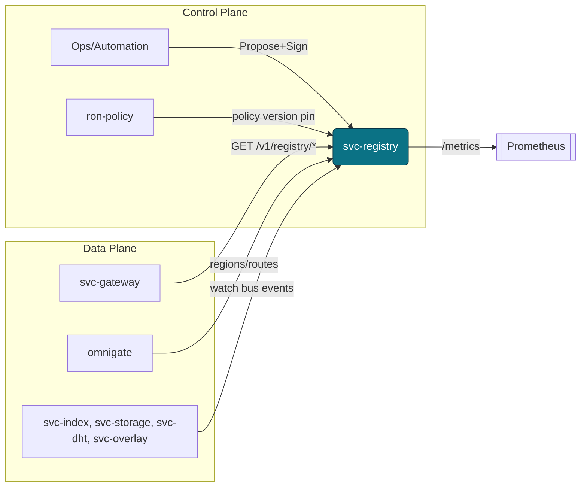
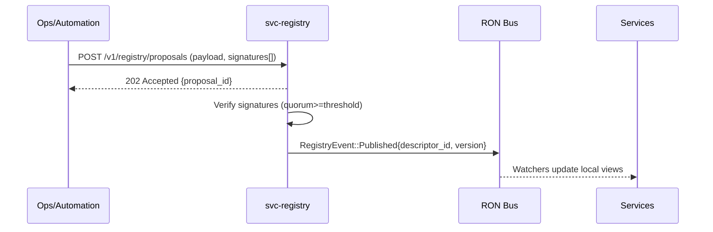
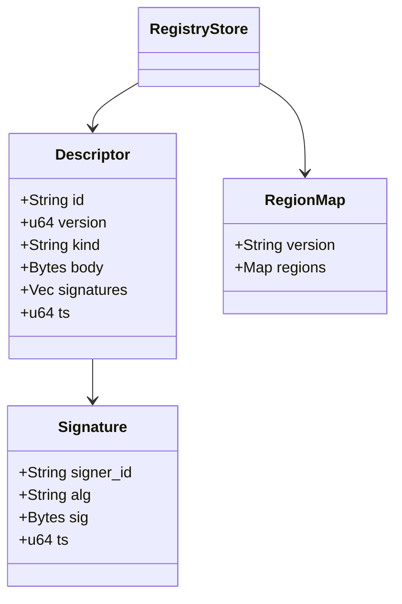
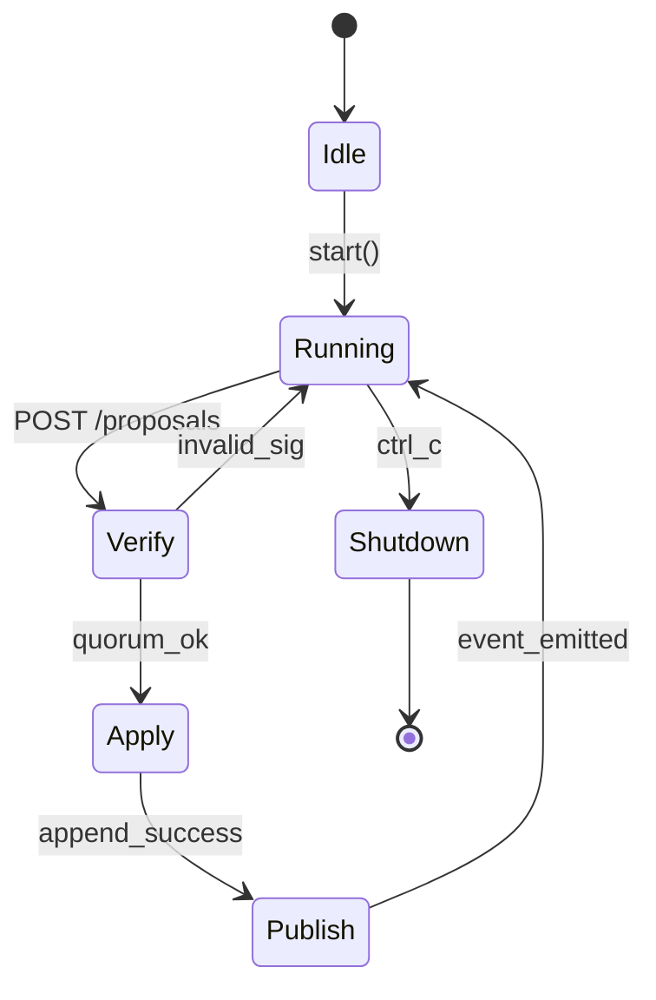

---

# svc-registry

> **Role:** service
> **Owner:** Stevan White (maintainer)
> **Status:** draft
> **MSRV:** 1.80.0
> **Last reviewed:** 2025-10-08

Badges (optional):
[]() []() []() []()

---

## 1) Overview

**What it is (one paragraph):**
`svc-registry` is the **authoritative service & node registry** for RustyOnions. It stores and serves **signed, versioned descriptors** for nodes, regions, service endpoints, capability exposure, and policy version pins. Mutations are **governed** via multi-sig quorum and applied **append-only**. Dependents (**gateway/omnigate, index, storage, overlay, dht, mailbox**) treat the registry as truth for **topology, residency, rollout state**, and subscribe to **bus events** for hot reload without restarts.

**How it fits (RustyOnions topology):**

* **Pillar:** 2 — Policy & Governance
* **Upstream callers:** `svc-gateway`, `omnigate`, `svc-index`, `svc-storage`, `svc-overlay`, `svc-dht`, `svc-mailbox`, node profiles (`macronode`, `micronode`)
* **Downstream deps:** `ron-policy` (policy version pins), `ron-kms` (key custody), `ron-auth` (verification), `ron-metrics` (metrics/health)
* **Data it touches:** durable store (sled/rocks) + in-memory read caches
* **Security boundary:** signed write path; **no PII**

### 1.1 High-Level Architecture (Mermaid)



---

## 2) Responsibilities & Boundaries

**MUST do (core responsibilities):**

* [ ] Hold the **canonical, signed** registry of nodes/services/regions.
* [ ] Enforce **multi-sig governance** on mutations (quorum threshold).
* [ ] Publish **versioned descriptors** and **emit bus events** on changes.
* [ ] Serve **fast, read-optimized** lookups for clients/services.
* [ ] Honor **amnesia mode** (no unintended disk artifacts when enabled).

**MUST NOT do (anti-scope / boundaries):**

* [ ] No capability minting/identity issuance (that’s `svc-passport`/`ron-auth`).
* [ ] No policy authorship (rules authored in `ron-policy`; registry only pins versions).
* [ ] No business routing decisions (consumers enforce; registry **describes**).

**Acceptance Gates (PROOF you did it):**

* [ ] Unit/prop tests for **signature quorum**, **append-only**, **rollback on invalid**.
* [ ] Metrics exported: `registry_descriptors_total`, `registry_update_total{result}`, `rejected_total{reason}`; dashboards green.
* [ ] `/readyz` reflects store + bus health (writes can degrade while reads stay OK).
* [ ] Bench meets SLO: p95 **read ≤ 30 ms**, p99 **read ≤ 60 ms** on baseline profile.

---

## 3) Public Interfaces

### 3.1 Bus RPC / Events (service)

* **Events Emitted:**

  * `KernelEvent::ConfigUpdated { version }` on head advance
  * `RegistryEvent::Published { descriptor_id, version, ts }`
  * `RegistryEvent::Deprecated { descriptor_id, version }`
* **Subscribed Topics:** (optional governance) `ron://governance/registry/proposal` for automated flows.



### 3.2 HTTP / gRPC (service)

**Base URL:** `http://<host>:<port>/v1/registry`

| Method | Path                 | 2xx Response                          | Auth                | Notes                                              |
| -----: | -------------------- | ------------------------------------- | ------------------- | -------------------------------------------------- |
|    GET | /version             | `{ "version": <u64> }`                | none (or policy)    | Alias `/version` supported; **deprecated** in 0.4. |
|    GET | /descriptors/{id}    | Signed descriptor (JSON)              | none (or policy)    | Returns latest head for `{id}`.                    |
|    GET | /regions/map         | RegionMap JSON                        | none (or policy)    | DTOs via `ron-proto`.                              |
|   POST | /proposals           | `202 Accepted { "proposal_id": "…" }` | Bearer (capability) | Body: `{ descriptor, signatures[] }`.              |
|   POST | /apply/{proposal_id} | `200 OK { "version": <u64> }`         | Bearer (capability) | Fails with `NoQuorum`, `StaleVersion`.             |
|    GET | /healthz             | `{ "status": "ok" }`                  | none                | Liveness (fast).                                   |
|    GET | /readyz              | `{ "ready": true }`                   | none                | Readiness reflects store + bus.                    |
|    GET | /metrics             | Prometheus text                       | none                | Exporter.                                          |

> **Auth scheme:** Bearer macaroon (capability tokens). Error responses use the envelope in §10.

### 3.3 CLI (optional ops tool)

```bash
cargo run -p svc-registry -- propose --file ./descriptor.json --sig ./sig.der
cargo run -p svc-registry -- apply --proposal <id>
cargo run -p svc-registry -- get --id svc-storage@us-east-1
```

---

## 4) Configuration

> Env-first, with fast-fail validation.

| Variable           | Type   |       Default | Description                                                      |
| ------------------ | ------ | ------------: | ---------------------------------------------------------------- |
| `BIND`             | socket | `127.0.0.1:0` | HTTP bind address                                                |
| `REGISTRY_DB`      | path   |     `./_data` | Durable store path (amnesia=on → tmpfs/memdb recommended)        |
| `SIG_THRESHOLD`    | int    |           `2` | Valid signatures required to accept a mutation                   |
| `SIGNER_ALLOWLIST` | list   |      `<none>` | Allowed signer key IDs (comma-separated)                         |
| `READ_CACHE_CAP`   | int    |        `8192` | LRU entries for hot read path                                    |
| `LOG_LEVEL`        | string |        `info` | tracing level (`trace`..`error`)                                 |
| `METRICS_ADDR`     | socket | `127.0.0.1:0` | Prometheus exporter bind                                         |
| `AMNESIA`          | bool   |       `false` | If true, prefer RAM, avoid disk persistence, zeroize on shutdown |

**Guardrails:**

* `SIG_THRESHOLD >= 1` and `<= len(SIGNER_ALLOWLIST)`; start-up **fails fast** otherwise.
* With `AMNESIA=true`, `REGISTRY_DB` must resolve to tmpfs/ramdisk; service **zeroizes** on shutdown.

**Flags (if any):**

```bash
--bind 0.0.0.0:9402
--db ./_state/registry
--sig-threshold 3
--allow-signer key1,key2,key3
```

**Feature flags (Cargo):**

* `default = ["tokio", "serde"]`
* `tls` — inbound TLS via `tokio-rustls`
* `kameo` — optional actor integration for governance workers

---

## 5) Build, Run, Test

**Build**

```bash
cargo build -p svc-registry
```

**Run (service)**

```bash
RUST_LOG=info METRICS_ADDR=127.0.0.1:0 cargo run -p svc-registry
```

**Tests (unit/prop/docs)**

```bash
cargo test -p svc-registry --all-features
cargo test -p svc-registry --doc
```

**Lint & format**

```bash
cargo fmt --all
cargo clippy -p svc-registry -- -D warnings
```

**Security & deps**

```bash
cargo deny check
```

**Bench (if provided)**

```bash
cargo bench -p svc-registry
```

**CI quality bars**

* Coverage: `cargo llvm-cov --workspace` ≥ **90%** lines on `svc-registry`.
* Lints: `clippy -D warnings` (all profiles).
* Deps: `cargo deny check` (licenses/advisories/sources) clean.
* Perf guard: `cargo bench -p svc-registry` and **fail PR** if p95 read regresses >10% vs. `main` (bench compare artifact).

---

## 6) Observability

**Endpoints:** `/metrics`, `/healthz`, `/readyz`.

**Canonical Metrics (golden + registry-specific):**

* `requests_total{route,method,status}` — counter
* `request_latency_seconds{route}` — histogram
* `registry_descriptors_total{state="published|deprecated"}` — gauge
* `registry_update_total{result="applied|rejected|invalid_sig"}` — counter
* `rejected_total{reason}` — counter
* `bus_lagged_total{service="svc-registry"}` — counter
* `service_restarts_total{service="svc-registry"}` — counter

**Tracing**

* Targets: `svc_registry=info,axum=warn,tower_http=warn`
* Span fields: `request_id`, `peer_addr`, `route`, `status`, `descriptor_id`, `version`

**Metric freshness & alerts**

* Scrape interval: **15s** (dev), **5s** (prod).
* Alert when `request_latency_seconds{route}` **p99 > SLO for 5 min**.
* Alert when `bus_lagged_total{service="svc-registry"}` **> 0 for 60s** (lagged consumer).
* Warn when `rejected_total{reason="invalid_sig"}` rate **> 1/min for 10 min** (misconfigured signer).
* **SLO error budget:** 99.9% monthly for read endpoints; track in dashboard `svc-registry/slo`.

---

## 7) Performance & SLOs

| Metric         |      Target | Notes                           |
| -------------- | ----------: | ------------------------------- |
| P50 read       |      ≤ 10ms | hot cache                       |
| P95 read       |      ≤ 30ms | steady-state                    |
| P99 read       |      ≤ 60ms | nominal load                    |
| Start-to-ready |        < 1s | cold start (reads only)         |
| Apply latency  | ≤ 250ms p95 | verify + append + publish event |

> Repro: include dataset (≥10k descriptors), cache size, machine profile (e.g., 4c/8GiB), exact flags, and commit hash.

---

## 8) Data & Schema

**Data model (summary)**

* **Descriptor** (versioned, signed): `id`, `version`, `kind` (`service|node|region_map`), `body` (DTO from `ron-proto`), `signatures[]`, `ts`
* **Signature**: `signer_id`, `alg`, `sig_bytes`, `ts`
* **RegionMap**: `region_id → { services: [ { id, addr, tls, weight } ] }`

**Keyspace (sled example)**

* Keys:

  * `desc/<id>/v/<u64>` → `Descriptor`
  * `head/<id>` → `u64` (latest version)
  * `regions/current` → `RegionMap`
* Values: bincode; **schema version gate** in header.



**Migrations**

* Strict **append-only**; deprecations are additive.
* Version gates reject unknown/older than `<min>`; provide `upgrade_vN_to_vN+1()` **idempotent** transforms.

**Interop & schema evolution (aligned to INTEROP.MD):**

* **DTO source of truth:** types are generated/validated via `ron-proto` (schema IDs embed `semver`).
* **Versioning policy:** minor/patch are backward-compatible; **breaking fields** require new `kind` or `vN` wrapper.
* **Wire stability:** HTTP/JSON is canonical; gRPC optional. Bus events carry the **same DTOs** (no forked schemas).
* **Canonical test vectors:** `docs/vectors/` include signed descriptors (v1..vN) and RegionMap snapshots; CI verifies decode/verify across versions.
* **Downgrade posture:** readers accept any supported `vN ≥ min_supported`; writers only publish `v_current`.

---

## 9) Security & Privacy

* **Threat model:**

  * *Spoofed updates* → **multi-sig quorum** + signer allow-list.
  * *Rollback attacks* → **monotonic versioning**; clients fetch `head/<id>`.
  * *DoS on write path* → quotas + early capability checks; reads remain fast.
* **Key handling:** verification via `ron-auth`; signer keys managed by `ron-kms`; never log secret material.
* **PII:** none.
* **AuthN/Z:** mutations require capability with `registry:propose`/`registry:apply`; reads usually public (policy-gated if needed).
* **Input validation:** deny unknown fields, enforce size/time limits, signature algorithm allow-list.
* **Supply chain:** workspace pins; `cargo deny` clean; SBOM attached to releases.

---

## 10) Error Taxonomy

**Error envelope (HTTP non-2xx):**

```json
{
  "error": {
    "code": "NoQuorum",
    "message": "proposal requires 3 valid signatures (got 2)",
    "hint": "add another signer from the allow-list",
    "retryable": false,
    "ts": "2025-10-08T21:05:11Z",
    "request_id": "r-72f4c3"
  }
}
```

| HTTP | code               | When it happens                     | Retry? | Operator hint                           |
| ---: | ------------------ | ----------------------------------- | :----: | --------------------------------------- |
|  400 | `BadRequest`       | malformed JSON / unknown fields     |   no   | validate schema; check content-type     |
|  401 | `Unauthorized`     | missing/invalid capability          |   no   | obtain proper macaroon                  |
|  403 | `Forbidden`        | capability lacks required scope     |   no   | add `registry:propose`/`registry:apply` |
|  409 | `StaleVersion`     | proposal older than current head    |   no   | refresh head; rebase proposal           |
|  412 | `NoQuorum`         | insufficient valid signatures       |   no   | meet `SIG_THRESHOLD`                    |
|  422 | `BadSignature`     | signature mismatch / unknown signer |   no   | check allow-list & payload hash         |
|  429 | `WriteRateLimited` | write path throttled                |  maybe | backoff with jitter                     |
|  503 | `StoreUnavailable` | store/bus degraded (reads may work) |   yes  | fail open for reads; watch readiness    |

---

## 11) Concurrency Model

* **Runtime:** tokio (1.x) with cooperative tasks.
* **I/O discipline:** explicit read/write/idle timeouts; **never hold a lock across `.await`**.
* **Channels:** broadcast bus (cloneable) for events; bounded mpsc for propose/apply workers.
* **Rules:** apply path is **single-writer per `descriptor_id`**; reads are lock-free via snapshot (e.g., `ArcSwap`).



**Validation (loom/fuzz)**

* **Loom model:** single-writer per `descriptor_id` (apply path), lock-free reads via snapshot. Explores proposal races; ensures **monotonic head**.
* **Proptests:** arbitrary descriptor bodies (bounded sizes), signer sets, proposal interleavings.
* **Fuzz targets:** JSON decode → verify → apply (libFuzzer via `cargo fuzz`) with corpus seeded from `docs/vectors/`.

---

## 12) Compatibility & Requirements

* **Rust:** MSRV 1.80.0
* **OS:** macOS 10.15+, Linux x86_64; containers supported
* **TLS:** `tokio_rustls` 0.26.x
* **HTTP:** `axum` 0.7.x, `tower-http` 0.6.x
* **DB:** sled/rocks (feature-gated adapter)

---

## 13) Examples

Service curl (reads):

```bash
curl -sS http://127.0.0.1:9402/v1/registry/version | jq .
curl -sS http://127.0.0.1:9402/v1/registry/descriptors/svc-storage@us-east-1 | jq .
curl -sS http://127.0.0.1:9402/v1/registry/regions/map | jq .
```

Propose & apply (writes; pseudo-payload):

```bash
curl -sS -X POST http://127.0.0.1:9402/v1/registry/proposals \
  -H "Authorization: Bearer $CAP" \
  -H "Content-Type: application/json" \
  -d @descriptor+sig.json

curl -sS -X POST http://127.0.0.1:9402/v1/registry/apply/42 \
  -H "Authorization: Bearer $CAP"
```

---

## 14) Troubleshooting

* **No quorum:** check `SIG_THRESHOLD`, signer allow-list, signature alg/order.
* **High read latency:** warm cache, tune `READ_CACHE_CAP`, place DB on SSD, avoid verbose `RUST_LOG`.
* **Writes degrade `/readyz`:** expected under pressure; **reads remain available**. Watch `rejected_total{reason="degraded"}`.
* **Metrics missing:** ensure single registry of metrics; verify Prometheus scrape path `/metrics`.

---

## 15) Development Notes

**Project conventions (RustyOnions):**

* Axum handlers end with `.into_response()`; hard limits/timeouts enforced.
* Crate surface re-exports via kernel: `Bus`, `KernelEvent`, `Metrics`, `HealthState`, `Config`, `wait_for_ctrl_c()`.
* TLS type is `tokio_rustls::rustls::ServerConfig` everywhere (not `rustls::ServerConfig`).

**Pre-commit quickcheck**

```bash
cargo fmt --all
cargo clippy -- -D warnings
cargo test
cargo deny check
```

---

## 16) Mermaid Diagrams — Policy & Tooling

At minimum this README includes:

1. **Architecture** (flowchart) ✓
2. **Sequence** (proposal→apply→publish) ✓
3. **State** (descriptor lifecycle) ✓

**Render locally (SVG)**

```bash
npm i -g @mermaid-js/mermaid-cli
mmdc -i docs/arch.mmd -o docs/arch.svg
```

**Render via Docker**

```bash
docker run --rm -v "$PWD":/data minlag/mermaid-cli mmdc -i docs/arch.mmd -o docs/arch.svg
```

**CI (GitHub Actions snippet)**

```yaml
name: render-mermaid
on: [push, pull_request]
jobs:
  mmdc:
    runs-on: ubuntu-latest
    steps:
      - uses: actions/checkout@v4
      - run: npm i -g @mermaid-js/mermaid-cli
      - run: |
          mkdir -p docs
          for f in $(git ls-files '*.mmd'); do
            out="${f%.mmd}.svg"
            mmdc -i "$f" -o "$out"
          done
```

---

## 17) Roadmap & TODO

* [ ] **Bronze (MVP):** read SLOs green; version/regions endpoints; quorum-checked apply; publish bus events; vectors v1.
* [ ] **Silver (Useful):** loom model + proptests; fuzz corpus in CI; perf guard in CI; vectors v2 with mixed signer sets.
* [ ] **Gold (Ops-Ready):** multi-region failover drills; signer rotation runbook & test; SBOM in releases; chaos soak (1h) with **0 lost events** and read **p99 within SLO**.

---

## 18) Changelog

See [CHANGELOG.md](./CHANGELOG.md). Follow SemVer; document breaking changes with migration notes.

---

## 19) License

Dual-licensed under **MIT** or **Apache-2.0**. See [LICENSE-MIT](../LICENSE-MIT) and [LICENSE-APACHE](../LICENSE-APACHE).

---

## 20) Contributing

PRs welcome! Please include:

* Updated diagrams (if topology changed)
* Docs & examples
* Bench impact (if perf-sensitive)

Also see `docs/IDB.md` (Invariant-Driven Blueprint) for this crate.

---
