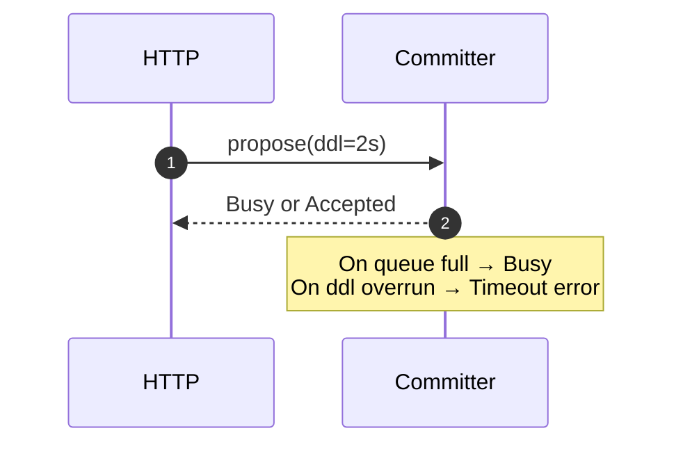
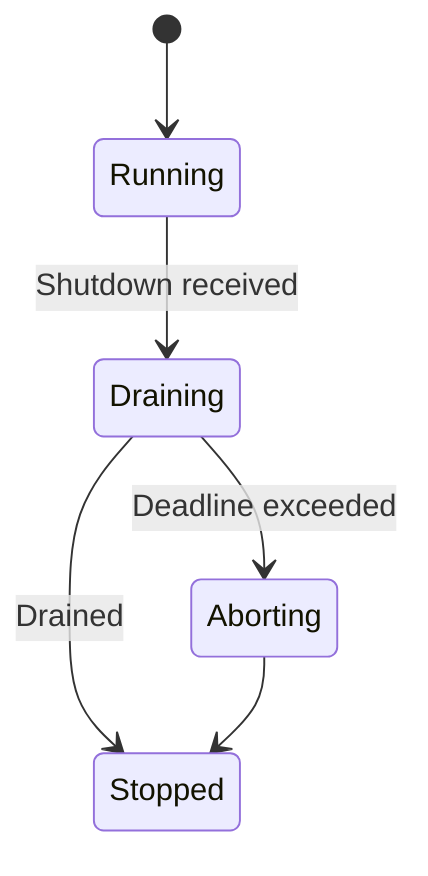
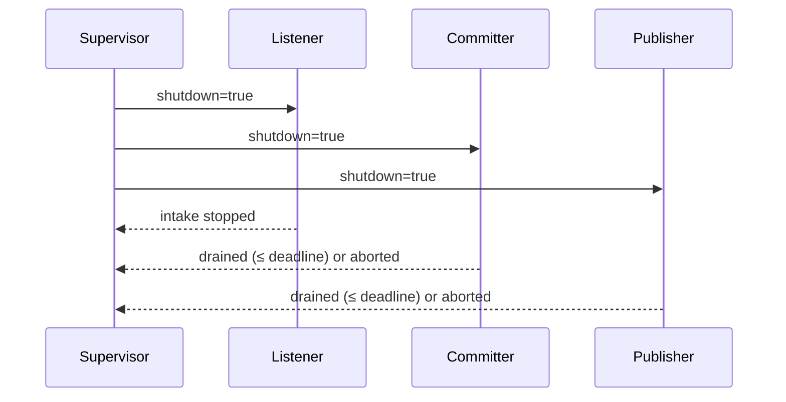

---

title: Concurrency Model — svc-registry
crate: svc-registry
owner: Stevan White
last-reviewed: 2025-10-08
status: draft
template_version: 1.1
msrv: 1.80.0
tokio: "1.x (pinned at workspace root)"
loom: "0.7+ (dev-only)"
lite_mode: "N/A (service crate)"
--------------------------------

# Concurrency Model — svc-registry

This document makes the concurrency rules **explicit**: tasks, channels, locks, shutdown, timeouts,
and validation (property/loom/TLA+). It complements `docs/SECURITY.md`, `docs/CONFIG.md`,
and the crate’s `README.md` and `IDB.md`.

> **Golden rule:** never hold a lock across `.await` in supervisory or hot paths.

---

## 0) Lite Mode

N/A — `svc-registry` is a networked service with background tasks.

---

## 1) Invariants (MUST)

* **No lock across `.await`.** Split critical sections; extract values before awaits.
* **Single writer per mutable resource.**

  * Exactly **one Committer task** is allowed to advance `HEAD` and append to the log.
  * Exactly **one Retention task** may prune segments *after* signed checkpoints.
* **Bounded channels only** with an explicit overflow policy (reject/drop-oldest). No unbounded queues.
* **Explicit timeouts** on all I/O and RPCs; fail-fast with typed errors.
* **Cooperative cancellation.** Every `.await` sits under a `select!` with shutdown, or is cancel-safe.
* **Graceful shutdown**: stop intake, drain within a deadline, abort stragglers; report metrics.
* **No blocking syscalls** on the async runtime; use `spawn_blocking` for FS checksums/fd-heavy ops if needed.
* **No task leaks**: track `JoinHandle`s; detach only for fire-and-forget telemetry with reason.
* **Backpressure over buffering**: prefer `try_send` → `Busy` to keep tail latency bounded.
* **Framing**: length-delimited JSON/CBOR; body size limited; decompress ratio enforced.
* **Audit chain integrity is preserved under concurrency**: commits are CAS’d on `HEAD{version,hash}`.

**Async Drop**

* **Do not block in `Drop`.** Provide `async fn shutdown()`/`close()` for teardown (e.g., SSE senders, file handles). `Drop` logs a debug if resources weren’t closed.

---

## 2) Runtime Topology

**Runtime:** Tokio **multi-threaded** runtime (worker threads = CPU cores by default).

**Supervisory layout & tasks:**

* **Supervisor** (root task)

  * Spawns and monitors all children; handles **backoff+jitter** restarts on panic; observes global shutdown.
* **HTTP Listener**

  * Accepts requests and routes to handlers; enforces read/write/idle timeouts and body caps.
* **Commit Pipeline**

  * Serializes **propose → approve → commit**; enforces quorum; **single writer** to `HEAD`.
* **Bus Publisher**

  * Consumes committed updates and emits `RegistryUpdated{version,b3}` events; bounded and non-blocking to Committer.
* **Checkpointor**

  * Periodically produces signed **Checkpoints** that cover log ranges for retention safety.
* **Retention/Pruner**

  * Prunes segments strictly **covered** by a checkpoint; never blocks Committer; runs in small batches.
* **Deep Verifier**

  * Background validator that incrementally re-verifies audit chain from last checkpoint; bounded work/time slice.
* **Config Reloader**

  * Applies SIGHUP/bus-driven config snapshots; non-disruptive vs. disruptive rebind logic; rollback on failure.
* **Metrics/Health Gate**

  * Exposes `/metrics`, `/healthz`, `/readyz`; flips readiness on storage/bus/commit-path degradation.
* **OTel Exporter (optional)**

  * Initializes and exports spans; can be reconfigured at runtime.

```mermaid
flowchart TB
  subgraph Runtime
    SUP[Supervisor]
    L[HTTP Listener]
    CP[Commit Pipeline (single writer)]
    PUB[Bus Publisher]
    CK[Checkpointor]
    PR[Retention / Pruner]
    DV[Deep Verifier]
    CR[Config Reloader]
    HG[Health/Metrics]
  end

  SUP -->|spawn| L
  SUP -->|spawn| CP
  SUP -->|spawn| PUB
  SUP -->|spawn| CK
  SUP -->|spawn| PR
  SUP -->|spawn| DV
  SUP -->|spawn| CR
  SUP -->|spawn| HG

  L -->|mpsc: proposals| CP
  L -->|mpsc: approvals| CP
  CP -->|broadcast: committed| PUB
  CP -->|broadcast: committed| DV
  CK -->|watch checkpoints| PR

  SUP -->|watch Shutdown| L
  SUP -->|watch Shutdown| CP
  SUP -->|watch Shutdown| PUB
  SUP -->|watch Shutdown| CK
  SUP -->|watch Shutdown| PR
  SUP -->|watch Shutdown| DV
  SUP -->|watch Shutdown| CR
  SUP -->|watch Shutdown| HG

  style SUP fill:#0ea5e9,stroke:#0c4a6e,color:#fff
```

**Text:** Supervisor spawns Listener, Committer (single-writer), Publisher, Checkpointor, Retention, Deep Verifier, Config Reloader, and Health Gate. Listener feeds proposals/approvals into Committer. Committer broadcasts committed events to Publisher and Deep Verifier. Checkpointor triggers Retention. All watch a shared Shutdown channel.

---

## 3) Channels & Backpressure

**Inventory (all bounded):**

| Name               | Kind        | Capacity (default) | Producers → Consumers | Backpressure Policy              | Drop Semantics / Caller Behavior                            |
| ------------------ | ----------- | -----------------: | --------------------- | -------------------------------- | ----------------------------------------------------------- |
| `proposals_tx`     | `mpsc`      |                512 | HTTP → Committer      | `try_send` else `Busy`           | Return 429/`Error::Busy`; increment `busy_rejections_total` |
| `approvals_tx`     | `mpsc`      |                512 | HTTP → Committer      | `try_send` else `Busy`           | Same as above                                               |
| `committed_tx`     | `broadcast` |               1024 | Committer → N         | lag counter + drop to next value | `bus_lagged_total++`; slow consumers miss old events        |
| `shutdown_rx`      | `watch`     |                  1 | Supervisor → N        | last-write-wins                  | N/A                                                         |
| `cfg_reload_tx`    | `mpsc`      |                 16 | Signal → Reloader     | enqueue with `try_send`          | Collapse if full; keep latest (also via `watch` optional)   |
| `retention_cmd_tx` | `mpsc`      |                  8 | Checkpointor → Pruner | `try_send` → skip cycle          | Log skip; retry on next interval                            |

**Guidelines:**

* Use **`try_send` + error** rather than awaiting queue space in request handlers.
* Emit `queue_depth{queue}`, `queue_dropped_total{queue}`, and `busy_rejections_total{endpoint}`.
* Broadcast consumers **must** reconcile via `GET /registry/head` after lag.

---

## 4) Locks & Shared State

**Allowed (short, non-async critical sections only):**

* `Mutex`/`RwLock` for **metadata** (counters, in-memory index) with guards dropped before `.await`.
* `Arc<StateSnapshot>` for read-mostly **HEAD view** served to readers.
* Per-connection/request state owned by its task; cross-task via channels.

**Forbidden**

* Holding any lock across `.await`.
* Nested locks except per this hierarchy (outer → inner), and only for short sections:

  1. `state_meta` → 2) `routing_table` → 3) `counters`.

**HEAD & log mutation discipline**

* Committer is the **only** task allowed to:

  * CAS on `HEAD{version,hash}`.
  * Append new `SignedArtifact` to the log.
* Retention/pruning never mutates `HEAD`; it only removes segments **strictly covered** by a signed checkpoint.

---

## 5) Timeouts, Retries, Deadlines

* **HTTP I/O:** `read=5s`, `write=5s`, `idle=60s` (configurable). Enforced via Tower layers.
* **Commit pipeline:** end-to-end request deadline propagated from HTTP handler.
* **Retries:** only for **idempotent** internal ops (e.g., storage read) with jittered backoff (50–100ms, cap 2s, max 3 tries).
* **Backoff/jitter:** used by Supervisor restarts and storage transient errors.
* **Circuit breaker (optional):** open on error-rate spikes; half-open after cool-down with probes.



---

## 6) Cancellation & Shutdown

* **Signal sources:** `KernelEvent::Shutdown` and OS `ctrl_c`.
* **Propagation:** `tokio::select!` on every loop: `{ _ = shutdown.changed() => … }`.
* **Draining:** stop accepting new work; allow in-flight to finish within `drain_deadline` (config, default 3s).
* **Abort:** after deadline, abort remaining tasks (`handle.abort()`); increment `tasks_aborted_total{kind}`.
* **Readiness:** `/readyz` flips **write-unready first**, then read-unready if core deps fail.



---

## 7) I/O & Framing

* **HTTP/JSON (and CBOR for payloads)** with `Content-Length` enforced and body cap (default 1 MiB).
* **SSE/WebSocket streams**: bounded internal buffers; handle split writes; backpressure by dropping to latest `HEAD`.
* **Storage I/O**: append-only writes with `fsync` on critical sections (commit & checkpoint). Use `spawn_blocking` for any heavy hashing if it ever becomes CPU-bound.

---

## 8) Error Taxonomy (Concurrency-Relevant)

| Error           | When                      | Retry?    | Metric                            | Notes                    |
| --------------- | ------------------------- | --------- | --------------------------------- | ------------------------ |
| `Busy`          | mpsc full                 | caller    | `busy_rejections_total{endpoint}` | 429 to clients           |
| `Timeout`       | deadline exceeded         | sometimes | `io_timeouts_total{op}`           | includes commit deadline |
| `Canceled`      | shutdown during wait/work | no        | `tasks_canceled_total{kind}`      | graceful stop            |
| `Lagging`       | broadcast overflow        | no        | `bus_lagged_total{consumer}`      | consumer must reconcile  |
| `ChainMismatch` | CAS on HEAD failed        | yes       | `commit_cas_fail_total`           | race → reload & retry    |
| `StorageBusy`   | store backpressure/locks  | yes       | `storage_backoff_total{op}`       | backoff+jitter           |

---

## 9) Metrics (Concurrency Health)

* `queue_depth{queue}` gauge (sampled)
* `queue_dropped_total{queue}` counter
* `busy_rejections_total{endpoint}` counter
* `tasks_spawned_total{kind}` / `tasks_aborted_total{kind}` / `tasks_panicked_total{kind}`
* `commit_cas_fail_total` counter
* `io_timeouts_total{op}` (`read`,`write`,`commit`)
* `backoff_retries_total{op}`
* `bus_lagged_total{consumer}`
* `registry_reload_success_total{source}` / `registry_reload_fail_total{reason}`

---

## 10) Validation Strategy

**Unit / Property**

* Backpressure: when queue is full, handlers return `Busy` and increment metrics; never block.
* Deadlines: `commit` path honors caller deadline within tolerance.
* Single-writer: property tests assert no path other than Committer mutates `HEAD`.

**Loom (dev-only)**

* Model `proposals_tx` → Committer → `committed_tx` with shutdown.
* Assertions: no deadlock; `shutdown` is always observed; no double-commit for same proposal.

**Fuzz**

* HTTP JSON/CBOR payload fuzz (malformed/oversized/duplicate approvals).
* SSE stream fuzzer for partial frames/slow consumers.

**Chaos**

* Stall `Bus Publisher`: commits still succeed; `bus_lagged_total` increments.
* Slow storage: `/readyz` flips write-unready first; drain obeys deadline.

**TLA+ (optional)**

* Model `HEAD` CAS and hash-chain append; prove safety (no two different artifacts at same version) and liveness (eventual commit under fair scheduling).

---

## 11) Code Patterns (Copy-Paste)

**Spawn + cooperative shutdown**

```rust
let (shutdown_tx, shutdown_rx) = tokio::sync::watch::channel(false);

fn spawn_worker(mut rx: tokio::sync::mpsc::Receiver<Job>, mut sd: tokio::sync::watch::Receiver<bool>) 
  -> tokio::task::JoinHandle<()> 
{
  tokio::spawn(async move {
    loop {
      tokio::select! {
        _ = sd.changed() => break,
        maybe = rx.recv() => {
          let Some(job) = maybe else { break };
          if let Err(e) = handle_job(job).await {
            tracing::warn!(error=%e, "worker job failed");
          }
        }
      }
    }
  })
}
```

**Bounded `mpsc` with `try_send`**

```rust
match proposals_tx.try_send(proposal) {
  Ok(_) => {}
  Err(tokio::sync::mpsc::error::TrySendError::Full(_)) => {
    metrics::busy_rejections_total().with_label_values(&["propose"]).inc();
    return Err(Error::Busy);
  }
  Err(e) => return Err(Error::from(e)),
}
```

**No lock across `.await`**

```rust
// compute outside await
let to_commit = {
  let meta = state_meta.read();
  meta.prepare_commit(input)
}; // drop guard
commit_async(to_commit).await?;
```

**Shutdown with deadline**

```rust
let deadline = tokio::time::Instant::now() + cfg.drain_deadline;
if tokio::time::timeout(deadline - tokio::time::Instant::now(), join_all(handles)).await.is_err() {
  for h in handles { h.abort(); }
}
```

**Single-writer CAS on HEAD**

```rust
// Committer only
let expected = Head { version, hash };
if store.compare_and_set_head(&expected, &new_head).await? {
  committed_tx.send(new_head).ok();
} else {
  metrics::commit_cas_fail_total().inc();
  // reload current head and decide whether to retry or reject
}
```

---

## 12) Configuration Hooks (Quick Reference)

* `limits.rps`, `limits.inflight`, `limits.max_body_bytes`, `limits.decompress_ratio_cap`
* HTTP timeouts: `read_timeout`, `write_timeout`, `idle_timeout`
* Channel capacities: proposals (512), approvals (512), broadcast (1024) — all configurable if desired
* Shutdown: `drain_deadline`
* Retention cadence: `storage.checkpoint_interval`
* Bus bound: `bus.channel_bound`

See `docs/CONFIG.md` for authoritative schema and defaults.

---

## 13) Known Trade-offs / Nonstrict Areas

* **Broadcast lossiness:** slow consumers may miss intermediate `committed` events; they must reconcile via `GET /registry/head`.
* **Reject vs. drop-oldest:** request paths use **reject (Busy)** to bound tail latency; internal event streams use **drop-to-latest** to avoid amplification.
* **Deep verification is best-effort:** limited time-slice to avoid starving hot paths; integrity is still guaranteed by commit-time checks and CAS.

---

## 14) Mermaid Diagrams (REQUIRED)

### 14.1 Task & Queue Topology

```mermaid
flowchart LR
  IN[HTTP Ingress] -->|mpsc:proposals(512)| COM[Committer (single writer)]
  IN -->|mpsc:approvals(512)| COM
  COM -->|broadcast:committed(1024)| PUB[Bus Publisher]
  COM -->|broadcast:committed(1024)| DV[Deep Verifier]
  CK[Checkpointor] -->|cmds| PR[Retention]
  SHUT[Shutdown watch] --> IN
  SHUT --> COM
  SHUT --> PUB
  SHUT --> DV
  SHUT --> CK
  SHUT --> PR
```

**Text:** Ingress feeds proposals/approvals to Committer via bounded channels. Committer broadcasts committed events to Publisher and Deep Verifier. Checkpointor commands Retention. All tasks subscribe to Shutdown.

### 14.2 Shutdown Sequence



---

## 15) CI & Lints (Enforcement)

**Clippy / rustc**

* `-D warnings`
* `-W clippy::await_holding_lock`
* `-W clippy::dbg_macro` / `-W clippy::todo`
* `-W clippy::unwrap_used` (allow in tests only)

**GitHub Actions (suggested)**

```yaml
name: svc-registry-concurrency
on: [push, pull_request]
jobs:
  clippy:
    runs-on: ubuntu-latest
    steps:
      - uses: actions/checkout@v4
      - uses: dtolnay/rust-toolchain@stable
      - run: cargo clippy -p svc-registry -- -D warnings -W clippy::await_holding_lock

  loom:
    if: github.event_name == 'pull_request'
    runs-on: ubuntu-latest
    steps:
      - uses: actions/checkout@v4
      - uses: dtolnay/rust-toolchain@stable
      - run: RUSTFLAGS="--cfg loom" cargo test -p svc-registry --tests -- --ignored --nocapture

  fuzz:
    runs-on: ubuntu-latest
    steps:
      - uses: actions/checkout@v4
      - uses: dtolnay/rust-toolchain@stable
      - run: cargo install cargo-fuzz
      - run: cargo fuzz build -p svc-registry
```

---

## 16) Schema Generation (Optional)

Automate **Channels/Locks tables** from code to avoid rot:

* Annotate channels/locks via small macros or keep a `concurrency.rs` registry module.
* Golden test compares doc table to the runtime registry (fail CI if drift detected).

---

## 17) Review & Maintenance

* **Review cadence:** every 90 days or on any change to tasks/channels/locks.
* **Keep `owner`, `msrv`, `last-reviewed` current.**
* **PR checklist:** if you modify runtime topology, update this doc + Loom tests + chaos scenarios.

---
