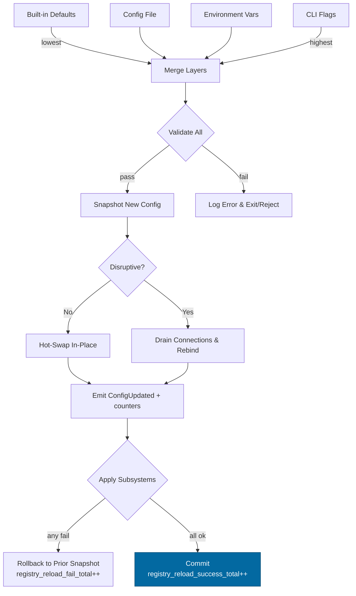

---

title: Configuration — svc-registry
crate: svc-registry
owner: Stevan White
last-reviewed: 2025-10-08
status: draft
template_version: 1.1
---------------------

# Configuration — svc-registry

This document defines **all configuration** for `svc-registry`, including sources,
precedence, schema (types/defaults), validation, feature flags, live-reload behavior,
and security implications. It complements `README.md`, `docs/SECURITY.md`, and the crate’s IDB.

> **Tiering:**
> **Service crate.** Applies to network, readiness, observability, storage, and retention/compaction.
> Registry holds **no signing keys**; it verifies signatures and enforces governance.

---

## 1) Sources & Precedence (Authoritative)

Configuration may come from multiple sources. **Precedence (highest wins):**

1. **Process flags** (CLI)
2. **Environment variables**
3. **Config file** (e.g., `Config.toml` beside the binary or path via `--config`)
4. **Built-in defaults** (hard-coded)

> On dynamic reload, the effective config is recomputed under the same precedence and applied atomically.

**Supported file formats:** TOML (preferred), JSON (optional).
**Path resolution for `--config` (if relative):** `./`, `$CWD`, binary dir.

**Env prefix convention:** all env vars begin with `SVCR_` (short for **S**er**v**i**c**e **R**egistry).

---

## 2) Quickstart Examples

### 2.1 Minimal service start

```bash
RUST_LOG=info \
SVCR_BIND_ADDR=0.0.0.0:8080 \
SVCR_METRICS_ADDR=127.0.0.1:0 \
cargo run -p svc-registry
```

### 2.2 Config file (TOML)

```toml
# Config.toml
bind_addr     = "0.0.0.0:8080"
metrics_addr  = "127.0.0.1:0"
max_conns     = 1024
read_timeout  = "5s"
write_timeout = "5s"
idle_timeout  = "60s"

[limits]
max_body_bytes       = "1MiB"
decompress_ratio_cap = 10
rps                  = 500
inflight             = 512

[tls]
enabled   = false
# cert_path = "/etc/ron/cert.pem"
# key_path  = "/etc/ron/key.pem"

[uds]
path       = ""         # e.g., "/run/registry.sock"
allow_uids = []         # e.g., [1000, 1001]

[auth]
macaroon_path = ""      # optional; if set, used for local admin client flows

[otel]
tracing_enabled = true
exporter        = "none"  # "none" | "otlp"
endpoint        = "http://127.0.0.1:4317"

[storage]
kind                = "sled"   # "sled" | "sqlite"
data_dir            = "./data/registry"
fsync               = true
checkpoint_interval = "10m"    # create signed checkpoints periodically

[retention]
policy       = "by-age" # "by-age" | "by-count" | "by-size"
max_age      = "30d"
max_count    = 10000
target_bytes = "1GiB"   # used when policy = "by-size"

[bootstrap]
trust_roots_path = ""   # optional: pinned roots for first head
trust_roots_hash = ""   # optional: b3:<hex> pin for integrity

[bus]
channel_bound = 1024
emit_updates  = true

[deprecation]
min_minor_window = 2
min_days_window  = 180

[amnesia]
enabled = false

[pq]
mode = "off"    # "off" | "hybrid" (PQ hybrid signaling; interop-gated)

[log]
format = "json" # "json" | "text"
level  = "info" # "trace".."error"
```

### 2.3 CLI flags (override file/env)

```bash
cargo run -p svc-registry -- \
  --bind 0.0.0.0:8080 \
  --metrics 127.0.0.1:0 \
  --max-conns 2048 \
  --storage-kind sled \
  --data-dir ./data/registry
```

---

## 3) Schema (Typed, With Defaults)

> **Durations** accept `ms`, `s`, `m`, `h`, `d`. **Sizes** accept `B`, `KiB`, `MiB`, `GiB`.
> **Prod notes:** prefer `log.format=json`, scrape metrics on localhost, and keep public binds behind gateway/LB.

| Key / Env Var                                             | Type                                | Default                 | Description                                                           | Security Notes                                |
| --------------------------------------------------------- | ----------------------------------- | ----------------------- | --------------------------------------------------------------------- | --------------------------------------------- |
| `bind_addr` / `SVCR_BIND_ADDR`                            | socket                              | `127.0.0.1:0`           | HTTP ingress bind address                                             | Public binds require threat review            |
| `metrics_addr` / `SVCR_METRICS_ADDR`                      | socket                              | `127.0.0.1:0`           | Prometheus endpoint bind                                              | Prefer localhost in prod; scrape via gateway  |
| `max_conns` / `SVCR_MAX_CONNS`                            | u32                                 | `1024`                  | Max concurrent connections                                            | Prevents FD exhaustion                        |
| `read_timeout` / `SVCR_READ_TIMEOUT`                      | duration                            | `5s`                    | Per-request read timeout                                              | DoS mitigation                                |
| `write_timeout` / `SVCR_WRITE_TIMEOUT`                    | duration                            | `5s`                    | Per-request write timeout                                             | DoS mitigation                                |
| `idle_timeout` / `SVCR_IDLE_TIMEOUT`                      | duration                            | `60s`                   | Keep-alive idle shutdown                                              | Resource hygiene                              |
| `limits.max_body_bytes` / `SVCR_MAX_BODY_BYTES`           | size                                | `1MiB`                  | Request payload cap                                                   | Zip bomb guard                                |
| `limits.decompress_ratio_cap`/`SVCR_DECOMPRESS_RATIO_CAP` | u32                                 | `10`                    | Max allowed decompression ratio                                       | Zip bomb guard                                |
| `limits.rps` / `SVCR_RPS`                                 | u32                                 | `500`                   | Global requests-per-second limit                                      | Throttle abuse                                |
| `limits.inflight` / `SVCR_INFLIGHT`                       | u32                                 | `512`                   | Max inflight requests                                                 | Back-pressure safety                          |
| `tls.enabled` / `SVCR_TLS_ENABLED`                        | bool                                | `false`                 | Enable TLS (tokio-rustls)                                             | Use tokio-rustls server config only           |
| `tls.cert_path` / `SVCR_TLS_CERT_PATH`                    | path                                | `""`                    | PEM cert path                                                         | 0600 perms; owned by service user             |
| `tls.key_path` / `SVCR_TLS_KEY_PATH`                      | path                                | `""`                    | PEM key path                                                          | Zeroize after load                            |
| `uds.path` / `SVCR_UDS_PATH`                              | path                                | `""`                    | Optional Unix Domain Socket path                                      | Dir 0700, sock 0600, enforce SO_PEERCRED      |
| `uds.allow_uids` / `SVCR_UDS_ALLOW_UIDS`                  | list<u32>                           | `[]`                    | PEERCRED allow-list                                                   | Strict production control                     |
| `auth.macaroon_path` / `SVCR_MACAROON_PATH`               | path                                | `""`                    | Capability token file (optional for local admin tools)                | Never log contents                            |
| `amnesia.enabled` / `SVCR_AMNESIA`                        | bool                                | `false`                 | RAM-only runtime mode                                                 | No persistent secrets or scratch              |
| `pq.mode` / `SVCR_PQ_MODE`                                | enum(`off`,`hybrid`)                | `off`                   | PQ hybrid signaling for descriptors/approvals (interop-gated rollout) | Coordinate rollouts to avoid interop breakage |
| `log.format` / `SVCR_LOG_FORMAT`                          | enum(`json`,`text`)                 | `json`                  | Structured logs                                                       | JSON required in prod                         |
| `log.level` / `SVCR_LOG_LEVEL`                            | enum                                | `info`                  | `trace`..`error`                                                      | Avoid `trace` in prod                         |
| `otel.tracing_enabled` / `SVCR_OTEL_TRACING`              | bool                                | `true`                  | Enable OpenTelemetry spans                                            | PII-free spans                                |
| `otel.exporter` / `SVCR_OTEL_EXPORTER`                    | enum(`none`,`otlp`)                 | `none`                  | OTEL exporter                                                         | If `otlp`, secure path to collector           |
| `otel.endpoint` / `SVCR_OTEL_ENDPOINT`                    | url                                 | `http://127.0.0.1:4317` | OTLP endpoint                                                         | TLS/MTLS as needed                            |
| `storage.kind` / `SVCR_STORAGE_KIND`                      | enum(`sled`,`sqlite`)               | `sled`                  | Storage backend                                                       | Crash-safe, append-only semantics             |
| `storage.data_dir` / `SVCR_DATA_DIR`                      | path                                | `./data/registry`       | Data directory                                                        | Dir 0700                                      |
| `storage.fsync` / `SVCR_FSYNC`                            | bool                                | `true`                  | Force fsync on critical mutations                                     | Durability requirement                        |
| `storage.checkpoint_interval`/`SVCR_CHECKPOINT_INTERVAL`  | duration                            | `10m`                   | Periodic signed checkpoints                                           | Enables safe pruning                          |
| `retention.policy` / `SVCR_RETENTION_POLICY`              | enum(`by-age`,`by-count`,`by-size`) | `by-age`                | Log retention policy                                                  | Must not break verifiability                  |
| `retention.max_age` / `SVCR_RETENTION_MAX_AGE`            | duration                            | `30d`                   | Max age for prunable segments                                         | Signed checkpoint must cover segments         |
| `retention.max_count` / `SVCR_RETENTION_MAX_COUNT`        | u64                                 | `10000`                 | Max retained commits (when policy = by-count)                         |                                               |
| `retention.target_bytes` / `SVCR_RETENTION_TARGET_BYTES`  | size                                | `1GiB`                  | Target size (when policy = by-size)                                   |                                               |
| `bootstrap.trust_roots_path`/`SVCR_TRUST_ROOTS`           | path                                | `""`                    | Optional bootstrap trust roots (verification pubkeys)                 | Read-only; 0600                               |
| `bootstrap.trust_roots_hash`/`SVCR_TRUST_ROOTS_HASH`      | string (b3:<hex>)                   | `""`                    | Optional integrity pin for roots                                      | Prevents root tampering                       |
| `bus.channel_bound` / `SVCR_BUS_BOUND`                    | u32                                 | `1024`                  | Bounded bus channel for update events                                 | Drops counted, never blocking                 |
| `bus.emit_updates` / `SVCR_EMIT_UPDATES`                  | bool                                | `true`                  | Emit `RegistryUpdated` events                                         |                                               |
| `deprecation.min_minor_window`/`SVCR_DEP_MINOR`           | u32                                 | `2`                     | Minimum minor-release deprecation window                              | Enforced in CI                                |
| `deprecation.min_days_window`/`SVCR_DEP_DAYS`             | u32                                 | `180`                   | Minimum days deprecation window                                       | Enforced in CI                                |

---

## 4) Validation Rules (Fail-Closed)

On startup or reload, apply **strict validation**:

* `bind_addr`/`metrics_addr` parse; privileged ports (<1024) require privileges.
* If `tls.enabled=true`: `cert_path` and `key_path` exist, readable; key not world-readable; loadable into `tokio_rustls::rustls::ServerConfig`.
* `max_conns > 0`; `limits.max_body_bytes ≥ 1 KiB`; `limits.decompress_ratio_cap ≥ 1`;
  `limits.rps ≥ 1`; `limits.inflight ≥ 1`.
* If `uds.path` set: parent dir exists, dir mode `0700`; socket mode `0600`; `allow_uids` list is non-empty in prod.
* If `amnesia.enabled=true`: `storage.data_dir` must be tmpfs/ephemeral; **fail** if pointing to persistent paths (Micronode rule).
* `storage.kind` in {`sled`,`sqlite`}; if `sqlite`, file resides under `storage.data_dir` and journal mode is durable.
* `checkpoint_interval ≥ 1m`.
* Retention policy:

  * `by-age` requires `max_age ≥ 1h`;
  * `by-count` requires `max_count ≥ 100`;
  * `by-size` requires `target_bytes ≥ 32MiB`.
* If `bootstrap.trust_roots_*` set: file exists; hash matches (`b3:<hex>`); trust roots loadable.
* OTEL `exporter="otlp"` requires a valid endpoint URL.

**On violation:** log structured error and **exit non-zero** (service).

**Warnings (non-fatal, surfaced to logs/metrics):**

* `uds.allow_uids` empty while `uds.path` set (warn in non-prod, fail in prod).
* `log.level=trace` in non-debug builds (warn).

---

## 5) Dynamic Reload (If Supported)

**Triggers**

* SIGHUP, or a kernel bus `ConfigUpdated { version: u64 }`.

**Reload semantics**

* **Non-disruptive:** timeouts/limits/log level/OTEL settings (`exporter`, `endpoint`) and retention thresholds.
* **Disruptive (socket rebind):** `bind_addr`, `metrics_addr`, `tls.*`, `uds.*`.
* **Storage paths:** require restart (reject at reload).
* **Signer set and quorum:** not from config; governed by signed artifacts only.

**Atomicity & rollback**

* Build a new snapshot → validate fully. If any sub-system apply step fails (e.g., OTEL exporter init), **rollback** to prior snapshot.
* Emit metrics:
  `registry_reload_success_total{source}`, `registry_reload_fail_total{reason}`.
  On success, also increment `registry_config_version`.

**Graceful disruptive apply**

* For disruptive changes, **drain** existing keep-alive connections (bounded time), then rebind; reflect readiness flips accordingly.

**Audit**

* Emit `KernelEvent::ConfigUpdated { version }` with a **redacted** diff; never log secrets.

---

## 6) CLI Flags (Canonical)

```
--config <path>                  # Load Config.toml (lowest precedence)
--bind <ip:port>                 # Override bind_addr
--metrics <ip:port>              # Override metrics_addr
--max-conns <num>
--read-timeout <dur>
--write-timeout <dur>
--idle-timeout <dur>
--rps <num>
--inflight <num>
--tls                            # Set tls.enabled=true
--tls-cert <path>
--tls-key <path>
--uds <path>
--data-dir <path>                # storage.data_dir
--storage-kind <sled|sqlite>
--checkpoint-interval <dur>
--retention-policy <by-age|by-count|by-size>
--retention-max-age <dur>
--retention-max-count <num>
--retention-target-bytes <size>
--otel-exporter <none|otlp>
--otel-endpoint <url>
--log-format <json|text>
--log-level <trace|debug|info|warn|error>
```

---

## 7) Feature Flags (Cargo)

| Feature | Default | Effect                                               |
| ------- | ------: | ---------------------------------------------------- |
| `tls`   |     off | Enables tokio-rustls and TLS config keys             |
| `pq`    |     off | Enables PQ hybrid signaling knobs (`pq.mode=hybrid`) |
| `kameo` |     off | Optional actor integration                           |
| `cli`   |      on | Enables CLI parsing for flags                        |

> Feature toggles must not silently change schema semantics—only availability.

---

## 8) Security Implications

* **Public binds** (`0.0.0.0`) require timeouts, RPS, inflight, and body-size caps.
* **TLS** uses **`tokio_rustls::rustls::ServerConfig`** only; keys are never logged; zeroized after load.
* **Amnesia mode** prohibits writing to persistent storage; retention/compaction disabled or tmpfs-backed.
* **UDS** requires `SO_PEERCRED` verification and UID allow-list in production.
* **No emergency backdoors** via config: quorum/policy are governed by signed artifacts; config cannot bypass governance.

---

## 9) Compatibility & Migration

* **Backwards-compatible** changes add keys with safe defaults.
* **Renames**: keep old env var alias for ≥ 1 minor; warn when used; document in `CHANGELOG.md`.
* **Breaking changes**: require a **major** bump and a migration section.
* **Deprecation windows**: minimum of **2 minor releases** **or** **180 days** (whichever longer). Surfaces expose `Deprecation`/`Sunset` headers and appear in `/version` and `/schema`.

**Deprecation Table (maintained)**

| Old Key                | New Key                 | Removal Target | Notes                  |
| ---------------------- | ----------------------- | -------------: | ---------------------- |
| `limits.max_req_bytes` | `limits.max_body_bytes` |         v2.0.0 | Alias kept for 1 minor |

---

## 10) Reference Implementation (Rust)

> Minimal example for `Config` with serde. Loader merges file/env/flags, then `validate()`; disruptive keys return `NeedsRestart`. Also exposes a `lint()` that yields warnings for CI to enforce zero-warning prod configs.

```rust
use std::{net::SocketAddr, path::PathBuf, time::Duration};
use serde::{Deserialize, Serialize};

#[derive(Debug, Clone, Serialize, Deserialize)]
pub struct TlsCfg {
    pub enabled: bool,
    pub cert_path: Option<PathBuf>,
    pub key_path: Option<PathBuf>,
}

#[derive(Debug, Clone, Serialize, Deserialize, Default)]
pub struct Limits {
    #[serde(default = "default_body_bytes")]
    pub max_body_bytes: u64,              // bytes
    #[serde(default = "default_decompress_ratio")]
    pub decompress_ratio_cap: u32,
    #[serde(default = "default_rps")]
    pub rps: u32,
    #[serde(default = "default_inflight")]
    pub inflight: u32,
}

#[derive(Debug, Clone, Serialize, Deserialize, Default)]
pub struct Otel {
    #[serde(default = "default_true")]
    pub tracing_enabled: bool,
    #[serde(default = "default_exporter")]
    pub exporter: String,                 // "none" | "otlp"
    #[serde(default = "default_otlp_endpoint")]
    pub endpoint: String,
}

#[derive(Debug, Clone, Serialize, Deserialize)]
pub struct Storage {
    #[serde(default = "default_kind")]
    pub kind: String,                     // "sled" | "sqlite"
    #[serde(default = "default_data_dir")]
    pub data_dir: PathBuf,
    #[serde(default = "default_true")]
    pub fsync: bool,
    #[serde(with = "humantime_serde", default = "default_checkpoint_interval")]
    pub checkpoint_interval: Duration,
}

#[derive(Debug, Clone, Serialize, Deserialize, Default)]
pub struct Retention {
    #[serde(default = "default_policy")]
    pub policy: String,                   // "by-age" | "by-count" | "by-size"
    #[serde(with = "humantime_serde", default = "default_30d")]
    pub max_age: Duration,
    #[serde(default = "default_ret_count")]
    pub max_count: u64,
    #[serde(default = "default_target_bytes")]
    pub target_bytes: u64,                // bytes
}

#[derive(Debug, Clone, Serialize, Deserialize, Default)]
pub struct Uds {
    pub path: Option<PathBuf>,
    pub allow_uids: Option<Vec<u32>>,
}

#[derive(Debug, Clone, Serialize, Deserialize, Default)]
pub struct Bootstrap {
    pub trust_roots_path: Option<PathBuf>,
    pub trust_roots_hash: Option<String>, // b3:<hex>
}

#[derive(Debug, Clone, Serialize, Deserialize, Default)]
pub struct Deprecation {
    pub min_minor_window: u32, // default 2
    pub min_days_window: u32,  // default 180
}

#[derive(Debug, Clone, Serialize, Deserialize)]
pub struct Config {
    pub bind_addr: Option<SocketAddr>,       // default 127.0.0.1:0
    pub metrics_addr: Option<SocketAddr>,    // default 127.0.0.1:0
    #[serde(default = "default_max_conns")]
    pub max_conns: u32,
    #[serde(with = "humantime_serde", default = "default_5s")]
    pub read_timeout: Duration,
    #[serde(with = "humantime_serde", default = "default_5s")]
    pub write_timeout: Duration,
    #[serde(with = "humantime_serde", default = "default_60s")]
    pub idle_timeout: Duration,

    #[serde(default)]
    pub limits: Limits,
    #[serde(default)]
    pub tls: TlsCfg,
    #[serde(default)]
    pub uds: Uds,

    #[serde(default)]
    pub storage: Storage,
    #[serde(default)]
    pub retention: Retention,
    #[serde(default)]
    pub bootstrap: Bootstrap,

    #[serde(default)]
    pub otel: Otel,

    #[serde(default = "default_false")]
    pub amnesia: bool,         // Micronode profile switch
    #[serde(default = "default_pq_mode")]
    pub pq_mode: String,       // "off" | "hybrid"

    #[serde(default = "default_log_format")]
    pub log_format: String,    // "json" | "text"
    #[serde(default = "default_log_level")]
    pub log_level: String,     // "trace".."error"

    #[serde(default = "default_bus_bound")]
    pub bus_channel_bound: u32,
    #[serde(default = "default_true")]
    pub bus_emit_updates: bool,

    #[serde(default = "default_dep")]
    pub deprecation: Deprecation,
}

fn default_true() -> bool { true }
fn default_false() -> bool { false }
fn default_exporter() -> String { "none".into() }
fn default_otlp_endpoint() -> String { "http://127.0.0.1:4317".into() }
fn default_kind() -> String { "sled".into() }
fn default_data_dir() -> PathBuf { "./data/registry".into() }
fn default_checkpoint_interval() -> Duration { Duration::from_secs(600) } // 10m
fn default_policy() -> String { "by-age".into() }
fn default_30d() -> Duration { Duration::from_secs(30*24*3600) }
fn default_ret_count() -> u64 { 10_000 }
fn default_target_bytes() -> u64 { 1 * 1024 * 1024 * 1024 } // 1 GiB
fn default_bus_bound() -> u32 { 1024 }
fn default_dep() -> Deprecation { Deprecation { min_minor_window: 2, min_days_window: 180 } }
fn default_max_conns() -> u32 { 1024 }
fn default_5s() -> Duration { Duration::from_secs(5) }
fn default_60s() -> Duration { Duration::from_secs(60) }
fn default_rps() -> u32 { 500 }
fn default_inflight() -> u32 { 512 }
fn default_log_format() -> String { "json".into() }
fn default_log_level() -> String { "info".into() }
fn default_pq_mode() -> String { "off".into() }

impl Config {
    /// Hard fail on invalid configs.
    pub fn validate(&self, is_prod: bool) -> anyhow::Result<()> {
        if self.max_conns == 0 { anyhow::bail!("max_conns must be > 0"); }
        if self.limits.max_body_bytes < 1024 { anyhow::bail!("limits.max_body_bytes too small"); }
        if self.limits.decompress_ratio_cap == 0 { anyhow::bail!("limits.decompress_ratio_cap must be >= 1"); }
        if self.limits.rps == 0 { anyhow::bail!("limits.rps must be >= 1"); }
        if self.limits.inflight == 0 { anyhow::bail!("limits.inflight must be >= 1"); }
        if self.tls.enabled {
            match (&self.tls.cert_path, &self.tls.key_path) {
                (Some(c), Some(k)) if c.exists() && k.exists() => {},
                _ => anyhow::bail!("TLS enabled but cert/key missing"),
            }
        }
        if self.uds.path.is_some() && is_prod {
            if self.uds.allow_uids.as_ref().map(|v| v.is_empty()).unwrap_or(true) {
                anyhow::bail!("UDS allow_uids is required in production");
            }
        }
        match self.storage.kind.as_str() {
            "sled" | "sqlite" => {},
            other => anyhow::bail!("unsupported storage.kind: {other}"),
        }
        if self.storage.checkpoint_interval < Duration::from_secs(60) {
            anyhow::bail!("checkpoint_interval must be >= 60s");
        }
        match self.retention.policy.as_str() {
            "by-age" if self.retention.max_age < Duration::from_secs(3600) =>
                anyhow::bail!("retention.max_age must be >= 1h"),
            "by-count" if self.retention.max_count < 100 =>
                anyhow::bail!("retention.max_count must be >= 100"),
            "by-size" if self.retention.target_bytes < 32 * 1024 * 1024 =>
                anyhow::bail!("retention.target_bytes must be >= 32MiB"),
            "by-age" | "by-count" | "by-size" => {},
            other => anyhow::bail!("unsupported retention.policy: {other}"),
        }
        if self.amnesia {
            // Basic heuristic: disallow persistent directories in amnesia mode.
            let data_dir = self.storage.data_dir.to_string_lossy();
            if !(data_dir.starts_with("/dev/shm") || data_dir.starts_with("/tmp") || data_dir.contains("memfs")) {
                anyhow::bail!("amnesia=true requires an ephemeral storage.data_dir (tmpfs)");
            }
        }
        if let Some(p) = &self.bootstrap.trust_roots_path {
            if !p.exists() { anyhow::bail!("bootstrap.trust_roots_path does not exist"); }
        }
        if self.otel.exporter == "otlp" && !self.otel.endpoint.starts_with("http") {
            anyhow::bail!("otel.endpoint must be a valid URL when exporter=otlp");
        }
        Ok(())
    }

    /// Non-fatal lints to surface in logs/metrics; CI can assert zero in prod.
    pub fn lint(&self, is_prod: bool) -> Vec<String> {
        let mut warns = Vec::new();
        if self.uds.path.is_some() && !is_prod && self.uds.allow_uids.as_ref().map(|v| v.is_empty()).unwrap_or(true) {
            warns.push("UDS allow_uids is empty; restrict in production".into());
        }
        if self.log_level == "trace" && is_prod {
            warns.push("log.level=trace in production is discouraged".into());
        }
        warns
    }
}
```

---

## 11) Test Matrix

| Scenario                           | Expected Outcome                                                                  |
| ---------------------------------- | --------------------------------------------------------------------------------- |
| Missing `Config.toml`              | Start with defaults; log info                                                     |
| Invalid `bind_addr`                | Fail fast with explicit error                                                     |
| TLS enabled but no keys            | Fail fast                                                                         |
| Body over `max_body_bytes`         | `413 Payload Too Large` (service)                                                 |
| Ratio > `decompress_ratio_cap`     | `400 Bad Request` + metric                                                        |
| SIGHUP received                    | Non-disruptive reload for safe keys; disruptive ones drain+rebind                 |
| Mid-reload OTEL failure            | Rollback to prior snapshot; increment `registry_reload_fail_total{reason="otel"}` |
| `by-age` retention no checkpoint   | Warn; no prune until a signed checkpoint exists                                   |
| UDS path with world-writable dir   | Fail fast (permission error)                                                      |
| Amnesia with persistent `data_dir` | Fail fast (Micronode rule)                                                        |
| OTEL `otlp` with bad endpoint      | Fail fast or degrade per policy; log + metric                                     |
| Prod lint violations present       | CI fails (zero-warning policy for prod configs)                                   |

---

## 12) Mermaid — Config Resolution & Apply Flow



---

## 13) Operational Notes

* Keep production config **under version control** (private repo or secret store).
* For containers, prefer **env vars** over baked files; mount secrets **read-only**.
* Document default ports and firewall expectations near `bind_addr`; when using UDS, ensure directory ownership and modes.
* Enable **fsync** for durability in production.
* Monitor `registry_storage_bytes`, `registry_log_segments`, `registry_checkpoint_age_seconds`, `registry_reload_*` counters; investigate alerts preemptively.
* Config cannot bypass **governance**: signer sets, quorum, supersede are controlled by signed artifacts, not by config.

---
