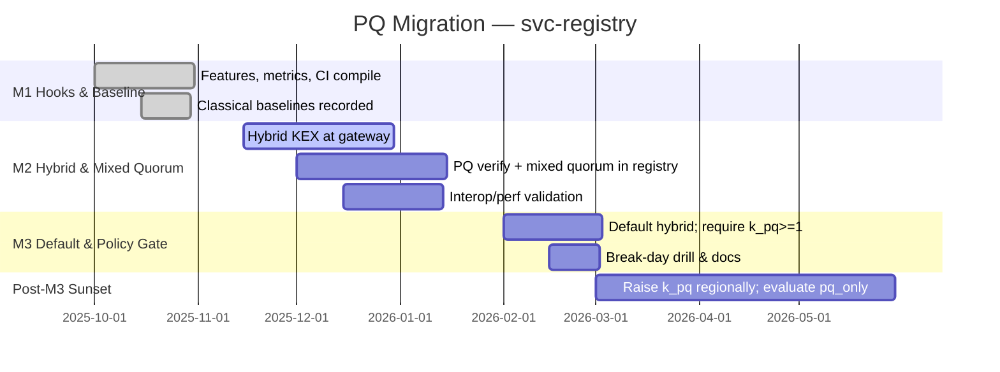

````markdown
---
title: Post-Quantum (PQ) Readiness & Quantum Proofing
status: draft
msrv: 1.80.0
last-updated: 2025-10-08
audience: contributors, security auditors, ops
crate: svc-registry
crate-type: service
pillar: 6                       # Identity & Policy (governed control-plane)
owners: [Stevan White]
---

# QUANTUM.md

## 0) Purpose
Describe how `svc-registry` resists **quantum attacks** and how we migrate to **post-quantum (PQ)** without breaking interop or operations. Registry trust is signature-centric: M-of-N approvals over canonical payloads drive commits to an append-only log. We must (a) protect transport, (b) accept/verify **PQ signatures** for approvals, and (c) do this compatibly (hybrid, staged), with telemetry and rollback.

---

## 1) Exposure Assessment (What’s at risk?)

- **Public-key usage (breakable by Shor):**
  - **Transport/TLS termination:** Often at gateway/omnigate; Micronode may terminate locally. Today: X25519 + ECDSA server certs.
  - **Approvals/Signatures (governance):** **Ed25519** approvals over `payload_b3` (canonical JSON). **Critical path.**
  - **Capability tokens:** Ed25519-signed macaroons (short-lived).

- **Symmetric/Hash (Grover-affected only):**
  - **AEAD:** ChaCha20-Poly1305 / AES-GCM — acceptable margins.
  - **Hash:** BLAKE3-256 — wide margin (Grover halves effective bits).

- **Data at rest / long-lived artifacts:**
  - **Descriptors + audit trail:** public, integrity-critical (not confidentiality).
  - **Caps:** short-lived (minutes), minimal retention.
  - **HNDL risk:** Registry payloads **Low**; TLS session capture **Low→Med**; captured caps **Low** due to short TTL.

- **Transport/Session lifetime:** Seconds–minutes.

- **Blast radius if classical breaks:** Attackers could **forge approvals** going forward if we accept only classical sigs; history remains immutable but **trust in new commits collapses** → add PQ approvals/hybrid now.

> **HNDL = Harvest-Now, Decrypt-Later.** Main concern for registry is **authorization integrity**, not data secrecy.

---

## 2) Current Crypto Profile (Today)

- **Algorithms:** X25519 (TLS), **Ed25519** (approvals & caps), ChaCha20-Poly1305/AES-GCM (TLS), **BLAKE3-256** (hash).
- **Libraries:** rustls/tokio-rustls, ed25519-dalek, blake3, macaroon impl.
- **Key custody:** Signer keys in **ron-kms/HSM**; rotate ≤90d or on compromise. TLS keys via KMS/file (if local term).
- **Interfaces carrying crypto:** REST/SSE transport, approval payloads (sign/verify), capability tokens.

---

## 3) Target PQ Posture (Where we’re going)

- **KEX / transport:** **Hybrid KEX** (X25519 + **ML-KEM/Kyber**) at TLS termination (gateway/omnigate first; Micronode optional).
- **Signatures (approvals, caps):**
  - Primary PQ: **ML-DSA/Dilithium**.
  - Secondary PQ (compact alt): **FN-DSA/Falcon** (optional, when smaller sigs are needed).
  - Hash-based backup (slow/large but conservative): **SLH-DSA/SPHINCS+** (optional).
- **Migration quorum policy:** `M-of-N` with **K PQ approvals** required during transition (mixed quorum).
- **Defaults by milestone:** M1 classical; M2 hybrid KEX + optional PQ approvals; M3 hybrid default + PQ slice required; `pq_only` available for restricted envs.

---

## 4) Feature Flags & Config (How to turn it on)

```toml
# Cargo features (svc-registry)
[features]
pq = []                 # enable PQ interfaces (types, metrics)
pq-hybrid = ["pq"]      # prefer TLS hybrid KEX when terminating TLS
pq-verify = ["pq"]      # enable verification of PQ signatures
pq-falcon = ["pq"]      # enable FN-DSA/Falcon verify (optional)
pq-sphincs = ["pq"]     # enable SLH-DSA/SPHINCS+ verify (optional)
pq-only = []            # refuse classical approvals (rare, controlled)
````

```ini
# svc-registry Config (examples)
[pq]
pq_hybrid = false                   # M2+: true where supported
pq_verify = true                    # accept PQ approvals when present
pq_only = false                     # if true: reject classical approvals
approval_policy = "m=3,n=7,k_pq=1"  # require >=1 PQ approval in quorum

[tls]
terminate_locally = false

[keys]
rotation_days = 90
```

* **Interoperability:** If `pq_only=true`, classical approvals and classical-only handshakes are refused with clear 4xx errors.
* **Metrics:** Always emit PQ-labeled metrics (0 when disabled) to keep dashboards stable.

---

## 5) Migration Plan (Milestones)

* **M1 (Bronze) — Hooks & Baseline**

  * Land features (`pq`, `pq-hybrid`, `pq-verify`), DTO hints, and metrics.
  * Record classical perf baselines (Ed25519 verify, commit p95, handshake costs if local TLS).
  * CI compiles with PQ features (mock adapters OK).

* **M2 (Silver) — Hybrid & Mixed Quorum**

  * Enable **hybrid KEX** at TLS edges handling registry.
  * Add **PQ verify** path (Dilithium primary; optional Falcon/SPHINCS+).
  * Implement **mixed quorum** (`K PQ approvals`) and interop tests:

    * classical↔classical; hybrid↔hybrid; hybrid↔classical (if policy allows).
  * Perf target: ≤10–20% handshake overhead; quantify commit p95 delta as PQ share rises.
  * Rollback: single config flip (documented in RUNBOOK).

* **M3 (Gold) — Default & Policy Gate**

  * Default **pq_hybrid=true**; `pq_verify=true`.
  * Enforce **K≥1 PQ** approval via policy (raise to K≥2/3 by date).
  * Run “**classical break day**” drill: set `pq_only=true`, freeze writes until PQ quorum confirmed, then thaw.

* **Post-M3 — Sunset Classical**

  * Region-by-region increase `K PQ` slice; consider `pq_only=true` in restricted environments.
  * **Annual PQ review** (libs, params, policy).

---

## 6) Invariants (MUST)

* **[PQ-I1]** Approvals on critical paths MUST be **classical+PQ verifiable** during migration; once policy flips, classical-only approvals are rejected.
* **[PQ-I2]** Transport handling write traffic SHOULD use **hybrid KEX** where we terminate TLS.
* **[PQ-I3]** Hashes remain **≥256-bit** (BLAKE3-256).
* **[PQ-I4]** Quorum evaluation supports **mixed quorum** (`M-of-N` with `K PQ`).
* **[PQ-I5]** Key rotation upgrades algorithms without silent fallback; emits audit events.
* **[PQ-I6]** CI passes with `--features pq,pq-hybrid,pq-verify[,+pq-falcon,+pq-sphincs]`; interop parity proven.
* **[PQ-I7]** PQ implementations used MUST be **constant-time** (or hardened against known side-channels); periodic review required.

---

## 7) Observability (Metrics, Logs, Readiness)

* **Metrics:**

  * `approval_verify_total{algo="ed25519|ml-dsa|fn-dsa|slh-dsa",result}`
  * `approval_verify_latency_seconds{algo}` (histogram)
  * `quorum_composition{pq_approvals,classical_approvals,n,m}`
  * `pq_handshake_total{mode="hybrid|classical",role}` (when terminating TLS)
  * `pq_downgrade_total{reason}`  # alert if >0 when policy expects PQ
* **Readiness:** `/readyz` fails if `pq_only=true` and PQ verify is disabled or insufficient PQ signer capacity to meet `k_pq`.
* **Logs:** include `pq_mode=off|hybrid|pq-only`, `approval_algos=[...]`, `policy=m,n,k_pq`, and downgrade causes.

---

## 8) Testing & Verification

* **Unit/property:** canonicalize→hash→verify across algos (Ed25519 + Dilithium + optional Falcon/SPHINCS+); idempotent hashing; schema hygiene stays strict.
* **Interop:** classical-only (until flip), PQ-only, and mixed approvals; ensure quorum logic picks the same result across nodes.
* **Loom:** single-writer commit unaffected by approval algo; no lock-across-await.
* **Fuzz:** approval payload decoders (multi-algo), negotiation/policy edges; error taxonomy stays typed.
* **Perf/load:** measure verify latency and commit p95 as **PQ share** varies (0%→25%→50%→100%); handshake rTT with/without hybrid.
* **Security drills:** “classical break day” + regional K step-ups; confirm downgrade alerts.

---

## 9) Risks & Mitigations

* **Perf/footprint (PQ slower/bigger):**
  Dilithium verify typically **~5–10×** Ed25519 time per approval; signatures **~2–3 KB**. **Note:** performance is **platform-dependent** (CPU, vectorization, library build); always **benchmark locally** and record deltas.
  *Mitigate:* parallelize verify; pre-size CPU; start with **K=1 PQ** slice; cache signer keys; consider **Falcon** where signature size matters.

* **Library churn / side-channels:**
  *Mitigate:* adapter traits around PQ libs; pin versions; prefer constant-time impls ([PQ-I7]); periodic external review.

* **Downgrade risk:**
  *Mitigate:* `pq_only` and `k_pq` policy; alert on `pq_downgrade_total > 0`.

* **E2E gaps (TLS at gateway):**
  *Mitigate:* enforce hybrid at the **gateway**; propagate `pq_mode` label to registry metrics.

* **Operational fragmentation:**
  *Mitigate:* region-scoped policies and readiness checks; staged K increases.

---

## 10) Acceptance Checklist (DoD)

* [ ] Exposure assessed; HNDL labeled with rationale.
* [ ] PQ features compile in CI (`pq`, `pq-hybrid`, `pq-verify` [+ optional algos]).
* [ ] Mixed-quorum implemented & tested; clear errors for policy violations.
* [ ] PQ metrics & dashboards live; downgrade alert wired.
* [ ] RUNBOOK/SECURITY updated (enable/rollback; break-day drill).
* [ ] Perf deltas recorded (verify latency per algo; commit p95 vs PQ share).
* [ ] Gateway hybrid posture documented; Micronode local TLS posture decided.

---

## 11) Role Presets (Registry-specific)

* **Registry (this crate):** verify Ed25519 + PQ (Dilithium; optional Falcon/SPHINCS+); evaluate mixed quorum; emit PQ metrics; fail ready if `pq_only=true` but `k_pq` unmet.
  Defaults: `pq_verify=true`, `pq_hybrid=false (M1) → true (M2+)`, `pq_only=false`.

* **Signer fleet:** dual keys (classical + PQ); sign both during migration; keys in KMS/HSM; rotate on schedule; publish pubkeys+algo in registry.

* **Gateway/Omnigate:** enforce **hybrid KEX**; label traffic `pq_mode`; surface downgrade metrics.

---

## 12) Appendix

### 12.1 Algorithms

* **KEX:** Hybrid X25519 + **ML-KEM/Kyber**. *(Monitor: NIST Round-4 notes incl. potential HQC evaluations; no adoption without FIPS status.)*
* **SIG (primary):** **ML-DSA/Dilithium**.
* **SIG (compact alt):** **FN-DSA/Falcon** (optional).
* **SIG (conservative alt):** **SLH-DSA/SPHINCS+** (optional).
* **Hash:** BLAKE3-256.

### 12.2 Libraries (to pin/evaluate)

* PQ KEM/SIG via vetted Rust bindings (e.g., liboqs-style adapters) behind `pq_verify` module.
* ed25519-dalek retained until classical sunset.

### 12.3 Interop Notes — Mixed-Quorum Approval DTO (example)

```json
{
  "proposal_id": "p_01HZYK9J4Q...",
  "payload_b3": "b3:3b7b2a...c1",
  "approvals": [
    {
      "signer_id": "signer-A",
      "algo": "ed25519",
      "pubkey": "edpk1qk3...",
      "sig": "edsig1abc...",
      "ts": "2025-10-08T12:00:01Z"
    },
    {
      "signer_id": "signer-B",
      "algo": "ml-dsa",               // Dilithium (PQ)
      "pubkey": "pqpk1xy9...",
      "sig": "pqsig1def...",
      "ts": "2025-10-08T12:00:05Z"
    }
  ],
  "quorum": { "m": 3, "n": 7, "k_pq": 1 }  // policy slice requirement
}
```

*Quorum evaluator must count total approvals ≥ m and PQ approvals ≥ k_pq with exact hash binding to `payload_b3`.*

### 12.4 Standards & Roadmap (informative)

* NIST PQ standards: **FIPS 203 (ML-KEM)**, **FIPS 204 (ML-DSA)**, **FIPS 205 (SLH-DSA)** published 2024.
* Track NIST IR updates and Round-4 outcomes (e.g., **HQC** status). Reassess annually and upon material updates.

### 12.5 Migration Timeline (Mermaid)



### 12.6 Rough Perf Anchors (audits; platform-dependent)

* **Ed25519 verify:** sub-millisecond typical (μs–low ms).
* **Dilithium verify:** low-ms; **~5–10×** Ed25519 time; signatures **~2–3 KB**.
* **Falcon verify:** often faster than Dilithium; signature **~700–1,300 B**; stricter impl reqs.
* **SPHINCS+ verify:** slower; signature **~8–50 KB** (use selectively).

> Actual ratios vary by CPU, compiler flags, and library versions — **benchmark locally** and record in PERFORMANCE.md.

### 12.7 “PQ Break Day” Drill Snippet (staging)

```bash
# Freeze writes; flip policy to require PQ; refuse classical
ronctl registry freeze --reason "pq-drill"
ronctl registry config set pq.pq_verify=true
ronctl registry config set pq.approval_policy "m=3,n=7,k_pq=1"
ronctl registry config set pq.pq_only=true

# Validate readiness fails if PQ quorum not achievable
curl -fsS http://127.0.0.1:9909/readyz || echo "ready=false as expected"

# Have at least K PQ-capable signers approve a live proposal, then thaw
ronctl registry propose --file sample.json -o pid.txt
pid=$(cat pid.txt)
ronctl registry approve --id "$pid" --algo ml-dsa --signer signer-B
ronctl registry approve --id "$pid" --algo ed25519 --signer signer-A
ronctl registry approve --id "$pid" --algo ed25519 --signer signer-C
ronctl registry thaw
curl -fsS http://127.0.0.1:9909/readyz

# Observe metrics
curl -s http://127.0.0.1:9909/metrics | grep -E 'approval_verify_|quorum_composition|pq_downgrade_total'
```

```
```
