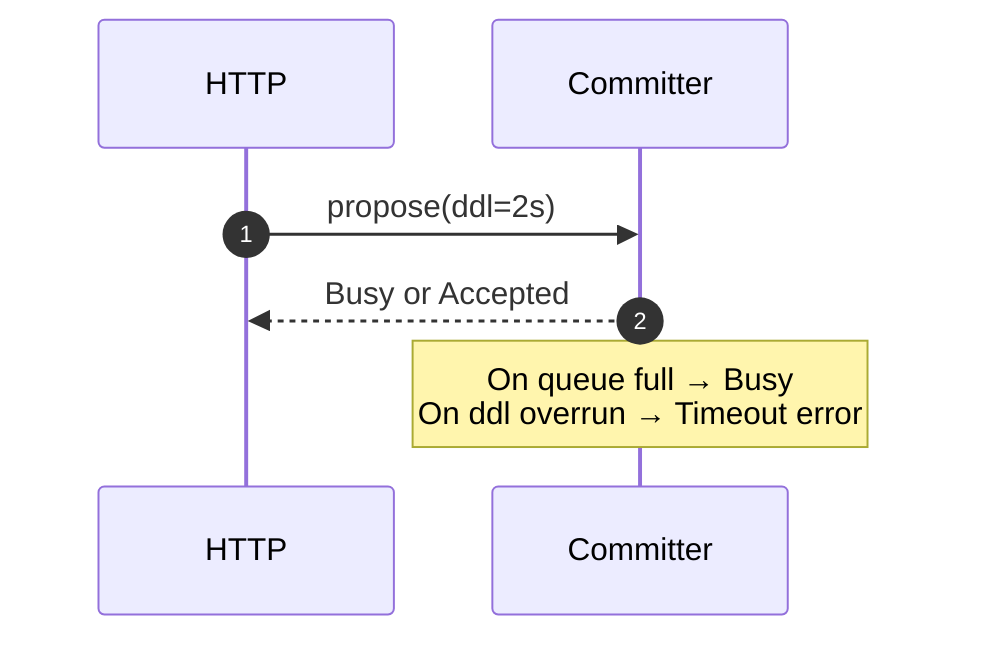
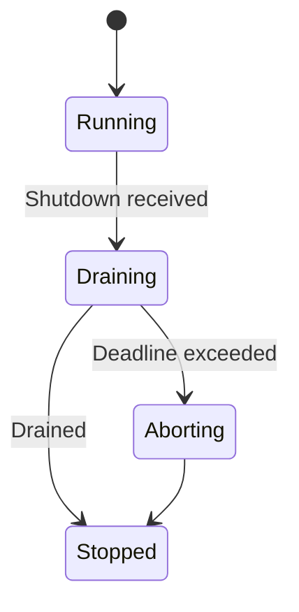
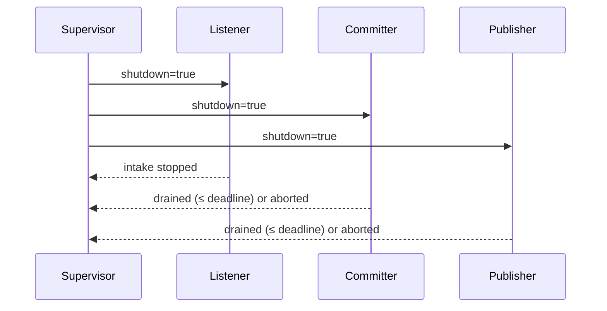
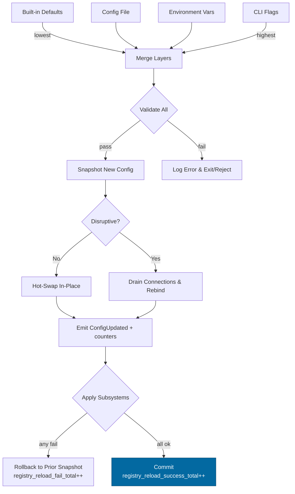
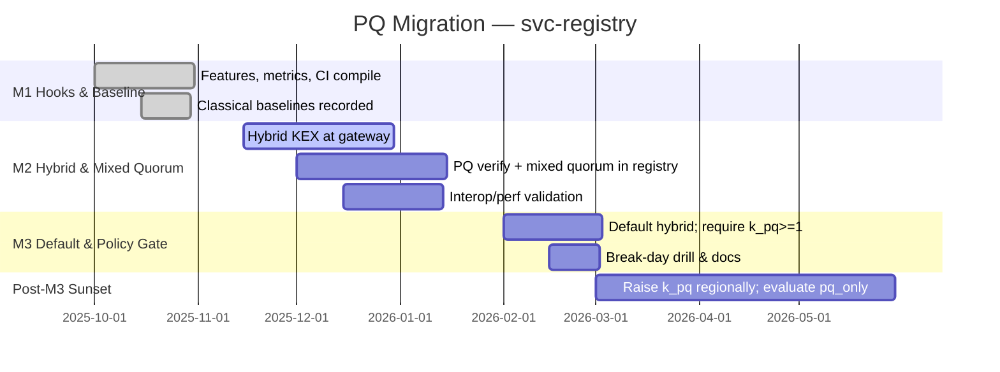

# Combined Markdown

_Source directory_: `crates/svc-registry/docs`  
_Files combined_: 12  
_Recursive_: 0

---

### Table of Contents

- API.MD
- CONCURRENCY.MD
- CONFIG.MD
- GOVERNANCE.MD
- IDB.md
- INTEROP.MD
- OBSERVABILITY.MD
- PERFORMANCE.MD
- QUANTUM.MD
- RUNBOOK.MD
- SECURITY.MD
- TESTS.MD

---

## API.MD
_File 1 of 12_

---

title: API Surface & SemVer Reference — svc-registry
status: draft
msrv: 1.80.0
last-updated: 2025-10-08
audience: contributors, auditors, API consumers
-----------------------------------------------

# API.md — svc-registry

## 0. Purpose

This document captures the **public API surface** for `svc-registry`:

* Snapshot of exported Rust symbols (should be minimal for a service crate).
* Full HTTP API (endpoints, request/response schemas, error model, auth).
* SemVer discipline and CI gates for surface changes.
* Alignment with the crate’s IDB, CONFIG, SECURITY, and OBSERVABILITY docs.

> Role reminder: `svc-registry` is the authoritative, **append-only**, **signed** registry of descriptors (nodes/services/regions). It verifies threshold signatures, enforces quorum, commits a tamper-evident chain, and emits non-blocking bus updates.

---

## 1. Public API Surface (Rust)

Service crates keep Rust surface tiny and stable; most functionality is HTTP + config.

Generate on CI (this command fails the build on unintended diffs):

```bash
cargo public-api -p svc-registry --simplified --deny-changes
```

### 1.1 Current Rust Surface (snapshot)

```text
# Root binary entrypoints (not a library API)
pub fn main()

# Re-exports for integration tests (documented, intentionally public)
pub mod config
pub mod observability
pub mod error

# Types intentionally public for embedding/testing (#[non_exhaustive] where applicable)
pub struct Config
pub enum Error           #[non_exhaustive]
pub struct Metrics       // handle cloneable across tasks
pub struct BuildInfo     // { name, version, commit, build_time }

# NOTE: No public commitment to internal storage, bus, or HTTP framework types.
# No public async functions—service API is HTTP, not Rust SDK.
```

> If we ever need a Rust SDK, it will live in a separate crate (`sdk-registry`) with its own API.md.

---

## 2. HTTP API (authoritative)

All endpoints return **JSON**. Errors follow a typed error schema. Durations are RFC3339/ISO8601-friendly where applicable. Body caps and compression caps apply (see CONFIG).

### 2.1 Authentication & Authorization

* **Capability tokens (macaroons)** in `Authorization: Bearer <token>` for write paths:

  * Scopes: `registry:propose`, `registry:approve`, `registry:commit`.
  * Short-lived; attenuable.
* Read paths may be public but **rate-limited**.
* UDS callers are additionally gated by `SO_PEERCRED` allow-list.

### 2.2 Common Headers

* `X-Corr-ID`: request correlation ID (ULID/UUID). Generated if absent and echoed in responses.
* `Deprecation`, `Sunset`: present when calling deprecated surfaces (see CONFIG).
* `Cache-Control: no-store` on write paths; reads may use `max-age` for immutable versions.

### 2.3 Endpoints

#### `GET /version` — build & schema info

**200 OK**

```json
{
  "service": "svc-registry",
  "version": "1.0.0",
  "commit": "abcdef1",
  "schema": { "registry": "1.0.0" },
  "deprecations": [
    { "surface": "/registry/stream", "since": "2025-09-01", "sunset": "2026-03-01", "notes": "Use SSE v2" }
  ]
}
```

---

#### `GET /healthz` — liveness

**200 OK** if process alive.

---

#### `GET /readyz` — readiness

**200 OK** when storage open, last HEAD validated, commit pipeline/bus ready.

**503 Service Unavailable**

```json
{
  "ready": false,
  "write_ready": false,
  "degraded": true,
  "missing": ["storage","bus"],
  "retry_after": 5
}
```

---

#### `GET /registry/head` — current head summary

**200 OK**

```json
{
  "version": 42,
  "payload_b3": "b3:7a0e...",
  "committed_at": "2025-10-08T18:12:00Z"
}
```

---

#### `GET /registry/{version}` — full descriptor set (immutable)

Path: `version: u64` (monotonic).

**200 OK**

```json
{
  "schema_version": "1.0.0",
  "version": 40,
  "items": [ /* descriptors from ron-proto DTOs */ ],
  "payload_b3": "b3:2f9a...",
  "approvals": [
    {"signer_id":"org:alpha#key1","algo":"ed25519","sig":"base64","signed_at":"2025-10-07T10:11:12Z"}
  ],
  "prev_hash": "b3:1aa3...",
  "committed_at": "2025-10-07T12:00:00Z"
}
```

**404 Not Found** if version does not exist.

---

#### `GET /registry/stream` — event stream (SSE)

Sends `text/event-stream` lines for committed updates. **Lossy** under lag; consumers must reconcile by calling `/registry/head` when gaps detected.

Event payload example:

```json
{ "version": 43, "payload_b3": "b3:...", "committed_at": "2025-10-08T18:30:01Z", "corr_id": "01J..." }
```

---

#### `POST /registry/proposals` — submit a proposal (write)

**Auth:** `registry:propose`

**Request**

```json
{
  "schema_version": "1.0.0",
  "payload": { "version": 42, "items": [/* descriptors */] },
  "payload_b3": "b3:7a0e..."  // optional; server recomputes and verifies
}
```

**202 Accepted**

```json
{ "proposal_id": "p_7f3ce2", "payload_b3": "b3:7a0e...", "expires_at": "2025-10-09T00:00:00Z" }
```

**429 Too Many Requests** when queue full (`Error::Busy`).

**400 Bad Request** for malformed/oversized request.

---

#### `POST /registry/approvals/{proposal_id}` — add an approval

**Auth:** `registry:approve`

**Request**

```json
{
  "signer_id": "org:alpha#key1",
  "algo": "ed25519",
  "sig": "base64(signature_over_payload_b3)",
  "signed_at": "2025-10-08T18:20:00Z"
}
```

**200 OK**

```json
{ "status": "accepted", "approvals": 2, "quorum": { "m": 2, "n": 3 } }
```

**409 Conflict** if signer revoked or duplicate approval (`err.code=DuplicateApproval`).

---

#### `POST /registry/commit/{proposal_id}` — finalize commit after quorum

**Auth:** `registry:commit`

Server verifies:

* Quorum **M-of-N** satisfied,
* Signer set & revocations current,
* `payload_b3` integrity,
* CAS on `HEAD{version,hash}` (single-writer).

**201 Created**

```json
{
  "version": 42,
  "payload_b3": "b3:7a0e...",
  "committed_at": "2025-10-08T18:22:11Z"
}
```

**409 Conflict** (`err.code=ChainMismatch`) if HEAD advanced concurrently → client should refetch and possibly re-propose.

**400/401/403** for invalid signatures or missing scopes.

---

#### `POST /registry/supersede` — administrative supersede (rare)

Used to replace current HEAD with a signed **supersede** record (see IDB). Requires governance capabilities and reason.

**Auth:** governance-scoped macaroon, multi-approver flow.

**Request**

```json
{
  "supersede_of": "b3:oldhead...",
  "supersede_reason": "KeyCompromise",
  "note": "Rotating compromised signer set"
}
```

**201 Created** with new HEAD summary, or **409** if `supersede_of` != current HEAD.

---

### 2.4 Error Model (typed)

All error responses use this envelope (HTTP status reflects category):

```json
{
  "error": {
    "code": "InvalidSig|QuorumFailed|RevokedKey|Busy|Timeout|Malformed|ChainMismatch|Unauthorized|Forbidden",
    "message": "human readable (stable-ish)",
    "corr_id": "01J...",
    "details": { }
  }
}
```

* `code` is stable for dashboards and automation.
* `message` is for humans; avoid parsing it.
* `details` may carry structured hints (e.g., which signer was revoked).

---

## 3. DTOs (schemas)

DTOs are defined in `ron-proto` and referenced here. The **wire schema** is **non-breaking additive** within a major series:

* Top-level envelope: `SignedArtifact { schema_version, payload, payload_b3, approvals[], prev_hash, committed_at }`
* `DescriptorSet { version: u64, items: Vec<Descriptor>, prev_hash?, created_at, expiry? }`
* `Approval { signer_id, algo, sig, signed_at }`

**Schema rules**

* `deny_unknown_fields` on all decoders.
* Additive-only within a major version; removals/renames require a major bump.
* Include `schema_version` in every payload.

---

## 4. SemVer Discipline

### 4.1 Service (HTTP) surface

* **Non-breaking (minor):**

  * Adding new endpoints.
  * Adding **optional** request/response fields.
  * Adding new enum values **when marked** `#[non_exhaustive]` in docs (clients must ignore unknown).
  * Introducing new headers that are optional (`Warning`, `Sunset`, etc.).

* **Breaking (major):**

  * Removing/renaming endpoints or fields.
  * Changing types/meaning of existing fields.
  * Tightening validation that rejects previously-valid inputs (unless behind an opt-in flag through a deprecation window).
  * Changing error `code` strings.

* **Patch:**

  * Doc clarifications, perf improvements, additional metrics, stricter **server-side** defaults that do not cause request rejections.

> **Deprecations:** minimum **2 minor releases** **or** **180 days** window, announced via `/version`, `Deprecation`/`Sunset` headers, and CHANGELOG.

### 4.2 Rust surface

* This crate’s Rust surface is intentionally small. Any new public types must be `#[non_exhaustive]` where reasonable.
* **No** public export of internal HTTP/storage/bus types.

---

## 5. Stability Guarantees

* **MSRV:** `1.80.0`.
* **Unsafe:** forbidden unless justified with a doc comment + tests.
* **Content hashes:** `payload_b3` remains stable for the same payload bytes.
* **Idempotency:** `POST /registry/commit/{proposal_id}` is idempotent—retries return the same committed version if already committed.

---

## 6. Tooling

* `cargo public-api` — detects Rust symbol diffs.
* `cargo semver-checks` (optional) — semantic checks for crate API.
* Contract tests for HTTP surface:

  * `tests/http_contract.rs` spins the service and asserts endpoint existence, headers, and error codes.
* API snapshots stored under: `/docs/api-history/svc-registry/{version}.txt`.

---

## 7. CI & Gates

* **Gate A:** `cargo public-api -p svc-registry --deny-changes` (service should have no or few public symbols).
* **Gate B:** `tests/http_contract.rs` must pass (endpoints & headers).
* **Gate C:** CHANGELOG entry required whenever HTTP surface changes.
* **Gate D:** Deprecation policy enforced (check `/version` emits the deprecation table; CI asserts presence when PR marks deprecations).

Example GitHub Actions step:

```yaml
- name: Public API surface
  run: cargo public-api -p svc-registry --simplified --deny-changes

- name: HTTP contract tests
  run: cargo test -p svc-registry --test http_contract -- --nocapture
```

---

## 8. Acceptance Checklist (DoD)

* [ ] Current **Rust** API snapshot generated & stored in `/docs/api-history/...`.
* [ ] HTTP endpoints documented here match `tests/http_contract.rs`.
* [ ] SemVer review performed; changes classified (patch/minor/major).
* [ ] Deprecations (if any) have `Deprecation`/`Sunset` headers and appear in `/version`.
* [ ] CI gates (`cargo public-api`, contract tests) are green.
* [ ] CHANGELOG updated with behavior and surface changes.
* [ ] OpenAPI document updated (below) and committed under `/docs/openapi/registry.yaml`.

---

## 9. OpenAPI (authoritative excerpt)

> Full spec lives at `/docs/openapi/registry.yaml`. Keep excerpt in sync.

```yaml
openapi: 3.0.3
info:
  title: svc-registry
  version: "1.0.0"
servers:
  - url: https://registry.local
components:
  securitySchemes:
    macaroon:
      type: http
      scheme: bearer
  schemas:
    Error:
      type: object
      required: [error]
      properties:
        error:
          type: object
          required: [code, message, corr_id]
          properties:
            code:
              type: string
              enum: [InvalidSig, QuorumFailed, RevokedKey, Busy, Timeout, Malformed, ChainMismatch, Unauthorized, Forbidden]
            message: { type: string }
            corr_id: { type: string }
            details: { type: object, additionalProperties: true }
paths:
  /registry/head:
    get:
      summary: Current HEAD
      responses:
        "200":
          description: OK
        "503":
          $ref: "#/components/schemas/Error"
  /registry/{version}:
    get:
      parameters:
        - in: path
          name: version
          required: true
          schema: { type: integer, format: int64, minimum: 0 }
      responses:
        "200": { description: OK }
        "404": { $ref: "#/components/schemas/Error" }
  /registry/proposals:
    post:
      security: [{ macaroon: [] }]
      responses:
        "202": { description: Accepted }
        "400": { $ref: "#/components/schemas/Error" }
        "401": { $ref: "#/components/schemas/Error" }
        "429": { $ref: "#/components/schemas/Error" }
  /registry/approvals/{proposal_id}:
    post:
      security: [{ macaroon: [] }]
      parameters:
        - in: path
          name: proposal_id
          required: true
          schema: { type: string }
      responses:
        "200": { description: OK }
        "401": { $ref: "#/components/schemas/Error" }
        "409": { $ref: "#/components/schemas/Error" }
  /registry/commit/{proposal_id}:
    post:
      security: [{ macaroon: [] }]
      parameters:
        - in: path
          name: proposal_id
          required: true
          schema: { type: string }
      responses:
        "201": { description: Created }
        "400": { $ref: "#/components/schemas/Error" }
        "401": { $ref: "#/components/schemas/Error" }
        "409": { $ref: "#/components/schemas/Error" }
```

---

## 10. Examples (consumer-friendly)

### 10.1 Read the head

```bash
curl -sS http://localhost:8080/registry/head \
  -H 'X-Corr-ID: 01JBC4XYA8...' | jq .
```

### 10.2 Propose → Approve → Commit

```bash
# 1) Propose
curl -sS -X POST http://localhost:8080/registry/proposals \
  -H 'Authorization: Bearer eyJ...macaroon' \
  -H 'Content-Type: application/json' \
  -d @proposal.json

# -> { "proposal_id": "p_7f3ce2", "payload_b3": "b3:..." }

# 2) Approve (repeat for each signer)
curl -sS -X POST http://localhost:8080/registry/approvals/p_7f3ce2 \
  -H 'Authorization: Bearer eyJ...macaroon' \
  -H 'Content-Type: application/json' \
  -d @approval-signer1.json

# 3) Commit
curl -sS -X POST http://localhost:8080/registry/commit/p_7f3ce2 \
  -H 'Authorization: Bearer eyJ...macaroon'
```

### 10.3 SSE stream

```bash
curl -N http://localhost:8080/registry/stream
```

Handle gaps by calling `/registry/head` and diffing your local state.

---

## 11. History (examples of future entries)

* **1.1.0** — Added `POST /registry/supersede` (governance-only); non-breaking.
* **1.0.0** — Initial GA: `head`, `version`, `stream`, propose/approve/commit; error envelope standardized.

---

### Notes to reviewers

* **Service-first**: treat HTTP surface as the canonical API. Rust surface is incidental and intentionally small.
* **Invariant alignment**: every change should be checked against IDB invariants (MUSTs), especially multi-sig, CAS on HEAD, non-blocking bus, DTO hygiene, and deprecation windows.
* **CI**: keep `/docs/openapi/registry.yaml` and this document in sync; PRs that alter endpoints must update both and the contract tests.


---

## CONCURRENCY.MD
_File 2 of 12_

---

title: Concurrency Model — svc-registry
crate: svc-registry
owner: Stevan White
last-reviewed: 2025-10-08
status: draft
template_version: 1.1
msrv: 1.80.0
tokio: "1.x (pinned at workspace root)"
loom: "0.7+ (dev-only)"
lite_mode: "N/A (service crate)"
--------------------------------

# Concurrency Model — svc-registry

This document makes the concurrency rules **explicit**: tasks, channels, locks, shutdown, timeouts,
and validation (property/loom/TLA+). It complements `docs/SECURITY.md`, `docs/CONFIG.md`,
and the crate’s `README.md` and `IDB.md`.

> **Golden rule:** never hold a lock across `.await` in supervisory or hot paths.

---

## 0) Lite Mode

N/A — `svc-registry` is a networked service with background tasks.

---

## 1) Invariants (MUST)

* **No lock across `.await`.** Split critical sections; extract values before awaits.
* **Single writer per mutable resource.**

  * Exactly **one Committer task** is allowed to advance `HEAD` and append to the log.
  * Exactly **one Retention task** may prune segments *after* signed checkpoints.
* **Bounded channels only** with an explicit overflow policy (reject/drop-oldest). No unbounded queues.
* **Explicit timeouts** on all I/O and RPCs; fail-fast with typed errors.
* **Cooperative cancellation.** Every `.await` sits under a `select!` with shutdown, or is cancel-safe.
* **Graceful shutdown**: stop intake, drain within a deadline, abort stragglers; report metrics.
* **No blocking syscalls** on the async runtime; use `spawn_blocking` for FS checksums/fd-heavy ops if needed.
* **No task leaks**: track `JoinHandle`s; detach only for fire-and-forget telemetry with reason.
* **Backpressure over buffering**: prefer `try_send` → `Busy` to keep tail latency bounded.
* **Framing**: length-delimited JSON/CBOR; body size limited; decompress ratio enforced.
* **Audit chain integrity is preserved under concurrency**: commits are CAS’d on `HEAD{version,hash}`.

**Async Drop**

* **Do not block in `Drop`.** Provide `async fn shutdown()`/`close()` for teardown (e.g., SSE senders, file handles). `Drop` logs a debug if resources weren’t closed.

---

## 2) Runtime Topology

**Runtime:** Tokio **multi-threaded** runtime (worker threads = CPU cores by default).

**Supervisory layout & tasks:**

* **Supervisor** (root task)

  * Spawns and monitors all children; handles **backoff+jitter** restarts on panic; observes global shutdown.
* **HTTP Listener**

  * Accepts requests and routes to handlers; enforces read/write/idle timeouts and body caps.
* **Commit Pipeline**

  * Serializes **propose → approve → commit**; enforces quorum; **single writer** to `HEAD`.
* **Bus Publisher**

  * Consumes committed updates and emits `RegistryUpdated{version,b3}` events; bounded and non-blocking to Committer.
* **Checkpointor**

  * Periodically produces signed **Checkpoints** that cover log ranges for retention safety.
* **Retention/Pruner**

  * Prunes segments strictly **covered** by a checkpoint; never blocks Committer; runs in small batches.
* **Deep Verifier**

  * Background validator that incrementally re-verifies audit chain from last checkpoint; bounded work/time slice.
* **Config Reloader**

  * Applies SIGHUP/bus-driven config snapshots; non-disruptive vs. disruptive rebind logic; rollback on failure.
* **Metrics/Health Gate**

  * Exposes `/metrics`, `/healthz`, `/readyz`; flips readiness on storage/bus/commit-path degradation.
* **OTel Exporter (optional)**

  * Initializes and exports spans; can be reconfigured at runtime.

```mermaid
flowchart TB
  subgraph Runtime
    SUP[Supervisor]
    L[HTTP Listener]
    CP[Commit Pipeline (single writer)]
    PUB[Bus Publisher]
    CK[Checkpointor]
    PR[Retention / Pruner]
    DV[Deep Verifier]
    CR[Config Reloader]
    HG[Health/Metrics]
  end

  SUP -->|spawn| L
  SUP -->|spawn| CP
  SUP -->|spawn| PUB
  SUP -->|spawn| CK
  SUP -->|spawn| PR
  SUP -->|spawn| DV
  SUP -->|spawn| CR
  SUP -->|spawn| HG

  L -->|mpsc: proposals| CP
  L -->|mpsc: approvals| CP
  CP -->|broadcast: committed| PUB
  CP -->|broadcast: committed| DV
  CK -->|watch checkpoints| PR

  SUP -->|watch Shutdown| L
  SUP -->|watch Shutdown| CP
  SUP -->|watch Shutdown| PUB
  SUP -->|watch Shutdown| CK
  SUP -->|watch Shutdown| PR
  SUP -->|watch Shutdown| DV
  SUP -->|watch Shutdown| CR
  SUP -->|watch Shutdown| HG

  style SUP fill:#0ea5e9,stroke:#0c4a6e,color:#fff
```

**Text:** Supervisor spawns Listener, Committer (single-writer), Publisher, Checkpointor, Retention, Deep Verifier, Config Reloader, and Health Gate. Listener feeds proposals/approvals into Committer. Committer broadcasts committed events to Publisher and Deep Verifier. Checkpointor triggers Retention. All watch a shared Shutdown channel.

---

## 3) Channels & Backpressure

**Inventory (all bounded):**

| Name               | Kind        | Capacity (default) | Producers → Consumers | Backpressure Policy              | Drop Semantics / Caller Behavior                            |
| ------------------ | ----------- | -----------------: | --------------------- | -------------------------------- | ----------------------------------------------------------- |
| `proposals_tx`     | `mpsc`      |                512 | HTTP → Committer      | `try_send` else `Busy`           | Return 429/`Error::Busy`; increment `busy_rejections_total` |
| `approvals_tx`     | `mpsc`      |                512 | HTTP → Committer      | `try_send` else `Busy`           | Same as above                                               |
| `committed_tx`     | `broadcast` |               1024 | Committer → N         | lag counter + drop to next value | `bus_lagged_total++`; slow consumers miss old events        |
| `shutdown_rx`      | `watch`     |                  1 | Supervisor → N        | last-write-wins                  | N/A                                                         |
| `cfg_reload_tx`    | `mpsc`      |                 16 | Signal → Reloader     | enqueue with `try_send`          | Collapse if full; keep latest (also via `watch` optional)   |
| `retention_cmd_tx` | `mpsc`      |                  8 | Checkpointor → Pruner | `try_send` → skip cycle          | Log skip; retry on next interval                            |

**Guidelines:**

* Use **`try_send` + error** rather than awaiting queue space in request handlers.
* Emit `queue_depth{queue}`, `queue_dropped_total{queue}`, and `busy_rejections_total{endpoint}`.
* Broadcast consumers **must** reconcile via `GET /registry/head` after lag.

---

## 4) Locks & Shared State

**Allowed (short, non-async critical sections only):**

* `Mutex`/`RwLock` for **metadata** (counters, in-memory index) with guards dropped before `.await`.
* `Arc<StateSnapshot>` for read-mostly **HEAD view** served to readers.
* Per-connection/request state owned by its task; cross-task via channels.

**Forbidden**

* Holding any lock across `.await`.
* Nested locks except per this hierarchy (outer → inner), and only for short sections:

  1. `state_meta` → 2) `routing_table` → 3) `counters`.

**HEAD & log mutation discipline**

* Committer is the **only** task allowed to:

  * CAS on `HEAD{version,hash}`.
  * Append new `SignedArtifact` to the log.
* Retention/pruning never mutates `HEAD`; it only removes segments **strictly covered** by a signed checkpoint.

---

## 5) Timeouts, Retries, Deadlines

* **HTTP I/O:** `read=5s`, `write=5s`, `idle=60s` (configurable). Enforced via Tower layers.
* **Commit pipeline:** end-to-end request deadline propagated from HTTP handler.
* **Retries:** only for **idempotent** internal ops (e.g., storage read) with jittered backoff (50–100ms, cap 2s, max 3 tries).
* **Backoff/jitter:** used by Supervisor restarts and storage transient errors.
* **Circuit breaker (optional):** open on error-rate spikes; half-open after cool-down with probes.



---

## 6) Cancellation & Shutdown

* **Signal sources:** `KernelEvent::Shutdown` and OS `ctrl_c`.
* **Propagation:** `tokio::select!` on every loop: `{ _ = shutdown.changed() => … }`.
* **Draining:** stop accepting new work; allow in-flight to finish within `drain_deadline` (config, default 3s).
* **Abort:** after deadline, abort remaining tasks (`handle.abort()`); increment `tasks_aborted_total{kind}`.
* **Readiness:** `/readyz` flips **write-unready first**, then read-unready if core deps fail.



---

## 7) I/O & Framing

* **HTTP/JSON (and CBOR for payloads)** with `Content-Length` enforced and body cap (default 1 MiB).
* **SSE/WebSocket streams**: bounded internal buffers; handle split writes; backpressure by dropping to latest `HEAD`.
* **Storage I/O**: append-only writes with `fsync` on critical sections (commit & checkpoint). Use `spawn_blocking` for any heavy hashing if it ever becomes CPU-bound.

---

## 8) Error Taxonomy (Concurrency-Relevant)

| Error           | When                      | Retry?    | Metric                            | Notes                    |
| --------------- | ------------------------- | --------- | --------------------------------- | ------------------------ |
| `Busy`          | mpsc full                 | caller    | `busy_rejections_total{endpoint}` | 429 to clients           |
| `Timeout`       | deadline exceeded         | sometimes | `io_timeouts_total{op}`           | includes commit deadline |
| `Canceled`      | shutdown during wait/work | no        | `tasks_canceled_total{kind}`      | graceful stop            |
| `Lagging`       | broadcast overflow        | no        | `bus_lagged_total{consumer}`      | consumer must reconcile  |
| `ChainMismatch` | CAS on HEAD failed        | yes       | `commit_cas_fail_total`           | race → reload & retry    |
| `StorageBusy`   | store backpressure/locks  | yes       | `storage_backoff_total{op}`       | backoff+jitter           |

---

## 9) Metrics (Concurrency Health)

* `queue_depth{queue}` gauge (sampled)
* `queue_dropped_total{queue}` counter
* `busy_rejections_total{endpoint}` counter
* `tasks_spawned_total{kind}` / `tasks_aborted_total{kind}` / `tasks_panicked_total{kind}`
* `commit_cas_fail_total` counter
* `io_timeouts_total{op}` (`read`,`write`,`commit`)
* `backoff_retries_total{op}`
* `bus_lagged_total{consumer}`
* `registry_reload_success_total{source}` / `registry_reload_fail_total{reason}`

---

## 10) Validation Strategy

**Unit / Property**

* Backpressure: when queue is full, handlers return `Busy` and increment metrics; never block.
* Deadlines: `commit` path honors caller deadline within tolerance.
* Single-writer: property tests assert no path other than Committer mutates `HEAD`.

**Loom (dev-only)**

* Model `proposals_tx` → Committer → `committed_tx` with shutdown.
* Assertions: no deadlock; `shutdown` is always observed; no double-commit for same proposal.

**Fuzz**

* HTTP JSON/CBOR payload fuzz (malformed/oversized/duplicate approvals).
* SSE stream fuzzer for partial frames/slow consumers.

**Chaos**

* Stall `Bus Publisher`: commits still succeed; `bus_lagged_total` increments.
* Slow storage: `/readyz` flips write-unready first; drain obeys deadline.

**TLA+ (optional)**

* Model `HEAD` CAS and hash-chain append; prove safety (no two different artifacts at same version) and liveness (eventual commit under fair scheduling).

---

## 11) Code Patterns (Copy-Paste)

**Spawn + cooperative shutdown**

```rust
let (shutdown_tx, shutdown_rx) = tokio::sync::watch::channel(false);

fn spawn_worker(mut rx: tokio::sync::mpsc::Receiver<Job>, mut sd: tokio::sync::watch::Receiver<bool>) 
  -> tokio::task::JoinHandle<()> 
{
  tokio::spawn(async move {
    loop {
      tokio::select! {
        _ = sd.changed() => break,
        maybe = rx.recv() => {
          let Some(job) = maybe else { break };
          if let Err(e) = handle_job(job).await {
            tracing::warn!(error=%e, "worker job failed");
          }
        }
      }
    }
  })
}
```

**Bounded `mpsc` with `try_send`**

```rust
match proposals_tx.try_send(proposal) {
  Ok(_) => {}
  Err(tokio::sync::mpsc::error::TrySendError::Full(_)) => {
    metrics::busy_rejections_total().with_label_values(&["propose"]).inc();
    return Err(Error::Busy);
  }
  Err(e) => return Err(Error::from(e)),
}
```

**No lock across `.await`**

```rust
// compute outside await
let to_commit = {
  let meta = state_meta.read();
  meta.prepare_commit(input)
}; // drop guard
commit_async(to_commit).await?;
```

**Shutdown with deadline**

```rust
let deadline = tokio::time::Instant::now() + cfg.drain_deadline;
if tokio::time::timeout(deadline - tokio::time::Instant::now(), join_all(handles)).await.is_err() {
  for h in handles { h.abort(); }
}
```

**Single-writer CAS on HEAD**

```rust
// Committer only
let expected = Head { version, hash };
if store.compare_and_set_head(&expected, &new_head).await? {
  committed_tx.send(new_head).ok();
} else {
  metrics::commit_cas_fail_total().inc();
  // reload current head and decide whether to retry or reject
}
```

---

## 12) Configuration Hooks (Quick Reference)

* `limits.rps`, `limits.inflight`, `limits.max_body_bytes`, `limits.decompress_ratio_cap`
* HTTP timeouts: `read_timeout`, `write_timeout`, `idle_timeout`
* Channel capacities: proposals (512), approvals (512), broadcast (1024) — all configurable if desired
* Shutdown: `drain_deadline`
* Retention cadence: `storage.checkpoint_interval`
* Bus bound: `bus.channel_bound`

See `docs/CONFIG.md` for authoritative schema and defaults.

---

## 13) Known Trade-offs / Nonstrict Areas

* **Broadcast lossiness:** slow consumers may miss intermediate `committed` events; they must reconcile via `GET /registry/head`.
* **Reject vs. drop-oldest:** request paths use **reject (Busy)** to bound tail latency; internal event streams use **drop-to-latest** to avoid amplification.
* **Deep verification is best-effort:** limited time-slice to avoid starving hot paths; integrity is still guaranteed by commit-time checks and CAS.

---

## 14) Mermaid Diagrams (REQUIRED)

### 14.1 Task & Queue Topology

```mermaid
flowchart LR
  IN[HTTP Ingress] -->|mpsc:proposals(512)| COM[Committer (single writer)]
  IN -->|mpsc:approvals(512)| COM
  COM -->|broadcast:committed(1024)| PUB[Bus Publisher]
  COM -->|broadcast:committed(1024)| DV[Deep Verifier]
  CK[Checkpointor] -->|cmds| PR[Retention]
  SHUT[Shutdown watch] --> IN
  SHUT --> COM
  SHUT --> PUB
  SHUT --> DV
  SHUT --> CK
  SHUT --> PR
```

**Text:** Ingress feeds proposals/approvals to Committer via bounded channels. Committer broadcasts committed events to Publisher and Deep Verifier. Checkpointor commands Retention. All tasks subscribe to Shutdown.

### 14.2 Shutdown Sequence



---

## 15) CI & Lints (Enforcement)

**Clippy / rustc**

* `-D warnings`
* `-W clippy::await_holding_lock`
* `-W clippy::dbg_macro` / `-W clippy::todo`
* `-W clippy::unwrap_used` (allow in tests only)

**GitHub Actions (suggested)**

```yaml
name: svc-registry-concurrency
on: [push, pull_request]
jobs:
  clippy:
    runs-on: ubuntu-latest
    steps:
      - uses: actions/checkout@v4
      - uses: dtolnay/rust-toolchain@stable
      - run: cargo clippy -p svc-registry -- -D warnings -W clippy::await_holding_lock

  loom:
    if: github.event_name == 'pull_request'
    runs-on: ubuntu-latest
    steps:
      - uses: actions/checkout@v4
      - uses: dtolnay/rust-toolchain@stable
      - run: RUSTFLAGS="--cfg loom" cargo test -p svc-registry --tests -- --ignored --nocapture

  fuzz:
    runs-on: ubuntu-latest
    steps:
      - uses: actions/checkout@v4
      - uses: dtolnay/rust-toolchain@stable
      - run: cargo install cargo-fuzz
      - run: cargo fuzz build -p svc-registry
```

---

## 16) Schema Generation (Optional)

Automate **Channels/Locks tables** from code to avoid rot:

* Annotate channels/locks via small macros or keep a `concurrency.rs` registry module.
* Golden test compares doc table to the runtime registry (fail CI if drift detected).

---

## 17) Review & Maintenance

* **Review cadence:** every 90 days or on any change to tasks/channels/locks.
* **Keep `owner`, `msrv`, `last-reviewed` current.**
* **PR checklist:** if you modify runtime topology, update this doc + Loom tests + chaos scenarios.

---


---

## CONFIG.MD
_File 3 of 12_


---

title: Configuration — svc-registry
crate: svc-registry
owner: Stevan White
last-reviewed: 2025-10-08
status: draft
template_version: 1.1
---------------------

# Configuration — svc-registry

This document defines **all configuration** for `svc-registry`, including sources,
precedence, schema (types/defaults), validation, feature flags, live-reload behavior,
and security implications. It complements `README.md`, `docs/SECURITY.md`, and the crate’s IDB.

> **Tiering:**
> **Service crate.** Applies to network, readiness, observability, storage, and retention/compaction.
> Registry holds **no signing keys**; it verifies signatures and enforces governance.

---

## 1) Sources & Precedence (Authoritative)

Configuration may come from multiple sources. **Precedence (highest wins):**

1. **Process flags** (CLI)
2. **Environment variables**
3. **Config file** (e.g., `Config.toml` beside the binary or path via `--config`)
4. **Built-in defaults** (hard-coded)

> On dynamic reload, the effective config is recomputed under the same precedence and applied atomically.

**Supported file formats:** TOML (preferred), JSON (optional).
**Path resolution for `--config` (if relative):** `./`, `$CWD`, binary dir.

**Env prefix convention:** all env vars begin with `SVCR_` (short for **S**er**v**i**c**e **R**egistry).

---

## 2) Quickstart Examples

### 2.1 Minimal service start

```bash
RUST_LOG=info \
SVCR_BIND_ADDR=0.0.0.0:8080 \
SVCR_METRICS_ADDR=127.0.0.1:0 \
cargo run -p svc-registry
```

### 2.2 Config file (TOML)

```toml
# Config.toml
bind_addr     = "0.0.0.0:8080"
metrics_addr  = "127.0.0.1:0"
max_conns     = 1024
read_timeout  = "5s"
write_timeout = "5s"
idle_timeout  = "60s"

[limits]
max_body_bytes       = "1MiB"
decompress_ratio_cap = 10
rps                  = 500
inflight             = 512

[tls]
enabled   = false
# cert_path = "/etc/ron/cert.pem"
# key_path  = "/etc/ron/key.pem"

[uds]
path       = ""         # e.g., "/run/registry.sock"
allow_uids = []         # e.g., [1000, 1001]

[auth]
macaroon_path = ""      # optional; if set, used for local admin client flows

[otel]
tracing_enabled = true
exporter        = "none"  # "none" | "otlp"
endpoint        = "http://127.0.0.1:4317"

[storage]
kind                = "sled"   # "sled" | "sqlite"
data_dir            = "./data/registry"
fsync               = true
checkpoint_interval = "10m"    # create signed checkpoints periodically

[retention]
policy       = "by-age" # "by-age" | "by-count" | "by-size"
max_age      = "30d"
max_count    = 10000
target_bytes = "1GiB"   # used when policy = "by-size"

[bootstrap]
trust_roots_path = ""   # optional: pinned roots for first head
trust_roots_hash = ""   # optional: b3:<hex> pin for integrity

[bus]
channel_bound = 1024
emit_updates  = true

[deprecation]
min_minor_window = 2
min_days_window  = 180

[amnesia]
enabled = false

[pq]
mode = "off"    # "off" | "hybrid" (PQ hybrid signaling; interop-gated)

[log]
format = "json" # "json" | "text"
level  = "info" # "trace".."error"
```

### 2.3 CLI flags (override file/env)

```bash
cargo run -p svc-registry -- \
  --bind 0.0.0.0:8080 \
  --metrics 127.0.0.1:0 \
  --max-conns 2048 \
  --storage-kind sled \
  --data-dir ./data/registry
```

---

## 3) Schema (Typed, With Defaults)

> **Durations** accept `ms`, `s`, `m`, `h`, `d`. **Sizes** accept `B`, `KiB`, `MiB`, `GiB`.
> **Prod notes:** prefer `log.format=json`, scrape metrics on localhost, and keep public binds behind gateway/LB.

| Key / Env Var                                             | Type                                | Default                 | Description                                                           | Security Notes                                |
| --------------------------------------------------------- | ----------------------------------- | ----------------------- | --------------------------------------------------------------------- | --------------------------------------------- |
| `bind_addr` / `SVCR_BIND_ADDR`                            | socket                              | `127.0.0.1:0`           | HTTP ingress bind address                                             | Public binds require threat review            |
| `metrics_addr` / `SVCR_METRICS_ADDR`                      | socket                              | `127.0.0.1:0`           | Prometheus endpoint bind                                              | Prefer localhost in prod; scrape via gateway  |
| `max_conns` / `SVCR_MAX_CONNS`                            | u32                                 | `1024`                  | Max concurrent connections                                            | Prevents FD exhaustion                        |
| `read_timeout` / `SVCR_READ_TIMEOUT`                      | duration                            | `5s`                    | Per-request read timeout                                              | DoS mitigation                                |
| `write_timeout` / `SVCR_WRITE_TIMEOUT`                    | duration                            | `5s`                    | Per-request write timeout                                             | DoS mitigation                                |
| `idle_timeout` / `SVCR_IDLE_TIMEOUT`                      | duration                            | `60s`                   | Keep-alive idle shutdown                                              | Resource hygiene                              |
| `limits.max_body_bytes` / `SVCR_MAX_BODY_BYTES`           | size                                | `1MiB`                  | Request payload cap                                                   | Zip bomb guard                                |
| `limits.decompress_ratio_cap`/`SVCR_DECOMPRESS_RATIO_CAP` | u32                                 | `10`                    | Max allowed decompression ratio                                       | Zip bomb guard                                |
| `limits.rps` / `SVCR_RPS`                                 | u32                                 | `500`                   | Global requests-per-second limit                                      | Throttle abuse                                |
| `limits.inflight` / `SVCR_INFLIGHT`                       | u32                                 | `512`                   | Max inflight requests                                                 | Back-pressure safety                          |
| `tls.enabled` / `SVCR_TLS_ENABLED`                        | bool                                | `false`                 | Enable TLS (tokio-rustls)                                             | Use tokio-rustls server config only           |
| `tls.cert_path` / `SVCR_TLS_CERT_PATH`                    | path                                | `""`                    | PEM cert path                                                         | 0600 perms; owned by service user             |
| `tls.key_path` / `SVCR_TLS_KEY_PATH`                      | path                                | `""`                    | PEM key path                                                          | Zeroize after load                            |
| `uds.path` / `SVCR_UDS_PATH`                              | path                                | `""`                    | Optional Unix Domain Socket path                                      | Dir 0700, sock 0600, enforce SO_PEERCRED      |
| `uds.allow_uids` / `SVCR_UDS_ALLOW_UIDS`                  | list<u32>                           | `[]`                    | PEERCRED allow-list                                                   | Strict production control                     |
| `auth.macaroon_path` / `SVCR_MACAROON_PATH`               | path                                | `""`                    | Capability token file (optional for local admin tools)                | Never log contents                            |
| `amnesia.enabled` / `SVCR_AMNESIA`                        | bool                                | `false`                 | RAM-only runtime mode                                                 | No persistent secrets or scratch              |
| `pq.mode` / `SVCR_PQ_MODE`                                | enum(`off`,`hybrid`)                | `off`                   | PQ hybrid signaling for descriptors/approvals (interop-gated rollout) | Coordinate rollouts to avoid interop breakage |
| `log.format` / `SVCR_LOG_FORMAT`                          | enum(`json`,`text`)                 | `json`                  | Structured logs                                                       | JSON required in prod                         |
| `log.level` / `SVCR_LOG_LEVEL`                            | enum                                | `info`                  | `trace`..`error`                                                      | Avoid `trace` in prod                         |
| `otel.tracing_enabled` / `SVCR_OTEL_TRACING`              | bool                                | `true`                  | Enable OpenTelemetry spans                                            | PII-free spans                                |
| `otel.exporter` / `SVCR_OTEL_EXPORTER`                    | enum(`none`,`otlp`)                 | `none`                  | OTEL exporter                                                         | If `otlp`, secure path to collector           |
| `otel.endpoint` / `SVCR_OTEL_ENDPOINT`                    | url                                 | `http://127.0.0.1:4317` | OTLP endpoint                                                         | TLS/MTLS as needed                            |
| `storage.kind` / `SVCR_STORAGE_KIND`                      | enum(`sled`,`sqlite`)               | `sled`                  | Storage backend                                                       | Crash-safe, append-only semantics             |
| `storage.data_dir` / `SVCR_DATA_DIR`                      | path                                | `./data/registry`       | Data directory                                                        | Dir 0700                                      |
| `storage.fsync` / `SVCR_FSYNC`                            | bool                                | `true`                  | Force fsync on critical mutations                                     | Durability requirement                        |
| `storage.checkpoint_interval`/`SVCR_CHECKPOINT_INTERVAL`  | duration                            | `10m`                   | Periodic signed checkpoints                                           | Enables safe pruning                          |
| `retention.policy` / `SVCR_RETENTION_POLICY`              | enum(`by-age`,`by-count`,`by-size`) | `by-age`                | Log retention policy                                                  | Must not break verifiability                  |
| `retention.max_age` / `SVCR_RETENTION_MAX_AGE`            | duration                            | `30d`                   | Max age for prunable segments                                         | Signed checkpoint must cover segments         |
| `retention.max_count` / `SVCR_RETENTION_MAX_COUNT`        | u64                                 | `10000`                 | Max retained commits (when policy = by-count)                         |                                               |
| `retention.target_bytes` / `SVCR_RETENTION_TARGET_BYTES`  | size                                | `1GiB`                  | Target size (when policy = by-size)                                   |                                               |
| `bootstrap.trust_roots_path`/`SVCR_TRUST_ROOTS`           | path                                | `""`                    | Optional bootstrap trust roots (verification pubkeys)                 | Read-only; 0600                               |
| `bootstrap.trust_roots_hash`/`SVCR_TRUST_ROOTS_HASH`      | string (b3:<hex>)                   | `""`                    | Optional integrity pin for roots                                      | Prevents root tampering                       |
| `bus.channel_bound` / `SVCR_BUS_BOUND`                    | u32                                 | `1024`                  | Bounded bus channel for update events                                 | Drops counted, never blocking                 |
| `bus.emit_updates` / `SVCR_EMIT_UPDATES`                  | bool                                | `true`                  | Emit `RegistryUpdated` events                                         |                                               |
| `deprecation.min_minor_window`/`SVCR_DEP_MINOR`           | u32                                 | `2`                     | Minimum minor-release deprecation window                              | Enforced in CI                                |
| `deprecation.min_days_window`/`SVCR_DEP_DAYS`             | u32                                 | `180`                   | Minimum days deprecation window                                       | Enforced in CI                                |

---

## 4) Validation Rules (Fail-Closed)

On startup or reload, apply **strict validation**:

* `bind_addr`/`metrics_addr` parse; privileged ports (<1024) require privileges.
* If `tls.enabled=true`: `cert_path` and `key_path` exist, readable; key not world-readable; loadable into `tokio_rustls::rustls::ServerConfig`.
* `max_conns > 0`; `limits.max_body_bytes ≥ 1 KiB`; `limits.decompress_ratio_cap ≥ 1`;
  `limits.rps ≥ 1`; `limits.inflight ≥ 1`.
* If `uds.path` set: parent dir exists, dir mode `0700`; socket mode `0600`; `allow_uids` list is non-empty in prod.
* If `amnesia.enabled=true`: `storage.data_dir` must be tmpfs/ephemeral; **fail** if pointing to persistent paths (Micronode rule).
* `storage.kind` in {`sled`,`sqlite`}; if `sqlite`, file resides under `storage.data_dir` and journal mode is durable.
* `checkpoint_interval ≥ 1m`.
* Retention policy:

  * `by-age` requires `max_age ≥ 1h`;
  * `by-count` requires `max_count ≥ 100`;
  * `by-size` requires `target_bytes ≥ 32MiB`.
* If `bootstrap.trust_roots_*` set: file exists; hash matches (`b3:<hex>`); trust roots loadable.
* OTEL `exporter="otlp"` requires a valid endpoint URL.

**On violation:** log structured error and **exit non-zero** (service).

**Warnings (non-fatal, surfaced to logs/metrics):**

* `uds.allow_uids` empty while `uds.path` set (warn in non-prod, fail in prod).
* `log.level=trace` in non-debug builds (warn).

---

## 5) Dynamic Reload (If Supported)

**Triggers**

* SIGHUP, or a kernel bus `ConfigUpdated { version: u64 }`.

**Reload semantics**

* **Non-disruptive:** timeouts/limits/log level/OTEL settings (`exporter`, `endpoint`) and retention thresholds.
* **Disruptive (socket rebind):** `bind_addr`, `metrics_addr`, `tls.*`, `uds.*`.
* **Storage paths:** require restart (reject at reload).
* **Signer set and quorum:** not from config; governed by signed artifacts only.

**Atomicity & rollback**

* Build a new snapshot → validate fully. If any sub-system apply step fails (e.g., OTEL exporter init), **rollback** to prior snapshot.
* Emit metrics:
  `registry_reload_success_total{source}`, `registry_reload_fail_total{reason}`.
  On success, also increment `registry_config_version`.

**Graceful disruptive apply**

* For disruptive changes, **drain** existing keep-alive connections (bounded time), then rebind; reflect readiness flips accordingly.

**Audit**

* Emit `KernelEvent::ConfigUpdated { version }` with a **redacted** diff; never log secrets.

---

## 6) CLI Flags (Canonical)

```
--config <path>                  # Load Config.toml (lowest precedence)
--bind <ip:port>                 # Override bind_addr
--metrics <ip:port>              # Override metrics_addr
--max-conns <num>
--read-timeout <dur>
--write-timeout <dur>
--idle-timeout <dur>
--rps <num>
--inflight <num>
--tls                            # Set tls.enabled=true
--tls-cert <path>
--tls-key <path>
--uds <path>
--data-dir <path>                # storage.data_dir
--storage-kind <sled|sqlite>
--checkpoint-interval <dur>
--retention-policy <by-age|by-count|by-size>
--retention-max-age <dur>
--retention-max-count <num>
--retention-target-bytes <size>
--otel-exporter <none|otlp>
--otel-endpoint <url>
--log-format <json|text>
--log-level <trace|debug|info|warn|error>
```

---

## 7) Feature Flags (Cargo)

| Feature | Default | Effect                                               |
| ------- | ------: | ---------------------------------------------------- |
| `tls`   |     off | Enables tokio-rustls and TLS config keys             |
| `pq`    |     off | Enables PQ hybrid signaling knobs (`pq.mode=hybrid`) |
| `kameo` |     off | Optional actor integration                           |
| `cli`   |      on | Enables CLI parsing for flags                        |

> Feature toggles must not silently change schema semantics—only availability.

---

## 8) Security Implications

* **Public binds** (`0.0.0.0`) require timeouts, RPS, inflight, and body-size caps.
* **TLS** uses **`tokio_rustls::rustls::ServerConfig`** only; keys are never logged; zeroized after load.
* **Amnesia mode** prohibits writing to persistent storage; retention/compaction disabled or tmpfs-backed.
* **UDS** requires `SO_PEERCRED` verification and UID allow-list in production.
* **No emergency backdoors** via config: quorum/policy are governed by signed artifacts; config cannot bypass governance.

---

## 9) Compatibility & Migration

* **Backwards-compatible** changes add keys with safe defaults.
* **Renames**: keep old env var alias for ≥ 1 minor; warn when used; document in `CHANGELOG.md`.
* **Breaking changes**: require a **major** bump and a migration section.
* **Deprecation windows**: minimum of **2 minor releases** **or** **180 days** (whichever longer). Surfaces expose `Deprecation`/`Sunset` headers and appear in `/version` and `/schema`.

**Deprecation Table (maintained)**

| Old Key                | New Key                 | Removal Target | Notes                  |
| ---------------------- | ----------------------- | -------------: | ---------------------- |
| `limits.max_req_bytes` | `limits.max_body_bytes` |         v2.0.0 | Alias kept for 1 minor |

---

## 10) Reference Implementation (Rust)

> Minimal example for `Config` with serde. Loader merges file/env/flags, then `validate()`; disruptive keys return `NeedsRestart`. Also exposes a `lint()` that yields warnings for CI to enforce zero-warning prod configs.

```rust
use std::{net::SocketAddr, path::PathBuf, time::Duration};
use serde::{Deserialize, Serialize};

#[derive(Debug, Clone, Serialize, Deserialize)]
pub struct TlsCfg {
    pub enabled: bool,
    pub cert_path: Option<PathBuf>,
    pub key_path: Option<PathBuf>,
}

#[derive(Debug, Clone, Serialize, Deserialize, Default)]
pub struct Limits {
    #[serde(default = "default_body_bytes")]
    pub max_body_bytes: u64,              // bytes
    #[serde(default = "default_decompress_ratio")]
    pub decompress_ratio_cap: u32,
    #[serde(default = "default_rps")]
    pub rps: u32,
    #[serde(default = "default_inflight")]
    pub inflight: u32,
}

#[derive(Debug, Clone, Serialize, Deserialize, Default)]
pub struct Otel {
    #[serde(default = "default_true")]
    pub tracing_enabled: bool,
    #[serde(default = "default_exporter")]
    pub exporter: String,                 // "none" | "otlp"
    #[serde(default = "default_otlp_endpoint")]
    pub endpoint: String,
}

#[derive(Debug, Clone, Serialize, Deserialize)]
pub struct Storage {
    #[serde(default = "default_kind")]
    pub kind: String,                     // "sled" | "sqlite"
    #[serde(default = "default_data_dir")]
    pub data_dir: PathBuf,
    #[serde(default = "default_true")]
    pub fsync: bool,
    #[serde(with = "humantime_serde", default = "default_checkpoint_interval")]
    pub checkpoint_interval: Duration,
}

#[derive(Debug, Clone, Serialize, Deserialize, Default)]
pub struct Retention {
    #[serde(default = "default_policy")]
    pub policy: String,                   // "by-age" | "by-count" | "by-size"
    #[serde(with = "humantime_serde", default = "default_30d")]
    pub max_age: Duration,
    #[serde(default = "default_ret_count")]
    pub max_count: u64,
    #[serde(default = "default_target_bytes")]
    pub target_bytes: u64,                // bytes
}

#[derive(Debug, Clone, Serialize, Deserialize, Default)]
pub struct Uds {
    pub path: Option<PathBuf>,
    pub allow_uids: Option<Vec<u32>>,
}

#[derive(Debug, Clone, Serialize, Deserialize, Default)]
pub struct Bootstrap {
    pub trust_roots_path: Option<PathBuf>,
    pub trust_roots_hash: Option<String>, // b3:<hex>
}

#[derive(Debug, Clone, Serialize, Deserialize, Default)]
pub struct Deprecation {
    pub min_minor_window: u32, // default 2
    pub min_days_window: u32,  // default 180
}

#[derive(Debug, Clone, Serialize, Deserialize)]
pub struct Config {
    pub bind_addr: Option<SocketAddr>,       // default 127.0.0.1:0
    pub metrics_addr: Option<SocketAddr>,    // default 127.0.0.1:0
    #[serde(default = "default_max_conns")]
    pub max_conns: u32,
    #[serde(with = "humantime_serde", default = "default_5s")]
    pub read_timeout: Duration,
    #[serde(with = "humantime_serde", default = "default_5s")]
    pub write_timeout: Duration,
    #[serde(with = "humantime_serde", default = "default_60s")]
    pub idle_timeout: Duration,

    #[serde(default)]
    pub limits: Limits,
    #[serde(default)]
    pub tls: TlsCfg,
    #[serde(default)]
    pub uds: Uds,

    #[serde(default)]
    pub storage: Storage,
    #[serde(default)]
    pub retention: Retention,
    #[serde(default)]
    pub bootstrap: Bootstrap,

    #[serde(default)]
    pub otel: Otel,

    #[serde(default = "default_false")]
    pub amnesia: bool,         // Micronode profile switch
    #[serde(default = "default_pq_mode")]
    pub pq_mode: String,       // "off" | "hybrid"

    #[serde(default = "default_log_format")]
    pub log_format: String,    // "json" | "text"
    #[serde(default = "default_log_level")]
    pub log_level: String,     // "trace".."error"

    #[serde(default = "default_bus_bound")]
    pub bus_channel_bound: u32,
    #[serde(default = "default_true")]
    pub bus_emit_updates: bool,

    #[serde(default = "default_dep")]
    pub deprecation: Deprecation,
}

fn default_true() -> bool { true }
fn default_false() -> bool { false }
fn default_exporter() -> String { "none".into() }
fn default_otlp_endpoint() -> String { "http://127.0.0.1:4317".into() }
fn default_kind() -> String { "sled".into() }
fn default_data_dir() -> PathBuf { "./data/registry".into() }
fn default_checkpoint_interval() -> Duration { Duration::from_secs(600) } // 10m
fn default_policy() -> String { "by-age".into() }
fn default_30d() -> Duration { Duration::from_secs(30*24*3600) }
fn default_ret_count() -> u64 { 10_000 }
fn default_target_bytes() -> u64 { 1 * 1024 * 1024 * 1024 } // 1 GiB
fn default_bus_bound() -> u32 { 1024 }
fn default_dep() -> Deprecation { Deprecation { min_minor_window: 2, min_days_window: 180 } }
fn default_max_conns() -> u32 { 1024 }
fn default_5s() -> Duration { Duration::from_secs(5) }
fn default_60s() -> Duration { Duration::from_secs(60) }
fn default_rps() -> u32 { 500 }
fn default_inflight() -> u32 { 512 }
fn default_log_format() -> String { "json".into() }
fn default_log_level() -> String { "info".into() }
fn default_pq_mode() -> String { "off".into() }

impl Config {
    /// Hard fail on invalid configs.
    pub fn validate(&self, is_prod: bool) -> anyhow::Result<()> {
        if self.max_conns == 0 { anyhow::bail!("max_conns must be > 0"); }
        if self.limits.max_body_bytes < 1024 { anyhow::bail!("limits.max_body_bytes too small"); }
        if self.limits.decompress_ratio_cap == 0 { anyhow::bail!("limits.decompress_ratio_cap must be >= 1"); }
        if self.limits.rps == 0 { anyhow::bail!("limits.rps must be >= 1"); }
        if self.limits.inflight == 0 { anyhow::bail!("limits.inflight must be >= 1"); }
        if self.tls.enabled {
            match (&self.tls.cert_path, &self.tls.key_path) {
                (Some(c), Some(k)) if c.exists() && k.exists() => {},
                _ => anyhow::bail!("TLS enabled but cert/key missing"),
            }
        }
        if self.uds.path.is_some() && is_prod {
            if self.uds.allow_uids.as_ref().map(|v| v.is_empty()).unwrap_or(true) {
                anyhow::bail!("UDS allow_uids is required in production");
            }
        }
        match self.storage.kind.as_str() {
            "sled" | "sqlite" => {},
            other => anyhow::bail!("unsupported storage.kind: {other}"),
        }
        if self.storage.checkpoint_interval < Duration::from_secs(60) {
            anyhow::bail!("checkpoint_interval must be >= 60s");
        }
        match self.retention.policy.as_str() {
            "by-age" if self.retention.max_age < Duration::from_secs(3600) =>
                anyhow::bail!("retention.max_age must be >= 1h"),
            "by-count" if self.retention.max_count < 100 =>
                anyhow::bail!("retention.max_count must be >= 100"),
            "by-size" if self.retention.target_bytes < 32 * 1024 * 1024 =>
                anyhow::bail!("retention.target_bytes must be >= 32MiB"),
            "by-age" | "by-count" | "by-size" => {},
            other => anyhow::bail!("unsupported retention.policy: {other}"),
        }
        if self.amnesia {
            // Basic heuristic: disallow persistent directories in amnesia mode.
            let data_dir = self.storage.data_dir.to_string_lossy();
            if !(data_dir.starts_with("/dev/shm") || data_dir.starts_with("/tmp") || data_dir.contains("memfs")) {
                anyhow::bail!("amnesia=true requires an ephemeral storage.data_dir (tmpfs)");
            }
        }
        if let Some(p) = &self.bootstrap.trust_roots_path {
            if !p.exists() { anyhow::bail!("bootstrap.trust_roots_path does not exist"); }
        }
        if self.otel.exporter == "otlp" && !self.otel.endpoint.starts_with("http") {
            anyhow::bail!("otel.endpoint must be a valid URL when exporter=otlp");
        }
        Ok(())
    }

    /// Non-fatal lints to surface in logs/metrics; CI can assert zero in prod.
    pub fn lint(&self, is_prod: bool) -> Vec<String> {
        let mut warns = Vec::new();
        if self.uds.path.is_some() && !is_prod && self.uds.allow_uids.as_ref().map(|v| v.is_empty()).unwrap_or(true) {
            warns.push("UDS allow_uids is empty; restrict in production".into());
        }
        if self.log_level == "trace" && is_prod {
            warns.push("log.level=trace in production is discouraged".into());
        }
        warns
    }
}
```

---

## 11) Test Matrix

| Scenario                           | Expected Outcome                                                                  |
| ---------------------------------- | --------------------------------------------------------------------------------- |
| Missing `Config.toml`              | Start with defaults; log info                                                     |
| Invalid `bind_addr`                | Fail fast with explicit error                                                     |
| TLS enabled but no keys            | Fail fast                                                                         |
| Body over `max_body_bytes`         | `413 Payload Too Large` (service)                                                 |
| Ratio > `decompress_ratio_cap`     | `400 Bad Request` + metric                                                        |
| SIGHUP received                    | Non-disruptive reload for safe keys; disruptive ones drain+rebind                 |
| Mid-reload OTEL failure            | Rollback to prior snapshot; increment `registry_reload_fail_total{reason="otel"}` |
| `by-age` retention no checkpoint   | Warn; no prune until a signed checkpoint exists                                   |
| UDS path with world-writable dir   | Fail fast (permission error)                                                      |
| Amnesia with persistent `data_dir` | Fail fast (Micronode rule)                                                        |
| OTEL `otlp` with bad endpoint      | Fail fast or degrade per policy; log + metric                                     |
| Prod lint violations present       | CI fails (zero-warning policy for prod configs)                                   |

---

## 12) Mermaid — Config Resolution & Apply Flow



---

## 13) Operational Notes

* Keep production config **under version control** (private repo or secret store).
* For containers, prefer **env vars** over baked files; mount secrets **read-only**.
* Document default ports and firewall expectations near `bind_addr`; when using UDS, ensure directory ownership and modes.
* Enable **fsync** for durability in production.
* Monitor `registry_storage_bytes`, `registry_log_segments`, `registry_checkpoint_age_seconds`, `registry_reload_*` counters; investigate alerts preemptively.
* Config cannot bypass **governance**: signer sets, quorum, supersede are controlled by signed artifacts, not by config.

---


---

## GOVERNANCE.MD
_File 4 of 12_


---

# 🏛 GOVERNANCE.md

---

title: Governance & Economic Integrity — svc-registry
status: draft
msrv: 1.80.0
last-updated: 2025-10-08
audience: contributors, ops, auditors, stakeholders
crate-type: policy|control-plane
--------------------------------

## 0. Purpose

This document defines the **rules of engagement** for `svc-registry`, the authoritative, **append-only** registry of **signed** descriptors (nodes, services, regions, quotas, policies). It ensures:

* Transparent, auditable decision-making (proposal → approvals → commit).
* Enforcement of **control-plane invariants** (no forks, monotonic HEAD, signed provenance).
* Clear **authority boundaries** (who can propose, who can approve, who can operate).
* SLA-backed commitments for governance actions (proposal visibility, commit latency, audit availability).

Ties into: Economic/Integrity & Hardening Blueprints (bounded authority; no out-of-band edits), and **Perfection Gates** (I: control-plane invariants, K: vigilance, L: black-swan drills, M: appeal paths).

---

## 1. Invariants (MUST)

Non-negotiable rules for the registry’s control-plane log:

* **[I-R1] Append-Only & No Forks.** History is immutable; **HEAD is strictly monotonic**. No rebase, no deletion, no mutation.
* **[I-R2] Quorum-Gated Commits.** Every commit MUST be accompanied by **M-of-N** valid approvals (ed25519 over `payload_b3`) bound to the exact proposal hash.
* **[I-R3] Deterministic Canonicalization.** All proposed state is encoded as **canonical JSON**; `payload_b3` is stable and collision-resistant for approvals and audit.
* **[I-R4] Bounded Authority.** No single operator or code path can bypass quorum, rewrite history, or mint out-of-process changes. Emergency actions are **freeze-only**, never edit.
* **[I-R5] Full Auditability.** Each proposal, approval, and commit emits a **signed, timestamped** audit record with reproducible hashes and correlation IDs.
* **[I-R6] Loss-Tolerant Distribution.** Bus/SSE delivery is **lossy by design**; correctness is preserved via `/registry/head` reconciliation.
* **[I-R7] Schema Hygiene.** DTOs enforce `deny_unknown_fields`; unknown/ambiguous fields are rejected to prevent stealth semantics drift.
* **[I-R8] Capability-Gated APIs.** Mutating endpoints require capabilities (macaroons-style) with **least privilege** and expiry.

---

## 2. Roles & Authority

### Roles

* **Proposer** — Authors a change (descriptor set delta). Needs `cap:registry:propose`.
* **Approver (Signer)** — Member of the governance signer set; supplies cryptographic approvals. Needs `cap:registry:approve`.
* **Committer (Service logic)** — `svc-registry` itself performs the commit **only** when quorum is satisfied; there is no human “committer” role.
* **Operator (SRE)** — Runs the service; can toggle **read-only/freeze**, scale, and roll versions, **but cannot bypass quorum**.
* **Auditor** — Read-only consumer of logs, metrics, and proofs; can open disputes.
* **Consumer** — Downstream services (gateway/overlay/index) that observe HEAD and reconcile.

### Authority Boundaries

* Proposers cannot commit.
* Approvers cannot change payloads; they only sign **exact** proposal hashes.
* Operators cannot inject commits; they may **freeze** the write plane (maintenance/emergency).
* Only `svc-registry` code advances HEAD, and **only** after verifying quorum + invariants.
* All mutating requests must present valid **capability tokens**; scopes are minimal and auditable.

---

## 3. Rules & SLAs (Governance Path)

* **Proposal publication SLA:** visible via `GET /proposals/{id}` within **1s** of accept.
* **Approval validation SLA:** each approval validated and recorded within **500 ms** of receipt.
* **Commit SLA:** when quorum is satisfied, **p95 < 750 ms** to commit+emit audit event; HEAD becomes observable immediately in `/registry/head`.
* **Audit availability:** audit record and Merkle/materialized proof available within **1s** after commit.
* **Signer Set Management:** changes to the signer set themselves **require quorum**, go through the same proposal→approval→commit lifecycle, and take effect only at a **clearly versioned height**.
* **Freeze semantics:** read plane stays up; write plane rejects with typed `reason="maintenance|deps"` and `Retry-After`.
* **Rate/Quota:** mutating endpoints are **rate-limited**; excessive load returns `429` with structured reasons.

---

## 4. Governance Process

### Lifecycle (happy path)

1. **Draft** — Proposer builds canonical payload; local checks pass.
2. **Submit** — `POST /propose` → returns `proposal_id` + stable `payload_b3`.
3. **Approve** — Approvers fetch the proposal & sign `payload_b3`; `POST /approve`.
4. **Commit** — When M-of-N approvals for the same `proposal_id` are present, `svc-registry` performs invariant checks and **commits** (append-only).
5. **Distribute** — Bus/SSE event emitted; consumers reconcile via `/head`.

### Quorum & Timing

* **Quorum:** **M-of-N**; defaults: `N ≥ 5`, `M ≥ 3`.
* **Expiry:** If quorum not reached within **T = 72h**, proposal auto-expires (still fully auditable).
* **Re-propose:** Superseding proposals reference prior `proposal_id` (soft link) for traceability.

### Emergency Powers (bounded)

* **Freeze/Thaw:** Operator may set **read-only** mode immediately; action emits an audit event with operator identity and reason.
* **No Edit/Erase:** There is **no** emergency path to rewrite history, rotate payloads in place, or inject unsigned commits.
* **Disclosure:** Any freeze must be disclosed in audit log **immediately** and in the weekly ops report.

---

## 5. Audit & Observability

* **Audit Log:** Append-only, signed entries for proposal/approval/commit/freeze; includes `payload_b3`, signer IDs, timestamps, and correlation IDs.
* **Metrics (golden set additions):**

  * `governance_proposals_total{status=accepted|expired|rejected}`
  * `governance_approvals_total{valid|invalid}`
  * `governance_commits_total` and `commit_latency_seconds{quantile}`
  * `governance_freeze_total{reason}`
  * `rejected_total{reason="auth|busy|deps|maintenance|schema"}`
* **Proofs:** HEAD includes hashes allowing clients to verify continuity (no fork) and content integrity.
* **Red-Team Drills:** Quarterly simulation of **rogue operator** and **stale signer** scenarios; expected outcome: **freeze**, dispute, and superseding proposal—**never** mutation.

---

## 6. Config & Custody

* **Config declares (and is audited into HEAD):**

  * Quorum parameters (N, M, expiry T).
  * Signer set (IDs, public keys, activation heights).
  * Write-plane toggles (maintenance/read-only).
  * API quotas for propose/approve.

* **Key Custody (signers):**

  * Private keys reside in **ron-kms** or approved **HSM**; hardware-backed if available.
  * **No raw private keys** in files/env on app hosts.
  * **Rotation:** at most every **90 days** or immediately upon suspected compromise; rotations are governed by the same **quorum** process and take effect at a declared height with overlap windows.

* **Capabilities:**

  * Mutating capabilities (propose/approve) are **scope-limited**, expiring, and logged.
  * Read capabilities (if any) default to public for `/head` and `/version`, subject to global policy.

---

## 7. Appeal Path (Disputes & Corrections)

* **Dispute (non-destructive):**

  1. Raise dispute via governance topic with references to `proposal_id`/commit height and evidence.
  2. Mark the disputed record in **auxiliary index** (does not alter history).
  3. Prepare a **superseding proposal** that corrects state going forward (e.g., deprecate entry, revert config), and pass quorum normally.
* **No Rollbacks:** There is **no** rollback of committed history; only **forward-fix** via new commits.
* **Escalation:** If a signer is compromised or quorum is stalled:

  * Freeze write plane.
  * Rotate affected signer(s) via quorum action.
  * Publish incident note in the audit log and ops report.
* **Auditor Review:** External auditors can attest that invariants (I-R1..I-R8) held across the dispute window.

---

## 8. Rules & External SLAs (Consumers)

* **HEAD Stability:** Consumers must treat HEAD as **authoritative** and immutable; reconciliation on gap or SSE loss is **mandatory**.
* **Change Windows:** For **breaking** changes (e.g., schema evolution), registry commits MUST include versioned flags and a **grace window** (min 7 days) before enforcement by gateway/overlay.
* **Backward Compatibility:** DTO fields are **additive**; removals require a deprecation cycle and explicit consumer ack in dependent services.

---

## 9. Acceptance Checklist (DoD)

* [ ] Invariants [I-R1..I-R8] encoded as tests/guards (unit/integration/property).
* [ ] Roles & boundaries documented in `CONFIG.md` and enforced via capabilities.
* [ ] Proposal→Approval→Commit flow implemented with **quorum** and **expiry**.
* [ ] Audit events & metrics exported; dashboards + alerts wired.
* [ ] Freeze path is operational and emits audit records.
* [ ] Signer custody & rotation policy documented and verified in staging.
* [ ] Appeal path executed at least once in staging (table-top or live drill).
* [ ] Consumers’ reconcilers validated under loss (chaos test passed).

---

## 10. Appendix

### 10.1 Minimal Governance Diagram (read-only; commit gated)

```mermaid
flowchart TD
  P[Proposer] -->|POST /propose| R[svc-registry]
  S1[Signer A] -->|POST /approve| R
  S2[Signer B] -->|POST /approve| R
  S_M[Signer M] -->|POST /approve| R
  R -->|Quorum M-of-N?| C{Quorum satisfied?}
  C -- Yes --> K[Commit (append-only, update HEAD)]
  C -- No  --> W[Wait / Expire T]
  K -->|Bus Event| B[(ron-bus)]
  B --> D[Consumers reconcile via /registry/head]
```

### 10.2 Example Policy Knobs (defaults)

* `quorum.n = 7`, `quorum.m = 3`, `proposal.expiry_hours = 72`
* `write_plane.maintenance = false`
* `capabilities.propose.rps = 2`, `capabilities.approve.rps = 10`

### 10.3 Perfection Gates Mapping

* **Gate I** — Invariants enforced (no forks; signed, canonical, quorum).
* **Gate K** — Alerts + dashboards for commits, freezes, errors.
* **Gate L** — Black-swan drills: signer loss, bus loss, storage latency.
* **Gate M** — Appeal path exercised and documented.

### 10.4 History (fill as events occur)

* `2025-Q4` — Initial governance activation; signer set v1 (N=7, M=3).
* (add disputes, rotations, freezes with links to audit records)

---

**Why this is right for `svc-registry`:** it encodes the registry’s true economics—**trust and authority**—as control-plane invariants: signed provenance, quorum-gated commits, immutable history, bounded ops powers, and forward-only corrections. This preserves systemic integrity while keeping operations practical under real-world faults.


---

## IDB.md
_File 5 of 12_

---

title: svc-registry — Invariant-Driven Blueprint (IDB)
version: 1.0.0
status: draft
last-updated: 2025-10-08
audience: contributors, ops, auditors, integrators
--------------------------------------------------

# svc-registry — Invariant-Driven Blueprint (IDB)

> **Role (one line)**: The authoritative registry of nodes/services and their **signed descriptors**, with versioned governance (multi-sig), bus announcements, and **zero ambient authority**.

---

## 1) Invariants (MUST)

* **[I-1] Canon alignment.** `svc-registry` is a fixed canon crate; no renames, no scope drift.
* **[I-2] Signed descriptors only.** Every record (node/service/region/placement set) is a **signed artifact**; signature verification **precedes** publication or query.
* **[I-3] Multi-sig governance.** Mutations require configurable **M-of-N** approvals; quorum, signer set, and version are validated atomically; changes are **append-only** with monotonic versioning.
* **[I-4] Capability-gated writes.** No ambient trust: write paths require explicit, attenuable capabilities (e.g., macaroons) issued by the identity/auth stack; short-lived, auditable.
* **[I-5] Audit evidence.** Every accepted or rejected mutation emits a structured **audit event** containing input hashes, signers, decision, and reason.
* **[I-6] Bus announcements.** Commits publish **immutable** update events on the kernel bus; the write path never blocks on subscribers; all drops are counted.
* **[I-7] DTO hygiene.** Public DTOs live in `ron-proto`; all (de)serializers use `#[serde(deny_unknown_fields)]`; private fields never escape.
* **[I-8] Hardening defaults.** Service enforces timeouts, inflight caps, RPS, body size ≤ 1 MiB; UDS mode uses strict FS perms; peer creds checked when applicable.
* **[I-9] Amnesia compliance.** Micronode profile with amnesia=ON persists no local byproducts beyond required state; transient caches are RAM-only.
* **[I-10] Geo/Residency correctness.** Region/placement maps are versioned and signed; registry is source of truth; zero policy-violation commits.
* **[I-11] Tamper-evident audit chain.** All commits (including rejections) link via `prev_hash` (BLAKE3) to form an append-only hash chain; any fork requires an explicit, signed **supersede** record with human-readable reason.
* **[I-12] Signer lifecycle.** Signer sets are registry artifacts; rotation and revocation occur **only** via signed commits. Revoked keys are immediately invalid for approvals; partial quorums that include revoked keys are rejected.
* **[I-13] Availability floor.** **Reads remain available** under degradation; write path may brown-out first. Startup from last valid `HEAD` and deterministic log replay is mandatory.
* **[I-14] Amnesia vs audit.** In amnesia mode, audits are still **emitted** (bus/off-box collector) but not locally persisted. Macronode persists locally. No mode may omit audit emission.
* **[I-15] Back-pressure safety.** Bus/metrics back-pressure can’t block commits. Dropped notifications are **counted** and **exposed**; consumers reconcile via `GET /registry/head`.
* **[I-16] DTO versioning.** All public DTOs carry `schema_version` (semver). Evolution is additive; removal/breaks require a major version and deprecation window.
* **[I-17] Bounded growth (cost/scale).** The append-only log is **retained and compacted** by policy: periodic **checkpoints/snapshots** and **pruned segments** beyond a configurable horizon (by count, age, or size). Compaction is tamper-evident (each checkpoint signs its coverage). Retention violations must alert.

---

## 2) Design Principles (SHOULD)

* **[P-1] Read-optimized, write-audited.** Queries are fast, side-effect-free; writes are explicit and auditable.
* **[P-2] Small surface, stable semantics.** Keep API minimal: `get/list/stream`, `propose/approve/commit`. Deprecations follow explicit windows.
* **[P-3] Separation of powers.** Registry **publishes** signed state; services **enforce**; policy **lives** in `ron-policy`.
* **[P-4] First-class observability.** `/metrics`, `/healthz`, `/readyz`, `/version`; golden histograms/counters with stable names.
* **[P-5] Interop-first.** Treat descriptors as content-addressed blobs (`b3:<hex>`) with stable DTOs.
* **[P-6] Parametric hardening.** Limits/timeouts are runtime-configurable with reasoned “golden defaults”.
* **[P-7] Trace what can page a human.** Approval, quorum, commit, and bus emit are traced with stable span names and error codes.
* **[P-8] Explicit deprecation windows.** Public DTO/API changes follow a documented window: **min(2 minor releases, 180 days)**. Deprecations are announced via `/version` and `/schema`, plus `Deprecation` and `Sunset` headers.

---

## 3) Implementation (HOW)

> Scope: service (Axum/Tower) + storage abstraction (sled/sqlite/kv) with an **append-only** log of signed descriptor sets; **no policy engine** inside.

* **[C-1] DescriptorSet (sketch).**
  `DescriptorSet { version:u64, items: Vec<Descriptor>, prev_hash: Option<b3>, created_at, expiry? }` — hashed to `b3:<hex>`. Version increases by 1 per commit.
* **[C-2] Signed artifact envelope.**

  ```text
  SignedArtifact {
    schema_version: SemVer,
    payload: DescriptorSet,        // DTO per ron-proto
    payload_hash: b3,
    approvals: Vec<ThresholdSig>,  // {signer_id, algo, sig, signed_at}
    prev_hash: Option<b3>,         // audit chain
    committed_at: Timestamp,
  }
  ```

  Evolution: additive fields only; breaking changes → major bump.
* **[C-3] Write path.**
  `POST /registry/proposals` (cap required) → store pending proposal.
  `POST /registry/approvals/{proposal_id}` → verify signer, append approval.
  `POST /registry/commit/{proposal_id}` → enforce M-of-N → compute `payload_hash` → produce `SignedArtifact` → append commit → advance `HEAD` → emit **audit + bus**.
* **[C-4] Read path.**
  `GET /registry/head` → current version + content hash;
  `GET /registry/{version}` → full set;
  `GET /registry/stream` (SSE/WebSocket) → follow updates. Reads can be public but rate-limited; never expose private fields.
* **[C-5] AuthZ.**
  Capabilities carry scopes: `{registry:propose, registry:approve, registry:commit}`; TTL ≤ 30 days; rotation seamless; delegation/attenuation supported.
* **[C-6] Error taxonomy.**
  Typed errors across all layers: `InvalidSig`, `QuorumFailed`, `RevokedKey`, `VersionSkew`, `ChainMismatch`, `HardLimitExceeded`, `AuthzDenied`. Codes appear in logs, spans, and metric labels.
* **[C-7] Observability & health.**
  Metrics:

  * `registry_updates_total{result}`
  * `registry_pending_proposals`
  * `registry_signers{org}`
  * `request_latency_seconds{route}`
  * `rejected_total{reason}`
  * `bus_overflow_dropped_total`
  * `registry_recoveries_total`
  * `audit_chain_verify_seconds`
    `/readyz` is **write-aware** and flips to unready on storage/bus faults before read unready.
* **[C-8] Hardening as config.**

  ```toml
  [hardening]
  request_timeout_ms   = 5000
  max_inflight         = 512
  max_rps              = 500
  max_body_bytes       = 1048576    # 1 MiB
  decompress_ratio_max = 10
  ```

  CI asserts these defaults; ops may override.
* **[C-9] Availability/Bootstrap.**
  Startup: (1) load `HEAD`; (2) validate `SignedArtifact` chain back to the last checkpoint; (3) **serve reads** after `HEAD` validation; (4) continue background deep-verify with progress metric.
* **[C-10] Amnesia mode.**
  Micronode: RAM caches only; no disk spill; audits emitted to bus/collector; local persistence off. Macronode: persist `HEAD` + log.
* **[C-11] Bus integration.**
  After commit emit: `KernelEvent::ConfigUpdated{version}` and `RegistryUpdated{version,b3}`; use bounded channels; **one receiver per task**.
* **[C-12] Tracing.**
  OpenTelemetry spans: `registry.propose`, `registry.approve`, `registry.commit`, `registry.emit_bus`. Attributes: `proposal_id`, `target_version`, `quorum_m`, `quorum_n`, `result`, `err.code`, `payload_b3`. Link to incoming HTTP span.
* **[C-13] Storage abstraction.**
  Trait `RegistryStore` with ops: `put_proposal`, `append_approval`, `commit_signed_artifact`, `get_head`, `get_version`, `stream_from(v)`. Implementations must be crash-safe and append-only.
* **[C-14] Supersede mechanics (precise).**
  Supersede is a **signed administrative commit** with:

  * `supersede_of: b3` (must equal current HEAD at commit time; CAS on HEAD),
  * `supersede_reason: enum { KeyCompromise, DataError, GovernanceAction, Other(String) }`,
  * inclusion of a **Checkpoint** if it alters retention.
    Readers treat supersede as a new HEAD with an **unbroken** hash chain.
* **[C-15] Retention/compaction.**
  Background task generates `Checkpoint { coverage: [from,to], merkle_root, signers, created_at }`.
  After a durable checkpoint, segments strictly before `coverage.from` are prunable per policy.
  Metrics: `registry_storage_bytes`, `registry_log_segments`, `registry_checkpoint_age_seconds`.
* **[C-16] Deprecation signaling.**
  `/version` and `/schema` include:

  * `deprecations: [{surface, since, sunset, notes}]`
    HTTP adds:
  * `Deprecation: <version>` and `Sunset: <RFC3339>` on deprecated surfaces.
    Traces include `deprecation.active=true` when a deprecated surface is invoked.

---

## 4) Acceptance Gates (PROOF)

* **[G-1] Multi-sig enforcement.** Property tests: **no commit** without quorum across randomized M-of-N sets; negative tests for replay and duplicate approvals.
* **[G-2] Signature verification.** Unit/integration tests: happy path, wrong key, expired key, revoked signer; deterministic error codes.
* **[G-3] Append-only & monotonic.** Proptest: version increments by 1; `HEAD` hash matches committed set; rollback only via explicit, signed **supersede**.
* **[G-4] Observability surfaces.** `/metrics`, `/healthz`, `/readyz`, `/version` exist; golden metrics and labels exported; `/readyz` degrades **writes first** under stress.
* **[G-5] Limits enforcement.** Self-test container: (a) 2 MiB body → 413; (b) decompression bomb → rejected; (c) scrape `request_latency_seconds` and assert budget.
* **[G-6] Amnesia matrix.** Micronode(amnesia=ON) leaves **no** residual files beyond strict runtime scratch; Macronode persists only expected artifacts. CI toggles both.
* **[G-7] Six-Concerns gate.** Changes touching registry must pass labeled checks: **GOV** (runbooks/alerts), **SEC** (caps only), **RES** (bounded queues), **PERF** (latency histograms present).
* **[G-8] Geo/Residency proofs.** Staging rollouts show **0** policy violations; signed region maps validate end-to-end.
* **[G-9] Audit chain integrity.** Property + differential tests: any tampering of `prev_hash` chain is detected; two independent verifiers agree on `HEAD`.
* **[G-10] Signer lifecycle.** Rotation/revocation scenarios, including mid-proposal rotation; pre-rotation approvals valid, post-revocation approvals rejected; include clock-skew cases.
* **[G-11] Fuzzing.** AFL++/libFuzzer corpus for DTOs (CBOR/JSON): unknown fields, truncations, duplicate approvals, mismatched `payload_hash` → safely rejected.
* **[G-12] Chaos & back-pressure.** Inject faults: stalled bus subscriber and slow storage. Commits still succeed; `bus_overflow_dropped_total` increments; `/readyz` flips **write-unready** before **read-unready**.
* **[G-13] Bootstrap resilience.** Kill/restart during commit window: recovers to last committed `HEAD` with no partial state visible to readers; `registry_recoveries_total` increments.
* **[G-14] Trace coverage.** CI validates presence and naming of spans `{propose, approve, commit, emit_bus}` with consistent `proposal_id`/`target_version`. Fail build if spans missing/mis-named.
* **[G-15] Supersede integrity.** Proptests ensure: (a) supersede can only target the **current** HEAD (CAS succeeds/fails correctly); (b) chain remains single-headed (no forks); (c) human-readable `supersede_reason` present; (d) replays rejected.
* **[G-16] Retention & checkpoints.** Chaos tests verify: with retention enabled, checkpoints are created, old segments prune, and recovery from **checkpoint + tail** yields the exact HEAD. Alert fires if `registry_checkpoint_age_seconds` or `registry_storage_bytes` exceed thresholds.
* **[G-17] Deprecation windows.** CI enforces that any PR marking a surface deprecated includes sunset ≥ 180 days or spans ≥ 2 minor releases, and that `/version`/headers reflect it.

---

## 5) Anti-Scope (Forbidden)

* ❌ No policy evaluation logic (that lives in `ron-policy`).
* ❌ No DHT/provider discovery (that’s discovery/indexing crates).
* ❌ No ledger/economic balances (econ crates handle that).
* ❌ No identity issuance (identity/auth crates handle that).
* ❌ No emergency “maintenance mode” that bypasses quorum. Emergencies use signer rotation and **supersede** commits, never hidden switches.
* ❌ No hidden persistence in amnesia mode. Any local artifact beyond strict runtime scratch (tmpfs) is a violation.
* ❌ No ambient authority or backdoors; all mutations require capabilities + signatures.
* ❌ **No pruning that breaks verifiability.** Compaction must only remove segments **fully covered** by a signed checkpoint.

---

## 6) References

* Canon crate atlas; Twelve Pillars (Governance/Policy, Observability/Hardening).
* Hardening blueprint (service limits, UDS perms, self-test gates).
* Scaling notes (geo/residency, placement maps).
* Six Concerns guide (SEC, GOV, RES, PERF, DX/Interop, COST).
* `ron-proto` (DTOs, schema versions), `ron-auth`/passport (caps), kernel bus events.

---

## 7) Invariants → Concerns → Proofs (cheat table)

| Invariant             | Six Concerns    | Pillar       | Proof Gate(s) |
| --------------------- | --------------- | ------------ | ------------- |
| I-3 Multi-sig         | GOV, SEC        | Governance   | G-1, G-2      |
| I-7 DTO hygiene       | SEC, DX/Interop | Protocols    | G-11          |
| I-8 Hardening         | SEC, RES        | Hardening    | G-5           |
| I-11 Audit chain      | SEC, GOV        | Governance   | G-9           |
| I-12 Signer lifecycle | SEC, GOV        | Governance   | G-10          |
| I-13 Availability     | RES, PERF       | Kernel/Orch. | G-12, G-13    |
| I-14 Amnesia/audit    | SEC, GOV, RES   | Profiles     | G-6, G-12     |
| I-15 Back-pressure    | RES, OBS        | Kernel/Orch. | G-12          |
| I-16 DTO versioning   | DX/Interop      | Protocols    | G-11          |
| I-17 Bounded growth   | COST, RES       | Scaling/Ops  | G-16          |

---

**Definition of Done (for this IDB)**

* Encodes signed-descriptor + multi-sig invariants, signer lifecycle, and tamper-evident chain.
* Maps invariants to Six-Concerns gates; includes amnesia/profile semantics.
* Parametric hardening with CI-verified defaults.
* Fuzz/chaos/trace coverage, retention/compaction, supersede proofs, and bootstrap recovery are explicitly tested.


---

## INTEROP.MD
_File 6 of 12_


# 🔗 INTEROP.md — svc-registry

*Audience: developers, auditors, external SDK authors*
*msrv: 1.80.0*

---

## 0) Purpose

Define the **wire-level interop surface** of `svc-registry`:

* Protocols & endpoints (HTTP/S + SSE; UDS optional)
* DTOs & schemas (descriptor sets, approvals, signed artifacts)
* Bus topics & event shapes
* Canonical behaviors & test vectors
* Versioning & compatibility rules

All of this is aligned with the project’s **Omni-Gate / GMI-1.6** guidance: stable contracts, content-addressed payloads, and zero ambient authority.

---

## 1) Protocols & Endpoints

### 1.1 Ingress Protocols

| Surface          | Transport                             | Media Types                | Notes                               |
| ---------------- | ------------------------------------- | -------------------------- | ----------------------------------- |
| HTTP/1.1         | TCP + optional TLS 1.3 (tokio-rustls) | `application/json` (UTF-8) | Primary API                         |
| HTTP/1.1 (SSE)   | TCP + TLS                             | `text/event-stream`        | Lossy event stream for updates      |
| UDS (local)      | Unix Domain Socket                    | `application/json` / SSE   | Enforced `SO_PEERCRED` allow-list   |
| (Optional) OAP/1 | N/A for registry v1                   | —                          | Not used in v1 (reserve for future) |

**Transport invariants**

* **Max request body:** `1 MiB` (pre-inflate); **decompress ratio cap:** `≤ 10x` and post-inflate absolute cap.
* **Read/write/idle timeouts:** 5s/5s/60s (configurable).
* **TLS:** only via `tokio_rustls::rustls::ServerConfig`.

### 1.2 Exposed Endpoints (authoritative)

| Method | Path                                | Auth                        | Semantics                                                     |
| ------ | ----------------------------------- | --------------------------- | ------------------------------------------------------------- |
| `GET`  | `/version`                          | none                        | Build info, schema versions, deprecations                     |
| `GET`  | `/healthz`                          | none                        | Liveness                                                      |
| `GET`  | `/readyz`                           | none                        | Readiness (write vs read readiness exposed)                   |
| `GET`  | `/registry/head`                    | none                        | Current `{version, payload_b3, committed_at}`                 |
| `GET`  | `/registry/{version}`               | none                        | Immutable descriptor set at version                           |
| `GET`  | `/registry/stream`                  | none                        | SSE of `{version, payload_b3, committed_at, corr_id}` (lossy) |
| `POST` | `/registry/proposals`               | macaroon `registry:propose` | Stage a proposal (payload + hash)                             |
| `POST` | `/registry/approvals/{proposal_id}` | macaroon `registry:approve` | Submit a signer approval                                      |
| `POST` | `/registry/commit/{proposal_id}`    | macaroon `registry:commit`  | Finalize commit after quorum                                  |
| `POST` | `/registry/supersede`               | governance scopes           | Administrative supersede (rare)                               |

**Headers**

* `X-Corr-ID` (ingress/egress) — correlation ID (ULID/UUID).
* `Deprecation`, `Sunset` — surfaced per API policy.
* `Cache-Control: no-store` on writes; immutable GETs may set `Cache-Control: max-age`.

---

## 2) DTOs / Schemas

### 2.1 Descriptor Set (wire schema)

```json
{
  "schema_version": "1.0.0",
  "version": 42,
  "items": [ /* ron-proto descriptors (services, nodes, regions, etc.) */ ],
  "prev_hash": "b3:<hex>",        // optional for genesis
  "payload_b3": "b3:<hex>",       // BLAKE3 over canonicalized payload bytes
  "approvals": [
    {
      "signer_id": "org:alpha#key1",
      "algo": "ed25519",
      "sig": "base64",            // signature over payload_b3 (and fixed context string)
      "signed_at": "2025-10-08T18:20:00Z"
    }
  ],
  "committed_at": "2025-10-08T18:22:11Z"
}
```

**Encoding rules**

* **JSON** (canonicalized for hashing): UTF-8, stable field order for hash preimage via a fixed canonicalization procedure (e.g., RFC8785-style rules).
* `payload_b3` = `BLAKE3(canonical_payload_bytes)`.
* `sig` = signature over: `context || payload_b3` where `context = "ron:svc-registry:v1\n"`.
* Decoders use `serde(deny_unknown_fields)`. Unknown fields → **reject** (prevents silent drift).

### 2.2 Approval

```json
{
  "signer_id": "org:<realm>#<key-id>",
  "algo": "ed25519",
  "sig": "base64",
  "signed_at": "RFC3339"
}
```

* Multiple approvals allowed per proposal; duplicates by `(signer_id, proposal)` rejected.

### 2.3 Proposal

```json
{
  "schema_version": "1.0.0",
  "payload": { /* descriptor set without approvals/committed_at */ },
  "payload_b3": "b3:<hex>" // optional; server recomputes and must match if supplied
}
```

### 2.4 Event (SSE)

```
event: registry.update
data: {"version":43,"payload_b3":"b3:...","committed_at":"...","corr_id":"01J..."}
```

* **Lossy**: if your client lags, you **must** reconcile using `/registry/head` and then request any missing versions.

---

## 3) Bus Topics (Kernel)

### 3.1 Published

| Topic                   | Shape (JSON)                                                                                  | Semantics                          |
| ----------------------- | --------------------------------------------------------------------------------------------- | ---------------------------------- |
| `registry.updated`      | `{"version":u64,"payload_b3":"b3:...","committed_at":"timestamp","corr_id":"..."}`            | Emitted post-commit; non-blocking  |
| `kernel.health`         | `{"service":"svc-registry","ok":bool,"components":{"storage":bool,"bus":bool,"commit":bool}}` | Health heartbeat                   |
| `kernel.config.updated` | `{"service":"svc-registry","version":u64}`                                                    | Emitted after config snapshot swap |

### 3.2 Subscribed

| Topic                   | Action                                          |
| ----------------------- | ----------------------------------------------- |
| `kernel.shutdown`       | Begin graceful drain then stop                  |
| `kernel.config.updated` | (Optional) reload if addressed to this instance |

> **Backpressure:** bus publishes are non-blocking; drops are counted (`bus_overflow_dropped_total`) and **must** be observable by consumers through missed sequence detection (reconcile via `/registry/head`).

---

## 4) Canonical Test Vectors

> These vectors pin **behavior**, not private secrets. Store them under `/tests/vectors/registry/`.

### 4.1 Correlation & Headers

* **Ingress**:
  Request `GET /registry/head` with `X-Corr-ID: 01J00000000000000000000000`.
  Response **must** echo the same header.

### 4.2 Minimal Proposal → Approval → Commit

* **Proposal request** (truncated for brevity):

```json
{
  "schema_version":"1.0.0",
  "payload": {
    "version": 100,
    "items": [
      {"kind":"service","id":"svc:alpha","endpoint":"https://alpha.local","meta":{}}
    ],
    "prev_hash": "b3:0000000000000000000000000000000000000000000000000000000000000000"
  }
}
```

* **Server acceptance**:

```json
{ "proposal_id":"p_test01","payload_b3":"b3:<computed>", "expires_at":"<iso8601>" }
```

* **Approval (ed25519)**:

```json
{
  "signer_id":"org:alpha#key1",
  "algo":"ed25519",
  "sig":"<base64(ed25519_sign('ron:svc-registry:v1\n' || payload_b3))>",
  "signed_at":"2025-10-08T18:20:00Z"
}
```

* **Commit response**:

```json
{
  "version":100,
  "payload_b3":"b3:<same-as-proposal>",
  "committed_at":"2025-10-08T18:22:11Z"
}
```

> **Note:** Clients **must not** rely on field order; servers **must** compute `payload_b3` over a canonical byte sequence. Provide a helper in SDKs: `compute_payload_b3(payload) -> "b3:<hex>"`.

### 4.3 SSE Gap Handling

* Start at `version=100`, receive an event for `version=102` (missed 101). Client **must** call `/registry/head`, then GET `/registry/101` if needed, or accept head if immutable history is acceptable for its use case.

---

## 5) Error Taxonomy (wire contract)

Uniform error envelope (HTTP status conveys class; `code` is stable for automations):

| HTTP | `error.code`                                 | Meaning                         | Client Action                 |
| ---- | -------------------------------------------- | ------------------------------- | ----------------------------- |
| 400  | `Malformed`                                  | Invalid JSON/fields/size/ratio  | Fix request                   |
| 401  | `Unauthorized`                               | Missing/invalid macaroon        | Acquire/refresh token         |
| 403  | `Forbidden`                                  | Capability lacks required scope | Use correct scope             |
| 409  | `ChainMismatch`                              | HEAD changed; CAS failed        | Refetch head; reconsider      |
| 409  | `DuplicateApproval`                          | Same signer approval replay     | Stop replay                   |
| 422  | `InvalidSig` | `RevokedKey` | `QuorumFailed` | Crypto/governance errors        | Correct keys or gather quorum |
| 429  | `Busy`                                       | Queue full/backpressure         | Backoff + retry with jitter   |
| 503  | `NotReady`                                   | Readiness gate failed           | Retry after `Retry-After`     |

Error envelope:

```json
{
  "error": {
    "code":"InvalidSig",
    "message":"signature verification failed",
    "corr_id":"01J...",
    "details": { "signer_id":"org:alpha#key1" }
  }
}
```

---

## 6) Interop Guarantees

* **Schema versioning:** `schema_version: "1.x.y"` in payloads. Minor/patch are **additive only**. Breaking changes bump **major** and a new endpoint path **may** be introduced (e.g., `/v2/registry/...`) during migration windows.
* **Content addressing:** `payload_b3` is deterministic for identical `payload`. Any server recomputation **must** match client-provided value when present.
* **Quorum enforcement:** Commits require M-of-N per the signed signer-set artifact. Config **cannot** override this.
* **No kernel drift:** Bus topic names and event shapes are frozen for a major; additions are additive.
* **Backcompat on reads:** New fields added to responses are optional; clients **must** ignore unknown fields. Requests remain strict (`deny_unknown_fields`) to avoid silent drift in write paths.
* **Auditability:** Canonical vectors & OpenAPI live under `/docs/openapi/registry.yaml` and `/tests/vectors/`.

---

## 7) Field & Header Reference (cheat sheet)

* **Headers:** `X-Corr-ID`, `Authorization: Bearer <macaroon>`, `Deprecation`, `Sunset`, `Retry-After`.
* **Stable fields:** `version (u64)`, `payload_b3 ("b3:<hex>")`, `prev_hash ("b3:<hex>")`, `committed_at (RFC3339)`.
* **Approval keys:** `signer_id (string)`, `algo ("ed25519")`, `sig (base64)`, `signed_at (RFC3339)`.

---

## 8) SDK Guidance (external)

* Provide helpers:

  * `compute_payload_b3(payload_json_bytes) -> "b3:<hex>"`
  * `sign_approval(signer_key, payload_b3) -> Approval`
  * `stream_updates(starting_version, on_gap=ReconcileWithHead)`
* Always set/propagate `X-Corr-ID`.
* Treat **429/503** with exponential backoff + jitter; respect `Retry-After`.

---

## 9) References

* **Omni-Gate / GMI-1.6** (Interop Blueprint)
* **OBSERVABILITY.md** — correlation IDs, metrics, and span names
* **CONCURRENCY.md** — readiness semantics & backpressure
* **SECURITY.md** — macaroon scopes, UDS allow-lists
* **API.md** — complete endpoint descriptions & OpenAPI

---

## 10) Compliance Checklist (PR Gate)

* [ ] Any change to DTO fields documented here + `API.md` + OpenAPI.
* [ ] New bus topics/events documented with schema.
* [ ] Canonical test vectors updated/added.
* [ ] Contract tests cover new/changed surfaces.
* [ ] Backward compatibility assessed (SemVer discipline).

---

✅ This document is the **wire-contract** for `svc-registry`. If your client can produce `payload_b3`, create a valid `Approval`, and handle SSE gaps with head reconciliation, you are interoperable.


---

## OBSERVABILITY.MD
_File 7 of 12_


# 📈 OBSERVABILITY.md — svc-registry

*Audience: developers, operators, auditors*
*msrv: 1.80.0 (Tokio/loom compatible)*

---

## 0) Purpose

Define **what is observable**, **how we expose it**, and **how it’s used** for:

* Metrics (Prometheus & OpenTelemetry)
* Health/readiness semantics
* Logs (JSON schema & redaction)
* Tracing spans & correlation
* Alerts, SLOs, and runbooks

This document mirrors the IDB and CONFIG contracts: **read-fast, write-audited**, **non-blocking bus**, **single-writer commit**, **parametric hardening**, and **tamper-evident audit chain**.

---

## 1) Metrics (Prometheus-style)

All metrics are registered **once** in `metrics::new()` and exposed at `/metrics`. Labels use stable, low-cardinality values (no raw user IDs, tokens, or long strings).

### 1.1 Golden Metrics (every service)

| Metric                    | Type      | Labels                  | Notes                                                      |          |           |        |             |             |          |
| ------------------------- | --------- | ----------------------- | ---------------------------------------------------------- | -------- | --------- | ------ | ----------- | ----------- | -------- |
| `http_requests_total`     | Counter   | `{route,method,status}` | Route values are normalized (e.g., `/registry/{version}`)  |          |           |        |             |             |          |
| `request_latency_seconds` | Histogram | `{route,method}`        | Buckets: `[5ms,10ms,25ms,50ms,100ms,250ms,500ms,1s,2s,5s]` |          |           |        |             |             |          |
| `inflight_requests`       | Gauge     | `{route}`               | Matches concurrency cap; sampled each scrape               |          |           |        |             |             |          |
| `service_restarts_total`  | Counter   | `{component}`           | Supervisor restarts (by task)                              |          |           |        |             |             |          |
| `rejected_total`          | Counter   | `{reason}`              | Reasons: `busy                                             | body_cap | ratio_cap | unauth | invalid_sig | revoked_key | timeout` |
| `bus_lagged_total`        | Counter   | `{consumer}`            | Broadcast backlog dropped for slow consumer                |          |           |        |             |             |          |

### 1.2 Registry-Specific Metrics

| Metric                            | Type      | Labels             | What it means                             |                                  |                 |
| --------------------------------- | --------- | ------------------ | ----------------------------------------- | -------------------------------- | --------------- |
| `registry_updates_total`          | Counter   | `{result="accepted | rejected                                  | superseded"}`                    | Commit outcomes |
| `registry_pending_proposals`      | Gauge     | none               | Live count of proposals not yet committed |                                  |                 |
| `registry_signers`                | Gauge     | `{org}`            | Current signer set size by org/realm      |                                  |                 |
| `commit_cas_fail_total`           | Counter   | none               | HEAD CAS races detected & handled         |                                  |                 |
| `audit_chain_verify_seconds`      | Histogram | none               | Background deep-verify time per batch     |                                  |                 |
| `registry_recoveries_total`       | Counter   | `{kind="startup    | crash"}`                                  | Successful recovery to last HEAD |                 |
| `bus_overflow_dropped_total`      | Counter   | none               | Non-blocking bus drops counted            |                                  |                 |
| `registry_storage_bytes`          | Gauge     | none               | On-disk size (Macronode)                  |                                  |                 |
| `registry_log_segments`           | Gauge     | none               | Segments after pruning                    |                                  |                 |
| `registry_checkpoint_age_seconds` | Gauge     | none               | Age of last signed checkpoint             |                                  |                 |
| `registry_reload_success_total`   | Counter   | `{source="sighup   | bus"}`                                    | Hot reload success               |                 |
| `registry_reload_fail_total`      | Counter   | `{reason}`         | Hot reload rollback events                |                                  |                 |

> **Metric discipline:** No high-cardinality labels. `proposal_id`, `payload_b3`, and `corr_id` belong in **traces/logs**, not metric labels.

### 1.3 OTEL Metrics (optional)

When OTEL exporter is enabled, the same counters/histograms are emitted as OTEL instruments using identical names and semantic labels.

### 1.4 Registration Discipline

* All metrics are created in a single `Metrics` struct with cheap clone handles.
* CI has a golden test to prevent duplicate registration and to assert **presence** of mandatory metrics.

---

## 2) Health & Readiness

### 2.1 Endpoints

* **`/healthz`** — *liveness*. Returns `200 OK` if process is running and supervisor alive.
* **`/readyz`** — *readiness*. Returns `200 OK` only when:

  * config loaded & validated,
  * storage opened and last `HEAD` validated,
  * commit pipeline ready (write path),
  * bus publisher attached (non-blocking),
  * checkpointor initialized (Macronode).

### 2.2 Response Schema

`/readyz` returns JSON with detail:

```json
{
  "ready": true,
  "write_ready": true,
  "missing": [],
  "version": 42,
  "head_b3": "b3:..."
}
```

On degraded state:

```json
{
  "ready": false,
  "write_ready": false,
  "degraded": true,
  "missing": ["storage", "bus"],
  "retry_after": 5
}
```

### 2.3 Failure Semantics

* **Fail-closed writes, fail-open reads.**
  If storage/bus degrade, `/readyz` flips **write-unready first**; read endpoints may continue.
* **Rate limiting in degraded mode** ensures fairness: 503 with `Retry-After`.

---

## 3) Logs

### 3.1 Format & Transport

* **JSON Lines** (`application/jsonl`), one event per line, UTC timestamps.
* Produced via `tracing-subscriber` JSON formatter (`fmt::layer().json()`).
* Log levels: `TRACE` for dev only; `DEBUG` limited; use `INFO`, `WARN`, `ERROR` in prod.

### 3.2 Required Fields

| Field         | Example                    | Notes                                                     |
| ------------- | -------------------------- | --------------------------------------------------------- |
| `ts`          | `2025-10-08T18:22:11.123Z` | RFC3339Nano                                               |
| `level`       | `INFO`                     |                                                           |
| `service`     | `svc-registry`             | Static string                                             |
| `event`       | `commit.accepted`          | Dot-namespaced                                            |
| `corr_id`     | `01J...ULID`               | From `X-Corr-ID`, generated if absent                     |
| `route`       | `/registry/commit/{id}`    | Normalized                                                |
| `method`      | `POST`                     |                                                           |
| `latency_ms`  | `42`                       | For request logs                                          |
| `client_ip`   | `10.0.0.12`                | If available; avoid for public privacy if policy requires |
| `status`      | `200`                      | HTTP status                                               |
| `err.code`    | `InvalidSig`               | For failures                                              |
| `proposal_id` | `p_7f...`                  | **Do not include payload**                                |
| `version`     | `42`                       | Committed version                                         |
| `payload_b3`  | `b3:...`                   | Content hash (safe)                                       |

### 3.3 Redaction & Secrets

* **Never** log macaroon/token values, private keys, or raw payloads.
* Config diffs are **redacted** on reload events (show key names, not values).
* For PII policy, treat `client_ip` as **sensitive** in public deployments (mask or omit per env).

### 3.4 Log Examples

**Commit success**

```json
{"ts":"2025-10-08T18:22:11.123Z","level":"INFO","service":"svc-registry","event":"commit.accepted","corr_id":"01J...","proposal_id":"p_abcd","version":42,"payload_b3":"b3:7a...","latency_ms":73}
```

**Rejected approval**

```json
{"ts":"2025-10-08T18:23:01.555Z","level":"WARN","service":"svc-registry","event":"approve.rejected","corr_id":"01J...","proposal_id":"p_abcd","err.code":"RevokedKey","reason":"signer revoked"}
```

---

## 4) Tracing & Correlation

### 4.1 Span Naming & Structure

* **Prefix:** `svc.registry.<operation>`
* **Core spans:**

  * `svc.registry.propose`
  * `svc.registry.approve`
  * `svc.registry.commit`
  * `svc.registry.emit_bus`
  * `svc.registry.checkpoint`
  * `svc.registry.retention`
  * `http.request` (from tower/axum)
* **Attributes:**

  * `proposal_id`, `target_version`, `quorum_m`, `quorum_n`
  * `payload_b3`, `result`, `err.code`
  * `client_ip` (if policy allows)
* **Links:** `http.request` ↔ registry operation spans.

### 4.2 Correlation IDs

* Ingress middleware:

  * Accept `X-Corr-ID` (ULID/UUID). If absent, generate.
  * Propagate in:

    * response headers (`X-Corr-ID`),
    * bus events (as field `corr_id`),
    * logs and spans (attribute `corr_id`).

### 4.3 OpenTelemetry

* Feature-flagged exporter (`otlp`).
* **Resource attributes:** `service.name=svc-registry`, `service.version`, `service.instance.id`.
* **Sampling:** default parent-based; 1–10% head sampling acceptable for reads; **force sample** write/commit paths on error.

---

## 5) Alerts & SLOs

### 5.1 SLOs (suggested)

| Surface                         | Objective                                         |
| ------------------------------- | ------------------------------------------------- |
| GET `/registry/head`            | p95 < **50ms** intra-region (<200ms inter-region) |
| Commit (`propose→commit`)       | p95 < **750ms** under normal load                 |
| 5xx rate                        | < **0.1%** of requests                            |
| 429/503 rate                    | < **1%** sustained (burst tolerant)               |
| Audit chain verification errors | **0**                                             |

### 5.2 Example Prometheus Alert Rules

```yaml
groups:
- name: svc-registry
  rules:
  - alert: RegistryHighErrorRate
    expr: sum(rate(http_requests_total{service="svc-registry",status=~"5.."}[5m]))
          / sum(rate(http_requests_total{service="svc-registry"}[5m])) > 0.001
    for: 10m
    labels: {severity: warning}
    annotations:
      summary: High 5xx error rate
      runbook: https://…/RUNBOOK.md#errors

  - alert: RegistryBusyBursts
    expr: rate(rejected_total{service="svc-registry",reason="busy"}[5m]) > 5
    for: 10m
    labels: {severity: warning}
    annotations:
      summary: Busy rejections sustained
      runbook: https://…/RUNBOOK.md#busy

  - alert: RegistryBusLagging
    expr: increase(bus_lagged_total{service="svc-registry"}[10m]) > 0
    for: 15m
    labels: {severity: critical}
    annotations:
      summary: Bus lag/drops detected; consumers may be behind
      runbook: https://…/RUNBOOK.md#bus

  - alert: RegistryCheckpointStale
    expr: (time() - registry_checkpoint_age_seconds) > 1800
    for: 15m
    labels: {severity: warning}
    annotations:
      summary: Checkpoint age exceeded 30m; pruning may stall
      runbook: https://…/RUNBOOK.md#checkpoint
```

### 5.3 Runbooks (anchors)

* **Errors:** verify storage health, check recent deploys, inspect `err.code` distribution.
* **Busy:** confirm RPS/inflight caps, examine queue depth gauges, consider upstream backoff.
* **Bus:** check subscriber health; reconcile via `GET /registry/head`.
* **Checkpoint:** ensure checkpointor running; verify storage fsync and disk space.

---

## 6) CI / Enforcement

* **Golden tests**:

  * `/metrics` exposes all golden metrics with expected types.
  * `/healthz` and `/readyz` endpoints exist; `/readyz` flips in chaos tests.
  * Trace presence test: successful commit emits `{propose,approve,commit,emit_bus}` spans with consistent `proposal_id`.
* **Linters**:

  * `-W clippy::await_holding_lock`
  * forbid logging secrets via custom lint (grep for `macaroon`, `private_key`).
* **Docs freshness**: This file reviewed **every 90 days** or when adding/removing metrics/spans.

---

## 7) Dashboards (starter pack)

* **Service Overview**

  * Requests by status; p95/p99 latency; inflight gauge.
  * Busy rejections & queue depths.
* **Commit Path**

  * `registry_updates_total` split; `commit_cas_fail_total`.
  * Quorum M/N distribution (from logs/spans via OTEL).
* **Audit & Retention**

  * `registry_checkpoint_age_seconds`, `registry_log_segments`, `registry_storage_bytes`.
  * `audit_chain_verify_seconds` histogram heatmap.
* **Reliability**

  * `service_restarts_total` by component.
  * `registry_reload_*` counters.

---

## 8) Field & Label Reference (cheat sheet)

### 8.1 `rejected_total{reason}` reasons

`busy | body_cap | ratio_cap | unauth | invalid_sig | revoked_key | timeout | malformed | chain_mismatch`

### 8.2 Span attribute keys

`corr_id, proposal_id, target_version, quorum_m, quorum_n, payload_b3, result, err.code`

### 8.3 Readiness keys

`storage_ready, bus_attached, commit_ready, checkpointor_ready, config_loaded`

---

## 9) Privacy & Compliance

* `/metrics` on **localhost** by default; expose via scrape proxy.
* Logs avoid PII; IP logging governed by deployment policy; redact if public.
* Spans/metrics contain **hashes**, not raw content.

---

## 10) Implementation Notes (code pointers)

* **Metrics**: `metrics.rs` (constructor + handles), `routes/metrics.rs` (exporter)
* **Health/Ready**: `routes/health.rs`
* **Tracing**: `observability/tracing.rs` (layer setup, correlation extractor)
* **Logging**: `observability/logging.rs` (JSON formatter, redaction)
* **CI**: `tests/observability_golden.rs` (exposes endpoints & asserts presence)

---

## 11) Future Enhancements

* Exemplars on histograms (linking latency to trace IDs)
* RED vs USE dashboards (per route and per internal component)
* Error budget burn alerts for SLOs
* OTEL logs pipeline (unify logs + traces downstream)

---

✅ With this guide, `svc-registry` emits **consistent, low-cardinality, auditor-friendly** telemetry. Operators can **see** readiness and load, auditors can **prove** invariants, and developers can **trace** any write from request to commit to bus.


---

## PERFORMANCE.MD
_File 8 of 12_


---

# ⚡ PERFORMANCE.md — svc-registry

---

title: Performance & Scaling — svc-registry
status: draft
msrv: 1.80.0
crate_type: service
last-updated: 2025-10-08
audience: contributors, ops, perf testers
-----------------------------------------

## 0. Purpose

Define the **performance profile** for `svc-registry`: append-only, signed, quorum-gated write plane with a **fast, cacheable read plane**. This doc sets SLOs, workloads, harnesses, profiling, scaling knobs, and CI regression gates. It aligns with Scaling Blueprint SLOs and Perfection Gates (F: perf regressions barred; L: scaling chaos-tested).

---

## 1. SLOs / Targets

### 1.1 Read Plane

* **GET `/registry/head`**

  * Intra-region: **p95 < 50 ms**, p99 < 90 ms
  * Inter-region: **p95 < 200 ms**, p99 < 350 ms
  * Sustained throughput: **≥ 2,500 RPS/node** at p95 budget above
  * Degradation policy: graceful **429** once inflight > concurrency cap for ≥10s

* **GET `/registry/{version}` (immutable)**

  * Intra-region p95 < 100 ms (cacheable), ≥ 3,000 RPS/node sustained

* **SSE `/registry/stream`**

  * Event propagation p95 **< 200 ms** from commit to first byte
  * Lossy allowed under lag; clients reconcile via `/registry/head`

### 1.2 Write/Commit Plane (propose → approve → commit)

* **Commit p95 < 750 ms**, p99 < 1200 ms at **1–5 commits/s** regional cadence
* **Verify budget** (M-of-N approvals, Ed25519 over `payload_b3`): p95 **< 7 ms/approval**
* **Error budget**: 5xx **< 0.1%**, 429/503 **< 1%** sustained, audit-verify failures **= 0** (hard fail)

### 1.3 Resource Ceilings (at target load)

* CPU: median **< 60% of 1 core**, p95 **< 85%** during bursts
* Memory: steady **< 256 MiB** (sled/sqlite), burst **< 512 MiB** during checkpoint/compaction
* FD usage **< 30%** of limit; inflight HTTP bounded by `max_conns`

### 1.4 Cold-start / Readiness

* Process start → **/readyz true** (read plane only): **< 800 ms**
* Full write readiness (storage + signer set hydrated): **< 2.5 s**
* After crash/upgrade with checkpoint restore: **< 3.5 s** to ready (reads), **< 6 s** (writes)

### 1.5 Profile Variants

* **Micronode (amnesia=ON, tmpfs)**: lower FS latency; expect **~10–20% better** read p95; **commit p95 may worsen** if signer verification dominates CPU (small machines).
* **Macronode (persistent)**: higher fsync latency; mitigate via checkpoint cadence and storage tuning (§3).

---

## 2. Benchmarks & Harness

### 2.1 Micro (Criterion)

* Verify approvals (Ed25519) over canonical JSON (`payload_b3`)
* BLAKE3 hashing of descriptor sets (varying sizes)
* CAS/HEAD advance (append-only log)
* Track: time/op, allocs/op, P50/P95/P99, slope vs payload size

### 2.2 Integration Load

* **Reads**: `wrk`/`bombardier` against `/registry/head` and `/registry/{version}` with realistic cache headers; RPS sweeps (500 → 3,000).
* **Commits**: simulate **M-of-N** approvals (distinct signer IDs), bursts to **5 commits/s**; assert commit p95/p99 SLOs, **0** audit failures; verify **non-blocking bus** publish with drop counters.

### 2.3 Profiling

* `cargo flamegraph` (read/commit scenarios)
* `tokio-console` for task stalls in approve/commit pipeline
* `perf` or `coz` for causal profiling

### 2.4 Chaos + Perf

* Inject storage latency/fsync jitter; slow bus consumers; verify **/readyz** sheds writes first (429/503 + `Retry-After`) and read plane remains green.

### 2.5 CI Integration

* Nightly perf job runs the above and compares to JSON baselines under `testing/performance/baselines/` (kept per-profile: micronode/macronode).
* On regression, CI uploads flamegraphs + console traces as artifacts.

---

## 3. Scaling Knobs

* **Concurrency**: Tower concurrency cap; per-route semaphore; **serialized HEAD advance** to control tail latency.
* **Storage**: choose backend (`sled`/`sqlite`); tune checkpoint interval (target **checkpoint_age_seconds < 60s**); set compaction window off-peak.
* **I/O**: stream request bodies; hard cap `max_frame=1 MiB`; leverage `bytes::Bytes` zero-copy.
* **Bus**: bounded broadcast buffer; drops counted and reconciled via `/registry/head`.
* **Horizontal**: scale read replicas freely (stateless); maintain **single logical writer** per instance for commit section.
* **Vertical**: if verify-bound → add CPU; if fsync-bound → faster disk/tmpfs or batch fsyncs (with integrity guardrails).
* **Sharding Thresholds (guidance)**: when registry size > **50k descriptors** OR commit RPS > **10/s** sustained, evaluate (a) **partitioned logs** by region/facet and (b) signer-pool offloading.

---

## 4. Bottlenecks & Known Limits

* **Signature verify** dominates at **M ≥ 5** approvals—watch verify budget per approval.
* **Canonicalization + BLAKE3** on large payloads; ensure DTO hygiene (`deny_unknown_fields`) to avoid decode churn.
* **Storage fsync / checkpoint** pauses—monitor `registry_checkpoint_age_seconds` and write-amp gauges.
* **Bus slow consumers** → intentional **lossy** behavior; correctness via `/registry/head` reconciliation.
* **Acceptable**: short **busy/Retry-After** during governance storms.
* **Must-fix**: any audit verify failure; sustained checkpoint staleness; commit p95 > 750 ms for >5 min.

---

## 5. Regression Gates (CI must fail if…)

* **Read p95** (`/registry/head`) ↑ **> 10%** vs baseline
* **Commit p95** ↑ **> 10%** vs baseline
* **Throughput** at fixed RPS ↓ **> 10%**
* CPU or Memory at target load ↑ **> 15%**
* Golden metrics missing: `http_requests_total`, `request_latency_seconds{*}`, `rejected_total{reason}`, `bus_lagged_total`, `registry_checkpoint_age_seconds`

Waivers allowed only with an attached root cause (e.g., upstream dep) and new baselines approved by owners.

---

## 6. Perf Runbook (Triage)

1. **Dashboards**

   * Service Overview: p95/p99, inflight, rejects
   * Commit Path: verify time/approval, approvals per commit, commit latency
   * Audit/Retention: checkpoint age, fsync time, storage bytes
2. **PromQL quick checks**

   * p95 read latency (5m):

     ```
     histogram_quantile(0.95,
       sum by (le, route) (rate(request_latency_seconds_bucket{route="/registry/head"}[5m]))
     )
     ```
   * Commit p95 (5m):

     ```
     histogram_quantile(0.95,
       sum by (le) (rate(commit_latency_seconds_bucket[5m]))
     )
     ```
   * Error rate (5xx):

     ```
     sum(rate(http_requests_total{code=~"5.."}[5m])) 
     / ignoring(code) sum(rate(http_requests_total[5m]))
     ```
   * Bus lag/drops:

     ```
     rate(bus_lagged_total[5m])
     ```
   * Checkpoint staleness:

     ```
     max_over_time(registry_checkpoint_age_seconds[5m])
     ```
3. **Flamegraph** read/commit; look for verify/hash/storage hotspots
4. **tokio-console**; find stalled tasks in commit pipeline
5. **Stress knobs**: lower commit concurrency; increase CPU; tighten bus buffers; adjust checkpoint cadence
6. **Chaos toggle**: disable heavy exporters/compression; re-measure
7. **Profiles**: if Micronode, confirm tmpfs and amnesia; if Macronode, inspect disk IO (fsync)

---

## 7. Acceptance Checklist (DoD)

* [ ] SLOs (reads, commits, cold-start) defined and alert rules staged
* [ ] Bench harness runs locally + CI with artifacts (flamegraphs, console traces)
* [ ] Scaling knobs documented in `CONFIG.md` and observable via `/metrics`
* [ ] Regression gates wired to baselines (micronode & macronode)
* [ ] Runbook PromQL validated against staging data
* [ ] Perf evolution entry added (§8)

---

## 8. Appendix

### 8.1 Perf Evolution (change log)

* 2025-10-08: Initial SLOs and baselines (Micronode/Macronode split).
* (add future perf-affecting changes here with links to PRs and new baselines)

### 8.2 Reference Workloads

* Read sweeps: 500→3,000 RPS `/registry/head`, 1k→4k RPS `/registry/{version}`
* Commit cadence: 1–5 commits/s with M-of-N approvals (N ≥ 7, M ≥ 3)

### 8.3 PQ Note (forward-looking)

* If migrating to PQ/hybrid signatures (e.g., Dilithium-class), **verify cost will rise** (order(s) vs Ed25519). Keep verify budget separately tracked and plan for CPU scale-up or signer offload.

---


---

## QUANTUM.MD
_File 9 of 12_


````markdown
---
title: Post-Quantum (PQ) Readiness & Quantum Proofing
status: draft
msrv: 1.80.0
last-updated: 2025-10-08
audience: contributors, security auditors, ops
crate: svc-registry
crate-type: service
pillar: 6                       # Identity & Policy (governed control-plane)
owners: [Stevan White]
---

# QUANTUM.md

## 0) Purpose
Describe how `svc-registry` resists **quantum attacks** and how we migrate to **post-quantum (PQ)** without breaking interop or operations. Registry trust is signature-centric: M-of-N approvals over canonical payloads drive commits to an append-only log. We must (a) protect transport, (b) accept/verify **PQ signatures** for approvals, and (c) do this compatibly (hybrid, staged), with telemetry and rollback.

---

## 1) Exposure Assessment (What’s at risk?)

- **Public-key usage (breakable by Shor):**
  - **Transport/TLS termination:** Often at gateway/omnigate; Micronode may terminate locally. Today: X25519 + ECDSA server certs.
  - **Approvals/Signatures (governance):** **Ed25519** approvals over `payload_b3` (canonical JSON). **Critical path.**
  - **Capability tokens:** Ed25519-signed macaroons (short-lived).

- **Symmetric/Hash (Grover-affected only):**
  - **AEAD:** ChaCha20-Poly1305 / AES-GCM — acceptable margins.
  - **Hash:** BLAKE3-256 — wide margin (Grover halves effective bits).

- **Data at rest / long-lived artifacts:**
  - **Descriptors + audit trail:** public, integrity-critical (not confidentiality).
  - **Caps:** short-lived (minutes), minimal retention.
  - **HNDL risk:** Registry payloads **Low**; TLS session capture **Low→Med**; captured caps **Low** due to short TTL.

- **Transport/Session lifetime:** Seconds–minutes.

- **Blast radius if classical breaks:** Attackers could **forge approvals** going forward if we accept only classical sigs; history remains immutable but **trust in new commits collapses** → add PQ approvals/hybrid now.

> **HNDL = Harvest-Now, Decrypt-Later.** Main concern for registry is **authorization integrity**, not data secrecy.

---

## 2) Current Crypto Profile (Today)

- **Algorithms:** X25519 (TLS), **Ed25519** (approvals & caps), ChaCha20-Poly1305/AES-GCM (TLS), **BLAKE3-256** (hash).
- **Libraries:** rustls/tokio-rustls, ed25519-dalek, blake3, macaroon impl.
- **Key custody:** Signer keys in **ron-kms/HSM**; rotate ≤90d or on compromise. TLS keys via KMS/file (if local term).
- **Interfaces carrying crypto:** REST/SSE transport, approval payloads (sign/verify), capability tokens.

---

## 3) Target PQ Posture (Where we’re going)

- **KEX / transport:** **Hybrid KEX** (X25519 + **ML-KEM/Kyber**) at TLS termination (gateway/omnigate first; Micronode optional).
- **Signatures (approvals, caps):**
  - Primary PQ: **ML-DSA/Dilithium**.
  - Secondary PQ (compact alt): **FN-DSA/Falcon** (optional, when smaller sigs are needed).
  - Hash-based backup (slow/large but conservative): **SLH-DSA/SPHINCS+** (optional).
- **Migration quorum policy:** `M-of-N` with **K PQ approvals** required during transition (mixed quorum).
- **Defaults by milestone:** M1 classical; M2 hybrid KEX + optional PQ approvals; M3 hybrid default + PQ slice required; `pq_only` available for restricted envs.

---

## 4) Feature Flags & Config (How to turn it on)

```toml
# Cargo features (svc-registry)
[features]
pq = []                 # enable PQ interfaces (types, metrics)
pq-hybrid = ["pq"]      # prefer TLS hybrid KEX when terminating TLS
pq-verify = ["pq"]      # enable verification of PQ signatures
pq-falcon = ["pq"]      # enable FN-DSA/Falcon verify (optional)
pq-sphincs = ["pq"]     # enable SLH-DSA/SPHINCS+ verify (optional)
pq-only = []            # refuse classical approvals (rare, controlled)
````

```ini
# svc-registry Config (examples)
[pq]
pq_hybrid = false                   # M2+: true where supported
pq_verify = true                    # accept PQ approvals when present
pq_only = false                     # if true: reject classical approvals
approval_policy = "m=3,n=7,k_pq=1"  # require >=1 PQ approval in quorum

[tls]
terminate_locally = false

[keys]
rotation_days = 90
```

* **Interoperability:** If `pq_only=true`, classical approvals and classical-only handshakes are refused with clear 4xx errors.
* **Metrics:** Always emit PQ-labeled metrics (0 when disabled) to keep dashboards stable.

---

## 5) Migration Plan (Milestones)

* **M1 (Bronze) — Hooks & Baseline**

  * Land features (`pq`, `pq-hybrid`, `pq-verify`), DTO hints, and metrics.
  * Record classical perf baselines (Ed25519 verify, commit p95, handshake costs if local TLS).
  * CI compiles with PQ features (mock adapters OK).

* **M2 (Silver) — Hybrid & Mixed Quorum**

  * Enable **hybrid KEX** at TLS edges handling registry.
  * Add **PQ verify** path (Dilithium primary; optional Falcon/SPHINCS+).
  * Implement **mixed quorum** (`K PQ approvals`) and interop tests:

    * classical↔classical; hybrid↔hybrid; hybrid↔classical (if policy allows).
  * Perf target: ≤10–20% handshake overhead; quantify commit p95 delta as PQ share rises.
  * Rollback: single config flip (documented in RUNBOOK).

* **M3 (Gold) — Default & Policy Gate**

  * Default **pq_hybrid=true**; `pq_verify=true`.
  * Enforce **K≥1 PQ** approval via policy (raise to K≥2/3 by date).
  * Run “**classical break day**” drill: set `pq_only=true`, freeze writes until PQ quorum confirmed, then thaw.

* **Post-M3 — Sunset Classical**

  * Region-by-region increase `K PQ` slice; consider `pq_only=true` in restricted environments.
  * **Annual PQ review** (libs, params, policy).

---

## 6) Invariants (MUST)

* **[PQ-I1]** Approvals on critical paths MUST be **classical+PQ verifiable** during migration; once policy flips, classical-only approvals are rejected.
* **[PQ-I2]** Transport handling write traffic SHOULD use **hybrid KEX** where we terminate TLS.
* **[PQ-I3]** Hashes remain **≥256-bit** (BLAKE3-256).
* **[PQ-I4]** Quorum evaluation supports **mixed quorum** (`M-of-N` with `K PQ`).
* **[PQ-I5]** Key rotation upgrades algorithms without silent fallback; emits audit events.
* **[PQ-I6]** CI passes with `--features pq,pq-hybrid,pq-verify[,+pq-falcon,+pq-sphincs]`; interop parity proven.
* **[PQ-I7]** PQ implementations used MUST be **constant-time** (or hardened against known side-channels); periodic review required.

---

## 7) Observability (Metrics, Logs, Readiness)

* **Metrics:**

  * `approval_verify_total{algo="ed25519|ml-dsa|fn-dsa|slh-dsa",result}`
  * `approval_verify_latency_seconds{algo}` (histogram)
  * `quorum_composition{pq_approvals,classical_approvals,n,m}`
  * `pq_handshake_total{mode="hybrid|classical",role}` (when terminating TLS)
  * `pq_downgrade_total{reason}`  # alert if >0 when policy expects PQ
* **Readiness:** `/readyz` fails if `pq_only=true` and PQ verify is disabled or insufficient PQ signer capacity to meet `k_pq`.
* **Logs:** include `pq_mode=off|hybrid|pq-only`, `approval_algos=[...]`, `policy=m,n,k_pq`, and downgrade causes.

---

## 8) Testing & Verification

* **Unit/property:** canonicalize→hash→verify across algos (Ed25519 + Dilithium + optional Falcon/SPHINCS+); idempotent hashing; schema hygiene stays strict.
* **Interop:** classical-only (until flip), PQ-only, and mixed approvals; ensure quorum logic picks the same result across nodes.
* **Loom:** single-writer commit unaffected by approval algo; no lock-across-await.
* **Fuzz:** approval payload decoders (multi-algo), negotiation/policy edges; error taxonomy stays typed.
* **Perf/load:** measure verify latency and commit p95 as **PQ share** varies (0%→25%→50%→100%); handshake rTT with/without hybrid.
* **Security drills:** “classical break day” + regional K step-ups; confirm downgrade alerts.

---

## 9) Risks & Mitigations

* **Perf/footprint (PQ slower/bigger):**
  Dilithium verify typically **~5–10×** Ed25519 time per approval; signatures **~2–3 KB**. **Note:** performance is **platform-dependent** (CPU, vectorization, library build); always **benchmark locally** and record deltas.
  *Mitigate:* parallelize verify; pre-size CPU; start with **K=1 PQ** slice; cache signer keys; consider **Falcon** where signature size matters.

* **Library churn / side-channels:**
  *Mitigate:* adapter traits around PQ libs; pin versions; prefer constant-time impls ([PQ-I7]); periodic external review.

* **Downgrade risk:**
  *Mitigate:* `pq_only` and `k_pq` policy; alert on `pq_downgrade_total > 0`.

* **E2E gaps (TLS at gateway):**
  *Mitigate:* enforce hybrid at the **gateway**; propagate `pq_mode` label to registry metrics.

* **Operational fragmentation:**
  *Mitigate:* region-scoped policies and readiness checks; staged K increases.

---

## 10) Acceptance Checklist (DoD)

* [ ] Exposure assessed; HNDL labeled with rationale.
* [ ] PQ features compile in CI (`pq`, `pq-hybrid`, `pq-verify` [+ optional algos]).
* [ ] Mixed-quorum implemented & tested; clear errors for policy violations.
* [ ] PQ metrics & dashboards live; downgrade alert wired.
* [ ] RUNBOOK/SECURITY updated (enable/rollback; break-day drill).
* [ ] Perf deltas recorded (verify latency per algo; commit p95 vs PQ share).
* [ ] Gateway hybrid posture documented; Micronode local TLS posture decided.

---

## 11) Role Presets (Registry-specific)

* **Registry (this crate):** verify Ed25519 + PQ (Dilithium; optional Falcon/SPHINCS+); evaluate mixed quorum; emit PQ metrics; fail ready if `pq_only=true` but `k_pq` unmet.
  Defaults: `pq_verify=true`, `pq_hybrid=false (M1) → true (M2+)`, `pq_only=false`.

* **Signer fleet:** dual keys (classical + PQ); sign both during migration; keys in KMS/HSM; rotate on schedule; publish pubkeys+algo in registry.

* **Gateway/Omnigate:** enforce **hybrid KEX**; label traffic `pq_mode`; surface downgrade metrics.

---

## 12) Appendix

### 12.1 Algorithms

* **KEX:** Hybrid X25519 + **ML-KEM/Kyber**. *(Monitor: NIST Round-4 notes incl. potential HQC evaluations; no adoption without FIPS status.)*
* **SIG (primary):** **ML-DSA/Dilithium**.
* **SIG (compact alt):** **FN-DSA/Falcon** (optional).
* **SIG (conservative alt):** **SLH-DSA/SPHINCS+** (optional).
* **Hash:** BLAKE3-256.

### 12.2 Libraries (to pin/evaluate)

* PQ KEM/SIG via vetted Rust bindings (e.g., liboqs-style adapters) behind `pq_verify` module.
* ed25519-dalek retained until classical sunset.

### 12.3 Interop Notes — Mixed-Quorum Approval DTO (example)

```json
{
  "proposal_id": "p_01HZYK9J4Q...",
  "payload_b3": "b3:3b7b2a...c1",
  "approvals": [
    {
      "signer_id": "signer-A",
      "algo": "ed25519",
      "pubkey": "edpk1qk3...",
      "sig": "edsig1abc...",
      "ts": "2025-10-08T12:00:01Z"
    },
    {
      "signer_id": "signer-B",
      "algo": "ml-dsa",               // Dilithium (PQ)
      "pubkey": "pqpk1xy9...",
      "sig": "pqsig1def...",
      "ts": "2025-10-08T12:00:05Z"
    }
  ],
  "quorum": { "m": 3, "n": 7, "k_pq": 1 }  // policy slice requirement
}
```

*Quorum evaluator must count total approvals ≥ m and PQ approvals ≥ k_pq with exact hash binding to `payload_b3`.*

### 12.4 Standards & Roadmap (informative)

* NIST PQ standards: **FIPS 203 (ML-KEM)**, **FIPS 204 (ML-DSA)**, **FIPS 205 (SLH-DSA)** published 2024.
* Track NIST IR updates and Round-4 outcomes (e.g., **HQC** status). Reassess annually and upon material updates.

### 12.5 Migration Timeline (Mermaid)



### 12.6 Rough Perf Anchors (audits; platform-dependent)

* **Ed25519 verify:** sub-millisecond typical (μs–low ms).
* **Dilithium verify:** low-ms; **~5–10×** Ed25519 time; signatures **~2–3 KB**.
* **Falcon verify:** often faster than Dilithium; signature **~700–1,300 B**; stricter impl reqs.
* **SPHINCS+ verify:** slower; signature **~8–50 KB** (use selectively).

> Actual ratios vary by CPU, compiler flags, and library versions — **benchmark locally** and record in PERFORMANCE.md.

### 12.7 “PQ Break Day” Drill Snippet (staging)

```bash
# Freeze writes; flip policy to require PQ; refuse classical
ronctl registry freeze --reason "pq-drill"
ronctl registry config set pq.pq_verify=true
ronctl registry config set pq.approval_policy "m=3,n=7,k_pq=1"
ronctl registry config set pq.pq_only=true

# Validate readiness fails if PQ quorum not achievable
curl -fsS http://127.0.0.1:9909/readyz || echo "ready=false as expected"

# Have at least K PQ-capable signers approve a live proposal, then thaw
ronctl registry propose --file sample.json -o pid.txt
pid=$(cat pid.txt)
ronctl registry approve --id "$pid" --algo ml-dsa --signer signer-B
ronctl registry approve --id "$pid" --algo ed25519 --signer signer-A
ronctl registry approve --id "$pid" --algo ed25519 --signer signer-C
ronctl registry thaw
curl -fsS http://127.0.0.1:9909/readyz

# Observe metrics
curl -s http://127.0.0.1:9909/metrics | grep -E 'approval_verify_|quorum_composition|pq_downgrade_total'
```

```
```


---

## RUNBOOK.MD
_File 10 of 12_


---

````markdown
---
title: RUNBOOK — svc-registry
owner: Stevan White
msrv: 1.80.0
last-reviewed: 2025-10-08
audience: operators, SRE, auditors
---

# 🛠️ RUNBOOK — svc-registry

## 0) Purpose
Operational manual for `svc-registry`: startup, health, diagnostics, failure modes, recovery, scaling, and security ops.  
Satisfies **PERFECTION_GATES**: **K** (Continuous Vigilance), **L** (Black Swan Economics).

---

## 1) Overview

- **Name:** `svc-registry`
- **Role:** Authoritative, append-only registry of signed node/service/region descriptors (quorum-gated writes, fast read plane).
- **Criticality Tier:** **1 (critical service)** — kernel is tier 0; registry is the control-plane source of truth.
- **Dependencies:**
  - **Internal:** `ron-bus` (broadcast/notifications), storage backend (sled/sqlite), system clock (monotonic).
  - **External (logical):** signer set (quorum of approvals), metrics collector (Prometheus), log sink.
- **Ports Exposed:**
  - HTTP API: `REGISTRY_ADDR` (e.g., `0.0.0.0:9444`)
  - Metrics/health: `METRICS_ADDR` (e.g., `0.0.0.0:9909`)
  - (Optional) UDS for local bus: `RON_BUS_SOCK` (e.g., `/run/ron/bus.sock`)
- **Data Flows:**
  - Ingress: HTTP(S) reads (`/registry/head`, `/registry/{version}`), SSE stream (`/registry/stream`), write path (`/propose`, `/approve`, `/commit`).
  - Egress: Non-blocking bus events (commit notifications), metrics, structured logs.
- **Version Constraints:** Requires `ron-kernel` (workspace pin); `tokio`/`axum` pins; `ed25519-dalek v2`.

---

## 2) Startup / Shutdown

### Startup

```bash
./svc-registry --config /etc/ron/svc-registry.toml
# dev
cargo run -p svc-registry -- --config ./configs/svc-registry.toml
````

**Key env vars (override config):**

* `RON_CONFIG=/etc/ron/svc-registry.toml`
* `REGISTRY_ADDR=0.0.0.0:9444`
* `METRICS_ADDR=0.0.0.0:9909`
* `RON_BUS_SOCK=/run/ron/bus.sock`
* `RUST_LOG=info,svc_registry=info`

**Feature toggles / flags (if built):**

* `--amnesia` (Micronode; tmpfs, no disk persistence)
* `--uds-only` (bind UDS only; no TCP)
* `--read-only` (maintenance; write plane sheds)

**Verification after start:**

* Logs contain `ready=1 service=svc-registry role=read-plane`.
* `curl -fsS http://127.0.0.1:9909/readyz` → `200 OK`.
* `curl -fsS http://127.0.0.1:9444/registry/head` → JSON `{version: "...", ...}`.

### Shutdown

* SIGINT / SIGTERM → graceful drain; emits bus `KernelEvent::Shutdown`.
* systemd: `systemctl stop svc-registry` (watch for `shutdown_complete=1`).

---

## 3) Health & Readiness

* **/healthz**: process liveness.
* **/readyz** (true when): HTTP bound; storage mounted / checkpoint restored; bus connected; metrics alive; (if write-enabled) signer set hydrated & commit critical section ready.

**Expected timings:**

* Read plane ready **< 800 ms** after start.
* Full write readiness **< 2.5 s** (checkpoint restore **< 3.5 s** after crash/upgrade).

**If not ready after 10s:**

* Check bus `ServiceCrashed{service,reason}` events.
* Metrics: `registry_checkpoint_age_seconds`, `bus_lagged_total`, `rejected_total{reason="busy|deps"}`.

---

## 4) Common Failure Modes

| Symptom                               | Likely Cause                                        | Metric / Log Hint                                                        | Resolution                                                                              | Alert Threshold                      |
| ------------------------------------- | --------------------------------------------------- | ------------------------------------------------------------------------ | --------------------------------------------------------------------------------------- | ------------------------------------ |
| `503` on write endpoints              | Write plane shed (maintenance / deps not ready)     | `rejected_total{reason="deps"}` ↑, `/readyz` false for write-plane       | Verify signer set, storage, bus; clear maintenance; confirm `/readyz`; re-enable writes | `/readyz` write=false > 5m           |
| `429` spike on reads                  | Concurrency cap reached (traffic surge)             | `rejected_total{reason="busy"}`, inflight gauge high                     | Scale replicas; cautiously raise concurrency; push upstream backpressure                | >1% of requests for >10m             |
| Slow reads (p95 > 100ms intra-region) | Storage/GC pause; checkpointing                     | `registry_checkpoint_age_seconds` ↑, flamegraph shows fsync              | Move checkpoint window off-peak; tune interval; faster disk/tmpfs                       | p95 breach >15m                      |
| Commit latency > 750ms p95            | Signature verify or fsync bound                     | `commit_latency_seconds_bucket`; per-approval verify timer               | Add CPU; parallelize approvals; batch fsyncs (guardrails); tune checkpoint window       | p95 > 750ms for >5m                  |
| SSE clients miss events               | Bus backpressure / slow consumers (lossy by design) | `bus_lagged_total` ↑, client gaps                                        | Expected; clients reconcile via `/registry/head`. Tune bus buffer if chronic.           | Any sustained rise without reconcile |
| 5xx increase                          | Panic/bug, dep outage                               | Logs `level=error`, `ServiceCrashed`; `http_requests_total{code=~"5.."}` | Roll back/hotfix; triage; see §6 Recovery                                               | >0.1% 5xx for 5m                     |
| Stuck not-ready after restart         | Corrupt checkpoint, bad config                      | `readyz=false`, “checkpoint restore failed”                              | Restore last good checkpoint; validate config; restart                                  | any                                  |

---

## 5) Diagnostics

**Logs**

```bash
journalctl -u svc-registry -f
journalctl -u svc-registry -f | grep -E 'corr_id=|level=error|ready='
```

**Metrics (Prometheus text)**

```bash
curl -fsS http://127.0.0.1:9909/metrics | grep -E 'request_latency_seconds|rejected_total|bus_lagged_total|registry_checkpoint_age_seconds'
```

**Quick PromQL**

```promql
# p95 read (/registry/head), last 5m
histogram_quantile(0.95,
  sum by (le) (rate(request_latency_seconds_bucket{route="/registry/head"}[5m]))
)

# commit p95
histogram_quantile(0.95, sum by (le) (rate(commit_latency_seconds_bucket[5m])))

# error rate
sum(rate(http_requests_total{code=~"5.."}[5m])) / sum(rate(http_requests_total[5m]))

# bus drops
rate(bus_lagged_total[5m])

# checkpoint staleness
max_over_time(registry_checkpoint_age_seconds[5m])
```

**Bus events**

```bash
ronctl tail --topic registry
```

**Tracing / Profiling**

```bash
RUST_LOG=debug ./svc-registry --config /etc/ron/svc-registry.toml
cargo flamegraph -p svc-registry -- --config ./configs/svc-registry.toml
# dev only
TOKIO_CONSOLE_BIND=127.0.0.1:6669 cargo run -p svc-registry -- --config ./configs/svc-registry.toml
```

---

## 6) Recovery Procedures

1. **Write-plane shedding (deps)**

   * Verify bus connectivity & signer hydration. Exit maintenance. Confirm `/readyz`.

2. **Config Drift**

   * `ronctl config print svc-registry` → diff vs git; fix; `SIGHUP` or restart.

3. **Checkpoint Corruption / Storage Fault**

   * Stop → restore last good checkpoint dir → start → ensure `registry_checkpoint_age_seconds` drops.

4. **Commit Latency Regression**

   * Capture flamegraph; check per-approval verify time; increase CPU / approvals concurrency; evaluate fsync batching; tune checkpoint window.

5. **High 5xx**

   * Roll back to last good; attach logs/graphs to incident; open hotfix PR.

6. **Blue/Green or Rollback**

   * Start new alongside old; require `/readyz=true` for ≥10m; flip; monitor p95 reads/commits, 5xx, bus drops; retire old.

7. **Micronode anomalies (amnesia)**

   * Confirm `--amnesia` + tmpfs; expect lower fsync costs, higher CPU sensitivity on verify.

---

## 7) Backup / Restore

* **State:** append-only log + periodic checkpoints.
* **Macronode:**

  * Backup every **15m** (hot copy of checkpoint dir; rotate daily).
  * Restore: stop → replace checkpoint dir → start → verify `/readyz` & `/registry/head`.
* **Micronode (`--amnesia`)**: no persistent backup; re-sync from upstream authoritative nodes.

---

## 8) Upgrades

* Pre-check: dashboards green; error budget OK.
* Plan: **blue/green** or **rolling**; single-writer semantics per instance.
* Steps:

  1. Bring up new; keep old until new `/readyz` true for 10m.
  2. Flip traffic; monitor SLOs.
  3. Remove old.
* Migrations: none expected (append-only); keep `deny_unknown_fields` on.

---

## 9) Chaos Testing

```bash
ronctl chaos inject --target svc-registry --fault=storage-latency --ms=50
```

* Validate: read SLOs hold, write sheds gracefully, alerts fire, runbook steps resolve.
* Quarterly drill: lossy bus + reconcile, storage jitter, write-plane outage.

---

## 10) Scaling Notes

* **Vertical**: verify-bound → add CPU; fsync-bound → faster disk/tmpfs.
* **Horizontal (reads)**: scale replicas; stateless read plane; shared bus.
* **Writes**: per-instance single logical writer (serialized HEAD advance).
* **Scale triggers**:

  * Inflight > 80% cap for 10m,
  * p95 read > 50 ms intra-region for 15m,
  * commit p95 > 750 ms for 5m at normal cadence.
* **Reference capacity (baseline @ 4c/8GiB)**:

  * Reads: **~2,500 RPS/node** at p95 budget.
  * Commits: **1–5 commits/s** sustained with M-of-N approvals.

---

## 11) Security Ops

* Redact secrets in logs; enable structured logging with redaction.
* **Signer set rotation**: stage keys; overlapping validity; monitor verify timings post-rotation.
* **Capability rotation**: `ronctl cap rotate`.
* **PQ posture (forward-looking)**: if hybrid/PQ signatures piloted, track verify-cost metrics; pre-provision CPU.
* **Audit**: all commits emit audit events; cross-check with `ron-audit`.

---

## 12) References

* `CONFIG.md`, `SECURITY.md`, `OBSERVABILITY.md`, `CONCURRENCY.md`, `PERFORMANCE.md`, `TESTS.md`
* Blueprints: Hardening, Concurrency & Aliasing, Scaling, Omnigate
* Incident template: `/docs/ops/INCIDENT_TEMPLATE.md`
* Dashboards: `/ops/grafana/svc-registry.json`

---

## ✅ Perfection Gates Checklist

* [ ] **A** Metrics green: `request_latency_seconds`, `http_requests_total`, `rejected_total`, `bus_lagged_total`
* [ ] **F** Perf gates enforced in CI (no silent regressions)
* [ ] **J** Chaos drill passed (quarterly)
* [ ] **K** Continuous vigilance: alerts wired, runbook validated
* [ ] **L** Black swan validated: lossy bus + reconcile OK
* [ ] **N** ARM/edge profiled (Micronode & Macronode)
* [ ] **O** Security audit clean; signer rotation test done

---

# 13) Operational Appendices

## 13.1 Mermaid Quick-Ref (Data Flow & Readiness Gates)

```mermaid
flowchart TD
  A[Client / SDK] -->|HTTP: /registry/head| B[svc-registry\nRead Plane]
  A -->|HTTP: /registry/{version}| B
  A -.->|SSE: /registry/stream| B
  subgraph Commit Path (Write Plane)
    C[Propose] --> D[Approve (M-of-N)]
    D --> E[Commit (CAS / HEAD advance)]
  end
  E -->|Bus Event| F[(ron-bus)]
  F --> G[Consumers (gateway, overlay, index...)]
  B -->|Metrics| H[(Prometheus)]
  B -->|/healthz /readyz| I[Probes]
  classDef ok fill:#C6F6D5,stroke:#2F855A,color:#1A202C;
  class B ok; class E ok; class F ok; class I ok
```

## 13.2 Example systemd Unit

```ini
# /etc/systemd/system/svc-registry.service
[Unit]
Description=RustyOnions svc-registry (append-only signed registry)
After=network-online.target
Wants=network-online.target

[Service]
User=ron
Group=ron
Environment=RUST_LOG=info,svc_registry=info
Environment=RON_CONFIG=/etc/ron/svc-registry.toml
Environment=REGISTRY_ADDR=0.0.0.0:9444
Environment=METRICS_ADDR=0.0.0.0:9909
ExecStart=/usr/local/bin/svc-registry --config ${RON_CONFIG}
Restart=always
RestartSec=2
LimitNOFILE=65536
TimeoutStopSec=15
KillSignal=SIGINT

[Install]
WantedBy=multi-user.target
```

## 13.3 Incident Escalation Policy (Template)

* **Severities**

  * **SEV-1**: `5xx > 1%` for 5 min **or** `/readyz=false` (reads) for 2 min.
  * **SEV-2**: commit p95 > 1200 ms for 10 min **or** `bus_lagged_total` monotonic for 15 min.
  * **SEV-3**: intermittent 429/503 spikes (>1% for 10 min).
* **Paging**

  * SEV-1: page **Primary SRE** immediately (PagerDuty “RON-Core Primary”).
  * SEV-2: notify **Secondary SRE** and **Service Owner** within 10 min.
  * SEV-3: open ticket; post in `#ron-ops`; review next stand-up.
* **War Room**

  * Channel `#inc-svc-registry-<YYYYMMDD-HHMM>`; pin runbook sections (§5, §6) + Grafana dashboard.
* **Comms**

  * 15-min updates; incident timeline in issue.
* **Exit**

  * Postmortem ≤72h; attach flamegraphs, PromQL, perf diffs.

## 13.4 Quantified Recovery Objectives

* **Cold start to read-ready**: **< 0.8 s** (Micronode), **< 1.2 s** (Macronode).
* **Checkpoint restore (50k descriptors)**: **< 10 s** to read-ready; **< 20 s** to write-ready.
* **Blue/Green cutover validation**: `/readyz=true` for **≥10 min** before flip.
* **RPO (Macronode)**: ≤ **15 min** (checkpoint cadence). **Micronode**: n/a; re-sync upstream.
* **RTO (Macronode)**: ≤ **20 min** for storage faults (automated restore + reheal).

> Refresh: run perf harness “restore-50k” monthly; record timings in `PERFORMANCE.md §8 Perf Evolution`.

## 13.5 Prometheus Alert Rules (Copy-Paste)

```yaml
groups:
- name: svc-registry
  interval: 30s
  rules:
  - alert: RegistryReadP95High
    expr: |
      histogram_quantile(0.95, sum by (le) (rate(request_latency_seconds_bucket{route="/registry/head"}[5m])))
        > 0.05
    for: 15m
    labels: { severity: "page" }
    annotations:
      summary: "svc-registry read p95 high"
      desc: "p95(/registry/head) > 50ms for 15m"

  - alert: RegistryCommitP95High
    expr: |
      histogram_quantile(0.95, sum by (le) (rate(commit_latency_seconds_bucket[5m])))
        > 0.75
    for: 5m
    labels: { severity: "page" }
    annotations:
      summary: "commit p95 high"
      desc: "Commit p95 > 750ms for 5m"

  - alert: RegistryErrorBudgetBurn
    expr: |
      sum(rate(http_requests_total{code=~"5.."}[5m]))
        / sum(rate(http_requests_total[5m])) > 0.001
    for: 5m
    labels: { severity: "page" }
    annotations:
      summary: "5xx over 0.1%"
      desc: "Error budget violating; investigate crashes/deps"

  - alert: RegistryBusLag
    expr: rate(bus_lagged_total[5m]) > 0
    for: 10m
    labels: { severity: "ticket" }
    annotations:
      summary: "bus drops increasing"
      desc: "Lossy bus observed; clients should reconcile via /registry/head"

  - alert: RegistryNotReady
    expr: probe_success{job="svc-registry-readyz"} == 0
    for: 5m
    labels: { severity: "page" }
    annotations:
      summary: "/readyz false"
      desc: "Service not ready for >5m"

  - alert: RegistryCheckpointStale
    expr: max_over_time(registry_checkpoint_age_seconds[10m]) > 120
    for: 10m
    labels: { severity: "ticket" }
    annotations:
      summary: "checkpoint staleness"
      desc: "Checkpoint age >120s; tune cadence or storage"
```

## 13.6 Backup Script (Macronode)

```bash
#!/usr/bin/env bash
set -euo pipefail
SRC="/var/lib/ron/svc-registry/checkpoint"
DST="/var/backups/ron/svc-registry/$(date +%F_%H%M)"
mkdir -p "$DST"
rsync -a --delete "$SRC/" "$DST/"
find /var/backups/ron/svc-registry -maxdepth 1 -type d -mtime +7 -print0 | xargs -0r rm -rf
```

## 13.7 Smoke Tests (Post-Upgrade)

```bash
# Read plane
curl -fsS http://127.0.0.1:9444/registry/head | jq .version

# Commit simulation (staging): propose -> approve (M-of-N) -> commit
ronctl registry propose --file sample.json
ronctl registry approve --id <proposal> --signer <signerA>
ronctl registry approve --id <proposal> --signer <signerB>
ronctl registry commit  --id <proposal>

# Propagation window (p95 < 200ms)
curl -N http://127.0.0.1:9444/registry/stream | head -n 1
```

```

---
```


---

## SECURITY.MD
_File 11 of 12_

---

title: Security Notes — svc-registry
crate: svc-registry
owner: Stevan White
last-reviewed: 2025-10-08
status: draft
-------------

# Security Documentation — svc-registry

This document defines the **threat model**, **security boundaries**, and **hardening requirements** specific to `svc-registry`.
It complements the repo-wide Hardening, Interop, and IDB blueprints.

> One-line role recap: `svc-registry` is the **authoritative source** of versioned, **signed** service/node/region descriptors. It verifies signatures, applies quorum (multi-sig) rules, appends to an **append-only** audit chain, and announces updates over the kernel bus. It does **not** mint identity or evaluate policy.

---

## 0) Data & Trust Overview (Context)

* **Data handled**

  * *Public-ish:* versioned descriptors, registry metadata, health/metrics.
  * *Sensitive (control-plane):* signer lists, approval objects, capability tokens (macaroons) presented on write paths.
  * *Operational secrets:* TLS private key (service endpoint), optional macaroon files for local admin tooling.
* **Trust posture**

  * Reads may be public (rate-limited); **writes require explicit capability + multi-sig** approvals.
  * No ambient authority; no emergency bypass toggles.

---

## 1) Threat Model (STRIDE)

| Category                   | Threats (examples)                                                          | Relevant? | Primary Mitigations                                                                                                                                                                                                        |
| -------------------------- | --------------------------------------------------------------------------- | :-------: | -------------------------------------------------------------------------------------------------------------------------------------------------------------------------------------------------------------------------- |
| **S**poofing               | Impersonated client; forged approver; local UDS peer spoof                  |   **Y**   | TLS 1.3 (tokio-rustls) for TCP; UDS with `SO_PEERCRED` allow-list; macaroon capabilities with scoped caveats; signer identities pinned in signer-set artifact                                                              |
| **T**ampering              | Altered payloads; unauthorized commit; storage corruption                   |   **Y**   | Content addressing (BLAKE3) on payloads; threshold signatures verified pre-commit; single-writer CAS on `HEAD{version,hash}`; fsync on commit/checkpoint; append-only log; checkpoints are signed                          |
| **R**epudiation            | “We never approved this” / missing audit trail                              |   **Y**   | Structured JSON logs with `corr_id`, signer IDs and input hashes; append-only hash chain with `prev_hash`; bus audit events; time-sync tolerance & clock-skew checks                                                       |
| **I**nformation Disclosure | Token/key leakage; path traversal; metrics data leak                        |   **Y**   | No secrets in logs; zeroize sensitive buffers; `serde(deny_unknown_fields)`; `/metrics` on localhost by default; body/field allow-lists; amnesia mode disables local secret persistence                                    |
| **D**enial of Service      | Flooding, slow-loris, decompression bombs, queue overrun, subscriber stalls |   **Y**   | Timeouts (read/write/idle); RPS & inflight caps; body size cap & decompression ratio cap; bounded channels with `Busy` rejections; broadcast with lag/drop-to-latest + reconciliation; readiness degrades **writes first** |
| **E**levation of Privilege | Bypass multi-sig; config-based backdoor; confused deputy                    |   **Y**   | Quorum enforced in code (property tests); config cannot influence signer/quorum; macaroon scopes `{registry:propose,approve,commit}`; endpoints least-privilege; no “maintenance mode”                                     |

---

## 2) Security Boundaries

* **Inbound**

  * HTTP(S) API (Axum/Tower):

    * `POST /registry/proposals` (capability required)
    * `POST /registry/approvals/{proposal_id}` (capability required)
    * `POST /registry/commit/{proposal_id}` (capability + quorum preconditions)
    * `GET /registry/head` (read; rate-limited)
    * `GET /registry/{version}` (read; rate-limited)
    * `GET /registry/stream` (SSE/WS; bounded, lossy)
  * Optional **UDS** socket with `SO_PEERCRED` allow-list for on-host calls.
* **Outbound**

  * Kernel **bus** publish: `RegistryUpdated{version,b3}`, audit events.
  * Metrics endpoint `/metrics` for Prometheus (pull).
  * Storage backend (sled/sqlite) on local disk (Macronode) or ephemeral (Micronode).
* **Trust zones**

  * Internet / untrusted (for reads if exposed).
  * Cluster / service mesh (recommended surface).
  * Local host (UDS, highest trust for ops).
* **Assumptions**

  * Time is reasonably synchronized (tolerances applied to approval timestamps).
  * Downstream bus/metrics collectors are authenticated at their perimeter.
  * Host FS permissions are enforced by deployment (data dir `0700`).

---

## 3) Key & Credential Handling

* **Key/secret types**

  * TLS private key for the service endpoint (if TLS terminates here).
  * Capability tokens (macaroons) used by **clients** to invoke write endpoints (not minted here).
  * **No private signer keys** are stored by this service; it verifies signatures from external signers.
* **Storage**

  * TLS keys on disk with `0600` and service-user ownership.
  * Macaroon files (optional for local admin client) on disk with `0600`; never logged; read into memory then zeroized.
  * **Amnesia mode:** no local persistence of secrets or mutable state beyond RAM; audits emitted to bus only.
* **Rotation & revocation**

  * TLS: rotate ≤ 90 days (deployment policy).
  * Macaroons: rotate ≤ 30 days; short TTLs recommended; capability attenuation supported.
  * Signer set rotation/revocation occurs **via signed registry commits**; revoked keys are rejected immediately at approval time.
* **In-memory hygiene**

  * Sensitive buffers use `zeroize::Zeroizing` where applicable.
  * Avoid long-lived global caches of tokens; prefer per-request verification.

---

## 4) Hardening Checklist (enforced/required)

* [x] HTTP **read=5s**, **write=5s**, **idle=60s** timeouts (configurable).
* [x] Concurrency cap: **inflight ≤ 512** (per listener), **RPS ≤ 500**.
* [x] Request body cap: **1 MiB**; content-encoding ratio cap **≤ 10×** and absolute post-inflate cap.
* [x] Bounded queues everywhere; **`try_send` → Busy** on overload; no await on full queues in request path.
* [x] UDS: directory `0700`, socket `0600`, enforce `SO_PEERCRED` + allow-list.
* [x] TLS: **tokio-rustls** only; TLS 1.3 preferred ciphers; OCSP stapling optional.
* [x] `/metrics` bound to localhost by default; scrape via sidecar/gateway.
* [x] **No emergency bypass** of quorum; no config knob alters signer/quorum rules.
* [x] Chaos test: restart under load; `/readyz` flips write-unready first; drains within deadline.

---

## 5) Observability for Security

* **Metrics (security-relevant)**

  * `rejected_total{reason="unauth"|"invalid_sig"|"revoked_key"|"decompress_cap"|"ratio_cap"|"body_cap"}`
  * `auth_failures_total{surface="propose|approve|commit"}`
  * `tls_handshake_failures_total`
  * `busy_rejections_total{endpoint}`
  * `bus_lagged_total{consumer}`
  * `commit_cas_fail_total`
* **Logs**

  * **Structured JSON**; include: `service`, `endpoint`, `corr_id`, `peer_addr`, `result`, `err.code`, `b3`.
  * Never log tokens, private keys, or full payloads; log **hashes** and signer IDs.
  * On supersede: include `supersede_reason`, targeted `HEAD` hash.
* **Health gates**

  * `/readyz` = **false** if storage fsync fails, commit CAS loops persist, or bus back-pressure exceeds threshold; reads may remain available per IDB.

---

## 6) Dependencies & Supply Chain

* **Critical crates**

  * `tokio`, `tower` (async runtime & middleware)
  * `axum` (HTTP server)
  * `tokio-rustls` + `rustls` (TLS 1.3)
  * `serde` + `serde_json`/CBOR (strict DTOs with `deny_unknown_fields`)
  * `blake3` (content addressing)
  * `ed25519-dalek` / `ring` (sig verification; exact choice per `ron-proto`)
  * `zeroize` (in-memory secret hygiene)
* **Controls**

  * Versions pinned at workspace root; **`cargo-deny`** for vuln/licence advisories.
  * **Supply chain policy**: disallow yanked crates; audit new transitive deps in PR.
  * **SBOM** generated at release and stored under `/docs/sbom/`.

---

## 7) Formal & Destructive Validation

* **Property tests**

  * **Quorum safety**: no commit without M-of-N; revoked keys invalidate approvals.
  * **Audit-chain integrity**: `prev_hash` chain cannot be altered undetected.
  * **CAS safety**: single-writer; concurrent commit attempts produce at most one new HEAD.
* **Fuzz**

  * HTTP/JSON (and CBOR) decoders: malformed, truncated, duplicate approvals, ratio-bombs.
* **Loom (concurrency)**

  * Producer→Committer→Publisher model with shutdown; assert no deadlock, no double-commit.
* **Chaos**

  * Stall bus subscribers; storage latency spikes; verify `/readyz` degradations and **no data loss** (readers reconcile via HEAD).
* **TLA+ (optional)**

  * Spec for HEAD versioning + supersede; safety: no forks; liveness: eventual commit with fair scheduling.

---

## 8) Security Contacts

* **Maintainer:** Stevan White
* **Security escalation:** Use repo root `SECURITY.md` contact and disclosure policy.
* **On-call (ops):** See operational runbook for rotations and pager duty mapping.

---

## 9) Migration & Upgrades

* **Auth surface changes** (capability formats, scopes) ⇒ **major version** with documented migration.
* **Signer-set schema changes** ⇒ major version; provide dual-read period and deprecation headers in API.
* **Deprecations** must include:

  * Sunset ≥ 180 days **or** ≥ 2 minor releases (whichever longer).
  * Announcements via `/version`, `/schema`, and release notes.

---

## 10) Secure Defaults & Profiles

* **Macronode (persistent):** fsync enabled; checkpoints every 10m; retention policy active; `/metrics` on localhost; TLS on.
* **Micronode (amnesia):** RAM-only; no local audit persistence; emits audits on bus; data dir must be tmpfs; retention/compaction disabled or tmpfs-safe.

---

## 11) Abuse Cases & Responses

* **Approval replay:** Detect same `(proposal_id, signer_id)` pair; reject with `err.code=DuplicateApproval`.
* **Flooded `proposals` queue:** Return `429 Busy`; increment `busy_rejections_total`; advise client backoff.
* **Slow event consumer:** `bus_lagged_total++`; consumer must reconcile via `GET /registry/head`.
* **Config tampering attempt:** Config reload cannot alter quorum/signers; reject and log `err.code=ForbiddenConfig`.

---

## 12) Mermaid — Security Flow Diagram (REQUIRED)

```mermaid
flowchart LR
  A[Client] -->|TLS 1.3 + macaroon (write paths)| B(svc-registry)
  A -->|HTTP (read)| B
  B -->|Verify sigs + quorum + CAS HEAD| B
  B -->|Publish RegistryUpdated| C[Kernel Bus]
  B -.->|Reject: unauth/invalid_sig/body_cap/ratio_cap/busy| D[Error + Metrics + JSON log]
  style B fill:#b91c1c,stroke:#7f1d1d,color:#fff
```

---

## 13) Reviewer Checklist (PR Gate)

* [ ] No secrets in logs; new logs include `corr_id`, `b3`, `err.code`.
* [ ] New endpoints specify **caps required**, rate limits, and body caps.
* [ ] DTOs use `deny_unknown_fields`; no accidental field exposure.
* [ ] Any change to commit path preserves **single-writer** and **CAS**.
* [ ] Bus emissions remain **non-blocking** to commit.
* [ ] Config changes do **not** enable quorum/identity bypass.
* [ ] Tests updated: property/loom/fuzz where applicable.

---

**Definition of Done (Security):**
All STRIDE categories addressed with concrete mitigations; hardening caps in place; logs/metrics wired for security visibility; destructive tests codified; no governance bypass via configuration; secrets managed with least privilege and zeroization.


---

## TESTS.MD
_File 12 of 12_


---

# 🧪 TESTS.md — svc-registry

*Audience: developers, auditors, CI maintainers*
*msrv: 1.80.0 (Tokio/loom compatible)*

---

## 0) Purpose

This document defines the **testing contract** for `svc-registry`:

* **Taxonomy:** unit, integration, property, fuzz, loom/concurrency, chaos/soak, performance.
* **Coverage gates:** Bronze → Silver → Gold (ops-ready).
* **Repro commands:** dev & CI, plus harness layout and required artifacts.

`svc-registry` is an **append-only, signed registry** with a **fast read plane** and a **quorum-gated write plane** (`propose → approve (M-of-N) → commit`). Correctness hinges on: canonical JSON (`payload_b3`), signature verification, **serialized HEAD advance** (single-writer critical section), **non-blocking bus** (lossy), and **checkpoint restore** behavior.

---

## 1) Test Taxonomy

### 1.1 Unit Tests (fast, deterministic)

**Scope:** pure logic and small components; target <100 ms each.

Focus areas:

* Canonicalization: `to_canonical_json`, `payload_b3` derivation.
* Signatures: `verify_approval(ed25519, payload_b3)`, threshold M-of-N count logic.
* CAS/HEAD logic: “monotonic version”, “no fork”, “idempotent commit”.
* DTO hygiene: `serde` with `deny_unknown_fields` (rejects unknowns; stable defaulting).
* Config parsing/validation (toggle read-only, amnesia).
* Metrics label cardinality helpers (route normalization).
* Error taxonomy mapping (Busy, Deps, BadRequest, Unauthorized) to HTTP codes.

**Location:** co-located in `src/**` under `#[cfg(test)]`.
**Run:**

```bash
cargo test -p svc-registry --lib -- --nocapture
```

---

### 1.2 Integration Tests (black-box)

**Scope:** end-to-end via public surface in `tests/*.rs`.

**Must include:**

* **Read plane:**

  * `GET /registry/head` returns current immutable version; route metrics emitted.
  * `GET /registry/{version}` returns exact snapshot; cache headers correct.
  * `SSE /registry/stream` emits on commit; clients can reconcile via `/head` after simulated drops.
* **Write plane:**

  * `propose → approve (M-of-N) → commit` happy path; HEAD monotonic; audit event emitted.
  * Rejects: insufficient approvals, bad signatures, stale proposal, read-only or deps-down.
* **Config & lifecycle:**

  * Config reload/no-downtime (if supported) or restart semantics; amnesia vs persistent behavior.
  * Readiness gates: `/healthz` vs `/readyz` for read/writes.
* **Concurrency invariants:**

  * Serialized HEAD advance under concurrent commits (no ABA, no fork).
  * Backpressure and 429 behavior when inflight exceeds cap.
* **Checkpoint:**

  * Persist, restart, restore → read-ready < SLO; write-ready < SLO; HEAD preserved.

**Run:**

```bash
cargo test -p svc-registry --test '*' -- --nocapture
```

---

### 1.3 Property-Based Tests

**Tooling:** `proptest` (preferred) or `quickcheck`.

**Targets & invariants:**

* **Canonicalization ↔ hashing:** for arbitrary JSON maps (bounded depth/size):

  * `hash(canonicalize(x)) == hash(canonicalize(canonicalize(x)))` (idempotency).
  * Ordering invariance for unordered fields.
* **Approval set semantics:**

  * For random signer sets (N up to 32, M ≤ N):
    `M_of_N(approvals).is_satisfied() ⇒ verify_all(payload_b3)`;
    superfluous approvals do not change commit result.
* **CAS/HEAD:**

  * For random commit sequences, HEAD is strictly monotonic and linearizable with the lock semantics.
* **DTO hygiene:**

  * Randomly injected unknown fields are **rejected** (schema stable).
* **SSE reconciliation:**

  * Arbitrary event loss patterns still converge after `GET /head`.

**Run:**

```bash
cargo test -p svc-registry --lib --features proptest -- --nocapture
```

---

### 1.4 Fuzz Tests

**Tooling:** `cargo fuzz` (libFuzzer).
**Corpus:** seed with **canonical vectors** (small/med/large descriptors), API samples, and failing cases from CI and prod (sanitized).

**Required fuzz targets:**

* `fuzz_canonical_json`: malformed UTF-8, nesting bombs, float edge cases → no panics; bounded allocations.
* `fuzz_api_payloads`: `propose/approve/commit` payloads with random field omission/duplication/unknowns; ensure proper typed errors.
* `fuzz_sse_frames`: random frame chops/replays; parser never panics; client convergence property holds in harness.
* `fuzz_config`: env + file overlay permutations; no UB; stable precedence.

**Acceptance (per tier):**

* **Silver:** 1h wall-time, zero crashes/oom.
* **Gold (nightly):** ≥4h per target, RSS bounded; no new findings.

**Run examples:**

```bash
cargo fuzz run fuzz_canonical_json -- -max_total_time=3600
cargo fuzz run fuzz_api_payloads  -- -max_total_time=14400
```

---

### 1.5 Loom / Concurrency Tests

**Goal:** model the **single-writer HEAD critical section**, bus non-blocking publish, and readiness flips.

**Scenarios:**

* **Serialized HEAD advance:** multiple writers contend; exactly one CAS succeeds; others retry or fail deterministic.
* **Backpressure without deadlock:** request cap + semaphore ensures no task holds lock across `.await`.
* **Shutdown order:** tasks drain; no publish after shutdown; no stalls on oneshot channels.
* **Readiness flips:** write-plane disabled while read-plane stays green under dependency loss.

**Run:**

```bash
RUSTFLAGS="--cfg loom" cargo test -p svc-registry --test loom_* -- --nocapture
```

---

### 1.6 Chaos / Soak Tests

**Targets:** service binary under fault injection in `testing/chaos/`.

**Faults to inject:**

* **Process crashes:** random SIGKILL while commits are in-flight → upon restart, checkpoint restore preserves HEAD; read-ready within SLO.
* **Bus lag/drops:** throttle consumers → rising `bus_lagged_total` while clients still converge via `/head`.
* **Disk issues (Macronode):** fsync latency spikes, ENOSPC; service sheds writes, read SLOs hold.
* **Network:** intermittent TCP resets; SSE resilience.

**Acceptance:**

* **Silver soak:** 6h, no FD/memory leaks; SLOs mostly green.
* **Gold soak:** 24h, zero deadlocks; error budget intact; post-soak heap stable.

**Harness:**

```bash
testing/chaos/run_chaos.sh --fault=storage-latency --ms=50 --duration=6h
```

---

### 1.7 Performance / Load Tests

**Tools:** `criterion`, `bombardier`/`wrk`, custom Rust harness in `testing/performance/`.

**Read plane targets (baseline 4c/8GiB):**

* `/registry/head`: **≥ 2,500 RPS/node** at **p95 < 50 ms** intra-region.
* `/registry/{version}`: **≥ 3,000 RPS/node**, **p95 < 100 ms**.

**Write plane:**

* Commit cadence **1–5 commits/s** with M-of-N approvals: **commit p95 < 750 ms**, p99 < 1,200 ms.

**Checkpoint restore (Macronode):**

* 50k descriptors: **read-ready < 10 s**, **write-ready < 20 s** after restart.

**Run:**

```bash
cargo bench -p svc-registry
testing/performance/run_reads.sh http://127.0.0.1:9444
testing/performance/run_commits.sh http://127.0.0.1:9444
```

---

## 2) Coverage & Gates

> Coverage via `grcov` (preferred) or `tarpaulin` on Linux; exclude generated code and benches.

### 2.1 Bronze (MVP)

* Unit + integration pass.
* Coverage **≥ 70%** lines; **≥ 60%** branches.
* Fuzz targets compile; loom suite compiles.

### 2.2 Silver (Useful Substrate)

* Property tests running; loom suite enabled on PRs (smoke subset).
* Fuzz nightly **≥ 1h** per target, zero crashes; corpus artifacted.
* Chaos soak **≥ 6h** quarterly.
* Coverage **≥ 85%** lines; **≥ 70%** branches.

### 2.3 Gold (Ops-Ready)

* Fuzz nightly **≥ 4h** per target, zero new crashes; RSS bounded.
* Chaos soak **24h** monthly; artifacts (metrics, logs, flamegraphs) attached.
* Perf regression tracked release-to-release with JSON baselines; hard gate for regression (see PERFORMANCE.md §5).
* Coverage **≥ 90%** lines; **≥ 80%** branches.

---

## 3) Invocation Examples

### 3.1 Run everything (dev)

```bash
cargo test -p svc-registry --all-targets -- --nocapture
```

### 3.2 Fuzz target (1 minute smoke)

```bash
cargo fuzz run fuzz_canonical_json -- -max_total_time=60
```

### 3.3 Loom suite

```bash
RUSTFLAGS="--cfg loom" cargo test -p svc-registry --test loom_* -- --nocapture
```

### 3.4 Benches

```bash
cargo bench -p svc-registry
```

### 3.5 Chaos smoke (10 minutes)

```bash
testing/chaos/run_chaos.sh --fault=bus-slow --duration=10m
```

---

## 4) Observability Hooks

* All tests **emit structured JSON** logs; failures dump last 200 lines from the **fixture service** and include correlation IDs.
* Prometheus scrape during integration/perf tests; harness captures:

  * `request_latency_seconds{route=...}`
  * `commit_latency_seconds`
  * `rejected_total{reason}`
  * `bus_lagged_total`
  * `registry_checkpoint_age_seconds`
* On failure, artifacts uploaded: logs, metrics snapshot (`/metrics` text), flamegraphs (if collected), fuzz crash inputs (minimized).

---

## 5) CI Enforcement

**Matrix:**

* `ubuntu-latest` (stable), `macos-latest` (smoke), `windows-latest` (unit only).
* Toolchain MSRV 1.80.0 + stable latest (dual build).

**Jobs (required to pass):**

1. **Lint & deny**

   ```bash
   cargo fmt --all -- --check
   cargo clippy --all-targets -- -D warnings
   cargo deny check advisories bans sources licenses
   ```
2. **Unit + integration + loom-smoke**

   ```bash
   cargo test --workspace --all-targets -- --nocapture
   RUSTFLAGS="--cfg loom" cargo test -p svc-registry --test loom_smoke -- --nocapture
   ```
3. **Coverage (Linux)**

   * `grcov` or `tarpaulin` → badge + PR comment; enforce gates per tier.
4. **Fuzz (nightly)**

   ```bash
   cargo fuzz run fuzz_canonical_json -- -max_total_time=3600
   cargo fuzz run fuzz_api_payloads  -- -max_total_time=3600
   ```

   Artifacts: new corpus seeds, crashes (if any), sanitizer logs.
5. **Perf (nightly)**

   * Run `testing/performance/*` against local binary; compare to JSON baselines; fail on regressions (see PERFORMANCE.md §5).
6. **Chaos/soak (scheduled)**

   * Quarterly 6h (Silver), monthly 24h (Gold); artifacts retained 90d.

---

## 6) Open Questions (crate-specific resolution)

* **Loom scope:** Do we model bus publish as bounded mpsc or broadcast with drop semantics? *(Default: broadcast with bounded ring; verify no deadlock under full ring).*
* **Mandatory fuzz targets:** Is `fuzz_sse_frames` mandatory at Bronze? *(Default: optional at Bronze; mandatory at Silver+).*
* **Perf SLO verification cadence:** Are commit p95 gates enforced per-PR (smoke) or nightly only? *(Default: nightly hard gate; PR smoke gate with relaxed thresholds).*
* **Checkpoint scaling tests:** Lock sizes for “50k descriptors” scenario—fixed or proportional to current prod snapshot? *(Default: fixed 50k for repeatability + a proportional suite for staging).*

---

## 7) Repository Layout (tests & harness)

```
svc-registry/
├─ src/                            # unit tests co-located under #[cfg(test)]
├─ tests/
│  ├─ read_plane.rs                # /head, /{version}, SSE reconcile
│  ├─ write_plane.rs               # propose/approve/commit happy & rejects
│  ├─ readiness.rs                 # /healthz, /readyz gating
│  ├─ checkpoint_restore.rs        # restart/restore SLOs
│  └─ dto_hygiene.rs               # deny_unknown_fields, schema stability
├─ tests_loom/
│  ├─ loom_head_serialize.rs       # single-writer CAS
│  └─ loom_shutdown.rs             # orderly shutdown, no deadlocks
├─ fuzz/
│  ├─ fuzz_canonical_json/
│  ├─ fuzz_api_payloads/
│  ├─ fuzz_sse_frames/
│  └─ fuzz_config/
├─ testing/
│  ├─ performance/
│  │  ├─ run_reads.sh
│  │  ├─ run_commits.sh
│  │  └─ baselines/*.json
│  └─ chaos/
│     └─ run_chaos.sh
```

---

## 8) Canonical Vectors (must ship with repo)

* `vectors/approvals/` — M-of-N approval sets (N = 3,5,7; M = 2,3,4), keys + signatures.
* `vectors/descriptors/` — small (1 KiB), medium (64 KiB), large (1 MiB) canonical JSON samples.
* `vectors/sse/` — event sequences with synthetic gaps (drop patterns).
* `vectors/config/` — valid/invalid configs, env overlays.

These vectors seed property tests and fuzz corpora and are referenced by integration tests.

---

## 9) Auditor Checklist

* [ ] Unit tests cover canonicalization, verify, CAS, DTO hygiene.
* [ ] Integration covers read plane, write plane (happy/reject), readiness, checkpoint restore.
* [ ] Properties prove idempotency and M-of-N semantics; unknown fields rejected.
* [ ] Fuzz runs exist for canonical JSON, API payloads; nightly ≥1h (Silver), ≥4h (Gold).
* [ ] Loom verifies single-writer CAS and no lock-across-await on hot paths.
* [ ] Chaos/soak completed per tier with artifacts attached.
* [ ] Perf baselines exist; regressions gated; restore SLOs measured.
* [ ] Coverage meets tier gate; report artifacted in CI.

---

✅ With this contract, `svc-registry` preserves **correctness** (no forks, verified commits), **resilience** (lossy bus + reconcile), and **performance** (fast reads, bounded commit latency) under continuous testing—dev, CI, and chaos alike.

