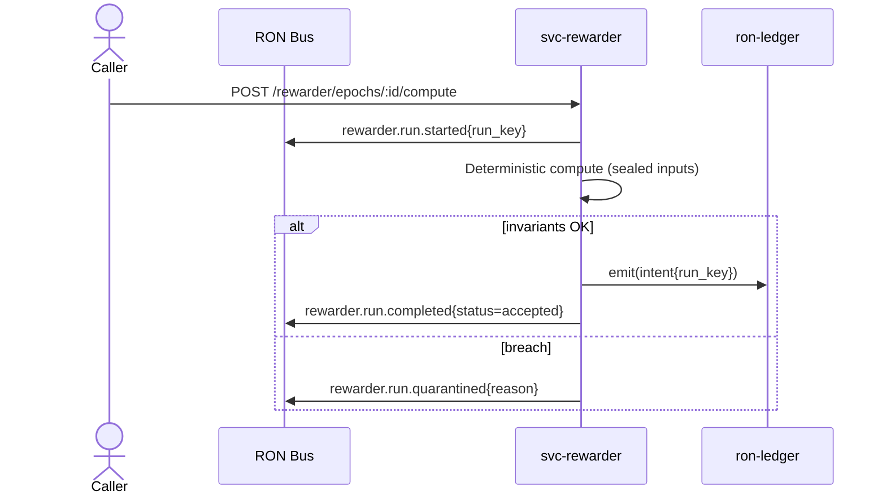
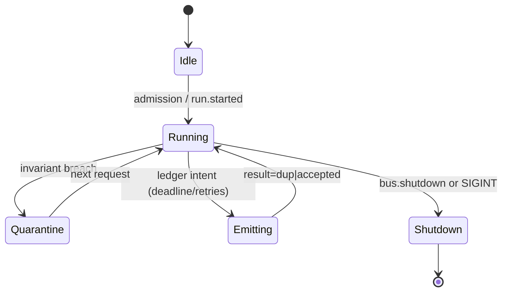

---

# svc-rewarder

> **Role:** service
> **Owner:** Stevan White
> **Status:** draft
> **MSRV:** 1.80.0
> **Last reviewed:** 2025-10-14

Badges:
[](https://github.com/<org>/RustyOnions/actions/workflows/ci.yml)
[](https://crates.io/crates/svc-rewarder)
[](https://docs.rs/svc-rewarder)
[](./)

---

## 1) Overview

**What it is (one paragraph):**
`svc-rewarder` computes **deterministic epoch rewards** from sealed, content-addressed inputs and emits an **idempotent intent** to `ron-ledger` for settlement. On any invariant breach (e.g., non-conservation, overflow), it **quarantines** the run and emits no intent. All ingress/egress is guarded by **capability tokens** (macaroon-style). In Micronode profile it honors **amnesia mode** (no persistent artifacts).

**How it fits (RustyOnions topology):**

* **Pillar:** Economics & Wallets
* **Upstream callers:** Omnigate/BFF, accounting snapshotters, governance policy flows
* **Downstream deps:** `ron-ledger` (intent egress), `ron-auth` (capabilities), Kernel Bus, Prometheus
* **Data it touches:** in-memory compute; ephemeral tmpfs (amnesia=ON); network I/O; metrics
* **Security boundary:** capabilities only; **no custody**, **no floats** in money paths

### 1.1 High-Level Architecture

```mermaid
flowchart LR
  subgraph Client/Node
    A[Caller: omnigate / jobs] -->|HTTP POST /rewarder| B(svc-rewarder)
  end

  B -->|Intent (idempotent)| C[ron-ledger]
  B -->|Bus events| G[[Kernel Bus]]
  B -->|/metrics| E[[Prometheus]]
  B -->|Manifests (sealed)| D[(Ephemeral tmpfs when amnesia=ON)]

  style B fill:#0b7285,stroke:#083344,color:#fff
```

---

## 2) Responsibilities & Boundaries

**MUST do (core responsibilities):**

* Deterministic compute over **sealed** inputs (`b3:<hex>`), producing a byte-stable manifest and attestation.
* Emit **idempotent** ledger intents keyed by `(epoch, policy_hash, inputs_cid)`.
* Enforce invariants: conservation, no negatives/overflow, protocol limits/backpressure.

**MUST NOT do (anti-scope / boundaries):**

* Mutate ledger balances or hold custody; only emit intents.
* Use floating-point types in any monetary path; persist artifacts when amnesia=ON.

**Proof of determinism:**
`run_key = blake3(policy_hash || inputs_cid || epoch_id || version)` → hex encoded as `b3:<hex>`.
Property tests: same tuple → same key; any element change → different key.

**Acceptance Gates (auditable):**

* Property tests for conservation/idempotency; golden vectors bit-match manifests.
* Metrics exported: `reward_compute_latency_seconds`, `ledger_intents_total{result}`, `rejected_total{reason}`, `queue_depth`.
* `/healthz` & `/readyz` reflect pressure and downstream health (drop readiness before overload).
* Perf SLO gate holds per profile (see §7).

---

## 3) Public Interfaces

### 3.1 Bus RPC / Events

**Events (topic → minimal schema):**

* `rewarder.run.started`

  ```json
  { "run_key":"b3:7b9c...", "epoch_id":"2025-10-01" }
  ```
* `rewarder.run.completed`

  ```json
  { "run_key":"b3:7b9c...", "status":"accepted", "intent_id":"b3:f00d..." }
  ```
* `rewarder.run.quarantined`

  ```json
  { "run_key":"b3:7b9c...", "status":"quarantined", "reason":"conservation_breach" }
  ```



### 3.2 HTTP

* **Base URL:** `/rewarder`
* **Endpoints (v1):**

  * `POST /rewarder/epochs/{epoch_id}/compute[?dry_run=true]`
    Auth: cap `rewarder.run`. Deterministic compute; if not `dry_run`, emits an idempotent ledger intent.
  * `GET /rewarder/epochs/{epoch_id}`
    Auth: cap `rewarder.inspect`. Returns sealed manifest + attestation.
* **Health:** `GET /healthz`, `GET /readyz`, `GET /metrics` (Prometheus text)

---

## 4) Configuration

> Environment variables first; sane defaults provided.

| Variable                      | Type   | Default      | Description                        |
| ----------------------------- | ------ | ------------ | ---------------------------------- |
| `RON_CONFIG`                  | string | `<path>`     | Path to config TOML                |
| `HTTP_ADDR`                   | socket | 0.0.0.0:8080 | HTTP bind                          |
| `METRICS_ADDR`                | socket | 0.0.0.0:9909 | Prometheus/health bind             |
| `MAX_INFLIGHT`                | int    | 512          | Concurrency cap                    |
| `WORK_QUEUE_MAX`              | int    | 4096         | Bounded work queue size            |
| `TENANT_RPS_MAX`              | int    | 100          | Per-tenant rate limit              |
| `CONCURRENCY_COMPUTE_WORKERS` | int    | `num_cpus-1` | Worker pool size                   |
| `LEDGER_DEADLINE_MS`          | int    | 1000         | Egress timeout to ledger           |
| `LEDGER_MAX_RETRIES`          | int    | 2            | Idempotent retries to ledger       |
| `REQ_BODY_MAX_BYTES`          | int    | 1048576      | Body cap (1 MiB)                   |
| `DECOMP_RATIO_MAX`            | int    | 10           | Decompression guard (≤10×)         |
| `REQUIRE_PQ_ON`               | bool   | false        | Enforce PQ-hybrid on edges         |
| `AMNESIA_MODE`                | bool   | true         | Micronode default (no persistence) |

**CLI flags (selected):**

```
--profile micronode|macronode
--brownout-allow
--trace-burst
```

**Cargo features:**

* `default = ["tokio","serde"]`
* `tls` — TLS via tokio-rustls
* `pq`, `pq-hybrid`, `pq-sign` — PQ build matrix toggles

---

## 5) Build, Run, Test

### Quick Start (Micronode profile)

```bash
cargo build -p svc-rewarder --release
RUST_LOG=info HTTP_ADDR=127.0.0.1:8080 METRICS_ADDR=127.0.0.1:9909 AMNESIA_MODE=true \
  cargo run -p svc-rewarder -- --config ./configs/svc-rewarder.toml
curl -sS -X POST "http://127.0.0.1:8080/rewarder/epochs/demo-epoch/compute?dry_run=true" \
  -H "Authorization: Bearer <cap:rewarder.run>" -H "Content-Type: application/json" \
  -d '{ "inputs_cid":"b3:DEADBEEF...", "policy_id":"rev42", "policy_hash":"b3:ABCD..." }' | jq .
```

**Build**

```bash
cargo build -p svc-rewarder
```

**Run**

```bash
RUST_LOG=info METRICS_ADDR=127.0.0.1:9909 cargo run -p svc-rewarder -- --config ./configs/svc-rewarder.toml
```

**Tests**

```bash
cargo test -p svc-rewarder --all-features
cargo test -p svc-rewarder --doc
```

**Lint & format**

```bash
cargo fmt --all
cargo clippy -p svc-rewarder -- -D warnings
```

**Security & deps**

```bash
cargo deny check
```

**Bench (if provided)**

```bash
cargo bench -p svc-rewarder
```

---

## 6) Observability

**Endpoints:** `/metrics`, `/healthz`, `/readyz` (readiness drops before overload).

**Canonical Metrics:**

* `reward_compute_latency_seconds{}` — histogram (track p95/p99)
* `ledger_intents_total{result="accepted|dup|error"}`
* `rejected_total{reason="oversize|decompress|quota|invariant"}`
* `queue_depth`, `inflight` gauges
* `readyz_degraded{cause}` boolean/gauge

**Tracing (structured JSON):**
Targets: `svc-rewarder=info,axum=warn,tower_http=warn`. Spans include `run_key`, `epoch_id`, `tenant`, `request_id`.

**Example logs (JSON):**

```
{"lvl":"INFO","ts":"2025-10-14T15:17:03Z","svc":"svc-rewarder","run_key":"b3:7b9c","epoch_id":"2025-10-01","tenant":"acme","msg":"compute_ok","lat_ms":183}
{"lvl":"WARN","ts":"2025-10-14T15:17:04Z","svc":"svc-rewarder","run_key":"b3:7b9c","epoch_id":"2025-10-01","tenant":"acme","msg":"quarantine","reason":"conservation_breach","delta_cents":"-3"}
```

---

## 7) Performance & SLOs

| Metric                   |   Target | Notes                       |
| ------------------------ | -------: | --------------------------- |
| p95 compute latency      | < 500 ms | intra-region baseline       |
| p99 compute latency      |    < 2 s | intra-region                |
| Availability (`/readyz`) |  ≥ 99.9% | monthly, excl. maintenance  |
| Idempotent dups/total    |     ≤ 1% | retries OK; no double-emits |
| Error budget 5xx         |   < 0.1% | sustained                   |

### Profile SLOs

| Profile   | p95 compute | p99 compute | Start-to-ready | Notes                       |
| --------- | ----------- | ----------- | -------------- | --------------------------- |
| Micronode | < 500ms     | < 2s        | < 1s           | single binary, amnesia=ON   |
| Macronode | < 300ms     | < 1s        | < 3s           | dedicated pool, HPA enabled |

**PQ Gate:** With `--features pq-hybrid`, p95 degradation must be ≤ **5%** vs. baseline; otherwise mark `/readyz` degraded and fire `pq_perf_degraded` alert.

---

## 8) Data & Schema

**Data model (summary)**

* **Manifest** (JSON; DAG-CBOR compatible) with attestation (Ed25519 + optional PQ).
* **ComputeResult** captures status, timings, and ledger egress outcome.

#### Manifest (JSON; versioned)

```json
{
  "version": 1,
  "epoch_id": "2025-10-01",
  "run_key": "b3:7b9c...",
  "inputs_cid": "b3:aa12...",
  "policy_id": "rev42",
  "policy_hash": "b3:bb34...",
  "totals": { "awards": "1234500", "participants": 271 },
  "commitment": "b3:cc56...",
  "attestation": { "sig_ed25519": "base64...", "sig_ml_dsa": null }
}
```

#### ComputeResult (success)

```json
{
  "status": "accepted",
  "run_key": "b3:7b9c...",
  "ledger": { "intent_id": "b3:f00d...", "result": "accepted" },
  "timings_ms": { "compute": 183, "egress": 41 }
}
```

#### ComputeResult (quarantined)

```json
{
  "status": "quarantined",
  "run_key": "b3:7b9c...",
  "reason": "conservation_breach",
  "details": { "delta_cents": "-3" }
}
```

**Migrations**

* Version gate in header; breaking changes bump `version` and freeze test vectors.

---

## 9) Security & Privacy

* **Threat model (STRIDE):**
  Spoofing (caps), Tampering (sealed inputs, BLAKE3 addressing), DoS (size/time quotas),
  Info disclosure (no secrets in events), Repudiation (signed attestation), Elevation (cap caveats).
* **Key handling:** signatures via KMS/HSM; optional PQ-hybrid; rotate ≤90d; never log secrets.
* **PII:** none by default; treat tenant and epoch metadata as sensitive.
* **AuthN/Z:** capabilities only; no ambient tokens.
* **Input validation:** 1 MiB body cap; decompression ≤10×; bounded queues; early shedding via `/readyz`.

---

## 10) Error Taxonomy

| Code/Variant              | When it happens                      | User hint                    | Retries |
| ------------------------- | ------------------------------------ | ---------------------------- | ------- |
| `ConfigError::MissingVar` | required env/config missing          | set the variable             | no      |
| `NetError::Timeout`       | ledger egress exceeded deadline      | try later                    | yes     |
| `StateError::Quarantine`  | invariant breach during compute      | inspect manifest; fix inputs | no      |
| `RequestError::Oversize`  | >1 MiB or decompression cap exceeded | reduce request size          | no      |

---

## 11) Concurrency Model

* **Runtime:** tokio; cooperative tasks; bounded compute worker pool; never hold a lock across `.await`.
* **I/O:** explicit timeouts; idempotent retries to ledger; graceful drain on `bus.shutdown`.
* **Channels:** mpsc work queue; broadcast bus for events/health.



---

## 12) Compatibility & Requirements

* **Rust:** MSRV 1.80.0
* **OS:** macOS 10.15+, Linux x86_64; containers supported
* **TLS:** tokio-rustls 0.26.x
* **HTTP:** axum 0.7.x, tower-http 0.6.x
* **Node profiles:** Micronode (amnesia ON), Macronode (multi-service)

---

## 13) Examples

Service health check:

```bash
curl -sS http://127.0.0.1:9909/healthz
curl -sS http://127.0.0.1:9909/readyz
```

Compute (dry run):

```bash
curl -sS -X POST "http://127.0.0.1:8080/rewarder/epochs/2025-10-01/compute?dry_run=true" \
  -H "Authorization: Bearer <cap:rewarder.run>" \
  -H "Content-Type: application/json" \
  -d '{ "inputs_cid":"b3:...", "policy_id":"rev42", "policy_hash":"b3:..." }'
```

---

## 14) Troubleshooting

* **Port already in use:** change `HTTP_ADDR` or `METRICS_ADDR`.
* **TLS errors:** ensure rustls config; use `tokio_rustls::rustls::ServerConfig`.
* **Amnesia violations:** verify tmpfs paths & cleanup; ensure amnesia checks pass in CI matrix.
* **Ledger error spikes:** inspect `ledger_intents_total{result="error"}` and downstream health; dedupe should keep `dup` ≤ 1%.

---

## 15) Development Notes

**Project conventions (RustyOnions):**

* Axum handlers end with `.into_response()`.
* Keep kernel re-exports in `lib.rs` (e.g., `Bus`, `KernelEvent`, `Metrics`, `HealthState`, `Config`, `wait_for_ctrl_c()`); keep service logic modular.
* Transport TLS uses `tokio_rustls::rustls::ServerConfig`.
* **Six Concerns** labels drive CI (SEC/RES/PERF/ECON/DX/GOV).

**Pre-commit quickcheck**

```bash
cargo fmt --all
cargo clippy -- -D warnings
cargo test
cargo deny check
```

---

## 16) Mermaid Diagrams — Policy & Tooling

Every README must include at least: one **architecture**, one **sequence**, one **state** diagram.

**Render locally (SVG)**

```bash
npm i -g @mermaid-js/mermaid-cli
mmdc -i docs/arch.mmd -o docs/arch.svg
```

**Render via Docker (no Node install)**

```bash
docker run --rm -v "$PWD":/data minlag/mermaid-cli mmdc -i docs/arch.mmd -o docs/arch.svg
```

**CI (GitHub Actions snippet)**

```yaml
name: render-mermaid
on: [push, pull_request]
jobs:
  mmdc:
    runs-on: ubuntu-latest
    steps:
      - uses: actions/checkout@v4
      - run: npm i -g @mermaid-js/mermaid-cli
      - run: |
          mkdir -p docs
          for f in $(git ls-files '*.mmd'); do
            out="${f%.mmd}.svg"
            mmdc -i "$f" -o "$out"
          done
```

---

## 17) Roadmap & TODO

* **M1 (Bronze):** Minimal compute + manifest + idempotent emit; golden vectors frozen.
* **M2 (Silver):** PQ build matrix (ON/OFF), PQ metrics/alerts, governance endpoints.
* **M3 (Gold):** Perf SLOs proven for both profiles; ops dashboards + runbooks; chaos/brownout tests.

**Additional acceptance gates:**

* **PQ Degradation Gate:** CI perf job compares baseline vs `--features pq-hybrid`; fail if p95 delta > 5%.
* **Schema Freeze:** `docs/schemas/manifest.v1.json` and `docs/schemas/events.v1.json` committed; doctests round-trip via serde.
* **Idempotency Soak:** 1-hour soak re-posts same request; ensure `dup/total ≤ 1%`.

---

## 18) Changelog

See [CHANGELOG.md](./CHANGELOG.md). Follow SemVer; document breaking changes with migration notes.

---

## 19) License

Dual-licensed under **MIT** or **Apache-2.0**. See [LICENSE-MIT](../LICENSE-MIT) and [LICENSE-APACHE](../LICENSE-APACHE).

---

## 20) Contributing

PRs welcome! Please run fmt/clippy/tests and include:

* Updated diagrams if topology changed
* Docs & examples
* Perf impact if touching compute or ledger egress

> Also see: `docs/IDB.md`, `docs/SECURITY.md`, `docs/OBSERVABILITY.md`, `docs/PERFORMANCE.md`, and `docs/RUNBOOK.md`.

---
