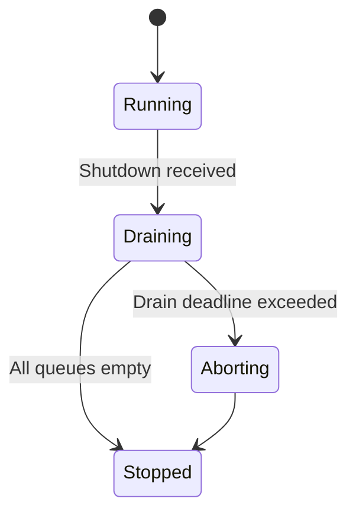
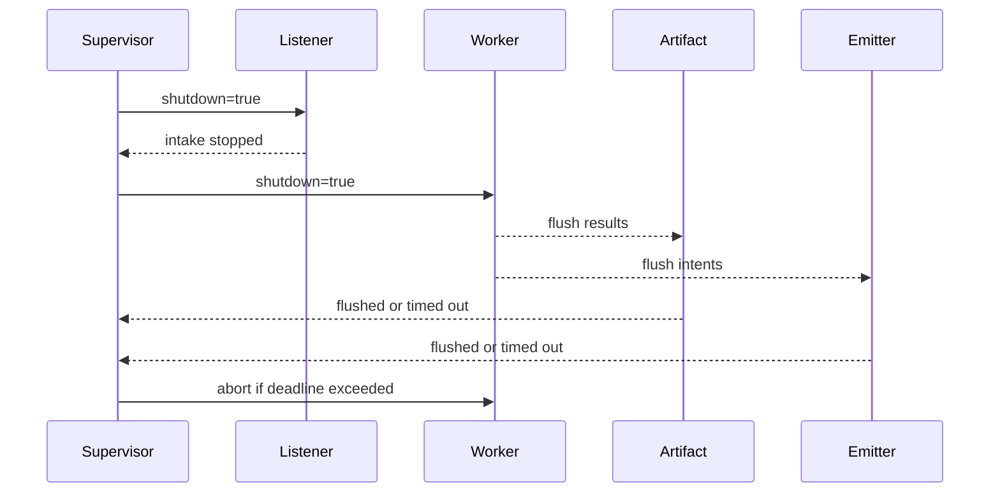

---

````markdown
---
title: Concurrency Model — svc-rewarder
crate: svc-rewarder
owner: Stevan White
last-reviewed: 2025-10-13
status: draft
template_version: 1.1
msrv: 1.80.0
tokio: "1.x (pinned at workspace root)"
loom: "0.7+ (dev-only)"
lite_mode: "N/A (service crate)"
---

# Concurrency Model — svc-rewarder

This document makes the concurrency rules **explicit**: tasks, channels, locks, shutdown, timeouts,
and validation (property/loom/TLA+). It complements `docs/SECURITY.md`, `docs/CONFIG.md`,
`README.md`, and `docs/IDB.md`.

> **Golden rule:** never hold a lock across `.await` in supervisory or hot paths.

---

## 0) Lite Mode
*N/A — this is a service with background tasks.*

---

## 1) Invariants (MUST)

- [I-1] **No lock across `.await`**. If unavoidable, split the critical section or move data out before awaiting.
- [I-2] **Single writer** per mutable resource; multiple readers read via snapshots or short read guards.
- [I-3] **Bounded channels only** (`mpsc`/`broadcast`) with explicit overflow policy and metrics.
- [I-4] **Explicit timeouts** on all I/O and RPCs; fail-fast with typed errors; total deadlines on multi-hop requests.
- [I-5] **Cooperative cancellation**: every `.await` is cancel-safe or guarded by `tokio::select!`.
- [I-6] **Graceful shutdown**: observe `Shutdown` signal; stop intake; drain within deadline; abort stragglers; report counts.
- [I-7] **No blocking syscalls** on the async runtime; use `spawn_blocking` for CPU or FS that cannot be made async.
- [I-8] **No task leaks**: track `JoinHandle`s; detach only with rationale and comment.
- [I-9] **Backpressure over buffering**: reject or drop deterministically with metrics; never grow unbounded queues.
- [I-10] **Framing discipline**: length-delimited + max caps; handle split reads/writes; invoke `.shutdown().await` on I/O teardown.
- [I-11] **Async Drop**: do not block in `Drop`; expose `async close()/shutdown()` and require callers to invoke it before drop.

---

## 2) Runtime Topology

**Tokio runtime:** multi-threaded scheduler, worker count = CPU logical cores (default).  
**Primary tasks (long-lived):**

1. **Supervisor** — owns control plane, config reloads, readiness gating, shutdown fanout.
2. **HTTP Listener** — axum server handling:
   - `POST /rewarder/epochs/{id}/compute` (enqueue if not exists)
   - `GET /rewarder/epochs/{id}` (serve run manifest)
3. **Compute Scheduler** — de-duplicates per-epoch work, seals inputs, creates `ComputeJob`s, and enqueues to `work`.
4. **Worker Pool (N = `concurrency.compute_workers`)** — runs pure reward calculus + conservation checks; emits `ResultItem`s.
5. **Artifact Writer** — writes `run.json`, `commitment`, optional zk proofs to `artifact_dir` (amnesia-aware).
6. **Intent Emitter** — sends idempotent settlement intents to `ron-ledger` (downstream idempotency key attached).
7. **Health Reporter** — emits `/metrics` and health/readiness updates.

**Supervision & restart policy:**  
- On panic in any worker: exponential backoff with jitter (100–400ms → cap 5s), max 5 restarts in 1 minute → escalate by marking `/readyz` false and logging `service_restarts_total{task}`.
- On config reload: disruptive items (bind/tls/shards) trigger rebind/replan; non-disruptive items applied in place.

```mermaid
flowchart TB
  subgraph Runtime
    SUP[Supervisor] -->|spawn| LIS[HTTP Listener]
    SUP -->|spawn| SCHED[Compute Scheduler]
    SUP -->|spawn| WPOOL[Worker Pool (N)]
    SUP -->|spawn| ART[Artifact Writer]
    SUP -->|spawn| EMIT[Intent Emitter]

    LIS -->|mpsc: work_req(512)| SCHED
    SCHED -->|mpsc: work(512)| WPOOL
    WPOOL -->|mpsc: results(512)| ART
    WPOOL -->|mpsc: intents(512)| EMIT

    SUP -->|watch Shutdown| LIS
    SUP -->|watch Shutdown| SCHED
    SUP -->|watch Shutdown| WPOOL
    SUP -->|watch Shutdown| ART
    SUP -->|watch Shutdown| EMIT
  end
  style SUP fill:#0ea5e9,stroke:#0c4a6e,color:#fff
````

**Accessibility description:** Supervisor spawns Listener, Scheduler, Worker Pool, Artifact Writer, and Intent Emitter. Listener forwards requests to Scheduler; Scheduler enqueues bounded work to Workers. Workers send results to Artifact Writer and intents to Intent Emitter. All tasks subscribe to a Shutdown watch channel.

---

## 3) Channels & Backpressure

**Inventory (all bounded):**

| Name       | Kind      | Capacity | Producers → Consumers     | Backpressure Policy               | Drop Semantics / Response                                                     |
| ---------- | --------- | -------: | ------------------------- | --------------------------------- | ----------------------------------------------------------------------------- |
| `work_req` | mpsc      |      512 | HTTP Listener → Scheduler | `try_send` else `Busy`            | HTTP 429 + `busy_rejections_total{endpoint}`                                  |
| `work`     | mpsc      |      512 | Scheduler → Workers       | `try_send` else backoff+retry(1x) | on second failure → increment `queue_dropped_total{work}` and error to caller |
| `results`  | mpsc      |      512 | Workers → Artifact Writer | `await send` (bounded)            | on shutdown: flush until deadline, else drop with `dropped_results_total`     |
| `intents`  | mpsc      |      512 | Workers → Intent Emitter  | `await send` (bounded)            | failure escalates to quarantine for that epoch                                |
| `events`   | broadcast |     1024 | Supervisor → N tasks      | slow consumers lag & drop oldest  | `bus_lagged_total{events}`                                                    |
| `shutdown` | watch     |        1 | Supervisor → N tasks      | last-write-wins                   | N/A                                                                           |

**Guidelines:**

* Prefer `try_send` for ingress (`work_req`) to fail fast under pressure.
* Keep a **queue depth gauge** for `work`, `results`, `intents`.
* Backoff window on Scheduler re-enqueue: 50–150ms jitter, one retry; then fail.

---

## 4) Locks & Shared State

**Allowed**

* Short-lived `Mutex`/`RwLock` for small metadata (e.g., in-memory dedupe map), released **before** any `.await`.
* Read-mostly data via `Arc<StateSnapshot>` (policy snapshot, config snapshot).
* Per-epoch run registry stored in `DashMap` or `RwLock<HashMap>` but **lookups cloned** into local variables before awaiting.

**Forbidden**

* Holding any lock across `.await`.
* Nested locks without an explicit, documented ordering.

**Hierarchy (if needed)**

1. `cfg_snapshot`
2. `run_registry`
3. `metrics_counters`

---

## 5) Timeouts, Retries, Deadlines

* **I/O Timeouts** (from config): `read=5s`, `write=5s`, `idle=60s` (defaults; override via `docs/CONFIG.md`).
* **Upstream RPCs** (`ron-accounting`, `ron-ledger`, `policy`):

  * Per-call timeout = `read_timeout` unless stricter endpoint-specific budget is defined.
  * Retries: **idempotent** endpoints only, jittered backoff 100–250ms, max 3 attempts; non-idempotent → no retry.
* **End-to-end deadline** for `compute`: `epoch_deadline = min( (now+epoch_duration/2), caller_deadline )`.
* **Circuit breaker** (optional): open after error-rate spike; half-open probes after 1–5s.

```mermaid
sequenceDiagram
  autonumber
  participant C as Client
  participant L as Listener
  participant S as Scheduler
  participant W as Worker
  C->>L: POST /compute (deadline=2s)
  L->>S: try_send work_req (bounded)
  alt queue full
    L-->>C: 429 Busy
  else queued
    S->>W: try_send work
    W-->>C: 202 Accepted or 200 (if cached)
  end
```

**Text:** Listener accepts a compute request with a 2s deadline. If queues are full, it returns 429. Otherwise, the job is scheduled and processed; response is 202 (async) or 200 if a cached run already exists.

---

## 6) Cancellation & Shutdown

* **Signal source:** `KernelEvent::Shutdown` or `wait_for_ctrl_c()`.
* **Propagation:** `tokio::select! { _ = shutdown.changed() => ..., _ = recv/send => ... }`.
* **Sequence:**

  1. Supervisor sets `shutdown=true` on watch channel; `/readyz` flips to **false** immediately.
  2. Listener stops accepting new work (returns 503/“draining”).
  3. Scheduler stops enqueuing new jobs; workers finish in-flight.
  4. Artifact Writer and Intent Emitter flush until **drain deadline** (configurable, 1–5s).
  5. After deadline, Supervisor aborts remaining tasks; increments `tasks_aborted_total{kind}`.



---

## 7) I/O & Framing

* **HTTP/JSON (axum 0.7)** for ingress/egress; max body = `limits.max_body_bytes` (default 1 MiB).
* **Content-addressed references** are short strings; never trust client-provided sizes → always cap & validate.
* Use `AsyncReadExt/AsyncWriteExt` and call `.shutdown().await` on sockets/streams after finishing.

---

## 8) Error Taxonomy (Concurrency-Relevant)

| Error        | When                     | Retry?     | Metric                            | Notes                             |
| ------------ | ------------------------ | ---------- | --------------------------------- | --------------------------------- |
| `Busy`       | `try_send` on full queue | caller may | `busy_rejections_total{endpoint}` | Listener surface returns 429      |
| `Timeout`    | RPC or I/O exceeded      | sometimes  | `io_timeouts_total{op}`           | Attach `op` and `peer` labels     |
| `Canceled`   | Shutdown while waiting   | no         | `tasks_canceled_total{kind}`      | Cooperative cancellation          |
| `Lagging`    | broadcast overflow       | no         | `bus_lagged_total{events}`        | Diagnose slow consumers           |
| `Quarantine` | conservation failure     | no         | `quarantine_total{epoch}`         | No intents emitted for that epoch |

---

## 9) Metrics (Concurrency Health)

* `queue_depth{queue}` (gauge) — `work`, `results`, `intents`
* `queue_dropped_total{queue}` (counter)
* `busy_rejections_total{endpoint}` (counter)
* `tasks_spawned_total{kind}` / `tasks_aborted_total{kind}` (counters)
* `io_timeouts_total{op}` / `backoff_retries_total{op}` (counters)
* `service_restarts_total{task}` (counter)
* `readyz_degraded{cause}` (gauge-like via set of labeled counters)

---

## 10) Validation Strategy

**Unit / Property**

* Backpressure behavior: `work_req` returns 429 on full.
* Deadline enforcement: responses time out within tolerance.
* No-lock-across-await: grepped & code-reviewed; optional runtime assert in dev builds.

**Loom (dev-only)**

* Model: Producer → bounded queue → Consumer with Shutdown.
* Assertions: no deadlock; all queued items either processed or deterministically dropped on shutdown; no double free.

**Fuzz**

* HTTP payloads & DTOs fuzzed (structure-aware); reject invalid or oversized frames.

**Chaos**

* Under load: kill 50% of workers; Supervisor restarts with backoff; `/readyz` toggles correctly; no task leak.

**TLA+ (optional)**

* If strict ordering matters for run manifests, specify minimal safety (no duplicate run) and liveness (eventual completion or quarantine) properties.

---

## 11) Code Patterns (Copy-Paste)

**Spawn + cooperative shutdown**

```rust
let (shutdown_tx, shutdown_rx) = tokio::sync::watch::channel(false);

// worker task
let mut rx = work_rx;
let mut sd = shutdown_rx.clone();
let worker = tokio::spawn(async move {
  loop {
    tokio::select! {
      _ = sd.changed() => break,
      maybe_job = rx.recv() => {
        let Some(job) = maybe_job else { break }; // channel closed
        if let Err(e) = handle_job(job).await {
          tracing::warn!(error=%e, "job failed");
        }
      }
    }
  }
});

// later: shutdown
let _ = shutdown_tx.send(true);
let _ = worker.await;
```

**Bounded `mpsc` with `try_send`**

```rust
match work_tx.try_send(job) {
  Ok(()) => {}
  Err(tokio::sync::mpsc::error::TrySendError::Full(_)) => {
    metrics::busy_rejections_total("compute").inc();
    return Err(Error::Busy);
  }
  Err(tokio::sync::mpsc::error::TrySendError::Closed(_)) => {
    return Err(Error::Unavailable);
  }
}
```

**Timeout + total deadline**

```rust
let io = tokio::time::timeout(cfg.read_timeout, client.get(url)).await;
let total = tokio::time::timeout(total_deadline, compute_epoch()).await;
```

**Async Drop pattern**

```rust
pub struct ArtifactSink { inner: Option<Writer> }

impl ArtifactSink {
  pub async fn close(&mut self) -> anyhow::Result<()> {
    if let Some(mut w) = self.inner.take() {
      w.flush().await?;
      w.shutdown().await?;
    }
    Ok(())
  }
}

impl Drop for ArtifactSink {
  fn drop(&mut self) {
    if self.inner.is_some() {
      tracing::debug!("ArtifactSink dropped without close(); best-effort release");
    }
  }
}
```

**No lock across `.await`**

```rust
let snapshot = {
  let g = registry.read(); // short critical section
  g.lookup(epoch).cloned()
};
let out = do_async(snapshot).await;
```

---

## 12) Configuration Hooks (Quick Reference)

* `concurrency.compute_workers`, `concurrency.io_inflight`
* `read_timeout`, `write_timeout`, `idle_timeout`
* `limits.max_body_bytes`
* `drain_deadline` (if exposed), `epoch_duration`
* See `docs/CONFIG.md` for authoritative schema.

---

## 13) Known Trade-offs / Nonstrict Areas

* **Queue policy:** `work_req` rejects new on overload (429) to keep latency bounded; `work` retries once to smooth bursts, otherwise fails fast to avoid head-of-line blocking.
* **Artifact/Intent channels:** prefer bounded `await send` to preserve ordering guarantees; on shutdown, deterministic drop with metrics is acceptable.

---

## 14) Mermaid Diagrams

### 14.1 Task & Queue Topology

```mermaid
flowchart LR
  L[Listener] -->|mpsc work_req(512)| S[Scheduler]
  S -->|mpsc work(512)| W1[Worker A]
  S -->|mpsc work(512)| W2[Worker B]
  W1 -->|mpsc results(512)| A[Artifact Writer]
  W2 -->|mpsc results(512)| A
  W1 -->|mpsc intents(512)| E[Intent Emitter]
  W2 -->|mpsc intents(512)| E
  SH[Shutdown watch] --> L
  SH --> S
  SH --> W1
  SH --> W2
  SH --> A
  SH --> E
```

**Text:** Listener → Scheduler → Workers via bounded mpsc; Workers → Artifact Writer / Intent Emitter via bounded mpsc; a Shutdown watch channel reaches all tasks.

### 14.2 Shutdown Sequence



---

## 15) CI & Lints (Enforcement)

**Clippy**

* `-D warnings`
* `-W clippy::await_holding_lock`
* `-W clippy::needless_collect`
* `-W clippy::useless_async`

**GitHub Actions (sketch)**

```yaml
name: concurrency-guardrails
on: [push, pull_request]
jobs:
  clippy:
    runs-on: ubuntu-latest
    steps:
      - uses: actions/checkout@v4
      - uses: dtolnay/rust-toolchain@stable
      - run: cargo clippy -p svc-rewarder -- -D warnings -W clippy::await_holding_lock

  loom:
    if: github.event_name == 'pull_request'
    runs-on: ubuntu-latest
    steps:
      - uses: actions/checkout@v4
      - uses: dtolnay/rust-toolchain@stable
      - run: RUSTFLAGS="--cfg loom" cargo test -p svc-rewarder --tests -- --ignored

  fuzz:
    runs-on: ubuntu-latest
    steps:
      - uses: actions/checkout@v4
      - uses: dtolnay/rust-toolchain@stable
      - run: cargo install cargo-fuzz
      - run: cargo fuzz build -p svc-rewarder
```

---

## 16) Schema Generation (Optional)

* Consider annotating channel declarations for doc extraction:

  ```rust
  #[doc_channel(name="work", kind="mpsc", cap=512, policy="retry_once_then_drop")]
  let (work_tx, work_rx) = tokio::sync::mpsc::channel(512);
  ```
* A small build script can emit `docs/_generated/concurrency.mdfrag` to include.

---

## 17) Review & Maintenance

* **Review cadence:** every 90 days or upon any change to tasks/channels/locks.
* Keep `owner`, `msrv`, and `last-reviewed` current.
* **PR checklist:** if concurrency changes, update this file + Loom/property tests.

```
---
```
