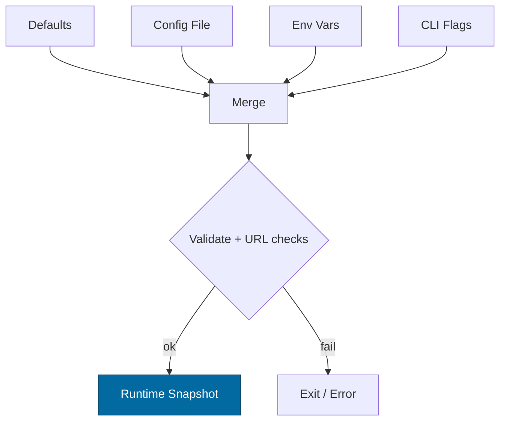

---

````markdown
---
title: Configuration — svc-rewarder
crate: svc-rewarder
owner: Stevan White
last-reviewed: 2025-10-13
status: reviewed
template_version: 1.1
---

# Configuration — svc-rewarder

This document defines **all configuration** for `svc-rewarder`, including sources,
precedence, schema (types/defaults), validation, feature flags, live-reload behavior,
and security implications. It complements `README.md` and `docs/SECURITY.md`.

> **Tiering:**  
> - **Library crates:** most sections apply, but service-only notes (ports, /healthz) may be N/A.  
> - **Service crates:** all sections apply (network, readiness, observability, etc.).

---

## 1) Sources & Precedence (Authoritative)

Configuration may come from multiple sources. **Precedence (highest wins):**

1. **Process flags** (CLI)  
2. **Environment variables**  
3. **Config file** (e.g., `Config.toml` beside the binary)  
4. **Built-in defaults** (hard-coded)

> On dynamic reload, the effective config is recomputed under the same precedence.

**Supported file formats:** TOML (preferred), JSON (optional).  
**Path resolution order for `--config` (if relative):** `./`, `$CWD`, crate dir.

---

## 2) Quickstart Examples

### 2.1 Minimal service start
```bash
RUST_LOG=info \
SVC_REWARDER_BIND_ADDR=0.0.0.0:8080 \
SVC_REWARDER_METRICS_ADDR=127.0.0.1:0 \
cargo run -p svc-rewarder
````

### 2.2 Config file (TOML)

```toml
# Config.toml
bind_addr     = "0.0.0.0:8080"
metrics_addr  = "127.0.0.1:0"
max_conns     = 1024
read_timeout  = "5s"
write_timeout = "5s"
idle_timeout  = "60s"

[tls]
enabled = false
# cert_path = "/etc/ron/cert.pem"
# key_path  = "/etc/ron/key.pem"

[limits]
max_body_bytes       = "1MiB"
decompress_ratio_cap = 10

[rewarder]
epoch_duration     = "1h"         # computation window
policy_id          = "policy:v3"  # logical id; resolved via registry/policy
inputs_cache_ttl   = "5m"
max_epoch_skew     = "2m"
idempotency_salt   = "svc-rewarder|v1"
artifact_dir       = "/var/run/svc-rewarder/artifacts"
retain_runs        = "24h"
enable_zk_proofs   = false

[ingress]                       # peers and caps
accounting_base_url = "http://127.0.0.1:7101"
ledger_base_url     = "http://127.0.0.1:7201"
policy_base_url     = "http://127.0.0.1:7301"
macaroon_path       = "/etc/ron/caps/rewarder.macaroon"

[concurrency]
compute_workers = 4
io_inflight     = 64

[shard]
strategy = "by_actor"       # by_actor|by_content|single
shards   = 1

[amnesia]
enabled = false

[pq]
mode = "off"                 # off|hybrid

[log]
format = "json"              # json|text
level  = "info"              # trace|debug|info|warn|error
```

### 2.3 CLI flags (override file/env)

```bash
cargo run -p svc-rewarder -- \
  --bind 0.0.0.0:8080 \
  --metrics 127.0.0.1:0 \
  --max-conns 2048 \
  --epoch-duration 1h \
  --policy-id policy:v3 \
  --compute-workers 8
```

---

## 3) Schema (Typed, With Defaults + Reloadability)

> **Prefix convention:** All env vars begin with `SVC_REWARDER_`.
> **Durations** accept `s`, `ms`, `m`, `h`. **Sizes** accept `B`, `KB`, `MB`, `MiB`.
> **Reloadable?** column indicates whether a key can be applied at runtime without a disruptive rebind/replan.

| Key / Env Var                                                       | Type                                   | Default       | Description                              | Reloadable?                   | Security Notes                     |                 |
| ------------------------------------------------------------------- | -------------------------------------- | ------------- | ---------------------------------------- | ----------------------------- | ---------------------------------- | --------------- |
| `bind_addr` / `SVC_REWARDER_BIND_ADDR`                              | socket                                 | `127.0.0.1:0` | HTTP/ingress bind address                | **No**                        | Public binds require threat review |                 |
| `metrics_addr` / `SVC_REWARDER_METRICS_ADDR`                        | socket                                 | `127.0.0.1:0` | Prometheus endpoint bind                 | **No**                        | Prefer localhost; gateway scrape   |                 |
| `max_conns` / `SVC_REWARDER_MAX_CONNS`                              | u32                                    | `1024`        | Max concurrent connections               | **Yes**                       | Prevents FD exhaustion             |                 |
| `read_timeout` / `SVC_REWARDER_READ_TIMEOUT`                        | duration                               | `5s`          | Per-request read timeout                 | **Yes**                       | DoS mitigation                     |                 |
| `write_timeout` / `SVC_REWARDER_WRITE_TIMEOUT`                      | duration                               | `5s`          | Per-request write timeout                | **Yes**                       | DoS mitigation                     |                 |
| `idle_timeout` / `SVC_REWARDER_IDLE_TIMEOUT`                        | duration                               | `60s`         | Keep-alive idle shutdown                 | **Yes**                       | Resource hygiene                   |                 |
| `limits.max_body_bytes` / `SVC_REWARDER_MAX_BODY_BYTES`             | size                                   | `1MiB`        | Request payload cap                      | **Yes**                       | Zip/decompression bomb guard       |                 |
| `limits.decompress_ratio_cap` / `SVC_REWARDER_DECOMPRESS_RATIO_CAP` | u32                                    | `10`          | Max allowed decompression ratio          | **Yes**                       | Bomb guard                         |                 |
| `tls.enabled` / `SVC_REWARDER_TLS_ENABLED`                          | bool                                   | `false`       | Enable TLS                               | **No**                        | tokio-rustls only                  |                 |
| `tls.cert_path` / `SVC_REWARDER_TLS_CERT_PATH`                      | path                                   | `""`          | PEM cert path                            | **No**                        | Secrets on disk; perms 0600        |                 |
| `tls.key_path` / `SVC_REWARDER_TLS_KEY_PATH`                        | path                                   | `""`          | PEM key path                             | **No**                        | Zeroize in memory                  |                 |
| `uds.path` / `SVC_REWARDER_UDS_PATH`                                | path                                   | `""`          | Optional Unix Domain Socket              | **No**                        | Dir 0700, sock 0600                |                 |
| `uds.allow_uids` / `SVC_REWARDER_UDS_ALLOW_UIDS`                    | list<u32>                              | `[]`          | PEERCRED allowlist                       | **No**                        | Strict allowlist                   |                 |
| `auth.macaroon_path` / `SVC_REWARDER_MACAROON_PATH`                 | path                                   | `""`          | Capability token file                    | **Yes**                       | Do not log contents                |                 |
| `amnesia.enabled` / `SVC_REWARDER_AMNESIA`                          | bool                                   | `false`       | RAM-only secrets mode                    | **No**                        | No persistent keys/artifacts       |                 |
| `pq.mode` / `SVC_REWARDER_PQ_MODE`                                  | enum(`off`,`hybrid`)                   | `off`         | PQ readiness toggle (e.g., X25519+Kyber) | **No**                        | Interop compatibility risk         |                 |
| `log.format` / `SVC_REWARDER_LOG_FORMAT`                            | enum(`json`,`text`)                    | `json`        | Structured logs                          | **Yes**                       | JSON required in prod              |                 |
| `log.level` / `SVC_REWARDER_LOG_LEVEL`                              | enum                                   | `info`        | `trace`..`error`                         | **Yes**                       | Avoid `trace` in prod              |                 |
| `rewarder.epoch_duration` / `SVC_REWARDER_EPOCH_DURATION`           | duration                               | `1h`          | Reward computation window                | **Yes**                       | N/A                                |                 |
| `rewarder.policy_id` / `SVC_REWARDER_POLICY_ID`                     | string                                 | `""`          | Logical policy ID to resolve             | **Yes**                       | Signed policy enforced             |                 |
| `rewarder.inputs_cache_ttl` / `SVC_REWARDER_INPUTS_CACHE_TTL`       | duration                               | `5m`          | Cache TTL for snapshots                  | **Yes**                       | N/A                                |                 |
| `rewarder.max_epoch_skew` / `SVC_REWARDER_MAX_EPOCH_SKEW`           | duration                               | `2m`          | Max tolerated time skew                  | **Yes**                       | Prevents replay/drift              |                 |
| `rewarder.idempotency_salt` / `SVC_REWARDER_IDEMPOTENCY_SALT`       | string                                 | `svc-rewarder | v1`                                      | Domain separation for run key | **Yes**                            | Treat as secret |
| `rewarder.artifact_dir` / `SVC_REWARDER_ARTIFACT_DIR`               | path                                   | `""`          | Manifest/commitment/zk output dir        | **Yes**                       | Tmpfs when amnesia=on              |                 |
| `rewarder.retain_runs` / `SVC_REWARDER_RETAIN_RUNS`                 | duration                               | `24h`         | How long to retain artifacts             | **Yes**                       | Complies with data policy          |                 |
| `rewarder.enable_zk_proofs` / `SVC_REWARDER_ENABLE_ZK_PROOFS`       | bool                                   | `false`       | Emit optional zk proof artifacts         | **Yes**                       | CPU/budget implications            |                 |
| `ingress.accounting_base_url` / `SVC_REWARDER_ACCOUNTING_BASE_URL`  | url                                    | `""`          | ron-accounting endpoint                  | **Yes**                       | TLS/caps                           |                 |
| `ingress.ledger_base_url` / `SVC_REWARDER_LEDGER_BASE_URL`          | url                                    | `""`          | ron-ledger endpoint                      | **Yes**                       | TLS/caps                           |                 |
| `ingress.policy_base_url` / `SVC_REWARDER_POLICY_BASE_URL`          | url                                    | `""`          | registry/policy endpoint                 | **Yes**                       | TLS/caps                           |                 |
| `ingress.macaroon_path` / `SVC_REWARDER_MACAROON_PATH`              | path                                   | `""`          | Capability for all outbound calls        | **Yes**                       | Least-privilege scopes             |                 |
| `concurrency.compute_workers` / `SVC_REWARDER_COMPUTE_WORKERS`      | u16                                    | `4`           | Bounded CPU workers for pure math        | **Yes**                       | Avoids runtime starvation          |                 |
| `concurrency.io_inflight` / `SVC_REWARDER_IO_INFLIGHT`              | u32                                    | `64`          | Max concurrent IO ops                    | **Yes**                       | Backpressure control               |                 |
| `shard.strategy` / `SVC_REWARDER_SHARD_STRATEGY`                    | enum(`by_actor`,`by_content`,`single`) | `single`      | Partitioning strategy                    | **No**                        | Must match deployment              |                 |
| `shard.shards` / `SVC_REWARDER_SHARDS`                              | u16                                    | `1`           | Number of shards                         | **No**                        | Topology/plan coupling             |                 |

---

## 4) Validation Rules (Fail-Closed)

On startup or reload:

* `bind_addr`/`metrics_addr` parse; ports <1024 require privileges.
* If `tls.enabled=true`, `cert_path` and `key_path` exist, readable; key not world-readable.
* `max_conns` > 0; `limits.max_body_bytes` ≥ 1 KiB; `decompress_ratio_cap` ≥ 1.
* If `uds.path` set: parent dir exists, dir mode `0700`, socket `0600`.
* If `auth.macaroon_path` set: file exists and non-empty; not group/world readable.
* If `pq.mode="hybrid"`: peers must advertise compatibility or feature gate disabled.
* `rewarder.policy_id` non-empty; `epoch_duration` ≥ `1m`; `max_epoch_skew` < `epoch_duration/2`.
* `artifact_dir`: when `amnesia.enabled=true`, must point to tmpfs or ephemeral path.
* `compute_workers` ≥ 1; `io_inflight` ≥ 1; `shards` ≥ 1; if `strategy="single"` then `shards` must be 1.
* **URL validation**: any provided `ingress.*_base_url` must be absolute, `http` or `https`, and include a host (see loader code).

**On violation:** log structured error and **exit non-zero** (services) / **return error** (libs).

---

## 5) Dynamic Reload (If Supported)

* **Triggers:**

  * `SIGHUP` (preferred) **or** bus event `ConfigUpdated { version: <u64> }`.
* **Reload semantics:**

  * **Non-disruptive:** timeouts, limits, log level/format, concurrency bounds, rewarder knobs, ingress URLs/caps (take effect on next call).
  * **Disruptive:** `bind_addr`, `metrics_addr`, `tls.*`, `uds.*`, `shard.*` → requires socket rebind and/or worker replan.
* **Atomicity & Rollback:**

  * Build a new config snapshot; attempt `apply_config(new)`. On failure, **rollback** to prior snapshot and emit audit event.
* **Audit:**

  * Emit `KernelEvent::ConfigUpdated { version }` and structured diff (secrets redacted).

**Reload rollback pseudocode:**

```rust
let old = current_cfg.clone();
match load_config(next_path) {
    Ok(new_cfg) => {
        if let Err(e) = apply_config(&new_cfg) {
            tracing::error!(error=?e, "reload apply failed; rolling back");
            let _ = apply_config(&old);
        } else {
            current_cfg = new_cfg;
            emit_config_updated_event();
        }
    }
    Err(e) => tracing::error!(error=?e, "reload parse/validate failed; keeping prior config"),
}
```

---

## 6) CLI Flags (Canonical)

```
--config <path>                # Low-precedence file merge
--bind <ip:port>               # Override bind_addr
--metrics <ip:port>            # Override metrics_addr
--max-conns <num>
--read-timeout <dur>           # 5s, 250ms
--write-timeout <dur>
--idle-timeout <dur>
--tls                          # tls.enabled=true
--tls-cert <path>
--tls-key <path>
--uds <path>

--epoch-duration <dur>
--policy-id <string>
--inputs-cache-ttl <dur>
--max-epoch-skew <dur>
--idempotency-salt <string>
--artifact-dir <path>
--retain-runs <dur>
--enable-zk-proofs

--accounting <url>
--ledger <url>
--policy <url>
--macaroon <path>

--compute-workers <n>
--io-inflight <n>
--shard-strategy <by_actor|by_content|single>
--shards <n>

--log-format <json|text>
--log-level <trace|debug|info|warn|error>
```

---

## 7) Feature Flags (Cargo)

| Feature |  Default | Effect                                           |
| ------- | -------: | ------------------------------------------------ |
| `tls`   |      off | Enables tokio-rustls path and TLS config keys    |
| `pq`    |      off | Enables PQ hybrid mode config (`pq.mode=hybrid`) |
| `kameo` |      off | Optional actor integration                       |
| `cli`   | on (bin) | Enable CLI parsing for flags above               |
| `zk`    |      off | Enables zk proof emission code paths/keys        |

> Note: activating features may add/validate additional config keys.

---

## 8) Security Implications

* **Public binds** (`0.0.0.0`) require strict caps (timeouts, body size, RPS).
* **TLS:** use `tokio_rustls::rustls::ServerConfig` only.
* **Capabilities (macaroons):** never log; rotate ≤30 days; least privilege scopes.
* **Amnesia:** secrets and artifacts do not persist; ensure `artifact_dir` is ephemeral.
* **UDS:** enforce `SO_PEERCRED`; apply `uds.allow_uids`; paths must be private.
* **Idempotency salt:** treat as a secret (prevents cross-env run-key collisions).

---

## 9) Compatibility & Migration

* **Backwards compatibility:** add new keys with safe defaults; avoid breaking existing envs.
* **Renames:** keep old env var alias for ≥1 minor; emit warning when used.
* **Breaking changes:** require **major version** bump and migration notes in `CHANGELOG.md`.

**Deprecation table (maintained):**

| Old Key | New Key | Removal Target | Notes                    |
| ------- | ------- | -------------: | ------------------------ |
| `<old>` | `<new>` |       vA+1.0.0 | Provide conversion logic |

---

## 10) Reference Implementation (Rust)

> Minimal example for `Config` with serde; extend with your loader (env+file+CLI).
> Keep comments; intended for `src/config.rs`.

```rust
use std::{net::SocketAddr, path::PathBuf, time::Duration};
use serde::{Deserialize, Serialize};

#[derive(Debug, Clone, Serialize, Deserialize, Default)]
pub struct TlsCfg {
    pub enabled: bool,
    pub cert_path: Option<PathBuf>,
    pub key_path: Option<PathBuf>,
}

#[derive(Debug, Clone, Serialize, Deserialize)]
pub struct Limits {
    #[serde(default = "default_body_bytes")]
    pub max_body_bytes: u64,               // bytes
    #[serde(default = "default_decompress_ratio")]
    pub decompress_ratio_cap: u32,
}
fn default_body_bytes() -> u64 { 1 * 1024 * 1024 }
fn default_decompress_ratio() -> u32 { 10 }

#[derive(Debug, Clone, Serialize, Deserialize)]
pub struct RewarderCfg {
    #[serde(with = "humantime_serde", default = "default_epoch")]
    pub epoch_duration: Duration,
    #[serde(default)]
    pub policy_id: String,
    #[serde(with = "humantime_serde", default = "default_5m")]
    pub inputs_cache_ttl: Duration,
    #[serde(with = "humantime_serde", default = "default_2m")]
    pub max_epoch_skew: Duration,
    #[serde(default = "default_salt")]
    pub idempotency_salt: String,
    pub artifact_dir: Option<PathBuf>,
    #[serde(with = "humantime_serde", default = "default_24h")]
    pub retain_runs: Duration,
    #[serde(default)]
    pub enable_zk_proofs: bool,
}
fn default_epoch() -> Duration { Duration::from_secs(3600) }
fn default_5m() -> Duration { Duration::from_secs(300) }
fn default_2m() -> Duration { Duration::from_secs(120) }
fn default_24h() -> Duration { Duration::from_secs(86400) }
fn default_salt() -> String { "svc-rewarder|v1".into() }

#[derive(Debug, Clone, Serialize, Deserialize)]
pub struct IngressCfg {
    pub accounting_base_url: Option<String>,
    pub ledger_base_url: Option<String>,
    pub policy_base_url: Option<String>,
    pub macaroon_path: Option<PathBuf>,
}

#[derive(Debug, Clone, Serialize, Deserialize)]
pub struct ConcurrencyCfg {
    #[serde(default = "default_workers")]
    pub compute_workers: u16,
    #[serde(default = "default_inflight")]
    pub io_inflight: u32,
}
fn default_workers() -> u16 { 4 }
fn default_inflight() -> u32 { 64 }

#[derive(Debug, Clone, Serialize, Deserialize)]
#[serde(rename_all = "snake_case")]
pub enum ShardStrategy { ByActor, ByContent, Single }
impl Default for ShardStrategy { fn default() -> Self { Self::Single } }

#[derive(Debug, Clone, Serialize, Deserialize)]
pub struct ShardCfg {
    #[serde(default)]
    pub strategy: ShardStrategy,
    #[serde(default = "default_shards")]
    pub shards: u16,
}
fn default_shards() -> u16 { 1 }

#[derive(Debug, Clone, Serialize, Deserialize)]
pub struct PqCfg {
    #[serde(default)]
    pub mode: PqMode, // off|hybrid
}
#[derive(Debug, Clone, Serialize, Deserialize)]
#[serde(rename_all = "snake_case")]
pub enum PqMode { Off, Hybrid }
impl Default for PqMode { fn default() -> Self { PqMode::Off } }

#[derive(Debug, Clone, Serialize, Deserialize, Default)]
pub struct AmnesiaCfg { pub enabled: bool }

#[derive(Debug, Clone, Serialize, Deserialize)]
pub struct LogCfg {
    #[serde(default = "default_log_format")]
    pub format: String, // json|text
    #[serde(default = "default_log_level")]
    pub level: String,  // trace|debug|info|warn|error
}
fn default_log_format() -> String { "json".into() }
fn default_log_level() -> String { "info".into() }

#[derive(Debug, Clone, Serialize, Deserialize)]
pub struct Config {
    pub bind_addr: Option<SocketAddr>,    // None => 127.0.0.1:0
    pub metrics_addr: Option<SocketAddr>, // None => 127.0.0.1:0
    #[serde(default = "default_max_conns")]
    pub max_conns: u32,
    #[serde(with = "humantime_serde", default = "default_5s")]
    pub read_timeout: Duration,
    #[serde(with = "humantime_serde", default = "default_5s")]
    pub write_timeout: Duration,
    #[serde(with = "humantime_serde", default = "default_60s")]
    pub idle_timeout: Duration,
    #[serde(default)]
    pub tls: TlsCfg,
    #[serde(default)]
    pub limits: Limits,
    #[serde(default)]
    pub rewarder: RewarderCfg,
    #[serde(default)]
    pub ingress: IngressCfg,
    #[serde(default)]
    pub concurrency: ConcurrencyCfg,
    #[serde(default)]
    pub shard: ShardCfg,
    #[serde(default)]
    pub amnesia: AmnesiaCfg,
    #[serde(default)]
    pub pq: PqCfg,
    #[serde(default)]
    pub log: LogCfg,
}
fn default_5s() -> Duration { Duration::from_secs(5) }
fn default_60s() -> Duration { Duration::from_secs(60) }
fn default_max_conns() -> u32 { 1024 }

impl Config {
    pub fn validate(&self) -> anyhow::Result<()> {
        use anyhow::bail;
        if self.max_conns == 0 { bail!("max_conns must be > 0"); }
        if self.limits.max_body_bytes < 1024 { bail!("max_body_bytes too small"); }
        if self.limits.decompress_ratio_cap == 0 { bail!("decompress_ratio_cap must be >= 1"); }
        if self.tls.enabled {
            match (&self.tls.cert_path, &self.tls.key_path) {
                (Some(c), Some(k)) if c.exists() && k.exists() => {},
                _ => bail!("TLS enabled but cert/key missing"),
            }
        }
        if self.rewarder.policy_id.is_empty() {
            bail!("rewarder.policy_id must be set");
        }
        if self.rewarder.max_epoch_skew >= self.rewarder.epoch_duration {
            bail!("max_epoch_skew must be < epoch_duration");
        }
        if self.shard.strategy == ShardStrategy::Single && self.shard.shards != 1 {
            bail!("shard.shards must be 1 when strategy=single");
        }
        if self.concurrency.compute_workers == 0 { bail!("compute_workers must be >= 1"); }
        if self.concurrency.io_inflight == 0 { bail!("io_inflight must be >= 1"); }
        Ok(())
    }
}
```

---

## 11) Reference Loader (file + env + CLI), URL validation, and CLI merge

**Cargo.toml (add deps/features)**

```toml
[dependencies]
serde = { version = "1", features = ["derive"] }
anyhow = "1"
humantime-serde = "1"
figment = { version = "0.10", features = ["toml", "env"] }
url = "2"
tracing = "0.1"

[dependencies.clap]
version = "4"
features = ["derive"]
optional = true

[features]
cli = ["clap"]
```

**src/config/load.rs**

```rust
use anyhow::{bail, Context, Result};
use figment::{providers::{Env, Format, Serialized, Toml}, Figment};
use std::path::Path;
use url::Url;

use crate::config::{Config, IngressCfg};

const ENV_PREFIX: &str = "SVC_REWARDER_";

pub fn load_config(config_path: Option<&str>) -> Result<Config> {
    // 1) Defaults via Serialized
    let base = Figment::from(Serialized::defaults(defaults()));

    // 2) Optional TOML file
    let with_file = if let Some(path) = config_path {
        if Path::new(path).exists() {
            base.merge(Toml::file(path))
        } else {
            base
        }
    } else {
        base
    };

    // 3) Environment (prefix)
    let fig = with_file.merge(Env::prefixed(ENV_PREFIX).split("_"));

    // 4) Extract + validate
    let mut cfg: Config = fig.extract().context("config deserialize")?;
    cfg.validate().context("config validate")?;

    // 5) Extra URL checks (friendly errors)
    validate_urls(&cfg.ingress)?;

    Ok(cfg)
}

fn defaults() -> Config {
    // Rely on serde defaults; deserialize empty TOML to build them.
    toml::from_str::<Config>("").expect("empty struct defaults")
}

fn validate_urls(ing: &IngressCfg) -> Result<()> {
    for (name, val) in [
        ("ingress.accounting_base_url", ing.accounting_base_url.as_deref()),
        ("ingress.ledger_base_url",     ing.ledger_base_url.as_deref()),
        ("ingress.policy_base_url",     ing.policy_base_url.as_deref()),
    ] {
        if let Some(s) = val {
            let u = Url::parse(s).with_context(|| format!("invalid URL: {name} = {s}"))?;
            match u.scheme() {
                "https" | "http" => {},
                other => bail!("unsupported URL scheme for {name}: {other}"),
            }
            if u.host_str().is_none() {
                bail!("{name} must include a host");
            }
        }
    }
    Ok(())
}

#[cfg(feature = "cli")]
pub mod cli {
    use super::*;
    use clap::Parser;
    use std::time::Duration;

    #[derive(Parser, Debug)]
    pub struct Args {
        /// Low-precedence config file (merged under env/flags)
        #[arg(long = "config")]
        pub config: Option<String>,

        /// Override bind address (e.g., 0.0.0.0:8080)
        #[arg(long = "bind")]
        pub bind: Option<String>,

        /// Override metrics address (e.g., 127.0.0.1:0)
        #[arg(long = "metrics")]
        pub metrics: Option<String>,

        /// Epoch duration (e.g., 1h, 15m)
        #[arg(long = "epoch-duration")]
        pub epoch_duration: Option<String>,

        /// Policy id (e.g., policy:v3)
        #[arg(long = "policy-id")]
        pub policy_id: Option<String>,
    }

    pub fn load_with_cli() -> Result<Config> {
        let args = Args::parse();
        let mut cfg = load_config(args.config.as_deref())?;

        // CLI overrides (highest precedence)
        if let Some(s) = args.bind.as_deref() {
            cfg.bind_addr = Some(s.parse().context("parse --bind")?);
        }
        if let Some(s) = args.metrics.as_deref() {
            cfg.metrics_addr = Some(s.parse().context("parse --metrics")?);
        }
        if let Some(s) = args.epoch_duration.as_deref() {
            let d: Duration = humantime::parse_duration(s).context("parse --epoch-duration")?;
            cfg.rewarder.epoch_duration = d;
        }
        if let Some(id) = args.policy_id {
            cfg.rewarder.policy_id = id;
        }

        cfg.validate().context("post-CLI validate")?;
        Ok(cfg)
    }
}
```

---

## 12) Test Matrix

| Scenario                           | Expected Outcome                                            |
| ---------------------------------- | ----------------------------------------------------------- |
| Missing `Config.toml`              | Start with defaults; warn                                   |
| Invalid `bind_addr`                | Fail fast with explicit error                               |
| TLS enabled but no keys            | Fail fast                                                   |
| Body over `max_body_bytes`         | `413 Payload Too Large` (service)                           |
| Ratio > `decompress_ratio_cap`     | `400 Bad Request` + metric                                  |
| `policy_id` empty                  | Fail fast                                                   |
| `max_epoch_skew >= epoch_duration` | Fail fast                                                   |
| Bad `ingress.*_base_url` scheme    | Fail fast with friendly error                               |
| SIGHUP received                    | Non-disruptive reload for safe keys; disruptive ones rebind |
| Amnesia=ON + artifact_dir on disk  | Fail fast unless path is ephemeral/tmpfs                    |
| Reload apply failure               | Roll back to prior snapshot; emit audit event               |

---

## 13) Mermaid — Config Resolution Flow



---

## 14) Operational Notes

* Keep **prod config under version control** (private repo or secret store).
* For containers, prefer **env vars** over baked files; mount secrets read-only.
* Document **default ports** and **firewall expectations** near `bind_addr`.
* Log the **effective config diff** on reload with secrets redacted.
* Ensure observability scrape targets for `metrics_addr` are updated if it rebinds.

```
```
