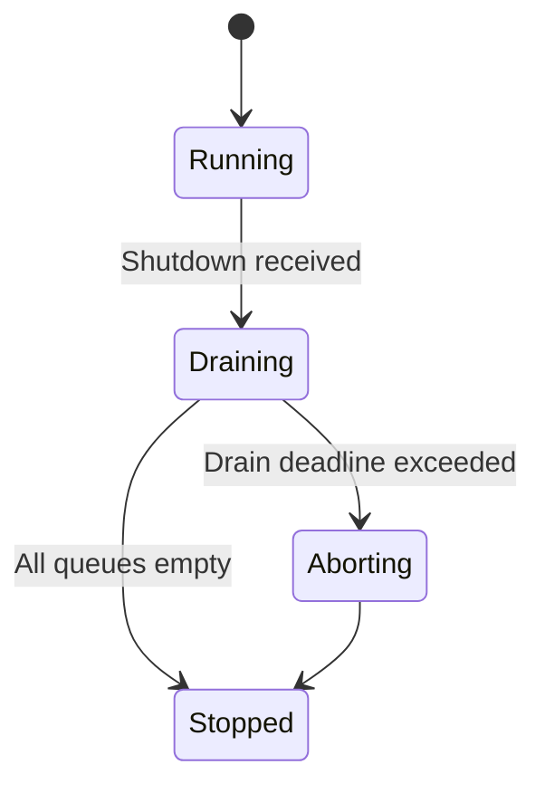
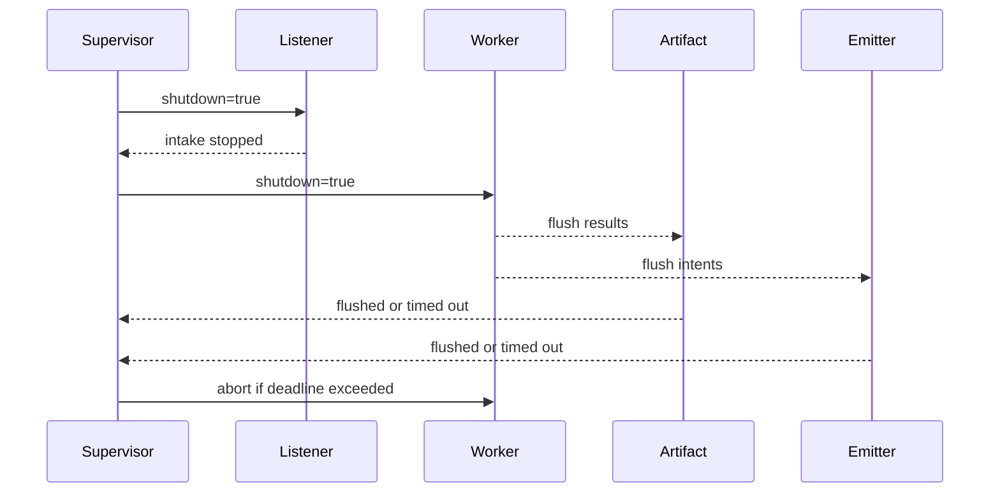
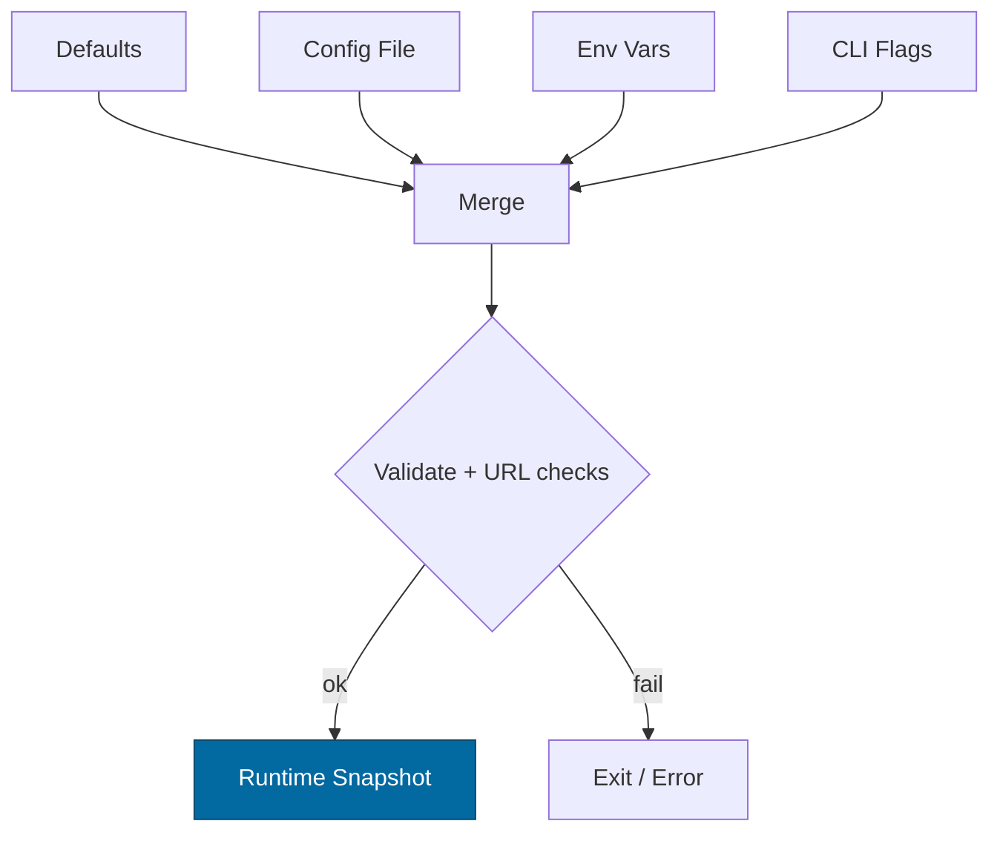

# Combined Markdown

_Source directory_: `crates/svc-rewarder/docs`  
_Files combined_: 12  
_Recursive_: 0

---

### Table of Contents

- API.MD
- CONCURRENCY.MD
- CONFIG.MD
- GOVERNANCE.MD
- IDB.md
- INTEROP.MD
- OBSERVABILITY.MD
- PERFORMANCE.MD
- QUANTUM.MD
- RUNBOOK.MD
- SECURITY.MD
- TESTS.MD

---

## API.MD
_File 1 of 12_

---

title: API Surface & SemVer Reference — svc-rewarder
status: draft
msrv: 1.80.0
last-updated: 2025-10-14
audience: contributors, auditors, API consumers
-----------------------------------------------

# 📖 API.md — `svc-rewarder`

## 0. Purpose

This document captures the **public API surface** of `svc-rewarder`:

* HTTP/REST endpoints (primary contract for consumers).
* Wire-level semantics (idempotency, auth, rate limits, headers).
* Rust surface (if any public library API is exported).
* SemVer discipline: what changes break vs. extend.
* CI enforcement via `cargo public-api` (library surface) and OpenAPI diff (HTTP surface).

`svc-rewarder` computes deterministic reward manifests from sealed inputs and emits **idempotent** settlement intents to the ledger.

---

## 1. Public API Surface

> `svc-rewarder` is a **service crate**. Its stable surface is the **HTTP API**.
> Any Rust types exposed are internal-only unless explicitly stated here. The crate does **not** publish a reusable Rust library API by default.

### 1.1 HTTP Endpoints (v1)

Base path: `/rewarder`
All endpoints require **TLS** and **capability tokens (macaroons)** unless explicitly noted.

#### 1) `POST /rewarder/epochs/{epoch_id}/compute`

**Purpose:** Compute rewards for an epoch using sealed inputs and a signed policy. Emits **zero** ledger effects if `dry_run=true`.

* **Auth:** macaroon with scope `rewarder.run`, tenant-scoped.
* **Idempotency:** Natural, via `run_key = hash(epoch_id || policy_hash || inputs_cid)`.
  Re-submitting the same triple is safe; ledger sees a duplicate emit (`dup`) with **no new effects**.
* **Rate limits:** Per-tenant and per-instance (see headers).
* **Request (JSON):**

```json
{
  "inputs_cid": "b3:7d9c...c1",          // BLAKE3 or content-addressed handle
  "policy_id": "rev42",
  "policy_hash": "b3:3aa1...f83",
  "dry_run": false,
  "notes": "optional operator notes"
}
```

* **Success (200 OK):**

```json
{
  "epoch_id": "2025-10-01",
  "run_key": "e91a6e1b1f2c9c0d",
  "commitment": "b3:1ac4...9b0",
  "status": "ok",                         // ok | quarantined | fail
  "totals": {
    "pool_minor_units": "123456789",
    "payout_minor_units": "123456700",
    "residual_minor_units": "89"
  },
  "policy": { "id": "rev42", "hash": "b3:3aa1...f83", "signed": true },
  "invariants": { "conservation": true, "overflow": false, "idempotent": true },
  "ledger": { "emitted": true, "result": "accepted" }, // dry_run => emitted=false
  "metrics": { "compute_ms": 418, "cost_estimate_ms": 377 }
}
```

* **Quarantine (409 Conflict):** Invariant breach; **no** ledger effects.

```json
{
  "status": "quarantined",
  "reason": "conservation",
  "details": "Σ payouts exceeds pool_total",
  "run_key": "e91a6e1b1f2c9c0d",
  "commitment": "b3:1ac4...9b0"
}
```

* **Common Errors:**

  * `400 BAD_REQUEST` — schema invalid, oversize, decompress cap, stale policy hash.
  * `401 UNAUTHENTICATED` — missing/invalid macaroon.
  * `403 UNAUTHORIZED` — missing scope/caveats failed.
  * `409 CONFLICT` — same `epoch_id` with **different** `(policy_hash, inputs_cid)` commitment.
  * `429 TOO_MANY_REQUESTS` — rate/concurrency caps.
  * `503 SERVICE_UNAVAILABLE` — degraded (dependency or backpressure).

#### 2) `GET /rewarder/epochs/{epoch_id}`

**Purpose:** Fetch the sealed manifest for an epoch (read-only).

* **Auth:** macaroon with scope `rewarder.inspect` (read-only).
* **Response (200 OK):**

```json
{
  "epoch_id": "2025-10-01",
  "run_key": "e91a6e1b1f2c9c0d",
  "commitment": "b3:1ac4...9b0",
  "status": "ok",
  "policy": { "id": "rev42", "hash": "b3:3aa1...f83", "signed": true },
  "totals": { "pool_minor_units": "123456789", "payout_minor_units": "123456700", "residual_minor_units": "89" },
  "attestation": {
    "sig_ed25519": "base64:...",
    "sig_pq": "base64:...",                   // present if PQ dual-sign enable
    "signed_at": "2025-10-01T12:34:56Z"
  }
}
```

* **Errors:** `404 NOT_FOUND` (no manifest), plus standard auth/rate/degraded responses.

#### 3) `GET /rewarder/policy/{policy_id}`

**Purpose:** Fetch a **signed** policy document by ID for audit/reproducibility.

* **Auth:** macaroon with scope `rewarder.inspect` (or public if configured).
* **Response (200 OK):**

```json
{
  "id": "rev42",
  "hash": "b3:3aa1...f83",
  "version": "1.2.0",
  "signed": true,
  "body": { "weights": { "views": 0.3, "subs": 0.7 }, "rounding": "bankers" }
}
```

#### 4) Health/Meta

* `GET /healthz` — liveness (200 if process alive).
* `GET /readyz` — readiness (200 when deps OK; else 503 with JSON `{degraded, missing, retry_after}`).
* `GET /metrics` — Prometheus.
* `GET /version` — build info (git SHA, features, msrv).

---

### 1.2 HTTP Headers & Conventions

* **Auth:** `Authorization: Bearer <macaroon>` (preferred).
  Legacy interop: gateway may present JWT; service **converts** to scoped macaroon internally (JWT is not forwarded downstream).
* **Correlation:** `X-Corr-ID` propagated end-to-end; server generates if missing and echoes it.
* **Idempotency:** Natural by content triple; clients **do not** need a separate `Idempotency-Key` header.
* **Rate Limit Feedback:**

  * `X-RateLimit-Limit`, `X-RateLimit-Remaining`, `Retry-After` (on 429/503).
* **Content:** `Content-Type: application/json`; gzip/zstd accepted; decompression **ratio ≤ 10×**; post-inflate hard cap enforced.

---

### 1.3 Error Schema (Uniform)

All errors return this envelope with appropriate HTTP status:

```json
{
  "error": {
    "code": "UNAUTHORIZED|BAD_REQUEST|CONFLICT|QUARANTINED|DEPENDENCY_UNAVAILABLE|INTERNAL",
    "message": "human-readable summary",
    "corr_id": "01JC...ULID",
    "details": { "reason": "schema|invariant|oversize|decompress_cap|cost_cap|..." }
  }
}
```

**Do not** echo secrets, tokens, or raw input payloads in error messages.

---

### 1.4 Example cURL Invocations

```bash
# Compute (production)
curl -sS -X POST "https://node.example.com/rewarder/epochs/2025-10-01/compute" \
  -H "Authorization: Bearer ${MACAROON}" \
  -H "X-Corr-ID: demo-123" \
  -H "Content-Type: application/json" \
  --data '{
    "inputs_cid":"b3:7d9c...c1",
    "policy_id":"rev42",
    "policy_hash":"b3:3aa1...f83",
    "dry_run":false
  }'

# Fetch manifest
curl -sS -H "Authorization: Bearer ${MACAROON}" \
  "https://node.example.com/rewarder/epochs/2025-10-01"

# Policy (read-only)
curl -sS -H "Authorization: Bearer ${MACAROON}" \
  "https://node.example.com/rewarder/policy/rev42"
```

---

## 2. SemVer Discipline

The **HTTP API** adheres to semantic versioning via a **versioned OpenAPI** and URL stability guarantees.

### 2.1 Additive (Minor / Non-Breaking)

* Add new optional request fields with defaults.
* Add new response fields (must not break existing parsers).
* Add new endpoints under the same base path.
* Extend enums marked `#[non_exhaustive]` (documented as such in OpenAPI using `x-non-exhaustive: true`).

### 2.2 Breaking (Major)

* Remove or rename endpoints/paths.
* Change required fields or field types.
* Change response codes for the same condition (e.g., 409 → 400).
* Make previously optional fields required.
* Tighten validation beyond documented constraints in a way that rejects previously valid requests.

### 2.3 Patch-Level

* Doc-only updates, example clarifications.
* Performance improvements without behavior change.
* Additional error details inside `error.details` that do not change `code`.

**Rule of thumb:** If an existing (well-behaved) client would start failing, it’s **breaking**.

---

## 3. Stability Guarantees

* **MSRV:** 1.80.0.
* **TLS:** TLS 1.3 required; cipher suites pinned in deployment.
* **Auth:** macaroon-based capabilities are the stable model; JWT accepted only at the edge and converted internally.
* **Idempotency:** `run_key` semantics are stable: same triple → same outcome; double-emit is prevented by design.
* **Error taxonomy:** codes above are stable; we may add **new** codes (additive).

---

## 4. Rust Public Surface (Library Exports)

By default, `svc-rewarder` is built as a **binary service** and does not commit to a stable Rust API. If a library target is exposed in the future, it will be documented here and subjected to `cargo public-api` gates.

**Current:** *No stable Rust exports.*

You may still generate a snapshot (will be empty or minimal for service crates):

```bash
cargo public-api --simplified --deny-changes
```

Store results in: `docs/api-history/svc-rewarder/<version>.txt`.

---

## 5. OpenAPI & Schemas

We publish a machine-readable contract for the HTTP API.

* `GET /openapi.json` — OpenAPI 3.1 (current minor version).
* `GET /schema/compute.json` — JSON Schema for the `POST /compute` request.

### 5.1 OpenAPI Sketch (excerpt)

```yaml
openapi: 3.1.0
info:
  title: svc-rewarder API
  version: 1.0.0
servers:
  - url: https://node.example.com
paths:
  /rewarder/epochs/{epoch_id}/compute:
    post:
      operationId: computeEpoch
      security: [{ bearerAuth: [] }]
      parameters:
        - in: path
          name: epoch_id
          required: true
          schema: { type: string, pattern: "^[0-9]{4}-[0-9]{2}-[0-9]{2}$" }
      requestBody:
        required: true
        content:
          application/json:
            schema:
              $ref: "#/components/schemas/ComputeRequest"
      responses:
        "200": { $ref: "#/components/responses/ComputeOk" }
        "409": { $ref: "#/components/responses/Quarantined" }
        "4XX": { $ref: "#/components/responses/Error" }
        "5XX": { $ref: "#/components/responses/Error" }
components:
  securitySchemes:
    bearerAuth:
      type: http
      scheme: bearer
      bearerFormat: macaroon
  schemas:
    ComputeRequest:
      type: object
      additionalProperties: false
      properties:
        inputs_cid: { type: string, minLength: 8 }
        policy_id:  { type: string, minLength: 1 }
        policy_hash:{ type: string, minLength: 8 }
        dry_run:    { type: boolean, default: false }
        notes:      { type: string, maxLength: 1024 }
      required: [inputs_cid, policy_id, policy_hash]
    ErrorEnvelope:
      type: object
      properties:
        error:
          type: object
          properties:
            code: { type: string }
            message: { type: string }
            corr_id: { type: string }
            details: { type: object, additionalProperties: true }
          required: [code, message, corr_id]
  responses:
    Error:
      description: Error
      content:
        application/json: { schema: { $ref: "#/components/schemas/ErrorEnvelope" } }
```

---

## 6. Behavior & Invariants (Wire Semantics)

* **Determinism:** Given identical `(epoch_id, policy_hash, inputs_cid)`, outputs are byte-for-byte stable (manifest + totals).
* **Conservation:** Σ payouts ≤ pool_total; violation ⇒ `409` with `status=quarantined` and **no** ledger emission.
* **Idempotency:** Multiple `POST .../compute` with same triple produce **at most one** ledger intent (`accepted` first time, then `dup`).
* **Cost Guard:** If estimated compute cost exceeds `MAX_EPOCH_COST_MS`, request is rejected with `400` (`details.reason="cost_cap"`) or forced `dry_run` if configured.
* **Compression:** gzip/zstd accepted; decompression ratio ≤ 10× and post-inflate cap < 8 MiB; exceeding caps ⇒ `400` with `details.reason="decompress_cap"`.

---

## 7. Deprecation Policy

* We version the **OpenAPI** document and annotate deprecated fields/endpoints with `"deprecated": true`.
* A deprecation requires:

  * CHANGELOG entry with migration notes.
  * Minimum **one minor release** grace period before removal.
  * If removal is breaking, the **major** version increments and old path is removed only then.

---

## 8. CI & Gates

* **OpenAPI Diff Gate:** Pull Requests that change `openapi.json` must include a rendered diff; CI blocks without a CHANGELOG entry and acceptance checklist.
* **`cargo public-api`:** Runs for any library target (if/when present).
* **Contract Tests:** Integration tests call `/compute` and `/epochs/{id}` with canonical vectors; CI asserts:

  * Determinism: re-running vectors yields identical manifests.
  * Idempotency: first emit `accepted`, subsequent `dup`, never double-accepted.
  * Invariant handling: known-bad vectors yield `409 quarantined`.

---

## 9. Acceptance Checklist (DoD)

* [ ] Current **OpenAPI** generated and stored under `docs/openapi/svc-rewarder.json`.
* [ ] API snapshot stored at `docs/api-history/svc-rewarder/<version>.txt` (if library target exists).
* [ ] CI gates pass (`openapi-diff`, `cargo public-api` if applicable).
* [ ] CHANGELOG updated for any surface/behavior changes.
* [ ] Canonical test vectors updated (good & bad cases).
* [ ] Docs & examples updated; error codes documented.

---

## 10. History (notable API shifts)

* **1.0.0** — Initial stable release: `/epochs/{id}/compute`, `/epochs/{id}`, `/policy/{id}`, `/healthz`, `/readyz`, `/metrics`, `/version`.
* *Future changes recorded here with migration notes.*

---

## 11. Appendix

**References**

* Rust SemVer: [https://doc.rust-lang.org/cargo/reference/semver.html](https://doc.rust-lang.org/cargo/reference/semver.html)
* cargo-public-api: [https://github.com/Enselic/cargo-public-api](https://github.com/Enselic/cargo-public-api)
* cargo-semver-checks: [https://github.com/obi1kenobi/cargo-semver-checks](https://github.com/obi1kenobi/cargo-semver-checks)

**Perfection Gates tie-in**

* **Gate G:** No undocumented surface (OpenAPI + this file must match).
* **Gate H:** Breaking changes require major version bump.
* **Gate J:** CHANGELOG alignment enforced.

**Security Cross-Refs**

* Auth model: macaroons with caveats (tenant, path, method, TTL, IP).
* Idempotency: `run_key` = hash(epoch_id || policy_hash || inputs_cid).
* Invariants: conservation, determinism, integer-only money math.

---

### Quick Generator Snippets (optional)

Generate an API snapshot (library target only):

```bash
cargo public-api --simplified --deny-changes > docs/api-history/svc-rewarder/$(git describe --tags --always).txt
```

Validate OpenAPI (if you keep it in-repo at `docs/openapi/svc-rewarder.json`):

```bash
lint-openapi docs/openapi/svc-rewarder.json
openapi-diff previous.json docs/openapi/svc-rewarder.json
```

This API spec is **consumer-focused, invariant-aware, and SemVer-disciplined**, matching the economic safety guarantees of `svc-rewarder`.


---

## CONCURRENCY.MD
_File 2 of 12_


---

````markdown
---
title: Concurrency Model — svc-rewarder
crate: svc-rewarder
owner: Stevan White
last-reviewed: 2025-10-13
status: draft
template_version: 1.1
msrv: 1.80.0
tokio: "1.x (pinned at workspace root)"
loom: "0.7+ (dev-only)"
lite_mode: "N/A (service crate)"
---

# Concurrency Model — svc-rewarder

This document makes the concurrency rules **explicit**: tasks, channels, locks, shutdown, timeouts,
and validation (property/loom/TLA+). It complements `docs/SECURITY.md`, `docs/CONFIG.md`,
`README.md`, and `docs/IDB.md`.

> **Golden rule:** never hold a lock across `.await` in supervisory or hot paths.

---

## 0) Lite Mode
*N/A — this is a service with background tasks.*

---

## 1) Invariants (MUST)

- [I-1] **No lock across `.await`**. If unavoidable, split the critical section or move data out before awaiting.
- [I-2] **Single writer** per mutable resource; multiple readers read via snapshots or short read guards.
- [I-3] **Bounded channels only** (`mpsc`/`broadcast`) with explicit overflow policy and metrics.
- [I-4] **Explicit timeouts** on all I/O and RPCs; fail-fast with typed errors; total deadlines on multi-hop requests.
- [I-5] **Cooperative cancellation**: every `.await` is cancel-safe or guarded by `tokio::select!`.
- [I-6] **Graceful shutdown**: observe `Shutdown` signal; stop intake; drain within deadline; abort stragglers; report counts.
- [I-7] **No blocking syscalls** on the async runtime; use `spawn_blocking` for CPU or FS that cannot be made async.
- [I-8] **No task leaks**: track `JoinHandle`s; detach only with rationale and comment.
- [I-9] **Backpressure over buffering**: reject or drop deterministically with metrics; never grow unbounded queues.
- [I-10] **Framing discipline**: length-delimited + max caps; handle split reads/writes; invoke `.shutdown().await` on I/O teardown.
- [I-11] **Async Drop**: do not block in `Drop`; expose `async close()/shutdown()` and require callers to invoke it before drop.

---

## 2) Runtime Topology

**Tokio runtime:** multi-threaded scheduler, worker count = CPU logical cores (default).  
**Primary tasks (long-lived):**

1. **Supervisor** — owns control plane, config reloads, readiness gating, shutdown fanout.
2. **HTTP Listener** — axum server handling:
   - `POST /rewarder/epochs/{id}/compute` (enqueue if not exists)
   - `GET /rewarder/epochs/{id}` (serve run manifest)
3. **Compute Scheduler** — de-duplicates per-epoch work, seals inputs, creates `ComputeJob`s, and enqueues to `work`.
4. **Worker Pool (N = `concurrency.compute_workers`)** — runs pure reward calculus + conservation checks; emits `ResultItem`s.
5. **Artifact Writer** — writes `run.json`, `commitment`, optional zk proofs to `artifact_dir` (amnesia-aware).
6. **Intent Emitter** — sends idempotent settlement intents to `ron-ledger` (downstream idempotency key attached).
7. **Health Reporter** — emits `/metrics` and health/readiness updates.

**Supervision & restart policy:**  
- On panic in any worker: exponential backoff with jitter (100–400ms → cap 5s), max 5 restarts in 1 minute → escalate by marking `/readyz` false and logging `service_restarts_total{task}`.
- On config reload: disruptive items (bind/tls/shards) trigger rebind/replan; non-disruptive items applied in place.

```mermaid
flowchart TB
  subgraph Runtime
    SUP[Supervisor] -->|spawn| LIS[HTTP Listener]
    SUP -->|spawn| SCHED[Compute Scheduler]
    SUP -->|spawn| WPOOL[Worker Pool (N)]
    SUP -->|spawn| ART[Artifact Writer]
    SUP -->|spawn| EMIT[Intent Emitter]

    LIS -->|mpsc: work_req(512)| SCHED
    SCHED -->|mpsc: work(512)| WPOOL
    WPOOL -->|mpsc: results(512)| ART
    WPOOL -->|mpsc: intents(512)| EMIT

    SUP -->|watch Shutdown| LIS
    SUP -->|watch Shutdown| SCHED
    SUP -->|watch Shutdown| WPOOL
    SUP -->|watch Shutdown| ART
    SUP -->|watch Shutdown| EMIT
  end
  style SUP fill:#0ea5e9,stroke:#0c4a6e,color:#fff
````

**Accessibility description:** Supervisor spawns Listener, Scheduler, Worker Pool, Artifact Writer, and Intent Emitter. Listener forwards requests to Scheduler; Scheduler enqueues bounded work to Workers. Workers send results to Artifact Writer and intents to Intent Emitter. All tasks subscribe to a Shutdown watch channel.

---

## 3) Channels & Backpressure

**Inventory (all bounded):**

| Name       | Kind      | Capacity | Producers → Consumers     | Backpressure Policy               | Drop Semantics / Response                                                     |
| ---------- | --------- | -------: | ------------------------- | --------------------------------- | ----------------------------------------------------------------------------- |
| `work_req` | mpsc      |      512 | HTTP Listener → Scheduler | `try_send` else `Busy`            | HTTP 429 + `busy_rejections_total{endpoint}`                                  |
| `work`     | mpsc      |      512 | Scheduler → Workers       | `try_send` else backoff+retry(1x) | on second failure → increment `queue_dropped_total{work}` and error to caller |
| `results`  | mpsc      |      512 | Workers → Artifact Writer | `await send` (bounded)            | on shutdown: flush until deadline, else drop with `dropped_results_total`     |
| `intents`  | mpsc      |      512 | Workers → Intent Emitter  | `await send` (bounded)            | failure escalates to quarantine for that epoch                                |
| `events`   | broadcast |     1024 | Supervisor → N tasks      | slow consumers lag & drop oldest  | `bus_lagged_total{events}`                                                    |
| `shutdown` | watch     |        1 | Supervisor → N tasks      | last-write-wins                   | N/A                                                                           |

**Guidelines:**

* Prefer `try_send` for ingress (`work_req`) to fail fast under pressure.
* Keep a **queue depth gauge** for `work`, `results`, `intents`.
* Backoff window on Scheduler re-enqueue: 50–150ms jitter, one retry; then fail.

---

## 4) Locks & Shared State

**Allowed**

* Short-lived `Mutex`/`RwLock` for small metadata (e.g., in-memory dedupe map), released **before** any `.await`.
* Read-mostly data via `Arc<StateSnapshot>` (policy snapshot, config snapshot).
* Per-epoch run registry stored in `DashMap` or `RwLock<HashMap>` but **lookups cloned** into local variables before awaiting.

**Forbidden**

* Holding any lock across `.await`.
* Nested locks without an explicit, documented ordering.

**Hierarchy (if needed)**

1. `cfg_snapshot`
2. `run_registry`
3. `metrics_counters`

---

## 5) Timeouts, Retries, Deadlines

* **I/O Timeouts** (from config): `read=5s`, `write=5s`, `idle=60s` (defaults; override via `docs/CONFIG.md`).
* **Upstream RPCs** (`ron-accounting`, `ron-ledger`, `policy`):

  * Per-call timeout = `read_timeout` unless stricter endpoint-specific budget is defined.
  * Retries: **idempotent** endpoints only, jittered backoff 100–250ms, max 3 attempts; non-idempotent → no retry.
* **End-to-end deadline** for `compute`: `epoch_deadline = min( (now+epoch_duration/2), caller_deadline )`.
* **Circuit breaker** (optional): open after error-rate spike; half-open probes after 1–5s.

```mermaid
sequenceDiagram
  autonumber
  participant C as Client
  participant L as Listener
  participant S as Scheduler
  participant W as Worker
  C->>L: POST /compute (deadline=2s)
  L->>S: try_send work_req (bounded)
  alt queue full
    L-->>C: 429 Busy
  else queued
    S->>W: try_send work
    W-->>C: 202 Accepted or 200 (if cached)
  end
```

**Text:** Listener accepts a compute request with a 2s deadline. If queues are full, it returns 429. Otherwise, the job is scheduled and processed; response is 202 (async) or 200 if a cached run already exists.

---

## 6) Cancellation & Shutdown

* **Signal source:** `KernelEvent::Shutdown` or `wait_for_ctrl_c()`.
* **Propagation:** `tokio::select! { _ = shutdown.changed() => ..., _ = recv/send => ... }`.
* **Sequence:**

  1. Supervisor sets `shutdown=true` on watch channel; `/readyz` flips to **false** immediately.
  2. Listener stops accepting new work (returns 503/“draining”).
  3. Scheduler stops enqueuing new jobs; workers finish in-flight.
  4. Artifact Writer and Intent Emitter flush until **drain deadline** (configurable, 1–5s).
  5. After deadline, Supervisor aborts remaining tasks; increments `tasks_aborted_total{kind}`.



---

## 7) I/O & Framing

* **HTTP/JSON (axum 0.7)** for ingress/egress; max body = `limits.max_body_bytes` (default 1 MiB).
* **Content-addressed references** are short strings; never trust client-provided sizes → always cap & validate.
* Use `AsyncReadExt/AsyncWriteExt` and call `.shutdown().await` on sockets/streams after finishing.

---

## 8) Error Taxonomy (Concurrency-Relevant)

| Error        | When                     | Retry?     | Metric                            | Notes                             |
| ------------ | ------------------------ | ---------- | --------------------------------- | --------------------------------- |
| `Busy`       | `try_send` on full queue | caller may | `busy_rejections_total{endpoint}` | Listener surface returns 429      |
| `Timeout`    | RPC or I/O exceeded      | sometimes  | `io_timeouts_total{op}`           | Attach `op` and `peer` labels     |
| `Canceled`   | Shutdown while waiting   | no         | `tasks_canceled_total{kind}`      | Cooperative cancellation          |
| `Lagging`    | broadcast overflow       | no         | `bus_lagged_total{events}`        | Diagnose slow consumers           |
| `Quarantine` | conservation failure     | no         | `quarantine_total{epoch}`         | No intents emitted for that epoch |

---

## 9) Metrics (Concurrency Health)

* `queue_depth{queue}` (gauge) — `work`, `results`, `intents`
* `queue_dropped_total{queue}` (counter)
* `busy_rejections_total{endpoint}` (counter)
* `tasks_spawned_total{kind}` / `tasks_aborted_total{kind}` (counters)
* `io_timeouts_total{op}` / `backoff_retries_total{op}` (counters)
* `service_restarts_total{task}` (counter)
* `readyz_degraded{cause}` (gauge-like via set of labeled counters)

---

## 10) Validation Strategy

**Unit / Property**

* Backpressure behavior: `work_req` returns 429 on full.
* Deadline enforcement: responses time out within tolerance.
* No-lock-across-await: grepped & code-reviewed; optional runtime assert in dev builds.

**Loom (dev-only)**

* Model: Producer → bounded queue → Consumer with Shutdown.
* Assertions: no deadlock; all queued items either processed or deterministically dropped on shutdown; no double free.

**Fuzz**

* HTTP payloads & DTOs fuzzed (structure-aware); reject invalid or oversized frames.

**Chaos**

* Under load: kill 50% of workers; Supervisor restarts with backoff; `/readyz` toggles correctly; no task leak.

**TLA+ (optional)**

* If strict ordering matters for run manifests, specify minimal safety (no duplicate run) and liveness (eventual completion or quarantine) properties.

---

## 11) Code Patterns (Copy-Paste)

**Spawn + cooperative shutdown**

```rust
let (shutdown_tx, shutdown_rx) = tokio::sync::watch::channel(false);

// worker task
let mut rx = work_rx;
let mut sd = shutdown_rx.clone();
let worker = tokio::spawn(async move {
  loop {
    tokio::select! {
      _ = sd.changed() => break,
      maybe_job = rx.recv() => {
        let Some(job) = maybe_job else { break }; // channel closed
        if let Err(e) = handle_job(job).await {
          tracing::warn!(error=%e, "job failed");
        }
      }
    }
  }
});

// later: shutdown
let _ = shutdown_tx.send(true);
let _ = worker.await;
```

**Bounded `mpsc` with `try_send`**

```rust
match work_tx.try_send(job) {
  Ok(()) => {}
  Err(tokio::sync::mpsc::error::TrySendError::Full(_)) => {
    metrics::busy_rejections_total("compute").inc();
    return Err(Error::Busy);
  }
  Err(tokio::sync::mpsc::error::TrySendError::Closed(_)) => {
    return Err(Error::Unavailable);
  }
}
```

**Timeout + total deadline**

```rust
let io = tokio::time::timeout(cfg.read_timeout, client.get(url)).await;
let total = tokio::time::timeout(total_deadline, compute_epoch()).await;
```

**Async Drop pattern**

```rust
pub struct ArtifactSink { inner: Option<Writer> }

impl ArtifactSink {
  pub async fn close(&mut self) -> anyhow::Result<()> {
    if let Some(mut w) = self.inner.take() {
      w.flush().await?;
      w.shutdown().await?;
    }
    Ok(())
  }
}

impl Drop for ArtifactSink {
  fn drop(&mut self) {
    if self.inner.is_some() {
      tracing::debug!("ArtifactSink dropped without close(); best-effort release");
    }
  }
}
```

**No lock across `.await`**

```rust
let snapshot = {
  let g = registry.read(); // short critical section
  g.lookup(epoch).cloned()
};
let out = do_async(snapshot).await;
```

---

## 12) Configuration Hooks (Quick Reference)

* `concurrency.compute_workers`, `concurrency.io_inflight`
* `read_timeout`, `write_timeout`, `idle_timeout`
* `limits.max_body_bytes`
* `drain_deadline` (if exposed), `epoch_duration`
* See `docs/CONFIG.md` for authoritative schema.

---

## 13) Known Trade-offs / Nonstrict Areas

* **Queue policy:** `work_req` rejects new on overload (429) to keep latency bounded; `work` retries once to smooth bursts, otherwise fails fast to avoid head-of-line blocking.
* **Artifact/Intent channels:** prefer bounded `await send` to preserve ordering guarantees; on shutdown, deterministic drop with metrics is acceptable.

---

## 14) Mermaid Diagrams

### 14.1 Task & Queue Topology

```mermaid
flowchart LR
  L[Listener] -->|mpsc work_req(512)| S[Scheduler]
  S -->|mpsc work(512)| W1[Worker A]
  S -->|mpsc work(512)| W2[Worker B]
  W1 -->|mpsc results(512)| A[Artifact Writer]
  W2 -->|mpsc results(512)| A
  W1 -->|mpsc intents(512)| E[Intent Emitter]
  W2 -->|mpsc intents(512)| E
  SH[Shutdown watch] --> L
  SH --> S
  SH --> W1
  SH --> W2
  SH --> A
  SH --> E
```

**Text:** Listener → Scheduler → Workers via bounded mpsc; Workers → Artifact Writer / Intent Emitter via bounded mpsc; a Shutdown watch channel reaches all tasks.

### 14.2 Shutdown Sequence



---

## 15) CI & Lints (Enforcement)

**Clippy**

* `-D warnings`
* `-W clippy::await_holding_lock`
* `-W clippy::needless_collect`
* `-W clippy::useless_async`

**GitHub Actions (sketch)**

```yaml
name: concurrency-guardrails
on: [push, pull_request]
jobs:
  clippy:
    runs-on: ubuntu-latest
    steps:
      - uses: actions/checkout@v4
      - uses: dtolnay/rust-toolchain@stable
      - run: cargo clippy -p svc-rewarder -- -D warnings -W clippy::await_holding_lock

  loom:
    if: github.event_name == 'pull_request'
    runs-on: ubuntu-latest
    steps:
      - uses: actions/checkout@v4
      - uses: dtolnay/rust-toolchain@stable
      - run: RUSTFLAGS="--cfg loom" cargo test -p svc-rewarder --tests -- --ignored

  fuzz:
    runs-on: ubuntu-latest
    steps:
      - uses: actions/checkout@v4
      - uses: dtolnay/rust-toolchain@stable
      - run: cargo install cargo-fuzz
      - run: cargo fuzz build -p svc-rewarder
```

---

## 16) Schema Generation (Optional)

* Consider annotating channel declarations for doc extraction:

  ```rust
  #[doc_channel(name="work", kind="mpsc", cap=512, policy="retry_once_then_drop")]
  let (work_tx, work_rx) = tokio::sync::mpsc::channel(512);
  ```
* A small build script can emit `docs/_generated/concurrency.mdfrag` to include.

---

## 17) Review & Maintenance

* **Review cadence:** every 90 days or upon any change to tasks/channels/locks.
* Keep `owner`, `msrv`, and `last-reviewed` current.
* **PR checklist:** if concurrency changes, update this file + Loom/property tests.

```
---
```


---

## CONFIG.MD
_File 3 of 12_


---

````markdown
---
title: Configuration — svc-rewarder
crate: svc-rewarder
owner: Stevan White
last-reviewed: 2025-10-13
status: reviewed
template_version: 1.1
---

# Configuration — svc-rewarder

This document defines **all configuration** for `svc-rewarder`, including sources,
precedence, schema (types/defaults), validation, feature flags, live-reload behavior,
and security implications. It complements `README.md` and `docs/SECURITY.md`.

> **Tiering:**  
> - **Library crates:** most sections apply, but service-only notes (ports, /healthz) may be N/A.  
> - **Service crates:** all sections apply (network, readiness, observability, etc.).

---

## 1) Sources & Precedence (Authoritative)

Configuration may come from multiple sources. **Precedence (highest wins):**

1. **Process flags** (CLI)  
2. **Environment variables**  
3. **Config file** (e.g., `Config.toml` beside the binary)  
4. **Built-in defaults** (hard-coded)

> On dynamic reload, the effective config is recomputed under the same precedence.

**Supported file formats:** TOML (preferred), JSON (optional).  
**Path resolution order for `--config` (if relative):** `./`, `$CWD`, crate dir.

---

## 2) Quickstart Examples

### 2.1 Minimal service start
```bash
RUST_LOG=info \
SVC_REWARDER_BIND_ADDR=0.0.0.0:8080 \
SVC_REWARDER_METRICS_ADDR=127.0.0.1:0 \
cargo run -p svc-rewarder
````

### 2.2 Config file (TOML)

```toml
# Config.toml
bind_addr     = "0.0.0.0:8080"
metrics_addr  = "127.0.0.1:0"
max_conns     = 1024
read_timeout  = "5s"
write_timeout = "5s"
idle_timeout  = "60s"

[tls]
enabled = false
# cert_path = "/etc/ron/cert.pem"
# key_path  = "/etc/ron/key.pem"

[limits]
max_body_bytes       = "1MiB"
decompress_ratio_cap = 10

[rewarder]
epoch_duration     = "1h"         # computation window
policy_id          = "policy:v3"  # logical id; resolved via registry/policy
inputs_cache_ttl   = "5m"
max_epoch_skew     = "2m"
idempotency_salt   = "svc-rewarder|v1"
artifact_dir       = "/var/run/svc-rewarder/artifacts"
retain_runs        = "24h"
enable_zk_proofs   = false

[ingress]                       # peers and caps
accounting_base_url = "http://127.0.0.1:7101"
ledger_base_url     = "http://127.0.0.1:7201"
policy_base_url     = "http://127.0.0.1:7301"
macaroon_path       = "/etc/ron/caps/rewarder.macaroon"

[concurrency]
compute_workers = 4
io_inflight     = 64

[shard]
strategy = "by_actor"       # by_actor|by_content|single
shards   = 1

[amnesia]
enabled = false

[pq]
mode = "off"                 # off|hybrid

[log]
format = "json"              # json|text
level  = "info"              # trace|debug|info|warn|error
```

### 2.3 CLI flags (override file/env)

```bash
cargo run -p svc-rewarder -- \
  --bind 0.0.0.0:8080 \
  --metrics 127.0.0.1:0 \
  --max-conns 2048 \
  --epoch-duration 1h \
  --policy-id policy:v3 \
  --compute-workers 8
```

---

## 3) Schema (Typed, With Defaults + Reloadability)

> **Prefix convention:** All env vars begin with `SVC_REWARDER_`.
> **Durations** accept `s`, `ms`, `m`, `h`. **Sizes** accept `B`, `KB`, `MB`, `MiB`.
> **Reloadable?** column indicates whether a key can be applied at runtime without a disruptive rebind/replan.

| Key / Env Var                                                       | Type                                   | Default       | Description                              | Reloadable?                   | Security Notes                     |                 |
| ------------------------------------------------------------------- | -------------------------------------- | ------------- | ---------------------------------------- | ----------------------------- | ---------------------------------- | --------------- |
| `bind_addr` / `SVC_REWARDER_BIND_ADDR`                              | socket                                 | `127.0.0.1:0` | HTTP/ingress bind address                | **No**                        | Public binds require threat review |                 |
| `metrics_addr` / `SVC_REWARDER_METRICS_ADDR`                        | socket                                 | `127.0.0.1:0` | Prometheus endpoint bind                 | **No**                        | Prefer localhost; gateway scrape   |                 |
| `max_conns` / `SVC_REWARDER_MAX_CONNS`                              | u32                                    | `1024`        | Max concurrent connections               | **Yes**                       | Prevents FD exhaustion             |                 |
| `read_timeout` / `SVC_REWARDER_READ_TIMEOUT`                        | duration                               | `5s`          | Per-request read timeout                 | **Yes**                       | DoS mitigation                     |                 |
| `write_timeout` / `SVC_REWARDER_WRITE_TIMEOUT`                      | duration                               | `5s`          | Per-request write timeout                | **Yes**                       | DoS mitigation                     |                 |
| `idle_timeout` / `SVC_REWARDER_IDLE_TIMEOUT`                        | duration                               | `60s`         | Keep-alive idle shutdown                 | **Yes**                       | Resource hygiene                   |                 |
| `limits.max_body_bytes` / `SVC_REWARDER_MAX_BODY_BYTES`             | size                                   | `1MiB`        | Request payload cap                      | **Yes**                       | Zip/decompression bomb guard       |                 |
| `limits.decompress_ratio_cap` / `SVC_REWARDER_DECOMPRESS_RATIO_CAP` | u32                                    | `10`          | Max allowed decompression ratio          | **Yes**                       | Bomb guard                         |                 |
| `tls.enabled` / `SVC_REWARDER_TLS_ENABLED`                          | bool                                   | `false`       | Enable TLS                               | **No**                        | tokio-rustls only                  |                 |
| `tls.cert_path` / `SVC_REWARDER_TLS_CERT_PATH`                      | path                                   | `""`          | PEM cert path                            | **No**                        | Secrets on disk; perms 0600        |                 |
| `tls.key_path` / `SVC_REWARDER_TLS_KEY_PATH`                        | path                                   | `""`          | PEM key path                             | **No**                        | Zeroize in memory                  |                 |
| `uds.path` / `SVC_REWARDER_UDS_PATH`                                | path                                   | `""`          | Optional Unix Domain Socket              | **No**                        | Dir 0700, sock 0600                |                 |
| `uds.allow_uids` / `SVC_REWARDER_UDS_ALLOW_UIDS`                    | list<u32>                              | `[]`          | PEERCRED allowlist                       | **No**                        | Strict allowlist                   |                 |
| `auth.macaroon_path` / `SVC_REWARDER_MACAROON_PATH`                 | path                                   | `""`          | Capability token file                    | **Yes**                       | Do not log contents                |                 |
| `amnesia.enabled` / `SVC_REWARDER_AMNESIA`                          | bool                                   | `false`       | RAM-only secrets mode                    | **No**                        | No persistent keys/artifacts       |                 |
| `pq.mode` / `SVC_REWARDER_PQ_MODE`                                  | enum(`off`,`hybrid`)                   | `off`         | PQ readiness toggle (e.g., X25519+Kyber) | **No**                        | Interop compatibility risk         |                 |
| `log.format` / `SVC_REWARDER_LOG_FORMAT`                            | enum(`json`,`text`)                    | `json`        | Structured logs                          | **Yes**                       | JSON required in prod              |                 |
| `log.level` / `SVC_REWARDER_LOG_LEVEL`                              | enum                                   | `info`        | `trace`..`error`                         | **Yes**                       | Avoid `trace` in prod              |                 |
| `rewarder.epoch_duration` / `SVC_REWARDER_EPOCH_DURATION`           | duration                               | `1h`          | Reward computation window                | **Yes**                       | N/A                                |                 |
| `rewarder.policy_id` / `SVC_REWARDER_POLICY_ID`                     | string                                 | `""`          | Logical policy ID to resolve             | **Yes**                       | Signed policy enforced             |                 |
| `rewarder.inputs_cache_ttl` / `SVC_REWARDER_INPUTS_CACHE_TTL`       | duration                               | `5m`          | Cache TTL for snapshots                  | **Yes**                       | N/A                                |                 |
| `rewarder.max_epoch_skew` / `SVC_REWARDER_MAX_EPOCH_SKEW`           | duration                               | `2m`          | Max tolerated time skew                  | **Yes**                       | Prevents replay/drift              |                 |
| `rewarder.idempotency_salt` / `SVC_REWARDER_IDEMPOTENCY_SALT`       | string                                 | `svc-rewarder | v1`                                      | Domain separation for run key | **Yes**                            | Treat as secret |
| `rewarder.artifact_dir` / `SVC_REWARDER_ARTIFACT_DIR`               | path                                   | `""`          | Manifest/commitment/zk output dir        | **Yes**                       | Tmpfs when amnesia=on              |                 |
| `rewarder.retain_runs` / `SVC_REWARDER_RETAIN_RUNS`                 | duration                               | `24h`         | How long to retain artifacts             | **Yes**                       | Complies with data policy          |                 |
| `rewarder.enable_zk_proofs` / `SVC_REWARDER_ENABLE_ZK_PROOFS`       | bool                                   | `false`       | Emit optional zk proof artifacts         | **Yes**                       | CPU/budget implications            |                 |
| `ingress.accounting_base_url` / `SVC_REWARDER_ACCOUNTING_BASE_URL`  | url                                    | `""`          | ron-accounting endpoint                  | **Yes**                       | TLS/caps                           |                 |
| `ingress.ledger_base_url` / `SVC_REWARDER_LEDGER_BASE_URL`          | url                                    | `""`          | ron-ledger endpoint                      | **Yes**                       | TLS/caps                           |                 |
| `ingress.policy_base_url` / `SVC_REWARDER_POLICY_BASE_URL`          | url                                    | `""`          | registry/policy endpoint                 | **Yes**                       | TLS/caps                           |                 |
| `ingress.macaroon_path` / `SVC_REWARDER_MACAROON_PATH`              | path                                   | `""`          | Capability for all outbound calls        | **Yes**                       | Least-privilege scopes             |                 |
| `concurrency.compute_workers` / `SVC_REWARDER_COMPUTE_WORKERS`      | u16                                    | `4`           | Bounded CPU workers for pure math        | **Yes**                       | Avoids runtime starvation          |                 |
| `concurrency.io_inflight` / `SVC_REWARDER_IO_INFLIGHT`              | u32                                    | `64`          | Max concurrent IO ops                    | **Yes**                       | Backpressure control               |                 |
| `shard.strategy` / `SVC_REWARDER_SHARD_STRATEGY`                    | enum(`by_actor`,`by_content`,`single`) | `single`      | Partitioning strategy                    | **No**                        | Must match deployment              |                 |
| `shard.shards` / `SVC_REWARDER_SHARDS`                              | u16                                    | `1`           | Number of shards                         | **No**                        | Topology/plan coupling             |                 |

---

## 4) Validation Rules (Fail-Closed)

On startup or reload:

* `bind_addr`/`metrics_addr` parse; ports <1024 require privileges.
* If `tls.enabled=true`, `cert_path` and `key_path` exist, readable; key not world-readable.
* `max_conns` > 0; `limits.max_body_bytes` ≥ 1 KiB; `decompress_ratio_cap` ≥ 1.
* If `uds.path` set: parent dir exists, dir mode `0700`, socket `0600`.
* If `auth.macaroon_path` set: file exists and non-empty; not group/world readable.
* If `pq.mode="hybrid"`: peers must advertise compatibility or feature gate disabled.
* `rewarder.policy_id` non-empty; `epoch_duration` ≥ `1m`; `max_epoch_skew` < `epoch_duration/2`.
* `artifact_dir`: when `amnesia.enabled=true`, must point to tmpfs or ephemeral path.
* `compute_workers` ≥ 1; `io_inflight` ≥ 1; `shards` ≥ 1; if `strategy="single"` then `shards` must be 1.
* **URL validation**: any provided `ingress.*_base_url` must be absolute, `http` or `https`, and include a host (see loader code).

**On violation:** log structured error and **exit non-zero** (services) / **return error** (libs).

---

## 5) Dynamic Reload (If Supported)

* **Triggers:**

  * `SIGHUP` (preferred) **or** bus event `ConfigUpdated { version: <u64> }`.
* **Reload semantics:**

  * **Non-disruptive:** timeouts, limits, log level/format, concurrency bounds, rewarder knobs, ingress URLs/caps (take effect on next call).
  * **Disruptive:** `bind_addr`, `metrics_addr`, `tls.*`, `uds.*`, `shard.*` → requires socket rebind and/or worker replan.
* **Atomicity & Rollback:**

  * Build a new config snapshot; attempt `apply_config(new)`. On failure, **rollback** to prior snapshot and emit audit event.
* **Audit:**

  * Emit `KernelEvent::ConfigUpdated { version }` and structured diff (secrets redacted).

**Reload rollback pseudocode:**

```rust
let old = current_cfg.clone();
match load_config(next_path) {
    Ok(new_cfg) => {
        if let Err(e) = apply_config(&new_cfg) {
            tracing::error!(error=?e, "reload apply failed; rolling back");
            let _ = apply_config(&old);
        } else {
            current_cfg = new_cfg;
            emit_config_updated_event();
        }
    }
    Err(e) => tracing::error!(error=?e, "reload parse/validate failed; keeping prior config"),
}
```

---

## 6) CLI Flags (Canonical)

```
--config <path>                # Low-precedence file merge
--bind <ip:port>               # Override bind_addr
--metrics <ip:port>            # Override metrics_addr
--max-conns <num>
--read-timeout <dur>           # 5s, 250ms
--write-timeout <dur>
--idle-timeout <dur>
--tls                          # tls.enabled=true
--tls-cert <path>
--tls-key <path>
--uds <path>

--epoch-duration <dur>
--policy-id <string>
--inputs-cache-ttl <dur>
--max-epoch-skew <dur>
--idempotency-salt <string>
--artifact-dir <path>
--retain-runs <dur>
--enable-zk-proofs

--accounting <url>
--ledger <url>
--policy <url>
--macaroon <path>

--compute-workers <n>
--io-inflight <n>
--shard-strategy <by_actor|by_content|single>
--shards <n>

--log-format <json|text>
--log-level <trace|debug|info|warn|error>
```

---

## 7) Feature Flags (Cargo)

| Feature |  Default | Effect                                           |
| ------- | -------: | ------------------------------------------------ |
| `tls`   |      off | Enables tokio-rustls path and TLS config keys    |
| `pq`    |      off | Enables PQ hybrid mode config (`pq.mode=hybrid`) |
| `kameo` |      off | Optional actor integration                       |
| `cli`   | on (bin) | Enable CLI parsing for flags above               |
| `zk`    |      off | Enables zk proof emission code paths/keys        |

> Note: activating features may add/validate additional config keys.

---

## 8) Security Implications

* **Public binds** (`0.0.0.0`) require strict caps (timeouts, body size, RPS).
* **TLS:** use `tokio_rustls::rustls::ServerConfig` only.
* **Capabilities (macaroons):** never log; rotate ≤30 days; least privilege scopes.
* **Amnesia:** secrets and artifacts do not persist; ensure `artifact_dir` is ephemeral.
* **UDS:** enforce `SO_PEERCRED`; apply `uds.allow_uids`; paths must be private.
* **Idempotency salt:** treat as a secret (prevents cross-env run-key collisions).

---

## 9) Compatibility & Migration

* **Backwards compatibility:** add new keys with safe defaults; avoid breaking existing envs.
* **Renames:** keep old env var alias for ≥1 minor; emit warning when used.
* **Breaking changes:** require **major version** bump and migration notes in `CHANGELOG.md`.

**Deprecation table (maintained):**

| Old Key | New Key | Removal Target | Notes                    |
| ------- | ------- | -------------: | ------------------------ |
| `<old>` | `<new>` |       vA+1.0.0 | Provide conversion logic |

---

## 10) Reference Implementation (Rust)

> Minimal example for `Config` with serde; extend with your loader (env+file+CLI).
> Keep comments; intended for `src/config.rs`.

```rust
use std::{net::SocketAddr, path::PathBuf, time::Duration};
use serde::{Deserialize, Serialize};

#[derive(Debug, Clone, Serialize, Deserialize, Default)]
pub struct TlsCfg {
    pub enabled: bool,
    pub cert_path: Option<PathBuf>,
    pub key_path: Option<PathBuf>,
}

#[derive(Debug, Clone, Serialize, Deserialize)]
pub struct Limits {
    #[serde(default = "default_body_bytes")]
    pub max_body_bytes: u64,               // bytes
    #[serde(default = "default_decompress_ratio")]
    pub decompress_ratio_cap: u32,
}
fn default_body_bytes() -> u64 { 1 * 1024 * 1024 }
fn default_decompress_ratio() -> u32 { 10 }

#[derive(Debug, Clone, Serialize, Deserialize)]
pub struct RewarderCfg {
    #[serde(with = "humantime_serde", default = "default_epoch")]
    pub epoch_duration: Duration,
    #[serde(default)]
    pub policy_id: String,
    #[serde(with = "humantime_serde", default = "default_5m")]
    pub inputs_cache_ttl: Duration,
    #[serde(with = "humantime_serde", default = "default_2m")]
    pub max_epoch_skew: Duration,
    #[serde(default = "default_salt")]
    pub idempotency_salt: String,
    pub artifact_dir: Option<PathBuf>,
    #[serde(with = "humantime_serde", default = "default_24h")]
    pub retain_runs: Duration,
    #[serde(default)]
    pub enable_zk_proofs: bool,
}
fn default_epoch() -> Duration { Duration::from_secs(3600) }
fn default_5m() -> Duration { Duration::from_secs(300) }
fn default_2m() -> Duration { Duration::from_secs(120) }
fn default_24h() -> Duration { Duration::from_secs(86400) }
fn default_salt() -> String { "svc-rewarder|v1".into() }

#[derive(Debug, Clone, Serialize, Deserialize)]
pub struct IngressCfg {
    pub accounting_base_url: Option<String>,
    pub ledger_base_url: Option<String>,
    pub policy_base_url: Option<String>,
    pub macaroon_path: Option<PathBuf>,
}

#[derive(Debug, Clone, Serialize, Deserialize)]
pub struct ConcurrencyCfg {
    #[serde(default = "default_workers")]
    pub compute_workers: u16,
    #[serde(default = "default_inflight")]
    pub io_inflight: u32,
}
fn default_workers() -> u16 { 4 }
fn default_inflight() -> u32 { 64 }

#[derive(Debug, Clone, Serialize, Deserialize)]
#[serde(rename_all = "snake_case")]
pub enum ShardStrategy { ByActor, ByContent, Single }
impl Default for ShardStrategy { fn default() -> Self { Self::Single } }

#[derive(Debug, Clone, Serialize, Deserialize)]
pub struct ShardCfg {
    #[serde(default)]
    pub strategy: ShardStrategy,
    #[serde(default = "default_shards")]
    pub shards: u16,
}
fn default_shards() -> u16 { 1 }

#[derive(Debug, Clone, Serialize, Deserialize)]
pub struct PqCfg {
    #[serde(default)]
    pub mode: PqMode, // off|hybrid
}
#[derive(Debug, Clone, Serialize, Deserialize)]
#[serde(rename_all = "snake_case")]
pub enum PqMode { Off, Hybrid }
impl Default for PqMode { fn default() -> Self { PqMode::Off } }

#[derive(Debug, Clone, Serialize, Deserialize, Default)]
pub struct AmnesiaCfg { pub enabled: bool }

#[derive(Debug, Clone, Serialize, Deserialize)]
pub struct LogCfg {
    #[serde(default = "default_log_format")]
    pub format: String, // json|text
    #[serde(default = "default_log_level")]
    pub level: String,  // trace|debug|info|warn|error
}
fn default_log_format() -> String { "json".into() }
fn default_log_level() -> String { "info".into() }

#[derive(Debug, Clone, Serialize, Deserialize)]
pub struct Config {
    pub bind_addr: Option<SocketAddr>,    // None => 127.0.0.1:0
    pub metrics_addr: Option<SocketAddr>, // None => 127.0.0.1:0
    #[serde(default = "default_max_conns")]
    pub max_conns: u32,
    #[serde(with = "humantime_serde", default = "default_5s")]
    pub read_timeout: Duration,
    #[serde(with = "humantime_serde", default = "default_5s")]
    pub write_timeout: Duration,
    #[serde(with = "humantime_serde", default = "default_60s")]
    pub idle_timeout: Duration,
    #[serde(default)]
    pub tls: TlsCfg,
    #[serde(default)]
    pub limits: Limits,
    #[serde(default)]
    pub rewarder: RewarderCfg,
    #[serde(default)]
    pub ingress: IngressCfg,
    #[serde(default)]
    pub concurrency: ConcurrencyCfg,
    #[serde(default)]
    pub shard: ShardCfg,
    #[serde(default)]
    pub amnesia: AmnesiaCfg,
    #[serde(default)]
    pub pq: PqCfg,
    #[serde(default)]
    pub log: LogCfg,
}
fn default_5s() -> Duration { Duration::from_secs(5) }
fn default_60s() -> Duration { Duration::from_secs(60) }
fn default_max_conns() -> u32 { 1024 }

impl Config {
    pub fn validate(&self) -> anyhow::Result<()> {
        use anyhow::bail;
        if self.max_conns == 0 { bail!("max_conns must be > 0"); }
        if self.limits.max_body_bytes < 1024 { bail!("max_body_bytes too small"); }
        if self.limits.decompress_ratio_cap == 0 { bail!("decompress_ratio_cap must be >= 1"); }
        if self.tls.enabled {
            match (&self.tls.cert_path, &self.tls.key_path) {
                (Some(c), Some(k)) if c.exists() && k.exists() => {},
                _ => bail!("TLS enabled but cert/key missing"),
            }
        }
        if self.rewarder.policy_id.is_empty() {
            bail!("rewarder.policy_id must be set");
        }
        if self.rewarder.max_epoch_skew >= self.rewarder.epoch_duration {
            bail!("max_epoch_skew must be < epoch_duration");
        }
        if self.shard.strategy == ShardStrategy::Single && self.shard.shards != 1 {
            bail!("shard.shards must be 1 when strategy=single");
        }
        if self.concurrency.compute_workers == 0 { bail!("compute_workers must be >= 1"); }
        if self.concurrency.io_inflight == 0 { bail!("io_inflight must be >= 1"); }
        Ok(())
    }
}
```

---

## 11) Reference Loader (file + env + CLI), URL validation, and CLI merge

**Cargo.toml (add deps/features)**

```toml
[dependencies]
serde = { version = "1", features = ["derive"] }
anyhow = "1"
humantime-serde = "1"
figment = { version = "0.10", features = ["toml", "env"] }
url = "2"
tracing = "0.1"

[dependencies.clap]
version = "4"
features = ["derive"]
optional = true

[features]
cli = ["clap"]
```

**src/config/load.rs**

```rust
use anyhow::{bail, Context, Result};
use figment::{providers::{Env, Format, Serialized, Toml}, Figment};
use std::path::Path;
use url::Url;

use crate::config::{Config, IngressCfg};

const ENV_PREFIX: &str = "SVC_REWARDER_";

pub fn load_config(config_path: Option<&str>) -> Result<Config> {
    // 1) Defaults via Serialized
    let base = Figment::from(Serialized::defaults(defaults()));

    // 2) Optional TOML file
    let with_file = if let Some(path) = config_path {
        if Path::new(path).exists() {
            base.merge(Toml::file(path))
        } else {
            base
        }
    } else {
        base
    };

    // 3) Environment (prefix)
    let fig = with_file.merge(Env::prefixed(ENV_PREFIX).split("_"));

    // 4) Extract + validate
    let mut cfg: Config = fig.extract().context("config deserialize")?;
    cfg.validate().context("config validate")?;

    // 5) Extra URL checks (friendly errors)
    validate_urls(&cfg.ingress)?;

    Ok(cfg)
}

fn defaults() -> Config {
    // Rely on serde defaults; deserialize empty TOML to build them.
    toml::from_str::<Config>("").expect("empty struct defaults")
}

fn validate_urls(ing: &IngressCfg) -> Result<()> {
    for (name, val) in [
        ("ingress.accounting_base_url", ing.accounting_base_url.as_deref()),
        ("ingress.ledger_base_url",     ing.ledger_base_url.as_deref()),
        ("ingress.policy_base_url",     ing.policy_base_url.as_deref()),
    ] {
        if let Some(s) = val {
            let u = Url::parse(s).with_context(|| format!("invalid URL: {name} = {s}"))?;
            match u.scheme() {
                "https" | "http" => {},
                other => bail!("unsupported URL scheme for {name}: {other}"),
            }
            if u.host_str().is_none() {
                bail!("{name} must include a host");
            }
        }
    }
    Ok(())
}

#[cfg(feature = "cli")]
pub mod cli {
    use super::*;
    use clap::Parser;
    use std::time::Duration;

    #[derive(Parser, Debug)]
    pub struct Args {
        /// Low-precedence config file (merged under env/flags)
        #[arg(long = "config")]
        pub config: Option<String>,

        /// Override bind address (e.g., 0.0.0.0:8080)
        #[arg(long = "bind")]
        pub bind: Option<String>,

        /// Override metrics address (e.g., 127.0.0.1:0)
        #[arg(long = "metrics")]
        pub metrics: Option<String>,

        /// Epoch duration (e.g., 1h, 15m)
        #[arg(long = "epoch-duration")]
        pub epoch_duration: Option<String>,

        /// Policy id (e.g., policy:v3)
        #[arg(long = "policy-id")]
        pub policy_id: Option<String>,
    }

    pub fn load_with_cli() -> Result<Config> {
        let args = Args::parse();
        let mut cfg = load_config(args.config.as_deref())?;

        // CLI overrides (highest precedence)
        if let Some(s) = args.bind.as_deref() {
            cfg.bind_addr = Some(s.parse().context("parse --bind")?);
        }
        if let Some(s) = args.metrics.as_deref() {
            cfg.metrics_addr = Some(s.parse().context("parse --metrics")?);
        }
        if let Some(s) = args.epoch_duration.as_deref() {
            let d: Duration = humantime::parse_duration(s).context("parse --epoch-duration")?;
            cfg.rewarder.epoch_duration = d;
        }
        if let Some(id) = args.policy_id {
            cfg.rewarder.policy_id = id;
        }

        cfg.validate().context("post-CLI validate")?;
        Ok(cfg)
    }
}
```

---

## 12) Test Matrix

| Scenario                           | Expected Outcome                                            |
| ---------------------------------- | ----------------------------------------------------------- |
| Missing `Config.toml`              | Start with defaults; warn                                   |
| Invalid `bind_addr`                | Fail fast with explicit error                               |
| TLS enabled but no keys            | Fail fast                                                   |
| Body over `max_body_bytes`         | `413 Payload Too Large` (service)                           |
| Ratio > `decompress_ratio_cap`     | `400 Bad Request` + metric                                  |
| `policy_id` empty                  | Fail fast                                                   |
| `max_epoch_skew >= epoch_duration` | Fail fast                                                   |
| Bad `ingress.*_base_url` scheme    | Fail fast with friendly error                               |
| SIGHUP received                    | Non-disruptive reload for safe keys; disruptive ones rebind |
| Amnesia=ON + artifact_dir on disk  | Fail fast unless path is ephemeral/tmpfs                    |
| Reload apply failure               | Roll back to prior snapshot; emit audit event               |

---

## 13) Mermaid — Config Resolution Flow



---

## 14) Operational Notes

* Keep **prod config under version control** (private repo or secret store).
* For containers, prefer **env vars** over baked files; mount secrets read-only.
* Document **default ports** and **firewall expectations** near `bind_addr`.
* Log the **effective config diff** on reload with secrets redacted.
* Ensure observability scrape targets for `metrics_addr` are updated if it rebinds.

```
```


---

## GOVERNANCE.MD
_File 4 of 12_


---

# 🏛 GOVERNANCE.md — `svc-rewarder`

---

title: Governance & Economic Integrity — svc-rewarder
status: draft
msrv: 1.80.0
last-updated: 2025-10-14
audience: contributors, ops, auditors, stakeholders
crate-type: policy|econ
-----------------------

## 0. Purpose

This document defines the **rules of engagement** for `svc-rewarder`’s economic/policy logic.
It ensures:

* Transparent, reproducible, and auditable decision-making.
* Enforcement of **economic invariants** (no doubles, bounded issuance, conservation).
* Clear **authority boundaries**, proposal lifecycle, and **appeal paths**.
* SLA-backed commitments to external consumers and deterministic behavior under brownouts.

Ties into: **Economic Integrity Blueprint** (no doubles, bounded emission), **Hardening Blueprint** (bounded authority, custody), **Scaling Blueprint**, **Interop** (idempotent emits), **Perfection Gates A–O** (esp. Gate I: economic invariants; Gate M: appeal paths; Gate L: scaling/chaos; Gate O: PQ toggles).

---

## 1. Invariants (MUST)

These are non-negotiable and enforced via tests, metrics, and runtime guards:

* **[I-G1 No Double Issuance]**: For a given `(epoch_id, run_key, tenant)`, at most one **effective** credit may settle. Replays must classify as `dup` and not re-credit.
* **[I-G2 Conservation]**: For each epoch and tenant, `∑(credits)` ≤ `epoch_budget(tenant)`; never negative totals.
* **[I-G3 Bounded Emission]**: Reward emission follows the configured **emission curve** (caps per epoch/tenant/policy). No out-of-band minting.
* **[I-G4 Auditability]**: Every governance action, parameter change, and override emits an **append-only, signed** audit log record with correlation IDs.
* **[I-G5 Bounded Authority]**: No actor (human or service) has unbounded override. Emergency actions require multi-sig quorum (see §4).
* **[I-G6 Determinism]**: Identical sealed inputs produce identical outputs across runs (hash-pinned policy).
* **[I-G7 Idempotent Egress]**: Ledger emits use idempotency keys; second/subsequent emits are `dup`.
* **[I-G8 Quarantine Safety]**: During dependency brownouts, results are **quarantined** (no emit) until SLOs recover; no silent backlog drain without re-verification.
* **[I-G9 PQ Honesty]**: If `REQUIRE_PQ_ON=true`, all governance and emit signatures adhere to PQ/hybrid policy; toggles are logged and monotonic (no downgrade without quorum).

---

## 2. Roles & Authority

### Roles

* **Policy Owner** (`ron-policy`): curates emission curve, reward formulas, and guardrails. Proposes changes; cannot settle.
* **Ledger Keeper** (`ron-ledger`): settles credits/debits; enforces conservation; can reject invalid/over-cap requests.
* **Rewarder** (`svc-rewarder`): computes rewards deterministically and proposes **intents**; cannot mint/settle.
* **Auditor** (external/read-only): verifies invariants and signatures; can file disputes; no write privileges.
* **Governance Signers**: N-of-M keys authorized to approve parameter changes, freezes, and emergency actions.

### Authority Boundaries

* Policy **proposes** mutable parameters; **does not** execute ledger mutations.
* Ledger **verifies** and **rejects** out-of-policy requests (caps, malformed, replay).
* Rewarder **submits intents** within configured caps; **cannot** bypass ledger validation.
* All actors use **capability tokens (macaroons v1)** with least privilege (scoped caveats: tenant, epoch, action, ceiling, expiry).

---

## 3. Rules & SLAs

### Economic & Process SLAs

* **Settlement SLA (ledger)**: 99.9% of intents settled **< 5s** (p95), audit log available **< 1s** after commit.
* **Compute SLA (rewarder)**: p95 `< 500 ms`, p99 `< 2 s` per PERF; error budget: 5xx `< 0.1%`, 429/503 `< 1%` sustained.
* **Brownout Behavior**: If ledger p99 `> 250 ms` for `> 10 min`, rewarder enters **quarantine-only** (202 Accepted, `quarantine=true`, **no emits**). Exit after 10-min p95 `< 100 ms`.

### Emission Schedule & Caps

* Emission curve is versioned: `policy_id` + `policy_hash` pin each epoch’s rules.
* Per-tenant caps: `{ epoch_cap, actor_cap, category_cap }` enforced in compute and on ledger.
* Deviations: alert + automatic **governance freeze** (quarantine on) until reviewed.

### Appeals & Overrides

* **Disputed** entries: ledger marks `disputed=true`; **no silent rollback**.
* Overrides require **multi-sig** (see §4) and produce an explicit audit record including rationale and diff vs policy.

---

## 4. Governance Process

### Proposal Lifecycle

1. **Draft** (YAML, see §6 schema) → includes rationale, risk class, diffs, proposed go-live.
2. **Review** (Policy Owner + Auditor): validation against invariants + perf budget.
3. **Approve** (Quorum): N-of-M multi-sig over proposal digest (PQ/hybrid per config).
4. **Execute** (Ops): staged rollout (canary → fleet), with rollback plan.
5. **Attest** (Auditor): publish attestation + Merkle root of artifacts.

**Quorum Rules**

* **Param changes (non-emergency)**: `N=2 of M≥3`.
* **Emergency freeze/unfreeze**: `N=3 of M≥5`.
* **PQ downgrade** (turning OFF): **disallowed** without super-quorum `N=4 of M≥5`, and only if legal/compliance bound.

**Timeouts**

* Default reject if quorum not reached within **72h** (non-emergency) or **30m** (emergency).

### Emergency Powers

* **Freeze** (stop emits; quarantine on) under majority multi-sig + auto-page.
* Must be disclosed in audit log within **24h** with RCA plan and expected duration.
* **Auto-unfreeze** prohibited; requires explicit quorum approval.

### Parameter Changes

* Any change to emission curve, caps, SLOs, PQ toggles, or capability caveats follows lifecycle above.
* Canary: ≥ 30 min with metrics parity; otherwise rollback.

---

## 5. Audit & Observability

### Audit Trail (append-only, signed)

* Every governance action produces:

  * `action`, `actor(s)`, `quorum`, `proposal_digest`, `signatures[]`, `pq_mode`, `timestamp`, `corr_id`.
  * Stored in `ron-audit`; hash-chained; exported to cold archive daily.

### Governance Metrics

* `governance_proposals_total{status="draft|review|approved|rejected|executed"}`
* `governance_freezes_total{reason}`
* `ledger_disputes_total{tenant}`
* `rewarder_emissions_total{tenant,policy_id,outcome="accepted|dup|error|quarantine"}`
* `governance_quorum_duration_seconds{type}` (p95 target: < 10m non-emergency)

### Verifiability Artifacts

* **Conservation proofs** (ledger): per epoch/tenant, published digest.
* **Range checks** (rewarder): min/max payouts, cap checks, with seeds for replay.
* **Golden vectors**: S/M/L sealed inputs kept under `testing/performance/vectors/` with signed digests.

---

## 6. Config & Custody

### Governance Config (YAML schema)

```yaml
version: 1
policy:
  policy_id: "rev42"
  policy_hash: "b3:3aa1...f83"
  emission_curve:
    kind: "halving"
    period_epochs: 100_000
    base_per_epoch: "1000000u"
  caps:
    epoch_cap: "250000u"
    actor_cap: "1000u"
    category_cap: { video: "500u", music: "400u" }
pq:
  require_pq_on: true
  scheme: "hybrid(Ed25519, ML-DSA)"
governance:
  quorum:
    param_change: { n: 2, m: 3 }
    emergency_freeze: { n: 3, m: 5 }
    pq_downgrade: { n: 4, m: 5 }
  timeout:
    param_change_hours: 72
    emergency_minutes: 30
custody:
  signer_keys: "ron-kms://governance/*"   # HSM-backed; never exported
  rotation_days: 90
  attestation_required: true
capabilities:
  macaroon_issuer: "svc-passport"
  caveats: [tenant, epoch, action, cap, expiry]
```

### Custody Rules

* Governance signer keys live in **ron-kms/HSM**; **never** on disk/env.
* Rotation every **90 days** or on compromise; rotations produce audit entries.
* Attestations (TEE/HSM) required for signer nodes if configured.

---

## 7. Appeal Path

1. **Raise dispute** (any role) on governance bus topic with `corr_id`, evidence, and affected entries.
2. **Mark disputed** in ledger; freeze related emits (quarantine) for the scope of the dispute.
3. **Assemble proposal** for override/remediation; run lifecycle §4.
4. **Auditor review**: publish public disclosure (redacted as necessary) and close with verifiable artifacts.

Escalation timeline targets:

* Acknowledge within **1h**, temporary containment within **4h**, decision within **72h** (non-emergency).

---

## 8. Rules & SLA Table (Quick Reference)

| Domain              | SLO / Rule | Enforced By                              | Alert                            |
| ------------------- | ---------- | ---------------------------------------- | -------------------------------- |
| No double issuance  | [I-G1]     | Ledger idempotency key, rewarder run_key | Any violation = page             |
| Conservation        | [I-G2]     | Ledger conservation proofs               | Drift >0 = page                  |
| Emission caps       | [I-G3]     | Rewarder compute + ledger reject         | >1% cap miss = page              |
| Auditability        | [I-G4]     | ron-audit append-only                    | Missing entry = ticket           |
| Bounded authority   | [I-G5]     | Quorum checks in svc-rewarder + KMS      | Override w/o quorum = page       |
| Brownout quarantine | [I-G8]     | Ready-degrade + quarantine code path     | p99>250ms 10m = page             |
| PQ mode             | [I-G9]     | Build flags + signer policy              | Downgrade attempt = super-quorum |

---

## 9. Implementation Hooks (enforce in code/CI)

* **Pre-flight guard**: compute path refuses to run if `policy_hash` mismatches or caps missing.
* **Emit gate**: deny emit when `readyz_degraded{cause="ledger_degraded"}` or `quarantine=true`.
* **Quorum verifier**: on governance endpoint, validate N-of-M KMS signatures (PQ/hybrid) against proposal digest.
* **CI gates**:

  * Block merge if `GOVERNANCE.md` changes lack matching **test vectors**/**audit schema** updates.
  * `cargo deny` + `cargo public-api` + perf gates to ensure non-drift.
  * Unit tests for conservation and idempotency invariants; property tests for determinism.

---

## 10. Decision Records (ADR-lite template)

When proposals land, record:

```
ADR: GOV-YYYYMMDD-<slug>
Context: what/why (policy, risk class, baselines)
Decision: precise change (YAML diff)
Quorum: N-of-M, signer key IDs, PQ mode
Rollout Plan: canary scope, KPIs, rollback conditions
Verification: metrics to watch, golden vector diffs
Links: PRs, audit entries, incident tickets
```

---

## 11. Risk Classes & Controls

| Class         | Example                          | Control                                     |
| ------------- | -------------------------------- | ------------------------------------------- |
| R1 (Low)      | Non-economic telemetry tweaks    | Single maintainer + reviewer                |
| R2 (Medium)   | Minor cap adjustments within ±5% | 2/3 quorum, canary 30m                      |
| R3 (High)     | Emission curve change; PQ toggle | 3/5 quorum, canary 2h + rollback plan       |
| R4 (Critical) | Emergency freeze/unfreeze        | 3/5 quorum, post-mortem & public disclosure |

---

## 12. Acceptance Checklist (DoD)

* [ ] Invariants [I-G1…G9] enforced in code and tests (unit, property, integration).
* [ ] Roles and authority boundaries documented and **reflected in macaroon caveats**.
* [ ] Proposal lifecycle endpoints + quorum verifier implemented and tested.
* [ ] Governance metrics exported; dashboards and alerts wired.
* [ ] Custody model documented; keys in KMS/HSM; rotation policy active.
* [ ] Appeal path exercised in quarterly drill (dispute → quorum override).
* [ ] PQ/hybrid policy tested ON/OFF; downgrade path requires super-quorum and is logged.

---

## 13. Appendix

**Blueprints**: Economic Integrity (no doubles, bounded emission), Hardening (bounded authority, custody), Scaling, Omni-Gate.
**References**: Macaroons v1 capability tokens; KMS signer policy; PQ schemes (hybrid Ed25519 + ML-DSA).
**Governance Bus Topics**: `governance.proposals`, `governance.actions`, `governance.disputes`.
**History**: Maintain `docs/governance/HISTORY.md` with disputes, freezes, overrides, and ADRs.

---


---

## IDB.md
_File 5 of 12_


---

````markdown
---
title: svc-rewarder — Invariant-Driven Blueprint (IDB)
version: 1.1.0
status: reviewed
last-updated: 2025-10-13
audience: contributors, ops, auditors
---

# svc-rewarder — IDB

## 1. Invariants (MUST)
- [I-1] **Canon & Pillar fit:** `svc-rewarder` is one of the fixed 33 crates under Pillar 12 (Economics & Wallets). No renames, no new crates.
- [I-2] **Strict boundaries:** Rewards math is pure & deterministic. Final settlement lives in `ron-ledger`. Transient volume/rollups originate in `ron-accounting`. Rewarder never becomes a ledger, wallet, ads engine, or policy editor.
- [I-3] **Conservation:** `Σ allocations ≤ pool_total` for the epoch. On violation: fail-closed, quarantine the run, emit audit event, do **not** emit intents.
- [I-4] **Idempotency:** Same `(epoch, policy_id, inputs_hash)` ⇒ byte-identical manifest. Downstream intents carry this key to prevent duplicate settlement.
- [I-5] **Immutable inputs:** Epochs read **sealed** snapshots (content-addressed `b3:<hex>`) for accounting/ledger/policy. Inputs are recorded in the run manifest.
- [I-6] **Capability security:** All ingress/egress are capability-bound (macaroons/caps). No ambient trust or pass-through bearer tokens.
- [I-7] **Observability:** `/metrics`, `/healthz`, `/readyz`, `/version` are required. Export golden metrics and conservation deltas.
- [I-8] **Protocol limits & backpressure:** Honor framing/size limits; apply bounded queues with explicit shed/degrade paths. Never block the runtime with unbounded CPU work.
- [I-9] **Amnesia mode:** With amnesia=ON (Micronode profile), no persistent artifacts remain after run completion; secrets are zeroized.
- [I-10] **Governance:** Reward policy and actor registry are versioned, signed, and referenced by ID; policy changes are audit-visible in manifests.
- [I-11] **Money safety:** No IEEE-754 floats in any monetary path. Use integer minor units or fixed-point decimal with explicit scale; conversions are lossless and tested.
- [I-12] **Proof evolution:** Each run emits a deterministic **commitment** (BLAKE3 over canonicalized inputs+outputs). Optional zk proof artifacts MAY be attached now or later without changing allocations; the transcript domain-separates the epoch.

## 2. Design Principles (SHOULD)
- [P-1] **Math/IO split:** Keep reward calculus in a pure crate/module; all external calls live in thin adapters (ledger/accounting/policy/wallet).
- [P-2] **Epoch windows & watermarks:** Use fixed windows (hour/day) with watermarking to bound recomputation; allow safe replay.
- [P-3] **Policy as data:** Treat weights/tariffs as signed docs resolved via registry/policy services; no hard-coded rates.
- [P-4] **Proof-first outputs:** Always write `run.json` + `commitment.txt` and, if enabled, `proof.*` (zk) with clear provenance and CIDs.
- [P-5] **Failure-aware readiness:** `/readyz` flips to NOT READY under queue/CPU pressure or dependency outage; `/healthz` remains conservative.
- [P-6] **DTO hygiene:** `#[serde(deny_unknown_fields)]`, semantic versioned schemas, forward/backward compat within major.
- [P-7] **Parallelism & sharding:** Partition work by stable keys (e.g., creator_id, content_id) to maximize cache-locality; use bounded task sets (Tokio) or rayon for CPU-only phases.
- [P-8] **Error taxonomy:** Classify errors as `Retryable | Fatal | Quarantine`. Only Retryable may auto-retry; Quarantine seals artifacts and pages ops.
- [P-9] **Profile symmetry:** Same API/behaviors across Micronode/Macronode; only storage knobs differ.

## 3. Implementation (HOW)
- [C-1] **Module layout**
  - `core/` — `compute(epoch, snapshot, policy) -> AllocationSet` (pure; no IO, no time).
  - `inputs/` — readers for `accounting_snapshot`, `ledger_snapshot`, `policy_doc` (content-addressed, verified).
  - `outputs/` — `intent_writer` (to ledger/wallet), `artifacts_writer` (manifest, commitment, optional zk).
  - `schema/` — DTOs referencing `ron-proto` versions; `serde(deny_unknown_fields)`.
  - `ops/` — error taxonomy, backoff, quarantine, readiness gates.
- [C-2] **Run manifest (canonical fields)**
  ```json
  {
    "epoch": "2025-10-13T00:00Z",
    "policy_id": "policy:v3:sha256-...",
    "inputs": {
      "accounting_cid": "b3:...",
      "ledger_cid": "b3:...",
      "policy_cid": "b3:..."
    },
    "pool_total_minor": "123456789",
    "allocations": [{"actor":"did:ron:...","amount_minor":"...","explain":"weight:views*rate"}],
    "payout_total_minor": "123450000",
    "delta_minor": "6789",
    "idempotency_key": "b3:<canonical-hash>",
    "commitment": "b3:<inputs+outputs canonical hash>",
    "proof": {"type":"optional","cid":"b3:...","scheme":"groth16|plonk|none"},
    "version": "1.1.0"
  }
````

*Canon note:* `idempotency_key` and `commitment` are computed over **sorted JSON** (UTF-8, no insignificant whitespace).

* [C-3] **Conservation (pseudo)**

  ```rust
  let payout = allocations.iter().map(|a| a.amount_minor).sum::<i128>();
  assert!(payout <= pool_total_minor, "conservation violated: payout>{}", pool_total_minor);
  ```
* [C-4] **Idempotency**

  ```
  run_key = blake3("svc-rewarder|epoch|policy_id|" + inputs_cids_sorted_json);
  ```

  Every downstream intent carries `run_key` to dedupe at the ledger/wallet boundary.
* [C-5] **Metrics (golden)**

  * `reward_runs_total{status}`  // success|quarantine|fail
  * `reward_compute_latency_seconds` (histogram)
  * `reward_pool_total_minor` (gauge)
  * `reward_payout_total_minor` (gauge)
  * `reward_conservation_delta_minor` (gauge, can be zero or positive only)
  * `rejected_total{reason}`  // policy_invalid|input_stale|cap_denied|schema_mismatch
  * `readyz_degraded{cause}`  // backpressure|dep_outage|quota
* [C-6] **Backpressure & CPU**

  * Per-epoch bounded work queues; CPU-heavy phases offloaded to bounded worker pool.
  * Use `bytes::Bytes` on hot paths; avoid locks across `.await`.
* [C-7] **Interfaces (HTTP)**

  * `GET /rewarder/epochs/{id}` → 200 manifest (cacheable)
  * `POST /rewarder/epochs/{id}/compute` → 202 (started) | 200 (exists) | 409 (in-flight/duplicate); capability required
  * `GET /rewarder/policy/{id}` → signed policy doc
* [C-8] **Quarantine flow**

  * On conservation or schema breach: write manifest with `status=quarantine`, no intents, emit `audit.event` and page ops (GOV label).
* [C-9] **Amnesia wiring**

  * Artifact path → tmpfs when amnesia=ON; cleanup on success/failure; secrets zeroized on drop.

## 4. Acceptance Gates (PROOF)

* [G-1] **Unit/property tests**

  * Conservation property: `payout_total ≤ pool_total` across randomized vectors.
  * Idempotency: identical inputs ⇒ byte-identical manifest and `commitment`.
  * Money safety: round-trip minor↔decimal conversions are lossless.
* [G-2] **Golden vectors**

  * Freeze canonical epochs with fixed inputs; CI compares manifests bit-for-bit.
* [G-3] **Fuzz**

  * DTO decode, policy parsing, and ledger/accounting snapshot shims (structure-aware).
* [G-4] **Perf gates**

  * `reward_compute_latency_seconds` p95 budget per profile (Micronode/Macronode) enforced; store flamegraph on regression.
* [G-5] **Observability gates**

  * `/metrics`, `/healthz`, `/readyz` respond and flip correctly under induced pressure.
* [G-6] **Amnesia matrix**

  * CI runs with amnesia ON/OFF; verify zero persistent artifacts when ON.
* [G-7] **Governance checks**

  * Verify policy signatures/versions; manifest references match registry.
* [G-8] **End-to-end sandbox**

  * Spin minimal `ron-ledger` + `ron-accounting` fixtures; run compute → emit intents → ledger dedupe proves idempotency.
* [G-9] **Chaos & degradation**

  * Inject queue pressure and dependency delays; `/readyz` must degrade; retries respect taxonomy.
* [G-10] **CI teeth**

  * `xtask idb-validate` enforces: no floats in money paths, no new crates, forbidden modules, presence of required metrics & endpoints.

## 5. Anti-Scope (Forbidden)

* Rewarder MUST NOT:

  * mutate ledger balances or hold custody; only emit settlement intents.
  * accept unsandboxed external tokens without capability translation.
  * exceed protocol/size limits or run unbounded parallel work.
  * persist artifacts in amnesia mode.
  * use floating-point types for any monetary arithmetic.
  * introduce new crates or leak wallet/ledger responsibilities.

## 6. References

* Canon docs: Complete Crate List, 12 Pillars, Full Project Blueprint, Scaling Blueprint, Hardening Blueprint, Six Concerns.
* Cross-crate: `ron-ledger` (settlement), `ron-accounting` (rollups), `ron-proto` (schemas), `ron-policy`/registry (policy).
* Ops: RUNBOOK.md (quarantine, conservation violation triage), TESTS.md (golden/fuzz/perf harness).

```
---


---

## INTEROP.MD
_File 6 of 12_

---

title: 🔗 INTEROP — svc-rewarder
status: draft
msrv: 1.80.0
last-updated: 2025-10-14
audience: developers, auditors, external SDK authors
----------------------------------------------------

# 🔗 INTEROP.md — `svc-rewarder`

## 0) Purpose

Define the **interop surface** of `svc-rewarder` so that internal crates, external SDKs, and third-party integrators can interact without drift:

* **Wire protocols & endpoints** (HTTP/1.1 + TLS as primary).
* **DTOs & schemas** (JSON with strict validation; OpenAPI + JSON Schema).
* **Bus topics & events** (service lifecycle and economic outcomes).
* **Canonical test vectors** (golden inputs/outputs that must round-trip identically).
* **Transport invariants** (timeouts, caps, TLS) aligned with **GMI-1.6 Omni-Gate**.

This document complements: `API.md`, `OBSERVABILITY.md`, `SECURITY.md`, and the repo Interop & Hardening blueprints.

---

## 1) Protocols & Endpoints

### 1.1 Ingress Protocols

* **HTTP/1.1 + TLS (rustls)** — primary surface (Axum 0.7).
* **UDS (Unix Domain Socket)** — optional single-host profile; `SO_PEERCRED` allow-list.
* **mTLS** — recommended for intra-plane deployments (econ plane).

> QUIC/gRPC are not currently exposed by `svc-rewarder`. If added later, the schemas, invariants, and canonical vectors here still apply.

### 1.2 Exposed Endpoints (v1)

Base path: `/rewarder`

| Method | Path                                  | Purpose                                                                                  | Auth (capability / scope)                    |
| ------ | ------------------------------------- | ---------------------------------------------------------------------------------------- | -------------------------------------------- |
| POST   | `/rewarder/epochs/{epoch_id}/compute` | Deterministic compute for an epoch; emits idempotent ledger intent unless `dry_run=true` | `rewarder.run` (tenant-scoped)               |
| GET    | `/rewarder/epochs/{epoch_id}`         | Read sealed manifest & attestation                                                       | `rewarder.inspect`                           |
| GET    | `/rewarder/policy/{policy_id}`        | Fetch signed policy document                                                             | `rewarder.inspect` (or public if configured) |
| GET    | `/healthz`                            | Liveness                                                                                 | none                                         |
| GET    | `/readyz`                             | Readiness JSON                                                                           | none                                         |
| GET    | `/metrics`                            | Prometheus metrics                                                                       | none                                         |
| GET    | `/version`                            | Build info                                                                               | none                                         |
| GET    | `/openapi.json`                       | OpenAPI 3.1 document (machine-readable)                                                  | none                                         |
| GET    | `/schema/compute.json`                | JSON Schema for compute request                                                          | none                                         |

### 1.3 Transport Invariants (enforced)

* **Timeouts:** 5s per request (edge), 2s connect downstream; total budget ≤ 10s.
* **Concurrency limit:** 512 inflight per instance; bounded work queue.
* **Rate limits:** 500 RPS/instance (token bucket; burst 200) + **per-tenant** caps.
* **Payload cap:** 1 MiB request body; **decompression ratio ≤ 10×**; post-inflate cap ≤ 8 MiB.
* **TLS:** `tokio_rustls::rustls::ServerConfig` only; TLS 1.3; cipher suites pinned by deployment policy.
* **Idempotency:** Natural by content triple `(epoch_id, policy_hash, inputs_cid)` → `run_key`.

---

## 2) DTOs / Schemas

All JSON DTOs are strict: `additionalProperties=false` (`serde(deny_unknown_fields)`).

### 2.1 Request — `ComputeRequest` (JSON)

```json
{
  "inputs_cid": "b3:7d9c0f...c1",          // BLAKE3 content ID or gateway handle
  "policy_id": "rev42",                     // human-readable policy version
  "policy_hash": "b3:3aa1f0...f83",         // signed policy content hash
  "dry_run": false,                         // optional, default false
  "notes": "optional operator notes"        // <= 1024 chars
}
```

**Constraints**

* `inputs_cid`: string, min 8; must parse as supported content address (e.g., `b3:<hex>`).
* `policy_id`: non-empty; `policy_hash`: string matching policy.
* `dry_run`: boolean; default `false`.
* `notes`: optional; ≤ 1024 chars.

**JSON Schema (excerpt)**

```json
{
  "type": "object",
  "additionalProperties": false,
  "properties": {
    "inputs_cid": { "type": "string", "minLength": 8 },
    "policy_id":  { "type": "string", "minLength": 1 },
    "policy_hash":{ "type": "string", "minLength": 8 },
    "dry_run":    { "type": "boolean", "default": false },
    "notes":      { "type": "string", "maxLength": 1024 }
  },
  "required": ["inputs_cid","policy_id","policy_hash"]
}
```

### 2.2 Response — `ComputeResult` (JSON)

```json
{
  "epoch_id": "2025-10-01",
  "run_key": "e91a6e1b1f2c9c0d",
  "commitment": "b3:1ac4...9b0",
  "status": "ok",                          // ok | quarantined | fail
  "totals": {
    "pool_minor_units": "123456789",
    "payout_minor_units": "123456700",
    "residual_minor_units": "89"
  },
  "policy": { "id": "rev42", "hash": "b3:3aa1...f83", "signed": true },
  "invariants": {
    "conservation": true,
    "overflow": false,
    "negative": false,
    "idempotent": true
  },
  "ledger": {
    "emitted": true,                       // false if dry_run or quarantine
    "result": "accepted"                   // accepted | dup | error | none
  },
  "metrics": {
    "cost_estimate_ms": 377,
    "compute_ms": 418
  }
}
```

### 2.3 Manifest — `EpochManifest` (GET `/epochs/{id}`)

```json
{
  "epoch_id": "2025-10-01",
  "run_key": "e91a6e1b1f2c9c0d",
  "commitment": "b3:1ac4...9b0",
  "status": "ok",
  "policy": { "id": "rev42", "hash": "b3:3aa1...f83", "signed": true },
  "totals": { "pool_minor_units": "123456789", "payout_minor_units": "123456700", "residual_minor_units": "89" },
  "attestation": {
    "sig_ed25519": "base64:...",
    "sig_pq": "base64:...",                 // present if PQ enabled
    "signed_at": "2025-10-01T12:34:56Z"
  }
}
```

> **Encoding:** JSON (UTF-8). If/when a binary representation is required, manifests may also be published as **DAG-CBOR** under a content address (same fields and constraints).

---

## 3) Bus Topics

`svc-rewarder` integrates with the kernel bus (tokio broadcast) for service lifecycle and audit notifications. Topic naming is `rewarder.*`.

### 3.1 Events Published

| Topic                      | Payload (JSON)                                                                            | When                                     |                           |
| -------------------------- | ----------------------------------------------------------------------------------------- | ---------------------------------------- | ------------------------- |
| `rewarder.run.started`     | `{ "epoch_id", "tenant", "run_key", "policy_hash", "corr_id" }`                           | Immediately after request admission      |                           |
| `rewarder.run.quarantined` | `{ "epoch_id", "tenant", "run_key", "reason", "corr_id" }`                                | Invariant breach; **no** ledger emit     |                           |
| `rewarder.run.completed`   | `{ "epoch_id", "tenant", "run_key", "status", "ledger_result", "compute_ms", "corr_id" }` | On compute completion                    |                           |
| `rewarder.ledger.emit`     | `{ "epoch_id", "tenant", "run_key", "result", "corr_id" }`                                | After attempting ledger emit             |                           |
| `rewarder.health`          | Kernel-style: `{ "service":"svc-rewarder","ok":true                                       | false }`                                 | Periodic health heartbeat |
| `rewarder.crash`           | `{ "service":"svc-rewarder","reason":"<text>" }`                                          | On fatal error before supervisor restart |                           |

**Cardinality guard:** Do **not** include raw `inputs_cid` or secrets in bus payloads; include `run_key` in **truncated** form only (e.g., 8-byte hex).

### 3.2 Events Subscribed

| Topic               | Action                                                                      |
| ------------------- | --------------------------------------------------------------------------- |
| `config.updated`    | Reload dynamic config (caps, caps for per-tenant RPS, cost caps, endpoints) |
| `bus.shutdown`      | Graceful shutdown (drain queue, stop accepting new work)                    |
| `policy.invalidate` | Future: cache busting for policy registry (if used)                         |

---

## 4) Canonical Test Vectors

Canonical vectors live under: `crates/svc-rewarder/tests/vectors/`.
They must be **stable** across versions unless a documented breaking change occurs.

### 4.1 Run-Key Derivation

* **Input:**
  `epoch_id="2025-10-01"`, `policy_hash="b3:000102..."` (32 bytes), `inputs_cid="b3:abcdef..."`
* **Process:** `run_key = BLAKE3(epoch_id || policy_hash || inputs_cid)` → hex, truncated to 8 bytes for logs.
* **Expected `run_key`:** `"3af8c2e1b9d47210"` (example; include real hex in repo vector).

### 4.2 Conservation (Happy Path)

* **inputs_cid:** `b3:.../happy-001.json`
* **policy_hash:** `b3:.../policy-1.2.0.json`
* **Expect:** `status=ok`, `Σ payouts ≤ pool_total`, `ledger.result="accepted"`.

### 4.3 Idempotency (Duplicate Submit)

* Submit same triple twice.
* **First:** `ledger.result="accepted"`
* **Second:** `ledger.result="dup"`; manifest identical.

### 4.4 Quarantine (Invariant Breach)

* Vector with payouts intentionally exceeding pool.
* **Expect:** HTTP `409`, body `{ "status":"quarantined","reason":"conservation" }`; **no** `ledger.emit`.

### 4.5 Cost Cap Enforcement

* Vector that triggers estimator > `MAX_EPOCH_COST_MS`.
* **Expect:** HTTP `400` with `details.reason="cost_cap"` (or forced `dry_run` if configured).

> Each vector includes: request JSON, expected response JSON, and a short log/metrics snapshot to verify observability alignment.

---

## 5) Error Taxonomy (Wire Semantics)

| HTTP | `error.code`             | `details.reason`                                                | Notes                                  |          |             |               |                |
| ---- | ------------------------ | --------------------------------------------------------------- | -------------------------------------- | -------- | ----------- | ------------- | -------------- |
| 400  | `BAD_REQUEST`            | `schema` / `oversize` / `decompress_cap` / `cost_cap` / `stale` | Validation, caps, or stale policy hash |          |             |               |                |
| 401  | `UNAUTHENTICATED`        | `unauth`                                                        | Missing/invalid capability             |          |             |               |                |
| 403  | `UNAUTHORIZED`           | `scope` / `caveat`                                              | Scope/caveat failure                   |          |             |               |                |
| 409  | `QUARANTINED`            | `invariant` (`conservation                                      | overflow                               | negative | idempotency | dust_policy`) | No ledger emit |
| 429  | `RATE_LIMITED`           | `quota`                                                         | Global or per-tenant cap               |          |             |               |                |
| 503  | `DEPENDENCY_UNAVAILABLE` | `dep_outage` / `backpressure`                                   | `/readyz` degraded                     |          |             |               |                |
| 500  | `INTERNAL`               | —                                                               | Unexpected; includes `corr_id`         |          |             |               |                |

Error JSON envelope is uniform (see `API.md`). Providers **must not** echo secrets or full payloads.

---

## 6) Interop Guarantees

* **Stable Contracts:**

  * JSON field names and types are stable within the **major** API version.
  * Additional fields may be added (additive) and must be ignored by older clients.
* **Idempotency & Determinism:**

  * Given identical `(epoch_id, policy_hash, inputs_cid)`, results are byte-stable; double-emit is prevented by design.
* **Backwards Compatibility:**

  * Unknown fields are ignored on read (never silently **dropped** on write).
  * Deprecations are marked in OpenAPI; removals only in a major version.
* **No Kernel Drift:**

  * Bus event shapes remain compatible; lifecycle topics are versionless and minimal.
* **Auditability:**

  * Canonical vectors live in `/tests/vectors/`; manifests may also be published under content addresses for independent verification.

---

## 7) Security & Transport Notes (Interop-Relevant)

* **Auth:** macaroons with caveats: `tenant`, `method`, `path`, `TTL`, optional IP. Gateway JWTs (legacy) are converted to macaroons internally and never forwarded downstream.
* **TLS:** TLS 1.3 only; rustls server; optional **mTLS** for intra-plane.
* **Compression:** gzip/zstd accepted; ratio cap ≤ 10×; post-inflate cap ≤ 8 MiB; nested archives refused.
* **Secrets & PII:** Never appear in wire payloads, bus events, or logs; identifiers should be opaque tokens or hashes from upstream systems.

---

## 8) OpenAPI & Schema Publishing

* `GET /openapi.json` — authoritative API contract (OpenAPI 3.1).
* `GET /schema/compute.json` — JSON Schema for compute request (useful for client-side validation).
* Schema changes must pass: **OpenAPI diff CI gate** + `CHANGELOG.md` entry.

---

## 9) Reference CLI & SDK Guidance

* **CLI (optional):** If a thin operator CLI is provided (e.g., `ronctl rewarder compute`), it must simply wrap the HTTP endpoints and preserve idempotency semantics.
* **SDKs:**

  * Always send/propagate `X-Corr-ID`.
  * Treat **409 QUARANTINED** as terminal (do not retry).
  * Treat **dup** results as **success** for idempotent replays.
  * Respect `Retry-After` for `429/503`.

---

## 10) Versioning & SemVer (Interop)

* **HTTP API versioning** is bound to OpenAPI version (e.g., `1.0.0`).
* **Additive**: new optional fields/endpoints → **minor** version bump.
* **Breaking**: field removals/renames/type changes or required field additions → **major** version bump.
* **Canonical vectors** are updated only on additive changes or with new folders per major version (e.g., `vectors/v1/`, `vectors/v2/`).

---

## 11) Example Interactions (cURL)

```bash
# Compute
curl -sS -X POST "https://node.example.com/rewarder/epochs/2025-10-01/compute" \
  -H "Authorization: Bearer ${MACAROON}" \
  -H "X-Corr-ID: demo-123" \
  -H "Content-Type: application/json" \
  --data '{"inputs_cid":"b3:7d9c...c1","policy_id":"rev42","policy_hash":"b3:3aa1...f83","dry_run":false}'

# Manifest
curl -sS -H "Authorization: Bearer ${MACAROON}" \
  "https://node.example.com/rewarder/epochs/2025-10-01"

# Policy
curl -sS -H "Authorization: Bearer ${MACAROON}" \
  "https://node.example.com/rewarder/policy/rev42"
```

---

## 12) Files & Locations

* **OpenAPI:** `crates/svc-rewarder/docs/openapi/svc-rewarder.json`
* **JSON Schemas:** `crates/svc-rewarder/docs/schemas/compute.json`
* **Canonical Vectors:** `crates/svc-rewarder/tests/vectors/v1/*.json`
* **Bus Event Fixtures:** `crates/svc-rewarder/tests/vectors/v1/events/*.json`

---

## 13) References

* GMI-1.6 Omni-Gate Interop Blueprint (repo docs)
* `API.md` (endpoint behavior & error taxonomy)
* `OBSERVABILITY.md` (corr_id, metrics names for SDK exemplars)
* `SECURITY.md` (auth, invariants, caps, idempotency)

---

✅ With this spec, `svc-rewarder` exposes a **tight, invariant-aware contract**: stable JSON DTOs; predictable transport behavior; versioned OpenAPI; and runnable canonical vectors to prove compatibility across crates and external SDKs.


---

## OBSERVABILITY.MD
_File 7 of 12_

---

title: 📈 OBSERVABILITY — svc-rewarder
crate: svc-rewarder
owner: Stevan White
last-reviewed: 2025-10-14
status: draft
msrv: 1.80.0 (Tokio/loom compatible)
------------------------------------

# 📈 OBSERVABILITY.md — `svc-rewarder`

This document defines **what is observable**, **how it’s exposed**, and **how we use it** to keep `svc-rewarder` healthy and auditable:

* Metrics (Prometheus / OTEL)
* Health & readiness semantics
* Logs (JSON schema + redaction)
* Tracing spans & correlation (incl. exemplars)
* Alerts, SLOs, dashboards, and CI enforcement

`svc-rewarder` computes deterministic rewards from sealed inputs and emits **idempotent** settlement intents to the ledger. Observability must prove: **conservation**, **idempotency**, **determinism**, and **bounded cost**.

---

## 0) Purpose

1. Detect and explain failures quickly (mean time to detect ≤ 5m, mitigate ≤ 15m).
2. Prove economic invariants at runtime (Σ payouts ≤ pool_total; no double-emit).
3. Provide forensics (who/what/when/why) without logging secrets or PII.
4. Enforce performance budgets and guardrails (rate/size/cost caps).

---

## 1) Metrics (Prometheus-style)

All metrics are **registered once** in `Metrics::new()` and used via clones. Histograms use **native seconds**; counters are monotonic; gauges for instantaneous state only.

### 1.1 Golden Metrics (common across services)

* `http_requests_total{route,method,status}` (Counter)
* `request_latency_seconds_bucket{route,method,le}` + `_sum/_count` (Histogram)
* `inflight_requests{route}` (Gauge) — mirrors concurrency cap
* `bus_lagged_total` (Counter) — broadcast backlog dropped
* `service_restarts_total` (Counter) — supervised restarts
* `rejected_total{reason}` (Counter) — `unauth|oversize|decompress_cap|schema|stale|invariant|cost_cap`

**Recommended buckets** for `request_latency_seconds`:
`[0.005, 0.01, 0.025, 0.05, 0.1, 0.25, 0.5, 1, 2, 5]`

### 1.2 `svc-rewarder` Service-Specific Metrics

**Compute pipeline**

* `reward_runs_total{status}` (Counter) — `ok|quarantined|fail`
* `reward_compute_latency_seconds{tenant,policy_id}` (Histogram) — end-to-end compute
* `reward_prepare_seconds` (Histogram) — CID fetch/validation
* `reward_invariant_fail_total{kind}` (Counter) — `conservation|overflow|negative|idempotency|dust_policy`
* `reward_cost_estimate_ms{tenant}` (Histogram) — estimator output; used for caps
* `reward_dust_residual_minor_units_total` (Counter) — accumulated dust bucket

**Idempotency / commitment**

* `reward_runs_idempotent_total` (Counter) — duplicate run_keys accepted (no new effects)
* `reward_runs_conflict_total` (Counter) — same epoch_id with different commitment (should be near-zero)

**Ledger egress**

* `ledger_intents_total{result}` (Counter) — `accepted|dup|error`
* `ledger_emit_latency_seconds` (Histogram)
* `ledger_retry_total{reason}` (Counter) — network|timeout|5xx

**Readiness / backpressure**

* `readyz_degraded{cause}` (Gauge as 0/1) — `backpressure|dep_outage|quota|cost_cap`
* `work_queue_depth` (Gauge)
* `per_tenant_rps{tenant}` (Gauge) — smoothed EWMA window

**Security / auth**

* `auth_failures_total{scope}` (Counter)
* `tls_handshake_failures_total` (Counter)

**Cardinality budget**

* High-cardinality **labels limited to**: `tenant` (bounded), `policy_id` (versioned, bounded), `status/result/kind/cause/scope`.
* **Never** label with `run_key`, `inputs_cid`, or `peer_addr`.

### 1.3 Registration Discipline

* All metrics created in `Metrics::new()`; panic on double-register.
* CI “grep” check: metrics names appear **exactly once** in code; unit tests ensure exposure at `/metrics`.
* Exemplar support (if enabled): histograms attach `trace_id` exemplars for critical paths.

---

## 2) Health & Readiness

### 2.1 Endpoints

* `GET /healthz` — **liveness** only (200 if process alive).
* `GET /readyz` — **readiness** only when all keys (below) set + backpressure within limits; returns 200 or 503 with JSON.
* `GET /version` — git SHA, build info, feature flags.

### 2.2 Readiness Keys (svc-rewarder)

* `config_loaded` — dynamic config parsed & applied
* `policy_registry_ok` — can fetch signed policy docs
* `ledger_ok` — egress intent endpoint reachable and token valid
* `accounting_ok` — can read sealed snapshots
* `queue_ok` — bounded work queue under `MAX_INFLIGHT`
* `metrics_ok` — registry exported
* `amnesia_ok` — tmpfs/path compliance when enabled

### 2.3 Failure Semantics

* **Fail-open reads / fail-closed writes**

  * `GET` endpoints may remain `ready` during partial deps loss if safe.
  * Any failure impacting **compute or emit** results in `/readyz` = 503.
* **Degraded mode body (503)**:

```json
{ "degraded": true, "missing": ["ledger_ok"], "cause": "dep_outage", "retry_after": 5 }
```

* Backpressure enables **deterministic shedding** before saturation; update `readyz_degraded{cause="backpressure"}`.

---

## 3) Logs

### 3.1 Format & Required Fields

* **Format:** JSON Lines (`application/jsonl`), one event per line.
* **Required fields:**

  * `ts` (ISO8601 UTC)
  * `level` (`TRACE|DEBUG|INFO|WARN|ERROR`)
  * `service` (`svc-rewarder`)
  * `event` (e.g., `compute.start`, `compute.done`, `invariant.fail`, `ledger.emit`, `readyz.degraded`)
  * `reason` (aligned with `rejected_total{reason}` / taxonomy)
  * `corr_id` (UUID/ULID)
  * `tenant`
  * `latency_ms` (when applicable)
  * `run_key` (**hash-truncated**, not raw token; e.g., first 8 bytes hex)
  * `policy_hash` (full or truncated)
  * `commitment` (hash of epoch_id||policy_hash||inputs_cid)
  * `status` (`ok|quarantined|fail`) where applicable

**Optional fields:** `epoch_id`, `policy_id`, `queue_depth`, `retry`, `backoff_ms`.

### 3.2 Redaction & Secrets

* **Never** log: macaroon contents, TLS secrets, authorization headers, raw `run_key`, `inputs_cid` payloads.
* Redact config dumps; log only secret **presence & length**, not values.
* PII minimization: external user identifiers should be hashed/tokenized upstream and **never** logged here.

### 3.3 Event Examples (short)

```json
{"ts":"2025-10-14T18:21:05Z","level":"INFO","service":"svc-rewarder","event":"compute.start","tenant":"acme","corr_id":"01JC...","epoch_id":"2025-10-01","policy_id":"rev42","policy_hash":"b3b7...","run_key":"3af8c2e1","queue_depth":12}
{"ts":"2025-10-14T18:21:05Z","level":"WARN","service":"svc-rewarder","event":"invariant.fail","reason":"conservation","tenant":"acme","corr_id":"01JC...","policy_hash":"b3b7...","run_key":"3af8c2e1","status":"quarantined"}
{"ts":"2025-10-14T18:21:06Z","level":"INFO","service":"svc-rewarder","event":"compute.done","tenant":"acme","corr_id":"01JC...","run_key":"3af8c2e1","latency_ms":842,"status":"ok"}
{"ts":"2025-10-14T18:21:06Z","level":"INFO","service":"svc-rewarder","event":"ledger.emit","tenant":"acme","corr_id":"01JC...","run_key":"3af8c2e1","result":"accepted","latency_ms":52}
```

---

## 4) Tracing & Correlation

* Use `tracing` + `tracing-subscriber` JSON layers.
* **Span naming:** `svc.rewarder.compute`, `svc.rewarder.prepare`, `svc.rewarder.invariants`, `svc.rewarder.ledger.emit`, `svc.rewarder.readyz`.
* **Span fields:** `tenant`, `epoch_id`, `policy_id`, `policy_hash`, `run_key_trunc`, `cost_estimate_ms`.
* **Correlation IDs:**

  * Inject from HTTP header `X-Corr-ID` if present; else generate.
  * Propagate through bus/events/outbound requests as `X-Corr-ID`.
* **OpenTelemetry (optional, feature-flagged):** export traces/metrics; attach **exemplars** (trace_id) to `reward_compute_latency_seconds` and `request_latency_seconds`.
* **Sampling:**

  * **Default**: parent-based 10% for compute path, 100% for `ERROR/WARN`.
  * **Burst mode**: raise to 50% during incidents (feature flag).

---

## 5) Alerts & SLOs

### 5.1 SLOs (svc-rewarder)

* **Latency (compute)**: p95 `reward_compute_latency_seconds` < **500 ms** (baseline), p99 < **2 s** intra-region.
* **Availability**: `/readyz` **≥ 99.9%** monthly (excludes maintenance windows).
* **Correctness**: `reward_invariant_fail_total` daily = **0** (non-zero triggers review).
* **Idempotency**: `ledger_intents_total{result="dup"}` / total ≤ **1%** (retries OK, double-emits not).
* **Error budget**: 5xx rate < **0.1%**; 429/503 < **1%** sustained.

### 5.2 Alert Rules (PromQL examples)

**Auth failures spike**

```promql
ALERT AuthFailuresSpike
  IF sum(rate(auth_failures_total[5m])) by (tenant) > 10
  FOR 10m
  LABELS { severity="high", service="svc-rewarder" }
  ANNOTATIONS { summary="Auth failures spike for {{ $labels.tenant }}" }
```

**Ready degraded**

```promql
ALERT ReadyDegraded
  IF max_over_time(readyz_degraded[10m]) > 0
  FOR 10m
  LABELS { severity="high", service="svc-rewarder" }
  ANNOTATIONS { summary="svc-rewarder readiness degraded" }
```

**Invariant breach**

```promql
ALERT InvariantFailures
  IF increase(reward_invariant_fail_total[10m]) > 0
  LABELS { severity="critical", service="svc-rewarder" }
  ANNOTATIONS { summary="Economic invariant failure detected" }
```

**DoS / decompression cap**

```promql
ALERT DoSCapTriggered
  IF sum(rate(rejected_total{reason=~"oversize|decompress_cap|cost_cap"}[5m])) > 50
  FOR 5m
  LABELS { severity="medium", service="svc-rewarder" }
```

**Ledger egress errors**

```promql
ALERT LedgerEgressErrors
  IF rate(ledger_intents_total{result="error"}[5m]) > 1
  FOR 10m
  LABELS { severity="high", service="svc-rewarder" }
```

**Compute latency regression**

```promql
ALERT ComputeLatencyP95High
  IF histogram_quantile(0.95, sum by (le) (rate(reward_compute_latency_seconds_bucket[5m]))) > 0.5
  FOR 15m
  LABELS { severity="medium", service="svc-rewarder" }
```

### 5.3 Runbooks

Each alert **must** link to `RUNBOOK.md` sections:

* Authentication spikes → rotate keys, check gateway logs, lower rate caps, enable quarantine-only mode.
* Readiness degraded → identify `missing` keys in `/readyz` JSON, follow dep-specific steps.
* Invariant failures → quarantine; pull manifest; compare to golden vectors; root cause and hotfix.
* Ledger errors → verify idempotency (`dup` vs `error`), backoff policy, and downstream status.

---

## 6) Dashboards (starter layouts)

**Dashboard: Rewarder Overview**

* Row A — SLOs: p95/99 compute latency; `/readyz` SLI; 5xx/429/503 rates.
* Row B — Throughput: `http_requests_total` by route/method; `reward_runs_total{status}` stacked.
* Row C — Egress: `ledger_intents_total{result}`; latency hist; retries.
* Row D — Quality: `invariant_fail_total{kind}`; `runs_conflict_total`; `idempotent_total`.
* Row E — Capacity: `work_queue_depth`; `inflight_requests`; `readyz_degraded{cause}`; per-tenant RPS.
* Row F — Security: `auth_failures_total{scope}`; `rejected_total{reason}`.

---

## 7) CI / Enforcement

* **Exposure checks:** integration test scrapes `/metrics`, `/healthz`, `/readyz`, `/version`.
* **Metric presence:** tests assert existence of golden metrics + service-specific (`reward_*`, `ledger_*`).
* **Duplicate registration guard:** panic on second registration; CI grep ensures single definition.
* **Lint gates:** deny `await_holding_lock`; no sleeps for readiness gating; warn on unlabelled counters.
* **Docs freshness:** observability docs touched **≤ 90 days** ago (CI date check).
* **Schema contract:** DTO schemas (schemars) validated in CI; OpenAPI/JSON Schema published.
* **Alert rules lint:** `promtool check rules` in CI; rules versioned next to service.

---

## 8) OTEL / Exporters (optional)

* Feature-flag `otel` to export traces/metrics to an OTEL collector.
* Resource attributes: `service.name=svc-rewarder`, `service.version`, `deployment.environment`.
* Map Prometheus histograms to OTEL **explicit bucket histograms**; attach exemplars (trace ids) where supported.

---

## 9) Economic Observability (Proof Hooks)

To **prove** correctness in dashboards and during audits:

* `reward_dust_residual_minor_units_total` trend must be **non-decreasing** and small.
* **Conservation panel**: compute Σ(payouts) vs pool_total from manifest samples (no raw PII) — must satisfy `≤`.
* **Idempotency panel**: show `ledger_intents_total{result="dup"}` rising when retries occur; **no** spike in `accepted` for same `run_key`.
* **Determinism check**: repeated `dry_run=true` calls yield identical `reward_compute_latency_seconds` distributions and identical `commitment`.

---

## 10) Red/Black Switches (incident posture)

* **Quarantine-only mode** (feature flag): compute manifests but suppress ledger emission; surfaces as `readyz_degraded{cause="dep_outage"}` if ledger is the cause.
* **Burst sampling**: raise trace sampling to 50% while incident flag is set; auto-restore after 60m stable.
* **RPS clamp**: dynamically lower per-tenant and global RPS caps; expose current caps via `/metrics` (`per_tenant_rps` gauge is authoritative).

---

## 11) Appendix — Field & Label Reference

**`rejected_total{reason}` reasons (canonical):**
`unauth, oversize, decompress_cap, schema, stale, invariant, cost_cap`

**`reward_invariant_fail_total{kind}` kinds:**
`conservation, overflow, negative, idempotency, dust_policy`

**`ledger_intents_total{result}` results:**
`accepted, dup, error`

**Span names:**
`svc.rewarder.prepare`, `svc.rewarder.compute`, `svc.rewarder.invariants`, `svc.rewarder.ledger.emit`, `svc.rewarder.readyz`

---

✅ With this in place, `svc-rewarder` emits **consistent, low-cardinality, decision-ready signals** that prove economic safety and enable fast incident response—while keeping secrets and PII out of the telemetry stream.


---

## PERFORMANCE.MD
_File 8 of 12_


```markdown
---
title: Performance & Scaling — svc-rewarder
status: draft
msrv: 1.80.0
crate_type: service
last-updated: 2025-10-14
audience: contributors, ops, perf testers
review-cadence: quarterly or on SemVer major/minor
governance: perf audit sign-off tracked in GOVERNANCE.md (Perf Board)
---

# PERFORMANCE.md — `svc-rewarder`

## 0) Purpose

This defines the **performance contract** for `svc-rewarder`:
- SLOs (latency/availability/correctness), throughput targets, error budgets, and dependency budgets.
- Benchmarks & workloads (micro + integration), profiling, chaos blends, and **mobile cold-start** checks.
- Scaling knobs **with defaults & env mapping** (incl. PQ/hybrid budget).
- Known bottlenecks and CI **regression gates**.
- Ops **runbook + alert routing**.

**Review & baselines.** Reviewed **quarterly** or on **SemVer major/minor** bumps. Baselines refresh when **material changes** occur:
- Input cardinality shift **>10%** (actors/events),
- policy weight/algorithm change,
- enabling/disabling **PQ/hybrid** or parameter updates,
- dependency SLO contract update (e.g., ledger p99 target).

All refreshes are logged in `CHANGELOG.md` and signed off in `GOVERNANCE.md`.

---

## 1) SLOs / Targets

### 1.1 Service SLOs

| Domain | Metric | Target | Scope / Exclusions | Rationale |
|---|---|---:|---|---|
| Compute latency | `reward_compute_latency_seconds` p95 | < **500 ms** | intra-region; excludes **declared** ledger brownouts | CPU-bound deterministic math |
| Compute latency | `…` p99 | < **2 s** | same | Headroom for L-scale epochs |
| Availability | `/readyz` SLI | ≥ **99.9%** / month | excludes planned maint; excludes **declared** brownouts | Avoid LB thrash; protect budget |
| Correctness | `reward_invariant_fail_total` | **0** / day | — | Economic safety invariant |
| Idempotency | `ledger_intents_total{result="dup"}/total` | ≤ **1%** | excludes replay tests | Retries OK; double-emits not |
| Error budget | 5xx rate | < **0.1%** | compute + egress | Real defects, not overload |
| Quota | 429/503 | < **1%** sustained | overload must be graceful | Backpressure functions |

**PQ/hybrid budget.** When `REQUIRE_PQ_ON=true` (e.g., Dilithium/ML-DSA signing of results/intents), the **additional p95** latency must be **≤ +5%** of baseline; CPU headroom must remain under ceilings (§1.3). This delta is measured per release (§7).

### 1.2 Dependency SLOs (assumptions → behavior)

| Dependency | Budget (p95/p99) | On Violation (fallback behavior) |
|---|---|---|
| Ledger egress | **<100 ms / <250 ms** | Enter **quarantine-only** (enqueue but **do not emit**); return 202 Accepted (quarantine=true); raise `LedgerEgressDegraded` alert; backoff retries; exit when 10-min p95 < budget |
| Auth/cap cache | **<5 ms / <15 ms** | Use local capability cache; if miss + upstream > budget, 503 with `cap_timeout=true` and circuit break per-tenant |
| Tmpfs writes (amnesia) | **<3 ms / <10 ms** | Spill minimal artifacts to memory buffers; skip non-critical traces; log `amnesia_spill_total` |

### 1.3 Throughput & Ceilings (per node)

- **Micronode:** steady **50–100 runs/s**; burst **200 runs/s** ≤ 60s with graceful shedding.  
- **Macronode:** steady **300–500 runs/s** at target ceilings; horizontal scale via scheduler.

**Ceilings at target load**
- **CPU:** mean < **70%**/core (spikes ≤85% <60s).
- **Memory (RSS):** steady < **1.5 GiB**.
- **FDs:** < **30%** of limit.
- **Queues:** alert before saturation (thresholds §6).

### 1.4 Edge / Mobile (Micronode)

- **Cold start:** `/readyz=200` < **2 s** on laptop-class or Android-like sim (2 vCPU / 2 GiB RAM).
- **Amnesia:** no persist after run (tmpfs). Verified in soak.

### 1.5 Error-budget burn-rate policy

- **Page:** 15-min burn-rate **>2×**, or 1-h **>1×** monthly budget.  
- **Ticket:** 24-h **>0.5×**.

---

## 2) Benchmarks & Harness

### 2.1 Micro-bench (pure calculus)

- **Criterion** benches on hot loops (weighting/aggregation). Track **ops/sec**, **allocs/op**, **peak RSS** (dhat/heaptrack).
- Save baselines:
```

cargo bench --bench reward_calc -- --save-baseline main

```

**Reference scales (sealed golden vectors)**
- **S:** 1k actors / 10k events
- **M:** 10k actors / 100k events
- **L:** 50k actors / 500k events

### 2.2 Integration load (HTTP)

**Steady**
```

bombardier -c 128 -d 60s -m POST -f testing/performance/payloads/M.json 
[http://localhost:8080/rewarder/epochs/demo/compute](http://localhost:8080/rewarder/epochs/demo/compute)

```

**Burst (2× steady)**
```

bombardier -c 256 -d 60s -m POST -f testing/performance/payloads/M.json 
[http://localhost:8080/rewarder/epochs/demo/compute](http://localhost:8080/rewarder/epochs/demo/compute)

````

**Dependency slow (ledger 50–500 ms jitter)**  
Run with fault injection (see RUNBOOK) or egress stub; verify `ledger_intents_total{result}` mix and **idempotency ≤1%**.

### 2.3 Profiling

- `cargo flamegraph` (attach SVG for regressions).  
- `tokio-console` (stalls/blocked I/O).  
- `perf` / `coz` (optional causal profiling).

### 2.4 Chaos / soak / fuzz→perf

- **Chaos:** latency/jitter on egress; **slow-loris** on HTTP; reject **size/compression bombs** (≤1 MiB, ≤10× ratio).
- **Soak:** 24h steady **S** profile; assert no p95 drift and no RSS growth.
- **Fuzz→perf bridge:** feed corpora from `testing/fuzz/corpora/reward_inputs/` into integration runner to profile adversarial yet valid inputs; gate by ensuring p95 ≤ 1.2× of nominal for same scale.

### 2.5 Mobile cold-start harness

- Run container or emulator with **2 vCPU / 2 GiB RAM**; assert `/readyz` < **2 s** and first compute p95 < **750 ms** for **S** vector.

### 2.6 CI wiring

- Nightly perf compares to baselines in `testing/performance/baselines/` and **fails** on §5 gates.
- `promtool check rules` validates required metrics/alerts presence.

---

## 3) Scaling Knobs (defaults & env)

| Knob | Env | Default | Notes |
|---|---|---:|---|
| Compute workers | `CONCURRENCY_COMPUTE_WORKERS` | `num_cpus::get().saturating_sub(1)` | Heavy phases use `spawn_blocking` |
| Max inflight compute | `MAX_INFLIGHT` | `512` | Deterministic 429/503 beyond cap |
| Per-tenant RPS clamp | `TENANT_RPS_MAX` | `100` | Token bucket per tenant |
| Work queue bound | `WORK_QUEUE_MAX` | `4096` | Reject > cap; emit `rejected_total{reason}` |
| Ledger retries | `LEDGER_MAX_RETRIES` | `2` | Exponential backoff; jitter |
| Ledger deadline | `LEDGER_DEADLINE_MS` | `1000` | Aligns with dependency budget |
| Body size cap | `REQ_BODY_MAX_BYTES` | `1_048_576` | 1 MiB |
| Decompress ratio cap | `DECOMP_RATIO_MAX` | `10` | Drop + metric on exceed |
| PQ requirement | `REQUIRE_PQ_ON` | `false` | If **true**, see PQ budget & **reduce workers by 1** |
| Hot-reload (RPS clamp) | `SIGHUP`/`SIGUSR1` | — | Re-reads `TENANT_RPS_MAX` & queue caps without restart |

**Profiles**
- **Micronode:** smaller queues, tmpfs artifacts, faster start.
- **Macronode:** horizontal scale; LB eject on `/readyz` degraded > **15s**.

---

## 4) Bottlenecks & Known Limits

**Heatmap (typical)**

| Area | S | M | L | Approx. CPU share (M) | Mitigation |
|---|:--:|:--:|:--:|:--:|---|
| Calc hot loop | ● | ●● | ●●● | ~60% | Precompute constants; tighten inner loop; avoid heap churn |
| Serialization | ○ | ● | ●● | ~20% | `bytes::Bytes`; buffer reuse; streaming |
| Ledger egress | ○ | ● | ●● | ~10% | Deadlines + retries; classify `accepted|dup|error`; quarantine on repeat |
| Queue pressure | ○ | ● | ●● | n/a | Per-tenant clamps; early 429; observe `queue_depth` |

Legend: ○ low, ● medium, ●● high, ●●● very high

**Bronze → Gold**
- **Bronze:** SLOs green single-AZ.
- **Silver:** Burst + chaos green; dependency jitter tolerated with correct fallbacks.
- **Gold:** Horizontal scale under ledger brownouts; alerts + runbook validated by drill.

---

## 5) Regression Gates (CI must fail if…)

- p95 compute latency **↑ >10%** vs baseline (same scale/profile).
- Throughput at target load **↓ >10%**.
- Mean CPU or steady RSS **↑ >15%**.
- Required metrics missing / duplicated registration.
- **SemVer note:** major versions may accept temporary **+20%** CPU/RSS if feature-driven **and** a tracking issue + rollback plan exist (attach flamegraph + console traces).  
- **API coupling:** perf-impacting API changes (per `cargo public-api`) **must** refresh baselines and include a waiver note.

---

## 6) Perf Runbook (alerts, routing, triage)

**Alert routing**
- **Pages:** PagerDuty service `svc-rewarder`; **secondary**: Observability on-call.
- **Tickets:** Jira project `RON`, type `Incident` or `Perf Regression`.

**Page thresholds**
- Burn-rate (§1.5) violation.
- `reward_compute_latency_seconds` p95 > **1 s** for **>5 min**.
- `ledger_egress_errors_total` > **5/min** for **5 min** (or p99 > **250 ms** for **10 min**).

**Ticket thresholds**
- `429_total` sustained > **1%** for **15 min**.
- `queue_depth` > **80%** of `WORK_QUEUE_MAX` for **10 min**.

**Triage steps**
1. **Flamegraph**: identify hot frames (calc vs serialization vs egress).
2. **tokio-console**: stalls/blocked tasks/oversized critical sections.
3. **Dashboards**: p95/p99, `/readyz`, `rejected_total{reason}`, `ledger_intents_total{result}`, `queue_depth`.
4. **Knobs**: reduce per-tenant RPS; adjust `COMPUTE_WORKERS`; tune queue caps; observe CPU.
5. **Chaos toggles**: quarantine-only; raise tracing sample.
6. **Edge path**: verify Micronode amnesia; tmpfs behavior under load.
7. **Escalate**: any invariant failure → quarantine, diff against golden vectors, follow incident RUNBOOK.

---

## 7) Acceptance Checklist (DoD)

- [ ] SLOs wired to metrics/alerts (p95/p99/availability/error budget).
- [ ] Baselines created for **S/M/L** and stored in `testing/performance/baselines/`.
- [ ] Flamegraph & tokio-console traces captured ≥ once per release.
- [ ] Scaling knobs documented **with defaults** and envs; hot-reload validated.
- [ ] Regression gates enforced in CI; `promtool` rules pass.
- [ ] Chaos + 24h soak completed without drift/leaks.
- [ ] **PQ/hybrid delta** measured: p95 increase **≤ 5%**; worker reduction adjusted if needed.
- [ ] **Mobile cold-start** validated: `/readyz` < **2 s**; first compute p95 < **750 ms** (S).

---

## 8) Appendix

### 8.1 Mermaid — perf flow

```mermaid
sequenceDiagram
  participant C as Client
  participant R as svc-rewarder
  participant L as Ledger
  C->>R: POST /epochs/{id}/compute (sealed inputs)
  activate R
  R->>R: Validate + deserialize (bounded)
  R->>R: Reward calculus (CPU-bound, worker pool)
  R->>L: Emit intent (idempotency key)
  L-->>R: accepted | dup | error
  R-->>C: 200 OK (result) | 202 (quarantine) | 429/503 (graceful)
  deactivate R
````

### 8.2 Baseline artifact format (example)

```json
{
  "profile": "macronode",
  "scale": "M",
  "timestamp": "2025-10-14T18:30:00Z",
  "targets": { "p95_ms": 500, "p99_ms": 2000, "rps": 350 },
  "observed": { "p95_ms": 472, "p99_ms": 1630, "rps": 368, "cpu_mean_pct": 63, "rss_mb": 980, "pq_on": false }
}
```

### 8.3 Minimal request payload (sealed inputs)

```json
{
  "inputs_cid": "b3:7d9c...c1",
  "policy_id": "rev42",
  "policy_hash": "b3:3aa1...f83",
  "dry_run": false
}
```

### 8.4 `wrk` Lua (latency + success capture)

```lua
-- testing/performance/scripts/compute.lua
wrk.method = "POST"
wrk.path = "/rewarder/epochs/demo/compute"
wrk.body = io.open("testing/performance/payloads/M.json", "r"):read("*a")
wrk.headers["Content-Type"] = "application/json"
response = function(status, headers, body)
  -- Count 200/202 as success, 429/503 as graceful overload
end
```

### 8.5 Reference workloads & corpora

* Sealed vectors: `testing/performance/vectors/{S,M,L}.json`
* Fuzz corpora: `testing/fuzz/corpora/reward_inputs/`
* Scenarios: `testing/performance/scenarios/{steady,burst,brownout}.md`

### 8.6 Perfection Gates

* **Gate F:** perf regressions barred via §5.
* **Gate L:** scaling validated under chaos & brownouts.

```

---


---

## QUANTUM.MD
_File 9 of 12_


---

title: Post-Quantum (PQ) Readiness & Quantum Proofing
status: draft
msrv: 1.80.0
last-updated: 2025-10-14
audience: contributors, security auditors, ops
crate: svc-rewarder
crate-type: service|econ
pillar: 9               # Economic Integrity / Rewards
owners: [Stevan White]
review-cadence: quarterly or on PQ algo/library updates (Perf Board sign-off per GOVERNANCE §4)

# QUANTUM.md — `svc-rewarder`

## 0) Purpose

Describe how `svc-rewarder` resists **quantum attacks** and how we migrate to **post-quantum (PQ)** crypto without breaking interop or ops. Scope covers algorithms, custody, runtime knobs, telemetry, tests, rollout plan, and **harvest-now-decrypt-later (HNDL)** exposure.

---

## 1) Exposure Assessment (What’s at risk?)

* **Public-key usage (Shor-vulnerable):**

  * Transport: TLS 1.3 (rustls) with **X25519** KEX (classical).
  * Signatures: **Ed25519** for macaroons/caps and any local attest/audit signing.
* **Symmetric/Hash (Grover-affected only):**

  * AEAD: **ChaCha20-Poly1305** and/or **AES-256-GCM** (256-bit security target).
  * Hash: **BLAKE3-256** (content addressing).
* **Data at rest / long-lived artifacts:** reward results digests, intent envelopes, audit lines/attestations.
  **Retention:** audit artifacts up to **7 years**; results digests **12–36 months** → **HNDL risk:** **Low→Medium** (integrity-centric, little confidentiality).
* **Transport/session lifetime:** seconds–minutes (short; lowers HNDL risk).
* **Worst-case blast radius if classical PKI breaks:** forged caps/tokens or TLS MITM could inject bogus results; **ledger idempotency + conservation** still gate settlement, but risk rises. PQ/hybrid closes this class.

---

## 2) Current Crypto Profile (Today)

* **Algorithms:** KEX: X25519; Sig: Ed25519; AEAD: ChaCha20-Poly1305/AES-256-GCM; Hash: BLAKE3-256.
* **Libraries (examples):** `tokio-rustls 0.26.x`, `ed25519-dalek 2.1.x`, `blake3 1.5.x`, `chacha20poly1305 0.10.x`, `aes-gcm 0.10.x`.
* **Key custody:** governance/signing keys in **ron-kms/HSM**, rotation ≤ **90 days**, escrowed in KMS backup with **4/5** quorum; no raw keys in env/files.
* **Interfaces using crypto:** HTTP/TLS; macaroons/caps; audit/attestation signatures; content-addressed manifests.

---

## 3) Target PQ Posture (Where we’re going)

* **KEX/Encryption:** **Hybrid** = X25519 + **ML-KEM (Kyber/ML-KEM)** when enabled; classical fallback allowed until M3.
* **Signatures:** **ML-DSA (Dilithium)** primary; **SLH-DSA (SPHINCS+)** as fallback (useful for low-memory Micronodes).
* **Transport TLS:** classical now → **hybrid** when `pq_hybrid=true`.
* **Tokens/Capabilities:** PQ-signed macaroons supported; per-tenant policy negotiates acceptance.
* **Back-compat:** classical supported until **M3 (Gold)**; then **hybrid default** on external edges; `pq_only=true` available for high-assurance tenants.

---

## 4) Feature Flags & Config (How to turn it on)

```toml
# Cargo features (illustrative)
[features]
pq = []                 # enable PQ plumbing
pq-hybrid = ["pq"]      # hybrid KEX (X25519 + ML-KEM)
pq-sign = ["pq"]        # PQ signatures (ML-DSA / SLH-DSA)
pq-only = []            # compile-time hard refusal of classical peers (optional)
```

```ini
# svc-rewarder config (maps to CONFIG.md)
pq_hybrid        = false      # M1 off → M2 optional → M3 default true (external edges)
pq_sign_algo     = "ml-dsa"   # "ml-dsa" | "slh-dsa"
pq_only          = false      # if true, refuse classical handshakes/tokens
key_rotation_days = 90
```

* **Hot-reload:** `pq_hybrid` and `pq_sign_algo` reloaded via **SIGHUP/SIGUSR1** (see RUNBOOK/CONFIG).
* **Interop switch:** if peer lacks PQ, we **negotiate** to classical unless `pq_only=true`.
* **Metrics:** always emit PQ-labeled metrics (zero when disabled) to ease adoption dashboards.

---

## 5) Migration Plan (Milestones)

* **M1 (Bronze) — Hooks & Baselines**

  * Add `pq`, `pq-hybrid`, `pq-sign` gates; no behavior change.
  * Baseline classical perf (handshake, sign/verify, CPU/RAM).
  * CI compiles/tests with PQ features (mock adapters acceptable).

* **M2 (Silver) — Hybrid Enablement**

  * Enable **Hybrid KEX** (`pq_hybrid=true`) where upstream supports it.
  * Add **PQ signatures** for caps/receipts behind `pq-sign`; accept classical + PQ.
  * Interop matrix: classical↔classical; hybrid↔hybrid; hybrid↔classical (fallback policy).
  * Perf budgets: handshake overhead **≤ +20%**; sign/verify p95 **≤ +5 ms**; service p95 **≤ +5%**.

* **M3 (Gold) — Defaults & Ops**

  * Default **hybrid** on external edges; internal planes transition as partner coverage ≥ 95%.
  * PQ signatures **mandatory** for governance/receipts; caps PQ by tenant opt-in.
  * One-click rollback; alerts on any downgrade in `pq_only` zones.
  * Target **timeline:** **Q4 2026** (subject to partner readiness via governance proposals).

* **Post-M3 — De-risk & Deprecate**

  * Offer `pq_only=true` for high-assurance tenants; sunset pure classical at edges.
  * Annual PQ review (12-month cadence) and dependency refresh.

---

## 6) Invariants (MUST)

* **[PQ-I1]** Security-critical edges SHALL NOT remain **pure classical** where policy mandates hybrid; enforce via readiness.
* **[PQ-I2]** Symmetric keys **≥ 256-bit**; hashes **≥ 256-bit** (BLAKE3-256 OK).
* **[PQ-I3]** Long-lived archives (audit/receipts) become verifiable under PQ signatures; verified via **ML-DSA** entries in `ron-audit`.
* **[PQ-I4]** If `pq_only=true`, refuse classical peers with explicit error + metric.
* **[PQ-I5]** Key rotation is PQ-aware; no silent downgrade during rotation.
* **[PQ-I6]** CI matrix covers PQ ON/OFF; interop parity proven (no functional drift).
* **[PQ-I7]** **Downgrade detection**: any classical fallback in PQ-mandated zones must raise `pq_downgrade` metrics and page SRE.

---

## 7) Observability (Metrics, Logs, Readiness)

* **Metrics** (labeled by `algo`, `mode`):
  `pq_handshake_total{mode="classical|hybrid|pq-only",role="server"}`
  `pq_handshake_latency_seconds_bucket{algo="x25519|ml-kem|hybrid"}`
  `pq_signature_total{algo="ed25519|ml-dsa|slh-dsa",op="sign|verify"}`
  `pq_signature_failures_total{reason}`
  `pq_downgrade_total{zone="external|internal"}`
  `crypto_latency_seconds{op="kex|sign|verify",algo}`

* **Readiness:** `/readyz` **fails** if policy mandates PQ and we/peer can’t meet it; otherwise **degrade** with `readyz_degraded{cause="pq_downgrade"}`.

* **Alerts:**

  * **Page:** `pq_downgrade_total > 0` sustained **5 min** in a `pq_only` zone; or readiness fails due to PQ policy.
  * **Ticket:** any PQ signature failure burst (`pq_signature_failures_total > 3/min` for 10 min).

* **Logs:** structured fields include `pq_mode={off|hybrid|pq-only}`, `kex=…`, `sig=…`, `peer_mode=…`, `tenant_policy=…`.

* **Retention:** audit logs retained **7 years** (see GOVERNANCE §5).

---

## 8) Testing & Verification

* **Unit/Property:** token verifiers and parsers under PQ & classical; determinism/idempotency invariant unchanged across PQ toggle.
* **Interop suite:** classical↔classical; hybrid↔hybrid; hybrid↔classical (policy-gated).
* **Fuzz:** negotiation/state-machine TLVs (`fuzz_targets/pq_negotiation.rs`), PQ decoders, error taxonomy.
* **Perf/Load:** handshake/sec and p95 latencies with PQ ON/OFF; ensure service p95 delta **≤ +5%** (PERFORMANCE).
* **Mobile/Micronode:** PQ ON under 2 vCPU/2 GiB; validate cold-start and first compute p95; track RAM delta (**<10%** target).
* **Security drill:** simulate “classical break” → set `pq_only=true`; verify safe refusal + alerts + clean dashboards.

---

## 9) Risks & Mitigations

| Risk                          | Impact              | Mitigation                                                                 |
| ----------------------------- | ------------------- | -------------------------------------------------------------------------- |
| Larger keys/slower handshakes | CPU spikes, latency | Session reuse, pooling; hybrid at edges first; perf budgets in CI          |
| PQ library churn              | Build fragility     | Adapter traits; pin versions; CI interop; periodic review                  |
| Silent downgrade              | Security gap        | `pq_only` where mandated; `pq_downgrade_*` metrics + paging                |
| Partner lag                   | Interop friction    | Tenant opt-in via governance proposals; staged rollout                     |
| Edge/mobile footprint         | Startup/CPU/RAM hit | Pre-warm pools; reduce workers by 1 when PQ ON; enforce RAM **<10%** delta |

---

## 10) Acceptance Checklist (DoD)

* [ ] Exposure assessed; **HNDL risk Low→Medium** justified.
* [ ] `pq`, `pq-hybrid`, `pq-sign` compile; CI matrix includes PQ ON/OFF.
* [ ] Hybrid KEX interop passes; clear refusal on `pq_only=true`.
* [ ] PQ metrics live; alerts wired (`pq_downgrade`, `pq_only_refusal`).
* [ ] Runbook updated (enable/rollback; downgrade & brownout playbooks).
* [ ] Perf deltas recorded (handshake, sign/verify, CPU/RAM); service p95 delta **≤ +5%** with PQ ON.
* [ ] Mobile PQ validated (Micronode 2 vCPU/2 GiB): cold-start, first compute p95, RAM delta **<10%**.
* [ ] SECURITY & GOVERNANCE cross-links updated; Perf Board sign-off recorded.

---

## 11) Role Presets (svc-rewarder focus)

* **Transport:** adopt **hybrid KEX** once gateway supports; internal mesh can lag until partners ready.
* **Tokens/Cap:** support **PQ-signed macaroons**; **tenant opt-in via GOVERNANCE §4** proposals.
* **Receipts/Audit:** **ML-DSA** signatures for receipts; algo labels in audit lines.
* **Custody:** all signing in **ron-kms/HSM**; rotation ≤ 90 days; PQ mode pinned in attestation.
* **Perf knob:** when PQ ON, consider **reducing compute workers by 1** to keep mean CPU < 70% (PERFORMANCE).

---

## 12) Appendix (fill as adopted)

* **Algorithms chosen:** KEX = `hybrid(X25519 + ML-KEM)`; SIG = `ML-DSA` primary, `SLH-DSA` fallback.
* **PQ libraries (illustrative):** `pqclean-rust 0.9.x` or `liboqs-rust` adapter; `tokio-rustls 0.26.x`; `ed25519-dalek 2.1.x`.
* **Interop notes:** peer stacks supporting PQ; fallback policy by tenant.
* **Change log:** date → change (e.g., “2026-Q4: default pq_hybrid=true on external edges”).

---


---

## RUNBOOK.MD
_File 10 of 12_


---

title: RUNBOOK — svc-rewarder
owner: Stevan White
msrv: 1.80.0
last-reviewed: 2025-10-14
audience: operators, SRE, auditors

# 🛠️ RUNBOOK — `svc-rewarder`

## 0) Purpose

Operational manual for `svc-rewarder`: startup, health, diagnostics, failure modes, recovery, scaling, and security ops.
This document satisfies **PERFECTION_GATES** K (Continuous Vigilance) and L (Black Swan Economics).

---

## 1) Overview

* **Name:** `svc-rewarder`
* **Role:** Reward computation service (CPU-bound deterministic calculus on sealed inputs) + idempotent **intent emit** to ledger.
* **Criticality Tier:** **1 — critical service** (economic correctness; emits ledger intents).
* **Primary Dependencies:**

  * `ron-bus` (events, health, config updates)
  * `svc-ledger` (egress: `intent {accepted|dup|error}`)
  * `ron-auth` (capability/macaroons; local cache)
  * tmpfs/disk (amnesia artifacts, ephemeral)
* **Ports Exposed (typical):**

  * `http_addr` (service): `:8080`
  * `metrics_addr`: `:9909` (`/metrics`, `/healthz`, `/readyz`)
* **Data Flows:**

  * **Ingress:** `POST /rewarder/epochs/{id}/compute {inputs_cid, policy_id, policy_hash, ...}`
  * **Compute:** bounded worker pool; deterministic math; sealed inputs
  * **Egress:** emit ledger intent with idempotency key (`run_key`) → result `accepted|dup|error`
  * **Bus:** `Health`, `ConfigUpdated`, `ServiceCrashed`, `Shutdown`
* **Version Constraints:** Requires `ron-kernel ≥` the frozen API/Bus version referenced in `Cargo.toml` (see repo root pins).

---

## 2) Startup / Shutdown

### Startup

```bash
# From workspace root (dev)
cargo run -p svc-rewarder -- --config ./configs/svc-rewarder.toml

# From installed binary (prod)
./target/release/svc-rewarder --config /etc/ron/svc-rewarder.toml
```

**Key env vars** (override config):

* `RON_CONFIG` (path to config TOML)
* `HTTP_ADDR` (default `0.0.0.0:8080`)
* `METRICS_ADDR` (default `0.0.0.0:9909`)
* `MAX_INFLIGHT` (default `512`)
* `WORK_QUEUE_MAX` (default `4096`)
* `TENANT_RPS_MAX` (default `100`)
* `CONCURRENCY_COMPUTE_WORKERS` (default `num_cpus-1`)
* `LEDGER_DEADLINE_MS` (default `1000`)
* `LEDGER_MAX_RETRIES` (default `2`)
* `REQ_BODY_MAX_BYTES` (default `1048576`)
* `DECOMP_RATIO_MAX` (default `10`)
* `REQUIRE_PQ_ON` (default `false`)
* `AMNESIA_MODE` (default `true` for Micronode profile)

**Feature toggles / flags** (if compiled or exposed):

* `--profile micronode|macronode`
* `--brownout-allow` (test only; simulates dependency degradation)
* `--trace-burst` (temporarily increases tracing sample rate)

**Verification**

* Logs show: `ready=1` and worker pool sizing.
* `curl -s http://127.0.0.1:9909/readyz` → `200 OK`.
* Metrics present: `reward_compute_latency_seconds`, `ledger_intents_total`, `rejected_total`, `queue_depth`.

### Shutdown

* `Ctrl-C` (SIGINT) → clean **bus `Shutdown`** event; drains in-flight up to deadline.
* systemd: `systemctl stop svc-rewarder`
* K8s: `preStop` should wait for `/readyz` to drop and inflight to drain.

---

## 3) Health & Readiness

* **/healthz** → process up, thread pools started.
* **/readyz** → fully serving (bus subscribed, ledger reachable within budget, local cap cache warm, queue below soft limit).
* **Expected time to ready:** **<2 s** Micronode; **2–5 s** Macronode.

If not ready after **10 s**:

1. `journalctl -u svc-rewarder -e | tail -200` for startup errors.
2. Check bus for `ServiceCrashed{service="svc-rewarder"}`.
3. Verify metrics (look for reasons):

   * `readyz_degraded{cause=*}`
   * `bus_overflow_dropped_total`
   * `ledger_egress_errors_total`
   * `queue_depth`, `rejected_total{reason}`

---

## 4) Common Failure Modes

| Symptom                         | Likely Cause                                  | Metric / Log Indicators                                | Resolution                                                                                     | Alert Threshold                                                                             |                                 |
| ------------------------------- | --------------------------------------------- | ------------------------------------------------------ | ---------------------------------------------------------------------------------------------- | ------------------------------------------------------------------------------------------- | ------------------------------- |
| Many **429/503** on compute     | Inflight or queue caps reached (overload)     | `rejected_total{reason=queue_full                      | over_capacity}`, `queue_depth`                                                                 | Throttle tenants; increase `TENANT_RPS_MAX` cautiously; raise capacity; verify backpressure | 429/503 > **1%** for **15 min** |
| p95 compute > **1 s**           | Hot loop regression / serialization churn     | `reward_compute_latency_seconds`, flamegraph hotspots  | Reduce allocations; reuse buffers; tune `CONCURRENCY_COMPUTE_WORKERS`; profile & fix           | p95 > **1 s** for **>5 min** (page)                                                         |                                 |
| `dup` rate > **1%**             | Idempotency key collisions / repeated submits | `ledger_intents_total{result="dup"}`                   | Audit run_key formation; ensure retries use same run_key; check tenant client behavior         | dup > **1%** sustained                                                                      |                                 |
| 5xx spikes (server errors)      | Bug, invariants breach, or dependency crash   | 5xx rate, logs: `invariant=fail`, `panic`, backtrace   | **Quarantine mode**; roll back; run golden vectors; open incident                              | 5xx > **0.1%** sustained                                                                    |                                 |
| Stuck in **degraded ready**     | Ledger brownout / slow egress                 | `readyz_degraded{cause="ledger_degraded"}`, egress p99 | Enter quarantine-only (no emit); 202 Accepted w/ `quarantine=true`; backoff; page if prolonged | p99 > **250 ms** for **>10 min** (page)                                                     |                                 |
| Growth in RSS over soak         | Leak / unbounded structure by mistake         | RSS in host monitor; `heaptrack`/`dhat` samples        | Capture heap profile; bisect recent changes; fix; restart                                      | Any monotonic growth                                                                        |                                 |
| Compression/size bomb attempted | Malicious input                               | `rejected_total{reason="decompress_ratio"              | "body_too_big"}`                                                                               | Confirm caps enforced; 400 the request; consider tenant quarantine if repeated              | any (security ticket)           |

---

## 5) Diagnostics

**Logs**

* Follow with correlation IDs (search `corr_id=` if present):

  * `journalctl -u svc-rewarder -f`
* Increase verbosity temporarily:

  * `RUST_LOG=info,svc_rewarder=debug ./target/release/svc-rewarder --config /etc/ron/svc-rewarder.toml`

**Metrics**

* Full dump:

  * `curl -s http://127.0.0.1:9909/metrics | tee /tmp/metrics.txt`
* Quick greps:

  * `curl -s http://127.0.0.1:9909/metrics | grep reward_compute_latency_seconds`
  * `curl -s http://127.0.0.1:9909/metrics | egrep 'ledger_intents_total|rejected_total|queue_depth|readyz_degraded'`

**Bus Events**

* Tail events (health/config/crash):

  * `ronctl tail --topic kernel`
  * `ronctl tail --topic svc-rewarder`

**Profiling**

* CPU hotspots:

  * `cargo flamegraph -p svc-rewarder`
* Async stalls:

  * Run under `tokio-console`; inspect long polls, blocked tasks.

**Golden vectors (sanity)**

* Run S/M/L sealed vectors locally to validate correctness/perf after changes.

---

## 6) Recovery Procedures

### 6.1 Overload (429/503, queue_full)

1. Confirm via metrics: `queue_depth`, `rejected_total{reason}`, inflight.
2. Apply tenant throttles: set lower `TENANT_RPS_MAX` or enforce per-tenant limits.
3. Scale up:

   * Increase `CONCURRENCY_COMPUTE_WORKERS` (watch CPU < 70% mean).
   * Add replicas; ensure LB honors `/readyz`.
4. Verify recovery: 429/503 drop below 1%, p95 returns to target.

### 6.2 Ledger Brownout (egress degraded)

1. Observe `readyz_degraded{cause="ledger_degraded"}` and egress p99 > 250 ms.
2. **Enter quarantine-only mode** (automatic if configured): compute result returned with `202 Accepted`, `quarantine=true`; **do not emit**.
3. Backoff retries on pending emits; raise `LedgerEgressDegraded` page.
4. Exit quarantine after 10-min egress p95 < 100 ms and queue below soft limit.
5. Reconcile any quarantined results: re-emit with same idempotency keys.

### 6.3 Invariant Failure (economic safety)

1. Logs include `invariant=fail` and `reward_invariant_fail_total` > 0.
2. **Immediately quarantine**: block further emits; only allow dry-run if enabled.
3. Pull manifest and inputs CIDs; compare against golden vectors.
4. Roll back to prior good build; open incident; attach flamegraph and console traces.
5. RCA; add regression test; re-enable emits only after sign-off.

### 6.4 Memory Leak / RSS Growth

1. Capture heap profile (heaptrack/dhat).
2. Reproduce with S soak for 60 min.
3. Bisect recent changes; fix; redeploy.
4. Verify flat RSS over 24h soak.

### 6.5 Config Drift / Bad Config

1. Validate:

   * `ronctl config check svc-rewarder`
2. Hot-reload:

   * Send `SIGHUP` or `SIGUSR1` to reload clamps (`TENANT_RPS_MAX`, queue caps).
3. If still wrong, restart with known-good config.

### 6.6 Rollback Upgrade

1. Drain:

   * `systemctl stop --no-block svc-rewarder` or cordon pod.
2. Deploy prior tag/binary; restart.
3. Verify `/readyz == 200` and no `ServiceCrashed` for 10 min.
4. Re-run S/M/L vectors; confirm metrics back to baseline.

---

## 7) Backup / Restore

`sfc-rewarder` is **stateless** by design (compute + emit). Persistent state lives in ledger/index/storage.

* **No routine backup** required for `svc-rewarder`.
* If amnesia artifacts are written, they must be **tmpfs/ephemeral**. On crash, start clean.

---

## 8) Upgrades

1. Announce window; ensure error-budget headroom.
2. Canary one instance; compare p95, dup ratio, and error rate vs baseline.
3. Roll forward if green; else roll back.
4. After fleet rollout: watch `reward_compute_latency_seconds` and `ledger_intents_total{result}` for 30 min.

---

## 9) Chaos Testing (Quarterly)

* **Latency injection** on ledger egress (50–500 ms jitter).
* **Slow-loris** against HTTP ingress.
* **Compression/size bombs** (expect clean reject; no perf collapse).
* **Brownout drill:** ensure quarantine-only mode engages and recovers.
* Pass criteria: no invariant failures; burn-rate within policy; alerts fire and clear.

---

## 10) Scaling Notes

* **Vertical:** Tune `CONCURRENCY_COMPUTE_WORKERS = num_cpus-1`; confirm mean CPU < 70%.
* **Horizontal:** Add replicas; LB ejects instance when `/readyz` degrades > 15 s.
* **When to scale:** `queue_depth > 80%` of `WORK_QUEUE_MAX` for >10 min, or sustained p95 > 500 ms.

---

## 11) Security Ops

* **Capabilities:** All compute requires valid macaroon/cap; cache TTL honored. If auth upstream > budget, 503 with `cap_timeout=true`.
* **Idempotency:** Always emit with `run_key`; treat `dup` as **successfully idempotent** (not an error).
* **PQ/Hybrid:** If `REQUIRE_PQ_ON=true`, expect ≤ **+5% p95** CPU/latency overhead; reduce workers by 1 if needed.
* **Amnesia Mode:** Default **on** in Micronode; zeroization on shutdown; verify no artifacts persist.
* **Secrets:** No plaintext in logs. Rotate caps via `ronctl cap rotate`. Rotate ledger/auth creds per schedule.

---

## 12) References

* CONFIG.md — knobs, defaults, hot-reload notes
* SECURITY.md — caps, PQ/hybrid, acceptance criteria
* OBSERVABILITY.md — required metrics & dashboards
* CONCURRENCY.md — bounded work, worker pools, queueing
* PERFORMANCE.md — SLOs, burn-rate, dependency budgets, chaos suite
* INTEROP.md — HTTP surfaces, idempotency details
* IDB.md — invariants (conservation, idempotency, bounded work)
* Blueprints — Hardening, Concurrency & Aliasing, Scaling, Omni-Gate

---

## ✅ Perfection Gates Checklist

* [ ] **Gate A**: Metrics green (latency, dup ratio, error budget)
* [ ] **Gate F**: CI perf regressions barred (thresholds enforced)
* [ ] **Gate J**: Chaos drill passed (brownout, slow-loris, bombs)
* [ ] **Gate K**: Continuous vigilance (alerts routed, dashboards live)
* [ ] **Gate L**: Scaling validated under dependency brownouts
* [ ] **Gate N**: Edge/mobile cold-start profiled (<2 s)
* [ ] **Gate O**: PQ/hybrid overhead ≤ 5% and documented

---

### One-liners (grab-bag)

* Ready check:

  * `curl -sS localhost:9909/readyz -w ' -> %{http_code}\n' -o /dev/null`
* Hot-reload tenant clamps:

  * `pidof svc-rewarder | xargs -n1 kill -USR1`
* Quick perf smoke (local):

  * `bombardier -c 64 -n 5000 -m POST -f testing/performance/payloads/S.json http://localhost:8080/rewarder/epochs/demo/compute`

---


---

## SECURITY.MD
_File 11 of 12_


title: Security Notes — svc-rewarder
crate: svc-rewarder
owner: Stevan White
last-reviewed: 2025-10-14
status: draft

---

# Security Documentation — `svc-rewarder`

This doc defines the **threat model**, **security boundaries**, **controls**, and **validation plan** for `svc-rewarder`, which deterministically computes reward distributions from sealed inputs and emits **idempotent**, **conservation-safe** settlement intents to the ledger.

**Posture:** zero custody • capability-gated • conservation-first • idempotent by construction • fail-closed under pressure.

---

## 0) Purpose & Canon Alignment

* **Role:** Deterministic reward compute → idempotent ledger intents.
* **Primary risks:** Unauthorized issuance, replay/double-spend, precision/rounding leaks, dependency compromise, input tampering, algorithmic DoS.
* **Six Concerns:** **ECON** (value safety), **PERF** (bounded cost), **SEC** (caps & custody), **OPS** (fail-closed), **GOV** (policy signatures), **DX** (clear contracts).
* **Pillars:** Economics & Wallets (P12).
* **Assume:** Kernel Bus/Metrics/Health/Config invariants; downstreams expose `/readyz` & quotas.

---

## 1) Threat Model (STRIDE) — with Residual Risk

| Cat         | Concrete Threats (svc-rewarder)                | Rel? | Mitigations                                                                                                                                            | **Residual Risk** |
| ----------- | ---------------------------------------------- | ---: | ------------------------------------------------------------------------------------------------------------------------------------------------------ | ----------------- |
| **S**       | Spoofed caller, forged internal client         |    Y | TLS 1.3 (rustls); optional **mTLS** for econ plane; macaroons w/ caveats (tenant, path, method, TTL, IP); UDS + `SO_PEERCRED` allow-list               | **Low**           |
| **T**       | Input/policy tampering; manifest/DB corruption |    Y | **Content addressing** (BLAKE3 CIDs); CAS invariants; sealed RO manifests; run commitment `(epoch_id, policy_hash, inputs_cid)`; atomic writes         | **Low**           |
| **R**       | Repudiation of runs/outputs                    |    Y | Structured JSON logs (`corr_id`, `tenant`, `run_key`, `policy_hash`); signed run manifests; append-only audit sink; token `nbf/exp`                    | **Low**           |
| **I**       | PII/secret leakage in logs/artifacts           |    Y | **Amnesia mode** (tmpfs), strict DTOs `deny_unknown_fields`, PII minimization, header redaction, `zeroize`                                             | **Low**           |
| **D**       | Flood/slow-loris/zip bombs; dependency stalls  |    Y | **5s** timeout; **512** inflight; **500 RPS**; **1 MiB** body; decompress ≤ **10×** + absolute cap; bounded queues; degrade `/readyz`; circuit breaker | **Med→Low**       |
| **E**       | Privilege escalation / cross-tenant access     |    Y | Fine-grained macaroon scopes; tenant isolation; deny-by-default routing; no ambient creds                                                              | **Low**           |
| **Pivot**   | Compromised rewarder mints ledger intents      |    Y | **Egress macaroons** scoped to `ledger.intent.write` with tenant+`run_key` caveats; ledger verifies **commitment** & idempotency                       | **Low**           |
| **Alg-DoS** | Pathological epoch → excessive CPU             |    Y | **Cost estimator**; **MAX_EPOCH_COST_MS** guard; force `dry_run` or reject on estimate breach; per-run CPU budget                                      | **Med→Low**       |

---

## 2) Security Boundaries (Surfaces)

**Ingress (HTTP/1.1 + TLS; optional UDS):**

* `POST /rewarder/epochs/{epoch_id}/compute`
  Body: `{ inputs_cid, policy_id, policy_hash, dry_run?, notes? }`
  Auth: macaroon (`rewarder.run`, tenant-scoped)
  Idempotent run-key: `hash(epoch_id || policy_hash || inputs_cid)`
* `GET /rewarder/epochs/{epoch_id}` → sealed manifest
* `GET /rewarder/policy/{policy_id}` → signed policy (audit)

**Egress (downstream):**

* **ron-ledger**: `POST /intents` (idempotency=run_key), scope `ledger.intent.write`
* **ron-accounting**: sealed snapshots (ro), scope `accounting.snapshot.read`
* **policy/registry**: signed policy fetch (ro)

**Trust Zones & Gateway Integration:**

* Default: **internal economics plane**, strongly recommend **mTLS**.
* If internet-exposed: place behind gateway/WAF (global RPS, slow-loris mitigation, IP allow-lists). Service still enforces **per-tenant** caps.
* **No custody** of user funds; only service signing key for attestations.

---

## 3) Data Classification & Lifetimes

* **Inputs:** Confidental (opaque refs). Persist **CIDs** + minimal metadata.
* **Policy:** Public/verifiable (signed & versioned).
* **Manifests:** Internal-Confidential (aggregate totals; avoid per-user values unless required).
* **Retention:** Policy window (e.g., 90d). **Amnesia=ON** → RAM-only; no disk.
* **Non-amnesia at-rest encryption:** Encrypt artifacts with **XChaCha20-Poly1305**; per-file unique nonce; key held in memory (Zeroizing) and rotated with service signing key.

---

## 4) Key & Credential Handling

* **Types:** TLS key/cert; **macaroon root/derivation keys** per-tenant; service **signing key** (Ed25519; optional PQ dual-sig); optional PQ-KEM material for hybrid TLS.
* **Storage & Rotation:** OS 0600; macaroons rotate ≤30d; TLS certs with overlap; publish verification keys before switch; amnesia keeps keys ephemeral.
* **Egress macaroon attenuation:** `tenant=T, scope=ledger.intent.write, path=/intents, method=POST, aud=ron-ledger, exp≤30d, max_uses=10000`.
* **Revocation:** Publish **key epoch** to deny-list; all services reject old epochs within 60s.
* **Zeroization:** wrap secrets with `zeroize::Zeroizing`.
* **Redaction:** never log `Authorization`, `Cookie`, tokens, salts.

---

## 5) Economic Invariants (Security-Critical)

* **Conservation:** `Σ payouts ≤ pool_total` (allow fees/rounding).
* **Non-negativity:** no negative payouts/balances.
* **Determinism:** same `(epoch_id, policy_hash, inputs_cid)` ⇒ same manifest & intents.
* **Idempotency:** replays with same run-key produce **no new** effects.
* **Precision:** integer minor units (`i128`), **checked arithmetic** only (`checked_add`, etc.); overflow ⇒ **quarantine**.
* **Order independence:** aggregation independent of input order.
* **Dust policy:** amounts < 1 minor unit accumulate in `residual` bucket; logged & surfaced.

---

## 6) Hardening Checklist (defaults)

* [ ] **Timeouts:** 5s/request; 2s downstream connect; attempt budget 10s; bounded retries with jitter.
* [ ] **Concurrency:** 512 inflight; bounded work queue; `/readyz` degrades under pressure.
* [ ] **Rate limits:** 500 RPS/instance (token bucket; burst 200); also per-tenant caps.
* [ ] **Payload caps:** 1 MiB request; decompress ratio ≤10×; post-inflate cap ≤8 MiB.
* [ ] **Headers:** HSTS; `X-Content-Type-Options: nosniff`; CORS off unless strict allow-list.
* [ ] **AuthZ:** macaroon scopes per route; no ambient creds; strict tenant isolation.
* [ ] **UDS mode:** dir `0700`, socket `0600`, `SO_PEERCRED` allow-list; disable net bind.
* [ ] **Build:** `#![forbid(unsafe_code)]`, `deny(warnings)`; reproducible CI builds.
* [ ] **Secrets:** via env/file/agent; never CLI args; redact in logs/metrics.
* [ ] **Chaos:** restart-under-load; dependency outage drills; slow-loris & zip-bomb tests.
* [ ] **Container:** read-only rootfs; `no-new-privileges`; drop Linux capabilities (keep only `CAP_NET_BIND_SERVICE` if needed).
* [ ] **Seccomp/AppArmor:** restricted profiles (deny `execve`, `ptrace`).
* [ ] **Resource limits:** bounded `ulimit -n`; cap per-peer connections.

---

## 7) Observability for Security

**Metrics (Prometheus):**

* `reward_runs_total{status="ok|quarantined|fail"}`
* `reward_compute_latency_seconds` (histogram)
* `rejected_total{reason="unauth|oversize|decompress_cap|schema|stale|invariant"}`
* `ledger_intents_total{result="accepted|dup|error"}`
* `readyz_degraded{cause="backpressure|dep_outage|quota"}`
* `tls_handshake_failures_total`
* `auth_failures_total{scope}`

**Logs (JSON):** `ts, level, service, tenant, corr_id, run_key, policy_hash, inputs_cid, reason, scope, peer_addr`.
**Tracing:** propagate `corr_id`; tag spans with `tenant`, `run_key`; record compute cost estimates.
**Health gates:** `/healthz` liveness; `/readyz` **fail-closed** with `cause`.

**Alert rules (examples):**

```promql
ALERT AuthFailuresSpike
  IF sum(rate(auth_failures_total[5m])) by (tenant) > 10
  FOR 10m
  LABELS { severity="high" }
  ANNOTATIONS { summary="Auth failures spike for {{ $labels.tenant }}" }

ALERT DoSCapTriggered
  IF sum(rate(rejected_total{reason=~"oversize|decompress_cap"}[5m])) > 50
  FOR 5m
  LABELS { severity="medium" }

ALERT ReadyDegraded
  IF max_over_time(readyz_degraded[10m]) > 0
  FOR 10m
  LABELS { severity="high" }
```

---

## 8) Interfaces & Validation (DTOs)

* **Serde** with `#[serde(deny_unknown_fields)]`.
* **Validation:** `epoch_id` format; CID length/type; `policy_hash` algo; integer bounds; `dry_run` boolean only.
* **Content-Type:** `application/json` only.
* **Compression:** accept gzip/zstd; enforce ratio caps; refuse nested archives.
* **Contract:** generate **JSON Schema** via `schemars` for all DTOs; publish `GET /openapi.json` and `GET /schema/compute.json`; CI validates examples.

---

## 9) Dependency & Supply Chain Controls

* Workspace-pinned versions; TLS via `tokio-rustls` 0.26.x.
* CI gates: `cargo-deny`, `cargo audit`, `cargo clippy --deny warnings`, `cargo test --locked`, SBOM at release, `cargo public-api` (if library surface).
* **Images:** scan with Trivy/Grype; block on criticals.
* **Provenance:** attach SLSA v1 provenance for releases (if using builders).
* No transitive feature creep (explicit `features`).

---

## 10) Formal & Destructive Validation Plan

* **Property tests:** conservation; idempotency; determinism (randomized input orders); integer overflow guards; dust behavior.
* **Fuzzing:** DTO decode & policy parser (structure-aware); decompression handlers (reject bombs); run-key collisions (smoke).
* **Concurrency (Loom):** single-writer commitment; no double-emit on races/retries; ready/not-ready under pressure.
* **Chaos & Soak:** dependency timeouts; backoff/jitter; circuit breaking; sustained RPS near cap; verify caps/latency stability.
* **Golden vectors:** canonical small/med/large epochs (include off-by-one rounding).
* **TLA+ (optional):** model `Compute → IntentEmit → Dedup` under crash/retry; assert `NoDoubleSpend`, `IdempotentRunKey`.

---

## 11) Authentication & Authorization (Capabilities)

* **Token:** macaroon (via passport/auth), tenant-bound.
* **Scopes:** `rewarder.run`, `rewarder.inspect`, `rewarder.quarantine`, `ledger.intent.write` (service-to-service).
* **Attenuation:** caveats for `tenant`, `epoch_id`, method/path, TTL, IP, `max_runs`.
* **Interop (legacy):** accept JWT from gateway **only at edge**; **convert to macaroon** internally with reduced scope & short exp; never forward JWT downstream.

---

## 12) Error Taxonomy (security-sensitive)

* `UNAUTHENTICATED` (invalid/missing token)
* `UNAUTHORIZED` (scope/caveat fail)
* `BAD_REQUEST` (schema/validation/decompress cap)
* `CONFLICT` (existing run with different commitment)
* `QUARANTINED` (invariant breach)
* `DEPENDENCY_UNAVAILABLE` (ledger/accounting)
* `INTERNAL` (unexpected; include `corr_id`)

Return minimal details; do not echo user input.

---

## 13) PQ-Readiness (practical now)

* **TLS:** prefer TLS 1.3; near-term **hybrid TLS** terminated at gateway that supports ML-KEM hybrid; svc-rewarder continues rustls TLS 1.3 behind it. Pin ciphersuites.
* **Attestation dual-sig:** optional `manifest_sig_ed25519` + `manifest_sig_dilithium` fields; CI verifies both when enabled.
* **Flag:** `REQUIRE_PQ_ON=true` for regulated tenants; reject if not satisfied.
* **HN/DL exposure:** inputs/manifests are not secrets, but adopt PQ progressively where feasible.

---

## 14) Incident Response & Forensics

* **Tripwires:** spikes in `auth_failures_total`, `rejected_total{oversize|decompress_cap}`, persistent `readyz_degraded`.
* **Immediate actions:** clamp rate caps; enable **quarantine-only** (compute manifests but **suppress** intent emission); rotate macaroon root epoch.
* **Forensics:** query manifests by `run_key`/`policy_hash`; diff against golden vectors; confirm ledger **dup** counters.
* **Targets:** Detect high-sev ≤ **5m**; mitigation started ≤ **15m**; normal ops restored ≤ **60m** (no degraded `/readyz`).
* **Disclosure:** follow repo `SECURITY.md`; provide attestation hash list & timeline.

---

## 15) Configuration Hardening (env / flags)

* `BIND_ADDR` (prefer UDS: `unix:///path/socket`)
* `MAX_INFLIGHT=512`, `MAX_RPS=500`, `REQ_BODY_MAX=1048576`, `DECOMP_RATIO_MAX=10`, `POST_INFLATE_MAX=8388608`
* `AMNESIA=on|off`
* `CAPS_KEYS_PATH` / agent socket (not CLI)
* `DOWNSTREAM_TLS=required|mtls`, `CLIENT_CA_PATH`
* `MAX_EPOCH_COST_MS=5000` (force `dry_run` or reject on exceed)
* `MAX_LEDGER_EMITS_PER_RUN=1`
* `MAX_RETRIES_LEDGER=2` (with exponential backoff/jitter)

---

## 16) Code-Level Standards

* `#![forbid(unsafe_code)]` at crate root; `deny(warnings)`.
* DTOs: `serde(deny_unknown_fields)`.
* Monetary: fixed-point integers; **never** floats.
* Axum 0.7 handlers end with `.into_response()`.
* **Edge tower stack (order):** `Compression → DecompressionCaps → Timeout(5s) → ConcurrencyLimit(512) → RateLimit(500 rps) → Auth(Macaroon) → Handler`.
* Avoid panics on user-triggerable paths; use typed errors.

---

## 17) Definition of Done (Security)

* §6 checklist green in CI.
* §7 metrics exposed & scraped; alert rules deployed.
* Golden vectors present; signed expectations.
* Chaos/soak reports attached.
* SBOM emitted; `cargo-deny`/`audit` clean.
* Security review sign-off; **last-reviewed** updated.

---

## 18) Mermaid — Security & Trust Flow

```mermaid
flowchart LR
  subgraph Gateway/WAF [Gateway / WAF (optional, internet-facing)]
    G1[Global RPS, WAF, Hybrid TLS Termination]
  end

  A[Caller] -->|TLS + macaroon| G1 --> B(svc-rewarder)

  subgraph Compute
    B --> C1[Fetch policy & inputs by CID]
    C1 --> C2[Validate DTOs & bounds]
    C2 --> C3[Estimate cost ≤ MAX_EPOCH_COST_MS?]
    C3 -->|no| Q1[Reject or force dry_run]
    C3 -->|yes| C4[Deterministic compute]
    C4 --> C5[Check invariants: conservation, idempotency, overflow/dust]
    C5 -->|ok| C6[Seal manifest + sign (Ed25519 [+PQ])]
    C5 -->|breach| Q2[Quarantine (no ledger emit)]
  end

  C6 --> L[ron-ledger (idempotent intent; run_key caveat)]
  B -.-> E[Reject: unauth/oversized/decompress_cap/schema]
  style B fill:#b91c1c,stroke:#7f1d1d,color:#fff
  style Q2 fill:#7c3aed,color:#fff
  style G1 fill:#0ea5e9,color:#fff
```

---

### Appendix — Side-Channel Notes

* Pad/bucket manifest response sizes; add small jitter to non-auth error responses to reduce cross-tenant timing leakage.

---


---

## TESTS.MD
_File 12 of 12_


---

# 🧪 TESTS.md — `svc-rewarder`

*Audience: developers, auditors, CI maintainers*
*msrv: 1.80.0 (Tokio/loom compatible)*

---

## 0) Purpose

Define the **test contract** for `svc-rewarder`:

* Unit, integration, property, fuzz, chaos, soak, and performance tests.
* Explicit coverage goals & Bronze→Silver→Gold acceptance gates.
* Deterministic **golden vectors** and **idempotency** checks.
* Invocation commands for devs & CI, including **PQ/hybrid on/off** and **Micronode/Macronode** profiles.

Key crate invariants under test:

* **Determinism**: same sealed inputs ⇒ identical outputs.
* **Conservation**: reward totals do not exceed policy budgets; no overflow/underflow.
* **Idempotency**: duplicate intent emits produce `dup` (not double-credit).
* **Bounded work**: no unbounded CPU/memory; backpressure works (429/503).
* **Reject-paths**: body size cap, decompression ratio cap, schema validation, capability checks.
* **Quarantine**: when ledger is degraded, results are quarantined and not emitted.

---

## 1) Test Taxonomy

### 1.1 Unit Tests (fast, pure)

**Scope**

* Reward calculus primitives (weighting, aggregation, rounding).
* Policy parsing & validation (policy_id/policy_hash).
* Idempotency key formation (`run_key`) and hashing.
* Serialization/DTOs (no alloc explosions; serde round-trip).

**Location**

* `src/*` with `#[cfg(test)] mod tests { … }`

**Examples**

* `calc::weights_rounding_is_stable()`
* `policy::hash_matches_manifest()`
* `keys::run_key_stable_across_retries()`
* `dto::sealed_inputs_roundtrip()`

**Run**

```bash
cargo test -p svc-rewarder --lib -- --nocapture
```

---

### 1.2 Integration Tests (end-to-end)

**Scope**

* HTTP surface: `POST /rewarder/epochs/{id}/compute` happy-path + errors.
* **Config reload** via `SIGHUP`/`SIGUSR1`: clamps and queue bounds update without restart.
* **Backpressure**: MAX_INFLIGHT / WORK_QUEUE_MAX enforcement (429/503 with reason).
* **Quarantine path**: ledger brownout ⇒ 202 Accepted with `quarantine=true`, no emit.
* **Idempotency**: repeated POST with same `run_key` ⇒ `dup` classification at ledger.

**Location**

* `tests/*.rs` (e.g., `tests/http_compute.rs`, `tests/backpressure.rs`, `tests/quarantine.rs`)

**Run**

```bash
cargo test -p svc-rewarder --test '*'
```

---

### 1.3 Property-Based Tests (proptest/quickcheck)

**Scope & Invariants**

* **Round-trip**: sealed inputs encode/decode without loss.
* **Determinism**: f(inputs) == f(inputs) for randomized valid inputs.
* **Conservation**: sum(rewards) ≤ policy_budget and ≥ 0 across arbitrary partitions.
* **Monotonicity** (where defined): increasing eligible work never decreases total payout.
* **Idempotency**: emit(intent(inputs)) twice ⇒ `dup` on second, never double-credit.

**Hints**

* Use strategies that generate **valid** policies and bounded cardinalities (S/M/L scales).
* Reject invalid cases early with clear shrinking messages.

**Run**

```bash
cargo test -p svc-rewarder --features proptest
```

---

### 1.4 Fuzz Tests (cargo-fuzz)

**Targets**

* `fuzz_targets/parse_sealed_inputs.rs` (JSON/CBOR/MsgPack if supported).
* `fuzz_targets/policy_decoder.rs`
* `fuzz_targets/http_compute.rs` (harness stubs auth/ledger; focuses on reject-paths and panics).

**Corpus**

* Seed with:

  * real-world (redacted) exemplars,
  * minimized cases from CI failures,
  * adversarial size/compression variants.

**Acceptance**

* **No panics / OOM / UB** in **4h** run.
* Reject-paths hit **without** sustained RSS growth.

**Run (local quick)**

```bash
cargo fuzz run parse_sealed_inputs -- -max_total_time=60
```

**Run (CI/nightly)**

```bash
cargo fuzz run parse_sealed_inputs -- -max_total_time=14400
```

---

### 1.5 Chaos & Soak Tests

**Faults**

* **Process crash**: service restarts cleanly; inflight drains on shutdown signal.
* **Bus lag/drop**: no deadlocks; reconnection restores readiness.
* **Ledger brownout**: egress p99 > 250ms ⇒ quarantine-only; recovery exits quarantine.
* **Disk full / slow I/O** (tmpfs/disk): reject non-critical artifacts; remain serving.
* **Slow-loris** & **compression/size bombs**: capped and rejected with metrics.

**Soak**

* 24h steady **S** workload:

  * p95 latency flat (±10%),
  * **no RSS drift**,
  * no file descriptor growth/leaks.

**Run (examples)**

```bash
# Inject egress jitter 50–500ms, run 30m
scripts/chaos_ledger_jitter.sh 50 500

# Slow-loris against HTTP for 10m
scripts/chaos_slow_loris.sh http://localhost:8080

# 24h soak at S-scale
scripts/soak_run.sh S 24h
```

---

### 1.6 Performance / Load Tests

**SLOs under test (recap)**

* p95 `< 500ms`, p99 `< 2s` (intra-region).
* Error budget: 5xx `< 0.1%`, 429/503 `< 1%` sustained.
* PQ/hybrid overhead: p95 **≤ +5%** vs baseline.

**Workloads**

* **S**: 1k actors / 10k events
* **M**: 10k actors / 100k events
* **L**: 50k actors / 500k events

**Tools**

* Micro: `criterion`
* HTTP: `bombardier` / `wrk`
* Profiling: `cargo flamegraph`, `tokio-console`

**Run (examples)**

```bash
# Micro-bench (save baseline)
cargo bench -p svc-rewarder -- --save-baseline main

# Steady M profile for 60s
bombardier -c 128 -d 60s -m POST -f testing/performance/payloads/M.json \
  http://localhost:8080/rewarder/epochs/demo/compute

# Burst (2× steady) for 60s
bombardier -c 256 -d 60s -m POST -f testing/performance/payloads/M.json \
  http://localhost:8080/rewarder/epochs/demo/compute
```

---

## 2) Coverage & Gates

### 2.1 Bronze (MVP)

* ✅ Unit + integration tests pass (Micronode profile, PQ off).
* ✅ Code coverage **≥ 70%** (grcov/tarpaulin).
* ✅ Fuzz harness builds.
* ✅ Golden vectors (S/M/L) checked into `testing/performance/vectors/`.

### 2.2 Silver (Useful Substrate)

* ✅ Property tests in place (determinism, conservation, idempotency).
* ✅ Fuzz run **≥ 1h** in CI (no crashes).
* ✅ Coverage **≥ 85%**.
* ✅ Chaos scripts present (brownout, slow-loris, size/compression bombs).
* ✅ Basic soak (≥ 2h) shows **no** RSS/FD drift.

### 2.3 Gold (Ops-Ready)

* ✅ Nightly fuzz **≥ 4h** (all targets).
* ✅ 24h soak stable (no drift; p95 within ±10%).
* ✅ Coverage **≥ 90%** (critical modules ~95%).
* ✅ Perf regression tracked release-to-release (baselines updated per policy).
* ✅ PQ/hybrid ON suite passes with p95 delta **≤ +5%**.

---

## 3) Invocation Examples

### 3.1 All tests (workspace hygiene)

```bash
cargo test -p svc-rewarder --all-targets -- --nocapture
```

### 3.2 Integration focus (with logs)

```bash
RUST_LOG=info,svc_rewarder=debug cargo test -p svc-rewarder --test '*'
```

### 3.3 Property tests (proptest)

```bash
cargo test -p svc-rewarder --features proptest -- --nocapture
```

### 3.4 Fuzz (quick vs long)

```bash
cargo fuzz run parse_sealed_inputs -- -max_total_time=60
cargo fuzz run parse_sealed_inputs -- -max_total_time=14400
```

### 3.5 Loom (concurrency model)

```bash
RUSTFLAGS="--cfg loom" cargo test -p svc-rewarder --test loom_*
```

### 3.6 Benchmarks (Criterion)

```bash
cargo bench -p svc-rewarder
```

### 3.7 Perf smoke (HTTP)

```bash
bombardier -c 64 -n 5000 -m POST -f testing/performance/payloads/S.json \
  http://localhost:8080/rewarder/epochs/demo/compute
```

---

## 4) Observability Hooks

* Tests log **structured JSON** on failure (include `corr_id`, `tenant`, `epoch`).
* Integration/chaos tests **scrape metrics** before/after to assert:

  * `reward_compute_latency_seconds` (p95, p99)
  * `ledger_intents_total{result}`
  * `rejected_total{reason}`
  * `queue_depth`, `readyz_degraded{cause}`
  * 5xx/429/503 rates
* Each test emits a final **verdict block** with sampled metrics for audit trails.

---

## 5) CI Enforcement (matrix & gates)

**Matrix**

* OS: ubuntu-latest
* Toolchains: stable (MSRV pinned 1.80.0 for build), latest stable for tests
* Features/profiles:

  * `profile=micronode, pq=off`
  * `profile=macronode, pq=off`
  * `profile=macronode, pq=on`

**Jobs**

* **lint:** `cargo fmt -- --check`, `cargo clippy -D warnings`
* **build:** `cargo build --workspace --locked`
* **test:** `cargo test --workspace --all-targets -- --nocapture`
* **coverage:** grcov or tarpaulin; fail if below gate
* **fuzz-nightly:** each `cargo fuzz run <target> -- -max_total_time=14400`
* **perf-nightly:** run steady/burst on M; compare to baselines; fail on PERF gates
* **deny:** `cargo deny check advisories bans licenses sources`

**Perf gates (CI fail if)**

* p95 ↑ **>10%** or throughput ↓ **>10%** vs baseline (same profile/scale).
* CPU/RSS ↑ **>15%** steady.
* PQ ON delta p95 **> +5%** vs PQ OFF baseline.

---

## 6) Suite Details (what exactly we test)

### 6.1 Unit (must-pass list)

* Arithmetic safety: no overflow/underflow; saturating or checked math where declared.
* Rounding: banker’s or specified rule—property test for **associativity stability**.
* Policy hash consistency (content-address).
* Run key determinism across retries and replays.

### 6.2 Integration (must-pass list)

* **Happy path**: S/M/L vectors produce expected digests; HTTP 200; intent `accepted`.
* **Idempotency**: same request twice ⇒ first `accepted`, second `dup`.
* **Backpressure**: exceed inflight/queue ⇒ 429/503 with `reason` label; metrics increase.
* **Reject-paths**: body > 1 MiB ⇒ 413/400; decompress ratio > 10 ⇒ 400; malformed JSON ⇒ 400.
* **Quarantine**: ledger p99 degraded ⇒ 202 with `quarantine=true`; **no emit** recorded.

### 6.3 Property (must-pass invariants)

* Determinism, conservation, monotonicity (as defined), idempotency.
* Round-trip DTOs; no panic with arbitrarily generated valid inputs.

### 6.4 Fuzz

* Parsers/codecs: no panic/UB; coverage grows.
* HTTP compute: malformed/malicious inputs are rejected within caps; **no RSS climb**.

### 6.5 Chaos & Soak

* Brownout drill enters/exits quarantine correctly; burn-rate policy intact.
* Slow-loris does not starve worker pool; backpressure engages.
* 24h soak: flat RSS/FD; p95 stable within ±10%.

### 6.6 Performance

* S/M/L: p95/p99 within targets; dup ratio ≤ 1%.
* PQ ON: p95 delta ≤ +5%; worker reduction (-1) if needed to keep CPU < 70%.

---

## 7) File/Folder Layout (tests & harness)

```
svc-rewarder/
├─ src/
│  └─ ... (unit tests inline with modules)
├─ tests/
│  ├─ http_compute.rs
│  ├─ backpressure.rs
│  ├─ quarantine.rs
│  ├─ idempotency.rs
│  └─ loom_shutdown.rs            # model shutdown/backpressure
├─ fuzz/
│  ├─ fuzz_targets/
│  │  ├─ parse_sealed_inputs.rs
│  │  ├─ policy_decoder.rs
│  │  └─ http_compute.rs
│  └─ corpora/...
├─ testing/
│  ├─ performance/
│  │  ├─ payloads/{S,M,L}.json
│  │  ├─ vectors/{S,M,L}.json      # sealed, canonical
│  │  ├─ scenarios/{steady,burst,brownout}.md
│  │  └─ baselines/...
│  ├─ chaos/
│  │  ├─ chaos_ledger_jitter.sh
│  │  └─ chaos_slow_loris.sh
│  └─ helpers/
│     └─ metrics_assert.rs         # scrape & assert helper
```

---

## 8) Open Questions (crate-specific knobs to confirm)

* **Monotonicity domain**: enumerate exact conditions where monotonicity must hold (per policy semantics).
* **Golden vectors**: who owns updates & sign-off workflow (tie to GOVERNANCE.md)?
* **Ledger stub**: how we standardize latency/jitter injection for CI portability.
* **Mobile harness**: emulator/container profile we standardize on (2 vCPU/2 GiB RAM).

---

## 9) Quick Start — Developer Shortcuts

```bash
# Run unit + integration with logs
RUST_LOG=info,svc_rewarder=debug cargo test -p svc-rewarder --all-targets -- --nocapture

# Property tests only (fast seed)
cargo test -p svc-rewarder --features proptest -- --nocapture proptest-regressions

# Fuzz (quick)
cargo fuzz run parse_sealed_inputs -- -max_total_time=60

# Perf smoke (S scale)
bombardier -c 64 -n 5000 -m POST -f testing/performance/payloads/S.json \
  http://localhost:8080/rewarder/epochs/demo/compute
```

---

✅ With this TESTS.md, `svc-rewarder` has a **clear, auditable testing contract** that enforces our invariants, validates SLOs, and prevents silent drift—ready for Bronze today and paving a straight path to Gold.

