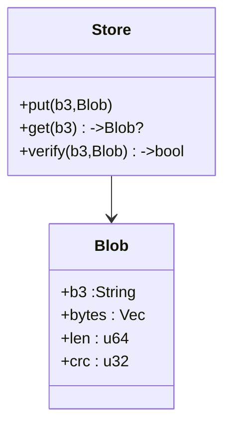
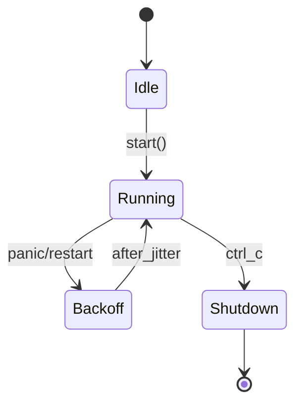
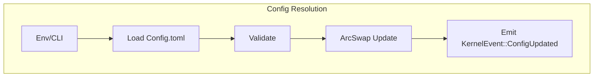

---

````markdown
# svc-storage

> **Role:** Service — Content-Addressed Blob Store (CAS)  
> **Owner:** Stevan White  
> **Status:** draft  
> **MSRV:** 1.80.0  
> **Last reviewed:** 2025-10-04  

[]() []() []()

---

## 1) Overview

`svc-storage` is the **content-addressed blob storage plane** of RustyOnions.  
It stores and serves immutable objects addressed by **BLAKE3 digests (`b3:<hex>`)**, ensuring end-to-end integrity, bounded I/O, and amnesia-aware persistence.  

It powers higher-level services such as `svc-index` (resolver), `svc-overlay` (sessions), and `svc-gateway` (ingress).  
Byte-range reads backstop the **Media facet** for app hydration (e.g., images, tiles, media streaming); **range-start p95 latency** is a tracked DX SLO.

**Topology**

- **Pillar:** 9 (Content Addressing & Integrity) ↔ 10 (Overlay Resilience) ↔ 12 (Economic truth)
- **Upstream:** `svc-gateway`, `svc-overlay`, SDK clients  
- **Downstream:** `svc-index`, `svc-dht`, peer `svc-storage` for replication  
- **Data:** disk volumes + RAM 64 KiB chunks  
- **Security boundary:** capability-scoped writes; read policies optional  

### 1.1 Architecture

```mermaid
flowchart LR
  subgraph Node
    G[svc-gateway] --> S(svc-storage)
    O[svc-overlay] --> S
  end

  S --> I[svc-index / svc-dht]
  S --> D[(Local FS – BLAKE3 CAS)]
  S --> E[[Prometheus]]

  style S fill:#0b7285,stroke:#083344,color:#fff
````

---

## 2) Responsibilities & Boundaries

**MUST do**

* ✅ Serve `GET/HEAD/Range / PUT / POST /metrics /healthz /readyz`
* ✅ Verify `b3:<hex>` digest on write and read
* ✅ Emit golden Prometheus metrics and bus events
* ✅ Honor amnesia mode (no persistent spill)

**MUST NOT do**

* ❌ Name resolution (`svc-index`) or discovery (`svc-dht`)
* ❌ Economic settlement (`svc-rewarder`)
* ❌ SHA-2 addressing or ambient auth
* ❌ Hold locks across `.await` or use unbounded queues

**Acceptance Gates**

* [ ] Unit/prop tests prove digest verification and bounded I/O
* [ ] Metrics export and alert wired (`integrity_fail_total{}`)
* [ ] Health/readiness reflect real state and amnesia flag
* [ ] Perf bench ≥ 10 kRPS for 1 MiB PUT

---

## 3) Public Interfaces

### 3.1 HTTP API

| Method | Path       | Auth     | Body       | Success     | Notes                                  |
| :----- | :--------- | :------- | :--------- | :---------- | :------------------------------------- |
| GET    | `/o/{b3}`  | policy   | —          | 200/206/304 | Range-safe read                        |
| HEAD   | `/o/{b3}`  | none     | —          | 200/206     | Headers only                           |
| PUT    | `/o/{b3}`  | macaroon | bytes/zstd | 200/201     | Digest-on-write idempotent             |
| POST   | `/o`       | macaroon | bytes      | 200/201     | Auto-digest → `{"address":"b3:<hex>"}` |
| GET    | `/metrics` | none     | text       | 200         | Prometheus                             |
| GET    | `/healthz` | none     | —          | 200         | Liveness                               |
| GET    | `/readyz`  | none     | json       | 200/503     | Fail-closed on writes                  |
| GET    | `/version` | none     | json       | 200         | Build info                             |

**Transport Invariants:** `body ≤ 1 MiB`, `decompress ≤ 10×`, `chunk ≈ 64 KiB`, `ETag:"b3:<hex>"`.

### 3.2 Bus Events

Publishes `KernelEvent::{Health, ServiceCrashed}`; subscribes `ConfigUpdated`, `Shutdown`.

### 3.3 Rust Surface

```rust
use svc_storage::Client;
# fn main() -> anyhow::Result<()> {
let c = Client::connect("127.0.0.1:8080")?;
let blob = c.get("b3:abc...")?;
# Ok(()) }
```

---

## 4) Configuration

| Env Var                                   | Type   | Default                    | Description                              |
| :---------------------------------------- | :----- | :------------------------- | :--------------------------------------- |
| `SVC_STORAGE_BIND_ADDR`                   | socket | `0.0.0.0:8080`             | HTTP bind                                |
| `SVC_STORAGE_METRICS_ADDR`                | socket | `127.0.0.1:9909`           | Prometheus exporter                      |
| `SVC_STORAGE_MAX_CONNS`                   | int    | `512`                      | Concurrent connection cap                |
| `SVC_STORAGE_LIMITS_MAX_BODY_BYTES`       | int    | `1048576`                  | **Default 1 MiB**, configurable max body |
| `SVC_STORAGE_LIMITS_DECOMPRESS_RATIO_CAP` | int    | `10`                       | Decompression ratio limit                |
| `SVC_STORAGE_STORAGE_CHUNK_SIZE`          | int    | `65536`                    | Streaming chunk size                     |
| `SVC_STORAGE_STORAGE_DATA_DIRS`           | list   | `["/var/lib/ron/storage"]` | CAS paths                                |
| `RON_AMNESIA_MODE`                        | bool   | `true (on Micronode)`      | RAM-only mode                            |

Feature flags: `tls`, `amnesia`, `pq-hybrid`.

---

## 5) Build / Run / Test

```bash
cargo build -p svc-storage --release
RUST_LOG=info cargo run -p svc-storage
cargo test -p svc-storage --all-features
cargo deny check
# Hardening / fuzz
cargo fuzz run range_fuzz -- -max_total_time=3600
RUSTFLAGS="--cfg loom" cargo test --test loom_ready
```

---

## 6) Observability

Endpoints: `/metrics`, `/healthz`, `/readyz`.
**Golden metrics:**

* `requests_total{method,route,code}`
* `latency_seconds{method,route}`
* `rejected_total{reason,route}`
* `integrity_fail_total{reason}`
* `rf_target`
* `rf_observed`
* `errors_total{stage,kind}`

**Defaults:** timeouts 5 s (read/write) and 60 s idle; concurrency ≤ 512.
Alerts: 5xx > 1% = page; RF mismatch > 15 m = warn.

---

## 7) Performance & SLOs

| Metric            | Target     | Notes           |
| :---------------- | :--------- | :-------------- |
| Read p95          | < 80 ms    | Range ≤ 64 KiB  |
| Write p95         | < 100 ms   | 1 MiB PUT       |
| Error budget      | 5xx < 0.1% | rolling 30 days |
| Repair throughput | ≥ 50 MiB/s | paced           |

**Repro:**

```bash
testing/performance/run_load.sh --route /o/<b3> --method GET --conns 256
testing/performance/zipbomb_negative.sh # validates 413 rejection
```

---

## 8) Data & Schema



Values bincode-encoded with schema-version header. Backward compat tests run in CI.

---

## 9) Security & Privacy

**STRIDE**

| Threat                 | Mitigation                         |
| :--------------------- | :--------------------------------- |
| Spoofing               | TLS (tokio-rustls), macaroon auth  |
| Tampering              | BLAKE3 CAS verify + fsync          |
| Repudiation            | audit events (`ron-audit`)         |
| Information disclosure | amnesia mode, zeroize              |
| DoS                    | body/ratio/timeouts + backpressure |
| Elevation of privilege | no ambient trust                   |

Secrets: TLS keys + macaroon root zeroized on drop.
PII: none.
Out-of-scope: HSM, ledger logic, naming.

---

## 10) Error Taxonomy

| Variant                          | When              | User Hint     | Retry |
| :------------------------------- | :---------------- | :------------ | :---- |
| `ConfigError::MissingVar`        | Missing env       | set var       | no    |
| `NetError::Timeout`              | I/O slowness      | retry later   | yes   |
| `IntegrityError::DigestMismatch` | hash bad          | verify client | no    |
| `StateError::Conflict`           | concurrent update | backoff       | yes   |

---

## 11) Concurrency Model

Tokio runtime; bounded mpsc queues; single-writer discipline.



---

## 12) Compatibility & Requirements

Rust 1.80+, macOS 10.15+/Linux x86_64
TLS via tokio-rustls 0.26.x; HTTP axum 0.7.x (workspace pin); tower-http 0.6.x
Note: HTTP stack versions are pinned at the workspace level for stability.
The move to axum 0.8.x will be done as a coordinated repo-wide upgrade
(contract tests, public API diffs, perf baselines, CHANGELOG migration notes).
DB sled for manifest index.

---

## 13) Quantum Readiness (Summary)

* **Transport:** X25519 → Hybrid (X25519 + ML-KEM) target M3
* **Tokens:** HMAC (macaroons) – Shor-safe
* **At rest:** optional PQ envelope (ML-KEM wrap)
* **HNDL risk:** medium until hybrid enabled; BLAKE3 safe
* **PQ features:** `pq`, `pq-hybrid`, `pq-envelope`; interop tested

| Profile   | PQ Defaults                                |
| :-------- | :----------------------------------------- |
| Micronode | Transport PQ enabled, amnesia on, RAM-only |
| Macronode | Hybrid TLS on (M3), envelopes optional     |

---

## 14) Troubleshooting

| Symptom       | Fix                                           |
| :------------ | :-------------------------------------------- |
| Port in use   | change `SVC_STORAGE_BIND_ADDR`                |
| 413 error     | increase `MAX_BODY_BYTES` or reduce upload    |
| TLS fail      | check cert paths (tokio-rustls)               |
| Amnesia spill | ensure tmpfs mount / readyz fails on spill    |
| Bus lag       | inspect `bus_queue_depth`, apply backpressure |

Cross-ref [`docs/RUNBOOK.md`](./docs/RUNBOOK.md) for incident playbooks (CH-CRASH-01, CH-DISK-FULL).

---

## 15) Development Notes

* Handlers end with `.into_response()`.
* `lib.rs` re-exports Bus, KernelEvent, Metrics, HealthState, Config, wait_for_ctrl_c().
* **No global mutable state**; bounded queues only.
* Pre-commit quickcheck:

```bash
cargo fmt --all
cargo clippy -p svc-storage -- -D warnings
cargo test -p svc-storage --all-features
cargo deny check
```

---

## 16) Mermaid Diagrams — Policy & Tooling

### Inline Example (required)



Render SVGs in CI via `mermaid-cli` or Docker. See `.github/workflows/render-mermaid.yml`.

---

## 17) Roadmap & TODO

* [ ] Milestone 1 — Baseline CAS (BLAKE3)
* [ ] Milestone 2 — Replication + repair pacer
* [ ] Milestone 3 — PQ-hybrid TLS M3 rollout
* [ ] Hardening — fuzz zip-bomb, slow-loris, disk-full chaos

---

## 18) Changelog

See [CHANGELOG.md](./CHANGELOG.md). SemVer rules apply; breaking metrics names must be noted.

---

## 19) License

Dual-licensed under MIT or Apache-2.0.

---

## 20) Contributing

PRs welcome! Run fmt/clippy/tests/deny; update examples and diagrams; document bench impact for perf changes.
See [`docs/IDB.md`](./docs/IDB.md) for Invariant-Driven Blueprint and definition of done.

---

**Summary:** `svc-storage` anchors RustyOnions’ integrity pillar—bounded, deterministic, and observable.
It is canon-aligned, PQ-ready, and DX-optimized for both Micronode and Macronode profiles.

```

---
