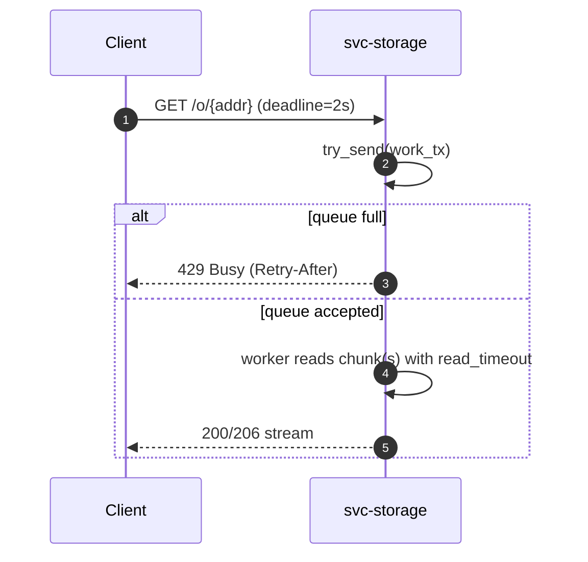
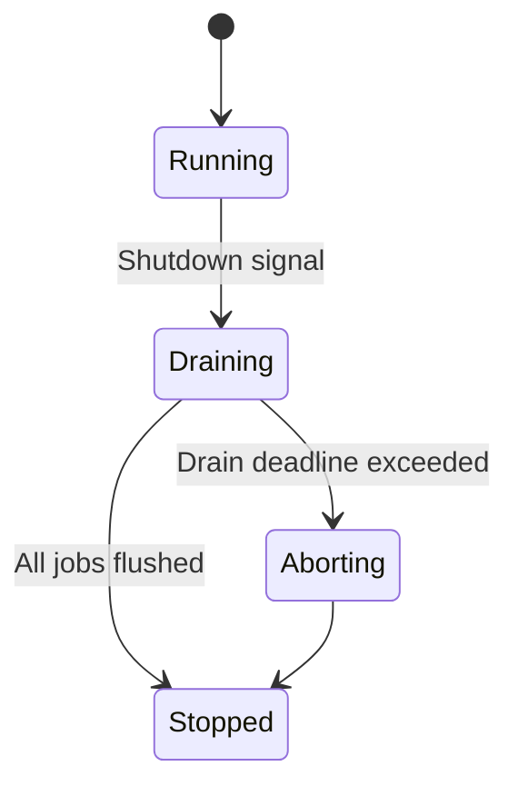
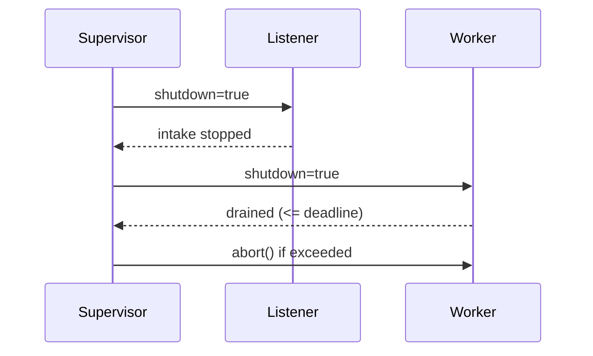

---

title: Concurrency Model — svc-storage
crate: svc-storage
owner: Stevan White
last-reviewed: 2025-10-04
status: draft
template_version: 1.1
msrv: 1.80.0
tokio: "1.x (pinned at workspace root)"
loom: "0.7+ (dev-only)"
lite_mode: "For small library crates: fill §§1,3,4,5,10,11 and mark others N/A"
-------------------------------------------------------------------------------

# Concurrency Model — svc-storage

This document makes the concurrency rules **explicit**: tasks, channels, locks, shutdown, timeouts,
and validation (property/loom/TLA+). It complements `docs/SECURITY.md`, `docs/CONFIG.md`,
and the crate’s `README.md` and `IDB.md`.

> **Golden rule:** never hold a lock across `.await` in supervisory or hot paths.

---

## 0) Lite Mode (for tiny lib crates)

N/A — `svc-storage` is a service with listeners, worker pools, and background repair.

---

## 1) Invariants (MUST)

* [I-1] **No lock across `.await`.** If unavoidable, split the critical section; copy the minimal state out, drop the guard, then `.await`.
* [I-2] **Single writer per connection/socket.** Each connection’s writer is owned by exactly one task; readers run on a separate task.
* [I-3] **Only bounded channels.** All `mpsc`/`broadcast` have explicit capacities; overflow is observable and intentional.
* [I-4] **Explicit timeouts & deadlines** on every external I/O (read, write, connect) and cross-service RPC. Timeouts fail-fast with typed errors.
* [I-5] **Cooperative cancellation.** Every long `.await` is cancel-safe or guarded by `tokio::select!` on a shutdown/watch.
* [I-6] **Graceful shutdown by default.** On `Shutdown`, intake stops, workers drain up to a deadline, stragglers are aborted; we surface metrics for both paths.
* [I-7] **No blocking syscalls** on the async runtime. Use `spawn_blocking` for filesystem metadata scans or crypto if needed.
* [I-8] **No task leaks.** Every spawned task is tracked and awaited on shutdown; detached tasks require a justification comment and metric.
* [I-9] **Backpressure over buffering.** Prefer rejecting with `Busy` over growing queues; never introduce unbounded buffering.
* [I-10] **Strict framing.** Length-delimited with hard caps (HTTP body ≤ 1 MiB; storage stream chunks ≈ 64 KiB). Split reads are handled safely.

**Async Drop**

* [I-11] **Non-blocking `Drop`.** Expose `async close()`/`shutdown()` on resources; `Drop` must not block or perform I/O.

---

## 2) Runtime Topology

**Runtime:** Tokio multi-threaded scheduler (worker threads = CPU cores unless configured).

**Primary tasks (steady-state):**

* **Supervisor** — Owns lifecycle, config reloads, and the shutdown watch channel. Critical.
* **HTTP Listener** — Accepts TCP/UDS, applies ingress limits, parses requests; pushes jobs to `work_tx`. Critical.
* **GET Pool (N tasks)** — Streams chunks with BLAKE3 verification, honors Range; bounded concurrency. Critical.
* **PUT Pool (M tasks)** — Ingests/validates, writes chunks, updates manifests; bounded concurrency. Critical.
* **Repair Planner** — Periodic inventory diff, produces repair plans into `repair_tx`. Important.
* **Repair Workers (K tasks)** — Execute RF/EC repairs under global pacing; cooperative with planner. Important.
* **Metrics/Health Server** — Serves `/metrics`, `/healthz`, `/readyz`. Important but degrade-tolerant.
* **Index/Placement Client** — Reads placement and provider hints (watch channel + periodic refresh). Optional but recommended.

```mermaid
flowchart TB
  subgraph Runtime
    SUP[Supervisor] -->|spawn| L[HTTP Listener]
    SUP -->|spawn| GP[GET Pool N]
    SUP -->|spawn| PP[PUT Pool M]
    SUP -->|spawn| RP[Repair Planner]
    SUP -->|spawn| RW[Repair Workers K]
    SUP -->|spawn| MET[Metrics/Readyz]
    L -->|mpsc: work(512)| GP
    L -->|mpsc: work(512)| PP
    RP -->|mpsc: repair(256)| RW
    SUP -->|watch: shutdown| L
    SUP -->|watch: shutdown| GP
    SUP -->|watch: shutdown| PP
    SUP -->|watch: shutdown| RP
    SUP -->|watch: shutdown| RW
  end
  style SUP fill:#0ea5e9,stroke:#0c4a6e,color:#fff
```

**Accessibility description:** The Supervisor spawns the Listener, GET/PUT pools, Repair Planner/Workers, and Metrics server. The Listener feeds a bounded `work` queue consumed by the GET/PUT pools. The Planner feeds a bounded `repair` queue consumed by Repair Workers. All tasks subscribe to a shutdown watch.

---

## 3) Channels & Backpressure

**Inventory (all bounded unless noted):**

| Name          | Kind        | Capacity | Producers → Consumers   | Backpressure Policy                    | Drop Semantics                          |
| ------------- | ----------- | -------: | ----------------------- | -------------------------------------- | --------------------------------------- |
| `work_tx`     | `mpsc`      |      512 | Listener → GET/PUT pool | `try_send`; on Full → `Busy` to client | `busy_rejections_total{queue="work"}`++ |
| `repair_tx`   | `mpsc`      |      256 | Planner → Repair pool   | `try_send`; planner skips non-urgent   | `repair_skipped_total{reason="full"}`++ |
| `events_tx`   | `broadcast` |     1024 | 1 → N (metrics/audit)   | lag metrics; drop-oldest on slow sub   | `bus_lagged_total`++ + warn             |
| `shutdown_rx` | `watch`     |        1 | Supervisor → all tasks  | last-write-wins                        | N/A                                     |
| `config_rx`   | `watch`     |        1 | Supervisor → listeners  | last-write-wins                        | N/A                                     |

**Policies**

* **Ingress** rejects early if `work_tx` full (429/`Busy` with `Retry-After`).
* **Planner** may **shed** low-priority repairs when `repair_tx` is saturated; urgent chunk-loss repairs bypass shedding.

---

## 4) Locks & Shared State

**Allowed**

* Short-lived `Mutex/RwLock` for **metadata** (e.g., in-memory manifest cache, counters). Guards must not be held across `.await`.
* `Arc<StateSnapshot>` for read-mostly state (placement hints, config snapshot).
* Per-connection state is **task-owned** and passed by move; cross-task communication via channels.

**Forbidden**

* Holding any lock across `.await`.
* Double-locking or unknown lock order. If multiple locks are ever necessary, follow a fixed **hierarchy**.

**Hierarchy (if unavoidable)**

1. `config_snapshot`
2. `manifest_index_meta`
3. `io_counters`

---

## 5) Timeouts, Retries, Deadlines

* **I/O defaults** (configurable): `read=5s`, `write=5s`, `idle=60s`.
* **RPC** (to index/placement): total deadline `≤ 1s` typical; **retry** only idempotent ops with jittered backoff: `base 50–100ms`, `cap 2s`, `max 3 tries`.
* **Repair pacing**: obey global byte-rate budget (e.g., `50MiB/s`) across workers; workers acquire “tokens” per chunk.
* **Circuit breaker** (optional): open on error ratio over sliding window; half-open probes resume gradually.



---

## 6) Cancellation & Shutdown

* **Signal sources:** `KernelEvent::Shutdown`, `wait_for_ctrl_c()`, or K8s TERM preStop hook.
* **Propagation pattern:** each task `select!`s on `shutdown_rx.changed()` plus its work future.
* **Draining:** Listener **stops accepting**; GET/PUT pools finish current jobs; Planner stops enqueuing; Repair workers drain until **drain_deadline** (configurable 1–5s).
* **Abort:** If deadline exceeded, Supervisor calls `handle.abort()`; count `tasks_aborted_total{kind}`.
* **Readiness:** `/readyz` flips to **unready** when draining starts to allow LB removal.



---

## 7) I/O & Framing

* **HTTP ingress**:

  * Request body cap = **1 MiB**; decompression ratio cap ≤ **10×**; strict `413` on exceed.
  * Range requests supported; `ETag: "b3:<hex>"`; `Vary: Accept-Encoding`.
* **Streamed storage I/O**:

  * Chunk target ≈ **64 KiB** (tunable); verify BLAKE3 as we stream.
  * Use `AsyncReadExt/AsyncWriteExt`; **always** call `.shutdown().await` on normal or error path.
  * Handle partial reads and short writes; retry **only** idempotent chunk reads within deadline.

---

## 8) Error Taxonomy (Concurrency-Relevant)

| Error                 | When                         | Retry?      | Metric                                | Notes                    |
| --------------------- | ---------------------------- | ----------- | ------------------------------------- | ------------------------ |
| `Busy`                | `work_tx` full               | caller may  | `busy_rejections_total{endpoint}`     | Includes `Retry-After`   |
| `Timeout(Read/Write)` | I/O exceeds per-op timeout   | sometimes   | `io_timeouts_total{op}`               | annotate `op`            |
| `Canceled`            | Shutdown while awaiting work | no          | `tasks_canceled_total{kind}`          | cooperative cancellation |
| `Lagging`             | Broadcast sub falls behind   | no          | `bus_lagged_total{topic}`             | warn + drop-oldest       |
| `Paced`               | Repair token bucket empty    | yes (later) | `repair_wait_seconds` (histogram)     | liveness under pacing    |
| `Overflow`            | Repair queue at capacity     | planner no  | `repair_skipped_total{reason="full"}` | plan again next tick     |

---

## 9) Metrics (Concurrency Health)

* `queue_depth{queue}` **gauge** (work, repair) — sampled.
* `queue_dropped_total{queue}` **counter** (work, events).
* `busy_rejections_total{endpoint}` **counter**.
* `tasks_spawned_total{kind}` / `tasks_aborted_total{kind}` **counters**.
* `io_timeouts_total{op}` **counter**.
* `repair_wait_seconds` **histogram** (pacing wait).
* `bus_lagged_total{topic}` **counter**.

---

## 10) Validation Strategy

**Unit / Property**

* Backpressure: enqueue until full → expect `Busy` and metric bump.
* Timeouts: fake slow reader/writer → expect per-op timeout and typed error.
* Lock discipline: runtime assertions + lints; targeted tests ensure no `.await` under guard on hot paths.

**Loom (model)**

* Model: Listener → `mpsc(work, 2)` → Worker, with shutdown watch.
* Properties: no deadlock; no lost shutdown; worker either handles job or observes shutdown; no double-drop of a job.

**Fuzz**

* HTTP parser & decompressor fuzz (malformed headers, truncated ranges, compressed zip-bombs under caps).

**Chaos**

* Kill/respawn a worker during stream → stream resumes or fails cleanly; `/readyz` semantics correct during drain.

**TLA+ (optional)**

* State machine for **repair plan application**: eventually RF target satisfied under pacing; safety: never exceed pacing budget.

---

## 11) Code Patterns (Copy-Paste)

**Bounded mpsc with early rejection**

```rust
if let Err(tokio::sync::mpsc::error::TrySendError::Full(_job)) = work_tx.try_send(job) {
    metrics::busy_rejections_total().with_label_values(&["GET"]).inc();
    return Err(Error::Busy);
}
```

**Worker with cooperative shutdown**

```rust
async fn worker(mut rx: tokio::sync::mpsc::Receiver<Job>, mut sd: tokio::sync::watch::Receiver<bool>) {
    while let Some(job) = tokio::select! {
        _ = sd.changed() => break,
        j = rx.recv() => j,
    } {
        if let Err(e) = handle(job).await {
            tracing::warn!(error=%e, "job failed");
        }
    }
}
```

**No lock across `.await`**

```rust
// Derive value under short guard
let value = {
    let g = state.lock();
    g.compute_for_request(req_id)
}; // guard dropped here
process_async(value).await;
```

**Timeout wrapper**

```rust
let read = tokio::time::timeout(cfg.read_timeout, read_chunk(&mut stream)).await;
let bytes = read.map_err(|_| Error::TimeoutRead)??;
```

**Async Drop contract**

```rust
pub struct Conn { inner: Option<tokio::net::TcpStream> }

impl Conn {
    pub async fn close(&mut self) -> anyhow::Result<()> {
        if let Some(mut s) = self.inner.take() {
            use tokio::io::AsyncWriteExt;
            let _ = s.shutdown().await;
        }
        Ok(())
    }
}
impl Drop for Conn {
    fn drop(&mut self) {
        if self.inner.is_some() {
            tracing::debug!("Conn dropped without close(); best-effort cleanup only");
        }
    }
}
```

---

## 12) Configuration Hooks (Quick Reference)

* `server.max_inflight`, `server.max_rps` → ingress backpressure.
* `read_timeout`, `write_timeout`, `idle_timeout` → per-op deadlines.
* `storage.chunk_size` → streaming granularity.
* `durability.repair_pacing` → token bucket rate for repair workers.
* Channel capacities: `work(512)`, `repair(256)` (can be made configurable if needed).
* `drain_deadline` (in run loop or config) → shutdown behavior.

See `docs/CONFIG.md` for authoritative schema.

---

## 13) Known Trade-offs / Nonstrict Areas

* **work queue policy:** We **reject-new** (429/Busy) rather than drop-oldest requests because client-layer retry semantics & `Retry-After` are clearer than silent loss.
* **events broadcast:** We **drop-oldest** for non-critical telemetry to protect hot paths.
* **RF vs EC concurrency:** We serialize high-priority repairs before parity rebuilds under the shared pacing budget to keep p95 reads stable.

---

## 14) Mermaid Diagrams (REQUIRED)

### 14.1 Task & Queue Topology

```mermaid
flowchart LR
  IN[HTTP Ingress] -->|mpsc work(512)| GETA[GET Worker A]
  IN -->|mpsc work(512)| GETB[GET Worker B]
  IN -->|mpsc work(512)| PUTA[PUT Worker A]
  PLAN[Repair Planner] -->|mpsc repair(256)| RWA[Repair Worker A]
  PLAN -->|mpsc repair(256)| RWB[Repair Worker B]
  SHUT[Shutdown watch] --> GETA
  SHUT --> GETB
  SHUT --> PUTA
  SHUT --> RWA
  SHUT --> RWB
```

**Text description:** Ingress fans out to GET/PUT workers via a bounded queue; Planner fans out repairs to Repair workers; a shutdown watch reaches all workers.

### 14.2 Shutdown Sequence



**Text description:** Supervisor signals shutdown; Listener stops accepting; Workers drain; if deadline exceeded, Supervisor aborts.

---

## 15) CI & Lints (Enforcement)

**Clippy & rustc flags**

* `-D warnings`
* `-W clippy::await_holding_lock`
* `-W clippy::mutex_atomic` (prefer atomics for counters when possible)
* `-W clippy::needless_collect`
* `-W clippy::useless_async`

**Suggested GitHub Actions job**

```yaml
name: concurrency-guardrails
on: [push, pull_request]
jobs:
  clippy:
    runs-on: ubuntu-latest
    steps:
      - uses: actions/checkout@v4
      - uses: dtolnay/rust-toolchain@stable
      - run: cargo clippy -p svc-storage -- -D warnings -W clippy::await_holding_lock
  loom:
    if: github.event_name == 'pull_request'
    runs-on: ubuntu-latest
    steps:
      - uses: actions/checkout@v4
      - uses: dtolnay/rust-toolchain@stable
      - run: RUSTFLAGS="--cfg loom" cargo test -p svc-storage --tests -- --ignored
  fuzz:
    runs-on: ubuntu-latest
    steps:
      - uses: actions/checkout@v4
      - uses: dtolnay/rust-toolchain@stable
      - run: cargo install cargo-fuzz
      - run: cargo fuzz build -p svc-storage
```

---

## 16) Schema Generation (Optional, Nice-to-Have)

Automate the **Channels & Locks** documentation to prevent drift:

* Annotate channel construction:

  ```rust
  #[doc_channel(name="work", kind="mpsc", cap=512, policy="try_send")]
  let (work_tx, work_rx) = tokio::sync::mpsc::channel(512);
  ```

* A small `build.rs` or proc-macro can emit `docs/_generated/concurrency.mdfrag`.

* Include a golden test that asserts the doc table matches the runtime registry.

---

## 17) Review & Maintenance

* **Review cadence:** every 90 days or whenever task/channel/lock topology changes.
* **Checklist for PRs that touch concurrency:**

  * [ ] Updated this document (tasks/channels/capacities).
  * [ ] Added/updated Loom/property tests where relevant.
  * [ ] Verified lints and CI jobs pass.
  * [ ] Confirmed shutdown/drain behavior with a local load test.

---

**Definition of Done (Concurrency):** All invariants are enforced by lints/tests; channel capacities and timeouts match `docs/CONFIG.md`; shutdown drains within deadline; there are **no locks held across `.await`** on hot paths; and CI includes at least one Loom model for queue+shutdown behavior.
