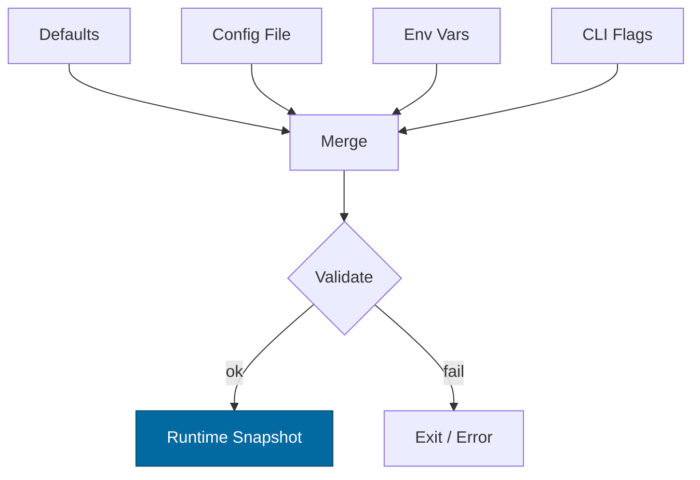

---

title: Configuration — svc-storage
crate: svc-storage
owner: Stevan White
last-reviewed: 2025-10-04
status: draft
template_version: 1.0
---------------------

# Configuration — svc-storage

This document defines **all configuration** for `svc-storage`, including sources,
precedence, schema (types/defaults), validation, feature flags, live-reload behavior,
and security implications. It complements `README.md`, `docs/IDB.md` and `docs/SECURITY.md`.

> **Tiering:**
> This is a **service crate**: all sections apply (network, readiness, observability, etc.).

---

## 1) Sources & Precedence (Authoritative)

Configuration may come from multiple sources. **Precedence (highest wins):**

1. **Process flags (CLI)**
2. **Environment variables**
3. **Config file** (e.g., `Config.toml` beside the binary or path via `--config`)
4. **Built-in defaults** (hard-coded)

> On dynamic reload, the effective config is recomputed under the same precedence.

**Supported file formats:** TOML (preferred), JSON (optional).
**`--config` path resolution order (if relative):** current working directory, then the binary’s directory.

**Environment variable prefix:** `SVC_STORAGE_` (e.g., `SVC_STORAGE_BIND_ADDR`).

---

## 2) Quickstart Examples

### 2.1 Minimal service start

```bash
RUST_LOG=info \
SVC_STORAGE_BIND_ADDR=0.0.0.0:8080 \
SVC_STORAGE_METRICS_ADDR=127.0.0.1:0 \
cargo run -p svc-storage
```

### 2.2 Config file (TOML)

```toml
# Config.toml
bind_addr     = "0.0.0.0:8080"
metrics_addr  = "127.0.0.1:0"
max_conns     = 1024
read_timeout  = "5s"
write_timeout = "5s"
idle_timeout  = "60s"

# Global request/ingress limits (see IDB)
[limits]
max_body_bytes       = "1MiB"   # absolute cap
decompress_ratio_cap = 10       # zip-bomb guard

# TLS is optional; prefer a terminating gateway in front unless required
[tls]
enabled   = false
# cert_path = "/etc/ron/cert.pem"
# key_path  = "/etc/ron/key.pem"

# Optional Unix Domain Socket for internal planes
[uds]
path = ""          # e.g., "/run/svc-storage.sock"
allow_uids = []    # e.g., [1000, 1001]

# Auth (capabilities/macaroons)
[auth]
macaroon_path = "" # e.g., "/etc/ron/storage.cap"

# Storage behavior
[storage]
chunk_size          = "64KiB"   # streaming chunk target
data_dirs           = ["/var/lib/ron/storage"]  # one or more paths (tier-0)
amnesia             = false      # true = RAM-only mode (Micronode default)
tmpfs_dir           = "/dev/shm/ron"            # spill in amnesia=false only

# Replication / erasure coding
[durability]
replication_factor  = 2         # RF>=1
ec                  = false
ec_data_shards      = 6
ec_parity_shards    = 3
repair_pacing       = "50MiB/s" # global pacing per cluster process

# Placement & reads
[placement]
region             = "us-east-1"
residency_policy   = "region"   # one of: "none" | "region" | "strict-region"
hedged_reads       = true
hedge_delay        = "30ms"     # when to start a second read
remote_read_ok     = true

# Concurrency & backpressure
[server]
max_rps            = 500
max_inflight       = 512
read_buffer_bytes  = "256KiB"
write_buffer_bytes = "256KiB"

# Logging and tracing
[log]
format = "json"                 # "json" | "text"
level  = "info"                 # trace|debug|info|warn|error
sample = "off"                  # "off" or ratio like "0.1"

# PQ readiness (no on-path signatures; see IDB)
[pq]
mode = "off"                    # "off" | "hybrid"
```

### 2.3 CLI flags (override file/env)

```bash
cargo run -p svc-storage -- \
  --bind 0.0.0.0:8080 \
  --metrics 127.0.0.1:0 \
  --max-conns 2048 \
  --read-timeout 5s \
  --limits-max-body 1MiB
```

---

## 3) Schema (Typed, With Defaults)

> **Durations** accept `ms`, `s`, `m`, `h`. **Sizes** accept `B`, `KiB`, `MiB`, `GiB`.
> Env var prefix: `SVC_STORAGE_…`

| Key / Env Var                                                      | Type         | Default        | Description                                    | Security Notes                 |
| ------------------------------------------------------------------ | ------------ | -------------- | ---------------------------------------------- | ------------------------------ |
| `bind_addr` / `SVC_STORAGE_BIND_ADDR`                              | socket       | `127.0.0.1:0`  | HTTP/ingress bind address                      | Public binds require review    |
| `metrics_addr` / `SVC_STORAGE_METRICS_ADDR`                        | socket       | `127.0.0.1:0`  | Prometheus endpoint bind                       | Prefer localhost in prod       |
| `max_conns` / `SVC_STORAGE_MAX_CONNS`                              | u32          | `1024`         | Max concurrent connections                     | FD exhaustion guard            |
| `read_timeout` / `SVC_STORAGE_READ_TIMEOUT`                        | duration     | `5s`           | Per-request read timeout                       | DoS mitigation                 |
| `write_timeout` / `SVC_STORAGE_WRITE_TIMEOUT`                      | duration     | `5s`           | Per-request write timeout                      | DoS mitigation                 |
| `idle_timeout` / `SVC_STORAGE_IDLE_TIMEOUT`                        | duration     | `60s`          | Keep-alive idle shutdown                       | Resource hygiene               |
| `limits.max_body_bytes` / `SVC_STORAGE_MAX_BODY_BYTES`             | size         | `1MiB`         | Request payload cap                            | Bomb guard                     |
| `limits.decompress_ratio_cap` / `SVC_STORAGE_DECOMPRESS_RATIO_CAP` | u32          | `10`           | Max allowed decompression ratio                | Bomb guard                     |
| `tls.enabled` / `SVC_STORAGE_TLS_ENABLED`                          | bool         | `false`        | Enable TLS (tokio-rustls)                      | Never use native-tls here      |
| `tls.cert_path` / `SVC_STORAGE_TLS_CERT_PATH`                      | path         | `""`           | PEM cert path                                  | perms 0600                     |
| `tls.key_path` / `SVC_STORAGE_TLS_KEY_PATH`                        | path         | `""`           | PEM key path                                   | zeroize on read                |
| `uds.path` / `SVC_STORAGE_UDS_PATH`                                | path         | `""`           | Optional UDS socket path                       | Dir `0700`, sock `0600`        |
| `uds.allow_uids` / `SVC_STORAGE_UDS_ALLOW_UIDS`                    | list<u32>    | `[]`           | PEERCRED allow-list                            | Strict production control      |
| `auth.macaroon_path` / `SVC_STORAGE_MACAROON_PATH`                 | path         | `""`           | Capability token file                          | Do not log contents            |
| `storage.chunk_size` / `SVC_STORAGE_CHUNK_SIZE`                    | size         | `64KiB`        | Streaming chunk target for reads/writes        | Perf/backpressure knob         |
| `storage.data_dirs` / `SVC_STORAGE_DATA_DIRS`                      | list<path>   | `[]`           | One or more data directories (tier-0)          | Separate FS from OS disk       |
| `storage.amnesia` / `SVC_STORAGE_AMNESIA`                          | bool         | `false`        | RAM-only mode; no persistent spill             | Leans fail-closed on readiness |
| `storage.tmpfs_dir` / `SVC_STORAGE_TMPFS_DIR`                      | path         | `/dev/shm/ron` | RAM-backed spill location (amnesia=false only) | Ensure mount exists            |
| `durability.replication_factor` / `SVC_STORAGE_RF`                 | u8           | `2`            | Replication factor (RF≥1)                      | Policy-driven                  |
| `durability.ec` / `SVC_STORAGE_EC`                                 | bool         | `false`        | Enable erasure coding (requires shards below)  | Advanced                       |
| `durability.ec_data_shards` / `SVC_STORAGE_EC_DATA`                | u8           | `6`            | EC data shards                                 | Validate with parity           |
| `durability.ec_parity_shards` / `SVC_STORAGE_EC_PARITY`            | u8           | `3`            | EC parity shards                               | Validate with data             |
| `durability.repair_pacing` / `SVC_STORAGE_REPAIR_PACING`           | size-per-sec | `50MiB/s`      | Global repair pacing per process               | Prevents IO storm              |
| `placement.region` / `SVC_STORAGE_REGION`                          | string       | `""`           | Region label for placement/residency           | Audited value                  |
| `placement.residency_policy` / `SVC_STORAGE_RESIDENCY`             | enum         | `none`         | `none` | `region` | `strict-region`            | Legal impact                   |
| `placement.hedged_reads` / `SVC_STORAGE_HEDGED`                    | bool         | `true`         | Enable hedged reads                            | Small extra load               |
| `placement.hedge_delay` / `SVC_STORAGE_HEDGE_DELAY`                | duration     | `30ms`         | Delay before hedged read                       | Tune to tail latency           |
| `placement.remote_read_ok` / `SVC_STORAGE_REMOTE_READ_OK`          | bool         | `true`         | Allow remote-region reads if local misses      | Latency/cost tradeoff          |
| `server.max_rps` / `SVC_STORAGE_MAX_RPS`                           | u32          | `500`          | Per-instance request rate limit                | DDoS protection                |
| `server.max_inflight` / `SVC_STORAGE_MAX_INFLIGHT`                 | u32          | `512`          | Max in-flight requests                         | Backpressure                   |
| `server.read_buffer_bytes` / `SVC_STORAGE_READ_BUF`                | size         | `256KiB`       | Read buffer size                               | Perf                           |
| `server.write_buffer_bytes` / `SVC_STORAGE_WRITE_BUF`              | size         | `256KiB`       | Write buffer size                              | Perf                           |
| `pq.mode` / `SVC_STORAGE_PQ_MODE`                                  | enum         | `off`          | `off` | `hybrid`                               | Interop gating                 |
| `log.format` / `SVC_STORAGE_LOG_FORMAT`                            | enum         | `json`         | `json` | `text`                                | JSON in prod                   |
| `log.level` / `SVC_STORAGE_LOG_LEVEL`                              | enum         | `info`         | `trace`..`error`                               | Avoid `trace` in prod          |
| `log.sample` / `SVC_STORAGE_LOG_SAMPLE`                            | string       | `off`          | `off` or ratio like `0.1`                      | PII reduction                  |

> **Note:** Size-per-sec (e.g., `50MiB/s`) is parsed as a byte rate (MiB per second).

---

## 4) Validation Rules (Fail-Closed)

On startup or reload, apply **strict validation**:

* `bind_addr`/`metrics_addr` parse as socket addresses; ports <1024 require privileges.
* `max_conns > 0`; `server.max_inflight > 0`; `server.max_rps > 0`.
* `limits.max_body_bytes ≥ 1KiB`; `limits.decompress_ratio_cap ≥ 1`.
* If `tls.enabled = true`: `cert_path` and `key_path` exist, readable, and key is not world-readable.
* If `uds.path` set: parent dir exists; dir mode `0700`; socket mode `0600`.
* If `auth.macaroon_path` set: file exists and non-empty.
* If `durability.ec = true`: `ec_data_shards ≥ 1`, `ec_parity_shards ≥ 1`.
* If `replication_factor < 1` **or** (`ec = true` and RF > 1 simultaneously), **fail**: choose **RF** or **EC**, not both (unless explicitly supported).
* If `storage.amnesia = true`: `storage.data_dirs` MUST NOT be used for persistent writes; readiness **fails-closed** if a spill would occur.
* `placement.residency_policy` must be one of `none|region|strict-region`.
* `pq.mode` must be `off|hybrid`; `hybrid` requires peer capability gating upstream.

**On violation:** log structured error and **exit non-zero** (service). No partial boot.

---

## 5) Dynamic Reload (If Supported)

**Triggers**

* `SIGHUP` (POSIX)
* Kernel bus event: `ConfigUpdated { version: u64 }`

**Reload semantics**

* **Hot-reload (non-disruptive):** timeouts, limits, log level/format, RPS, hedge tuning.
* **Cold-rebind (disruptive):** `bind_addr`, `tls.*`, `uds.*`, `storage.data_dirs`.
* **No-live-change:** replication/EC topology moves to a background planner that rolls changes gradually; config swap only updates targets.

**Atomicity**

* Build a new `Config` snapshot; validate; swap under a mutex without holding `.await`.

**Audit**

* Emit `KernelEvent::ConfigUpdated { version }` and structured diff (never include secret material).

---

## 6) CLI Flags (Canonical)

```
--config <path>                 # Load Config.toml (lowest precedence after defaults)
--bind <ip:port>                # Override bind_addr
--metrics <ip:port>             # Override metrics_addr
--max-conns <num>
--read-timeout <dur>            # e.g., 5s, 250ms
--write-timeout <dur>
--idle-timeout <dur>
--limits-max-body <size>        # e.g., 1MiB
--limits-decompress-ratio <n>   # e.g., 10
--tls                           # Shorthand: tls.enabled=true
--tls-cert <path>
--tls-key <path>
--uds <path>
--region <label>
--hedge-delay <dur>
--max-rps <num>
--max-inflight <num>
--log-format <json|text>
--log-level <trace|debug|info|warn|error>
```

---

## 7) Feature Flags (Cargo)

| Feature | Default | Effect                                                 |
| ------: | :-----: | ------------------------------------------------------ |
|   `tls` |   off   | Enables tokio-rustls and TLS config keys               |
|    `pq` |   off   | Enables PQ readiness hooks (`pq.mode=hybrid`)          |
|   `uds` |    on   | Enables UDS listener and SO_PEERCRED checks            |
|   `cli` |    on   | Enables CLI parsing for flags above                    |
| `kameo` |   off   | Optional actor/registry integration for internal tasks |

> Document any feature that changes schema or validation behavior.

---

## 8) Security Implications

* **Public binds** (`0.0.0.0`) require hard caps (timeouts, body size, RPS, inflight) and upstream rate-limiting.
* **TLS**: only use `tokio_rustls::rustls::ServerConfig` under the `tls` feature. Keys must be file-permission restricted; zeroize in memory after load.
* **Macaroons** (`auth.macaroon_path`): never log contents; rotate at most every 30 days; support immediate revocation upstream.
* **Amnesia mode**: forbids persistent writes; readiness fails if spill would occur; use tmpfs for ephemeral buffers.
* **UDS**: enforce directory/socket modes, verify **SO_PEERCRED** against `uds.allow_uids`, and audit failures via metrics.

See `docs/SECURITY.md` and `docs/IDB.md` for threat model and invariants.

---

## 9) Compatibility & Migration

* **Adding keys:** introduce with safe defaults; mark `status: experimental` in release notes if behavior might change.
* **Renames:** keep old env var aliases for ≥1 minor release; log a deprecation warning once per process start.
* **Breaking changes:** require a **major version** and clear steps in `CHANGELOG.md`.

**Deprecation table (maintained):**

|  Old Key | New Key | Removal Target | Notes           |
| -------: | :------ | :------------: | --------------- |
| *(none)* | *(n/a)* |     *(n/a)*    | Initial release |

---

## 10) Reference Implementation (Rust)

> Minimal example for `Config` with serde + env/file merge and validation.
> Use `humantime_serde` for durations and a simple parser for sizes (or a crate like `byte-unit`).

```rust
use std::{net::SocketAddr, path::PathBuf, time::Duration};
use serde::{Deserialize, Serialize};

#[derive(Debug, Clone, Serialize, Deserialize)]
pub struct TlsCfg {
    pub enabled: bool,
    pub cert_path: Option<PathBuf>,
    pub key_path: Option<PathBuf>,
}

#[derive(Debug, Clone, Serialize, Deserialize)]
pub struct UdsCfg {
    pub path: Option<PathBuf>,
    #[serde(default)]
    pub allow_uids: Vec<u32>,
}

#[derive(Debug, Clone, Serialize, Deserialize)]
pub struct Limits {
    #[serde(default = "default_body_bytes")]
    pub max_body_bytes: String, // parse "1MiB" -> bytes
    #[serde(default = "default_decompress_ratio")]
    pub decompress_ratio_cap: u32,
}

#[derive(Debug, Clone, Serialize, Deserialize)]
pub struct Storage {
    #[serde(default = "default_chunk")]
    pub chunk_size: String, // "64KiB"
    #[serde(default)]
    pub data_dirs: Vec<PathBuf>,
    #[serde(default)]
    pub amnesia: bool,
    #[serde(default = "default_tmpfs")]
    pub tmpfs_dir: PathBuf,
}

#[derive(Debug, Clone, Serialize, Deserialize)]
pub struct Durability {
    #[serde(default = "default_rf")]
    pub replication_factor: u8,
    #[serde(default)]
    pub ec: bool,
    #[serde(default = "default_ec_data")]
    pub ec_data_shards: u8,
    #[serde(default = "default_ec_parity")]
    pub ec_parity_shards: u8,
    #[serde(default = "default_repair_pacing")]
    pub repair_pacing: String, // "50MiB/s"
}

#[derive(Debug, Clone, Serialize, Deserialize)]
pub struct Placement {
    #[serde(default)]
    pub region: String,
    #[serde(default = "default_residency")]
    pub residency_policy: String, // "none" | "region" | "strict-region"
    #[serde(default = "default_true")]
    pub hedged_reads: bool,
    #[serde(with = "humantime_serde", default = "default_30ms")]
    pub hedge_delay: Duration,
    #[serde(default = "default_true")]
    pub remote_read_ok: bool,
}

#[derive(Debug, Clone, Serialize, Deserialize)]
pub struct Server {
    #[serde(default = "default_rps")]
    pub max_rps: u32,
    #[serde(default = "default_inflight")]
    pub max_inflight: u32,
    #[serde(default = "default_read_buf")]
    pub read_buffer_bytes: String,
    #[serde(default = "default_write_buf")]
    pub write_buffer_bytes: String,
}

#[derive(Debug, Clone, Serialize, Deserialize)]
pub struct LogCfg {
    #[serde(default = "default_log_format")]
    pub format: String, // "json" | "text"
    #[serde(default = "default_log_level")]
    pub level: String,  // "info"
    #[serde(default = "default_log_sample")]
    pub sample: String, // "off" or ratio like "0.1"
}

#[derive(Debug, Clone, Serialize, Deserialize)]
pub struct PqCfg {
    #[serde(default = "default_pq_mode")]
    pub mode: String,   // "off" | "hybrid"
}

#[derive(Debug, Clone, Serialize, Deserialize)]
pub struct Config {
    #[serde(default = "default_local_any")]
    pub bind_addr: String,   // "127.0.0.1:0"
    #[serde(default = "default_local_any")]
    pub metrics_addr: String,
    #[serde(default = "default_max_conns")]
    pub max_conns: u32,
    #[serde(with = "humantime_serde", default = "default_5s")]
    pub read_timeout: Duration,
    #[serde(with = "humantime_serde", default = "default_5s")]
    pub write_timeout: Duration,
    #[serde(with = "humantime_serde", default = "default_60s")]
    pub idle_timeout: Duration,

    #[serde(default)]
    pub limits: Limits,
    #[serde(default)]
    pub tls: TlsCfg,
    #[serde(default)]
    pub uds: UdsCfg,
    #[serde(default)]
    pub auth: AuthCfg,
    #[serde(default)]
    pub storage: Storage,
    #[serde(default)]
    pub durability: Durability,
    #[serde(default)]
    pub placement: Placement,
    #[serde(default)]
    pub server: Server,
    #[serde(default)]
    pub log: LogCfg,
    #[serde(default)]
    pub pq: PqCfg,
}

#[derive(Debug, Clone, Serialize, Deserialize, Default)]
pub struct AuthCfg {
    pub macaroon_path: Option<PathBuf>,
}

/* ---- defaults ---- */
fn default_body_bytes() -> String { "1MiB".into() }
fn default_decompress_ratio() -> u32 { 10 }
fn default_chunk() -> String { "64KiB".into() }
fn default_tmpfs() -> PathBuf { "/dev/shm/ron".into() }
fn default_rf() -> u8 { 2 }
fn default_ec_data() -> u8 { 6 }
fn default_ec_parity() -> u8 { 3 }
fn default_repair_pacing() -> String { "50MiB/s".into() }
fn default_residency() -> String { "none".into() }
fn default_true() -> bool { true }
fn default_30ms() -> Duration { Duration::from_millis(30) }
fn default_rps() -> u32 { 500 }
fn default_inflight() -> u32 { 512 }
fn default_read_buf() -> String { "256KiB".into() }
fn default_write_buf() -> String { "256KiB".into() }
fn default_log_format() -> String { "json".into() }
fn default_log_level() -> String { "info".into() }
fn default_log_sample() -> String { "off".into() }
fn default_pq_mode() -> String { "off".into() }
fn default_local_any() -> String { "127.0.0.1:0".into() }
fn default_max_conns() -> u32 { 1024 }
fn default_5s() -> Duration { Duration::from_secs(5) }
fn default_60s() -> Duration { Duration::from_secs(60) }

/* ---- helpers ---- */
fn parse_socket(s: &str) -> anyhow::Result<SocketAddr> {
    Ok(s.parse()?)
}

/// Parse "64KiB" / "1MiB" -> bytes
fn parse_size_bytes(s: &str) -> anyhow::Result<u64> {
    // Minimal parser; consider `byte-unit` crate for production
    let s = s.trim();
    let (num, suf) = s.split_at(s.find(|c: char| !c.is_ascii_digit()).unwrap_or(s.len()));
    let v: u64 = num.parse()?;
    let mul = match suf.trim().to_ascii_lowercase().as_str() {
        "" | "b" => 1,
        "k" | "kb" | "kib" => 1024,
        "m" | "mb" | "mib" => 1024 * 1024,
        "g" | "gb" | "gib" => 1024 * 1024 * 1024,
        _ => anyhow::bail!("unknown size suffix: {suf}"),
    };
    Ok(v.saturating_mul(mul))
}

/// Parse "50MiB/s" -> bytes per second
fn parse_rate(s: &str) -> anyhow::Result<u64> {
    let s = s.trim().strip_suffix("/s").unwrap_or(s.trim());
    parse_size_bytes(s)
}

impl Config {
    pub fn validate(&self) -> anyhow::Result<()> {
        // sockets
        let _bind: SocketAddr = parse_socket(&self.bind_addr)?;
        let _m: SocketAddr = parse_socket(&self.metrics_addr)?;

        // top-level caps
        if self.max_conns == 0 { anyhow::bail!("max_conns must be > 0"); }

        // limits
        let body = parse_size_bytes(&self.limits.max_body_bytes)?;
        if body < 1024 { anyhow::bail!("max_body_bytes too small"); }
        if self.limits.decompress_ratio_cap == 0 { anyhow::bail!("decompress_ratio_cap must be >= 1"); }

        // tls
        if self.tls.enabled {
            match (&self.tls.cert_path, &self.tls.key_path) {
                (Some(c), Some(k)) if c.exists() && k.exists() => {},
                _ => anyhow::bail!("TLS enabled but cert/key missing or unreadable"),
            }
        }

        // durability
        if self.durability.ec {
            if self.durability.ec_data_shards == 0 || self.durability.ec_parity_shards == 0 {
                anyhow::bail!("EC shards must be >=1 when ec=true");
            }
        }
        // RF vs EC mutual-exclusion (adjust if combined is supported later)
        if self.durability.ec && self.durability.replication_factor > 1 {
            anyhow::bail!("Choose replication OR EC (not both) in this version");
        }
        let _rp = parse_rate(&self.durability.repair_pacing)?;

        // storage
        let _chunk = parse_size_bytes(&self.storage.chunk_size)?;
        if self.storage.amnesia && !self.storage.data_dirs.is_empty() {
            // We allow data_dirs for read-only mounts, but not for writes; enforce via runtime mode.
            // Validation note only:
        }

        // placement
        match self.placement.residency_policy.as_str() {
            "none" | "region" | "strict-region" => {}
            _ => anyhow::bail!("invalid residency_policy"),
        }

        Ok(())
    }
}
```

---

## 11) Test Matrix

| Scenario                         | Expected Outcome                                             |
| -------------------------------- | ------------------------------------------------------------ |
| Missing `Config.toml`            | Boot with defaults; log “using defaults” once                |
| Invalid `bind_addr`              | Fail fast with explicit error                                |
| TLS enabled but missing key/cert | Fail fast                                                    |
| Body > `max_body_bytes`          | `413 Payload Too Large` (service)                            |
| Ratio > `decompress_ratio_cap`   | `413` with `decompress_reject_total{reason="cap"}` increment |
| UDS dir/socket wrong perms       | Fail fast (service)                                          |
| amnesia=true + would-spill       | Readiness fails-closed; no persistent writes                 |
| RF change via reload             | Planner applies gradually; gauges reflect new target         |
| EC enabled with invalid shards   | Fail fast                                                    |
| Hedge delay decreased by reload  | Takes effect immediately (no restart)                        |

---

## 12) Mermaid — Config Resolution Flow



---

## 13) Operational Notes

* Keep **production config under version control** (private repo or secret store).
* For containers, prefer **env vars** over baked files; mount secrets **read-only**.
* Document firewall expectations around `bind_addr` and scrape source for `metrics_addr`.
* When enabling **amnesia** for Micronode profiles, ensure observability is remote (no local persistence).
* Record configuration changes in the **RUNBOOK** (who/when/why), especially SLO-impacting knobs (RPS, inflight, hedge).

---

**Definition of Done (Config):** Every key above exists in `src/config.rs`, is covered by `Config::validate()`, and is exercised by an integration test that boots the service with a minimal TOML and with env/CLI overrides.
