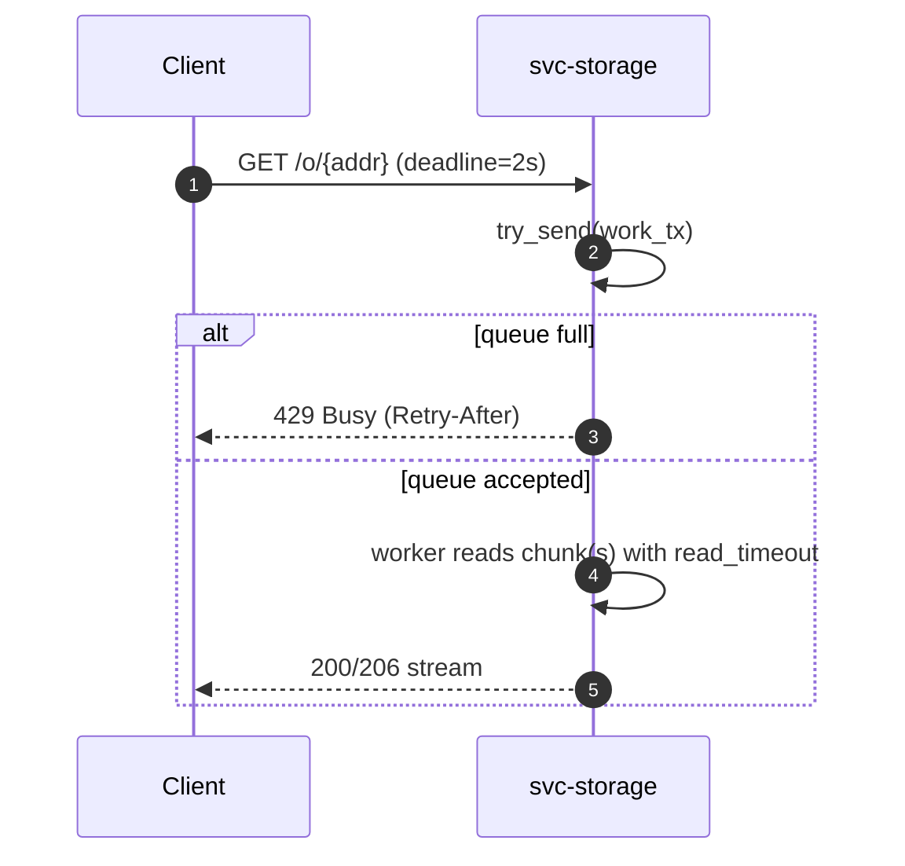
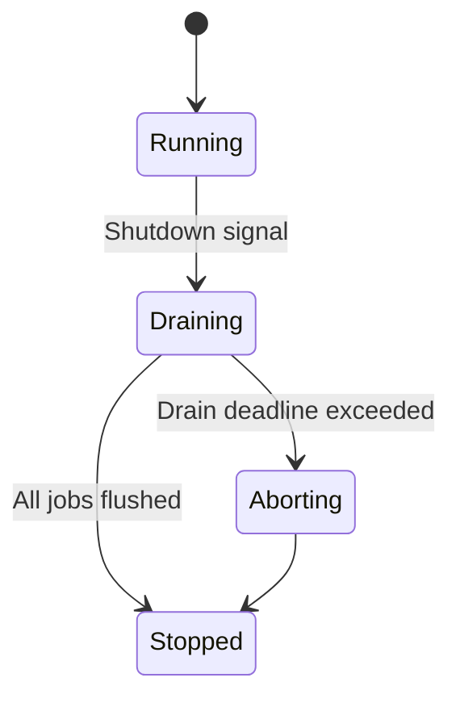
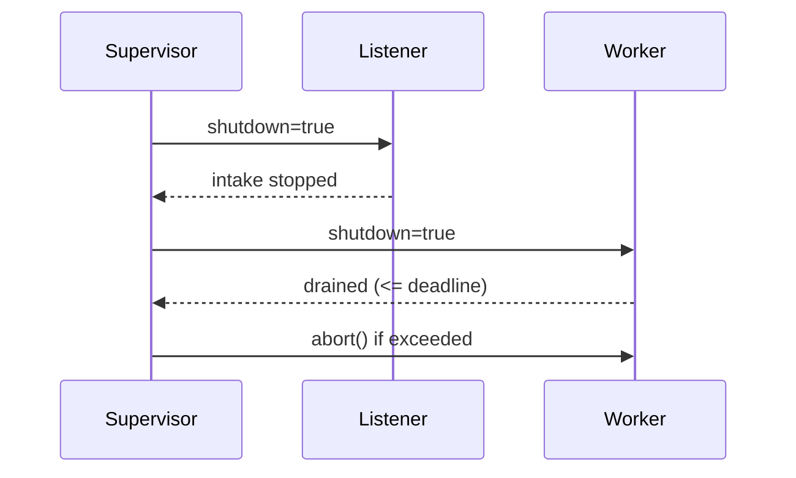
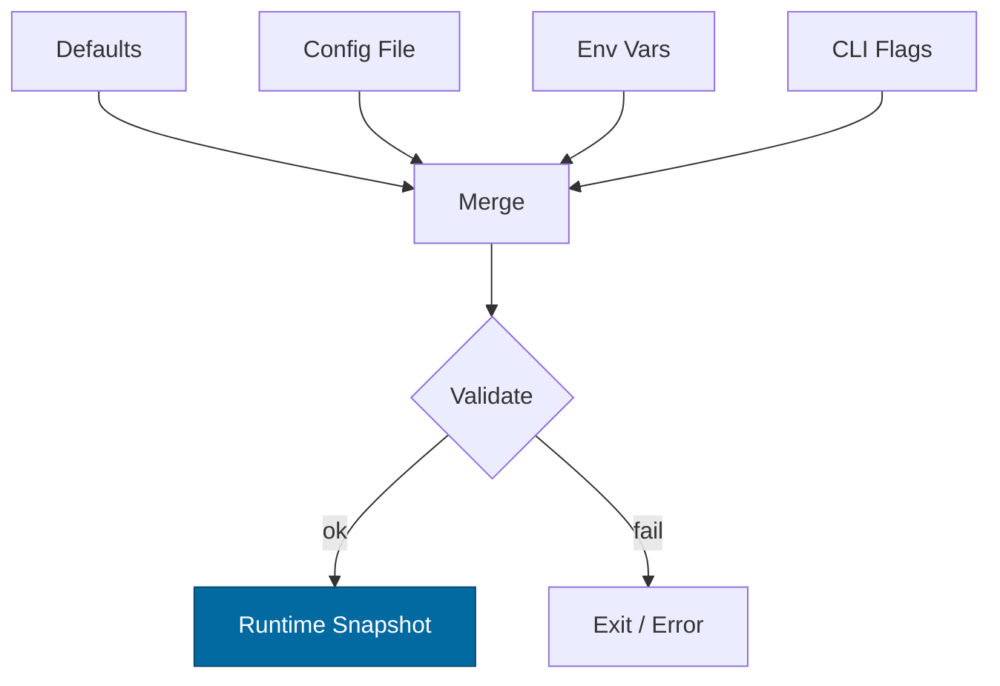

# Combined Markdown

_Source directory_: `crates/svc-storage/docs`  
_Files combined_: 13  
_Recursive_: 0

---

### Table of Contents

- API.MD
- CONCURRENCY.MD
- CONFIG.MD
- GOVERNANCE.MD
- IDB.md
- INTEROP.MD
- OBSERVABILITY.MD
- OLD_README.md
- PERFORMANCE.MD
- QUANTUM.MD
- RUNBOOK.MD
- SECURITY.MD
- TESTS.MD

---

## API.MD
_File 1 of 13_

---

title: API Surface & SemVer Reference — svc-storage
status: draft
msrv: 1.80.0
last-updated: 2025-10-04
audience: contributors, auditors, API consumers
-----------------------------------------------

# API.md — svc-storage

## 0. Purpose

This document captures the **public API surface** of `svc-storage`:

* Snapshot of exported functions, types, traits, modules (Rust surface).
* **Service API**: CLI flags and **HTTP** endpoints (primary contract).
* SemVer discipline: what changes break vs. extend.
* CI-enforceable via `cargo public-api` (Rust) and OpenAPI diff (HTTP).
* Acts as the “spec” for external consumers of this crate.

`svc-storage` is a **service crate**. The **HTTP surface is the API**; the Rust library surface is intentionally minimal.

---

## 1. Public API Surface

### 1.1 Rust Surface (intentionally minimal)

`svc-storage` is shipped primarily as a binary. Any library module exists only to share code with the binary and is **not a supported public API**.

**Policy:** keep the Rust public API **empty** (or private via `pub(crate)`), so the service’s API contract remains the **HTTP** surface.

Generate with:

```bash
cargo public-api -p svc-storage --simplified --deny-changes
```

#### Current Surface (expected)

```text
# Expected: no public items (service API is HTTP-only).
# If any public items appear here, they must be justified and documented below.
```

> If a minimal Rust surface is required (e.g., for integration testing), it must be **explicitly marked unstable** via `#[doc(hidden)]` and guarded behind a non-default feature (e.g., `testing`).

---

### 1.2 CLI (Binary Flags)

The binary accepts flags (see `docs/CONFIG.md` for full schema). Stable flags include:

```
--config <path>
--bind <ip:port>
--metrics <ip:port>
--max-conns <num>
--read-timeout <dur>   # e.g., 5s
--write-timeout <dur>
--idle-timeout <dur>
--limits-max-body <size>
--limits-decompress-ratio <n>
--tls
--tls-cert <path>
--tls-key <path>
--uds <path>
--region <label>
--hedge-delay <dur>
--max-rps <num>
--max-inflight <num>
--log-format <json|text>
--log-level <trace|debug|info|warn|error>
```

Flags are **additive-stable**; renames/removals are **breaking** (see SemVer rules below).

---

### 1.3 HTTP Surface (Primary Contract)

All endpoints are **JSON or binary** over HTTP/1.1.
**Headers you should expect/emit:**

* Responses: `ETag: "b3:<hex>"`, `Accept-Ranges: bytes`, `Cache-Control`, `Vary: Accept-Encoding`
* Requests: `Range`, `If-Match`, `If-None-Match`, `Content-Encoding` (safe decompression caps enforced)
* Auth (privileged ops): `Authorization: Macaroon <token>`

#### 1.3.1 GET Object

```
GET /o/{b3}
```

* **Path param**: `b3` — `b3:<64-hex>` (BLAKE3-256; case-insensitive hex)
* **Query**: none (hints are out-of-scope; discovery lives elsewhere)
* **Request headers** (optional):

  * `Range: bytes=<start>-<end>` (inclusive)
  * `If-None-Match`, `If-Match` (operate on the **strong** ETag)
  * `Accept-Encoding` (client-accepts transfer compression; response may be compressed per policy)
* **Responses**:

  * `200 OK` — full object
  * `206 Partial Content` — range served
    Headers: `Content-Range`, `Content-Length`, `ETag`, `Accept-Ranges`
  * `304 Not Modified` — when `If-None-Match` satisfied
  * `404 Not Found` — unknown address
  * `416 Range Not Satisfiable` — bad range
  * `429 Too Many Requests` — backpressure
  * `503 Service Unavailable` — not ready/degraded (see `/readyz`)

**Notes**

* The **ETag equals** the canonical content address: `ETag: "b3:<hex>"`.
* Content is served in ~**64 KiB** streaming chunks (implementation detail, subject to tuning).
* Integrity is verified before serving and during streaming; mismatches produce **5xx** with `integrity_fail_total{reason="checksum"}` incremented.

**Example**

```bash
curl -v https://storage.example/o/b3:9fa1d2c3... \
  -H 'Range: bytes=0-65535' \
  -H 'X-Corr-ID: <ulid>'
```

---

#### 1.3.2 HEAD Object

```
HEAD /o/{b3}
```

* Same semantics as `GET`, but returns headers only (ETag, Content-Length) and supports `Range` to validate bounds.
* **Responses**: `200`, `206`, `404`, `416`, `429`, `503`.

---

#### 1.3.3 PUT Object (Idempotent by Address)

```
PUT /o/{b3}
```

* **Auth**: required (`Authorization: Macaroon …`)
* **Path param**: `b3` — address of **canonical bytes** (not compressed form).
* **Request headers** (optional):

  * `Content-Encoding: gzip|zstd` — transfer compression; server **safely** decompresses (≤10× ratio + absolute cap) before hashing/storing.
* **Body**: canonical bytes (or compressed transfer of canonical bytes).
* **Responses**:

  * `201 Created` — newly stored; `Location: /o/{b3}`
  * `200 OK` — already existed (idempotent)
  * `400 Bad Request` — malformed address
  * `401/403` — missing/invalid capability
  * `409 Conflict` — content does not match `{b3}` when verified
  * `413 Payload Too Large` — exceeds `max_body_bytes`
  * `429 Too Many Requests` — backpressure
  * `503 Service Unavailable` — degraded/unready

**Notes**

* Server verifies the decompressed (if any) body against `{b3}` before commit.
* Decompression caps enforced: **ratio ≤10×** and **absolute output cap** (configurable). Violations → `413` with counters bumped.

**Example**

```bash
curl -v -X PUT https://storage.example/o/b3:9fa1d2c3... \
  -H 'Authorization: Macaroon ...' \
  --data-binary @object.bin
```

---

#### 1.3.4 POST Object (Digest-on-Write Helper)

```
POST /o
```

* **Auth**: required (`Authorization: Macaroon …`)
* **Body**: canonical bytes (or compressed transfer body).
* **Behavior**: server computes BLAKE3 on canonical bytes; stores if absent; returns address.
* **Responses**:

  * `201 Created` — with body: `{ "address": "b3:<hex>" }` and `Location: /o/{b3}`
  * `200 OK` — already existed; same body
  * Other errors: as in `PUT /o/{b3}` (`401/403/413/429/503`)

**Notes**

* Prefer `PUT /o/{b3}` for strictly idempotent client-side workflows. `POST /o` is a convenience endpoint.

**Example**

```bash
curl -v -X POST https://storage.example/o \
  -H 'Authorization: Macaroon ...' \
  --data-binary @object.bin
```

---

#### 1.3.5 Admin: Repair Hints (optional feature `admin`)

```
POST /admin/repair
```

* **Auth**: required; admin-scoped capability.
* **Body** (JSON, optional):

  * `{ "address": "b3:<hex>" }` — request targeted check/repair of a specific object, or omit for background.
* **Responses**:

  * `202 Accepted` — repair enqueued
  * `401/403` — unauthorized
  * `429/503` — backpressure/degraded

> This endpoint **does not** expose discovery or listing; it only hints the existing repair subsystem. It is safe to disable in hardened deployments.

---

#### 1.3.6 Observability & Version

```
GET /metrics     # Prometheus exposition
GET /healthz     # liveness
GET /readyz      # readiness (fail-closed on writes/invariants)
GET /version     # { "service": "svc-storage", "version": "...", "git": "...", "features": [...] }
```

---

### 1.4 Error Model

All non-2xx responses (other than `304`) include a **machine-readable JSON** body:

```json
{
  "error": "busy|unauth|payload_too_large|decompress_cap|ratio_cap|timeout|not_found|conflict",
  "message": "<human readable>",
  "corr_id": "<ulid>"
}
```

* `Retry-After` header accompanies `429/503` where appropriate.
* `corr_id` echoes/propagates your `X-Corr-ID` or is generated server-side.

---

### 1.5 OpenAPI (source of truth)

An OpenAPI document is maintained at:

```
/docs/openapi/svc-storage.yaml
```

**CI gate:** PRs that change routes/status codes/headers must update the OpenAPI and pass an **OpenAPI diff** job (breaking vs. additive classification).

---

## 2. SemVer Discipline

SemVer applies to **two dimensions**:

1. **Rust library surface** (minimal by policy)
2. **HTTP API surface** (primary)

### 2.1 Additive (Minor / Non-breaking)

* New **endpoints** (e.g., `HEAD /o/{b3}`), **optional** request/response headers.
* New **fields** in JSON responses that are **optional** and have safe defaults.
* New **query parameters** that are optional and ignored if unknown.
* New **metrics** and **log fields**.

### 2.2 Breaking (Major)

* Removing or renaming endpoints/paths or **changing required parameters**.
* Changing semantics of existing status codes or header meanings.
* Removing JSON fields or making optional fields required.
* Changing body caps or decompression caps **downward** in a way that rejects previously valid traffic (policy exception may allow safety-driven decreases with major/minor depending on governance).

### 2.3 Patch-Level

* Doc-only updates.
* Performance improvements that do not change semantics or caps.
* Error messages text-only changes (reason codes unchanged).

---

## 3. Stability Guarantees

* **MSRV**: `1.80.0`.
* **HTTP**: stability of documented routes, status codes, and header semantics.
* **Rust**: keep public API empty; if exposing items, mark `#[non_exhaustive]` and document SemVer impact.
* **Unsafe**: forbidden unless justified; never part of public surface.
* **No leaking** internal types (e.g., `tokio::net::TcpStream`) over any stable boundary.

---

## 4. Invariants ↔ API Mapping

* **Content addressing**: `ETag: "b3:<hex>"` on `GET`/`HEAD`; `PUT /o/{b3}` verifies digest; `POST /o` returns digest.
* **Bounds & caps**: `413` for `max_body_bytes`, safe decompression enforced; `416` for bad `Range`.
* **Backpressure**: `429` with `Retry-After`; metric `rejected_total{reason="busy"}` increments.
* **Readiness**: use `503` for fail-closed **writes** and degraded states; `/readyz` truthfully reflects dependency state.
* **Auth**: capability tokens (macaroons) required on **PUT/POST** and admin endpoints; `401/403` on failure.

---

## 5. Tooling

* `cargo public-api -p svc-storage --simplified --deny-changes` (Rust surface)
* `cargo semver-checks` (optional)
* **OpenAPI diff** (e.g., `oasdiff`) to classify HTTP changes
* `cargo doc` + doc tests (examples in this file)
* Store API snapshots in: `/docs/api-history/svc-storage/{version}.txt` (Rust) and `/docs/openapi/history/` (HTTP)

---

## 6. CI & Gates

* **Public API gate**: Rust surface must remain empty (or acknowledged changes).
* **OpenAPI gate**: PR fails if HTTP changes are breaking and version bump/changelog not provided.
* **CHANGELOG alignment**: Any surface diff requires a CHANGELOG entry under **Added/Changed/Removed**.
* **Integration tests**: validate `GET`/`HEAD`/`PUT`/`POST` behavior and status codes, including `Range`, `If-*` headers, caps, and backpressure.

---

## 7. Acceptance Checklist (DoD)

* [ ] Current **Rust API** snapshot generated & stored (empty or justified).
* [ ] **OpenAPI** updated to match endpoints/headers/status codes.
* [ ] SemVer classification done; version bumped appropriately.
* [ ] CI gates pass (`cargo public-api`, OpenAPI diff).
* [ ] CHANGELOG updated for any API surface changes.
* [ ] Examples and docs updated (this file, README).
* [ ] `/metrics`, `/healthz`, `/readyz`, `/version` endpoints present and documented.

---

## 8. Appendix

### 8.1 Example cURL Recipes

**GET (range) with caching**

```bash
curl -v https://storage.example/o/b3:9fa1d2c3... \
  -H 'Range: bytes=0-65535' \
  -H 'If-None-Match: "b3:9fa1d2c3..."'
```

**HEAD (verify existence/length)**

```bash
curl -I https://storage.example/o/b3:9fa1d2c3...
```

**PUT (idempotent by address)**

```bash
curl -v -X PUT https://storage.example/o/b3:9fa1d2c3... \
  -H 'Authorization: Macaroon ...' \
  --data-binary @object.bin
```

**POST (digest-on-write helper)**

```bash
curl -v -X POST https://storage.example/o \
  -H 'Authorization: Macaroon ...' \
  --data-binary @object.bin
```

### 8.2 References

* Rust SemVer: [https://doc.rust-lang.org/cargo/reference/semver.html](https://doc.rust-lang.org/cargo/reference/semver.html)
* cargo-public-api: [https://github.com/Enselic/cargo-public-api](https://github.com/Enselic/cargo-public-api)
* cargo-semver-checks: [https://github.com/obi1kenobi/cargo-semver-checks](https://github.com/obi1kenobi/cargo-semver-checks)

---

**API Definition of Done:**
The Rust surface is empty (or intentionally, clearly documented) and guarded by CI; the HTTP contract (GET/HEAD/PUT/POST, observability, admin repair) is fully documented and versioned via OpenAPI; invariants (content addressing, caps, readiness, auth) are encoded in status codes and headers; consumers can rely on stable semantics across minor/patch releases.


---

## CONCURRENCY.MD
_File 2 of 13_

---

title: Concurrency Model — svc-storage
crate: svc-storage
owner: Stevan White
last-reviewed: 2025-10-04
status: draft
template_version: 1.1
msrv: 1.80.0
tokio: "1.x (pinned at workspace root)"
loom: "0.7+ (dev-only)"
lite_mode: "For small library crates: fill §§1,3,4,5,10,11 and mark others N/A"
-------------------------------------------------------------------------------

# Concurrency Model — svc-storage

This document makes the concurrency rules **explicit**: tasks, channels, locks, shutdown, timeouts,
and validation (property/loom/TLA+). It complements `docs/SECURITY.md`, `docs/CONFIG.md`,
and the crate’s `README.md` and `IDB.md`.

> **Golden rule:** never hold a lock across `.await` in supervisory or hot paths.

---

## 0) Lite Mode (for tiny lib crates)

N/A — `svc-storage` is a service with listeners, worker pools, and background repair.

---

## 1) Invariants (MUST)

* [I-1] **No lock across `.await`.** If unavoidable, split the critical section; copy the minimal state out, drop the guard, then `.await`.
* [I-2] **Single writer per connection/socket.** Each connection’s writer is owned by exactly one task; readers run on a separate task.
* [I-3] **Only bounded channels.** All `mpsc`/`broadcast` have explicit capacities; overflow is observable and intentional.
* [I-4] **Explicit timeouts & deadlines** on every external I/O (read, write, connect) and cross-service RPC. Timeouts fail-fast with typed errors.
* [I-5] **Cooperative cancellation.** Every long `.await` is cancel-safe or guarded by `tokio::select!` on a shutdown/watch.
* [I-6] **Graceful shutdown by default.** On `Shutdown`, intake stops, workers drain up to a deadline, stragglers are aborted; we surface metrics for both paths.
* [I-7] **No blocking syscalls** on the async runtime. Use `spawn_blocking` for filesystem metadata scans or crypto if needed.
* [I-8] **No task leaks.** Every spawned task is tracked and awaited on shutdown; detached tasks require a justification comment and metric.
* [I-9] **Backpressure over buffering.** Prefer rejecting with `Busy` over growing queues; never introduce unbounded buffering.
* [I-10] **Strict framing.** Length-delimited with hard caps (HTTP body ≤ 1 MiB; storage stream chunks ≈ 64 KiB). Split reads are handled safely.

**Async Drop**

* [I-11] **Non-blocking `Drop`.** Expose `async close()`/`shutdown()` on resources; `Drop` must not block or perform I/O.

---

## 2) Runtime Topology

**Runtime:** Tokio multi-threaded scheduler (worker threads = CPU cores unless configured).

**Primary tasks (steady-state):**

* **Supervisor** — Owns lifecycle, config reloads, and the shutdown watch channel. Critical.
* **HTTP Listener** — Accepts TCP/UDS, applies ingress limits, parses requests; pushes jobs to `work_tx`. Critical.
* **GET Pool (N tasks)** — Streams chunks with BLAKE3 verification, honors Range; bounded concurrency. Critical.
* **PUT Pool (M tasks)** — Ingests/validates, writes chunks, updates manifests; bounded concurrency. Critical.
* **Repair Planner** — Periodic inventory diff, produces repair plans into `repair_tx`. Important.
* **Repair Workers (K tasks)** — Execute RF/EC repairs under global pacing; cooperative with planner. Important.
* **Metrics/Health Server** — Serves `/metrics`, `/healthz`, `/readyz`. Important but degrade-tolerant.
* **Index/Placement Client** — Reads placement and provider hints (watch channel + periodic refresh). Optional but recommended.

```mermaid
flowchart TB
  subgraph Runtime
    SUP[Supervisor] -->|spawn| L[HTTP Listener]
    SUP -->|spawn| GP[GET Pool N]
    SUP -->|spawn| PP[PUT Pool M]
    SUP -->|spawn| RP[Repair Planner]
    SUP -->|spawn| RW[Repair Workers K]
    SUP -->|spawn| MET[Metrics/Readyz]
    L -->|mpsc: work(512)| GP
    L -->|mpsc: work(512)| PP
    RP -->|mpsc: repair(256)| RW
    SUP -->|watch: shutdown| L
    SUP -->|watch: shutdown| GP
    SUP -->|watch: shutdown| PP
    SUP -->|watch: shutdown| RP
    SUP -->|watch: shutdown| RW
  end
  style SUP fill:#0ea5e9,stroke:#0c4a6e,color:#fff
```

**Accessibility description:** The Supervisor spawns the Listener, GET/PUT pools, Repair Planner/Workers, and Metrics server. The Listener feeds a bounded `work` queue consumed by the GET/PUT pools. The Planner feeds a bounded `repair` queue consumed by Repair Workers. All tasks subscribe to a shutdown watch.

---

## 3) Channels & Backpressure

**Inventory (all bounded unless noted):**

| Name          | Kind        | Capacity | Producers → Consumers   | Backpressure Policy                    | Drop Semantics                          |
| ------------- | ----------- | -------: | ----------------------- | -------------------------------------- | --------------------------------------- |
| `work_tx`     | `mpsc`      |      512 | Listener → GET/PUT pool | `try_send`; on Full → `Busy` to client | `busy_rejections_total{queue="work"}`++ |
| `repair_tx`   | `mpsc`      |      256 | Planner → Repair pool   | `try_send`; planner skips non-urgent   | `repair_skipped_total{reason="full"}`++ |
| `events_tx`   | `broadcast` |     1024 | 1 → N (metrics/audit)   | lag metrics; drop-oldest on slow sub   | `bus_lagged_total`++ + warn             |
| `shutdown_rx` | `watch`     |        1 | Supervisor → all tasks  | last-write-wins                        | N/A                                     |
| `config_rx`   | `watch`     |        1 | Supervisor → listeners  | last-write-wins                        | N/A                                     |

**Policies**

* **Ingress** rejects early if `work_tx` full (429/`Busy` with `Retry-After`).
* **Planner** may **shed** low-priority repairs when `repair_tx` is saturated; urgent chunk-loss repairs bypass shedding.

---

## 4) Locks & Shared State

**Allowed**

* Short-lived `Mutex/RwLock` for **metadata** (e.g., in-memory manifest cache, counters). Guards must not be held across `.await`.
* `Arc<StateSnapshot>` for read-mostly state (placement hints, config snapshot).
* Per-connection state is **task-owned** and passed by move; cross-task communication via channels.

**Forbidden**

* Holding any lock across `.await`.
* Double-locking or unknown lock order. If multiple locks are ever necessary, follow a fixed **hierarchy**.

**Hierarchy (if unavoidable)**

1. `config_snapshot`
2. `manifest_index_meta`
3. `io_counters`

---

## 5) Timeouts, Retries, Deadlines

* **I/O defaults** (configurable): `read=5s`, `write=5s`, `idle=60s`.
* **RPC** (to index/placement): total deadline `≤ 1s` typical; **retry** only idempotent ops with jittered backoff: `base 50–100ms`, `cap 2s`, `max 3 tries`.
* **Repair pacing**: obey global byte-rate budget (e.g., `50MiB/s`) across workers; workers acquire “tokens” per chunk.
* **Circuit breaker** (optional): open on error ratio over sliding window; half-open probes resume gradually.



---

## 6) Cancellation & Shutdown

* **Signal sources:** `KernelEvent::Shutdown`, `wait_for_ctrl_c()`, or K8s TERM preStop hook.
* **Propagation pattern:** each task `select!`s on `shutdown_rx.changed()` plus its work future.
* **Draining:** Listener **stops accepting**; GET/PUT pools finish current jobs; Planner stops enqueuing; Repair workers drain until **drain_deadline** (configurable 1–5s).
* **Abort:** If deadline exceeded, Supervisor calls `handle.abort()`; count `tasks_aborted_total{kind}`.
* **Readiness:** `/readyz` flips to **unready** when draining starts to allow LB removal.



---

## 7) I/O & Framing

* **HTTP ingress**:

  * Request body cap = **1 MiB**; decompression ratio cap ≤ **10×**; strict `413` on exceed.
  * Range requests supported; `ETag: "b3:<hex>"`; `Vary: Accept-Encoding`.
* **Streamed storage I/O**:

  * Chunk target ≈ **64 KiB** (tunable); verify BLAKE3 as we stream.
  * Use `AsyncReadExt/AsyncWriteExt`; **always** call `.shutdown().await` on normal or error path.
  * Handle partial reads and short writes; retry **only** idempotent chunk reads within deadline.

---

## 8) Error Taxonomy (Concurrency-Relevant)

| Error                 | When                         | Retry?      | Metric                                | Notes                    |
| --------------------- | ---------------------------- | ----------- | ------------------------------------- | ------------------------ |
| `Busy`                | `work_tx` full               | caller may  | `busy_rejections_total{endpoint}`     | Includes `Retry-After`   |
| `Timeout(Read/Write)` | I/O exceeds per-op timeout   | sometimes   | `io_timeouts_total{op}`               | annotate `op`            |
| `Canceled`            | Shutdown while awaiting work | no          | `tasks_canceled_total{kind}`          | cooperative cancellation |
| `Lagging`             | Broadcast sub falls behind   | no          | `bus_lagged_total{topic}`             | warn + drop-oldest       |
| `Paced`               | Repair token bucket empty    | yes (later) | `repair_wait_seconds` (histogram)     | liveness under pacing    |
| `Overflow`            | Repair queue at capacity     | planner no  | `repair_skipped_total{reason="full"}` | plan again next tick     |

---

## 9) Metrics (Concurrency Health)

* `queue_depth{queue}` **gauge** (work, repair) — sampled.
* `queue_dropped_total{queue}` **counter** (work, events).
* `busy_rejections_total{endpoint}` **counter**.
* `tasks_spawned_total{kind}` / `tasks_aborted_total{kind}` **counters**.
* `io_timeouts_total{op}` **counter**.
* `repair_wait_seconds` **histogram** (pacing wait).
* `bus_lagged_total{topic}` **counter**.

---

## 10) Validation Strategy

**Unit / Property**

* Backpressure: enqueue until full → expect `Busy` and metric bump.
* Timeouts: fake slow reader/writer → expect per-op timeout and typed error.
* Lock discipline: runtime assertions + lints; targeted tests ensure no `.await` under guard on hot paths.

**Loom (model)**

* Model: Listener → `mpsc(work, 2)` → Worker, with shutdown watch.
* Properties: no deadlock; no lost shutdown; worker either handles job or observes shutdown; no double-drop of a job.

**Fuzz**

* HTTP parser & decompressor fuzz (malformed headers, truncated ranges, compressed zip-bombs under caps).

**Chaos**

* Kill/respawn a worker during stream → stream resumes or fails cleanly; `/readyz` semantics correct during drain.

**TLA+ (optional)**

* State machine for **repair plan application**: eventually RF target satisfied under pacing; safety: never exceed pacing budget.

---

## 11) Code Patterns (Copy-Paste)

**Bounded mpsc with early rejection**

```rust
if let Err(tokio::sync::mpsc::error::TrySendError::Full(_job)) = work_tx.try_send(job) {
    metrics::busy_rejections_total().with_label_values(&["GET"]).inc();
    return Err(Error::Busy);
}
```

**Worker with cooperative shutdown**

```rust
async fn worker(mut rx: tokio::sync::mpsc::Receiver<Job>, mut sd: tokio::sync::watch::Receiver<bool>) {
    while let Some(job) = tokio::select! {
        _ = sd.changed() => break,
        j = rx.recv() => j,
    } {
        if let Err(e) = handle(job).await {
            tracing::warn!(error=%e, "job failed");
        }
    }
}
```

**No lock across `.await`**

```rust
// Derive value under short guard
let value = {
    let g = state.lock();
    g.compute_for_request(req_id)
}; // guard dropped here
process_async(value).await;
```

**Timeout wrapper**

```rust
let read = tokio::time::timeout(cfg.read_timeout, read_chunk(&mut stream)).await;
let bytes = read.map_err(|_| Error::TimeoutRead)??;
```

**Async Drop contract**

```rust
pub struct Conn { inner: Option<tokio::net::TcpStream> }

impl Conn {
    pub async fn close(&mut self) -> anyhow::Result<()> {
        if let Some(mut s) = self.inner.take() {
            use tokio::io::AsyncWriteExt;
            let _ = s.shutdown().await;
        }
        Ok(())
    }
}
impl Drop for Conn {
    fn drop(&mut self) {
        if self.inner.is_some() {
            tracing::debug!("Conn dropped without close(); best-effort cleanup only");
        }
    }
}
```

---

## 12) Configuration Hooks (Quick Reference)

* `server.max_inflight`, `server.max_rps` → ingress backpressure.
* `read_timeout`, `write_timeout`, `idle_timeout` → per-op deadlines.
* `storage.chunk_size` → streaming granularity.
* `durability.repair_pacing` → token bucket rate for repair workers.
* Channel capacities: `work(512)`, `repair(256)` (can be made configurable if needed).
* `drain_deadline` (in run loop or config) → shutdown behavior.

See `docs/CONFIG.md` for authoritative schema.

---

## 13) Known Trade-offs / Nonstrict Areas

* **work queue policy:** We **reject-new** (429/Busy) rather than drop-oldest requests because client-layer retry semantics & `Retry-After` are clearer than silent loss.
* **events broadcast:** We **drop-oldest** for non-critical telemetry to protect hot paths.
* **RF vs EC concurrency:** We serialize high-priority repairs before parity rebuilds under the shared pacing budget to keep p95 reads stable.

---

## 14) Mermaid Diagrams (REQUIRED)

### 14.1 Task & Queue Topology

```mermaid
flowchart LR
  IN[HTTP Ingress] -->|mpsc work(512)| GETA[GET Worker A]
  IN -->|mpsc work(512)| GETB[GET Worker B]
  IN -->|mpsc work(512)| PUTA[PUT Worker A]
  PLAN[Repair Planner] -->|mpsc repair(256)| RWA[Repair Worker A]
  PLAN -->|mpsc repair(256)| RWB[Repair Worker B]
  SHUT[Shutdown watch] --> GETA
  SHUT --> GETB
  SHUT --> PUTA
  SHUT --> RWA
  SHUT --> RWB
```

**Text description:** Ingress fans out to GET/PUT workers via a bounded queue; Planner fans out repairs to Repair workers; a shutdown watch reaches all workers.

### 14.2 Shutdown Sequence



**Text description:** Supervisor signals shutdown; Listener stops accepting; Workers drain; if deadline exceeded, Supervisor aborts.

---

## 15) CI & Lints (Enforcement)

**Clippy & rustc flags**

* `-D warnings`
* `-W clippy::await_holding_lock`
* `-W clippy::mutex_atomic` (prefer atomics for counters when possible)
* `-W clippy::needless_collect`
* `-W clippy::useless_async`

**Suggested GitHub Actions job**

```yaml
name: concurrency-guardrails
on: [push, pull_request]
jobs:
  clippy:
    runs-on: ubuntu-latest
    steps:
      - uses: actions/checkout@v4
      - uses: dtolnay/rust-toolchain@stable
      - run: cargo clippy -p svc-storage -- -D warnings -W clippy::await_holding_lock
  loom:
    if: github.event_name == 'pull_request'
    runs-on: ubuntu-latest
    steps:
      - uses: actions/checkout@v4
      - uses: dtolnay/rust-toolchain@stable
      - run: RUSTFLAGS="--cfg loom" cargo test -p svc-storage --tests -- --ignored
  fuzz:
    runs-on: ubuntu-latest
    steps:
      - uses: actions/checkout@v4
      - uses: dtolnay/rust-toolchain@stable
      - run: cargo install cargo-fuzz
      - run: cargo fuzz build -p svc-storage
```

---

## 16) Schema Generation (Optional, Nice-to-Have)

Automate the **Channels & Locks** documentation to prevent drift:

* Annotate channel construction:

  ```rust
  #[doc_channel(name="work", kind="mpsc", cap=512, policy="try_send")]
  let (work_tx, work_rx) = tokio::sync::mpsc::channel(512);
  ```

* A small `build.rs` or proc-macro can emit `docs/_generated/concurrency.mdfrag`.

* Include a golden test that asserts the doc table matches the runtime registry.

---

## 17) Review & Maintenance

* **Review cadence:** every 90 days or whenever task/channel/lock topology changes.
* **Checklist for PRs that touch concurrency:**

  * [ ] Updated this document (tasks/channels/capacities).
  * [ ] Added/updated Loom/property tests where relevant.
  * [ ] Verified lints and CI jobs pass.
  * [ ] Confirmed shutdown/drain behavior with a local load test.

---

**Definition of Done (Concurrency):** All invariants are enforced by lints/tests; channel capacities and timeouts match `docs/CONFIG.md`; shutdown drains within deadline; there are **no locks held across `.await`** on hot paths; and CI includes at least one Loom model for queue+shutdown behavior.


---

## CONFIG.MD
_File 3 of 13_

---

title: Configuration — svc-storage
crate: svc-storage
owner: Stevan White
last-reviewed: 2025-10-04
status: draft
template_version: 1.0
---------------------

# Configuration — svc-storage

This document defines **all configuration** for `svc-storage`, including sources,
precedence, schema (types/defaults), validation, feature flags, live-reload behavior,
and security implications. It complements `README.md`, `docs/IDB.md` and `docs/SECURITY.md`.

> **Tiering:**
> This is a **service crate**: all sections apply (network, readiness, observability, etc.).

---

## 1) Sources & Precedence (Authoritative)

Configuration may come from multiple sources. **Precedence (highest wins):**

1. **Process flags (CLI)**
2. **Environment variables**
3. **Config file** (e.g., `Config.toml` beside the binary or path via `--config`)
4. **Built-in defaults** (hard-coded)

> On dynamic reload, the effective config is recomputed under the same precedence.

**Supported file formats:** TOML (preferred), JSON (optional).
**`--config` path resolution order (if relative):** current working directory, then the binary’s directory.

**Environment variable prefix:** `SVC_STORAGE_` (e.g., `SVC_STORAGE_BIND_ADDR`).

---

## 2) Quickstart Examples

### 2.1 Minimal service start

```bash
RUST_LOG=info \
SVC_STORAGE_BIND_ADDR=0.0.0.0:8080 \
SVC_STORAGE_METRICS_ADDR=127.0.0.1:0 \
cargo run -p svc-storage
```

### 2.2 Config file (TOML)

```toml
# Config.toml
bind_addr     = "0.0.0.0:8080"
metrics_addr  = "127.0.0.1:0"
max_conns     = 1024
read_timeout  = "5s"
write_timeout = "5s"
idle_timeout  = "60s"

# Global request/ingress limits (see IDB)
[limits]
max_body_bytes       = "1MiB"   # absolute cap
decompress_ratio_cap = 10       # zip-bomb guard

# TLS is optional; prefer a terminating gateway in front unless required
[tls]
enabled   = false
# cert_path = "/etc/ron/cert.pem"
# key_path  = "/etc/ron/key.pem"

# Optional Unix Domain Socket for internal planes
[uds]
path = ""          # e.g., "/run/svc-storage.sock"
allow_uids = []    # e.g., [1000, 1001]

# Auth (capabilities/macaroons)
[auth]
macaroon_path = "" # e.g., "/etc/ron/storage.cap"

# Storage behavior
[storage]
chunk_size          = "64KiB"   # streaming chunk target
data_dirs           = ["/var/lib/ron/storage"]  # one or more paths (tier-0)
amnesia             = false      # true = RAM-only mode (Micronode default)
tmpfs_dir           = "/dev/shm/ron"            # spill in amnesia=false only

# Replication / erasure coding
[durability]
replication_factor  = 2         # RF>=1
ec                  = false
ec_data_shards      = 6
ec_parity_shards    = 3
repair_pacing       = "50MiB/s" # global pacing per cluster process

# Placement & reads
[placement]
region             = "us-east-1"
residency_policy   = "region"   # one of: "none" | "region" | "strict-region"
hedged_reads       = true
hedge_delay        = "30ms"     # when to start a second read
remote_read_ok     = true

# Concurrency & backpressure
[server]
max_rps            = 500
max_inflight       = 512
read_buffer_bytes  = "256KiB"
write_buffer_bytes = "256KiB"

# Logging and tracing
[log]
format = "json"                 # "json" | "text"
level  = "info"                 # trace|debug|info|warn|error
sample = "off"                  # "off" or ratio like "0.1"

# PQ readiness (no on-path signatures; see IDB)
[pq]
mode = "off"                    # "off" | "hybrid"
```

### 2.3 CLI flags (override file/env)

```bash
cargo run -p svc-storage -- \
  --bind 0.0.0.0:8080 \
  --metrics 127.0.0.1:0 \
  --max-conns 2048 \
  --read-timeout 5s \
  --limits-max-body 1MiB
```

---

## 3) Schema (Typed, With Defaults)

> **Durations** accept `ms`, `s`, `m`, `h`. **Sizes** accept `B`, `KiB`, `MiB`, `GiB`.
> Env var prefix: `SVC_STORAGE_…`

| Key / Env Var                                                      | Type         | Default        | Description                                    | Security Notes                 |
| ------------------------------------------------------------------ | ------------ | -------------- | ---------------------------------------------- | ------------------------------ |
| `bind_addr` / `SVC_STORAGE_BIND_ADDR`                              | socket       | `127.0.0.1:0`  | HTTP/ingress bind address                      | Public binds require review    |
| `metrics_addr` / `SVC_STORAGE_METRICS_ADDR`                        | socket       | `127.0.0.1:0`  | Prometheus endpoint bind                       | Prefer localhost in prod       |
| `max_conns` / `SVC_STORAGE_MAX_CONNS`                              | u32          | `1024`         | Max concurrent connections                     | FD exhaustion guard            |
| `read_timeout` / `SVC_STORAGE_READ_TIMEOUT`                        | duration     | `5s`           | Per-request read timeout                       | DoS mitigation                 |
| `write_timeout` / `SVC_STORAGE_WRITE_TIMEOUT`                      | duration     | `5s`           | Per-request write timeout                      | DoS mitigation                 |
| `idle_timeout` / `SVC_STORAGE_IDLE_TIMEOUT`                        | duration     | `60s`          | Keep-alive idle shutdown                       | Resource hygiene               |
| `limits.max_body_bytes` / `SVC_STORAGE_MAX_BODY_BYTES`             | size         | `1MiB`         | Request payload cap                            | Bomb guard                     |
| `limits.decompress_ratio_cap` / `SVC_STORAGE_DECOMPRESS_RATIO_CAP` | u32          | `10`           | Max allowed decompression ratio                | Bomb guard                     |
| `tls.enabled` / `SVC_STORAGE_TLS_ENABLED`                          | bool         | `false`        | Enable TLS (tokio-rustls)                      | Never use native-tls here      |
| `tls.cert_path` / `SVC_STORAGE_TLS_CERT_PATH`                      | path         | `""`           | PEM cert path                                  | perms 0600                     |
| `tls.key_path` / `SVC_STORAGE_TLS_KEY_PATH`                        | path         | `""`           | PEM key path                                   | zeroize on read                |
| `uds.path` / `SVC_STORAGE_UDS_PATH`                                | path         | `""`           | Optional UDS socket path                       | Dir `0700`, sock `0600`        |
| `uds.allow_uids` / `SVC_STORAGE_UDS_ALLOW_UIDS`                    | list<u32>    | `[]`           | PEERCRED allow-list                            | Strict production control      |
| `auth.macaroon_path` / `SVC_STORAGE_MACAROON_PATH`                 | path         | `""`           | Capability token file                          | Do not log contents            |
| `storage.chunk_size` / `SVC_STORAGE_CHUNK_SIZE`                    | size         | `64KiB`        | Streaming chunk target for reads/writes        | Perf/backpressure knob         |
| `storage.data_dirs` / `SVC_STORAGE_DATA_DIRS`                      | list<path>   | `[]`           | One or more data directories (tier-0)          | Separate FS from OS disk       |
| `storage.amnesia` / `SVC_STORAGE_AMNESIA`                          | bool         | `false`        | RAM-only mode; no persistent spill             | Leans fail-closed on readiness |
| `storage.tmpfs_dir` / `SVC_STORAGE_TMPFS_DIR`                      | path         | `/dev/shm/ron` | RAM-backed spill location (amnesia=false only) | Ensure mount exists            |
| `durability.replication_factor` / `SVC_STORAGE_RF`                 | u8           | `2`            | Replication factor (RF≥1)                      | Policy-driven                  |
| `durability.ec` / `SVC_STORAGE_EC`                                 | bool         | `false`        | Enable erasure coding (requires shards below)  | Advanced                       |
| `durability.ec_data_shards` / `SVC_STORAGE_EC_DATA`                | u8           | `6`            | EC data shards                                 | Validate with parity           |
| `durability.ec_parity_shards` / `SVC_STORAGE_EC_PARITY`            | u8           | `3`            | EC parity shards                               | Validate with data             |
| `durability.repair_pacing` / `SVC_STORAGE_REPAIR_PACING`           | size-per-sec | `50MiB/s`      | Global repair pacing per process               | Prevents IO storm              |
| `placement.region` / `SVC_STORAGE_REGION`                          | string       | `""`           | Region label for placement/residency           | Audited value                  |
| `placement.residency_policy` / `SVC_STORAGE_RESIDENCY`             | enum         | `none`         | `none` | `region` | `strict-region`            | Legal impact                   |
| `placement.hedged_reads` / `SVC_STORAGE_HEDGED`                    | bool         | `true`         | Enable hedged reads                            | Small extra load               |
| `placement.hedge_delay` / `SVC_STORAGE_HEDGE_DELAY`                | duration     | `30ms`         | Delay before hedged read                       | Tune to tail latency           |
| `placement.remote_read_ok` / `SVC_STORAGE_REMOTE_READ_OK`          | bool         | `true`         | Allow remote-region reads if local misses      | Latency/cost tradeoff          |
| `server.max_rps` / `SVC_STORAGE_MAX_RPS`                           | u32          | `500`          | Per-instance request rate limit                | DDoS protection                |
| `server.max_inflight` / `SVC_STORAGE_MAX_INFLIGHT`                 | u32          | `512`          | Max in-flight requests                         | Backpressure                   |
| `server.read_buffer_bytes` / `SVC_STORAGE_READ_BUF`                | size         | `256KiB`       | Read buffer size                               | Perf                           |
| `server.write_buffer_bytes` / `SVC_STORAGE_WRITE_BUF`              | size         | `256KiB`       | Write buffer size                              | Perf                           |
| `pq.mode` / `SVC_STORAGE_PQ_MODE`                                  | enum         | `off`          | `off` | `hybrid`                               | Interop gating                 |
| `log.format` / `SVC_STORAGE_LOG_FORMAT`                            | enum         | `json`         | `json` | `text`                                | JSON in prod                   |
| `log.level` / `SVC_STORAGE_LOG_LEVEL`                              | enum         | `info`         | `trace`..`error`                               | Avoid `trace` in prod          |
| `log.sample` / `SVC_STORAGE_LOG_SAMPLE`                            | string       | `off`          | `off` or ratio like `0.1`                      | PII reduction                  |

> **Note:** Size-per-sec (e.g., `50MiB/s`) is parsed as a byte rate (MiB per second).

---

## 4) Validation Rules (Fail-Closed)

On startup or reload, apply **strict validation**:

* `bind_addr`/`metrics_addr` parse as socket addresses; ports <1024 require privileges.
* `max_conns > 0`; `server.max_inflight > 0`; `server.max_rps > 0`.
* `limits.max_body_bytes ≥ 1KiB`; `limits.decompress_ratio_cap ≥ 1`.
* If `tls.enabled = true`: `cert_path` and `key_path` exist, readable, and key is not world-readable.
* If `uds.path` set: parent dir exists; dir mode `0700`; socket mode `0600`.
* If `auth.macaroon_path` set: file exists and non-empty.
* If `durability.ec = true`: `ec_data_shards ≥ 1`, `ec_parity_shards ≥ 1`.
* If `replication_factor < 1` **or** (`ec = true` and RF > 1 simultaneously), **fail**: choose **RF** or **EC**, not both (unless explicitly supported).
* If `storage.amnesia = true`: `storage.data_dirs` MUST NOT be used for persistent writes; readiness **fails-closed** if a spill would occur.
* `placement.residency_policy` must be one of `none|region|strict-region`.
* `pq.mode` must be `off|hybrid`; `hybrid` requires peer capability gating upstream.

**On violation:** log structured error and **exit non-zero** (service). No partial boot.

---

## 5) Dynamic Reload (If Supported)

**Triggers**

* `SIGHUP` (POSIX)
* Kernel bus event: `ConfigUpdated { version: u64 }`

**Reload semantics**

* **Hot-reload (non-disruptive):** timeouts, limits, log level/format, RPS, hedge tuning.
* **Cold-rebind (disruptive):** `bind_addr`, `tls.*`, `uds.*`, `storage.data_dirs`.
* **No-live-change:** replication/EC topology moves to a background planner that rolls changes gradually; config swap only updates targets.

**Atomicity**

* Build a new `Config` snapshot; validate; swap under a mutex without holding `.await`.

**Audit**

* Emit `KernelEvent::ConfigUpdated { version }` and structured diff (never include secret material).

---

## 6) CLI Flags (Canonical)

```
--config <path>                 # Load Config.toml (lowest precedence after defaults)
--bind <ip:port>                # Override bind_addr
--metrics <ip:port>             # Override metrics_addr
--max-conns <num>
--read-timeout <dur>            # e.g., 5s, 250ms
--write-timeout <dur>
--idle-timeout <dur>
--limits-max-body <size>        # e.g., 1MiB
--limits-decompress-ratio <n>   # e.g., 10
--tls                           # Shorthand: tls.enabled=true
--tls-cert <path>
--tls-key <path>
--uds <path>
--region <label>
--hedge-delay <dur>
--max-rps <num>
--max-inflight <num>
--log-format <json|text>
--log-level <trace|debug|info|warn|error>
```

---

## 7) Feature Flags (Cargo)

| Feature | Default | Effect                                                 |
| ------: | :-----: | ------------------------------------------------------ |
|   `tls` |   off   | Enables tokio-rustls and TLS config keys               |
|    `pq` |   off   | Enables PQ readiness hooks (`pq.mode=hybrid`)          |
|   `uds` |    on   | Enables UDS listener and SO_PEERCRED checks            |
|   `cli` |    on   | Enables CLI parsing for flags above                    |
| `kameo` |   off   | Optional actor/registry integration for internal tasks |

> Document any feature that changes schema or validation behavior.

---

## 8) Security Implications

* **Public binds** (`0.0.0.0`) require hard caps (timeouts, body size, RPS, inflight) and upstream rate-limiting.
* **TLS**: only use `tokio_rustls::rustls::ServerConfig` under the `tls` feature. Keys must be file-permission restricted; zeroize in memory after load.
* **Macaroons** (`auth.macaroon_path`): never log contents; rotate at most every 30 days; support immediate revocation upstream.
* **Amnesia mode**: forbids persistent writes; readiness fails if spill would occur; use tmpfs for ephemeral buffers.
* **UDS**: enforce directory/socket modes, verify **SO_PEERCRED** against `uds.allow_uids`, and audit failures via metrics.

See `docs/SECURITY.md` and `docs/IDB.md` for threat model and invariants.

---

## 9) Compatibility & Migration

* **Adding keys:** introduce with safe defaults; mark `status: experimental` in release notes if behavior might change.
* **Renames:** keep old env var aliases for ≥1 minor release; log a deprecation warning once per process start.
* **Breaking changes:** require a **major version** and clear steps in `CHANGELOG.md`.

**Deprecation table (maintained):**

|  Old Key | New Key | Removal Target | Notes           |
| -------: | :------ | :------------: | --------------- |
| *(none)* | *(n/a)* |     *(n/a)*    | Initial release |

---

## 10) Reference Implementation (Rust)

> Minimal example for `Config` with serde + env/file merge and validation.
> Use `humantime_serde` for durations and a simple parser for sizes (or a crate like `byte-unit`).

```rust
use std::{net::SocketAddr, path::PathBuf, time::Duration};
use serde::{Deserialize, Serialize};

#[derive(Debug, Clone, Serialize, Deserialize)]
pub struct TlsCfg {
    pub enabled: bool,
    pub cert_path: Option<PathBuf>,
    pub key_path: Option<PathBuf>,
}

#[derive(Debug, Clone, Serialize, Deserialize)]
pub struct UdsCfg {
    pub path: Option<PathBuf>,
    #[serde(default)]
    pub allow_uids: Vec<u32>,
}

#[derive(Debug, Clone, Serialize, Deserialize)]
pub struct Limits {
    #[serde(default = "default_body_bytes")]
    pub max_body_bytes: String, // parse "1MiB" -> bytes
    #[serde(default = "default_decompress_ratio")]
    pub decompress_ratio_cap: u32,
}

#[derive(Debug, Clone, Serialize, Deserialize)]
pub struct Storage {
    #[serde(default = "default_chunk")]
    pub chunk_size: String, // "64KiB"
    #[serde(default)]
    pub data_dirs: Vec<PathBuf>,
    #[serde(default)]
    pub amnesia: bool,
    #[serde(default = "default_tmpfs")]
    pub tmpfs_dir: PathBuf,
}

#[derive(Debug, Clone, Serialize, Deserialize)]
pub struct Durability {
    #[serde(default = "default_rf")]
    pub replication_factor: u8,
    #[serde(default)]
    pub ec: bool,
    #[serde(default = "default_ec_data")]
    pub ec_data_shards: u8,
    #[serde(default = "default_ec_parity")]
    pub ec_parity_shards: u8,
    #[serde(default = "default_repair_pacing")]
    pub repair_pacing: String, // "50MiB/s"
}

#[derive(Debug, Clone, Serialize, Deserialize)]
pub struct Placement {
    #[serde(default)]
    pub region: String,
    #[serde(default = "default_residency")]
    pub residency_policy: String, // "none" | "region" | "strict-region"
    #[serde(default = "default_true")]
    pub hedged_reads: bool,
    #[serde(with = "humantime_serde", default = "default_30ms")]
    pub hedge_delay: Duration,
    #[serde(default = "default_true")]
    pub remote_read_ok: bool,
}

#[derive(Debug, Clone, Serialize, Deserialize)]
pub struct Server {
    #[serde(default = "default_rps")]
    pub max_rps: u32,
    #[serde(default = "default_inflight")]
    pub max_inflight: u32,
    #[serde(default = "default_read_buf")]
    pub read_buffer_bytes: String,
    #[serde(default = "default_write_buf")]
    pub write_buffer_bytes: String,
}

#[derive(Debug, Clone, Serialize, Deserialize)]
pub struct LogCfg {
    #[serde(default = "default_log_format")]
    pub format: String, // "json" | "text"
    #[serde(default = "default_log_level")]
    pub level: String,  // "info"
    #[serde(default = "default_log_sample")]
    pub sample: String, // "off" or ratio like "0.1"
}

#[derive(Debug, Clone, Serialize, Deserialize)]
pub struct PqCfg {
    #[serde(default = "default_pq_mode")]
    pub mode: String,   // "off" | "hybrid"
}

#[derive(Debug, Clone, Serialize, Deserialize)]
pub struct Config {
    #[serde(default = "default_local_any")]
    pub bind_addr: String,   // "127.0.0.1:0"
    #[serde(default = "default_local_any")]
    pub metrics_addr: String,
    #[serde(default = "default_max_conns")]
    pub max_conns: u32,
    #[serde(with = "humantime_serde", default = "default_5s")]
    pub read_timeout: Duration,
    #[serde(with = "humantime_serde", default = "default_5s")]
    pub write_timeout: Duration,
    #[serde(with = "humantime_serde", default = "default_60s")]
    pub idle_timeout: Duration,

    #[serde(default)]
    pub limits: Limits,
    #[serde(default)]
    pub tls: TlsCfg,
    #[serde(default)]
    pub uds: UdsCfg,
    #[serde(default)]
    pub auth: AuthCfg,
    #[serde(default)]
    pub storage: Storage,
    #[serde(default)]
    pub durability: Durability,
    #[serde(default)]
    pub placement: Placement,
    #[serde(default)]
    pub server: Server,
    #[serde(default)]
    pub log: LogCfg,
    #[serde(default)]
    pub pq: PqCfg,
}

#[derive(Debug, Clone, Serialize, Deserialize, Default)]
pub struct AuthCfg {
    pub macaroon_path: Option<PathBuf>,
}

/* ---- defaults ---- */
fn default_body_bytes() -> String { "1MiB".into() }
fn default_decompress_ratio() -> u32 { 10 }
fn default_chunk() -> String { "64KiB".into() }
fn default_tmpfs() -> PathBuf { "/dev/shm/ron".into() }
fn default_rf() -> u8 { 2 }
fn default_ec_data() -> u8 { 6 }
fn default_ec_parity() -> u8 { 3 }
fn default_repair_pacing() -> String { "50MiB/s".into() }
fn default_residency() -> String { "none".into() }
fn default_true() -> bool { true }
fn default_30ms() -> Duration { Duration::from_millis(30) }
fn default_rps() -> u32 { 500 }
fn default_inflight() -> u32 { 512 }
fn default_read_buf() -> String { "256KiB".into() }
fn default_write_buf() -> String { "256KiB".into() }
fn default_log_format() -> String { "json".into() }
fn default_log_level() -> String { "info".into() }
fn default_log_sample() -> String { "off".into() }
fn default_pq_mode() -> String { "off".into() }
fn default_local_any() -> String { "127.0.0.1:0".into() }
fn default_max_conns() -> u32 { 1024 }
fn default_5s() -> Duration { Duration::from_secs(5) }
fn default_60s() -> Duration { Duration::from_secs(60) }

/* ---- helpers ---- */
fn parse_socket(s: &str) -> anyhow::Result<SocketAddr> {
    Ok(s.parse()?)
}

/// Parse "64KiB" / "1MiB" -> bytes
fn parse_size_bytes(s: &str) -> anyhow::Result<u64> {
    // Minimal parser; consider `byte-unit` crate for production
    let s = s.trim();
    let (num, suf) = s.split_at(s.find(|c: char| !c.is_ascii_digit()).unwrap_or(s.len()));
    let v: u64 = num.parse()?;
    let mul = match suf.trim().to_ascii_lowercase().as_str() {
        "" | "b" => 1,
        "k" | "kb" | "kib" => 1024,
        "m" | "mb" | "mib" => 1024 * 1024,
        "g" | "gb" | "gib" => 1024 * 1024 * 1024,
        _ => anyhow::bail!("unknown size suffix: {suf}"),
    };
    Ok(v.saturating_mul(mul))
}

/// Parse "50MiB/s" -> bytes per second
fn parse_rate(s: &str) -> anyhow::Result<u64> {
    let s = s.trim().strip_suffix("/s").unwrap_or(s.trim());
    parse_size_bytes(s)
}

impl Config {
    pub fn validate(&self) -> anyhow::Result<()> {
        // sockets
        let _bind: SocketAddr = parse_socket(&self.bind_addr)?;
        let _m: SocketAddr = parse_socket(&self.metrics_addr)?;

        // top-level caps
        if self.max_conns == 0 { anyhow::bail!("max_conns must be > 0"); }

        // limits
        let body = parse_size_bytes(&self.limits.max_body_bytes)?;
        if body < 1024 { anyhow::bail!("max_body_bytes too small"); }
        if self.limits.decompress_ratio_cap == 0 { anyhow::bail!("decompress_ratio_cap must be >= 1"); }

        // tls
        if self.tls.enabled {
            match (&self.tls.cert_path, &self.tls.key_path) {
                (Some(c), Some(k)) if c.exists() && k.exists() => {},
                _ => anyhow::bail!("TLS enabled but cert/key missing or unreadable"),
            }
        }

        // durability
        if self.durability.ec {
            if self.durability.ec_data_shards == 0 || self.durability.ec_parity_shards == 0 {
                anyhow::bail!("EC shards must be >=1 when ec=true");
            }
        }
        // RF vs EC mutual-exclusion (adjust if combined is supported later)
        if self.durability.ec && self.durability.replication_factor > 1 {
            anyhow::bail!("Choose replication OR EC (not both) in this version");
        }
        let _rp = parse_rate(&self.durability.repair_pacing)?;

        // storage
        let _chunk = parse_size_bytes(&self.storage.chunk_size)?;
        if self.storage.amnesia && !self.storage.data_dirs.is_empty() {
            // We allow data_dirs for read-only mounts, but not for writes; enforce via runtime mode.
            // Validation note only:
        }

        // placement
        match self.placement.residency_policy.as_str() {
            "none" | "region" | "strict-region" => {}
            _ => anyhow::bail!("invalid residency_policy"),
        }

        Ok(())
    }
}
```

---

## 11) Test Matrix

| Scenario                         | Expected Outcome                                             |
| -------------------------------- | ------------------------------------------------------------ |
| Missing `Config.toml`            | Boot with defaults; log “using defaults” once                |
| Invalid `bind_addr`              | Fail fast with explicit error                                |
| TLS enabled but missing key/cert | Fail fast                                                    |
| Body > `max_body_bytes`          | `413 Payload Too Large` (service)                            |
| Ratio > `decompress_ratio_cap`   | `413` with `decompress_reject_total{reason="cap"}` increment |
| UDS dir/socket wrong perms       | Fail fast (service)                                          |
| amnesia=true + would-spill       | Readiness fails-closed; no persistent writes                 |
| RF change via reload             | Planner applies gradually; gauges reflect new target         |
| EC enabled with invalid shards   | Fail fast                                                    |
| Hedge delay decreased by reload  | Takes effect immediately (no restart)                        |

---

## 12) Mermaid — Config Resolution Flow



---

## 13) Operational Notes

* Keep **production config under version control** (private repo or secret store).
* For containers, prefer **env vars** over baked files; mount secrets **read-only**.
* Document firewall expectations around `bind_addr` and scrape source for `metrics_addr`.
* When enabling **amnesia** for Micronode profiles, ensure observability is remote (no local persistence).
* Record configuration changes in the **RUNBOOK** (who/when/why), especially SLO-impacting knobs (RPS, inflight, hedge).

---

**Definition of Done (Config):** Every key above exists in `src/config.rs`, is covered by `Config::validate()`, and is exercised by an integration test that boots the service with a minimal TOML and with env/CLI overrides.


---

## GOVERNANCE.MD
_File 4 of 13_


---

```markdown
---
title: Governance & Economic Integrity — svc-storage
status: draft
msrv: 1.80.0
last-updated: 2025-10-04
audience: contributors, ops, auditors, stakeholders
crate-type: policy|econ
---

# GOVERNANCE.md — svc-storage

## 0. Purpose

Defines **rules of engagement** for `svc-storage` as a content-addressed blob store:

- Transparent and auditable decision-making for **quotas, placement, retention, takedowns**.
- Enforcement of **economic invariants** (no double accounting, bounded quotas, no unbounded admin powers).
- Clear **authority boundaries** (policy vs. execution) and **appeal paths**.
- SLA-backed commitments to external consumers (tenants, other services).

**Ties into:**
- Economic Integrity (no doubles; bounded issuance/credits).
- Hardening (bounded authority; key custody; cap tokens).
- Perfection Gates **I** (economic invariants) & **M** (appeal paths), plus **K/L** (operational vigilance & black swan).

---

## 1. Invariants (MUST)

Non-negotiable storage-economics & policy rules:

- **[I-S1] Immutability:** Stored objects are **immutable**; address = `b3:<hex>` derived from full bytes. No in-place mutation or admin rewrite.
- **[I-S2] No double accounting:** Billable **logical bytes** for a tenant are computed once per unique address (per the billing mode; see §6). Physical replication (RF) is accounted **separately** and transparently.
- **[I-S3] Bounded quotas:** Write/egress are gated by explicit **quota caps** (hard/soft). No unlimited admin bypass; break-glass is time-boxed & logged (see §4).
- **[I-S4] Region & residency:** Placement respects **region/zone allowlists**; cross-region replication requires policy approval trail.
- **[I-S5] Retention & purge:** Deletes mark objects **logically unreachable** immediately; **physical purge** must occur within SLA (see §3) unless placed under legal hold.
- **[I-S6] Capability-first access:** All governance actions and API calls require **macaroon capabilities** with caveats (aud, path, method, nbf/exp).
- **[I-S7] Full auditability:** Every governance decision (quota change, takedown, break-glass, policy update) is **append-only**, signed, and queryable.
- **[I-S8] Bounded authority:** No single role can mint credits, override quotas indefinitely, or read bytes without explicit capability & purpose binding.
- **[I-S9] Correctness proofs:** On PUT, the **BLAKE3 digest must match** before success; serving bytes must reproduce the same digest (integrity proof on read).

---

## 2. Roles & Authority

### Roles
- **Policy Owner (Governance Council):** Owns policy defaults (quotas, residency, retention), approves parameter changes via multi-sig.
- **Storage Operator (Svc Owner):** Runs the service, enforces policies, executes purges/repairs, proposes emergency actions.
- **Tenant Admin:** Manages per-tenant quotas/retention under global caps; initiates erasure and legal holds within tenancy boundary.
- **Auditor (Read-only):** Verifies audit trails, metrics, proofs of conservation & purge.
- **Trust & Safety (T&S):** Validates takedown requests (abuse/DMCA/illegal content), can request freeze under policy.

### Authority Boundaries
- Policy can **propose** but not execute storage changes.
- Operators **execute** policy under caps; cannot raise quotas beyond policy limits without multi-sig break-glass (time-boxed).
- Tenant Admins can **lower** retention/quotas and request deletes/erasure for their tenancy; cannot exceed global caps.
- T&S can **freeze** content (no serve/no place) pending review; permanent removal requires recorded decision.
- All actions require **cap tokens**; logs include actor, capability, purpose, and expiry.

---

## 3. Rules & SLAs

### Availability & Settlement
- **Read SLO:** p95 GET < 80 ms (intra-region); p95 Range-start < 100 ms.  
- **Write SLO:** p95 PUT (1 MiB) < 250 ms.
- **Audit log SLO:** Governance/audit entry visible **< 1 s** after commit.

### Quotas & Accounting
- **Hard quotas:** Writes/egress hard-fail with 429/413 once exceeded; no silent debt.
- **Soft quotas:** Early warning at configurable thresholds (e.g., 80/90/95%); auto-notify Tenant Admin.
- **Accounting model:**  
  - **Logical bytes** (unique addresses per tenant) vs. **physical bytes** (RF × logical).  
  - Egress billed by **actual bytes served** (range accounted precisely).

### Residency & Replication
- **Placement policy:** Objects only in **allowed regions**; replication factor (RF) tracked; drift triggers repair pacing.
- **Cross-border movement:** Requires recorded approval; default deny.

### Retention, Deletion & Purge
- **Tenant delete:** Logical unlink **immediate**; physical purge within **24 h** (standard) or **4 h** (high-priority GDPR/abuse).
- **Legal hold:** Overrides purge timers; requires case ID and expiry; auto-review reminder.

### Takedowns & Abuse
- **Freeze SLA:** On valid takedown, freeze serving within **15 min** globally.
- **Final purge:** Within **4 h** unless contested; all steps logged.

### Break-glass (Emergency)
- **Time-boxed override:** 30–60 min max; N-of-M multi-sig; non-extendable without new approval.
- **Scope:** Minimal: e.g., raise egress cap by +10% temporarily; cannot grant raw byte-read without case & purpose.

---

## 4. Governance Process

### Proposal Lifecycle
1. **Draft** (policy owner/operator/tenant admin).
2. **Review** (council + T&S + operator).
3. **Approve** (N-of-M multi-sig; list of signers recorded).
4. **Execute** (operator).
5. **Disclose** (audit log entry with diffs, rationale, expiry if temporary).

**Default outcome:** If quorum not met within **72 h**, proposal **fails**.

### Emergency Powers
- Used only to restore SLOs or mitigate abuse/legal risk.
- Requires explicit **incident ID** and **post-mortem** within **72 h**.
- Immediate disclosure in audit log.

### Parameter Changes (Require Proposal)
- Quotas/egress caps, retention defaults, residency allowlists, RF targets, takedown SLAs, audit SLOs.

---

## 5. Audit & Observability

### Audit Trail (Append-only)
- Each action includes: `ts, actor, role, cap_id, action, scope, before→after, reason, incident_id?, expires?`.
- Entries are **signed** by service identity; optionally anchored to external notarization.

### Metrics (examples)
- `governance_proposals_total{status}`  
- `governance_overrides_total{kind}`  # break-glass, quota_tweak, residency_change…  
- `quota_events_total{tenant,kind}`   # soft_warn, hard_enforce  
- `takedown_requests_total{status}`   # received, frozen, purged, denied  
- `purge_latency_seconds` (histogram)  
- `residency_violations_total` (should be 0)  
- `rf_target` / `rf_observed` (gauges)  
- `accounting_bytes{type}`            # logical, physical, egress

### Verifiability
- **Conservation proofs:** For a sampling window, `physical ≈ RF × logical` (within drift bounds).
- **Purge proofs:** Sampled **proof-of-erasure** (no replica reachable; tombstone present; read returns 404/410).
- **Region proofs:** Sampled placement manifests adhere to allowlists.

### Red-Team Drills (Quarterly)
- Rogue admin attempts override beyond caps → denied & alerted.
- Fake takedown → process requires evidence; no purge without approval.
- Residency drift → repair pacing starts; alert fires.

---

## 6. Config & Custody

### Policy Configuration
- Declarative policy in `svc-storage` config (or central policy service):  
  - **quotas:** per-tenant logical/egress limits  
  - **residency:** region allowlists/denylists  
  - **retention:** default, min/max, legal hold flags  
  - **replication:** RF targets by class/region  
  - **takedown:** evidence requirements, SLAs  
  - **break-glass:** quorum, max duration, allowed scope

Changes go through §4 lifecycle; on success, the **effective policy** is versioned and announced.

### Accounting Modes (declare per deployment)
- **Mode A — Per-Tenant Unique:** Bill only unique addresses within a tenant; global dedupe allowed physically but does **not** reduce tenant’s logical accounting across tenants.
- **Mode B — Global Unique Credit:** (Optional) Global dedupe credits shared—requires cross-tenant policy approval & privacy review.

The **active mode** MUST be published in `/metrics` and audit headers to prevent surprise bills.

### Key Custody
- Governance keys (multi-sig), service identity keys, and cap roots live in **KMS/HSM**.  
- **No raw private keys** in env/files.  
- **Rotation:** every **90 days** or on incident.  
- **Access** requires MFA and is auditable.

---

## 7. Appeal Path

- **Disputes** (quota, purge, takedown) follow the chain:
  1. Open **governance topic** case with evidence (tenant admin or T&S).
  2. Council review; optionally freeze the content/accounting.
  3. If upheld: proposal to adjust/restore; if denied: rationale logged.
- **No silent rollbacks.** All outcomes are recorded with diffs & timestamps.
- **External review:** Auditor can request redaction of sensitive audit fields while preserving integrity.

---

## 8. Rules & SLAs Table (Quick Reference)

| Domain        | Rule / SLA                                   | Bound / Target                         |
|---------------|-----------------------------------------------|----------------------------------------|
| Quotas        | Hard caps, soft warns                         | soft: 80/90/95%; hard: 100%            |
| Residency     | Allowed regions only                          | 0 violations (alert on any)            |
| Retention     | Purge after delete                            | Standard: < 24h; Priority: < 4h        |
| Takedown      | Freeze on valid request                       | < 15 min                               |
| Audit         | Entry availability                            | < 1s after action                      |
| Break-glass   | Duration / quorum                             | ≤ 60 min; N-of-M multi-sig             |
| Accounting    | No double accounting                          | Mode-declared; audit-verifiable        |
| Authority     | No unlimited admin powers                     | Time-boxed, scope-limited overrides    |

---

## 9. Acceptance Checklist (DoD)

- [ ] Invariants [I-S1..I-S9] enforced in code & covered by tests.  
- [ ] Roles & boundaries wired to capabilities (macaroons) with caveats.  
- [ ] Proposal lifecycle & break-glass implemented (multi-sig, time-boxed).  
- [ ] Metrics & audit logs exported; dashboards include governance panels.  
- [ ] Residency/retention/takedown SLAs tested (chaos drills).  
- [ ] Accounting mode published & verified; conservation & purge proofs pass.  
- [ ] Appeal path executed in quarterly tabletop exercise.

---

## 10. Appendix

**Blueprint hooks:**  
- Economic Integrity: *no doubles*, bounded issuance/credits, transparent billing.  
- Hardening: bounded authority; custody in KMS/HSM; capability-first ops.  
- Perfection Gates: **I** (economic invariants), **M** (appeals), **K**/**L** (ops vigilance/black swan).

**References:**  
- Capability tokens (macaroon v1) with caveats: `aud`, `path_prefix`, `method`, `nbf`, `exp`.  
- Readiness/repair governance in RUNBOOK & PERFORMANCE.  
- Optional TLA+ sketches for quota & purge state machines (`docs/spec/governance/`).

**History:**  
- Use this section to record notable disputes, takedowns, residency exceptions, and emergency overrides with links to incidents/post-mortems.

```

---


---

## IDB.md
_File 5 of 13_


---

````markdown
---
title: svc-storage — Invariant-Driven Blueprint (IDB)
version: 0.1.1
status: reviewed
last-updated: 2025-10-04
audience: contributors, ops, auditors
concerns: [SEC, RES, PERF, GOV]
---

# svc-storage — Invariant-Driven Blueprint (IDB)

## 1) Invariants (MUST)

- **[I-1] Canonical content addressing.** Every stored object/manifest is addressed by `b3:<hex>` (BLAKE3-256 of the *unencrypted* bytes / manifest root). Full digest is verified before serving. Weak prefixes MAY route but MUST NOT be used as proof.
- **[I-2] OAP/HTTP bounds.** Protocol frames ≤ **1 MiB**; storage I/O streams in ~**64 KiB** chunks (perf/backpressure knob, not a protocol limit).
- **[I-3] Safe decompression only.** Enforce **ratio ≤ 10×** and an **absolute output cap**; reject on exceed with structured errors.
- **[I-4] Byte-range correctness.** Support strong `ETag: "b3:<hex>"`, correct 200/206/416 semantics, and `Vary: Accept-Encoding`.
- **[I-5] Backpressure + aliasing safety.** All queues/channels are **bounded**; no lock is held across `.await`; single-writer discipline per connection.
- **[I-6] Amnesia mode honored.** With amnesia **ON** (Micronode default): RAM-only caches, no persistent spill; readiness degrades rather than spilling.
- **[I-7] UDS hardening (internal planes).** Socket dir `0700`, socket `0600`, enforce **SO_PEERCRED** allow-list.
- **[I-8] Durability is policy-driven.** Replication factor (RF) and optional EC (Reed–Solomon) are enforced with bounded, paced repair; RF gauges reflect pre/post state.
- **[I-9] Service SLOs.** Intra-region read p95 **start < 80 ms** (media range p95 < 100 ms); 5xx < 0.1%, 429/503 < 1%.
- **[I-10] Capability-only access.** No ambient trust; writes and privileged ops require capabilities (macaroons).
- **[I-11] Crypto agility (PQ-ready).** Manifests and integrity headers MUST NOT hard-code signature/KEM choices; storage verifies content by BLAKE3 and treats signatures as *metadata* verified upstream (e.g., by ron-auth/kms). This preserves PQ swap-in without breaking interop.

## 2) Design Principles (SHOULD)

- **[P-1] Owned bytes on hot paths.** Prefer `bytes::Bytes` end-to-end; avoid borrowing short-lived buffers into responses.
- **[P-2] Stream, don’t buffer.** Use ~64 KiB streaming I/O to bound memory and latency.
- **[P-3] Plane separation.** Naming/discovery live in `svc-index`/`svc-dht`; storage serves bytes and durability.
- **[P-4] Policy-first placement.** Enforce residency/geo policy; prefer local RTT < 50 ms; use conservative hedged reads.
- **[P-5] Observability as a feature.** `/metrics`, `/healthz`, `/readyz`, `/version` are mandatory; degraded modes are visible.
- **[P-6] PQ/ZK friendliness.** Keep manifests algorithm-neutral (alg tags, versioned schema) so PQ or ZK attestations can attach later without format breaks.

## 3) Implementation (HOW)

### [C-1] HTTP/Axum protection (drop-in)
- Timeouts: request/read/write **5s**; concurrency cap **512**; body cap **1 MiB**; RPS cap **500/instance**; safe decompression (≤10× + absolute cap).
- Map errors: 400/404/413/416/429/503 with machine-parsable bodies; include `retry-after` for 429/503.

### [C-2] CAS GET flow (sketch)
1. Parse address → `b3:<hex>`.
2. Lookup chunk map (local or peer).
3. Stream chunks (~64 KiB), verify BLAKE3 on the fly.
4. If `Range` present, serve 206 with correct `Content-Range`.
5. Set `ETag: "b3:<hex>"`, `Cache-Control` per policy.

### [C-3] Safe decompression guard
- Wrap decoders with a counting reader enforcing: (a) byte cap, (b) ratio cap ≤ 10×.
- On exceed: abort, return 413, increment `decompress_reject_total{reason="cap"}` and `integrity_fail_total{reason="decompress_cap"}`.

### [C-4] Replication/EC repair worker
- Enforce RF/EC with **bounded concurrency per peer/volume** and **global pacing ≤ 50 MiB/s per cluster**.
- Expose `rf_target`, `rf_observed`, `repair_bytes_total`, `repair_seconds_total`.

### [C-5] Concurrency discipline
- Never `.await` while holding a lock; copy minimal state and drop guard.
- Single writer per connection; readers on dedicated tasks.
- Prefer `tokio::sync::mpsc` with explicit `capacity`.

### [C-6] Amnesia switch
- When ON: disable disk tiers unless explicitly permitted; use tmpfs for ephemeral spill; label metrics with `amnesia="on"`; fail-closed readiness on would-spill events.

### [C-7] UDS hardening
- Create socket dir with `0700`, socket `0600`.
- Verify **SO_PEERCRED**; increment `peer_auth_fail_total` on reject.

### [C-8] Repair lifecycle (ops mental model)
```mermaid
stateDiagram-v2
    [*] --> Idle
    Idle --> Scan: periodic inventory
    Scan --> Plan: diff RF/EC targets vs observed
    Plan --> ThrottleCheck: budget & pacing window
    ThrottleCheck --> Repairing: if budget available
    ThrottleCheck --> Idle: if none
    Repairing --> Verify: checksum BLAKE3
    Verify --> Commit: mark durable
    Commit --> Idle
    Repairing --> Degraded: exceed error budget
    Degraded --> Idle: operator action / cooldown
````

## 4) Acceptance Gates (PROOF)

### Tests

* **[G-1] Integrity property test.** Round-trip store→get verifies BLAKE3; corrupted chunk → 502 + `integrity_fail_total{reason="checksum"}`.
* **[G-2] Bounds enforcement.** HTTP >1 MiB body → 413; OAP fuzzer rejects >1 MiB frames; streaming uses ~64 KiB.
* **[G-3] Decompression bombs.** Red-team corpus exceeds ratio/size caps → 413; counters increment.
* **[G-4] Concurrency/aliasing.** Clippy denies (`await_holding_lock`, `unwrap_used`, etc.); loom/TSan for critical paths pass in CI.
* **[G-5] Amnesia matrix.** amnesia=ON leaves **no on-disk artifacts** after full test suite; amnesia=OFF persists per config; API behavior identical.
* **[G-6] UDS perms + peer-cred.** CI fails if dir ≠ `0700` or sock ≠ `0600`; negative peer-cred test rejected.
* **[G-7] RF/EC repair.** Sim harness drops replicas; `ronctl repair` restores RF within pacing budgets; gauges reflect pre/post.

### Metrics (golden, must exist)

* `storage_get_latency_seconds{route,range}` (histogram), `storage_put_latency_seconds`.
* `chunks_read_total`, `chunks_written_total`, `bytes_in_total`, `bytes_out_total`.
* `integrity_fail_total{reason}`, `decompress_reject_total`, `quota_exhaustions_total`.
* `rf_target`, `rf_observed`, `repair_bytes_total`, `repair_seconds_total`.
* Health endpoints: `/metrics`, `/healthz`, `/readyz`, `/version` up and accurate.

### SLO checks

* Intra-region read **p95 start < 80 ms**; media range **p95 < 100 ms**.
* Error budgets: 5xx < 0.1%, 429/503 < 1% (rolling 30-day).

### CI-Greps (anti-scope with teeth)

* Ban SHA-2 addressing for objects:

  * `grep -RInE '\bsha(1|224|256|384|512)\b' crates/svc-storage/src | exit 1` (allowlist only in docs/tests if needed)
* Ban ambient auth:

  * `grep -RIn 'X-Internal-Bypass' crates/svc-storage/src && exit 1`
* Ban unbounded channels:

  * `grep -RIn 'unbounded_channel' crates/svc-storage/src && exit 1`

## 5) Anti-Scope (Forbidden)

* ❌ Implementing naming/discovery (belongs to `svc-index` + `svc-dht`).
* ❌ Using SHA-2 addresses or treating 64 KiB as a protocol frame size (it is a storage I/O knob).
* ❌ Ambient/implicit authorization; privileged ops MUST be capability-bound.
* ❌ Unbounded queues; long-held locks across `.await`; multi-writer per connection.
* ❌ Persistent state when **amnesia=ON**.

## 6) References

* Complete crate canon & roles (svc-storage = CAS, chunking, replication, retrieval).
* Full Project Blueprint — OAP constants, BLAKE3 addressing, amnesia, pillars.
* Concurrency & Aliasing Blueprint — no await-holding-lock; owned bytes; single-writer discipline.
* Hardening Blueprint — input caps, decompression safety, UDS peer-cred.
* Scaling Blueprint — SLOs, RF/EC, repair pacing & gauges, placement policy.
* App Integration Blueprint — storage in App/SDK path and plane separation.
* **RUNBOOK.md (svc-storage)** — operational drills, pager policy, repair procedures (link when merged).

---

**Definition of Done:**
All invariants mapped to explicit tests/metrics; SLOs pinned; CI scripts enforce anti-scope greps; references point only to canon docs; this file is registered in the crate’s doc index and checked in CI.

```


---

## INTEROP.MD
_File 6 of 13_

# 🔗 INTEROP — svc-storage

*Audience: developers, auditors, external SDK authors*
*msrv: 1.80.0*

---

## 0) Purpose

Define the **interop surface** of `svc-storage`:

* Wire protocols & message formats (HTTP/1.1 + TLS, optional UDS; internal bus events).
* DTOs & schemas (error envelope, PUT/POST response, manifests).
* Bus topics and events (published/subscribed).
* Canonical interop drills & vectors.

This keeps inter-crate and external integrations consistent with the RustyOnions **Omni-Gate (GMI-1.6)** posture and the crate’s IDB.

---

## 1) Protocols & Endpoints

### 1.1 Ingress Protocols

* **HTTP/1.1** (primary), optional **TLS 1.3** via `tokio_rustls::rustls::ServerConfig`.
* **UDS** (Unix Domain Socket) for intra-node callers; hardened with `SO_PEERCRED`.
* **No gRPC/QUIC** on this service (gateway may add frontends; storage remains HTTP).

### 1.2 Exposed HTTP Endpoints (stable)

| Method | Path       | Auth                    | Body/Media                 | Success Codes       | Notes                                                       |
| -----: | ---------- | ----------------------- | -------------------------- | ------------------- | ----------------------------------------------------------- |
|    GET | `/o/{b3}`  | none (policy-driven)    | —                          | `200`, `206`, `304` | Content-addressed read; `Range` supported                   |
|   HEAD | `/o/{b3}`  | none                    | —                          | `200`, `206`        | Headers only; range validation                              |
|    PUT | `/o/{b3}`  | **macaroon** (required) | bytes (or xfer-compressed) | `201`, `200`        | Idempotent by address; verifies `{b3}` over canonical bytes |
|   POST | `/o`       | **macaroon** (required) | bytes (or xfer-compressed) | `201`, `200`        | Digest-on-write helper → returns `{"address":"b3:<hex>"}`   |
|    GET | `/metrics` | none                    | text/plain; OpenMetrics    | `200`               | Prometheus exposition                                       |
|    GET | `/healthz` | none                    | —                          | `200`               | Liveness                                                    |
|    GET | `/readyz`  | none                    | application/json           | `200`, `503`        | Readiness (fail-closed on writes)                           |
|    GET | `/version` | none                    | application/json           | `200`               | Build info                                                  |

**Transport Invariants**

* **HTTP request cap**: body ≤ **1 MiB** (reject `413`).
* **Safe decompression**: ratio ≤ **10×** + absolute output cap; `413` with structured error on exceed.
* **Streaming chunk size** (implementation detail): ~**64 KiB**.
* **Strong validators**: `ETag: "b3:<hex>"`, `Vary: Accept-Encoding`, `Accept-Ranges: bytes`.

**Headers & Conventions**

* **Auth (privileged ops)**: `Authorization: Macaroon <token>`.
* **Range reads**: `Range: bytes=<start>-<end>`; `416` if invalid.
* **Caching**: `If-None-Match`, `If-Match` supported (operate on strong ETag).
* **Correlation**: optional `X-Corr-ID` (ULID/UUID); echoed and logged.

---

## 2) DTOs / Schemas

### 2.1 Error Envelope (HTTP)

```json
{
  "error": "busy|unauth|payload_too_large|decompress_cap|ratio_cap|timeout|not_found|conflict",
  "message": "human-readable detail",
  "corr_id": "01J…ULID"
}
```

* Always present for non-2xx (except `304`).
* `corr_id` mirrors `X-Corr-ID` or is server-generated.

### 2.2 PUT/POST Response

```json
{
  "address": "b3:<hex>"
}
```

* `PUT /o/{b3}`: body optional; if present, must match route.
* `POST /o`: always returns computed address; `Location: /o/{b3}`.

### 2.3 Manifest (local schema; not externally served by default)

When manifests are emitted/shared (e.g., via admin/debug), they are **DAG-CBOR v2**:

```rust
// Pseudocode schema (DAG-CBOR, deterministic ordering)
struct ObjectManifestV2 {
  id: String,            // "b3:<hex>" canonical content ID
  size: u64,             // object length in bytes
  chunk_size: u32,       // nominal streaming chunk size (bytes)
  chunks: Vec<ChunkRef>, // ordered, contiguous coverage
}

struct ChunkRef {
  offset: u64,           // absolute object offset
  len: u32,              // bytes in this chunk
  id: String             // "b3:<hex>" of the chunk
}
```

**Validation**: on ingestion or repair, the service verifies the object `id` by hashing the **canonical** (decompressed) bytes; chunk map must cover `[0,size)` without gaps/overlaps.

---

## 3) Bus Topics (Kernel/Event Bus)

### 3.1 Published

* `kernel.health` → `KernelEvent::Health { service: "svc-storage", ok: bool }`
* `storage.repair.planned` → `{ plan_id, addresses, rf_target }`
* `storage.repair.executed` → `{ plan_id, bytes, duration_ms }`
* `storage.ingest` → `{ address: "b3:<hex>", new: bool, bytes: u64 }`
* `storage.get` → `{ address: "b3:<hex>", range: [start,end]? }` *(sampling recommended)*

> **Note:** High-cardinality fields (full addresses) should be truncated to prefix for events destined for shared topics.

### 3.2 Subscribed

* `config.updated` → swap config snapshot, rebind where necessary.
* `bus.shutdown` → initiate graceful drain.
* *(Optional)* `placement.updated` → refresh provider/region hints.

---

## 4) Canonical Interop Vectors & Drills

> Vectors are expressed as **procedures** so SDKs and integrators can reproduce them verbatim. Where a literal digest is not embedded, the client must compare the system’s returned digest to its own computation.

### 4.1 Idempotent PUT

1. Compute `b3` over canonical bytes (client).
2. `PUT /o/{b3}` with body (optionally transfer-compressed).
3. Expect `201 Created` on first write; **repeat** the same request → `200 OK`.
4. Mismatch (intentionally corrupt body) → `409 Conflict`.

**Assertions**

* `ETag: "b3:<hex>"` on subsequent `GET`/`HEAD`.
* `storage_put_latency_seconds` observed; no duplicate durable state.

### 4.2 Digest-on-Write POST

1. `POST /o` with canonical bytes.
2. Expect `{ "address":"b3:<hex>" }` and `Location`.
3. `GET /o/{address}` must return identical bytes; `ETag` must match.

### 4.3 Range Semantics

1. `GET /o/{b3}` with `Range: bytes=0-65535`.
2. Expect `206 Partial Content`, `Content-Range: bytes 0-65535/<size>`, `Content-Length: 65536`.

### 4.4 Safe Decompression

1. Send a body that would decompress **>10×** its compressed size with `Content-Encoding: gzip`.
2. Expect `413` with error `"decompress_cap"` and metric `decompress_reject_total{reason="cap"}` incremented.

### 4.5 Readiness & Backpressure

* Flip readiness dependency (e.g., placement cache unavailable) → `/readyz` returns `503` with JSON describing missing keys.
* Saturate `work` queue → `429` with `Retry-After`; `rejected_total{reason="busy"}` increments.

### 4.6 Integrity Enforcement

* Corrupt on-disk chunk (test harness) → GET fails with 5xx and `integrity_fail_total{reason="checksum"}`.

---

## 5) Error Taxonomy (HTTP)

| Code | Name/Reason                  | When                                      |
| ---: | ---------------------------- | ----------------------------------------- |
|  400 | `bad_request`                | Malformed address/headers                 |
|  401 | `unauth`                     | Missing/invalid macaroon                  |
|  403 | `forbidden`                  | Capability present but insufficient scope |
|  404 | `not_found`                  | Unknown `b3`                              |
|  409 | `conflict`                   | PUT body digest mismatch with `{b3}`      |
|  413 | `payload_too_large`          | Body exceeds cap                          |
|  413 | `decompress_cap`/`ratio_cap` | Decompression limits exceeded             |
|  416 | `range_not_satisfiable`      | Invalid range                             |
|  429 | `busy`                       | Backpressure: queue full / rate limit     |
|  503 | `not_ready`                  | Readiness gate failed / degraded          |

> All non-2xx include the **Error Envelope** (§2.1). `Retry-After` accompanies `429/503` when appropriate.

---

## 6) Interop Guarantees

* **Content addressing is canonical**: object identity is `b3:<hex>` of **canonical** bytes; ETag is strong and equals that identity.
* **Transport caps are stable**: 1 MiB request cap; decompression ratio ≤ 10×; these only change with documented version policy.
* **Headers are normative**: `ETag`, `Accept-Ranges`, `Vary: Accept-Encoding` are always correct when applicable.
* **Idempotency**: `PUT /o/{b3}` is idempotent; `POST /o` is a helper that returns the same address for the same content.
* **Auth**: privileged ops require **macaroon** capabilities; there are no ambient bypass headers.
* **Backward compatibility**: unknown JSON fields are ignored; new optional fields do not break clients.
* **Auditability**: interop drills are encoded as integration tests; logs carry `corr_id` consistently.

---

## 7) Reference Snippets

### 7.1 `curl` Recipes

**GET with Range and cache validator**

```bash
curl -v "$BASE/o/$B3" \
  -H "Range: bytes=0-65535" \
  -H 'If-None-Match: "'$B3'"' \
  -H "X-Corr-ID: $(uuidgen)"
```

**PUT idempotent**

```bash
curl -v -X PUT "$BASE/o/$B3" \
  -H "Authorization: Macaroon $CAP" \
  --data-binary @object.bin
```

**POST digest-on-write**

```bash
curl -v -X POST "$BASE/o" \
  -H "Authorization: Macaroon $CAP" \
  --data-binary @object.bin
```

### 7.2 Minimal Client Digest (Rust)

```rust
// Compute BLAKE3 and decide PUT vs POST.
// (Use the blake3 crate; address = format!("b3:{:x}", blake3::hash(&bytes)))
```

---

## 8) Cross-Refs

* **IDB.md** — invariants (content addressing, caps, readiness, capability auth)
* **CONFIG.md** — tunables (timeouts, caps, pacing)
* **SECURITY.md** — auth, key handling, amnesia mode
* **OBSERVABILITY.md** — correlation/metrics names
* **API.md** — HTTP contract and SemVer rules
* **OpenAPI** — `/docs/openapi/svc-storage.yaml` (HTTP source of truth)

---

✅ With this INTEROP, all external SDKs and sibling services share a **single, precise wire-level contract** for `svc-storage`: routes, caps, DTOs, bus events, and reproducible drills.


---

## OBSERVABILITY.MD
_File 7 of 13_


---

## 0) Purpose

Define **what is observable**, **how we expose it**, and **how it’s used** for:

* Metrics (Prometheus/OTEL)
* Health & readiness semantics
* Logs (JSON schema & redaction)
* Tracing spans & correlation
* Alerts & SLOs (with example PromQL)

This file complements `docs/IDB.md`, `docs/SECURITY.md`, and `docs/CONFIG.md`.

---

## 1) Metrics (Prometheus-style)

### 1.1 Golden Metrics (every service)

* `http_requests_total{route,method,status}` — **Counter**
* `request_latency_seconds{route,method}` — **Histogram** (end-to-end)
* `inflight_requests{route}` — **Gauge** (or derived from concurrency cap)
* `bus_lagged_total{topic}` — **Counter** (broadcast backlog drop)
* `service_restarts_total{kind}` — **Counter** (supervised restarts)
* `rejected_total{reason,route}` — **Counter** (`busy|unauth|payload_too_large|decompress_cap|ratio_cap|timeout|shutdown`)

> **Histogram buckets (default):** `0.005, 0.01, 0.02, 0.05, 0.1, 0.25, 0.5, 1, 2, 5` seconds.
> Keep buckets identical across services for cross-dashboards.

### 1.2 Service-Specific (svc-storage)

**Latency/throughput**

* `storage_get_latency_seconds{route,range}` — **Histogram**
* `storage_put_latency_seconds{route}` — **Histogram**
* `bytes_in_total{route}` / `bytes_out_total{route}` — **Counter**
* `chunks_read_total{tier}` / `chunks_written_total{tier}` — **Counter**

**Integrity & safety**

* `integrity_fail_total{reason}` — **Counter** (`checksum|decompress_cap|header_mismatch`)
* `decompress_reject_total{reason}` — **Counter** (`cap|format|truncated`)
* `quota_exhaustions_total{kind}` — **Counter** (`rps|inflight|body_bytes`)

**Durability & repair**

* `rf_target` / `rf_observed` — **Gauge**
* `repair_bytes_total{phase}` — **Counter** (`planned|executed`)
* `repair_seconds_total{phase}` — **Counter**
* `repair_wait_seconds` — **Histogram** (pacing token waits)

**Queues**

* `queue_depth{queue}` — **Gauge** (`work|repair`)
* `queue_dropped_total{queue}` — **Counter** (`work|events`)

**Auth/TLS (if local termination)**

* `auth_failures_total{kind}` — **Counter** (`macaroon|scope|expired|nbf|aud`)
* `tls_handshake_failures_total{kind}` — **Counter**

### 1.3 Registration Discipline

* All metrics **registered once** in `Metrics::new()` (or equivalent) and injected via handles.
* **No lazy registration in hot-paths.**
* CI enforces: a single registration site, and presence of the **golden set** above.

### 1.4 Example PromQL Snippets

* **p95 GET latency (intra-region)**

  ```
  histogram_quantile(0.95,
    sum by (le) (rate(storage_get_latency_seconds_bucket[5m]))
  )
  ```
* **Error budget: 5xx < 0.1%**

  ```
  sum(rate(http_requests_total{status=~"5.."}[5m]))
  /
  sum(rate(http_requests_total[5m]))
  ```
* **Busy rejections**

  ```
  sum(rate(rejected_total{reason="busy"}[5m]))
  ```
* **RF drift**

  ```
  max(rf_target) - min(rf_observed)
  ```

---

## 2) Health & Readiness

### 2.1 Endpoints

* `GET /healthz` — **Liveness**: returns `200 OK` if the process is alive (no dependencies).
* `GET /readyz` — **Readiness**: returns `200 OK` **only when** all readiness keys are satisfied.
* `GET /metrics` — Prometheus exposition.
* `GET /version` — build metadata (git SHA, semver, features, msrv).

### 2.2 Readiness Keys (svc-storage)

Readiness **fails** until all of the following are true:

* `config_loaded=true` — config parsed & validated.
* `listener_bound=true` — TCP/UDS bound and accepting.
* `metrics_bound=true` — metrics server bound.
* `placement_cache_warm=true` — initial placement/index hints loaded (or timed out with safe defaults).
* `durability_pacer_ready=true` — repair pacer and workers initialized.
* `amnesia_mode_ok=true` — if `amnesia=true`, no persistent spill will occur; if would-spill → **unready**.
* `auth_verifier_ready=true` — macaroon verifier loaded (for PUT/admin endpoints).

### 2.3 Failure Semantics

* **Fail-open reads / fail-closed writes** (as per canon):

  * Reads may continue during partial dependency loss **if** integrity checks and limits can be enforced.
  * Writes become **unready** (503) whenever required invariants can’t be guaranteed.
* Degraded `/readyz` response body (JSON):

  ```json
  {
    "ok": false,
    "degraded": true,
    "missing": ["placement_cache_warm","durability_pacer_ready"],
    "retry_after": 15
  }
  ```

---

## 3) Logs

### 3.1 Format

* **JSON lines** (`application/jsonl`), one event per line.
* **Required fields**

  * `ts` (ISO-8601 with timezone)
  * `level` (`INFO|WARN|ERROR|DEBUG|TRACE`)
  * `service` (`"svc-storage"`)
  * `event` (e.g., `get_object`, `put_object`, `repair_plan`, `repair_execute`, `oap_reject`)
  * `route`, `method`, `status`
  * `corr_id` (ULID/UUID; injected from `X-Corr-ID` or generated)
  * `latency_ms` (if request-scoped)
  * `b3_prefix` (first 8 hex of content address, when applicable)
  * `bytes_in`, `bytes_out`
  * `reason` (align with `rejected_total{reason=…}` if an error/reject)
  * `amnesia` (`true|false`)

**Optional fields**

* `cap_id_prefix`, `actor`, `peer` (sanitized)
* `rf_target`, `rf_observed` (on durability logs)
* `plan_id`/`repair_job_id`

### 3.2 Redaction & Secrets

* **Never** log secret material (keys, macaroons, full tokens).
* Truncate content addresses to `b3_prefix` (≤8 hex).
* Config diffs in logs must **redact** secret paths and values.
* Capabilities are represented by **capability IDs** or prefixes only.

### 3.3 Example Log Lines

**Accepted GET Range**

```json
{"ts":"2025-10-04T19:12:03.521Z","level":"INFO","service":"svc-storage","event":"get_object",
 "route":"/o/{b3}","method":"GET","status":206,"corr_id":"01JABCDXYZ...",
 "b3_prefix":"b3:9fa1d2c3","latency_ms":42,"bytes_out":65536,"amnesia":false}
```

**Rejected PUT (busy)**

```json
{"ts":"2025-10-04T19:12:12.006Z","level":"WARN","service":"svc-storage","event":"put_object",
 "route":"/o","method":"PUT","status":429,"reason":"busy","corr_id":"01JABCDEFG...",
 "bytes_in":1048576,"amnesia":false}
```

---

## 4) Tracing & Correlation

* Use `tracing` + `tracing-subscriber` with **JSON** formatter by default.
* **Span naming**: `svc.storage.<operation>`

  * `svc.storage.get`, `svc.storage.put`, `svc.storage.repair.plan`, `svc.storage.repair.exec`
* **Fields on spans** (at minimum):

  * `corr_id`, `b3_prefix`, `range`, `bytes_in`, `bytes_out`, `rf_target`, `rf_observed`
* **Events** inside spans for significant steps:

  * `read_start`, `chunk_verified`, `decompress_reject`, `write_committed`, `repair_token_wait`, `repair_done`
* **Correlation IDs**

  * Ingress: accept `X-Corr-ID`; if absent, generate ULID and set response header.
  * Propagate through internal bus events and to downstream RPCs as metadata.
* **OpenTelemetry** (optional, feature `otel`)

  * Exporter: OTLP/gRPC
  * Resource attrs: `service.name=svc-storage`, `service.version`, `deployment.environment`

---

## 5) Alerts & SLOs

### 5.1 SLOs (svc-storage)

* **Public GET p95 start latency**:

  * **< 80 ms** intra-region; **< 200 ms** inter-region.
* **Availability**:

  * `5xx` rate **< 0.1%** (rolling 30 days).
  * `429|503` rate **< 1%** (rolling 30 days).
* **Durability posture**:

  * `rf_observed ≥ rf_target` (steady-state).

### 5.2 Alert Rules (examples)

> Tune thresholds to your environment; link each alert to `RUNBOOK.md`.

* **Critical — Integrity failure**

  ```promql
  sum(rate(integrity_fail_total[5m])) > 0
  ```
* **Critical — Readiness flap**

  ```promql
  max_over_time(up{job="svc-storage"}[5m]) < 1
  OR
  probe_success{target="readyz"} == 0
  ```
* **Warning — Busy spikes**

  ```promql
  sum(rate(rejected_total{reason="busy"}[5m])) > 20
  ```
* **Warning — Repair stuck**

  ```promql
  rate(repair_bytes_total{phase="executed"}[15m]) == 0
  AND
  (max(rf_target) - min(rf_observed)) > 0
  ```
* **Warning — Decompression rejects**

  ```promql
  sum(rate(decompress_reject_total[5m])) > 5
  ```

### 5.3 Dashboards (suggested panels)

* **Latency**: p50/p90/p95 for GET & PUT; range vs non-range.
* **Throughput**: bytes in/out; chunks read/written by tier.
* **Errors**: 4xx/5xx stacked; busy & timeout counters.
* **Durability**: rf_target vs rf_observed; repair bytes/sec; repair wait histogram.
* **Queues**: work/repair depth and drops.
* **Readiness & Health**: sparkline of readyz, restart counts.

---

## 6) CI / Enforcement

* **Golden endpoints** must exist: `/metrics`, `/healthz`, `/readyz`, `/version`.
* CI checks:

  * **Metrics presence**: grep for `http_requests_total`, `rejected_total`, `storage_get_latency_seconds`, `integrity_fail_total`, `rf_observed`.
  * **Duplicate registration**: ensure single `Metrics::new()` registration site.
  * **Log schema**: compile-time `tracing` fields lint via wrapper macros (optional).
  * **Readiness contracts**: integration test boots service and asserts `/readyz` transitions on dependency toggles.
* **90-day doc review**: this file’s `last-reviewed` date updated on substantive changes.

---

## 7) Implementation Notes (practical wiring)

* **Metrics handles**: construct once, pass via `Arc<Metrics>`.
* **Request labels**: keep `route` cardinality **low** (templated paths like `/o/{b3}`).
* **Histograms**: prefer **base-2** bucket growth where practical; keep bucket count ≤ 12.
* **Cardinality controls**:

  * Truncate `b3` to `b3_prefix` in logs/spans (not in labels).
  * Avoid labeling metrics with unbounded values (no `cap_id`, no raw `b3`).
* **Sampling**:

  * Use `log.sample` config for high-throughput deployments (e.g., `0.1`).

---

## 8) Example Rust (minimal pattern)

```rust
// Pseudocode skeleton — align with workspace prometheus facade
pub struct Metrics {
    pub http_requests_total: prometheus::IntCounterVec,
    pub request_latency_seconds: prometheus::HistogramVec,
    pub storage_get_latency_seconds: prometheus::HistogramVec,
    pub rejected_total: prometheus::IntCounterVec,
    pub integrity_fail_total: prometheus::IntCounterVec,
    pub rf_target: prometheus::IntGauge,
    pub rf_observed: prometheus::IntGauge,
    // ...
}

impl Metrics {
    pub fn new() -> Self {
        use prometheus::{opts, histogram_opts, register_int_counter_vec, register_histogram_vec, register_int_gauge};
        let lat_buckets = vec![0.005,0.01,0.02,0.05,0.1,0.25,0.5,1.0,2.0,5.0];
        Self {
            http_requests_total: register_int_counter_vec!(
                opts!("http_requests_total","HTTP requests"),
                &["route","method","status"]
            ).unwrap(),
            request_latency_seconds: register_histogram_vec!(
                histogram_opts!("request_latency_seconds","e2e latency").buckets(lat_buckets.clone()),
                &["route","method"]
            ).unwrap(),
            storage_get_latency_seconds: register_histogram_vec!(
                histogram_opts!("storage_get_latency_seconds","GET storage latency").buckets(lat_buckets),
                &["route","range"]
            ).unwrap(),
            rejected_total: register_int_counter_vec!(
                opts!("rejected_total","Rejected requests"),
                &["reason","route"]
            ).unwrap(),
            integrity_fail_total: register_int_counter_vec!(
                opts!("integrity_fail_total","Integrity check failures"),
                &["reason"]
            ).unwrap(),
            rf_target: register_int_gauge!("rf_target","Target replication factor").unwrap(),
            rf_observed: register_int_gauge!("rf_observed","Observed replication factor").unwrap(),
        }
    }
}
```

---

## 9) Readiness Drill (operator checklist)

* **Cold start**: `/healthz` 200, `/readyz` 503 until `placement_cache_warm` and `durability_pacer_ready` true; turns 200 within your SLO.
* **Amnesia mode**: verify `/readyz` **fails** when workload would spill to disk.
* **Chaos**: kill a worker; watch `service_restarts_total` and `/readyz` remain green; p95 unaffected within budget.
* **Repair event**: drop a replica; `rf_observed` dips then recovers; `repair_bytes_total` advances; alert stays green.

---

## 10) Change Management

* Any metric name/label change is **breaking** for dashboards and alerts; document in `CHANGELOG.md` with migration notes.
* Additive metrics are safe; keep names **stable** and consistent with other crates.
* Review observability docs on every change to routes, pacing, queues, or durability logic.

---

**Observability Definition of Done:**
Golden endpoints exist; **golden metrics** + **storage-specific metrics** registered; logs are structured + redacted; tracing spans propagate `corr_id`; `/readyz` truthfully reflects dependencies and amnesia; SLOs + alerts are wired with PromQL; CI enforces presence and registration discipline.


---

## OLD_README.md
_File 8 of 13_

# svc-storage

## 1. Overview
- **What it is:** A microservice responsible for reading and writing the actual bytes of bundle files.  
- **Role in RustyOnions:** This is the only crate that touches the filesystem for bundle data. Other services (overlay, gateway) never read files directly—they go through `svc-storage`.

---

## 2. Responsibilities
- **What this crate does:**
  - [x] Reads files from a given bundle directory.  
  - [x] Writes files into a bundle directory (used by tools/tests).  
  - [x] Responds to RPCs over the `ron-bus` Unix socket.  
  - [x] Provides health checks for supervision by `ron-kernel`.  

- **What this crate does *not* do:**
  - [x] Does not resolve addresses (delegated to `svc-index`).  
  - [x] Does not serve HTTP (that’s `gateway`).  
  - [x] Does not enforce payments or interpret manifests.  

---

## 3. APIs / Interfaces
- **Bus RPC methods:**
  - `v1.health` → `StorageResp::HealthOk`  
  - `v1.read_file { dir, rel }` → `StorageResp::File { bytes } | NotFound | Err { err }`  
  - `v1.write_file { dir, rel, bytes }` → `StorageResp::Written | Err { err }`  

---

## 5. Configuration
- **Environment variables:**  
  - `RON_STORAGE_SOCK` — Path to the service’s Unix Domain Socket (default: `/tmp/ron/svc-storage.sock`).  

---

## 8. Integration
- **Upstream (who calls this):**  
  - `svc-overlay` (for reading bundle files).  
  - Developer tools or tests (may use write RPCs).  

- **Downstream (what it depends on):**  
  - Local filesystem (trusted path input from `svc-index`).  

- **Flow:**  
  ```text
  client → gateway → svc-overlay → svc-index (resolve addr → dir)
                                  ↘ svc-storage (read/write file bytes)
```

---

## PERFORMANCE.MD
_File 9 of 13_


---

````markdown
---
title: Performance & Scaling — svc-storage
status: draft
msrv: 1.80.0
crate_type: service
last-updated: 2025-10-04
audience: contributors, ops, perf testers
---

# PERFORMANCE.md — svc-storage

## 0) Purpose

Defines the **performance profile** of `svc-storage`:
- Service SLOs (latency/throughput/error budgets) for reads/writes.
- Benchmarks & load rigs to sustain those targets.
- Profiling stack and chaos/perf drills.
- Scaling knobs, bottlenecks, and triage steps.
- CI regression gates to prevent silent drift.

**Canon ties:** Scaling Blueprint, Hardening & Concurrency blueprints, INTEROP (OAP/1: 1 MiB frame), IDB (BLAKE3 addressing, ≈64 KiB chunking), OBSERVABILITY metrics, SECURITY (decompression caps).

> **Facet:** Media — Range start p95 explicitly tracked.

---

## 1) SLOs / Targets

### 1.1 Read Path (GET/HEAD/Range)
- **Latency (intra-region):** p95 **< 80 ms** (range start p95 **< 100 ms**).
- **Latency (inter-region):** p95 **< 200 ms** (hedged reads allowed per policy).
- **Correctness:** Strong `ETag: "b3:<hex>"`, correct 200/206/304/416 semantics.

### 1.2 Write Path (PUT/POST)
- **Latency:** p95 **< 250 ms** for 1 MiB objects (digest-on-write).
- **Caps:** Body cap **1 MiB**; decompression **≤ 10×** **and** absolute output cap; 413 on exceed.
- **Idempotency:** PUT by address; verify BLAKE3 digest before success.

### 1.3 Throughput & Backpressure
- **Sustain:** ≥ **500 req/s per node** on 4c / 8 GiB reference.
- **Shedding:** Graceful via `max_inflight` + `max_rps` (Tower caps), structured 429/503.

### 1.4 Error Budget & Saturation
- **5xx < 0.1%**, **429/503 < 1%**, **bus_overflow < 0.01%** at target load.
- **Readiness:** `/readyz` fails **writes first** under pressure; turns green only after placement/cache/pacer ready.

### 1.5 Durability/Repair (Perf-adjacent)
- **RF gauges:** `rf_target`, `rf_observed` published.
- **Repair pacing:** ≤ **50 MiB/s** per repair worker to avoid cache thrash.

---

## 2) Benchmarks & Harness

### 2.1 Micro-bench (Criterion)
Target hot paths:
- BLAKE3 digest (1 MiB object).
- Chunked range writer (≈ 64 KiB buckets).
- Safe decompression (ratio guard ON).

Run:
```bash
cargo bench -p svc-storage
````

### 2.2 Integration Load (wrk / bombardier / gwsmoke)

Rigs live in `testing/performance/`. Core scenarios:

* **Read:** cold→warm GET `/o/{b3}`, HEAD, Range (0–64 KiB & mid-file).
* **Write:** PUT/POST 1 MiB with digest-on-write.
* **Abuse:** over-cap body, compression bombs (expect 413), slow-loris.

**Quick repro (example, adjust port/path):**

```bash
bombardier -c 400 -d 30s -l http://127.0.0.1:8080/o/b3:...             # GET mix
wrk -t12 -c400 -d30s --latency http://127.0.0.1:8080/o/b3:...           # latency dist
curl -sS -X PUT --data-binary @1MiB.bin http://127.0.0.1:8080/put       # write path
```

### 2.3 Profiling Stack

* **CPU:** `cargo flamegraph` for hash/copy/compression hotspots.
* **Async:** `tokio-console` for stalls and queue starvation.
* **Causal:** `coz` / `perf` for “what-if” analysis.
* **Heap:** `heaptrack` / `dhat-rs` on selected endpoints.

### 2.4 Chaos + Perf Blend

* **Latency injection**, **slow-loris**, **zip-bomb** — service must degrade predictably with fast rejects (no collapse).

---

## 3) Scaling Knobs

* **Concurrency:** Tokio task budgets; `max_inflight`, `max_rps` (Tower caps) configurable.
* **Chunking & Buffers:** storage **streaming chunk ≈ 64 KiB**; tuned read/write buffers (default 256 KiB).
* **I/O semantics:** streaming + zero-copy (`bytes::Bytes`) on hot paths.
* **Horizontal:** add replicas; enable **hedged reads** (e.g., 30 ms) for tail latency.
* **Vertical:** allocate CPU for hashing/decompression; watch FD ceilings (`max_conns`/ulimits).
* **Amnesia mode (Micronode):** RAM-only; refuse spill and degrade readiness rather than disk spill.

---

## 4) Bottlenecks & Known Limits

* **CPU:** hashing and (de)compression dominate for 1 MiB bodies.
* **Disk I/O:** cold Range seeks; mitigate with cache warmup + hedged reads.
* **Safety caps:** ratio/output caps intentional; keep 413 path low-overhead.
* **Repairs:** repair storms contend with reads; rely on pacing + observe `rf_*` gauges.

---

## 5) Golden Metrics & Dashboards

Export at minimum:

* `requests_total{route,code}`, `bytes_{in,out}_total`, `latency_seconds{route}`,
* `inflight`, `rejected_total{reason}`, `integrity_fail_total{reason}`,
* `rf_target`, `rf_observed`, readiness and repair pacing panels.

Dashboards must show: p50/p95/p99 latency split by route; error budget burn; shed rate; cache hit ratio; repair bandwidth.

---

## 6) Regression Gates (CI must fail if…)

Compare to baselines in `testing/performance/baselines/`:

* **p95 latency** ↑ **> 10%** (read or write) at same payload mix.
* **Throughput** ↓ **> 10%** (1 MiB writes, mixed range).
* **CPU or memory** ↑ **> 15%** at target RPS (exclude cold start).
* **Error budget breach:** > 0.1% 5xx or > 1% 429/503 at target load.

**MSRV & runner matrix (nightly perf workflow):**

* Rust **1.80.0** and **stable** latest.
* Runtimes: `tokio` multithread + current-thread.
* Arch: x86_64 (required), aarch64 (best-effort).

**Loom/TLA+:**

* Loom tests cover pacer/semaphore interleavings (no deadlocks, no await-holding-locks).
* (Optional) TLA+ model for readiness DAG (pacer → cache → writes) validated in docs/.

---

## 7) Perf Runbook (Triage)

1. **Flamegraph:** confirm hotspots; check buffer sizes and ≈ 64 KiB chunking.
2. **tokio-console:** find task stalls; validate `max_inflight`/`max_rps` limits are active.
3. **Metrics sweep:** `rejected_total{reason}`, `integrity_fail_total`, RF gauges, shed rate.
4. **Knob sweep:** raise/lower semaphores; adjust buffers; enable hedged reads (e.g., 30 ms).
5. **Chaos toggle:** run zip-bomb + slow-loris; confirm fast 413/timeouts without collapse.
6. **Amnesia checks:** verify “refuse write / readiness degrade” behavior (Micronode).
7. **Exit:** p95s within budget ≥ 30 min; error budgets green; diff graphs attached to CI artifact.

---

## 8) Acceptance Checklist (Definition of Done)

* [ ] SLOs pinned (intra/inter, read/write) **and** on dashboards.
* [ ] Criterion + load rigs runnable locally and in CI (nightly).
* [ ] Flamegraph/console traces captured at least once per release train.
* [ ] Scaling knobs documented (`max_rps`, `max_inflight`, buffers, chunk size).
* [ ] Regression gates wired with baselines.
* [ ] Readiness drill gates on placement cache + durability pacer.
* [ ] Repair pacing + RF gauges validated under induced replica loss.
* [ ] **Loom** suite passes pacer/semaphore interleavings.

---

## 9) Reference Workloads (DX quickstart)

**Read mix A (default):** 70% GET (50% range 0–64 KiB, 20% mid-file), 20% HEAD, 10% cold GET
**Write mix B:** PUT 1 MiB at 10% total RPS; include compressed/uncompressed parity and ratio-cap tests
**Soak:** 24 h read-heavy with 1–2% induced repair; verify pacing and tail latency

**Commands (examples):**

```bash
# Range-heavy GETs
wrk -t8 -c256 -d2m --latency http://127.0.0.1:8080/o/b3:ABC... \
  --script=testing/performance/scripts/range.lua --latency

# Mixed GET/HEAD with warmup
bombardier -c 300 -d 120s -l http://127.0.0.1:8080/o/b3:ABC...

# Writes @ 1 MiB
dd if=/dev/urandom of=1MiB.bin bs=1M count=1
curl -sS -X PUT --data-binary @1MiB.bin http://127.0.0.1:8080/put

# Abuse: zip-bomb (expect 413); path and payload provided in repo fixtures
curl -sS -X POST --data-binary @testing/performance/fixtures/zip_bomb.bin \
  http://127.0.0.1:8080/put
```

---

## 10) Appendix (Interop, SemVer, PQ hooks)

**Interop / SDK parity**

* SDKs (Rust/TS) must honor protocol caps: **1 MiB** max body, decompression **≤ 10×**, and prefer streaming I/O with ≈ 64 KiB reads.
* Round-trip tests live in `testing/performance/sdk_roundtrips/`.

**SemVer / CHANGELOG rules**

* Metrics names/labels are part of the public surface: **renames are breaking** and require a documented migration in CHANGELOG plus a compatibility window (dual-emit when feasible).

**Post-Quantum note**

* Storage addressing is BLAKE3 (hash-based; not impacted by Shor). Credential/cap verification remains classical; QUANTUM.md tracks optional PQ-hybrid KMS for capabilities. No perf impact today; add PQ perf track when enabled.

**CI wiring snippet (illustrative)**

```yaml
# .github/workflows/perf.yml (excerpt)
jobs:
  perf:
    runs-on: ubuntu-latest
    strategy:
      matrix:
        toolchain: [1.80.0, stable]
        runtime: [multithread, current]
    steps:
      - uses: actions/checkout@v4
      - uses: dtolnay/rust-toolchain@master
        with: { toolchain: ${{ matrix.toolchain }} }
      - run: cargo build -p svc-storage --release
      - run: testing/performance/run_load.sh --runtime ${{ matrix.runtime }}
      - run: testing/performance/compare_baselines.sh
```

```

---


---

## QUANTUM.MD
_File 10 of 13_


---

````markdown
---
title: Post-Quantum (PQ) Readiness & Quantum Proofing
status: draft
msrv: 1.80.0
last-updated: 2025-10-04
audience: contributors, security auditors, ops
crate: svc-storage
crate-type: service
pillar: 9                # Primary pillar: Integrity / Content Addressing (touches 10, 12)
owners: [Stevan White]
---

# QUANTUM.md — svc-storage

## 0) Purpose
Describe how `svc-storage` resists **quantum attacks** and how we migrate to **post-quantum (PQ)** crypto without breaking interop or ops.  
Scope: algorithms in use, custody, runtime knobs, telemetry, tests, rollout plan, and **harvest-now-decrypt-later (HNDL)** exposure.

---

## 1) Exposure Assessment (What’s at risk?)

### Public-key usage (breakable by Shor)
- **Transport/TLS 1.3:** ECDHE **X25519** key exchange; server certs (Ed25519 or ECDSA) depending on deployment.
- **Service identity/signing:** none required by storage itself beyond TLS; governance/audit systems may sign records (see cross-crate notes).
- **Tokens/capabilities:** **macaroons (HMAC-based)** (cap + caveats). No public-key dependency for verification.

**Impact if classical PKI breaks:**  
An adversary who records traffic today could later **decrypt TLS sessions** (HNDL) once ECC is broken—exposing request/response bodies and headers for **private** objects. Public objects see no confidentiality delta.

### Symmetric/Hash (Grover-affected only)
- **AEAD:** AES-256-GCM or ChaCha20-Poly1305 (256-bit security margin).  
- **Hashing / addressing:** **BLAKE3-256** (content addressing, ETag). Grover reduces the brute-force exponent, but **256-bit** outputs remain conservatively strong.

### Data at rest / long-lived artifacts
- **Objects:** by default immutable blobs on disk; **not** encrypted at rest unless enabled at deployment.
- **Manifests/indices/metrics/audit:** small metadata; may be retained **months→years**.
- **HNDL risk rating:**  
  - **Transit:** **Medium** (until hybrid PQ is enabled).  
  - **At rest (unencrypted):** **N/A** to “decryption later” (no ciphertext). Confidentiality is a *physical/OS custody* risk, not a PQ cryptanalytic risk.  
  - **At rest (encrypted deployments):** **Medium** if envelopes rely on classical KEX; mitigated by PQ-ready envelope (see §3).

### Transport/session lifetime
- HTTP over TLS; connections typically **seconds**; PFS helps but is still vulnerable to HNDL if ECDH falls to Shor later.

### Crate-specific blast radius
If classical PKI breaks and hybrid PQ is **not** enabled, an attacker with recorded traffic could later decrypt **private** PUT/GET bodies and metadata for this service. They **cannot** forge macaroons (HMAC) nor alter content addresses (BLAKE3).

---

## 2) Current Crypto Profile (Today)

- **Algorithms in use**
  - **KEX / TLS:** TLS 1.3 with **X25519** ECDHE.
  - **Signatures:** Server certificate (Ed25519 or ECDSA, deployment-dependent).
  - **Symmetric/AEAD:** AES-256-GCM or ChaCha20-Poly1305.
  - **Hash:** **BLAKE3-256** for content addressing/ETag.
  - **Tokens:** **Macaroon v1** (HMAC-based, capability + caveats).
- **Libraries:** `tokio-rustls` (rustls), BLAKE3 crate, AEAD from RustCrypto or ring/AWS-LC via rustls; macaroons implementation (HMAC).
- **Key custody:** TLS private keys via file/KMS/HSM per deployment; macaroon root keys via KMS/HSM; rotation target **≤ 90 days**.
- **Interfaces carrying crypto:** TLS handshakes; capability tokens in HTTP headers; integrity digests in paths/headers.

---

## 3) Target PQ Posture (Where we’re going)

- **Key exchange / encryption (Transport):** adopt **Hybrid KEX** (e.g., **X25519 + ML-KEM (Kyber)**) as soon as our TLS stack supports it. Policy knob gates requirement per interface plane.
- **Signatures:** remain classical for TLS certs until vendor stacks ship PQ sigs; optional **ML-DSA (Dilithium)** or **SLH-DSA (SPHINCS+)** for **out-of-band artifacts** (e.g., signed purge receipts) via governance/audit crates.
- **At-rest encryption (optional deployments):** move to **PQ-ready envelope encryption**:
  - Data Encryption Key (DEK): AES-256-GCM.
  - Key Encapsulation/Wrap: **ML-KEM** for the KEK or **hybrid** (X25519+ML-KEM).
- **Tokens/capabilities:** keep **HMAC-macaroons** (Shor-immune); offer **PQ-signed tokens** only if tenant policy demands public-key tokens for federated verification.
- **Backwards compatibility:** classical remains supported through **M2 (Silver)**; hybrid becomes default at **M3 (Gold)** for external planes.

---

## 4) Feature Flags & Config (How to turn it on)

```toml
# Cargo features (svc-storage)
[features]
pq = []               # enable PQ plumbing (types/metrics)
pq-hybrid = ["pq"]    # prefer Hybrid KEX for TLS (when supported by transport)
pq-envelope = ["pq"]  # PQ-ready envelope for at-rest (DEK wrap via ML-KEM)
pq-only = []          # refuse classical peers (strict mode)
````

```ini
# Service config (svc-storage)
pq_hybrid = false          # M1 default; set true in M2 pilots; default true in M3
pq_only = false            # when true, classical-only peers are refused
pq_envelope = false        # enable PQ-ready at-rest envelope encryption
pq_sign_artifacts = "off"  # "off" | "ml-dsa" | "slh-dsa" for receipts/metadata
key_rotation_days = 90
```

**Interoperability:**

* If `pq_only=false`: negotiate hybrid when peer supports; otherwise use classical (emit downgrade metric).
* If `pq_only=true`: refuse classical; `/readyz` fails if policy requires PQ but stack/peer cannot.

---

## 5) Migration Plan (Milestones)

**M1 — Bronze (Hooks & Baselines)**

* Introduce feature flags, config knobs, and **metrics** (even if PQ is off).
* Baseline perf for classical handshakes & throughput.
* Unit tests compile under `--features pq,*` (mock adapters acceptable).

**M2 — Silver (Hybrid in the Edges)**

* Enable **hybrid KEX** on user-facing ingress once transport stack supports it.
* Interop matrix: classical↔classical, hybrid↔hybrid, hybrid↔classical (allowed when `pq_only=false`).
* Optional: **pq_envelope=true** in a pilot cluster; measure overhead on PUT/GET.
* Record handshake overhead targets: **< 20%** vs classical; log actuals.

**M3 — Gold (Default Hybrid & Ops Playbooks)**

* Default **pq_hybrid=true** for external planes; publish runbook for rollback (flip to classical if incident).
* Offer **pq_only=true** for regulated tenants.
* If at-rest encryption is used, switch envelope KEK to **ML-KEM/hybrid** by default.
* QUANTUM/SECURITY docs finalized; chaos drill “classical break” ready.

**Post-M3 — De-risk & Deprecate**

* Periodically re-evaluate algorithm choices; pin library versions; plan path toward **PQ signatures** in TLS when stable.

---

## 6) Invariants (MUST)

* **[PQ-I1]** No security-critical path remains **pure classical** when policy demands PQ: require **hybrid KEX** or **refuse** (`pq_only`).
* **[PQ-I2]** Symmetric security **≥ 256-bit**; hashing **≥ 256-bit** (BLAKE3-256).
* **[PQ-I3]** If at-rest encryption is enabled, DEKs **must** be re-encryptable under a **PQ-ready** envelope without data rewrite.
* **[PQ-I4]** Negotiation must be **auditable**; downgrades are measured and alertable.
* **[PQ-I5]** Key rotation upgrades algorithms without silent fallback; rotations logged & testable.
* **[PQ-I6]** CI matrix includes PQ builds; interop parity proven for all supported modes.

---

## 7) Observability (Metrics, Logs, Readiness)

Export with algorithm labels:

* `pq_mode{plane="ingress"} = {off|hybrid|pq-only}`
* `pq_handshake_total{algo="x25519|ml-kem|hybrid", role="server|client"}`
* `pq_downgrade_total{reason}`              # peer lacked PQ / policy off / error
* `crypto_latency_seconds{op="kex|sign|verify", algo}`  # histogram
* `envelope_ops_total{op="wrap|unwrap", algo}`          # when pq_envelope=true
* **Readiness tie-in:** `/readyz` fails if `pq_only=true` and peer/stack cannot satisfy PQ.
* **Logs:** structured fields `pq=off|hybrid|pq-only`, `tls_kex=...`, `peer_mode=...`.

Dashboards must include: **downgrade rate**, handshake latency, envelope wrap/unwrap counts, and error taxonomy.

---

## 8) Testing & Verification

* **Unit/property:** token validators and frame/header parsers must pass under PQ feature builds; ensure no panics on negotiation edge cases.
* **Interop matrix (automated):**

  * classical↔classical (baseline),
  * hybrid↔hybrid (target),
  * hybrid↔classical (allowed iff `pq_only=false`; assert downgrade metric).
* **Fuzzing:** negotiation state machine (offers/accepts), PQ decoder inputs, envelope metadata parsing.
* **Load:** handshake/sec with/without hybrid; PUT/GET throughput with `pq_envelope=true`.
* **Security drills:**

  * **Classical break simulation:** force `pq_only=true`; legacy peers must fail closed with clear errors.
  * **Downgrade attack simulation:** ensure policy prevents unexpected downgrade when `pq_only=true`.

---

## 9) Risks & Mitigations

| Risk               | Description                           | Mitigation                                                         |
| ------------------ | ------------------------------------- | ------------------------------------------------------------------ |
| Perf overhead      | Hybrid KEX increases CPU/latency      | TLS session resumption; connection pooling; budget <20%            |
| Library churn      | PQ libs evolving                      | Thin **adapter traits**; version pinning; vendor gating            |
| Downgrade exposure | Peers fall back to classical silently | `pq_only` in regulated envs; `pq_downgrade_total` alerts           |
| At-rest complexity | Envelope adds I/O/CPU                 | Make optional; measure; roll back via config                       |
| Operational drift  | Mixed modes across clusters           | Metrics labels + `/readyz` policy; CI checks for policy compliance |

---

## 10) Acceptance Checklist (DoD)

* [ ] Exposure assessed; HNDL risk labeled for transit/at-rest.
* [ ] `pq`, `pq-hybrid`, `pq-envelope` features compile; CI covers them.
* [ ] Hybrid KEX interop passes across all allowed combinations.
* [ ] PQ metrics emitted; downgrade alerts wired.
* [ ] Runbook updated (enable/rollback steps, incident drill).
* [ ] Perf overhead measured (handshake and PUT/GET deltas).
* [ ] SECURITY.md cross-links updated; owners ack.

---

## 11) Role Presets (svc-storage)

* **Primary targets:**

  * **Ingress TLS:** move to **hybrid KEX** → default at M3.
  * **At-rest envelope (optional):** if enabled, use **ML-KEM** (or hybrid) wrapping for DEKs.
  * **Tokens:** keep **HMAC macaroon** (no Shor exposure); PQ-signed tokens only if tenant policy needs public-key verifiability.

* **Defaults (per environment):**

  * **Macronode:** `pq_hybrid=true (M3)`, `pq_only=false` (except regulated tenants), `pq_envelope=false` unless policy requires.
  * **Micronode (amnesia mode):** typically no at-rest encryption (RAM-only); **focus on transport PQ** for HNDL mitigation.

---

## 12) Appendix (fill as adopted)

* **Algorithms chosen:**

  * **KEX:** `hybrid(X25519 + ML-KEM)` when available; fallback `X25519`.
  * **SIG (artifacts):** optional `ML-DSA` or `SLH-DSA` for receipts.
  * **AEAD/Hash:** AES-256-GCM or ChaCha20-Poly1305; **BLAKE3-256**.

* **Libraries:**

  * `tokio-rustls` (TLS), PQ adapters (to be selected when upstream stable), `blake3`, macaroon (HMAC).

* **Interop notes:**

  * Peers without PQ: allowed only if `pq_only=false`; emit downgrade metrics.
  * Gateway/overlay/index: mirror **pq_hybrid** defaults to avoid asymmetric policy.

* **Change log:**

  * 2025-10-04 — Initial QUANTUM.md; defined M1–M3 posture and metrics.
  * TBA — Enable hybrid by default (M3), add `pq_envelope` pilots.

```

---


---

## RUNBOOK.MD
_File 11 of 13_


---

````markdown
---
title: RUNBOOK — svc-storage
owner: Stevan White
msrv: 1.80.0
last-reviewed: 2025-10-04
audience: operators, SRE, auditors
---

# 🛠️ RUNBOOK — svc-storage

## 0) Purpose
Operational manual for `svc-storage`: startup, health, diagnostics, failure modes, recovery, scaling, and security ops.  
Satisfies **PERFECTION_GATES** K (Continuous Vigilance) and L (Black Swan Economics).

---

## 1) Overview
- **Name:** `svc-storage`
- **Role:** Content-addressed blob store (BLAKE3 `b3:<hex>`); HTTP service for `GET/HEAD/Range` & `PUT` (digest-on-write).
- **Criticality Tier:** 1 (critical service)
- **Dependencies:**
  - **Required:** Local filesystem volumes (data dirs), ron-bus (for health/events), OS ulimit settings
  - **Optional:** Placement/repair coordinator (cluster pacing), hedged-read policy
- **Ports Exposed (defaults):**
  - `bind_addr=0.0.0.0:8080` (HTTP)
  - `metrics_addr=127.0.0.1:9909` (Prometheus; recommended fixed port, default may be `:0`)
  - Optional UDS: `/run/svc-storage.sock` (internal planes)
- **Data Flows:** 
  - **Ingress:** HTTP requests (`GET/HEAD/Range/PUT`) with body cap **1 MiB** (decompress ratio cap ≤ **10×** + absolute cap)
  - **Egress:** Filesystem I/O, repair/placement operations, bus health events, metrics
- **Version Constraints:** Workspace MSRV **1.80.0**; service API is HTTP; no extra public Rust surface

---

## 2) Startup / Shutdown

### Startup
```bash
# With config file
cargo run -p svc-storage -- --config ./configs/svc-storage.toml

# Release binary
./target/release/svc-storage --config /etc/ron/svc-storage.toml

# Minimal env-only boot (overrides TOML); env prefix: SVC_STORAGE_
SVC_STORAGE_BIND_ADDR=0.0.0.0:8080 \
SVC_STORAGE_METRICS_ADDR=127.0.0.1:9909 \
SVC_STORAGE_MAX_CONNS=1024 \
SVC_STORAGE_LIMITS_MAX_BODY_BYTES=1MiB \
SVC_STORAGE_LIMITS_DECOMPRESS_RATIO_CAP=10 \
SVC_STORAGE_STORAGE_CHUNK_SIZE=64KiB \
SVC_STORAGE_STORAGE_DATA_DIRS='["/var/lib/ron/storage"]' \
svc-storage
````

**Verification**

```bash
# readiness must be green before admitting traffic
curl -s -o /dev/null -w "%{http_code}\n" http://127.0.0.1:9909/readyz   # expect 200
curl -s http://127.0.0.1:9909/metrics | head                              # metrics stream
```

Logs should include an explicit `ready=1` message with service, route counts, and data-dir summary.

### Shutdown

```bash
# foreground
Ctrl-C

# systemd
systemctl stop svc-storage
```

Expected behavior: drain intake, finish in-flight up to idle timeout, then emit bus `Shutdown` event.

---

## 3) Health & Readiness

* **/healthz** — process liveness (always 200 if process is up)
* **/readyz** — true readiness: listeners bound, data dirs accessible, bus subscribed, repair/placement pacer ready
  **Target:** ready within **2–5s** under normal cold start.

**If not ready after 10s:**

1. Inspect logs for reasons: volumes inaccessible, pacer not ready, bus subscribe failure.
2. Check metrics:

   * `rejected_total{reason="init"|"not_ready"}`
   * `bus_overflow_dropped_total`
   * `rf_target`, `rf_observed` (during repair)
3. Validate config by echoing effective settings (if exposed) or reviewing TOML/env.

---

## 4) Common Failure Modes

| Symptom                        | Likely Cause                            | Metric / Log Hint                                   | Resolution                                                     | Alert                                                           |                   |
| ------------------------------ | --------------------------------------- | --------------------------------------------------- | -------------------------------------------------------------- | --------------------------------------------------------------- | ----------------- |
| 413 on writes                  | Body > 1 MiB or decompress cap exceeded | `rejected_total{reason="body_cap"                   | "decompress_cap"}`                                             | Confirm caps are correct; if false positive, adjust caps; retry | warn              |
| 429/503 bursts                 | Backpressure / rate limit               | `rejected_total{reason="rate_limit"                 | "backpressure"}`                                               | Raise `max_inflight`/`max_rps` cautiously; scale out            | page if sustained |
| p95 > 100 ms on range reads    | Cold cache / disk seeks / no hedging    | Latency histograms; low cache hit; hedging disabled | Enable hedged reads (e.g., 30 ms); warm cache; add replicas    | warn                                                            |                   |
| Frequent 5xx                   | Volume not mounted / disk errors        | `io_errors_total`, logs with `EIO`/`ENOENT`         | Remount/replace disk; verify data-dir ownership/permissions    | page                                                            |                   |
| Not Ready (stuck)              | Placement/repair pacer gating readiness | `/readyz` false with reason; `rf_*` gauges unstable | Wait or lower pacing; ensure target RF available; see §6.3     | warn                                                            |                   |
| Integrity failure on serve     | Digest mismatch / corrupted chunk       | `integrity_fail_total{reason="digest_mismatch"}`    | Re-replicate/restore; block bad object; investigate provenance | page                                                            |                   |
| Repair storms → latency spikes | Aggressive repair pacing                | `repair_bytes_total`, high disk IO                  | Cap to ≤ **50 MiB/s** per repair worker; stagger jobs          | warn                                                            |                   |
| Panics or restart loop         | Bug / bad config                        | `ServiceCrashed` bus events; crash logs             | Rollback config/binary; open incident; attach crash core       | page                                                            |                   |

---

## 5) Diagnostics

**Logs (JSON-lines)**

```bash
journalctl -u svc-storage -f
# or, if running directly:
RUST_LOG=info svc-storage 2>&1 | jq -r '.'
```

Log fields include: `ts, level, service="svc-storage", event, route, method, status, corr_id, latency_ms, b3_prefix, bytes_in/out, reason, amnesia`.

**Metrics (Prometheus)**

```bash
curl -s http://127.0.0.1:9909/metrics | grep -E 'requests_total|latency_seconds|rejected_total|integrity_fail_total|rf_(target|observed)'
```

**Bus Events**

```bash
ronctl tail --topic health --since 10m | grep svc-storage
```

**I/O & System**

```bash
df -h /var/lib/ron/storage
iostat -xm 2 5
lsof +D /var/lib/ron/storage | head
ulimit -n
```

**Async/Perf**

```bash
# When built with the feature / dev profile
tokio-console # attach to running process if enabled
cargo flamegraph -p svc-storage
```

---

## 6) Recovery Procedures

### 6.1 Config Drift / Bad Deploy

* **Symptom:** requests rejected or wrong caps/routes.
* **Action:** validate TOML; ensure env overrides are correct (prefix `SVC_STORAGE_`); redeploy with known-good config.
* **Optional:** SIGHUP live-reload (if implemented); otherwise rolling restart.

### 6.2 Disk / Filesystem Issues

* **Symptom:** 5xx/IO errors; `/readyz` false; integrity failures.
* **Action:**

  1. Drain node; 2) unmount & fix/replace disk; 3) verify ownership/permissions for data dirs;
  2. run filesystem check if required; 5) restart, watch `io_errors_total` drop to baseline.

### 6.3 Repair / RF Mismatch

* **Symptom:** sustained `rf_observed` < `rf_target`, tail latencies.
* **Action:** cap repair pacing to ≤ **50 MiB/s** per worker; schedule during off-peak; confirm replicas availability; monitor `rf_*` gauges.

### 6.4 Decompression Bomb / Abuse

* **Symptom:** 413 spikes; CPU inflation on decode.
* **Action:** verify ratio/absolute caps; ensure fast-reject path; consider tighter caps; confirm attack IPs throttled upstream.

### 6.5 Overload (CPU/mem/fd)

* **Symptom:** 429/503; high CPU; socket errors.
* **Action:** raise `max_inflight`/`max_rps` cautiously; increase `ulimit -n`; scale out replicas; enable hedged reads to reduce tail.

### 6.6 Rollback

* **Trigger:** after crash loop or SLO breach post-deploy.
* **Action:** redeploy previous tagged binary; restore prior TOML; confirm `/readyz`; keep under observation ≥10m.

---

## 7) Backup / Restore

> Applies if the node stores persistent data on local volumes.

* **Backup cadence:** every 15 min incremental; nightly full (filesystem snapshots preferred).
* **Backup scope:** all `storage.data_dirs` (e.g., `/var/lib/ron/storage`).
* **Restore:**

  1. Stop service; 2) restore snapshot into data dir; 3) start service;
  2. verify sample objects by address (`GET /o/{b3}`); 5) run integrity scan if tooling exists.

---

## 8) Upgrades

1. Announce drain; remove from LB or set weight→0.
2. Snapshot config; ensure CHANGELOG reviewed (metrics/labels are SemVer-sensitive).
3. Deploy new binary; run with existing config.
4. Verify: `/readyz` 200, `ServiceCrashed` count **0**, p95s within budget for 10 min.
5. Re-add to LB; monitor error budget.

---

## 9) Chaos Testing (Quarterly, Gate J)

* **Latency injection:** +100 ms on read path; verify SLO ceilings and hedged read efficacy.
* **Slow-loris:** many half-open connections; confirm backpressure & fast close on idle timeout.
* **Zip-bomb:** decompression >10×; require 413 fast-reject, no collapse.
* **Disk full:** simulate volume at 99%; expect `/readyz` to degrade, writes refused; reads OK.

Record results in the chaos log and attach perf graphs.

---

## 10) Scaling Notes

* **Vertical:** CPU for hashing/decompression; increase `max_conns`; check `ulimit -n`.
* **Horizontal:** add replicas behind gateway; enable **hedged reads** (e.g., 30 ms) to reduce tail.
* **Knobs:**

  * `max_rps`, `max_inflight`, `read_buffer_bytes`, `write_buffer_bytes`
  * `storage.chunk_size` ≈ **64 KiB** streaming
  * `limits.max_body_bytes=1MiB`, `limits.decompress_ratio_cap=10`
* **Reference capacity:** ~**500 rps** on 4c/8 GiB profile (mix: reads + 10% 1 MiB writes).

---

## 11) Security Ops

* **Capabilities/Tokens:** store macaroon/cap files securely; **do not log** tokens or full addresses (log first 8 hex only).
* **Rotation:** rotate cap roots ≤ 30 days; reject stale tokens; enforce permission mode on key files.
* **TLS/UDS:** prefer UDS for internal planes; if TLS enabled, validate cert/key paths & permissions.
* **Amnesia Mode (Micronode):** `storage.amnesia=true` → RAM-only; refuse spill and degrade readiness instead of writing to disk.

---

## 12) References

* `docs/CONFIG.md` — keys, defaults, env prefix `SVC_STORAGE_`
* `docs/CONCURRENCY.md` — bounded channels, no await-holding-lock, readiness DAG
* `docs/OBSERVABILITY.md` — metrics catalog (`requests_total`, `latency_seconds`, `rejected_total{reason=…}`, `integrity_fail_total{…}`, `rf_*`)
* `docs/SECURITY.md` — input caps, decompression guard, token handling
* `docs/INTEROP.md` — HTTP contract & invariants
* `docs/PERFORMANCE.md` — SLOs, rigs, regression gates

---

## ✅ Perfection Gates Checklist

* [ ] **Gate A:** Golden metrics green (`latency_seconds`, `requests_total`, error budget)
* [ ] **Gate J:** Chaos drill passed (latency, slow-loris, zip-bomb, disk full)
* [ ] **Gate K:** Continuous vigilance (alerts, dashboards, log hygiene)
* [ ] **Gate L:** Scaling validated under mixed load & repair traffic
* [ ] **Gate N:** Edge/ARM profile captured (if applicable)
* [ ] **Gate O:** Security audit clean (no plaintext secrets, proper file perms)

```

---


---

## SECURITY.MD
_File 12 of 13_

---

title: Security Notes — svc-storage
crate: svc-storage
owner: Stevan White
last-reviewed: 2025-10-04
status: draft
-------------

# Security Documentation — svc-storage

This document defines the **threat model**, **security boundaries**, and **hardening requirements** specific to `svc-storage`.
It complements the repo-wide Hardening Blueprint and Interop/IDB documents for RustyOnions.

---

## 1) Threat Model (STRIDE)

| Category                   | Threats                                                                   | Relevant in `svc-storage`? | Mitigation                                                                                                                                                                                                                             |
| -------------------------- | ------------------------------------------------------------------------- | -------------------------: | -------------------------------------------------------------------------------------------------------------------------------------------------------------------------------------------------------------------------------------- |
| **S**poofing               | Impersonated clients/services, unauthenticated writes                     |                      **Y** | TLS 1.3 via **tokio-rustls** (internal or edge), capability tokens (macaroons) on privileged endpoints, UDS with **SO_PEERCRED** allow-lists for intra-node calls                                                                      |
| **T**ampering              | Payload mutation, on-disk corruption, man-in-the-middle on internal links |                      **Y** | **BLAKE3 content addressing** (ETag=`"b3:<hex>"`), streaming checksums, atomic writes, fsync policy on manifests, optional replication/EC repair                                                                                       |
| **R**epudiation            | Unattributable actions, insufficient audit trail                          |                      **Y** | Structured **JSON logs** with `corr_id`, `actor`, `cap_id` (if present), and decision codes; immutable audit events via broadcast bus (drop-oldest allowed but counted)                                                                |
| **I**nformation Disclosure | Leaking object bytes/metadata, secret material in logs, path traversal    |                      **Y** | Capability-gated writes; default public-read policy configurable; **amnesia mode** (no persistent secrets); never log secrets; redact addresses to short prefix; strict path canonicalization (no `..`, **O_NOFOLLOW**/**create_new**) |
| **D**enial of Service      | Flood, slow-loris, oversized bodies, decompression bombs, repair storms   |                      **Y** | **5s** per-op timeouts, **RPS cap**/**inflight cap**, **1 MiB** body limit, **≤10×** decompression ratio cap + absolute cap, bounded channels, global repair **pacing** (e.g., 50 MiB/s)                                               |
| **E**levation of Privilege | Bypass of authN/Z, capability misuse, confused deputy via gateway         |                      **Y** | Require **macaroons** for PUT/privileged ops; scope/caveats checked; no ambient trust headers; defense-in-depth when behind gateway (re-verify capability locally)                                                                     |

**Out-of-scope (explicit):** key management HSM/KMS (owned by ron-kms/ron-auth), economic settlement (svc-rewarder), naming/discovery (svc-index/svc-dht).

---

## 2) Security Boundaries

* **Inbound (exposed by svc-storage):**

  * `GET /o/{b3_addr}` — content-addressed object reads (supports Range).
  * `PUT /o` (or `POST /put`) — content ingest (requires capability).
  * `GET /metrics`, `GET /healthz`, `GET /readyz`, `GET /version` — observability.
  * Optional **UDS** endpoint for intra-node use (gateway/overlay only).
* **Outbound (dependencies):**

  * **svc-index / svc-dht** for placement/provider hints.
  * Peer **svc-storage** instances for replication and repair.
  * Prometheus scraper (pull) and central logging (push/shipper) if configured.
* **Trust Zone:**

  * Designed to be **internet-facing reads** with policy; **writes** and admin/repair are **capability-gated**.
  * When deployed behind **svc-gateway**, treat gateway → storage as **semi-trusted** only; still enforce local caps and auth.
* **Assumptions:**

  * Kernel invariants hold (Bus, Metrics, Health, Config).
  * Upstream (gateway/clients) respect backoff and `Retry-After`.
  * Disk paths are isolated per tenant/instance; process runs as **non-root** with restricted FS privileges.

---

## 3) Key & Credential Handling

* **Key/Secret Types**

  * TLS server certificate/key (if terminating TLS locally).
  * **Macaroon** verification key/secret (HMAC root or delegated verifier).
  * Optional UDS peer allow-list (UIDs).
* **Storage**

  * Secrets live on disk **only** when amnesia=false; permissions `0600`.
  * In **amnesia mode**: all secrets are memory-only; no persistent spill; readiness fails-closed if spill would occur.
* **Rotation**

  * TLS: rotate per ops policy (≤ 90 days typical); reload via SIGHUP/config watcher, cold-rebind if necessary.
  * Macaroon roots/keys: rotate ≤ **30 days**; **revocation** via caveat versioning/deny-list and short TTLs; reject stale capabilities.
* **Zeroization**

  * Wrap secrets in `zeroize::Zeroizing` and clear buffers after parse; avoid debug formatting.
* **Handling Rules**

  * Never log tokens, keys, or full object addresses; log only first **8 hex** chars of `b3:` for correlation.
  * Validate PEM/key file permissions on boot; refuse world-readable keys.

---

## 4) Hardening Checklist (from Blueprint)

* [ ] **Ingress timeouts:** read=5s, write=5s, idle=60s (configurable).
* [ ] **Concurrency cap:** `server.max_inflight` default 512; enforced at accept and per-route layers.
* [ ] **Rate cap:** `server.max_rps` default 500; respond `429` with `Retry-After`.
* [ ] **Request cap:** `limits.max_body_bytes` = **1 MiB**; reject `413` on exceed.
* [ ] **Decompression safety:** ratio cap **≤10×** plus absolute output cap; abort with structured error + counters.
* [ ] **UDS hygiene:** parent dir `0700`, socket `0600`, peer auth via **SO_PEERCRED** allow-list.
* [ ] **Path safety:** open files with `create_new`/`O_EXCL` for manifests; disable following symlinks (`O_NOFOLLOW`); deny `..` traversal.
* [ ] **Atomic writes:** write temp file → fsync → rename; fsync directory for manifests.
* [ ] **Chaos test:** restart under sustained load; `/readyz` flips to **unready** at drain start; no object loss.
* [ ] **Process posture:** run as least-privileged user; drop ambient capabilities; consider seccomp/AppArmor in hardened profiles.

---

## 5) Observability for Security

* **Metrics (minimum):**

  * `rejected_total{reason="unauth"|"busy"|"payload_too_large"|"decompress_cap"|"ratio_cap"}`
  * `auth_failures_total{service="svc-storage", kind="macaroon"}`
  * `tls_handshake_failures_total` (if terminating TLS locally)
  * `integrity_fail_total{reason="checksum"|"decompress_cap"}`
  * `rf_observed`, `rf_target`, `repair_bytes_total` (durability posture)
* **Logs (JSON structured):** fields `ts`, `level`, `service`, `route`, `status`, `reason`, `corr_id`, `peer`, `actor`, `cap_id_prefix`, `b3_prefix` (max 8).

  * No object bytes or secrets in logs.
  * One-line outcome per request (accept/reject/latency).
* **Health/Readiness gates:**

  * `/healthz` (process alive) stays green even when degraded.
  * `/readyz` fails-closed during drain, missing dependencies, or would-spill in amnesia mode.

---

## 6) Dependencies & Supply Chain

* **Sensitive crates:** `tokio-rustls` (TLS 1.3), `axum` (HTTP), `bytes`, `blake3`, `prometheus`, `zeroize`, decompression libs (e.g., `flate2`, `zstd`) guarded by caps, optional `reed-solomon-erasure` for EC.
* **Version pinning:** via workspace root `[workspace.dependencies]` (avoid duplicate major versions).
* **Policy:** `cargo-deny` in CI for licenses/advisories/duplicates/sources; disallow unknown registries.
* **SBOM:** generate on release (CycloneDX/SPDX) and store in `docs/sbom/`.
* **Build Reproducibility:** prefer `--locked`; verify third-party checksums.

---

## 7) Formal & Destructive Validation

* **Property tests:**

  * Digest invariants (served bytes re-hash to requested `b3:`).
  * Idempotent PUT (replays don’t duplicate durable state).
  * Path canonicalization rejects traversal/symlinks.
* **Fuzzing:**

  * HTTP header/body parsers; decompression streams (truncated/oversized/zip-bomb corpus).
* **Loom (dev):**

  * Listener → bounded work queue → worker under shutdown; assert no deadlocks, no lost shutdown paths, no double-drop.
* **Chaos:**

  * Kill/respawn workers under load; verify `/readyz` flipping and RF gauges not regressing below policy.
* **TLA+ sketch (optional but encouraged):**

  * Repair planner state machine: safety (never exceed pacing budget) and liveness (eventually reaches RF target).

---

## 8) Security Contacts

* **Maintainer:** Stevan White
* **Security contact:** [security@rustyonions.local](mailto:security@rustyonions.local) (placeholder)
* **Responsible disclosure:** See repository `SECURITY.md` (90-day coordinated disclosure, PGP key available).

---

## 9) Migration & Upgrades

* **Auth/Key changes:** breaking changes to capability validation or TLS handling require a **major version bump** and RUNBOOK steps.
* **Decompression policy changes:** raise caps only with explicit risk sign-off; lowering caps is backward-compatible but may reject previous workloads.
* **Deprecations:** document aliases for env/flags for ≥1 minor; emit warnings; provide conversion notes.

---

## 10) HTTP Security Headers (Service Defaults)

* `ETag: "b3:<hex>"` (strong validator), `Cache-Control` per policy.
* `X-Content-Type-Options: nosniff` to prevent MIME sniffing issues.
* `Vary: Accept-Encoding` when ranges/compression apply.
* Do **not** enable dynamic response compression for opaque binary blobs unless explicitly configured (reduces side-channel surface like BREACH).

---

## 11) Mermaid — Security Flow Diagram (REQUIRED)

```mermaid
flowchart LR
  A[Client] -->|TLS 1.3 + macaroon (PUT)| B(svc-storage)
  A -->|TLS 1.3 (GET)| B
  B -->|BLAKE3 verify + policy| C[Disk/Peers]
  B -.->|Reject: unauth/oversized/ratio| D[Error + Metrics + JSON log]
  style B fill:#b91c1c,stroke:#7f1d1d,color:#fff
```

**Text description:** Clients call svc-storage over TLS (or UDS internally). svc-storage verifies capabilities for privileged ops, enforces size/ratio/time limits, and validates content by BLAKE3 before serving. Violations return errors and increment security metrics with structured logs.

---

## 12) Operational Playbook (Security-relevant Excerpts)

* **Compromise drill:** rotate macaroon root, invalidate old caveat versions, redeploy; roll TLS certs; force config reload.
* **Data at rest:** enable replication/EC; schedule periodic **scrub** (re-hash sample set) and repair if drift detected.
* **Access review:** quarterly review of UDS `allow_uids`, public bind usage, and capability scopes.
* **Incident logging:** preserve raw JSON logs; export to WORM storage; attach `corr_id` to customer communications.

---

**Security Definition of Done:**
All inbound privileged paths are capability-gated; hard limits are enforced with metrics; secrets never persist in amnesia mode; TLS/UDS hygiene checks block misconfiguration; structured logs + metrics provide an audit trail; and fuzz/loom/chaos tests cover critical paths.


---

## TESTS.MD
_File 13 of 13_


---

````markdown
---
title: 🧪 TESTS — svc-storage
audience: developers, auditors, CI maintainers
msrv: 1.80.0 (Tokio/loom compatible)
last-updated: 2025-10-04
---

# TESTS.md — svc-storage

## 0) Purpose

Define the **test contract** for `svc-storage`:

- Unit, integration, property, fuzz, chaos, performance.
- Explicit coverage goals & Bronze→Silver→Gold acceptance gates.
- Reproducible invocation commands for devs & CI.

**Canon invariants under test (non-exhaustive):**
- **Content addressing:** BLAKE3 (`b3:<hex>`), strong ETag.
- **HTTP contract:** `GET/HEAD/Range` and `POST /put` (digest-on-write).
- **Input safety:** max body **1 MiB**, decompression ratio **≤ 10×** (+ absolute output cap).
- **Streaming I/O:** ~**64 KiB** chunking on the hot read path.
- **Backpressure:** `max_inflight` / `max_rps` shedding; structured 429/503.
- **Readiness DAG:** listeners + data dirs + pacer/cache → `/readyz = 200`.

---

## 1) Test Taxonomy

### 1.1 Unit Tests (fast, <100 ms)

**Scope:** Pure logic and small modules.

| ID | Area | What it asserts |
|----|------|------------------|
| UT-ADDR-01 | Address parser | `b3:<hex>` validation (length, hex set), rejects bad prefixes/case |
| UT-ETAG-02 | ETag | `ETag: "b3:<hex>"` is stable and derived from digest |
| UT-RANGE-03 | Range math | Normalize `(start,end)`; clamp negative/overflow; 416 rules |
| UT-CHUNK-04 | Chunker | Reader yields ~64 KiB chunks; boundary conditions at EOF |
| UT-DECOMP-05 | Decompress guard | Stops at ratio and absolute caps; returns structured error |
| UT-HEADERS-06 | Headers | `Accept-Ranges: bytes`, `Content-Length`, `Content-Range` formation |

**Location:** `src/*` (with `#[cfg(test)]`).

Run:
```bash
cargo test -p svc-storage --lib
````

---

### 1.2 Integration Tests (end-to-end, real HTTP)

**Scope:** Public surface in `tests/*.rs` with a booted instance (ephemeral data dir).

**Must cover:**

1. **Happy paths**

   * IT-HAPPY-GET-01: `POST /put` (random 1 MiB) → 201 Created + `Location: /o/b3:...` + strong ETag → `GET /o/...` 200 with identical bytes.
   * IT-HAPPY-HEAD-02: `HEAD /o/...` returns headers only; `Content-Length` and ETag consistent with GET.
   * IT-HAPPY-RANGE-03: Single range (`bytes=0-65535`) → 206 with correct `Content-Range`, payload length 65,536.

2. **Conditional requests**

   * IT-COND-ETAG-04: `If-None-Match: "b3:..."` on GET returns **304** (no body).
   * IT-COND-ETAG-05: Mismatched ETag returns **200** with body.

3. **Idempotency & dedupe**

   * IT-IDEMP-06: Re-`POST /put` same bytes → **200/201** (implementation-defined) but **must** point to same address; store is not duplicated.

4. **Safety & limits**

   * IT-LIMIT-07: Body > 1 MiB → **413** with reason label (metrics `rejected_total{reason="body_cap"}` increments).
   * IT-LIMIT-08: Compressed payload that would inflate > 10× or over absolute cap → **413** (`rejected_total{reason="decompress_cap"}`).

5. **Range edge cases**

   * IT-RANGE-09: `bytes=0-` (open-ended) → 206, full length.
   * IT-RANGE-10: Suffix range `bytes=-65536` returns last 64 KiB.
   * IT-RANGE-11: Invalid range past EOF → **416** with `Content-Range: bytes */<len>`.

6. **Readiness & gating**

   * IT-READY-12: `/healthz` 200 from process start; `/readyz` stays 503 until data dirs + pacer ready; flips to **200** within expected window.

7. **Backpressure & errors**

   * IT-SHED-13: Saturate `max_inflight` → proportionate **429/503**; no deadlocks; recovery when load drops.

8. **Observability**

   * IT-METRICS-14: `requests_total`, `latency_seconds{route,code}`, `bytes_{in,out}_total` increment as expected; labels stable.

Run:

```bash
cargo test -p svc-storage --test '*'
```

---

### 1.3 Property-Based Tests (`proptest`)

**Scope:** Parsers, state machines, and chunk boundaries.

* PT-RANGE-01: Arbitrary valid/invalid Range headers → parser never panics; valid inputs round-trip to canonical form; invalid → 416 path.
* PT-ADDR-02: Arbitrary hex strings (0–1KiB) fed into `b3:<hex>` parser → only correct lengths pass; no allocations unbounded.
* PT-CHUNK-03: Any byte slice split by chunker → concatenation of chunks equals input; last chunk ≤ 64 KiB.
* PT-DECOMP-04: Any compressed frame with adversarial headers → guard never exceeds caps; returns error without OOM.

Optional seed snapshot committed under `testing/proptest-regressions/`.

---

### 1.4 Fuzz Tests (`cargo fuzz`)

**Scope:** Wire-adjacent surfaces that touch untrusted input.

**Targets (mandatory):**

* FZ-RANGE: Range header parser (bytes → parse → serialize).
* FZ-ADDR: Address/ETag parser (“b3:” prefix + hex).
* FZ-DECOMP: Decompression guard (tiny constrained decompressor wrapper).

Corpus:

* Seed with real Range headers from integration logs + synthetic extremes.
* Keep crashers and interesting inputs in `fuzz/corpus/*`.

Acceptance:

* CI (nightly): **≥ 1h** per target, **zero** crashes (Silver).
* Scheduled (weekly): **≥ 4h** per target, **zero** crashes (Gold).

Run examples:

```bash
cargo fuzz run range_fuzz -- -max_total_time=3600
cargo fuzz run addr_fuzz  -- -max_total_time=3600
cargo fuzz run decomp_fuzz -- -max_total_time=3600
```

---

### 1.5 Chaos / Soak

**Scope:** Service resilience under faults and long duration.

Scenarios:

* CH-CRASH-01: Kill the process mid-write (SIGKILL) → clean restart; no partials served; integrity holds.
* CH-BUS-02: Simulate bus lag/drops → no deadlocks; health stays green; shed if needed.
* CH-DISK-03: Disk **full** and **slow I/O** → `/readyz` degrades (writes refused), reads still OK; fast 413/503 on writes.
* CH-SLOWLORIS-04: Many half-open connections → backpressure works; no FD leak.
* CH-SOAK-24H: 24-hour mixed workload (70% reads, 20% HEAD, 10% 1MiB writes) → **zero FD/memory leak**, stable p95s.

Artifacts:

* Flamegraphs at T+1h, T+12h, T+24h.
* Heap snapshots or RSS trend.

---

### 1.6 Performance / Load

**Scope:** Validate SLOs and guard against regressions.

Targets (steady state, intra-region):

* **GET p95 < 80 ms**; Range start p95 < 100 ms.
* **PUT p95 < 250 ms** for 1 MiB bodies.
* **Throughput:** ≥ **500 req/s** on 4c/8GiB reference profile.
* **Error budgets:** 5xx < 0.1%, 429/503 < 1% at target load.

Tools:

* `criterion` micro-bench (digest, chunker, decomp guard).
* `testing/performance/*` HTTP rigs (`wrk`, `bombardier`, `gwsmoke`).

Runs:

```bash
cargo bench -p svc-storage
testing/performance/run_load.sh                    # repository script
testing/performance/compare_baselines.sh          # fails if >10% latency regression
```

---

## 2) Coverage & Gates

### 2.1 Bronze (MVP)

* Unit + integration tests pass.
* Line coverage **≥ 70%** (`grcov`/`tarpaulin`).
* Fuzz harness builds; at least one seed corpus present.
* Perf smoke: 60s `wrk` run shows stable operation; no panics.

### 2.2 Silver (Useful Substrate)

* Property tests present for Range, address, chunker.
* Fuzz run **≥ 1h**/target in CI (nightly).
* Coverage **≥ 85%** on core modules (addressing, range, io).
* Chaos scripts checked in; 1h soak in CI weekly.
* Perf gate: p95/throughput thresholds enforced vs baselines.

### 2.3 Gold (Ops-Ready)

* Fuzz **≥ 4h**/target (scheduled); zero crashes.
* Soak **24h** in CI (scheduled), no FD/mem leak; flamegraphs uploaded.
* Coverage **≥ 90%** on core; mutation testing (optional) clean on parsers.
* Release trains must include perf delta report; regressions require waivers.

---

## 3) Invocation Examples

### 3.1 Run everything (dev)

```bash
cargo test -p svc-storage --all-targets -- --nocapture
```

### 3.2 Specific suites

```bash
cargo test -p svc-storage --lib
cargo test -p svc-storage --test '*'
```

### 3.3 Fuzz (local quick)

```bash
cargo fuzz run range_fuzz -- -max_total_time=60
```

### 3.4 Loom (concurrency model)

Loom tests live under `tests/loom_*` or `src/*` with `cfg(loom)`.

```bash
RUSTFLAGS="--cfg loom" cargo test -p svc-storage --test loom_*
```

### 3.5 Benches

```bash
cargo bench -p svc-storage
```

---

## 4) Observability Hooks

* Tests emit **structured JSON logs** on failure (include `corr_id`, `route`, `latency_ms`, `reason`).
* Integration tests assert key **Prometheus metrics** deltas:

  * `requests_total{route,code}`, `latency_seconds{route}`, `bytes_{in,out}_total`
  * `rejected_total{reason}`, `integrity_fail_total{reason}`
* Every test assigns a **Correlation ID**; `corr_id` is propagated in logs.

---

## 5) CI Enforcement (GitHub Actions outline)

* Build & test:

  * `cargo test --workspace --all-targets`
  * `cargo fmt --all -- --check`
  * `cargo clippy --workspace -- -D warnings`
  * `cargo deny check advisories bans licenses sources`
* Coverage:

  * `grcov` or `tarpaulin` job; fail if below gate.
* Fuzz (nightly):

  * `cargo fuzz run range_fuzz/addr_fuzz/decomp_fuzz -- -max_total_time=3600`
* Perf:

  * Run `testing/performance/run_load.sh`; compare to `testing/performance/baselines/`; fail if p95 ↑ >10% or throughput ↓ >10%.
* Chaos (scheduled):

  * Slow-loris + disk-full scenarios; attach graphs; fail on FD/mem leak or readiness-gate violations.

---

## 6) Test Data & Fixtures

* `testing/fixtures/1MiB.bin` — exactly 1,048,576 bytes; deterministic content (generated in repo).
* `testing/fixtures/range_vectors.json` — canonical header/response tuples.
* `testing/fixtures/zip_bomb.bin` — safe repro of ratio-cap violation (small file that inflates >10×).
* `testing/proptest-regressions/*` — pinned counterexamples.
* `fuzz/corpus/*` — curated inputs per target.

Rebuild 1 MiB fixture:

```bash
dd if=/dev/zero of=testing/fixtures/1MiB.bin bs=1M count=1
```

Compute BLAKE3 (for expected ETag/address in tests):

```bash
b3sum testing/fixtures/1MiB.bin
```

---

## 7) Concurrency/Loom Scope (svc-storage specifics)

**Loom-checked invariants:**

* LM-PACER-01: Pacer + readiness ordering: pacer must not publish ready before caches/dirs OK.
* LM-BACKPRESSURE-02: `max_inflight` semaphore never deadlocks; permits restored after cancellation.
* LM-IO-03: Reader/writer chunk handoff (64 KiB) has no lost or duplicated bytes under interleavings.
* LM-SHUTDOWN-04: Graceful shutdown drains inflight up to idle timeout; no tasks left waiting on poisoned locks.

Execution:

```bash
RUSTFLAGS="--cfg loom" cargo test -p svc-storage --test loom_*
```

---

## 8) Fuzz Targets (mandatory list)

* `range_fuzz` — bytes → Range header parser → serialize; assert determinism/no panic.
* `addr_fuzz` — strings → address/ETag parser; reject non-hex/length drift.
* `decomp_fuzz` — adversarial compressed frames → guard; assert bounded output & time; no OOM.

Artifacts: crashes minimized and committed; CI replays on PRs.

---

## 9) Performance SLOs Measured

* p95 GET (intra-region), p95 Range start, p95 PUT (1 MiB).
* Throughput at 4c/8GiB ref.
* Error budget: 5xx and shed 429/503 within bounds.
* Hedge efficacy (if enabled): tail latency reduction vs. baseline.

---

## 10) Bronze→Silver→Gold Checklist (per release)

* [ ] Bronze: unit/integration pass; ≥70% coverage; fuzz builds; perf smoke green.
* [ ] Silver: property tests; fuzz ≥1h; ≥85% coverage; chaos scripts run weekly; perf gates enforced.
* [ ] Gold: fuzz ≥4h (scheduled); 24h soak; ≥90% coverage (core); perf deltas reported; no leaks.

---

## 11) Open Items & Ownership

* Owners: svc-storage maintainers (test triage rotation posted in CODEOWNERS).
* Escalation: SLO breach → open “perf-regression” issue with flamegraph + metrics diff; assign within 24h.
* Waivers: Any gate failure needs a signed waiver with root cause and rollback plan; expires in 14 days.

```

---


