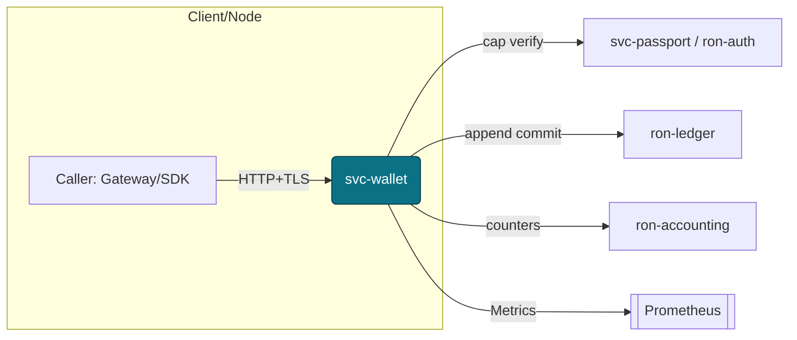
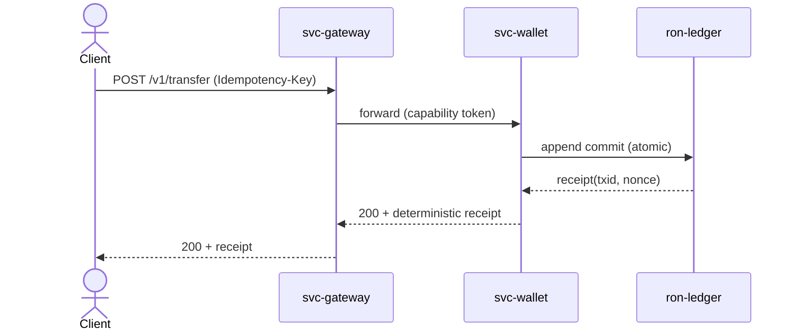
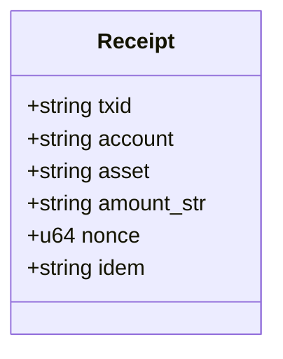
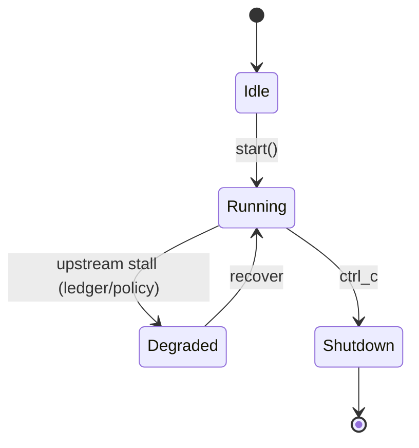

---

# svc-wallet

> **Role:** service
> **Owner:** Stevan White
> **Status:** draft
> **MSRV:** 1.80.0
> **Last reviewed:** 2025-10-16
> **Reviewed by:** auditors (see `docs/GOVERNANCE.md` sign-off)

Badges (optional):
[]() []() []() []()

---

## 1) Overview

**What it is:**
`svc-wallet` is the user-facing value plane for issuing, holding, and transferring balances. It enforces economic safety (non-negativity, conservation, no doublespends) and deterministic replays (Idempotency-Key or `(account, nonce)`), while delegating **durable economic truth** to `ron-ledger`. All operations are capability-gated (macaroons), amnesia-aware for Micronode, and PQ-ready (hybrid/strict modes).

**How it fits (RustyOnions topology):**

* **Pillar:** 12 — Economics & Wallets
* **Upstream callers:** `svc-gateway` / Omnigate; SDKs via HTTP+TLS
* **Downstream deps:** `ron-ledger` (settlement), `ron-accounting` (transient counters), `ron-auth`/`svc-passport` (capabilities), `ron-policy`/`svc-registry` (governance), Prometheus (obs)
* **Data it touches:** network only; no authoritative DB writes
* **Security boundary:** public HTTP; capability-scoped money ops; strict size/ratio/timeouts; amnesia mode supported

### 1.1 High-Level Architecture (Mermaid)



> Canon docs: `docs/IDB.md` (invariants), `docs/INTEROP.md` (wire), `docs/SECURITY.md` (STRIDE), `docs/PERFORMANCE.md` (SLOs), `docs/QUANTUM.md` (PQ), `docs/TESTS.md` (rigor), `docs/RUNBOOK.md`, `docs/GOVERNANCE.md`.

---

## 2) Responsibilities & Boundaries

**MUST do:**

* [ ] Enforce invariants: non-negativity, conservation, no doublespends; deterministic replays (Idempotency-Key / `(account,nonce)`).
* [ ] Gate ops by capability scope (account/asset/action/ceilings/TTL).
* [ ] Honor transport caps: body ≤ **1 MiB**; decompress ratio ≤ **10×**; explicit read/write/idle timeouts.
* [ ] Export golden metrics; `/readyz` sheds **writes first** under pressure.

**MUST NOT do:**

* [ ] No authoritative balances or direct DB writes.
* [ ] No ambient auth (cookies/IP lists) for money ops.
* [ ] No floats; no implicit currency conversion.
* [ ] No persistence in Micronode **amnesia** mode.

**Acceptance Gates (PROOF):**

* [ ] **Unit/prop/loom** cover doublespend, idempotency, sequencing races.
* [ ] **Fuzz** each target ≥ **60s** with zero crashes: `dto_amount_parser`, `spend_request_roundtrip`, `sequence_machine`.
* [ ] **Chaos:** ledger stall drill → `/readyz` degrades writes within **≤500ms**; error rate **<1%** with client retries.
* [ ] **Perf:** p95 transfer **≤180ms**, p99 **≤350ms** @ nominal; soak **10k rps** with **<0.3%** retryables.
* [ ] **Obs:** `request_latency_seconds`, `wallet_conflicts_total`, `quota_exhaustions_total`, `policy_version`, `pq_mode` visible and alerting.

---

## 3) Public Interfaces

> HTTP is the **stable public contract**; Rust surface is internal.

### 3.1 HTTP

**Base URL:** `/v1`
**Endpoints:**

* `GET /v1/balance?account=<str>&asset=<str>` — idempotent; bounded staleness
* `POST /v1/issue` — requires Idempotency-Key
* `POST /v1/transfer` — requires Idempotency-Key
* `POST /v1/burn` — requires Idempotency-Key
* `GET /v1/tx/{txid}` — receipt lookup (short TTL cache)
* Health: `/healthz`, `/readyz`
* Metrics: `/metrics`

**OpenAPI:** `./docs/openapi/svc-wallet.yaml` (source of truth for consumers)
**Compatibility:** Follow additive-first SemVer—new optional fields are non-breaking; breaking changes require path bump `/v2` and CHANGELOG entry.



### 3.2 Bus / Events

* Emits audit/readiness events; optional cache invalidations (see Interop topics).
* Subscribes to policy/key rotation notices (governance plane).

---

## 4) Configuration

> Env-first with sane defaults. **Hot-reload via SIGHUP** (or `/admin/reload` if enabled).

| Variable                  | Type   | Default        | Description                                   |        |          |
| ------------------------- | ------ | -------------- | --------------------------------------------- | ------ | -------- |
| `SVC_WALLET_BIND_ADDR`    | socket | `0.0.0.0:8080` | HTTP bind                                     |        |          |
| `SVC_WALLET_METRICS_ADDR` | socket | `127.0.0.1:0`  | Prometheus bind                               |        |          |
| `SVC_WALLET_LEDGER_URL`   | url    | —              | `ron-ledger` endpoint                         |        |          |
| `SVC_WALLET_AUTH_URL`     | url    | —              | `ron-auth`/`svc-passport` endpoint            |        |          |
| `SVC_WALLET_POLICY_URL`   | url    | —              | `ron-policy`/`svc-registry` endpoint          |        |          |
| `POLICY_RELOAD_GRACE_MS`  | int    | `500`          | grace before new policy becomes authoritative |        |          |
| `AMNESIA`                 | bool   | `off`          | RAM-only mode toggle                          |        |          |
| `PQ_MODE`                 | enum   | `off`          | `off                                          | hybrid | pq_only` |
| `LOG_LEVEL`               | string | `info`         | tracing level                                 |        |          |
| `LOG_FORMAT`              | string | `json`         | `json                                         | text`  |          |

**Flags (examples):**

```
--bind 0.0.0.0:8080
--metrics 127.0.0.1:9090
--config ./configs/svc-wallet.toml
--set pq_hybrid=true
```

**Feature flags (Cargo):** `tls` (tokio-rustls), `arti` (Tor via `ron-transport`), `legacy_pay` (guarded legacy behavior)

---

## 5) Build, Run, Test

**Build**

```
cargo build -p svc-wallet
```

**Run**

```
RUST_LOG=info SVC_WALLET_BIND_ADDR=0.0.0.0:8080 SVC_WALLET_METRICS_ADDR=127.0.0.1:0 cargo run -p svc-wallet
```

**Tests — unit/prop/docs**

```
cargo test -p svc-wallet --all-features
cargo test -p svc-wallet --doc
```

**Loom (concurrency checks)**

```
RUSTFLAGS="--cfg loom" cargo test -p svc-wallet --test loom_invariants -- --nocapture
```

**Fuzz (requires cargo-fuzz)**

```
cargo fuzz run dto_amount_parser -- -max_total_time=60
cargo fuzz run spend_request_roundtrip -- -max_total_time=60
cargo fuzz run sequence_machine -- -max_total_time=60
```

**Chaos drills (requires ronctl / test rig)**

```
ronctl chaos --target svc-wallet --inject ledger_stall --duration 30s --kpi "readyz_writes_shed<=500ms,error_rate<1%"
ronctl chaos --target svc-wallet --inject policy_503 --rate 0.2 --duration 60s --kpi "latency_p95<=180ms"
```

**Perf**

```
cargo bench -p svc-wallet
```

**Hygiene**

```
cargo fmt --all
cargo clippy -p svc-wallet -- -D warnings
cargo deny check
```

---

## 6) Observability

**Endpoints:** `/metrics`, `/healthz`, `/readyz` (UDS optional for admin)

**Canonical Metrics:**

* `request_latency_seconds{method,route}` — histogram
* `errors_total{stage,kind}` — counter
* `quota_exhaustions_total` — counter
* `wallet_conflicts_total` — counter
* `service_restarts_total`, `bus_lagged_total` — counters
* **Governance:** `policy_version{service}` — gauge
* **PQ:** `pq_mode{service}` — gauge; `pq_handshake_total{mode}` — counter

**Alerts (suggested):**

* p95 > 150ms (5m)
* 5xx > 1% (5m)
* `wallet_conflicts_total` spike ×3 baseline
* `quota_exhaustions_total` sustained > 10/min
* ledger connectivity error > 1% (5m)

**Tracing:** JSON logs (`corr_id`, `account`, `route`, `status`). Middleware:
`request-id → metrics → timeouts → decompress cap → body limit → auth → handler`.

---

## 7) Performance & SLOs

| Metric                             | Target (intra-AZ) | Notes                                  |
| ---------------------------------- | ----------------: | -------------------------------------- |
| GET `/v1/balance` p95 / p99        |   120 ms / 250 ms | steady-state                           |
| GET `/v1/tx/{txid}` p95 / p99      |   120 ms / 250 ms | steady-state                           |
| POST issue/transfer/burn p95 / p99 |   180 ms / 350 ms | includes ledger commit                 |
| `/readyz` p99 (green)              |             30 ms | fast liveness                          |
| Soak: RPS, retryables              |    10k rps, <0.3% | deterministic replay; no drift allowed |

> Reproduce: see `docs/PERFORMANCE.md` for machine profile, dataset, and regression baselines.

---

## 8) Data & Schema (summary)

No authoritative state in wallet. DTOs are JSON; amounts as strings (`u128` safe).
All request types enforce `serde(deny_unknown_fields)`.



Migrations: N/A (durable truth in `ron-ledger`). HTTP contract versioned via `/vN`; see OpenAPI.

---

## 9) Security & Privacy

* **STRIDE:** spoofing (caps), tampering (TLS 1.3, HMAC where applicable), repudiation (receipts/audit), info disclosure (redacted logs, size/ratio caps), DoS (quotas/timeouts), elevation (policy-scoped rights).
* **Key handling:** rustls; capability verification via `ron-auth`; keys never logged; ≤90-day rotation via KMS/HSM.
* **PII:** minimal; optional redaction for account identifiers; amnesia zeroizes sensitive buffers.
* **PQ readiness:** hybrid/strict toggles + telemetry (`pq_mode`, `pq_handshake_total`). See `docs/QUANTUM.md`.

---

## 10) Error Taxonomy

| Code/Variant             | When                        | User hint                | Retries |
| ------------------------ | --------------------------- | ------------------------ | ------- |
| `401/403` (cap denied)   | Missing/expired/wrong scope | Provide valid capability | no      |
| `409/INSUFFICIENT_FUNDS` | Would make balance negative | Reduce amount or top-up  | no      |
| `409/SEQUENCE_CONFLICT`  | Nonce monotonicity breach   | Retry with next nonce    | yes     |
| `429/QUOTA_EXHAUSTED`    | Rate/inflight limits        | Backoff with jitter      | yes     |
| `503/DEGRADED`           | Upstream stalled; shedding  | Honor `Retry-After`      | yes     |

Deterministic replays return identical receipts for same Idempotency-Key or `(account,nonce)`.

---

## 11) Concurrency Model

Tokio runtime; cooperative tasks. **Bounded** inflight queues (mpsc) to enforce backpressure; one broadcast receiver per task.
**Rule:** never hold a lock across `.await`. Readiness fails writes first under upstream pressure; shutdown drains cleanly.



Loom tests cover sequencing/idempotency races (`tests/loom_invariants.rs`).

---

## 12) Compatibility & Requirements

* **Rust:** 1.80.0
* **OS:** macOS 10.15+, Linux x86_64; containers supported
* **TLS:** `tokio_rustls` 0.26.x
* **HTTP:** `axum` 0.7.x, `tower-http` 0.6.x
* **Profiles:** Micronode (amnesia ON by default), Macronode (multi-service)

---

## 13) Examples

**Service health checks**

```
curl -sS http://127.0.0.1:8080/healthz
curl -sS http://127.0.0.1:8080/readyz | jq .
```

**Balance read**

```
curl -sS "http://127.0.0.1:8080/v1/balance?account=alice&asset=USD"
```

**Transfer (idempotent)**

```
curl -sS -X POST http://127.0.0.1:8080/v1/transfer \
  -H "Content-Type: application/json" \
  -H "Idempotency-Key: 7a8b-1234" \
  -d '{"from":"alice","to":"bob","asset":"USD","amount":"1000","nonce":42}'
```

**Metrics scrape**

```
curl -sS http://127.0.0.1:8080/metrics | head
```

**Policy reload (example)**

```
kill -HUP $(pgrep -f svc-wallet)
```

---

## 14) Troubleshooting

* **High p95 latency:** check ledger health & policy reloads; see alerts and `request_latency_seconds` buckets.
* **Frequent 409 conflicts:** verify client nonce window; monitor `wallet_conflicts_total`.
* **Ready but slow writes:** `/readyz` sheds writes during upstream stalls—inspect ledger connectivity.
* **Policy updates not applying:** send SIGHUP or call admin reload; confirm `policy_version` gauge advanced.

---

## 15) Development Notes

* Axum handlers end with `.into_response()`; register metrics once; avoid global mutable state.
* HTTP surface is the public API: breaking changes require `/v2` + CHANGELOG.
* Keep DTOs `deny_unknown_fields`; update OpenAPI with any schema change.
* Governance: record policy reloads in `docs/GOVERNANCE.md` audit trail.

**Pre-commit quickcheck**

```
cargo fmt --all
cargo clippy -- -D warnings
cargo test -p svc-wallet
cargo deny check
```

---

## 16) Mermaid Diagrams — Policy & Tooling (REQUIRED)

Include at least: **architecture**, **sequence**, **state** (see above). Render SVGs locally or in CI.

**Local (Node mmdc)**

```
npm i -g @mermaid-js/mermaid-cli
mmdc -i docs/arch.mmd -o docs/arch.svg
```

**Docker (no Node install)**

```
docker run --rm -v "$PWD":/data minlag/mermaid-cli mmdc -i docs/arch.mmd -o docs/arch.svg
```

---

## 17) Roadmap & TODO

* [ ] **Bronze** — Unit/prop green; OpenAPI stabilized; basic SLOs met; `/healthz`/`/readyz` accurate
* [ ] **Silver** — Loom suite stable; fuzz targets ≥60s; chaos drills (ledger stall, policy 503) green
* [ ] **Gold** — Soak @10k rps; PQ hybrid canary; alert SLOs green for 14d; runbook audited
* [ ] **Governance** — Policy reload audits recorded per `docs/GOVERNANCE.md`
* [ ] Hardening — limits/timeouts end-to-end; decompression guard e2e; DLQ policy notes

---

## 18) Changelog

See [CHANGELOG.md](./CHANGELOG.md). HTTP contract changes require path bump (`/v2`) and SemVer notes.

---

## 19) License

Dual-licensed under **MIT** or **Apache-2.0**.

---

## 20) Contributing

PRs welcome. Please include:

* Updated diagrams (if topology changed)
* Tests for invariants (include loom/fuzz where relevant)
* Perf impact notes for hot-path changes
* Cross-refs to `docs/SECURITY.md`, `docs/INTEROP.md`, `docs/PERFORMANCE.md`, `docs/TESTS.md`, `docs/RUNBOOK.md`, `docs/GOVERNANCE.md`

---

