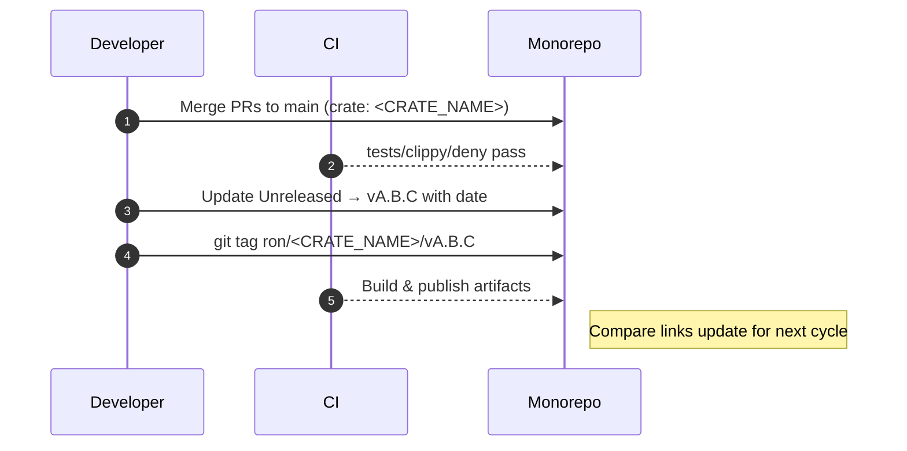

---

````markdown
---
# RustyOnions — Per-Crate Changelog
# File: docs/CHANGELOG.md
# Scope: <CRATE_NAME> only (NOT the whole workspace)
crate: <CRATE_NAME>
owner: Stevan White
semver: true
tag_pattern: ron/<CRATE_NAME>/vMAJOR.MINOR.PATCH
msrv: <X.Y.Z>
---

# CHANGELOG — <CRATE_NAME>

> This file tracks **crate-scoped** changes for `<CRATE_NAME>` in the RustyOnions monorepo.  
> Follows **SemVer** and the spirit of **Keep a Changelog**. Each entry includes **migration notes**, **ops impact**, and **rollback** guidance.

Badges (optional):  
[]() []() []()

---

## How to Read This Changelog

- **Unreleased** collects changes merged but not yet tagged.  
- Each release section shows: **Added / Changed / Fixed / Removed / Security / Performance / Deprecations / Breaking Changes / Migration**.  
- **Compare links** use crate-scoped tags: `ron/<CRATE_NAME>/vX.Y.Z`.  
- **Commit conventions:** we map Conventional Commits to sections:
  - `feat:` → Added
  - `fix:` → Fixed
  - `perf:` → Performance
  - `refactor:`/`style:`/`chore:` → Changed (if user-visible) or omitted
  - `docs:` → Documentation
  - `revert:` → Reverted (note rollback)
  - `build:`/`ci:` only if it affects consumers
  - `BREAKING CHANGE:` or `!` → Breaking Changes + Migration

### Release Checklist (per crate)
- [ ] Version bump (SemVer): MAJOR for breaking, MINOR for features, PATCH for fixes.  
- [ ] Update `Cargo.toml` version for `<CRATE_NAME>`.  
- [ ] Update **Unreleased** → new version section with date.  
- [ ] Validate **Migration** steps & example code.  
- [ ] SLO deltas documented; perf numbers reproducible.  
- [ ] `cargo test -p <CRATE_NAME>`, `cargo clippy -D warnings`, `cargo deny check` green.  
- [ ] Render diagrams (if any) and attach artifacts.  
- [ ] Tag: `git tag ron/<CRATE_NAME>/vX.Y.Z` and push tags.  
- [ ] Publish crate/binaries if applicable; update README badges.

---

## [Unreleased]
> Compare: `[Unreleased]` → last tag  
**Status:** in-flight changes since `ron/<CRATE_NAME>/vA.B.C`.

### Added
- …

### Changed
- …

### Fixed
- …

### Performance
- …

### Security
- …

### Removed
- …

### Deprecations
- …

### Breaking Changes
- …

### Migration (for changes above)
- **Config:** …  
- **API surface:** …  
- **Storage/schema:** …  
- **Command/flags:** …  
- **Minimal diff example:**
  ```diff
  - let c = Client::new_old(api_key);
  + let c = Client::new(Config::from_env()?);
````

### Ops & Rollback

* **Risk level:** Low | Medium | High
* **Feature flag/toggle:** `<FLAG_NAME>` (how to disable)
* **Rollback plan:** Revert to `ron/<CRATE_NAME>/vA.B.C` (notes about data migrations/backfills)

---

## [vA.B.C] — YYYY-MM-DD

> Compare: `ron/<CRATE_NAME>/vA.B.C`…`HEAD` (or next tag)

### Added

* …

### Changed

* …

### Fixed

* …

### Performance

* **P50 latency:** <value> (Δ from last: +/−)
* **P99 latency:** <value>
* **Throughput:** <value>
* **Repro steps:** machine, dataset, command

### Security

* **CVE:** <id> (if any)
* **Hardening:** timeouts, input caps, TLS, authN/Z updates
* **Key handling:** no logs, memory zeroize, path changes

### Removed

* …

### Deprecations

* **Symbol:** `<module::Type::method>` → removal in vA+1.0.0
* **Replacement:** `<new API>`
* **Tracking issue:** `#NNN`

### Breaking Changes

* \<Describe exact break, old vs new behavior, error variants, or types removed>

### Migration

* **API:** code snippet before/after
* **Config:** env/flags renames (include defaults)
* **Data:** sled prefixes, schema version bump, idempotency of backfill
* **HTTP/bus:** route/topic changes and auth changes

### Ops & Rollback

* **Health/Readiness:** endpoints semantics changed? Y/N
* **Metrics:** new/renamed metrics (keep old for 1 release?)
* **Alarms:** update alert rules (thresholds, labels)
* **Rollback:** revert tag, data compatibility caveats

---

## \[vA.B.(C-1)] — YYYY-MM-DD

### Added

* …

### Fixed

* …

### Migration

* N/A

---

## Compatibility, MSRV & Toolchain Notes

* **MSRV:** \<X.Y.Z> (changed in vA.B.C? Y/N; reason)
* **Rustc/Clippy:** relevant lints elevated to deny?
* **Dependencies:** notable bumps that affect consumers (axum/tokio/prometheus versions; TLS stack)

---

## Metrics & SLO Deltas (Release to Release)

> Capture only **user-visible** or **ops-relevant** deltas.

| Release    | P50 | P99 | Error % | Start-to-Ready | Notes |
| ---------- | --: | --: | ------: | -------------: | ----- |
| vA.B.C     |   … |   … |       … |              … | …     |
| vA.B.(C-1) |   … |   … |       … |              … | …     |

---

## Appendix A — API Surface Summary (optional)

> Use `cargo public-api` to record headline changes.

```
cargo +stable install cargo-public-api
cargo public-api -p <CRATE_NAME> --deny changed
```

* **New:** `pub fn <name>(...)`
* **Changed:** `enum Error { … }` added `<Variant>`
* **Removed:** …

---

## Appendix B — Release Flow (Mermaid, optional)



---

## Link References (edit once per crate)

[Unreleased]: https://github.com/<ORG>/<REPO>/compare/ron/<CRATE_NAME>/vA.B.C...HEAD
[vA.B.C]: https://github.com/<ORG>/<REPO>/tree/ron/<CRATE_NAME>/vA.B.C

<!--
When you cut a new release:
1) Change [Unreleased] base from old tag → new tag.
2) Add a new link ref for the new version.
3) Keep tag pattern crate-scoped to avoid cross-crate collisions.
-->

```

---

### Monorepo Tagging & Compare Guidance (keep outside the file or in your maintainer notes)

- **Tag pattern:** `ron/<CRATE_NAME>/vX.Y.Z` (unique per crate).  
- **Compare “Unreleased”:** set base to **latest crate tag**.  
- **Automating link rewrites:** simple sed snippet to bump compare bases in one shot is fine, but keep it crate-scoped.

If you want, I can also generate a tiny `release_notes.md` stamper that:
- bumps `Cargo.toml` and `docs/CHANGELOG.md`,
- converts the Unreleased block into a dated section,
- pushes `ron/<CRATE_NAME>/vX.Y.Z` tag,
- and updates the link refs.
```
