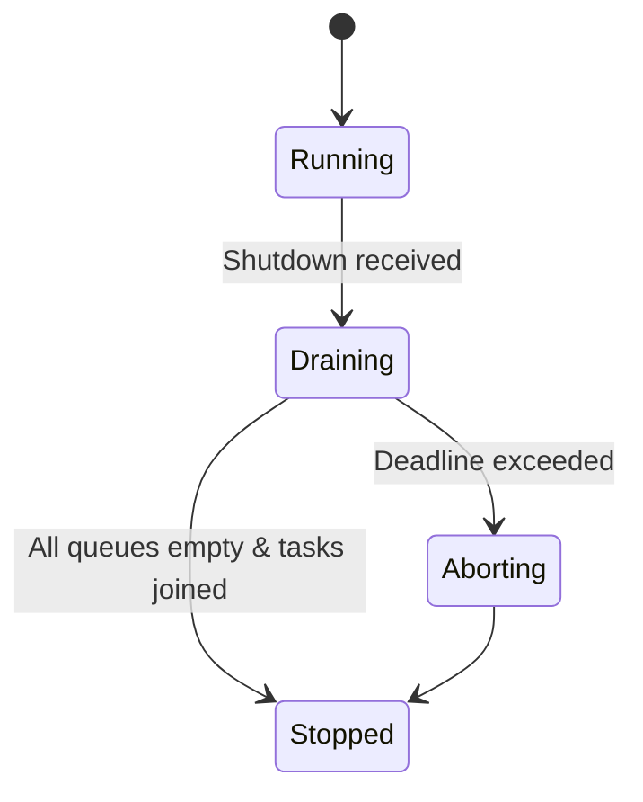
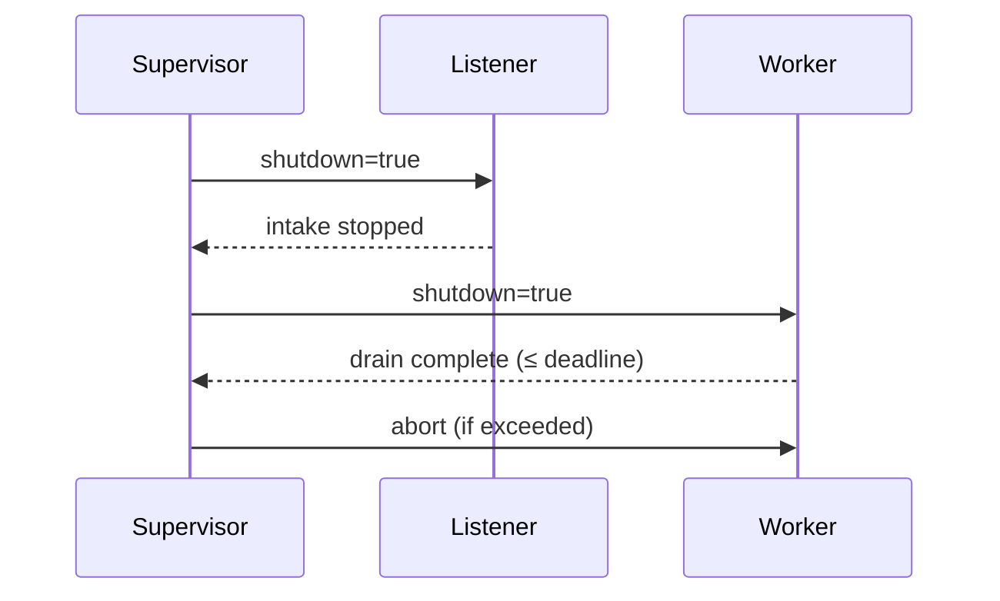

---

---

title: Concurrency Model — svc-wallet
crate: svc-wallet
owner: Stevan White
last-reviewed: 2025-10-16
status: draft
template_version: 1.1
msrv: 1.80.0
tokio: "1.x (pinned at workspace root)"
loom: "0.7+ (dev-only)"
lite_mode: "N/A (service)"
--------------------------

# Concurrency Model — svc-wallet

This document makes the concurrency rules **explicit**: tasks, channels, locks, shutdown, timeouts,
and validation (property/loom/TLA+). It complements `docs/SECURITY.md`, `docs/CONFIG.md`,
and the crate’s `README.md` and `IDB.md`.

> **Golden rule:** never hold a lock across `.await` in supervisory or hot paths.

---

## 0) Lite Mode

N/A — `svc-wallet` is a networked **service** with background tasks.

---

## 1) Invariants (MUST)

* **No lock across `.await`.** Split critical sections; capture data, drop guard, then await.
* **Single writer** per mutable resource (per-account nonce sequence; idempotency store entry).
* **Bounded channels only** (mpsc/broadcast/watch); every queue has a capacity and drop policy.
* **Explicit timeouts** for all I/O and RPCs; fail-fast with typed errors.
* **Cooperative cancellation**: every `.await` is cancel-safe or guarded by `select!`.
* **Graceful shutdown**: observe `Shutdown`; stop intake, drain within deadline, abort stragglers.
* **No blocking syscalls** on the async runtime; use `spawn_blocking` if absolutely required.
* **No task leaks**: all spawns are supervised or joined; detaches require rationale.
* **Backpressure over buffering**: reject/busy instead of growing queues.
* **Framing**: HTTP/OAP limits enforced (1 MiB body, ≤10× decompress); partial reads handled.
* **Async Drop discipline**: do **not** block in `Drop`; expose `async close()/shutdown()` for teardown.

---

## 2) Runtime Topology

**Runtime:** Tokio multi-threaded (worker-stealing), opt-in I/O drivers only.

**Primary tasks (steady-state):**

* **Supervisor**

  * Owns shutdown `watch` channel and spawn lifecycle.
  * Exposes `/healthz`, `/readyz` snapshots (read-only, lock-free).
* **HTTP Listener**

  * Accepts connections; enforces limits/timeouts; routes to handlers.
  * Pushes ledger-bound operations into **Commit Queue** when backpressure is required.
* **Worker Pool (Committers, size = CPU or config)**

  * Pulls from **Commit Queue**; performs `ron-ledger` RPCs with retries/circuit-breaker.
  * Emits **Audit Events** (non-blocking, lossy-ok).
* **Cache Invalidator**

  * Subscribes to **Ledger Bus** (broadcast) and invalidates balance snapshots.
* **Metrics Ticker**

  * Samples queue depth, inflight workers; exports Prometheus gauges.

```mermaid
flowchart TB
  subgraph Runtime
    S[Supervisor] -->|spawn| H[HTTP Listener]
    S -->|spawn| W[Worker Pool N]
    S -->|spawn| I[Cache Invalidator]
    S -->|spawn| M[Metrics Ticker]

    H -->|mpsc work(512)| W
    W -->|broadcast events(1024)| A[Audit Stream]
    I --> C[Balance Cache]

    S -->|watch Shutdown| H
    S -->|watch Shutdown| W
    S -->|watch Shutdown| I
    S -->|watch Shutdown| M
  end
  style S fill:#0ea5e9,stroke:#0c4a6e,color:#fff
```

**Text:** Supervisor spawns HTTP Listener, Worker Pool, Cache Invalidator, and Metrics Ticker. Listener feeds a bounded work queue to the Worker Pool. Workers publish audit events (lossy). Invalidator listens to ledger bus to keep the balance cache hot and coherent. All tasks observe a Shutdown watch channel.

---

## 3) Channels & Backpressure

**Inventory (all bounded):**

| Name           | Kind      | Capacity | Producers → Consumers | Backpressure Policy          | Drop Semantics                                |
| -------------- | --------- | -------: | --------------------- | ---------------------------- | --------------------------------------------- |
| `work_tx`      | mpsc      |      512 | HTTP(N) → Workers(M)  | `try_send` else **Busy/429** | No enqueue; increment `busy_rejections_total` |
| `events_tx`    | broadcast |     1024 | Workers(1..N) → N     | Drop oldest (lag)            | Incr `bus_lagged_total`; warn                 |
| `shutdown_rx`  | watch     |        1 | Supervisor → N        | Last-write-wins              | N/A                                           |
| `ledger_bus`   | broadcast |     1024 | Ledger client → N     | Drop oldest (lag)            | Incr `bus_lagged_total{bus="ledger"}`         |
| `metrics_tick` | interval  |        — | Timer → Metrics       | Fixed cadence (e.g., 1s)     | N/A                                           |

**Guidelines**

* Always prefer `try_send` + typed error (`Busy`) over async send that might stall the Listener.
* Keep **depth gauges** and **dropped counters** for each queue; alarms on sustained pressure.

---

## 4) Locks & Shared State

**Allowed**

* Short-lived `Mutex/RwLock` for configuration snapshot swapping; **no `.await` under guard**.
* `DashMap<AccountPrefix, AtomicU64>` for **nonce sequences** (fetch-update; lock-free).
* `Arc<IdemStore>` for **idempotency receipts** (bounded LRU + TTL; internal sharding).
* `Arc<StateSnapshot>` read-mostly structures for /healthz,/readyz and config.

**Forbidden**

* Holding any lock across `.await`.
* Nested locks without an explicit hierarchy and justification.

**Hierarchy (if you must nest; highest first)**

1. `cfg_snapshot`
2. `balance_cache` (read)
3. `metrics_state`

---

## 5) Timeouts, Retries, Deadlines

* **HTTP I/O:** `read=5s`, `write=5s`, `idle=60s` (configurable).
* **Request deadline:** total handler deadline ≤ `REQ_TIMEOUT` (default 5s).
* **Upstreams (ledger/auth/policy):**

  * Per-RPC timeout ≤ 1s.
  * Retries: **idempotent** ops only (commit path wraps with **idempotency** anyway); jittered exponential backoff (50ms → 1s cap, factor 2.0, jitter 20ms), max 3 tries.
  * Circuit breaker: **open** on rolling error threshold (default 20) for 5s; **half-open** with 10 probes.

```mermaid
sequenceDiagram
  autonumber
  participant C as Client
  participant L as Listener
  participant W as Worker
  C->>L: POST /v1/transfer (deadline=5s)
  alt work queue has room
    L->>W: enqueue (try_send)
    W->>W: reserve nonce + check balance (no lock across await)
    W->>Ledger: commit (timeout 1s; retries/backoff)
    W-->>L: Receipt
    L-->>C: 200 OK + receipt
  else queue full
    L-->>C: 429 Busy (Retry-After)
  end
```

---

## 6) Cancellation & Shutdown

* **Trigger:** `KernelEvent::Shutdown` or `wait_for_ctrl_c()`.
* **Propagation:** `watch<bool>`; handlers and workers use `tokio::select!` against `shutdown_rx.changed()`.
* **Draining:** stop accepting writes; allow in-flight jobs to complete within **drain_deadline** (config: 1–5s).
* **Abort:** workers exceeding deadline get `handle.abort()`; increment `tasks_aborted_total{kind="worker"}`.
* **Idempotency:** replays after restart return the same receipt when within TTL; no partial state leaks.



---

## 7) I/O & Framing

* **HTTP/1.1** (Axum/Tower). Enforce:

  * `max_body_bytes = 1 MiB`
  * `safe_decompress ≤ 10×`
  * `content-type` must match handler.
* **Read/Write:** use `AsyncReadExt/AsyncWriteExt`; call `.shutdown().await` on close.
* **Partial reads:** handlers tolerate split frames and early disconnects; all errors are typed.

---

## 8) Error Taxonomy (Concurrency-Relevant)

| Error                 | When                         | Retry?      | Metric                            | Notes                  |
| --------------------- | ---------------------------- | ----------- | --------------------------------- | ---------------------- |
| `Busy`                | `work_tx` full               | caller-dec  | `busy_rejections_total{endpoint}` | 429 with `Retry-After` |
| `Timeout`             | I/O or RPC deadline exceeded | sometimes   | `io_timeouts_total{op}`           | Include `op` label     |
| `Canceled`            | Shutdown during wait/work    | no          | `tasks_canceled_total{kind}`      | Clean cancel           |
| `Lagging`             | broadcast overflow           | no          | `bus_lagged_total{bus}`           | Slow consumer detected |
| `UpstreamUnavailable` | breaker open / network fail  | yes (later) | `upstream_fail_total{svc}`        | Surface 503 retryable  |

---

## 9) Metrics (Concurrency Health)

* `queue_depth{queue}` gauge (work)
* `queue_dropped_total{queue}` counter (work/events)
* `busy_rejections_total{endpoint}` counter
* `tasks_spawned_total{kind}` / `tasks_aborted_total{kind}` counters
* `io_timeouts_total{op}` counter (`read`,`write`,`connect`,`ledger_rpc`)
* `backoff_retries_total{svc,op}` counter
* `bus_lagged_total{bus}` counter
* `worker_inflight` gauge

---

## 10) Validation Strategy

**Unit / Property**

* **Backpressure:** enqueue until `work_tx` full → `Busy`; `queue_depth` and `busy_rejections_total` advance deterministically.
* **Nonce atomicity:** concurrent reservations on same account/nonce → at most one success (`fetch_update`).
* **Idempotency:** repeated requests with same key → identical receipt; counter increments.
* **Deadline:** operations honor timeouts within ±10% tolerance.

**Loom (dev-only)**

* Model: 2 producers → mpsc(2) → 2 consumers + shutdown.
* Asserts: no deadlocks, no lost wakeups, shutdown always observed, no double-apply.

**Fuzz**

* HTTP payload fuzz (sizes, compression ratios, malformed JSON).
* Handler state machine fuzz (issue/transfer/burn interleavings).

**Chaos**

* Induce upstream stall (ledger+=2s): `/readyz` flips; POST=503; GET `/balance` stays 200; queues drain on recovery.
* Kill/restart worker tasks under load; no task leak; supervisor backoff respected.

**(Optional) TLA+**

* Safety: at-most-once commit per `(account,nonce)`; Conservation invariant.
* Liveness: eventually drains under finite arrivals.

---

## 11) Code Patterns (Copy-Paste)

**Spawn + cooperative shutdown**

```rust
let (shutdown_tx, shutdown_rx) = tokio::sync::watch::channel(false);

let worker = {
  let mut rx = work_rx;
  let mut shutdown_rx = shutdown_rx.clone();
  tokio::spawn(async move {
    loop {
      tokio::select! {
        _ = shutdown_rx.changed() => break,
        maybe_job = rx.recv() => {
          let Some(job) = maybe_job else { break };
          if let Err(e) = handle_job(job).await {
            tracing::warn!(error=%e, "job failed");
          }
        }
      }
    }
  })
};
```

**Bounded mpsc with `try_send` (backpressure)**

```rust
match work_tx.try_send(job) {
  Ok(()) => {}
  Err(tokio::sync::mpsc::error::TrySendError::Full(_job)) => {
    metrics::busy_rejections_total("transfer").inc();
    return Err(Error::Busy);
  }
  Err(e) => return Err(Error::InternalQueue(e.to_string())),
}
```

**No lock across `.await`**

```rust
let nonce = {
  // reserve atomically without holding an async lock
  seq::reserve_atomic(&nonces, &account, requested_nonce)?
};
// do async work after the guard is dropped / atomic op done
let receipt = ledger::commit_transfer(&client, &req).await?;
```

**Timeout with deadline**

```rust
let res = tokio::time::timeout(cfg.read_timeout, read_frame(&mut stream)).await;
```

**Async Drop pattern**

```rust
pub struct Client { inner: Option<Conn> }

impl Client {
  pub async fn close(&mut self) -> anyhow::Result<()> {
    if let Some(mut c) = self.inner.take() {
      c.shutdown().await?;
    }
    Ok(())
  }
}

impl Drop for Client {
  fn drop(&mut self) {
    if self.inner.is_some() {
      tracing::debug!("Client dropped without close(); resources reclaimed");
    }
  }
}
```

---

## 12) Configuration Hooks (Quick Reference)

* `max_conns`, `read_timeout`, `write_timeout`, `idle_timeout`
* `limits.max_body_bytes`, `limits.decompress_ratio_cap`, `limits.rate_per_second`, `limits.burst`
* `wallet.staleness_window`, `wallet.idempotency_ttl`, `wallet.shards`
* `retry.*`, `circuit_breaker.*`
* `drain_deadline` (shutdown window; defined in service config)

**See `docs/CONFIG.md` for authoritative schema and defaults.**

---

## 13) Known Trade-offs / Nonstrict Areas

* **Audit bus is lossy** by design (broadcast overflow drops oldest) to protect hot paths; durable audit belongs to `ron-ledger` / `ron-audit`.
* **Balance reads** tolerate a **≤250 ms** staleness window for performance; commit path always re-validates.
* **Busy vs drop-oldest:** Listener prefers **rejecting new** (429) to preserve fairness and latency SLAs.

---

## 14) Mermaid Diagrams

### 14.1 Task & Queue Topology

```mermaid
flowchart LR
  IN[HTTP Listener] -->|mpsc work(512)| W1[Worker A]
  IN -->|mpsc work(512)| W2[Worker B]
  subgraph Control
    SHUT[Shutdown watch] --> IN
    SHUT --> W1
    SHUT --> W2
  end
  W1 -->|broadcast events(1024)| AUD[Audit Stream]
  W2 -->|broadcast events(1024)| AUD
```

**Text:** Listener feeds two Workers via bounded mpsc; a Shutdown watch notifies both. Workers publish audit events via broadcast (lossy-ok).

### 14.2 Shutdown Sequence



---

## 15) CI & Lints (Enforcement)

**Clippy/lints**

* `-D warnings`
* `-W clippy::await_holding_lock`
* `-W clippy::useless_async`
* `-W clippy::needless_collect`

**Suggested GitHub Actions**

```yaml
name: concurrency-guardrails
on: [push, pull_request]
jobs:
  clippy:
    runs-on: ubuntu-latest
    steps:
      - uses: actions/checkout@v4
      - uses: dtolnay/rust-toolchain@stable
      - run: cargo clippy -p svc-wallet -- -D warnings -W clippy::await_holding_lock

  loom:
    if: github.event_name == 'pull_request'
    runs-on: ubuntu-latest
    steps:
      - uses: actions/checkout@v4
      - uses: dtolnay/rust-toolchain@stable
      - run: RUSTFLAGS="--cfg loom" cargo test -p svc-wallet --tests -- --ignored

  fuzz:
    runs-on: ubuntu-latest
    steps:
      - uses: actions/checkout@v4
      - uses: dtolnay/rust-toolchain@stable
      - run: cargo install cargo-fuzz
      - run: cargo fuzz build -p svc-wallet
```

---

## 16) Schema Generation (Optional, Nice-to-Have)

Automate **Channels/Locks tables** from code:

* Annotate queue construction with a doc macro (or a simple helper that records name/capacity/policy).
* Unit test compares the generated registry with this doc’s table (golden test) to avoid drift.

---

## 17) Review & Maintenance

* **Review cadence:** every 90 days or when tasks/channels/locks change.
* Keep `owner`, `msrv`, and `last-reviewed` current.
* PRs that change concurrency **must** update this file + related loom/property/chaos tests.

---
