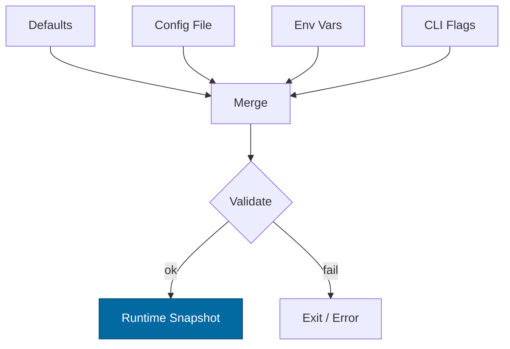

---

---

title: Configuration — svc-wallet
crate: svc-wallet
owner: Stevan White
last-reviewed: 2025-10-16
status: draft
template_version: 1.0
---------------------

# Configuration — svc-wallet

This document defines **all configuration** for `svc-wallet`, including sources,
precedence, schema (types/defaults), validation, feature flags, live-reload behavior,
and security implications. It complements `README.md`, `docs/IDB.md`, and `docs/SECURITY.md`.

> **Tiering:**
> `svc-wallet` is a **service** crate; all service sections apply (network, readiness, observability, etc.).

---

## 1) Sources & Precedence (Authoritative)

Configuration may come from multiple sources. **Precedence (highest wins):**

1. **Process flags** (CLI)
2. **Environment variables**
3. **Config file** (TOML preferred; `--config` path can be relative)
4. **Built-in defaults** (hard-coded)

**Supported file formats:** TOML (preferred), JSON (optional).
**Path resolution for `--config` (if relative):** `./`, `$CWD`, crate dir.

**Dynamic reload:** When reloading, the effective config is recomputed under the **same precedence**.

---

## 2) Quickstart Examples

### 2.1 Minimal service start

```bash
RUST_LOG=info \
SVC_WALLET_BIND_ADDR=0.0.0.0:8080 \
SVC_WALLET_METRICS_ADDR=127.0.0.1:0 \
SVC_WALLET_LEDGER_URL=http://127.0.0.1:7070 \
SVC_WALLET_AUTH_URL=http://127.0.0.1:7171 \
SVC_WALLET_POLICY_URL=http://127.0.0.1:7272 \
cargo run -p svc-wallet
```

### 2.2 Config file (TOML)

```toml
# Config.toml
bind_addr     = "0.0.0.0:8080"
metrics_addr  = "127.0.0.1:0"
max_conns     = 1024
read_timeout  = "5s"
write_timeout = "5s"
idle_timeout  = "60s"

[tls]
enabled   = false
# cert_path = "/etc/ron/cert.pem"
# key_path  = "/etc/ron/key.pem"

[limits]
max_body_bytes       = "1MiB"
decompress_ratio_cap = 10
rate_per_second      = 1000
burst                = 2000

[wallet]
staleness_window   = "250ms"
idempotency_ttl    = "24h"
max_amount_per_op  = "100000000000000000000" # 1e20 minor units
daily_ceiling      = "10000000000000000000000" # 1e22 minor units
max_account_total  = "340282366920938463463"  # safety headroom

[amnesia]
enabled = false

[pq]
mode = "off" # off|hybrid

[upstreams]
ledger_url = "http://127.0.0.1:7070"
auth_url   = "http://127.0.0.1:7171"
policy_url = "http://127.0.0.1:7272"

[retry]
base   = "50ms"
max    = "1s"
factor = 2.0
jitter = "20ms"

[circuit_breaker]
failure_threshold = 20
open_duration     = "5s"
half_open_max     = 10

[uds]
# Optional Unix Domain Socket if desired
path       = ""
allow_uids = []

[log]
format = "json" # json|text
level  = "info"
```

### 2.3 CLI flags (override file/env)

```bash
cargo run -p svc-wallet -- \
  --config ./Config.toml \
  --bind 0.0.0.0:8080 \
  --metrics 127.0.0.1:0 \
  --max-conns 2048 \
  --ledger http://127.0.0.1:7070 \
  --auth http://127.0.0.1:7171 \
  --policy http://127.0.0.1:7272
```

---

## 3) Schema (Typed, With Defaults)

> **Env prefix:** `SVC_WALLET_…`
> **Durations** accept `ms`, `s`, `m`, `h`. **Sizes** accept `B`, `KiB`, `MiB`. **Amounts** are strings parsed to `u128` (minor units).

### 3.1 Core service

| Key / Env Var                                  | Type      | Default       | Description                | Security Notes                       |
| ---------------------------------------------- | --------- | ------------- | -------------------------- | ------------------------------------ |
| `bind_addr` / `SVC_WALLET_BIND_ADDR`           | socket    | `127.0.0.1:0` | HTTP/ingress bind address  | Public binds require threat review   |
| `metrics_addr` / `SVC_WALLET_METRICS_ADDR`     | socket    | `127.0.0.1:0` | Prometheus endpoint bind   | Prefer localhost; scrape via gateway |
| `max_conns` / `SVC_WALLET_MAX_CONNS`           | u32       | `1024`        | Max concurrent connections | Prevents FD exhaustion               |
| `read_timeout` / `SVC_WALLET_READ_TIMEOUT`     | duration  | `5s`          | Per-request read timeout   | DoS mitigation                       |
| `write_timeout` / `SVC_WALLET_WRITE_TIMEOUT`   | duration  | `5s`          | Per-request write timeout  | DoS mitigation                       |
| `idle_timeout` / `SVC_WALLET_IDLE_TIMEOUT`     | duration  | `60s`         | Keep-alive idle shutdown   | Resource hygiene                     |
| `tls.enabled` / `SVC_WALLET_TLS_ENABLED`       | bool      | `false`       | Enable TLS                 | Use tokio-rustls only                |
| `tls.cert_path` / `SVC_WALLET_TLS_CERT_PATH`   | path      | `""`          | PEM cert path              | Secrets on disk; perms 0600          |
| `tls.key_path` / `SVC_WALLET_TLS_KEY_PATH`     | path      | `""`          | PEM key path               | Zeroize in memory                    |
| `uds.path` / `SVC_WALLET_UDS_PATH`             | path      | `""`          | Optional UDS socket path   | Dir 0700, sock 0600                  |
| `uds.allow_uids` / `SVC_WALLET_UDS_ALLOW_UIDS` | list<u32> | `[]`          | PEERCRED allowlist         | Strict prod control                  |
| `log.format` / `SVC_WALLET_LOG_FORMAT`         | enum      | `json`        | `json` or `text`           | JSON required in prod                |
| `log.level` / `SVC_WALLET_LOG_LEVEL`           | enum      | `info`        | `trace..error`             | Avoid `trace` in prod                |

### 3.2 Limits & rate

| Key / Env Var                                           | Type | Default | Description             | Security Notes           |
| ------------------------------------------------------- | ---- | ------- | ----------------------- | ------------------------ |
| `limits.max_body_bytes` / `SVC_WALLET_MAX_BODY_BYTES`   | size | `1MiB`  | Request payload cap     | Decompression bomb guard |
| `limits.decompress_ratio_cap` / `SVC_WALLET_DECOMP_CAP` | u32  | `10`    | Max decompression ratio | Zip bomb guard           |
| `limits.rate_per_second` / `SVC_WALLET_RPS`             | u32  | `1000`  | Global RPS cap          | Backpressure             |
| `limits.burst` / `SVC_WALLET_BURST`                     | u32  | `2000`  | Token bucket burst      |                          |

### 3.3 Wallet economics (IDB-aligned)

| Key / Env Var                                       | Type     | Default (minor units) | Description                         | Security Notes                  |
| --------------------------------------------------- | -------- | --------------------- | ----------------------------------- | ------------------------------- |
| `wallet.staleness_window` / `SVC_WALLET_STALENESS`  | duration | `250ms`               | Read cache staleness bound          | Consistency window              |
| `wallet.idempotency_ttl` / `SVC_WALLET_IDEM_TTL`    | duration | `24h`                 | TTL for idempotency receipts        | Replay window; clock discipline |
| `wallet.max_amount_per_op` / `SVC_WALLET_MAX_AMT`   | amount   | `1e20`                | Per-op ceiling                      | Prevents overflow               |
| `wallet.daily_ceiling` / `SVC_WALLET_DAILY_CEIL`    | amount   | `1e22`                | Per-account daily ceiling           | Policy-integrated               |
| `wallet.max_account_total` / `SVC_WALLET_MAX_TOTAL` | amount   | `u128::MAX - 1e9`     | Safety headroom below u128 max      | Overflow guard                  |
| `wallet.nonce_start` / `SVC_WALLET_NONCE_START`     | u64      | `1`                   | First valid nonce per account       | Monotonic                       |
| `wallet.shards` / `SVC_WALLET_SHARDS`               | u16      | `64`                  | Shards for nonce/idempotency caches | Throughput scaling              |

### 3.4 Upstreams & resilience

| Key / Env Var                                               | Type     | Default                 | Description                      | Security Notes          |
| ----------------------------------------------------------- | -------- | ----------------------- | -------------------------------- | ----------------------- |
| `upstreams.ledger_url` / `SVC_WALLET_LEDGER_URL`            | url      | `http://127.0.0.1:7070` | `ron-ledger` base URL            | Zero-trust retries + CB |
| `upstreams.auth_url` / `SVC_WALLET_AUTH_URL`                | url      | `http://127.0.0.1:7171` | `ron-auth` base URL              |                         |
| `upstreams.policy_url` / `SVC_WALLET_POLICY_URL`            | url      | `http://127.0.0.1:7272` | `ron-policy` base URL            |                         |
| `retry.base` / `SVC_WALLET_RETRY_BASE`                      | duration | `50ms`                  | Exponential backoff base         |                         |
| `retry.max` / `SVC_WALLET_RETRY_MAX`                        | duration | `1s`                    | Max backoff                      |                         |
| `retry.factor` / `SVC_WALLET_RETRY_FACTOR`                  | f64      | `2.0`                   | Exponent                         |                         |
| `retry.jitter` / `SVC_WALLET_RETRY_JITTER`                  | duration | `20ms`                  | Jitter added to backoff          |                         |
| `circuit_breaker.failure_threshold` / `SVC_WALLET_CB_FAILS` | u32      | `20`                    | Trip threshold in rolling window |                         |
| `circuit_breaker.open_duration` / `SVC_WALLET_CB_OPEN`      | duration | `5s`                    | Time in OPEN state               |                         |
| `circuit_breaker.half_open_max` / `SVC_WALLET_CB_HALF`      | u32      | `10`                    | Max trial calls in HALF-OPEN     |                         |

### 3.5 Modes

| Key / Env Var                            | Type                 | Default | Description                               | Security Notes                        |
| ---------------------------------------- | -------------------- | ------- | ----------------------------------------- | ------------------------------------- |
| `amnesia.enabled` / `SVC_WALLET_AMNESIA` | bool                 | `false` | RAM-only mode (no persistent writes)      | No on-disk secrets or WAL             |
| `pq.mode` / `SVC_WALLET_PQ_MODE`         | enum(`off`,`hybrid`) | `off`   | PQ readiness toggle (hybrid verification) | Interop compatibility must be managed |

---

## 4) Validation Rules (Fail-Closed)

Run on startup and on reload:

* `bind_addr`, `metrics_addr` parse to valid sockets; privileged ports (<1024) require capabilities.
* If `tls.enabled=true`: both cert and key must exist/readable; key not world-readable.
* `max_conns > 0`; `limits.max_body_bytes ≥ 1 KiB`; `limits.decompress_ratio_cap ≥ 1`.
* `wallet.max_amount_per_op > 0`, `wallet.daily_ceiling ≥ max_amount_per_op`, and `wallet.max_account_total ≥ daily_ceiling`.
* `wallet.staleness_window` ∈ [10ms, 5s].
* `wallet.idempotency_ttl` ∈ [1m, 72h].
* `wallet.shards` ∈ [1, 1024].
* All `upstreams.*_url` must be absolute HTTP(S) URLs.
* If `amnesia.enabled=true`: **no** disk paths configured (UDS allowed), and any persistent stores must be disabled.
* If `pq.mode="hybrid"`: feature flag compatibility with `ron-auth` enforced during handshake (fail fast if unsupported).

**On violation:** log structured error (no secrets), **exit non-zero** (service) or **return error** (lib embedding).

---

## 5) Dynamic Reload (If Supported)

**Triggers:**

* `SIGHUP` (preferred), or kernel bus `ConfigUpdated { version: <u64> }`.

**Hot-reload (non-disruptive):**

* Timeouts, limits, rate caps, retry/backoff, circuit-breaker thresholds, log level/format, wallet windows (staleness, idem TTL).

**Requires rebind (disruptive):**

* `bind_addr`, `tls.*`, `uds.*`.

**Atomicity:**

* Compute new snapshot; swap under a mutex **without holding `.await`**.
* Emit `KernelEvent::ConfigUpdated { version }` and a redacted diff.

---

## 6) CLI Flags (Canonical)

```
--config <path>                 # Load Config.toml (low precedence vs env/flags)
--bind <ip:port>                # bind_addr
--metrics <ip:port>             # metrics_addr
--max-conns <num>
--read-timeout <dur>            # 5s, 250ms
--write-timeout <dur>
--idle-timeout <dur>
--tls                           # tls.enabled=true
--tls-cert <path>
--tls-key <path>
--uds <path>
--staleness <dur>               # wallet.staleness_window
--idem-ttl <dur>                # wallet.idempotency_ttl
--max-amount <u128-string>      # wallet.max_amount_per_op
--daily-ceiling <u128-string>   # wallet.daily_ceiling
--ledger <url>                  # upstreams.ledger_url
--auth <url>                    # upstreams.auth_url
--policy <url>                  # upstreams.policy_url
--pq <off|hybrid>               # pq.mode
--amnesia                       # amnesia.enabled=true
--log-format <json|text>
--log-level <trace|debug|info|warn|error>
```

---

## 7) Feature Flags (Cargo)

| Feature |  Default | Effect                                                   |
| ------- | -------: | -------------------------------------------------------- |
| `tls`   |      off | Enables tokio-rustls stack and TLS config keys           |
| `pq`    |      off | Enables PQ hybrid verification path and `pq.mode` config |
| `kameo` |      off | Optional actor integration                               |
| `cli`   | on (bin) | Enables CLI parsing for flags above                      |

> Any feature that changes schema must be reflected here and in `CHANGELOG.md`.

---

## 8) Security Implications

* **Public binds (`0.0.0.0`)**: require rate limits, timeouts, and decompression caps.
* **TLS**: only `tokio_rustls::rustls::ServerConfig`; never the plain `rustls::ServerConfig`.
* **Capabilities (macaroons)**: never log tokens; support rotation ≤ 30 days; load from env or file path with strict perms.
* **Amnesia mode**: RAM-only; no persistent secrets or WALs; ensure logs don’t include sensitive content.
* **UDS**: validate `SO_PEERCRED`; enforce `allow_uids`.
* **Upstreams**: all calls wrapped with timeouts, exponential backoff + jitter, and circuit breaker; no ambient trust.

---

## 9) Compatibility & Migration

* **Add keys** with safe defaults; never repurpose semantics of existing keys.
* **Renames**: keep env var aliases for ≥ 1 minor, warn when used, document migration.
* **Breaking changes**: bump major; include a migration block in `CHANGELOG.md`.

**Deprecation table (maintained):**

| Old Key | New Key | Removal Target | Notes                   |
| ------- | ------- | -------------- | ----------------------- |
| `<old>` | `<new>` | vA+1.0.0       | Provide conversion path |

---

## 10) Reference Implementation (Rust)

> Copy-paste into `src/config.rs` and expand as needed. Uses `serde` + `humantime_serde`. You can layer env/file/CLI via `figment`, `config`, or a custom loader—keep precedence as specified.

```rust
use std::{net::SocketAddr, path::PathBuf, time::Duration};
use serde::{Deserialize, Serialize};

#[derive(Debug, Clone, Serialize, Deserialize, Default)]
pub struct TlsCfg {
    pub enabled: bool,
    pub cert_path: Option<PathBuf>,
    pub key_path: Option<PathBuf>,
}

#[derive(Debug, Clone, Serialize, Deserialize)]
pub struct Limits {
    #[serde(default = "default_body_bytes")]
    pub max_body_bytes: u64,            // bytes
    #[serde(default = "default_decompress_ratio")]
    pub decompress_ratio_cap: u32,
    #[serde(default = "default_rps")]
    pub rate_per_second: u32,
    #[serde(default = "default_burst")]
    pub burst: u32,
}

#[derive(Debug, Clone, Serialize, Deserialize)]
pub struct Wallet {
    #[serde(with = "humantime_serde", default = "default_staleness")]
    pub staleness_window: Duration,
    #[serde(with = "humantime_serde", default = "default_idem_ttl")]
    pub idempotency_ttl: Duration,
    #[serde(default = "default_max_amount")]
    pub max_amount_per_op: String,      // parse to u128
    #[serde(default = "default_daily_ceiling")]
    pub daily_ceiling: String,          // parse to u128
    #[serde(default = "default_max_total")]
    pub max_account_total: String,      // parse to u128
    #[serde(default = "default_nonce_start")]
    pub nonce_start: u64,
    #[serde(default = "default_shards")]
    pub shards: u16,
}

#[derive(Debug, Clone, Serialize, Deserialize)]
pub struct Upstreams {
    pub ledger_url: String,
    pub auth_url: String,
    pub policy_url: String,
}

#[derive(Debug, Clone, Serialize, Deserialize)]
pub struct RetryCfg {
    #[serde(with = "humantime_serde", default = "default_retry_base")]
    pub base: Duration,
    #[serde(with = "humantime_serde", default = "default_retry_max")]
    pub max: Duration,
    #[serde(default = "default_retry_factor")]
    pub factor: f64,
    #[serde(with = "humantime_serde", default = "default_retry_jitter")]
    pub jitter: Duration,
}

#[derive(Debug, Clone, Serialize, Deserialize)]
pub struct CircuitBreaker {
    #[serde(default = "default_cb_fail")]
    pub failure_threshold: u32,
    #[serde(with = "humantime_serde", default = "default_cb_open")]
    pub open_duration: Duration,
    #[serde(default = "default_cb_half")]
    pub half_open_max: u32,
}

#[derive(Debug, Clone, Serialize, Deserialize, Default)]
pub struct Amnesia { pub enabled: bool }

#[derive(Debug, Clone, Serialize, Deserialize)]
#[serde(rename_all = "lowercase")]
pub enum PqMode { Off, Hybrid }
impl Default for PqMode { fn default() -> Self { PqMode::Off } }

#[derive(Debug, Clone, Serialize, Deserialize)]
pub struct Pq { #[serde(default)] pub mode: PqMode }

#[derive(Debug, Clone, Serialize, Deserialize)]
pub struct LogCfg {
    #[serde(default = "default_log_format")]
    pub format: String, // "json" | "text"
    #[serde(default = "default_log_level")]
    pub level: String,  // "info", etc.
}

#[derive(Debug, Clone, Serialize, Deserialize)]
pub struct Config {
    pub bind_addr: Option<SocketAddr>,    // None -> 127.0.0.1:0
    pub metrics_addr: Option<SocketAddr>, // None -> 127.0.0.1:0
    #[serde(default = "default_max_conns")]
    pub max_conns: u32,
    #[serde(with = "humantime_serde", default = "default_5s")]
    pub read_timeout: Duration,
    #[serde(with = "humantime_serde", default = "default_5s")]
    pub write_timeout: Duration,
    #[serde(with = "humantime_serde", default = "default_60s")]
    pub idle_timeout: Duration,
    #[serde(default)]
    pub tls: TlsCfg,
    #[serde(default)]
    pub limits: Limits,
    #[serde(default)]
    pub wallet: Wallet,
    pub upstreams: Upstreams,
    #[serde(default)]
    pub retry: RetryCfg,
    #[serde(default)]
    pub circuit_breaker: CircuitBreaker,
    #[serde(default)]
    pub amnesia: Amnesia,
    #[serde(default)]
    pub pq: Pq,
    #[serde(default = "default_log")]
    pub log: LogCfg,
}

fn default_body_bytes() -> u64 { 1 * 1024 * 1024 }
fn default_decompress_ratio() -> u32 { 10 }
fn default_rps() -> u32 { 1000 }
fn default_burst() -> u32 { 2000 }

fn default_staleness() -> Duration { Duration::from_millis(250) }
fn default_idem_ttl() -> Duration { Duration::from_secs(24 * 3600) }
fn default_max_amount() -> String { "100000000000000000000".into() } // 1e20
fn default_daily_ceiling() -> String { "10000000000000000000000".into() } // 1e22
fn default_max_total() -> String { "340282366920938463463".into() } // headroom
fn default_nonce_start() -> u64 { 1 }
fn default_shards() -> u16 { 64 }

fn default_retry_base() -> Duration { Duration::from_millis(50) }
fn default_retry_max() -> Duration { Duration::from_secs(1) }
fn default_retry_factor() -> f64 { 2.0 }
fn default_retry_jitter() -> Duration { Duration::from_millis(20) }

fn default_cb_fail() -> u32 { 20 }
fn default_cb_open() -> Duration { Duration::from_secs(5) }
fn default_cb_half() -> u32 { 10 }

fn default_log_format() -> String { "json".into() }
fn default_log_level() -> String { "info".into() }
fn default_log() -> LogCfg { LogCfg { format: default_log_format(), level: default_log_level() } }

fn default_5s() -> Duration { Duration::from_secs(5) }
fn default_60s() -> Duration { Duration::from_secs(60) }
fn default_max_conns() -> u32 { 1024 }

impl Config {
    pub fn validate(&self) -> anyhow::Result<()> {
        // Core service
        if self.max_conns == 0 { anyhow::bail!("max_conns must be > 0"); }
        if self.limits.max_body_bytes < 1024 { anyhow::bail!("max_body_bytes too small"); }
        if self.limits.decompress_ratio_cap == 0 { anyhow::bail!("decompress_ratio_cap must be >= 1"); }
        if let Some(addr) = self.bind_addr { let _ = addr; }
        if let Some(addr) = self.metrics_addr { let _ = addr; }

        // TLS
        if self.tls.enabled {
            match (&self.tls.cert_path, &self.tls.key_path) {
                (Some(c), Some(k)) if c.exists() && k.exists() => {}
                _ => anyhow::bail!("TLS enabled but cert/key missing or unreadable"),
            }
        }

        // Wallet economics (parse u128 safely)
        let max_amount = parse_u128(&self.wallet.max_amount_per_op)?;
        let daily = parse_u128(&self.wallet.daily_ceiling)?;
        let total = parse_u128(&self.wallet.max_account_total)?;
        if max_amount == 0 { anyhow::bail!("wallet.max_amount_per_op must be > 0"); }
        if daily < max_amount { anyhow::bail!("wallet.daily_ceiling < max_amount_per_op"); }
        if total < daily { anyhow::bail!("wallet.max_account_total < daily_ceiling"); }
        if !(Duration::from_millis(10)..=Duration::from_secs(5)).contains(&self.wallet.staleness_window) {
            anyhow::bail!("wallet.staleness_window out of range (10ms..=5s)");
        }
        if !(Duration::from_secs(60)..=Duration::from_secs(72*3600)).contains(&self.wallet.idempotency_ttl) {
            anyhow::bail!("wallet.idempotency_ttl out of range (1m..=72h)");
        }
        if !(1..=1024).contains(&self.wallet.shards) {
            anyhow::bail!("wallet.shards out of range (1..=1024)");
        }

        // Upstreams URLs
        for (name, url) in [("ledger_url",&self.upstreams.ledger_url),
                            ("auth_url",&self.upstreams.auth_url),
                            ("policy_url",&self.upstreams.policy_url)] {
            if !(url.starts_with("http://") || url.starts_with("https://")) {
                anyhow::bail!("{} must be absolute http(s) URL", name);
            }
        }

        // Amnesia constraints
        if self.amnesia.enabled {
            if self.uds.path.as_deref().unwrap_or_default().is_empty() == false {
                // UDS is OK, but ensure directory perms are handled at bind time.
            }
            // assert no persistent stores are configured (enforced by absence in svc-wallet)
        }

        Ok(())
    }
}

fn parse_u128(s: &str) -> anyhow::Result<u128> {
    s.replace('_', "").parse::<u128>().map_err(|e| anyhow::anyhow!("invalid u128 amount '{}': {}", s, e))
}
```

---

## 11) Test Matrix

| Scenario                            | Expected Outcome                                                |
| ----------------------------------- | --------------------------------------------------------------- |
| Missing `Config.toml`               | Start with defaults; warn                                       |
| Invalid `bind_addr`                 | Fail fast with explicit error                                   |
| TLS enabled but no keys             | Fail fast                                                       |
| Body over `max_body_bytes`          | `413 Payload Too Large`                                         |
| Ratio > `decompress_ratio_cap`      | `400 Bad Request` + metric                                      |
| RPS > `limits.rate_per_second`      | `429 Too Many Requests` + `Retry-After`                         |
| SIGHUP                              | Hot-reload safe keys; disruptive keys trigger controlled rebind |
| `amnesia.enabled=true`              | No files created; WALs/secrets disabled                         |
| `pq.mode=hybrid` + unsupported peer | Fail fast on capability verification (explicit interop error)   |

---

## 12) Mermaid — Config Resolution Flow



---

## 13) Operational Notes

* Keep **production config under version control** (private repo or secret store).
* Prefer **env vars** in containers; mount secrets read-only; avoid baking secrets into images.
* Document firewall expectations for `bind_addr` and upstream egress to `ron-ledger`, `ron-auth`, `ron-policy`.
* If enabling **TLS**, terminate at gateway/load balancer or ensure cert rotation runbook is in place.
* Observe metrics (`/metrics`) for `wallet_rejects_total{reason}`, `wallet_idem_replays_total`, and latency histograms after any config change.

---

