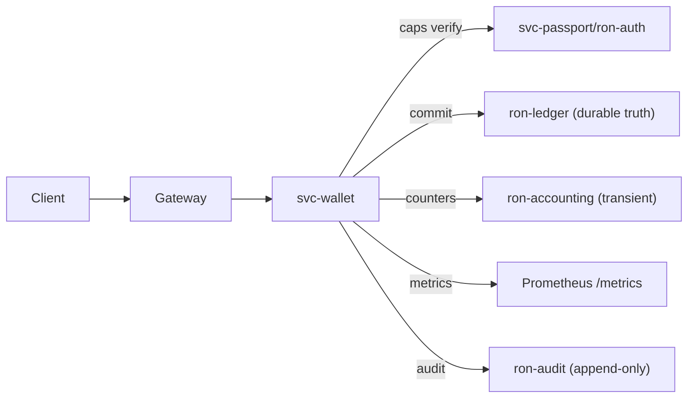

---

title: RUNBOOK — svc-wallet
owner: Stevan White
msrv: 1.80.0
last-reviewed: 2025-09-19
audience: operators, SRE, auditors

# 🛠️ RUNBOOK — svc-wallet

## 0) Purpose

Operational manual for `svc-wallet`: startup, health, diagnostics, failure modes, recovery, scaling, and security ops.
This document satisfies **PERFECTION_GATES** K (Continuous Vigilance) and L (Black Swan Economics).
Role in the stack: **Pillar 12 — Economics & Wallets**. Enforces **no doublespends**, idempotency, and capability-gated access; integrates with `ron-ledger` (durable truth) and `ron-accounting` (transient counters).

---

## 1) Overview

* **Name:** `svc-wallet`
* **Role:** Wallet service for balances and spends; prevents doublespends; sequences/idempotency; orchestrates with `ron-ledger` (settlement), `ron-accounting` (counters), optional `svc-rewarder` (payouts).
* **Criticality Tier:** 1 (critical econ service)
* **Dependencies:**
  `ron-auth`/`svc-passport` (capabilities), `ron-ledger` (truth), `ron-accounting` (counters), `ron-policy`/`svc-registry` (governance/topology), `ron-metrics` (obs), ingress via `svc-gateway`/Omnigate.
* **Ports Exposed:** HTTP control plane for `/healthz`, `/readyz`, `/metrics`, `/version` (binds configurable; defaults below).
* **Data Flows:** Gateway → `svc-wallet` → caps verify → wallet mutation → append commit to `ron-ledger` → update counters (`ron-accounting`) → audit/metrics events.
* **Version Constraints:** Uniform observability surface (health/ready/metrics). No direct kernel API coupling; frozen interface guarantees apply.

**Defaults (recommended):**

```
http_addr           = 0.0.0.0:8080
metrics_addr        = 0.0.0.0:9090
read_timeout_ms     = 3000
write_timeout_ms    = 3000
idle_timeout_ms     = 10000
inflight_ceiling    = 1024
body_max_bytes      = 1_048_576   # 1 MiB
decompress_max_ratio= 10          # 10x
```

**Topology (high-level):**



---

## 2) Startup / Shutdown

### Startup

```
cargo run -p svc-wallet -- --config ./configs/svc-wallet.toml
# or
./target/release/svc-wallet --config /etc/ron/svc-wallet.toml
```

**Env vars:**
`RON_CONFIG`, `AMNESIA=on|off`, `POLICY_FILE`, `REGISTRY_URL`, `LEDGER_SOCK`, `ACCOUNTING_SOCK`.

**Feature flags (build-time examples):**
`arti` (if Tor/Arti transport at edge), `legacy_pay` (if legacy integration toggle exists).

**Verification**

```
curl -fsS http://127.0.0.1:9090/healthz
curl -fsS http://127.0.0.1:9090/readyz
```

Expected: `200 OK` and a JSON body like `{"ready":true,"deps":["ledger","accounting","policy","registry"]}`.

### Shutdown

* `Ctrl-C` (SIGINT) → supervised shutdown; readiness drops before closing listeners (degrade-first).
* systemd: `systemctl stop svc-wallet`.

---

## 3) Health & Readiness

* **/healthz** = liveness.
* **/readyz** = fully serving (policy loaded, registry reachable, ledger socket connected, counters sink available).
* **Ready-under-pressure rule:** write paths fail readiness before collapse; reads may remain available (if configured).
* **If not ready after 10s:**

  * Check supervision/bus events for crash loops.
  * Inspect `rejected_total{reason=...}`, `quota_exhaustions_total`, `ledger_connect_errors_total`.

---

## 4) Common Failure Modes

| Symptom                     | Likely Cause                                 | Metric / Log                           | Resolution                                                     | Alert     |
| --------------------------- | -------------------------------------------- | -------------------------------------- | -------------------------------------------------------------- | --------- |
| 401/403 on spend            | Missing/expired capability                   | `rejected_total{reason="cap"}`         | Re-mint via `svc-passport`; verify TTL/clock skew              | any       |
| 409 conflict on spend       | Out-of-order sequence / idempotency mismatch | `wallet_conflicts_total`               | Read last confirmed seq from ledger; resend with next sequence | >10/min   |
| 5xx on commit               | `ron-ledger` unavailable                     | `ledger_connect_errors_total` + errors | Fail writes (readiness off), restart ledger, replay idempotent | any       |
| Counters drift vs. ledger   | `ron-accounting` lag/flush failure           | `accounting_flush_lag_seconds`         | Force flush; reconcile against ledger snapshot                 | >60s      |
| Slow responses (>150ms p95) | Backpressure / downstream saturation         | `request_latency_seconds`, `inflight`  | Raise concurrency caps cautiously; scale out; verify quotas    | p95>150ms |
| 429/503 under normal load   | Quotas too strict / degraded mode triggered  | `quota_exhaustions_total`              | Tune policy quotas; verify gateway DRR queues                  | >1%       |

**Interop tie-ins:**

* **DTO hygiene:** `ronctl dto lint svc-wallet` before deploy.
* **OAP/1 bounds:** `body_max_bytes=1MiB`, `decompress_max_ratio=10`.
* **Idempotency keys:** required on `POST /wallet/spend`; 409 on replay without key/sequence.

---

## 5) Diagnostics

* **Logs:** structured JSON w/ `service`, `reason`, `corr_id`.
  `journalctl -u svc-wallet -f | grep corr_id=`
* **Metrics:**
  `curl -s http://127.0.0.1:9090/metrics | grep wallet`
* **Policy/Registry:**
  `ronctl policy show` · `ronctl registry show`
* **Tracing:** `RUST_LOG=info` or `debug`; spans propagate via gateway/SDK.
* **Perf Debug:** `cargo flamegraph -p svc-wallet` (attach on regression).

---

## 6) Recovery Procedures

**1) Capability Failures**
Symptom: 401/403.
Action:

```
ronctl cap mint --subject <user> --scopes wallet:* --ttl 900s
# deploy token to client; verify client and service clocks (NTP)
```

**2) Ledger Unavailable**
Symptom: 5xx during commit.
Action:

```
# readiness should already be failing writes
systemctl restart ron-ledger
curl -fsS http://127.0.0.1:9090/readyz
# wallet will replay idempotent commit once ledger is ready
```

**3) Accounting Drift**
Symptom: counters mismatch ledger truth.
Action:

```
ronctl accounting flush
ronctl ledger snapshot --out /tmp/ledger.snap
# reconcile counters from durable snapshot
```

**4) Sequence Mismatch / Conflict**
Symptom: 409 conflicts / doubled attempt.
Action:

```
ronctl wallet seq --account <id>  # read last confirmed seq from ledger
# instruct client to resend with next sequence and idempotency key
```

**5) Policy Hot-Reload**
Symptom: unexpected rejects after policy push.
Action:

```
ronctl policy check /etc/ron/policy.d/wallet.policy.json
kill -HUP $(pidof svc-wallet)   # in-process reload
curl -fsS http://127.0.0.1:9090/readyz
# rollback if needed:
mv /etc/ron/policy.d/wallet.policy.json.bak /etc/ron/policy.d/wallet.policy.json
kill -HUP $(pidof svc-wallet)
```

**6) Amnesia Hygiene (Micronode)**
Symptom: on-disk artifacts with `AMNESIA=on`.
Action: audit temp dirs; verify RAM-only caches; rotate ephemeral keys.

---

## 7) Backup / Restore

* `svc-wallet` has **no durable truth**; truth is in `ron-ledger`.
* **Back up**: ledger DB snapshots (immutable) on schedule.
* **Restore**: stop services → restore ledger snapshot → start ledger → start wallet → reconcile sequences/counters.

---

## 8) Upgrades

* Drain writes by failing `/readyz` for write paths (reads optional).
* Apply migrations if present: `ronctl migrate svc-wallet`.
* Rolling restart; verify: `/readyz` healthy, 0 cap/policy rejects, stable p95 latency for 10m.

**PQ Keys (if enabled via KMS policy):**

```
# rotate hybrid KEM/SIG in KMS first
ronctl kms rotate --hybrid on
ronctl kms status --expect "hybrid=on"
# then roll wallet replicas
```

---

## 9) Chaos Testing

Run:

```
ronctl chaos inject --target svc-wallet --fault=latency
ronctl chaos inject --target svc-wallet --fault=disconnect --dep=ron-ledger
ronctl chaos inject --target svc-wallet --fault=quota_storm
```

**Success Criteria**

```
- 0 economic safety violations (no doublespends/negative balances).
- Readiness degrades within 2s of downstream failure (writes fail w/ 429/503).
- Auto-recovery to ready < 5m after fault removal.
- p95 < 150ms within 10m; error budget burn < 5% in the next hour.
```

---

## 10) Scaling Notes

* **Vertical:** tune per-endpoint concurrency & inflight ceilings; enforce 1 MiB body cap and 10× decompression ratio.
* **Horizontal:** shard by `account_id` (consistent hashing); replicas behind gateway; idempotent commit to ledger.
* **SLO Reference:** aim p95 write confirmation ≤ 150 ms intra-AZ with healthy ledger; watch `inflight` and latency histograms.

---

## 11) Security Ops

* **Caps-only**: every request carries a macaroon capability; rotate periodically; no ambient trust.
* **Key custody:** secrets/keys in KMS; zeroize on drop; **Amnesia** mode uses ephemeral keys.
* **Audit:** economic ops produce append-only audit events (`ron-audit`) separate from metrics/logs.

---

## 12) References

* `CONFIG.md`, `SECURITY.md`, `OBSERVABILITY.md`, `CONCURRENCY.md`, `API.md`, `PERFORMANCE.md`, `INTEROP.md`
* Blueprints: Microkernel, Scaling, Hardening, Developer Suite
* Diagram: `docs/diagrams/wallet_topology.mmd` (in this file above)

---

## ✅ Perfection Gates Checklist

* [ ] **SEC:** caps enforced; keys zeroized; amnesia honored.
* [ ] **RES:** readiness degrades before collapse; supervised restarts clean.
* [ ] **PERF:** p95 write confirmation within envelope; histograms exported; flamegraph on regression.
* [ ] **ECON:** no doublespends; accounting↔ledger reconciliation clean.
* [ ] **DX:** uniform health/metrics surface + structured errors.
* [ ] **GOV:** policy/registry versions loaded; audit stream active.

---

## Appendix A — Example Config (`configs/svc-wallet.example.toml`)

```toml
[service]
name = "svc-wallet"
role = "wallet"

[bind]
http = "0.0.0.0:8080"
metrics = "0.0.0.0:9090"

[timeouts]
read_ms = 3000
write_ms = 3000
idle_ms = 10000

[limits]
inflight = 1024
body_max_bytes = 1048576
decompress_max_ratio = 10

[deps]
ledger_sock = "unix:///var/run/ron/ledger.sock"
accounting_sock = "unix:///var/run/ron/accounting.sock"
registry_url = "http://svc-registry:8080"

[security]
amnesia = "off"            # "on" for Micronode RAM-only posture
require_caps = true
policy_file = "/etc/ron/policy.d/wallet.policy.json"

[metrics]
# histogram buckets tuned for sub-250ms p95
latency_buckets_ms = [5,10,20,30,50,75,100,150,200,250,400,800,1600]

[feature_flags]
tor = false
legacy_pay = false
```

## Appendix B — Prometheus Alert Rules (`ops/alerts/wallet.yml`)

```yaml
groups:
- name: svc-wallet
  rules:
  - alert: WalletHighP95Latency
    expr: histogram_quantile(0.95, sum(rate(request_latency_seconds_bucket{service="svc-wallet"}[5m])) by (le)) > 0.15
    for: 5m
    labels: {severity: warn}
    annotations: {summary: "p95 > 150ms", runbook: "RUNBOOK.md#scaling-notes"}

  - alert: WalletHighP95LatencyPage
    expr: histogram_quantile(0.95, sum(rate(request_latency_seconds_bucket{service="svc-wallet"}[5m])) by (le)) > 0.15
    for: 15m
    labels: {severity: page}
    annotations: {summary: "p95 > 150ms (sustained)", runbook: "RUNBOOK.md#scaling-notes"}

  - alert: WalletErrorRate
    expr: (sum(rate(http_requests_total{service="svc-wallet",status=~"5.."}[5m])) / sum(rate(http_requests_total{service="svc-wallet"}[5m]))) > 0.01
    for: 10m
    labels: {severity: page}
    annotations: {summary: "5xx > 1% for 10m"}

  - alert: WalletSequenceConflicts
    expr: sum(rate(wallet_conflicts_total[1m])) > 10
    for: 10m
    labels: {severity: warn}
    annotations: {summary: "409 conflicts too high; check client sequence"}

  - alert: WalletQuotaStorm
    expr: sum(rate(quota_exhaustions_total[5m])) / sum(rate(http_requests_total[5m])) > 0.01
    for: 10m
    labels: {severity: warn}
    annotations: {summary: "Quota exhaustions >1% for 10m"}

  - alert: WalletLedgerDown
    expr: sum(rate(ledger_connect_errors_total[1m])) > 0
    for: 2m
    labels: {severity: page}
    annotations: {summary: "Ledger connect errors detected"}
```

---
