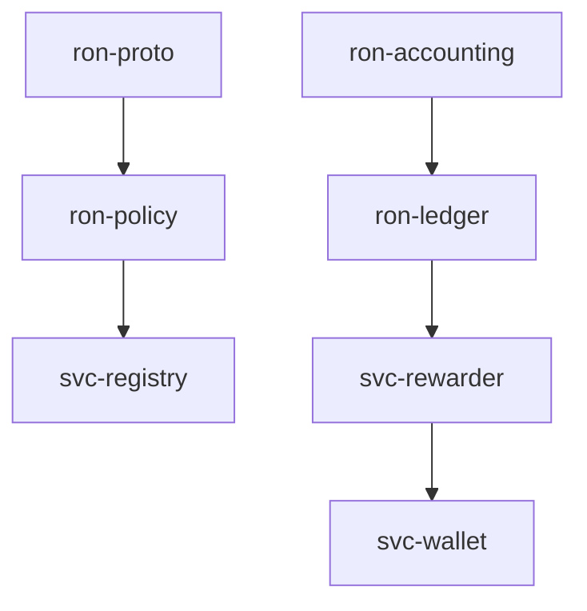
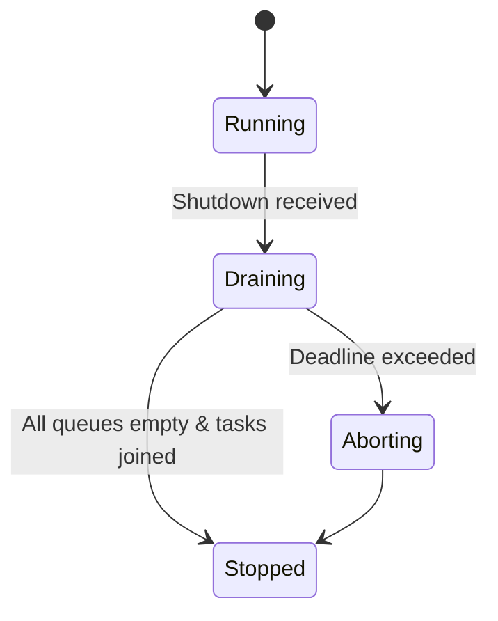
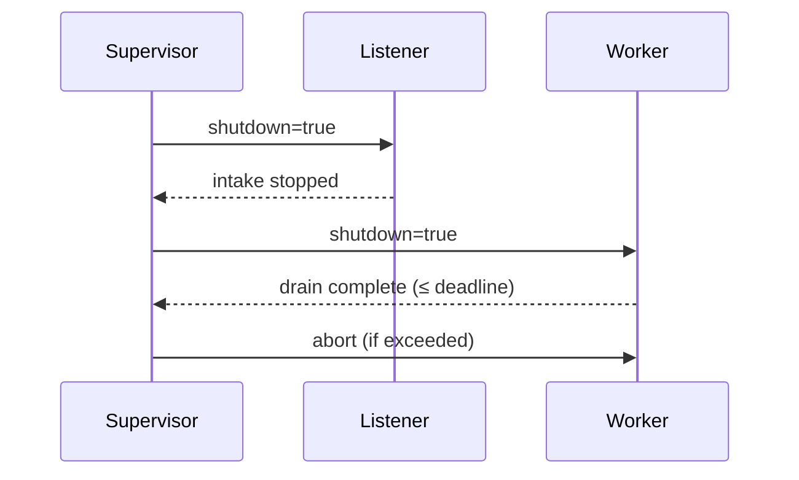
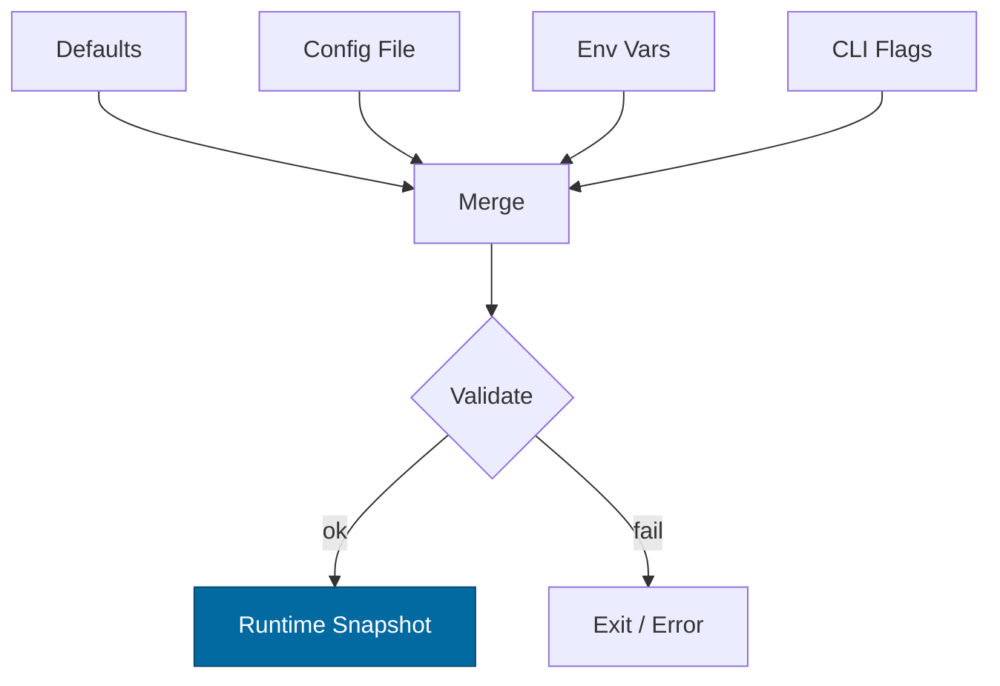
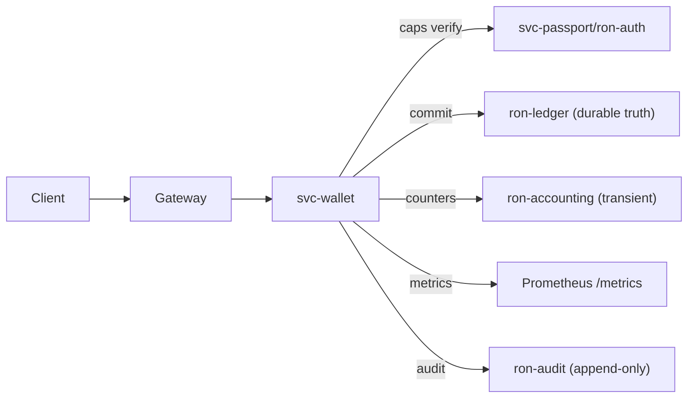

# Combined Markdown

_Source directory_: `crates/svc-wallet/docs`  
_Files combined_: 13  
_Recursive_: 0

---

### Table of Contents

- API.MD
- BUILDPLAN.MD
- CONCURRENCY.MD
- CONFIG.MD
- GOVERNANCE.MD
- IDB.md
- INTEROP.MD
- OBSERVABILITY.MD
- PERFORMANCE.MD
- QUANTUM.MD
- RUNBOOK.MD
- SECURITY.MD
- TESTS.MD

---

## API.MD
_File 1 of 13_

# 📖 API.md — `svc-wallet`

---

title: API Surface & SemVer Reference
status: draft
msrv: 1.80.0
last-updated: 2025-10-16
audience: contributors, auditors, API consumers
-----------------------------------------------

## 0. Purpose

This document captures the **public API surface** of `svc-wallet`:

* Snapshot of exported functions/types (Rust surface) and **HTTP API** (primary contract).
* SemVer discipline: what changes **break** vs. **extend**.
* CI-enforceable via `cargo public-api` (Rust) and **OpenAPI** drift checks (HTTP).
* Single source of truth for external consumers and auditors.

`svc-wallet` is a **service crate**. Its authoritative public contract is the **HTTP API**; the Rust surface is intentionally minimal and not for external embedding.

---

## 1. Public API Surface

### 1.1 Rust surface (binary/service)

`svc-wallet` is a binary crate; it intentionally exposes **no stable Rust API** to other crates.

Generate and assert:

```bash
cargo public-api --simplified --deny-changes -p svc-wallet
```

**Expected snapshot (should be empty or minimal):**

```text
# (binary crate; no exported items intended)
```

> If any symbols appear, treat as **accidental exposure**; make items `pub(crate)` or move behind a private module.

---

### 1.2 HTTP API surface (authoritative)

OpenAPI spec lives at: `docs/openapi/svc-wallet.yaml` (generated from this section).

#### 1.2.1 Conventions

* **Base path:** `/v1`
* **Auth:** `Authorization: Bearer <macaroon>` (capability token)
* **Idempotency:** `Idempotency-Key: <uuid/ulid>` required on **POST** write operations
* **Content-Type:** `application/json; charset=utf-8`
* **Rate limiting headers (if present):** `Retry-After`, `X-RateLimit-*`

#### 1.2.2 Endpoints

| Method | Path            | Auth Scope    | Idempotent | Description                                                             |
| -----: | --------------- | ------------- | ---------- | ----------------------------------------------------------------------- |
|    GET | `/v1/balance`   | `read`        | Yes        | Return effective balance for `{account, asset}` with bounded staleness. |
|   POST | `/v1/issue`     | `issue`       | Via header | Mint asset to account (policy-gated).                                   |
|   POST | `/v1/transfer`  | `transfer`    | Via header | Move amount from `from` → `to`.                                         |
|   POST | `/v1/burn`      | `burn`        | Via header | Destroy (burn) amount from account.                                     |
|    GET | `/v1/tx/{txid}` | `read`        | Yes        | Fetch short receipt by `txid`.                                          |
|    GET | `/healthz`      | none          | Yes        | Liveness.                                                               |
|    GET | `/readyz`       | none          | Yes        | Readiness (fails writes when degraded).                                 |
|    GET | `/metrics`      | none/loopback | Yes        | Prometheus metrics.                                                     |

#### 1.2.3 Schemas (abridged)

```jsonc
// Balance Request: GET /v1/balance?account=<str>&asset=<str>
{
  "account": "acc_abc123",   // query
  "asset":   "ron"           // query
}

// Balance Response
{
  "account": "acc_abc123",
  "asset": "ron",
  "amount_minor": "2500000000000000000", // string-encoded u128
  "as_of": "2025-10-16T16:10:00Z",
  "stale_ms": 120
}

// POST /v1/transfer — Request (serde deny_unknown_fields)
{
  "from": "acc_src",
  "to": "acc_dst",
  "asset": "ron",
  "amount_minor": "250000",   // string u128, >0, ≤ max_amount_per_op
  "nonce": 42                 // u64, per-account, strictly monotonic
}

// Common Receipt (issue/transfer/burn)
{
  "txid": "tx_01JFA.....",
  "op": "transfer",           // enum
  "from": "acc_src",          // optional for issue
  "to": "acc_dst",            // optional for burn
  "asset": "ron",
  "amount_minor": "250000",
  "nonce": 42,
  "idem": "01JFA...ULID",     // echoed Idempotency-Key when present
  "ts": "2025-10-16T16:11:02Z",
  "receipt_hash": "b3-hex..." // BLAKE3(essential fields)
}

// Error model (deterministic)
{
  "code": "INSUFFICIENT_FUNDS", // enum (see table)
  "http": 409,
  "message": "insufficient funds",
  "retryable": false,
  "corr_id": "01JFA...",
  "details": { "asset":"ron" }
}
```

**Error codes (stable enum)**

| code                   | HTTP | Notes                          |
| ---------------------- | ---: | ------------------------------ |
| `BAD_REQUEST`          |  400 | DTO parse/validation failure   |
| `UNAUTHORIZED`         |  401 | Missing/invalid token          |
| `FORBIDDEN`            |  403 | Capability scope denied        |
| `LIMITS_EXCEEDED`      |  403 | Amount/body/ratio ceiling      |
| `INSUFFICIENT_FUNDS`   |  409 | Non-negativity guard           |
| `NONCE_CONFLICT`       |  409 | Nonce reservation failed       |
| `IDEMPOTENT_REPLAY`    |  200 | Prior receipt (same body)      |
| `BUSY`                 |  429 | Backpressure (queue full)      |
| `RETRY_LATER`          |  503 | Degraded/readiness false       |
| `UPSTREAM_UNAVAILABLE` |  503 | Ledger/Auth/Policy unavailable |

> **Determinism:** same input + same `Idempotency-Key` ⇒ **byte-identical** receipt.

#### 1.2.4 Headers

* **Required on POST:** `Idempotency-Key` (ULID/UUID; ≤ 64 bytes).
* **Always accepted:** `X-Corr-ID` (echoed), `Content-Encoding` (subject to ratio cap), `Accept: application/json`.

#### 1.2.5 Examples

```bash
# Transfer
curl -sS -X POST https://wallet/api/v1/transfer \
  -H "Authorization: Bearer <macaroon>" \
  -H "Idempotency-Key: 01JFA1KQ2Q9G2VE8W7" \
  -H "Content-Type: application/json" \
  -d '{"from":"acc_src","to":"acc_dst","asset":"ron","amount_minor":"250000","nonce":42}'
```

```bash
# Balance
curl -sS "https://wallet/api/v1/balance?account=acc_dst&asset=ron" \
  -H "Authorization: Bearer <macaroon>"
```

---

## 2. SemVer Discipline

### Service-facing (HTTP)

**Minor / Non-breaking (safe to do):**

* Add new **optional** fields to responses.
* Add new endpoints or query params with defaults.
* Add new error **codes** while keeping existing behavior.

**Breaking (requires major version bump & `/v2`):**

* Change required request fields or types.
* Remove fields or change semantics.
* Change error **codes**/HTTP statuses for existing cases.
* Make idempotency behavior less permissive (e.g., rejecting previously accepted keys).

**Patch:**

* Documentation clarifications, performance improvements, additional metrics, log/trace fields.

### Rust-facing

* Goal is **no** public Rust surface. If any appears, treat changes under standard Rust SemVer rules, but prefer to remove exposure.

---

## 3. Stability Guarantees

* **MSRV:** `1.80.0`.
* **Idempotency:** POSTs are idempotent with `Idempotency-Key` within configured TTL.
* **Error determinism:** Error code taxonomy is stable; messages are informational.
* **Amounts:** Always string-encoded `u128` in **minor units**; never floats.
* **Auth:** Capability tokens (macaroons) must include correct scope (`issue|transfer|burn|read`), TTL, and account/asset caveats.

---

## 4. Invariants → API Mapping

* **No doublespends (I-1):** `nonce` required for debit-side ops; 409 on conflict; replays return same receipt.
* **Non-negativity (I-2):** `INSUFFICIENT_FUNDS` (409).
* **Conservation (I-3):** Committed receipt reflects append-only ledger entries; `receipt_hash` ties to batch proof.
* **Capability-only (I-4):** 401/403 on missing/insufficient scope.
* **DTO hygiene (I-5):** `deny_unknown_fields` ⇒ 400 `BAD_REQUEST`.
* **Transport bounds (I-11):** 413 for oversize; 400 for ratio cap/decompress errors; 429 for queue backpressure.

---

## 5. Tooling

* **OpenAPI**: source of truth — `docs/openapi/svc-wallet.yaml`.

  * Validated in CI via `openapi-cli`/`spectral`.
  * Contract tests ensure handler ↔ spec parity.

* **Rust surface**: `cargo public-api --deny-changes`.

* **SemVer checks**: optional `cargo semver-checks` on any library subcrates.

* **Doc tests**: curl examples validated via CI smoke (against local harness).

---

## 6. CI & Gates

* **Gate A:** OpenAPI validation passes; diffs are reviewed on PR (bot comment with `/openapi diff`).
* **Gate B:** `cargo public-api` shows **no new public Rust symbols** unless explicitly approved.
* **Gate C:** Backward compatibility tests (golden receipts, error codes) pass.
* **Gate D:** CHANGELOG contains an entry for **any OpenAPI diff**.
* **Gate E:** Idempotency replay suite proves byte-identical receipts.

---

## 7. Acceptance Checklist (DoD)

* [ ] Current **OpenAPI** generated & committed (`docs/openapi/svc-wallet.yaml`).
* [ ] Rust public API snapshot: empty/minimal; CI gate green.
* [ ] Error code table reflected in both docs & handlers.
* [ ] `Idempotency-Key` enforced on POST routes.
* [ ] Examples (`curl`) tested against local harness.
* [ ] CHANGELOG updated for any contract change.
* [ ] Versioned path (`/v1`) correct; plans for `/v2` noted if needed.

---

## 8. Appendix

### 8.1 Minimal OpenAPI skeleton (drop-in)

```yaml
openapi: 3.0.3
info:
  title: svc-wallet API
  version: "1.0.0"
servers:
  - url: https://wallet
paths:
  /v1/balance:
    get:
      operationId: getBalance
      parameters:
        - in: query; name: account; required: true; schema: { type: string }
        - in: query; name: asset;   required: true; schema: { type: string }
      security: [ { bearerAuth: [] } ]
      responses:
        "200": { description: OK, content: { application/json: { schema: { $ref: "#/components/schemas/Balance" }}}}
        "401": { $ref: "#/components/responses/Unauthorized" }
  /v1/transfer:
    post:
      operationId: postTransfer
      security: [ { bearerAuth: [] } ]
      parameters:
        - in: header; name: Idempotency-Key; required: true; schema: { type: string, maxLength: 64 }
      requestBody:
        required: true
        content: { application/json: { schema: { $ref: "#/components/schemas/TransferReq" }}}
      responses:
        "200": { description: OK, content: { application/json: { schema: { $ref: "#/components/schemas/Receipt" }}}}
        "400": { $ref: "#/components/responses/BadRequest" }
        "401": { $ref: "#/components/responses/Unauthorized" }
        "403": { $ref: "#/components/responses/Forbidden" }
        "409": { $ref: "#/components/responses/Conflict" }
        "429": { $ref: "#/components/responses/TooManyRequests" }
        "503": { $ref: "#/components/responses/ServiceUnavailable" }
components:
  securitySchemes:
    bearerAuth: { type: http, scheme: bearer, bearerFormat: JWT }
  schemas:
    AmountU128: { type: string, pattern: "^[0-9]+$" }
    TransferReq:
      type: object
      additionalProperties: false
      required: [from, to, asset, amount_minor, nonce]
      properties:
        from: { type: string }
        to: { type: string }
        asset: { type: string }
        amount_minor: { $ref: "#/components/schemas/AmountU128" }
        nonce: { type: integer, format: int64, minimum: 1 }
    Receipt:
      type: object
      required: [txid, op, asset, amount_minor, ts, receipt_hash]
      properties:
        txid: { type: string }
        op: { type: string, enum: [issue, transfer, burn] }
        from: { type: string }
        to: { type: string }
        asset: { type: string }
        amount_minor: { $ref: "#/components/schemas/AmountU128" }
        nonce: { type: integer, format: int64 }
        idem: { type: string }
        ts: { type: string, format: date-time }
        receipt_hash: { type: string }
    Balance:
      type: object
      required: [account, asset, amount_minor, as_of]
      properties:
        account: { type: string }
        asset: { type: string }
        amount_minor: { $ref: "#/components/schemas/AmountU128" }
        as_of: { type: string, format: date-time }
        stale_ms: { type: integer }
  responses:
    BadRequest:         { description: Bad request }
    Unauthorized:       { description: Unauthorized }
    Forbidden:          { description: Forbidden }
    Conflict:           { description: Conflict }
    TooManyRequests:    { description: Rate limited }
    ServiceUnavailable: { description: Not ready / degraded }
```

### 8.2 References

* Rust SemVer: [https://doc.rust-lang.org/cargo/reference/semver.html](https://doc.rust-lang.org/cargo/reference/semver.html)
* cargo-public-api: [https://github.com/Enselic/cargo-public-api](https://github.com/Enselic/cargo-public-api)
* cargo-semver-checks: [https://github.com/obi1kenobi/cargo-semver-checks](https://github.com/obi1kenobi/cargo-semver-checks)

### 8.3 Perfection Gates tie-in

* **Gate G:** No undocumented API surface (Rust + HTTP).
* **Gate H:** Breaking HTTP changes require `/v2` and major bump.
* **Gate J:** CHANGELOG alignment enforced for any API diff.

### 8.4 History

* `v1` (2025-10-16): Initial stable surface with idempotent POSTs, deterministic errors, and receipts.

---

**TL;DR:** `svc-wallet` is a **binary service**. Keep the Rust surface **private**, and treat the **HTTP contract** as the public API, with idempotent writes, deterministic errors, and OpenAPI as the source of truth.


---

## BUILDPLAN.MD
_File 2 of 13_


---

title: Build Guide — Filling Crates with Code
project: RustyOnions (RON)
version: 1.6.0
status: reviewed
last-updated: 2025-10-14
audience: contributors, leads, ops, auditors
msrv: 1.80.0

---

# Build Guide — Filling Crates with Code

This guide is the single procedure for turning scaffolded files into production-grade Rust across all 33 crates. It assumes each crate’s blueprints and templates (e.g., IDB.md, CONFIG.md, CONCURRENCY.md, and the full set: API.md, CONCURRENCY.md, CONFIG.md, GOVERNANCE.md, IDB.md, INTEROP.md, OBSERVABILITY.md, PERFORMANCE.md, QUANTUM.md, RUNBOOK.md, SECURITY.md, TESTS.md) are complete, along with TODO.md (file tree with one-liners).
Prime directive: ship code that is (1) canon-compliant, (2) provably correct, (3) efficient by profile—not by guess.

---

## 0) Stoplight Gates (make red easy)

* Green = All gates pass.
* Yellow = Non-blocking nits (docs, formatting).
* Red = Any invariant, test, clippy -D warnings, perf regression, or DOM gate fails.

**Run locally (crate-scoped):**

```
cargo build -p <crate> --all-features
cargo test -p <crate> --all-features
cargo clippy -p <crate> --all-features -- -D warnings -W clippy::await_holding_lock -W clippy::perf -W clippy::dbg_macro
cargo llvm-cov -p <crate> --all-features
cargo bench -p <crate> -- --save-baseline main --sample-size 30 --measurement-time 5
cargo +nightly miri test -p <crate> --all-features
cargo +nightly public-api -p <crate> --diff-git-check
cargo +nightly update -Z minimal-versions && cargo build -p <crate> --all-features
rustup toolchain install 1.80.0 && cargo +1.80.0 build -p <crate> --all-features
```

One-command alias: `xtask optimize -p <crate>` (see §13).

---

## 1) Invariants (MUST)

* **Canon boundaries:** No new crates; no role leakage (e.g., rewarder never mutates ledger).
* **Safety:** `unsafe` requires `// SAFETY:` + targeted test; prefer borrowing; no panics in hot paths; no global state/singletons.
* **Precision:** No floats in money/consensus; use integers or fixed-point with lossless conversions.
* **Concurrency:** No locks across `.await`; bounded queues; cooperative cancellation; shutdown drains.
* **Config:** All tunables are loaded & validated per CONFIG.md; fail-closed on bad config.
* **Observability:** Metrics and health/readiness (if service); no secrets in logs/metrics.
* **Proof:** Every IDB invariant maps to at least one test or property; conservation asserts where applicable.
* **Efficiency:** Avoid needless alloc/copies on hot paths; profile before micro-optimizing.
* **Conditional Data-Oriented Law:** When a hot path manipulates bulk homogeneous data (scans, intersections, reductions), it **must** prefer a contiguous, alias-free layout (flat arrays/bitsets/SoA) or provide a benchmark + flamegraph proving no measurable gain (see §5 and §10A).

---

## 2) Design Principles (SHOULD)

* **Purity first:** Core logic is pure, IO lives in adapters; tiny public surface.
* **Ownership zen:** Prefer stack data; `&str`/slices/`Bytes`; `Arc` only for shared immutable.
* **Readability:** Clear names; public items have rustdoc; macros only when removing boilerplate.
* **Perf by measurement:** criterion + flamegraph; `rayon` or `portable-simd` only after profiling.
* **Security hygiene:** `serde(deny_unknown_fields)`, zeroize secrets, least-privilege caps.
* **TDD cadence:** Test/spec first for each file in TODO.md; implementation next.
* **Forward-proof:** Version DTOs; feature-gate heavy deps; SemVer guarded by API snapshot.

---

## 3) Per-Crate Build Method (bottom-up)

Build all 33 crates in dependency order (see §14 for graph); parallelize non-deps. Per crate:

1. **Prep (10–20%)**

   * Read all 12 templates (IDB invariants, CONFIG knobs, CONCURRENCY tasks, SECURITY hygiene, etc.); scan TODO.md.
   * Turn on CI teeth: clippy -D warnings, coverage floor, benches, deny rules (see §7).
   * Create/refresh API snapshot (if library API visible).

2. **Core Logic (40%)**

   * Implement pure functions/modules promised by TODO.md.
   * Property tests for invariants (ordering, conservation, idempotency, etc.).
   * Add a micro-bench for the hottest pure path; set initial baseline.

3. **Adapters & Concurrency (20%)**

   * Thin IO adapters with explicit timeouts and bounded channels per CONCURRENCY.md.
   * Honor config keys; wire metrics. No locks across `.await`.

4. **Service Wiring (10%)** (service crates only)

   * Supervisor, routes, health/ready, metrics. Graceful shutdown and backpressure.

5. **Polish & Verify (10–20%)**

   * Fuzz decoders; Loom model if concurrency primitives exist; miri for UB.
   * Flamegraph; fix top 1–2 hot spots or document “as intended.”
   * **DOM pass (if applicable):** apply §10A; keep only if it clears the gates.
   * Re-run gates; update CHANGELOG.md; refresh API snapshot.

---

## 4) Per-File Definition of Done (DoD)

Tie each file directly to a check. Update TODO.md only when DoD is green.

**File (from TODO.md) → DoD (tests/gates)**

* **README.md** → Invariants + quickstart match code; links to docs; `cargo test --doc` passes.
* **docs/API.md** → Public surface matches code; examples compile.
* **docs/CONCURRENCY.md** → Channel caps/locks match code; “no lock across .await” example included.
* **docs/CONFIG.md** → All keys exist in code; `Config::validate()` enforces rules; reload semantics documented.
* **docs/GOVERNANCE.md** → Policy hooks implemented; audit events emitted.
* **docs/IDB.md** → Each invariant references specific test(s) by file name.
* **docs/INTEROP.md** → DTOs/protocols match code; compatibility tests present.
* **docs/OBSERVABILITY.md** → Metrics/endpoints match code; scrape verified.
* **docs/PERFORMANCE.md** → Benches match documented budgets; flamegraph baselines checked in.
* **docs/QUANTUM.md** → PQ/hybrid mode tested (or mark N/A explicitly).
* **docs/RUNBOOK.md** → Error handling/shutdown matches code; triage flows tested.
* **docs/SECURITY.md** → Hygiene enforced; vuln scans clean.
* **docs/TESTS.md** → Unit/property/fuzz strategies implemented; coverage meets floor.
* **src/lib.rs** → Minimal re-exports; public rustdoc complete; public-api snapshot matches or CHANGELOG bumped.
* **core/*.rs** → Pure (no IO/time/global); unit + property tests; micro-bench present; **if compute-heavy, DOM proof attached** (see §10A).
* **adapters/*.rs** → Typed errors; timeouts; metrics; no panics; fuzz tests for parsers/DTOs.
* **errors.rs** → `thiserror` enums; error taxonomy matches IDB (Retryable/Fatal/Quarantine).
* **config.rs** → Defaults + validate(); env/CLI/file merge covered by tests.
* **metrics.rs** → No global registry leakage; labels stable; Prometheus scrape verified.
* **bin/main.rs (svc)** → Supervisor, readiness/health; graceful shutdown proven by test or harness.
* **tests/** → One invariant per file; names mirror IDB labels; coverage meets floor.
* **benches/** → Criterion baselines checked in; regression threshold enforced in CI.

---

## 5) Efficiency Checklist (per PR)

* **Allocs:** No `to_string()`/`collect()` in hot loops; pre-size `Vec::with_capacity`; prefer slices/`Bytes`.
* **Copy elision:** Avoid cloning large structs; pass by reference; use `Cow` if needed.
* **Branches:** Keep hot path straight; move error mapping to `#[cold]` fns.
* **Iterators:** Use adapters to avoid temp allocations; favor clarity over overly clever chains.
* **Serde:** `deny_unknown_fields`; integers for money; avoid `String` when `&str` suffices.
* **Concurrency:** Bounded channels; `try_send` + `Busy` over buffering; `spawn_blocking` only for true blocking.
* **Compile flags:** `-C target-cpu=native` in dev only (not in release artifacts unless policy permits).
* **DOM preference (conditional):** For bulk homogeneous work, prefer flat arrays/bitsets/SoA and batch inner loops to SIMD width (see §10A).

---

## 6) Review Checklist (lead sign-off)

* Invariants concretely enforced? (asserts/tests)
* API surface minimal, documented, and snapshotted?
* No new deps or features outside workspace policy?
* Performance deltas understood (flamegraph/bench report attached)?
* Logs/metrics safe (no secrets), cardinality bounded?
* Shutdown and backpressure proven (test or harness)?
* **DOM applied where applicable?** (If declined, PR includes benchmark + flamegraph showing <10% gain.)

Reject if any red; request changes if perf floor/ceiling unexplained.

---

## 7) Enforcement Teeth (CI + Lints)

**Clippy & warnings (blocking):**

```
cargo clippy -p <crate> --all-features -- -D warnings -W clippy::await_holding_lock -W clippy::perf -W clippy::dbg_macro
```

**Coverage floor:** `cargo llvm-cov -p <crate> --all-features`

* libs: ≥80% line
* services: ≥70% overall, ≥80% core

**Benchmark guard:** compare criterion JSON to baseline; fail on >15% regression unless waived.

**Dependencies:** `cargo deny check` + `cargo +nightly udeps -p <crate>` → no unused/vuln deps.

**API stability (libs):** `cargo +nightly public-api -p <crate> --diff-git-check` (bump SemVer if changed).

**Unsafe gate:** grep for `unsafe` → requires “SAFETY” comments + test IDs in commit.

**Panic audit:** deny `unwrap`/`expect` outside tests/benches/examples or behind `#[cfg(debug_assertions)]` (use `debug_assert!`).

**Forbidden patterns:** no global singletons (deny `lazy_static!`, `once_cell::sync::Lazy`, `static mut`); no new workspace members; no float in money paths.

**UB detection:** `cargo +nightly miri test -p <crate> --all-features` in CI (allow-failure or per-crate opt-out via metadata until green).

**MSRV floor:** `rustup toolchain install 1.80.0 && cargo +1.80.0 build -p <crate> --all-features`.

**Minimal-versions (dep floor):**

```
cargo +nightly update -Z minimal-versions
cargo build -p <crate> --all-features
git checkout -- Cargo.lock
```

**Lockfile guard:** `git diff --exit-code Cargo.lock`.

**Doc links:** `cargo doc -p <crate> --no-deps -Z rustdoc-map` + `lychee` (e.g., `lychee --max-retries 3 --backoff 2s --no-external`) on docs/.

**Platform matrix (CI):**

* os: `ubuntu-latest`
* target: `x86_64-unknown-linux-gnu`, `aarch64-unknown-linux-gnu`

**Workspace .cargo/config.toml (local -D warnings):**

```
[build]
rustflags = ["-D", "warnings"]
```

---

## 8) Mapping IDB → Tests (traceability)

Maintain `docs/_matrix.md` with rows like:

```
I-1 (Canon boundary) -> tests/api_surface.rs
I-3 (Conservation)   -> tests/conservation_prop.rs
I-5 (No lock .await) -> clippy + loom
I-8 (Backpressure)   -> tests/backpressure_busy.rs
```

**CI check (build.rs): robust regex, filename convention `tests/i_*_.rs`:**

```rust
use regex::Regex;
fn main() {
    let idb = std::fs::read_to_string("docs/IDB.md").unwrap();
    let re = Regex::new(r"-\s*\[I-(\d+)\]").unwrap();
    let mut invariants = vec![];
    for cap in re.captures_iter(&idb) { invariants.push(cap[1].to_string()); }
    let tests_dir = std::fs::read_dir("tests").unwrap();
    let mut covered = vec![];
    for entry in tests_dir {
        let path = entry.unwrap().path();
        if path.is_file() && path.file_name().unwrap().to_str().unwrap().starts_with("i_") {
            let stem = path.file_stem().unwrap().to_str().unwrap();
            if let Some(n) = stem.strip_prefix("i_").and_then(|s| s.split('_').next()) {
                covered.push(n.to_string());
            }
        }
    }
    let missing: Vec<_> = invariants.iter().filter(|i| !covered.contains(i)).collect();
    if !missing.is_empty() { panic!("Missing tests for invariants: {:?}", missing); }
}
```

---

## 9) Property, Fuzz, Loom (when to use)

* **Property tests:** invariants over wide input (ordering, conservation, idempotency).
* **Fuzz targets:** decoders/parsers (DTOs, manifests). 60–120s per target on PR (`-max_total_time=60`).
* **Loom:** if the crate creates/uses channels or locks internally; model 1–2 key interleavings.
* **Miri:** Always in CI for UB detection (allow-failure or opt-out per crate until green).

**Determinism:** save failing proptest seeds to `artifacts/proptest-seeds.txt`; re-run in CI. Archive fuzz crashing inputs under `artifacts/fuzz/<crate>/`.

---

## 10) Performance Workflow

1. Add criterion bench for the hottest path.
2. Run `cargo flamegraph` for a representative workload.
3. Identify top 2 hot symbols; optimize or document “as intended.”
4. Commit baselines JSON; CI enforces ±15% budget:

```
cargo bench -p <crate> -- --baseline main --sample-size 30 --measurement-time 5
```

Tip: use `critcmp` locally for diffs.

### 10A) Data-Oriented Layout & SIMD (DOM) — Method and Gates

**When to apply:** the code performs bulk scans/intersections/reductions over homogeneous data (e.g., fan-out routing, capability checks, epoch math, ledger scans, metrics aggregation).

**Preferred representations (internal, not API):**

* **Flat arrays** (`Vec<T>`) with row/column order chosen so the *innermost* loop walks **stride-1**.
* **Bitsets/bitmasks** for membership and intersections (`u64` words, `bitvec`, or `portable-simd` masks).
* **Struct-of-Arrays (SoA)** for queues/tables scanned in bulk; headers AoS + payload SoA if messages vary.
* **Batching** to SIMD width (use `array_chunks` or manual chunking); branch-free masks in hot loops.
* **Cache-friendly search** (Eytzinger layout) or perfect hash for static keys.

**SIMD guidance:**

* Start with clean loops over slices; rely on auto-vectorization first.
* If needed, use `portable-simd` behind a feature flag (e.g., `features = ["simd"]`); keep small, contained intrinsics.

**Gates to keep or roll back:**

* **Win required:** ≥15% p95 latency reduction **or** ≥20% throughput gain **for the targeted hotspot** (Criterion diff vs baseline).
* **No regressions:** memory ≤ +10%; allocs on hot path do not increase; coverage/lints stay green.
* **Proof bundle:** before/after flamegraphs highlighting the reduced hot frames + bench report in PR.
* **Containment:** no public API changes; no governance/interop shifts; feature-gated where heavy.

**Anti-patterns (reject unless proven otherwise):**

* Dense 2D tables for extremely sparse data (prefer CSR/roaring-bitmaps).
* HashMap in top-10 frames of a hot loop (replace with fixed arrays or perfect hash).
* Rayon on async tasks (parallelize pure compute only; cap threads to avoid oversubscription).

---

## 11) Drift Guards & Governance

* **SemVer snapshot:** keep `docs/api-history/<crate>/vX.Y.Z.txt` current.
* **CHANGELOG discipline:** features/fixes/perf changes with PR links.
* **Review cadence:** every 90 days or any time invariants/tests change.
* **No scope creep:** if a file’s purpose (from TODO.md) doesn’t match needed code, amend TODO.md + IDB.md first, then implement.
* **Dep policy (denylist):** `ring`/`openssl`/`chrono`/`lazy_static` denied unless approved (cargo-deny config).

---

## 12) Quickstart “per file” micro-flow (repeat for each file)

1. Re-read the file’s one-liner in TODO.md.
2. Write a minimal test (or property) that proves the behavior.
3. Implement the smallest code to make it pass.
4. Run gates (tests, clippy, cov); keep perf neutral.
5. Add rustdoc & example if public API.
6. If compute-heavy, run DOM experiment (§10A); keep only if it clears gates.
7. Commit: `feat(<file>): implement as per IDB [tests: ...]`.

---

## 13) Appendix — Toolbelt & xtask

**Toolbelt:** rust-analyzer, cargo-watch, cargo-llvm-cov, cargo-deny, cargo-udeps, criterion, cargo-fuzz, cargo-flamegraph, cargo-public-api, cargo-miri, critcmp, lychee.

**xtask optimize (Cargo.toml alias or src/bin/xtask.rs):**

```rust
use std::process::Command;
fn main() -> anyhow::Result<()> {
    let crate_name = std::env::args().nth(1).unwrap_or("svc-rewarder".into());
    Command::new("cargo").args(["build", "-p", &crate_name, "--all-features"]).status()?;
    Command::new("cargo").args(["test", "-p", &crate_name, "--all-features"]).status()?;
    Command::new("cargo").args(["clippy", "-p", &crate_name, "--all-features", "--", "-D", "warnings"]).status()?;
    Command::new("cargo").args(["llvm-cov", "-p", &crate_name, "--all-features"]).status()?;
    Command::new("cargo").args(["bench", "-p", &crate_name, "--", "--save-baseline", "main", "--sample-size", "30", "--measurement-time", "5"]).status()?;
    Command::new("cargo").args(["+nightly", "miri", "test", "-p", &crate_name, "--all-features"]).status()?;
    Command::new("cargo").args(["+nightly", "public-api", "-p", &crate_name, "--diff-git-check"]).status()?;
    Ok(())
}
```

---

## 14) Crate Dependency Order (Mermaid for parallel builds)



**Text:** Foundational (ron-proto) → policy/registry → accounting/ledger → rewarder/wallet; parallelize non-deps (e.g., Linux/aarch64 in CI).

---

**This version bakes the data-oriented methodology into the invariants, checklists, DoD, CI gates, and perf workflow—so every crate gets the wins when applicable, and changes are self-policed by proof, not taste.**


---

## CONCURRENCY.MD
_File 3 of 13_


---

---

title: Concurrency Model — svc-wallet
crate: svc-wallet
owner: Stevan White
last-reviewed: 2025-10-16
status: draft
template_version: 1.1
msrv: 1.80.0
tokio: "1.x (pinned at workspace root)"
loom: "0.7+ (dev-only)"
lite_mode: "N/A (service)"
--------------------------

# Concurrency Model — svc-wallet

This document makes the concurrency rules **explicit**: tasks, channels, locks, shutdown, timeouts,
and validation (property/loom/TLA+). It complements `docs/SECURITY.md`, `docs/CONFIG.md`,
and the crate’s `README.md` and `IDB.md`.

> **Golden rule:** never hold a lock across `.await` in supervisory or hot paths.

---

## 0) Lite Mode

N/A — `svc-wallet` is a networked **service** with background tasks.

---

## 1) Invariants (MUST)

* **No lock across `.await`.** Split critical sections; capture data, drop guard, then await.
* **Single writer** per mutable resource (per-account nonce sequence; idempotency store entry).
* **Bounded channels only** (mpsc/broadcast/watch); every queue has a capacity and drop policy.
* **Explicit timeouts** for all I/O and RPCs; fail-fast with typed errors.
* **Cooperative cancellation**: every `.await` is cancel-safe or guarded by `select!`.
* **Graceful shutdown**: observe `Shutdown`; stop intake, drain within deadline, abort stragglers.
* **No blocking syscalls** on the async runtime; use `spawn_blocking` if absolutely required.
* **No task leaks**: all spawns are supervised or joined; detaches require rationale.
* **Backpressure over buffering**: reject/busy instead of growing queues.
* **Framing**: HTTP/OAP limits enforced (1 MiB body, ≤10× decompress); partial reads handled.
* **Async Drop discipline**: do **not** block in `Drop`; expose `async close()/shutdown()` for teardown.

---

## 2) Runtime Topology

**Runtime:** Tokio multi-threaded (worker-stealing), opt-in I/O drivers only.

**Primary tasks (steady-state):**

* **Supervisor**

  * Owns shutdown `watch` channel and spawn lifecycle.
  * Exposes `/healthz`, `/readyz` snapshots (read-only, lock-free).
* **HTTP Listener**

  * Accepts connections; enforces limits/timeouts; routes to handlers.
  * Pushes ledger-bound operations into **Commit Queue** when backpressure is required.
* **Worker Pool (Committers, size = CPU or config)**

  * Pulls from **Commit Queue**; performs `ron-ledger` RPCs with retries/circuit-breaker.
  * Emits **Audit Events** (non-blocking, lossy-ok).
* **Cache Invalidator**

  * Subscribes to **Ledger Bus** (broadcast) and invalidates balance snapshots.
* **Metrics Ticker**

  * Samples queue depth, inflight workers; exports Prometheus gauges.

```mermaid
flowchart TB
  subgraph Runtime
    S[Supervisor] -->|spawn| H[HTTP Listener]
    S -->|spawn| W[Worker Pool N]
    S -->|spawn| I[Cache Invalidator]
    S -->|spawn| M[Metrics Ticker]

    H -->|mpsc work(512)| W
    W -->|broadcast events(1024)| A[Audit Stream]
    I --> C[Balance Cache]

    S -->|watch Shutdown| H
    S -->|watch Shutdown| W
    S -->|watch Shutdown| I
    S -->|watch Shutdown| M
  end
  style S fill:#0ea5e9,stroke:#0c4a6e,color:#fff
```

**Text:** Supervisor spawns HTTP Listener, Worker Pool, Cache Invalidator, and Metrics Ticker. Listener feeds a bounded work queue to the Worker Pool. Workers publish audit events (lossy). Invalidator listens to ledger bus to keep the balance cache hot and coherent. All tasks observe a Shutdown watch channel.

---

## 3) Channels & Backpressure

**Inventory (all bounded):**

| Name           | Kind      | Capacity | Producers → Consumers | Backpressure Policy          | Drop Semantics                                |
| -------------- | --------- | -------: | --------------------- | ---------------------------- | --------------------------------------------- |
| `work_tx`      | mpsc      |      512 | HTTP(N) → Workers(M)  | `try_send` else **Busy/429** | No enqueue; increment `busy_rejections_total` |
| `events_tx`    | broadcast |     1024 | Workers(1..N) → N     | Drop oldest (lag)            | Incr `bus_lagged_total`; warn                 |
| `shutdown_rx`  | watch     |        1 | Supervisor → N        | Last-write-wins              | N/A                                           |
| `ledger_bus`   | broadcast |     1024 | Ledger client → N     | Drop oldest (lag)            | Incr `bus_lagged_total{bus="ledger"}`         |
| `metrics_tick` | interval  |        — | Timer → Metrics       | Fixed cadence (e.g., 1s)     | N/A                                           |

**Guidelines**

* Always prefer `try_send` + typed error (`Busy`) over async send that might stall the Listener.
* Keep **depth gauges** and **dropped counters** for each queue; alarms on sustained pressure.

---

## 4) Locks & Shared State

**Allowed**

* Short-lived `Mutex/RwLock` for configuration snapshot swapping; **no `.await` under guard**.
* `DashMap<AccountPrefix, AtomicU64>` for **nonce sequences** (fetch-update; lock-free).
* `Arc<IdemStore>` for **idempotency receipts** (bounded LRU + TTL; internal sharding).
* `Arc<StateSnapshot>` read-mostly structures for /healthz,/readyz and config.

**Forbidden**

* Holding any lock across `.await`.
* Nested locks without an explicit hierarchy and justification.

**Hierarchy (if you must nest; highest first)**

1. `cfg_snapshot`
2. `balance_cache` (read)
3. `metrics_state`

---

## 5) Timeouts, Retries, Deadlines

* **HTTP I/O:** `read=5s`, `write=5s`, `idle=60s` (configurable).
* **Request deadline:** total handler deadline ≤ `REQ_TIMEOUT` (default 5s).
* **Upstreams (ledger/auth/policy):**

  * Per-RPC timeout ≤ 1s.
  * Retries: **idempotent** ops only (commit path wraps with **idempotency** anyway); jittered exponential backoff (50ms → 1s cap, factor 2.0, jitter 20ms), max 3 tries.
  * Circuit breaker: **open** on rolling error threshold (default 20) for 5s; **half-open** with 10 probes.

```mermaid
sequenceDiagram
  autonumber
  participant C as Client
  participant L as Listener
  participant W as Worker
  C->>L: POST /v1/transfer (deadline=5s)
  alt work queue has room
    L->>W: enqueue (try_send)
    W->>W: reserve nonce + check balance (no lock across await)
    W->>Ledger: commit (timeout 1s; retries/backoff)
    W-->>L: Receipt
    L-->>C: 200 OK + receipt
  else queue full
    L-->>C: 429 Busy (Retry-After)
  end
```

---

## 6) Cancellation & Shutdown

* **Trigger:** `KernelEvent::Shutdown` or `wait_for_ctrl_c()`.
* **Propagation:** `watch<bool>`; handlers and workers use `tokio::select!` against `shutdown_rx.changed()`.
* **Draining:** stop accepting writes; allow in-flight jobs to complete within **drain_deadline** (config: 1–5s).
* **Abort:** workers exceeding deadline get `handle.abort()`; increment `tasks_aborted_total{kind="worker"}`.
* **Idempotency:** replays after restart return the same receipt when within TTL; no partial state leaks.



---

## 7) I/O & Framing

* **HTTP/1.1** (Axum/Tower). Enforce:

  * `max_body_bytes = 1 MiB`
  * `safe_decompress ≤ 10×`
  * `content-type` must match handler.
* **Read/Write:** use `AsyncReadExt/AsyncWriteExt`; call `.shutdown().await` on close.
* **Partial reads:** handlers tolerate split frames and early disconnects; all errors are typed.

---

## 8) Error Taxonomy (Concurrency-Relevant)

| Error                 | When                         | Retry?      | Metric                            | Notes                  |
| --------------------- | ---------------------------- | ----------- | --------------------------------- | ---------------------- |
| `Busy`                | `work_tx` full               | caller-dec  | `busy_rejections_total{endpoint}` | 429 with `Retry-After` |
| `Timeout`             | I/O or RPC deadline exceeded | sometimes   | `io_timeouts_total{op}`           | Include `op` label     |
| `Canceled`            | Shutdown during wait/work    | no          | `tasks_canceled_total{kind}`      | Clean cancel           |
| `Lagging`             | broadcast overflow           | no          | `bus_lagged_total{bus}`           | Slow consumer detected |
| `UpstreamUnavailable` | breaker open / network fail  | yes (later) | `upstream_fail_total{svc}`        | Surface 503 retryable  |

---

## 9) Metrics (Concurrency Health)

* `queue_depth{queue}` gauge (work)
* `queue_dropped_total{queue}` counter (work/events)
* `busy_rejections_total{endpoint}` counter
* `tasks_spawned_total{kind}` / `tasks_aborted_total{kind}` counters
* `io_timeouts_total{op}` counter (`read`,`write`,`connect`,`ledger_rpc`)
* `backoff_retries_total{svc,op}` counter
* `bus_lagged_total{bus}` counter
* `worker_inflight` gauge

---

## 10) Validation Strategy

**Unit / Property**

* **Backpressure:** enqueue until `work_tx` full → `Busy`; `queue_depth` and `busy_rejections_total` advance deterministically.
* **Nonce atomicity:** concurrent reservations on same account/nonce → at most one success (`fetch_update`).
* **Idempotency:** repeated requests with same key → identical receipt; counter increments.
* **Deadline:** operations honor timeouts within ±10% tolerance.

**Loom (dev-only)**

* Model: 2 producers → mpsc(2) → 2 consumers + shutdown.
* Asserts: no deadlocks, no lost wakeups, shutdown always observed, no double-apply.

**Fuzz**

* HTTP payload fuzz (sizes, compression ratios, malformed JSON).
* Handler state machine fuzz (issue/transfer/burn interleavings).

**Chaos**

* Induce upstream stall (ledger+=2s): `/readyz` flips; POST=503; GET `/balance` stays 200; queues drain on recovery.
* Kill/restart worker tasks under load; no task leak; supervisor backoff respected.

**(Optional) TLA+**

* Safety: at-most-once commit per `(account,nonce)`; Conservation invariant.
* Liveness: eventually drains under finite arrivals.

---

## 11) Code Patterns (Copy-Paste)

**Spawn + cooperative shutdown**

```rust
let (shutdown_tx, shutdown_rx) = tokio::sync::watch::channel(false);

let worker = {
  let mut rx = work_rx;
  let mut shutdown_rx = shutdown_rx.clone();
  tokio::spawn(async move {
    loop {
      tokio::select! {
        _ = shutdown_rx.changed() => break,
        maybe_job = rx.recv() => {
          let Some(job) = maybe_job else { break };
          if let Err(e) = handle_job(job).await {
            tracing::warn!(error=%e, "job failed");
          }
        }
      }
    }
  })
};
```

**Bounded mpsc with `try_send` (backpressure)**

```rust
match work_tx.try_send(job) {
  Ok(()) => {}
  Err(tokio::sync::mpsc::error::TrySendError::Full(_job)) => {
    metrics::busy_rejections_total("transfer").inc();
    return Err(Error::Busy);
  }
  Err(e) => return Err(Error::InternalQueue(e.to_string())),
}
```

**No lock across `.await`**

```rust
let nonce = {
  // reserve atomically without holding an async lock
  seq::reserve_atomic(&nonces, &account, requested_nonce)?
};
// do async work after the guard is dropped / atomic op done
let receipt = ledger::commit_transfer(&client, &req).await?;
```

**Timeout with deadline**

```rust
let res = tokio::time::timeout(cfg.read_timeout, read_frame(&mut stream)).await;
```

**Async Drop pattern**

```rust
pub struct Client { inner: Option<Conn> }

impl Client {
  pub async fn close(&mut self) -> anyhow::Result<()> {
    if let Some(mut c) = self.inner.take() {
      c.shutdown().await?;
    }
    Ok(())
  }
}

impl Drop for Client {
  fn drop(&mut self) {
    if self.inner.is_some() {
      tracing::debug!("Client dropped without close(); resources reclaimed");
    }
  }
}
```

---

## 12) Configuration Hooks (Quick Reference)

* `max_conns`, `read_timeout`, `write_timeout`, `idle_timeout`
* `limits.max_body_bytes`, `limits.decompress_ratio_cap`, `limits.rate_per_second`, `limits.burst`
* `wallet.staleness_window`, `wallet.idempotency_ttl`, `wallet.shards`
* `retry.*`, `circuit_breaker.*`
* `drain_deadline` (shutdown window; defined in service config)

**See `docs/CONFIG.md` for authoritative schema and defaults.**

---

## 13) Known Trade-offs / Nonstrict Areas

* **Audit bus is lossy** by design (broadcast overflow drops oldest) to protect hot paths; durable audit belongs to `ron-ledger` / `ron-audit`.
* **Balance reads** tolerate a **≤250 ms** staleness window for performance; commit path always re-validates.
* **Busy vs drop-oldest:** Listener prefers **rejecting new** (429) to preserve fairness and latency SLAs.

---

## 14) Mermaid Diagrams

### 14.1 Task & Queue Topology

```mermaid
flowchart LR
  IN[HTTP Listener] -->|mpsc work(512)| W1[Worker A]
  IN -->|mpsc work(512)| W2[Worker B]
  subgraph Control
    SHUT[Shutdown watch] --> IN
    SHUT --> W1
    SHUT --> W2
  end
  W1 -->|broadcast events(1024)| AUD[Audit Stream]
  W2 -->|broadcast events(1024)| AUD
```

**Text:** Listener feeds two Workers via bounded mpsc; a Shutdown watch notifies both. Workers publish audit events via broadcast (lossy-ok).

### 14.2 Shutdown Sequence



---

## 15) CI & Lints (Enforcement)

**Clippy/lints**

* `-D warnings`
* `-W clippy::await_holding_lock`
* `-W clippy::useless_async`
* `-W clippy::needless_collect`

**Suggested GitHub Actions**

```yaml
name: concurrency-guardrails
on: [push, pull_request]
jobs:
  clippy:
    runs-on: ubuntu-latest
    steps:
      - uses: actions/checkout@v4
      - uses: dtolnay/rust-toolchain@stable
      - run: cargo clippy -p svc-wallet -- -D warnings -W clippy::await_holding_lock

  loom:
    if: github.event_name == 'pull_request'
    runs-on: ubuntu-latest
    steps:
      - uses: actions/checkout@v4
      - uses: dtolnay/rust-toolchain@stable
      - run: RUSTFLAGS="--cfg loom" cargo test -p svc-wallet --tests -- --ignored

  fuzz:
    runs-on: ubuntu-latest
    steps:
      - uses: actions/checkout@v4
      - uses: dtolnay/rust-toolchain@stable
      - run: cargo install cargo-fuzz
      - run: cargo fuzz build -p svc-wallet
```

---

## 16) Schema Generation (Optional, Nice-to-Have)

Automate **Channels/Locks tables** from code:

* Annotate queue construction with a doc macro (or a simple helper that records name/capacity/policy).
* Unit test compares the generated registry with this doc’s table (golden test) to avoid drift.

---

## 17) Review & Maintenance

* **Review cadence:** every 90 days or when tasks/channels/locks change.
* Keep `owner`, `msrv`, and `last-reviewed` current.
* PRs that change concurrency **must** update this file + related loom/property/chaos tests.

---


---

## CONFIG.MD
_File 4 of 13_


---

---

title: Configuration — svc-wallet
crate: svc-wallet
owner: Stevan White
last-reviewed: 2025-10-16
status: draft
template_version: 1.0
---------------------

# Configuration — svc-wallet

This document defines **all configuration** for `svc-wallet`, including sources,
precedence, schema (types/defaults), validation, feature flags, live-reload behavior,
and security implications. It complements `README.md`, `docs/IDB.md`, and `docs/SECURITY.md`.

> **Tiering:**
> `svc-wallet` is a **service** crate; all service sections apply (network, readiness, observability, etc.).

---

## 1) Sources & Precedence (Authoritative)

Configuration may come from multiple sources. **Precedence (highest wins):**

1. **Process flags** (CLI)
2. **Environment variables**
3. **Config file** (TOML preferred; `--config` path can be relative)
4. **Built-in defaults** (hard-coded)

**Supported file formats:** TOML (preferred), JSON (optional).
**Path resolution for `--config` (if relative):** `./`, `$CWD`, crate dir.

**Dynamic reload:** When reloading, the effective config is recomputed under the **same precedence**.

---

## 2) Quickstart Examples

### 2.1 Minimal service start

```bash
RUST_LOG=info \
SVC_WALLET_BIND_ADDR=0.0.0.0:8080 \
SVC_WALLET_METRICS_ADDR=127.0.0.1:0 \
SVC_WALLET_LEDGER_URL=http://127.0.0.1:7070 \
SVC_WALLET_AUTH_URL=http://127.0.0.1:7171 \
SVC_WALLET_POLICY_URL=http://127.0.0.1:7272 \
cargo run -p svc-wallet
```

### 2.2 Config file (TOML)

```toml
# Config.toml
bind_addr     = "0.0.0.0:8080"
metrics_addr  = "127.0.0.1:0"
max_conns     = 1024
read_timeout  = "5s"
write_timeout = "5s"
idle_timeout  = "60s"

[tls]
enabled   = false
# cert_path = "/etc/ron/cert.pem"
# key_path  = "/etc/ron/key.pem"

[limits]
max_body_bytes       = "1MiB"
decompress_ratio_cap = 10
rate_per_second      = 1000
burst                = 2000

[wallet]
staleness_window   = "250ms"
idempotency_ttl    = "24h"
max_amount_per_op  = "100000000000000000000" # 1e20 minor units
daily_ceiling      = "10000000000000000000000" # 1e22 minor units
max_account_total  = "340282366920938463463"  # safety headroom

[amnesia]
enabled = false

[pq]
mode = "off" # off|hybrid

[upstreams]
ledger_url = "http://127.0.0.1:7070"
auth_url   = "http://127.0.0.1:7171"
policy_url = "http://127.0.0.1:7272"

[retry]
base   = "50ms"
max    = "1s"
factor = 2.0
jitter = "20ms"

[circuit_breaker]
failure_threshold = 20
open_duration     = "5s"
half_open_max     = 10

[uds]
# Optional Unix Domain Socket if desired
path       = ""
allow_uids = []

[log]
format = "json" # json|text
level  = "info"
```

### 2.3 CLI flags (override file/env)

```bash
cargo run -p svc-wallet -- \
  --config ./Config.toml \
  --bind 0.0.0.0:8080 \
  --metrics 127.0.0.1:0 \
  --max-conns 2048 \
  --ledger http://127.0.0.1:7070 \
  --auth http://127.0.0.1:7171 \
  --policy http://127.0.0.1:7272
```

---

## 3) Schema (Typed, With Defaults)

> **Env prefix:** `SVC_WALLET_…`
> **Durations** accept `ms`, `s`, `m`, `h`. **Sizes** accept `B`, `KiB`, `MiB`. **Amounts** are strings parsed to `u128` (minor units).

### 3.1 Core service

| Key / Env Var                                  | Type      | Default       | Description                | Security Notes                       |
| ---------------------------------------------- | --------- | ------------- | -------------------------- | ------------------------------------ |
| `bind_addr` / `SVC_WALLET_BIND_ADDR`           | socket    | `127.0.0.1:0` | HTTP/ingress bind address  | Public binds require threat review   |
| `metrics_addr` / `SVC_WALLET_METRICS_ADDR`     | socket    | `127.0.0.1:0` | Prometheus endpoint bind   | Prefer localhost; scrape via gateway |
| `max_conns` / `SVC_WALLET_MAX_CONNS`           | u32       | `1024`        | Max concurrent connections | Prevents FD exhaustion               |
| `read_timeout` / `SVC_WALLET_READ_TIMEOUT`     | duration  | `5s`          | Per-request read timeout   | DoS mitigation                       |
| `write_timeout` / `SVC_WALLET_WRITE_TIMEOUT`   | duration  | `5s`          | Per-request write timeout  | DoS mitigation                       |
| `idle_timeout` / `SVC_WALLET_IDLE_TIMEOUT`     | duration  | `60s`         | Keep-alive idle shutdown   | Resource hygiene                     |
| `tls.enabled` / `SVC_WALLET_TLS_ENABLED`       | bool      | `false`       | Enable TLS                 | Use tokio-rustls only                |
| `tls.cert_path` / `SVC_WALLET_TLS_CERT_PATH`   | path      | `""`          | PEM cert path              | Secrets on disk; perms 0600          |
| `tls.key_path` / `SVC_WALLET_TLS_KEY_PATH`     | path      | `""`          | PEM key path               | Zeroize in memory                    |
| `uds.path` / `SVC_WALLET_UDS_PATH`             | path      | `""`          | Optional UDS socket path   | Dir 0700, sock 0600                  |
| `uds.allow_uids` / `SVC_WALLET_UDS_ALLOW_UIDS` | list<u32> | `[]`          | PEERCRED allowlist         | Strict prod control                  |
| `log.format` / `SVC_WALLET_LOG_FORMAT`         | enum      | `json`        | `json` or `text`           | JSON required in prod                |
| `log.level` / `SVC_WALLET_LOG_LEVEL`           | enum      | `info`        | `trace..error`             | Avoid `trace` in prod                |

### 3.2 Limits & rate

| Key / Env Var                                           | Type | Default | Description             | Security Notes           |
| ------------------------------------------------------- | ---- | ------- | ----------------------- | ------------------------ |
| `limits.max_body_bytes` / `SVC_WALLET_MAX_BODY_BYTES`   | size | `1MiB`  | Request payload cap     | Decompression bomb guard |
| `limits.decompress_ratio_cap` / `SVC_WALLET_DECOMP_CAP` | u32  | `10`    | Max decompression ratio | Zip bomb guard           |
| `limits.rate_per_second` / `SVC_WALLET_RPS`             | u32  | `1000`  | Global RPS cap          | Backpressure             |
| `limits.burst` / `SVC_WALLET_BURST`                     | u32  | `2000`  | Token bucket burst      |                          |

### 3.3 Wallet economics (IDB-aligned)

| Key / Env Var                                       | Type     | Default (minor units) | Description                         | Security Notes                  |
| --------------------------------------------------- | -------- | --------------------- | ----------------------------------- | ------------------------------- |
| `wallet.staleness_window` / `SVC_WALLET_STALENESS`  | duration | `250ms`               | Read cache staleness bound          | Consistency window              |
| `wallet.idempotency_ttl` / `SVC_WALLET_IDEM_TTL`    | duration | `24h`                 | TTL for idempotency receipts        | Replay window; clock discipline |
| `wallet.max_amount_per_op` / `SVC_WALLET_MAX_AMT`   | amount   | `1e20`                | Per-op ceiling                      | Prevents overflow               |
| `wallet.daily_ceiling` / `SVC_WALLET_DAILY_CEIL`    | amount   | `1e22`                | Per-account daily ceiling           | Policy-integrated               |
| `wallet.max_account_total` / `SVC_WALLET_MAX_TOTAL` | amount   | `u128::MAX - 1e9`     | Safety headroom below u128 max      | Overflow guard                  |
| `wallet.nonce_start` / `SVC_WALLET_NONCE_START`     | u64      | `1`                   | First valid nonce per account       | Monotonic                       |
| `wallet.shards` / `SVC_WALLET_SHARDS`               | u16      | `64`                  | Shards for nonce/idempotency caches | Throughput scaling              |

### 3.4 Upstreams & resilience

| Key / Env Var                                               | Type     | Default                 | Description                      | Security Notes          |
| ----------------------------------------------------------- | -------- | ----------------------- | -------------------------------- | ----------------------- |
| `upstreams.ledger_url` / `SVC_WALLET_LEDGER_URL`            | url      | `http://127.0.0.1:7070` | `ron-ledger` base URL            | Zero-trust retries + CB |
| `upstreams.auth_url` / `SVC_WALLET_AUTH_URL`                | url      | `http://127.0.0.1:7171` | `ron-auth` base URL              |                         |
| `upstreams.policy_url` / `SVC_WALLET_POLICY_URL`            | url      | `http://127.0.0.1:7272` | `ron-policy` base URL            |                         |
| `retry.base` / `SVC_WALLET_RETRY_BASE`                      | duration | `50ms`                  | Exponential backoff base         |                         |
| `retry.max` / `SVC_WALLET_RETRY_MAX`                        | duration | `1s`                    | Max backoff                      |                         |
| `retry.factor` / `SVC_WALLET_RETRY_FACTOR`                  | f64      | `2.0`                   | Exponent                         |                         |
| `retry.jitter` / `SVC_WALLET_RETRY_JITTER`                  | duration | `20ms`                  | Jitter added to backoff          |                         |
| `circuit_breaker.failure_threshold` / `SVC_WALLET_CB_FAILS` | u32      | `20`                    | Trip threshold in rolling window |                         |
| `circuit_breaker.open_duration` / `SVC_WALLET_CB_OPEN`      | duration | `5s`                    | Time in OPEN state               |                         |
| `circuit_breaker.half_open_max` / `SVC_WALLET_CB_HALF`      | u32      | `10`                    | Max trial calls in HALF-OPEN     |                         |

### 3.5 Modes

| Key / Env Var                            | Type                 | Default | Description                               | Security Notes                        |
| ---------------------------------------- | -------------------- | ------- | ----------------------------------------- | ------------------------------------- |
| `amnesia.enabled` / `SVC_WALLET_AMNESIA` | bool                 | `false` | RAM-only mode (no persistent writes)      | No on-disk secrets or WAL             |
| `pq.mode` / `SVC_WALLET_PQ_MODE`         | enum(`off`,`hybrid`) | `off`   | PQ readiness toggle (hybrid verification) | Interop compatibility must be managed |

---

## 4) Validation Rules (Fail-Closed)

Run on startup and on reload:

* `bind_addr`, `metrics_addr` parse to valid sockets; privileged ports (<1024) require capabilities.
* If `tls.enabled=true`: both cert and key must exist/readable; key not world-readable.
* `max_conns > 0`; `limits.max_body_bytes ≥ 1 KiB`; `limits.decompress_ratio_cap ≥ 1`.
* `wallet.max_amount_per_op > 0`, `wallet.daily_ceiling ≥ max_amount_per_op`, and `wallet.max_account_total ≥ daily_ceiling`.
* `wallet.staleness_window` ∈ [10ms, 5s].
* `wallet.idempotency_ttl` ∈ [1m, 72h].
* `wallet.shards` ∈ [1, 1024].
* All `upstreams.*_url` must be absolute HTTP(S) URLs.
* If `amnesia.enabled=true`: **no** disk paths configured (UDS allowed), and any persistent stores must be disabled.
* If `pq.mode="hybrid"`: feature flag compatibility with `ron-auth` enforced during handshake (fail fast if unsupported).

**On violation:** log structured error (no secrets), **exit non-zero** (service) or **return error** (lib embedding).

---

## 5) Dynamic Reload (If Supported)

**Triggers:**

* `SIGHUP` (preferred), or kernel bus `ConfigUpdated { version: <u64> }`.

**Hot-reload (non-disruptive):**

* Timeouts, limits, rate caps, retry/backoff, circuit-breaker thresholds, log level/format, wallet windows (staleness, idem TTL).

**Requires rebind (disruptive):**

* `bind_addr`, `tls.*`, `uds.*`.

**Atomicity:**

* Compute new snapshot; swap under a mutex **without holding `.await`**.
* Emit `KernelEvent::ConfigUpdated { version }` and a redacted diff.

---

## 6) CLI Flags (Canonical)

```
--config <path>                 # Load Config.toml (low precedence vs env/flags)
--bind <ip:port>                # bind_addr
--metrics <ip:port>             # metrics_addr
--max-conns <num>
--read-timeout <dur>            # 5s, 250ms
--write-timeout <dur>
--idle-timeout <dur>
--tls                           # tls.enabled=true
--tls-cert <path>
--tls-key <path>
--uds <path>
--staleness <dur>               # wallet.staleness_window
--idem-ttl <dur>                # wallet.idempotency_ttl
--max-amount <u128-string>      # wallet.max_amount_per_op
--daily-ceiling <u128-string>   # wallet.daily_ceiling
--ledger <url>                  # upstreams.ledger_url
--auth <url>                    # upstreams.auth_url
--policy <url>                  # upstreams.policy_url
--pq <off|hybrid>               # pq.mode
--amnesia                       # amnesia.enabled=true
--log-format <json|text>
--log-level <trace|debug|info|warn|error>
```

---

## 7) Feature Flags (Cargo)

| Feature |  Default | Effect                                                   |
| ------- | -------: | -------------------------------------------------------- |
| `tls`   |      off | Enables tokio-rustls stack and TLS config keys           |
| `pq`    |      off | Enables PQ hybrid verification path and `pq.mode` config |
| `kameo` |      off | Optional actor integration                               |
| `cli`   | on (bin) | Enables CLI parsing for flags above                      |

> Any feature that changes schema must be reflected here and in `CHANGELOG.md`.

---

## 8) Security Implications

* **Public binds (`0.0.0.0`)**: require rate limits, timeouts, and decompression caps.
* **TLS**: only `tokio_rustls::rustls::ServerConfig`; never the plain `rustls::ServerConfig`.
* **Capabilities (macaroons)**: never log tokens; support rotation ≤ 30 days; load from env or file path with strict perms.
* **Amnesia mode**: RAM-only; no persistent secrets or WALs; ensure logs don’t include sensitive content.
* **UDS**: validate `SO_PEERCRED`; enforce `allow_uids`.
* **Upstreams**: all calls wrapped with timeouts, exponential backoff + jitter, and circuit breaker; no ambient trust.

---

## 9) Compatibility & Migration

* **Add keys** with safe defaults; never repurpose semantics of existing keys.
* **Renames**: keep env var aliases for ≥ 1 minor, warn when used, document migration.
* **Breaking changes**: bump major; include a migration block in `CHANGELOG.md`.

**Deprecation table (maintained):**

| Old Key | New Key | Removal Target | Notes                   |
| ------- | ------- | -------------- | ----------------------- |
| `<old>` | `<new>` | vA+1.0.0       | Provide conversion path |

---

## 10) Reference Implementation (Rust)

> Copy-paste into `src/config.rs` and expand as needed. Uses `serde` + `humantime_serde`. You can layer env/file/CLI via `figment`, `config`, or a custom loader—keep precedence as specified.

```rust
use std::{net::SocketAddr, path::PathBuf, time::Duration};
use serde::{Deserialize, Serialize};

#[derive(Debug, Clone, Serialize, Deserialize, Default)]
pub struct TlsCfg {
    pub enabled: bool,
    pub cert_path: Option<PathBuf>,
    pub key_path: Option<PathBuf>,
}

#[derive(Debug, Clone, Serialize, Deserialize)]
pub struct Limits {
    #[serde(default = "default_body_bytes")]
    pub max_body_bytes: u64,            // bytes
    #[serde(default = "default_decompress_ratio")]
    pub decompress_ratio_cap: u32,
    #[serde(default = "default_rps")]
    pub rate_per_second: u32,
    #[serde(default = "default_burst")]
    pub burst: u32,
}

#[derive(Debug, Clone, Serialize, Deserialize)]
pub struct Wallet {
    #[serde(with = "humantime_serde", default = "default_staleness")]
    pub staleness_window: Duration,
    #[serde(with = "humantime_serde", default = "default_idem_ttl")]
    pub idempotency_ttl: Duration,
    #[serde(default = "default_max_amount")]
    pub max_amount_per_op: String,      // parse to u128
    #[serde(default = "default_daily_ceiling")]
    pub daily_ceiling: String,          // parse to u128
    #[serde(default = "default_max_total")]
    pub max_account_total: String,      // parse to u128
    #[serde(default = "default_nonce_start")]
    pub nonce_start: u64,
    #[serde(default = "default_shards")]
    pub shards: u16,
}

#[derive(Debug, Clone, Serialize, Deserialize)]
pub struct Upstreams {
    pub ledger_url: String,
    pub auth_url: String,
    pub policy_url: String,
}

#[derive(Debug, Clone, Serialize, Deserialize)]
pub struct RetryCfg {
    #[serde(with = "humantime_serde", default = "default_retry_base")]
    pub base: Duration,
    #[serde(with = "humantime_serde", default = "default_retry_max")]
    pub max: Duration,
    #[serde(default = "default_retry_factor")]
    pub factor: f64,
    #[serde(with = "humantime_serde", default = "default_retry_jitter")]
    pub jitter: Duration,
}

#[derive(Debug, Clone, Serialize, Deserialize)]
pub struct CircuitBreaker {
    #[serde(default = "default_cb_fail")]
    pub failure_threshold: u32,
    #[serde(with = "humantime_serde", default = "default_cb_open")]
    pub open_duration: Duration,
    #[serde(default = "default_cb_half")]
    pub half_open_max: u32,
}

#[derive(Debug, Clone, Serialize, Deserialize, Default)]
pub struct Amnesia { pub enabled: bool }

#[derive(Debug, Clone, Serialize, Deserialize)]
#[serde(rename_all = "lowercase")]
pub enum PqMode { Off, Hybrid }
impl Default for PqMode { fn default() -> Self { PqMode::Off } }

#[derive(Debug, Clone, Serialize, Deserialize)]
pub struct Pq { #[serde(default)] pub mode: PqMode }

#[derive(Debug, Clone, Serialize, Deserialize)]
pub struct LogCfg {
    #[serde(default = "default_log_format")]
    pub format: String, // "json" | "text"
    #[serde(default = "default_log_level")]
    pub level: String,  // "info", etc.
}

#[derive(Debug, Clone, Serialize, Deserialize)]
pub struct Config {
    pub bind_addr: Option<SocketAddr>,    // None -> 127.0.0.1:0
    pub metrics_addr: Option<SocketAddr>, // None -> 127.0.0.1:0
    #[serde(default = "default_max_conns")]
    pub max_conns: u32,
    #[serde(with = "humantime_serde", default = "default_5s")]
    pub read_timeout: Duration,
    #[serde(with = "humantime_serde", default = "default_5s")]
    pub write_timeout: Duration,
    #[serde(with = "humantime_serde", default = "default_60s")]
    pub idle_timeout: Duration,
    #[serde(default)]
    pub tls: TlsCfg,
    #[serde(default)]
    pub limits: Limits,
    #[serde(default)]
    pub wallet: Wallet,
    pub upstreams: Upstreams,
    #[serde(default)]
    pub retry: RetryCfg,
    #[serde(default)]
    pub circuit_breaker: CircuitBreaker,
    #[serde(default)]
    pub amnesia: Amnesia,
    #[serde(default)]
    pub pq: Pq,
    #[serde(default = "default_log")]
    pub log: LogCfg,
}

fn default_body_bytes() -> u64 { 1 * 1024 * 1024 }
fn default_decompress_ratio() -> u32 { 10 }
fn default_rps() -> u32 { 1000 }
fn default_burst() -> u32 { 2000 }

fn default_staleness() -> Duration { Duration::from_millis(250) }
fn default_idem_ttl() -> Duration { Duration::from_secs(24 * 3600) }
fn default_max_amount() -> String { "100000000000000000000".into() } // 1e20
fn default_daily_ceiling() -> String { "10000000000000000000000".into() } // 1e22
fn default_max_total() -> String { "340282366920938463463".into() } // headroom
fn default_nonce_start() -> u64 { 1 }
fn default_shards() -> u16 { 64 }

fn default_retry_base() -> Duration { Duration::from_millis(50) }
fn default_retry_max() -> Duration { Duration::from_secs(1) }
fn default_retry_factor() -> f64 { 2.0 }
fn default_retry_jitter() -> Duration { Duration::from_millis(20) }

fn default_cb_fail() -> u32 { 20 }
fn default_cb_open() -> Duration { Duration::from_secs(5) }
fn default_cb_half() -> u32 { 10 }

fn default_log_format() -> String { "json".into() }
fn default_log_level() -> String { "info".into() }
fn default_log() -> LogCfg { LogCfg { format: default_log_format(), level: default_log_level() } }

fn default_5s() -> Duration { Duration::from_secs(5) }
fn default_60s() -> Duration { Duration::from_secs(60) }
fn default_max_conns() -> u32 { 1024 }

impl Config {
    pub fn validate(&self) -> anyhow::Result<()> {
        // Core service
        if self.max_conns == 0 { anyhow::bail!("max_conns must be > 0"); }
        if self.limits.max_body_bytes < 1024 { anyhow::bail!("max_body_bytes too small"); }
        if self.limits.decompress_ratio_cap == 0 { anyhow::bail!("decompress_ratio_cap must be >= 1"); }
        if let Some(addr) = self.bind_addr { let _ = addr; }
        if let Some(addr) = self.metrics_addr { let _ = addr; }

        // TLS
        if self.tls.enabled {
            match (&self.tls.cert_path, &self.tls.key_path) {
                (Some(c), Some(k)) if c.exists() && k.exists() => {}
                _ => anyhow::bail!("TLS enabled but cert/key missing or unreadable"),
            }
        }

        // Wallet economics (parse u128 safely)
        let max_amount = parse_u128(&self.wallet.max_amount_per_op)?;
        let daily = parse_u128(&self.wallet.daily_ceiling)?;
        let total = parse_u128(&self.wallet.max_account_total)?;
        if max_amount == 0 { anyhow::bail!("wallet.max_amount_per_op must be > 0"); }
        if daily < max_amount { anyhow::bail!("wallet.daily_ceiling < max_amount_per_op"); }
        if total < daily { anyhow::bail!("wallet.max_account_total < daily_ceiling"); }
        if !(Duration::from_millis(10)..=Duration::from_secs(5)).contains(&self.wallet.staleness_window) {
            anyhow::bail!("wallet.staleness_window out of range (10ms..=5s)");
        }
        if !(Duration::from_secs(60)..=Duration::from_secs(72*3600)).contains(&self.wallet.idempotency_ttl) {
            anyhow::bail!("wallet.idempotency_ttl out of range (1m..=72h)");
        }
        if !(1..=1024).contains(&self.wallet.shards) {
            anyhow::bail!("wallet.shards out of range (1..=1024)");
        }

        // Upstreams URLs
        for (name, url) in [("ledger_url",&self.upstreams.ledger_url),
                            ("auth_url",&self.upstreams.auth_url),
                            ("policy_url",&self.upstreams.policy_url)] {
            if !(url.starts_with("http://") || url.starts_with("https://")) {
                anyhow::bail!("{} must be absolute http(s) URL", name);
            }
        }

        // Amnesia constraints
        if self.amnesia.enabled {
            if self.uds.path.as_deref().unwrap_or_default().is_empty() == false {
                // UDS is OK, but ensure directory perms are handled at bind time.
            }
            // assert no persistent stores are configured (enforced by absence in svc-wallet)
        }

        Ok(())
    }
}

fn parse_u128(s: &str) -> anyhow::Result<u128> {
    s.replace('_', "").parse::<u128>().map_err(|e| anyhow::anyhow!("invalid u128 amount '{}': {}", s, e))
}
```

---

## 11) Test Matrix

| Scenario                            | Expected Outcome                                                |
| ----------------------------------- | --------------------------------------------------------------- |
| Missing `Config.toml`               | Start with defaults; warn                                       |
| Invalid `bind_addr`                 | Fail fast with explicit error                                   |
| TLS enabled but no keys             | Fail fast                                                       |
| Body over `max_body_bytes`          | `413 Payload Too Large`                                         |
| Ratio > `decompress_ratio_cap`      | `400 Bad Request` + metric                                      |
| RPS > `limits.rate_per_second`      | `429 Too Many Requests` + `Retry-After`                         |
| SIGHUP                              | Hot-reload safe keys; disruptive keys trigger controlled rebind |
| `amnesia.enabled=true`              | No files created; WALs/secrets disabled                         |
| `pq.mode=hybrid` + unsupported peer | Fail fast on capability verification (explicit interop error)   |

---

## 12) Mermaid — Config Resolution Flow



---

## 13) Operational Notes

* Keep **production config under version control** (private repo or secret store).
* Prefer **env vars** in containers; mount secrets read-only; avoid baking secrets into images.
* Document firewall expectations for `bind_addr` and upstream egress to `ron-ledger`, `ron-auth`, `ron-policy`.
* If enabling **TLS**, terminate at gateway/load balancer or ensure cert rotation runbook is in place.
* Observe metrics (`/metrics`) for `wallet_rejects_total{reason}`, `wallet_idem_replays_total`, and latency histograms after any config change.

---


---

## GOVERNANCE.MD
_File 5 of 13_


---

# 🏛 GOVERNANCE.md

---

title: Governance & Economic Integrity
status: draft
msrv: 1.80.0
last-updated: 2025-09-19
audience: contributors, ops, auditors, stakeholders
crate-type: policy|econ
-----------------------

## 0) Purpose

This document defines the **rules of engagement** for `svc-wallet`’s economic/policy logic.
It ensures:

* Transparent, auditable decision-making.
* Enforcement of **economic invariants** (no doublespends, bounded issuance, conservation).
* Clear **authority boundaries** and **appeal paths**.
* SLA-backed commitments to external consumers.

It ties into:

* **Economic Integrity Blueprint** (no doubles, bounded issuance, conservation).
* **Hardening Blueprint** (bounded authority, custody, amnesia mode).
* **Perfection Gates A–O** (esp. **Gate I:** bounded economic invariants, **Gate M:** appeal paths, **Gate K:** continuous vigilance).

---

## 1. Invariants (MUST)

Non-negotiable rules for `svc-wallet`:

* **[I-G1] No Double Spend**
  A `(account_id, sequence, idempotency_key)` tuple may lead to **at most one** debit in `ron-ledger`.

* **[I-G2] Conservation / Balanced Entries**
  Every committed transaction must balance across accounts (credits = debits) in `ron-ledger`.

* **[I-G3] Bounded Issuance**
  Wallet cannot mint. Issuance (if any) is **only** via governance-approved ledger actions, executed by `ron-ledger` under multi-sig and policy caps.

* **[I-G4] Capability-Gated Mutations**
  All mutating endpoints require **macaroon capabilities** with correct scopes; no ambient/admin bypass.

* **[I-G5] Auditability**
  All governance actions and exceptional flows (freezes, overrides, disputes) are emitted to `ron-audit` (append-only, signed), and reflected in metrics.

* **[I-G6] Bounded Authority**
  No single actor (human or service) possesses unilateral power to mint, reverse settled ledger entries, or bypass invariants.

* **[I-G7] Deterministic Replay / Idempotency**
  Retries must not change economic outcomes; replays reference the original decision via idempotency keys.

---

## 2. Roles & Authority

### 2.1 Roles

* **Policy Owner (`ron-policy`)**
  Authors declarative policies (quotas, allowed opcodes, emission schedules), proposes governance actions.

* **Ledger Keeper (`ron-ledger`)**
  Executes settlement with conservation checks; rejects non-conforming requests; stores immutable truth.

* **Wallet Service (`svc-wallet`)**
  Enforces anti-doublespend/sequence gates, verifies caps, mediates requests to ledger, and updates counters (`ron-accounting`).

* **Rewarder (`svc-rewarder`)**
  Distributes rewards per policy; cannot mint; must respect ledger constraints.

* **Auditor (External / Read-only)**
  Verifies audit streams, metrics, and conservation proofs; can raise disputes.

* **KMS Custodian (`ron-kms`/HSM)**
  Holds governance & service keys; orchestrates rotation and access control.

### 2.2 Authority Boundaries

* **Policy ≠ Execution**: Policy proposes; **Ledger** executes or rejects.
* **Wallet ≠ Mint**: `svc-wallet` validates and forwards; it **cannot** mint or force settlement.
* **Rewarder ≠ Mint**: `svc-rewarder` allocates pre-budgeted rewards only; issuance governed by ledger policy.
* **Caps Everywhere**: Every actor authenticates with scoped macaroons; **no backdoors**.
* **Emergency Power = Multi-Sig Only**: Any freeze/override requires N-of-M signers and is time-boxed.

---

## 3. Rules & SLAs

### 3.1 Economic Rules

* **Settlement Finality**: Once `ron-ledger` commits, wallet treats it as final; corrections happen via **forward** compensating entries, not rollback.
* **Disputes**: Mark entries `disputed=true` and trigger governance workflow; no silent changes.

### 3.2 Operational SLAs (reference targets; see PERFORMANCE.md)

* **Settlement Path Availability**: ≥ 99.95% monthly.
* **Settlement Latency**: 99.9% of commits < **5s** end-to-end (wallet→ledger).
* **Audit Visibility**: audit event emitted < **1s** after commit.
* **Policy Propagation**: Hot-reload to active policy < **30s** after approval.

### 3.3 Policy/Quota Rules

* **Quotas**: Per-account and per-tenant spending/ops quotas enforced; exceeding quotas triggers **structured rejects** and metrics.
* **Emission Schedules**: If configured, reward/emission curves are predefined (e.g., epoch halving). Deviations → **alert** + **governance freeze** (see §4.3).

---

## 4. Governance Process

### 4.1 Proposal Lifecycle

State machine: **Draft → Review → Approve → Execute → Publish**.

* **Submission**: Policy Owner submits `Proposal{ id, type, params, rationale, not_before, expiry }`.
* **Review**: Auditors and stakeholders comment; static checks (schema, quotas, budget limits) must pass.
* **Approval (Quorum)**: N-of-M multi-sig using keys in KMS/HSM.
* **Execution**: Ledger Keeper executes if valid; Wallet updates policy cache via hot-reload.
* **Publish**: Append to `ron-audit` with proposal hash, signatures, and execution receipt.

**Default**: proposals auto-expire at `expiry`; non-approved = rejected.

### 4.2 Parameter Changes (Policy Surface)

* **Governance-gated**: emission curves, per-tenant quotas, SLO/SLA targets, fee schedules, allowed opcodes.
* **Operational-level (no vote)**: telemetry sampling rate, histogram buckets, non-economic logging levels.

### 4.3 Emergency Powers

* **Freeze**: Pause **mutating** wallet ops (reads may proceed) when: suspected compromise, emission anomaly, or ledger inconsistency.
* **Activation**: N-of-M signers; effect time-boxed (e.g., 2h), auto-sunset unless renewed.
* **Disclosure**: Freeze event published to `ron-audit` within **24h** with rationale and incident ID.

---

## 5. Audit & Observability

* **Audit Logs**: Append-only, signed events:

  * `governance_proposal_created|approved|executed|expired`
  * `freeze_activated|released`
  * `dispute_opened|resolved`
* **Metrics (Prometheus)**:

  * `governance_proposals_total{status}`
  * `ledger_disputes_total{reason}`
  * `rewarder_emissions_total{epoch}`
  * `policy_reload_seconds{result}`
  * `wallet_conflicts_total` (sequence/idempotency)
  * `quota_exhaustions_total` (policy pressure)
* **Verifiability**:

  * **Conservation Proofs**: periodic proofs over ledger slices (credits=debits).
  * **Range Checks**: rewards within epoch budgets.
  * **Drill Logs**: red-team/chaos exercises proving bounded authority.

---

## 6. Config & Custody

### 6.1 Config (must declare)

* **Policy Parameters**: quotas, allowed opcodes, reward curves, dispute time windows.
* **SLA Targets**: settlement latency/availability, audit emission lag.
* **Readiness Strategy**: degrade-first (writes fail readiness before collapse).
* **OAP/1 Bounds**: `body_max_bytes=1MiB`, `decompress_max_ratio=10`.
* **Amnesia Mode**: RAM-only posture; no secret persistence.

### 6.2 Custody

* **Key Storage**: `ron-kms` or HSM; no raw private keys in env/files.
* **Rotation**: governance and service keys rotated **≤ 90 days** or immediately on compromise; hybrid/PQ-ready where available.
* **Access**: least-privilege, audited retrieval; emergency break-glass requires dual control and auto-revoke.

---

## 7. Appeal Path (Disputes & Overrides)

1. **Raise Dispute**: mark transaction `disputed=true`; emit `ledger_dispute_opened` with corr_id.
2. **Propose Remedy**: governance proposal for forward correction (never rollback), including rationale and conservation proof.
3. **Quorum & Execute**: N-of-M approval; ledger applies compensating entries.
4. **Audit & Disclosure**: publish resolution in `ron-audit`; notify stakeholders.
5. **Escalation**: if quorum fails or safety violated → **freeze** and call external auditor review.

**No Silent Rollbacks.** All remedies are additive and publicly auditable.

---

## 8. Capability Scopes (Reference)

* `wallet:spend` — debit operations (requires per-account sequence + idempotency key).
* `wallet:refund` — compensating credit (governance-gated policy path, not unilateral).
* `wallet:read` — non-mutating balance/history reads.
* `policy:propose` — submit governance proposals.
* `policy:approve` — sign approval with KMS-managed key (counts toward quorum).
* `policy:freeze` — activate/deactivate emergency freeze (multi-sig).

All scopes are **least-privilege** and time/tenant constrained (macaroon caveats).

---

## 9. Governance Bus & Schemas

* **Topics**:

  * `gov.proposals` (Draft/Review/Approve/Execute/Publish)
  * `gov.freeze` (activate/release)
  * `gov.disputes` (open/resolve)
* **Proposal Schema (summary)**:

  ```json
  {
    "id":"uuid",
    "type":"quota|emission|fee|freeze|unfreeze|param_update",
    "params":{ "...": "domain-specific" },
    "rationale":"string",
    "not_before":"rfc3339",
    "expiry":"rfc3339",
    "signatures":[{"kid":"kms-key-id","sig":"base64"}]
  }
  ```
* **Determinism**: proposals are hashed (`blake3`) and referenced in audit events.

---

## 10. Rules & SLAs — Alert Hooks (Ops)

* **Settlement Latency Breach**: p99 > 5s for 15m ⇒ page SRE + Policy Owner.
* **Proposal Lag**: `policy_reload_seconds` p95 > 30s for 10m ⇒ warn.
* **Quota Storm**: `quota_exhaustions_total / requests_total > 1%` for 10m ⇒ warn; > 5% ⇒ page.
* **Conflict Storm**: `wallet_conflicts_total > 10/min` for 10m ⇒ investigate client sequencing or abuse.
* **Freeze Active > 2h**: page Governance Lead; require renewal or release.

---

## 11. Security & Hardening Tie-ins

* **Amnesia Mode**: when enabled, ensure no secret at rest; keys ephemeral; crash-safe zeroization.
* **No Admin Bypass**: all ops require caps; emergency actions require **multi-sig**; all signed and audited.
* **PQ-Ready Posture**: governance/KMS can rotate to hybrid/PQ algs without wallet code changes; wallet must accept new KMS bundles.

---

## 12. Acceptance Checklist (Definition of Done)

* [ ] **Invariants** ([I-G1]…[I-G7]) enforced in code & tests (see TESTS.md).
* [ ] **Roles & Boundaries** documented; no mint path in wallet; rewarder bounded.
* [ ] **Governance Process** implemented: proposal lifecycle, quorum checks, expiries.
* [ ] **Metrics & Audit** exported: proposals, disputes, freezes, policy reloads.
* [ ] **SLAs** wired to alerts (settlement latency, audit lag, quota/conflict storms).
* [ ] **Custody**: keys in KMS/HSM; rotation policy enacted ≤ 90 days.
* [ ] **Appeal Path** validated in chaos drill (freeze→resolve without econ violation).
* [ ] **Interop Bounds** enforced (OAP/1 size/ratio) with rejects observable.
* [ ] **Docs**: schemas/versioning for proposals published; bus topics stable.

---

## 13. Appendix

**Blueprints**: Economic Integrity; Hardening; Scaling; Microkernel; Developer Suite.
**References**: Macaroons (v1) capability model; DTO schemas; proposal schemas; conservation proof notes.
**History**: Maintain a changelog of disputes, overrides, freezes with links to audit entries.

---


---

## IDB.md
_File 6 of 13_


---

````markdown
---
title: svc-wallet — Invariant-Driven Blueprint (IDB)
version: 0.3.0
status: reviewed
last-updated: 2025-10-16
audience: contributors, ops, auditors
msrv: 1.80.0
pillar: 12 (Economics)
concerns: [SEC, ECON, RES, OBS, DX]
owners: [Stevan White]
---

# svc-wallet — IDB

**Crisp role:** `svc-wallet` is the end-user value plane for issuing, holding, and transferring balances while **deferring durable truth to `ron-ledger`**. It enforces runtime economic invariants (no doublespends, non-negativity, conservation, capability-bound ops, idempotency), is observable, amnesia-aware, and PQ-ready.

---

## 0) Constants & Limits (authoritative defaults)

These are policy-overridable but must always be present.

- `MAX_BODY_BYTES = 1_048_576` (1 MiB)
- `MAX_DECOMP_RATIO = 10`
- `REQ_TIMEOUT = 5s`
- `MAX_INFLIGHT = 512`
- `DEFAULT_STALENESS_WINDOW = 250ms` (read cache)
- `IDEMPOTENCY_TTL = 24h`
- `MAX_AMOUNT_PER_OP = 10^20` minor units (policy may lower)
- `MAX_DAILY_CEILING_PER_ACCOUNT = 10^22` minor units (policy)
- `MAX_ACCOUNT_TOTAL = u128::MAX - 10^9` (safety headroom)
- `NONCE_START = 1` (strictly monotonic, no reuse)

---

## 1) Invariants (MUST)

- **[I-1] No doublespends (atomic & global per account).**  
  `(account, nonce)` is reserved atomically at most once and committed at most once; replays via same `(account, nonce)` or same `Idempotency-Key` return the **identical receipt** or a **deterministic rejection**.

- **[I-2] Non-negativity (post-state).**  
  After any accepted operation, all balances `>= 0`. Overdraft attempts fail with `409/INSUFFICIENT_FUNDS`, **no state change**.

- **[I-3] Conservation (tx & batch).**  
  For any accepted transaction/batch, Σ debits == Σ credits per asset. Proof uses the **ledger batch receipt hash** returned by `ron-ledger`.

- **[I-4] Capability-only authorization.**  
  All money ops require macaroon-like capabilities scoped to `{account(s), actions, asset(s), ceilings, ttl}` validated by `ron-auth`. No ambient trust.

- **[I-5] DTO hygiene & arithmetic safety.**  
  `serde(deny_unknown_fields)`, **u128** minor units, `amount > 0`, enforce `MAX_AMOUNT_PER_OP` and daily ceilings. **No floats**.

- **[I-6] Atomicity & receipting.**  
  Success returns a short receipt `{txid, from?, to?, asset, amount, nonce, idem, ts, receipt_hash}`; failures are all-or-nothing.

- **[I-7] Ledger primacy & rebuildability.**  
  Authoritative balances live in `ron-ledger`; local cache is derivative/ephemeral/rebuildable from snapshots + deltas.

- **[I-8] Observability (golden metrics).**  
  Export: `wallet_requests_total{op}`, `wallet_rejects_total{reason}`, `wallet_idem_replays_total`, `request_latency_seconds{op}`, `wallet_inflight{op}`, `/healthz`, `/readyz`.

- **[I-9] Amnesia mode.**  
  With `amnesia=on`, no persistent writes; restart uses `ron-ledger` exclusively to recover; idempotent replays still return identical receipts from RAM-only store.

- **[I-10] PQ-ready, crypto-neutral custody.**  
  Private keys are never handled/exported by `svc-wallet`; verification delegates to `ron-auth`/`ron-kms`. PQ posture flags are honored & observable.

- **[I-11] Transport bounds & safety.**  
  `MAX_BODY_BYTES`, `MAX_DECOMP_RATIO`, `REQ_TIMEOUT`, `MAX_INFLIGHT` enforced **before** ledger IO; structured 413/429/503 with `Retry-After`.

- **[I-12] Overflow ceilings.**  
  Guard sums to prevent u128 wrap: `amount ≤ MAX_AMOUNT_PER_OP` and `account_running_total ≤ MAX_ACCOUNT_TOTAL`; excess fails with `LimitsExceeded`.

- **[I-13] No sync I/O / no direct DB.**  
  All request-path I/O is async; **no direct DB for balances**—all settlement via `ron-ledger`.

- **[I-14] Time & skew discipline.**  
  Server time source is monotonic + NTP-disciplined; idempotency TTL and nonce windows are evaluated using server time; requests may include optional `x-client-timestamp` but are never trusted alone.

### Enforced-By (traceability matrix)

| Invariant | Enforced By (module/layer) | Proved In (gate) |
|---|---|---|
| I-1 | `seq::reserve_atomic`, `idem::check_or_load` | G-1, G-9 |
| I-2 | `amounts::guard_bounds`, `balances::effective` | G-2 |
| I-3 | `ledger::commit_*` + batch `receipt_hash` verify | G-3 |
| I-4 | `auth::extract_caps` → `policy::enforce` | G-1, G-9 |
| I-5 | DTO types with `deny_unknown_fields` | G-4, G-6 |
| I-6 | transactional commit wrapper | G-1, G-3 |
| I-7 | cache invalidation on bus events | G-7 |
| I-8 | metrics layer & /healthz,/readyz | G-5, G-6 |
| I-9 | profile/amnesia guards | G-7 |
| I-10 | `ron-auth` verifier (PQ flag) | G-8 |
| I-11 | tower hardening stack | G-5, G-6 |
| I-12 | `amounts`, `policy` | G-4 |
| I-13 | lint + code review + CI grep | G-10 |
| I-14 | time source guard | G-9 |

---

## 2) Design Principles (SHOULD)

- **[P-1] Tiny surface:** `GET /v1/balance`, `POST /v1/issue`, `POST /v1/transfer`, `POST /v1/burn`, `GET /v1/tx/{txid}`.
- **[P-2] Deterministic errors:** stable codes `{BadRequest, PolicyDenied, LimitsExceeded, InsufficientFunds, NonceConflict, IdempotentReplay, UpstreamUnavailable}`.
- **[P-3] Strict separation:** policy (`ron-policy`), identity/caps (`svc-passport`/`ron-auth`), truth (`ron-ledger`), transient counters (`ron-accounting`).
- **[P-4] Backpressure-first:** shed writes on `/readyz` before exhausting upstreams; reads remain longer.
- **[P-5] Idempotency-by-default:** clients send `Idempotency-Key`; server returns prior receipt on replay (within `IDEMPOTENCY_TTL`).
- **[P-6] Audit-first:** structured events with `correlation_id`.
- **[P-7] Zero-trust retries & circuit breakers:** upstream calls wrap in timeouts, jittered exponential backoff, **tower-retry** + **tower-limit** + circuit breaker (e.g., `tower::load_shed` + custom half-open).
- **[P-8] Shardability:** partition nonce/idempotency caches by account prefix for horizontal scaling.
- **[P-9] Tight consistency:** read staleness ≤ `DEFAULT_STALENESS_WINDOW`, commit path always re-validates.

---

## 3) Implementation (HOW)

### [C-1] POST /transfer (Axum)
```rust
#[derive(Deserialize)] #[serde(deny_unknown_fields)]
pub struct TransferReq { from: Account, to: Account, asset: AssetId, amount: u128, nonce: u64 }

pub async fn post_transfer(
  State(s): State<AppState>,
  headers: HeaderMap,
  Json(req): Json<TransferReq>
) -> impl IntoResponse {
  guard_ready(&s.health)?;
  let caps = auth::extract_caps(&headers)?;
  policy::enforce(&s.policy, &caps, &req)?;
  let prior = idem::check_or_load(&s.idem, &headers)?; // returns Some(receipt) on replay
  if let Some(r) = prior { return Ok((StatusCode::OK, Json(r))); }

  seq::reserve_atomic(&s.nonces, &req.from, req.nonce)?; // no await during reserve
  amounts::guard_bounds(req.amount)?;                    // >0, ≤ MAX_AMOUNT_PER_OP

  let bal = balances::effective(&s.cache, &req.from, &req.asset).await?;
  ensure!(bal >= req.amount, Error::InsufficientFunds);

  let txid = ledger::commit_transfer(&s.ledger, &req).await?; // append-only; returns batch receipt_hash
  idem::finalize(&s.idem, &headers, txid)?;
  audit::emit("wallet.transfer.accepted", &req, txid);

  Ok((StatusCode::OK, Json(Receipt::transfer(txid, &req))))
}
````

### [C-2] GET /balance (staleness-bounded)

```rust
pub async fn get_balance(
  State(s): State<AppState>,
  Query(q): Query<BalanceQuery>
) -> impl IntoResponse {
  let snapshot = balances::read_with_staleness(&s.cache, &q.account, &q.asset, DEFAULT_STALENESS_WINDOW).await?;
  Ok((StatusCode::OK, Json(snapshot)))
}
```

### [C-3] Concurrency & atomicity

* **Nonces:** `DashMap<AccountPrefix, AtomicU64>`; `reserve_atomic` uses `fetch_update` (no lock across `.await`).
* **Idempotency:** bounded LRU + `IDEMPOTENCY_TTL`; key `(account, nonce, idem_key)` → **byte-identical** Receipt.

### [C-4] Hardening

* Tower: `Timeout(5s)`, `LoadShed`, `ConcurrencyLimit(512)`, `RateLimit`, `Decompression(10x)`, `SetRequestId`, `Trace`, **retry + circuit breaker** (half-open with backoff).

### [C-5] Error taxonomy

```rust
#[derive(thiserror::Error)]
pub enum Error {
  #[error("insufficient funds")] InsufficientFunds,
  #[error("nonce conflict")]     NonceConflict,
  #[error("replay")]             IdempotentReplay,
  #[error("policy denied")]      PolicyDenied,
  #[error("limits exceeded")]    LimitsExceeded,
  #[error("bad request")]        BadRequest,
  #[error("upstream unavailable")] UpstreamUnavailable,
}
impl IntoResponse for Error { /* stable codes & JSON bodies */ }
```

### [C-6] Metrics

Counters: `wallet_requests_total{op}`, `wallet_rejects_total{reason}`, `wallet_idem_replays_total`
Histogram: `request_latency_seconds{op}`
Gauge: `wallet_inflight{op}`

### [C-7] PQ posture

Feature `pq_hybrid` toggles verification path in `ron-auth`; posture is exposed via `/version` and metric label `pq_hybrid`.

### [C-8] Dependencies (workspace-aligned)

`axum 0.7`, `tokio 1`, `prometheus 0.14`, `serde + derive`, `dashmap`, `parking_lot`, `thiserror`, `tokio-rustls 0.26`, `rand 0.9`, `tower` (+ retry/load-shed).
Internal: `ron-ledger-client`, `ron-auth`, `ron-policy`, `ron-proto`, `ron-accounting`.

---

## 4) Acceptance Gates (PROOF)

**All gates have tooling + numeric pass criteria. CI fails hard on violation.**

* **[G-1] Property tests — doublespend/idempotency**
  *Tool:* `proptest`
  *Pass:* 10k cases; 0 violations; replays return identical receipts; `wallet_idem_replays_total` increments.

* **[G-2] Non-negativity**
  *Tool:* integration
  *Pass:* Across 1k randomized accounts, all overdrafts reject with `409`; balances unchanged.

* **[G-3] Conservation via ledger receipt**
  *Tool:* ledger harness
  *Pass:* 0 Σ mismatch across 5k tx; batch `receipt_hash` verifies.

* **[G-4] Bounds & overflow**
  *Tool:* fuzz (`cargo-fuzz`), unit
  *Pass:* 0 panics/UB; `LimitsExceeded` for >`MAX_AMOUNT_PER_OP` or total overflow.

* **[G-5] Readiness & shedding**
  *Tool:* chaos
  *Pass:* Induced ledger stall (2s) flips `/readyz` <200ms; POST=503 with `Retry-After`; GET `/balance` stays 200.

* **[G-6] Metrics presence & movement**
  *Tool:* e2e scrape
  *Pass:* All golden metrics present; buckets move under 1k rps; p95 <120ms lab target.

* **[G-7] Amnesia matrix**
  *Tool:* micronode profile
  *Pass:* No files written; restart restores solely from ledger; replays return identical receipt.

* **[G-8] PQ posture matrix**
  *Tool:* feature build
  *Pass:* `pq_hybrid` on/off both verify caps correctly.

* **[G-9] Load & replay soak**
  *Tool:* k6/vegeta
  *Pass:* 10k rps for 5 min, 1% duplicate idem; p99 <250ms; error <0.3% (retryable only); 0 invariant breaches.

* **[G-10] Supply-chain & safety**
  *Tool:* `cargo audit`, `cargo-deny`, `clippy -D warnings`, `miri` core paths
  *Pass:* all green; no UB; no banned deps.

* **[G-11] Mutation testing**
  *Tool:* `cargo-mutants` (core modules)
  *Pass:* ≥85% mutants killed on seq/idemp/balances modules.

---

## 5) Anti-Scope (Forbidden)

* No **authoritative** balances or direct DB writes in `svc-wallet`.
* No **ambient auth** (cookies/IP lists) for money ops.
* No **floats**; no implicit currency conversion.
* No **unbounded** queues; no locks held across `.await`.
* No **persistence** in Micronode amnesia mode.
* No **sync I/O** in request path; no **custom crypto** (delegate to `ron-kms`).
* No cross-asset atomic swaps (lives in higher-level service).

---

## 6) References

* Full Project Blueprint; Hardening Blueprint v2.0; Scaling Blueprint v1.3.1
* Concurrency & Aliasing Blueprint v1.3
* 12 Pillars (Pillar 12 — Economics)
* Six Concerns (SEC, ECON, RES, OBS, DX)
* `ron-ledger`, `ron-accounting`, `ron-auth`, `ron-policy`, `ron-kms` docs

```


---

## INTEROP.MD
_File 7 of 13_

# 🔗 INTEROP.md — `svc-wallet`

*Audience: developers, auditors, external SDK authors*
*msrv: 1.80.0*

---

## 0) Purpose

Define the **interop surface** of `svc-wallet`:

* Wire protocols & message formats (**HTTP/1.1 over TLS 1.3**; optional **UDS**).
* DTOs & schemas (JSON, **string-encoded `u128` amounts**, strict request decoding).
* Bus topics and events (audit, cache invalidation, readiness).
* **Canonical test vectors** (requests, headers, responses, receipts).
* **Error taxonomy** and behavioral guarantees (idempotency, nonces, conservation).

This keeps integrations consistent with **GMI-1.6 Omni-Gate** and the wallet’s IDB/CONFIG/SECURITY/CONCURRENCY/OBSERVABILITY docs.

---

## 1) Protocols & Endpoints

### 1.1 Transport (ingress)

* **HTTP/1.1 + TLS 1.3** via `tokio-rustls` (service may also run behind a terminating edge).

  * **HTTP/2** is permitted **when** an edge proxy terminates and preserves HTTP semantics.
  * **WebSocket:** **not supported** (no subscription endpoints).
* **UDS (Unix Domain Socket)** (optional) for on-host admin plane (metrics/readyz).
* **Content:** `Content-Type: application/json; charset=utf-8`
* **Compression:** Accepts `Content-Encoding: gzip` subject to **decompression ratio cap** (≤10×).

### 1.2 Endpoints (authoritative contract)

Base path: `/v1`

| Method | Path            | Auth Scope | Idempotent | Notes                                                   |
| -----: | --------------- | ---------- | ---------- | ------------------------------------------------------- |
|    GET | `/v1/balance`   | `read`     | Yes        | `?account=<str>&asset=<str>`; bounded staleness window. |
|   POST | `/v1/issue`     | `issue`    | Via header | Requires `Idempotency-Key`.                             |
|   POST | `/v1/transfer`  | `transfer` | Via header | Requires `Idempotency-Key`.                             |
|   POST | `/v1/burn`      | `burn`     | Via header | Requires `Idempotency-Key`.                             |
|    GET | `/v1/tx/{txid}` | `read`     | Yes        | Short receipt lookup.                                   |
|    GET | `/healthz`      | none       | Yes        | Liveness only.                                          |
|    GET | `/readyz`       | none       | Yes        | Readiness gate (writes fail-closed during degradation). |
|    GET | `/metrics`      | none/UDS   | Yes        | Prometheus exposition; prefer loopback/UDS.             |

**Auth:** `Authorization: Bearer <macaroon>` (capability token via `ron-auth`).
**Idempotency:** `Idempotency-Key: <uuid/ulid>` is **required** on all **POST** write operations.
**Correlation:** `X-Corr-ID` accepted and echoed; propagated to upstreams as `x-corr-id`.

### 1.3 Transport invariants

* `max_body_bytes = 1 MiB` → `413 Payload Too Large`.
* `max_decompress_ratio = 10x` → `400 Bad Request` on violation.
* `read_timeout = 5s`, `write_timeout = 5s`, total handler deadline ≤ `5s`.
* Ingress → **bounded work queue** (`mpsc(512)`) → **429 Busy** with `Retry-After` when saturated.
* TLS: **rustls** only; no legacy/renegotiation; mTLS optional **at the edge**.

---

## 2) DTOs / Schemas

> **Encoding:** JSON (UTF-8).
> **Amounts:** **string-encoded `u128`** in **minor units**; **no floats**.
> **Schema hygiene:** all **request** DTOs use `serde(deny_unknown_fields)` (reject unknowns). Responses may add fields over time; SDKs **must** ignore unknown response fields.

### 2.1 Requests

```rust
// POST /v1/issue
struct IssueReq {
  to: String,             // account
  asset: String,          // e.g., "ron"
  amount_minor: String,   // string u128 (>0, ≤ max_amount_per_op)
  nonce: u64,             // per-account, strictly monotonic
}

// POST /v1/transfer
struct TransferReq {
  from: String,
  to: String,
  asset: String,
  amount_minor: String,
  nonce: u64,
}

// POST /v1/burn
struct BurnReq {
  from: String,
  asset: String,
  amount_minor: String,
  nonce: u64,
}

// GET /v1/balance?account=...&asset=... (query params)
```

### 2.2 Responses

```rust
// Common short receipt (issue/transfer/burn)
struct Receipt {
  txid: String,            // "tx_<ulid>"
  op: String,              // "issue"|"transfer"|"burn"
  from: Option<String>,
  to: Option<String>,
  asset: String,
  amount_minor: String,    // string u128
  nonce: Option<u64>,      // present if client supplied nonce
  idem: Option<String>,    // echoed Idempotency-Key
  ts: String,              // RFC3339 UTC
  receipt_hash: String,    // "b3:<hex>" — see §2.4
}

// GET /v1/balance
struct Balance {
  account: String,
  asset: String,
  amount_minor: String,    // string u128
  as_of: String,           // RFC3339 UTC
  stale_ms: u32            // effective staleness bound used on read
}

// Deterministic error
struct ApiError {
  code: String,            // enum (see §5)
  http: u16,
  message: String,         // human-readable; do not parse
  retryable: bool,
  corr_id: String,         // echoed correlation id
  details: Option<serde_json::Value>
}
```

### 2.3 Capability Token (macaroon) — minimal claims

* `iss` (issuer), `aud` (service), `exp` (expiry)
* `scope`:
  `{ actions: ["issue"|"transfer"|"burn"|"read"], accounts: [..], assets: [..], ceilings: { daily: "<u128>" } }`

> Nonces are **not** inside the token; they are enforced by `svc-wallet` per account.

### 2.4 Receipt hash canonicalization (auditor-ready)

* Construct **canonical JSON** over keys (sorted, compact separators):
  `{txid, op, from?, to?, asset, amount_minor, nonce?, idem?, ts}`
* `receipt_hash = "b3:" + hex( BLAKE3( utf8(canonical_json) ) )`

**Worked demo (procedure):**

1. Build the object with the exact fields shown above (omit `from/to/nonce/idem` if logically absent).
2. Serialize with **sorted keys** and **no spaces** (e.g., JSON separators `,` and `:`).
3. Run **BLAKE3** over the resulting bytes; hex-encode and prefix with `b3:`.

*A machine-readable example with inputs and expected `receipt_hash` is stored at:*
`/tests/vectors/receipt_hash.json`
*(contains the canonical JSON bytes and expected hex for SDK self-tests).*

---

## 3) Bus Topics

### 3.1 Events Published (best-effort, lossy-OK)

**Format:** `application/json` line events.

* `wallet.transfer.accepted`

  ```json
  {"txid":"tx_...","from":"acc_src","to":"acc_dst","asset":"ron","amount_minor":"250000","nonce":42,"idem":"01JFA...","ts":"2025-10-16T16:11:02Z"}
  ```
* `wallet.issue.accepted` / `wallet.burn.accepted`
  (same shape; `from` or `to` may be omitted accordingly)
* `wallet.request.rejected`

  ```json
  {"op":"transfer","reason":"BUSY","http":429,"corr_id":"01JFA...","ts":"2025-10-16T16:12:07Z"}
  ```
* `wallet.balance.invalidated`

  ```json
  {"account":"acc_dst_hash","asset":"ron","reason":"ledger_change","ts":"2025-10-16T16:12:10Z"}
  ```
* `kernel.health`

  ```json
  {"service":"svc-wallet","ok":true,"ts":"2025-10-16T16:12:10Z"}
  ```

> **Durability:** Bus is **not** durable audit; authoritative truth is `ron-ledger`.

### 3.2 Events Subscribed

* `config.updated` → reload config snapshot; recompute readiness.
* `bus.shutdown` → graceful drain/abort sequence.
* `ledger.balance.changed` → invalidate balance cache entries.

---

## 4) Canonical Test Vectors

*(Machine-readable copies live under `/tests/vectors/`)*

### 4.1 Idempotent Transfer (happy path)

**Request**

```
POST /v1/transfer
Authorization: Bearer <macaroon>
Idempotency-Key: 01JFA1KQ2Q9G2VE8W7
Content-Type: application/json

{"from":"acc_src","to":"acc_dst","asset":"ron","amount_minor":"250000","nonce":42}
```

**Response (first attempt)**

```json
{
  "txid":"tx_01JFA7Z2A7YQ4QW3EJ7N3N6D1X",
  "op":"transfer",
  "from":"acc_src",
  "to":"acc_dst",
  "asset":"ron",
  "amount_minor":"250000",
  "nonce":42,
  "idem":"01JFA1KQ2Q9G2VE8W7",
  "ts":"2025-10-16T16:11:02Z",
  "receipt_hash":"b3:<hex>"
}
```

**Response (exact replay with same `Idempotency-Key`)**
→ **200 OK** with **byte-identical** body (increments `wallet_idem_replays_total`).

### 4.2 Nonce Conflict (409)

Body differs (e.g., different `to`) but `(account, nonce)` already reserved:

```json
{"code":"NONCE_CONFLICT","http":409,"message":"nonce conflict","retryable":false,"corr_id":"01JFA..."}
```

### 4.3 Insufficient Funds (409)

```json
{"code":"INSUFFICIENT_FUNDS","http":409,"message":"insufficient funds","retryable":false,"corr_id":"01JFA..."}
```

### 4.4 Limits — Body Cap (413)

```json
{"code":"LIMITS_EXCEEDED","http":413,"message":"payload too large","retryable":false,"corr_id":"01JFA..."}
```

### 4.5 Degraded Readiness (503)

```json
{"code":"RETRY_LATER","http":503,"message":"service not ready","retryable":true,"corr_id":"01JFA..."}
```

Header: `Retry-After: 2`

### 4.6 Balance Read (200)

```
GET /v1/balance?account=acc_dst&asset=ron
Authorization: Bearer <macaroon>
```

```json
{"account":"acc_dst","asset":"ron","amount_minor":"250000","as_of":"2025-10-16T16:12:10Z","stale_ms":120}
```

### 4.7 Issue (200) — example

```
POST /v1/issue
Authorization: Bearer <macaroon>
Idempotency-Key: 01JFA-ISSUE-KEY
Content-Type: application/json

{"to":"acc_dst","asset":"ron","amount_minor":"1000000","nonce":1}
```

```json
{"txid":"tx_01JFAISSUE...","op":"issue","to":"acc_dst","asset":"ron","amount_minor":"1000000","nonce":1,"idem":"01JFA-ISSUE-KEY","ts":"2025-10-16T16:05:00Z","receipt_hash":"b3:<hex>"}
```

### 4.8 Burn (200) — example

```
POST /v1/burn
Authorization: Bearer <macaroon>
Idempotency-Key: 01JFA-BURN-KEY
Content-Type: application/json

{"from":"acc_src","asset":"ron","amount_minor":"50000","nonce":43}
```

```json
{"txid":"tx_01JFABURN...","op":"burn","from":"acc_src","asset":"ron","amount_minor":"50000","nonce":43,"idem":"01JFA-BURN-KEY","ts":"2025-10-16T16:06:00Z","receipt_hash":"b3:<hex>"}
```

### 4.9 Malformed DTO → BAD_REQUEST (400)

Unknown field triggers strict decoder:

```json
{"from":"acc_src","to":"acc_dst","asset":"ron","amount_minor":"250000","nonce":42,"oops":"unexpected"}
```

---

## 5) Error Taxonomy (wire-stable)

| `code`                 |    HTTP | Retryable | Description                                               |
| ---------------------- | ------: | :-------: | --------------------------------------------------------- |
| `BAD_REQUEST`          |     400 |     ✗     | Malformed JSON, schema violation (`deny_unknown_fields`). |
| `UNAUTHORIZED`         |     401 |     ✗     | Missing/invalid capability token.                         |
| `FORBIDDEN`            |     403 |     ✗     | Capability scope denied by policy.                        |
| `LIMITS_EXCEEDED`      | 403/413 |     ✗     | Amount/policy or transport limits exceeded (body/ratio).  |
| `INSUFFICIENT_FUNDS`   |     409 |     ✗     | Non-negativity guard.                                     |
| `NONCE_CONFLICT`       |     409 |     ✗     | `(account, nonce)` already reserved/committed.            |
| `IDEMPOTENT_REPLAY`    |     200 |     —     | Prior receipt (same body + same `Idempotency-Key`).       |
| `BUSY`                 |     429 |     ✓     | Queue saturated; `Retry-After` provided.                  |
| `UPSTREAM_UNAVAILABLE` |     503 |     ✓     | Ledger/Auth/Policy down or breaker open.                  |
| `RETRY_LATER`          |     503 |     ✓     | Readiness false (shed writes; reads may remain green).    |
| `INTERNAL_ERROR`       |     500 |     ✗     | Unexpected server failure; sensitive details redacted.    |

> Clients **must** branch on `code` (not `message`). Messages are human-readable and non-stable.

---

## 6) Interop Guarantees

* **SemVer:** Breaking wire/schema changes require a **major** bump and `/v{n}` path.
* **Idempotency:** Same `Idempotency-Key` and **semantically identical** request body ⇒ **byte-identical** receipt within TTL.
* **Nonces:** Per-account strictly monotonic; reservation is **linearizable** (atomic) to prevent doublespends.
* **Unknown fields:**

  * **Requests:** rejected (hard fail) to prevent silent drift.
  * **Responses:** ignore unknowns (enable additive evolution).
* **Transport bounds:** Caps enforced **before** upstream calls (defense-in-depth).
* **Auditability:** Deterministic `receipt_hash` derivation (see §2.4) and canonical vectors in `/tests/vectors/`.
* **Bus semantics:** Best-effort broadcast; do **not** rely on it for durable audit (use `ron-ledger`).
* **PQ posture:** When `pq.mode=hybrid`, capability verification may use PQ-hybrid signatures. **Wire format, DTOs, and error taxonomy are unchanged.**

---

## 7) References

* **Interop Blueprint GMI-1.6** — `../../docs/Interop_Blueprint.md`
* **IDB (svc-wallet)** — invariants & proof gates
* **CONFIG.md** — timeouts, caps, retry/circuit breaker, PQ posture
* **CONCURRENCY.md** — backpressure and readiness semantics
* **OBSERVABILITY.md** — metrics, tracing, correlation
* **SECURITY.md** — auth/capabilities, redaction, amnesia
* **API.md** — HTTP surface & OpenAPI

---

### ✅ Notes for SDK Authors

* Always include **`Idempotency-Key`** on POSTs; retry safely on `BUSY`/`RETRY_LATER` with exponential backoff + jitter.
* Handle **amounts** as big integers (`BigInt`/decimal) parsed from strings; never use floats.
* Preserve and propagate **`X-Corr-ID`**; log both `code` and `corr_id` on failures.
* Pre-validate capability scopes client-side where feasible to reduce 403s.
* Recompute and store **`receipt_hash`** for audit; adhere to canonicalization rules in §2.4.
* Treat **`INTERNAL_ERROR`** as non-retryable without operator guidance (page/alert).

---

With these updates (HTTP/2 note, WebSocket N/A, PQ posture, bus payload schemas, complete vectors including **issue/burn/malformed**, and a **reserved `INTERNAL_ERROR`**), `svc-wallet`’s interop contract is **precise, provable, and exhaustive**—ready for SDKs, auditors, and platform integration.


---

## OBSERVABILITY.MD
_File 8 of 13_

# 📈 OBSERVABILITY.md — `svc-wallet`

*Audience: developers, operators, auditors*
*msrv: 1.80.0 (Tokio/loom compatible)*

---

## 0) Purpose

Define **what is observable**, **how we expose it**, and **how it’s used** for:

* Metrics (Prometheus/OTEL)
* Health & readiness semantics
* Logs (JSON schema, fields)
* Tracing spans & correlation
* Alerts & SLOs

This file aligns with `docs/IDB.md` (invariants), `docs/CONFIG.md` (limits/timeouts), and the Concurrency model.

---

## 1) Metrics (Prometheus-style)

> **Cardinality law:** keep label sets small and bounded. No unbounded labels (e.g., `txid`, `account`) on hot-path timeseries.

### 1.1 Golden Metrics (service-agnostic)

* `http_requests_total{route,method,status}` — **Counter**
  Emitted by Axum/Tower layer. `route` uses templated path (`/v1/transfer`, not IDs).

* `request_latency_seconds{route,method}` — **Histogram**
  Buckets: `0.005, 0.01, 0.025, 0.05, 0.1, 0.25, 0.5, 1, 2, 5`. Use exemplars (if OTEL enabled).

* `inflight_requests{route}` — **Gauge**
  From concurrency-limit middleware.

* `bus_lagged_total{bus}` — **Counter**
  Broadcast overflow drops (e.g., `{bus="ledger"|"audit"}`).

* `service_restarts_total{kind}` — **Counter**
  Supervisor restarts of workers; `{kind="worker"|"listener"|"metrics"}`.

* `rejected_total{reason}` — **Counter**
  Reasons include: `unauth`, `policy_denied`, `insufficient_funds`, `limits_exceeded`, `bad_request`, `busy`, `timeout`, `upstream_unavailable`.

### 1.2 Wallet-Specific Metrics

**Requests & Outcomes**

* `wallet_requests_total{op}` — **Counter**
  `{op="issue"|"transfer"|"burn"|"balance"|"receipt"}`.

* `wallet_rejects_total{reason}` — **Counter**
  Mirrors error taxonomy; MUST line up with logs’ `reason` field.

* `wallet_idem_replays_total` — **Counter**
  Replays served from idempotency store (should rise under client retries).

**Ledger/Policy/Auth**

* `upstream_calls_total{svc,op,outcome}` — **Counter**
  `{svc="ledger"|"auth"|"policy", op="verify"|"commit"|"policy_check", outcome="ok"|"error"|"timeout"}`.

* `upstream_latency_seconds{svc,op}` — **Histogram**
  Same buckets as request latency.

* `circuit_open_total{svc}` — **Counter**
  Circuit breaker opens per upstream.

**Economics/Integrity**

* `wallet_conservation_checks_total{outcome}` — **Counter**
  `{outcome="pass"|"fail"}` should be overwhelmingly `pass`.

* `wallet_nonce_conflicts_total` — **Counter**
  Attempts to reuse `(account,nonce)` rejected at reservation.

**Queues & Workers**

* `queue_depth{queue}` — **Gauge**
  `{queue="work"|"events"}` sampled.

* `queue_dropped_total{queue}` — **Counter**
  Drop-on-overflow counts.

* `busy_rejections_total{endpoint}` — **Counter**
  Listener returned 429 due to full queue.

* `worker_inflight` — **Gauge**
  Number of currently active worker tasks.

**Security/TLS**

* `tls_handshake_failures_total` — **Counter**
* `auth_failures_total{stage}` — **Counter**
  `{stage="extract_caps"|"verify_caps"}`.

### 1.3 Registration Discipline

* Metrics **registered once** in `metrics::new()`; pass handles via `Arc<Metrics>`.
* CI checks duplicate registration symbol names.
* **Units**: encode in metric names when ambiguous (e.g., `_seconds`, `_bytes`).

### 1.4 Example `/metrics` Snippet

```
# HELP wallet_requests_total Count of wallet ops by type
# TYPE wallet_requests_total counter
wallet_requests_total{op="transfer"} 12345

# HELP upstream_calls_total Upstream RPCs
# TYPE upstream_calls_total counter
upstream_calls_total{svc="ledger",op="commit",outcome="ok"} 12200
upstream_calls_total{svc="ledger",op="commit",outcome="timeout"} 17
```

---

## 2) Health & Readiness

### 2.1 Endpoints

* `GET /healthz` — **liveness**: `200 OK` if the process and main loops are alive.
* `GET /readyz` — **readiness**: `200 OK` only when:

  * config loaded & validated
  * listeners bound
  * upstream **probes OK** or breakers **closed** (ledger/auth/policy)
  * work queue not saturated
  * metrics exporter responsive

### 2.2 Readiness Keys (JSON body when not ready)

* `cfg_loaded` (bool)
* `listener_bound` (bool)
* `ledger_ready` (bool)
* `auth_ready` (bool)
* `policy_ready` (bool)
* `queue_ok` (bool)
* `breaker` (list of `{svc, state}` when open)

### 2.3 Failure Semantics

* **Fail-open reads / fail-closed writes**

  * `GET /v1/balance` may remain `200` during partial degradation.
  * `POST /v1/{issue,transfer,burn}` must return `503` when readiness preconditions fail.
* Degraded response body:

  ```json
  { "degraded": true, "missing": ["ledger_ready"], "retry_after": 2 }
  ```

---

## 3) Logs

### 3.1 Format

* JSONL (`application/jsonl`), one event per line.
* **Required fields** (hot path):

  * `ts` — ISO8601 with millis
  * `level` — `INFO|WARN|ERROR|DEBUG|TRACE`
  * `service` — `"svc-wallet"`
  * `event` — e.g., `"wallet.transfer.accepted"`, `"readyz.fail"`
  * `reason` — (when error) aligned with `wallet_rejects_total{reason}`
  * `corr_id` — UUID/ULID; use `X-Corr-ID` or generate
  * `peer_addr` — remote IP:port or UDS peer
  * `method` / `route` / `status`
  * `latency_ms` — request wall time
  * `amnesia` — `true|false`
  * `pq_hybrid` — `true|false` (build/runtime posture)

**Context fields** (safe, no secrets):
`op`, `asset`, `amount_minor`, `nonce`, `idem`, `txid` (only after commit), `account_hash` (hashed/pseudonymous).

### 3.2 Redaction & Secrets

* Never log `Authorization` header or macaroon contents.
* Redact secrets in config diffs.
* Avoid raw `account` or PII; use stable hashed IDs if needed for correlation.

### 3.3 Examples

**Accept (transfer):**

```json
{"ts":"2025-10-16T16:25:41.120Z","level":"INFO","service":"svc-wallet","event":"wallet.transfer.accepted","corr_id":"01JF...","method":"POST","route":"/v1/transfer","status":200,"latency_ms":34,"op":"transfer","asset":"ron","amount_minor":"250000","nonce":42,"idem":"8b4f...","txid":"tx_01JF...","amnesia":false,"pq_hybrid":true}
```

**Reject (busy):**

```json
{"ts":"2025-10-16T16:26:02.003Z","level":"WARN","service":"svc-wallet","event":"wallet.request.rejected","reason":"busy","method":"POST","route":"/v1/transfer","status":429,"corr_id":"01JF...","queue":"work","depth":512}
```

---

## 4) Tracing & Correlation

* Use `tracing`/`tracing-subscriber` with JSON formatter; **no ANSI** in prod.
* **Span naming:** `svc.wallet.<operation>`
  Examples: `svc.wallet.transfer`, `svc.wallet.ledger.commit`.
* **Span fields:** `corr_id`, `op`, `asset`, `nonce`, `idem`, `pq_hybrid`, `amnesia`.
* **Correlation ID:**

  * Ingest from `X-Corr-ID`; if missing, generate ULID and echo as response header.
  * Propagate to upstreams as `x-corr-id` and into audit events.
* **OTEL (feature-flag):**

  * Export spans to OTLP; attach **exemplars** to latency histograms when available.

---

## 5) Alerts & SLOs

### 5.1 SLOs (wallet)

* **Availability (writes):** ≥ 99.9% monthly for `POST /v1/{issue,transfer,burn}`.
* **Latency (reads):** p95 `< 120 ms` intra-region; p99 `< 250 ms`.
* **Error rate:** 5xx `< 0.1%`; `429|503` `< 1%` sustained.
* **Invariant health:** `wallet_conservation_checks_total{outcome="fail"} = 0` (hard SLO).

### 5.2 Example Alert Rules

* **Readiness flip:**

  * `readyz_status == 0 for 2m` → page.

* **Queue pressure:**

  * `rate(busy_rejections_total[5m]) > 50` **AND** `queue_depth{queue="work"} > 400` → warn; > 480 → critical.

* **Upstream instability:**

  * `rate(upstream_calls_total{outcome="error"}[5m]) / rate(upstream_calls_total[5m]) > 0.05` → warn.
  * `increase(circuit_open_total{svc="ledger"}[10m]) > 0` → critical.

* **Invariant breach (should be impossible):**

  * `increase(wallet_conservation_checks_total{outcome="fail"}[1h]) > 0` → **critical**.

* **Security posture:**

  * `increase(auth_failures_total[10m]) > 100` → investigate flood/attack.

### 5.3 Runbooks

Each alert links to `RUNBOOK.md` with:

* **What it means** (plain language)
* **Immediate actions** (flip traffic/readiness, scale, restart)
* **Diagnostics** (graphs, logs, commands)
* **Rollback/mitigation** steps

---

## 6) CI / Enforcement

* CI asserts presence of `/metrics`, `/healthz`, `/readyz` handlers.
* Tests scrape metrics in integration and assert movement:

  * `wallet_requests_total` increments on happy path
  * `wallet_rejects_total{reason="insufficient_funds"}` increments on overdraft tests
  * `wallet_idem_replays_total` increments on replay suite
* Lints ensure **no secrets** in logs and forbid `await_holding_lock`.
* Docs review every **90 days** or on material changes to metrics/logs/traces.

---

## 7) Dashboards (starter pack)

* **Overview:** request rate, error rate, p95 latency, inflight, queue depth.
* **Writes health:** per-op rate/latency, 4xx/5xx split, busy rejections, circuit opens.
* **Upstreams:** ledger/auth/policy latency and error rate; breaker state.
* **Invariant panel:** conservation checks, nonce conflicts, idem replays.
* **Security:** auth failures, TLS handshakes.

---

## 8) Sampling & Privacy

* **Trace sampling:** head-based 1–5% on **reads**, 100% on **writes** (until volume requires tail sampling).
* **PII hygiene:** do not place raw `account` in logs/labels; if necessary, use a stable salted hash only in logs (never metrics).
* **Receipts:** `txid` appears in logs **only after** successful commit; never in metric labels.

---

## 9) Implementation Notes

* **Metrics crate:** centralized `metrics::Metrics` with constructors for counters/gauges/histograms; expose via Axum `/metrics`.
* **Tracing:** set global default subscriber at main; configure JSON, UTC timestamps, and field filters by level.
* **Middleware order:** request ID → metrics → timeouts → decompression cap → body limit → auth → handler.

---

## 10) Examples (copy/paste)

**Add a counter and latency timer in handler:**

```rust
let _guard = metrics.latency_transfer.start_timer(); // RAII histogram timer
metrics.requests_total.with_label_values(&["transfer"]).inc();
```

**Expose /readyz with JSON detail on failure:**

```rust
if !ready.ready() {
    return (StatusCode::SERVICE_UNAVAILABLE, Json(ready.snapshot())).into_response();
}
```

**Inject correlation ID and echo:**

```rust
let corr = header_or_generate_corr_id(&headers);
res.headers_mut().insert("X-Corr-ID", corr.clone());
tracing::Span::current().record("corr_id", &tracing::field::display(&corr_str));
```

---

## 11) Versioning & Governance

* Any **metric name** or **label set** change is a semver-impacting change for dashboards/alerts; document in `CHANGELOG.md`.
* Keep this file in PR scope for:

  * new endpoints
  * new invariants
  * changes to limits/backpressure/queues

---

**With this observability spec, `svc-wallet` is debuggable under fire, auditable for economics, and measurable against SLOs—without leaking secrets or exploding cardinality.**


---

## PERFORMANCE.MD
_File 9 of 13_

# ⚡ PERFORMANCE.md — `svc-wallet`

---

title: Performance & Scaling
status: draft
msrv: 1.80.0
crate_type: service
last-updated: 2025-10-16
audience: contributors, ops, perf testers
-----------------------------------------

## 0. Purpose

This document defines the **performance profile** of `svc-wallet`:

* Service-level objectives (SLOs)
* Benchmarks & workloads to sustain
* Perf harness & profiling tools
* Scaling knobs, bottlenecks, and triage steps
* Regression gates to prevent silent perf drift

Direct ties:

* **Scaling Blueprint v1.3.1** (roles, SLOs, runbooks)
* **Omnigate Build Plan** (Bronze → Gold)
* **Perfection Gates** (F = perf regressions barred, L = scaling chaos-tested)

---

## 1. SLOs / Targets

> Assumptions unless noted: single node, 4 vCPU / 8 GiB RAM, intra-region peers, TLS terminated at service (rustls), ledger/auth/policy healthy.

### Latency (intra-region)

* **GET /v1/balance**

  * p95 ≤ **120 ms**, p99 ≤ **250 ms**
* **GET /v1/tx/{txid}**

  * p95 ≤ **120 ms**, p99 ≤ **250 ms**
* **POST /v1/{issue,transfer,burn}** (with ledger commit)

  * p95 ≤ **180 ms**, p99 ≤ **350 ms**
* **/readyz**:

  * p99 ≤ **30 ms** (when green)

### Throughput (sustained, 10 min window)

* **Read-heavy** (95% GET, 5% POST): ≥ **4,000 rps** per node
* **Write-mix** (70% GET, 30% POST): ≥ **2,500 rps** per node (≥ **1,500 rps** writes)
* **Replay burst** (1% idem replays): no latency inflation > **10%** vs write-mix

### Error Budget

* 5xx < **0.1%** of requests
* 429/503 (shed) < **1%** sustained; short spikes allowed during chaos
* Bus overflow (`bus_lagged_total`) < **0.01%** of event volume

### Resource Ceilings (at target load)

* **CPU**: < **75%** average per core
* **Memory**: < **512 MiB** RSS steady state (excluding kernel page cache)
* **FDs**: < **60%** of system limit
* **GC/alloc**: < **2 allocations** per hot request on average (reads)

### Startup

* Cold start (listeners bound, readyz true under healthy deps) < **1.5 s**

---

## 2. Benchmarks & Harness

### 2.1 Workloads (canonical)

1. **Read-Heavy**

* 95% `GET /v1/balance?account=Ai&asset=ron` (randomized keyspace), 5% `GET /v1/tx/{txid}`

2. **Write-Mix**

* 20% `POST /v1/transfer`, 5% `POST /v1/issue`, 5% `POST /v1/burn`, 70% reads
* Transfers random in a fixed account pool; NONCE strictly increasing per account

3. **Replay & Backpressure**

* Same as Write-Mix + 1% POST replays (same `Idempotency-Key`)
* Injection of queue pressure until `429` appears; verify graceful shedding

4. **Adversarial Transport**

* 10% gzip payloads near decompression ratio cap
* 1% oversized to confirm `413` path cost

### 2.2 Tools

* **Load**: `k6`, `vegeta`, `bombardier`, `wrk` (pick any two)
* **Profiles**: `cargo flamegraph`, `pprof-rs` (optional), `tokio-console`
* **OS**: `perf`, `bcc` tools (eBPF), `pidstat`/`vmstat`
* **Chaos**: `tc qdisc` (latency/loss), fault-injection flags in test harness

### 2.3 Example invocations

#### bombardier (write-mix, 4k rps target, 10m)

```
bombardier -c 256 -r 4000 -d 10m \
  -H "Authorization: Bearer $MACAROON" \
  -H "Idempotency-Key: $(uuidgen)" \
  -m POST -f transfer.json https://wallet/v1/transfer
```

#### vegeta (mixed)

```
echo "GET https://wallet/v1/balance?account=acc_1&asset=ron" | vegeta attack -duration=10m -rate=3000 | vegeta report
```

#### k6 (JS script)

```
k6 run testing/performance/k6/write_mix.js
```

#### flamegraph (local)

```
cargo flamegraph -p svc-wallet --bin svc-wallet -- --bind 0.0.0.0:8080
```

#### tokio-console

```
RUSTFLAGS="--cfg tokio_unstable" TOKIO_CONSOLE_BIND=127.0.0.1:6669 \
cargo run -p svc-wallet -- --bind 0.0.0.0:8080
```

---

## 3. Scaling Knobs

> Tune from **Config** (see CONFIG.md) and environment.

**Concurrency**

* Listener concurrency limiter (Tower): `max_conns` (default 1024)
* Worker pool size (committers): `min(num_cpus, max_conns/2)`; override via `WALLET_WORKERS`
* Bounded work queue cap: `512` (reject at 429 when full)

**Retries & Breakers**

* Per-RPC timeout (ledger/auth/policy): `≤1s`
* Retries: idempotent ops only, backoff (50ms → 1s, max 3)
* Circuit breaker: open threshold `20` errors/rolling window; half-open probes `10`

**Memory & Buffers**

* `limits.max_body_bytes` = `1 MiB`
* Gzip decompression ratio cap = `10x`
* Prefer `bytes::Bytes` and zero-copy body handling

**Connection Pools**

* Reuse `reqwest::Client` (HTTP/2 if via edge); pool size ~ `2 × workers`

**Horizontal/Vertical**

* Horizontal scale is primary (stateless service)
* Vertical: add vCPU up to **16** before inter-node coordination outperforms local scaling (due to ledger RPC)

**SDK / Edge**

* Encourage client idempotency to reduce retries under pressure
* Push TLS/mTLS termination to edge when allowed to offload handshakes

---

## 4. Bottlenecks & Known Limits

**Dominant**

* **Ledger RPC latency** (commit path): the critical path for writes; variance here dominates p95
* **Capability verification** (macaroons via `ron-auth`): cache misses cost extra RTT

**Hotspots**

* JSON encode/decode (serde) on large payloads
* TLS handshakes during spike/open-loop tests (prefer keepalive)
* BLAKE3 for receipt hashing (minor cost, but shows in micro)

**Contention**

* Nonce reservation sharding: ensure DashMap shards scale with account cardinality
* Idempotency store (LRU+TTL): hot keys can bounce between shards if hashing is poor

**Acceptable (Bronze)**

* `wallet_idem_replays_total` spikes during client retries

**Must Fix (pre-Gold)**

* p99 write > 350 ms under healthy upstreams
* `queue_dropped_total{queue="work"}` sustained growth at < 60% target load

---

## 5. Regression Gates

> Stored baselines under `testing/performance/baselines/` by scenario.

**Fail CI if any:**

* p95 GET ↑ > **10%** vs baseline (same build flags)
* p95 POST ↑ > **10%**
* Sustained throughput ↓ > **10%**
* CPU or RSS ↑ > **15%** at matched load
* `429|503` rate ↑ > **0.5 pp** absolute at matched load

**Tolerances**

* Allow a single waiver per quarter with root cause analysis (dependency bump, CVE mitigation) and temporary new baseline

**Automation**

```
testing/performance/run.sh --scenario write_mix --duration 10m --rate 2500 --baseline testing/performance/baselines/write_mix.json
```

---

## 6. Perf Runbook (Triage)

1. **Confirm readiness & caps**

   * `/readyz` status, breaker states, queue depth gauges

2. **Hotspot identification**

   * `cargo flamegraph` (focus on `ledger::commit`, serde, rustls)
   * `tokio-console`: long polls, tasks blocked on I/O

3. **Metrics sweep**

   * `request_latency_seconds{route,method}`
   * `upstream_latency_seconds{svc,op}`
   * `circuit_open_total{svc}`, `backoff_retries_total{svc}`
   * `busy_rejections_total{endpoint}`, `queue_depth{queue}`

4. **Hypothesis tests**

   * Increase worker pool by +50% (keep queue at 512); measure p95
   * Push ledger client pool from 2×workers → 3×workers
   * Disable gzip accept (server) to isolate decompression overhead

5. **OS & Network**

   * `ss -s`, `ulimit -n`, `pidstat -dru` for syscall patterns
   * `tc qdisc` to emulate upstream latency/jitter; observe breaker behavior

6. **Fixes**

   * Tune breaker thresholds (avoid flapping)
   * Add cache for auth verification (with strict TTL)
   * Reduce allocs: switch hot JSON paths to `serde_json::from_slice` and borrow where possible

7. **Re-baseline**

   * Once green, update baselines with reasoned justification in PR

---

## 7. Acceptance Checklist (DoD)

* [ ] SLOs documented and agreed (this file)
* [ ] Bench harness runs locally + in CI nightlies
* [ ] Flamegraph and tokio-console traces captured at least once per release line
* [ ] Scaling knobs enumerated and wired to CONFIG
* [ ] Regression gates implemented; baselines stored
* [ ] Perf runbook followed and updated after each triage
* [ ] Observability panels updated (Perf Overview, Upstream Health, Backpressure)

---

## 8. Appendix

### 8.1 Reference SLOs (from Scaling Blueprint)

* p95 GET < **80 ms** intra-region; < **200 ms** inter-region (stretch goals)
* Failures < **0.1%**; RF observed ≥ RF target

### 8.2 Reference Workloads (repo structure)

```
testing/
  performance/
    k6/
      write_mix.js
      read_heavy.js
    baselines/
      write_mix.json
      read_heavy.json
    data/
      accounts_10k.txt
      idempotency_keys.txt
```

### 8.3 Example k6 script (write_mix.js)

```js
import http from 'k6/http';
import { check, sleep } from 'k6';
import { uuidv4 } from 'https://jslib.k6.io/k6-utils/1.4.0/index.js';

export const options = {
  scenarios: {
    write_mix: {
      executor: 'constant-arrival-rate',
      rate: 2500, timeUnit: '1s', duration: '10m',
      preAllocatedVUs: 300, maxVUs: 600
    }
  }
};

const BASE = __ENV.BASE || 'https://wallet';
const MAC = __ENV.MACAROON;

export default function () {
  const idem = uuidv4();
  const payload = JSON.stringify({
    from: 'acc_src', to: 'acc_dst', asset: 'ron', amount_minor: '250000', nonce: 42
  });
  const params = {
    headers: {
      'Authorization': `Bearer ${MAC}`,
      'Content-Type': 'application/json',
      'Idempotency-Key': idem,
    },
    timeout: '5s',
  };
  const res = http.post(`${BASE}/v1/transfer`, payload, params);
  check(res, { 'status is 200/409/429/503': r => [200,409,429,503].includes(r.status) });
  sleep(0.001);
}
```

### 8.4 Chaos helpers

**Add 80 ms RTT and 1% loss to ledger upstream (docker/dev):**

```
tc qdisc add dev eth0 root netem delay 40ms 10ms 25% loss 0.5%
```

**Remove:**

```
tc qdisc del dev eth0 root
```

### 8.5 Perfection Gates tie-in

* **Gate F:** CI blocks merges if perf regressions exceed thresholds
* **Gate L:** Nightlies run chaos and scaling tests; `/readyz` flip behavior verified

### 8.6 History

* 2025-10-16: Initial SLOs & harness defined; baselines established for read-heavy and write-mix

---

**Bottom line:** `svc-wallet` must sustain low-latency reads, predictable write commits under bounded variance, and graceful shedding under pressure. The harness, knobs, and gates here make that *provable* and *repeatable*.


---

## QUANTUM.MD
_File 10 of 13_


---

title: Post-Quantum (PQ) Readiness & Quantum Proofing
status: draft
msrv: 1.80.0
last-updated: 2025-10-16
audience: contributors, security auditors, ops
crate: svc-wallet
crate-type: service|econ
pillar: 12  # Economics & Wallets
owners: [Stevan White]
review-cadence: quarterly (Gate K – continuous vigilance)

# QUANTUM.md

## 0) Purpose

Define how `svc-wallet` resists **quantum attacks** and how we migrate to **post-quantum (PQ)** crypto without breaking interop or ops.
Scope: algorithms in use, custody & rotation, runtime knobs, telemetry, tests, rollout plan, formal hooks, and **harvest-now-decrypt-later (HNDL)** exposure.

---

## 1) Exposure Assessment (What’s at risk?)

* **Public-key usage (breakable by Shor):**

  * **Transport KEX:** TLS 1.3 (rustls) with **X25519**.
  * **TLS Server Cert Signatures:** commonly ECDSA P-256 (issuer-dependent).
  * **Tokens/Capabilities:** macaroon-style capabilities signed **Ed25519** (via `ron-auth`/`svc-passport`).
  * **Receipts/Attestations:** Ed25519 today; moving to PQ-capable receipts.

* **Symmetric / Hash (Grover-affected only):**

  * **AEAD:** ChaCha20-Poly1305 and/or AES-256-GCM (profiles vary).
  * **Hash:** **BLAKE3-256** (≥ 256-bit effective strength).

* **Data at rest / long-lived artifacts (retention & HNDL):**

  * **ron-ledger entries** (years): **HNDL HIGH** (integrity must remain unforgeable; if confidentiality is later required, re-envelop under PQ).
  * **ron-audit logs** (years): **HNDL HIGH** (integrity and non-repudiation).
  * **Policy snapshots/manifests** (months–years): **HNDL MED**.
  * **Capabilities (macaroons)** (minutes–hours): **HNDL LOW** (short TTL dominates).

* **Session lifetime:** seconds–minutes (short life reduces HNDL for session privacy).

* **Worst-case impact if classical PKI breaks:**
  Forged capabilities or TLS MITM could authorize **unauthorized debits** at the wallet edge. Final settlement is still checked by `ron-ledger` (conservation), but economic loss/DoS risk rises. **Priority hardening:** transport auth + capability signatures + receipt signatures.

---

## 2) Current Crypto Profile (Today)

* **Algorithms:**

  * **KEX:** X25519 (TLS 1.3).
  * **Signatures:** Ed25519 (caps/receipts); ECDSA P-256 (TLS server certs typical).
  * **Symmetric/Hash:** ChaCha20-Poly1305 or AES-256-GCM; BLAKE3-256.

* **Libraries:** `rustls` / `tokio-rustls`, `ed25519-dalek`, `ring`/`evercrypt` (AEAD), `blake3`.

* **Key custody:** **ron-kms / HSM** only (no raw keys in env/files). **Rotation:** ≤ 90 days; immediate on suspicion.

* **Crypto-carrying interfaces:** HTTP/TLS control plane; capability tokens; ledger receipts; audit attestations; policy signatures.

---

## 3) Target PQ Posture (Where we’re going)

* **Transport KEX:** **Hybrid** = X25519 + **ML-KEM (Kyber-768)** when `pq_hybrid = true`.
* **Signatures:** Prefer **ML-DSA (Dilithium-II)** for receipts/caps/governance; allow **SLH-DSA (SPHINCS+)** where hash-based determinism is desired.
* **TLS posture:** classical today → **hybrid KEX** as peers permit; policy-gated.
* **Tokens/Capabilities:** dual-sig (Ed25519 + ML-DSA) or PQ-only per tenant policy; negotiated by `svc-passport`/`ron-auth`.
* **Back-compat:** classical supported through **M2**; hybrid defaults in **M3**; start sunsetting pure-classical at external edges post-M3.

---

## 4) Feature Flags & Config (How to turn it on)

```toml
# Cargo features (scaffold; wired via transport/auth crates)
[features]
pq = []                 # enable PQ plumbing/types
pq-hybrid = ["pq"]      # Hybrid KEX (X25519 + ML-KEM)
pq-sign = ["pq"]        # PQ signatures (Dilithium/Sphincs+)
pq-only = []            # opt-in: refuse classical at build/runtime
```

```ini
# svc-wallet config knobs (map into Config)
pq_hybrid = false          # M1=false, M2 opt-in=true, M3 default=true
pq_sign_algo = "ml-dsa"    # "ml-dsa" | "slh-dsa" | "off"
pq_only = false            # if true, refuse classical handshakes/tokens
key_rotation_days = 90
```

* **Interoperability:** if peer lacks PQ, **negotiate** to classical unless `pq_only=true`.
* **Metrics:** PQ labels emitted even when disabled (value=0) to pre-warm dashboards.

---

## 5) Migration Plan (Milestones)


**M1 (Bronze) — Planning & Hooks**

* Add `pq` features and config (no behavior change).
* Baseline perf for classical (record handshake latency/CPU/RAM).
* CI compiles `--features pq,pq-hybrid,pq-sign` (mocks acceptable).

**M2 (Silver) — Hybrid Enablement**

* Enable **Hybrid KEX** in `ron-transport`/edge ingress (gateway/omnigate).
* Optional **PQ signatures** (dual-sig) for capabilities (behind `pq-sign`).
* Interop matrix: classical↔classical, hybrid↔hybrid, hybrid↔classical (policy-controlled).
* **Perf target:** handshake overhead ≤ **+20%** CPU and ≤ **+1.0 ms p95** vs. classical; record actuals into PERFORMANCE.md.

**M3 (Gold) — Default & Operationalization**

* Default `pq_hybrid = true` where upstreams support it.
* PQ signatures for **ledger receipts** and **caps** per tenant policy; roll via KMS bundles.
* Runbook: enable/rollback procedures; alerts for downgrade spikes.
* QUANTUM.md & SECURITY.md finalized.

**Post-M3 — De-risk & Deprecate**

* Offer **pq_only** per env; begin sunsetting pure-classical at edges.
* Periodic PQ audits; pin/update libs; reassess parameters annually.

---

## 6) Invariants (MUST)

* **[PQ-I1]** Security-critical paths use **hybrid** (ECC+PQ) or PQ-only when policy mandates.
* **[PQ-I2]** Symmetric ≥ 256-bit; hashes ≥ 256-bit (BLAKE3-256).
* **[PQ-I3]** Long-lived data (ledger/audit) is **re-signable / re-envelopable** under PQ keys without data loss.
* **[PQ-I4]** If `pq_only=true`, reject classical peers/tokens with structured errors; **no silent downgrade**.
* **[PQ-I5]** KMS **bundle rotation** upgrades algorithms atomically; forbids fallback after cutover.
* **[PQ-I6]** CI matrix exercises `pq`, `pq-hybrid`, `pq-sign`; interop parity proven.

---

## 7) Observability (Metrics, Logs, Readiness, Alerts)

**Metrics (with algo labels):**

* `pq_handshake_total{algo="x25519|ml-kem|hybrid",role="server|client"}`
* `pq_signature_total{algo="ed25519|ml-dsa|slh-dsa",kind="cap|receipt"}`
* `pq_signature_failures_total{reason}`
* `crypto_latency_seconds{op="kex|sign|verify",algo}` (histogram)
* `pq_negotiation_downgrades_total{why}`

**Readiness:** `/readyz` fails if policy requires PQ and peer/stack cannot negotiate the required mode.

**Structured logs:** include `pq_mode={off|hybrid|pq-only}`, `kex=…`, `sig=…`, `peer_mode=…`, and explicit **downgrade** reasons.

**Alert examples (Prometheus rules):**

```yaml
groups:
- name: pq-wallet
  rules:
  - alert: PQDowngradeSpike
    expr: sum(rate(pq_negotiation_downgrades_total[5m])) / sum(rate(pq_handshake_total[5m])) > 0.01
    for: 10m
    labels: {severity: warn}
    annotations: {summary: "PQ downgrade ratio >1% for 10m (investigate peers/gateway)"}

  - alert: PQHandshakeFailures
    expr: sum(rate(pq_signature_failures_total[5m])) > 0
    for: 5m
    labels: {severity: page}
    annotations: {summary: "PQ signature/handshake failures detected"}
```

---

## 8) Testing & Verification

* **Unit / property:** token/receipt verify across classical, PQ, dual-sig; DTO/frame limits unchanged by larger keys/certs.
* **Interop suite:** classical↔classical, hybrid↔hybrid, hybrid↔classical with policy gates and **clear error taxonomy**.
* **Fuzz:** PQ decoder and negotiation paths; ensure **no panics**, bounded allocations.
* **Load / perf:** measure handshakes/sec and p95 latency **with/without PQ** on x86_64 and **ARM/edge**; capture CPU/RAM deltas.
* **Security drills:** simulate “classical break” → flip `pq_only=true` cluster-wide; verify safe failure and operability for PQ-capable clients.
* **Formal (optional, tracked):** TLA+ sketch `tla/pq_negot.tla` proving:

  * Safety: no silent downgrade when `pq_only=true`.
  * Liveness: with at least one PQ-capable peer, negotiation eventually succeeds.

---

## 9) Risks & Mitigations

* **Perf/footprint:** bigger keys/certs and slower handshakes.
  *Mitigate:* TLS resumption, connection pooling, verification caching; performance budgets in §5.

* **Library churn/maturity:** PQ libs evolve rapidly.
  *Mitigate:* thin **adapter traits** around crypto calls; pinned versions; scheduled audits; fallback implementations tested.

* **Downgrade abuse:** attackers force classical.
  *Mitigate:* `pq_only` in sensitive envs; emit/alert on `pq_negotiation_downgrades_total`.

* **Ecosystem gaps:** peers may be non-PQ.
  *Mitigate:* staged rollout (M1→M3); dual-sig tokens; policy-gated transport negotiation.

* **Micronode/Amnesia specifics:** ephemeral nodes must **not persist PQ key material**.
  *Mitigate:* derive ephemeral PQ keys at boot; zeroize on crash/shutdown; ensure no swap/paging of secrets.

---

## 10) Acceptance Checklist (DoD)

* [ ] HNDL exposure labeled per artifact (ledger, audit, policy, caps).
* [ ] Features compile in CI: `pq`, `pq-hybrid`, `pq-sign`.
* [ ] Interop matrix green; explicit errors on mismatch/downgrade.
* [ ] PQ metrics exported; dashboards & alerts live.
* [ ] Runbook updated with **enable/rollback** (hybrid / pq_only).
* [ ] Perf records (handshake p95, CPU/RAM deltas, x86_64 + ARM/edge) saved to PERFORMANCE.md.
* [ ] SECURITY.md cross-links; KMS rotation steps documented.
* [ ] (Optional) TLA+ model checked for safety/liveness.

---

## 11) Role Presets (svc-wallet context)

* **Transport (gateway/omnigate/ron-transport):**
  Primary: **Hybrid KEX**; negotiation policy. Defaults: `pq_hybrid=false (M1) → true (M3)`, `pq_only=false`.

* **Identity/Policy/KMS (`ron-auth`, `svc-passport`, `ron-kms`):**
  Primary: dual-sig caps (Ed25519 + ML-DSA) optional; custody & rotation in KMS; audit every rotation. Defaults: `pq_sign=optional (M2/M3)`; rotation ≤90d.

* **Econ plane (`ron-ledger`, `svc-wallet`, `ron-accounting`, `svc-rewarder`):**
  Primary: PQ-signed **receipts** and governance actions; ledger retains conservation truth. Defaults: classical allowed until partners support PQ; add adapters now.

---

## 12) Appendix

### 12.1 Algorithms (initial selection)

* **KEX:** Hybrid (X25519 + **ML-KEM-768**) — balance of security/perf, wide support.
* **Signatures:** **ML-DSA-2 (Dilithium-II)** for tokens/receipts; **SLH-DSA-S (SPHINCS+-SHA2-128s)** for special hash-based needs.

### 12.2 Libraries & Evaluation Notes

* **TLS/Transport:** `rustls` / `tokio-rustls` (pinned to workspace versions).
* **PQ:** `liboqs-rust` or equivalent adapter (TBD post-audit); maintain an internal trait layer to decouple choices.
* **Signatures:** `ed25519-dalek` (legacy), PQ signer adapters behind feature flags.
* **Audit plan:** vendor audit or community review prior to promoting to M3.

### 12.3 Interop Notes

* Dual-sig tokens accepted (Ed25519 + ML-DSA).
* Transport negotiation prefers hybrid; tenant policy can require PQ-only.
* Non-PQ peers are supported until deprecation window closes (Post-M3).

### 12.4 Change Log

* **2025-Q3:** Added `pq` features; HNDL documented.
* **2025-Q4:** Staging: hybrid KEX canary; dual-sig caps behind flag; downgrade alerting added.
* **2026-Q1:** Target: hybrid default in supported edges; evaluate pq_only in restricted envs.

---

## Operator Quick Reference

**Enable hybrid on a canary:**

```
./svc-wallet --config /etc/ron/svc-wallet.toml --set pq_hybrid=true
```

**Force PQ-only (break-glass if classical deemed unsafe):**

```
./svc-wallet --set pq_only=true
# /readyz fails for non-PQ peers; monitor pq_negotiation_downgrades_total
```

**Rollback to classical (incident mitigation):**

```
./svc-wallet --set pq_hybrid=false --set pq_only=false
```

---


---

## RUNBOOK.MD
_File 11 of 13_


---

title: RUNBOOK — svc-wallet
owner: Stevan White
msrv: 1.80.0
last-reviewed: 2025-09-19
audience: operators, SRE, auditors

# 🛠️ RUNBOOK — svc-wallet

## 0) Purpose

Operational manual for `svc-wallet`: startup, health, diagnostics, failure modes, recovery, scaling, and security ops.
This document satisfies **PERFECTION_GATES** K (Continuous Vigilance) and L (Black Swan Economics).
Role in the stack: **Pillar 12 — Economics & Wallets**. Enforces **no doublespends**, idempotency, and capability-gated access; integrates with `ron-ledger` (durable truth) and `ron-accounting` (transient counters).

---

## 1) Overview

* **Name:** `svc-wallet`
* **Role:** Wallet service for balances and spends; prevents doublespends; sequences/idempotency; orchestrates with `ron-ledger` (settlement), `ron-accounting` (counters), optional `svc-rewarder` (payouts).
* **Criticality Tier:** 1 (critical econ service)
* **Dependencies:**
  `ron-auth`/`svc-passport` (capabilities), `ron-ledger` (truth), `ron-accounting` (counters), `ron-policy`/`svc-registry` (governance/topology), `ron-metrics` (obs), ingress via `svc-gateway`/Omnigate.
* **Ports Exposed:** HTTP control plane for `/healthz`, `/readyz`, `/metrics`, `/version` (binds configurable; defaults below).
* **Data Flows:** Gateway → `svc-wallet` → caps verify → wallet mutation → append commit to `ron-ledger` → update counters (`ron-accounting`) → audit/metrics events.
* **Version Constraints:** Uniform observability surface (health/ready/metrics). No direct kernel API coupling; frozen interface guarantees apply.

**Defaults (recommended):**

```
http_addr           = 0.0.0.0:8080
metrics_addr        = 0.0.0.0:9090
read_timeout_ms     = 3000
write_timeout_ms    = 3000
idle_timeout_ms     = 10000
inflight_ceiling    = 1024
body_max_bytes      = 1_048_576   # 1 MiB
decompress_max_ratio= 10          # 10x
```

**Topology (high-level):**



---

## 2) Startup / Shutdown

### Startup

```
cargo run -p svc-wallet -- --config ./configs/svc-wallet.toml
# or
./target/release/svc-wallet --config /etc/ron/svc-wallet.toml
```

**Env vars:**
`RON_CONFIG`, `AMNESIA=on|off`, `POLICY_FILE`, `REGISTRY_URL`, `LEDGER_SOCK`, `ACCOUNTING_SOCK`.

**Feature flags (build-time examples):**
`arti` (if Tor/Arti transport at edge), `legacy_pay` (if legacy integration toggle exists).

**Verification**

```
curl -fsS http://127.0.0.1:9090/healthz
curl -fsS http://127.0.0.1:9090/readyz
```

Expected: `200 OK` and a JSON body like `{"ready":true,"deps":["ledger","accounting","policy","registry"]}`.

### Shutdown

* `Ctrl-C` (SIGINT) → supervised shutdown; readiness drops before closing listeners (degrade-first).
* systemd: `systemctl stop svc-wallet`.

---

## 3) Health & Readiness

* **/healthz** = liveness.
* **/readyz** = fully serving (policy loaded, registry reachable, ledger socket connected, counters sink available).
* **Ready-under-pressure rule:** write paths fail readiness before collapse; reads may remain available (if configured).
* **If not ready after 10s:**

  * Check supervision/bus events for crash loops.
  * Inspect `rejected_total{reason=...}`, `quota_exhaustions_total`, `ledger_connect_errors_total`.

---

## 4) Common Failure Modes

| Symptom                     | Likely Cause                                 | Metric / Log                           | Resolution                                                     | Alert     |
| --------------------------- | -------------------------------------------- | -------------------------------------- | -------------------------------------------------------------- | --------- |
| 401/403 on spend            | Missing/expired capability                   | `rejected_total{reason="cap"}`         | Re-mint via `svc-passport`; verify TTL/clock skew              | any       |
| 409 conflict on spend       | Out-of-order sequence / idempotency mismatch | `wallet_conflicts_total`               | Read last confirmed seq from ledger; resend with next sequence | >10/min   |
| 5xx on commit               | `ron-ledger` unavailable                     | `ledger_connect_errors_total` + errors | Fail writes (readiness off), restart ledger, replay idempotent | any       |
| Counters drift vs. ledger   | `ron-accounting` lag/flush failure           | `accounting_flush_lag_seconds`         | Force flush; reconcile against ledger snapshot                 | >60s      |
| Slow responses (>150ms p95) | Backpressure / downstream saturation         | `request_latency_seconds`, `inflight`  | Raise concurrency caps cautiously; scale out; verify quotas    | p95>150ms |
| 429/503 under normal load   | Quotas too strict / degraded mode triggered  | `quota_exhaustions_total`              | Tune policy quotas; verify gateway DRR queues                  | >1%       |

**Interop tie-ins:**

* **DTO hygiene:** `ronctl dto lint svc-wallet` before deploy.
* **OAP/1 bounds:** `body_max_bytes=1MiB`, `decompress_max_ratio=10`.
* **Idempotency keys:** required on `POST /wallet/spend`; 409 on replay without key/sequence.

---

## 5) Diagnostics

* **Logs:** structured JSON w/ `service`, `reason`, `corr_id`.
  `journalctl -u svc-wallet -f | grep corr_id=`
* **Metrics:**
  `curl -s http://127.0.0.1:9090/metrics | grep wallet`
* **Policy/Registry:**
  `ronctl policy show` · `ronctl registry show`
* **Tracing:** `RUST_LOG=info` or `debug`; spans propagate via gateway/SDK.
* **Perf Debug:** `cargo flamegraph -p svc-wallet` (attach on regression).

---

## 6) Recovery Procedures

**1) Capability Failures**
Symptom: 401/403.
Action:

```
ronctl cap mint --subject <user> --scopes wallet:* --ttl 900s
# deploy token to client; verify client and service clocks (NTP)
```

**2) Ledger Unavailable**
Symptom: 5xx during commit.
Action:

```
# readiness should already be failing writes
systemctl restart ron-ledger
curl -fsS http://127.0.0.1:9090/readyz
# wallet will replay idempotent commit once ledger is ready
```

**3) Accounting Drift**
Symptom: counters mismatch ledger truth.
Action:

```
ronctl accounting flush
ronctl ledger snapshot --out /tmp/ledger.snap
# reconcile counters from durable snapshot
```

**4) Sequence Mismatch / Conflict**
Symptom: 409 conflicts / doubled attempt.
Action:

```
ronctl wallet seq --account <id>  # read last confirmed seq from ledger
# instruct client to resend with next sequence and idempotency key
```

**5) Policy Hot-Reload**
Symptom: unexpected rejects after policy push.
Action:

```
ronctl policy check /etc/ron/policy.d/wallet.policy.json
kill -HUP $(pidof svc-wallet)   # in-process reload
curl -fsS http://127.0.0.1:9090/readyz
# rollback if needed:
mv /etc/ron/policy.d/wallet.policy.json.bak /etc/ron/policy.d/wallet.policy.json
kill -HUP $(pidof svc-wallet)
```

**6) Amnesia Hygiene (Micronode)**
Symptom: on-disk artifacts with `AMNESIA=on`.
Action: audit temp dirs; verify RAM-only caches; rotate ephemeral keys.

---

## 7) Backup / Restore

* `svc-wallet` has **no durable truth**; truth is in `ron-ledger`.
* **Back up**: ledger DB snapshots (immutable) on schedule.
* **Restore**: stop services → restore ledger snapshot → start ledger → start wallet → reconcile sequences/counters.

---

## 8) Upgrades

* Drain writes by failing `/readyz` for write paths (reads optional).
* Apply migrations if present: `ronctl migrate svc-wallet`.
* Rolling restart; verify: `/readyz` healthy, 0 cap/policy rejects, stable p95 latency for 10m.

**PQ Keys (if enabled via KMS policy):**

```
# rotate hybrid KEM/SIG in KMS first
ronctl kms rotate --hybrid on
ronctl kms status --expect "hybrid=on"
# then roll wallet replicas
```

---

## 9) Chaos Testing

Run:

```
ronctl chaos inject --target svc-wallet --fault=latency
ronctl chaos inject --target svc-wallet --fault=disconnect --dep=ron-ledger
ronctl chaos inject --target svc-wallet --fault=quota_storm
```

**Success Criteria**

```
- 0 economic safety violations (no doublespends/negative balances).
- Readiness degrades within 2s of downstream failure (writes fail w/ 429/503).
- Auto-recovery to ready < 5m after fault removal.
- p95 < 150ms within 10m; error budget burn < 5% in the next hour.
```

---

## 10) Scaling Notes

* **Vertical:** tune per-endpoint concurrency & inflight ceilings; enforce 1 MiB body cap and 10× decompression ratio.
* **Horizontal:** shard by `account_id` (consistent hashing); replicas behind gateway; idempotent commit to ledger.
* **SLO Reference:** aim p95 write confirmation ≤ 150 ms intra-AZ with healthy ledger; watch `inflight` and latency histograms.

---

## 11) Security Ops

* **Caps-only**: every request carries a macaroon capability; rotate periodically; no ambient trust.
* **Key custody:** secrets/keys in KMS; zeroize on drop; **Amnesia** mode uses ephemeral keys.
* **Audit:** economic ops produce append-only audit events (`ron-audit`) separate from metrics/logs.

---

## 12) References

* `CONFIG.md`, `SECURITY.md`, `OBSERVABILITY.md`, `CONCURRENCY.md`, `API.md`, `PERFORMANCE.md`, `INTEROP.md`
* Blueprints: Microkernel, Scaling, Hardening, Developer Suite
* Diagram: `docs/diagrams/wallet_topology.mmd` (in this file above)

---

## ✅ Perfection Gates Checklist

* [ ] **SEC:** caps enforced; keys zeroized; amnesia honored.
* [ ] **RES:** readiness degrades before collapse; supervised restarts clean.
* [ ] **PERF:** p95 write confirmation within envelope; histograms exported; flamegraph on regression.
* [ ] **ECON:** no doublespends; accounting↔ledger reconciliation clean.
* [ ] **DX:** uniform health/metrics surface + structured errors.
* [ ] **GOV:** policy/registry versions loaded; audit stream active.

---

## Appendix A — Example Config (`configs/svc-wallet.example.toml`)

```toml
[service]
name = "svc-wallet"
role = "wallet"

[bind]
http = "0.0.0.0:8080"
metrics = "0.0.0.0:9090"

[timeouts]
read_ms = 3000
write_ms = 3000
idle_ms = 10000

[limits]
inflight = 1024
body_max_bytes = 1048576
decompress_max_ratio = 10

[deps]
ledger_sock = "unix:///var/run/ron/ledger.sock"
accounting_sock = "unix:///var/run/ron/accounting.sock"
registry_url = "http://svc-registry:8080"

[security]
amnesia = "off"            # "on" for Micronode RAM-only posture
require_caps = true
policy_file = "/etc/ron/policy.d/wallet.policy.json"

[metrics]
# histogram buckets tuned for sub-250ms p95
latency_buckets_ms = [5,10,20,30,50,75,100,150,200,250,400,800,1600]

[feature_flags]
tor = false
legacy_pay = false
```

## Appendix B — Prometheus Alert Rules (`ops/alerts/wallet.yml`)

```yaml
groups:
- name: svc-wallet
  rules:
  - alert: WalletHighP95Latency
    expr: histogram_quantile(0.95, sum(rate(request_latency_seconds_bucket{service="svc-wallet"}[5m])) by (le)) > 0.15
    for: 5m
    labels: {severity: warn}
    annotations: {summary: "p95 > 150ms", runbook: "RUNBOOK.md#scaling-notes"}

  - alert: WalletHighP95LatencyPage
    expr: histogram_quantile(0.95, sum(rate(request_latency_seconds_bucket{service="svc-wallet"}[5m])) by (le)) > 0.15
    for: 15m
    labels: {severity: page}
    annotations: {summary: "p95 > 150ms (sustained)", runbook: "RUNBOOK.md#scaling-notes"}

  - alert: WalletErrorRate
    expr: (sum(rate(http_requests_total{service="svc-wallet",status=~"5.."}[5m])) / sum(rate(http_requests_total{service="svc-wallet"}[5m]))) > 0.01
    for: 10m
    labels: {severity: page}
    annotations: {summary: "5xx > 1% for 10m"}

  - alert: WalletSequenceConflicts
    expr: sum(rate(wallet_conflicts_total[1m])) > 10
    for: 10m
    labels: {severity: warn}
    annotations: {summary: "409 conflicts too high; check client sequence"}

  - alert: WalletQuotaStorm
    expr: sum(rate(quota_exhaustions_total[5m])) / sum(rate(http_requests_total[5m])) > 0.01
    for: 10m
    labels: {severity: warn}
    annotations: {summary: "Quota exhaustions >1% for 10m"}

  - alert: WalletLedgerDown
    expr: sum(rate(ledger_connect_errors_total[1m])) > 0
    for: 2m
    labels: {severity: page}
    annotations: {summary: "Ledger connect errors detected"}
```

---


---

## SECURITY.MD
_File 12 of 13_

---

title: Security Notes — svc-wallet
crate: svc-wallet
owner: Stevan White
last-reviewed: 2025-10-16
status: draft
-------------

# Security Documentation — svc-wallet

This document defines the **threat model**, **security boundaries**, and **hardening requirements** specific to `svc-wallet`.
It complements the repo-wide Hardening Blueprint and Interop Blueprint, and aligns with `docs/IDB.md`, `docs/CONFIG.md`, and the Concurrency model.

---

## 1) Threat Model (STRIDE)

> Context: `svc-wallet` is a public-facing value-plane service (issue/transfer/burn/balance/receipt lookups) that **defers durable truth to `ron-ledger`**. It verifies **capability tokens** (macaroons via `ron-auth`), enforces **economic invariants** (no doublespends/negatives), and runs with **amnesia mode** option for micronodes (RAM-only).

| Category                   | Threats                                                     | Relevant in `svc-wallet`? | Mitigation                                                                                                                                                                                      |
| -------------------------- | ----------------------------------------------------------- | ------------------------- | ----------------------------------------------------------------------------------------------------------------------------------------------------------------------------------------------- |
| **S**poofing               | Fake identities, forged capabilities, MITM                  | **Y**                     | TLS 1.3 (tokio-rustls); capability tokens (macaroons) validated via `ron-auth`; strict `aud/iss/exp/scope` checks; optional mTLS at edge; deny ambient auth (cookies, IP lists).                |
| **T**ampering              | Mutated requests, replay, ledger commit alteration          | **Y**                     | DTO schema with `deny_unknown_fields`; idempotency keys + nonce reservation (at-most-once); content hashing (BLAKE3) for receipts; append-only commit via `ron-ledger`; HSTS at edge.           |
| **R**epudiation            | “I didn’t do that transfer”                                 | **Y**                     | Structured JSON logs w/ `corr_id`, caller `sub`/account, deterministic receipts (`txid`, `nonce`, `idem`); audit events; time-synced clocks (NTP).                                              |
| **I**nformation Disclosure | PII/secret leakage in logs, headers; key exposure           | **Y**                     | Redaction layer (never log `Authorization`, macaroons, secrets); minimal data retention; amnesia mode (no persistent secrets); TLS-only; zeroize key material in memory.                        |
| **D**enial of Service      | Flooding, slow-loris, decompression bombs, queue exhaustion | **Y**                     | 1 MiB body cap; 10× decompression ratio cap; timeouts (read/write 5s); RPS & inflight limits; mpsc(512) backpressure (reject 429); `/readyz` sheds writes first; circuit breakers on upstreams. |
| **E**levation of Privilege | Capability abuse, scope-bypass, confused deputy             | **Y**                     | Macaroon scope enforcement (account/asset/action/ceilings/TTL); policy checks via `ron-policy`; per-account nonce linearizability; no direct DB; least-privilege service account to upstreams.  |

**Non-goals / Out of scope**

* Multi-party settlement, cross-asset atomic swaps (lives in higher-level services).
* Custody of private signing keys (handled by `ron-kms`/`ron-auth`, not `svc-wallet`).

---

## 2) Security Boundaries

* **Inbound (attack surface):**

  * HTTP API (Axum)

    * `POST /v1/issue` (requires capability: `issue`)
    * `POST /v1/transfer` (capability: `transfer`)
    * `POST /v1/burn` (capability: `burn`)
    * `GET /v1/balance?account=&asset=`
    * `GET /v1/tx/{txid}`
  * Operational: `GET /healthz`, `GET /readyz`, `GET /metrics` (metrics on loopback or behind gateway).

* **Outbound (trusting dependencies):**

  * `ron-ledger` (append-only commit, batch receipt hash).
  * `ron-auth` (capability verification / macaroon caveats).
  * `ron-policy` (issuance and ceiling policy).
  * Metrics sink (Prometheus scrape).
  * Optional bus/notify topic for ledger invalidation (broadcast).

* **Trust Zone:**

  * **Public-facing** HTTP (internet or tenant edge).
  * Upstreams typically intra-tenant (private network/VPC).
  * Filesystem is considered **untrusted** in amnesia mode; otherwise minimal and read-only (certs).

* **Assumptions:**

  * Upstreams expose `/readyz` and enforce their own quotas/limits.
  * Edge/gateway enforces TLS, HSTS, optional mTLS, IP reputation if applicable.
  * Host kernel is hardened (cgroups, low RLIMITs, no ptrace); container user is non-root.

---

## 3) Key & Credential Handling

* **Key/cred types handled/consumed by `svc-wallet`:**

  * TLS certificate and private key (if not terminated upstream).
  * Capability tokens (macaroons) presented by clients (verification via `ron-auth`).
  * Optional service-to-service bearer tokens for upstreams (retrieved from platform secret store).

* **What `svc-wallet` does *not* handle:**

  * Long-term signing keys for capabilities or ledger—custodied by `ron-kms`/`ron-auth`.

* **Storage rules:**

  * TLS private key on disk (if used): permissions `0600`, directory `0700`.
  * All secrets loaded into memory are wrapped in `zeroize::Zeroizing`.
  * **Amnesia mode:** no secret persistence; config rejects persistent stores; process restarts lose any in-memory secret cache.

* **Rotation / Revocation:**

  * Capability tokens: TTL-limited; revocation via `ron-auth` policy or caveat invalidation.
  * TLS certificates: platform rotation; support SIGHUP reload of config/keys.
  * Service tokens: platform-managed rotation (≤30 days); reload on SIGHUP.

* **Leak prevention:**

  * Never log headers `Authorization`, `Cookie`, or token claims; redact values at log layer.
  * Receipts and audit logs **never** contain raw tokens.

---

## 4) Hardening Checklist (from Blueprint + service specifics)

* [ ] 5s timeout on all HTTP requests (`read`/`write`) and total handler deadline.
* [ ] Concurrency cap: ≤512 inflight; listener drops to 429 on pressure (no buffering).
* [ ] Global RPS cap (default 1000/s) with token-bucket burst (default 2000).
* [ ] Request body cap: **1 MiB**; `Content-Length` validated; decompression ratio ≤ **10×**.
* [ ] DTOs enforce `deny_unknown_fields`; amount parsing is **u128** only (no floats).
* [ ] No lock held across `.await`; nonce reservation via atomic `fetch_update`.
* [ ] No persistent writes in **amnesia mode**; fail-fast if config attempts it.
* [ ] TLS via **tokio-rustls** only; no legacy TLS; disable client renegotiation.
* [ ] UDS (optional): dir `0700`, socket `0600`; enforce `SO_PEERCRED` allowlist.
* [ ] No direct DB access; all settlement via `ron-ledger` API.
* [ ] Chaos check: induce upstream stall—`/readyz` must fail-closed; POSTs return 503 with `Retry-After`.
* [ ] Circuit breaker on upstreams; exponential backoff + jitter; bounded retry budget.

---

## 5) Observability for Security

* **Metrics (counters unless noted):**

  * `wallet_rejects_total{reason="unauth"|"policy_denied"|"insufficient_funds"|"limits_exceeded"|"bad_request"}`
  * `busy_rejections_total{endpoint}`
  * `io_timeouts_total{op}`; `upstream_fail_total{svc}`; `circuit_open_total{svc}`
  * `tls_handshake_failures_total`
  * `wallet_idem_replays_total` (replay detection)
  * Gauges: `queue_depth{queue}`, `worker_inflight`

* **Logs (structured JSON):**

  * Always include `service="svc-wallet"`, `corr_id`, `peer_addr`, `http_target`, `status`, and **never** include secrets.
  * On security failures: `reason`, `scope` (sanitized), `account` hash or stable pseudonym, not raw IDs if policy requires.

* **Health gates:**

  * `/healthz`: liveness only.
  * `/readyz`: fail-closed on upstream breaker open, queue saturation, or config invalid; **never** green if we would violate caps/invariants.

---

## 6) Dependencies & Supply Chain

* **Security-sensitive crates:**

  * `tokio-rustls` (TLS 1.3 only), `rustls-pemfile`
  * `axum`/`hyper`/`tower` (hardened middleware stack)
  * `serde`/`serde_json` with strict DTOs
  * `blake3` (receipt hashing)
  * `zeroize` for in-memory secret hygiene
  * `dashmap` for sharded state (nonce table)
  * Internal: `ron-ledger-client`, `ron-auth`, `ron-policy`, `ron-proto`

* **Controls:**

  * Pinned via workspace `Cargo.toml`; `cargo-audit` + `cargo-deny` in CI; ban yanked/unknown-license crates.
  * Reproducible builds target; SBOM generated at release under `docs/sbom/`.
  * Enable `-D warnings` and selected clippy lints (`await_holding_lock`, etc.).

---

## 7) Formal & Destructive Validation

* **Property tests:**

  * Idempotency/doublespend: replays must return **identical receipts**; no two commits per `(account, nonce)`.
  * Non-negativity and conservation per batch.

* **Fuzzing:**

  * HTTP/OAP parser fuzz (malformed JSON, size extremes, compression bombs).
  * Capability token claim fuzz (bad encodings, expired/not-yet-valid, scope mismatch).

* **Loom tests:**

  * Producer→bounded-queue→consumer with shutdown; assert no deadlocks or missed cancellations; nonce reservation linearizable.

* **Chaos:**

  * Inject latency/timeouts on `ron-ledger` and `ron-auth`; assert `/readyz` behavior, bounded queues, and correct error surfacing (429/503).

* **Optional TLA+:**

  * Safety: at-most-once debit per `(account, nonce)`; conservation across commits.
  * Liveness: under finite arrival rate and healthy upstream, eventual completion.

---

## 8) Data Handling & Privacy

* **Data classes:** account IDs, asset IDs, amounts, receipts (txid, nonce, idem). No sensitive PII by default; if account IDs can map to PII externally, treat IDs as **pseudonymous**.
* **Retention:** `svc-wallet` does not persist authoritative balances. Receipts are returned to caller and may be cached transiently (idempotency TTL default 24h).
* **Redaction:** redact tokens/headers; consider hashing account identifiers in logs if compliance requires.

---

## 9) Security Contacts

* **Maintainer:** Stevan White
* **Escalation:** Core platform security on-call (see org runbook).
* **Disclosure policy:** See repo root `SECURITY.md` (responsible disclosure; PGP key if applicable).

---

## 10) Migration & Upgrades

* **Auth or capability format changes:** require a **major version bump**, deprecation window, and dual-accept period where feasible.
* **TLS/mTLS posture shifts:** document edge vs service termination; provide rotation instructions and SIGHUP reload path.
* **Policy enforcement changes (e.g., ceilings):** publish migration guide and config compatibility notes; add deny-by-default toggles with feature flags if needed.

---

## 11) Mermaid — Security Flow Diagram (REQUIRED)

```mermaid
flowchart LR
  A[Client] -->|TLS 1.3 + macaroon (Authorization: Bearer)| B(svc-wallet)
  B -->|Verify scope/TTL with ron-auth| BA[Auth Check]
  B -->|Policy check| BP[ron-policy]
  B -->|Append-only commit| BL[ron-ledger]
  B -.->|Reject: unauth/oversized/limits/policy| D[4xx/5xx + Metrics + Audit]
  A -.->|Replay (same Idempotency-Key)| B
  style B fill:#b91c1c,stroke:#7f1d1d,color:#fff
```

**Text description:** The client calls `svc-wallet` over TLS with a capability token. The service verifies the token (`ron-auth`), enforces policy (`ron-policy`), and commits to the append-only ledger (`ron-ledger`). Invalid/oversized/limit-violating requests are rejected with proper codes and metrics. Replays return the same receipt via idempotency.

---

## 12) Reviewer Checklist (must be green before release)

* Capability verification rejects expired/not-yet-valid tokens and scope mismatches.
* `Authorization` header and secrets are redacted in logs.
* RPS/inflight/body/ratio caps enforced before any upstream call.
* `/readyz` fails when upstream breakers are open or queues are saturated.
* No persistence when `amnesia.enabled=true` (integration test proves zero disk writes).
* Chaos tests pass: stall upstreams → correct shed/flip behavior.
* `cargo-audit`, `cargo-deny`, clippy `-D warnings` all green; SBOM generated.

---


---

## TESTS.MD
_File 13 of 13_


---

# 🧪 TESTS.md — svc-wallet

*Audience: developers, auditors, CI maintainers*
*msrv: 1.80.0 (Tokio/loom compatible)*

---

## 0) Purpose

Define the **test contract** for `svc-wallet`:

* Unit, integration, property, fuzz, chaos/soak, and performance tests.
* Explicit coverage goals and Bronze→Silver→Gold acceptance gates.
* Invocation commands for local devs & CI.
* Economic safety invariants: **no doublespends**, **idempotency**, **sequence monotonicity**, **caps-only auth**, **degrade-first readiness**, **OAP/1 bounds** (≤1 MiB body, ≤10× decompression).

---

## 1) Test Taxonomy

### 1.1 Unit Tests

**Scope:** Pure functions and modules (fast <100 ms).
**Focus areas:**

* Amount math (no overflow/underflow; fixed-point rounding).
* Sequence window logic (monotonic, gap handling).
* Idempotency key cache behavior (TTL, eviction).
* DTO validation (schema, bounds: body ≤ 1 MiB; decompress ≤ 10×).
* Policy checks (cap scope → operation map).

**Location:** `src/**` with `#[cfg(test)]`.
**Run:**

```bash
cargo test -p svc-wallet --lib -- --nocapture
```

**Representative cases:**

* `amount::safe_add` rejects overflow.
* `sequence::next_ok(prev, candidate)` enforces strictly increasing.
* `idem::cache` returns “seen” on replay within TTL; purges post-TTL.
* `dto::{Spend, Balance}` serde round-trip stable vs. golden JSON.

---

### 1.2 Integration Tests

**Scope:** End-to-end crate surface (`tests/*.rs`) against in-process server or ephemeral binary.
**Must include:**

* **API round-trip:** `POST /wallet/spend` → 200 OK with updated balance; `GET /wallet/balance`.
* **Idempotency & sequencing:** same request (same idempotency key) → single commit; out-of-order sequence → 409.
* **Security/caps:** missing/expired capability → 401/403; wrong scope → 403.
* **Config reload:** SIGHUP hot-reload updates policy; rejects/accepts reflect new rules (see CONFIG.md).
* **Concurrency invariants:** bounded inflight; shutdown drains; readiness fails writes under pressure (see CONCURRENCY.md).
* **Interop:** OAP/1 bounds enforced; DTOs lint clean (see INTEROP.md).
* **Observability:** metrics histograms present; structured errors; corr_id propagation (OBSERVABILITY.md).
* **Performance smoke:** p95 < 150 ms intra-AZ under light load (PERFORMANCE.md SLO reference).

**Run:**

```bash
cargo test -p svc-wallet --test '*'
```

**Fixtures & harness:**

* Start ephemeral `ron-ledger` and `ron-accounting` doubles (or mocks) with deterministic results.
* Seed accounts with balances; write golden vectors in `tests/vectors/`.
* Provide `tests/harness.rs` to spin server with `configs/svc-wallet.example.toml`.

---

### 1.3 Property-Based Tests

**Tooling:** `proptest` (preferred) or `quickcheck`.
**Targets & invariants:**

* **Amounts:** for random `(a,b)`, `debit(a,b)` never yields negative; rounding is consistent.
* **Sequences:** for random monotone series, acceptance iff strictly increasing; for permutations, detect first violation.
* **DTO round-trip:** `dto == from_json(to_json(dto))`.
* **State transitions:** applying a valid spend is **idempotent** when re-applied with same idempotency key; ledger state unchanged on replay.
* **Caps policy:** randomly generated cap sets → only allowed opcodes pass; others reject.

**Run:**

```bash
cargo test -p svc-wallet --features proptest
```

---

### 1.4 Fuzz Tests

**Scope:** wire-facing parsers, DTOs, and idempotency/sequence logic.
**Tooling:** `cargo fuzz`, libFuzzer.
**Fuzz targets (examples in `fuzz/fuzz_targets/`):**

* `dto_spend_parser.rs` — arbitrary JSON → parse → validate → no panics; rejects over-large payloads.
* `oap_frame.rs` — arbitrary framed bodies (with compression) → enforce ≤1 MiB and ≤10× ratio; no allocator blowups.
* `idempotency_key.rs` — random key streams → must not cause cache poisoning or unbounded growth.
* `sequence_machine.rs` — randomized in-order/out-of-order mixes → detects violations without panics/deadlocks.

**Acceptance:** 4h fuzz run, zero crashes/oom/timeouts.
**Run (local quick):**

```bash
cargo fuzz run dto_spend_parser -- -max_total_time=60
```

---

### 1.5 Chaos / Soak Tests

**Scope:** service behavior under faults & duration.
**Fault injections (via `ronctl chaos inject` or test harness):**

* **Process crash:** wallet crashes during commit → supervisor restarts cleanly; no doublespends post-replay.
* **Downstream loss:** ledger disconnects; wallet fails **writes** (429/503), **reads** may continue; auto-recovery < 5 min.
* **Bus lag/drops:** ensure no deadlocks; backpressure metrics reflect condition.
* **Disk full / slow I/O:** wallet remains responsive; emits rejects with structured errors.
* **Quota storms:** rejects are controlled; no starvation of healthy tenants (policy DRR/gateway posture).

**Acceptance (24h soak):**

* Zero FD leaks; RSS stable (no unbounded growth).
* Zero economic safety violations (no doublespends, no negative balances).
* Readiness correctly degrades/restores; error budget burn < 5% post-recovery window.

**Run (examples):**

```bash
ronctl chaos inject --target svc-wallet --fault=disconnect --dep=ron-ledger
ronctl chaos inject --target svc-wallet --fault=latency --dep=ron-accounting --p95=250ms
```

---

### 1.6 Performance / Load Tests

**Scope:** throughput, latency, quotas under realistic mixes.
**Targets:**

* **SLO reference:** p95 ≤ 150 ms for intra-AZ writes at baseline RPS; p99 ≤ 250 ms.
* **Scaling knob validation:** inflight ceilings, concurrency, quotas; ensure histograms shift predictably.
* **Regression guard:** compare to prior release via saved baselines.

**Tools:** `criterion` (microbench), custom HTTP harness in `testing/load/` (or k6/bombardier), `cargo flamegraph` on regressions.

**Run (examples):**

```bash
cargo bench -p svc-wallet
testing/load/run_load.sh http://127.0.0.1:8080 --rps 300 --duration 300s
cargo flamegraph -p svc-wallet
```

---

## 2) Coverage & Gates

### 2.1 Bronze (MVP)

* Unit + integration tests pass.
* Coverage ≥ **70%** (statements/branches).
* Fuzz harness **builds**; one target runs for ≥ 60 s in CI smoke.

### 2.2 Silver (Useful Substrate)

* Property tests present for amounts, sequences, DTOs.
* Fuzz run ≥ **1h** in CI (nightly).
* Coverage ≥ **85%**.
* Chaos scripts exist; 1h soak passes locally (no leaks).

### 2.3 Gold (Ops-Ready)

* Fuzz run ≥ **4h nightly**, zero crashes.
* Chaos/soak **24h** in CI (or controlled staging), no econ violations.
* Coverage ≥ **90%** across critical paths (amounts, sequence, idempotency, caps).
* Perf regression tracked release-to-release (baseline JSON + trend chart).
* Error budget SLOs wired to alerts (p95, error rate, conflicts, quotas, ledger connect errors).

---

## 3) Invocation Examples

### 3.1 All Tests

```bash
cargo test -p svc-wallet --all-targets -- --nocapture
```

### 3.2 Fuzz Target (quick)

```bash
cargo fuzz run dto_spend_parser -- -max_total_time=60
```

### 3.3 Loom (concurrency model checks)

```bash
RUSTFLAGS="--cfg loom" cargo test -p svc-wallet --test loom_*
```

### 3.4 Benchmarks

```bash
cargo bench -p svc-wallet
```

### 3.5 Load (example)

```bash
testing/load/run_load.sh http://127.0.0.1:8080 --rps 300 --duration 300s --concurrency 64
```

---

## 4) Observability Hooks

* Tests emit **structured JSON logs** on failure (include `corr_id`, `account_id`, `sequence`, `reason`).
* Metrics assertions:

  * `request_latency_seconds` buckets present (with expected labels).
  * `wallet_conflicts_total` increases on replay/sequence tests.
  * `quota_exhaustions_total` increases during quota storm tests.
  * `ledger_connect_errors_total` increases when ledger is yanked.
* CorrIDs propagate across client→gateway→wallet in integration harness; on failure, print the end-to-end trace.

---

## 5) CI Enforcement

**GitHub Actions / CI jobs:**

* Build & tests:
  `cargo test --workspace --all-targets --locked`
* Lints & hygiene:
  `cargo fmt -- --check`
  `cargo clippy --workspace --all-targets -- -D warnings`
  `cargo deny check advisories bans licenses sources`
* Coverage (choose one; prefer llvm-cov if allowed):
  `cargo llvm-cov --workspace --lcov --output-path coverage.lcov`
  or `cargo tarpaulin --workspace --out Lcov`
* Fuzz (nightly):
  `cargo fuzz run dto_spend_parser -- -max_total_time=3600`
* Chaos smoke (staging):
  invoke `ronctl chaos inject` matrix against wallet + deps.
* Perf guardrail:
  run `testing/load` harness; compare to `perf/baselines/svc-wallet.json`; fail on >10% p95 regression.

**Artifacts:** store `coverage.lcov`, fuzz crashers (if any), perf baselines, and failed test logs (JSON) for 14 days.

---

## 6) Invariants to Validate (Crate-Specific)

**Economic safety**

* At-most-once debit for `(account_id, sequence, idemp_key)`.
* Monotone sequences per account; reject gaps/out-of-order with 409.
* Ledger is **source of truth**; counters reconcile deterministically.

**Security**

* **Caps-only auth**: all mutating endpoints require correct macaroon scopes.
* No secrets in logs; PII redaction patterns verified.

**Resilience**

* `/readyz` fails **writes** before collapse; recovers automatically when deps healthy.
* Bounded inflight; no unbounded queues; graceful shutdown drains.

**Interop**

* OAP/1 body cap (≤ 1 MiB) & decompress ≤ 10× strictly enforced.
* DTOs stable; schema lint passes; round-trip fidelity.

**Observability**

* Required metrics and labels exported; error taxonomy stable.

---

## 7) Example Test Matrix (Names & Paths)

* `tests/api_spend_ok.rs` — happy path spend + balance readback.
* `tests/api_idempotency.rs` — replay with same idemp key → single commit.
* `tests/api_sequence_conflict.rs` — out-of-order sequence → 409 + metric increment.
* `tests/security_caps.rs` — missing/wrong scope → 401/403.
* `tests/config_reload.rs` — SIGHUP policy change → behavior flips accordingly.
* `tests/concurrency_readiness.rs` — pressure test: writes fail readiness first.
* `tests/interop_bounds.rs` — 1 MiB body / 10× decompress cap enforced.
* `tests/observability_metrics.rs` — histogram & counters exposed.
* `tests/ledger_disconnect.rs` — ledger down: writes 503/429; auto-recover < 5 min.
* `tests/accounting_reconcile.rs` — counters match ledger snapshot after flush.
* `tests/loom_shutdown.rs` — (loom) shutdown drains, no deadlocks.
* `tests/loom_sequence.rs` — (loom) concurrent spends respect atomic sequence gate.

---

## 8) Open Questions (crate answers)

* **Which invariants are loom-checked?**
  (1) shutdown/drain ordering, (2) sequence gate atomicity, (3) idempotency cache races.

* **Which fuzz targets are mandatory?**
  `dto_spend_parser`, `oap_frame`, `sequence_machine`, `idempotency_key`.

* **What SLOs are measured in perf tests?**
  p95 write confirmation ≤ 150 ms (intra-AZ), p99 ≤ 250 ms, error rate ≤ 1%, conflicts ≤ 10/min sustained (investigate).

---

## 9) Quickstart Commands

**Local everything (fast):**

```bash
cargo test -p svc-wallet --all-targets -- --nocapture
```

**Property tests (proptest-heavy):**

```bash
cargo test -p svc-wallet --features proptest -- --ignored proptest
```

**Fuzz (1 min smoke):**

```bash
cargo fuzz run dto_spend_parser -- -max_total_time=60
```

**Loom model checks:**

```bash
RUSTFLAGS="--cfg loom" cargo test -p svc-wallet --test loom_*
```

**Perf smoke + flamegraph:**

```bash
testing/load/run_load.sh http://127.0.0.1:8080 --rps 200 --duration 120s
cargo flamegraph -p svc-wallet
```

---

