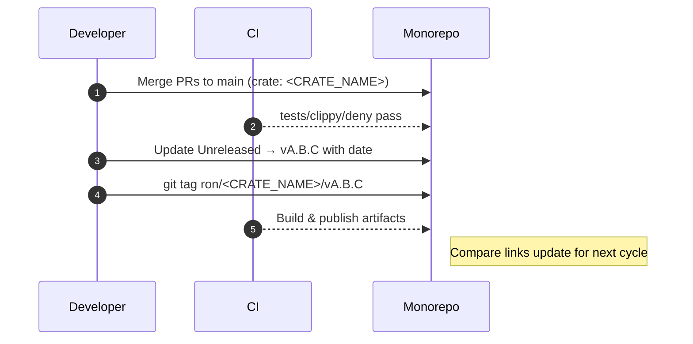
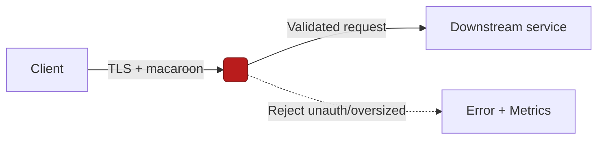
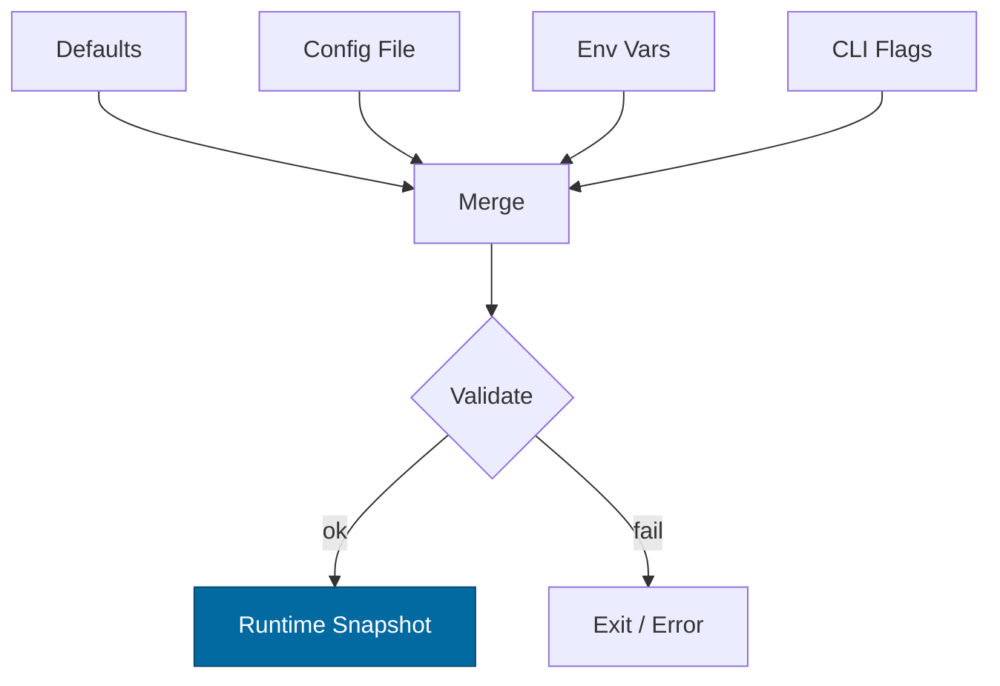
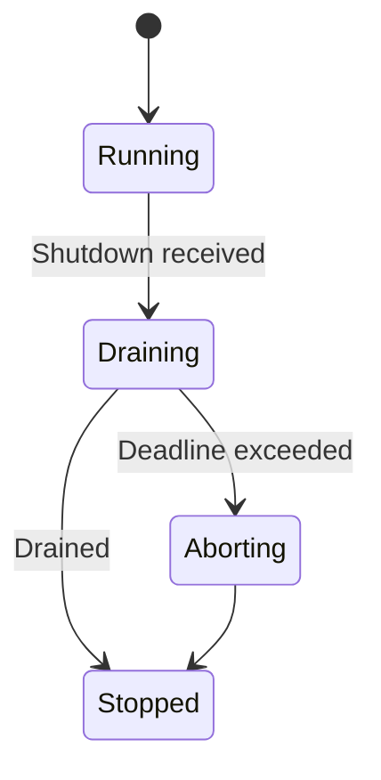
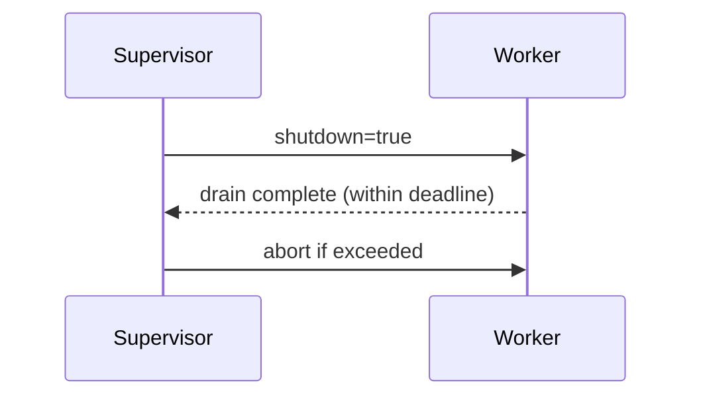
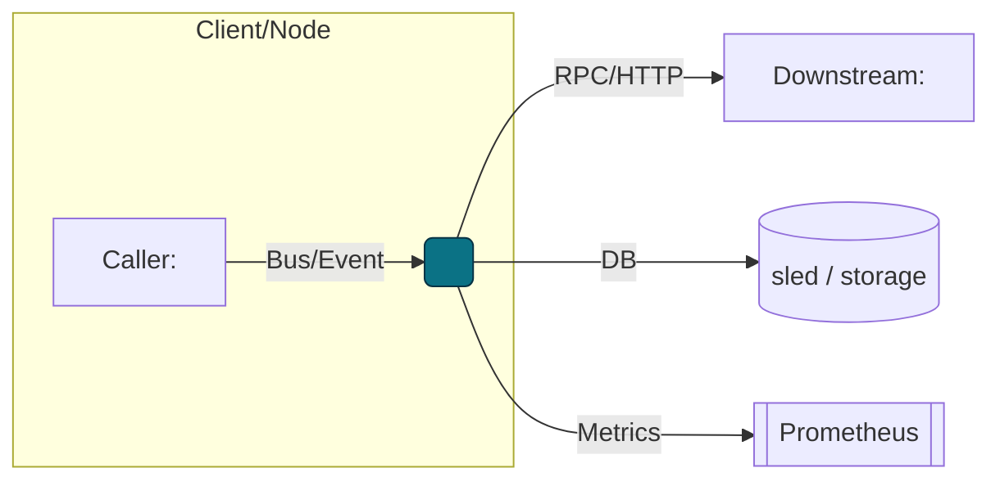
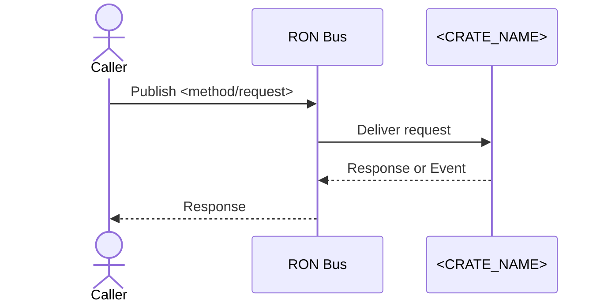
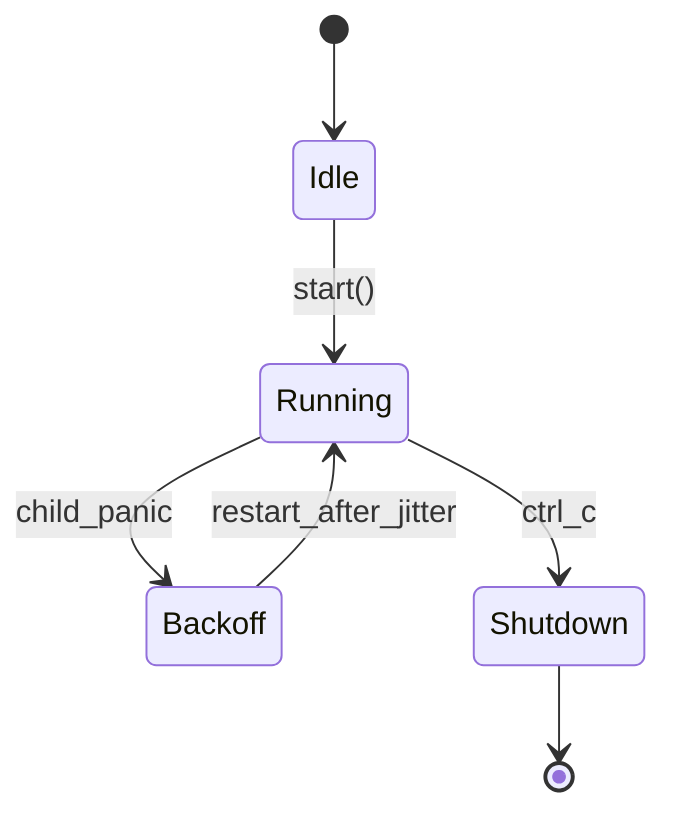

# RustyOnions — Combined Templates


---

# ===== Start of IDB.md =====

# 🪓 Invariant-Driven Blueprinting (IDB)

*A novel documentation method pioneered in RustyOnions*

---

## 1. Definition

**Invariant-Driven Blueprinting (IDB)** is a structured documentation style for software architecture and systems engineering.
It organizes every design document into a consistent **four-phase flow**:

1. **Invariants (MUSTs)** → Non-negotiable laws of the system.
2. **Design Principles (SHOULDs)** → Guiding heuristics and rationale.
3. **Implementation Patterns (HOW)** → Copy-paste-ready mechanics, code idioms, configs.
4. **Acceptance Gates (PROOF)** → Tests, metrics, and checklists that define “done.”
5. **Anti-Scope (Forbidden)** → what is **not** allowed, to prevent drift.

---

## 2. Origins

IDB borrows from but goes beyond:

* **RFCs (IETF/Rust)** → structure + rationale, but weak on invariants/tests.
* **ADRs** → decisions + context, but thin on gates/proof.
* **Formal Methods (TLA+, Alloy)** → strong on invariants, weak on dev usability.
* **Definition of Done (Agile)** → strong on proof, weak on architectural grounding.
* **Safety-critical systems (avionics, medtech)** → rigorous invariants + gates, but inaccessible to everyday engineers.

IDB fuses these into a **constitution-like document**: rigorous enough for safety, light enough for developers.

---

## 3. The IDB Template

```markdown
---
title: <Blueprint Name>
version: <semver>
status: draft|reviewed|final
last-updated: YYYY-MM-DD
audience: contributors, ops, auditors
---

# <Blueprint Name>

## 1. Invariants (MUST)
- [I-1] First invariant…
- [I-2] Second invariant…

## 2. Design Principles (SHOULD)
- [P-1] Guideline or heuristic…
- [P-2] Another principle…

## 3. Implementation (HOW)
- [C-1] Code snippet or config
- [C-2] Engineering pattern

## 4. Acceptance Gates (PROOF)
- [G-1] Unit/property/integration test required
- [G-2] Metric exposure
- [G-3] Checklist items for reviewers

## 5. Anti-Scope (Forbidden)
- What is **not** allowed, to prevent drift

## 6. References
- Linked appendices, specs, ADRs, RFCs, papers
```

---

## 4. Key Features

* **Invariants come first** → ground everything in truth that must never break.
* **Testability is central** → every invariant has a corresponding proof gate.
* **Copy-paste ergonomics** → developers see code idioms right inside the blueprint.
* **Anti-scope is explicit** → prevents drift and scope creep.
* **Reviewer checklists** baked in → no ambiguity about sign-off.

---

## 5. Example Snippet

**Blueprint: Runtime Safety (IDB style)**

* **I-1:** Never hold a lock across `.await`.
* **P-1:** Prefer message passing over shared mutability.
* **C-1:** Provide `Supervisor::spawn()` wrapper with backoff/jitter.
* **G-1:** CI forbids `tokio::spawn` in services except via supervisor.
* **Anti-scope:** No global mutable state outside the kernel bus.

---

## 6. Why Adopt IDB

* Forces clarity: “what is law, what is preference, what is mechanics, what is proof.”
* Easier onboarding: new devs jump into invariants and examples first.
* Drift resistance: anti-scope + acceptance gates mean specs stay real.
* CI-ready: invariants map to lint/tests, gates map to green checkmarks.
* Exportable: works for crates, services, infra, even governance.

---


# ===== End of IDB.md =====


---

# ===== Start of CHANGELOG.MD =====


---
# RustyOnions — Per-Crate Changelog
# File: docs/CHANGELOG.md
# Scope: <CRATE_NAME> only (NOT the whole workspace)
crate: <CRATE_NAME>
owner: Stevan White
semver: true
tag_pattern: ron/<CRATE_NAME>/vMAJOR.MINOR.PATCH
msrv: <X.Y.Z>
---

# CHANGELOG — <CRATE_NAME>

> This file tracks **crate-scoped** changes for `<CRATE_NAME>` in the RustyOnions monorepo.  
> Follows **SemVer** and the spirit of **Keep a Changelog**. Each entry includes **migration notes**, **ops impact**, and **rollback** guidance.

Badges (optional):  
[]() []() []()

---

## How to Read This Changelog

- **Unreleased** collects changes merged but not yet tagged.  
- Each release section shows: **Added / Changed / Fixed / Removed / Security / Performance / Deprecations / Breaking Changes / Migration**.  
- **Compare links** use crate-scoped tags: `ron/<CRATE_NAME>/vX.Y.Z`.  
- **Commit conventions:** we map Conventional Commits to sections:
  - `feat:` → Added
  - `fix:` → Fixed
  - `perf:` → Performance
  - `refactor:`/`style:`/`chore:` → Changed (if user-visible) or omitted
  - `docs:` → Documentation
  - `revert:` → Reverted (note rollback)
  - `build:`/`ci:` only if it affects consumers
  - `BREAKING CHANGE:` or `!` → Breaking Changes + Migration

### Release Checklist (per crate)
- [ ] Version bump (SemVer): MAJOR for breaking, MINOR for features, PATCH for fixes.  
- [ ] Update `Cargo.toml` version for `<CRATE_NAME>`.  
- [ ] Update **Unreleased** → new version section with date.  
- [ ] Validate **Migration** steps & example code.  
- [ ] SLO deltas documented; perf numbers reproducible.  
- [ ] `cargo test -p <CRATE_NAME>`, `cargo clippy -D warnings`, `cargo deny check` green.  
- [ ] Render diagrams (if any) and attach artifacts.  
- [ ] Tag: `git tag ron/<CRATE_NAME>/vX.Y.Z` and push tags.  
- [ ] Publish crate/binaries if applicable; update README badges.

---

## [Unreleased]
> Compare: `[Unreleased]` → last tag  
**Status:** in-flight changes since `ron/<CRATE_NAME>/vA.B.C`.

### Added
- …

### Changed
- …

### Fixed
- …

### Performance
- …

### Security
- …

### Removed
- …

### Deprecations
- …

### Breaking Changes
- …

### Migration (for changes above)
- **Config:** …  
- **API surface:** …  
- **Storage/schema:** …  
- **Command/flags:** …  
- **Minimal diff example:**
  ```diff
  - let c = Client::new_old(api_key);
  + let c = Client::new(Config::from_env()?);


### Ops & Rollback

* **Risk level:** Low | Medium | High
* **Feature flag/toggle:** `<FLAG_NAME>` (how to disable)
* **Rollback plan:** Revert to `ron/<CRATE_NAME>/vA.B.C` (notes about data migrations/backfills)

---

## [vA.B.C] — YYYY-MM-DD

> Compare: `ron/<CRATE_NAME>/vA.B.C`…`HEAD` (or next tag)

### Added

* …

### Changed

* …

### Fixed

* …

### Performance

* **P50 latency:** <value> (Δ from last: +/−)
* **P99 latency:** <value>
* **Throughput:** <value>
* **Repro steps:** machine, dataset, command

### Security

* **CVE:** <id> (if any)
* **Hardening:** timeouts, input caps, TLS, authN/Z updates
* **Key handling:** no logs, memory zeroize, path changes

### Removed

* …

### Deprecations

* **Symbol:** `<module::Type::method>` → removal in vA+1.0.0
* **Replacement:** `<new API>`
* **Tracking issue:** `#NNN`

### Breaking Changes

* \<Describe exact break, old vs new behavior, error variants, or types removed>

### Migration

* **API:** code snippet before/after
* **Config:** env/flags renames (include defaults)
* **Data:** sled prefixes, schema version bump, idempotency of backfill
* **HTTP/bus:** route/topic changes and auth changes

### Ops & Rollback

* **Health/Readiness:** endpoints semantics changed? Y/N
* **Metrics:** new/renamed metrics (keep old for 1 release?)
* **Alarms:** update alert rules (thresholds, labels)
* **Rollback:** revert tag, data compatibility caveats

---

## \[vA.B.(C-1)] — YYYY-MM-DD

### Added

* …

### Fixed

* …

### Migration

* N/A

---

## Compatibility, MSRV & Toolchain Notes

* **MSRV:** \<X.Y.Z> (changed in vA.B.C? Y/N; reason)
* **Rustc/Clippy:** relevant lints elevated to deny?
* **Dependencies:** notable bumps that affect consumers (axum/tokio/prometheus versions; TLS stack)

---

## Metrics & SLO Deltas (Release to Release)

> Capture only **user-visible** or **ops-relevant** deltas.

| Release    | P50 | P99 | Error % | Start-to-Ready | Notes |
| ---------- | --: | --: | ------: | -------------: | ----- |
| vA.B.C     |   … |   … |       … |              … | …     |
| vA.B.(C-1) |   … |   … |       … |              … | …     |

---

## Appendix A — API Surface Summary (optional)

> Use `cargo public-api` to record headline changes.

```
cargo +stable install cargo-public-api
cargo public-api -p <CRATE_NAME> --deny changed
```

* **New:** `pub fn <name>(...)`
* **Changed:** `enum Error { … }` added `<Variant>`
* **Removed:** …

---

## Appendix B — Release Flow (Mermaid, optional)



---

## Link References (edit once per crate)

[Unreleased]: https://github.com/<ORG>/<REPO>/compare/ron/<CRATE_NAME>/vA.B.C...HEAD
[vA.B.C]: https://github.com/<ORG>/<REPO>/tree/ron/<CRATE_NAME>/vA.B.C

<!--
When you cut a new release:
1) Change [Unreleased] base from old tag → new tag.
2) Add a new link ref for the new version.
3) Keep tag pattern crate-scoped to avoid cross-crate collisions.
-->

```

---

### Monorepo Tagging & Compare Guidance (keep outside the file or in your maintainer notes)

- **Tag pattern:** `ron/<CRATE_NAME>/vX.Y.Z` (unique per crate).  
- **Compare “Unreleased”:** set base to **latest crate tag**.  
- **Automating link rewrites:** simple sed snippet to bump compare bases in one shot is fine, but keep it crate-scoped.

If you want, I can also generate a tiny `release_notes.md` stamper that:
- bumps `Cargo.toml` and `docs/CHANGELOG.md`,
- converts the Unreleased block into a dated section,
- pushes `ron/<CRATE_NAME>/vX.Y.Z` tag,
- and updates the link refs.
```


# ===== End of CHANGELOG.MD =====


---

# ===== Start of SECURITY.MD =====


---
title: Security Notes — <CRATE_NAME>
crate: <CRATE_NAME>
owner: Stevan White
last-reviewed: YYYY-MM-DD
status: draft
---

# Security Documentation — <CRATE_NAME>

This document defines the **threat model**, **security boundaries**, and **hardening requirements** specific to `<CRATE_NAME>`.  
It complements the repo-wide [Hardening Blueprint](../../docs/Hardening_Blueprint.md) and [Interop Blueprint](../../docs/Interop_Blueprint.md).

---

## 1) Threat Model (STRIDE)

| Category | Threats | Relevant in `<CRATE_NAME>`? | Mitigation |
|----------|---------|-----------------------------|------------|
| **S**poofing | Fake identities, unauthenticated peers | Y/N | TLS (tokio-rustls), macaroon caps |
| **T**ampering | Mutated messages, DB corruption | Y/N | Content addressing (BLAKE3), checksums, CAS invariants |
| **R**epudiation | Missing/auditable logs | Y/N | Structured JSON logs, `corr_id` propagation |
| **I**nformation Disclosure | PII leakage, key exposure | Y/N | Amnesia mode, zeroize, no logs of secrets |
| **D**enial of Service | Flood, slow-loris, compression bombs | Y/N | Hard timeouts, rate limits, decompression caps:contentReference[oaicite:2]{index=2} |
| **E**levation of Privilege | Unauthorized ops | Y/N | Capability tokens (macaroons), role separation |

---

## 2) Security Boundaries

- **Inbound:** `<list API endpoints, bus topics, or CLI commands>`  
- **Outbound:** `<list downstream crates/services>`  
- **Trust Zone:** `<e.g., runs in same tenant, public-facing, or privileged>`  
- **Assumptions:**  
  - Kernel invariants hold (Bus, Metrics, Health, Config).  
  - Dependent services enforce their own `/readyz` + quotas.  
  - DB/file system is isolated per-service.  

---

## 3) Key & Credential Handling

- **Types of keys:** `<e.g., TLS certs, macaroon secrets, Ed25519 IDs>`  
- **Storage:**  
  - Sealed at rest (if applicable).  
  - In-memory only in **amnesia mode**.  
- **Rotation policy:** rotate ≤ 30 days, revocation via `<method>`:contentReference[oaicite:3]{index=3}.  
- **Zeroization:** All secrets wrapped in `zeroize::Zeroizing`.  

---

## 4) Hardening Checklist (from Blueprint)

- [ ] 5s timeout on all requests.  
- [ ] Concurrency cap: 512 inflight.  
- [ ] RPS cap: 500 (tune per service).  
- [ ] Request body cap: 1 MiB.  
- [ ] Decompression ratio ≤ 10×, absolute cap enforced.  
- [ ] UDS sockets: dir `0700`, socket `0600`, `SO_PEERCRED` allowlist.  
- [ ] No direct DB access from tools (route via service API).  
- [ ] Chaos test: restart under load; `/readyz` flips correctly.  

---

## 5) Observability for Security

- **Metrics:**  
  - `rejected_total{reason="unauth"|"decompress_cap"|"ratio_cap"}`  
  - `auth_failures_total{service="<CRATE_NAME>"}`  
  - `tls_handshake_failures_total`  
- **Logs:** Always structured (JSON); fields: `service`, `reason`, `corr_id`, `peer_addr`.  
- **Health gates:** `/readyz` fail-closed on degraded state:contentReference[oaicite:4]{index=4}.  

---

## 6) Dependencies & Supply Chain

- **External crates (security-sensitive):**  
  - `tokio-rustls` (TLS 1.3)  
  - `serde` (strict schema)  
  - `rmp-serde` (if MsgPack)  
- **Pinned versions:** workspace-root Cargo.toml.  
- **Supply chain controls:** `cargo-deny` enforced in CI.  
- **SBOM:** generated at release; stored in `/docs/sbom/`.  

---

## 7) Formal & Destructive Validation

- **Property tests:** rejection of malformed inputs.  
- **Fuzzing:** frame parsers (OAP/1) with corpus:contentReference[oaicite:5]{index=5}.  
- **Loom tests:** concurrency ordering (if applicable).  
- **Chaos tests:** kill/restart loops to assert health invariants.  
- **TLA+:** if crate is protocol-bearing, attach spec sketch.  

---

## 8) Security Contacts

- **Maintainer:** Stevan White  
- **Security contact email:** security@rustyonions.dev  
- **Disclosure policy:** See repo root `SECURITY.md`.  

---

## 9) Migration & Upgrades

- **Breaking changes to auth or keys:** require a **major version bump** in CHANGELOG.md.  
- **Deprecations:** must include a migration path and explicit end-of-support window.  

---

## 10) Mermaid — Security Flow Diagram (REQUIRED)



---


# ===== End of SECURITY.MD =====


---

# ===== Start of CONFIG.MD =====


---
title: Configuration — <CRATE_NAME>
crate: <CRATE_NAME>
owner: Stevan White
last-reviewed: YYYY-MM-DD
status: draft
template_version: 1.0
---

# Configuration — <CRATE_NAME>

This document defines **all configuration** for `<CRATE_NAME>`, including sources,
precedence, schema (types/defaults), validation, feature flags, live-reload behavior,
and security implications. It complements `README.md` and `docs/SECURITY.md`.

> **Tiering:**  
> - **Library crates:** most sections apply, but service-only notes (ports, /healthz) may be N/A.  
> - **Service crates:** all sections apply (network, readiness, observability, etc.).

---

## 1) Sources & Precedence (Authoritative)

Configuration may come from multiple sources. **Precedence (highest wins):**

1. **Process flags** (CLI)  
2. **Environment variables**  
3. **Config file** (e.g., `Config.toml` beside the binary)  
4. **Built-in defaults** (hard-coded)

> When reloading dynamically, the effective config is recomputed under the same precedence.

**Supported file formats:** TOML (preferred), JSON (optional).  
**Path resolution order for `--config` (if relative):** `./`, `$CWD`, crate dir.

---

## 2) Quickstart Examples

### 2.1 Minimal service start
```bash

RUST\_LOG=info&#x20;
\<CRATE\_PREFIX>\_BIND\_ADDR=0.0.0.0:8080&#x20;
\<CRATE\_PREFIX>\_METRICS\_ADDR=127.0.0.1:0&#x20;
cargo run -p \<CRATE\_NAME>

```

### 2.2 Config file (TOML)
```rust
# Config.toml
bind_addr     = "0.0.0.0:8080"
metrics_addr  = "127.0.0.1:0"
max_conns     = 1024
read_timeout  = "5s"
write_timeout = "5s"
idle_timeout  = "60s"

[tls]
enabled = false
# cert_path = "/etc/ron/cert.pem"
# key_path  = "/etc/ron/key.pem"

[limits]
max_body_bytes       = "1MiB"
decompress_ratio_cap = 10
```

### 2.3 CLI flags (override file/env)

```bash
cargo run -p <CRATE_NAME> -- \
  --bind 0.0.0.0:8080 \
  --metrics 127.0.0.1:0 \
  --max-conns 2048
```

---

## 3) Schema (Typed, With Defaults)

> **Prefix convention:** All env vars begin with `<CRATE_PREFIX>_` (e.g., `SVCO_GW_`).
> **Durations** accept `s`, `ms`, `m`, `h`. **Sizes** accept `B`, `KB`, `MB`, `MiB`.

| Key / Env Var                                                         | Type                 |       Default | Description                              | Security Notes                           |
| --------------------------------------------------------------------- | -------------------- | ------------: | ---------------------------------------- | ---------------------------------------- |
| `bind_addr` / `<CRATE_PREFIX>_BIND_ADDR`                              | socket               | `127.0.0.1:0` | HTTP/ingress bind address                | Public binds require threat review       |
| `metrics_addr` / `<CRATE_PREFIX>_METRICS_ADDR`                        | socket               | `127.0.0.1:0` | Prometheus endpoint bind                 | Prefer localhost in prod; gateway scrape |
| `max_conns` / `<CRATE_PREFIX>_MAX_CONNS`                              | u32                  |        `1024` | Max concurrent connections               | Prevents FD exhaustion                   |
| `read_timeout` / `<CRATE_PREFIX>_READ_TIMEOUT`                        | duration             |          `5s` | Per-request read timeout                 | DoS mitigation                           |
| `write_timeout` / `<CRATE_PREFIX>_WRITE_TIMEOUT`                      | duration             |          `5s` | Per-request write timeout                | DoS mitigation                           |
| `idle_timeout` / `<CRATE_PREFIX>_IDLE_TIMEOUT`                        | duration             |         `60s` | Keep-alive idle shutdown                 | Resource hygiene                         |
| `limits.max_body_bytes` / `<CRATE_PREFIX>_MAX_BODY_BYTES`             | size                 |        `1MiB` | Request payload cap                      | Decompression bomb guard                 |
| `limits.decompress_ratio_cap` / `<CRATE_PREFIX>_DECOMPRESS_RATIO_CAP` | u32                  |          `10` | Max allowed decompression ratio          | Zip bomb guard                           |
| `tls.enabled` / `<CRATE_PREFIX>_TLS_ENABLED`                          | bool                 |       `false` | Enable TLS                               | Use tokio-rustls only                    |
| `tls.cert_path` / `<CRATE_PREFIX>_TLS_CERT_PATH`                      | path                 |          `""` | PEM cert path                            | Secrets on disk; perms 0600              |
| `tls.key_path` / `<CRATE_PREFIX>_TLS_KEY_PATH`                        | path                 |          `""` | PEM key path                             | Zeroize in memory                        |
| `uds.path` / `<CRATE_PREFIX>_UDS_PATH`                                | path                 |          `""` | Optional Unix Domain Socket path         | Dir 0700, sock 0600                      |
| `uds.allow_uids` / `<CRATE_PREFIX>_UDS_ALLOW_UIDS`                    | list<u32>            |          `[]` | PEERCRED allowlist                       | Strict production control                |
| `auth.macaroon_path` / `<CRATE_PREFIX>_MACAROON_PATH`                 | path                 |          `""` | Capability token file                    | Do not log contents                      |
| `amnesia.enabled` / `<CRATE_PREFIX>_AMNESIA`                          | bool                 |       `false` | RAM-only secrets mode                    | No persistent keys                       |
| `pq.mode` / `<CRATE_PREFIX>_PQ_MODE`                                  | enum(`off`,`hybrid`) |         `off` | PQ readiness toggle (e.g., X25519+Kyber) | Interop compatibility risk               |
| `log.format` / `<CRATE_PREFIX>_LOG_FORMAT`                            | enum(`json`,`text`)  |        `json` | Structured logs                          | JSON required in prod                    |
| `log.level` / `<CRATE_PREFIX>_LOG_LEVEL`                              | enum                 |        `info` | `trace`..`error`                         | Avoid `trace` in prod                    |

> Add crate-specific keys below with the same columns.

---

## 4) Validation Rules (Fail-Closed)

On startup or reload, apply the following **strict validation**:

* `bind_addr` must parse to valid socket; ports <1024 require privileges.
* If `tls.enabled=true`, `cert_path` and `key_path` must exist and be readable; key not world-readable.
* `max_conns` > 0, `limits.max_body_bytes` ≥ 1 KiB.
* `decompress_ratio_cap` ≥ 1.
* If `uds.path` set: parent dir exists, dir mode `0700`, socket `0600`.
* If `auth.macaroon_path` set: file exists and non-empty.
* If `pq.mode="hybrid"`: ensure compatible peers or feature flag gating.

**On violation:** log structured error, **exit non-zero** (services) or **return error** (libs).

---

## 5) Dynamic Reload (If Supported)

* **How to trigger:**

  * SIGHUP (preferred) **or** a bus event `ConfigUpdated { version: <u64> }`.
* **Reload semantics:**

  * Non-disruptive for timeouts/limits/log levels.
  * **Disruptive** for `bind_addr`, `tls.*`, `uds.*` (require socket rebind).
* **Atomicity:**

  * Compute a new config snapshot; swap under a mutex without `.await` held.
* **Audit:**

  * Emit `KernelEvent::ConfigUpdated { version }` + diff in logs (no secrets).

---

## 6) CLI Flags (Canonical)

> Flags are optional; env + file are preferred for production.

```
--config <path>                # Load Config.toml (merged at low precedence)
--bind <ip:port>               # Override bind_addr
--metrics <ip:port>            # Override metrics_addr
--max-conns <num>
--read-timeout <dur>           # e.g., 5s, 250ms
--write-timeout <dur>
--idle-timeout <dur>
--tls                          # Shorthand for tls.enabled=true
--tls-cert <path>
--tls-key <path>
--uds <path>
--log-format <json|text>
--log-level <trace|debug|info|warn|error>
```

---

## 7) Feature Flags (Cargo)

| Feature |        Default | Effect                                           |
| ------- | -------------: | ------------------------------------------------ |
| `tls`   |            off | Enables tokio-rustls path and TLS config keys    |
| `pq`    |            off | Enables PQ hybrid mode config (`pq.mode=hybrid`) |
| `kameo` |            off | Optional actor integration                       |
| `cli`   | on (bins only) | Enable CLI parsing for flags above               |

> Ensure cross-crate consistency; document if a feature changes schema.

---

## 8) Security Implications

* **Public binds** (`0.0.0.0`) require hard caps (timeouts, body size, RPS).
* **TLS**: only `tokio_rustls::rustls::ServerConfig`; never `rustls::ServerConfig` directly.
* **Macaroons**: do not log tokens; rotate ≤ 30 days.
* **Amnesia mode**: disables secret persistence; incompatible with disk-backed key stores.
* **UDS**: verify `SO_PEERCRED`; enforce `allow_uids`.

See `docs/SECURITY.md` for full threat model.

---

## 9) Compatibility & Migration

* **Backwards compatibility:** add new keys with safe defaults.
* **Renames:** keep old env var alias for ≥1 minor; warn when used.
* **Breaking changes:** require **major version** and `docs/CHANGELOG.md` migration steps.
* **Deprecation table (maintained):**

| Old Key | New Key | Removal Target | Notes                    |
| ------- | ------- | -------------: | ------------------------ |
| `<old>` | `<new>` |       vA+1.0.0 | Provide conversion logic |

---

## 10) Reference Implementation (Rust)

> Minimal example for `Config` with env + file + CLI (serde + figment or custom).
> **Note:** Keep comments; this snippet is intended to be copy-pasted into `src/config.rs`.

```rust
use std::{net::SocketAddr, time::Duration, path::PathBuf};
use serde::{Deserialize, Serialize};

#[derive(Debug, Clone, Serialize, Deserialize)]
pub struct TlsCfg {
    pub enabled: bool,
    pub cert_path: Option<PathBuf>,
    pub key_path: Option<PathBuf>,
}

#[derive(Debug, Clone, Serialize, Deserialize)]
pub struct Limits {
    #[serde(default = "default_body_bytes")]
    pub max_body_bytes: u64, // bytes
    #[serde(default = "default_decompress_ratio")]
    pub decompress_ratio_cap: u32,
}

fn default_body_bytes() -> u64 { 1 * 1024 * 1024 }
fn default_decompress_ratio() -> u32 { 10 }

#[derive(Debug, Clone, Serialize, Deserialize)]
pub struct Config {
    #[serde(default)]
    pub bind_addr: Option<SocketAddr>,   // None = 127.0.0.1:0
    #[serde(default)]
    pub metrics_addr: Option<SocketAddr>,// None = 127.0.0.1:0
    #[serde(default = "default_max_conns")]
    pub max_conns: u32,
    #[serde(with = "humantime_serde", default = "default_5s")]
    pub read_timeout: Duration,
    #[serde(with = "humantime_serde", default = "default_5s")]
    pub write_timeout: Duration,
    #[serde(with = "humantime_serde", default = "default_60s")]
    pub idle_timeout: Duration,
    #[serde(default)]
    pub tls: TlsCfg,
    #[serde(default)]
    pub limits: Limits,
    // ... add uds/auth/pq/log subsections as needed
}

fn default_5s() -> Duration { Duration::from_secs(5) }
fn default_60s() -> Duration { Duration::from_secs(60) }
fn default_max_conns() -> u32 { 1024 }

impl Config {
    pub fn validate(&self) -> anyhow::Result<()> {
        if self.max_conns == 0 { anyhow::bail!("max_conns must be > 0"); }
        if self.limits.max_body_bytes < 1024 { anyhow::bail!("max_body_bytes too small"); }
        if self.limits.decompress_ratio_cap == 0 { anyhow::bail!("decompress_ratio_cap must be >= 1"); }
        if self.tls.enabled {
            match (&self.tls.cert_path, &self.tls.key_path) {
                (Some(c), Some(k)) if c.exists() && k.exists() => {},
                _ => anyhow::bail!("TLS enabled but cert/key missing"),
            }
        }
        Ok(())
    }
}
```

---

## 11) Test Matrix

| Scenario                       | Expected Outcome                                            |
| ------------------------------ | ----------------------------------------------------------- |
| Missing `Config.toml`          | Start with defaults; warn                                   |
| Invalid `bind_addr`            | Fail fast with explicit error                               |
| TLS enabled but no keys        | Fail fast                                                   |
| Body over `max_body_bytes`     | `413 Payload Too Large` (service)                           |
| Ratio > `decompress_ratio_cap` | `400 Bad Request` + metric                                  |
| SIGHUP received                | Non-disruptive reload for safe keys; disruptive ones rebind |

---

## 12) Mermaid — Config Resolution Flow



---

## 13) Operational Notes

* Keep **prod config under version control** (private repo or secret store).
* For containers, prefer **env vars** over baked files; mount secrets read-only.
* Document **default ports** and **firewall expectations** near `bind_addr`.
* Include this file in PR reviews when config changes are introduced.

```


# ===== End of CONFIG.MD =====


---

# ===== Start of CONCURRENCY.MD =====


---
title: Concurrency Model — <CRATE_NAME>
crate: <CRATE_NAME>
owner: Stevan White
last-reviewed: YYYY-MM-DD
status: draft
template_version: 1.1
msrv: 1.80.0
tokio: "1.x (pinned at workspace root)"
loom: "0.7+ (dev-only)"
lite_mode: "For small library crates: fill §§1,3,4,5,10,11 and mark others N/A"
---

# Concurrency Model — <CRATE_NAME>

This document makes the concurrency rules **explicit**: tasks, channels, locks, shutdown, timeouts,
and validation (property/loom/TLA+). It complements `docs/SECURITY.md`, `docs/CONFIG.md`,
and the crate’s `README.md` and `IDB.md`.

> **Golden rule:** never hold a lock across `.await` in supervisory or hot paths.

---

## 0) Lite Mode (for tiny lib crates)

If this crate is a small **library** with no background tasks:
- Complete **§1 Invariants**, **§3 Channels**, **§4 Locks**, **§5 Timeouts**, **§10 Validation**, **§11 Code Patterns**.
- Mark **§2 Runtime**, **§6 Shutdown**, **§7 I/O framing** N/A if not applicable.

---

## 1) Invariants (MUST)

- [ ] **No lock across `.await`**. If unavoidable, split the critical section.
- [ ] **Single writer** per mutable resource; readers use snapshots or short read guards.
- [ ] **Bounded channels** only (mpsc/broadcast) with explicit overflow policy.
- [ ] **Explicit timeouts** on all I/O and RPCs; fail-fast with typed errors.
- [ ] **Cooperative cancellation**: every `.await` is cancel-safe or guarded by `select!`.
- [ ] **Graceful shutdown**: observe `Shutdown` signal; drain within deadline; abort stragglers.
- [ ] **No blocking syscalls** on the async runtime; use `spawn_blocking` if required.
- [ ] **No task leaks**: track joins; detach only with rationale.
- [ ] **Backpressure over buffering**: drop/reject with metrics; never grow unbounded queues.
- [ ] **Framing**: length-delimited/checked; handle split reads.

**Async Drop**
- [ ] Do **not** block in `Drop`. For teardown, expose an **async `close()`/`shutdown()`** API and call it before the value is dropped. `Drop` should only release cheap, non-blocking resources.

---

## 2) Runtime Topology

Describe Tokio runtime & task layout (if applicable).

- **Runtime:** tokio multi-threaded.
- **Primary tasks:**
  - `<task name>` — purpose, cadence, criticality.
  - `<task name>` — …
- **Supervision:** jittered backoff on panic; escalation/limits documented.

```mermaid
flowchart TB
  subgraph Runtime
    A[Supervisor] -->|spawn| B[Listener]
    A -->|spawn| C[Worker Pool]
    B -->|mpsc (bounded)| C
    A -->|watch Shutdown| B
    A -->|watch Shutdown| C
  end
  C -->|results| A
  style A fill:#0ea5e9,stroke:#0c4a6e,color:#fff
````

**Diagram (text description for accessibility):** The Supervisor task spawns one Listener and a Worker Pool. The Listener feeds a bounded mpsc queue into the Worker Pool. Both Listener and Workers subscribe to a Shutdown watch channel from the Supervisor.

---

## 3) Channels & Backpressure

**Inventory (bounded unless noted):**

| Name          | Kind      | Capacity | Producers → Consumers | Backpressure Policy       | Drop Semantics              |
| ------------- | --------- | -------: | --------------------- | ------------------------- | --------------------------- |
| `<events_tx>` | broadcast |     1024 | 1 → N                 | lag counter + drop oldest | increment metric + warn log |
| `<work_tx>`   | mpsc      |      512 | N → M                 | `try_send` → `Busy`       | return 429/`Busy` upstream  |
| `<ctrl_rx>`   | watch     |        1 | 1 → N                 | last-write wins           | N/A                         |

Guidelines:

* Prefer `try_send` + explicit error over buffering.
* Emit `queue_dropped_total{queue="work"}` on shed; keep a depth gauge.

---

## 4) Locks & Shared State

**Allowed**

* Short-lived `Mutex`/`RwLock` for metadata (no `.await` under guard).
* Read-mostly snapshots via `Arc<StateSnapshot>`.
* Per-connection state owned by its task; cross-task via channels.

**Forbidden**

* Holding locks across `.await`.
* Nested locks without a documented hierarchy.

**Hierarchy (if needed)**

1. `state_meta`
2. `routing_table`
3. `counters`

---

## 5) Timeouts, Retries, Deadlines

* **I/O:** `read=5s`, `write=5s`, `idle=60s` (override via config).
* **RPC:** total deadline enforced; retry idempotent ops only with jittered backoff (50–100ms → cap 2s, max 3 tries).
* **Circuit breaker (opt):** open on error rate; half-open probes recover.

```mermaid
sequenceDiagram
  autonumber
  participant Caller
  participant S as <CRATE_NAME>
  Caller->>S: Request (deadline=2s)
  S-->>Caller: 202 Accepted or Result
  Note over S: On backpressure → Busy<br/>On timeout → typed error
```

**Diagram (text):** Caller sends a request with a 2s deadline; service either accepts work or returns a Busy/timeout error deterministically.

---

## 6) Cancellation & Shutdown

* **Signal:** `KernelEvent::Shutdown` or `wait_for_ctrl_c()`.
* **Propagation:** `tokio::select! { _ = shutdown.changed() => ..., _ = work => ... }`.
* **Draining:** stop intake; flush in-flight within deadline (1–5s).
* **Abort:** tasks exceeding deadline → `handle.abort()`; count `aborted_tasks_total`.



**Diagram (text):** On shutdown signal, system enters Draining; if deadline passes, remaining tasks are Aborted; otherwise transitions to Stopped.

---

## 7) I/O & Framing

* Length-prefix or delimiter with strict maximums.
* Use `AsyncReadExt/AsyncWriteExt`; call `.shutdown().await` on success/error.
* Handle partial reads; verify checksums when protocol requires.

---

## 8) Error Taxonomy (Concurrency-Relevant)

| Error      | When               | Retry?    | Metric                  | Notes          |
| ---------- | ------------------ | --------- | ----------------------- | -------------- |
| `Busy`     | queue full         | maybe     | `busy_rejections_total` | caller-visible |
| `Timeout`  | deadline exceeded  | sometimes | `io_timeouts_total{op}` | attach op      |
| `Canceled` | shutdown           | no        | `tasks_canceled_total`  | cooperative    |
| `Lagging`  | broadcast overflow | no        | `bus_lagged_total`      | slow consumer  |

---

## 9) Metrics (Concurrency Health)

* `queue_depth{queue}` gauge (sampled)
* `queue_dropped_total{queue}` counter
* `tasks_spawned_total{kind}` / `tasks_aborted_total{kind}`
* `io_timeouts_total{op}` (`read`,`write`,`connect`)
* `backoff_retries_total{op}`
* `busy_rejections_total{endpoint}`

---

## 10) Validation Strategy

**Unit / Property**

* Backpressure behavior (drop vs reject).
* Deadline honored within tolerance.
* Lock discipline (runtime asserts if needed).

**Loom**

* Model producer → bounded queue → consumer + shutdown.
* Assert: no deadlocks, no missed shutdown, no double-drop.

**Fuzz**

* Frame/decoder fuzz (malformed/boundary inputs).

**Chaos**

* Kill/restart workers under load; `/readyz` flips correctly; drains respected.

**TLA+ (if ordering matters)**

* Specify message/state; prove safety (no dup/loss) & liveness (eventual drain).

---

## 11) Code Patterns (Copy-Paste)

**Spawn + cooperative shutdown**

```rust
let (shutdown_tx, mut shutdown_rx) = tokio::sync::watch::channel(false);
let worker = tokio::spawn({
  let mut rx = work_rx;
  async move {
    loop {
      tokio::select! {
        _ = shutdown_rx.changed() => break,
        maybe_job = rx.recv() => {
          let Some(job) = maybe_job else { break };
          if let Err(e) = handle_job(job).await {
            tracing::warn!(error=%e, "job failed");
          }
        }
      }
    }
  }
});
// shutdown_tx.send(true).ok(); let _ = worker.await;
```

**Bounded mpsc with try\_send**

```rust
if let Err(tokio::sync::mpsc::error::TrySendError::Full(_)) = tx.try_send(job) {
  metrics::busy_rejections_total().inc();
  return Err(Error::Busy);
}
```

**Timeout with deadline**

```rust
let res = tokio::time::timeout(cfg.read_timeout, read_frame(&mut stream)).await;
```

**Async Drop pattern**

```rust
pub struct Client { inner: Option<Conn> }

impl Client {
  pub async fn close(&mut self) -> anyhow::Result<()> {
    if let Some(conn) = self.inner.take() {
      conn.shutdown().await?;
    }
    Ok(())
  }
}

impl Drop for Client {
  fn drop(&mut self) {
    // Best-effort: log if still open; do NOT block here.
    if self.inner.is_some() {
      tracing::debug!("Client dropped without close(); resources will be reclaimed");
    }
  }
}
```

**No lock across `.await`**

```rust
let value = { let g = state.lock(); g.derive_value() }; // drop guard
do_async(value).await;
```

---

## 12) Configuration Hooks (Quick Reference)

* `max_conns`, `read_timeout`, `write_timeout`, `idle_timeout`
* channel capacities
* `drain_deadline`
* retry/backoff window

See `docs/CONFIG.md` for authoritative schema.

---

## 13) Known Trade-offs / Nonstrict Areas

* Justify **drop-oldest vs reject-new** choice per queue.
* Call out eventual consistency / best-effort areas.

---

## 14) Mermaid Diagrams (REQUIRED)

### 14.1 Task & Queue Topology

```mermaid
flowchart LR
  IN[Ingress] -->|mpsc:work(512)| W1[Worker A]
  IN -->|mpsc:work(512)| W2[Worker B]
  subgraph Control
    SHUT[Shutdown watch] --> W1
    SHUT --> W2
  end
```

**Text description:** Ingress feeds two workers via a bounded mpsc(512); a Shutdown watch channel notifies both workers.

### 14.2 Shutdown Sequence



**Text description:** Supervisor signals shutdown; Worker drains and acknowledges; if time limit exceeded, Supervisor aborts Worker.

---

## 15) CI & Lints (Enforcement)

**Clippy lints to enable**

* `-D clippy:await_holding_lock`
* `-D clippy:needless_collect`
* `-D clippy:useless_async`
* `-D warnings` (repo standard)

**GitHub Actions suggestions**

```yaml
name: concurrency-guardrails
on: [push, pull_request]
jobs:
  clippy:
    runs-on: ubuntu-latest
    steps:
      - uses: actions/checkout@v4
      - uses: dtolnay/rust-toolchain@stable
      - run: cargo clippy -p <CRATE_NAME> -- -D warnings -W clippy::await_holding_lock

  loom:
    if: github.event_name == 'pull_request'
    runs-on: ubuntu-latest
    steps:
      - uses: actions/checkout@v4
      - uses: dtolnay/rust-toolchain@stable
      - run: RUSTFLAGS="--cfg loom" cargo test -p <CRATE_NAME> --tests -- --ignored

  fuzz:
    runs-on: ubuntu-latest
    steps:
      - uses: actions/checkout@v4
      - uses: dtolnay/rust-toolchain@stable
      - run: cargo install cargo-fuzz
      - run: cargo fuzz build -p <CRATE_NAME>
```

---

## 16) Schema Generation (Optional, Nice-to-Have)

Automate **Channels/Locks tables** from code to avoid rot:

* Annotate channels/locks with macros or attributes, e.g.:

  ```rust
  #[doc_channel(name="work", kind="mpsc", cap=512, policy="try_send")]
  let (tx, rx) = tokio::sync::mpsc::channel(512);
  ```
* A small **proc-macro** or a **build script** (`build.rs`) can emit `docs/_generated/concurrency.mdfrag` which you include via an md include.
* Alternatively, keep a `concurrency.rs` registry module and unit-test that the doc table matches the registry entries (golden test).

---

## 17) Review & Maintenance

* **Review cadence:** every 90 days or on any change to tasks/channels/locks.
* **Keep `owner`, `msrv`, `last-reviewed` current.**
* **PR checklist:** if you modify concurrency, update this file + Loom/property tests.

```

---


# ===== End of CONCURRENCY.MD =====


---

# ===== Start of OBSERVABILITY.MD =====


---

# 📈 OBSERVABILITY.md (Template)

*Audience: developers, operators, auditors*
*msrv: 1.80.0 (Tokio/loom compatible)*

---

## 0) Purpose

Define **what is observable**, **how we expose it**, and **how it’s used** for:

* Metrics (Prometheus/OTEL)
* Health & readiness semantics
* Logs (JSON schema, fields)
* Tracing spans & correlation
* Alerts & SLOs

---

## 1) Metrics (Prometheus-style)

### 1.1 Golden Metrics (every service)

* `http_requests_total{route,method,status}` (Counter)
* `request_latency_seconds{route,method}` (Histogram)
* `inflight_requests{route}` (Gauge or implied by concurrency limit)
* `bus_lagged_total` (Counter) — broadcast backlog dropped
* `service_restarts_total` (Counter) — supervised restarts
* `request_latency_seconds` (Histogram) — p95 latency tracked
* `rejected_total{reason}` (Counter) — quota/timeouts/errors

### 1.2 Service-Specific (examples)

* **Storage:** `storage_get_latency_seconds`, `chunks_written_total`, `integrity_fail_total`
* **DHT:** `ron_dht_lookup_ms`, `ron_dht_missing_records`, `ron_dht_repair_bytes_total`
* **Mailbox:** `mailbox_visibility_timeout_total`, `mailbox_dlq_total`
* **Gateway:** `quota_exhaustions_total`, `bytes_in_total`, `bytes_out_total`

### 1.3 Registration Discipline

* Metrics **registered once** in `Metrics::new()`; clone handles everywhere.
* CI grep prevents duplicate registration.

---

## 2) Health & Readiness

### 2.1 Endpoints

* `/healthz` — liveness (always `200 OK` if process alive).
* `/readyz` — readiness (only `200 OK` once: config loaded, DB open, listeners bound, bus attached).

### 2.2 Readiness Keys

* `db_open`
* `bus_attached`
* `tor_bootstrap` (when applicable)
* `hs_published` (for onion services)

### 2.3 Failure Semantics

* Fail-open reads / fail-closed writes (per Final Blueprint).
* Degraded mode: `503` with JSON `{ "degraded": true, "missing": ["<keys>"], "retry_after": <s> }`.

---

## 3) Logs

### 3.1 Format

* JSON lines (`application/jsonl`), one event per line.
* Required fields:

  * `ts` (ISO8601)
  * `level` (`INFO|WARN|ERROR|DEBUG|TRACE`)
  * `service`
  * `event` (e.g., `oap_frame`, `quota_exhausted`, `service_crashed`)
  * `reason` (string; must align with `rejected_total{reason}`)
  * `corr_id` (UUID/ULID, propagated across services)
  * `latency_ms` (if applicable)
  * `content_id` (for storage/overlay ops)

### 3.2 Redaction & Secrets

* No PII in logs.
* Keys, caps, and payloads never logged.
* Config snapshot logs redact secrets (per Hardening Blueprint).

---

## 4) Tracing & Correlation

* Use `tracing` crate with `tracing-subscriber` JSON formatter.
* Span naming convention:

  * `svc.<crate>.<operation>` (e.g., `svc.gateway.get_object`)
* Correlation IDs:

  * Injected on ingress (HTTP `X-Corr-ID`)
  * Propagated via bus events and SDK.
* OpenTelemetry exporters optional (feature-flagged).

---

## 5) Alerts & SLOs

### 5.1 Standard SLOs

* Public GET p95 latency < 80 ms intra-region, < 200 ms inter-region.
* 5xx error rate < 0.1%.
* 429/503 < 1%.
* RF(observed) ≥ RF(target).

### 5.2 Alerts (examples)

* `ron_dht_missing_records > 0 for 10m` (warning), 30m (critical).
* `bus_lagged_total > 0` sustained.
* `quota_exhaustions_total > 100/min` (burst detection).
* `integrity_fail_total > 0` (critical).

### 5.3 Runbooks

Each alert links to `RUNBOOK.md` for triage & recovery steps.

---

## 6) CI / Enforcement

* CI greps ensure:

  * All crates expose `/metrics`, `/healthz`, `/readyz`.
  * `rejected_total{reason}` present when `ServiceCrashed{reason}` emitted.
* Lints for `await_holding_lock` & readiness gating (no sleeps).
* Docs updated every 90 days.

---

✅ With this template, every crate will emit **consistent metrics/logs/traces**, making cross-cutting dashboards trivial and incident response fast.


# ===== End of OBSERVABILITY.MD =====


---

# ===== Start of TESTS.MD =====


---

# 🧪 TESTS.md (Template)

*Audience: developers, auditors, CI maintainers*
*msrv: 1.80.0 (Tokio/loom compatible)*

---

## 0) Purpose

Define the **test contract** for this crate:

* Unit, integration, property, fuzz, chaos, performance.
* Explicit coverage goals & Bronze→Silver→Gold acceptance gates.
* Invocation commands for devs & CI.

---

## 1) Test Taxonomy

### 1.1 Unit Tests

* Scope: Functions/modules, fast (<100ms), pure logic.
* Location: `src/*` annotated with `#[cfg(test)]`.
* Run with:

  ```bash
  cargo test -p <crate> --lib
  ```

### 1.2 Integration Tests

* Scope: End-to-end crate surface (`tests/*.rs`).
* Must include:

  * API round-trip (REQ→RESP).
  * Config reload semantics【CONFIG.md】.
  * Concurrency invariants (shutdown, backpressure)【CONCURRENCY.md】.
* Run with:

  ```bash
  cargo test -p <crate> --test '*'
  ```

### 1.3 Property-Based Tests

* Scope: Parsers, codecs, protocol state machines.
* Tooling: `proptest` or `quickcheck`.
* Invariants:

  * No panics.
  * Round-trip encode/decode.
  * Idempotency of state transitions.

### 1.4 Fuzz Tests

* Scope: Wire-facing crates (overlay, gateway, oap).
* Tooling: `cargo fuzz`.
* Corpus seeded from CI + real traffic.
* Acceptance: 4h fuzz run, zero crashes.

### 1.5 Chaos/Soak Tests

* Scope: Service crates.
* Inject:

  * Process crashes (must restart cleanly).
  * Bus lag/drops (must not deadlock).
  * Disk full, slow I/O.
* Acceptance: 24h soak = zero FD/memory leaks.

### 1.6 Performance/Load Tests

* Scope: Throughput, latency, quotas.
* Example metrics: p95 < 80 ms intra-AZ.
* Tools: `criterion`, custom harness in `testing/*`.

---

## 2) Coverage & Gates

### 2.1 Bronze (MVP)

* Unit + integration tests pass.
* Code coverage ≥ 70%.
* Fuzz harness builds.

### 2.2 Silver (Useful Substrate)

* Property tests included.
* Fuzz run ≥ 1h in CI.
* Coverage ≥ 85%.
* Chaos tests scripted.

### 2.3 Gold (Ops-Ready)

* Fuzz run ≥ 4h nightly.
* Chaos/soak 24h in CI.
* Coverage ≥ 90%.
* Performance regression tracked release-to-release.

---

## 3) Invocation Examples

### 3.1 All Tests

```bash
cargo test -p <crate> --all-targets -- --nocapture
```

### 3.2 Fuzz Target

```bash
cargo fuzz run parser_fuzz -- -max_total_time=60
```

### 3.3 Loom (concurrency model)

```bash
RUSTFLAGS="--cfg loom" cargo test -p <crate> --test loom_*
```

### 3.4 Benchmarks

```bash
cargo bench -p <crate>
```

---

## 4) Observability Hooks

* Each test must log structured JSON on failure (see `OBSERVABILITY.md`).
* CorrIDs propagate through test harness to trace failures across crates.

---

## 5) CI Enforcement

* GitHub Actions:

  * `cargo test --workspace --all-targets`.
  * `cargo deny check advisories`.
  * `cargo fmt -- --check`.
  * Fuzz job (nightly).
  * Coverage job (grcov or tarpaulin).

---

## 6) Open Questions (to fill per crate)

* Which invariants are loom-checked?
* Which fuzz targets are mandatory?
* What SLOs are measured in perf tests?

---

✅ With this template, every crate declares its **testing contract**, ensuring reproducibility and preventing silent drift in test discipline.


# ===== End of TESTS.MD =====


# Combined Templates Markdown File

This file combines the contents of the following seven Markdown templates:

1. PERFORMANCE.MD
2. API.MD
3. RUNBOOK.MD
4. GOVERNANCE.MD
5. INTEROP.MD
6. QUANTUM.MD
7. README.MD

Each section is separated by a header indicating the original file name. All content has been preserved without modifications, including any truncations noted in the originals (e.g., "(truncated 924 characters)"). I have double-checked to ensure nothing is omitted from the provided documents.

---

# PERFORMANCE.MD

---

# ⚡ PERFORMANCE.md — Template 


---
title: Performance & Scaling Template
status: draft
msrv: 1.80.0
crate_type: service|lib
last-updated: YYYY-MM-DD
audience: contributors, ops, perf testers
---

# PERFORMANCE.md

## 0. Purpose

This document defines the **performance profile** of the crate:
- Service-level objectives (SLOs) or lib-level throughput metrics.
- Benchmarks & workloads it must sustain.
- Perf harness & profiling tools.
- Scaling knobs, bottlenecks, and triage steps.
- Regression gates to prevent silent perf drift.

It ties directly into:
- **Scaling Blueprint v1.3.1** (roles, SLOs, runbooks).
- **Omnigate Build Plan** milestones Bronze→Gold.
- **Perfection Gates** (F = perf regressions barred, L = scaling chaos-tested).

---

## 1. SLOs / Targets

### For Services
- **Latency:**  
  - p95 GET intra-region < X ms  
  - p95 GET inter-region < Y ms  
  - PUT p95 < Z ms  

- **Throughput:**  
  - ≥ N req/s (per node).  
  - Graceful backpressure when >N.  

- **Error Budget:**  
  - Failures <0.1%  
  - Quota 429/503 <1%  
  - Bus overflow <0.01%  

- **Resource ceilings:**  
  - CPU < A% per core at target load.  
  - Memory < B GiB steady state.  
  - FD usage < C% of system limit.  

- **Edge/Mobile (if applicable):**  
  - Cold start < D ms.  
  - Power draw < E% per 1k ops.  

### For Libraries
- **Ops/sec:** e.g., BLAKE3 hashes/sec.  
- **Allocations/op:** measured via `cargo bench + heaptrack`.  
- **Throughput per thread:** scaling with cores.  
- **Cold start:** crate init < F ms.  

---

## 2. Benchmarks & Harness

- **Micro-bench:** Criterion (`cargo bench`) for hot paths.  
- **Integration load tests:** `testing/performance/*` rigs (wrk, bombardier, gwsmoke).  
- **Profiling:**  
  - `cargo flamegraph` for hotspots.  
  - `tokio-console` for async stalls.  
  - `hyperfine` for CLI latency.  
  - `perf` / `coz` for causal profiling.  

- **Chaos/perf blend:** latency injection, slow-loris, compression bombs.  
- **CI Integration:** nightly perf runs vs baselines.

---

## 3. Scaling Knobs

Document the main levers:

- **Concurrency:** Tokio tasks, semaphores, Tower caps.  
- **Memory:** buffer pools, chunk size (64 KiB vs 1 MiB).  
- **I/O:** streaming vs full-buffer; zero-copy (`bytes::Bytes`).  
- **Horizontal:** add replicas for stateless services.  
- **Vertical:** increase CPU pools (hash/compression).  
- **Edge/Mobile:** adjust chunk size, disable heavy features.  

---

## 4. Bottlenecks & Known Limits

- List current hot spots (e.g., sled write amp, TLS handshake).  
- Flag acceptable vs. must-fix.  
- Tie to Omnigate milestones (Bronze baseline vs. Gold scalability).  

---

## 5. Regression Gates

- CI must fail if:  
  - p95 latency ↑ >10%.  
  - Throughput ↓ >10%.  
  - CPU/mem regress >15%.  

- Baselines stored in `testing/performance/baselines/`.  
- Escape hatch: allow waivers if regression traced to upstream dep.  

---

## 6. Perf Runbook (Triage)

Steps when perf SLOs are breached:

1. **Check flamegraph:** TLS handshake, hashing, serialization hotspots.  
2. **Inspect tokio-console:** task stalls, blocked I/O.  
3. **Review metrics:** `*_latency_seconds`, `bus_overflow_dropped_total`.  
4. **Stress knobs:** increase semaphores, tweak buffer size.  
5. **Chaos toggle:** disable compression/jitter and re-run.  
6. **Edge cases:** test ARM/mobile baseline.  

---

## 7. Acceptance Checklist (DoD)

- [ ] SLOs defined for this crate.  
- [ ] Bench harness runs locally + CI.  
- [ ] Flamegraph/console traces collected at least once.  
- [ ] Scaling knobs documented.  
- [ ] Regression gates wired into CI.  
- [ ] Perf runbook section updated.  

---

## 8. Appendix

- **Reference SLOs (Scaling Blueprint):**  
  - p95 GET <80ms intra-region; <200ms inter-region.  
  - Failures <0.1%; RF observed ≥ RF target.  

- **Reference workloads:**  
  - gwsmoke GET/HEAD/RANGE.  
  - Soak test 24h on echo+mailbox.  

- **Perfection Gates tie-in:**  
  - Gate F = perf regressions barred.  
  - Gate L = scaling validated under chaos.  

- **History:**  
  - Record past regressions/fixes to build institutional knowledge.  

```

---

---

# API.MD

# 📖 API.md — Template


---
title: API Surface & SemVer Reference
status: draft
msrv: 1.80.0
last-updated: YYYY-MM-DD
audience: contributors, auditors, API consumers
---

# API.md

## 0. Purpose

This document captures the **public API surface** of the crate:

- Snapshot of exported functions, types, traits, modules.
- SemVer discipline: what changes break vs. extend.
- Alignment with CHANGELOG.md (behavioral vs. surface changes).
- CI-enforceable via `cargo public-api` (or similar).
- Acts as the “spec” for external consumers of this crate.

---

## 1. Public API Surface

Generated via:

```bash
cargo public-api --simplified --deny-changes
````

### Current Surface

```text
# Example output (replace with actual run)
pub struct Bus
pub enum KernelEvent
pub fn wait_for_ctrl_c() -> Result<(), std::io::Error>
...
```

* For **services:** Document CLI/HTTP/gRPC/REST endpoints as well as Rust surface.
* For **libs:** List modules, traits, and re-exports.

---

## 2. SemVer Discipline

### Additive (Minor/Non-Breaking)

* Adding new functions, traits, modules (non-default).
* Expanding enums with `#[non_exhaustive]`.
* Adding fields with `#[non_exhaustive]`.

### Breaking (Major)

* Removing or renaming exports.
* Changing function signatures or trait bounds.
* Changing error types or return values.
* Making previously stable enums exhaustive.

### Patch-Level

* Doc-only fixes.
* Internal impl changes with identical API.
* Performance improvements without surface change.

---

## 3. Stability Guarantees

* MSRV: `1.80.0`.
* Public API changes tracked in this doc + CHANGELOG.
* Unsafe code forbidden unless explicitly justified.
* No leaking of internal types (e.g., `tokio::net::TcpStream`) unless intentional.

---

## 4. Invariants

* Exports MUST align with crate role:

  * **Kernel crates:** only re-export Bus, KernelEvent, Metrics, Config.
  * **SDK crates:** stable client API; error enums `#[non_exhaustive]`.
  * **Service crates:** no direct public API beyond CLI/HTTP surface.

* API diffs MUST be reviewed in PR → CI gate enforces `cargo public-api`.

* All public items MUST be documented (`#![deny(missing_docs)]`).

---

## 5. Tooling

* **cargo public-api** → detects surface diffs.
* **cargo semver-checks** (optional) → ensures semver compliance.
* **cargo doc** + doc tests for examples.
* **API snapshots** stored in `/docs/api-history/{crate}/{version}.txt`.

---

## 6. CI & Gates

* PR pipeline runs `cargo public-api`.
* Fail if any breaking changes are unacknowledged.
* Auto-open PR comment with diff of added/removed symbols.
* Sync with CHANGELOG: if surface diff exists, CHANGELOG entry MUST exist.

---

## 7. Acceptance Checklist (DoD)

* [ ] Current API snapshot generated & stored.
* [ ] SemVer discipline reviewed.
* [ ] CI gate passes (`cargo public-api`).
* [ ] CHANGELOG updated for any surface changes.
* [ ] Docs/tests updated for new/changed APIs.
* [ ] Service crates: endpoints documented in `/docs/openapi/`.

---

## 8. Appendix

* **References:**

  * Rust SemVer guidelines: [https://doc.rust-lang.org/cargo/reference/semver.html](https://doc.rust-lang.org/cargo/reference/semver.html)
  * cargo-public-api: [https://github.com/Enselic/cargo-public-api](https://github.com/Enselic/cargo-public-api)
  * cargo-semver-checks: [https://github.com/obi1kenobi/cargo-semver-checks](https://github.com/obi1kenobi/cargo-semver-checks)

* **Perfection Gates tie-in:**

  * Gate G: No undocumented API surface.
  * Gate H: Breaking changes require major version bump.
  * Gate J: CHANGELOG alignment enforced.

* **History Section:**

  * Record notable API shifts (e.g., KernelEvent variants).


---

✅ This **API.md template** is:  
- **Scannable** (snapshot + diffs).  
- **Enforceable** (CI gates).  
- **Aligned** with blueprints (SemVer discipline, Perfection Gates).  
- **Adaptive** (covers libs, SDKs, services).  

---

# RUNBOOK.MD

---
title: RUNBOOK — <crate>
owner: <owner>
msrv: 1.80.0
last-reviewed: 2025-09-19
audience: operators, SRE, auditors
---

# 🛠️ RUNBOOK — <crate>

## 0) Purpose
Operational manual for `<crate>`: startup, health, diagnostics, failure modes, recovery, scaling, and security ops.  
This document satisfies **PERFECTION_GATES** K (Continuous Vigilance) and L (Black Swan Economics).  

---

## 1) Overview
- **Name:** `<crate>`
- **Role:** (e.g., gateway, overlay, index)
- **Criticality Tier:** (0=kernel, 1=critical service, 2=supporting)
- **Dependencies:** (e.g., ron-bus, svc-index)
- **Ports Exposed:** e.g., `oap_addr=9444`, `metrics_addr=9909`
- **Data Flows:** ingress/egress summary (e.g., OAP/1 frames in, bus events out)
- **Version Constraints:** requires ron-kernel ≥ vX.Y (frozen API)

---

## 2) Startup / Shutdown
### Startup
```bash
cargo run -p <crate> -- --config ./configs/<crate>.toml
# or
./target/release/<crate> --config /etc/ron/<crate>.toml
```

* Env vars: `RON_CONFIG`, `RON_INDEX_SOCK`, `<crate>_ADDR`
* Feature flags: `--tor`, `--legacy-pay`, etc.

**Verification**:

* Logs show `ready=1` event.
* `curl http://127.0.0.1:9909/readyz` → `200 OK`.

### Shutdown

* `Ctrl-C` (SIGINT) → clean bus `Shutdown` event.
* systemd: `systemctl stop <crate>`

---

## 3) Health & Readiness

* **/healthz** = process alive
* **/readyz** = fully serving (bus subscribed, deps connected)
* Expected: ready within 2–5s.
* If not ready after 10s:

  * Check `ServiceCrashed{reason}` on bus.
  * Inspect metrics `bus_overflow_dropped_total`.

---

## 4) Common Failure Modes

| Symptom                 | Likely Cause          | Metric / Log                | Resolution                        | Alert Threshold |
| ----------------------- | --------------------- | --------------------------- | --------------------------------- | --------------- |
| 503 on ingress          | Quota exhausted       | `quota_exhaustions_total`   | Increase limits or throttle       | >10/min         |
| Slow responses (>100ms) | Bus lag               | `bus_lagged_total`          | Scale workers; check backpressure | p95 >100ms      |
| Frequent panics         | Child restart loop    | bus `ServiceCrashed` events | ryker backoff policy              | >3 restarts/5m  |
| 500 errors on /resolve  | svc-index unavailable | log `connect ECONNREFUSED`  | Restart svc-index                 | any             |
| Corrupt chunk reads     | svc-storage failure   | `repair_errors_total`       | Trigger re-replication            | any             |

---

## 5) Diagnostics

* **Logs**:
  `journalctl -u <crate> -f | grep corr_id=`
* **Metrics**:
  `curl -s http://127.0.0.1:9909/metrics | grep <crate>`
* **Bus Events**:
  `ronctl tail --topic <crate>`
* **Tracing**:
  `RUST_LOG=debug <crate>` (uses `tracing-subscriber`)
* **Perf Debug**:
  `cargo flamegraph -p <crate>`

---

## 6) Recovery Procedures

1. **Config Drift**

   * Symptom: rejects valid requests.
   * Action: validate config (`ronctl config check`), reload with SIGHUP.
2. **Data Corruption** (svc-index, svc-storage)

   * Symptom: bundle unreadable.
   * Action: restore from backup, trigger re-replication.
3. **Key Loss (onion/tor)**

   * Symptom: clients cannot connect.
   * Action: rotate via `ronctl cap rotate`, update `RO_HS_KEY_FILE`.
4. **Overload**

   * Symptom: CPU pegged.
   * Action: drain connections, scale horizontally.
5. **Rollback Upgrade**

   * Use `git tag vX.Y.Z`, cargo build, redeploy.

---

## 7) Backup / Restore

* **Stateful crates** (svc-index, svc-storage):

  * Backup sled DB every 15m (hot copy).
  * Restore: stop service, replace `.data/` dir, restart.
* **Stateless crates** (gateway, overlay):

  * No backup required.

---

## 8) Upgrades

* Drain traffic (`systemctl stop --no-block`)
* Apply migrations (`ronctl migrate <crate>`) if present.
* Redeploy binary, restart.
* Verify `/readyz` + zero `ServiceCrashed` events for 10m.

---

## 9) Chaos Testing

* Run `ronctl chaos inject --target <crate> --fault=latency`
* Verify recovery and alert firing.
* Must pass quarterly chaos drill (gate J in PERFECTION\_GATES).

---

## 10) Scaling Notes

* Vertical: tune `--oap-concurrency`, default 1024.
* Horizontal: run multiple replicas, share bus (UDS).
* Monitor: scale when `inflight_requests > 80% capacity`.
* Benchmarks: handles \~500rps @ 4c/8GB.

---

## 11) Security Ops

* No plaintext secrets in logs.
* Rotate caps with `ronctl cap rotate`.
* PQ readiness: KMS supports `ed25519-dalek v2`.
* Audit trail: check `ron-audit` for minted caps.

---

## 12) References

* [CONFIG.md](./CONFIG.md)
* [SECURITY.md](./SECURITY.md)
* [OBSERVABILITY.md](./OBSERVABILITY.md)
* [CONCURRENCY.md](./CONCURRENCY.md)
* [TESTS.md](./TESTS.md)
* Blueprints: [Hardening](../../docs/Hardening_Blueprint.md), [Concurrency](../../docs/Concurrency_And_Aliasing_Blueprint.md), [Omnigate](../../docs/Omnigate_Blueprint.md)

---

## ✅ Perfection Gates Checklist

* [ ] Gate A: Metrics green (`latency`, `requests_total`)
* [ ] Gate J: Chaos drill passed
* [ ] Gate K: Continuous vigilance (logs, alerts wired)
* [ ] Gate N: ARM/edge perf profiled
* [ ] Gate O: Security audit clean


---

---

# GOVERNANCE.MD

# 🏛 GOVERNANCE.md 


---
title: Governance & Economic Integrity
status: draft
msrv: 1.80.0
last-updated: YYYY-MM-DD
audience: contributors, ops, auditors, stakeholders
crate-type: policy|econ
---

# GOVERNANCE.md

## 0. Purpose

This document defines the **rules of engagement** for this crate’s economic/policy logic.  
It ensures:

- Transparent and auditable decision-making.  
- Enforcement of **economic invariants** (no doubles, bounded issuance).  
- Clear authority boundaries and appeal paths.  
- SLA-backed commitments to external consumers.  

It ties into:  
- **Economic Integrity Blueprint** (no doubles, bounded issuance).  
- **Hardening Blueprint** (bounded authority, key custody).  
- **Perfection Gates A–O** (esp. Gate I: bounded economic invariants, Gate M: appeal paths).  

---

## 1. Invariants (MUST)

Non-negotiable rules:

- [I-G1] No double issuance or double spend.  
- [I-G2] Every ledger entry MUST balance (credits = debits).  
- [I-G3] Reward emission MUST follow defined schedule (no out-of-band minting).  
- [I-G4] All governance actions MUST be logged and auditable.  
- [I-G5] Authority is bounded → no unbounded admin override.  

---

## 2. Roles & Authority

### Roles
- **Policy owner:** defines invariants (ron-policy).  
- **Ledger keeper:** executes settlement, ensures conservation (ron-ledger).  
- **Rewarder:** distributes incentives under caps (svc-rewarder).  
- **Auditor:** external/verifier role, read-only.  

### Authority Boundaries
- Policy can propose, but not execute, ledger changes.  
- Ledger can reject invalid policy requests.  
- Rewarder cannot mint; only distribute within ledger constraints.  
- All roles MUST use capability tokens (macaroons v1).  

---

## 3. Rules & SLAs

- **Ledger settlement SLA:**  
  - 99.9% of settlements within < 5s.  
  - Audit log available within 1s after commit.  

- **Reward schedule:**  
  - Emissions follow pre-defined curve (e.g., halving every N epochs).  
  - Deviations trigger alert + governance freeze.  

- **Appeals & overrides:**  
  - Invalid transaction? → mark disputed, no rollback.  
  - Override possible only via multi-sig governance action.  

---

## 4. Governance Process

- **Proposal lifecycle:**  
  - Draft → Review → Approve → Execute.  
  - Quorum rules: N-of-M signers.  
  - Default reject if quorum not reached in T hours.  

- **Emergency powers:**  
  - Freeze ledger only under majority multi-sig.  
  - Must be disclosed in audit log within 24h.  

- **Parameter changes:**  
  - Emission curve, quotas, SLA changes must go through proposal lifecycle.  

---

## 5. Audit & Observability

- **Audit logs:** append-only, signed.  
- **Metrics:**  
  - `governance_proposals_total{status}`  
  - `ledger_disputes_total`  
  - `rewarder_emissions_total`  
- **Verifiability:** proofs of conservation (ledger) and range checks (rewarder).  
- **Red-team drills:** simulate rogue admin, ensure bounded authority.  

---

## 6. Config & Custody

- Config file MUST declare:  
  - Policy parameters (emission, quotas).  
  - Key custody model (where private keys live).  
  - SLA targets.  

- Custody:  
  - Keys stored in ron-kms or HSM.  
  - No raw private keys in env vars or files.  
  - Rotation policy: every 90 days or after compromise.  

---

## 7. Appeal Path

- Disputes resolved via:  
  1. Multi-sig governance action.  
  2. Transparent entry in ledger (`disputed=true`).  
  3. No silent rollbacks.  

- Escalation:  
  - Step 1: raise via governance bus topic.  
  - Step 2: propose override with quorum.  
  - Step 3: auditor review + public disclosure.  

---

## 8. Acceptance Checklist (DoD)

- [ ] Invariants defined & enforced in code.  
- [ ] Roles and authority boundaries documented.  
- [ ] Governance process implemented (proposal lifecycle).  
- [ ] Metrics and audit logs exported.  
- [ ] SLA thresholds tested and monitored.  
- [ ] Appeal path validated in chaos drill.  

---

## 9. Appendix

- **Blueprints:**  
  - Economic Integrity (no doubles, bounded emission).  
  - Hardening (bounded authority, custody).  
  - Perfection Gates I & M.  

- **References:**  
  - Macaroons v1 capability tokens.  
  - TLA+ sketches (ledger, rewarder flows).  
  - Governance schema in `/docs/spec/governance.md`.  

- **History:**  
  - Record past governance disputes, overrides, freezes.  

```

---

✅ This template is **God-tier** because it:

* Anchors to **invariants** (no doubles, bounded authority).
* Separates **roles** (policy vs. ledger vs. rewarder).
* Defines **rules, SLAs, and appeal paths**.
* Locks in **auditability + observability**.
* Forces **custody & rotation** policy.
* Includes a **checklist for acceptance gates**.

---

# INTEROP.MD

# 🔗 INTEROP.md (Template)

*Audience: developers, auditors, external SDK authors*
*msrv: 1.80.0*

---

## 0) Purpose

Define the **interop surface** of `<crate>`:

* Wire protocols & message formats (OAP/1, gRPC, HTTP).
* DTOs & schemas.
* Bus topics and events.
* Canonical test vectors.
  This ensures all inter-crate and external integrations remain consistent with **GMI-1.6 Omni-Gate**.

---

## 1) Protocols & Endpoints

* **Ingress Protocols:** (e.g., HTTP/1.1 + TLS, OAP/1 framed, QUIC).
* **Exposed Endpoints:**

  * `GET /o/{addr}` → returns object (content-addressed).
  * `POST /put` → store object; requires capability.
* **Transport Invariants:**

  * `max_frame = 1 MiB` (OAP/1).
  * Streaming chunk size = 64 KiB (storage detail).
  * TLS = `tokio_rustls::rustls::ServerConfig` only.

---

## 2) DTOs / Schemas

### 2.1 Example: ObjectManifestV2

```rust
struct ObjectManifestV2 {
  id: String,          // b3:<hex>
  size: u64,           // bytes
  chunks: Vec<Chunk>,  // 64 KiB
}
```

* **Encoding:** DAG-CBOR (strict schema, versioned).
* **Validation:** Full digest check required before serving.

### 2.2 Canonical Envelope (OAP/1)

| Field       | Type | Description                      |
| ----------- | ---- | -------------------------------- |
| `len`       | u32  | Remaining length                 |
| `ver`       | u8   | Protocol version (1)             |
| `flags`     | u16  | `REQ, RESP, EVENT, …`            |
| `tenant_id` | u128 | ULID/UUID; 0 if unused           |
| `corr_id`   | u64  | Correlation ID (for tracing)     |
| `payload`   | \[]  | Application-opaque (may be COMP) |

---

## 3) Bus Topics

### 3.1 Events Published

* `<crate>.health` → `KernelEvent::Health { service, ok }`.
* `<crate>.crash` → `KernelEvent::ServiceCrashed { service, reason }`.
* Service-specific events (example):

  * `overlay.obj_put`
  * `overlay.obj_get`

### 3.2 Events Subscribed

* `config.updated` → update config snapshot.
* `bus.shutdown` → trigger graceful shutdown.

---

## 4) Canonical Test Vectors

* **Frame Round-Trip:**

  * Input: hex `"0100..."` → Output: JSON `{ "ver":1, "flags":REQ, … }`.
* **Manifest Digest:**

  * Payload `b"hello world"` → Digest `b3:9f64a...`.
* **Capability Example:**

  ```json
  {
    "typ":"macaroon",
    "caveats":["ttl=60s","method=GET","path=/o/"],
    "sig":"base64…"
  }
  ```

---

## 5) Error Taxonomy

* `400 BadVersion` → unsupported OAP version.
* `413 FrameTooLarge` → exceeds 1 MiB.
* `429 QuotaExceeded` → tenant over quota.
* `503 NotReady` → readiness gate failed.

---

## 6) Interop Guarantees

* **No Kernel Drift:** Kernel API surface frozen.
* **SemVer Discipline:** Breaking schema change → major version.
* **Backward Compatibility:** Unknown fields ignored on read; never silently dropped.
* **Auditability:** Canonical vectors stored in `/tests/vectors/`.

---

## 7) References

* [Interop Blueprint GMI-1.6](../../docs/Interop_Blueprint.md)
* [OAP/1 Spec](../../docs/specs/OAP-1.md)
* [OBSERVABILITY.md](./OBSERVABILITY.md) (for tracing IDs)
* [CONCURRENCY.md](./CONCURRENCY.md) (for readiness semantics)

---

✅ With this template, every crate declares its **wire-level contract**—ensuring bus events, protocol frames, and SDKs never drift.

---

---

# QUANTUM.MD

---
title: Post-Quantum (PQ) Readiness & Quantum Proofing
status: draft
msrv: 1.80.0
last-updated: YYYY-MM-DD
audience: contributors, security auditors, ops
crate: <crate-name>          # e.g., ron-kms
crate-type: lib|service|transport|econ|policy|kms|sdk|node
pillar: <1..12>              # which architectural pillar this crate belongs to
owners: [Stevan White]
---

# QUANTUM.md

## 0) Purpose
Describe how this crate resists **quantum attacks** and how we migrate to **post-quantum (PQ)** crypto without breaking interop or ops.  
Scope covers: algorithms in use, where keys live, runtime knobs, telemetry, tests, rollout plan, and “harvest-now-decrypt-later” exposure.

---

## 1) Exposure Assessment (What’s at risk?)
- **Public-key usage (breakable by Shor):**
  - Key exchange: <X25519?|TLS1.3?>  
  - Signatures: <Ed25519?|JWT?|macaroons?>  
- **Symmetric/Hash (Grover-affected only):**
  - Ciphers/AEAD: <AES-256?|ChaCha20-Poly1305?>  
  - Hash: <BLAKE3-256?>  
- **Data at rest / long-lived artifacts:**
  - <ledger entries / mailbox payloads / manifests / caps>  
  - Retention window: <days/weeks/months/years> → **HNDL risk:** low/med/high
- **Transport/Session lifetime:** <seconds/minutes/hours> (shorter = lower HNDL risk)
- **Crate-specific blast radius:** One sentence on worst-case impact if classical PKI is broken.

> **HNDL = Harvest-Now, Decrypt-Later** risk: Can an adversary record now and decrypt in a PQ future?

---

## 2) Current Crypto Profile (Today)
- **Algorithms in use:**  
  - KEX: <X25519>  
  - Signatures: <Ed25519>  
  - Symmetric/Hash: <AES-256 / ChaCha20-Poly1305 / BLAKE3-256>  
- **Libraries:** <rustls / ring / ed25519-dalek / …>  
- **Key custody:** <ron-kms|file|env|HSM?>; rotation <N days>; backup policy <…>  
- **Interfaces that carry crypto:** APIs, frames, tokens, manifests, certificates.

---

## 3) Target PQ Posture (Where we’re going)
- **Key exchange / encryption (PQ or Hybrid):** <ML-KEM (Kyber) | Hybrid(X25519+ML-KEM)>  
- **Signatures:** <ML-DSA (Dilithium) | SLH-DSA (SPHINCS+)>  
- **Transport TLS:** <classical now> → enable **hybrid KEX** when `pq_hybrid = true`.  
- **Tokens/capabilities:** add PQ signature option and negotiate per-tenant policy.  
- **Backwards compatibility:** classical remains supported until **M3** (Gold), then default to hybrid.

---

## 4) Feature Flags & Config (How to turn it on)
```toml
# Cargo features (example)
[features]
pq = []              # enable PQ plumbing in this crate
pq-hybrid = ["pq"]   # use Hybrid KEX (X25519 + ML-KEM)
pq-sign = ["pq"]     # enable PQ signatures (Dilithium/Sphincs+)
pq-only = []         # (optional) disable classical fallback at runtime/build

# Example dependency toggles (illustrative)
# liboqs-rust / oqs-sys crates or equivalent PQ libs would be feature-gated
```

```ini
# Config knobs (example, map to your crate Config)
pq_hybrid = true            # default off until M2; on by default in M3
pq_sign_algo = "ml-dsa"     # "ml-dsa" | "slh-dsa"
pq_only = false             # if true, refuse classical handshakes
key_rotation_days = 90
```

* **Interoperability switch:** if peer lacks PQ, behavior = \<negotiate | refuse when pq\_only=true>.
* **Metrics toggle:** always emit PQ labels even when disabled (value=0) for easy adoption.

---

## 5) Migration Plan (Milestones)

* **M1 (Bronze)** — Planning & Hooks

  * Add `pq` feature and config stubs (no behavior change).
  * Document exposure; baseline perf for classical.
  * Unit tests compile with PQ features (even if mocked).

* **M2 (Silver)** — Hybrid Enablement

  * Turn on **Hybrid KEX** in transports (`ron-transport`, `svc-arti-transport`).
  * Optional: **PQ signatures** behind `pq-sign` in `ron-auth` / `svc-passport`.
  * Interop tests: classical↔classical, hybrid↔hybrid, hybrid↔classical (when allowed).
  * Perf budget: target <10–20% handshake overhead; log actuals.

* **M3 (Gold)** — Default & Operationalization

  * Default **pq\_hybrid = true** for app-facing planes.
  * PQ signatures for **ledger receipts** / **caps** where policy requires it.
  * Add runbook...(truncated 924 characters)...p metrics with **algo labels**:

* `pq_handshake_total{algo="x25519",role}`, `{algo="ml-kem"}`, `{algo="hybrid"}`
* `pq_signature_total{algo}`, `pq_signature_failures_total{reason}`
* `crypto_latency_seconds{op="kex|sign|verify",algo}` (histogram)
* **Readiness:** `/readyz` fails if policy requires PQ and peer/stack can’t negotiate it.
* **Structured logs:** include `pq={off|hybrid|pq-only}`, `algo=…`, `peer_mode=…`.

---

## 8) Testing & Verification

* **Unit / property tests:** frame parsers, token validators under PQ + classical.
* **Interop suite:** classical↔classical, hybrid↔hybrid, hybrid↔classical.
* **Fuzzing:** PQ decoders, negotiation paths, error taxonomy.
* **Load tests:** handshake/sec with and without PQ; ARM/edge profiles if applicable.
* **Security drills:** simulate “classical break” (force pq\_only) and verify safe failure.

---

## 9) Risks & Mitigations

* **Perf & footprint:** larger keys/certs and slower handshakes → cache handshakes; reuse sessions.
* **Library churn:** PQ libs evolve → isolate via a thin adapter trait; pin versions per workspace.
* **Classical fallback abuse:** enforce `pq_only` where mandated; log and alert on downgraded sessions.
* **E2E ecosystem gaps:** keep PQ optional until interop coverage is proven; document peer requirements.

---

## 10) Acceptance Checklist (DoD)

* [ ] Exposure assessed; HNDL risk labeled (low/med/high).
* [ ] `pq` features compile; CI matrix includes `--features pq,pq-hybrid,pq-sign`.
* [ ] Hybrid KEX interop passes; clear errors on mismatch.
* [ ] PQ metrics emitted; dashboards updated.
* [ ] Runbook updated with enable/rollback steps.
* [ ] Perf numbers recorded (handshake, sign/verify, RAM/CPU).
* [ ] SECURITY.md cross-links updated; owners ack.

---

## 11) Role Presets (fill quickly per crate)

> Use these as drop-ins for **Primary Targets** and **Defaults**.

### kernel/lib (`ron-kernel`, `ron-bus`, `ron-metrics`, `ron-proto`)

* **Primary Targets:** PQ-agnostic core; expose flags & types but avoid crypto binding.
* **Defaults:** `pq=false`; provide traits for transports/tokens to plug PQ.

### transport (`ron-transport`, `svc-arti-transport`)

* **Primary Targets:** **Hybrid KEX** first; TLS/KEX adapters; negotiation policy.
* **Defaults:** `pq_hybrid=false (M1) → true (M3)`; `pq_only=false`.

### identity/policy/kms (`ron-kms`, `ron-auth`, `svc-passport`, `ron-policy`, `ron-audit`)

* **Primary Targets:** **PQ signatures** option; custody & rotation; audit coverage.
* **Defaults:** `pq_sign=false (M1) → optional (M2/M3)`; `key_rotation_days=90`.

### storage/index/mailbox (`svc-storage`, `svc-index`, `svc-mailbox`)

* **Primary Targets:** HNDL mitigation (encrypt long-lived at rest with PQ-ready envelopes).
* **Defaults:** classical transit OK in M1; add PQ at rest hooks; document retention.

### gateway/omnigate/nodes (`svc-gateway`, `omnigate`, `macronode`, `micronode`)

* **Primary Targets:** policy-driven negotiation; `/readyz` + metrics; easy rollback.
* **Defaults:** `pq_hybrid=true` **only** when upstreams support it; otherwise log+allow.

### econ (`ron-ledger`, `ron-accounting`, `svc-wallet`, `svc-rewarder`, `svc-ads`)

* **Primary Targets:** PQ sign for receipts; optional PQ-aware ZK hooks.
* **Defaults:** classical OK until partners support PQ; add adapter traits now.

### sdk (`ron-app-sdk`, `oap`)

* **Primary Targets:** client-side negotiation; clear errors; sample code for hybrid.
* **Defaults:** keep classical examples; add PQ example behind feature flag.

---

## 12) Appendix (fill as you adopt)

* **Algorithms chosen:** KEX=<…>, SIG=<…> (and why).
* **Libraries:** \<lib names & versions>; audit notes.
* **Interop notes:** peer stacks supported, fallback policy.
* **Change log:** date → change (enable hybrid by default, add pq\_only for env X, etc.)


---

### How to use
- Drop this file into `crates/<name>/docs/QUANTUM.md`.
- Fill just **sections 1, 2, 11, and 12** first (10–15 minutes per crate).
- For transport/identity/econ crates, also fill **sections 4–7** now; others can inherit presets.

---

# README.MD

Below is a single file you can drop into any crate as `README.md`. It includes:

* Role-aware sections (library / service / binary) that you keep or delete.
* Opinionated observability, security, and acceptance gates.
* Canonical metrics & invariants hooks (aligned with RustyOnions).
* **Mermaid** examples for architecture, sequence, and state flows.
* Copy-paste commands (no leading `#`), checklists, and tables.

---

# <CRATE_NAME>

> **Role:** <library | service | binary/tool>  
> **Owner:** Stevan White (or maintainer)  
> **Status:** draft | beta | stable  
> **MSRV:** <e.g., 1.75.0>  
> **Last reviewed:** YYYY-MM-DD

Badges (optional):  
[]() []() []() []()

---

## 1) Overview

**What it is (one paragraph):**  
<Succinct purpose & why it exists. 3–5 sentences max.>

**How it fits (RustyOnions topology):**  
- **Pillar:** <which of the 12>  
- **Upstream callers:** <crates/services>  
- **Downstream deps:** <crates/services/external systems>  
- **Data it touches:** <in-memory | sled/db | network | disk>  
- **Security boundary:** <trust zone, key handling, PII? Y/N>

### 1.1 High-Level Architecture (Mermaid REQUIRED)



* Keep this diagram minimal but accurate (crates, external systems, observability).

---

## 2) Responsibilities & Boundaries

**MUST do (core responsibilities):**

* [ ] \<Responsibility 1 (invariant-aligned)>
* [ ] \<Responsibility 2>

**MUST NOT do (anti-scope / boundaries):**

* [ ] \<Non-goal 1>
* [ ] \<Non-goal 2>

**Acceptance Gates (PROOF you did it):**

* [ ] Unit/prop tests cover invariants X/Y/Z
* [ ] Metrics <name> exported & alert wired
* [ ] Health/readiness endpoints reflect real state
* [ ] Bench meets SLO: \<target + percentile>

---

## 3) Public Interfaces

> Keep only the subsections that apply to this crate.

### 3.1 Rust API (library)

Key modules/types:

* `pub mod <module>` — <what it exposes>
* `struct <Type>` — <role>
* `fn <function>(...) -> Result<...>` — <contract>
  Example:

```rust
use <crate>::<Type>;

fn main() -> anyhow::Result<()> {
    let t = <Type>::new();
    // ...
    Ok(())
}
```

### 3.2 Bus RPC / Events (service)

* **RPC:** `<method_name>(Request) -> Response` (topic: `ron://<domain>/<method>`)
* **Events Emitted:** `KernelEvent::<Variant>` (when <condition>)
* **Subscribed Topics:** `<topic>` (expects <schema>)



### 3.3 HTTP / gRPC (service/binary)

* **Base URL:** `http://<host>:<port>/`
* **Endpoints:**

  * `GET /healthz` → `200 OK {status:"ok"}`
  * `GET /readyz` → `200 OK {ready:true}`
  * `GET /metrics` → Prometheus text

### 3.4 CLI (binary/tool)

* **Usage:**

  ```bash
  cargo run -p <crate> -- <subcommand> [flags]
  ```
* **Commands:**

  * `<cmd>` — <description>
  * `<cmd> --flag` — <description>

---

## 4) Configuration

> Prefer environment variables first. Provide sane defaults.

| Variable       | Type            |       Default | Description                      |
| -------------- | --------------- | ------------: | -------------------------------- |
| `<VAR_NAME>`   | string/int/bool |   `<default>` | <what it controls>               |
| `LOG_LEVEL`    | string          |        `info` | tracing level (`trace`..`error`) |
| ...(truncated 3319 characters)..., cooperative tasks.
* **I/O:** `AsyncReadExt/AsyncWriteExt`, explicit timeouts.
* **Channels:** broadcast bus (cloneable), mpsc for work queues.
* **Rules:** never hold a lock across `.await` in supervisory paths.



---

## 12) Compatibility & Requirements

* **Rust:** MSRV \<X.Y.Z>
* **OS:** macOS 10.15+, Linux x86\_64; Containers: yes
* **TLS:** tokio\_rustls 0.26.x
* **HTTP:** axum 0.7.x, tower-http 0.6.x
* **DB:** sled (if used)

---

## 13) Examples

Minimal example (library):

```rust
use <crate>::Client;

fn main() -> anyhow::Result<()> {
    let c = Client::connect("127.0.0.1:12345")?;
    let rsp = c.ping()?;
    println!("{rsp:?}");
    Ok(())
}
```

Service curl:

```bash
curl -sS http://127.0.0.1:8080/healthz | jq .
```

---

## 14) Troubleshooting

* **Port already in use:** change `--bind` or `<VAR>`.
* **TLS errors:** ensure tokio\_rustls config matches certs; don’t use `rustls::ServerConfig` directly.
* **Sled permission:** verify directory exists & writable.
* **High latency:** check CPU throttling, RUST\_LOG spam, or missing `--release`.
* **Bus “lagged”:** inspect `bus_queue_depth`, backpressure settings.

---

## 15) Development Notes

**Project conventions (RustyOnions):**

* Axum handlers end with `.into_response()`.
* Re-export crate surface in `lib.rs`: `Bus`, `KernelEvent`, `Metrics`, `HealthState`, `Config`, `wait_for_ctrl_c()`.
* Transport TLS uses `tokio_rustls::rustls::ServerConfig`.

**Pre-commit quickcheck**

```bash
cargo fmt --all
cargo clippy -- -D warnings
cargo test
cargo deny check
```

---

## 16) Mermaid Diagrams — Policy & Tooling (REQUIRED)

Every README must include at least:

1. One **architecture** (flowchart) diagram
2. One **sequence** diagram for a common path
3. One **state** diagram if the crate has lifecycle/actors

**Authoring tips**

* Prefer concise node labels (`crate::module`).
* Theme: default. Avoid color overload; highlight only the subject node.

**Render locally (SVG)**

```bash
npm i -g @mermaid-js/mermaid-cli
mmdc -i docs/arch.mmd -o docs/arch.svg
```

**Render via Docker (no Node install)**

```bash
docker run --rm -v "$PWD":/data minlag/mermaid-cli mmdc -i docs/arch.mmd -o docs/arch.svg
```

**CI (GitHub Actions snippet)**

```yaml
name: render-mermaid
on: [push, pull_request]
jobs:
  mmdc:
    runs-on: ubuntu-latest
    steps:
      - uses: actions/checkout@v4
      - run: npm i -g @mermaid-js/mermaid-cli
      - run: |
          mkdir -p docs
          for f in $(git ls-files '*.mmd'); do
            out="${f%.mmd}.svg"
            mmdc -i "$f" -o "$out"
          done
```

---

## 17) Roadmap & TODO

* [ ] Milestone 1 — <goal>
* [ ] Milestone 2 — <goal>
* [ ] Hardening tasks — limits, timeouts, fuzz targets

---

## 18) Changelog

See [CHANGELOG.md](./CHANGELOG.md). Follow SemVer; document breaking changes with migration notes.

---

## 19) License

Dual-licensed under **MIT** or **Apache-2.0**. See [LICENSE-MIT](../LICENSE-MIT) and [LICENSE-APACHE](../LICENSE-APACHE).

---

## 20) Contributing

PRs welcome! Please run fmt/clippy/tests and include:

* Updated diagrams (if topology changed)
* Docs & examples
* Bench impact (if perf-sensitive)

> Also see: `docs/IDB.md` (Invariant-Driven Blueprint) for this crate.


---

### Notes on using this template well

- **Be ruthless about scope.** Fill “MUST NOT” with real anti-goals to prevent creep.  
- **Prove it.** Acceptance gates are how reviewers check the work (tests, metrics, SLOs).  
- **Treat diagrams as code.** Keep `.mmd` sources under `docs/` and render SVGs in CI.  
- **Keep examples compiling.** Prefer `rustdoc` examples so `cargo test --doc` enforces them.  
- **Pin the MSRV** and record breaking changes in the changelog.