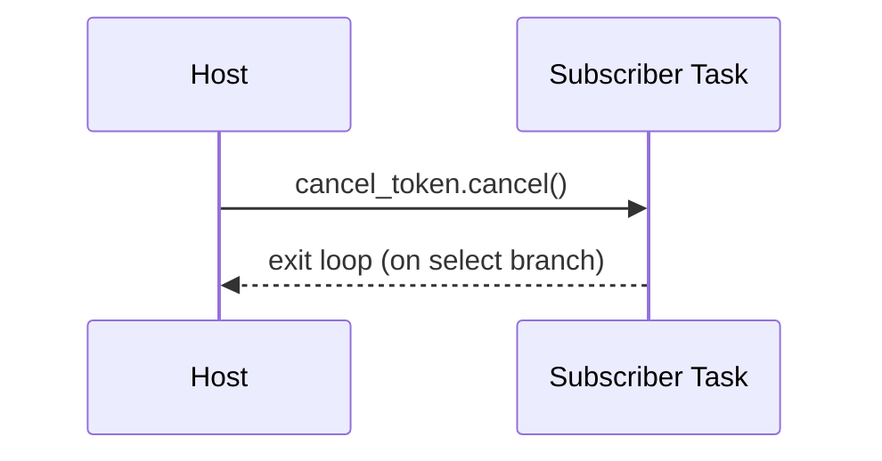

````markdown
---
title: Concurrency Model — ron-bus
crate: ron-bus
owner: Stevan White
last-reviewed: 2025-09-27
status: draft
template_version: 1.1
msrv: 1.80.0
tokio: "1.x (pinned at workspace root)"
loom: "0.7+ (dev-only)"
lite_mode: "For small library crates: fill §§1,3,4,5,10,11 and mark others N/A"
---

# Concurrency Model — ron-bus

This document makes the concurrency rules **explicit**: channels, lock discipline,
shutdown patterns, timeouts, and validation (property/loom). It complements
`docs/SECURITY.md`, `docs/CONFIG.md`, `docs/README.md`, and `docs/IDB.md`.

> **Golden rule:** never hold a lock across `.await` in supervisory or hot paths.  
> See also **Concern 1: Concurrency & Aliasing** for rationale behind “one receiver per task” and “no lock across `.await`”.

---

## 0) Lite Mode (for tiny lib crates)

`ron-bus` is a small **library** with no background tasks or I/O of its own.
We therefore fully define **§§1,3,4,5,10,11** and mark **§§2,6,7** as **N/A**.
Sections **§§8,9,12–17** are kept concise and scoped to this crate.

---

## 1) Invariants (MUST)

- [I-1] **Bounded broadcast only.** Internally uses `tokio::sync::broadcast::channel(capacity)`. Capacity is fixed at creation.
- [I-2] **Lossy overflow is observable.** If a subscriber lags, dropped messages are **counted**; publishers remain non-blocking.
- [I-3] **One receiver per task.** A `broadcast::Receiver` is **not** shared between tasks. Each consumer task owns its own `Receiver`.
- [I-4] **No locks across `.await`.** Any internal/shared state must not hold a lock while awaiting.
- [I-5] **No blocking calls on async runtime.** The library performs no blocking syscalls and no I/O.
- [I-6] **No task leaks.** The library spawns **no background tasks**. Hosts own task lifecycles.
- [I-7] **Cooperative cancellation.** Patterns shown in §11 rely on cancel tokens or watch channels managed by the host.
- [I-8] **Backpressure over buffering.** The bus favors bounded capacity + observable drops over unbounded queues.
- [I-9] **Async Drop discipline.** The library does not block in `Drop`. Teardown is host-orchestrated.

---

## 2) Runtime Topology (N/A)

`ron-bus` does not create a runtime, supervisor, or worker tasks. Topology belongs to **hosts**.

---

## 3) Channels & Backpressure

**Internal** (fixed):

| Name     | Kind      | Capacity (cfg) | Producers → Consumers | Backpressure Policy     | Drop Semantics                  |
|----------|-----------|----------------|-----------------------|-------------------------|---------------------------------|
| `bus.tx` | broadcast | `capacity`     | 1..N → 0..N           | never block publisher   | count lagged drops per receiver |

**Notes & Rules**

- Broadcast fan-out delivers each message to every **non-lagging** subscriber.
- On lag, a receiver observes `RecvError::Lagged(n)`. Host patterns must **handle and continue**.
- The library **does not** allocate or manage mpsc queues; any work queues are host-side.
- **Depth updates:** On every `RecvError::Lagged(n)`, increment `bus_overflow_dropped_total` by `n` **and** update `bus_queue_depth` to the best available estimate (e.g., a coarse global snapshot or per-receiver lag estimate). Keep updates cheap and O(1).

---

## 4) Locks & Shared State

**Allowed**
- Short, **non-awaited** critical sections for metadata (e.g., counters/OnceLock init).
- Read-mostly atomics/gauges for metrics updated without holding async locks.

**Forbidden**
- Holding any lock across `.await`.
- Sharing a `Receiver` between tasks (creates implicit aliasing & missed messages).

**Hierarchy** (if a hierarchy is ever introduced later)
1. `metrics_registry_init`
2. `local_counters`

Keep guards as tight scopes that end **before** any `.await`.

---

## 5) Timeouts, Retries, Deadlines

- **Library:** none. `ron-bus` performs no I/O and sets **no timeouts** internally.
- **Host guidance:** place timeouts around **subscriber work**, not around `recv()` itself, and reject/skip long-running handlers rather than growing buffers.

---

## 6) Cancellation & Shutdown (N/A)

- The bus has no background tasks to drain. Hosts should cancel subscriber tasks via a **watch channel** or **CancellationToken** (see §11 patterns).

---

## 7) I/O & Framing (N/A)

- `ron-bus` does no network or file I/O and defines no wire framing.

---

## 8) Error Taxonomy (Concurrency-Relevant, minimal)

| Error/State            | Where                    | Retry?   | Semantics                                  |
|------------------------|--------------------------|----------|---------------------------------------------|
| `RecvError::Lagged(n)` | subscriber `recv().await` | continue | `n` messages were dropped; count & continue.|
| `RecvError::Closed`    | subscriber `recv().await` | stop     | Sender dropped; end task gracefully.        |
| `SendError`            | publisher `send()`        | stop     | No receivers or channel closed; host decides.|

---

## 9) Metrics (Concurrency Health)

- `bus_overflow_dropped_total` (Counter) — **increment by `n`** whenever `RecvError::Lagged(n)` is observed in a subscriber loop.
- `bus_queue_depth` (Gauge) — **set on each loop tick and on `Lagged(n)`** to the best estimate of backlog/lag for the receiver set. The gauge is exported by the host and **updated by the library** (or via a small callback supplied by the host).
- Optional: `bus_subscribers_total` (Gauge) — host-maintained count of active receivers; avoid high cardinality (no per-task labels).

---

## 10) Validation Strategy

**Unit / Property**
- Fan-out correctness with **no lag**: N subscribers receive M messages.
- Forced lag: with small capacity, at least one subscriber reports `Lagged(n)`, and publishers remain non-blocking.
- **Receiver ownership**: negative test that tries to share a `Receiver` must fail or exhibit documented loss (test asserts we don’t support it).

**Loom (dev-only, lite)**
- Model: 2 publishers, 2 subscribers, capacity=2.
- Properties: no deadlocks; `Lagged(n)` is observed under pressure; no missed shutdown notifications in host patterns (smoke).

**Chaos (host-level)**
- Under load, kill/restart a subscriber task; remaining subscribers continue to receive; publishers unaffected.
- **Reload migration (host-level):** Under steady publish load and with at least one non-lagging subscriber, create a new `Bus` (different capacity), cut subscribers over using a cancel token, and drop the old bus. Assert:
  - Non-lagging subscribers observe **no message gaps** around the cutover window.
  - `bus_overflow_dropped_total` does **not** spike solely because of migration.
  - `bus_queue_depth` returns to baseline within T seconds post-cutover.

---

## 11) Code Patterns (Copy-Paste)

### 11.1 Unique receiver per task (canonical, with metrics)
```rust
let mut rx = bus.subscribe(); // each task gets its own Receiver
tokio::spawn(async move {
    loop {
        match rx.recv().await {
            Ok(ev) => {
                // Update queue depth gauge periodically (cheap, O(1))
                metrics::bus_queue_depth().set(estimate_bus_depth());
                handle_event(ev).await;
            }
            Err(tokio::sync::broadcast::error::RecvError::Lagged(n)) => {
                // Count dropped messages and update depth gauge
                metrics::bus_overflow_dropped_total().inc_by(n as u64);
                metrics::bus_queue_depth().set(estimate_bus_depth());
                // continue consuming
            }
            Err(tokio::sync::broadcast::error::RecvError::Closed) => break, // graceful end
        }
    }
});

/// Example depth estimator; keep cheap and low-cardinality.
/// In simplest form, return a coarse, host-maintained snapshot.
/// Do not block, allocate, or hold locks across .await here.
fn estimate_bus_depth() -> i64 {
    // If you track per-receiver lag, return that; else a coarse global estimate.
    bus_depth_snapshot()
}
````

### 11.2 Cooperative cancellation (host-side idiom) — with metrics

```rust
use tokio_util::sync::CancellationToken;

let cancel = CancellationToken::new();
let mut rx = bus.subscribe();
let child = cancel.child_token();

let h = tokio::spawn(async move {
    loop {
        tokio::select! {
            _ = child.cancelled() => break,
            res = rx.recv() => match res {
                Ok(ev) => {
                    metrics::bus_queue_depth().set(estimate_bus_depth());
                    handle_event(ev).await;
                }
                Err(tokio::sync::broadcast::error::RecvError::Lagged(n)) => {
                    metrics::bus_overflow_dropped_total().inc_by(n as u64);
                    metrics::bus_queue_depth().set(estimate_bus_depth());
                }
                Err(tokio::sync::broadcast::error::RecvError::Closed) => break,
            }
        }
    }
});
// later: cancel.cancel(); let _ = h.await;
```

### 11.3 Publisher that never blocks

```rust
let tx = bus.sender();
// send is synchronous & non-blocking for broadcast
if let Err(_e) = tx.send(Event::ConfigUpdated { version: v }) {
    // no receivers: decide if that's OK; typically fine during shutdown
}
```

### 11.4 Strict “no lock across `.await`”

```rust
// GOOD: compute under lock, then drop guard before await
let snapshot = {
    let g = state.lock();         // or parking_lot::Mutex
    g.snapshot()                  // quick, no .await
};
do_async_work(snapshot).await;    // guard is dropped here
```

---

## 12) Configuration Hooks (Quick Reference)

* `capacity` (required at construction; **not** hot-swappable)
* `overflow_warn_rate_per_min` (host logging policy)
* `metrics_namespace`, `emit_amnesia_label` (host metrics wiring)

See `docs/CONFIG.md` for full schema and reload guidance.

---

## 13) Known Trade-offs / Nonstrict Areas

* **Lossy overflow vs. blocking publishers:** We choose **lossy + observable** to preserve liveness.
* **Per-receiver lag accounting:** Aggregate counters may lose per-receiver granularity; hosts needing per-task detail should attach a task-local label or separate gauge per subscriber (with care to avoid high-cardinality metrics).

---

## 14) Mermaid Diagrams

### 14.1 Publisher → Bus → Subscribers (bounded, lossy)

```mermaid
flowchart LR
  P[Publisher send()] --> BUS[(broadcast(capacity))]
  BUS --> RX1[Subscriber A (unique receiver)]
  BUS --> RX2[Subscriber B (unique receiver)]
  BUS -->|lag| DROP[overflow_dropped_total++ & queue_depth update]
```

**Text description:** The publisher sends into a bounded broadcast channel. Each subscriber owns a unique receiver. If a subscriber lags, older messages are dropped for that receiver, counters increment, and `bus_queue_depth` is updated.

### 14.2 Host-orchestrated cancellation (pattern)



**Text description:** The host cancels via a token/watch; the subscriber loop exits cooperatively.

---

## 15) CI & Lints (Enforcement)

* **Clippy wall:** `-D warnings`, enable `clippy::await_holding_lock`, and consider `clippy::mutex_atomic`.
* **No background tasks:** tests assert that constructing/dropping `Bus` does not spawn tasks.
* **Loom job (optional):** small suite behind `--cfg loom`.
* **Doc test:** reject examples that share a `Receiver` across tasks.

---

## 16) Schema Generation (Optional)

If we ever add additional internal state, keep a tiny registry (or attributes) to auto-render the Channels table and assert it in a golden test to prevent drift.

---

## 17) Review & Maintenance

* Review on any change to `Event` shape, channel capacity semantics, or subscriber patterns.
* Keep this file **in lockstep** with `CONFIG.md` and `IDB.md` (capacity & overflow rules).

```
```
