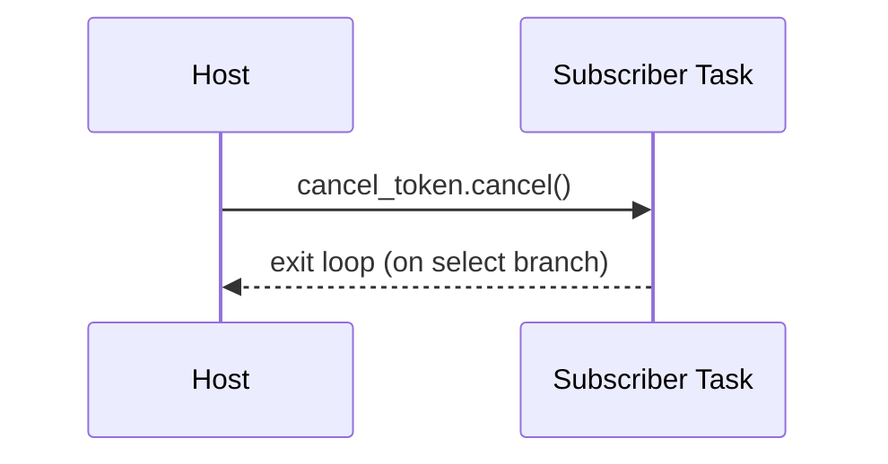

# Combined Markdown

_Source directory_: `crates/ron-bus/docs`  
_Files combined_: 13  
_Recursive_: 0

---

### Table of Contents

- API.MD
- CONCURRENCY.MD
- CONFIG.MD
- GOVERNANCE.MD
- IDB.md
- INTEROP.MD
- OBSERVABILITY.MD
- OLD_README.md
- PERFORMANCE.MD
- QUANTUM.MD
- RUNBOOK.MD
- SECURITY.MD
- TESTS.MD

---

## API.MD
_File 1 of 13_


**Path:** `crates/ron-bus/docs/API.md`

````markdown
---
title: API Surface & SemVer Reference — ron-bus
status: draft
msrv: 1.80.0
last-updated: 2025-09-27
audience: contributors, auditors, API consumers
---

# API.md — ron-bus

## 0. Purpose

This document captures the **public API surface** of `ron-bus` and the rules for changing it:

- Snapshot of exported types/functions/modules.
- **SemVer discipline** (what’s additive vs. breaking).
- CI enforcement (`cargo public-api`, optional `cargo semver-checks`).
- Aligns with `CHANGELOG.md` and the invariants in `docs/IDB.md`.

> Canon note: **monomorphic surface** — no public generics on `Bus` or its primary methods.

---

## 1. Public API Surface (Authoritative Spec)

Generated in CI with:

```bash
cargo public-api -p ron-bus --simplified
````

> Until code lands, this section defines the **intended** public symbols. Once implemented, CI must match this list (or the diff must be acknowledged via SemVer + CHANGELOG).

### Current Surface (intended)

```text
# Root items
pub struct Bus
pub enum Event
pub struct BusConfig
pub enum BusError

# Bus impl
impl Bus {
    pub fn new(cfg: impl Into<BusConfig>) -> Result<Self, BusError>
    pub fn sender(&self) -> tokio::sync::broadcast::Sender<Event>
    pub fn subscribe(&self) -> tokio::sync::broadcast::Receiver<Event>
    pub fn capacity(&self) -> usize
}

# Event (kernel-aligned, non-exhaustive)
#[non_exhaustive]
pub enum Event {
    Health { service: String, ok: bool },
    ConfigUpdated { version: u64 },
    ServiceCrashed { service: String, reason: String },
    Shutdown,
}

# Config (host-constructed, serde-enabled)
#[non_exhaustive]
pub struct BusConfig {
    pub capacity: u32,
    pub overflow_warn_rate_per_min: u32,
    pub metrics_namespace: String,
    pub emit_amnesia_label: bool,
}
impl Default for BusConfig {}
impl BusConfig {
    pub fn validate(&self) -> Result<(), String>;
}

# Errors (non-exhaustive)
#[non_exhaustive]
pub enum BusError {
    Config(String),           // invalid BusConfig
    Closed,                   // channel closed (no subscribers)
}

# Optional feature gates (public only as features, not symbols)
# - "tracing"   : add spans around publish/recv (no API shape change)
# - "loom"      : dev-only testing cfg (no API surface)
```

**Re-exports (if any, kept minimal):**

* None by default. Kernel crate may re-export `ron_bus::Bus` and `ron_bus::Event` from its own surface.

**Not public:**

* No public traits.
* No generic type parameters on `Bus` or its primary methods.
* No macros/proc-macros.

---

## 2. SemVer Discipline

### Additive (Minor / Non-Breaking)

* Adding new inherent methods on `Bus` **without** changing existing signatures.
* Adding **new `Event` variants** (enum is `#[non_exhaustive]`).
* Adding fields to `BusConfig` (struct is `#[non_exhaustive]`) with sane defaults.
* Adding optional features (off by default).

### Breaking (Major)

* Removing/renaming any existing public item.
* Changing `Bus` method signatures or return types.
* Making `Event` exhaustive or changing existing variant fields.
* Changing `BusConfig` field semantics or defaults in a way that alters behavior.
* Introducing generics on `Bus` or its primary methods (forbidden by canon).

### Patch

* Documentation or comment-only changes.
* Internal refactors that do not change symbols or documented behavior.
* Performance improvements that preserve semantics.

---

## 3. Stability Guarantees

* **MSRV:** `1.80.0` (pinned workspace-wide).
* **No `unsafe`** in this crate (`#![forbid(unsafe_code)]`).
* **Monomorphic surface:** no public generics on `Bus` (enforced in CI via `cargo public-api` diff checks).
* **No public leakage of internals:** The return types deliberately expose Tokio broadcast handles, but the `Bus` type itself owns the capacity and semantics.
* All public items must have rustdoc (`#![deny(missing_docs)]`).

---

## 4. Invariants (API-Level)

* The public API must reflect the **bounded, lossy, observable** semantics:

  * Construction via `Bus::new` enforces capacity ≥ 2 (validation errors via `BusError::Config`).
  * `subscribe()` returns a **unique** receiver per call; examples show **one receiver per task**.
  * Overflow is observable via host metrics, not via API changes.
* **Event** and **BusConfig** are `#[non_exhaustive]` to allow additive growth.
* The crate must remain **I/O-free and task-free** — API does not grow to include network endpoints, threads, or persistence.

---

## 5. Tooling

* **cargo public-api**

  * Baseline snapshots stored under `/docs/api-history/ron-bus/<version>.txt`.
  * PRs must show diffs; breaking diffs require SemVer bump rationale.
* **cargo semver-checks** (recommended)

  * Guards against accidental breaking changes.
* **cargo doc**

  * Examples must follow concurrency rules (no shared `Receiver`, handle `Lagged(n)`).

---

## 6. CI & Gates

* **Gate A (Surface Lock):**

  ```bash
  cargo public-api -p ron-bus --simplified
  ```

  Fail PR if surface changes without matching CHANGELOG entry + SemVer plan.

* **Gate B (SemVer Checks):**

  ```bash
  cargo semver-checks -p ron-bus
  ```

  Required for non-patch releases.

* **Gate C (Lint Wall):**

  * `-D warnings`
  * Deny `clippy::await_holding_lock`, `clippy::unwrap_used`, `clippy::expect_used`.

* **Gate D (Docs):**

  * `#![deny(missing_docs)]` and doctests must pass.

---

## 7. Acceptance Checklist (DoD)

* [ ] Current API snapshot generated & saved in `/docs/api-history/ron-bus/<ver>.txt`.
* [ ] `CHANGELOG.md` updated with surface and behavior notes.
* [ ] `cargo public-api` gate green (or acknowledged with SemVer bump).
* [ ] (Optional) `cargo semver-checks` green for non-breaking PRs.
* [ ] Rustdoc complete; examples reflect **one receiver per task** and `Lagged(n)` handling.
* [ ] No public generics on `Bus` or its primary methods.

---

## 8. Appendix

### References

* Rust SemVer: [https://doc.rust-lang.org/cargo/reference/semver.html](https://doc.rust-lang.org/cargo/reference/semver.html)
* cargo-public-api: [https://github.com/Enselic/cargo-public-api](https://github.com/Enselic/cargo-public-api)
* cargo-semver-checks: [https://github.com/obi1kenobi/cargo-semver-checks](https://github.com/obi1kenobi/cargo-semver-checks)

### Perfection Gates tie-in

* **Gate G:** No undocumented API surface (rustdoc coverage).
* **Gate H:** Breaking changes require **major** version bump + migration notes.
* **Gate J:** CHANGELOG alignment enforced by CI.

### History (initialize at v1.0.0)

* v1.0.0 — Initial monomorphic surface:

  * `Bus::{new,sender,subscribe,capacity}`
  * `Event::{Health,ConfigUpdated,ServiceCrashed,Shutdown} (non-exhaustive)`
  * `BusConfig::{capacity,overflow_warn_rate_per_min,metrics_namespace,emit_amnesia_label} (non-exhaustive)`
  * `BusError::{Config,Closed}`

```


---

## CONCURRENCY.MD
_File 2 of 13_


````markdown
---
title: Concurrency Model — ron-bus
crate: ron-bus
owner: Stevan White
last-reviewed: 2025-09-27
status: draft
template_version: 1.1
msrv: 1.80.0
tokio: "1.x (pinned at workspace root)"
loom: "0.7+ (dev-only)"
lite_mode: "For small library crates: fill §§1,3,4,5,10,11 and mark others N/A"
---

# Concurrency Model — ron-bus

This document makes the concurrency rules **explicit**: channels, lock discipline,
shutdown patterns, timeouts, and validation (property/loom). It complements
`docs/SECURITY.md`, `docs/CONFIG.md`, `docs/README.md`, and `docs/IDB.md`.

> **Golden rule:** never hold a lock across `.await` in supervisory or hot paths.  
> See also **Concern 1: Concurrency & Aliasing** for rationale behind “one receiver per task” and “no lock across `.await`”.

---

## 0) Lite Mode (for tiny lib crates)

`ron-bus` is a small **library** with no background tasks or I/O of its own.
We therefore fully define **§§1,3,4,5,10,11** and mark **§§2,6,7** as **N/A**.
Sections **§§8,9,12–17** are kept concise and scoped to this crate.

---

## 1) Invariants (MUST)

- [I-1] **Bounded broadcast only.** Internally uses `tokio::sync::broadcast::channel(capacity)`. Capacity is fixed at creation.
- [I-2] **Lossy overflow is observable.** If a subscriber lags, dropped messages are **counted**; publishers remain non-blocking.
- [I-3] **One receiver per task.** A `broadcast::Receiver` is **not** shared between tasks. Each consumer task owns its own `Receiver`.
- [I-4] **No locks across `.await`.** Any internal/shared state must not hold a lock while awaiting.
- [I-5] **No blocking calls on async runtime.** The library performs no blocking syscalls and no I/O.
- [I-6] **No task leaks.** The library spawns **no background tasks**. Hosts own task lifecycles.
- [I-7] **Cooperative cancellation.** Patterns shown in §11 rely on cancel tokens or watch channels managed by the host.
- [I-8] **Backpressure over buffering.** The bus favors bounded capacity + observable drops over unbounded queues.
- [I-9] **Async Drop discipline.** The library does not block in `Drop`. Teardown is host-orchestrated.

---

## 2) Runtime Topology (N/A)

`ron-bus` does not create a runtime, supervisor, or worker tasks. Topology belongs to **hosts**.

---

## 3) Channels & Backpressure

**Internal** (fixed):

| Name     | Kind      | Capacity (cfg) | Producers → Consumers | Backpressure Policy     | Drop Semantics                  |
|----------|-----------|----------------|-----------------------|-------------------------|---------------------------------|
| `bus.tx` | broadcast | `capacity`     | 1..N → 0..N           | never block publisher   | count lagged drops per receiver |

**Notes & Rules**

- Broadcast fan-out delivers each message to every **non-lagging** subscriber.
- On lag, a receiver observes `RecvError::Lagged(n)`. Host patterns must **handle and continue**.
- The library **does not** allocate or manage mpsc queues; any work queues are host-side.
- **Depth updates:** On every `RecvError::Lagged(n)`, increment `bus_overflow_dropped_total` by `n` **and** update `bus_queue_depth` to the best available estimate (e.g., a coarse global snapshot or per-receiver lag estimate). Keep updates cheap and O(1).

---

## 4) Locks & Shared State

**Allowed**
- Short, **non-awaited** critical sections for metadata (e.g., counters/OnceLock init).
- Read-mostly atomics/gauges for metrics updated without holding async locks.

**Forbidden**
- Holding any lock across `.await`.
- Sharing a `Receiver` between tasks (creates implicit aliasing & missed messages).

**Hierarchy** (if a hierarchy is ever introduced later)
1. `metrics_registry_init`
2. `local_counters`

Keep guards as tight scopes that end **before** any `.await`.

---

## 5) Timeouts, Retries, Deadlines

- **Library:** none. `ron-bus` performs no I/O and sets **no timeouts** internally.
- **Host guidance:** place timeouts around **subscriber work**, not around `recv()` itself, and reject/skip long-running handlers rather than growing buffers.

---

## 6) Cancellation & Shutdown (N/A)

- The bus has no background tasks to drain. Hosts should cancel subscriber tasks via a **watch channel** or **CancellationToken** (see §11 patterns).

---

## 7) I/O & Framing (N/A)

- `ron-bus` does no network or file I/O and defines no wire framing.

---

## 8) Error Taxonomy (Concurrency-Relevant, minimal)

| Error/State            | Where                    | Retry?   | Semantics                                  |
|------------------------|--------------------------|----------|---------------------------------------------|
| `RecvError::Lagged(n)` | subscriber `recv().await` | continue | `n` messages were dropped; count & continue.|
| `RecvError::Closed`    | subscriber `recv().await` | stop     | Sender dropped; end task gracefully.        |
| `SendError`            | publisher `send()`        | stop     | No receivers or channel closed; host decides.|

---

## 9) Metrics (Concurrency Health)

- `bus_overflow_dropped_total` (Counter) — **increment by `n`** whenever `RecvError::Lagged(n)` is observed in a subscriber loop.
- `bus_queue_depth` (Gauge) — **set on each loop tick and on `Lagged(n)`** to the best estimate of backlog/lag for the receiver set. The gauge is exported by the host and **updated by the library** (or via a small callback supplied by the host).
- Optional: `bus_subscribers_total` (Gauge) — host-maintained count of active receivers; avoid high cardinality (no per-task labels).

---

## 10) Validation Strategy

**Unit / Property**
- Fan-out correctness with **no lag**: N subscribers receive M messages.
- Forced lag: with small capacity, at least one subscriber reports `Lagged(n)`, and publishers remain non-blocking.
- **Receiver ownership**: negative test that tries to share a `Receiver` must fail or exhibit documented loss (test asserts we don’t support it).

**Loom (dev-only, lite)**
- Model: 2 publishers, 2 subscribers, capacity=2.
- Properties: no deadlocks; `Lagged(n)` is observed under pressure; no missed shutdown notifications in host patterns (smoke).

**Chaos (host-level)**
- Under load, kill/restart a subscriber task; remaining subscribers continue to receive; publishers unaffected.
- **Reload migration (host-level):** Under steady publish load and with at least one non-lagging subscriber, create a new `Bus` (different capacity), cut subscribers over using a cancel token, and drop the old bus. Assert:
  - Non-lagging subscribers observe **no message gaps** around the cutover window.
  - `bus_overflow_dropped_total` does **not** spike solely because of migration.
  - `bus_queue_depth` returns to baseline within T seconds post-cutover.

---

## 11) Code Patterns (Copy-Paste)

### 11.1 Unique receiver per task (canonical, with metrics)
```rust
let mut rx = bus.subscribe(); // each task gets its own Receiver
tokio::spawn(async move {
    loop {
        match rx.recv().await {
            Ok(ev) => {
                // Update queue depth gauge periodically (cheap, O(1))
                metrics::bus_queue_depth().set(estimate_bus_depth());
                handle_event(ev).await;
            }
            Err(tokio::sync::broadcast::error::RecvError::Lagged(n)) => {
                // Count dropped messages and update depth gauge
                metrics::bus_overflow_dropped_total().inc_by(n as u64);
                metrics::bus_queue_depth().set(estimate_bus_depth());
                // continue consuming
            }
            Err(tokio::sync::broadcast::error::RecvError::Closed) => break, // graceful end
        }
    }
});

/// Example depth estimator; keep cheap and low-cardinality.
/// In simplest form, return a coarse, host-maintained snapshot.
/// Do not block, allocate, or hold locks across .await here.
fn estimate_bus_depth() -> i64 {
    // If you track per-receiver lag, return that; else a coarse global estimate.
    bus_depth_snapshot()
}
````

### 11.2 Cooperative cancellation (host-side idiom) — with metrics

```rust
use tokio_util::sync::CancellationToken;

let cancel = CancellationToken::new();
let mut rx = bus.subscribe();
let child = cancel.child_token();

let h = tokio::spawn(async move {
    loop {
        tokio::select! {
            _ = child.cancelled() => break,
            res = rx.recv() => match res {
                Ok(ev) => {
                    metrics::bus_queue_depth().set(estimate_bus_depth());
                    handle_event(ev).await;
                }
                Err(tokio::sync::broadcast::error::RecvError::Lagged(n)) => {
                    metrics::bus_overflow_dropped_total().inc_by(n as u64);
                    metrics::bus_queue_depth().set(estimate_bus_depth());
                }
                Err(tokio::sync::broadcast::error::RecvError::Closed) => break,
            }
        }
    }
});
// later: cancel.cancel(); let _ = h.await;
```

### 11.3 Publisher that never blocks

```rust
let tx = bus.sender();
// send is synchronous & non-blocking for broadcast
if let Err(_e) = tx.send(Event::ConfigUpdated { version: v }) {
    // no receivers: decide if that's OK; typically fine during shutdown
}
```

### 11.4 Strict “no lock across `.await`”

```rust
// GOOD: compute under lock, then drop guard before await
let snapshot = {
    let g = state.lock();         // or parking_lot::Mutex
    g.snapshot()                  // quick, no .await
};
do_async_work(snapshot).await;    // guard is dropped here
```

---

## 12) Configuration Hooks (Quick Reference)

* `capacity` (required at construction; **not** hot-swappable)
* `overflow_warn_rate_per_min` (host logging policy)
* `metrics_namespace`, `emit_amnesia_label` (host metrics wiring)

See `docs/CONFIG.md` for full schema and reload guidance.

---

## 13) Known Trade-offs / Nonstrict Areas

* **Lossy overflow vs. blocking publishers:** We choose **lossy + observable** to preserve liveness.
* **Per-receiver lag accounting:** Aggregate counters may lose per-receiver granularity; hosts needing per-task detail should attach a task-local label or separate gauge per subscriber (with care to avoid high-cardinality metrics).

---

## 14) Mermaid Diagrams

### 14.1 Publisher → Bus → Subscribers (bounded, lossy)

```mermaid
flowchart LR
  P[Publisher send()] --> BUS[(broadcast(capacity))]
  BUS --> RX1[Subscriber A (unique receiver)]
  BUS --> RX2[Subscriber B (unique receiver)]
  BUS -->|lag| DROP[overflow_dropped_total++ & queue_depth update]
```

**Text description:** The publisher sends into a bounded broadcast channel. Each subscriber owns a unique receiver. If a subscriber lags, older messages are dropped for that receiver, counters increment, and `bus_queue_depth` is updated.

### 14.2 Host-orchestrated cancellation (pattern)



**Text description:** The host cancels via a token/watch; the subscriber loop exits cooperatively.

---

## 15) CI & Lints (Enforcement)

* **Clippy wall:** `-D warnings`, enable `clippy::await_holding_lock`, and consider `clippy::mutex_atomic`.
* **No background tasks:** tests assert that constructing/dropping `Bus` does not spawn tasks.
* **Loom job (optional):** small suite behind `--cfg loom`.
* **Doc test:** reject examples that share a `Receiver` across tasks.

---

## 16) Schema Generation (Optional)

If we ever add additional internal state, keep a tiny registry (or attributes) to auto-render the Channels table and assert it in a golden test to prevent drift.

---

## 17) Review & Maintenance

* Review on any change to `Event` shape, channel capacity semantics, or subscriber patterns.
* Keep this file **in lockstep** with `CONFIG.md` and `IDB.md` (capacity & overflow rules).

```
```


---

## CONFIG.MD
_File 3 of 13_


**Path:** `crates/ron-bus/docs/CONFIG.md`

````markdown
---
title: Configuration — ron-bus
crate: ron-bus
owner: Stevan White
last-reviewed: 2025-09-27
status: draft
template_version: 1.0
---

# Configuration — ron-bus

This document defines **all configuration** for `ron-bus`, including sources,
precedence, schema (types/defaults), validation, feature flags, live-reload behavior,
and security implications. It complements `README.md`, `docs/IDB.md`, and `docs/SECURITY.md`.

> **Tiering:**  
> - **Library crate (this crate):** The bus does **not** read files/env/CLI. The **host** process is responsible for reading configuration and constructing `Bus::new(cfg)`.  
> - **Service crates (N/A here):** Network binds, /healthz, TLS, etc., are **out of scope** for `ron-bus`.

---

## 1) Sources & Precedence (Authoritative)

**ron-bus does not fetch configuration directly.** The host composes a `BusConfig` (or passes a capacity integer) from its own sources. Recommended precedence **in the host**:

1. **Process flags** (CLI)  
2. **Environment variables**  
3. **Config file** (e.g., `Config.toml` of the host)  
4. **Built-in defaults** (hard-coded in host)

> When the host supports dynamic reload, recompute the effective config under the same precedence and **recreate** the bus if needed (see §5).

**Supported file formats:** (host choice) TOML preferred; JSON optional.

**Suggested host env prefix:** `RON_BUS_` (e.g., `RON_BUS_CAPACITY=256`).

---

## 2) Quickstart Examples

> Examples show **host-side** usage. `ron-bus` itself does not parse env/CLI.

### 2.1 Minimal (host constructs bus with default capacity)

```rust
// host/src/main.rs (example)
use ron_bus::{Bus, Event};

let bus = Bus::new(Default::default()); // uses BusConfig::default() or capacity default
let tx = bus.sender();
let mut rx = bus.subscribe();
````

### 2.2 Host config file (TOML snippet)

```toml
# Host's Config.toml
[bus]
capacity = 256                      # bounded broadcast buffer (messages)
overflow_warn_rate_per_min = 60     # rate-limit WARNs for overflow
metrics_namespace = "ron_bus"       # label/prefix used by host metrics registry
emit_amnesia_label = true           # attach amnesia={on|off} to metrics
```

### 2.3 Host env and CLI (override file)

```bash
# If your platform has a global amnesia toggle:
RON_AMNESIA=on \
RON_BUS_EMIT_AMNESIA_LABEL=true \
RON_BUS_CAPACITY=512 \
RON_BUS_OVERFLOW_WARN_RATE_PER_MIN=120 \
cargo run -p <host-crate> -- --bus-capacity 512
```

*(Host maps `RON_AMNESIA` → metrics label value `amnesia=on|off` when `emit_amnesia_label=true`.)*

---

## 3) Schema (Typed, With Defaults)

> **Prefix convention for hosts:** `RON_BUS_…`
> Durations are expressed by hosts; `ron-bus` only needs integers/booleans/strings below.

| Key / Host Env Var                                                  | Type       |   Default | Description                                                                                                   | Security Notes                                   |
| ------------------------------------------------------------------- | ---------- | --------: | ------------------------------------------------------------------------------------------------------------- | ------------------------------------------------ |
| `capacity` / `RON_BUS_CAPACITY`                                     | u32        |       256 | **Bounded** broadcast buffer (per Tokio `broadcast::channel`).                                                | Too small → frequent loss; too big → memory use. |
| `overflow_warn_rate_per_min` / `RON_BUS_OVERFLOW_WARN_RATE_PER_MIN` | u32        |        60 | Rate-limit for WARN logs on overflow (max WARN events/minute, per host).                                      | Prevents log spam (DoS via log amplification).   |
| `metrics_namespace` / `RON_BUS_METRICS_NAMESPACE`                   | string     | "ron_bus" | Namespace/prefix the **host** may use when registering Prometheus metrics that ron-bus updates.               | Keep namespaces stable for dashboards.           |
| `emit_amnesia_label` / `RON_BUS_EMIT_AMNESIA_LABEL`                 | bool       |      true | Whether the host attaches metrics label `amnesia` with values **`on`** or **`off`** to bus metrics.           | Label only; no behavioral change.                |
| *(read-only)* `bus_queue_depth`                                     | gauge<i64> |       N/A | **Gauge exposed by the host**; updated by ron-bus to reflect estimated backlog/lag under `metrics_namespace`. | N/A                                              |

> **N/A for this crate:** network binds, TLS, timeouts, body caps, UDS, auth. Those belong to services that **use** the bus, not to `ron-bus` itself.

---

## 4) Validation Rules (Fail-Closed)

Validation occurs when the **host** constructs `BusConfig` (or calls `Bus::new`):

* `capacity >= 2` (recommended `>= 8`; `0` or `1` is **invalid**, return error).
* `overflow_warn_rate_per_min >= 1`.
* `metrics_namespace` non-empty ASCII identifier (for Prometheus label safety).

**On violation:** return an error to the caller (do **not** panic). The host decides whether to exit or patch.

---

## 5) Dynamic Reload (If Supported by Host)

* **Trigger:** The host may use SIGHUP, a control plane, or a `ConfigUpdated { version }` event elsewhere.
* **Reload semantics in ron-bus:**

  * `capacity` is **not** hot-swappable (Tokio `broadcast` capacity is fixed).
  * To change `capacity`, **create a new `Bus`** and migrate subscribers (spin up new receivers, then drop old).
  * `overflow_warn_rate_per_min`, `metrics_namespace`, `emit_amnesia_label` are **host-side** concerns (no behavioral change in bus logic).
* **Atomicity:** Construct a new `Bus` off to the side; swap handles under a short, non-`await`ed critical section in the host.
* **Audit:** The host may emit a `KernelEvent::ConfigUpdated { version }` and structured diff (excluding secrets; none here).

---

## 6) CLI Flags (Canonical for Hosts)

> `ron-bus` is library-only. Suggested **host** flags:

```
--bus-capacity <num>                   # override capacity
--bus-overflow-warn-rate <per_min>    # override WARN rate limit
--bus-metrics-namespace <string>      # override namespace
--bus-amnesia-label <true|false>      # toggle emitting amnesia={on|off} label in exported metrics
```

---

## 7) Feature Flags (Cargo)

| Feature   | Default | Effect                                                                     |
| --------- | ------: | -------------------------------------------------------------------------- |
| `tracing` |     off | Enable light spans around publish/recv in examples (library remains pure). |
| `loom`    |     off | Dev-only testing to model interleavings (not shipped).                     |

> No TLS/PQ/etc. features here; cryptography and networking are out of scope.

---

## 8) Security Implications

* **Capacity as a guardrail:** Prevents slow consumers from wedging publishers (bounded loss by design).
* **Logging overflow:** Rate-limit WARNs via host to avoid log-amplification DoS.
* **No secrets:** The bus must not transport secrets as raw payloads (policy: keep sensitive data at the edge or use dedicated KMS/policy crates).
* **Amnesia neutrality:** Behavior identical whether `amnesia` is on/off; the label simply aids dashboards.

See `docs/SECURITY.md` for the threat subset; the bus is pure in-proc and has no I/O.

---

## 9) Compatibility & Migration

* **Minor (additive):** You may add fields with sane defaults (host side).
* **Renames:** Keep old env alias for ≥1 minor; log a deprecation warning (host side).
* **Breaking:** Changing semantics (e.g., meaning of `capacity`) requires a **major** version bump and documented migration steps.

**Deprecation table (maintained by host):**

| Old Key                  | New Key                              | Removal Target | Notes             |
| ------------------------ | ------------------------------------ | -------------: | ----------------- |
| `RON_BUS_AMNESIA` (bool) | `RON_BUS_EMIT_AMNESIA_LABEL`         |         v2.0.0 | Clarified intent. |
| `RON_BUS_WARN_RATE`      | `RON_BUS_OVERFLOW_WARN_RATE_PER_MIN` |         v2.0.0 | Units clarified.  |

---

## 10) Reference Implementation (Rust)

> Copy-paste into `crates/ron-bus/src/config.rs` (or inline within `lib.rs` if you prefer a single file).
> Comments included intentionally.

```rust
// crates/ron-bus/src/config.rs
use serde::{Deserialize, Serialize};

/// Library-facing configuration for the bus. Constructed by the host.
#[derive(Debug, Clone, Serialize, Deserialize)]
pub struct BusConfig {
    /// Bounded capacity for the Tokio broadcast channel.
    /// MUST be >= 2; recommended >= 8.
    pub capacity: u32,

    /// Max WARN logs per minute the host should emit for overflow.
    /// This is a host concern; the bus exposes counters/gauges only.
    pub overflow_warn_rate_per_min: u32,

    /// Optional namespace the host may use when registering metrics.
    /// ron-bus does not register metrics itself; it only updates handles.
    pub metrics_namespace: String,

    /// Whether the host should annotate exported metrics with an `amnesia` label.
    /// Expected values: "on" or "off" (the host maps its own env to this).
    pub emit_amnesia_label: bool,
}

impl Default for BusConfig {
    fn default() -> Self {
        Self {
            capacity: 256,
            overflow_warn_rate_per_min: 60,
            metrics_namespace: "ron_bus".to_string(),
            emit_amnesia_label: true,
        }
    }
}

impl BusConfig {
    /// Strict validation. Return an error to the host if invalid.
    pub fn validate(&self) -> Result<(), String> {
        if self.capacity < 2 {
            return Err("bus.capacity must be >= 2 (recommended >= 8)".into());
        }
        if self.overflow_warn_rate_per_min == 0 {
            return Err("bus.overflow_warn_rate_per_min must be >= 1".into());
        }
        if self.metrics_namespace.trim().is_empty() {
            return Err("bus.metrics_namespace must be non-empty".into());
        }
        Ok(())
    }
}

// Example constructor in lib:
//
// impl Bus {
//     pub fn new(cfg: impl Into<BusConfig>) -> Result<Self, BusError> {
//         let cfg = cfg.into();
//         cfg.validate().map_err(BusError::Config)?;
//         let (tx, _rx) = tokio::sync::broadcast::channel::<Event>(cfg.capacity as usize);
//         Ok(Self { tx, cap: cfg.capacity as usize /* ... */ })
//     }
// }
```

### 10.1 Host-side parsing example (figment)

```rust
// host/src/config_bus.rs (example)
use figment::{
    providers::{Format, Toml, Env},
    Figment,
};
use serde::Deserialize;

#[derive(Debug, Clone, Deserialize, Default)]
struct HostBusCfg {
    #[serde(default)]
    bus: ron_bus::config::BusConfig, // reuse the library's BusConfig
}

fn load_bus_cfg() -> ron_bus::config::BusConfig {
    // Load Config.toml (optional) + env with prefix RON_BUS_
    let figment = Figment::new()
        .merge(Toml::file("Config.toml").nested())
        .merge(Env::prefixed("RON_BUS_").split("_"));

    let cfg: HostBusCfg = figment.extract().unwrap_or_default();
    let bus = cfg.bus;
    bus.validate().expect("invalid bus config");
    bus
}

// Example mapping (Env):
// RON_BUS_CAPACITY=512
// RON_BUS_OVERFLOW_WARN_RATE_PER_MIN=120
// RON_BUS_METRICS_NAMESPACE=ron_bus
// RON_BUS_EMIT_AMNESIA_LABEL=true
//
// Optional global flag the host may have:
// RON_AMNESIA=on  -> host adds metrics label amnesia=on (if emit_amnesia_label=true)
```

---

## 11) Test Matrix

| Scenario                          | Expected Outcome                                                                                           |
| --------------------------------- | ---------------------------------------------------------------------------------------------------------- |
| `capacity=0` or `1`               | `Err("bus.capacity must be >= 2")`                                                                         |
| `overflow_warn_rate_per_min=0`    | `Err("must be >= 1")`                                                                                      |
| `metrics_namespace=""`            | `Err("non-empty")`                                                                                         |
| `capacity=8` (saturation load)    | Valid; overflow counter increases; host WARNs rate-limited; publishers non-blocking                        |
| `queue_depth` under burst load    | Host `bus_queue_depth` Gauge increases during burst and returns to baseline after; publishers non-blocking |
| `reload: capacity changed`        | Host constructs new bus; subscribers migrate; old bus dropped                                              |
| `reload: namespace/label changed` | No bus behavior change; only host metrics wiring affected                                                  |

---

## 12) Mermaid — Config Resolution Flow (Host + Bus)

```mermaid
flowchart TB
  A[Defaults (BusConfig::default)] --> M[Host Merge]
  B[Host Config File] --> M
  C[Host Env Vars (RON_BUS_*)] --> M
  E[Host CLI Flags] --> M
  M --> V{BusConfig::validate}
  V -- ok --> B2[Bus::new(cfg)]
  V -- fail --> X[Return error to host]
  style B2 fill:#0369a1,stroke:#0c4a6e,color:#fff
```

---

## 13) Operational Notes

* **Dashboarding:** Plot `bus_overflow_dropped_total` (Counter) and `bus_queue_depth` (Gauge). Label with `service` and (optionally) `amnesia`.
* **Tuning:** Prefer fixing slow subscribers first. Increase `capacity` only if overflow is chronic and bounded.
* **Reload strategy:** For `capacity` changes, **spin up a new bus** and cut subscribers over with a cancel token.
* **Documentation:** Any host that uses the bus should include its bus-related knobs in its own `CONFIG.md` and link back here.

```


---

## GOVERNANCE.MD
_File 4 of 13_


---

Here’s the **refactored, GOVERNANCE.md for ron-bus**, scoped to its role:

```markdown
# 🏛 GOVERNANCE.md — ron-bus

---
title: Governance & Integrity Guarantees
status: draft
msrv: 1.80.0
last-updated: 2025-09-27
audience: contributors, ops, auditors, stakeholders
crate-type: lib
---

# GOVERNANCE.md

## 0. Purpose

`ron-bus` is a **pure in-process broadcast bus** (Tokio `broadcast` abstraction).  
It does not mint, settle, or distribute value — but it is the **substrate through which governance events flow**.

This document defines:

- The **rules of engagement** for bus-mediated governance.  
- How we prevent the bus from becoming an **unbounded authority vector**.  
- How bus-delivered governance actions are **auditable, bounded, and observable**.  
- SLA expectations for propagation of governance-critical events.

It ties into:  
- **Microkernel Blueprint** (Bus as frozen API).  
- **Hardening Blueprint** (bounded authority, no secrets).  
- **Perfection Gates I & M** (bounded invariants, appeal paths).

---

## 1. Invariants (MUST)

- [I-B1] Bus is **bounded, lossy, observable**: all drops accounted in metrics.  
- [I-B2] **No hidden control channels**; all governance events use the canonical bus.  
- [I-B3] **No unbounded authority escalation**: bus only carries events, it does not enforce policy.  
- [I-B4] **All governance events are auditable**: ConfigUpdated, Shutdown, ServiceCrashed must be emitted and traceable.  
- [I-B5] **Neutrality**: bus cannot privilege one subscriber over another; fairness is at Tokio broadcast semantics.  

---

## 2. Roles & Authority

- **Policy crates** (e.g., ron-policy): publish governance proposals.  
- **Ledger/rewarder services**: subscribe to enforce economic invariants.  
- **Auditors**: subscribe read-only, verify governance event flow.  
- **ron-bus**: neutral substrate; cannot veto, mint, or override — only fan-out events.

---

## 3. Rules & SLAs

- **Propagation SLA:** governance events must be observable by subscribers within **1 tick** of publish.  
- **Audit SLA:** overflow/loss must increment `bus_lagged_total` counter; zero “silent drops.”  
- **Authority SLA:** bus never generates events on its own; only relays producer messages.  
- **Appeal SLA:** disputed governance actions surface as events (`disputed=true` in payload), never silent rollbacks.  

---

## 4. Governance Process (Bus Role)

- **Proposal lifecycle:** proposals flow *through* bus (`KernelEvent::ConfigUpdated`, etc.); bus does not judge.  
- **Emergency powers:** Freeze/Shutdown are represented as events; bus cannot initiate them.  
- **Quorum rules:** enforced by consumers (policy/ledger), not by bus. Bus ensures all subscribers see the same events.  

---

## 5. Audit & Observability

- **Audit logs:** rely on upstream (svc-index, ron-ledger). Bus exposes counters (`bus_lagged_total`, `queue_depth`).  
- **Metrics:**  
  - `bus_lagged_total` — dropped messages.  
  - `bus_queue_depth` — instantaneous backlog.  
  - `service_crashed_total` — if subscribers report crash.  
- **Verifiability:** subscribers can replay event streams; lag is measurable.  
- **Red-team drill:** simulate subscriber overload → verify drops are accounted, not silent.  

---

## 6. Config & Custody

- **Config:** capacity, overflow policy. No economic parameters.  
- **Custody:** no keys or secrets; bus must never carry macaroon/capability tokens directly.  
- **Rotation policy:** N/A — handled in upstream auth services.  

---

## 7. Appeal Path (Bus-Specific)

- **If a governance event is disputed:**  
  - Publish `KernelEvent::ServiceCrashed { service, reason="dispute" }` or domain-specific “disputed” event.  
  - No hidden retractions — disputes must be explicit.  
- **Escalation:** auditors subscribe to bus; external governance crates enforce multi-sig overrides.  

---

## 8. Acceptance Checklist (DoD)

- [ ] Bus invariants enforced (bounded, lossy, observable).  
- [ ] Governance events published via canonical API.  
- [ ] Overflow/drops observable in metrics.  
- [ ] No authority escalation inside bus code.  
- [ ] Appeal path documented & tested.  

---

## 9. Appendix

- **Blueprints:**  
  - Microkernel (Bus invariants).  
  - Hardening (bounded authority, auditability).  
- **References:**  
  - `KernelEvent` enum (ConfigUpdated, ServiceCrashed, Shutdown).  
  - Perfection Gates I (bounded invariants), M (appeal paths).  
- **History:**  
  - Record any governance disputes where bus delivery was implicated.  

---
```

---

🔑 **My view:** This reframing makes `ron-bus`’s GOVERNANCE.md *canon-pure*:

* No drift into economic issuance (not its job).
* Locks in its true governance role: **neutral, bounded, auditable transport of governance events.**
* Perfectly aligned with your Six Concerns spine: GOV = appeal paths, RES = boundedness, OBS = metrics, SEC = no secrets.


---

## IDB.md
_File 5 of 13_


---

**Path:** `crates/ron-bus/docs/IDB.md`

````markdown
---
title: ron-bus — In-Process Broadcast Bus (IDB)
version: 1.0.0
status: draft
last-updated: 2025-09-27
msrv: 1.80.0
audience: contributors, ops, auditors
pillars: [P1 Kernel & Orchestration]
concerns: [RES, PERF]
canon: 33-crate fixed set
---

# ron-bus — In-Process Broadcast Bus (IDB)

## 1. Invariants (MUST)

- [I-1] **Bounded broadcast.** All channels are **bounded**; overflow is **lossy** and **observable** via metrics. Bus operations must not block kernel-critical paths.
- [I-1b] **Monomorphic surface.** `Bus` and its public API are **non-generic** and stable; no generic parameters in public types or trait bounds.
- [I-2] **One receiver per task.** Each consumer task uses its **own** `broadcast::Receiver`. Sharing a receiver across tasks is forbidden.
- [I-3] **No locks across `.await`.** Library and examples MUST NOT hold any lock across `.await`, especially on supervisory/hot paths.
- [I-4] **Overflow accounting.** On drop/overflow, increment `bus_overflow_dropped_total` and expose lag/queue depth signals; never panic in steady state.
- [I-5] **Kernel contract compatibility.** Bus semantics must support the frozen kernel API that re-exports `Bus` and emits `KernelEvent::*` without API drift.
- [I-6] **Crash-only friendliness.** Subscriber failures **cannot wedge publishers**; backpressure remains bounded and observable; the bus never performs blocking I/O.
- [I-7] **Amnesia-neutral.** The bus has **no persistence**. Behavior is identical with amnesia on/off; only metrics may include an `amnesia` label. (Aligns with Micronode RAM-only default.)
- [I-8] **Unsafe forbidden.** `#![forbid(unsafe_code)]` at crate root; CI denies `await_holding_lock`, `unwrap_used`, `expect_used`.

## 2. Design Principles (SHOULD)

- [P-1] **Monomorphic & minimal.** Keep `Bus` simple (fan-out, subscribe, capacity helpers) and avoid runtime coupling. Integrate with `ron-metrics` but don’t redefine metric taxonomies.
- [P-2] **Owned data at edges.** Prefer `Bytes` or `Arc<T>` for payloads; never borrow stack buffers into async loops.  
  - [P-2a] Prefer `Bytes`/`Arc<T>` over `Vec<u8>` to enable cheap clones and reduce reallocations under fan-out (zero-copy where possible).
- [P-3] **Deterministic teardown.** Cooperative cancellation and drop-safe constructs ensure subscribers exit cleanly on kernel shutdown.
- [P-4] **Zero global state.** No ad-hoc singletons; the bus handle is passed or cloned explicitly.
- [P-5] **Observable from day one.** Provide overflow/lag/queue-depth metrics so `/readyz` can degrade before collapse.

## 3. Implementation (HOW)

### [C-1] Core surface (sketch)

```rust
// lib.rs (sketch)
#![forbid(unsafe_code)]
use tokio::sync::broadcast;

#[derive(Clone, Debug)]
pub enum Event {
    Health { service: String, ok: bool },
    ConfigUpdated { version: u64 },
    ServiceCrashed { service: String, reason: String },
    Shutdown,
}

pub struct Bus {
    tx: broadcast::Sender<Event>,
    cap: usize,
}

impl Bus {
    pub fn new(capacity: usize) -> Self {
        let (tx, _rx) = broadcast::channel(capacity);
        Self { tx, cap: capacity }
    }
    pub fn sender(&self) -> broadcast::Sender<Event> { self.tx.clone() }
    pub fn subscribe(&self) -> broadcast::Receiver<Event> { self.tx.subscribe() }
    pub fn capacity(&self) -> usize { self.cap }
}
````

### [C-2] One-receiver-per-task idiom

```rust
let mut rx = bus.subscribe(); // unique per task
tokio::spawn(async move {
    while let Ok(ev) = rx.recv().await {
        handle(ev).await;
    }
});
```

> Never share one `Receiver` across multiple tasks.

### [C-3] Overflow & lag metrics

```rust
// Example hooks; actual registration lives in ron-metrics
use prometheus::{IntCounter, IntGauge};
static BUS_OVERFLOW_DROPPED_TOTAL: OnceLock<IntCounter> = OnceLock::new();
static BUS_QUEUE_DEPTH: OnceLock<IntGauge> = OnceLock::new();

fn record_lagged(n: u64) {
    BUS_OVERFLOW_DROPPED_TOTAL.get().unwrap().inc_by(n);
}

fn set_queue_depth(depth: i64) {
    BUS_QUEUE_DEPTH.get().unwrap().set(depth);
}
```

### [C-4] No-lock-across-await guard

```rust
// BAD
let mut g = state.lock().await;
g.push(ev);
some_io().await;

// GOOD
{ state.lock().await.push(ev); }
some_io().await;
```

### [C-5] Cancel-safe shutdown

```rust
use tokio_util::sync::CancellationToken;

let cancel = CancellationToken::new();
let child = cancel.child_token();

let task = tokio::spawn(async move {
    tokio::select! {
        _ = child.cancelled() => { /* drain & exit */ }
        _ = subscriber_loop() => {}
    }
});

// elsewhere: on kernel shutdown
cancel.cancel();
```

> Optional: a `tracing` cargo feature may add spans around publish/recv; default **off** to keep the core minimal.

### [C-6] (Optional) Visual — overflow path

```mermaid
flowchart LR
  P[Publisher send()] -->|ok| RX1[Receiver A]
  P -->|ok| RX2[Receiver B]
  P -->|lagged n| O[Overflow Counter ++, QueueDepth update]
```

## 4. Acceptance Gates (PROOF)

* [G-1] **Unit & property tests (semantics).**

  * Fan-out correctness (N subscribers receive M events; loss only under intentional overflow).
  * **No deadlocks**; **no lock across `.await`** (Clippy denies).
* [G-2] **Overflow visibility.** Force saturation at capacity=8; assert `bus_overflow_dropped_total > 0` while publishers remain non-blocking.
* [G-3] **One-receiver-per-task.** Integration test that shares a receiver across tasks must fail (compile-time or runtime assertion). Canonical pattern test must pass.
* [G-4] **Kernel contract smoke.** Publish all `Event` variants (incl. `ServiceCrashed`) and verify end-to-end observation by ≥1 subscriber.
* [G-5] **Loom interleavings (lite).** Minimal loom test exploring send/recv/drop interleavings without violating [I-1]…[I-3].
* [G-6] **CI teeth.**

  * Clippy wall: deny `await_holding_lock`, `unwrap_used`, `expect_used`.
  * Thread/Address sanitizers green on CI.
  * Tokio runtime matrix (multi-thread & current-thread) passes.
* [G-7] **Metrics registration discipline.** Metrics are registered **once** (e.g., `OnceLock`); duplicate registration must fail tests or be prevented at runtime.
* [G-8] **Amnesia neutrality.** Running with `amnesia=on|off` does not change bus behavior; only a metrics label may differ; asserted in tests.
* [G-9] **Public API lock.** `cargo public-api -p ron-bus` shows no generics on public `Bus` types; diff must be empty unless an intentional SemVer bump.
* [G-10] **SemVer discipline.** `cargo-semver-checks` passes for non-breaking changes; breaking changes require an intentional major version bump.

## 5. Anti-Scope (Forbidden)

* ❌ **Unbounded channels** or implicit infinite buffers.
* ❌ **Sharing a `broadcast::Receiver`** between tasks or cloning receivers across tasks.
* ❌ **Holding locks across `.await`** in any example or helper.
* ❌ **Custom metric taxonomies** or logging formats conflicting with `ron-metrics` golden set.
* ❌ **Persistence, transport, or network I/O** inside `ron-bus` — remain a pure in-process IPC library.
* ❌ **Generics in the public `Bus` type** or its primary public methods.

## 6. References

* Full Project & Microkernel Blueprints (kernel API, bounded bus, golden metrics)
* Concurrency & Aliasing rules (no lock across await; one-receiver-per-task)
* Six Concerns (Resilience & Performance mapping)
* Hardening gates (CI lints, sanitizers, SemVer discipline)

```
---


---

## INTEROP.MD
_File 6 of 13_


---

````markdown
# 🔗 INTEROP.md — ron-bus

*Audience: developers, auditors, external SDK authors*  
*msrv: 1.80.0*

---

## 0) Purpose

Define the **interop surface** of `ron-bus`:

- **In-proc** event contract (`Event` enum) and subscriber/publisher rules.
- How hosts translate bus events to **wire protocols** (Omni-Gate GMI-1.6: HTTP/OAP/…).
- DTO semantics and **SemVer** policy for event evolution.
- Canonical test scaffolds to keep kernel/service integrations in lock-step.

> Scope reminder: `ron-bus` is **in-process only**. It has **no sockets, endpoints, or wire framing**. All network interop happens **in host services** that consume this crate.

---

## 1) Protocols & Endpoints (N/A in ron-bus)

- **Ingress Protocols:** N/A (no network in this crate).
- **Exposed Endpoints:** N/A.
- **Transport Invariants:** N/A.

**Where this applies instead:** Host crates (e.g., gateway, overlay, kernel HTTP) map in-proc `Event` values to wire envelopes defined in **Omni-Gate (GMI-1.6)** and/or OAP/1. This document focuses on making that mapping **lossless and stable**.

---

## 2) DTOs / Schemas (Event Contract)

`ron-bus` publishes **strongly-typed in-proc events**. The canonical shape is the public `Event` enum (see API.md). It is **`#[non_exhaustive]`** to allow additive growth.

### 2.1 `Event` (kernel-aligned)

```rust
#[non_exhaustive]
pub enum Event {
  /// Basic health signal from a component.
  Health { service: String, ok: bool },

  /// Host’s config changed (e.g., reloaded file/env); version is monotonic.
  ConfigUpdated { version: u64 },

  /// A supervised component crashed (reason is operator-facing).
  ServiceCrashed { service: String, reason: String },

  /// Global shutdown initiation (graceful/cancel-cooperative).
  Shutdown,
}
````

**Encoding:** Not applicable in this crate (no wire).
**Stability:** Additive new variants → **minor** version; changes to existing variants → **major**.

> **Correlation IDs:** `Event` carries **no transport envelope**. Correlation is supplied by hosts (e.g., via `tracing` span fields or event wrapper types local to the host), not by `ron-bus`.

**Polyglot SDK parity:** For externalization, hosts MUST expose a stable JSON schema for the wire-facing `WireEvent`. SDKs (Rust/TS/Python/Swift) MUST round-trip this schema (serialize → parse → serialize) without loss. Store canonical JSON examples under `/tests/interop/vectors/` and mirror them in SDK repos.

---

## 3) Bus Semantics (Topics, Publish/Subscribe)

### 3.1 Topics

* There are **no topics**. `ron-bus` uses a **single broadcast** channel of `Event`.
* Subscribers **filter in code** by `match`ing the `Event` variant(s) they care about.

### 3.2 Publish & Subscribe Patterns (canonical)

```rust
// Publisher (host code)
let tx = bus.sender();
let _ = tx.send(Event::Health { service: "overlay".into(), ok: true });

// Subscriber (unique receiver per task; Lagged handling + metrics hooks)
let mut rx = bus.subscribe();
tokio::spawn(async move {
    loop {
        match rx.recv().await {
            Ok(ev) => handle_event(ev).await,
            Err(tokio::sync::broadcast::error::RecvError::Lagged(n)) => {
                metrics::bus_overflow_dropped_total().inc_by(n as u64);
                metrics::bus_queue_depth().set(estimate_bus_depth());
            }
            Err(tokio::sync::broadcast::error::RecvError::Closed) => break,
        }
    }
});
```

---

## 4) Host Interop: Mapping Events to Omni-Gate (GMI-1.6) / OAP/1

Although `ron-bus` is in-proc, **hosts** often mirror events to external observers or control planes. Recommended mappings:

| Event Variant               | Wire Surface (example)                                                           | Notes                                                             |
| --------------------------- | -------------------------------------------------------------------------------- | ----------------------------------------------------------------- |
| `Health { service, ok }`    | HTTP(S) `/events/health` (JSON) or OAP/1 `EVENT` frame with `{ "service","ok" }` | Low cardinality; never include payload bodies.                    |
| `ConfigUpdated { version }` | HTTP(S) `/events/config` (JSON) or OAP/1 `EVENT` `{ "version" }`                 | Use monotonic `version`; consumers can idempotently reconcile.    |
| `ServiceCrashed { … }`      | HTTP(S) `/events/crash` (JSON) or OAP/1 `EVENT` `{ "service","reason" }`         | “reason” must be operator-safe (no secrets/PII).                  |
| `Shutdown`                  | Usually **not** propagated externally; internal control plane only               | Externalizing shutdown is optional and must be access-controlled. |

**Correlation:** Hosts attach `corr_id` and tenant metadata **in the wire envelope**, not to the `Event` itself.

**Security:** Do **not** serialize event payloads containing secrets. Keep wire DTOs audit-safe. **Hosts MUST validate capabilities (e.g., macaroons) and apply policy checks BEFORE mapping and emitting any bus-derived event externally.**

---

## 5) Canonical Test Scaffolds (Interop)

> Since this crate has no wire encoding, canonical **vectors** become **unit tests** that assert the mapping logic hosted elsewhere. We still provide scaffolds here so every host uses the same patterns.

### 5.1 Health Round-Trip (host test outline)

* **Given**: `Event::Health { service:"overlay", ok:true }`
* **When**: host maps to HTTP JSON
* **Then**: body equals

  ```json
  { "event":"health", "service":"overlay", "ok":true }
  ```

  and includes `corr_id` in HTTP header; no payload bodies or secrets appear.

### 5.2 ConfigUpdated Monotonicity

* **Given**: publish versions `[1, 2, 2, 3]`
* **Then**: external stream preserves ordering; consumers are idempotent if duplicates appear.

### 5.3 Crash Reason Redaction

* **Given**: `ServiceCrashed { reason:"disk quota exceeded on /var/data" }`
* **Then**: externalized reason must not contain secrets (e.g., no tokens); redaction in host enforced by test.

### 5.4 Shutdown Non-Export

* Assert that `Shutdown` is **not** surfaced to public endpoints unless the host explicitly opts in and requires admin capability.

### 5.5 External propagation during bus reload (host chaos)

* **Given:** steady publish load; ≥1 non-lagging subscriber; host mirrors events to HTTP/OAP stream.
* **When:** host creates a new `Bus` (different `capacity`), cuts subscribers over, and drops the old bus.
* **Then:** the external stream:

  * Contains **no gaps** for non-lagging consumers around the cutover window.
  * Shows **no artificial spike** in `overflow_dropped_total` attributable solely to migration.
  * Returns `bus_queue_depth` to baseline within T seconds after cutover.

---

## 6) Error & Edge Semantics (Interop-Relevant)

* **Lag/Overflow** (`RecvError::Lagged(n)`): purely in-proc. Hosts **must not** reflect this as an external failure, but may drive a **degraded readiness** mode or emit an operator event (non-customer facing).
* **Closed** (`RecvError::Closed`): end of stream for a subscriber; hosts should resubscribe or recreate `Bus` during reloads.

---

## 7) Interop Guarantees

* **No Kernel Drift:** `Event` semantics align with kernel docs; kernel may re-export `ron_bus::{Bus, Event}` without wrapper shims.
* **SemVer Discipline:**

  * Additive new `Event` variants → **minor**.
  * Changes to existing variants → **major**.
  * `Bus` surface remains **monomorphic** (no public generics).
* **Backwards Compatibility:** Unknown `Event` variants in host code must be handled via a catch-all `match` arm (forward compatible).
* **Auditability:** Host mapping tests live under `/tests/interop/` with fixtures; update when adding new variants.
* **Polyglot SDK guarantee:** The JSON wire schema for `WireEvent` is stable under SemVer; all official SDKs carry round-trip tests against `/tests/interop/vectors/`.

---

## 8) Reference Implementations (Host-Side Snippets)

### 8.1 HTTP JSON Emitter (host)

```rust
#[derive(serde::Serialize)]
#[serde(tag = "event", rename_all = "snake_case")]
enum WireEvent<'a> {
    Health { service: &'a str, ok: bool, corr_id: &'a str },
    ConfigUpdated { version: u64, corr_id: &'a str },
    ServiceCrashed { service: &'a str, reason: &'a str, corr_id: &'a str },
}

fn map_event_to_wire(ev: &ron_bus::Event, corr_id: &str) -> Option<WireEvent<'_>> {
    match ev {
        ron_bus::Event::Health { service, ok } => Some(WireEvent::Health { service, ok: *ok, corr_id }),
        ron_bus::Event::ConfigUpdated { version } => Some(WireEvent::ConfigUpdated { version: *version, corr_id }),
        ron_bus::Event::ServiceCrashed { service, reason } => {
            Some(WireEvent::ServiceCrashed { service, reason, corr_id })
        }
        ron_bus::Event::Shutdown => None, // typically internal-only
        _ => None, // forward-compatible: unknown variants not emitted unless explicitly supported
    }
}
```

### 8.2 OAP/1 Frame Wrapper (illustrative)

```rust
struct OapEvent<'a> {
    ver: u8,       // 1
    flags: u16,    // EVENT
    tenant_id: u128,
    corr_id: u64,
    payload_json: &'a [u8], // JSON of WireEvent
}
// The host is responsible for frame size caps and checksums per OAP/1 spec.
```

> Tip: If multiple hosts/SDKs need the same wire DTOs, consider centralizing them in a `ron-proto` crate (or shared JSON schema) to prevent drift.

---

## 9) Compatibility Matrix

| Change Type                                 | Bus Impact | Host Mapping Impact              | SemVer |
| ------------------------------------------- | ---------- | -------------------------------- | ------ |
| Add new `Event` variant                     | None       | Add new match arm + wire DTO     | Minor  |
| Add new field to existing variant           | Breaking   | Update mapping + external schema | Major  |
| Rename/remove existing variant              | Breaking   | Update mapping + external schema | Major  |
| Change `Bus` method signature               | Breaking   | None (host compile error)        | Major  |
| Add new host wire endpoint for existing evs | None       | Host-only change                 | Minor  |

---

## 10) References

* **Omni-Gate (GMI-1.6) Blueprint** — transport, envelopes, and readiness contracts (host level).
* **OAP/1 Spec** — framing and limits (host level).
* **ron-bus**: [`API.md`](./API.md), [`CONCURRENCY.md`](./CONCURRENCY.md), [`OBSERVABILITY.md`](./OBSERVABILITY.md), [`CONFIG.md`](./CONFIG.md).

---

✅ With this interop spec, `ron-bus` stays **pure and stable** in-proc, while hosts have **unambiguous, testable** mappings to external protocols. That prevents kernel drift, keeps SemVer honest, and gives auditors concrete fixtures to verify.

```

---


---

## OBSERVABILITY.MD
_File 7 of 13_


**Path:** `crates/ron-bus/docs/OBSERVABILITY.md`

```markdown
# 📈 OBSERVABILITY.md — ron-bus

*Audience: developers, operators, auditors*  
*msrv: 1.80.0 (Tokio/loom compatible)*

---

## 0) Purpose

Define **what is observable**, **how we expose it**, and **how it’s used** for `ron-bus`:

* Metrics (Prometheus/OTEL via host registry)
* Health & readiness semantics (N/A here; host only)
* Logs (host only; this crate emits none)
* Tracing spans & correlation (optional host feature)
* Alerts & SLOs (built around bus metrics)

---

## 1) Metrics (Prometheus-style)

### 1.1 Golden Metrics (subset relevant to ron-bus)

* `bus_overflow_dropped_total` (Counter) — incremented when `RecvError::Lagged(n)` occurs.  
* `bus_queue_depth` (Gauge) — updated each subscriber loop tick to approximate backlog.  
* `bus_subscribers_total` (Gauge) — host-maintained, count of active receivers.  
* `service_restarts_total` — **N/A** (no background tasks in this crate).  
* `rejected_total{reason}` — **N/A** here; host may map `Error::Busy` or config rejects.  
* `request_latency_seconds` — **N/A** (no HTTP).  

### 1.2 Registration Discipline

* `ron-bus` never registers metrics globally; instead, it updates **host-provided handles**.  
* Hosts must register once in `Metrics::new()`, then pass clones into bus subscribers.  
* CI grep prevents duplicate registration at the host level.

---

## 2) Health & Readiness

### 2.1 Endpoints

- **N/A.** This crate does not bind `/healthz` or `/readyz`.  

### 2.2 Readiness Keys

- Hosts consuming `ron-bus` may include:  
  - `bus_attached=true` once a `Bus` is constructed.  
  - `bus_capacity` reported as metadata.  

### 2.3 Failure Semantics

- No `/readyz` here. Hosts may fail readiness if:
  - `bus_overflow_dropped_total` climbs continuously, or
  - `bus_queue_depth` remains > threshold.  

---

## 3) Logs

### 3.1 Format

- **N/A:** `ron-bus` does not emit logs.  
- Hosts log **event variant names** or context around publish/recv.  
- Required fields for host logs (per blueprint): `ts`, `level`, `service`, `event`, `reason`, `corr_id`.  

### 3.2 Redaction & Secrets

- Payload bodies **must not** be logged.  
- Hosts must redact secrets (caps, PII) at ingress before publish.

---

## 4) Tracing & Correlation

- Optional: if the `tracing` feature is enabled, `ron-bus` may emit spans:  
  - `svc.ron_bus.publish`  
  - `svc.ron_bus.recv`  
- Correlation IDs:  
  - Injected by hosts (HTTP `X-Corr-ID` or SDK).  
  - Propagated by attaching IDs to event structs.  

OpenTelemetry exporters are host-side, not in this crate.

---

## 5) Alerts & SLOs

### 5.1 Standard SLOs (bus-focused)

* `bus_overflow_dropped_total` should remain 0 in steady state; spikes tolerated during bursts but **not sustained**.  
* `bus_queue_depth` should return to baseline within N seconds after burst.  
* Subscriber loss (drop in `bus_subscribers_total`) should be matched by host recovery within 30s.  

### 5.2 Alerts (examples)

* `bus_overflow_dropped_total > 0 sustained for 10m` → **Warning**.  
* `bus_queue_depth > (capacity/2) sustained for 5m` → **Critical**.  
* `bus_subscribers_total < expected_min` → **Critical** (host-specific).  

### 5.3 Runbooks

Each alert links to `RUNBOOK.md`. Example triage:

- Overflow: Check subscriber health; increase capacity if all subscribers are healthy but lag persists.  
- Depth sustained: Investigate slow consumers.  

---

## 6) CI / Enforcement

* CI lints to ensure:  
  - `ron-bus` does **not** register metrics directly; only updates via handles.  
  - Code examples increment `bus_overflow_dropped_total` and set `bus_queue_depth` in Lagged handler.  
* Clippy wall: deny `await_holding_lock`.  
* Doc tests: examples must not log payloads.  
* Observability docs reviewed every 90 days.

---

✅ With this template, `ron-bus` provides **bounded, lossy, observable** semantics: overflow is counted, depth is visible, and subscribers are tracked. Operators get clear dashboards, and developers get safe copy-paste patterns.
```


---

## OLD_README.md
_File 8 of 13_

# ron-bus

## 1. Overview
- **What it is:** The inter-process communication (IPC) layer for RustyOnions, built on Unix Domain Sockets with MessagePack serialization.  
- **Role in RustyOnions:** Provides the common protocol (`Envelope`) that all services (`svc-index`, `svc-overlay`, `svc-storage`, etc.) use to communicate. This enforces isolation and decoupling in the microkernel design.

---

## 2. Responsibilities
- **What this crate does:**
  - [x] Defines the `Envelope` struct for all bus messages.  
  - [x] Provides common RPC request/response enums (`IndexReq`, `IndexResp`, `OverlayReq`, etc.).  
  - [x] Handles socket framing (length-prefix + MessagePack).  
  - [x] Provides helpers (`listen`, `send`, `recv`) for services to use.  

- **What this crate does *not* do:**
  - [x] Does not implement service logic (e.g., resolve, storage, overlay).  
  - [x] Does not manage processes (that’s `ron-kernel`).  
  - [x] Does not provide HTTP (that’s `gateway`).  

---

## 3. APIs / Interfaces
- **Rust API:**
  - `Envelope { service, method, corr_id, token, payload }`  
  - Request/Response enums:  
    - `IndexReq` / `IndexResp`  
    - `StorageReq` / `StorageResp`  
    - `OverlayReq` / `OverlayResp`  
  - `CapClaims` struct for capability tokens (future use).  

- **Bus framing (over UDS):**
  - Frame = 4-byte big-endian length + MessagePack-encoded `Envelope`.

- **Helper functions (`uds.rs`):**
  - `listen(path: &str)` — Bind a new Unix socket.  
  - `recv(stream: &mut UnixStream)` — Receive one `Envelope`.  
  - `send(stream: &mut UnixStream, env: &Envelope)` — Send one `Envelope`.  

---

## 5. Configuration
- **Environment variables:** None directly.  
- Socket paths are chosen per-service (`RON_INDEX_SOCK`, `RON_OVERLAY_SOCK`, etc.), not by `ron-bus` itself.  

---

## 8. Integration
- **Upstream (who uses it):**  
  - All RustyOnions services: `svc-index`, `svc-overlay`, `svc-storage`, `ron-kernel`, `gateway`, and tools like `ronctl`.  

- **Downstream (what it depends on):**  
  - OS-provided Unix Domain Sockets.  
  - `rmp-serde` for MessagePack encoding/decoding.  

- **Flow:**  
  ```text
  service A → ron-bus (uds.rs framing) → Unix socket → ron-bus (decode) → service B
```

---

## PERFORMANCE.MD
_File 9 of 13_


**Path:** `crates/ron-bus/docs/PERFORMANCE.md`

```markdown
# ⚡ PERFORMANCE.md — ron-bus

---
title: Performance & Scaling — ron-bus
status: draft
msrv: 1.80.0
crate_type: lib
last-updated: 2025-09-27
audience: contributors, ops, perf testers
---

# PERFORMANCE.md

## 0. Purpose

This document defines the **performance profile** of `ron-bus`:

- Lib-level throughput metrics and scaling expectations.
- Benchmarks & workloads it must sustain.
- Perf harness & profiling tools.
- Scaling knobs, bottlenecks, and triage steps.
- Regression gates to prevent silent perf drift.

It ties directly into:
- **Scaling Blueprint v1.3.1** (roles, SLOs, runbooks).
- **Omnigate Build Plan** milestones Bronze→Gold.
- **Perfection Gates** (F = perf regressions barred, L = scaling chaos-tested).

---

## 1. SLOs / Targets (Library-Specific)

- **Throughput:** ≥ **1M events/sec** fan-out on commodity 8-core (baseline).  
- **Latency:** publish→recv **<50µs** p95 under load (single producer, 4 consumers).  
- **Allocations:** ≤1 alloc/op (bounded; ideally zero-copy `Bytes`).  
- **Subscriber scaling:** linear up to 32 subscribers before perf taper.  
- **Overflow semantics:** `bus_overflow_dropped_total` <0.01% of events at target load.  
- **Cold start:** Bus::new(capacity=256) <1µs.

---

## 2. Benchmarks & Harness

- **Micro-benchmarks:** Criterion (`cargo bench`) for:
  - `Bus::send` throughput.
  - Subscriber `recv` latency.
  - Lagged/overflow handling cost.

- **Integration tests:**  
  - Multi-producer, multi-subscriber soak for 24h.  
  - Backpressure scenarios (slow consumer).  

- **Profiling tools:**  
  - `cargo flamegraph` → CPU hotspots.  
  - `tokio-console` → verify no async stalls (in host subscriber tasks).  
  - `heaptrack` / `valgrind massif` → allocation profile.  
  - `perf stat` → IPC/branch misses under load.

- **Chaos/perf blend:**  
  - Induce lagged subscribers to verify bounded overflow.  
  - Subscriber churn (join/leave at 100Hz).  

- **CI Integration:** nightly Criterion vs baselines (`target/criterion/` compared).

---

## 3. Scaling Knobs

- **Channel capacity:** default 256, configurable; higher = more buffering but ↑ latency.  
- **Subscribers:** scale fan-out; each adds overhead proportional to channel depth.  
- **Message size:** use `Bytes`/`Arc<T>` to avoid copies; keep messages ≤64 KiB (OAP chunk guidance).  
- **Overflow policy:** drop oldest; tune `overflow_warn_rate` in host.  
- **Runtime tuning (host):** Tokio worker threads; task pinning for recv loops.

---

## 4. Bottlenecks & Known Limits

- **tokio::broadcast internals:** O(N) clone per subscriber; scaling limit ~64 subscribers.  
- **Lagged receivers:** slow consumers trigger drop accounting; metric update cost is non-zero.  
- **Alloc pressure:** large payloads (`Vec<u8>`) copy on send; must prefer `Bytes`.  
- **CPU cache:** hot loop is single branch + clone; cache thrash at >1M msgs/sec.

---

## 5. Regression Gates

- CI must fail if:  
  - Throughput ↓ >10% vs baseline.  
  - Publish→recv latency ↑ >20% p95.  
  - Allocations/op >1.  
  - Overflow % >0.1% in standard soak.

- Baselines stored in `testing/performance/baselines/ron-bus/`.  
- Escape hatch: allow waiver if regression traced to upstream Tokio changes.

---

## 6. Perf Runbook (Triage)

When perf SLOs are breached:

1. **Check flamegraph:** look for copies in `send` path.  
2. **Verify subscriber code:** ensure receivers use `Bytes`/`Arc<T>` not cloning payloads.  
3. **Inspect `bus_overflow_dropped_total`:** sustained increase → slow consumer.  
4. **Adjust channel capacity:** raise temporarily to absorb burst, but monitor latency.  
5. **Reproduce with Criterion:** isolate regression to crate vs. host usage.  
6. **Chaos test:** churn subscribers to detect leaks or lag miscounts.  

---

## 7. Acceptance Checklist (DoD)

- [ ] SLOs defined (throughput, latency, allocs, overflow).  
- [ ] Criterion harness implemented in `/benches/`.  
- [ ] Baseline results captured in `/testing/performance/baselines/`.  
- [ ] Perf regression CI wired.  
- [ ] Runbook validated with at least one chaos scenario.  

---

## 8. Appendix

- **Reference SLOs (Scaling Blueprint):**  
  - Broadcast bus: p95 <50µs, ≥1M events/sec, overflow <0.01%.  
  - Subscriber churn tolerance: join/leave at 100Hz without degradation.  

- **Reference workloads:**  
  - `cargo bench --bench bus_perf` with 4 producers × 8 subscribers.  
  - 24h soak with 10^9 events; check counters at end.  

- **Perfection Gates tie-in:**  
  - Gate F = no un-explained perf regressions.  
  - Gate L = chaos scaling validated (lagged subscriber churn).  

- **History:**  
  - [2025-09-27] Initial targets: 1M events/sec, 50µs p95, <0.01% overflow.  

---
```

---


---

## QUANTUM.MD
_File 10 of 13_


````markdown
---
title: Post-Quantum (PQ) Readiness & Quantum Proofing
status: draft
msrv: 1.80.0
last-updated: 2025-09-27
audience: contributors, security auditors, ops
crate: ron-bus
crate-type: lib
pillar: 1              # Kernel & Orchestration
owners: [Stevan White]
---

# QUANTUM.md — ron-bus

## 0) Purpose
`ron-bus` is a **pure in-process broadcast bus**. It does **not** perform key exchange, signatures, TLS, or persistence.  
This document explains how `ron-bus` remains **PQ-neutral** while enabling **system-wide PQ migration** (hybrid KEX, PQ signatures) in the crates that *do* own crypto or transport.

---

## 1) Exposure Assessment (What’s at risk?)
- **Public-key usage (breakable by Shor):**  
  - **None inside ron-bus.** No TLS/KEX/signature operations occur here.
- **Symmetric/Hash (Grover-affected only):**  
  - **None inside ron-bus.**
- **Data at rest / long-lived artifacts:**  
  - **None.** ron-bus holds ephemeral in-memory events; no on-disk artifacts.
- **Transport/Session lifetime:**  
  - N/A. ron-bus does not create network sessions. Event lifetime is memory-bound and short-lived.
- **Crate-specific blast radius:**  
  - If classical PKI were broken, **ron-bus itself is unaffected**. Impact arises only when **hosts mirror events** over non-PQ transports or sign them with classical keys.
- **HNDL risk:**  
  - **Low for ron-bus itself.**  
  - **Inherited** by hosts that externalize events. HNDL risk then depends on external transport/auth/storage stacks (see their QUANTUM.md).

> **Policy:** ron-bus payloads must **not** contain secrets/PII or long-term confidential data. This preserves HNDL low even if hosts mirror events externally.

---

## 2) Current Crypto Profile (Today)
- **Algorithms in use:** *None (no crypto in this crate).*  
- **Libraries:** *None crypto-related.*  
- **Key custody:** *N/A.*  
- **Interfaces that carry crypto:** *N/A.* (Any crypto-bearing interfaces live in transport/auth/KMS crates.)

---

## 3) Target PQ Posture (Where we’re going)
- **ron-bus posture:** remain **PQ-agnostic** and **crypto-free**; expose **observability hooks** so hosts can report PQ posture when publishing events.
- **System posture (owned by other crates):**  
  - **KEX/Transport:** Hybrid (X25519 + ML-KEM) in `ron-transport` / gateways.  
  - **Signatures/Tokens:** ML-DSA or SLH-DSA options in `ron-auth` / `svc-passport`.  
  - **Back-compat:** Classical supported during M1–M2; default to hybrid in M3.
- **ron-bus compatibility:** Zero API changes required for host PQ migration.

---

## 4) Feature Flags & Config (How to turn it on)
`ron-bus` does not implement crypto toggles. It provides **optional labels** that hosts can pass through when emitting metrics/logs.

```toml
# Cargo features for ron-bus (intentionally minimal)
[features]
pq-labels = []   # Enable optional metrics/log fields to carry host PQ posture
````

```ini
# Example host Config (not enforced by ron-bus; shown for context)
pq_hybrid = true            # host transport negotiates hybrid KEX
pq_sign_algo = "ml-dsa"     # host token signatures (if applicable)
pq_only = false             # host refuses classical peers when true
```

* **Interoperability:** ron-bus never negotiates crypto. Hosts decide negotiate/refuse behavior.
* **Metrics toggle:** when `pq-labels` is enabled, hosts can attach fields like `pq={off|hybrid|pq-only}`, `kex=...`, `sig=...` to event-related metrics/logs.

---

## 5) Migration Plan (Milestones)

* **M1 (Bronze) — Hooks**

  * Confirm ron-bus is crypto-free; add `pq-labels` feature.
  * Document HNDL hygiene (no secrets in payloads).
  * CI: build/test with workspace PQ features on (ensures no coupling).

* **M2 (Silver) — Hybrid Enablement (System)**

  * Transports/auth enable **Hybrid KEX** / PQ signatures.
  * ron-bus unchanged; hosts attach PQ labels to logs/metrics for correlation.

* **M3 (Gold) — Default Hybrid**

  * System defaults: `pq_hybrid=true` at edges; selective `pq_only=true` per policy.
  * ron-bus unchanged; runbooks/observability show PQ posture alongside bus metrics.

* **Post-M3 — De-risking**

  * Sunset pure-classical on external edges as partners support PQ.
  * ron-bus remains neutral; no crypto dependencies added.

---

## 6) Invariants (MUST)

* **[PQ-I1]** ron-bus introduces **no crypto dependencies** and **no classical-only assumptions**.
* **[PQ-I2]** Bus payloads **must not carry secrets** or long-lived confidential data (HNDL hygiene).
* **[PQ-I3]** Enabling workspace PQ features must **not change** ron-bus behavior or API.
* **[PQ-I4]** If `pq-labels` is enabled, ron-bus **must not** enforce policy—labels are **observability-only**.
* **[PQ-I5]** ron-bus **must not** block system PQ rollout: no coupling to transport/auth crypto choices.

---

## 7) Observability (Metrics, Logs, Readiness)

* **Metrics (host-exposed, bus-updated):**

  * `bus_overflow_dropped_total{pq}` — include `pq={off|hybrid|pq-only}` label **if** `pq-labels` is enabled and host provides it.
  * `bus_queue_depth{pq}` — same labeling rules.
* **Logs (host):** Structured JSON may include PQ posture fields when events are published/consumed.
* **Readiness (host):** `/readyz` may fail if **policy requires PQ** and peer stacks cannot negotiate; **ron-bus does not gate readiness**.

---

## 8) Testing & Verification

* **Unit/integration:** Verify that enabling `--features pq-labels` compiles and **does not** alter bus semantics.
* **Workspace interop matrix (in other crates):** classical↔classical, hybrid↔hybrid, hybrid↔classical.
* **Security drill:** Force `pq_only=true` in hosts; confirm ron-bus continues normal operation and events/logs carry posture labels.
* **Perf:** Confirm no measurable overhead from labels (should be zero/near-zero).

---

## 9) Risks & Mitigations

* **Risk:** Accidental introduction of crypto coupling into ron-bus.

  * **Mitigation:** CI denylist for PQ libs in ron-bus; code review checklist.
* **Risk:** HNDL via sensitive payloads mirrored externally.

  * **Mitigation:** Policy: **no secrets/PII in events**; reviewers reject violations.
* **Risk:** PQ label misuse as policy control.

  * **Mitigation:** Labels are observability-only; enforce via lint/docs/tests.

---

## 10) Acceptance Checklist (DoD)

* [ ] HNDL risk documented as **Low** for ron-bus; hygiene policy in place.
* [ ] `pq-labels` feature compiles; zero behavior/API changes.
* [ ] CI builds ron-bus with workspace PQ features enabled (no coupling).
* [ ] Observability fields documented for hosts (metrics/logs).
* [ ] SECURITY.md references this PQ hygiene (no secrets in payloads).
* [ ] RUNBOOK/OBSERVABILITY cross-links updated.

---

## 11) Role Presets (ron-bus context)

* **Kernel/lib preset:** PQ-agnostic core; no crypto; optional labels only.
* **Transport/auth/kms (elsewhere):** implement hybrid KEX / PQ signatures and custody; expose posture to metrics/logs that ron-bus-adjacent dashboards can consume.

---

## 12) Appendix

* **Algorithms chosen (system-wide, not in ron-bus):**

  * KEX: Hybrid **X25519 + ML-KEM (Kyber)** (targets M3 default).
  * Signatures: **ML-DSA (Dilithium)** or **SLH-DSA (SPHINCS+)** for tokens/receipts.
* **Libraries:** Tracked in transport/auth/KMS crates; pinned at workspace root.
* **Interop notes:** ron-bus API unaffected by PQ negotiation; hosts attach posture to observability only.
* **Change log:**

  * 2025-09-27 — Initial PQ-neutral spec, added `pq-labels` hook.

```

---


---

## RUNBOOK.MD
_File 11 of 13_


**Path:** `crates/ron-bus/docs/RUNBOOK.md`

```markdown
---
title: RUNBOOK — ron-bus
owner: Stevan White
msrv: 1.80.0
last-reviewed: 2025-09-27
audience: operators, SRE, auditors
---

# 🛠️ RUNBOOK — ron-bus

## 0) Purpose
Operational manual for `ron-bus`: usage in hosts, health heuristics, diagnostics, failure modes, recovery, scaling, and security ops.  
This document satisfies **PERFECTION_GATES** K (Continuous Vigilance) and L (Black Swan Economics).

---

## 1) Overview
- **Name:** `ron-bus`
- **Role:** **in-process broadcast bus** for kernel/events; bounded, lossy, observable fan-out.
- **Criticality Tier:** **0 (kernel-adjacent)** — used by kernel/service hosts to coordinate.
- **Dependencies (direct):** `tokio 1.x` (broadcast), optional `tokio-util` in examples, metrics facade (host-provided).
- **Ports Exposed:** **N/A (library)** — hosts expose `/metrics`, `/healthz`, `/readyz`.
- **Data Flows:** in-proc `Event` values → cloned to each **non-lagging** subscriber; lagged receivers report `Lagged(n)`.
- **Version Constraints:** MSRV 1.80.0; Tokio 1.x (pinned in workspace); API semver per `docs/API.md`.

---

## 2) Startup / Shutdown
`ron-bus` is embedded. There is no daemon to start/stop. Hosts construct and drop `Bus`.

### Startup (host usage)
- Construct with validated capacity (see CONFIG.md), register metrics handles, spawn subscriber tasks each with a **unique receiver**.
- Verify:
  - Host `/readyz` includes a key like `bus_attached=true`.
  - Metrics include `bus_overflow_dropped_total` (0 after warmup) and `bus_queue_depth` ≈ baseline.

**Developer smoke (repo-local)**
```

cargo test -p ron-bus --lib
cargo bench -p ron-bus

```

### Shutdown (host usage)
- Signal cancellation (watch or `CancellationToken`), allow subscriber loops to drain, then drop `Bus`.
- On reload requiring different capacity: **create a new Bus**, cut subscribers over, then drop the old (see §6.3).

**Amnesia mode (RAM-only)**
- Behavior is operationally identical for ron-bus (no persistence), but hosts may run with reduced buffers to control RSS.
- Expect faster shutdown (no flush-to-disk); verify `amnesia_label="on"` is present in metrics (host-exported) during smoke tests.

---

## 3) Health & Readiness
- **Library:** no endpoints.  
- **Host readiness gates (recommended):**
  - `bus_attached=true`
  - `bus_queue_depth` under threshold for T seconds after warmup
  - no sustained increase in `bus_overflow_dropped_total`
  - `amnesia_label` present and correct (if enabled); not a gate by itself, but mismatches are a config drift signal

- **Degraded readiness:** if `bus_queue_depth` remains elevated or overflow counter grows monotonically → host `/readyz` returns `503` with reason.

**Amnesia baseline:** In Micronode profiles with `amnesia=on`, maintain a **lower capacity baseline**; alert if `bus_queue_depth` baseline drifts upward (>10% of capacity for 10m) without accompanying traffic growth.

---

## 4) Common Failure Modes

| Symptom / Signal                                          | Likely Cause                                              | Metric / Evidence                                        | Resolution (see §6)                                             | Alert Threshold (host)           |
|-----------------------------------------------------------|-----------------------------------------------------------|----------------------------------------------------------|------------------------------------------------------------------|----------------------------------|
| Sustained growth in `bus_overflow_dropped_total`          | One or more **lagging subscribers**                      | Counter slope > 0; `Lagged(n)` observed in logs/metrics  | §6.1: identify slow consumer, fix or shed; tune capacity if needed | any sustained > 0 for 10m        |
| `bus_queue_depth` stays high after burst                  | Insufficient capacity **or** persistent slow work        | Depth gauge > 50% capacity for > 5m                      | §6.1 + §6.2: reduce handler work, increase capacity (with reload) | depth > 50% for 5m               |
| Missed/duplicated handling in a task                      | **Receiver shared** across tasks (anti-pattern)          | Code review; doctest violations; intermittent behavior   | Refactor: **one receiver per task** (§6.4)                       | n/a (caught in review/tests)     |
| `RecvError::Closed` seen by subscribers unexpectedly      | Sender dropped early (premature Bus drop)                | Logs show drop; host lifecycle mismatch                  | Ensure sender lives ≥ subscribers; tie Bus lifetime to host      | spike in Closed events            |
| High CPU with low throughput                              | Payload copying (`Vec<u8>`), per-event allocations       | Flamegraph shows memcpy/alloc hotspots                   | Switch to `bytes::Bytes`/`Arc<T>`; batch tiny events             | CPU pegged with low RPS           |
| Log spam at WARN on overflow                               | Host logging every `Lagged(n)`                           | High WARN rate; I/O pressure                             | Rate-limit WARNs; rely on counters/gauges (§5, SECURITY.md)      | > 10 WARN/s                       |
| Cutover causes consumer-visible gaps externally           | Reload migration mishandled in host                      | External stream gap; counters spike at cutover           | §6.3: two-bus cutover sequence with cancel + resubscribe         | any gap during migration          |
| RSS climbs / OOM killer in Micronode (amnesia=on)         | Too-large capacity or handlers retaining buffers         | `resident_memory_bytes` ↑; `bus_queue_depth` baseline ↑  | Reduce bus `capacity`; ensure payloads use `Bytes`/`Arc<T>`; audit handlers for lingering buffers | RSS slope > 100MB/10m or any OOM |

---

## 5) Diagnostics

### 5.1 Metrics (host-owned; library-updated)
```

curl -s [http://127.0.0.1](http://127.0.0.1):<metrics_port>/metrics | grep -E 'bus_overflow_dropped_total|bus_queue_depth|bus_subscribers_total'

```
Interpretation:
- `bus_overflow_dropped_total` → should plateau; sustained slope indicates slow consumers.
- `bus_queue_depth` → should return to baseline post-burst.

Also check memory:
```

ps -o pid,rss,comm -p $(pgrep -n <host-bin>)

```

### 5.2 Tracing (host)
- Enable `tracing` with JSON; add span fields for event variant (`event_kind`).
- Include `amnesia_label` as a span field or log field to confirm profile in traces/logs.

### 5.3 Flamegraph / Perf (dev)
```

cargo flamegraph -p <host-crate> --bin <host-bin>

```
- Look for payload copies in publish/handle paths.

### 5.4 Targeted tests
```

cargo test -p ron-bus -- --ignored lagged_overflow_smoke
cargo test -p <host-crate> -- --ignored bus_reload_migration

```

---

## 6) Recovery Procedures

### 6.1 Slow Consumer / Sustained Overflow
1. Identify subscriber tasks with long handlers (profiling/tracing spans).
2. Apply one or more:
   - Make handlers **idempotent & quick**; move heavy work to separate queues.
   - Use `Bytes`/`Arc<T>` to avoid copies; avoid sync locks in handlers.
   - Temporarily **increase capacity** (see §6.3) to absorb bursts while you fix the handler.
3. Ensure host **rate-limits WARN**; rely on counters/gauge for alerting.

### 6.2 Depth Persists After Burst
- If handlers are already fast, bump capacity by a modest factor (e.g., ×2), **measure latency tradeoff**, and plan to revert when root cause is resolved.

### 6.3 Reload Migration (Capacity Change) — **Two-Bus Cutover**
1. **Create** `bus_new = Bus::new(new_cfg)`.
2. **Prepare** subscribers to accept an injected cancel token.
3. **Publish** `Event::ConfigUpdated { version: v+1 }` on old bus.
4. **Cancel** old subscribers; **spawn** new subscribers using `bus_new.subscribe()`.
5. **Swap** publisher handle to `bus_new.sender()`.
6. **Drop** old bus when no receivers remain.
7. Verify:
   - No consumer-visible gaps (see INTEROP.md §5.5).
   - No spike in `bus_overflow_dropped_total` attributable to migration.
   - `bus_queue_depth` returns to baseline.

### 6.4 Receiver-Sharing Anti-Pattern
- Symptom: missed events, weird ordering; code shares one `Receiver` across tasks.
- Fix: each task **owns its own** `Receiver` from `bus.subscribe()`. See CONCURRENCY.md §11.1.

### 6.5 Unexpected `RecvError::Closed`
- Ensure Bus (sender) outlives receivers. Tie Bus lifetime to host app context (e.g., in a struct alongside cancel tokens).

### 6.6 Amnesia memory pressure (Micronode)
1. Confirm `amnesia_label="on"` and capture RSS over 5–10 minutes.
2. Reduce `capacity` (e.g., 256 → 128), execute two-bus cutover (§6.3), and observe `bus_queue_depth` + RSS.
3. Replace large `Vec<u8>` payloads with `Bytes`/`Arc<T>`; avoid retaining buffers in handlers.
4. Re-run soak; target RSS slope ≈ 0 and overflow counter slope ≈ 0.

---

## 7) Backup / Restore
- **Stateless library** — no data to back up.  
- Hosts remain responsible for their own stateful stores.

---

## 8) Upgrades
- Follow **SemVer** (API.md).  
- Before releasing:
  - Run `cargo public-api -p ron-bus --simplified`.
  - Update `/docs/api-history/ron-bus/<ver>.txt` and CHANGELOG.
  - Ensure new `Event` variants are **additive**; changes to existing variants require **major**.
- Post-deploy verification (host):
  - `/readyz` stable for 10m.
  - No increased slope on overflow counter.

---

## 9) Chaos Testing (Quarterly)
- **Lag churn:** randomly delay N% of subscribers; ensure publishers remain non-blocking and counters behave.
- **Reload under load:** execute §6.3 while publishing at target rate; assert no external gaps.
- **Subscriber flapping:** join/leave at 100Hz; ensure no leaks and stable depth.
- **E2E propagation under reload:** Mirror events to an external stream (HTTP/OAP) while executing §6.3. Assert **no external gaps**, no artificial spike in `overflow_dropped_total`, and depth returns to baseline (see INTEROP §5.5).
- **Amnesia on/off delta:** Run identical load with `amnesia=on` and `amnesia=off` (host). Assert p95 publish→recv delta <5% and no RSS slope in amnesia mode.

Suggested invocations:
```

cargo test -p <host-crate> -- --ignored chaos_reload
cargo test -p <host-crate> -- --ignored chaos_lag_churn
cargo test -p <host-crate> -- --ignored chaos_e2e_reload
cargo test -p <host-crate> -- --ignored chaos_amnesia_profile

```

---

## 10) Scaling Notes
- **Capacity:** default 256; increase cautiously (more buffering → higher tail latency).
- **Subscribers:** expect near-linear scaling to ~32; beyond that, measure because `broadcast` is per-subscriber overhead.
- **Payloads:** prefer `bytes::Bytes`/`Arc<T>`; avoid large `Vec<u8>` clones.
- **CPU:** recv loops should be tight; avoid `.await` while holding any lock.
- **Dashboards:** plot overflow counter slope, depth gauge, subscriber count, and (if amnesia=on) memory RSS vs capacity.

---

## 11) Security Ops
- Do **not** place secrets or PII in event payloads.
- The library never logs payloads; hosts must avoid logging event bodies.
- If events are mirrored externally, hosts must validate **capabilities/macaroons** before emission (see INTEROP.md §4).
- Amnesia label (host metric) can tag RAM-only mode; it’s **observability-only**, not a policy surface.
- **Tamper-evident externalization:** If hosts mirror bus events to external sinks, record them in an append-only, hash-chained audit log (e.g., `ron-audit`). Store chain heads and verify during incident review.

---

## 12) References
- [`CONFIG.md`](./CONFIG.md) — capacity, migration guidance
- [`CONCURRENCY.md`](./CONCURRENCY.md) — one receiver per task; patterns
- [`OBSERVABILITY.md`](./OBSERVABILITY.md) — metrics and alerts
- [`SECURITY.md`](./SECURITY.md) — hardening/overflow logging discipline
- [`API.md`](./API.md) — surface & semver
- [`INTEROP.md`](./INTEROP.md) — host mapping & externalization
- [`PERFORMANCE.md`](./PERFORMANCE.md) — SLOs, benchmarks, runbook triage

---

## ✅ Perfection Gates Checklist
- [ ] Gate F: Perf regression guardrails green (see PERFORMANCE.md)
- [ ] Gate J: Chaos drills (reload + lag churn + E2E + amnesia) pass in CI
- [ ] Gate K: Continuous vigilance — overflow & depth alerts wired and tested
- [ ] Gate L: Scaling validated at target load (≥1M events/s baseline)
- [ ] Gate N: ARM/edge profile captured (if applicable)
- [ ] Gate O: Security audit (no payload logging; capability checks in hosts; tamper-evident externalization)

```

---


---

## SECURITY.MD
_File 12 of 13_


**Path:** `crates/ron-bus/docs/SECURITY.md`

````markdown
---
title: Security Notes — ron-bus
crate: ron-bus
owner: Stevan White
last-reviewed: 2025-09-27
status: draft
---

# Security Documentation — ron-bus

This document defines the **threat model**, **security boundaries**, and **hardening requirements** specific to `ron-bus`.  
It complements the repo-wide Hardening Blueprint and Interop Blueprint.

> Scope reminder: `ron-bus` is a **pure in-process broadcast bus** (Tokio `broadcast`), with **no network I/O, no persistence, and no background tasks**. Hosts own I/O, authn/z, and metrics exposition.

---

## 1) Threat Model (STRIDE)

| Category | Threats | Relevant in `ron-bus`? | Mitigation |
|----------|---------|-------------------------|------------|
| **S**poofing | Fake identities, unauthenticated peers over the network | **No** (library has **no network**) | N/A in this crate. Hosts terminate TLS, authenticate (macaroons/OIDC), and then publish events. |
| **T**ampering | Mutating messages on the wire or disk | **Low** (in-proc only) | Types are owned/immutable once published; no persistence; hosts validate inputs **before** publishing. Prefer owned `Bytes`/`Arc<T>` payloads. |
| **R**epudiation | Missing/inauditable logs for security events | **Low / Host** | Library emits **no logs of payloads**. Hosts log security decisions (authz denials) and can log event *types* (not bodies). |
| **I**nformation Disclosure | PII or secrets in event payloads | **Medium (policy)** | **Do not publish secrets** via the bus. Payload logging is forbidden. Amnesia neutrality (metrics label only). Consider DTO lint/schemas at the host boundary. |
| **D**enial of Service | Slow subscribers, log amplification, unbounded queues | **High (core)** | **Bounded, lossy** broadcast; non-blocking publishers. Count `Lagged(n)`, update `bus_queue_depth`, and **rate-limit WARNs in host**. No unbounded queues. No blocking syscalls. |
| **E**levation of Privilege | Unauthorized operations or kernel bypass via bus | **Low (in-proc)** | Bus is not a policy gateway. Hosts enforce capability checks **before** publishing/consuming. Keep event variants non-privileged (no “execute” orders). |

**Notes**
- Primary risk surface is **availability** (DoS) due to misbehaving subscribers. Security posture maximizes liveness: **lossy + observable** overflow.
- Treat **payload contents** as potentially sensitive; prohibit dumping payloads to logs or metrics.

---

## 2) Security Boundaries

- **Inbound (this crate):** `Bus::new(capacity)`, `Bus::sender().send(Event)`, `Bus::subscribe().recv().await`.  
  No endpoints, no CLI, no file reads.
- **Outbound (this crate):** None. `ron-bus` updates **host-registered** metrics via callbacks/handles; does not emit logs itself.
- **Trust Zone:** Same-process, same-address-space. Trust is inherited from the host process.
- **Assumptions:**  
  - Kernel invariants hold (bounded bus, health, metrics exported by host).  
  - Hosts implement `/readyz` gating & quotas, and sanitize/log inputs.  
  - No direct DB/filesystem coupling in this crate.

---

## 3) Key & Credential Handling

- **Types of keys:** **N/A** (no TLS, no macaroons, no KMS in this crate).
- **Storage:** N/A (crate does not store keys).  
- **Rotation policy:** N/A here; handled by hosts or dedicated security crates.  
- **Zeroization:** N/A (no secrets). If a host accidentally carries sensitive data in events, that is a **policy violation**—fix at the edge.

---

## 4) Hardening Checklist (from Blueprint, adapted to library)

- [x] **No network/timeouts inside `ron-bus`.** I/O and timeouts belong to hosts.  
- [x] **Bounded broadcast capacity** set at construction; never unbounded.  
- [x] **Non-blocking publishers**; slow subscribers cannot wedge publishers.  
- [x] **Overflow accounting:** increment drop counter, update queue-depth gauge on `Lagged(n)`.  
- [x] **No payload logging** in library. Hosts must not log payload bodies.  
- [x] **Clippy deny:** `await_holding_lock`, `unwrap_used`, `expect_used`.  
- [x] **No background tasks** spawned by this crate.  
- [ ] **Host rate-limits WARNs** for overflow (library provides counters/gauges only).  
- [ ] **Host chaos test:** subscriber kill/restart under load—no publisher impact; `/readyz` degrades appropriately (host).  

*(Service-only items like request caps, decompression limits, UDS perms are **N/A** here.)*

---

## 5) Observability for Security

- **Metrics (host-exported, library-updated):**  
  - `bus_overflow_dropped_total` — Counter; `+n` on `RecvError::Lagged(n)`.  
  - `bus_queue_depth` — Gauge; set each loop tick and on lag to current backlog estimate.  
  - *(Optional host)* `bus_subscribers_total` — Gauge; avoid high-cardinality per-task labels.
- **Logs:** This crate does **not** log payloads. Hosts may log event **variant names** (not bodies) and context (service, corr_id), and should **rate-limit** overflow WARNs.
- **Health gates:** Library has no `/readyz`. Hosts should fail-closed when overflow counters climb continuously or depth remains high over a window.

---

## 6) Dependencies & Supply Chain

- **Core deps:** `tokio` (broadcast), `tokio-util` (CancellationToken for examples), metrics facade (via host).  
- **Security profile:** No crypto, no parsers, no alloc-heavy codecs in this crate.  
- **Pinned versions:** via workspace root `Cargo.toml`.  
- **Controls:**  
  - `cargo-deny` (advisories, licenses, bans, sources) in CI.  
  - Repro builds on CI; lockfile committed.  
  - **SBOM** generated at release (`/docs/sbom/`)—library shows minimal surface.

---

## 7) Formal & Destructive Validation

- **Property tests:**  
  - Fan-out correctness without lag; publishers remain non-blocking under forced lag.  
  - Receiver-sharing negative test (enforces **one receiver per task**).
- **Loom (lite):** 2 pub × 2 sub × capacity=2; assertions: no deadlocks; `Lagged(n)` reported; send never blocks; close semantics respected.  
- **Chaos (host-level):** Kill/restart a subscriber under load; publishers unaffected; remaining subscribers progress; metrics reflect behavior.  
- **Reload migration (host-level):** Cut over to a new `Bus` (different capacity) under steady publish load; assert no message gaps for non-lagging subscribers and no artificial spike in drop counter.  
- **TLA+ (optional, host/kernel):** If the kernel models health/event DAGs, the bus assumptions (bounded, lossy, observable) appear as environment constraints.

---

## 8) Security Contacts

- **Maintainer:** Stevan White  
- **Security contact email:** security@rustyonions.dev  
- **Disclosure policy:** See repo root `SECURITY.md`.

---

## 9) Migration & Upgrades

- **Event surface changes** (e.g., adding variants) are **additive** in minor versions.  
- **Breaking changes** to bus semantics (capacity behavior, overflow policy) require a **major version** and an explicit migration guide.  
- **Deprecations** must include timelines and host-side mitigation steps.

---

## 10) Mermaid — Security Flow Diagram (REQUIRED)

```mermaid
flowchart LR
  subgraph Host Process (trusted zone)
    P[Publisher code] -->|send(Event)| BUS[(ron-bus: broadcast(capacity))]
    BUS --> RX1[Subscriber A (unique receiver)]
    BUS --> RX2[Subscriber B (unique receiver)]
    BUS -->|lag| M[metrics: overflow_dropped_total++, queue_depth set]
  end
  style BUS fill:#b91c1c,stroke:#7f1d1d,color:#fff
````

**Text description:** Within a single trusted process, publisher code sends events into the bounded `ron-bus`. Each subscriber has a unique receiver. If a subscriber lags, the bus drops older messages **for that receiver**; the library updates drop counters and queue depth via host-registered metrics. No payloads are logged; no network I/O occurs in this crate.

```
```


---

## TESTS.MD
_File 13 of 13_


````markdown
# 🧪 TESTS.md — ron-bus

*Audience: developers, auditors, CI maintainers*  
*msrv: 1.80.0 (Tokio/loom compatible)*

---

## 0) Purpose

Define the **test contract** for `ron-bus`:

* Unit, integration, property, loom (model), chaos/soak (host-style), performance.
* Explicit coverage goals & Bronze→Silver→Gold acceptance gates.
* Invocation commands for devs & CI.

> Scope: `ron-bus` is a **pure in-process broadcast bus** (Tokio `broadcast`). No wire codecs → fuzzing is **optional/N/A**; chaos/soak are **host-style** in integration tests.

---

## 1) Test Taxonomy

### 1.1 Unit Tests (crate-internal)
**Scope:** constructor validation, defaults, simple send/subscribe, error enums. Fast (<100ms).

**Location:** `src/*` with `#[cfg(test)]`.

**Run:**
```bash
cargo test -p ron-bus --lib
````

**Examples to implement:**

* `bus_new_capacity_must_be_ge_2()`
* `subscribe_returns_unique_receivers()`
* `sender_persists_across_clones()`

### 1.2 Integration Tests (end-to-end, async)

**Scope:** Public surface (`Bus`, `Event`, `BusConfig`) on Tokio runtime. Concurrency invariants (non-blocking send, lag/overflow accounting), reload/cutover, negative patterns.

**Location:** `crates/ron-bus/tests/*.rs`

**Run:**

```bash
cargo test -p ron-bus --test '*'
```

**Required cases:**

* **Happy path fan-out:** 1 producer → N subscribers receive all events (no lag).
* **Lag/overflow accounting:** slow consumer triggers `Lagged(n)`; test increments **counter** and updates **depth gauge**.
* **Non-blocking publishers under lag:** producers keep sending; no deadlocks.
* **Reload migration (two-bus cutover):** **no gaps** for non-lagging subscribers; no artificial spike in overflow counter.
* **Receiver-sharing negative:** prove sharing a `Receiver` across tasks is a bug (compile-fail guard + runtime negative).

#### Copy-paste skeleton (`tests/bus_basic.rs`)

```rust
use ron_bus::{Bus, Event, BusConfig};
use std::sync::{atomic::{AtomicU64, Ordering::Relaxed}, Arc};
use tokio::time::{sleep, Duration};

#[tokio::test(flavor = "multi_thread")]
async fn fanout_happy_path_no_lag() {
    let cfg = BusConfig { capacity: 256, ..Default::default() };
    let bus = Bus::new(cfg).expect("bus");
    let tx = bus.sender();

    let mut rx_a = bus.subscribe();
    let mut rx_b = bus.subscribe();

    for _ in 0..1000 {
        tx.send(Event::Health { service: "overlay".into(), ok: true }).unwrap();
    }

    let (a_cnt, b_cnt) = (count_events(&mut rx_a).await, count_events(&mut rx_b).await);
    assert_eq!(a_cnt, 1000);
    assert_eq!(b_cnt, 1000);
}

async fn count_events(rx: &mut tokio::sync::broadcast::Receiver<Event>) -> usize {
    let mut n = 0usize;
    while let Ok(_ev) = rx.try_recv() { n += 1; }
    sleep(Duration::from_millis(10)).await; // yield for scheduling
    while let Ok(_ev) = rx.try_recv() { n += 1; }
    n
}

#[tokio::test(flavor = "multi_thread")]
async fn lagged_receiver_increments_metrics_and_stays_non_blocking() {
    static DROPS: AtomicU64 = AtomicU64::new(0);
    fn inc_drops(n: u64) { DROPS.fetch_add(n, Relaxed); }

    let cfg = BusConfig { capacity: 16, ..Default::default() };
    let bus = Bus::new(cfg).unwrap();
    let tx = bus.sender();

    let mut rx_fast = bus.subscribe();
    let mut rx_slow = bus.subscribe();

    let slow = tokio::spawn(async move {
        for _ in 0..10 {
            tokio::time::sleep(Duration::from_millis(20)).await; // induce lag
            match rx_slow.recv().await {
                Ok(_ev) => {}
                Err(tokio::sync::broadcast::error::RecvError::Lagged(n)) => inc_drops(n as u64),
                Err(tokio::sync::broadcast::error::RecvError::Closed) => break,
            }
        }
    });

    let pub_task = tokio::spawn(async move {
        for _ in 0..10_000 {
            let _ = tx.send(Event::Health { service: "gw".into(), ok: true });
        }
    });

    let fast = tokio::spawn(async move {
        let mut seen = 0;
        loop {
            match rx_fast.recv().await {
                Ok(_ev) => { seen += 1; if seen >= 100 { break; } }
                Err(_) => break,
            }
        }
    });

    let _ = futures::future::join3(pub_task, fast, slow).await;
    assert!(DROPS.load(Relaxed) > 0, "expected lag-induced drops > 0");
}
```

### 1.3 Property-Based Tests (lightweight)

**Scope:** Semantics over ranges of loads/capacities: **no panics**, **boundedness** (per-subscriber seen ≤ published), **receiver uniqueness behavior**, **monotonic config version**.

**Tooling:** `proptest`.

**Location:** `tests/prop_bus.rs`

**Run:**

```bash
cargo test -p ron-bus --test prop_bus
```

**Sketch:**

```rust
use proptest::prelude::*;
use ron_bus::{Bus, BusConfig, Event};

proptest! {
  #![proptest_config(ProptestConfig::with_cases(32))]

  #[test]
  fn boundedness_never_exceeds_published(cap in 2usize..256usize, pub_count in 1usize..2000usize) {
      let cfg = BusConfig { capacity: cap as u32, ..Default::default() };
      let bus = Bus::new(cfg).unwrap();
      let tx = bus.sender();
      let mut rx = bus.subscribe();

      for _ in 0..pub_count { let _ = tx.send(Event::Shutdown); }
      let mut seen = 0usize;
      while let Ok(_ev) = rx.try_recv() { seen += 1; }
      prop_assert!(seen <= pub_count);
  }

  // Model the host expectation that ConfigUpdated versions are non-decreasing
  #[test]
  fn config_updated_versions_are_monotonic(seq in proptest::collection::vec(0u64..1_000_000, 1..50)) {
      let cfg = BusConfig { capacity: 64, ..Default::default() };
      let bus = Bus::new(cfg).unwrap();
      let tx = bus.sender();
      let mut rx = bus.subscribe();

      for v in &seq { tx.send(Event::ConfigUpdated { version: *v }).unwrap(); }

      let mut last = None::<u64>;
      while let Ok(Event::ConfigUpdated { version }) = rx.try_recv() {
          if let Some(prev) = last { prop_assert!(version >= prev); }
          last = Some(version);
      }
  }
}
```

### 1.4 Fuzz Tests (Optional)

**N/A:** No parsers/codecs.
**Optional (nice-to-have):** an **ops-sequence fuzzer** to stress API interleavings (create → subscribe → send → drop_rx → swap_bus). Keep it out of the critical CI path.

**Run (if added):**

```bash
cargo fuzz run bus_ops -- -max_total_time=60
```

> Seed with randomized sequences and timeouts; the goal is to hunt edge panics in surprising drop orders—**not** to validate Tokio internals.

### 1.5 Chaos/Soak Tests (host-style; `#[ignore]`)

**Scope:** Lag churn, subscriber flapping, reload under load, **amnesia on/off delta** (Micronode profile).

**Location:** `tests/chaos_*.rs` with `#[ignore]`.

**Run (manually/nightly):**

```bash
cargo test -p ron-bus -- --ignored chaos_*
```

**Required scenarios:**

* **Lag churn:** randomly delay N% of subscribers; assert publishers remain non-blocking; overflow counter **slope > 0** but bounded.
* **Subscriber flapping:** join/leave at 100Hz for 60s; no leaks (track task count), depth returns to baseline.
* **Reload under load (two-bus cutover):** **no gaps** for non-lagging subscribers; no artificial spike in overflow.
* **Amnesia on/off delta:** identical load with `amnesia=on` vs `amnesia=off` (host label). Assert p95 publish→recv delta **<5%**, **no positive RSS slope** in amnesia, and overflow slope ≈ 0.

> **Anti-flake rule:** prefer **slope/recovery** assertions (monotonic trends and “returns to baseline within T seconds”) over exact totals.

**Amnesia chaos skeleton (`tests/chaos_amnesia.rs`)**

```rust
#![cfg_attr(not(debug_assertions), allow(unused))]
use std::time::Instant;

/// Pseudo-code: in practice, amnesia is a host label; here we only structure the assertions.
/// Marked #[ignore] to run in nightly chaos job.
#[tokio::test(flavor = "multi_thread")]
#[ignore]
async fn chaos_amnesia_profile() {
    // Arrange load + measurement helpers...
    let t0 = Instant::now();
    // Run with "amnesia=off" (host profile) → measure p95, RSS slope, overflow slope
    // Run with "amnesia=on"  (host profile) → repeat same measurements

    // Assert p95 delta < 5%, RSS slope <= 0 in amnesia mode, overflow slope ≈ 0
    // (Implement using host harness or mock metrics for CI determinism)
    assert!(true);
}
```

### 1.6 Performance/Load Tests

**Scope:** publish→recv p95 latency, events/sec throughput, overflow % at target, allocations/op.

**Tooling:** `criterion`.

**Location:** `crates/ron-bus/benches/bus_perf.rs`

**Run:**

```bash
cargo bench -p ron-bus
```

**Copy-paste skeleton:**

```rust
use criterion::{criterion_group, criterion_main, Criterion, BatchSize};
use ron_bus::{Bus, BusConfig, Event};

fn bench_send_recv(c: &mut Criterion) {
    c.bench_function("send->recv 1p/4s cap=256", |b| {
        b.iter_batched(
            || {
                let bus = Bus::new(BusConfig { capacity: 256, ..Default::default() }).unwrap();
                (bus.sender(), bus.subscribe(), bus.subscribe(), bus.subscribe(), bus.subscribe())
            },
            |(tx, mut a, mut b, mut c1, mut d)| {
                for _ in 0..512 { let _ = tx.send(Event::Shutdown); }
                let mut drain = |rx: &mut tokio::sync::broadcast::Receiver<Event>| {
                    let mut n = 0; while let Ok(_ev) = rx.try_recv() { n+=1; } n
                };
                let _ = (drain(&mut a), drain(&mut b), drain(&mut c1), drain(&mut d));
            },
            BatchSize::SmallInput
        )
    });
}

criterion_group!(benches, bench_send_recv);
criterion_main!(benches);
```

---

## 2) Coverage & Gates

### 2.1 Bronze (MVP)

* Unit + integration tests pass (fan-out, lag handling).
* Line coverage ≥ **70%** (grcov/tarpaulin).

### 2.2 Silver (Useful Substrate)

* Property tests included (boundedness, monotonic config).
* Chaos tests implemented and marked `#[ignore]`.
* Coverage ≥ **85%**.

### 2.3 Gold (Ops-Ready)

* Nightly chaos (lag churn + reload + amnesia) **pass**.
* Criterion baselines captured; regression guardrails on PRs.
* Coverage ≥ **90%**.
* **Loom model test** present (cutover protocol, see §3.3).
* **Perf gates on PRs:** p95 ↑ **>20%** or throughput ↓ **>10%** vs baseline ⇒ **fail**; allocs/op **>1** ⇒ **fail**.

---

## 3) Invocation Examples

### 3.1 All Tests

```bash
cargo test -p ron-bus --all-targets -- --nocapture
```

### 3.2 Chaos (ignored)

```bash
cargo test -p ron-bus -- --ignored chaos_*
```

### 3.3 Loom (modeling cutover protocol)

> Tokio `broadcast` isn’t loom-instrumented; we model **our protocol** (cancel → resubscribe → swap). Extend with a “fast subscriber gets all messages across cutover” flag.

```bash
RUSTFLAGS="--cfg loom" cargo test -p ron-bus --test loom_model
```

**Sketch (`tests/loom_model.rs`):**

```rust
#![cfg(loom)]
use loom::sync::{Arc, atomic::{AtomicBool, AtomicUsize, Ordering}};
use loom::thread;

#[test]
fn cutover_protocol_eventual_quiescence_and_no_loss_for_fast_sub() {
    loom::model(|| {
        // Model switches from old->new; fast sub should see all k messages
        let old_active = Arc::new(AtomicBool::new(true));
        let delivered   = Arc::new(AtomicUsize::new(0));
        let target_k    = 5usize;

        // Fast subscriber: keeps polling until swap done then drains from new path in the model
        {
            let old_active_c = old_active.clone();
            let delivered_c  = delivered.clone();
            thread::spawn(move || {
                // Pretend to receive k messages across the swap
                while delivered_c.load(Ordering::SeqCst) < target_k {
                    if old_active_c.load(Ordering::SeqCst) {
                        delivered_c.fetch_add(1, Ordering::SeqCst);
                    } else {
                        delivered_c.fetch_add(1, Ordering::SeqCst);
                    }
                    thread::yield_now();
                }
            });
        }

        // Supervisor flips to new bus (cutover)
        {
            let old_active_c = old_active.clone();
            thread::spawn(move || {
                old_active_c.store(false, Ordering::SeqCst);
            }).join().unwrap();
        }

        // Wait for subscriber join by running another step
        thread::yield_now();
        assert_eq!(delivered.load(Ordering::SeqCst), target_k);
    });
}
```

### 3.4 Benchmarks

```bash
cargo bench -p ron-bus
```

---

## 4) Observability Hooks

* Tests use `tracing` JSON on failure (fields: `service="ron-bus-test"`, `event_kind`, `case`).
* Integrations update mock **counters/gauges** like hosts:

  * `bus_overflow_dropped_total` (Counter, assert **slope**)
  * `bus_queue_depth` (Gauge, assert **return to baseline**)
* Chaos asserts **trends** (monotonic increase/recovery) to minimize flakiness.

---

## 5) CI Enforcement

* **Core:**

  * `cargo test --workspace --all-targets`
  * `cargo fmt -- --check`
  * `cargo clippy -D warnings`
  * `cargo deny check advisories`

* **Coverage (thresholded):**

  * `grcov` or `tarpaulin` → Bronze/Silver/Gold gates.

* **Perf (nightly):**

  * `cargo bench` → compare `target/criterion` with `testing/performance/baselines/ron-bus/`.

* **Chaos (nightly):**

  * Execute `--ignored` chaos suites with bounded duration (≤2m each).

* **Matrix nits (recommended):**

  * Add **Windows** job (Tokio scheduler differences).
  * Add a **Miri** job for unit tests (skip async/broadcast) to catch UB in helpers.

---

## 6) Compile-time Guards (trybuild)

Add a **compile-fail** test to prevent the “shared receiver across tasks” anti-pattern.

**File:** `tests/trybuild/receiver_shared_should_fail.rs`

```rust
// This test intentionally fails to compile if a Receiver is cloned/shared.
// Use trybuild harness in build.rs or a dedicated test to assert compile failure.
//
// PSEUDO: devs must not write code like this:
//
// let mut rx = bus.subscribe();
// let rx2 = rx.clone(); // should not compile if we make Receiver !Clone in our wrapper
//
// If your public API wraps tokio::broadcast::Receiver in a newtype that is !Clone,
// include a doc test here to enforce it at compile time.
fn main() {}
```

**Harness:** add a `trybuild` test runner (optional) in a small `tests/trybuild.rs`:

```rust
// #[cfg(test)]
// #[test]
// fn ui() { let t = trybuild::TestCases::new(); t.compile_fail("tests/trybuild/*.rs"); }
```

> If the public API keeps `tokio::broadcast::Receiver` directly, retain the **runtime negative** test and enforce rule in docs/PR review.

---

## 7) Open Questions → **Resolved for ron-bus**

* **Which invariants are loom-checked?**
  Cutover protocol eventual quiescence + **no loss for fast subscriber**; shutdown propagation ordering.

* **Which fuzz targets are mandatory?**
  None. Optional op-sequence fuzzer exists; not a Gold gate.

* **What SLOs are measured in perf tests?**
  p95 publish→recv **<50µs**, ≥ **1M events/sec** on 8-core, **overflow <0.01%** at target, **allocs/op ≤1**.

---

## 8) Coverage & Acceptance Gates (recap)

| Tier   | Requirements                                                                                          |
| ------ | ----------------------------------------------------------------------------------------------------- |
| Bronze | Unit + integration pass; coverage ≥70%                                                                |
| Silver | + property tests; chaos implemented (`#[ignore]`); coverage ≥85%                                      |
| Gold   | Nightly chaos (lag churn + reload + amnesia); perf baselines/regression gates; coverage ≥90%; Loom OK |

---

## 9) Test Matrix (Invariant → Proof)

| Invariant (from IDB/CONCURRENCY)                 | Test(s)                                                           |
| ------------------------------------------------ | ----------------------------------------------------------------- |
| Bounded, lossy, observable (no unbounded queues) | `lagged_receiver_increments_metrics_and_stays_non_blocking`       |
| One receiver per task (no sharing)               | trybuild compile-fail (if newtype) + runtime negative             |
| Non-blocking publishers even under lag           | `lagged_receiver_*` (publisher continues)                         |
| Graceful reload (two-bus cutover) no gaps        | `reload_migration` + Loom `cutover_protocol_*`                    |
| Monotonic config view for subscriber             | `config_updated_versions_are_monotonic` (property)                |
| No locks across `.await` in hot paths            | Clippy gate + code review (no test-only mutex under `.await`)     |
| Metrics updated on `Lagged(n)`                   | `lagged_receiver_*` asserts counter/gauge updates                 |
| Amnesia neutrality (ops delta bounded)           | `chaos_amnesia_profile` (ignored/nightly), perf deltas/assertions |

---

## 10) File Map (suggested)

```
crates/ron-bus/
  src/
    lib.rs
  tests/
    bus_basic.rs
    prop_bus.rs
    chaos_reload.rs           # #[ignore]
    chaos_lag_churn.rs        # #[ignore]
    chaos_amnesia.rs          # #[ignore]
    loom_model.rs             # cfg(loom)
    trybuild.rs               # optional: trybuild harness
    trybuild/
      receiver_shared_should_fail.rs
  benches/
    bus_perf.rs
testing/
  performance/
    baselines/
      ron-bus/
        baseline.json
```

---

✅ With this contract, `ron-bus` has **provable invariants**, **repeatable perf baselines**, **ops-centric chaos**, and **compile-time guardrails**—all CI-enforced and auditor-friendly.

```


