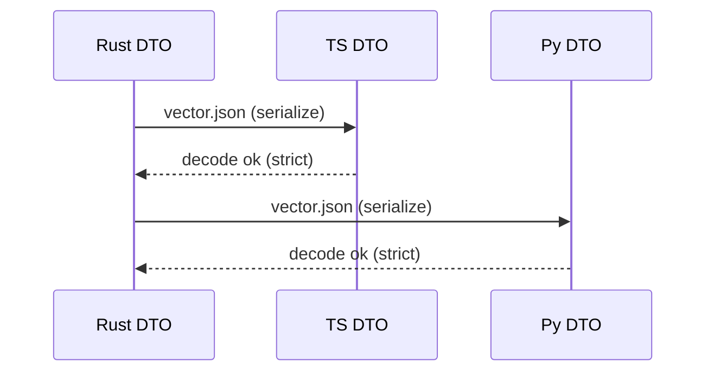

````markdown
---
title: Concurrency Model — ron-proto
crate: ron-proto
owner: Stevan White
last-reviewed: 2025-09-28
status: draft
template_version: 1.2
msrv: 1.80.0
tokio: "1.x (pinned at workspace root)"
loom: "0.7+ (dev-only)"
lite_mode: "For small library crates: fill §§1,3,4,5,10,11 and mark others N/A"
---

# Concurrency Model — ron-proto

This document makes the concurrency rules **explicit**: tasks, channels, locks, shutdown, timeouts,
and validation (property/loom/TLA+). It complements `docs/SECURITY.md`, `docs/CONFIG.md`,
and the crate’s `README.md` and `IDB.md`.

> **Golden rule:** never hold a lock across `.await` in supervisory or hot paths.
> For this crate there are **no async tasks**; we still codify rules to prevent future drift.

---

## 0) Lite Mode (for tiny lib crates)

`ron-proto` is a **small library** with **no background tasks**.  
We complete **§1, §3, §4, §5, §10, §11** and mark service-only sections **N/A**.

### 0.1 Six Concerns (mini mapping)

| Concern | What this lib guarantees | Proof/Where |
|---|---|---|
| **SEC** | Strict serde (`deny_unknown_fields`), closed enums; no payload logging guidance (see SECURITY). | Unit/property tests; schema guard; reason-canon reuse. |
| **RES** | No global mut; DTOs are `Send+Sync`; deterministic encode/decode. | Clippy lints; determinism tests. |
| **PERF** | No hidden work in (de)serialization; stable ordering choices (`BTreeMap`/Vec of pairs). | Micro benches optional; property tests. |
| **GOV** | No runtime; CI gates prevent drift (schema/public-api). | CI jobs green or block. |
| **ECON** | (If DTOs used by ledger facets) conservation properties proven in tests. | `econ_props.rs` (workspace). |
| **DX** | Copy-paste patterns; no async requirements; bounded-queue host patterns documented. | This doc §11 patterns. |

---

## 1) Invariants (MUST)

- [I-1] **No async runtime dependency.** Public APIs are synchronous; no `.await` in this crate.
- [I-2] **No lock across await** (vacuously satisfied, and enforced by lint/tests if async ever appears).
- [I-3] **No global mutable state.** No `static mut`, no ad-hoc singletons; DTO ops are pure/`Send+Sync`.
- [I-4] **Owned data in DTOs.** Prefer owned `String/Bytes` over borrowed lifetimes in public wire types to avoid aliasing pitfalls.
- [I-5] **Serialization is side-effect free.** Serde derives only; no I/O, no clock, no random in (de)serialization.
- [I-6] **Schema strictness by default.** `#[serde(deny_unknown_fields)]`, enums are closed unless explicitly versioned.
- [I-7] **Determinism.** Same input → same output across threads and processes (no hidden ordering, no hash maps exposed without order guards).
- [I-8] **Thread-safety.** All public types used by SDKs/services are `Send + Sync` or clearly documented otherwise.

---

## 2) Runtime Topology

**N/A (lib crate).** No Tokio runtime, no supervisor, no tasks.

---

## 3) Channels & Backpressure

**N/A (lib crate).** `ron-proto` defines **no channels**.  
Guidance for hosts:
- Use **bounded** `mpsc` for any work that carries `ron-proto` DTOs.
- Prefer **`try_send` + typed Busy error** over unbounded buffering.

---

## 4) Locks & Shared State

**Default:** **No locks** inside `ron-proto`. Types are pure, serde-only.

**If a helper cache is added in the future (rare):**
- Use `OnceLock`/`LazyLock` for **read-only tables** (e.g., enum mapping), not `Mutex`.
- If mutation is ever required, keep the critical section **short** and **never** `.await` while holding a guard.

**Forbidden**
- Holding any lock across I/O or (future) `.await`.
- Nested locks or implicit global registries.

---

## 5) Timeouts, Retries, Deadlines

**N/A (lib crate).**  
Guidance for hosts (SDKs/services):
- Apply **explicit deadlines** to I/O where DTOs are sent/received.
- Retries only for **idempotent** operations; jittered backoff.

---

## 6) Cancellation & Shutdown

**N/A (lib crate).**  
Host pattern: ensure any tasks that send/receive DTOs are **cancel-safe** via `select!` with a shutdown signal.

---

## 7) I/O & Framing

**N/A (performed by hosts).**  
Contract reminders for hosts using these DTOs:
- **OAP/1** frame cap = **1 MiB**; storage/streaming chunk ≈ **64 KiB** (do not conflate).
- Length-delimited, checksum/ETag (`"b3:<hex>"`) verification is enforced at services, not in `ron-proto`.

---

## 8) Error Taxonomy (Concurrency-Relevant)

**Local (lib) errors**: schema/compat issues (unknown fields, enum discriminants, size bounds) → typed error (no retries).  
**Host I/O errors** (timeouts, Busy, Canceled) are **not** produced here; they belong to transport/services.

---

## 9) Metrics (Concurrency Health)

**N/A (lib crate).**  
Hosts should expose:
- `busy_rejections_total`, `queue_dropped_total{queue}`, `io_timeouts_total{op}` where DTOs are carried.

---

## 10) Validation Strategy

**Unit / Property**
- **Serde round-trip**: JSON (always) + optional `bincode`/`msgpack` if features enabled.
- **Deny-unknown** property: unknown keys fail decode unless host explicitly sets a compat toggle.
- **Enum strictness**: unknown discriminants fail decode under default strict mode.
- **Determinism**: stable ordering for any map-like DTOs (`BTreeMap` or canonical Vec of pairs).

**Facet fuzz/property matrix (CI)**
- **Graph/Search/Index**: vectors with large fanout, deep nesting; assert deterministic order and exact round-trip across SDKs (Rust↔TS↔Py).  
- **Media**: boundary tests around frame cap (just under/over **1 MiB**), chunk sizing (~**64 KiB**), long strings; ensure rejects don’t panic.  
- **Trust & Safety**: adversarial strings (control chars, Unicode confusables) in non-ID fields; verify strict rejection where required.  
- **ECON (if applicable)**: property tests for conservation and non-negative aggregates in DTOs used by ledger facets.

**Fuzz**
- **Deserializer fuzz** harness for DTOs (JSON & optional formats) focusing on:
  - overlong strings
  - deeply nested arrays/objects
  - boundary sizes around 1 MiB

**Loom**
- **N/A** (no internal concurrency), but keep a **minimal loom test** stub to prevent future drift: if any shared mutable is ever added, loom must cover it.

**Golden Vectors (Interop)**
- Load known-good vectors (dev/CI mode) and assert cross-SDK parity (Rust ↔ TS ↔ Py ↔ Swift).

---

## 11) Code Patterns (Copy-Paste)

**Strict DTO hygiene**
```rust
use serde::{Serialize, Deserialize};

#[derive(Debug, Clone, Serialize, Deserialize, PartialEq, Eq)]
#[serde(deny_unknown_fields)]
pub struct HelloV1 {
    pub ver: u16,           // must be 1 for OAP/1 hello
    pub tenant_id: uuid::Uuid,
    pub corr_id: u64,
}
```

**Enum with closed set (strict)**
```rust
#[derive(Debug, Clone, Serialize, Deserialize, PartialEq, Eq)]
#[serde(tag = "kind", deny_unknown_fields)]
pub enum ErrorDto {
    BadRequest { detail: String },
    Unauthorized,
    TooLarge,
    RateLimited { retry_after: u32 },
    Internal { detail: String },
}
```

**Deterministic serialization (stable ordering)**
```rust
// Prefer Vec<(K,V)> or BTreeMap for stable order when order matters on-wire:
use std::collections::BTreeMap;

#[derive(Serialize, Deserialize)]
#[serde(deny_unknown_fields)]
pub struct Headers {
    pub fields: BTreeMap<String, String>,
}
```

**No global mut / no blocking in Drop**
```rust
// OK: read-only singletons
static TABLE: std::sync::OnceLock<&'static str> = std::sync::OnceLock::new();

// Drop pattern: no blocking or I/O
impl Drop for SomeType {
    fn drop(&mut self) {
        // best-effort bookkeeping only, never blocks
    }
}
```

**Host-side bounded queue example (using ron-proto DTOs)**
```rust
let (tx, mut rx) = tokio::sync::mpsc::channel::<ron_proto::HelloV1>(512);

// Producer:
if let Err(tokio::sync::mpsc::error::TrySendError::Full(_)) = tx.try_send(dto) {
    // translate to Busy for your API; don't buffer unbounded
}

// Consumer:
while let Some(dto) = rx.recv().await {
    handle(dto).await?;
}
```

---

## 12) Configuration Hooks (Quick Reference)

**From `docs/CONFIG.md`** (lib-scoped):

* `oap_version` (fixed to V1 here),
* `limits.max_frame_bytes = 1 MiB` (must be exact),
* `limits.chunk_bytes ≈ 64 KiB`,
* `accept_unknown_fields` (compat only; default strict),
* `strict_enums = true`.

---

## 13) Known Trade-offs / Nonstrict Areas

* **Compat windows**: temporarily enabling `accept_unknown_fields` eases upgrades but risks masking drift. Use **only** during planned migrations; revert to strict afterward.
* **Owned vs borrowed**: owned strings/bytes simplify Send/Sync and serialization at the cost of copies; acceptable for protocol DTOs (correctness > microperf).
* **Ordering**: use `BTreeMap` when deterministic order is part of the contract; avoid exposing `HashMap` directly in public DTOs.

---

## 14) Mermaid Diagrams (REQUIRED)

### 14.1 Host topology using ron-proto DTOs (illustrative)
```mermaid
flowchart LR
  A[Ingress (host)] -->|mpsc(512)| W1[Worker A (host)]
  A -->|mpsc(512)| W2[Worker B (host)]
  subgraph Library
    RP[ron-proto DTOs & serde]
  end
  W1 --> RP
  W2 --> RP
```

**Text:** The host owns bounded queues and tasks; `ron-proto` only supplies DTOs/serde.

### 14.2 Interop vector checks (dev/CI)


---

## 15) CI & Lints (Enforcement)

* **Clippy (crate-level):**
  * `#![forbid(unsafe_code)]`
  * `-D warnings`
  * `-D clippy::await_holding_lock` (guards future drift)
  * `-D clippy::unwrap_used` / `expect_used`
* **Fuzz job:** structure-aware fuzz for JSON (and optional formats).
* **Schema guard:** ensure `deny_unknown_fields` remains on all external DTOs.
* **Facet checks:** Graph/Search vectors deterministic; Media boundary cases enforced; ECON props (if relevant) green.

---
````

