---

# 🏛 GOVERNANCE.md

---

title: Governance & Economic Integrity
status: draft
msrv: 1.80.0
last-updated: 2025-09-28
audience: contributors, ops, auditors, stakeholders
crate-type: lib (policy/econ schemas)
-------------------------------------

## 0. Purpose

`ron-proto` defines the **wire-level shapes** and **validation invariants** for governance & economic artifacts used by policy/execution services. It does **not** mint, settle, or store state. This document specifies:

* Transparent, auditable **schemas** for proposals, votes, multi-sig actions, audit entries.
* **Economic invariants** the types enforce (no doubles, bounded issuance).
* **Authority boundaries** encoded into the DTOs (no unbounded admin override fields).
* SLA-style **stability guarantees** for on-wire governance payloads.

Ties into:

* **Economic Integrity Blueprint** (no doubles, bounded issuance).
* **Hardening Blueprint** (bounded authority, key custody).
* **Perfection Gates A–O** (esp. Gate I: economic invariants; Gate M: appeal paths).

> Scope note: execution happens in `ron-ledger`, `svc-rewarder`, `ron-policy` etc. `ron-proto` provides the **contract** they must obey.

---

## 1. Invariants (MUST)

**Non-negotiables encoded by schema & validation helpers**:

* **[I-G1] No double issuance or spend**
  Monetary actions reference immutable `entry_id` (ULID) and **ContentId** of prior state; replay requires a new, unique `nonce`. Duplicate `(account, nonce)` MUST be rejected up-stack.

* **[I-G2] Conservation**
  `LedgerEntry` uses balanced legs: `sum(credits) == sum(debits)`; zero-sum enforced at type level (`#[serde(deny_unknown_fields)]`, sum checks in validators).

* **[I-G3] Bounded reward emission**
  `RewardScheduleV1 { curve, epoch, cap }` prevents out-of-curve mint; DTO forbids “free-form mint” fields. Services MUST reject any `RewardDirective` that exceeds schedule residual.

* **[I-G4] Full auditability**
  Every governance action carries `corr_id`, `proposal_id`, `signers`, `signature_set`, and produces an `AuditEntryV1` with **append-only** semantics.

* **[I-G5] Bounded authority**
  No DTO exposes “god mode.” Sensitive transitions require `MultiSigNofM { threshold, signers[] }`. Single-sig admin paths are **forbidden**.

* **[I-G6] Determinism**
  All governance payloads are **DAG-CBOR canonical**; `encode(decode(x)) == x` for canonical vectors.

---

## 2. Roles & Authority

### Roles

* **Policy owner** (`ron-policy`): authors proposals/parameters.
* **Ledger keeper** (`ron-ledger`): executes balanced entries; rejects invariant breaks.
* **Rewarder** (`svc-rewarder`): emits within schedule; cannot mint beyond cap.
* **Auditor** (external): verifies proofs/logs; read-only.
* **SDK authors**: implement client encoders/decoders.

### Authority Boundaries

* Policy **proposes**, does **not execute** settlement.
* Ledger **executes** but MUST verify: balance, schedule cap, signatures.
* Rewarder **distributes** only under `RewardScheduleV1` & ledger caps.
* All actions MUST be authorized by **capability tokens (macaroons-style)** referenced as `CapabilityRef` (never raw secrets).

---

## 3. Rules & SLAs (Schema-level)

* **Schema Stability SLA**

  * Non-breaking governance schema changes ship as **minor**; breaking fields require **major** and dual-ship window (Vn & Vn+1).
  * Canonical vectors under `tests/vectors/governance/*` are **source of truth**.

* **Ledger & Rewards (enforced by callers)**

  * **Settlement SLA** (service-level): 99.9% < 5s; audit record available < 1s after commit.
  * **Reward schedule:** must follow encoded curve; deviation triggers service-level `governance_freeze`.

* **Overrides & Appeals**

  * DTOs support **disputed** flag and **OverrideAction** gated by `MultiSigNofM`. There is **no rollback** field—only forward, auditable corrections.

---

## 4. Governance Process (DTOs + lifecycle)

* **Proposal lifecycle** (states encoded in `ProposalState`): Draft → Review → Approved → Executed → Disputed (optional) → Resolved.
* **Quorum**: `MultiSigNofM.threshold ≤ signers.len()`; signatures must match declared `key_ids`.
* **Default reject**: if quorum not reached by `expires_at` (monotonic timestamp), proposal auto-Expires.


---

### 4.1 Cryptography & PQ Agility (Normative)

```rust
#[derive(Serialize, Deserialize)]
#[serde(deny_unknown_fields)]
pub enum SignatureSuiteV1 {
  Ed25519,
  Ed25519ph,
  Dilithium3,
  HybridEd25519Dilithium3,
}

#[derive(Serialize, Deserialize)]
#[serde(deny_unknown_fields)]
pub struct SignatureV1 {
  pub suite: SignatureSuiteV1,
  pub key_id: KeyId,
  pub domain: String,
  pub digest_b3: String,
  pub sig_b64: String,
  pub created_at: u64,
}
```

**Rules:**

1. `domain` MUST be `"ron/governance/v1"` unless a **major** rev changes it.
2. Signing bytes MUST be canonical DAG-CBOR of `ProposalSigningPayloadV1`.
3. `digest_b3` MUST equal BLAKE3-256 of signing bytes.
4. Verify threshold signatures; hybrid requires both components valid.
5. `created_at` MUST fall within `[proposal.created_at, expires_at]`.

---

## 5. Audit & Observability

* **Audit logs:** `AuditEntryV1` append-only; DAG-CBOR with ContentId links.
* **Metrics (service-exported):**

  * `governance_proposals_total{status}`
  * `ledger_disputes_total`
  * `rewarder_emissions_total{epoch}`
* **Verifiability:** conservation proofs; emission ≤ cap.
* **Red-team drills:** test rogue admin scenarios; single-sig forbidden.

```mermaid
sequenceDiagram
  autonumber
  participant POL as ron-policy
  participant GOV as governance-bus
  participant LED as ron-ledger
  participant AUD as auditor
  POL->>GOV: ProposalV1(Draft→Review)
  GOV-->>POL: ack(corr_id)
  POL->>GOV: MultiSig signatures (collect)
  GOV->>LED: ProposalV1(Approved)
  LED-->>LED: verify balance & caps
  LED-->>GOV: execution_event(Executed)
  GOV->>AUD: AuditEntryV1(append-only)
```



---

### 5.x Governance Error Taxonomy

```rust
#[derive(Serialize, Deserialize)]
#[serde(deny_unknown_fields)]
pub enum GovernanceErrorKind {
  Unknown,
  InvalidProposal,
  SignatureInvalid,
  QuorumNotMet,
  Expired,
  BalanceMismatch,
  EmissionExceeded,
  AuthorityBound,
  DuplicateNonce,
  ReplayDetected,
  SchemaVersionUnsupported,
}
```

---

### 5.y Governance Bus Topics

* `governance.proposal_submitted` → `ProposalV1 { state=Review }`
* `governance.proposal_approved` → `ProposalV1 { state=Approved }`
* `governance.proposal_executed` → `AuditEntryV1 { action="executed" }`
* `governance.proposal_disputed` → `DisputeRecordV1`
* `governance.proposal_resolved` → `AuditEntryV1 { action="resolved" }`

---

## 6. Config & Custody

* **Config DTOs** (e.g., `RewardScheduleV1`, `GovernanceParamsV1`) define emission curves, thresholds, TTLs.
* **Custody:** only `KeyId`s appear in DTOs. Secrets live in KMS/HSM (`ron-kms`).
* **Rotation:** every ≤90 days or after compromise, via new Proposal.

---

## 7. Appeal Path

* **Dispute flow:**

  1. File `DisputeRecordV1 { proposal_id, reason_code, evidence_cid }`.
  2. Prepare `OverrideActionV1` with `MultiSigNofM`; ledger correction is forward-only.
  3. Emit `AuditEntryV1`; public disclosure required.

* **Escalation:** governance bus → quorum proposal → auditor attestation before execution.

---

## 8. Acceptance Checklist (DoD)

* [ ] Invariants [I-G1..I-G6] validated in tests/vectors.
* [ ] DTOs use `#[serde(deny_unknown_fields)]` + DAG-CBOR canonical.
* [ ] Proposal lifecycle + MultiSigNofM vectors committed.
* [ ] Conservation/range property tests pass; fuzz shows zero panics.
* [ ] Metrics enums present.
* [ ] Appeal flow covered by integration tests.
* [ ] Signature suite vectors (Ed25519, Dilithium3, hybrid) added.
* [ ] Domain separation tests (replay across domains rejected).
* [ ] (If ZK enabled) Proof stubs verified against vectors.

---

## 9. Appendix

### 9.1 Policy DTOs (abridged)

```rust
#[derive(Serialize, Deserialize)]
#[serde(deny_unknown_fields)]
pub struct GovernanceParamsV1 {
  pub reward_schedule: RewardScheduleV1,
  pub quorum_min_threshold: u16,
  pub proposal_ttl_ms: u64,
}

#[derive(Serialize, Deserialize)]
#[serde(deny_unknown_fields)]
pub struct DisputeRecordV1 {
  pub dispute_id: String,
  pub proposal_id: String,
  pub reason_code: String,
  pub evidence_cid: String,
  pub filed_at: u64,
}

#[derive(Serialize, Deserialize)]
#[serde(deny_unknown_fields)]
pub struct OverrideActionV1 {
  pub target_proposal_id: String,
  pub correction_entry: Option<LedgerEntryV1>,
  pub correction_reward: Option<RewardDirectiveV1>,
  pub quorum: MultiSigNofM,
  pub rationale_cid: String,
}
```

### 9.2 ZK/Proof Hooks (roadmap)

* **Conservation Proof:** `LedgerConservationProofV1 { window_start, window_end, proof_cid }`.
* **Emission Range Proof:** `RewardEmissionProofV1 { epoch, cap, emitted, proof_cid }`.
* **Gold gate:** if enabled, CI must validate proof stubs and include vectors.

### 9.3 Canonical Vectors

Under `tests/vectors/governance/` add:

* `proposal_review_sign_ed25519.cbor`
* `proposal_review_sign_dilithium3.cbor`
* `proposal_review_sign_hybrid.cbor`
* `proposal_expired_quorum_fail.cbor`
* `override_action_resolve.cbor`
* `replay_detected_domain_mismatch.cbor`

### 9.4 References

* Economic Integrity & Hardening Blueprints
* Perfection Gates I & M
* Capabilities: macaroons-style tokens
* Optional TLA+ sketches (ledger conservation & proposal quorum)

---

✅ With these extensions, `ron-proto`’s governance schema is **PQ-agile, replay-safe, error-typed, bus-integrated, and proof-future-ready**. SDKs and services can evolve without drift, while all invariants remain frozen and testable.

---

