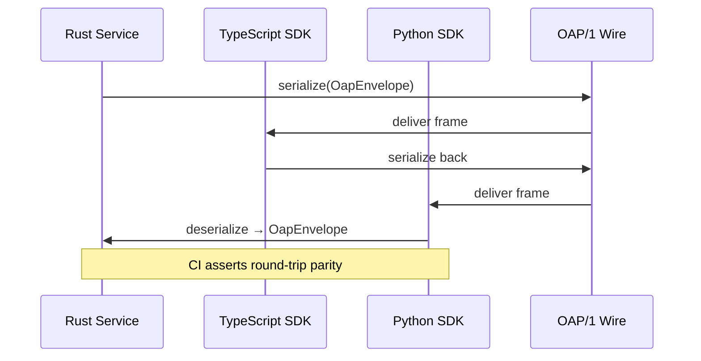

---

# 🪓 Invariant-Driven Blueprinting (IDB) — `ron-proto`

*Audience: developers, auditors, SDK implementers*
*msrv: 1.80.0 (Tokio/loom compatible)*
*crate-type: lib (pure DTOs, no I/O)*

---

## 1. Invariants (MUSTs)

* **I-1 DTO Purity:** `ron-proto` defines only **typed DTOs and envelopes**; no I/O, no threads, no sockets.
* **I-2 Strictness:** All externally visible DTOs use `#[serde(deny_unknown_fields)]`. Unknown fields are hard rejects.
* **I-3 Determinism:** Encodings/decodings yield **bit-for-bit reproducibility** across runs and SDKs.
* **I-4 OAP/1 Boundaries:** Envelopes respect **frame cap = 1 MiB**. For storage, **chunk cap = 64 KiB**. (Spec: [OAP/1 — Interop Blueprint §3.2](../../docs/Interop_Blueprint.md)).
* **I-5 Addressing:** All content IDs must be `b3:<hex>` where hex = lowercase, 64 chars (BLAKE3/256).
* **I-6 Versioned Evolution:** All breaking changes gated by `proto_version` + `PROTO_ABI_FINGERPRINT`.
* **I-7 Cross-SDK Parity:** DTOs compile and round-trip identically in Rust, TS, and Python SDKs.
* **I-8 Amnesia Ready:** DTOs hold no secrets; any transient buffers are **zeroizable** when used in Micronode (amnesia=ON).

---

## 2. Design Principles (SHOULDs)

* **P-1 Minimalism:** Keep DTO surface tight; push convenience APIs to SDKs.
* **P-2 Explicitness:** Favor enums with exhaustive matches over untyped blobs.
* **P-3 Schema-first:** Use schemars/JSON schema snapshots for audit; CI guards compatibility.
* **P-4 Copy-paste Ergonomics:** Export `ContentId(String)` and helpers so host code avoids boilerplate.
* **P-5 Stable Reason Canon:** Error reasons are immutable; new ones must append, never mutate.
* **P-6 Polyglot Hooks:** Types annotated for cross-language codegen (serde + schemars).

---

## 3. Implementation Patterns (HOW)

* **DTO Sketch:**

  ```rust
  #[derive(Serialize, Deserialize)]
  #[serde(deny_unknown_fields)]
  pub struct OapEnvelope {
      pub kind: OapKind,   // HELLO | DATA | END
      pub seq: u64,
      pub content: ContentId, // b3:<hex>
  }
  ```

* **Error Reason Helpers:**

  ```rust
  impl ProtoErrorKind {
      pub fn as_metric_reason(&self) -> &'static str { /* stable strings */ }
  }
  ```

* **ABI Fingerprint:**

  ```rust
  pub const PROTO_ABI_FINGERPRINT: &str = include_str!("../schema/fingerprint.txt");
  ```

---

## 4. Acceptance Gates (PROOF)

* **G-1 Schema Guard:** CI compares schemars snapshots → no breaking changes.
* **G-2 Public API:** `cargo public-api -p ron-proto` must pass semver check.
* **G-3 Fuzz Tests:** OAP envelopes + manifests fuzzed for DoS resilience.
* **G-4 Cross-SDK Matrix:** Round-trip vectors (Rust ↔ TS ↔ Py) must be identical.
* **G-5 Reason Canon Test:** `all_reasons_unique_and_stable()` enforced in CI.
* **G-6 Unsafe Forbidden:** `#![forbid(unsafe_code)]` is non-negotiable.
* **G-7 Amnesia Mode:** Zeroization property test: after drop, buffers cleared.
* **G-8 Facet DTO Parity:** Graph/Index/Media DTOs must pass facet SLO checks (e.g., Graph query DTO round-trip p95 <10ms in CI).
* **G-9 ECON Facet:** ECON/ledger-adjacent DTOs (e.g., `LedgerEntry`, `Credit`, `Debit`) must pass property tests for **conservation** (no negative balances, no double-spend across a single logical txn) and serialization determinism across SDKs. CI job: `cargo test -p ron-proto --test econ_props`.

**CI Snippet:**

```yaml
- name: Schema Guard
  run: cargo test -p ron-proto --features schema-guard
- name: Public API
  run: cargo public-api -p ron-proto --deny-breaking
- name: Fuzz Corpus
  run: cargo fuzz run proto_decode
```

---

## 5. Anti-Scope (Forbidden)

* ❌ No crypto primitives (lives in ron-kms).
* ❌ No networking (transport = svc-overlay/ron-transport).
* ❌ No I/O or file handles.
* ❌ No global mutable state.
* ❌ No ad-hoc error strings (must use reason canon).

---

## 6. Visual — DTO Lifecycle



---

## 7. References

| Document                    | Section(s)               | Tie-In                                                                    |
| --------------------------- | ------------------------ | ------------------------------------------------------------------------- |
| GRAND_REFACTOR_BLUEPRINT.MD | Global                   | Refactor constitution; Perfection Gates; CI posture.                      |
| SIX_CONCERNS.MD             | SEC/RES/PERF/GOV/ECON/DX | Concern spine; maps to invariants (I-2/I-3/I-7) and gates (G-1..G-9).     |
| Interop_Blueprint.md        | §3 OAP/1                 | Canonical frame cap (1 MiB) and semantics; cross-SDK parity requirements. |
| HARDENING_BLUEPRINT.MD      | §2 DoS & Size Caps       | Parser hardening, oversize/zip-bomb defenses; aligns with fuzz targets.   |
| ALL_TEMPLATES_COMBINED.MD   | IDB/OBS/SEC/CONFIG       | Template canon; keeps structure and acceptance gates consistent.          |

---

**Definition of Done:** All invariants tested in CI; schema snapshots green; cross-SDK matrix passing; reasons stable; ECON/Facet DTO tests validated; Mermaid diagrams present.

---

