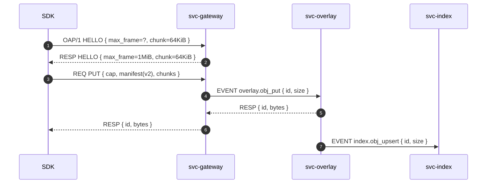

---

# 🔗 INTEROP.md — ron-proto

*Audience: developers, auditors, external SDK authors*
*msrv: 1.80.0*

---

## 0) Purpose

Define the **interop surface** of `ron-proto` as the neutral, I/O-free schema layer used by gateway/services/SDKs:

* Wire envelopes: **OAP/1** header/flags, versioning (spec lives outside; `ron-proto` only models types).
* DTOs & schemas: **pure Serde types** with `deny_unknown_fields`, versioned, CI round-trip tests.
* Canonical constants used by services/SDKs: `max_frame = 1 MiB` (OAP/1), streaming **64 KiB** chunking (data plane).
* Canonical test vectors to keep SDKs (Rust/TS/Py/Swift) in lock-step with **GMI-1.6 Omni-Gate**.

`ron-proto` exports **types only**; all network, TLS, quotas, and policy live in other crates/services.

**Amnesia Mode Compatibility:** ron-proto DTOs MUST NOT imply persistence. Fields must be reconstructable from the payload or context and be safe to discard/rebuild from canonical sources. Caches using these DTOs MUST remain correct under “amnesia mode” (RAM-only, zeroized at shutdown).

---

## 1) Protocols & Endpoints

### 1.0 Conformance Language

* **Normative**: MUST/SHALL items are enforceable and tested in CI (violations break the build).
* **Informative**: MAY/SHOULD items provide guidance; violations are warnings only.

**Ingress Protocols:** *N/A (library crate).*
**Exposed Endpoints:** *None.*

**Transport Invariants (Normative):**

* **OAP/1:** `max_frame = 1 MiB`, reject larger; **HELLO** advertises limits.
* **Streaming:** logical **64 KiB** chunk size for object bytes; distinct from framing.
* **TLS:** rustls via `tokio_rustls::rustls::ServerConfig` enforced in transport/services, **not** in `ron-proto`.



---

## 2) DTOs / Schemas

> All DTOs use `#[serde(deny_unknown_fields)]`, additive-only evolution, and explicit `version` where evolution is expected.

### 2.1 Content Addressing

```rust
/// Canonical content ID, e.g., "b3:<64-hex>"
pub struct ContentId {
  pub algo: Algo,        // fixed: B3_256 (today)
  pub hex: String,       // 64 lowercase hex chars
}
```

* **Rules [Normative]:** algorithm prefix **`b3:`** required; hex must be 64 lowercase chars; services MUST verify full digest before serve.
* **Algorithm Agility:** `ContentId` is fixed to `b3:` in v2. Introducing a new hash algorithm is a **major schema version** (e.g., `ObjectManifestV3`), not a silent enum extension.

### 2.2 Object Manifest (v2)

```rust
pub struct Chunk {
  pub offset: u64,       // byte offset into logical object
  pub size: u32,         // <= 65536
}

pub struct ObjectManifestV2 {
  pub id: String,        // "b3:<hex64>"
  pub size: u64,         // object length in bytes
  pub chunks: Vec<Chunk> // canonical 64 KiB logical segmentation
}
```

* **Encoding [Normative]:** **DAG-CBOR**, deterministic field order; version = 2.
* **Validation [Normative]:** resolvers/servers MUST verify the object digest matches `id` before serving.

### 2.3 OAP/1 Envelope (Header Model)

| Field       | Type  | Description                                     |
| ----------- | ----- | ----------------------------------------------- |
| `len`       | u32   | Remaining length after header                   |
| `ver`       | u8    | Protocol version (1)                            |
| `flags`     | u16   | Bitfield: `REQ, RESP, EVENT, ERR, ...`          |
| `tenant_id` | u128  | ULID/UUID; `0` if unused                        |
| `corr_id`   | u64   | Correlation ID (spans/logs)                     |
| `payload`   | bytes | App-opaque (may be compressed/CBOR, never huge) |

* **Bounds [Normative]:** Header is fixed; **payload bounded by `max_frame`** invariant.

### 2.4 Capabilities (Macaroon-style)

```rust
pub struct Capability {
  pub typ: String,       // "macaroon"
  pub caveats: Vec<String>, // e.g., ["ttl=60s","method=GET","path=/o/"]
  pub sig_b64: String,
}
```

* **Trust boundary [Normative]:** capabilities-only; no ambient authority; issue/verify handled by `ron-auth`/`svc-passport`.

**Caveat Registry (ABNF, Informative but Stabilizing):**

```
caveat = ttl / method / path
ttl    = "ttl=" 1*DIGIT "s"
method = "method=" ("GET" / "PUT" / "POST" / "DELETE")
path   = "path=" 1*VCHAR
```

---

## 3) Bus Topics

### 3.1 Events Published

* `overlay.obj_put` → `PutOutcome { id: ContentId, bytes: u64 }`
* `overlay.obj_get` → `GetOutcome { id: ContentId, bytes: u64, hit: bool }`

### 3.2 Events Subscribed

* `config.updated` → `ConfigSnapshotV<N>`
* `bus.shutdown` → signal payload (trivial struct)

> Note: `ron-proto` defines **shapes only**; topic binding lives in services.

---

## 4) Canonical Test Vectors

> All vectors duplicated under `/tests/vectors/` for SDK parity (Rust/TS/Py/Swift).

### 4.1 Content Digest → `b3:<hex>`

* **Input:** `Hello, world!`

* **BLAKE3-256 (hex):**
  `ede6d97ade3d3362a347c95754b2a6e146e11ccac8d2e14e1952d35e8d2a22b9`
  → **ContentId:**
  `b3:ede6d97ade3d3362a347c95754b2a6e146e11ccac8d2e14e1952d35e8d2a22b9`

* **Regenerate locally:**

  ```
  echo -n 'Hello, world!' | b3sum
  ```

### 4.2 Manifest Round-Trip

* **Given:** `size = 131072`, `chunks = [{offset:0,size:65536},{offset:65536,size:65536}]`
* **CBOR:** deterministic encoding; decode → re-encode → byte-equal.

### 4.3 OAP/1 Frame Echo (HELLO)

* **Header:** `ver=1, flags=REQ, corr_id=42, tenant=0`
* **Payload:** `{ "hello": 1, "max_frame": 1048576, "chunk": 65536 }`
* **Expectation:** Echo `RESP` with same `corr_id`; reject if peer advertises `max_frame > 1048576`.

### 4.4 Capability Example (JSON)

```json
{
  "typ": "macaroon",
  "caveats": ["ttl=60s", "method=GET", "path=/o/"],
  "sig_b64": "…"
}
```

---

## 4.5 Proof Gates (CI-Enforced)

* **CBOR determinism:** Round-trip encode/decode of all DTOs is byte-identical.
* **Header bounds/flags:** Property tests ensure `len` ≤ 1_048_576 - header_size; invalid/overflow rejected; unknown flags = 0.
* **Unknown-fields hygiene:** All DTOs compiled with `deny_unknown_fields`; negative tests assert rejection on extras.
* **Vector parity:** Polyglot SDKs must pass `/tests/vectors/*` byte-for-byte. CI fails on any divergence.
* **Digest truth:** Each vector’s BLAKE3 recomputed; any mutation MUST fail.

---

## 5) Error Taxonomy

* `400 BadVersion` → unsupported OAP version
* `413 FrameTooLarge` → exceeds **1 MiB**
* `429 QuotaExceeded` → tenant over quota
* `503 NotReady` → readiness gate failed

### 5.1 Error Envelope DTO

```rust
#[derive(Serialize, Deserialize)]
#[serde(deny_unknown_fields)]
pub struct ErrorEnvelope {
  pub code: u16,           // e.g., 413
  pub kind: String,        // "FrameTooLarge"
  pub message: String,     // audit-safe text
  pub retry_after_ms: Option<u32>,
  pub corr_id: Option<u64> // mirrors OAP corr_id
}
```

---

## 6) Interop Guarantees

* **No Kernel Drift [Normative]:** ron-proto stays types-only; kernel API is frozen.
* **SemVer Discipline [Normative]:** breaking schema changes → major; additive fields only.
* **Unknown Fields [Normative]:** reject unknowns (`deny_unknown_fields`) to surface drift.
* **Canonical Vectors [Normative]:** stored under `/tests/vectors/`; SDKs must pass them in CI.

### 6.1 SDK Compatibility Matrix

| SDK        | Vectors v1 | OAP/1 HELLO | Manifest v2 | ErrorEnvelope |
| ---------- | ---------- | ----------- | ----------- | ------------- |
| Rust       | ✅          | ✅           | ✅           | ✅             |
| TypeScript | ✅          | ✅           | ✅           | ✅             |
| Python     | ✅          | ✅           | ✅           | ✅             |
| Swift      | ✅          | ✅           | ✅           | ✅             |

---

## 7) References

* Interop Blueprint (**GMI-1.6**)
* Hardening Blueprint — protocol limits, DTO hygiene
* Full Project Blueprint — data plane formats, addressing
* Concern/Crate Matrix — Interop responsibilities

---

✅ With this document, `ron-proto` declares the **wire-level contract in types**. All services/SDKs align on OAP/1 limits, **BLAKE3 `b3:<hex>` addressing**, deterministic DAG-CBOR, error envelopes, and canonical vectors—eliminating drift across the Omni-Gate surface.

---

