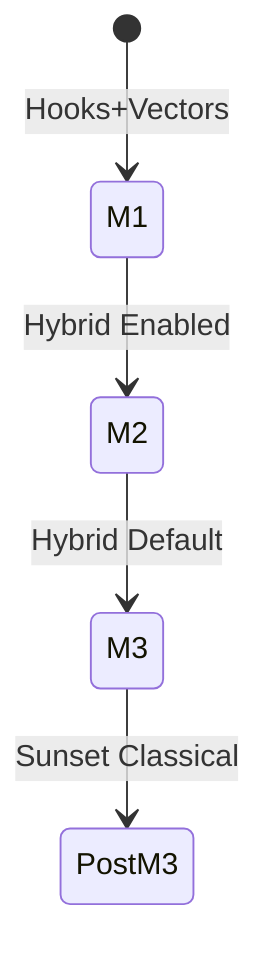
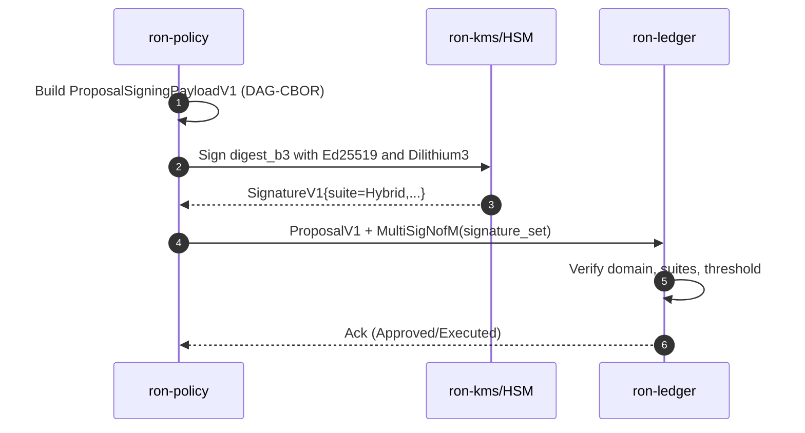
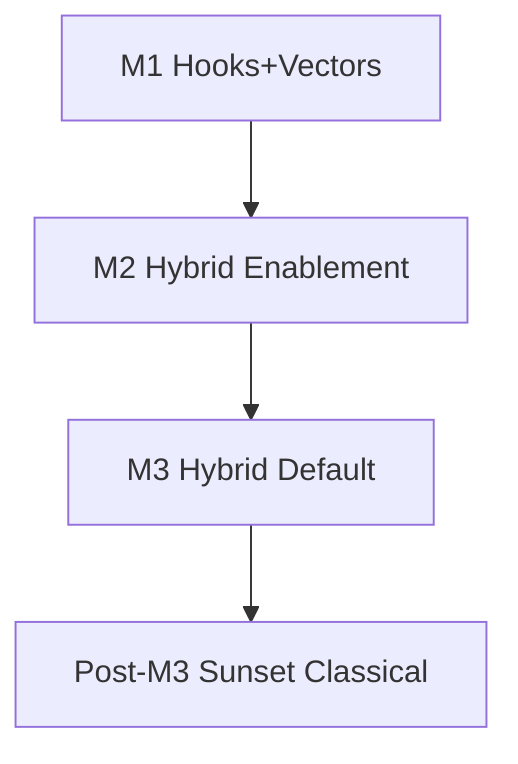

---

title: Post-Quantum (PQ) Readiness & Quantum Proofing
status: draft
msrv: 1.80.0
last-updated: 2025-09-28
audience: contributors, security auditors, ops
crate: ron-proto
crate-type: lib
pillar: 7
owners: [Stevan White]
----------------------

# QUANTUM.md

## 0) Purpose

Describe how `ron-proto` (a **types-only** DTO/schema crate) resists **quantum threats** and enables smooth migration to **post-quantum (PQ)** crypto **without breaking interop**. As a library, `ron-proto` does **not** perform TLS/KEX/signing; it **defines the wire shapes** and **validation invariants** used by services (ledger/rewarder/gateway/auth/KMS/SDKs). This doc specifies algorithm agility in DTOs, feature flags, test/CI gates, metrics labels, and a measured rollout (M1→M3).

---

## 1) Exposure Assessment (What’s at risk?)

* **Public-key usage (breakable by Shor)**

  * **Transport KEX/TLS:** *N/A in this crate.* (Handled by transports/gateway; schemas unaffected.)
  * **Signatures in `ron-proto` DTOs:**

    * **Governance / MultiSig:** default **Ed25519** today; PQ suites defined (see §4.1 in GOVERNANCE.md).
    * **Capabilities:** macaroons-style (symmetric MAC) by design; classical recordings don’t enable later forgery if keys remain secret.
* **Symmetric/Hash (Grover-affected only)**

  * **Hashing:** **BLAKE3-256** for content IDs and signing payload digests (sufficient margin vs. Grover when used appropriately).
  * **AEAD/Ciphers:** *N/A here* (schemas only).
* **Data at rest / long-lived artifacts**

  * **Manifests, audit entries, proposals, vectors** (DAG-CBOR, public by nature).
  * Retention: **years** (for auditability).
  * **HNDL risk:** **Low** — artifacts are mostly non-confidential; authenticity relies on signatures which are **upgradeable** via DTO suites.
* **Transport/session lifetimes:** *N/A for this crate* (no sessions).
* **Blast radius if classical PKI breaks:** Attackers could forge **governance signatures** *if* services still accept classical suites without hybrid/PQ. `ron-proto` mitigates by **encoding suite identifiers and domain-separated signing payloads**, enabling services to require hybrid/PQ at policy time.

> **HNDL = Harvest-Now, Decrypt-Later.** Primary HNDL concern is confidentiality of recorded traffic—**not** managed by this crate.

---

## 2) Current Crypto Profile (Today)

* **Algorithms referenced in types**

  * **Signature (default):** `Ed25519` (DTOs mark suite explicitly).
  * **Hash:** `BLAKE3-256` for `ContentId` and signing payload digests.
  * **Capabilities:** macaroons-style MAC (symmetric).
* **Libraries (consumers typically use):** `ed25519-dalek`, `blake3`, DAG-CBOR (e.g., `ciborium`).
* **Key custody:** *Out of scope for this crate.* DTOs carry **KeyId** only; private keys live in **ron-kms/HSM** (see SECURITY/RUNBOOK of the relevant services).
* **Interfaces that carry crypto:**

  * Governance `SignatureV1` (suite/KeyId/domain/digest/signature).
  * Capability references (no raw secrets).
  * DAG-CBOR canonical payloads for signing.

---

## 3) Target PQ Posture (Where we’re going)

* **KEX/TLS:** *Service/transport concern.* Target **Hybrid KEX** (X25519 + ML-KEM) signaled via transport configs (outside this crate).
* **Signatures (in DTOs):**

  * **ML-DSA (Dilithium)** and **Hybrid Ed25519+Dilithium** enumerated in `SignatureSuiteV1`.
  * Optional **Ed25519ph** (prehash) retained for pragmatic interop.
* **Tokens/Capabilities:** remain **symmetric MAC** by default; can carry **PQ-signed envelopes** if policy mandates (DTOs allow suite tags where applicable).
* **Backwards compatibility:** classical remains allowed until **M3 (Gold)**; hybrid/PQ becomes **default policy** in services thereafter.

---

## 4) Feature Flags & Config (How to turn it on)

```toml
# Cargo features (ron-proto)
[features]
pq = []                 # compile DTO enums/validators for PQ suites
pq-sign = ["pq"]        # include PQ signature DTO test vectors/helpers
pq-hybrid = ["pq"]      # include hybrid (classical+PQ) suite variants
pq-only = []            # (schemas only) surface markers to deny classical at policy level
```

```ini
# Example service-side config fields that are backed by ron-proto DTOs
pq_hybrid = true            # negotiated in transport/auth layers
pq_sign_algo = "ml-dsa"     # "ed25519" | "ed25519ph" | "ml-dsa" | "hybrid-ed25519-ml-dsa"
pq_only = false             # if true, refuse classical-only proofs at policy boundary
key_rotation_days = 90
```

*Interoperability:* If a peer lacks PQ, services **negotiate** hybrid or **refuse** when `pq_only=true`. DTOs unambiguously **encode the suite** selected so verifiers can enforce policy.

---

## 5) Migration Plan (Milestones)

**M1 (Bronze) — Hooks & Vectors**

* Add `pq`, `pq-sign`, `pq-hybrid` features (no behavioral change).
* Land **canonical vectors** for Ed25519 and Dilithium **signing payloads**.
* CI matrix compiles with PQ features; property tests for domain separation.

**M2 (Silver) — Hybrid Enablement**

* Services adopt **Hybrid KEX** (transport) and optionally **Hybrid signatures** for governance receipts.
* Interop tests: classical↔classical, hybrid↔hybrid, hybrid↔classical (policy-dependent).
* Record **perf overhead** budgets and actuals.

**M3 (Gold) — Default Hybrid/PQ**

* Service policy defaults to `pq_hybrid = true`.
* Governance and high-value artifacts require **PQ or Hybrid signatures**.
* Runbooks add enable/rollback playbooks; SECURITY updated.
* Begin **sunsetting** pure-classical acceptance on external edges.



---

## 6) Invariants (MUST)

* **[PQ-I1]** Security-critical signatures MUST carry an explicit **`SignatureSuiteV1`**; verifiers MUST reject unknown/ambiguous suites.
* **[PQ-I2]** **Domain separation** is required: signing bytes = canonical **DAG-CBOR** of a fixed payload; digest = **BLAKE3-256**.
* **[PQ-I3]** When policy mandates PQ/hybrid, classical-only proofs MUST be refused with a typed error.
* **[PQ-I4]** Symmetric primitives remain ≥256-bit security (MAC/HKDF/AEAD where applicable in consumers).
* **[PQ-I5]** DTO evolution for new suites is **additive**; breaking changes require **major** + dual-ship window and vectors.
* **[PQ-I6]** PQ feature builds (with `pq*` flags) MUST pass tests/CI and maintain **interop parity** with classical vectors.

---

## 7) Observability (Metrics, Logs, Readiness)

`ron-proto` defines **labels** and **enums**; services export metrics with these labels:

* `pq_handshake_total{algo="x25519|ml-kem|hybrid",role}`
* `pq_signature_total{algo="ed25519|ml-dsa|hybrid",kind="proposal|receipt|cap"}`
* `pq_signature_failures_total{reason}`
* `crypto_latency_seconds{op="kex|sign|verify",algo}` (histogram)

**Readiness:** service `/readyz` should fail if policy requires PQ and peers can’t negotiate; errors use typed DTOs (e.g., `SchemaVersionUnsupported`, `AuthorityBound`).

**Structured logs:** always include `pq={off|hybrid|pq-only}`, `algo=…`, `peer_mode=…`.

---

## 8) Testing & Verification

* **Unit/Property:**

  * Round-trip of **signing payload** CBOR; **domain separation** enforced; suite tags verified.
  * Negative tests for **replay** (domain mismatch), **expired** signatures, **unknown suite**.
* **Vectors (must-have):**

  * `proposal_review_sign_ed25519.cbor`
  * `proposal_review_sign_dilithium3.cbor`
  * `proposal_review_sign_hybrid.cbor`
  * `replay_detected_domain_mismatch.cbor`
* **Fuzz:** decoders for `SignatureV1`, suite dispatch, and negotiation errors.
* **Interop:** classical↔classical, hybrid↔hybrid, hybrid↔classical (where allowed).
* **Perf:** record sign/verify deltas in consumer crates; ensure policy timeouts still met.

---

## 9) Risks & Mitigations

* **Perf & footprint:** PQ keys/sigs larger, slower → Mitigate with **session reuse**, **hybrid only where needed**, and vector-sized payloads.
* **Library churn:** PQ crates evolve → Isolate via **adapter traits**; pin versions; track CVEs with `cargo deny`.
* **Downgrade abuse:** Enforce `pq_only` where mandated; **log + alert** on downgraded sessions.
* **Fragmentation:** Mixed peer capabilities → keep **classical support** until M3; publish clear negotiation policy and vectors.

---

## 10) Acceptance Checklist (DoD)

* [ ] Exposure assessed; **HNDL risk = Low** documented.
* [ ] `pq`, `pq-sign`, `pq-hybrid` features compile in CI.
* [ ] Vectors for **Ed25519**, **Dilithium3**, and **Hybrid** landed.
* [ ] Property tests assert **domain separation** & **suite enforcement**.
* [ ] Interop matrix (classical/hybrid) green; typed errors on mismatch.
* [ ] Metrics labels present; dashboards wired in consuming services.
* [ ] Runbooks updated (enable/rollback); SECURITY cross-links added.

---

## 11) Role Presets (per crate)

### `ron-proto` (this crate) — **Pillar 7: App BFF & SDK**

* **Primary target:** PQ-agnostic **schemas** with **algorithm agility** (`SignatureSuiteV1`, signing payload DTOs).
* **Defaults:** `pq=false`; expose **suite enums**, **domain-separated payloads**, **canonical vectors**; no runtime crypto here.

### Transports (`ron-transport`, `svc-arti-transport`)

* **Primary target:** **Hybrid KEX** first; policy-driven negotiation; refuse when `pq_only=true`.
* **Defaults:** `pq_hybrid=false (M1) → true (M3)`.

### Identity/Policy/KMS (`ron-kms`, `ron-auth`, `svc-passport`, `ron-policy`, `ron-audit`)

* **Primary target:** PQ signatures custody & verification; rotation; audit trails.
* **Defaults:** `pq_sign=false (M1) → policy-gated (M2/M3)`; rotate keys ≤90 days.

*(Other presets: see top-level QUANTUM blueprint; `ron-proto` supplies the types they consume.)*

---

## 12) Appendix

* **Algorithms chosen (schemas):**

  * **Signatures:** `Ed25519` (today), `Dilithium3`, `HybridEd25519Dilithium3`, `Ed25519ph` (optional).
  * **Hash:** `BLAKE3-256` (ContentId & signing digests).
* **Libraries (typical in consumers):** `ed25519-dalek`, `liboqs`/bindings (for ML-KEM/ML-DSA), `blake3`, `rustls`.
* **Interop notes:** suite enumerations are **additive**; breaking changes require **major** + dual-ship vectors.
* **Change log:**

  * 2025-09-28 — Initial PQ schema agility, vectors list, and CI gates documented.

---

## 📈 Mermaid Diagrams

### A) Hybrid Signing (service flow backed by `ron-proto` DTOs)



### B) Adoption Milestones (M1→M3)



---

**Result:** `ron-proto` is **PQ-ready by design**: it encodes **which** algorithm signed **what**, in a **domain-separated**, **deterministic** way—so services can enforce hybrid/PQ without changing wire compatibility.
