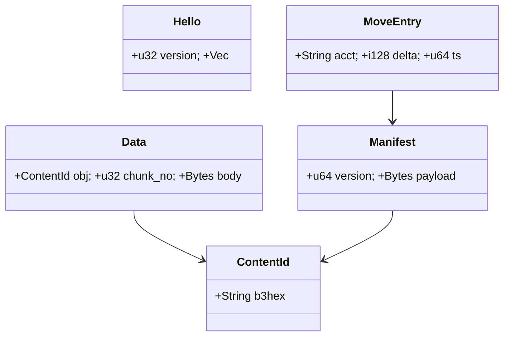
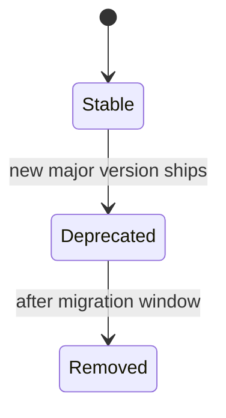
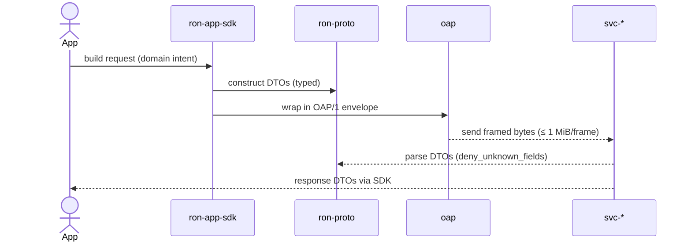

---

# ron-proto

> **Role:** library (pure DTOs / schemas)
> **Owner:** Stevan White
> **Status:** draft
> **MSRV:** 1.80.0
> **Last reviewed:** 2025-09-28

Badges (optional):
[]() []() []() []()

---

## 1) Overview

**What it is (one paragraph):**
`ron-proto` defines the **canonical wire/domain types (DTOs)** for RustyOnions: IDs, manifests, OAP/1 envelopes, mailbox messages, capability token headers, version/ABI constants, and error taxonomies. It contains **only data structures and serde policy**—no I/O, crypto, TLS, network, or service loops. Its purpose is deterministic interop, strong schema discipline, and SemVer-governed evolution across services and polyglot SDKs. **Economics note:** several DTOs underpin ledger/accounting flows; conservation is proven by property tests (logic lives in ECON services).

**How it fits (RustyOnions topology):**

* **Pillar:** 7 — App BFF & SDK
* **Upstream callers:** `ron-app-sdk`, `oap`, `omnigate`, `svc-gateway`, `svc-*` services, tools
* **Downstream deps:** `serde` (+derive), `bytes`, `thiserror` (types only)
* **Data it touches:** in-memory serialization formats (JSON, optional DAG-CBOR)
* **Security boundary:** no secrets/PII stored; strict `#[serde(deny_unknown_fields)]`; enums non-exhaustive where growth is expected

### 1.1 High-Level Architecture (Mermaid)

```mermaid
flowchart LR
  subgraph SDKs & Services
    A[ron-app-sdk] -->|uses DTOs| B(ron-proto)
    C[oap] -->|frames carry DTOs| B
    D[omnigate] -->|hydrates views with DTOs| B
    E[svc-*] -->|serialize/deserialize| B
  end

  B -->|serde (no I/O)| F[[Type System]]
  B -->|schema tests| G[[CI Gates]]

  style B fill:#0b7285,stroke:#083344,color:#fff
```

---

## 2) Responsibilities & Boundaries

**MUST do (core responsibilities):**

* [ ] Provide **canonical DTOs** for OAP/1 envelopes, IDs (`ContentId` `"b3:<hex>"`), manifests, mailbox messages, capability token headers, ECON-adjacent records, and version/ABI constants.
* [ ] Enforce strict serde (`#[serde(deny_unknown_fields)]`, stable field names, predictable casing).
* [ ] Use growth-tolerant patterns: `#[non_exhaustive]` enums, reserved fields, additive evolution with SemVer discipline.
* [ ] Ship **schema PROOF**: round-trip tests, vector parity (JSON & optional DAG-CBOR), fuzz/property tests, cross-version decode.

**MUST NOT do (anti-scope / boundaries):**

* [ ] No network, disk, TLS, crypto, or service loops—**types only**.
* [ ] No policy decisions, auth/verification, or ambient configuration effects (those live in policy/auth/ECON services).

**Acceptance Gates (PROOF you did it):**

* [ ] **Vector Parity:** `decode -> encode` byte-identical for canonical JSON and (if enabled) DAG-CBOR.
* [ ] **Cross-Version:** N-1 and N versions decode each other where allowed; unknown fields rejected.
* [ ] **Fuzz:** Named targets (`decode_manifest`, `decode_oap_header`, `decode_cap_hdr`) **≥ 1h per PR** and **≥ 4h nightly**; zero crashes/OOM.
* [ ] **Soak:** ≥ **10M decode cycles** nightly with leak checks on representative DTOs.
* [ ] **Size Properties:** OAP/1 **frame cap ≤ 1 MiB**; storage streaming **chunk hint ≈ 64 KiB** referenced in DTO docs.
* [ ] **Schema-Compat CI:** public-API snapshot + (optional) JSON-Schema diff; failures block merges.
* [ ] **Perf Baseline:** compare against `ci/ron-proto-perf.json`; regressions fail CI.

---

## 3) Public Interfaces

> Library-only crate. Keep this section aligned with crate docs.

### 3.1 Rust API (library)

Key modules/types (authoritative surface):

* `pub mod id` — **ID newtypes** (`ContentId` `"b3:<hex>"`); parsers/formatters (no hashing performed here).
* `pub mod oap` — **OAP/1** envelope DTOs: `Hello`, `Start`, `Data`, `End`, `Error`; independent of transports.
* `pub mod manifest` — **Manifest DTOs** (e.g., `ManifestV1`) with explicit version fields.
* `pub mod mailbox` — **Mailbox message shapes**: `Send`, `Recv`, `Ack`, idempotency headers.
* `pub mod cap` — **Capability token header types** (typed claims; no signature/verification).
* `pub mod error` — **Typed error taxonomy** (`ProtoError`, `Kind`) with immutable reason strings for metrics.
* `pub mod version` — `PROTO_VERSION`, `PROTO_ABI_FINGERPRINT` (for schema/ABI auditing).
* `pub mod trace` — Optional **trace field helpers** (pure data; no tracing dependency).
* `pub mod naming` — **Naming/manifest references** (pure types; resolution lives in index services).
* `pub mod econ` — **Ledger/settlement DTOs** (e.g., `MoveEntry` for debits/credits). Logic/proofs live in ECON services.
* `pub mod config` — **ProtoConfig**: schema-level validation helpers (no I/O, no env reads inside this crate).

Example:

```rust
use ron_proto::{id::ContentId, oap::Data};

let cid = ContentId::parse("b3:0123abcd...")?;
let frame = Data { obj: cid, chunk_no: 0, bytes: vec![] };
```

### 3.2 Bus RPC / Events

N/A (library).

### 3.3 HTTP / gRPC

N/A (library).

### 3.4 CLI

N/A (library).

---

## 4) Configuration

This crate has **no runtime configuration**.
Schema-level helpers live under `config::ProtoConfig` and perform **in-memory validation only**.

**Feature flags (Cargo):**

* `default = ["serde"]`
* `cbor` — enable DAG-CBOR serde in addition to JSON
* `schemars` — emit JSON-Schema for tooling/CI diffs

---

## 5) Build, Run, Test

**Build**

```bash
cargo build -p ron-proto
```

**Tests (unit/prop/docs)**

```bash
cargo test -p ron-proto --all-features
cargo test -p ron-proto --doc
```

**Lint & format**

```bash
cargo fmt --all
cargo clippy -p ron-proto -- -D warnings
```

**Security & deps**

```bash
cargo deny check
```

**Bench (if provided)**

```bash
cargo bench -p ron-proto
```

---

## 6) Observability

Library crate—no HTTP endpoints. CI publishes:

* **Public API diff** (cargo-public-api) and optional **JSON-Schema diff** (`schemars`).
* **Fuzz corpus stats** and any **minimized seeds** reproducing failures.
* **Perf baseline diffs** vs `ci/ron-proto-perf.json` (regressions fail).

**Canonical invariants for consumers:**
OAP/1 **max frame = 1 MiB**; storage streaming **chunk hint ≈ 64 KiB**; strict `deny_unknown_fields`.

---

## 7) Performance & SLOs

| Metric            |     Target | Notes                                                  |
| ----------------- | ---------: | ------------------------------------------------------ |
| Parse p99         |    < 50 µs | small/typical DTOs on modern x86_64                    |
| Zero panics       |   100% run | panic-free parsing; typed errors instead               |
| Binary size delta |      < +1% | vs. previous release (no surprise deps/allocs)         |
| Large DTO soak    | 10M cycles | nightly on heavy manifests (e.g., 1 MiB-scale vectors) |

> Bench with Criterion; track deltas per release in CI regression gates.

---

## 8) Data & Schema

**IDs & content addressing**

* `ContentId` is a string newtype over canonical **BLAKE3-256** form `"b3:<hex>"`.
* Services must verify full digests before serving bytes (consumer rule; not in this crate).

**OAP/1 envelopes**

* `Hello/Start/Data/End/Error` frames are DTOs only; frame cap (1 MiB) is a **protocol invariant**.
* Storage streaming chunk size (~64 KiB) is separate and documented for developers.

**ECON DTOs**

* Ledger/accounting shapes (e.g., `MoveEntry` for debits/credits) enable **conservation proofs** in ECON services.
* Property tests in CI must assert **no negative balances**, **no double-spends**, and **sum invariants** (logic out-of-scope here).



**Migrations**

* SemVer-guarded: any breaking field change → major version bump + migration notes.
* Enum growth via `#[non_exhaustive]`; inputs with unknown fields **reject** to avoid silent drift.

---

## 9) Security & Privacy

* **Threat model:** malformed inputs (tampering/DoS), schema drift, version skew.
* **Key handling:** none here; cap tokens represented as types only (no secrets).
* **PII:** none by design; DTOs avoid raw PII.
* **AuthN/Z:** verification occurs in dedicated services (policy/auth).
* **Amnesia:** types that might hold sensitive tokens are designed to be **zeroize-compatible** (no interior mutability leaks).
* **Supply chain:** workspace-pinned deps; `cargo deny` clean.

---

## 10) Error Taxonomy

| Code/Variant             | When it happens                | User hint                         | Retries |
| ------------------------ | ------------------------------ | --------------------------------- | ------- |
| `ParseError::InvalidId`  | bad `"b3:<hex>"` content id    | verify full BLAKE3 digest         | no      |
| `SerdeError::UnknownKey` | extra field on input           | remove unknown field(s)           | no      |
| `VersionError::Incompat` | unsupported DTO schema version | upgrade client/server in lockstep | no      |

---

## 11) Concurrency Model

* No async/I/O; types are `Send`/`Sync` where applicable.
* Prefer owned data and `bytes::Bytes`.
* Global rule for consumers: **never hold a lock across `.await`** in supervisory paths.



---

## 12) Compatibility & Requirements

* **Rust:** MSRV 1.80.0
* **OS:** any supported by Rust (no OS bindings)
* **TLS/HTTP/DB:** N/A (library)
* **PQ-Hybrid Readiness:** DTOs allow **algorithm tagging/fields** for future PQ keys/signatures; **crypto stays out-of-scope** here.

---

## 13) Examples

Minimal use:

```rust
use ron_proto::{id::ContentId, oap::Data};

fn main() -> anyhow::Result<()> {
    let cid = ContentId::parse("b3:8f...")?;
    let frame = Data { obj: cid, chunk_no: 0, bytes: vec![] };
    println!("ok: {}", frame.chunk_no);
    Ok(())
}
```

Vector round-trip (interop check):

```rust
use ron_proto::oap::Hello;
use serde_json::{to_vec, from_slice};

let hello = Hello { version: 1, features: vec![] };
let bytes = to_vec(&hello)?;
let decoded: Hello = from_slice(&bytes)?;
assert_eq!(hello, decoded);  // canonical JSON round-trip
```

---

## 14) Troubleshooting

* **Unknown field errors:** client/server schema mismatch → align versions; ensure `deny_unknown_fields` is expected.
* **DAG-CBOR determinism:** enable canonical options across SDKs; verify vector parity in CI.
* **“Frame too large”:** remember OAP **1 MiB** cap (distinct from storage **~64 KiB** streaming chunks).
* **Naming vs. resolution:** types for names/manifests are here; **resolution lives in index services**.

---

## 15) Development Notes

**Project conventions:**

* Types-only; serde is strict; no I/O/crypto.
* Keep OAP constants and size limits explicit in docs to avoid drift.
* CI gates: public API snapshot, schema diff (if `schemars`), fuzz/property tests, perf baseline checks, `cargo-deny`.

**Pre-commit quickcheck**

```bash
cargo fmt --all
cargo clippy -- -D warnings
cargo test
cargo deny check
```

---

## 16) Mermaid Diagrams — Policy & Tooling

This README includes:

1. **Architecture** diagram (above)
2. **Sequence** diagram (below)
3. **State** diagram (above)

**Common sequence: DTO → envelope → service**



**Render locally (SVG)**

```bash
npm i -g @mermaid-js/mermaid-cli
mmdc -i docs/arch.mmd -o docs/arch.svg
```

**Render via Docker**

```bash
docker run --rm -v "$PWD":/data minlag/mermaid-cli mmdc -i docs/arch.mmd -o docs/arch.svg
```

**CI (GitHub Actions snippet)**

```yaml
name: render-mermaid
on: [push, pull_request]
jobs:
  mmdc:
    runs-on: ubuntu-latest
    steps:
      - uses: actions/checkout@v4
      - run: npm i -g @mermaid-js/mermaid-cli
      - run: |
          mkdir -p docs
          for f in $(git ls-files '*.mmd'); do
            out="${f%.mmd}.svg"
            mmdc -i "$f" -o "$out"
```

---

## 17) Roadmap & TODO

* [ ] **M1 —** Lock DTO set for OAP/1 GA (IDs, envelopes, mailbox, manifest)
* [ ] **M2 —** Add `schemars` JSON-Schema emission + CI schema diff gate
* [ ] **M3 —** Polyglot codegen stubs (TS/Python/Swift) for selected DTOs
* [ ] **M4 —** ECON DTO test vectors (ledger conservation properties)
* [ ] **Hardening —** Expand fuzz corpora; add compression-bomb & oversized-frame red-team cases; nightly fuzz ≥4h + soak ≥10M cycles

---

## 18) Changelog

See [CHANGELOG.md](./CHANGELOG.md). Follow SemVer; document breaking changes with migration notes.

---

## 19) License

Dual-licensed under **MIT** or **Apache-2.0**. See [LICENSE-MIT](../LICENSE-MIT) and [LICENSE-APACHE](../LICENSE-APACHE).

---

## 20) Contributing

PRs welcome! Please include:

* Updated diagrams (if topology changed)
* Docs & examples
* Schema-compat report, perf baseline diff, and fuzz seeds (if parsers touched)

> Also see: `docs/IDB.md` for the crate’s invariant/proof contract.

---
