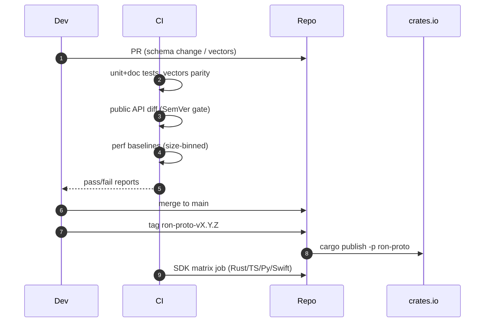
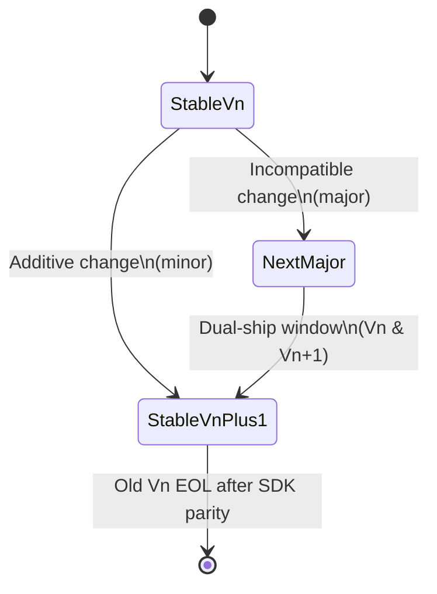

---

title: RUNBOOK — ron-proto
owner: Stevan White
msrv: 1.80.0
last-reviewed: 2025-09-28
audience: operators, SRE, auditors
----------------------------------

# 🛠️ RUNBOOK — ron-proto

## 0) Purpose

Operational manual for **ron-proto** (pure DTO/schemas; no I/O, no ports): health of the library across CI, diagnostics for schema/vectors issues, failure modes, recovery, scaling (perf/allocs), and security ops.
This document satisfies **PERFECTION_GATES** K (Continuous Vigilance) and L (Black Swan Economics).

**Scope note:** ron-proto defines **types only** (Serde/DAG-CBOR, OAP/1 envelope, ContentId). All network/TLS/quotas live in services.

---

## 1) Overview

* **Name:** `ron-proto`
* **Role:** Shared **protocol/DTO library** (schemas for OAP/1 frames, content addressing, manifests, error envelopes, capability tokens)
* **Criticality Tier (lib):** **L1 – Shared Protocol Library** (breakage affects many crates/SDKs)
* **Dependencies (build/test):** serde, ciborium/dag-cbor, blake3, hex/base64, rstest/criterion (dev/bench)
* **Ports Exposed:** **N/A (library crate)**
* **Data Flows (conceptual):** CBOR/JSON <-> Rust DTOs; canonical test vectors <-> SDK parity tests
* **Version Constraints:** MSRV 1.80.0; **SemVer discipline** (breaking schema → major); `deny_unknown_fields` by default

---

## 2) Startup / Shutdown

**Not applicable (library).** Use these **operational verification** commands during development/release:

```bash
# Build & tests
cargo test -p ron-proto
cargo test -p ron-proto --doc

# Lints & API surface
cargo clippy -p ron-proto -- -D warnings
cargo install cargo-public-api --locked
cargo public-api -p ron-proto --diff-git-checkouts "HEAD^" "HEAD"

# Perf sanity (if benches present)
cargo bench -p ron-proto

# Deny (supply-chain / licenses)
cargo deny check
```

**Verification (green state):**

* All tests pass; **public API diff** shows **no breaking** when releasing a non-major.
* Benchmarks within ±10% of baselines (see PERFORMANCE.md).
* No deny/clippy failures.

---

## 3) Health & Readiness

**Proxy signals (since it’s a lib, not a service):**

* **CI badge green** for:

  * unit/doc tests,
  * interop vectors (cross-SDK),
  * public-API diff (no unintended break),
  * perf regression gates (size-binned),
  * cargo-deny advisory/license checks.
* **CI profiles covered:** x86_64-AVX2 **and** arm64-NEON runners must pass.

**Expected timelines:**

* Fresh clone → build/test ≤ 2–5 min on CI standard runners.
* If red for >10 min: start triage with §5 Diagnostics.

---

## 4) Common Failure Modes

| Symptom / CI Failure                        | Likely Cause                                      | Evidence / Where to Look                        | First Fix / Remediation                                                                                        | Escalation                                 |
| ------------------------------------------- | ------------------------------------------------- | ----------------------------------------------- | -------------------------------------------------------------------------------------------------------------- | ------------------------------------------ |
| **Serde `unknown field` on decode**         | Downstream drift (SDK or service added field)     | Failing interop tests; serde error text         | Reconfirm schema: if field is legit → **new Vn DTO**; do **not** relax `deny_unknown_fields`. Publish vectors. | Open compat advisory; notify affected SDKs |
| **Vectors mismatch (byte diff)**            | CBOR canonicalization drift / field order change  | `/tests/vectors/*` diff in CI                   | Restore deterministic DAG-CBOR encoding; re-generate vectors; update SDK fixtures in lock-step.                | Block release until parity restored        |
| **`cargo public-api` shows breaking diff**  | Accidental public API change                      | CI job “public API diff”                        | If intended → bump **major**; else revert change to restore compat.                                            | Require owner approval for major bump      |
| **Perf gate fail (tiny or large size bin)** | serde/ciborium or blake3 version change; allocs ↑ | Criterion baseline comparison; heaptrack allocs | Revert dep or update baselines **with justification**; micro-opt or restore pool usage.                        | Perf review + sign-off (Gate F)            |
| **Doc tests fail**                          | README/INTEROP drift                              | `cargo test --doc` output                       | Fix doctests or update snippets; re-run.                                                                       | N/A                                        |
| **License/advisory (cargo-deny) fail**      | New transitive dep                                | `cargo deny check` report                       | Pin/patch, add allowlist only if compliant w/ policy.                                                          | Security owner sign-off                    |

---

## 5) Diagnostics

```bash
# Run a failing test verbosely
cargo test -p ron-proto failing_test_name -- --nocapture

# Inspect a vector (hex + diag)
xxd -g1 tests/vectors/manifest_roundtrip.cbor | head -n 40

# Quick CBOR round-trip (Rust) - run in a scratch test if needed
cargo test -p ron-proto cbor_roundtrip -- --nocapture

# Public API diff against the last release tag
LAST=$(git describe --tags --abbrev=0)
cargo public-api -p ron-proto --diff-git-checkouts "$LAST" "HEAD"

# Heap allocations on encode/decode (Linux)
heaptrack cargo test -p ron-proto --tests
heaptrack_gui heaptrack.*.zst
```

**Tactics:**

* **Isolate size bin:** tiny (≤1 KiB) vs streaming (64 KiB) vs large (1 MiB) to find perf regressions.
* **Determinism check:** encode → decode → re-encode must be **byte-identical** for canonical vectors.
* **Hash truth test:** recompute BLAKE3 → must match `ContentId`.

---

## 6) Recovery Procedures

1. **Schema drift (unknown field)**

   * **Decide**: Is the new field legitimate and needed?
   * If **yes**: introduce **`V{n+1}` DTO**, keep old Vn; add interop tests; update vectors; **minor** or **major** depending on surface.
   * If **no**: revert the drift in the dependent crate; publish advisory.

2. **Vectors got mutated**

   * Re-generate vectors from canonical source (golden generator or service reference).
   * Update all SDK fixtures in one PR series; land atomically.

3. **Breaking API by accident**

   * Revert or ship **major** with MIGRATION.md + changelog; add `#[non_exhaustive]` where appropriate to future-proof enums.

4. **Perf regression**

   * Bisect deps (serde/ciborium/blake3).
   * Optimize hot spots (avoid temp allocations; reuse buffers; `bytes::Bytes`).
   * If unavoidable (upstream), update baselines with rationale + approval (Gate F).

5. **Security advisory / license violation**

   * Pin to secure version; add deny rule; re-run `cargo deny`.

6. **Amnesia pressure (RAM-only) anomalies**

   * Symptom: transient alloc spikes or OOM during encode/decode.
   * Action: switch benches to “amnesia mode” profile, disable any optional pools, confirm allocs/op within targets; re-run tiny vs. large size bins.

---

## 7) Backup / Restore

**N/A (stateless library)**.
**Backups** apply to **vectors** and **baselines**: store in `tests/vectors/` and `testing/performance/baselines/` and mirror to artifact storage.

---

## 8) Upgrades (Release Procedure)

```bash
# 1) Sync main; ensure green
git pull --rebase
cargo test -p ron-proto && cargo clippy -p ron-proto -- -D warnings
cargo public-api -p ron-proto --diff-git-checkouts "HEAD^" "HEAD"

# 2) Update CHANGELOG.md; bump version per SemVer (major if breaking)
git add CHANGELOG.md Cargo.toml && git commit -m "ron-proto vX.Y.Z"

# 3) Tag + push
git tag ron-proto-vX.Y.Z
git push origin main --tags

# 4) Publish (workspace-aware)
cargo publish -p ron-proto

# 5) SDK matrix (post-publish)
gh workflow run sdk-matrix.yml -f crate=ron-proto -f version=vX.Y.Z
```

Post-release: open tracking issues to bump dependents; run SDK matrix job.

---

## 9) Chaos / Fuzz Testing

**Goal:** prove resilience to malformed frames/CBOR without panics, only typed errors.

```bash
# cargo-fuzz setup
cargo install cargo-fuzz
cargo fuzz init
cargo fuzz add decode_manifest
cargo fuzz run decode_manifest -- -max_total_time=300
```

**Faults to inject:**

* Overlong `len` in OAP/1 header;
* CBOR map with duplicate keys / unsorted order;
* Invalid `ContentId` prefix/length.

---

## 10) Scaling Notes (Library)

* **Parallel encode/decode** scales with cores; no internal locks.
* **Memory behavior:** prefer zero-copy slices (`bytes::Bytes`); respect **Amnesia Mode** (RAM-only; no file-backed caches).
* See PERFORMANCE.md for **size-binned SLOs** and **regression gates**.

---

## 11) Security Ops

* **No secrets** in code or vectors.
* **Capability DTO** changes require **security review** (macaroon caveat registry).
* **Supply chain:** `cargo deny` in CI; lockfile change review; verify crate checksums.
* **PQ stance:** ron-proto is algorithm-agnostic at type level; introducing new `ContentId` algo → **major** schema (see INTEROP.md).
* **PQ migration drill:**

  * Generate dual vectors (b3 + new algo), tag as V(n+1).
  * Run SDK matrix across Rust/TS/Py/Swift for both sets.
  * Release as major with MIGRATION.md and dual-ship window.

---

## 12) References

* [INTEROP.md](./INTEROP.md) – wire contracts and vectors
* [PERFORMANCE.md](./PERFORMANCE.md) – SLOs, baselines, gates
* [SECURITY.md](./SECURITY.md) – threat model & boundaries
* [CONFIG.md](./CONFIG.md) – (minimal; mostly N/A for lib)
* Blueprints: Hardening, Concurrency & Aliasing, Omnigate, Scaling

---

## ✅ Perfection Gates Checklist

* [ ] Gate A: CI green (tests, clippy, deny)
* [ ] Gate F: Perf regression gates within ±10% per size-bin
* [ ] Gate J: Fuzz targets run and logged last quarter
* [ ] Gate K: Continuous vigilance (API diff + vectors parity in CI)
* [ ] Gate N: ARM/Edge perf snapshots updated
* [ ] Gate O: Security review on capability/manifest changes
* [ ] Gate P: Amnesia+PQ drill artifacts updated (vectors, matrix logs)

---

## 📈 Mermaid Diagrams

### A) CI & Release Pipeline (library)



### B) Failure Triage: Unknown Field

```mermaid
flowchart TD
  A[CI fails: unknown field] --> B{Field legit?}
  B -- No --> C[Reject downstream drift\n(open issue, revert)]
  B -- Yes --> D[Add V{n+1} DTO]
  D --> E[Keep Vn for compat]
  E --> F[Update vectors & SDK fixtures]
  F --> G[Minor or Major?]
  G -- Breaking --> H[Major bump + MIGRATION.md]
  G -- Additive --> I[Minor bump]
  H --> J[Tag & publish]
  I --> J[Tag & publish]
```

### C) Versioning & Compatibility State



---

**End of RUNBOOK — ron-proto**
