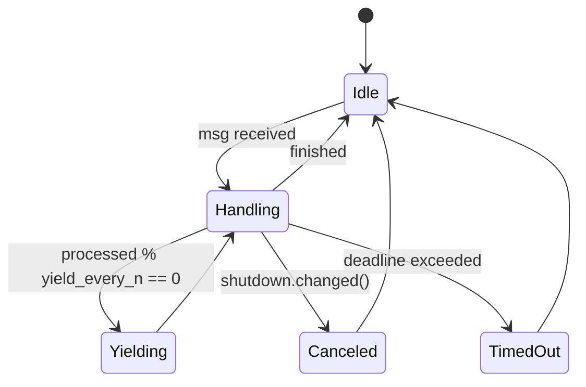

**File:** `crates/ryker/docs/CONCURRENCY.md`

````markdown
---
title: Concurrency Model — ryker
crate: ryker
owner: Stevan White
last-reviewed: 2025-09-28
status: draft
template_version: 1.1
msrv: 1.80.0
tokio: "1.x (pinned at workspace root)"
loom: "0.7+ (dev-only)"
lite_mode: "Library crate: §1, §3, §4, §5, §10, §11 are primary; others N/A or host-owned."
audience: contributors, auditors
---

# Concurrency Model — ryker

This document makes the concurrency rules **explicit**: tasks, channels, locks, shutdown, timeouts,
and validation (unit/property/loom). It complements `docs/SECURITY.md`, `docs/CONFIG.md`,
and the crate’s `README.md` and `IDB.md`. See also **Six Concerns → Concurrency & Aliasing** for repo-wide invariants.

> **Golden rule:** never hold a lock across `.await` in supervisory or hot paths.

---

## 0) Lite Mode (library orientation)

Ryker is an **embedded actor & mailbox runtime**. It does **not** own a global async runtime or spawn
background daemons by itself; **hosts** create actors/mailboxes and own task lifecycles.
Therefore:
- **Primary:** §1 Invariants, §3 Channels, §4 Locks, §5 Deadlines/Timeouts, §10 Validation, §11 Patterns.
- **Host-owned / N/A:** §2 Runtime topology, §6 Shutdown choreography, §7 I/O framing (ryker does no I/O).

---

## 1) Invariants (MUST)

- **No lock across `.await`.** Split critical sections so all `.await`s happen after guard drop.
- **Single writer per mutable resource.** Readers obtain snapshots (copy/clone/Arc) or short read guards.
- **Bounded queues only.** All mailboxes and internal queues are **bounded**; on pressure we drop/reject explicitly.
- **Backpressure over buffering.** Prefer `try_send` + `Busy` to growing queues. Count drops.
- **Deterministic deadlines.** Default **call/handle deadline** is enforced (see CONFIG.md). Time-based behavior is typed (`Timeout`) and observable.
- **Cooperative cancellation.** `tokio::select!` around cancel points (shutdown/deadline).
- **No blocking syscalls** on the async runtime; use `spawn_blocking` when unavoidable (rare in ryker).
- **No task leaks.** Host code should hold `JoinHandle`s or use registries; detaching requires rationale.
- **Fairness.** Batching (`batch_messages`) and yielding (`yield_every_n_msgs`) prevent starvation.
- **Async Drop discipline.** `Drop` never blocks; teardown uses explicit `async close()/shutdown()` if needed by host constructs.
- **Amnesia mode.** When `amnesia.enabled = true` (CONFIG.md), hosts must **zeroize** dropped/queued message buffers on shutdown and avoid hidden persistence (RAM-only during lifetime).

---

## 2) Runtime Topology (Host-owned) — **N/A for ryker**

Ryker does not own a supervisor/listener/worker topology. Host services may implement such topologies
*using* ryker mailboxes; topology belongs in the host’s concurrency doc. For examples, see `ron-kernel` supervisor patterns.

---

## 3) Channels & Backpressure

Ryker’s surface defines **how** channels behave; concrete instances are created by the host.

| Name / Purpose                    | Kind         | Capacity (default) | Producers → Consumers | Backpressure Policy                         | Drop / Lag Semantics                                    |
|----------------------------------|--------------|--------------------:|----------------------|---------------------------------------------|---------------------------------------------------------|
| **Mailbox\<A>** (per actor)      | `mpsc`       | `defaults.mailbox_capacity` (256) | N → 1            | `try_send` → `Busy` (reject new)            | Increment `mailbox_dropped_total{reason="capacity"}`    |
| **Runtime events** (optional)    | `broadcast`  | 1024                | 1 → N                | lag counter                                 | Increment `bus_lagged_total`, warn slow consumer        |
| **Shutdown** (host-provided)     | `watch`      | 1                   | 1 → N                | last-write-wins                              | N/A                                                     |

**Guidelines**
- Senders **must** handle `Busy` deterministically (propagate or adapt).
- If many producers contend for the same mailbox, consider guarding ingress with a **`Semaphore`** (or per-producer quotas) to improve fairness before the queue boundary.
- Long-running work should checkpoint/yield to avoid monopolizing the executor; honor `yield_every_n_msgs`.

---

## 4) Locks & Shared State

**Allowed**
- Short-lived `Mutex/RwLock` for **metadata** (actor registry, counters). Acquire → compute → drop guard → then `.await`.
- Read-mostly **snapshots** via `Arc<StateSnapshot>` passed into async paths.
- **Per-actor ownership:** each actor owns its state; cross-actor interaction via messages.

**Forbidden**
- Holding any lock across `.await`.
- Nested locks without an explicit **hierarchy** and justification.

**Hierarchy (illustrative; tailor to actual internals)**
1. `registry_meta`
2. `actor_directory`
3. `counters`

> If you must stage a value derived under a lock, **clone/move** it out before `.await`.

---

## 5) Timeouts, Retries, Deadlines

- **Default call/handle deadline:** from `defaults.deadline` (CONFIG.md), enforced per message/operation.
- **Retries:** **host policy**. If used, **retry idempotent actions only** with **decorrelated jitter** (CONFIG: `decorrelated_jitter`).
- **I/O timeouts:** N/A (ryker does not perform I/O); host services apply `read/write/idle` timeouts at edges.
- **Scheduler fairness:** respect `batch_messages`; **force yield** after `yield_every_n_msgs`.

**Canonical pattern**
```rust
tokio::select! {
  _ = shutdown.changed() => Err(Error::Canceled),
  res = tokio::time::timeout(deadline, actor.handle(msg)) => res.map_err(|_| Error::Timeout),
}
````

---

## 6) Cancellation & Shutdown — **Host choreography**

Hosts broadcast shutdown via `watch<bool>` (or equivalent) and stop intake, letting in-flight work drain
until a **drain deadline**. Abort stragglers. Ryker provides the mailbox patterns to do this cleanly.

---

## 7) I/O & Framing — **N/A**

Ryker performs no network/file I/O. Framing, checksums, and TLS live in transport/service crates.

---

## 8) Error Taxonomy (Concurrency-relevant)

| Error      | When                        | Retry? | Metric                                       | Notes                            |
| ---------- | --------------------------- | ------ | -------------------------------------------- | -------------------------------- |
| `Busy`     | Mailbox full                | maybe  | `mailbox_dropped_total{reason=...}`          | prefer backpressure              |
| `Timeout`  | Deadline exceeded           | maybe  | `request_latency_seconds` (histogram)        | typed; no partials               |
| `Canceled` | Shutdown signal observed    | no     | `tasks_canceled_total`                       | cooperative                      |
| `Lagging`  | Broadcast receiver overflow | no     | `bus_lagged_total`                           | diagnose slow consumer           |
| `Panic`    | Invariant violation/bug     | no     | `actor_restarts_total{actor}`, `crash_total` | rely on host supervision/backoff |

---

## 9) Metrics (Concurrency Health)

* `mailbox_depth{actor}` gauge (sampled if enabled)
* `mailbox_dropped_total{actor,reason}` counter
* `actor_restarts_total{actor}` counter (host-supervised)
* `request_latency_seconds` histogram (per handler)
* `busy_rejections_total{actor}` counter
* `bus_lagged_total` counter

---

## 10) Validation Strategy

**Unit**

* Deadline guard: operations respect `defaults.deadline` bounds.
* Fairness: yields occur after `yield_every_n_msgs`.
* Overflow: `try_send` returns `Busy` at capacity.

**Property**

* **No lock across await** pattern tests (lint + targeted unit cases).
* **Drop injection** property test: randomly force `Busy`/drop to assert callers handle backpressure deterministically.

**Loom (dev-only)**

* Model: producers → bounded mailbox → consumer; shutdown races.
* Assertions: no deadlocks, no missed shutdown wakeups, no double-drop of messages.

**Fuzz (host edges)**

* Out-of-scope for ryker (no framing). Hosts may fuzz message payloads/handlers.

---

## 11) Code Patterns (Copy-Paste)

**Bounded mpsc + backpressure**

```rust
if let Err(tokio::sync::mpsc::error::TrySendError::Full(_)) = tx.try_send(msg) {
    metrics::busy_rejections_total().inc();
    return Err(Error::Busy);
}
```

**Cooperative shutdown with deadline**

```rust
let mut shutdown = shutdown_rx.clone();
tokio::select! {
    _ = shutdown.changed() => Err(Error::Canceled),
    res = tokio::time::timeout(cfg.defaults.deadline, actor.handle(msg)) => {
        res.map_err(|_| Error::Timeout)?
    }
}
```

**No lock across `.await`**

```rust
let snapshot = {
    let g = registry.read();
    g.actor_snapshot(name).cloned()
}; // guard dropped here
if let Some(actor) = snapshot { actor.do_async().await; }
```

**Yield for fairness**

```rust
processed += 1;
if processed % cfg.fairness.yield_every_n_msgs == 0 {
    tokio::task::yield_now().await;
}
```

---

## 12) Configuration Hooks (Quick Reference)

* `defaults.mailbox_capacity` — per-actor mpsc bound.
* `defaults.deadline` — per-call/handle default deadline.
* `fairness.batch_messages`, `fairness.yield_every_n_msgs` — scheduling fairness.
* `supervisor.decorrelated_jitter` — backoff policy (host’s supervisor).
* See `docs/CONFIG.md` for full schema and validation windows.

---

## 13) Known Trade-offs / Nonstrict Areas

* **Reject vs. drop-oldest:** mailboxes use **reject new** (`Busy`) to keep head-of-line semantics clear.
* **Starvation vs. throughput:** aggressive batching increases throughput but may delay low-rate actors;
  `yield_every_n_msgs` exists to balance this.
* **Amnesia impact:** with `amnesia=ON`, hosts should **zeroize** any in-memory buffers on shutdown and ensure no spill-to-disk debugging artifacts.

---

## 14) Actor Lifecycle (compact diagram)



**Text:** Actor loops: receive → handle → occasionally **yield** for fairness; transitions to **Canceled** on shutdown or **TimedOut** on deadline, then returns to **Idle**.

---

## 15) CI & Lints (Enforcement)

* `cargo clippy -D warnings -W clippy::await_holding_lock`
* **Loom gate** (ignored by default; PR job runs with `RUSTFLAGS="--cfg loom"` for targeted tests)
* **cargo-deny**: `cargo deny check` (licenses/bans/advisories/sources) — repo standard
* Review triggers: on **Tokio bump** and on any change to mailbox/fairness/deadlines.

---

## 16) Schema Generation (Optional)

Consider a tiny registry module that lists active mailboxes and their caps for doc drift checks
(golden test comparing table to registry).

---

## 17) Review & Maintenance

* Review on any change to mailbox defaults/fairness/deadlines, on **Tokio bump**, or every 90 days.
* Keep `owner`, `msrv`, `last-reviewed` current.
* PR checklist: if concurrency behavior changes, update this file + add/refresh unit/property/loom tests.

```
```
