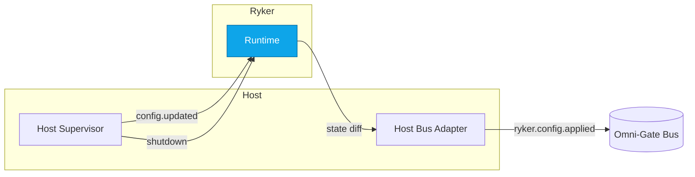

````markdown
# 🔗 INTEROP — ryker

*Audience: developers, auditors, external SDK authors*  
*msrv: 1.80.0*  
*concerns: RES, PERF, DX*  

---

## 0) Purpose

Define the **interop surface** of `ryker`:

- **In-process contracts** (config schema, builder APIs) that hosts rely on.
- **Bus topic mappings** (how hosts translate platform events to ryker actions).
- **Observability fields** (metric names, log/span fields) consumed by other crates/dashboards.
- **Canonical vectors** (env → config snapshot, span level parsing) to prevent drift.

> Scope: `ryker` is a **library crate** (actor/mailbox runtime). It exposes **no wire protocols or endpoints**. All network I/O and transport protocols (OAP/1, HTTP, gRPC, QUIC) are owned by **host services** and other crates. Ryker integrates with **GMI-1.6 Omni-Gate** via those hosts.

---

## 1) Protocols & Endpoints

**Ryker exposes no network endpoints.** Interop at the wire layer is indirect, via hosts.

### 1.1 Host Integration Contracts (normative)

| Concern | Contract (host-side) | Notes |
|---|---|---|
| Config ingestion | Construct `ryker::config::RykerConfig` (from file/env) → pass to `Runtime::new(cfg)` | File formats: TOML/JSON; env prefix `RYKER_`; strict validation; prod-guard on `RYKER_CONFIG_PATH`. |
| Backpressure | Map `Busy`/drops to host’s wire semantics | Typical HTTP mapping: 429 Too Many Requests; include `Retry-After`. See [CONCURRENCY.md](./CONCURRENCY.md) §3 & §5. |
| Deadlines | Enforce/propagate request deadlines into actor handlers | Timeouts/latency SLOs remain at host edge; ryker enforces per-message default deadline. |
| Observability | Export ryker metrics/logs/spans via host’s exporters | Metric names/labels in §4; logs JSON fields; spans inherit host `corr_id`. |
| Bus control | Translate platform events → ryker actions | See §3 (e.g., `kernel.config.updated` → `RykerConfig` reload; `kernel.shutdown` → cooperative drain). |

---

## 2) DTOs / Schemas (Inter-crate)

Ryker’s primary interop object is the **config snapshot**. Hosts may also surface it (read-only) for debugging.

### 2.1 `RykerConfig` (serde TOML/JSON)

```rust
// ryker::config (summary)
#[serde(deny_unknown_fields)]
pub struct RykerConfig {
  pub defaults: Defaults,
  pub supervisor: SupervisorCfg,
  pub fairness: Fairness,
  pub observability: Observability,
  pub amnesia: Amnesia,
}
````

**TOML example:**

```toml
[defaults]
mailbox_capacity = 256
max_msg_bytes    = "64KiB"
deadline         = "1s"
```

**JSON snapshot (debug/dev-CLI):**

```json
{"defaults":{"mailbox_capacity":256,"max_msg_bytes":65536,"deadline":"1s"}}
```

**Env mapping (authoritative):** See CONFIG.md schema table. Deprecated keys accepted with WARN logs.

> Unknown fields → rejected at deserialization (`deny_unknown_fields`); invalid values → **fail-closed** at validation.

---

## 3) Bus Topics (Host Mapping)

Ryker does **not** publish/subscribe directly. Hosts map bus events to ryker actions.

### 3.1 Subscribed (host → ryker)

| Topic                   | Schema (example)                         | Host Action → ryker                                                     |           |                                                                             |
| ----------------------- | ---------------------------------------- | ----------------------------------------------------------------------- | --------- | --------------------------------------------------------------------------- |
| `kernel.config.updated` | `{"version":42,"source":"env             | file                                                                    | remote"}` | Recompute `RykerConfig` → `Runtime.reload(new_cfg)` (hot/cold rules apply). |
| `kernel.shutdown`       | `{"reason":"deploy","deadline_ms":3000}` | Begin drain: stop intake; await in-flight ≤ deadline; abort stragglers. |           |                                                                             |

### 3.2 Published (host MAY emit; ryker-informed)

| Topic                  | Schema (example)                                                   | Emission rule                                  |
| ---------------------- | ------------------------------------------------------------------ | ---------------------------------------------- |
| `ryker.actor.restart`  | `{"actor":"worker","restarts":3,"window_s":600}`                   | Host supervisor restarts actor.                |
| `ryker.config.applied` | `{"diff":{"fairness.yield_every_n_msgs":[64,128]},"source":"env"}` | After successful reload; include diff context. |

### 3.3 Bus Flow Diagram



**Text alt:** Host sends `config.updated` or `shutdown` events to ryker; ryker reloads/drains and reports state diffs back onto the Omni-Gate bus.

---

## 4) Observability Interop

**Metrics (exported via host):**

| Metric                          | Type      | Labels            | Notes                                 |
| ------------------------------- | --------- | ----------------- | ------------------------------------- |
| `ryker_mailbox_depth`           | Gauge     | `actor`           | Depth if `queue_depth_sampling=true`. |
| `ryker_mailbox_dropped_total`   | Counter   | `actor`,`reason`  | Drops (capacity/deadline).            |
| `ryker_busy_rejections_total`   | Counter   | `actor`           | Producer `try_send` rejected.         |
| `ryker_handler_latency_seconds` | Histogram | `actor`,`outcome` | Handler latency.                      |

**Logs:** JSON fields: `ts`, `level`, `service`, `crate="ryker"`, `actor`, `event`, `reason`, `corr_id`.
Secrets/PII never logged; amnesia=ON disables disk sinks.

**Spans:**

* Names: `ryker.mailbox.enqueue`, `ryker.actor.handle`, `ryker.config.reload`
* Fields: `actor`, `deadline_ms`, `outcome`
* Example corr_id propagation:

```rust
tracing::info_span!("ryker.actor.handle", corr_id=%cid, actor=%name);
```

---

## 5) Canonical Test Vectors

Vectors are documented **here** and must be duplicated as **executable tests** under `/tests/vectors/ryker/` (run in CI).

* **Env → Config Snapshot**:
  Input: `RYKER_SPAN_LEVEL=DEBUG` → Snapshot: `"span_level":"debug"`.
* **SpanLevel Parsing**: `INFO` → `Info`; `trace` → `Trace`; `bogus` → parse error.
* **Backpressure**: Queue full → `ryker_busy_rejections_total` increment → HTTP 429 (if host is HTTP).
* **Config Reload**: `kernel.config.updated` event → fairness knobs apply hot; size/capacity apply cold.

---

## 6) Error Taxonomy

| Condition            | Ryker signal                      | Host mapping                             |
| -------------------- | --------------------------------- | ---------------------------------------- |
| Queue full           | `Error::Busy` + counter           | HTTP 429; gRPC RESOURCE_EXHAUSTED        |
| Deadline exceeded    | latency histogram outcome=timeout | HTTP 504; gRPC DEADLINE_EXCEEDED         |
| Invalid config       | `ConfigError::{Invalid,Parse}`    | Startup fail; reload rejected; log ERROR |
| Shutdown in progress | cancel-safe `.await` returns      | Host returns 503 until ready             |

See `src/errors.rs` for variants.

---

## 7) Interop Guarantees

* **Library boundary:** No wire contracts owned by ryker.
* **Schema SemVer:** Additive fields default-safe; breaking → major bump.
* **Env keys:** Deprecated accepted ≥1 minor with WARN alias.
* **Polyglot parity:** Canonical vectors must be mirrored in Rust, TS, Python, Swift SDKs.
* **PQ interop:** **N/A**. Ryker has no cryptography; see QUANTUM.md for repo-wide PQ policy.
* **Auditability:** Vectors in `/tests/vectors/ryker/` executed in CI.

---

## 8) References

* [Interop Blueprint GMI-1.6](../../INTEROP_BLUEPRINT.MD)
* [ron-proto](../../crates/ron-proto/) — shared DTO schemas
* [OBSERVABILITY.md](./OBSERVABILITY.md)
* [CONCURRENCY.md](./CONCURRENCY.md)
* [SECURITY.md](./SECURITY.md)
* [CONFIG.md](./CONFIG.md)

---

✅ With this document, ryker’s **in-process interop** (config, observability, bus mapping) is explicit, tested, and polyglot-ready—so hosts and SDKs can wire it into Omni-Gate **without drift**.

```
