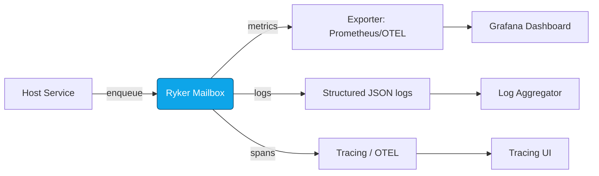

**File:** `crates/ryker/docs/OBSERVABILITY.md`

````markdown
# 📈 OBSERVABILITY — ryker

*Audience: developers, operators, auditors*  
*Concerns: PERF, RES, GOV*  
*msrv: 1.80.0 (Tokio/loom compatible)*

---

## 0) Purpose

Define **what is observable**, **how ryker exposes it**, and **how it’s used** for:

- Metrics (Prometheus/OTEL via the `metrics` facade or host exporter)
- Health/readiness semantics (host-owned; ryker is a library)
- Logs (JSON schema & fields)
- Tracing spans & correlation
- Alerts & SLOs

> **Scope:** `ryker` does **not** expose `/metrics`, `/healthz`, or `/readyz`. Hosts embed ryker and expose endpoints.  
> **Amnesia:** when `amnesia=ON`, logs remain metadata-only, metrics stay in-memory, and **no disk spill** is permitted.  
> **Feature flags:** `metrics` and `tracing` control emission; `observability.enable_metrics` and `queue_depth_sampling` control runtime behavior.

---

## 1) Metrics (Prometheus-style)

### 1.1 Ryker Core Metrics (library)

> Prefix: **`ryker_`**. Labels must remain low-cardinality (actors = short stable names).

| Metric | Type | Labels | Notes |
|---|---|---|---|
| `ryker_mailbox_depth` | Gauge | `actor` | Sampled if `queue_depth_sampling=true`. |
| `ryker_mailbox_dropped_total` | Counter | `actor`, `reason`=`capacity\|deadline` | Increments on drop/reject. |
| `ryker_busy_rejections_total` | Counter | `actor` | `try_send` hit full queue. |
| `ryker_handler_latency_seconds` | Histogram | `actor`, `outcome`=`ok\|timeout\|error` | Duration per message handle. Buckets in Appendix A. |
| `ryker_actor_restarts_total` | Counter | `actor` | Incremented by host on restart. |
| `ryker_bus_lagged_total` | Counter | `topic` | Broadcast overflow (if host uses). |
| `ryker_yields_total` | Counter | `actor` | Count fairness yields (`yield_every_n_msgs`). |
| `ryker_config_reload_total` | Counter | `source` | Successful reloads. |
| `ryker_config_reload_errors_total` | Counter | `source`, `error` | Failed reload attempts. |

### 1.2 Host “Golden Metrics” (informational)

Hosts embedding ryker should still expose:

- `http_requests_total{route,method,status}`  
- `request_latency_seconds{route,method}`  
- `inflight_requests{route}`  
- `rejected_total{reason}`  
- `service_restarts_total`

### 1.3 Sampling & Cost

- `queue_depth_sampling` cadence: coarse (≥1s) to keep scrape cost low.  
- Avoid per-message gauges; counters and histograms handle high-rate paths.

---

## 2) Health & Readiness

- **Ryker** has no endpoints. Hosts must provide `/healthz` (liveness) and `/readyz` (readiness).  
- Readiness may consider ryker signals (e.g., sustained high drops).  
- Degraded example response (host):  
  ```json
  { "degraded": true, "missing": ["bus_attached"], "retry_after": 5 }
````

---

## 3) Logs

### 3.1 Format & Fields

* **JSON lines**; one event per line.
* Required fields:

  * `ts` (ISO8601)
  * `level`
  * `service` (host service name)
  * `crate` = `"ryker"`
  * `actor`
  * `event` (`mailbox_busy`, `deadline_exceeded`, etc.)
  * `reason` (align with metric labels)
  * `corr_id` (propagated)
  * `elapsed_ms` (if applicable)

### 3.2 Redaction & Amnesia

* **No PII**; never log message bodies.
* In **amnesia** mode, avoid any disk spill (no debug dumps).
* Config diffs redact sensitive values.
* Cross-reference: see `SECURITY.md` for zeroization rules.

---

## 4) Tracing & Correlation

* Use `tracing` with JSON or OTEL exporters (via `tracing-opentelemetry` feature if host enables).

* **Span names**:

  * `ryker.mailbox.enqueue`
  * `ryker.actor.handle`
  * `ryker.config.reload`

* **Fields**: `actor`, `deadline_ms`, `outcome`, `queue_depth` (if sampled).

* **Correlation IDs**: hosts inject `corr_id`; ryker spans propagate it.

---

## 5) Alerts & SLOs

### 5.1 SLOs

* **Drop rate**: < 0.01/s per actor.
* **Busy rejections**: near zero in steady state.
* **Timeouts**: < 0.1% of handled msgs.
* **Latency**:

  * p95 < 0.9 × actor deadline
  * p99 < 1.2 × actor deadline

### 5.2 Alerts (examples)

* Capacity pressure:
  `increase(ryker_mailbox_dropped_total{reason="capacity"}[5m]) > 0`
* Backpressure sustained:
  `increase(ryker_busy_rejections_total[10m]) > 100`
* Deadline issues:
  `increase(ryker_handler_latency_seconds_count{outcome="timeout"}[10m]) > 0`
* Config reload errors:
  `increase(ryker_config_reload_errors_total[10m]) > 0`

### 5.3 Runbook Skeleton

Each alert links to `RUNBOOK.md`. Skeleton format:

* **Symptom:** what triggered (e.g., spike in `mailbox_dropped_total`).
* **Checks:** inspect actor load, config bounds, logs.
* **Actions:** throttle producers, adjust `mailbox_capacity`, retune deadlines, redeploy.
* **Escalation:** if persistent, open incident; involve kernel maintainers.

---

## 6) CI / Enforcement

* **Clippy:** deny `await_holding_lock`.
* **Metrics drift:** smoke test asserts metrics exist and match doc.
* **cargo-deny + cargo-audit:** run in CI for deps/advisories.
* **Loom:** interleaving test ensures no deadlocks and correct counter increments.
* **Doc drift:** review this file on metric/label/schema changes or every 90 days.

---

## Appendix A — Recommended Buckets

* `ryker_handler_latency_seconds`:
  `0.005, 0.01, 0.02, 0.05, 0.1, 0.2, 0.5, 1, 2, 5, 10`

---

## Appendix B — Label Hygiene

* Keep `actor` to a **small, stable set**.
* No high-cardinality labels (IDs, error details). Use logs/traces instead.

---

## Appendix C — Signal Flow (Mermaid)



**Text:** Host enqueues messages → Ryker enforces bounds → emits metrics/logs/traces → host exporter/collectors feed dashboards, log search, and trace UI.

---

```
