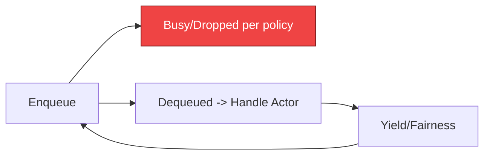

---

````markdown
# ⚡ PERFORMANCE.md — Ryker

---
title: Performance & Scaling
status: draft
msrv: 1.80.0
crate_type: lib
last-updated: 2025-09-28
audience: contributors, ops, perf testers
concerns: [RES, PERF, DX, GOV]
---

# PERFORMANCE.md

## 0. Purpose

This document defines the **performance profile** of the ryker crate:
- Lib-level throughput, latency, and allocation metrics.
- Benchmarks & workloads it must sustain.
- Perf harness & profiling tools.
- Scaling knobs, bottlenecks, and triage steps.
- Regression gates to prevent silent perf drift.

It ties directly into:
- **Scaling Blueprint v1.3.1** (roles, SLOs, runbooks).
- **Omnigate Build Plan** milestones Bronze→Gold.
- **Perfection Gates** (F = perf regressions barred, L = scaling chaos-tested).

---

## 1. SLOs / Targets (Library)

### Latency / Overhead
- Enqueue/dequeue p95 ≤ **50 µs** on 8 vCPU baseline.  
- End-to-end actor mailbox p95 ≤ **150 µs** under 10k msg/s.  
- Overhead budgets hardware-agnostic (ratios): < **10%** of host baseline for similar queue.

### Throughput
- Linear scaling across cores up to 8 threads.  
- ≥ **1M msg/s** sustained per core (64B payloads).  
- Burst tolerance: +25% above steady state with graceful Busy.

### Allocation
- ≤ **1 alloc/op** (0 preferred).  
- Favor `bytes::Bytes` and pooled buffers.  
- Verified via `cargo bench + dhat`.

### Error Budget
- Busy < **1%** steady.  
- Timeout outcomes < **0.1%** steady (host maps Busy→429).  

### Resource Ceilings
- CPU < **80%** of a single core at 1M msg/s baseline.  
- Memory < **1 GiB** steady.  
- FD usage: N/A (lib only).

### Amnesia
- Zeroize overhead ≤ **5%** extra CPU at 10k msg/s.  
- Gate CI if >7%.

---

## 2. Benchmarks & Harness

- **Micro-bench (Criterion):**  
  - `bench_enqueue_64b`  
  - `bench_dequeue`  
  - `bench_mailbox_batch`

- **Allocation Bench:** `cargo bench --bench alloc` with `dhat`.

- **Concurrency / Loom:**  
  - Loom tests model interleavings (see `docs/CONCURRENCY.md §10`).  
  - Tests: `loom_mailbox_basic`, `loom_shutdown_no_drop`.

- **Integration:** host harness simulating 10k actors, 1M msgs/min.

- **Profiling Tools:**  
  - `cargo flamegraph` for hotspots.  
  - `tokio-console` for stalls.  
  - `perf` / `coz` for causal profiling.  
  - `hyperfine` for CLI micro latency.

- **Chaos/perf blend:** inject latency/jitter; observe backpressure.

- **CI Integration:** nightly perf run vs baselines.

---

## 3. Scaling Knobs

| Knob         | Source       | Effect                        | Notes                        |
|--------------|-------------|-------------------------------|------------------------------|
| `capacity`   | CONFIG.toml | Bounded mailbox size           | Default: 512                 |
| `batch_size` | CONFIG.toml | Dequeue batch processing      | 1–64 msgs                    |
| `yield_ms`   | CONFIG.toml | Fairness knob (actor yield)   | Default: 1ms                 |
| `jitter`     | CONFIG.toml | Backoff smoothing             | On by default                |

See [CONFIG.md](./CONFIG.md) for schema.

---

## 4. Bottlenecks & Known Limits

- **Contention:** multiple producers per mailbox can cause stalls.  
- **Large messages:** >1 MiB should be offloaded—design forbids.  
- **Timers:** fairness yields cost ~1µs per actor.  
- **TLS / IO:** N/A (lib only).  
- **Amnesia overhead:** zeroize adds ≤5% CPU at 10k msg/s; must be measured in benches.

Bronze milestone = 1M msg/s/core.  
Gold milestone = 10M msg/s on 16 cores.

---

## 5. Regression Gates

CI must fail if:  
- p95 latency ↑ >10%.  
- Throughput ↓ >10%.  
- Allocations/op >1.  
- CPU/mem regress >15%.  
- **Span cost gate:** p95(debug) / p95(info) ≤ 5.0.

Baselines stored in `testing/performance/baselines/`.  

**Workflow:**
```bash
cargo bench -p ryker -- --save-baseline current
cargo criterion compare current testing/performance/baselines/ryker
````

---

## 6. Perf Runbook (Triage)

Steps when perf SLOs are breached:

1. **Check flamegraph:** hotspots (serialization, hashing).
2. **Inspect tokio-console:** task stalls, blocked I/O.
3. **Review metrics:** `mailbox_latency_seconds`, `bus_overflow_dropped_total`.
4. **Stress knobs:** increase capacity, tune batch size.
5. **Chaos toggle:** disable jitter, rerun.
6. **Edge case:** test ARM/mobile baseline.
7. **Escalate:** page on-call if p95 overhead >10% for 30m or Busy >1% for 15m.

---

## 7. Acceptance Checklist (DoD)

* [ ] SLOs defined for this crate.
* [ ] Bench harness runs locally + CI.
* [ ] Flamegraph/console traces collected at least once.
* [ ] Scaling knobs documented.
* [ ] Regression gates wired into CI.
* [ ] Perf runbook section updated.

---

## 8. Appendix

### Reference SLOs (Scaling Blueprint)

* p95 GET <80ms intra-region; <200ms inter-region.
* Failures <0.1%.

### Reference Workloads

* `gwsmoke` soak 24h on echo+mailbox.
* 8 vCPU AWS m5.large baseline.

### Tooling Cheatsheet

```bash
cargo flamegraph -p ryker
tokio-console run -- cargo test -p ryker
hyperfine 'cargo run -p ryker -- enqueue'
```

### Perfection Gates tie-in

* Gate F = perf regressions barred.
* Gate L = scaling validated under chaos.

### History

* Record regressions/fixes here.

---

## 9. Mermaid — Perf Path



**Text alt:** Messages are enqueued; if mailbox full → Busy (red). Otherwise dequeued, handled, fairness yield, then loop.

---

```

---
