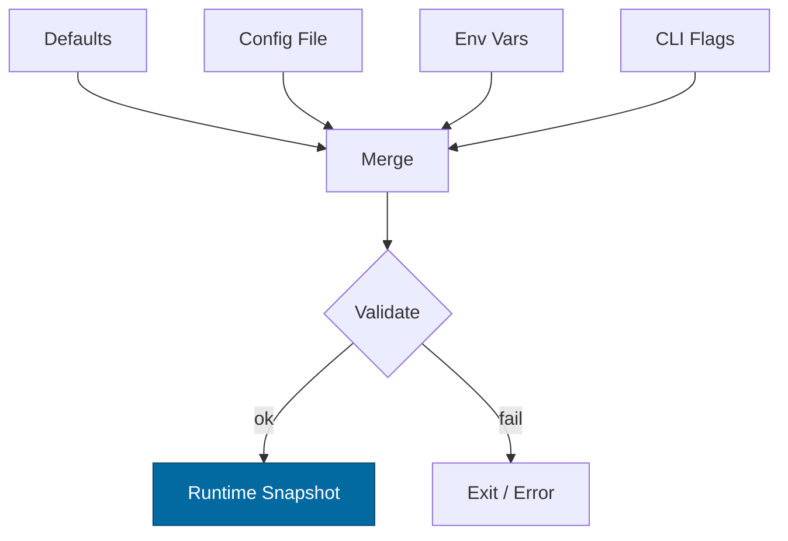

````markdown
---
title: Configuration — svc-interop
crate: svc-interop
owner: Stevan White
last-reviewed: 2025-10-12
status: draft
template_version: 1.1
---

# Configuration — svc-interop

This document defines **all configuration** for `svc-interop`, including sources,
precedence, schema (types/defaults), validation, feature flags, live-reload behavior,
and security implications. It complements `README.md`, `docs/SECURITY.md`, and the IDB.

> **Tiering:**  
> - **Service crate:** All sections apply (network, readiness, observability, etc.).
> **Audience:** contributors, deployers, SRE/ops, auditors.

---

## 1) Sources & Precedence (Authoritative)

Configuration may come from multiple sources. **Precedence (highest wins):**

1. **Process flags** (CLI)  
2. **Environment variables**  
3. **Config file** (e.g., `Config.toml` beside the binary)  
4. **Built-in defaults** (hard-coded)

> On live reload, the effective config is recomputed under the **same precedence**.

**File formats:** TOML (preferred), JSON (optional).  
**Relative `--config` lookup order:** `./`, `$CWD`, crate dir.

**Secrets guidance (prod):** Prefer an external secret manager (AWS SSM/Secrets Manager, GCP SM, Vault, Doppler) to populate environment variables; mount secrets read-only; never bake tokens into images.

---

## 2) Quickstart Examples

### 2.1 Minimal service start
```bash
RUST_LOG=info \
SVC_INTEROP_BIND_ADDR=0.0.0.0:8080 \
SVC_INTEROP_METRICS_ADDR=127.0.0.1:0 \
cargo run -p svc-interop
````

### 2.2 Config file (TOML)

```toml
# Config.toml
bind_addr     = "0.0.0.0:8080"
metrics_addr  = "127.0.0.1:0"
max_conns     = 512           # matches IDB inflight cap
read_timeout  = "5s"
write_timeout = "5s"
idle_timeout  = "60s"

[limits]
max_body_bytes       = "1MiB"
decompress_ratio_cap = 10
max_rps              = 500
burst_rps            = 250

[readiness]
brownout_error_rate_threshold = 0.01      # 1% over 5m rolling
upstream_p95_latency_threshold = "500ms"  # triggers brownout

[tls]
enabled = false
# cert_path = "/etc/ron/cert.pem"
# key_path  = "/etc/ron/key.pem"

[hash]
internal_alg = "blake3-256"  # fixed policy
allow_sha256_edge = true     # provider verification only (transient)

[amnesia]
enabled = false

[auth]
passport_base_url = "http://127.0.0.1:8081"
capability_ttl    = "60s"

[audit]
sink           = "memory"     # memory|file|stdout
file_path      = "/var/log/ron/svc-interop-audit.log"
redact_fields  = ["token", "authorization", "signature"]

[providers.github]
enabled = true
allowed_hosts = ["github.com", "api.github.com"]
secret_env    = "GITHUB_WEBHOOK_SECRET_ENV"  # env var that holds secret
signature_header_prefix = "sha256="

[providers.stripe]
enabled = false
allowed_hosts = ["api.stripe.com"]
secret_env    = "STRIPE_WEBHOOK_SECRET_ENV"
signature_header_name = "Stripe-Signature"   # v1 (tests may also present v0)

[providers.slack_rest]
enabled = false
token_env = "SLACK_BOT_TOKEN_ENV"

[providers.slack_webhooks]
enabled = false
secret_env  = "SLACK_SIGNING_SECRET_ENV"
signature_header_name = "X-Slack-Signature"  # v0=...

[mailbox]
base_url           = "http://127.0.0.1:8082"
visibility_timeout = "30s"
max_retries        = 10

[logging]
format = "json"  # json|text
level  = "info"

[tracing]
otel_enabled = false
otel_endpoint = "http://127.0.0.1:4317"
service_name = "svc-interop"
```

### 2.3 CLI flags (override file/env)

```bash
cargo run -p svc-interop -- \
  --config ./Config.toml \
  --bind 0.0.0.0:8080 \
  --metrics 127.0.0.1:0 \
  --max-conns 512 \
  --max-rps 500 \
  --burst-rps 250 \
  --amnesia=false \
  --otel=false \
  --log-format json \
  --log-level info
```

---

## 3) Schema (Typed, With Defaults)

> **Env prefix:** `SVC_INTEROP_...`
> **Durations:** `ms`, `s`, `m`, `h`. **Sizes:** `B`, `KB`, `MB`, `MiB`.

| Key / Env Var                                                                     | Type                           | Default                              | Description                                                  | Security Notes                                |
| --------------------------------------------------------------------------------- | ------------------------------ | ------------------------------------ | ------------------------------------------------------------ | --------------------------------------------- |
| `bind_addr` / `SVC_INTEROP_BIND_ADDR`                                             | socket                         | `127.0.0.1:0`                        | HTTP/ingress bind address                                    | Public binds require threat review            |
| `metrics_addr` / `SVC_INTEROP_METRICS_ADDR`                                       | socket                         | `127.0.0.1:0`                        | Prometheus endpoint bind                                     | Prefer localhost; scrape from gateway         |
| `max_conns` / `SVC_INTEROP_MAX_CONNS`                                             | u32                            | `512`                                | Max concurrent connections (aligns with IDB inflight cap)    | Prevent FD exhaustion                         |
| `read_timeout` / `SVC_INTEROP_READ_TIMEOUT`                                       | duration                       | `5s`                                 | Per-request read timeout                                     | DoS mitigation                                |
| `write_timeout` / `SVC_INTEROP_WRITE_TIMEOUT`                                     | duration                       | `5s`                                 | Per-request write timeout                                    | DoS mitigation                                |
| `idle_timeout` / `SVC_INTEROP_IDLE_TIMEOUT`                                       | duration                       | `60s`                                | Keep-alive idle shutdown                                     | Resource hygiene                              |
| `limits.max_body_bytes` / `SVC_INTEROP_MAX_BODY_BYTES`                            | size                           | `1MiB`                               | Request payload cap                                          | OAP/1 bound; zip-bomb mitigation              |
| `limits.decompress_ratio_cap` / `SVC_INTEROP_DECOMPRESS_RATIO_CAP`                | u32                            | `10`                                 | Max allowed decompression ratio                              | Zip-bomb guard                                |
| `limits.max_rps` / `SVC_INTEROP_MAX_RPS`                                          | u32                            | `500`                                | Global RPS cap per instance (token bucket)                   | Backpressure first (I-9)                      |
| `limits.burst_rps` / `SVC_INTEROP_BURST_RPS`                                      | u32                            | `250`                                | Burst size for token bucket                                  | Tune from benchmarks                          |
| `tls.enabled` / `SVC_INTEROP_TLS_ENABLED`                                         | bool                           | `false`                              | Enable TLS                                                   | Use **tokio-rustls** only                     |
| `tls.cert_path` / `SVC_INTEROP_TLS_CERT_PATH`                                     | path                           | `""`                                 | PEM cert path                                                | Secrets on disk; perms 0600                   |
| `tls.key_path` / `SVC_INTEROP_TLS_KEY_PATH`                                       | path                           | `""`                                 | PEM key path                                                 | Zeroize in memory                             |
| `hash.internal_alg` / `SVC_INTEROP_HASH_INTERNAL`                                 | enum(`blake3-256`)             | `blake3-256`                         | **Canonical internal hash algorithm**                        | **MUST remain BLAKE3-256** (IDB I-4a)         |
| `hash.allow_sha256_edge` / `SVC_INTEROP_HASH_ALLOW_SHA256_EDGE`                   | bool                           | `true`                               | Allow **transient** SHA-256 verification at ingress **only** | Do **not** persist SHA digests (IDB I-4b)     |
| `amnesia.enabled` / `SVC_INTEROP_AMNESIA`                                         | bool                           | `false`                              | RAM-only secrets mode                                        | No persistent keys/artifacts                  |
| `auth.passport_base_url` / `SVC_INTEROP_PASSPORT_URL`                             | url                            | `http://127.0.0.1:8081`              | Base URL for `svc-passport` (capability mint/verify)         | Outgoing TLS recommended                      |
| `auth.capability_ttl` / `SVC_INTEROP_CAP_TTL`                                     | duration                       | `60s`                                | TTL for translated capabilities                              | ≤ 60s required (IDB I-13)                     |
| `audit.sink` / `SVC_INTEROP_AUDIT_SINK`                                           | enum(`memory`,`file`,`stdout`) | `memory`                             | Audit sink type                                              | Obey amnesia mode                             |
| `audit.file_path` / `SVC_INTEROP_AUDIT_PATH`                                      | path                           | `/var/log/ron/svc-interop-audit.log` | Audit file path (when sink=`file`)                           | File perms 0600                               |
| `audit.redact_fields` / `SVC_INTEROP_AUDIT_REDACT_FIELDS`                         | list<string>                   | see example                          | Fields to redact in audit records                            | Include `token`, `authorization`, `signature` |
| `providers.github.enabled` / `SVC_INTEROP_GH_ENABLED`                             | bool                           | `false`                              | Enable GitHub webhook adapter                                |                                               |
| `providers.github.allowed_hosts` / `SVC_INTEROP_GH_ALLOWED`                       | list<string>                   | `["github.com","api.github.com"]`    | Allowed hosts                                                | Origin pinning (IDB I-14)                     |
| `providers.github.secret_env` / `SVC_INTEROP_GH_SECRET_ENV`                       | string                         | `""`                                 | **Name** of env var holding secret                           | Secret via env; never inline                  |
| `providers.github.signature_header_prefix` / `SVC_INTEROP_GH_SIG_PREFIX`          | string                         | `sha256=`                            | Expected prefix for `X-Hub-Signature-256`                    | HMAC-SHA256 at edge only                      |
| `providers.stripe.enabled` / `SVC_INTEROP_STRIPE_ENABLED`                         | bool                           | `false`                              | Enable Stripe webhook adapter                                |                                               |
| `providers.stripe.allowed_hosts` / `SVC_INTEROP_STRIPE_ALLOWED`                   | list<string>                   | `["api.stripe.com"]`                 | Allowed hosts                                                | Origin pinning                                |
| `providers.stripe.secret_env` / `SVC_INTEROP_STRIPE_SECRET_ENV`                   | string                         | `""`                                 | Env var name holding signing secret                          |                                               |
| `providers.stripe.signature_header_name` / `SVC_INTEROP_STRIPE_SIG_HDR`           | string                         | `Stripe-Signature`                   | Header name                                                  | v1 (tests may also present v0)                |
| `providers.slack_rest.enabled` / `SVC_INTEROP_SLACK_REST_ENABLED`                 | bool                           | `false`                              | Enable Slack REST adapter (bearer tokens)                    |                                               |
| `providers.slack_rest.token_env` / `SVC_INTEROP_SLACK_TOKEN_ENV`                  | string                         | `""`                                 | Env var name with bot token                                  |                                               |
| `providers.slack_webhooks.enabled` / `SVC_INTEROP_SLACK_WH_ENABLED`               | bool                           | `false`                              | Enable Slack Webhooks adapter                                |                                               |
| `providers.slack_webhooks.secret_env` / `SVC_INTEROP_SLACK_WH_SECRET_ENV`         | string                         | `""`                                 | Env var name with webhook signing secret                     |                                               |
| `providers.slack_webhooks.signature_header_name` / `SVC_INTEROP_SLACK_WH_SIG_HDR` | string                         | `X-Slack-Signature`                  | Header name (payload uses `v0=<sig>`)                        |                                               |
| `mailbox.base_url` / `SVC_INTEROP_MAILBOX_URL`                                    | url                            | `http://127.0.0.1:8082`              | Mailbox service base URL                                     |                                               |
| `mailbox.visibility_timeout` / `SVC_INTEROP_MAILBOX_VIS_TIMEOUT`                  | duration                       | `30s`                                | Visibility timeout for jobs                                  |                                               |
| `mailbox.max_retries` / `SVC_INTEROP_MAILBOX_MAX_RETRIES`                         | u32                            | `10`                                 | Max retries for jobs                                         |                                               |
| `readiness.brownout_error_rate_threshold` / `SVC_INTEROP_BROWNOUT_ERR_RATE`       | f64                            | `0.01`                               | 5-min rolling error rate to brownout bridges                 | SLO guardrail                                 |
| `readiness.upstream_p95_latency_threshold` / `SVC_INTEROP_BROWNOUT_UP_P95`        | duration                       | `500ms`                              | Brownout bridges when upstream p95 exceeds this              | SLO guardrail                                 |
| `logging.format` / `SVC_INTEROP_LOG_FORMAT`                                       | enum(`json`,`text`)            | `json`                               | Structured logs                                              | JSON in prod                                  |
| `logging.level` / `SVC_INTEROP_LOG_LEVEL`                                         | enum                           | `info`                               | `trace`..`error`                                             | Avoid `trace` in prod                         |
| `tracing.otel_enabled` / `SVC_INTEROP_OTEL`                                       | bool                           | `false`                              | Enable OpenTelemetry export                                  |                                               |
| `tracing.otel_endpoint` / `SVC_INTEROP_OTEL_ENDPOINT`                             | url                            | `http://127.0.0.1:4317`              | OTLP gRPC endpoint                                           |                                               |
| `tracing.service_name` / `SVC_INTEROP_OTEL_SERVICE_NAME`                          | string                         | `svc-interop`                        | OTEL service name                                            |                                               |

---

## 4) Validation Rules (Fail-Closed)

At startup/reload:

* `bind_addr`, `metrics_addr` parse to valid sockets; privileged ports require privileges.
* `max_conns > 0`; `limits.max_body_bytes ≥ 1 KiB`; `limits.decompress_ratio_cap ≥ 1`.
* If `tls.enabled=true`: `cert_path` & `key_path` exist, readable; key not world-readable.
* **Hashing policy:** `hash.internal_alg` MUST be `blake3-256`; `hash.allow_sha256_edge=true` only permits **transient edge verification**. Reject any other internal alg.
* **Amnesia:** if `amnesia.enabled=true`, audit sink **must not** be `file`; enforce `memory|stdout`.
* **Providers:** if an adapter `enabled=true`, its secret env (or token env) must name an **existing, non-empty** environment variable; `allowed_hosts` non-empty.
* **Readiness:** thresholds must be positive; p95 latency threshold ≥ `100ms`.
* **Mailbox:** `base_url` valid; `max_retries ≥ 0`; `visibility_timeout ≥ 1s`.

On violation: log structured error and **exit non-zero** (service).

---

## 5) Dynamic Reload (If Supported)

* **Trigger:** SIGHUP **or** bus `ConfigUpdated { version: <u64> }` (tokio broadcast).
* **Reload semantics:**

  * Non-disruptive: timeouts/limits/logging/tracing/audit sink switch (except file↔amnesia guard).
  * **Disruptive:** `bind_addr`, `tls.*` (requires socket rebind), provider enable/disable flips may restart workers.
* **Atomicity:** compute new snapshot; **swap under a mutex without `.await` held**.
* **Audit:** emit `KernelEvent::ConfigUpdated { version }` + redacted diff in logs.

---

## 6) CLI Flags (Canonical)

```
--config <path>                # Load Config.toml (merged at low precedence)
--bind <ip:port>               # Override bind_addr
--metrics <ip:port>            # Override metrics_addr
--max-conns <num>
--max-rps <num>
--burst-rps <num>
--read-timeout <dur>           # e.g., 5s, 250ms
--write-timeout <dur>
--idle-timeout <dur>
--tls                          # Shorthand for tls.enabled=true
--tls-cert <path>
--tls-key <path>
--amnesia <true|false>
--otel <true|false>
--log-format <json|text>
--log-level <trace|debug|info|warn|error>
```

> Provider secrets are **not** accepted via CLI; use env vars only.

---

## 7) Feature Flags (Cargo)

| Feature       | Default | Effect                                                   |
| ------------- | ------: | -------------------------------------------------------- |
| `tls`         |     off | Enables tokio-rustls path and TLS config keys            |
| `pq`          |     off | Enables PQ hybrid gate wiring (no public surface change) |
| `kameo`       |     off | Optional actor integration                               |
| `cli`         |      on | Enables CLI parsing for the flags above                  |
| `blake3-simd` |     off | Uses SIMD-accelerated BLAKE3 where available             |

> Features **do not** change the hashing policy: internal remains **BLAKE3-256**.

---

## 8) Security Implications

* **Public binds** (`0.0.0.0`) require hard caps (timeouts, body size, RPS) and WAF/load-balancer posture.
* **TLS:** only `tokio_rustls::rustls::ServerConfig`; key material zeroized on drop.
* **Auth:** capabilities minted/verified by `svc-passport`; TTL ≤ 60s.
* **Hashing:** internal **BLAKE3-256** for addresses/audits; SHA-256 only at ingress edge **for provider verification** and never persisted.
* **Amnesia:** disables on-disk artifacts (audit/file sinks forbidden); secrets are ephemeral.
* **UDS (if used):** enforce `SO_PEERCRED`; apply `allow_uids` allow-list; perms dir `0700`, sock `0600`.
* **Secrets:** rotate provider secrets and tokens per runbook; do not log sensitive values.

---

## 9) Compatibility & Migration

* **Backwards-compatible adds:** introduce new keys with safe defaults.
* **Renames:** keep env var alias for ≥1 minor; emit deprecation warnings.
* **Breaking changes:** require major version bump + `docs/CHANGELOG.md` steps.

**Deprecation table (maintained):**

| Old Key                   | New Key                 | Removal Target | Notes                 |
| ------------------------- | ----------------------- | -------------: | --------------------- |
| `limits.body_cap_bytes`   | `limits.max_body_bytes` |           v2.0 | Auto-map with warning |
| `telemetry.otel_endpoint` | `tracing.otel_endpoint` |           v2.0 | Alias until v2        |

---

## 10) Reference Implementation (Rust)

> Minimal `Config` with serde + defaults + validation and a **Figment** loader.

```rust
use std::{net::SocketAddr, time::Duration, path::PathBuf};
use serde::{Deserialize, Serialize};

#[derive(Debug, Clone, Serialize, Deserialize, Default)]
pub struct TlsCfg { pub enabled: bool, pub cert_path: Option<PathBuf>, pub key_path: Option<PathBuf> }

#[derive(Debug, Clone, Serialize, Deserialize)]
pub struct Limits {
    #[serde(default = "default_body_bytes")] pub max_body_bytes: u64,
    #[serde(default = "default_decompress_ratio")] pub decompress_ratio_cap: u32,
    #[serde(default = "default_max_rps")] pub max_rps: u32,
    #[serde(default = "default_burst_rps")] pub burst_rps: u32,
}

#[derive(Debug, Clone, Serialize, Deserialize)]
pub struct Hashing {
    #[serde(default = "default_internal_alg")] pub internal_alg: String, // must be "blake3-256"
    #[serde(default = "default_allow_sha_edge")] pub allow_sha256_edge: bool,
}

#[derive(Debug, Clone, Serialize, Deserialize)]
pub struct Readiness {
    #[serde(default = "default_err_rate")] pub brownout_error_rate_threshold: f64,
    #[serde(with = "humantime_serde", default = "default_up_p95")] pub upstream_p95_latency_threshold: Duration,
}

#[derive(Debug, Clone, Serialize, Deserialize, Default)]
pub struct Audit {
    #[serde(default = "default_audit_sink")] pub sink: String, // memory|file|stdout
    pub file_path: Option<PathBuf>,
    #[serde(default)] pub redact_fields: Vec<String>,
}

#[derive(Debug, Clone, Serialize, Deserialize)]
pub struct Config {
    pub bind_addr: Option<SocketAddr>,
    pub metrics_addr: Option<SocketAddr>,
    #[serde(default = "default_max_conns")] pub max_conns: u32,
    #[serde(with = "humantime_serde", default = "default_5s")] pub read_timeout: Duration,
    #[serde(with = "humantime_serde", default = "default_5s")] pub write_timeout: Duration,
    #[serde(with = "humantime_serde", default = "default_60s")] pub idle_timeout: Duration,
    #[serde(default)] pub tls: TlsCfg,
    #[serde(default)] pub limits: Limits,
    #[serde(default)] pub hash: Hashing,
    #[serde(default)] pub readiness: Readiness,
    #[serde(default)] pub audit: Audit,
    // TODO: providers/mailbox/auth/logging/tracing structs per schema above
}

fn default_5s() -> Duration { Duration::from_secs(5) }
fn default_60s() -> Duration { Duration::from_secs(60) }
fn default_max_conns() -> u32 { 512 }
fn default_body_bytes() -> u64 { 1 * 1024 * 1024 }
fn default_decompress_ratio() -> u32 { 10 }
fn default_max_rps() -> u32 { 500 }
fn default_burst_rps() -> u32 { 250 }
fn default_internal_alg() -> String { "blake3-256".into() }
fn default_allow_sha_edge() -> bool { true }
fn default_err_rate() -> f64 { 0.01 }
fn default_up_p95() -> Duration { Duration::from_millis(500) }
fn default_audit_sink() -> String { "memory".into() }

impl Config {
    pub fn validate(&self) -> anyhow::Result<()> {
        if self.max_conns == 0 { anyhow::bail!("max_conns must be > 0"); }
        if self.limits.max_body_bytes < 1024 { anyhow::bail!("max_body_bytes too small"); }
        if self.limits.decompress_ratio_cap == 0 { anyhow::bail!("decompress_ratio_cap must be >= 1"); }
        if self.hash.internal_alg.to_lowercase() != "blake3-256" {
            anyhow::bail!("internal hashing MUST be blake3-256 (IDB I-4a)");
        }
        if self.tls.enabled {
            match (&self.tls.cert_path, &self.tls.key_path) {
                (Some(c), Some(k)) if c.exists() && k.exists() => {},
                _ => anyhow::bail!("TLS enabled but cert/key missing or unreadable"),
            }
        }
        if self.audit.sink == "file" && std::env::var_os("SVC_INTEROP_AMNESIA").as_deref() == Some("true".into()) {
            anyhow::bail!("amnesia mode forbids file audit sink");
        }
        Ok(())
    }
}

// Optional: load with figment (file + env + cli) preserving precedence
#[cfg(feature = "cli")]
pub fn load_config(config_path: Option<&str>) -> anyhow::Result<Config> {
    use figment::{Figment, providers::{Env, Format, Toml, Serialized}};
    let base = Figment::from(Serialized::defaults(Config {
        bind_addr: Some("127.0.0.1:0".parse().unwrap()),
        metrics_addr: Some("127.0.0.1:0".parse().unwrap()),
        ..Default::default()
    }));
    let with_file = if let Some(path) = config_path {
        base.merge(Toml::file(path).nested())
    } else {
        base
    };
    let with_env = with_file.merge(Env::prefixed("SVC_INTEROP_").split("__"));
    let cfg: Config = with_env.extract()?;
    cfg.validate()?;
    Ok(cfg)
}
```

---

## 11) Test Matrix

| Scenario                                        | Expected Outcome                                                                           |
| ----------------------------------------------- | ------------------------------------------------------------------------------------------ |
| Missing `Config.toml`                           | Start with defaults; emit informational warning                                            |
| Invalid `bind_addr`                             | Fail fast with explicit error                                                              |
| TLS enabled but cert/key missing                | Fail fast                                                                                  |
| Body over `max_body_bytes`                      | `413 Payload Too Large` (service)                                                          |
| Decompress ratio > cap                          | `400 Bad Request` with reason code; metric increment                                       |
| SIGHUP received                                 | Non-disruptive reload for safe keys; disruptive ones rebind                                |
| `hash.internal_alg` ≠ `blake3-256`              | Fail fast with hashing policy violation                                                    |
| `hash.allow_sha256_edge=false` with webhooks on | Reject webhook requests with `POLICY_BLOCKED`; emit audit                                  |
| Amnesia + audit=file                            | Fail fast (policy)                                                                         |
| Provider enabled but secret env missing/empty   | Fail fast with clear adapter error                                                         |
| **SLO breach sim:** upstream p95 > threshold    | `/readyz` browns out bridges; reads remain ≥99% success; metrics show reason-coded rejects |
| **Error-rate breach sim:** 5m error rate > 1%   | Brownout engaged; `rejected_total{reason="DOWNSTREAM_UNAVAILABLE"}` increases; recovers    |

---

## 12) Mermaid — Config Resolution Flow



---

## 13) Operational Notes

* Keep **prod config under version control** (private repo or secret store).
* For containers, prefer **env vars** and mount secrets read-only; never bake tokens into images.
* Expose metrics internally; scrape via gateway; avoid public `/metrics`.
* Document firewall posture for `bind_addr`, and SLO brownout thresholds in runbooks.
* Align provider secrets rotation cadence with passport capability TTL posture (short-lived, ≤ 60s).

---

## Changelog

* **v1.1 (2025-10-12)**

  * Aligned `max_conns` default to **512** to match IDB inflight cap.
  * Added secret-store guidance; added `--amnesia` & `--otel` flags.
  * Added SLO breach/brownout cases to Test Matrix.
  * Added `blake3-simd` Cargo feature and Figment loader snippet.
  * Populated deprecation table examples.

* **v1.0 (2025-10-12)**

  * Initial configuration spec aligned to IDB v0.2.2 (BLAKE3 internal; SHA-256 edge only).

```


