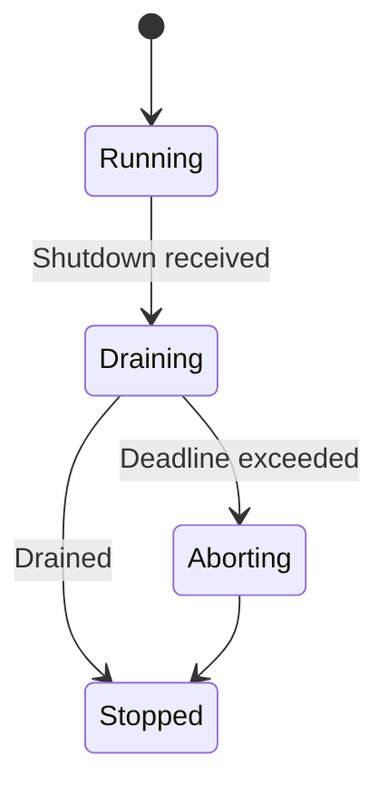
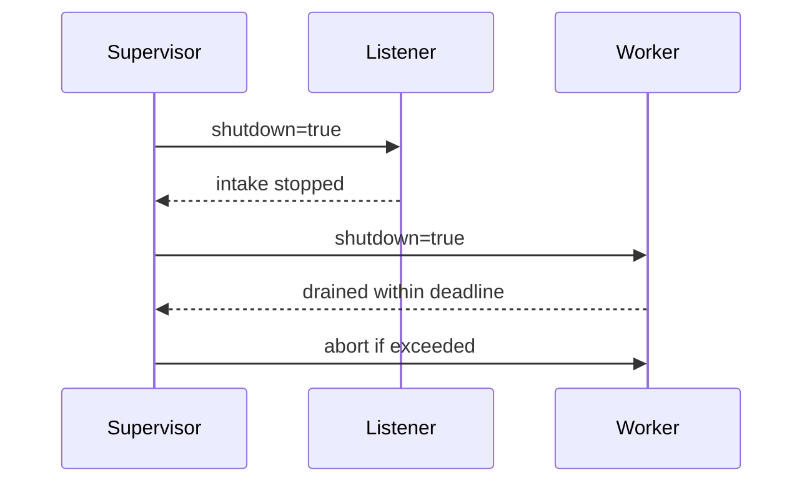
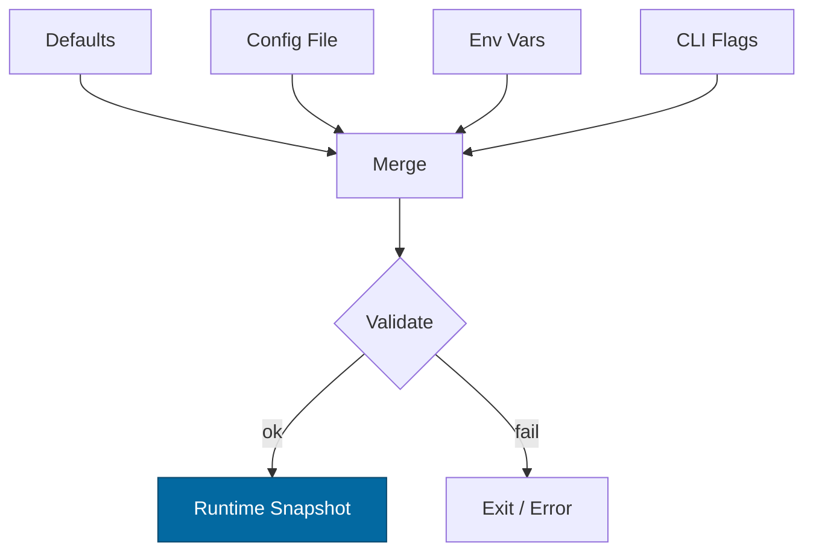

# Combined Markdown

_Source directory_: `crates/svc-interop/docs`  
_Files combined_: 12  
_Recursive_: 0

---

### Table of Contents

- API.MD
- CONCURRENCY.MD
- CONFIG.MD
- GOVERNANCE.MD
- IDB.md
- INTEROP.MD
- OBSERVABILITY.MD
- PERFORMANCE.MD
- QUANTUM.MD
- RUNBOOK.MD
- SECURITY.MD
- TESTS.MD

---

## API.MD
_File 1 of 12_


````markdown
---
title: API Surface & SemVer Reference
status: draft
msrv: 1.80.0
last-updated: 2025-10-12
audience: contributors, auditors, API consumers
---

# API.md — svc-interop

## 0. Purpose

This document captures the **public API surface** of `svc-interop`:

- Snapshot of exported **Rust** items (if any) and the canonical **HTTP** surface.
- SemVer discipline: what constitutes **breaking**, **minor**, and **patch** changes for both Rust and HTTP layers.
- CI-enforceable diffs via `cargo public-api` (Rust) and OpenAPI snapshot (HTTP).
- Source of truth for auditors and external integrators.

> Design intent: `svc-interop` is a **service** crate. The public contract is its **HTTP interface**. Rust APIs remain minimal and internal by default.

---

## 1. Public API Surface

### 1.1 Rust surface (intentionally minimal)

`svc-interop` is primarily a binary. To support tooling (`cargo public-api`) and internal embedding, we expose a tiny **optional** library API behind the `libapi` feature. Consumers should **not** depend on these for cross-crate use unless explicitly approved.

Generated via:

```bash
cargo public-api -p svc-interop --features libapi --simplified --deny-changes
````

**Current surface (expected when `libapi` is enabled):**

```text
pub mod prelude
pub struct Service
pub struct ServiceOptions
pub fn run(opts: ServiceOptions) -> Result<(), anyhow::Error>
```

Notes:

* `ServiceOptions` mirrors a **stable subset** of `Config` (bind/metrics/timeouts). New fields are additive and non-breaking.
* `run()` is a convenience to start the HTTP server. It is **not** a stability anchor for third parties; the HTTP contract is.

If the crate is built **without** `libapi`, the Rust surface is intentionally empty (binary-only).

### 1.2 HTTP surface (canonical)

Base URL: the service bind (`bind_addr`) as configured. All JSON is UTF-8. All error bodies follow the **error taxonomy** in the IDB/config (e.g., `reason: "BODY_LIMIT"`).

**Common headers**

* `Content-Type: application/json`
* `X-Corr-ID` (optional; generated if missing, echoed on response)
* `Cache-Control` as documented per route
* For webhooks: provider-specific signature headers required (edge-only verification)

#### Endpoints

1. `POST /webhooks/:provider`

* Purpose: ingress for signed webhooks (`github|stripe|slack_webhook`).
* Request: JSON or provider-native form; body size ≤ 1 MiB (streaming > 1 MiB with 64 KiB chunks).
* Headers (examples):

  * GitHub: `X-Hub-Signature-256: sha256=<hex>`
  * Stripe: `Stripe-Signature: t=<ts>,v1=<sig>[,v0=<sig>]`
  * Slack Webhook: `X-Slack-Signature: v0=<sig>`, `X-Slack-Request-Timestamp: <ts>`
* Responses:

  * `202 Accepted` `{ "accepted": true, "corr_id": "<ulid>" }`
  * `4xx/5xx` with body `{ "error": "...", "reason": "BAD_ORIGIN|UNAUTH|DECOMP_LIMIT|..." }`

2. `POST /put`

* Purpose: normalized content ingress → internal BLAKE3 addressing + enqueue/forward.
* Request body: JSON or binary (when `Content-Type` is not JSON). For JSON:

  ```json
  { "payload": "<base64|opaque>", "meta": { "type": "…" } }
  ```
* Response:

  * `202 Accepted` `{ "address": "b3:<hex>", "corr_id": "<ulid>" }`
  * `413` if `max_body_bytes` exceeded; `429` for `Busy`; `503` on brownout.

3. `GET /o/:addr`

* Purpose: served object by **BLAKE3** content address.
* Path: `:addr` must be `b3:<hex>`.
* Response:

  * `200` with bytes (or JSON if negotiated)
  * `404` if not found; `400` if malformed address.

4. Health/Meta

* `GET /healthz` → `200` when process is live (no deps).
* `GET /readyz` → `200` when deps met and no brownout for requested class; else `503`:

  ```json
  { "degraded": true, "missing": ["passport_reachable"], "retry_after": 5 }
  ```
* `GET /metrics` → Prometheus text format (bind should be localhost).
* `GET /version` → build/scm metadata `{ "version": "…", "git": "…", "rustc": "…" }`.

> **Correlation:** All responses include `X-Corr-ID`. Metrics/trace exemplars may attach `trace_id` to latency series.

---

## 2. SemVer Discipline

We maintain **two layers** of compatibility:

### 2.1 Rust (feature `libapi`)

**Additive (minor / non-breaking)**

* New free functions, structs, modules (not publicly reexported as defaults).
* New fields on `ServiceOptions` behind `#[non_exhaustive]`.
* New error variants with enums marked `#[non_exhaustive]`.

**Breaking (major)**

* Remove/rename exports.
* Change function signatures/return types or trait bounds.
* Make a previously `#[non_exhaustive]` enum exhaustive.

**Patch**

* Documentation/comments.
* Internal perf improvements, bug fixes without surface change.

### 2.2 HTTP

We treat the HTTP contract like an external API with its own SemVer-like policy:

**Additive (non-breaking)**

* Add new endpoints.
* Add optional request fields with defaults.
* Add new response fields that clients can ignore.
* Expand `reason` taxonomy with a documented meaning.

**Breaking**

* Remove or rename endpoints.
* Change response semantics for existing codes.
* Tighten validation in a way that rejects previously valid requests.
* Change admitted media types without negotiation.

**Patch**

* Better error messages; more specific reason codes.
* Performance characteristics without semantic change.

**Versioning strategy**

* Current API is **unversioned paths** with strong stability. If we must break, introduce `/v2/…` while keeping `/v1` (or current paths) available during a deprecation window, or use **media type versioning**:

  * `Accept: application/vnd.ron.interop+json;v=1`

---

## 3. Stability Guarantees

* **MSRV**: `1.80.0` (Rust) — enforced in CI.
* **Safety**: no `unsafe` in public APIs unless justified and reviewed.
* **No leakage of internal types**: e.g., we do not expose `tokio` sockets from public signatures.
* **Error bodies**: stable JSON shape `{ error, reason, corr_id }`; `reason` is from a documented **closed** taxonomy (with additive-only growth).

---

## 4. Invariants (API-specific)

* Service is the **contract**; Rust `libapi` is convenience, not a public SDK.
* Requests > 1 MiB must be **streamed**; server enforces body and decompression caps.
* All **internal addresses and audits use BLAKE3**; SHA-256 exists only for **edge verification** and is never persisted.
* Readiness **fails closed** for bridging if SLOs are breached; read paths may remain ready under brownout.
* Every non-2xx response includes a stable `reason` and echoes `X-Corr-ID`.

---

## 5. Tooling

* `cargo public-api` on `svc-interop` with `--features libapi` to guard Rust surface.
* `cargo semver-checks` (optional) to detect semver violations.
* **OpenAPI source**: maintained at `/docs/openapi/svc-interop.openapi.yaml`; PRs that change HTTP add/update this file and the snapshot under `/docs/api-history/http/`.
* `cargo doc` must build with `--features libapi` to keep docs coherent.

---

## 6. CI & Gates

* Pipeline jobs:

  * **Public API gate (Rust):**

    ```bash
    cargo public-api -p svc-interop --features libapi --simplified --deny-changes
    ```

    Fails if the Rust surface changes without explicit approval.
  * **HTTP snapshot gate:**

    * Validate `/docs/openapi/svc-interop.openapi.yaml` with spectral/openapi-lint.
    * Diff against previous snapshot (stored in `/docs/api-history/http/<version>.yaml`).
    * If diffs exist, require CHANGELOG entry with SemVer classification (breaking/minor/patch).
  * **Doc gate:** `#![deny(missing_docs)]` for any `pub` items when `libapi` is on.

* The PR bot posts:

  * Rust symbol diff (added/removed).
  * OpenAPI diff summary (paths/verbs/schemas).

---

## 7. Acceptance (Definition of Done)

* Current **Rust** API snapshot generated and stored under `/docs/api-history/rust/<crate>/<version>.txt`.
* Current **HTTP** OpenAPI spec updated with route/field changes and snapshot recorded.
* CHANGELOG updated with a clearly labeled section:

  * `### API (HTTP)` and/or `### API (Rust/libapi)`.
* All public items have rustdoc and examples where applicable.
* Release notes mention any new `reason` codes or deprecations.

---

## 8. HTTP Reference (concise)

### `POST /webhooks/:provider`

* **Auth**: provider signature (edge).
* **On success**: `202` with `{ accepted, corr_id }`.
* **Errors**: `400 BAD_ORIGIN|MALFORMED`, `401 UNAUTH`, `413 BODY_LIMIT`, `429 BACKPRESSURE|RATE_LIMIT`, `503 DOWNSTREAM_UNAVAILABLE|BACKPRESSURE`.

### `POST /put`

* **Body**: JSON or binary.
* **On success**: `202` with `{ address: "b3:<hex>", corr_id }`.

### `GET /o/:addr`

* **Path**: `:addr = b3:<hex>`.
* **On success**: `200` with bytes.
* **Errors**: `400`, `404`.

### Health/Meta

* `/healthz`, `/readyz`, `/metrics`, `/version` per Observability & Config docs.

> All endpoints return `X-Corr-ID` and log/audit with `b3_hash` (when applicable).

---

## 9. Example cURL

```bash
# Webhook (GitHub)
curl -i -X POST http://localhost:8080/webhooks/github \
  -H 'X-Hub-Signature-256: sha256=<sig>' \
  -H 'X-Corr-ID: demo-123' \
  -d '{"action":"opened","…":…}'

# Put (JSON)
curl -i -X POST http://localhost:8080/put \
  -H 'Content-Type: application/json' \
  -d '{"payload":"…","meta":{"type":"example"}}'

# Get by BLAKE3 address
curl -i http://localhost:8080/o/b3:7f1a…c0de
```

---

## 10. Appendix

### 10.1 OpenAPI (starter sketch)

```yaml
openapi: 3.0.3
info:
  title: svc-interop API
  version: "1"
servers:
  - url: http://localhost:8080
paths:
  /webhooks/{provider}:
    post:
      parameters:
        - name: provider
          in: path
          required: true
          schema: { type: string, enum: [github, stripe, slack_webhook] }
      requestBody:
        required: true
        content:
          application/json: { schema: { type: object } }
          application/x-www-form-urlencoded: { schema: { type: object, additionalProperties: true } }
      responses:
        "202": { description: Accepted, content: { application/json: { schema: { $ref: "#/components/schemas/Accepted" } } } }
        "4XX": { $ref: "#/components/responses/Error" }
        "5XX": { $ref: "#/components/responses/Error" }
  /put:
    post:
      requestBody:
        required: true
        content:
          application/json: { schema: { $ref: "#/components/schemas/PutRequest" } }
          application/octet-stream: { schema: { type: string, format: binary } }
      responses:
        "202": { description: Accepted, content: { application/json: { schema: { $ref: "#/components/schemas/PutAccepted" } } } }
        "4XX": { $ref: "#/components/responses/Error" }
        "5XX": { $ref: "#/components/responses/Error" }
  /o/{addr}:
    get:
      parameters:
        - name: addr
          in: path
          required: true
          schema: { type: string, pattern: '^b3:[0-9a-fA-F]+$' }
      responses:
        "200": { description: OK, content: { application/octet-stream: {} } }
        "400": { $ref: "#/components/responses/Error" }
        "404": { $ref: "#/components/responses/Error" }
  /healthz:
    get: { responses: { "200": { description: OK } } }
  /readyz:
    get:
      responses:
        "200": { description: Ready }
        "503": { $ref: "#/components/responses/Error" }
  /metrics:
    get: { responses: { "200": { description: Prometheus metrics } } }
components:
  schemas:
    Accepted: { type: object, properties: { accepted: { type: boolean }, corr_id: { type: string } }, required: [accepted, corr_id] }
    PutRequest:
      type: object
      properties:
        payload: { type: string }
        meta: { type: object, additionalProperties: true }
      required: [payload]
    PutAccepted:
      type: object
      properties:
        address: { type: string, pattern: '^b3:' }
        corr_id: { type: string }
      required: [address, corr_id]
    ErrorBody:
      type: object
      properties:
        error: { type: string }
        reason: { type: string, enum: [UNAUTH, BAD_ORIGIN, EXPIRED_TOKEN, SCOPE_MISMATCH, BODY_LIMIT, DECOMP_LIMIT, RATE_LIMIT, BACKPRESSURE, DOWNSTREAM_UNAVAILABLE, POLICY_BLOCKED, MALFORMED] }
        corr_id: { type: string }
      required: [error, reason, corr_id]
  responses:
    Error:
      description: Error with stable reason code
      content:
        application/json:
          schema: { $ref: '#/components/schemas/ErrorBody' }
```

### 10.2 References

* Rust SemVer: [https://doc.rust-lang.org/cargo/reference/semver.html](https://doc.rust-lang.org/cargo/reference/semver.html)
* cargo-public-api: [https://github.com/Enselic/cargo-public-api](https://github.com/Enselic/cargo-public-api)
* cargo-semver-checks: [https://github.com/obi1kenobi/cargo-semver-checks](https://github.com/obi1kenobi/cargo-semver-checks)

### 10.3 Perfection Gates tie-in

* Gate G: No undocumented API surface (Rust & HTTP).
* Gate H: Breaking changes require major bump (Rust) or versioned HTTP (path/media type).
* Gate J: CHANGELOG alignment required when diff detected.

### 10.4 History

* v1 (current): initial HTTP set (`/webhooks/:provider`, `/put`, `/o/:addr`, health/meta) with closed error taxonomy; Rust `libapi` gated behind feature.

```


---

## CONCURRENCY.MD
_File 2 of 12_


````markdown
---
title: Concurrency Model — svc-interop
crate: svc-interop
owner: Stevan White
last-reviewed: 2025-10-12
status: draft
template_version: 1.1
msrv: 1.80.0
tokio: "1.x (pinned at workspace root)"
loom: "0.7+ (dev-only)"
lite_mode: "For small library crates: fill §§1,3,4,5,10,11 and mark others N/A"
---

# Concurrency Model — svc-interop

This document makes the concurrency rules **explicit**: tasks, channels, locks, shutdown, timeouts,
and validation (property/loom/TLA+). It complements `docs/SECURITY.md`, `docs/CONFIG.md`,
and the crate’s `README.md` and `IDB.md`.

> **Golden rule:** never hold a lock across `.await` in supervisory or hot paths.

---

## 0) Lite Mode (for tiny lib crates)

N/A — `svc-interop` is a **service** crate with listeners, workers, and background tasks.

---

## 1) Invariants (MUST)

- [ ] **No lock across `.await`**. If unavoidable, split the critical section.
- [ ] **Single writer** per mutable resource; readers use snapshots or short read guards.
- [ ] **Bounded channels** only (mpsc/broadcast) with explicit overflow policy.
- [ ] **Explicit timeouts** on all I/O and RPCs; fail-fast with typed errors.
- [ ] **Cooperative cancellation**: every `.await` is cancel-safe or guarded by `select!`.
- [ ] **Graceful shutdown**: observe `Shutdown` signal; drain within deadline; abort stragglers.
- [ ] **No blocking syscalls** on the async runtime; use `spawn_blocking` if required.
- [ ] **No task leaks**: track joins; detach only with rationale.
- [ ] **Backpressure over buffering**: drop/reject with metrics; never grow unbounded queues.
- [ ] **Framing**: length-delimited/checked; handle split reads.

**Async Drop**
- [ ] Do **not** block in `Drop`. For teardown, expose an **async `close()`/`shutdown()`** API and call it before the value is dropped. `Drop` should only release cheap, non-blocking resources.

---

## 2) Runtime Topology

**Runtime:** Tokio multi-threaded runtime (worker threads = CPU cores by default; tuned at workspace root).

**Primary tasks (roles):**
- **Supervisor** — owns channel factories, spawns listeners/workers, exports `/readyz` state based on queues + SLO brownout.
- **HTTP Listener** — axum server handling:
  - public REST (`/put`, `/o/:addr`) and provider webhooks (`/webhooks/:provider`),
  - edge filters: capability translation, origin pinning, decompress/body caps, rate limiting.
  - pushes normalized jobs onto the **work queue** (bounded mpsc).
- **Worker Pool (N)** — pulls jobs from **work queue** and:
  - verifies provider signatures (edge) then computes **BLAKE3-256** for internal flows,
  - calls internal services (`svc-storage`, `svc-mailbox`, `svc-passport`) with timeouts,
  - emits **audit events** to the audit sink.
- **Metrics Exporter** — scrapes and serves Prometheus metrics on `metrics_addr`.
- **Brownout Sentinel** — samples error rate & upstream p95; toggles “bridge brownout” flag that affects `/readyz` (degrades bridging first).

**Supervision:** if a task panics, restart with exponential backoff (base 100ms, jitter, cap 5s). If >5 restarts/60s, escalate to fatal (crash-loop protection) — surfaced in `/healthz`.

```mermaid
flowchart TB
  subgraph Runtime
    SUP[Supervisor]
    L[HTTP Listener]
    W1[Worker 1]
    W2[Worker 2]
    MET[Metrics Exporter]
    BRN[Brownout Sentinel]
  end
  SUP -->|spawn| L
  SUP -->|spawn| W1
  SUP -->|spawn| W2
  SUP -->|watch Shutdown| L
  SUP -->|watch Shutdown| W1
  SUP -->|watch Shutdown| W2
  L -->|mpsc(work)| W1
  L -->|mpsc(work)| W2
  BRN -->|watch| SUP
  MET -->|serves| Prometheus
  style SUP fill:#0ea5e9,stroke:#0c4a6e,color:#fff
````

**Diagram (text):** Supervisor spawns one HTTP Listener and a pool of Workers; Listener feeds a bounded mpsc “work” queue consumed by Workers. A Brownout Sentinel updates readiness; Metrics Exporter serves Prometheus. All tasks observe a Shutdown watch channel.

---

## 3) Channels & Backpressure

**Inventory (all bounded unless noted):**

| Name          | Kind      | Capacity | Producers → Consumers      | Backpressure Policy                | Drop Semantics / Caller Effect            |
| ------------- | --------- | -------: | -------------------------- | ---------------------------------- | ----------------------------------------- |
| `events_tx`   | broadcast |     1024 | 1 → N                      | lag counter; drop oldest           | increment `bus_lagged_total`; warn        |
| `work_tx`     | mpsc      |      512 | N (Listener) → M (Workers) | `try_send` → `Busy`                | return 429/`Busy`; bump `busy_rejections` |
| `shutdown_rx` | watch     |        1 | 1 → N                      | last-write wins                    | N/A                                       |
| `audit_tx`    | mpsc      |      512 | N → 1 (sink task)*         | `try_send` → drop oldest w/ metric | increment `audit_drop_total`              |

* If `audit.sink="memory"` ring buffer is used, the sink task flushes to stdout/file only when policy allows (amnesia blocks file).

**Guidelines:**

* Prefer **`try_send` + typed Busy** over awaiting space.
* Emit `queue_depth{queue}` gauges and `queue_dropped_total{queue}` counters.
* Queue sizes track config defaults (`work=512`, `broadcast=1024`); tune via `docs/CONFIG.md`.

---

## 4) Locks & Shared State

**Allowed:**

* Short-lived `Mutex`/`RwLock` for **in-memory metadata** (policy snapshots, provider registry). No `.await` while holding guards.
* Read-mostly snapshots via `Arc<Snapshot>`; refresh snapshots using swap-on-update pattern.
* Per-connection/request state is **task-owned**; cross-task communication uses channels.

**Forbidden:**

* Holding any lock across `.await`.
* Nested locks without hierarchy.

**Hierarchy (if unavoidable):**

1. `policy_meta`
2. `routing_table`
3. `counters`

Acquire in order; release before any await point.

---

## 5) Timeouts, Retries, Deadlines

**I/O (from config defaults):** `read=5s`, `write=5s`, `idle=60s`.

**RPC to internal services:** total deadline per call; idempotent operations may retry with jittered backoff:

* backoff: 50–100 ms → 200–400 ms → 800–1600 ms (cap 2 s), max 3 tries, **only if idempotent**.
* **No** retries for non-idempotent side effects; queue to mailbox instead.

**Circuit breaker (optional):**

* Open on rolling error-rate breach; half-open with limited probes; close on success.

```mermaid
sequenceDiagram
  autonumber
  participant Client
  participant I as svc-interop
  Client->>I: Request (deadline=2s)
  I-->>Client: 202 Accepted or Busy/Timeout
  Note over I: Backpressure → Busy<br/>Deadline → typed Timeout
```

---

## 6) Cancellation & Shutdown

**Signal sources:** `KernelEvent::Shutdown`, `ctrl_c`, container stop.

**Propagation pattern:** all long-lived tasks use `tokio::select!` with `shutdown.changed()` and primary work future.

**Draining:**

* Stop new intake (Listener returns Busy/`503` for bridges during brownout/shutdown).
* Workers drain in-flight jobs within `drain_deadline` (1–5s configurable).
* After deadline, call `JoinHandle::abort()`; count `tasks_aborted_total{kind}`.



**Text:** On shutdown, service enters Draining; if deadline passes, remaining tasks are aborted; otherwise transitions to Stopped.

---

## 7) I/O & Framing

* HTTP body limits: 1 MiB hard cap; for >1 MiB, **streaming in 64 KiB chunks** with ≤2 chunks buffered.
* Decompression guard ≤10× expansion and absolute size cap; reject on overflow.
* Always call `.shutdown().await` for connection teardown.
* Verify provider signatures **at edge** (HMAC-SHA256) then compute **BLAKE3-256** for all internal addressing/audits.

---

## 8) Error Taxonomy (Concurrency-Relevant)

| Error          | When                         | Retry?     | Metric                                  | Notes                         |
| -------------- | ---------------------------- | ---------- | --------------------------------------- | ----------------------------- |
| `Busy`         | work queue full              | caller may | `busy_rejections_total{endpoint}`       | convey `Retry-After` if known |
| `Timeout`      | I/O or RPC deadline exceeded | maybe      | `io_timeouts_total{op}`                 | attach op and duration        |
| `Canceled`     | shutdown during await        | no         | `tasks_canceled_total{kind}`            | cooperative cancellation      |
| `Lagging`      | broadcast overflow           | no         | `bus_lagged_total`                      | drop oldest                   |
| `Backpressure` | brownout active              | caller may | `rejected_total{reason="BACKPRESSURE"}` | readiness degrades bridges    |

---

## 9) Metrics (Concurrency Health)

* `queue_depth{queue}` gauge; `queue_dropped_total{queue}` counter.
* `tasks_spawned_total{kind}`, `tasks_aborted_total{kind}`, `tasks_canceled_total{kind}`.
* `io_timeouts_total{op}` (`read`,`write`,`connect`).
* `backoff_retries_total{op}` with `result` labels.
* `busy_rejections_total{endpoint}`; `rejected_total{reason}`.
* `brownout_active{component="bridge"}` (0/1).

---

## 10) Validation Strategy

**Unit / Property**

* Backpressure: `try_send` → Busy, never await on full queues.
* Deadlines: per-endpoint timeout honored within tolerance.
* Lock discipline: pattern tests ensure **no awaits while holding guards** (lint + code search).

**Loom**

* Model: Producer (Listener) → bounded mpsc(work=2) → Consumer (Worker) with shutdown.
* Assertions: no deadlocks; no lost shutdown signal; at most 2 in-flight; worker eventually drains or gets canceled.

**Fuzz**

* HTTP framing & decompression fuzz (payload size, ratio, split reads).
* Provider signature base-string fuzz (Slack v0 format, GitHub sha256 prefix).

**Chaos**

* Fault injection: kill worker tasks mid-stream, slowloris on Listener, upstream 5xx bursts.
* `/readyz`: flips to brownout on sustained errors or upstream p95 breach; read paths remain available.

**TLA+ (if ordering matters)**

* Optional spec for webhook → mailbox → worker → audit; prove **safety** (no duplicate apply) and **liveness** (eventual drain under fair scheduler).

---

## 11) Code Patterns (Copy-Paste)

**Spawn + cooperative shutdown (worker skeleton)**

```rust
let (shutdown_tx, mut shutdown_rx) = tokio::sync::watch::channel(false);
let worker = tokio::spawn({
  let mut rx = work_rx;
  async move {
    loop {
      tokio::select! {
        _ = shutdown_rx.changed() => break,
        msg = rx.recv() => {
          let Some(job) = msg else { break };
          if let Err(e) = handle_job(job).await {
            tracing::warn!(error=%e, "job failed");
          }
        }
      }
    }
  }
});
// on shutdown: let _ = shutdown_tx.send(true); let _ = worker.await;
```

**Bounded mpsc with `try_send` (Busy on backpressure)**

```rust
match work_tx.try_send(job) {
  Ok(_) => {}
  Err(tokio::sync::mpsc::error::TrySendError::Full(_)) => {
    metrics::busy_rejections_total().inc();
    return Err(Error::Busy);
  }
  Err(e) => return Err(Error::from(e)),
}
```

**Deadline wrapper for RPC**

```rust
async fn with_deadline<T, F: std::future::Future<Output = T>>(
    dur: std::time::Duration, fut: F
) -> Result<T, Error> {
    tokio::time::timeout(dur, fut).await.map_err(|_| Error::Timeout)
}
```

**Lock then await (split critical section)**

```rust
let snapshot = {
  let state = state.read();           // cheap, short
  state.policy_snapshot()             // clone/Arc snapshot
}; // lock released here
apply_policy(snapshot).await;
```

**Async Drop pattern**

```rust
pub struct AuditSink { inner: Option<Handle> }

impl AuditSink {
  pub async fn close(&mut self) -> anyhow::Result<()> {
    if let Some(h) = self.inner.take() { h.shutdown().await?; }
    Ok(())
  }
}

impl Drop for AuditSink {
  fn drop(&mut self) {
    if self.inner.is_some() {
      tracing::debug!("AuditSink dropped without close(); resources reclaimed");
    }
  }
}
```

---

## 12) Configuration Hooks (Quick Reference)

* Queue capacities: `work=512`, `broadcast=1024`.
* Timeouts: `read/write=5s`, `idle=60s`.
* Brownout thresholds: error-rate 1% over 5m; upstream p95 ≥ 500ms.
* RPS limiter: `max_rps=500`, `burst=250`.
* Drain deadline: 1–5s (set in config/runbook).

Authoritative values live in `docs/CONFIG.md`.

---

## 13) Known Trade-offs / Nonstrict Areas

* **Drop-oldest vs reject-new:** For `audit_tx`, drop-oldest avoids stalling business paths; for `work_tx`, reject-new with Busy keeps latency predictable.
* **Broadcast lag:** Slow consumers may miss events; they must rely on polling state, not the broadcast channel, for truth.
* **Crash-loop escalation:** After repeated panics, we prefer **fail-fast** to flapping; relies on orchestrator to restart.

---

## 14) Mermaid Diagrams (REQUIRED)

### 14.1 Task & Queue Topology

```mermaid
flowchart LR
  IN[HTTP Listener] -->|mpsc:work(512)| W1[Worker A]
  IN -->|mpsc:work(512)| W2[Worker B]
  subgraph Control
    SHUT[Shutdown watch] --> W1
    SHUT --> W2
  end
```

**Text:** Listener feeds two workers via bounded mpsc(512); a Shutdown watch notifies both workers.

### 14.2 Shutdown Sequence



**Text:** Supervisor signals Listener to stop intake, Workers drain within deadline; stragglers are aborted.

---

## 15) CI & Lints (Enforcement)

**Clippy lints:**

* `-D clippy:await_holding_lock`
* `-D clippy:needless_collect`
* `-D clippy:useless_async`
* `-D warnings`

**GitHub Actions sketch:**

```yaml
name: concurrency-guardrails
on: [push, pull_request]
jobs:
  clippy:
    runs-on: ubuntu-latest
    steps:
      - uses: actions/checkout@v4
      - uses: dtolnay/rust-toolchain@stable
      - run: cargo clippy -p svc-interop -- -D warnings -W clippy::await_holding_lock

  loom:
    if: github.event_name == 'pull_request'
    runs-on: ubuntu-latest
    steps:
      - uses: actions/checkout@v4
      - uses: dtolnay/rust-toolchain@stable
      - run: RUSTFLAGS="--cfg loom" cargo test -p svc-interop --tests -- --ignored

  fuzz:
    runs-on: ubuntu-latest
    steps:
      - uses: actions/checkout@v4
      - uses: dtolnay/rust-toolchain@stable
      - run: cargo install cargo-fuzz
      - run: cargo fuzz build -p svc-interop
```

---

## 16) Schema Generation (Optional, Nice-to-Have)

* Use attributes/macros to annotate channels/locks and auto-emit a `docs/_generated/concurrency.mdfrag`.
* Alternatively, keep a `concurrency.rs` registry and a golden test that verifies this doc matches code.

---

## 17) Review & Maintenance

* Review this document **every 90 days** or whenever tasks/channels/locks change.
* Keep `owner`, `msrv`, `last-reviewed` current.
* PRs changing concurrency must update this file and associated Loom/property tests.

```


---

## CONFIG.MD
_File 3 of 12_


````markdown
---
title: Configuration — svc-interop
crate: svc-interop
owner: Stevan White
last-reviewed: 2025-10-12
status: draft
template_version: 1.1
---

# Configuration — svc-interop

This document defines **all configuration** for `svc-interop`, including sources,
precedence, schema (types/defaults), validation, feature flags, live-reload behavior,
and security implications. It complements `README.md`, `docs/SECURITY.md`, and the IDB.

> **Tiering:**  
> - **Service crate:** All sections apply (network, readiness, observability, etc.).
> **Audience:** contributors, deployers, SRE/ops, auditors.

---

## 1) Sources & Precedence (Authoritative)

Configuration may come from multiple sources. **Precedence (highest wins):**

1. **Process flags** (CLI)  
2. **Environment variables**  
3. **Config file** (e.g., `Config.toml` beside the binary)  
4. **Built-in defaults** (hard-coded)

> On live reload, the effective config is recomputed under the **same precedence**.

**File formats:** TOML (preferred), JSON (optional).  
**Relative `--config` lookup order:** `./`, `$CWD`, crate dir.

**Secrets guidance (prod):** Prefer an external secret manager (AWS SSM/Secrets Manager, GCP SM, Vault, Doppler) to populate environment variables; mount secrets read-only; never bake tokens into images.

---

## 2) Quickstart Examples

### 2.1 Minimal service start
```bash
RUST_LOG=info \
SVC_INTEROP_BIND_ADDR=0.0.0.0:8080 \
SVC_INTEROP_METRICS_ADDR=127.0.0.1:0 \
cargo run -p svc-interop
````

### 2.2 Config file (TOML)

```toml
# Config.toml
bind_addr     = "0.0.0.0:8080"
metrics_addr  = "127.0.0.1:0"
max_conns     = 512           # matches IDB inflight cap
read_timeout  = "5s"
write_timeout = "5s"
idle_timeout  = "60s"

[limits]
max_body_bytes       = "1MiB"
decompress_ratio_cap = 10
max_rps              = 500
burst_rps            = 250

[readiness]
brownout_error_rate_threshold = 0.01      # 1% over 5m rolling
upstream_p95_latency_threshold = "500ms"  # triggers brownout

[tls]
enabled = false
# cert_path = "/etc/ron/cert.pem"
# key_path  = "/etc/ron/key.pem"

[hash]
internal_alg = "blake3-256"  # fixed policy
allow_sha256_edge = true     # provider verification only (transient)

[amnesia]
enabled = false

[auth]
passport_base_url = "http://127.0.0.1:8081"
capability_ttl    = "60s"

[audit]
sink           = "memory"     # memory|file|stdout
file_path      = "/var/log/ron/svc-interop-audit.log"
redact_fields  = ["token", "authorization", "signature"]

[providers.github]
enabled = true
allowed_hosts = ["github.com", "api.github.com"]
secret_env    = "GITHUB_WEBHOOK_SECRET_ENV"  # env var that holds secret
signature_header_prefix = "sha256="

[providers.stripe]
enabled = false
allowed_hosts = ["api.stripe.com"]
secret_env    = "STRIPE_WEBHOOK_SECRET_ENV"
signature_header_name = "Stripe-Signature"   # v1 (tests may also present v0)

[providers.slack_rest]
enabled = false
token_env = "SLACK_BOT_TOKEN_ENV"

[providers.slack_webhooks]
enabled = false
secret_env  = "SLACK_SIGNING_SECRET_ENV"
signature_header_name = "X-Slack-Signature"  # v0=...

[mailbox]
base_url           = "http://127.0.0.1:8082"
visibility_timeout = "30s"
max_retries        = 10

[logging]
format = "json"  # json|text
level  = "info"

[tracing]
otel_enabled = false
otel_endpoint = "http://127.0.0.1:4317"
service_name = "svc-interop"
```

### 2.3 CLI flags (override file/env)

```bash
cargo run -p svc-interop -- \
  --config ./Config.toml \
  --bind 0.0.0.0:8080 \
  --metrics 127.0.0.1:0 \
  --max-conns 512 \
  --max-rps 500 \
  --burst-rps 250 \
  --amnesia=false \
  --otel=false \
  --log-format json \
  --log-level info
```

---

## 3) Schema (Typed, With Defaults)

> **Env prefix:** `SVC_INTEROP_...`
> **Durations:** `ms`, `s`, `m`, `h`. **Sizes:** `B`, `KB`, `MB`, `MiB`.

| Key / Env Var                                                                     | Type                           | Default                              | Description                                                  | Security Notes                                |
| --------------------------------------------------------------------------------- | ------------------------------ | ------------------------------------ | ------------------------------------------------------------ | --------------------------------------------- |
| `bind_addr` / `SVC_INTEROP_BIND_ADDR`                                             | socket                         | `127.0.0.1:0`                        | HTTP/ingress bind address                                    | Public binds require threat review            |
| `metrics_addr` / `SVC_INTEROP_METRICS_ADDR`                                       | socket                         | `127.0.0.1:0`                        | Prometheus endpoint bind                                     | Prefer localhost; scrape from gateway         |
| `max_conns` / `SVC_INTEROP_MAX_CONNS`                                             | u32                            | `512`                                | Max concurrent connections (aligns with IDB inflight cap)    | Prevent FD exhaustion                         |
| `read_timeout` / `SVC_INTEROP_READ_TIMEOUT`                                       | duration                       | `5s`                                 | Per-request read timeout                                     | DoS mitigation                                |
| `write_timeout` / `SVC_INTEROP_WRITE_TIMEOUT`                                     | duration                       | `5s`                                 | Per-request write timeout                                    | DoS mitigation                                |
| `idle_timeout` / `SVC_INTEROP_IDLE_TIMEOUT`                                       | duration                       | `60s`                                | Keep-alive idle shutdown                                     | Resource hygiene                              |
| `limits.max_body_bytes` / `SVC_INTEROP_MAX_BODY_BYTES`                            | size                           | `1MiB`                               | Request payload cap                                          | OAP/1 bound; zip-bomb mitigation              |
| `limits.decompress_ratio_cap` / `SVC_INTEROP_DECOMPRESS_RATIO_CAP`                | u32                            | `10`                                 | Max allowed decompression ratio                              | Zip-bomb guard                                |
| `limits.max_rps` / `SVC_INTEROP_MAX_RPS`                                          | u32                            | `500`                                | Global RPS cap per instance (token bucket)                   | Backpressure first (I-9)                      |
| `limits.burst_rps` / `SVC_INTEROP_BURST_RPS`                                      | u32                            | `250`                                | Burst size for token bucket                                  | Tune from benchmarks                          |
| `tls.enabled` / `SVC_INTEROP_TLS_ENABLED`                                         | bool                           | `false`                              | Enable TLS                                                   | Use **tokio-rustls** only                     |
| `tls.cert_path` / `SVC_INTEROP_TLS_CERT_PATH`                                     | path                           | `""`                                 | PEM cert path                                                | Secrets on disk; perms 0600                   |
| `tls.key_path` / `SVC_INTEROP_TLS_KEY_PATH`                                       | path                           | `""`                                 | PEM key path                                                 | Zeroize in memory                             |
| `hash.internal_alg` / `SVC_INTEROP_HASH_INTERNAL`                                 | enum(`blake3-256`)             | `blake3-256`                         | **Canonical internal hash algorithm**                        | **MUST remain BLAKE3-256** (IDB I-4a)         |
| `hash.allow_sha256_edge` / `SVC_INTEROP_HASH_ALLOW_SHA256_EDGE`                   | bool                           | `true`                               | Allow **transient** SHA-256 verification at ingress **only** | Do **not** persist SHA digests (IDB I-4b)     |
| `amnesia.enabled` / `SVC_INTEROP_AMNESIA`                                         | bool                           | `false`                              | RAM-only secrets mode                                        | No persistent keys/artifacts                  |
| `auth.passport_base_url` / `SVC_INTEROP_PASSPORT_URL`                             | url                            | `http://127.0.0.1:8081`              | Base URL for `svc-passport` (capability mint/verify)         | Outgoing TLS recommended                      |
| `auth.capability_ttl` / `SVC_INTEROP_CAP_TTL`                                     | duration                       | `60s`                                | TTL for translated capabilities                              | ≤ 60s required (IDB I-13)                     |
| `audit.sink` / `SVC_INTEROP_AUDIT_SINK`                                           | enum(`memory`,`file`,`stdout`) | `memory`                             | Audit sink type                                              | Obey amnesia mode                             |
| `audit.file_path` / `SVC_INTEROP_AUDIT_PATH`                                      | path                           | `/var/log/ron/svc-interop-audit.log` | Audit file path (when sink=`file`)                           | File perms 0600                               |
| `audit.redact_fields` / `SVC_INTEROP_AUDIT_REDACT_FIELDS`                         | list<string>                   | see example                          | Fields to redact in audit records                            | Include `token`, `authorization`, `signature` |
| `providers.github.enabled` / `SVC_INTEROP_GH_ENABLED`                             | bool                           | `false`                              | Enable GitHub webhook adapter                                |                                               |
| `providers.github.allowed_hosts` / `SVC_INTEROP_GH_ALLOWED`                       | list<string>                   | `["github.com","api.github.com"]`    | Allowed hosts                                                | Origin pinning (IDB I-14)                     |
| `providers.github.secret_env` / `SVC_INTEROP_GH_SECRET_ENV`                       | string                         | `""`                                 | **Name** of env var holding secret                           | Secret via env; never inline                  |
| `providers.github.signature_header_prefix` / `SVC_INTEROP_GH_SIG_PREFIX`          | string                         | `sha256=`                            | Expected prefix for `X-Hub-Signature-256`                    | HMAC-SHA256 at edge only                      |
| `providers.stripe.enabled` / `SVC_INTEROP_STRIPE_ENABLED`                         | bool                           | `false`                              | Enable Stripe webhook adapter                                |                                               |
| `providers.stripe.allowed_hosts` / `SVC_INTEROP_STRIPE_ALLOWED`                   | list<string>                   | `["api.stripe.com"]`                 | Allowed hosts                                                | Origin pinning                                |
| `providers.stripe.secret_env` / `SVC_INTEROP_STRIPE_SECRET_ENV`                   | string                         | `""`                                 | Env var name holding signing secret                          |                                               |
| `providers.stripe.signature_header_name` / `SVC_INTEROP_STRIPE_SIG_HDR`           | string                         | `Stripe-Signature`                   | Header name                                                  | v1 (tests may also present v0)                |
| `providers.slack_rest.enabled` / `SVC_INTEROP_SLACK_REST_ENABLED`                 | bool                           | `false`                              | Enable Slack REST adapter (bearer tokens)                    |                                               |
| `providers.slack_rest.token_env` / `SVC_INTEROP_SLACK_TOKEN_ENV`                  | string                         | `""`                                 | Env var name with bot token                                  |                                               |
| `providers.slack_webhooks.enabled` / `SVC_INTEROP_SLACK_WH_ENABLED`               | bool                           | `false`                              | Enable Slack Webhooks adapter                                |                                               |
| `providers.slack_webhooks.secret_env` / `SVC_INTEROP_SLACK_WH_SECRET_ENV`         | string                         | `""`                                 | Env var name with webhook signing secret                     |                                               |
| `providers.slack_webhooks.signature_header_name` / `SVC_INTEROP_SLACK_WH_SIG_HDR` | string                         | `X-Slack-Signature`                  | Header name (payload uses `v0=<sig>`)                        |                                               |
| `mailbox.base_url` / `SVC_INTEROP_MAILBOX_URL`                                    | url                            | `http://127.0.0.1:8082`              | Mailbox service base URL                                     |                                               |
| `mailbox.visibility_timeout` / `SVC_INTEROP_MAILBOX_VIS_TIMEOUT`                  | duration                       | `30s`                                | Visibility timeout for jobs                                  |                                               |
| `mailbox.max_retries` / `SVC_INTEROP_MAILBOX_MAX_RETRIES`                         | u32                            | `10`                                 | Max retries for jobs                                         |                                               |
| `readiness.brownout_error_rate_threshold` / `SVC_INTEROP_BROWNOUT_ERR_RATE`       | f64                            | `0.01`                               | 5-min rolling error rate to brownout bridges                 | SLO guardrail                                 |
| `readiness.upstream_p95_latency_threshold` / `SVC_INTEROP_BROWNOUT_UP_P95`        | duration                       | `500ms`                              | Brownout bridges when upstream p95 exceeds this              | SLO guardrail                                 |
| `logging.format` / `SVC_INTEROP_LOG_FORMAT`                                       | enum(`json`,`text`)            | `json`                               | Structured logs                                              | JSON in prod                                  |
| `logging.level` / `SVC_INTEROP_LOG_LEVEL`                                         | enum                           | `info`                               | `trace`..`error`                                             | Avoid `trace` in prod                         |
| `tracing.otel_enabled` / `SVC_INTEROP_OTEL`                                       | bool                           | `false`                              | Enable OpenTelemetry export                                  |                                               |
| `tracing.otel_endpoint` / `SVC_INTEROP_OTEL_ENDPOINT`                             | url                            | `http://127.0.0.1:4317`              | OTLP gRPC endpoint                                           |                                               |
| `tracing.service_name` / `SVC_INTEROP_OTEL_SERVICE_NAME`                          | string                         | `svc-interop`                        | OTEL service name                                            |                                               |

---

## 4) Validation Rules (Fail-Closed)

At startup/reload:

* `bind_addr`, `metrics_addr` parse to valid sockets; privileged ports require privileges.
* `max_conns > 0`; `limits.max_body_bytes ≥ 1 KiB`; `limits.decompress_ratio_cap ≥ 1`.
* If `tls.enabled=true`: `cert_path` & `key_path` exist, readable; key not world-readable.
* **Hashing policy:** `hash.internal_alg` MUST be `blake3-256`; `hash.allow_sha256_edge=true` only permits **transient edge verification**. Reject any other internal alg.
* **Amnesia:** if `amnesia.enabled=true`, audit sink **must not** be `file`; enforce `memory|stdout`.
* **Providers:** if an adapter `enabled=true`, its secret env (or token env) must name an **existing, non-empty** environment variable; `allowed_hosts` non-empty.
* **Readiness:** thresholds must be positive; p95 latency threshold ≥ `100ms`.
* **Mailbox:** `base_url` valid; `max_retries ≥ 0`; `visibility_timeout ≥ 1s`.

On violation: log structured error and **exit non-zero** (service).

---

## 5) Dynamic Reload (If Supported)

* **Trigger:** SIGHUP **or** bus `ConfigUpdated { version: <u64> }` (tokio broadcast).
* **Reload semantics:**

  * Non-disruptive: timeouts/limits/logging/tracing/audit sink switch (except file↔amnesia guard).
  * **Disruptive:** `bind_addr`, `tls.*` (requires socket rebind), provider enable/disable flips may restart workers.
* **Atomicity:** compute new snapshot; **swap under a mutex without `.await` held**.
* **Audit:** emit `KernelEvent::ConfigUpdated { version }` + redacted diff in logs.

---

## 6) CLI Flags (Canonical)

```
--config <path>                # Load Config.toml (merged at low precedence)
--bind <ip:port>               # Override bind_addr
--metrics <ip:port>            # Override metrics_addr
--max-conns <num>
--max-rps <num>
--burst-rps <num>
--read-timeout <dur>           # e.g., 5s, 250ms
--write-timeout <dur>
--idle-timeout <dur>
--tls                          # Shorthand for tls.enabled=true
--tls-cert <path>
--tls-key <path>
--amnesia <true|false>
--otel <true|false>
--log-format <json|text>
--log-level <trace|debug|info|warn|error>
```

> Provider secrets are **not** accepted via CLI; use env vars only.

---

## 7) Feature Flags (Cargo)

| Feature       | Default | Effect                                                   |
| ------------- | ------: | -------------------------------------------------------- |
| `tls`         |     off | Enables tokio-rustls path and TLS config keys            |
| `pq`          |     off | Enables PQ hybrid gate wiring (no public surface change) |
| `kameo`       |     off | Optional actor integration                               |
| `cli`         |      on | Enables CLI parsing for the flags above                  |
| `blake3-simd` |     off | Uses SIMD-accelerated BLAKE3 where available             |

> Features **do not** change the hashing policy: internal remains **BLAKE3-256**.

---

## 8) Security Implications

* **Public binds** (`0.0.0.0`) require hard caps (timeouts, body size, RPS) and WAF/load-balancer posture.
* **TLS:** only `tokio_rustls::rustls::ServerConfig`; key material zeroized on drop.
* **Auth:** capabilities minted/verified by `svc-passport`; TTL ≤ 60s.
* **Hashing:** internal **BLAKE3-256** for addresses/audits; SHA-256 only at ingress edge **for provider verification** and never persisted.
* **Amnesia:** disables on-disk artifacts (audit/file sinks forbidden); secrets are ephemeral.
* **UDS (if used):** enforce `SO_PEERCRED`; apply `allow_uids` allow-list; perms dir `0700`, sock `0600`.
* **Secrets:** rotate provider secrets and tokens per runbook; do not log sensitive values.

---

## 9) Compatibility & Migration

* **Backwards-compatible adds:** introduce new keys with safe defaults.
* **Renames:** keep env var alias for ≥1 minor; emit deprecation warnings.
* **Breaking changes:** require major version bump + `docs/CHANGELOG.md` steps.

**Deprecation table (maintained):**

| Old Key                   | New Key                 | Removal Target | Notes                 |
| ------------------------- | ----------------------- | -------------: | --------------------- |
| `limits.body_cap_bytes`   | `limits.max_body_bytes` |           v2.0 | Auto-map with warning |
| `telemetry.otel_endpoint` | `tracing.otel_endpoint` |           v2.0 | Alias until v2        |

---

## 10) Reference Implementation (Rust)

> Minimal `Config` with serde + defaults + validation and a **Figment** loader.

```rust
use std::{net::SocketAddr, time::Duration, path::PathBuf};
use serde::{Deserialize, Serialize};

#[derive(Debug, Clone, Serialize, Deserialize, Default)]
pub struct TlsCfg { pub enabled: bool, pub cert_path: Option<PathBuf>, pub key_path: Option<PathBuf> }

#[derive(Debug, Clone, Serialize, Deserialize)]
pub struct Limits {
    #[serde(default = "default_body_bytes")] pub max_body_bytes: u64,
    #[serde(default = "default_decompress_ratio")] pub decompress_ratio_cap: u32,
    #[serde(default = "default_max_rps")] pub max_rps: u32,
    #[serde(default = "default_burst_rps")] pub burst_rps: u32,
}

#[derive(Debug, Clone, Serialize, Deserialize)]
pub struct Hashing {
    #[serde(default = "default_internal_alg")] pub internal_alg: String, // must be "blake3-256"
    #[serde(default = "default_allow_sha_edge")] pub allow_sha256_edge: bool,
}

#[derive(Debug, Clone, Serialize, Deserialize)]
pub struct Readiness {
    #[serde(default = "default_err_rate")] pub brownout_error_rate_threshold: f64,
    #[serde(with = "humantime_serde", default = "default_up_p95")] pub upstream_p95_latency_threshold: Duration,
}

#[derive(Debug, Clone, Serialize, Deserialize, Default)]
pub struct Audit {
    #[serde(default = "default_audit_sink")] pub sink: String, // memory|file|stdout
    pub file_path: Option<PathBuf>,
    #[serde(default)] pub redact_fields: Vec<String>,
}

#[derive(Debug, Clone, Serialize, Deserialize)]
pub struct Config {
    pub bind_addr: Option<SocketAddr>,
    pub metrics_addr: Option<SocketAddr>,
    #[serde(default = "default_max_conns")] pub max_conns: u32,
    #[serde(with = "humantime_serde", default = "default_5s")] pub read_timeout: Duration,
    #[serde(with = "humantime_serde", default = "default_5s")] pub write_timeout: Duration,
    #[serde(with = "humantime_serde", default = "default_60s")] pub idle_timeout: Duration,
    #[serde(default)] pub tls: TlsCfg,
    #[serde(default)] pub limits: Limits,
    #[serde(default)] pub hash: Hashing,
    #[serde(default)] pub readiness: Readiness,
    #[serde(default)] pub audit: Audit,
    // TODO: providers/mailbox/auth/logging/tracing structs per schema above
}

fn default_5s() -> Duration { Duration::from_secs(5) }
fn default_60s() -> Duration { Duration::from_secs(60) }
fn default_max_conns() -> u32 { 512 }
fn default_body_bytes() -> u64 { 1 * 1024 * 1024 }
fn default_decompress_ratio() -> u32 { 10 }
fn default_max_rps() -> u32 { 500 }
fn default_burst_rps() -> u32 { 250 }
fn default_internal_alg() -> String { "blake3-256".into() }
fn default_allow_sha_edge() -> bool { true }
fn default_err_rate() -> f64 { 0.01 }
fn default_up_p95() -> Duration { Duration::from_millis(500) }
fn default_audit_sink() -> String { "memory".into() }

impl Config {
    pub fn validate(&self) -> anyhow::Result<()> {
        if self.max_conns == 0 { anyhow::bail!("max_conns must be > 0"); }
        if self.limits.max_body_bytes < 1024 { anyhow::bail!("max_body_bytes too small"); }
        if self.limits.decompress_ratio_cap == 0 { anyhow::bail!("decompress_ratio_cap must be >= 1"); }
        if self.hash.internal_alg.to_lowercase() != "blake3-256" {
            anyhow::bail!("internal hashing MUST be blake3-256 (IDB I-4a)");
        }
        if self.tls.enabled {
            match (&self.tls.cert_path, &self.tls.key_path) {
                (Some(c), Some(k)) if c.exists() && k.exists() => {},
                _ => anyhow::bail!("TLS enabled but cert/key missing or unreadable"),
            }
        }
        if self.audit.sink == "file" && std::env::var_os("SVC_INTEROP_AMNESIA").as_deref() == Some("true".into()) {
            anyhow::bail!("amnesia mode forbids file audit sink");
        }
        Ok(())
    }
}

// Optional: load with figment (file + env + cli) preserving precedence
#[cfg(feature = "cli")]
pub fn load_config(config_path: Option<&str>) -> anyhow::Result<Config> {
    use figment::{Figment, providers::{Env, Format, Toml, Serialized}};
    let base = Figment::from(Serialized::defaults(Config {
        bind_addr: Some("127.0.0.1:0".parse().unwrap()),
        metrics_addr: Some("127.0.0.1:0".parse().unwrap()),
        ..Default::default()
    }));
    let with_file = if let Some(path) = config_path {
        base.merge(Toml::file(path).nested())
    } else {
        base
    };
    let with_env = with_file.merge(Env::prefixed("SVC_INTEROP_").split("__"));
    let cfg: Config = with_env.extract()?;
    cfg.validate()?;
    Ok(cfg)
}
```

---

## 11) Test Matrix

| Scenario                                        | Expected Outcome                                                                           |
| ----------------------------------------------- | ------------------------------------------------------------------------------------------ |
| Missing `Config.toml`                           | Start with defaults; emit informational warning                                            |
| Invalid `bind_addr`                             | Fail fast with explicit error                                                              |
| TLS enabled but cert/key missing                | Fail fast                                                                                  |
| Body over `max_body_bytes`                      | `413 Payload Too Large` (service)                                                          |
| Decompress ratio > cap                          | `400 Bad Request` with reason code; metric increment                                       |
| SIGHUP received                                 | Non-disruptive reload for safe keys; disruptive ones rebind                                |
| `hash.internal_alg` ≠ `blake3-256`              | Fail fast with hashing policy violation                                                    |
| `hash.allow_sha256_edge=false` with webhooks on | Reject webhook requests with `POLICY_BLOCKED`; emit audit                                  |
| Amnesia + audit=file                            | Fail fast (policy)                                                                         |
| Provider enabled but secret env missing/empty   | Fail fast with clear adapter error                                                         |
| **SLO breach sim:** upstream p95 > threshold    | `/readyz` browns out bridges; reads remain ≥99% success; metrics show reason-coded rejects |
| **Error-rate breach sim:** 5m error rate > 1%   | Brownout engaged; `rejected_total{reason="DOWNSTREAM_UNAVAILABLE"}` increases; recovers    |

---

## 12) Mermaid — Config Resolution Flow



---

## 13) Operational Notes

* Keep **prod config under version control** (private repo or secret store).
* For containers, prefer **env vars** and mount secrets read-only; never bake tokens into images.
* Expose metrics internally; scrape via gateway; avoid public `/metrics`.
* Document firewall posture for `bind_addr`, and SLO brownout thresholds in runbooks.
* Align provider secrets rotation cadence with passport capability TTL posture (short-lived, ≤ 60s).

---

## Changelog

* **v1.1 (2025-10-12)**

  * Aligned `max_conns` default to **512** to match IDB inflight cap.
  * Added secret-store guidance; added `--amnesia` & `--otel` flags.
  * Added SLO breach/brownout cases to Test Matrix.
  * Added `blake3-simd` Cargo feature and Figment loader snippet.
  * Populated deprecation table examples.

* **v1.0 (2025-10-12)**

  * Initial configuration spec aligned to IDB v0.2.2 (BLAKE3 internal; SHA-256 edge only).

```


---

## GOVERNANCE.MD
_File 4 of 12_


---

# 🏛 GOVERNANCE.md

---

title: Governance & Economic Integrity
status: draft
msrv: 1.80.0
last-updated: 2025-10-12
audience: contributors, ops, auditors, stakeholders
crate-type: policy|econ
-----------------------

## 0. Purpose

This document defines the **rules of engagement** for `svc-interop`—the interop bridge that ingests external events/requests (webhooks, REST/GraphQL, SDK calls) and translates them into **capability-guarded** internal actions **without expanding economic authority**.

It ensures:

* Transparent and auditable decision-making for adapter enable/disable, provider policy, and signature/secret rotation.
* Enforcement of **economic invariants**: no double-effects from the same external event, bounded issuance of rewards/credits via downstream services, and strict default-deny policy.
* Clear authority boundaries and appeal paths across **policy → interop → ledger/rewarder** lines.
* SLA-backed commitments to external consumers with **brownout** behavior rather than unsafe failure.

It ties into:

* **Economic Integrity Blueprint** (no doubles, bounded issuance).
* **Hardening Blueprint** (bounded authority, key custody, amnesia).
* **Perfection Gates A–O** (esp. Gate I: bounded economic invariants, Gate K: vigilance, Gate L: black swans, Gate M: appeal paths).

---

## 1. Invariants (MUST)

Non-negotiable rules for `svc-interop`:

* **[I-G1] No double-effects:** Each external event (by provider+event_id or idempotency key) **MUST** be applied at most once to downstream systems. Deduplicate at the edge and/or via capability caveats.
* **[I-G2] No mint/settle authority:** `svc-interop` **MUST NOT** mint value, settle ledger entries, or bypass `ron-ledger`/`svc-rewarder`. It may only propose or request via scoped capabilities.
* **[I-G3] Default-deny:** All adapters and endpoints are **deny-by-default**. Enabling requires a governance action recorded in audit with reason, owner, and expiry/review date.
* **[I-G4] Boundaries on hashing:** SHA-256 may be used **only** at the edge for provider verification. Internal addressing and persistence **MUST** be BLAKE3-256.
* **[I-G5] Bounded issuance downstream:** Any “credits/rewards” flows triggered by interop **MUST** pass through policy/ledger limits (caps, schedules). No out-of-band emissions.
* **[I-G6] Append-only governance trail:** Every adapter toggle, threshold change, secret rotation, and policy update is **append-only** logged (with KID/version, diff, quorum).
* **[I-G7] Kill-switches are scoped:** Emergency disable may only target specific adapters/providers/scopes; global off requires multi-sig super-quorum (see §4).
* **[I-G8] Amnesia compliance:** No plaintext secrets or durable writes outside approved sinks; memory/audit practices follow amnesia guidance.
* **[I-G9] Reversible bridges:** Disabling an adapter must never corrupt core state. Re-enable restores prior behavior without debt or replay holes.
* **[I-G10] Stable reasons & schemas:** Error **reason codes** and bus **topic schemas** are versioned and stable; changes require dual-publish windows and golden-file test updates (§10, §12).

---

## 2. Roles & Authority

### 2.1 Roles

* **Interop Steward (crate owners):** Maintains adapter catalog, default-deny posture, reason-code stability; authors proposals for adapter changes.
* **Policy Owner (ron-policy):** Defines economic invariants/caps; approves interop policy that could impact reward/ledger semantics.
* **Ledger Keeper (ron-ledger):** Executes settlement; rejects invalid proposals; preserves conservation laws.
* **Rewarder (svc-rewarder):** Distributes incentives under configured caps; cannot mint.
* **Security/KMS (ron-kms ops):** Manages KID lifecycles, secret/credential rotation, attestations.
* **SRE/Operators:** Runbooks, brownout thresholds, incident response, chaos/game-days.
* **Auditor (internal/external):** Read-only; validates trail, parameters, and invariants.

### 2.2 RACI & Quorum (authoritative)

| Decision              | R (Responsible) | A (Accountable) | C (Consulted)                 | I (Informed) | Quorum                            |
| --------------------- | --------------- | --------------- | ----------------------------- | ------------ | --------------------------------- |
| Enable adapter        | Interop Steward | Policy Owner    | Security/KMS, SRE             | Auditor      | **2-of-3** (Policy, Sec/KMS, SRE) |
| Parameter thresholds  | Interop Steward | Policy Owner    | SRE, Security/KMS             | Auditor      | **2-of-3**                        |
| KID/secret rotation   | Security/KMS    | Policy Owner    | Interop Steward, SRE          | Auditor      | **2-of-3**                        |
| Scoped freeze/disable | SRE             | Policy Owner    | Security/KMS                  | Auditor      | **2-of-3**                        |
| Global freeze         | SRE             | Policy Owner    | Security/KMS, Interop Steward | Auditor      | **3-of-4** super-quorum           |

### 2.3 Authority Boundaries

* `svc-interop` can **verify**, **gate**, and **propose**; it cannot **mint**, **settle**, or **override** ledger.
* `ron-policy` sets rules; `svc-interop` enforces them at the edge; `ron-ledger` is the final arbiter for economic state.
* All actions require **capability tokens (macaroons)** with TTLs, caveats (scope, rate, quota), and monotonic revocation.
* Emergency actions (freeze/kill) are **time-boxed** and require reconfirmation (§3.4).

---

## 3. Rules, SLAs & Governance Health

### 3.1 Service SLAs (edge posture)

* **Verification latency (intra-AZ):** p95 ≤ 120 ms, p99 ≤ 300 ms for webhook checks (signature, clock window, replay guard).
* **Audit emission:** decision → audit append within ≤ 1 s.
* **Brownout behavior:** on upstream or policy threshold breach, WRITE paths degrade first (429/503 with stable `reason`), READ/health stay green when safe.

### 3.2 Economic Rules

* **No doubles:** For each `(provider, event_id|idempotency_key)`, exactly-once delivery to downstream consumers; duplicates are denied with a stable reason.
* **Bounded issuance:** Any reward/credit triggers must respect **caps/quota** specified by policy; exceeding attempts are denied and alert.
* **Schedule discipline:** Emission curves/quotas are immutably versioned; changes require proposal lifecycle (§4).

### 3.3 Governance Health SLOs (measured & alerted)

* **Proposal resolution:** 95% of non-emergency proposals decided in ≤ 72h; 99% in ≤ 7d.
* **Emergency sunset:** 100% of emergency freezes auto-sunset or reconfirmed within 24h.
* **Rotation timeliness:** median KID rotation overlap ≤ 24h; max ≤ 72h.
* **Deadlock watchdog:** if quorum not reachable for 24h, **fail-safe** defaults apply (deny/disable) and open an incident.

### 3.4 Deadlock & Tie-Breaker rules

* If voting **ties** or quorum **stalls**, maintain deny-by-default; any previously enabled risky adapter becomes scoped-disabled until a decision lands.

---

## 4. Governance Process

### 4.1 Proposal Lifecycle

1. **Draft** (Interop Steward): purpose, diff (config/policy), safety analysis, blast radius, rollback plan, test artifacts (TESTS/RUNBOOK links).
2. **Review** (Policy + Security/KMS + SRE): check invariants (I-G1..I-G10), custody, perf impact.
3. **Approve (Quorum)**: per §2.2.
4. **Execute**: controlled rollout (feature flag), observability checks, brownout readiness.
5. **Publish**: append to audit trail & CHANGELOG; schedule re-review if temporary.

**Default reject** if quorum not reached in `T=72h` (or `T=4h` emergency).

### 4.2 How Proposals Are Stored & Signed

* **Canonical storage:** proposals & decisions live in a Git-tracked repo (or tracker) with **append-only** PR history.
* **Decision envelope (signed):** `{id, quorum, votes[], signed_by[], kid, decision_digest}`; digest is published to the audit bus topic.
* **KMS attestation:** rotations/decisions include KMS attestation (origin, policy, time), stored by digest in the governance log.

### 4.3 Emergency Powers

* **Scoped Freeze/Disable:** Majority **2-of-3** can disable specific adapters/providers instantly.
* **Global Freeze:** **3-of-4** super-quorum; must revert to scoped within **24h** or sunset automatically.
* **Disclosure SLA:** emergency actions logged internally **immediately** and publicly disclosed within **24h** (§7, §11).

### 4.4 Parameter Changes

* **Thresholds:** brownout limits (error-rate, p95), rate/quotas, decompression ratio, body limits.
* **Security:** KID rotations, hash policies, replay windows.
* **Economic:** reward caps, schedules, policy caveats.
  All require proposal lifecycle with test evidence.

---

## 5. Audit & Observability

* **Append-only Audit:** Every decision includes `{ts, provider, action, decision, reason, corr_id, capability_id, KID, old→new}`; decision envelopes are **signed** and referenced by digest.
* **Governance Metrics (minimum):**

  * `interop_governance_proposals_total{status}`
  * `interop_governance_resolution_seconds_bucket` (SLOs in §3.3)
  * `interop_adapter_state{provider,adapter,state}` (0/1)
  * `interop_dedup_rejects_total{provider}`
  * `interop_policy_denies_total{reason}`
  * `interop_kid_rotations_total{provider}`
* **Dashboards:** adapter enablement timeline, proposal state funnels, dedup/deny rates, brownout durations, governance health SLOs.
* **Red-team Drills:** Quarterly rogue-admin and secret-leak simulations; demonstrate bounded authority and rotation timeliness.

---

## 6. Config & Custody

* **Config MUST declare:**

  * Per-provider **enablement** (default false), scopes, rate/quotas, body/decompression caps, replay windows, error/latency thresholds for brownout.
  * **Identity & custody**: KID references, key provenance (ron-kms/HSM), rotation cadence (≤90 days) and overlap policy (dual-secret window).
  * **SLA targets** and alert thresholds (Prometheus rules).

* **Custody Rules:**

  * No raw private keys in env/files; only handles to KMS/OS keystore.
  * **Rotation** scheduled or on-demand after incident; **dual acceptance** (old+new) with bounded window; all rotations audited with **KMS attestation** digest.
  * Provider secrets are scoped, least-privilege, and redacted in logs.

---

## 7. Appeal Path & Transparency

* **Appeals:**

  1. Raise dispute on governance topic with corr_id and evidence.
  2. Optional scoped disable of affected adapter(s).
  3. Quorum override proposal with remediation (refund/replay prevention), time-boxed.
  4. Auditor review & disclosure; **public post** within **24h** and full post-mortem within **7 days**.
  5. **No silent rollbacks**—all adjustments visible in audit/ledger facets.

---

## 8. Adapter Governance (Per-Provider)

* **Onboarding:**

  * Provide verification spec (headers, base string, signing alg), replay window, event identity (`event_id`/idempotency key).
  * Conformance tests (fixtures), fuzz corpus seeds, chaos drills (latency & 5xx).
  * Must pass **TESTS.md** Bronze+ before enablement; reach Silver+ within **30 days**.

* **Operation:**

  * Enablement entries: owner, reason, scope, expiry/review date.
  * Changes to headers/replay windows go through lifecycle; hotfixes allowed only with scoped emergency powers.

* **Decommission:**

  * Archive fixtures/corpora; mark adapter “retired”; enforce deny-by-default.

---

## 9. Acceptance Checklist (DoD)

* [ ] Invariants **I-G1..I-G10** enforced in code/config and covered by tests.
* [ ] Roles, RACI, quorum documented and implemented (capability checks).
* [ ] Proposal lifecycle implemented (storage, signatures, digests).
* [ ] Metrics & audit logs exported; dashboards and **Prometheus rules** validated.
* [ ] SLA thresholds validated in perf tests and monitored in prod.
* [ ] Appeal path exercised in a chaos/game-day drill.
* [ ] KID/secret rotation playbook tested (dual-secret overlap, **KMS attestation** captured).
* [ ] Brownout behavior verified: write degrade first, read/health green where safe.
* [ ] **Golden reason codes** updated when needed, with `api-break` label and reviewer ACK.
* [ ] Governance health SLOs (resolution/sunset/rotation) monitored with alerts.

---

## 10. Bus Topics & Schemas (Canonical, Versioned)

* **`governance.proposal.v1`** — `{id, author, diff, rationale, risk, attachments, ttl}`
* **`governance.decision.v1`** — `{id, quorum, votes, result, signed_by[], kid, decision_digest}`
* **`adapter.state.v1`** — `{provider, adapter, state, reason, owner, ttl}`
* **`security.rotation.v1`** — `{provider, kid_old, kid_new, window, completed_ts, attestation_digest}`
* **`interop.dedup.v1`** — `{provider, event_id, decision, corr_id}`

**Versioning policy:** semver on topics (`*.vN`). Any change requires: (1) migration note, (2) **dual-publish window**, (3) golden-file test update in `TESTS.md` and PR labeled `api-break`.

---

## 11. Risk Controls (Black Swan)

* **Kill-switch tiers:** adapter → provider → class → global (last resort).
* **Replay storm breaker:** if dedup rejections exceed **X/min** or unsigned events exceed **Y/min**, **auto scoped-disable** the adapter and page SRE (X/Y are config-driven).
* **Signature drift:** if verification error-rate > threshold, enter brownout and rotate secrets; disclose incident per §7.
* **Supply-chain:** pin dependencies; deny unknown sources; SBOM per release.
* **Clock skew:** continuous NTP checks; deny beyond window; expose metric & alert.
* **Deadlock watchdog:** auto-fail-safe and incident creation if quorum unavailable ≥ 24h.

---

## 12. References

* Economic Integrity Blueprint (no doubles, bounded issuance).
* Hardening Blueprint (bounded authority, custody, amnesia).
* RUNBOOK.md (brownout, recovery, rotations).
* TESTS.md (gates, fuzz/chaos/loom, **golden reason codes**).
* SECURITY.md (hashing policy, macaroons, audit redaction).
* OBSERVABILITY.md (metrics taxonomy, alerts).
* CONFIG.md / INTEROP.md (adapter matrix, thresholds, headers/signing).

---

## 13. History

Maintain a summarized, append-only timeline of major governance actions:

* **2025-10-12** — Initial `svc-interop` governance spec adopted (default-deny posture; per-provider onboarding; signed decisions; governance health SLOs).
* (append entries here with PR/tag references)

---


---

## IDB.md
_File 5 of 12_


````markdown
---
title: svc-interop — Invariant-Driven Blueprint (IDB)
version: 0.2.2
status: reviewed
last-updated: 2025-10-12
audience: contributors, ops, auditors, integrators
---

# svc-interop — Invariant-Driven Blueprint

## 0. Purpose

`svc-interop` is the bridge layer that connects RustyOnions to external ecosystems (REST, GraphQL, webhooks, and foreign SDKs) **without importing ambient external authority** or violating content-addressed, capability-first invariants. It performs **capability translation**, enforces **hardening limits** and **observability**, keeps economic **truth** separated from counters, and ensures **reversible** contracts so the core can function even when bridges are disabled.

---

## 1. Invariants (MUST)

- [I-1] **Reversible bridges only.** Disabling any adapter must leave core objects/capabilities valid; no bridge-specific mutation of core data models.
- [I-2] **No external auth trust.** Never treat third-party tokens/sessions as ambient authority. Always translate to a RustyOnions capability (macaroon) before action.
- [I-3] **Capabilities everywhere.** All inbound actions carry a short-lived capability issued/validated via `svc-passport`/`ron-auth`; keys are under `ron-kms`.
- [I-4] **Protocol bounds.** Respect OAP/1 rules: `max_frame = 1 MiB`. Treat `64 KiB` as streaming chunk size for large payloads. DTOs use `#[serde(deny_unknown_fields)]`.

### Hashing & Signatures Policy (new)
- [I-4a] **Internal hashing is BLAKE3-256.** All internal content addressing, deduplication, and audit hashes MUST be **BLAKE3-256**. This includes object addresses (`"b3:<hex>"`) and the `b3_hash` recorded in audit events.
- [I-4b] **SHA-256 only at the edge for third parties.** SHA-256 (e.g., HMAC-SHA256) MAY be used **transiently and exclusively** to verify third-party webhook signatures (GitHub/Slack/Stripe, etc.) **at ingress**. SHA-256 digests/signatures MUST NOT be stored or used as internal identifiers and MUST NOT propagate beyond the verification step. The only persisted evidence is a boolean `verified=true/false` and a `sig_alg` label (e.g., `"hmac-sha256"`).

- [I-5] **Economic separation.** Interop emits accounting/ledger **events** but never mutates `ron-ledger` truth directly.
- [I-6] **Observability + readiness.** `/metrics`, `/healthz`, `/readyz`, `/version` exist. Under incident load, `/readyz` degrades **bridging** first; read paths stay green as long as safe.
- [I-7] **Hardening defaults.** Request timeout 5s; ≤512 inflight; ≤500 rps/instance; body cap 1 MiB; decompression guard ≤10× with absolute cap; deterministic error mapping.
- [I-8] **Amnesia honored.** In Micronode amnesia mode: no on-disk persistence, ephemeral logs/queues, secrets zeroized per policy.
- [I-9] **Backpressure first.** Apply quotas/rate limits **before** heavy work; never create unbounded queues; early reject with reason-coded responses.
- [I-10] **Canon discipline.** No pillar drift or new crates. `svc-interop` stays scoped to bridging (P12 + concerns: DX, SEC, PERF).

### Expanded Invariants
- [I-11] **Streaming above frame.** Any payload >1 MiB MUST stream in `64 KiB` chunks. Server buffers ≤2 chunks/request (≤128 KiB) in memory; otherwise backpressure or 413.
- [I-12] **Auditability.** Every bridge action emits an audit event: {redacted capability ID, provider, provider request ID, **BLAKE3-256 payload hash**, decision allow/deny, reason code, latency bucket}. Audit sinks obey amnesia mode.
- [I-13] **TTL concretes.** Translated capabilities TTL ≤60s; single-audience scope (service + action). Refresh requires revalidation with `svc-passport`.
- [I-14] **Origin pinning.** Webhooks enforce signed provider descriptors + host allow-list. Replay window ≤5 minutes with idempotency keys.
- [I-15] **Privacy-by-default.** No external PII is stored unless explicitly authorized by policy (with retention TTL). Otherwise redact at edge.
- [I-16] **Deterministic error taxonomy.** All rejects map to a closed set: `{BAD_ORIGIN, EXPIRED_TOKEN, SCOPE_MISMATCH, BODY_LIMIT, DECOMP_LIMIT, RATE_LIMIT, BACKPRESSURE, DOWNSTREAM_UNAVAILABLE, POLICY_BLOCKED}`.
- [I-17] **No synchronous coupling.** Do not perform blocking external calls on internal critical paths. If p95 external call >100 ms, route via mailbox/work queue.
- [I-18] **SLO guardrails.** p95 bridge latency intra-region ≤120 ms; success ≥99.9% for healthy providers under nominal load. Enforce with rate limiting and brownout.

---

## 2. Design Principles (SHOULD)

- [P-1] **Adapter isolation.** Provider codegen/glue lives in per-provider modules; core DTOs remain provider-agnostic.
- [P-2] **Idempotency at edges.** Treat inbound webhooks/jobs as at-least-once; require idempotency keys; mailbox handles retries and visibility timeouts.
- [P-3] **Declarative config.** Enabling adapters/origins requires signed policy/registry entries. Rollbacks are atomic and auditable.
- [P-4] **DX ergonomics, reversible contracts.** Keep REST/GraphQL façades minimal and reversible to OAP/1 and object addresses.
- [P-5] **Fail well.** Prefer explicit 429/503 with `Retry-After`. Degrade writes/bridges first.
- [P-6] **Narrow surface.** Few composable endpoints beat many specialized ones; new endpoints require explicit policy and versioning.
- [P-7] **Provider isolation.** Each adapter ships its own limits, signature validation, and test vectors; failures cannot cascade across providers.
- [P-8] **Schema stability.** Version external DTOs; additive-only by default; breaking changes require dual-accept windows and deprecation plan.
- [P-9] **First-class observability.** Emit RED/USE metrics and reason-coded rejects sufficient for SRE triage without logs.

---

## 3. Implementation (HOW)

> Notes: Use `axum 0.7.x`, `tower`, and `tower-http` layers. DTOs derive `Serialize/Deserialize` with `deny_unknown_fields`. Object addresses are **BLAKE3** (`"b3:<hex>"`).

### 3.1 Router & Hardening Layers (skeleton)

```rust
use axum::{routing::{get, post}, Router, middleware::from_fn};
use tower::{ServiceBuilder, limit::ConcurrencyLimitLayer, timeout::TimeoutLayer};
use tower_http::limit::RequestBodyLimitLayer;
use std::time::Duration;

pub fn router() -> Router {
    let limits = ServiceBuilder::new()
        .layer(ConcurrencyLimitLayer::new(512))            // ≤512 inflight
        .layer(RequestBodyLimitLayer::new(1 * 1024 * 1024))// 1 MiB body cap
        .layer(TimeoutLayer::new(Duration::from_secs(5))); // 5s timeout

    Router::new()
        .route("/put", post(put_handler))
        .route("/o/:addr", get(get_handler))
        .route("/webhooks/:provider", post(webhook_handler))
        .layer(limits)
        .layer(from_fn(capability_translation))  // I-2, I-3
        .layer(from_fn(decompression_guard))     // I-7
        .layer(from_fn(origin_pin))              // I-14
        .layer(from_fn(rate_limit_brownout))     // I-9, I-18
}
````

### 3.2 DTO Hygiene (deny unknown + stable versions)

```rust
use serde::{Deserialize, Serialize};

#[derive(Debug, Serialize, Deserialize)]
#[serde(deny_unknown_fields)]
pub struct PutObjectV1 {
    pub addr: String,         // "b3:<hex>"
    pub content_type: String, // e.g., "application/json"
    #[serde(with = "serde_bytes")]
    pub body: Vec<u8>,
    pub idempotency_key: String,
    pub ts_ms: u64,
}
```

### 3.3 Streaming >1 MiB (64 KiB chunks, ≤2 buffered)

```rust
use axum::{body::Body, response::IntoResponse};
use futures_util::StreamExt;

async fn put_handler(req: axum::http::Request<Body>) -> impl IntoResponse {
    let mut stream = req.into_body().into_data_stream();
    let mut buffered: usize = 0;
    while let Some(chunk) = stream.next().await {
        let bytes = match chunk { Ok(b) => b, Err(_) => return err("DECOMP_LIMIT", 413) };
        if bytes.len() > 64 * 1024 { return err("BODY_LIMIT", 413); }
        buffered += bytes.len();
        if buffered > 128 * 1024 { return err("BACKPRESSURE", 429); }
        // verify + forward chunk to internal storage pipe …
        buffered -= bytes.len();
    }
    ok()
}
```

### 3.4 Reason-coded errors (closed taxonomy)

```rust
#[derive(Debug, serde::Serialize)]
struct ErrorBody { code: &'static str, message: &'static str }

fn err(code: &'static str, status: axum::http::StatusCode)
  -> (axum::http::StatusCode, axum::Json<ErrorBody>)
{
    (status, axum::Json(ErrorBody { code, message: code }))
}
```

### 3.5 Dual-step verify → hash (edge SHA-256, internal BLAKE3)

* **Step 1 (edge verify):** Verify the provider signature **exactly** as documented (e.g., HMAC-SHA256 for GitHub/Slack/Stripe) against the raw body/base string.
* **Step 2 (internalize):** Compute `b3_hash = blake3::hash(body)` and use that for **all internal flows** (addressing, dedup, audits). Persist **no SHA-256 digests**.

```rust
use hmac::{Hmac, Mac};
use sha2::Sha256;
use blake3;

fn verify_sig_hmac_sha256(prefix_hex: &str, body: &[u8], secret: &[u8]) -> bool {
    // e.g., "sha256=<hex>" → strip "sha256=" then hex-decode
    let expected_hex = prefix_hex.splitn(2, '=').nth(1).unwrap_or_default();
    let expected = match hex::decode(expected_hex) { Ok(v) => v, Err(_) => return false };
    let mut mac = Hmac::<Sha256>::new_from_slice(secret).expect("hmac key");
    mac.update(body);
    mac.verify_slice(&expected).is_ok()
}

#[derive(Debug, serde::Serialize)]
struct Audit {
    provider: &'static str,
    verified: bool,        // true if edge verify succeeded
    sig_alg: &'static str, // evidence only (e.g., "hmac-sha256")
    b3_hash: String,       // canonical internal hash
}
fn ingest_webhook(sig_header: &str, body: &[u8], secret: &[u8]) -> Audit {
    let verified = verify_sig_hmac_sha256(sig_header, body, secret);
    let b3 = blake3::hash(body);
    Audit {
        provider: "github",
        verified,
        sig_alg: "hmac-sha256",
        b3_hash: format!("b3:{}", hex::encode(b3.as_bytes())),
    }
}
```

### 3.6 Webhook Receiver (idempotent, pinned origin)

* Check provider origin (allow-list + signed descriptor).
* Compute `idem_key = HMAC(provider_secret, provider_request_id || b3(payload))`.
* Enqueue to `svc-mailbox` with visibility timeout; worker performs internal action; ACK or DLQ with audit evidence.

### 3.7 Audit Events (amnesia-aware)

* Emit `{cap_id_redacted, provider, req_id, **b3_hash**, decision, reason, latency_bucket}` to audit sink.
* In amnesia mode, route sink to in-memory ring buffer; zeroize on interval.

---

## 4. Acceptance Gates (PROOF)

* [G-1] **Security tests.** External token → capability translation unit tests: missing/expired/unknown origins → `{401,403}` with correct codes.
* [G-2] **Hardening checks.** CI enforces: 1 MiB body cap; 5s timeout; ≤512 inflight; ≤500 rps; decompression guard ≤10×; reason-coded 413/429/503 under stress.
* [G-3] **Amnesia matrix.** CI runs amnesia {ON,OFF}. With ON, zero on-disk artifacts; metrics include `amnesia="on"`.
* [G-4] **Interop vectors.** Golden vectors for REST ↔ OAP GET/PUT, GraphQL hydration via omnigate, webhook at-least-once with idempotency; DTOs deny unknown fields.
* [G-5] **Observability.** `/metrics`, `/healthz`, `/readyz` verified. `/readyz` browns out bridges first; dashboards show `rejected_total{reason}`.
* [G-6] **Canon/concern labels.** PRs tagged `pillar:12` and `concern:DX,SEC,PERF`; schema guard checks for DTO compatibility.
* [G-7] **Fuzzing.** libFuzzer targets for webhook parsers, signature verifiers, and DTO decoders; reject overlong headers, mixed encodings, decompression bombs.
* [G-8] **Chaos & brownout.** Fault injection (timeouts, 5xx bursts, slowloris). Read paths maintain ≥99% success while bridges brown out.
* [G-9] **Performance SLO check.** Criterion + k6/hyperfine: p95 ≤120 ms for PUT/GET intra-region at 500 rps with ≤1% error. Publish latency histograms; saturate gracefully at caps.
* [G-10] **Streaming conformance.** >1 MiB requests must chunk at 64 KiB; ≥65 KiB frames → 413 `BODY_LIMIT`; >2 chunks buffered → 429 `BACKPRESSURE`.
* [G-11] **Audit trail integrity.** Golden tests assert audit event fields present/redacted correctly; amnesia=ON writes to in-mem sink only.
* [G-12] **Policy & origin pinning.** Negative vectors: unknown origin, expired signature, clock skew >5m, undeclared endpoint → 403 `POLICY_BLOCKED`.
* [G-13] **Hashing policy enforcement.** Tests assert: (a) internal addresses & audit hashes are **BLAKE3-256**; (b) any SHA-256 usage is confined to edge verification; (c) no SHA artifacts are persisted or propagated internally.

---

## 5. Anti-Scope (Forbidden)

* Importing/forwarding external sessions as ambient authority (no pass-through auth).
* Writing directly to `ron-ledger` truth paths. Interop emits events only.
* Adding DHT/overlay logic here (belongs to `svc-dht`/`svc-overlay`).
* Violating OAP/1 bounds or weakening DTO hygiene.
* **Stateful bridges** caching external session state beyond 60s TTL.
* Adding gRPC/QUIC endpoints without policy entry and versioned schema.
* **Synchronous external calls** on critical internal transitions when p95 >100 ms.
* **Persisting or reusing SHA-256 digests** beyond edge verification. All internal hashes MUST be BLAKE3-256.

---

## 6. SLOs (Perf & Availability)

* **Availability:** 99.9% monthly for bridging endpoints; read paths remain ≥99.95% during provider incidents.
* **Latency (intra-region):** p50 ≤40 ms, p95 ≤120 ms, p99 ≤250 ms at 500 rps/instance.
* **Error budget policy:** Brownout bridges when 5-minute rolling failure rate >1% or upstream p95 >500 ms.

---

## 7. Dependencies & Adjacent Services

* **Depends on:** `ron-proto` (DTOs), `ron-kms` (key custody), `ron-auth`/`svc-passport` (capabilities), `svc-mailbox` (job/retry), `svc-index`/`svc-storage` (object I/O), `svc-metrics` (Prometheus).
* **Does not own:** discovery (`svc-dht`), overlay sessions (`svc-overlay`), truth ledger (`ron-ledger`), user identity (`svc-passport`).

---

## 8. Provider Matrix

| Provider         | Ingress Type | Auth Check | Signature                                                    | Limits | Replay Window | Idem Key | Status |
| ---------------- | ------------ | ---------- | ------------------------------------------------------------ | ------ | ------------- | -------- | ------ |
| GitHub           | Webhook      | Secret     | `X-Hub-Signature-256` (HMAC-SHA256, prefix `sha256=`)        | 1 MiB  | 5m            | yes      | pilot  |
| Stripe           | Webhook      | Secret     | `Stripe-Signature` (`v1`; **test** also `v0`)                | 1 MiB  | 5m            | yes      | pilot  |
| Slack (REST)     | REST         | Bearer     | —                                                            | 1 MiB  | n/a           | yes      | alpha  |
| Slack (Webhooks) | Webhook      | Secret     | `X-Slack-Signature` (HMAC-SHA256, prefix `v0=` over ts+body) | 1 MiB  | 5m            | yes      | alpha  |

---

## 9. References

* Scaling & Hardening blueprints (limits, brownout, decompression guard).
* Pillars & Six Concerns (P12 placement; DX/SEC/PERF obligations).
* OAP/1 contract (1 MiB frame, 64 KiB streaming chunk).
* Capability & KMS docs (macaroons; custody; TTLs).
* Micronode amnesia policy (RAM-only; zeroization).
* Hash policy: **BLAKE3-256 for all internal uses**; **SHA-256 only for third-party edge verification**.

---

## 10. Appendix — Axum Version Pin (Workspace Policy)

Code examples target **axum 0.7.x** by design. The RustyOnions workspace pins axum at 0.7.9 to keep the tower/hyper feature matrix unified across the 33 crates. A future, coordinated bump to axum 0.8.x will be executed at the workspace root with an ADR and cross-crate refactor plan (not piecemeal). The migration note should cover extractor changes and any middleware API shifts.

---

## Changelog

* **v0.2.2 (2025-10-12)**

  * Added explicit **hashing & signatures policy**: [I-4a] BLAKE3-256 for all internal hashes; [I-4b] SHA-256 allowed **only** at the edge for third-party verification and never persisted internally.
  * Added **3.5 Dual-step verify → hash** section with example code.
  * Added **G-13 Hashing policy enforcement** and Anti-Scope bullet forbidding persisted SHA-256.
* **v0.2.1 (2025-10-12)**

  * Fixed Provider Matrix details (Stripe v1/test v0; Slack split; GitHub `sha256=` prefix). Added Axum 0.7.x appendix.
* **v0.2.0 (2025-10-12)**

  * Added Purpose, expanded invariants (I-11..I-18), Design Principles (P-6..P-9), streaming rules, closed error taxonomy, amnesia-aware audits.
  * Added PROOF gates (G-7..G-12), SLOs, Dependencies, Provider Matrix.
  * Included Rust snippets (router/hardening, DTO hygiene, streaming, reason-coded errors).

```


---

## INTEROP.MD
_File 6 of 12_


````markdown
# 🔗 INTEROP.md — svc-interop

*Audience: developers, auditors, external SDK authors*  
*msrv: 1.80.0*

---

## 0) Purpose

Define the **interop surface** of `svc-interop`:

* **Wire protocols & endpoints**: canonical HTTP surface; internal OAP/1 framing if/when used; TLS posture.
* **DTOs & schemas**: request/response shapes (deny unknown fields), error taxonomy.
* **Bus topics & events**: what we emit/consume and their payload contracts.
* **Canonical test vectors**: reproducible inputs/outputs for SDKs and conformance tests.

This document keeps `svc-interop` consistent with the **GMI-1.6 Omni-Gate** ethos: **capability-first**, **content-addressed (BLAKE3)**, **bounded/streamed**, and **reversible**.

---

## 1) Protocols & Endpoints

### 1.1 Ingress Protocols

- **HTTP/1.1 over TCP** (default); TLS termination typically upstream. If enabled in-proc, only via `tokio_rustls::rustls::ServerConfig`.
- **Content addressing**: Internal addresses are **BLAKE3-256** (`"b3:<hex>"`).
- **Provider signatures @edge**: Third-party webhooks use **HMAC-SHA256** verification **only at ingress**; no SHA digests are persisted.

### 1.2 Exposed Endpoints (external contract)

1) `POST /webhooks/:provider` — signed ingest  
   Providers: `github | stripe | slack_webhook`  
   Body: provider-native JSON/form.  
   Limits: `≤ 1 MiB` body, otherwise stream with `64 KiB` chunks (≤ 2 buffered).

   **Required headers (examples):**
   - GitHub: `X-Hub-Signature-256: sha256=<hex>`
   - Stripe: `Stripe-Signature: t=<ts>,v1=<sig>[,v0=<sig>]`
   - Slack Webhooks: `X-Slack-Signature: v0=<sig>`, `X-Slack-Request-Timestamp: <ts>`

   **Responses**
   - `202 Accepted` — `{ "accepted": true, "corr_id": "<ulid>" }`
   - Error (stable taxonomy): `{ "error": "<human>", "reason": "BAD_ORIGIN|UNAUTH|DECOMP_LIMIT|BODY_LIMIT|RATE_LIMIT|BACKPRESSURE|MALFORMED|DOWNSTREAM_UNAVAILABLE|POLICY_BLOCKED", "corr_id": "<ulid>" }`

2) `POST /put` — normalized content ingress → BLAKE3 address  
   Content-Type: `application/json` or `application/octet-stream`  
   - JSON: `{ "payload": "<opaque|base64>", "meta": { ... } }`  
   - Binary: raw body (streamed as needed)  
   **Response**: `202` `{ "address": "b3:<hex>", "corr_id": "<ulid>" }`

3) `GET /o/:addr` — addressed object fetch  
   `:addr` must match `^b3:[0-9a-fA-F]+$`  
   **Response**: `200` (bytes) or `404/400` (malformed/missing)

4) Ops
   - `GET /healthz` — liveness
   - `GET /readyz` — readiness (brownout degrades bridging first)
   - `GET /metrics` — Prometheus (bind to localhost)
   - `GET /version` — build metadata

### 1.3 Transport Invariants

- **Body/Frame caps**: `max_body = 1 MiB` for non-streaming HTTP; **streaming chunk = 64 KiB**, ≤ 2 buffered at a time.  
- **Decompression guard**: expansion ≤ `10×` and absolute cap respected; reject on overflow.  
- **Timeouts**: `read=5s`, `write=5s`, `idle=60s` (configurable).  
- **No ambient trust**: ingress tokens/signatures never become internal authority; capabilities minted via `svc-passport`, TTL ≤ `60s`.

---

## 2) DTOs / Schemas

> All JSON DTOs use `#[serde(deny_unknown_fields)]` semantics and stable field names. Unknown fields **must** cause rejection unless the DTO is explicitly marked additive-tolerant.

### 2.1 PUT Request (JSON mode)

```json
{
  "payload": "<opaque or base64>",
  "meta": {
    "type": "example",
    "content_encoding": "identity|gzip|zstd",
    "provider": "github|stripe|slack_webhook|none"
  }
}
````

**Rules**

* `payload` is required for JSON mode. If binary, use `application/octet-stream` and omit this DTO.
* `content_encoding` drives safe decompression guardrails (≤10× + absolute cap).
* On accept, the server computes **BLAKE3-256** on the **decompressed canonical bytes** and returns `b3:<hex>`.

**Response (202)**

```json
{
  "address": "b3:<hex>",
  "corr_id": "<ulid>"
}
```

### 2.2 Error Body (stable)

```json
{
  "error": "human-friendly message",
  "reason": "UNAUTH|BAD_ORIGIN|EXPIRED_TOKEN|SCOPE_MISMATCH|BODY_LIMIT|DECOMP_LIMIT|RATE_LIMIT|BACKPRESSURE|DOWNSTREAM_UNAVAILABLE|POLICY_BLOCKED|MALFORMED",
  "corr_id": "<ulid>"
}
```

### 2.3 Webhook Envelope (normalized, internal)

> For auditing and internal re-emission. **Not** exposed publicly.

```json
{
  "provider": "github|stripe|slack_webhook",
  "ts": "<rfc3339>",
  "corr_id": "<ulid>",
  "edge": {
    "sig_alg": "hmac-sha256",
    "verified": true,
    "req_ip": "<redacted>"
  },
  "b3_hash": "b3:<hex>",      // computed from canonical body
  "raw_meta": { "id": "...", "event": "...", "delivery": "..." }
}
```

### 2.4 ObjectManifestV2 (internal content descriptor)

```rust
// Encoding: DAG-CBOR (strict); deny unknown; versioned.
struct ObjectManifestV2 {
  id: String,           // "b3:<hex>"
  size: u64,            // bytes (post-decompression canonical length)
  chunks: Vec<Chunk>,   // 64 KiB; last may be short
}
```

**Validation**

* The concatenated chunk BLAKE3 **must** equal `id`.
* Serving `GET /o/:addr` requires full digest check or a proven equivalent proof.

### 2.5 Capability (passport minted)

```json
{
  "typ": "macaroon",
  "ttl": "60s",
  "scope": ["write:put", "webhook:accept:github"],
  "sig": "<opaque>",
  "aud": "svc-interop",
  "nbf": "<rfc3339>",
  "exp": "<rfc3339>"
}
```

**Rule**: cap verification is mandatory for mutating paths; caps are **not** stored by `svc-interop`.

---

## 3) Bus Topics

> Bus semantics are **at-least-once**; recipients must be idempotent. Topic names are stable; payloads are versioned.

### 3.1 Events Published

* `interop.webhook.accepted.v1`
  **Payload**:

  ```json
  {
    "provider":"github|stripe|slack_webhook",
    "b3_hash":"b3:<hex>",
    "corr_id":"<ulid>",
    "received_at":"<rfc3339>",
    "meta":{"event":"...", "id":"..."}
  }
  ```

* `interop.put.accepted.v1`
  **Payload**:

  ```json
  { "address":"b3:<hex>", "corr_id":"<ulid>", "received_at":"<rfc3339>" }
  ```

* `audit.event.v1`
  **Payload** (stable subset):

  ```json
  { "kind":"allow|deny", "reason":"<taxonomy>", "corr_id":"<ulid>", "b3_hash":"b3:<hex>", "when":"<rfc3339>" }
  ```

* `interop.bridge.brownout.v1`
  **Payload**:

  ```json
  { "active":true, "reason":"p95|error_rate|queue_pressure", "since":"<rfc3339>" }
  ```

### 3.2 Events Subscribed

* `config.updated.v1` — apply config snapshot atomically.
* `bus.shutdown.v1` — graceful shutdown procedure.

**Delivery contracts**

* **No ordering guarantees** across topics.
* **Idempotency**: duplicates can occur; consumers must dedupe via `b3_hash`/`address` + `corr_id`.

---

## 4) Canonical Test Vectors

> Canonical vectors are stored under `/tests/vectors/` and regenerated by CI to prevent drift. This section documents **procedures** and expected **shapes**. Where exact hashes are listed as `TBD_BY_TESTS`, the repo’s generator fills them in.

### 4.1 BLAKE3 digest — “hello world”

* **Input bytes**: ASCII `"hello world"`
* **Procedure**: compute BLAKE3-256 over canonical bytes; prefix with `"b3:"`.
* **Expected**: `b3:TBD_BY_TESTS_HELLO_WORLD`
* **Notes**: repository test `vectors::hello_world_b3()` asserts this value and writes it to `vectors.json`.

### 4.2 Webhook — GitHub ping (edge verify + normalize)

* **Headers**:

  ```
  X-Hub-Signature-256: sha256=<sig>
  Content-Type: application/json
  ```
* **Body**:

  ```json
  { "zen": "Keep it logically awesome.", "hook_id": 123 }
  ```
* **Procedure**:

  1. Verify `HMAC-SHA256` per provider rule (transient; not persisted).
  2. Compute `b3_hash` on canonical JSON bytes (UTF-8, no BOM).
  3. Emit `interop.webhook.accepted.v1`.
* **Expected envelope fields**: `provider=github`, `edge.sig_alg=hmac-sha256`, `verified=true`, `b3_hash="b3:TBD_BY_TESTS_GITHUB_PING"`.

### 4.3 PUT — JSON payload

* **Request**:

  ```json
  { "payload": "Zm9vYmFy", "meta": { "type":"blob", "content_encoding":"identity" } }
  ```

  (payload = `"foobar"` bytes)
* **Response (202)**:

  ```json
  { "address":"b3:TBD_BY_TESTS_FOOBAR", "corr_id":"<ulid>" }
  ```

### 4.4 GET — address fetch (happy & not found)

* **Request**: `GET /o/b3:TBD_BY_TESTS_FOOBAR`
* **Expected**: `200` with `foobar` bytes, `Content-Type: application/octet-stream`.
* **Negative**: `GET /o/b3:deadbeef` → `404`.

> The CI job regenerates `vectors.json` and validates SDKs against it.

---

## 5) Error Taxonomy (wire-stable)

The following **`reason`** codes are **closed-set** and **additive-only**. Changing semantics is **breaking**; adding a new code is **minor** (documented here and in the OpenAPI).

| Reason                   | Typical HTTP | Meaning & Interop Note                                     |
| ------------------------ | ------------ | ---------------------------------------------------------- |
| `UNAUTH`                 | 401          | Capability/token missing or invalid (mutating paths)       |
| `BAD_ORIGIN`             | 400          | Origin/host not in allow-list                              |
| `EXPIRED_TOKEN`          | 401          | Capability outside TTL window                              |
| `SCOPE_MISMATCH`         | 403          | Capability scope insufficient                              |
| `BODY_LIMIT`             | 413          | Body exceeds configured cap                                |
| `DECOMP_LIMIT`           | 400          | Decompression ratio or absolute cap exceeded               |
| `RATE_LIMIT`             | 429          | RPS limiter engaged                                        |
| `BACKPRESSURE`           | 429/503      | Queue saturation or brownout (writes)                      |
| `DOWNSTREAM_UNAVAILABLE` | 503          | Required internal dependency unavailable/slow              |
| `POLICY_BLOCKED`         | 403          | Violates local policy (e.g., SHA256 disallowed internally) |
| `MALFORMED`              | 400          | DTO/schema parse failed (deny-unknown-fields, bad types)   |

**Wire rule**: every non-2xx JSON error includes `{ error, reason, corr_id }`.

---

## 6) Interop Guarantees

* **BLAKE3-only internal**: All internal addresses, manifests, and audit hashes use **BLAKE3-256**. SHA-256 appears only at ingress for **third-party verification** and is not persisted or exposed as an internal identifier.
* **Streaming over buffering**: >1 MiB requests must stream in `64 KiB` chunks, ≤2 buffered; decompression guard enforced.
* **No kernel drift**: bus topics follow the kernel’s naming and versioning conventions; topic payloads are versioned (`.v1`).
* **SemVer discipline**:

  * **HTTP**: breaking changes require a new path version or media-type version; additive fields are OK.
  * **Bus**: breaking payloads use new topic versions (e.g., `.v2`), old topics retained through migration window.
* **Backward compatibility**: Unknown fields are **rejected** for external DTOs (prevents silent drift); internal CBOR manifests use version tags to evolve.
* **Auditability**: Every allow/deny decision emits an `audit.event.v1` with `b3_hash`, `reason`, and `corr_id`.

---

## 7) References

* **Interop Blueprint (GMI-1.6)** — repo docs
* **OAP/1 Spec** — internal framing reference (if adopted for inter-service paths)
* **OBSERVABILITY.md** — correlation IDs, spans, metrics names
* **CONCURRENCY.md** — readiness/brownout semantics and backpressure behavior
* **SECURITY.md** — hashing/signature policy (BLAKE3 internal; SHA-256 edge-only)

---

## Appendix A — OpenAPI Pointers (concise)

See `/docs/openapi/svc-interop.openapi.yaml` for the canonical HTTP contract. Any change here must update that spec and the snapshot under `/docs/api-history/http/`.

---

## Appendix B — Reproducibility Notes

* **Hash vectors** (`TBD_BY_TESTS_*`) are generated by `tests/build_vectors.rs` using the workspace’s pinned `blake3` crate and written to `/tests/vectors/vectors.json`.
* Providers’ signature examples are generated using deterministic fixtures (fixed secrets, timestamps) so SDKs can verify HMAC procedures without internet access.
* CI verifies SDK conformance by replaying vectors and comparing outputs.

```


---

## OBSERVABILITY.MD
_File 7 of 12_


````markdown
# 📈 OBSERVABILITY.md — svc-interop

*Audience: developers, operators, auditors*  
*msrv: 1.80.0 (Tokio/loom compatible)*

---

## 0) Purpose

Make `svc-interop` observable in production with **consistent**:
- Metrics (Prometheus/OpenTelemetry)
- Health & readiness semantics
- Logs (structured JSON, redaction)
- Tracing spans & cross-service correlation
- Alerts & SLOs tied to hardening limits and error taxonomy

This doc is the single source of truth for dashboards and alerting. It complements `IDB.md`, `SECURITY.md`, `CONFIG.md`, and the Concurrency Model.

---

## 1) Metrics (Prometheus-style)

### 1.1 Golden Metrics (every service)

> All metrics are **registered once** in `metrics::Registry::new()`; no lazy, per-request registration.

- `http_requests_total{route,method,status}` (Counter)  
  Count of completed HTTP requests, labeled by normalized `route` pattern (e.g., `/webhooks/:provider`), verb, and status.

- `request_latency_seconds{route,method}` (Histogram)  
  **Buckets (in seconds):** `0.005, 0.01, 0.025, 0.05, 0.1, 0.25, 0.5, 1, 2, 5`.  
  SLOs read p50/p95/p99 from this series.

- `inflight_requests{route}` (Gauge)  
  Use tower’s `ConcurrencyLimitLayer` gauge or an explicit guard to track current in-flight per route.

- `rejected_total{reason}` (Counter)  
  Reason codes **match IDB taxonomy**:  
  `UNAUTH, BAD_ORIGIN, EXPIRED_TOKEN, SCOPE_MISMATCH, BODY_LIMIT, DECOMP_LIMIT, RATE_LIMIT, BACKPRESSURE, DOWNSTREAM_UNAVAILABLE, POLICY_BLOCKED`.

- `bus_lagged_total` (Counter)  
  Increment when broadcast lag forces drop of oldest event.

- `service_restarts_total{task}` (Counter)  
  Supervisor restarts by task (`listener`, `worker`, `brownout_sentinel`).

- `brownout_active{component="bridge"}` (Gauge: 0/1)  
  On when error-rate or upstream p95 breaches thresholds (see §5).

### 1.2 Service-Specific (svc-interop)

- `webhook_verify_total{provider, result}` (Counter)  
  Edge signature verification attempts. `result = "ok" | "fail"`.

- `capabilities_issued_total{scope}` (Counter)  
  Macaroon capabilities minted via `svc-passport`. Label `scope` is low-cardinality (e.g., `write:put`, `read:get`).

- `audit_emitted_total{sink}` (Counter) & `audit_drop_total` (Counter)  
  Emitted vs dropped audit events (when the audit queue sheds).

- `stream_chunks_total{route}` (Counter)  
  Number of 64 KiB chunks processed for requests > 1 MiB.

- `hash_compute_seconds{alg}` (Histogram)  
  Time to compute content hashes. `alg = "blake3-256"` in production; SHA-256 **may** appear transiently for tests/edge verify benchmarking.

- `queue_depth{queue}` (Gauge) & `queue_dropped_total{queue}` (Counter)  
  Depth/pressure and drops for `work`, `events`, and `audit` queues.

- `upstream_rpc_seconds{service, op, outcome}` (Histogram)  
  Outbound calls to internal services, labeled by service (`passport|mailbox|storage|index`) and operation.

### 1.3 Registration Discipline

- All metrics live in `svc_interop_metrics` module; `Registry` (or OTEL meter) is injected via DI at startup.  
- CI contains a grep check for `register_*` calls to prevent duplicates.  
- Labels are **bounded**; no unbounded/user data in labels (no request IDs, emails, etc.).

### 1.4 Exemplars (optional but recommended)

If OTEL + Prometheus exemplars are enabled, attach `trace_id` to `request_latency_seconds` and `upstream_rpc_seconds` observations for rapid jump-to-trace.

---

## 2) Health & Readiness

### 2.1 Endpoints

- `/healthz` — **liveness**: returns `200 OK` if the process is up and the supervisor is not in crash-loop.
- `/readyz` — **readiness**: returns `200 OK` only when required deps are green **and** brownout not engaged for the requested path.

### 2.2 Readiness Keys (svc-interop)

- `listener_bound` — HTTP listener bound to `bind_addr`.
- `metrics_bound` — metrics listener bound to `metrics_addr`.
- `policy_loaded` — provider policy/allow-list loaded and validated.
- `passport_reachable` — `svc-passport` health within timeout.
- `queues_within_limits` — all bounded queues below critical watermarks.
- `brownout_bridge=false` — brownout sentinel not inhibiting **bridging** calls.

### 2.3 Degraded & Failure Semantics

- **Read paths (GET `/o/:addr`)** can remain ready when **bridging** is browned out (write/webhook paths return `503` with explicit reason).  
- Degraded response shape for browned-out endpoints:
  ```json
  { "degraded": true, "missing": ["passport_reachable"], "retry_after": 5 }
````

* Brownout triggers (see §5) are reflected in `brownout_active{component="bridge"}` and in `/readyz` JSON.

---

## 3) Logs

### 3.1 Format & Sink

* JSON lines (`application/jsonl`), one event per line; UTC timestamps.
* Log levels: `ERROR, WARN, INFO, DEBUG, TRACE`. Production defaults to `INFO`.
* Emit to stdout; optional file sink is **disallowed** in amnesia mode.

### 3.2 Required Fields (schema)

| Field        | Type   | Notes                                                                                              |        |               |                           |        |
| ------------ | ------ | -------------------------------------------------------------------------------------------------- | ------ | ------------- | ------------------------- | ------ |
| `ts`         | string | RFC3339/ISO8601 with ms                                                                            |        |               |                           |        |
| `level`      | string | `ERROR                                                                                             | WARN   | INFO          | DEBUG                     | TRACE` |
| `service`    | string | `"svc-interop"`                                                                                    |        |               |                           |        |
| `event`      | string | Machine-readable key: `http.access`, `webhook.verify`, `audit.emit`, `brownout.toggle`, `rpc.call` |        |               |                           |        |
| `reason`     | string | One of the **reason** taxonomy when applicable (see metrics)                                       |        |               |                           |        |
| `corr_id`    | string | ULID/UUID; injected/propagated                                                                     |        |               |                           |        |
| `trace_id`   | string | OTEL hex id when tracing is enabled                                                                |        |               |                           |        |
| `route`      | string | Normalized (e.g., `/webhooks/:provider`)                                                           |        |               |                           |        |
| `method`     | string | HTTP verb                                                                                          |        |               |                           |        |
| `status`     | number | HTTP status                                                                                        |        |               |                           |        |
| `latency_ms` | number | End-to-end duration for the request                                                                |        |               |                           |        |
| `provider`   | string | `github                                                                                            | stripe | slack_webhook | slack_rest` when relevant |        |
| `req_id`     | string | Provider request id (safe metadata only)                                                           |        |               |                           |        |
| `b3_hash`    | string | `"b3:<hex>"` internal **BLAKE3** hash for payloads (audit context)                                 |        |               |                           |        |
| `size_bytes` | number | Request/response size (when meaningful)                                                            |        |               |                           |        |
| `client_ip`  | string | Redacted/anonymized per policy if required                                                         |        |               |                           |        |

### 3.3 Redaction & Secrets

* Never log tokens, macaroons, webhook signing secrets, or raw `Authorization` headers.
* For provider signature headers, log **only** presence and algorithm label (e.g., `"sig_alg":"hmac-sha256"`), not the signature value.
* Config dumps must redact strings named like `*_SECRET*`, `*_TOKEN*`, `*_KEY*`.

### 3.4 Example Log (webhook success)

```json
{
  "ts":"2025-10-12T18:09:41.123Z",
  "level":"INFO",
  "service":"svc-interop",
  "event":"webhook.verify",
  "provider":"github",
  "route":"/webhooks/:provider",
  "method":"POST",
  "status":202,
  "latency_ms":42,
  "sig_alg":"hmac-sha256",
  "verified":true,
  "b3_hash":"b3:f1c2…",
  "corr_id":"01JABCDXYZ6M3K3H3K8Q3Z8P6P",
  "trace_id":"b1f3…",
  "reason":""
}
```

---

## 4) Tracing & Correlation

* **Tracing library:** `tracing` + `tracing-subscriber` JSON formatter; OTEL exporter feature-flagged.
* **Span naming:** `svc.interop.<area>.<op>`
  Examples: `svc.interop.http.put`, `svc.interop.http.get_object`, `svc.interop.webhook.verify`, `svc.interop.rpc.passport.mint`, `svc.interop.audit.emit`.
* **Correlation IDs:**

  * Ingress: honor `X-Corr-ID` if present or generate ULID; echo as response header.
  * Propagation: include `X-Corr-ID` on outbound calls; also rely on OTEL context if enabled.
* **Span attributes (stable set):**
  `http.route`, `http.method`, `http.status_code`, `peer.ip`, `provider`, `reason`, `queue.name`, `queue.depth`, `rpc.service`, `rpc.op`, `rpc.outcome`.

**Sampling:** default head-based `parent_or_else(ALWAYS_ON for WARN/ERROR spans, 1% for INFO)`. Allow dynamic reconfig via `/debug/config` if available.

---

## 5) Alerts & SLOs

### 5.1 SLOs (svc-interop)

* **Availability:** bridge endpoints ≥ 99.9% monthly; read paths ≥ 99.95%.
* **Latency (intra-region):** p95 ≤ 120 ms for `/put` and `/webhooks/:provider`; p95 ≤ 80 ms for `GET /o/:addr`.
* **Error budget guardrails:** 5xx < 0.1%; `rejected_total{reason=~"BACKPRESSURE|RATE_LIMIT"}` < 1% of requests over 5m.

### 5.2 Brownout Policy (readiness integration)

* Engage brownout for **bridging** when either condition holds over 5 minutes:

  * `rate( http_requests_total{status=~"5.."}[5m] ) / rate( http_requests_total[5m] ) > 0.01`, or
  * `histogram_quantile(0.95, sum by (le) (rate(request_latency_seconds_bucket{route=~"/webhooks/.+|/put"}[5m]))) > 0.5` (seconds), or
  * `queue_depth{queue="work"} > 0.8 * CAPACITY` sustained for 1 minute.
* Clear brownout automatically when all three recover below thresholds.

### 5.3 Prometheus Alert Examples

> Names assume a `job="svc-interop"` target.

* **High 5xx Rate (critical):**

  ```promql
  (sum by(job) (rate(http_requests_total{job="svc-interop",status=~"5.."}[5m]))
   / clamp_min(sum by(job) (rate(http_requests_total{job="svc-interop"}[5m])), 1e-9)) > 0.01
  ```

  **for:** 10m → page.

* **Readiness Flapping (warning):**

  ```promql
  changes(probe_success{job="svc-interop-readyz"}[15m]) > 4
  ```

* **Brownout Active (info→warn):**

  ```promql
  brownout_active{component="bridge",job="svc-interop"} == 1
  ```

* **Queue Pressure (work) (warning):**

  ```promql
  avg_over_time(queue_depth{queue="work",job="svc-interop"}[5m]) > 0.8 * 512
  ```

* **Webhook Verify Fail Burst (warning):**

  ```promql
  rate(webhook_verify_total{result="fail",job="svc-interop"}[5m]) > 5
  ```

### 5.4 Dashboards (must-have panels)

1. **Traffic & Errors:** `http_requests_total` stacked by status; 5xx overlay.
2. **Latency:** p50/p95/p99 from `request_latency_seconds` by route.
3. **Backpressure:** `queue_depth{work}`, `rejected_total{reason}` stacked.
4. **Brownout State:** single-stat `brownout_active{component="bridge"}` with sparkline of triggers.
5. **Webhook Verifications:** ok vs fail by provider.
6. **Upstream RPCs:** `upstream_rpc_seconds` p95 by downstream service.

---

## 6) CI / Enforcement

* **Static checks:**

  * Grep for all golden metrics names in the codebase.
  * Lint that every handler emits a `reason` on non-2xx.
  * Ensure `/metrics`, `/healthz`, `/readyz` routes are registered.
* **Runtime tests:**

  * Integration test ensures **at least one sample** is produced for each golden metric on a smoke run.
  * Readiness test simulates brownout, asserts `/readyz` flips writes to `503` while reads remain `200`.
* **No checkbox usage in docs:** progress tracked in issues, not by checkboxes.

---

## 7) Implementation Cheatsheet (Rust)

> Sketch — adapt to your metrics wrapper. Keep labels **low-cardinality**.

```rust
// Registration (once)
pub struct Metrics {
    pub http_requests_total: prometheus::IntCounterVec,
    pub request_latency_seconds: prometheus::HistogramVec,
    pub inflight_requests: prometheus::IntGaugeVec,
    pub rejected_total: prometheus::IntCounterVec,
    pub brownout_active: prometheus::IntGauge,
    pub queue_depth: prometheus::IntGaugeVec,
    pub queue_dropped_total: prometheus::IntCounterVec,
    pub webhook_verify_total: prometheus::IntCounterVec,
    pub upstream_rpc_seconds: prometheus::HistogramVec,
}

impl Metrics {
    pub fn new() -> Self {
        use prometheus::*;
        let http_requests_total = IntCounterVec::new(
            opts!("http_requests_total", "HTTP requests"),
            &["route","method","status"]
        ).unwrap();
        let request_latency_seconds = HistogramVec::new(
            HistogramOpts::new("request_latency_seconds","Latency")
                .buckets(vec![0.005,0.01,0.025,0.05,0.1,0.25,0.5,1.0,2.0,5.0]),
            &["route","method"]
        ).unwrap();
        // ... register with default registry
        Self { http_requests_total, request_latency_seconds, /* ... */ 
               inflight_requests: IntGaugeVec::new(opts!("inflight_requests",""), &["route"]).unwrap(),
               rejected_total: IntCounterVec::new(opts!("rejected_total",""), &["reason"]).unwrap(),
               brownout_active: IntGauge::new("brownout_active","1 when brownout is on").unwrap(),
               queue_depth: IntGaugeVec::new(opts!("queue_depth",""), &["queue"]).unwrap(),
               queue_dropped_total: IntCounterVec::new(opts!("queue_dropped_total",""), &["queue"]).unwrap(),
               webhook_verify_total: IntCounterVec::new(opts!("webhook_verify_total",""), &["provider","result"]).unwrap(),
               upstream_rpc_seconds: HistogramVec::new(
                   HistogramOpts::new("upstream_rpc_seconds","RPC to internal services")
                    .buckets(vec![0.005,0.01,0.025,0.05,0.1,0.25,0.5,1.0,2.0,5.0]),
                   &["service","op","outcome"]).unwrap()
        }
    }
}
```

**Tower timing wrapper pattern**

```rust
async fn timed<S, B>(metrics: Metrics, route: &'static str, method: &'static str, fut: S) -> S::Output
where
  S: std::future::Future
{
    let timer = metrics.request_latency_seconds
        .with_label_values(&[route, method])
        .start_timer();
    let out = fut.await;
    timer.observe_duration();
    out
}
```

---

## 8) OTEL Mapping (optional)

If OTEL export is enabled:

* **Metrics:** map Prometheus series via OTEL **View** names; preserve units (`s`, `1`, `bytes`).
* **Traces:** exporter `otlp` to endpoint from `CONFIG.md` (`tracing.otel_endpoint`); resource attrs:
  `service.name="svc-interop"`, `service.version`, `service.instance.id`, `deployment.environment`.

---

## 9) Audit Linkage (Security-relevant Observability)

* Every allowed/denied action emits an **audit event**; the **BLAKE3 `b3_hash`** and `reason` must match the logs and metrics for the same `corr_id`.
* Ensure `audit_emitted_total` increments and `audit_drop_total` remains zero under nominal load.
* In amnesia mode, verify the sink is memory/stdout only (no files).

---

## 10) Cardinality Guardrails

* **Allowed label sets:**

  * `route` — normalized, finite set only.
  * `provider` — enum: `github|stripe|slack_webhook|slack_rest`.
  * `reason` — closed taxonomy (see §1.1).
  * **Prohibited:** request IDs, user IDs, file hashes as labels (appear as fields in logs, not labels).

---

## 11) Runbooks (pointer index)

* **Webhook verify fails:** Check `webhook_verify_total{result="fail"}` and logs for `BAD_ORIGIN` or signature mismatch; confirm provider secret rotation.
* **Brownout engaged:** Inspect `upstream_rpc_seconds` p95 and `queue_depth{work}`; if upstream `passport` is slow, consider partial traffic shed or raise *passport* SLO.
* **Queue shedding:** Look at `queue_dropped_total{queue="audit"}`; if rising, increase sink capacity or move to stdout in amnesia mode.
* **High 5xx:** Correlate `rejected_total{reason}` with `http_requests_total{status="5xx"}`; check error taxonomy mapping.

---

## 12) Maintenance

* Update this file whenever a new route, reason code, or queue is added.
* Dashboards & alerts should be version-controlled alongside this doc.
* Review cadence: every 90 days or after any incident affecting `svc-interop`.

```


---

## PERFORMANCE.MD
_File 8 of 12_

> **Note:** Non-UTF-8 content detected; including raw bytes.


````markdown
---
title: Performance & Scaling — svc-interop
status: draft
msrv: 1.80.0
crate_type: service
last-updated: 2025-10-12
audience: contributors, ops, perf testers
---

# PERFORMANCE.md — svc-interop

## 0. Purpose

Defines the **performance profile** for `svc-interop`:
- SLOs (latency/availability/error budget) and per-node throughput targets.
- Benchmarks & representative workloads (webhooks, PUT, GET by BLAKE3).
- Perf harness, profiling tools, and automated regression gates.
- Scaling knobs (config & runtime), known bottlenecks, and triage playbook.

Ties to:
- **Scaling Blueprint v1.3.1** (roles, SLOs, runbooks).
- **Omnigate Build Plan** milestones Bronze→Gold.
- **Perfection Gates** (F = perf regressions barred, L = scaling chaos-tested).

---

## 1. SLOs / Targets (Service)

### 1.1 Latency (intra-region; steady state, p95)
- `GET /o/:addr` (read): **≤ 80 ms**
- `POST /put` (normalized): **≤ 120 ms**
- `POST /webhooks/:provider`: **≤ 120 ms**

> Inter-region guidance: add 100–150 ms to the above p95 targets.

### 1.2 Throughput (per node)
- Sustained: **≥ 400 req/s** mixed (50% GET, 30% webhook, 20% PUT)
- Burst handling: **token bucket 500 RPS** with **250 burst**; graceful backpressure (429/503 with `reason="BACKPRESSURE|RATE_LIMIT"`)

### 1.3 Availability & Error Budget (monthly)
- Bridge endpoints (PUT/webhooks): **≥ 99.9%**
- Read endpoints (GET): **≥ 99.95%**
- 5xx error rate: **< 0.1%**
- 429/503 due to quotas/backpressure: **< 1%** of total requests
- Bus overflow drops: **< 0.01%** of events

### 1.4 Resource ceilings (per node @ target load)
- CPU: **< 70%** avg per core
- Memory: **< 512 MiB** RSS steady, **< 768 MiB** p95
- FD usage: **< 60%** of ulimit-n
- GC/alloc: no sustained allocator growth; fragmentation alarms disabled if <5%

---

## 2. Benchmarks & Harness

### 2.1 Workloads (representative)
- **R1 — Read hot path**: `GET /o/b3:<hex>` N% cache hits (tune via storage gateway)
- **W1 — Webhook verify**: GitHub/Stripe/Slack signatures (HMAC-SHA256 at edge) + BLAKE3 internal hash + enqueue/audit
- **P1 — PUT**: 64 KiB..1 MiB payloads; identity/gzip/zstd encodings; BLAKE3; mailbox enqueue

### 2.2 Driver tools
- **bombardier** (HTTP load), **wrk** (Lua if needed), **k6** (scenarios & thresholds)
- **criterion** (microbench for hashing/DTO parse)
- **tokio-console** (async stalls), **cargo flamegraph** (CPU hotspots)
- **perf/callgrind** (Linux), **coz** (causal profiling)

### 2.3 Example harness

_run a 10-minute mixed test against localhost:_

```bash
bombardier -c 200 -d 10m -l \
  -m GET http://127.0.0.1:8080/o/b3:7f1a... \
  -m POST:http://127.0.0.1:8080/put@./testing/payloads/256k.json \
  -m POST:http://127.0.0.1:8080/webhooks/github@./testing/webhooks/github-ping.json
````

*k6 scenario with SLO thresholds (snippet):*

```js
import http from 'k6/http';
import { Trend, check } from 'k6';
export let options = {
  scenarios: {
    mixed: {
      executor: 'constant-arrival-rate',
      rate: 400, timeUnit: '1s', duration: '10m', preAllocatedVUs: 200, maxVUs: 400
    }
  },
  thresholds: {
    'http_req_duration{route:/o/:addr}': ['p(95)<80'],
    'http_req_duration{route:/put}': ['p(95)<120'],
    'http_req_duration{route:/webhooks/:provider}': ['p(95)<120'],
    'http_req_failed': ['rate<0.001']
  }
};
export default function () {
  const r = Math.random();
  if (r < 0.5) { http.get('http://127.0.0.1:8080/o/b3:7f1a...'); }
  else if (r < 0.8) { http.post('http://127.0.0.1:8080/webhooks/github', JSON.stringify({zen:"..." }), { headers: {'Content-Type':'application/json','X-Hub-Signature-256':'sha256=...'} }); }
  else { http.post('http://127.0.0.1:8080/put', JSON.stringify({payload:"Zm9vYmFy"}), { headers: {'Content-Type':'application/json'} }); }
}
```

*criterion microbench (hash & DTO parse):*

```rust
use criterion::{criterion_group, criterion_main, Criterion};
fn bench_b3(c: &mut Criterion) {
    let data = vec![0u8; 1<<20]; // 1 MiB
    c.bench_function("blake3_1MiB", |b| b.iter(|| blake3::hash(&data)));
}
criterion_group!(benches, bench_b3);
criterion_main!(benches);
```

### 2.4 Profiling quickstart

* CPU hotspots: `cargo flamegraph -p svc-interop --bin svc-interop`
* Async stalls: run with `RUSTFLAGS="--cfg tokio_unstable"` and attach `tokio-console`
* Linux low-overhead: `perf record -F 99 -g -- target/release/svc-interop ...`

---

## 3. Scaling Knobs (and where to set them)

| Knob                       | Purpose                    | Default   | How to tune                                                  | Source          |
| -------------------------- | -------------------------- | --------- | ------------------------------------------------------------ | --------------- |
| `limits.max_rps`           | global rate limit per node | 500       | Lower if CPU spikes; raise cautiously after profiling        | `CONFIG.md`     |
| `limits.burst_rps`         | short-term burst           | 250       | Match LB burstiness; keep ≤ 50% of `max_rps`                 | `CONFIG.md`     |
| `max_conns`                | concurrent conns cap       | 512       | Align with file limits + LB keep-alive strategy              | `CONFIG.md`     |
| `work mpsc capacity`       | queue depth for jobs       | 512       | If `busy_rejections_total` rises with low CPU, consider +128 | Concurrency     |
| `read/write/idle timeouts` | DoS protection             | 5s/5s/60s | Reduce on high tail latency; ensure downstreams match        | `CONFIG.md`     |
| `stream chunk`             | streaming granularity      | 64 KiB    | Larger for fewer syscalls; ensure ≤ 2 buffered               | IDB/Interop     |
| `audit sink`               | audit throughput           | memory    | File sink only out of amnesia; increase mpsc cap if dropped  | Security/Config |
| `otel sampling`            | tracing overhead           | 1% info   | Raise during investigations; revert in steady state          | Observability   |

Horizontal scale: the service is stateless; add replicas behind the gateway.
Vertical scale: if CPU-bound on hashing, enable `blake3-simd` feature and favor AVX2 hosts.

---

## 4. Bottlenecks & Known Limits

* **Edge verification (HMAC-SHA256) + BLAKE3**: double hashing per webhook. Mitigation: keep BLAKE3 (internal) and only verify SHA256 at edge; reuse canonicalized bytes across both steps to avoid copies.
* **Small payload overhead** (<4 KiB): per-request fixed costs (routing, JSON serde). Mitigation: batch PUTs via mailbox where possible; use `bytes::Bytes` zero-copy paths.
* **Compression guard**: zstd high compression levels can raise CPU; keep provider/content encodings to identity/gzip at the edge; cap ratio to 10×.
* **TLS handshake** (if not terminated upstream): spikes p95 under connection churn. Mitigation: long keep-alive, LB re-use, prefer upstream termination.
* **Queue saturation**: `work` mpsc full triggers Busy (good) but can cause oscillation. Mitigation: brownout thresholds, quick retry with jitter your callers side.
* **Disk-backed audit** (if enabled): slow FS → `audit_drop_total` increments. Mitigation: memory sink or buffered writer; avoid disk in amnesia mode.

Bronze target = meets SLO at 400 rps/node.
Gold target = 800 rps/node with p95 ≤ 120 ms by scaling replicas and enabling SIMD BLAKE3.

---

## 5. Regression Gates (CI)

* **Fail PR** if any holds true vs baseline:

  * p95 latency ↑ **> 10%** for `/o`, `/put`, or `/webhooks`
  * Throughput ↓ **> 10%** at fixed error budget (≤0.1% 5xx)
  * CPU or RSS ↑ **> 15%** at the same load
* Baselines live in `testing/performance/baselines/` with JSON:

  ```json
  {"route":"/o/:addr","metric":"p95_ms","value":72}
  ```
* Nightly job runs the k6 scenario for 10m; compares to last green.
* Waiver process: require linked issue + evidence (e.g., dependency upgrade regression) and time-boxed exception.

---

## 6. Perf Runbook (Triage)

1. **Confirm load realism**: traffic mix ~50/30/20 (GET/webhook/PUT), RPS ≤ 500.
2. **Check dashboards**:

   * `request_latency_seconds{route}` p95, `http_requests_total{status}`, `rejected_total{reason}`.
   * `queue_depth{queue="work"}` and `queue_dropped_total{queue="audit"}`.
3. **Flamegraph**: if >25% in hashing/serde → enable `blake3-simd`, move heavy serde to borrowed views, ensure `deny_unknown_fields` doesn’t force extra copies.
4. **tokio-console**: look for tasks waiting on I/O; confirm no lock held across `.await` (lint + runtime asserts).
5. **Knob sweep**:

   * Lower `max_rps` by 10–20% if CPU headroom < 20%.
   * Increase `work` queue to 640 if Busy spikes with CPU < 50%.
   * Adjust chunk to 128 KiB for large streaming payloads (still ≤ 2 buffered).
6. **Chaos toggles**:

   * Disable compression (edge) and compare tails.
   * Force upstream `passport` latency +200 ms → ensure brownout engages and read paths remain green.
7. **File system & TLS**:

   * If audit to disk, move to memory sink to isolate FS latency.
   * If terminating TLS in-proc, try upstream termination to measure delta.

---

## 7. Acceptance Checklist (DoD)

* [ ] SLOs defined and published (dashboards reference this doc).
* [ ] Perf harness (k6/bombardier + criterion) runs locally and in CI.
* [ ] At least one flamegraph + tokio-console trace captured and archived.
* [ ] Scaling knobs documented and wired to config flags.
* [ ] Regression gates compare against baselines and fail PRs on drift.
* [ ] Runbook validated during a game-day or chaos test.

---

## 8. Appendix

### 8.1 Prometheus snippets (copy-paste)

**p95 GET latency (ms)**

```promql
histogram_quantile(
  0.95,
  sum by (le) (rate(request_latency_seconds_bucket{route="/o/:addr"}[5m]))
) * 1000
```

**Error budget (5xx rate)**

```promql
sum(rate(http_requests_total{status=~"5.."}[5m]))
/
clamp_min(sum(rate(http_requests_total[5m])), 1e-9)
```

**Backpressure rate**

```promql
sum(rate(rejected_total{reason=~"BACKPRESSURE|RATE_LIMIT"}[5m]))
/
clamp_min(sum(rate(http_requests_total[5m])), 1e-9)
```

**Queue pressure**

```promql
avg_over_time(queue_depth{queue="work"}[5m]) > 0.8 * 512
```

### 8.2 Reference workloads

* `gwsmoke` for basic GET/HEAD/RANGE.
* 24h soak (400 rps mixed) with hourly brownout injection.

### 8.3 Perfection Gates tie-in

* **Gate F:** CI blocks perf regressions per §5.
* **Gate L:** scaling validated under chaos (brownout + downstream latency).

### 8.4 History (fill as we iterate)

* 2025-10-12: Initial baselines captured on c6i.large @ 400 rps mixed, p95 GET 68 ms, PUT 104 ms, webhook 97 ms, CPU 58%.

```


---

## QUANTUM.MD
_File 9 of 12_


---

title: Post-Quantum (PQ) Readiness & Quantum Proofing
status: draft
msrv: 1.80.0
last-updated: 2025-10-12
audience: contributors, security auditors, ops
crate: svc-interop
crate-type: service
pillar: 12
owners: [Stevan White]

---

# QUANTUM.md

## 0) Purpose

Describe how `svc-interop` resists **quantum attacks** and how we migrate to **post-quantum (PQ)** crypto without breaking interop or ops.
Scope: algorithms in use, where keys live, runtime knobs, telemetry, tests, rollout plan, and **harvest-now-decrypt-later (HNDL)** exposure.

---

## 1) Exposure Assessment (What’s at risk?)

* **Public-key usage (Shor-breakable):**

  * **TLS 1.3 KEX:** X25519 (between interop and upstream peers when not fronted by gateway).
  * **Signatures:** Ed25519 (internal receipts/tokens via `ron-auth`/`svc-passport`, optional depending on deployment). Provider webhooks are typically **HMAC** (symmetric).
* **Symmetric/Hash (Grover-affected only):**

  * **AEAD:** AES-256-GCM or ChaCha20-Poly1305 (gateway/transport); interop itself terminates TLS only in direct mode.
  * **Hash:** BLAKE3-256 (internal addressing); **SHA-256** only at the *edge* for webhook verification (never persisted).
* **Data at rest / long-lived artifacts:**

  * `svc-interop` is **stateless** by design (amnesia); durable audit/evidence lives in `ron-audit` (append-only) and ledger-side systems.
  * Retention window (if any) for interop-local temp buffers is seconds to minutes → **HNDL risk: low**.
* **Transport/Session lifetime:** short-lived (seconds); tokens have short TTLs; replay windows ≤ 5 minutes.
* **Crate-specific blast radius (worst case if classical PKI breaks):**

  * Passive adversary could decrypt *recorded* TLS sessions terminating **at interop** in direct mode or upstream if not hybrid → potential leakage of webhook payloads and headers. Internal invariants (BLAKE3 addressing, capability enforcement) remain intact; economic authority is still bounded by downstream policy/ledger.

> **HNDL risk:** Low for interop (stateless, short sessions), but **moderate** at the perimeter until hybrid TLS is standard across the edge.

---

## 2) Current Crypto Profile (Today)

* **Algorithms in use (effective):**

  * **KEX:** X25519 (TLS 1.3 via `rustls`) when interop terminates TLS itself; often TLS terminates at `svc-gateway`.
  * **Signatures:** Ed25519 for internal receipts/capabilities (via `ed25519-dalek` through `ron-auth`/`svc-passport`) where configured. Many provider webhooks use **HMAC-SHA256** (symmetric).
  * **Symmetric/Hash:** AES-256-GCM or ChaCha20-Poly1305 in transport; **BLAKE3-256** for internal content addressing; **SHA-256** permitted **only at edge** for provider verification.
* **Libraries:** `rustls`/`ring` (transport), `ed25519-dalek` (v2), `blake3`, `hmac`, `sha2` (edge-only HMAC).
* **Key custody:** Signing/verification keys live in **`ron-kms`** (preferred) or provider-held secrets mounted as env/secret volumes; rotation every ≤ 90 days; no raw private keys in files/logs.
* **Interfaces carrying crypto:** TLS sessions, webhook signatures (HMAC or provider-specific), macaroons (HMAC-based), capability receipts, audit decision digests.

---

## 3) Target PQ Posture (Where we’re going)

* **Key exchange / transport:** **Hybrid KEX** (X25519 + **ML-KEM**/Kyber) when `pq_hybrid=true` across gateway/transport → covers HNDL at perimeter.
* **Signatures:** Enable **ML-DSA (Dilithium)** for receipts/capabilities where policy demands; consider **SLH-DSA (SPHINCS+)** for long-term non-malleable audit anchors.
* **Tokens/capabilities:** Add PQ signature option and negotiate per-tenant policy (classical, hybrid verify, or PQ-only).
* **Backwards compatibility:** Classical remains supported through **M2**; default to **hybrid** in **M3**; PQ-only available per environment/policy.

---

## 4) Feature Flags & Config (How to turn it on)

```toml
# Cargo features (svc-interop)
[features]
pq = []                 # enable PQ plumbing (types, telemetry)
pq-hybrid = ["pq"]      # prefer Hybrid KEX in transport clients/servers we own
pq-sign = ["pq"]        # enable PQ signatures via ron-auth/svc-passport integration
pq-only = []            # optional hard refusal of classical peers (runtime gated)
```

```ini
# svc-interop config knobs (example)
pq_hybrid = false            # M1 default; set true at M2 for staged rollouts
pq_sign_algo = "ml-dsa"      # "ml-dsa" | "slh-dsa" | "off"
pq_only = false              # if true, refuse classical-only peers
key_rotation_days = 90       # keep as-is; rotations include PQ keys when present
```

* **Interoperability switch:** If peer lacks PQ, **negotiate** down unless `pq_only=true` (then 4xx/5xx with explicit reason).
* **Metrics:** Always emit PQ-labeled metrics (even at 0) to ease adoption tracking.

---

## 5) Migration Plan (Milestones)

**M1 (Bronze) — Planning & Hooks**

* Add `pq` features and plumbing; no behavior change.
* Exposure documented; baseline classical perf recorded (handshake latency, CPU).
* CI compiles with `--features pq,pq-hybrid,pq-sign` (even if PQ backends mocked).

**M2 (Silver) — Hybrid Enablement**

* Turn on **Hybrid KEX** in `ron-transport` consumers (interop direct mode, internal clients).
* Wire optional **PQ signatures** behind `pq-sign` for capability receipts (via `svc-passport`).
* Interop tests: classical↔classical, hybrid↔hybrid, hybrid↔classical (when allowed).
* Perf budget: ≤ 10–20% handshake overhead; record actuals in dashboards.

**M3 (Gold) — Default & Operationalization**

* Default `pq_hybrid = true` for app-facing paths (or at gateway if terminating TLS there).
* PQ signatures for **audit anchors/receipts** where policy requires; publish verification kits.
* Runbooks: enable/rollback toggles; **pq_only** playbook for incident “classical break”.
* QUANTUM.md & SECURITY.md finalized; GOVERNANCE ties PQ knobs to proposal lifecycle.

**Post-M3 — De-risking & De-precation**

* Introduce **pq_only** in high-sensitivity environments; sunset pure-classical at edges by policy when peers are ready.
* Annual PQ review (libs, parameters, FIPS/NIST updates).

---

## 6) Invariants (MUST)

* **[PQ-I1]** No pure ECC/RSA in security-critical paths **unless** wrapped in **hybrid PQ**.
* **[PQ-I2]** Symmetric keys **≥ 256-bit**; hashes **≥ 256-bit** (BLAKE3-256).
* **[PQ-I3]** Any long-lived encrypted data must be re-encryptable under PQ keys (delegated to storage/ledger owners).
* **[PQ-I4]** If `pq_only=true`, classical peers are refused with explicit error and audit evidence.
* **[PQ-I5]** Key rotation upgrades algorithms without silent fallback; dual-verify windows are bounded and audited.
* **[PQ-I6]** CI matrix includes PQ features; **interop parity** tests prove no regression in protocols or reason codes.

---

## 7) Observability (Metrics, Logs, Readiness)

Expose per-op metrics with **algo labels**:

* `pq_handshake_total{algo="x25519"| "ml-kem" | "hybrid", role}`
* `pq_signature_total{algo}`, `pq_signature_failures_total{reason}`
* `crypto_latency_seconds{op="kex|sign|verify", algo}` (histogram)
* Readiness: `/readyz` **fails** if policy requires PQ and negotiation can’t satisfy it.
* Structured logs: include `pq_mode={off|hybrid|pq-only}`, `kex_algo=…`, `sig_algo=…`, `peer_mode=…`.

---

## 8) Testing & Verification

* **Unit / property tests:** token/verifier under PQ+classical; header/signature parsers; negotiation state machines.
* **Interop matrix:** classical↔classical, hybrid↔hybrid, hybrid↔classical (when allowed by policy).
* **Fuzzing:** PQ decoders/negotiation paths; error taxonomy stability (no panic, stable reasons).
* **Load:** handshake/sec + p95 latency with/without PQ; ARM/edge profiles (blake3-simd unaffected).
* **Security drills:** simulate “classical break” → force `pq_only` and verify safe failure (clear errors, alerts, audit trail).

---

## 9) Risks & Mitigations

* **Performance/footprint:** Larger keys/certs, slower handshakes → enable **session resumption**, connection pooling, and short-lived TLS at edge only.
* **Library churn:** PQ libs move fast → isolate behind transport/auth **traits**; pin versions; add SBOM.
* **Downgrade abuse:** Attackers try to force classical → enforce `pq_only` where mandated; emit **downgrade_detected_total** and alert.
* **E2E gaps:** Partners may lag → keep PQ optional (hybrid) until interop proven; maintain clear **peer capability matrix**.

---

## 10) Acceptance Checklist (DoD)

* [ ] Exposure assessed; **HNDL risk** labeled per environment.
* [ ] `pq` features compile; CI includes `--features pq,pq-hybrid,pq-sign`.
* [ ] Hybrid KEX interop passes; clear downgrade errors; `/readyz` policy honored.
* [ ] PQ metrics emitted; dashboards updated (algo labels visible).
* [ ] Runbook updated (enable/rollback & `pq_only` drills).
* [ ] Perf numbers recorded (handshake, sign/verify, CPU/RAM).
* [ ] SECURITY.md and GOVERNANCE.md cross-links updated; owners ACK.

---

## 11) Role Presets (svc-interop-specific)

* **Primary Targets:**

  * **Transport** (if terminating TLS): enable **hybrid KEX** when peers support it; otherwise front by `svc-gateway` with hybrid enabled there.
  * **Identity/policy path:** offer **PQ signatures** for receipts/capabilities via `svc-passport` when tenant policy toggles on.
  * **Observability:** emit PQ metrics/labels even when disabled to baseline adoption.

* **Defaults:**

  * `pq_hybrid=false (M1)` → `true (M3)`
  * `pq_sign_algo="off"` until policy/tenants request it
  * `pq_only=false` except high-sensitivity envs during drills

---

## 12) Appendix

**Algorithms chosen (initial posture):**

* **KEX:** **Hybrid(X25519 + ML-KEM-768)** for balance of security/perf; classical-only allowed until M3.
* **Signatures:** **ML-DSA (Dilithium 2/3)** for receipts/caps; **SLH-DSA (SPHINCS+)** optional for long-term audit anchors.

**Libraries (subject to ecosystem maturity):**

* `rustls` with hybrid KEX via upstream support or pluggable KEM; `oqs`/`liboqs-rust` bindings where appropriate; `ed25519-dalek` (current), PQ sig crates as they stabilize.

**Interop notes:**

* Peer stacks: `svc-gateway` first to adopt hybrid at the edge; internal services follow.
* Fallback policy: negotiate if `pq_only=false`; refuse with explicit reason if `pq_only=true`.

**Change log:**

* **2025-10-12:** Initial QUANTUM.md; M1 hooks defined; metrics labels reserved.

---


---

## RUNBOOK.MD
_File 10 of 12_


---

title: RUNBOOK — svc-interop
owner: Stevan White
msrv: 1.80.0
last-reviewed: 2025-10-12
audience: operators, SRE, auditors

---

# 🛠️ RUNBOOK — svc-interop

## 0) Purpose

Operational manual for `svc-interop`: startup, health, diagnostics, failure modes, recovery, scaling, and security ops.
Satisfies **PERFECTION_GATES**: K (Continuous Vigilance), L (Black Swan Economics).

---

## 1) Overview

* **Name:** `svc-interop`
* **Role:** Interop bridge/adapters (REST/webhooks/SDKs/GraphQL) that translate external provider events/requests into internal capability-guarded actions. Bridges are **reversible** and default-deny.
* **Criticality Tier:** 2 (supporting). Read paths should remain green if bridges brown out.
* **Dependencies (runtime):**

  * `ron-auth`/`svc-passport` (macaroon verification & capability translation)
  * `ron-kms` (key material, signing, rotation hooks)
  * `svc-index`/`svc-storage` (object addressing & I/O)
  * `svc-mailbox` (async job/retry)
  * `ron-bus` (events), Prometheus (metrics scrape)
* **Ports Exposed (defaults):**

  * `bind_addr=0.0.0.0:8080` (HTTP ingress)
  * `metrics_addr=127.0.0.1:9909` (Prometheus text)
* **Data Flows:**

  1. HTTP ingress → provider verification (HMAC/ed25519 as applicable; SHA-256 allowed **edge-only**)
  2. Capability mint/validate → internal action (BLAKE3-256 addressing)
  3. Emit audit events and metrics
  4. Brownout degrades **writes first**; safe reads continue
* **Version Constraints:** Built against workspace pins (Axum 0.7.x, reqwest 0.12.x, tokio-rustls 0.26.x). Requires `ron-kernel` public API at current workspace tag.

---

## 2) Startup / Shutdown

### Startup

```bash
RUST_LOG=info \
SVC_INTEROP_BIND_ADDR=0.0.0.0:8080 \
SVC_INTEROP_METRICS_ADDR=127.0.0.1:9909 \
SVC_INTEROP_MAX_CONNS=512 \
SVC_INTEROP_MAX_RPS=500 \
SVC_INTEROP_BURST_RPS=250 \
./target/release/svc-interop --config /etc/ron/svc-interop.toml
```

**Config & env highlights**

* `limits.max_rps`, `limits.burst_rps`, `limits.body_limit=1MiB`
* `decompression.max_ratio` (protect zip-bombs)
* `brownout.thresholds`: `error_rate_5m=0.01`, `upstream_p95_ms=500`
* Provider secrets from env/secret mounts (never in logs)

**Verification**

```bash
curl -sf http://127.0.0.1:9909/readyz      # 200 when deps green & below thresholds
curl -sf http://127.0.0.1:9909/healthz     # 200 when process alive
```

### Shutdown

* SIGINT/SIGTERM triggers: stop listeners, drain inflight, flush audit (memory sink under amnesia), emit `Shutdown` bus event.
* systemd: `systemctl stop svc-interop`

---

## 3) Health, Readiness & SLOs

* **/healthz:** liveness probe only
* **/readyz:** readiness + brownout sentinel (deps connected; error-rate & upstream p95 below thresholds)
* **SLOs (from PERFORMANCE.md):**

  * Availability (monthly): ≥ 99.9% for read endpoints
  * Latency (intra-region): p95 ≤ 120 ms (steady state), p99 ≤ 300 ms
  * Error budget: ≤ 1% 5-minute rolling window (excludes client 4xx)

**If not ready after 10s**

* Check metrics: `rejected_total{reason}`, `latency_seconds{quantile="0.95"}`, `busy_rejections_total`
* Validate deps reachability and queue depths (see §5)

---

## 4) Common Failure Modes

| Symptom                               | Likely Cause                             | Metric/Log Hint                                    | Resolution                                                                               | Alert        |
| ------------------------------------- | ---------------------------------------- | -------------------------------------------------- | ---------------------------------------------------------------------------------------- | ------------ |
| 401/403 on bridge routes              | Missing/expired capability; policy deny  | `rejected_total{reason="POLICY_BLOCKED"}`          | Ensure capability mint/translate path OK; review policy/allow lists                      | any          |
| 400 `MALFORMED`                       | DTO parse/unknown fields                 | Structured error `{error, reason, corr_id}`        | Fix client; schemas use `deny_unknown_fields`                                            | any          |
| 413 `BODY_LIMIT` / 400 `DECOMP_LIMIT` | Oversized body / decompression ratio cap | `rejected_total{reason}`                           | Keep ≤ 1 MiB; stream large payloads (64 KiB chunks); verify provider limits              | spike        |
| 429 `RATE_LIMIT` / `BACKPRESSURE`     | RPS limiter or saturated queues          | `quota_exhaustions_total`, `busy_rejections_total` | Scale replicas; raise limits carefully; increase mpsc capacities; confirm CPU headroom   | >10/min      |
| 503 `DOWNSTREAM_UNAVAILABLE`          | index/storage/mailbox slow/unreachable   | `latency_seconds` ↑; error logs                    | Triage downstream; brownout protects writes; fail open for idempotent reads when allowed | any          |
| Invalid webhook signature             | Wrong secret/clock skew                  | audit `decision=deny reason=signature`             | Rotate secret; confirm HMAC base string & headers; fix time sync (±5 min window)         | any          |
| Audit drops                           | Audit ring buffer overflow               | `audit_drop_total`                                 | Increase audit mpsc; ensure amnesia (no file sink); slow producers if sustained          | >0 sustained |

**Stable reason codes → status**
`BODY_LIMIT`→413, `DECOMP_LIMIT`→400, `RATE_LIMIT`→429, `BACKPRESSURE`→429/503, `DOWNSTREAM_UNAVAILABLE`→503, `POLICY_BLOCKED`→403, `MALFORMED`→400.
All non-2xx return `{error, reason, corr_id}`.

---

## 5) Diagnostics

**Logs (structured JSON)**

```bash
journalctl -u svc-interop -f | jq -rc 'select(.corr_id!=null) | [.ts,.level,.reason,.provider,.corr_id] | @tsv'
```

**Metrics quick checks**

```bash
curl -s http://127.0.0.1:9909/metrics | grep -E 'svc_interop_(requests_total|latency_seconds|rejected_total|busy_rejections_total|audit_drop_total|inflight)'
```

**Bus tail**

```bash
ronctl tail --topic svc-interop --since 15m
```

**Perf**

```bash
cargo flamegraph --bin svc-interop -- --config ./configs/svc-interop.toml
TOKIO_CONSOLE_BIND=127.0.0.1:6669 RUSTFLAGS="-Zinstrument-mcount" cargo run -p svc-interop
```

**Smoke tests (post-deploy)**

```bash
# Liveness/Readiness
curl -sf http://127.0.0.1:9909/healthz
curl -sf http://127.0.0.1:9909/readyz
# Signed webhook sample (provider fixture)
curl -sS -X POST http://127.0.0.1:8080/webhooks/providerX \
  -H "X-Signature: <fixture>" -d @tests/fixtures/providerX_event.json
```

---

## 6) Recovery Procedures

1. **Bridge Brownout Triggered**

* Confirm upstream error/p95 spikes.
* Action: scale replicas; temporarily lower `max_rps` & `burst_rps`; when steady, restore.
* Verify `/readyz` returns 200 within 2–5 min.

2. **Invalid Signatures / Clock Skew**

* Check NTP skew (target ≤ ±30s, budget ≤ ±5m).
* Rotate provider secret; deploy with **dual secret window** (old+new accepted for overlap period).

3. **Policy Blocked**

* Ensure SHA-256 appears **only at edge**; internal hashing remains BLAKE3-256.
* Re-run payload through adapter to drop foreign hashes before persistence.

4. **Queue Saturation**

* Inspect queue depths; increase mpsc capacity; add workers; prefer `try_send` with typed Busy.
* Horizontal scale (stateless) if CPU < 70% yet backpressure persists.

5. **Audit Drops**

* Raise audit queue size; confirm amnesia mode (no file sink); if sustained, apply producer throttling.

6. **Config Drift**

* Validate with `ronctl config check`; hot-reload if supported or restart service.
* Keep a **known-good** config snapshot for rollback.

---

## 7) Backup / Restore

* **Stateless.** Back up only configuration and dashboards.
* Secrets live in external secret manager; rotate per schedule and after incidents.

---

## 8) Upgrades & Rollbacks

**Blue/Green (preferred)**

1. Bring up `svc-interop@new` behind the gateway, no traffic.
2. Run smoke tests.
3. Shift traffic gradually (10% → 50% → 100%).
4. Watch `rejected_total`, `latency_seconds` p95, `audit_drop_total` for ≥10 minutes.
5. Decommission old.

**Rollback**

* Keep N-1 binary and config; `systemctl start svc-interop@n-1` and reroute.
* If auth/hash changes were deployed, maintain **dual-algo**/dual-secret accept for the overlap window.

---

## 9) Chaos & GameDays

* Faults to inject quarterly:

  * +300 ms upstream latency (index/storage), 5% error bursts
  * Queue saturation (reduce capacities), burst RPS 10×
  * Clock skew ±10 min on one node
* Expected: write brownout without read outage; alerts fire; recovery ≤ 5 min after fault removed.

---

## 10) Scaling Notes

* **Stateless:** scale horizontally behind gateway.
* **Knobs:** `max_conns`, `limits.{max_rps,burst_rps}`, queue sizes, timeouts (connect/read/write).
* **When to scale:** `busy_rejections_total` > 0 with CPU < 70% or p95 drifting > 120 ms for 10 min.

**Reference throughput (guide, 4c/8GB, intra-region)**

* ~500 rps steady with p95 ~80–120 ms under typical provider verification.

---

## 11) Security Ops

* **Zero-trust:** short-TTL macaroons; revocation latency ≤ 1s.
* **Hashing policy:** BLAKE3-256 internal; SHA-256 **edge-only** for transient verification; never persist.
* **Amnesia:** RAM-only caches; no file sinks; timed purge for secrets/keys.
* **Provider signatures:** Validate headers & base strings; replay window ≤ 5m.
* **Rotation playbooks:** Dual secret acceptance; record KID/version in audit; cutover after 2× TTL.

---

## 12) Alerting & Dashboards

**Prometheus rules (suggested)**

```yaml
groups:
- name: svc-interop
  rules:
  - alert: InteropHighErrorRate
    expr: sum(rate(svc_interop_rejected_total{reason!="MALFORMED"}[5m])) 
          / sum(rate(svc_interop_requests_total[5m])) > 0.01
    for: 10m
    labels: {severity: page}
    annotations: {summary: "svc-interop high error rate (>1%/5m)"}

  - alert: InteropHighLatencyP95
    expr: histogram_quantile(0.95, rate(svc_interop_latency_seconds_bucket[5m])) > 0.12
    for: 10m
    labels: {severity: ticket}
    annotations: {summary: "svc-interop p95 latency > 120ms"}

  - alert: InteropBackpressure
    expr: rate(svc_interop_busy_rejections_total[5m]) > 1
    for: 5m
    labels: {severity: ticket}
    annotations: {summary: "svc-interop backpressure 429s rising"}
```

**Dashboards (golden panels)**

* Requests & rejects by reason
* Latency (p50/p95/p99)
* Inflight & queue depths
* Audit drops
* Brownout state (% time degraded)

---

## 13) Deployment Manifests

**systemd unit (example)**

```ini
[Unit]
Description=svc-interop
Wants=network-online.target
After=network-online.target

[Service]
User=ron
ExecStart=/opt/ron/bin/svc-interop --config /etc/ron/svc-interop.toml
Environment=RUST_LOG=info
Environment=SVC_INTEROP_METRICS_ADDR=127.0.0.1:9909
Restart=on-failure
RestartSec=2

[Install]
WantedBy=multi-user.target
```

**Kubernetes (minimal example)**

```yaml
apiVersion: apps/v1
kind: Deployment
metadata: { name: svc-interop }
spec:
  replicas: 2
  selector: { matchLabels: { app: svc-interop } }
  template:
    metadata: { labels: { app: svc-interop } }
    spec:
      containers:
      - name: svc-interop
        image: ghcr.io/rustyonions/svc-interop:{{TAG}}
        args: ["--config","/etc/ron/svc-interop.toml"]
        ports: [{containerPort: 8080}, {containerPort: 9909, name: metrics}]
        env:
        - name: RUST_LOG
          value: info
        readinessProbe:
          httpGet: { path: /readyz, port: 9909 }
          periodSeconds: 5
        livenessProbe:
          httpGet: { path: /healthz, port: 9909 }
          periodSeconds: 10
        resources:
          requests: { cpu: "250m", memory: "256Mi" }
          limits:   { cpu: "1000m", memory: "512Mi" }
---
apiVersion: v1
kind: Service
metadata: { name: svc-interop }
spec:
  selector: { app: svc-interop }
  ports:
  - name: http
    port: 8080
    targetPort: 8080
  - name: metrics
    port: 9909
    targetPort: 9909
```

---

## 14) References

* CONFIG.md — knobs & thresholds
* OBSERVABILITY.md — metrics taxonomy & dashboards
* CONCURRENCY.md — queues, backpressure, invariants
* SECURITY.md — hashing, capabilities, amnesia, rotations
* INTEROP.md — provider surface & reversible bridges
* PERFORMANCE.md — SLOs & bench baselines

---

## ✅ Perfection Gates Checklist

* [ ] Gate A: Metrics green (`latency_seconds`, `requests_total`, rejects flat)
* [ ] Gate J: Chaos drill passed (quarterly)
* [ ] Gate K: Alerts wired; dashboards current; on-call playbook linked
* [ ] Gate N: ARM/edge profiled; blake3-simd validated where available
* [ ] Gate O: Security audit clean (hash/signature/policy posture)

---

### Appendix A — Dependency Cascade

* **svc-index/storage**: write brownout; reads may serve from cache if policy allows
* **svc-passport/ron-auth**: all capability checks fail-closed → 401/403
* **ron-kms**: rotations delayed; keep last good KID; enable dual verify window
* **svc-mailbox**: async jobs delayed; retries resume on recovery

### Appendix B — DTO & Reason Code Stability

* Error envelope `{error, reason, corr_id}` is stable; reason code table above is normative.

---


---

## SECURITY.MD
_File 11 of 12_


````markdown
---
title: Security Notes — svc-interop
crate: svc-interop
owner: Stevan White
last-reviewed: 2025-10-12
status: draft
---

# Security Documentation — svc-interop

This document defines the **threat model**, **security boundaries**, and **hardening requirements** specific to `svc-interop`.  
It complements the repo-wide Hardening Blueprint and Interop (IDB) docs.

---

## 1) Threat Model (STRIDE)

| Category | Threats (examples) | Relevant in `svc-interop`? | Mitigation (binding controls) |
|---|---|---:|---|
| **S**poofing | Forged webhooks, stolen bearer tokens, DNS/host spoof | **Y** | TLS 1.3 (`tokio-rustls`), origin allow-list, signature verify at edge (HMAC-SHA256 per provider), capability translation (macaroons, TTL ≤ 60s), strict host pinning |
| **T**ampering | Body/content mutation, replay, path param tricks | **Y** | BLAKE3-256 content addressing internally; webhook replay window ≤ 5m with idem keys; `#[serde(deny_unknown_fields)]`; canonical path routing; signed provider descriptors |
| **R**epudiation | “I never sent that” / missing audit evidence | **Y** | Structured JSON logs, audit events `{b3_hash, provider, req_id, decision, reason}`; stable `corr_id` propagation; clock sync requirement |
| **I**nformation Disclosure | PII leakage, token/secret exposure, verbose errors | **Y** | Redaction policy; amnesia mode (no disk); never log secrets; error taxonomy with non-verbose messages; TLS everywhere outbound |
| **D**enial of Service | Flooding, slowloris, decompression bombs, large payloads | **Y** | Body cap 1 MiB, stream >1 MiB at 64 KiB with ≤2 chunks buffered; decompression ratio ≤10× + absolute cap; 5s timeouts; ≤512 inflight; RPS cap 500/instance; early backpressure; brownout gating |
| **E**levation of Privilege | Using external tokens to act internally, scope creep | **Y** | Capability translation via `svc-passport` (scoped, TTL ≤ 60s); policy engine denies unknown origins; no ambient trust; role separation by service boundary |

**Hashing & signatures policy:**  
- External ingress **must** verify provider signatures **as specified by the provider** (HMAC-SHA256 for GitHub/Slack/Stripe); this usage is **transient at the edge only**.  
- All **internal** content addressing, dedup, and audit hashes are **BLAKE3-256**. No SHA-256 digests are persisted or used as internal identifiers.

---

## 2) Security Boundaries

- **Inbound (public-facing):**
  - `POST /webhooks/:provider` (GitHub, Stripe, Slack Webhooks) — signed webhook ingress
  - `POST /put` — content ingress (bounded, streaming rules apply)
  - `GET /o/:addr` — addressed object fetch (read path)
  - Health/metrics: `GET /healthz`, `GET /readyz`, `GET /metrics`, `GET /version` (metrics should bind localhost)
- **Outbound (to trusted zone / same cluster):**
  - `svc-passport` (capability mint/verify)
  - `svc-mailbox` (enqueue/ACK)
  - `svc-storage` / `svc-index` (object IO / lookup)
  - Audit sink (memory/stdout or file if not in amnesia)
- **Trust Zone:** public ingress endpoints; all downstreams are **internal** (same tenant/mesh). No direct DB exposure from `svc-interop`.
- **Assumptions:**
  - Mesh mTLS or TLS for all outbound calls.
  - Downstream services implement their own `/readyz` and quotas.
  - Host/container follows baseline hardening (seccomp/apparmor, non-root, RO FS where possible).

---

## 3) Key & Credential Handling

- **Types of keys/creds:**
  - TLS cert/key (service listener when TLS enabled at app layer; often terminated upstream)
  - Provider webhook signing secrets (GitHub/Stripe/Slack)
  - Capability/KMS materials are **not** held here; obtained via `svc-passport`/`ron-kms`
  - Optional Slack REST bot token
- **Storage:**
  - Provided via **environment variables from a secret manager**; never in repo or CLI flags.
  - In **amnesia mode**: secrets exist only in memory; audit sink must **not** write to disk.
- **Rotation policy:**
  - Provider secrets: rotate ≤ 30 days; support dual secrets during rollout.
  - TLS key/cert: per platform policy; hot-reload via SIGHUP where supported.
  - Capabilities: TTL ≤ 60s; refresh via `svc-passport`.
- **Zeroization:** secrets wrapped in `zeroize::Zeroizing` or cleared on drop; avoid long-lived clones.

---

## 4) Hardening Checklist (from Blueprint)

- [ ] 5s timeout on all requests (read/write); idle 60s.
- [ ] Concurrency cap: 512 inflight (per-instance).
- [ ] RPS cap: 500/instance; burst 250 (token bucket).
- [ ] Request body cap: 1 MiB; >1 MiB must stream at 64 KiB; buffer ≤2 chunks.
- [ ] Decompression ratio ≤ 10× **and** absolute size cap enforced.
- [ ] DTO hygiene: `#[serde(deny_unknown_fields)]`; reject overlong headers.
- [ ] Origin pinning: allow-listed hosts; signed provider descriptors; replay window ≤ 5m.
- [ ] Signature verification: HMAC-SHA256 at edge only; **do not persist SHA digests**; compute **BLAKE3-256** for all internal references.
- [ ] UDS sockets (if used): dir `0700`, socket `0600`, `SO_PEERCRED` allow-list.
- [ ] No blocking syscalls in async tasks; use `spawn_blocking` for CPU-bound/FS work.
- [ ] Chaos test: restart under load; `/readyz` browns out bridges first; read paths stay green.

---

## 5) Observability for Security

- **Metrics (minimum):**
  - `rejected_total{reason="UNAUTH"|"BAD_ORIGIN"|"BODY_LIMIT"|"DECOMP_LIMIT"|"RATE_LIMIT"|"BACKPRESSURE"|"POLICY_BLOCKED"}`
  - `auth_failures_total{service="svc-interop"}`
  - `tls_handshake_failures_total`
  - `audit_drop_total` (when audit queue sheds)
  - `brownout_active{component="bridge"}`
- **Logs (structured JSON):**
  - Fields: `ts`, `service`, `corr_id`, `peer_addr`, `method`, `path`, `status`, `reason`, `provider`, `req_id`, `latency_ms`
  - **Never** include raw secrets or full tokens. Redact headers like `Authorization`, `Stripe-Signature`, `X-Slack-Signature`.
- **Health gates:**
  - `/readyz` degrades **bridging** on error-rate/p95 breaches or queue saturation; read-only endpoints can remain ready if safe.
  - `/healthz` reflects fatal conditions (e.g., crash-loop, config invalid).

---

## 6) Dependencies & Supply Chain

- **Security-sensitive crates:**
  - `tokio`, `axum`, `tower`, `tower-http` (timeouts/limits/middleware)
  - `tokio-rustls` (TLS 1.3)
  - `serde` / `serde_json` (strict schemas)
  - `hmac`, `sha2` (edge verification only), `blake3` (internal hashing)
  - `base64`, `hex`, `time` (strict parsing)
- **Pinned versions:** via workspace root `Cargo.toml` (no ad-hoc bumps in this crate).
- **Controls:**
  - `cargo-deny` (licenses, advisories, bans) in CI
  - Reproducible builds settings at workspace
  - SBOM emitted on release into `docs/sbom/`

---

## 7) Formal & Destructive Validation

- **Property tests:** DTO `deny_unknown_fields`; error taxonomy mapping; reason codes stable.
- **Fuzzing:** webhook parsers/signature base-string builders; decompression inputs (ratio/zip bombs); HTTP framing.
- **Loom tests:** producer→bounded queue→consumer with shutdown; assert no deadlocks/missed shutdown.
- **Chaos tests:** upstream 5xx bursts, latency injection > threshold, process restarts; ensure `/readyz` brownout and recovery are correct.
- **End-to-end sims:** webhook→verify→mailbox→worker→audit; assert single-apply under at-least-once delivery.
- **TLA+ (optional):** spec the idempotency path if additional assurance is required.

---

## 8) Security Contacts

- **Maintainer:** Stevan White  
- **Backup:** Core Platform Security (internal group list)  
- **Disclosure policy:** See repo root `SECURITY.md` for how to report vulnerabilities (coordinated disclosure).

---

## 9) Migration & Upgrades

- Changes to **auth, hashing policy, or signature verification** require:
  - An ADR, a minor/major version bump in `CHANGELOG.md`, and dual-accept windows where feasible.
  - For provider webhooks, support dual secrets/alg schemes during rotation.
- Deprecations must include migration steps and explicit end-of-support timelines.

---

## 10) Mermaid — Security Flow Diagram (REQUIRED)

```mermaid
flowchart LR
  A[Client / Provider] -->|TLS 1.3| B[svc-interop edge]
  A -. webhook .-> B
  B -->|verify HMAC-SHA256 (edge only)| B2{valid?}
  B2 -- no --> D[[Reject + Metrics + Audit]]
  B2 -- yes --> C[Translate to Capability (TTL ≤ 60s)]
  C --> E[Internal Actions (BLAKE3 addressing)]
  B -.->|/readyz brownout on breach| F[(Health)]
  style B fill:#b91c1c,stroke:#7f1d1d,color:#fff
````

**Text description:** The edge terminates TLS and verifies provider HMAC-SHA256 signatures **only at ingress**. On success, it mints/validates a scoped capability (TTL ≤ 60s) and proceeds internally using **BLAKE3-based** addressing and auditing. On failure, it rejects with reason-coded metrics and audit. `/readyz` reflects brownout under SLO breaches.

---

```
::contentReference[oaicite:0]{index=0}
```


---

## TESTS.MD
_File 12 of 12_


---

# 🧪 TESTS.md — svc-interop

*Audience: developers, auditors, CI maintainers*
*msrv: 1.80.0 (Tokio/loom compatible)*

---

## 0) Purpose

Define the **test contract** for `svc-interop`:

* Unit, integration, property, fuzz, chaos/soak, and performance tests.
* Explicit coverage goals & Bronze→Silver→Gold acceptance gates.
* One-command invocation for devs & CI.
* Enforce invariants: **edge-only SHA-256 verification**, **BLAKE3-256 internal**, **reversible bridges**, **default-deny policy**, **bounded queues with backpressure**, **stable error envelope `{error,reason,corr_id}`**.

---

## 1) Test Taxonomy

### 1.1 Unit Tests

**Scope:** Pure logic and small modules; <100ms each.

**Examples (non-exhaustive):**

* DTO validation & error mapping to stable reason codes (`MALFORMED`, `BODY_LIMIT`, `RATE_LIMIT`, `BACKPRESSURE`, `DOWNSTREAM_UNAVAILABLE`, `POLICY_BLOCKED`, `DECOMP_LIMIT`).
* Hashing policy guards: reject propagation of SHA-256 beyond edge; assert BLAKE3-256 for internal addressing.
* Rate/Quota math (token-bucket), retry budget arithmetic.
* Audit envelope composition (no secrets; has `corr_id`, `decision`, `reason`).
* Config parsing with `deny_unknown_fields`, defaults, and bounds checks.

**Layout & run:**

* In-file tests under `src/**` with `#[cfg(test)]`.

```bash
cargo test -p svc-interop --lib
```

---

### 1.2 Integration Tests

**Scope:** End-to-end under `tests/*.rs`; spin up the HTTP app with test config.

**Must include:**

1. **API Round-trip:**
   `/healthz`, `/readyz`, at least one bridge endpoint (e.g., `/webhooks/providerX`). Signed webhook fixture → capability validate → internal action mock → audit event emitted → stable error envelope on failure.

2. **Config Reload Semantics:**
   Hot-reload or restart applies new `limits.*`, brownout thresholds, and provider secret rotation (dual-secret acceptance window).

3. **Concurrency Invariants:**
   Draining shutdown (no request lost, audit flushes or is explicitly dropped under amnesia). Bounded queues: when full, 429 Busy `reason="BACKPRESSURE"` (no deadlocks). No locks across `.await` in adapters (spot-check via loom, §3.4 & §8.3).

4. **Reason Code Contract:**
   Table-driven tests mapping failure conditions → HTTP status + `reason` + JSON envelope (snapshots in §7.2).

**Run:**

```bash
cargo test -p svc-interop --test '*'
```

**Fixtures:**
`tests/fixtures/` with provider payloads + signature headers (good/bad, skewed clock, replay).

---

### 1.3 Property-Based Tests

**Tooling:** `proptest` (preferred) or `quickcheck`.

**Invariants:**

* **No panics** for inputs within declared limits.
* **Round-trip encode/decode** for signed headers; benign header permutation tolerated.
* **Idempotency** of replay protection within window (same payload → single accept, duplicates → deny with stable reason).
* **Monotonic policy:** tightening policy must not permit previously denied operations.

```bash
cargo test -p svc-interop --features proptest -- --nocapture
```

---

### 1.4 Fuzz Tests

**Scope:** Wire-facing surfaces and parsers:

* `webhook_parser_fuzz` — headers & HMAC base string derivation.
* `json_dto_fuzz` — payload DTOs with `deny_unknown_fields`.
* `reason_envelope_fuzz` — error mapping stays valid UTF-8 JSON and includes `corr_id`.
* (Recommended) `policy_eval_fuzz` — capability envelope + caveats.

**Tooling:** `cargo fuzz` (libFuzzer). Corpus seeded from `tests/fixtures`, prior minimizations, edge-case bodies near `body_limit`, and compressed payloads near `decompression.max_ratio`.

**Acceptance:**
CI nightly ≥1h, pre-release ≥4h. Zero crashes; zero ASAN/UBSAN issues.

```bash
cargo fuzz run webhook_parser_fuzz -- -max_total_time=3600
cargo fuzz run json_dto_fuzz -- -max_total_time=3600
```

---

### 1.5 Chaos / Soak Tests

**Scope:** Verify **brownout** (writes degrade first), no deadlocks/leaks.

**Faults to inject:**

* Upstream latency +300ms and 5% 5xx on index/storage.
* Queue saturation (reduce mpsc capacity) → expect `BACKPRESSURE` 429s, no stalls.
* Process crash (kill -9) → supervised restart, `/readyz` green within target.
* Clock skew ±10 minutes on one node → signature failures with stable reason; recovery after NTP sync.

**Acceptance:**
**Soak 24h**: zero FD/memory leaks, no unbounded queue growth, no increasing `audit_drop_total`. Read SLOs ≥99%; post-fault recovery ≤5m.

Harness: `testing/chaos/` scripts + `ronctl chaos inject`.

---

### 1.6 Performance / Load Tests

**Tools:**

* `criterion` for micro-benches (hashing, envelope build).
* HTTP load in `testing/load/` (Rust harness or `wrk`/`hey`).

**SLO checks:**
Intra-AZ p95 ≤ 120 ms, p99 ≤ 300 ms. `rejected_total{reason!="MALFORMED"}` / `requests_total` ≤ 1% over 5m. `audit_drop_total` remains 0 at target RPS. Busy/Backpressure only when limits are deliberately reached.

```bash
cargo bench -p svc-interop
testing/load/run_local.sh http://127.0.0.1:8080
```

---

## 2) Coverage & Acceptance Gates

### 2.1 Bronze (MVP)

* Unit + integration pass.
* Line coverage ≥ **70%** (llvm-cov).
* Fuzz harness builds; 5-minute smoke per target.
* Chaos smoke: latency fault only.

### 2.2 Silver (Useful Substrate)

* Property-based tests for parsers & policy.
* Nightly fuzz ≥ **1h** per target; zero crashes.
* Coverage ≥ **85%** lines and ≥ **70%** branches.
* Chaos scripts: latency, 5% error bursts, queue saturation.
* Loom model(s) for at least one critical queue/worker path.

### 2.3 Gold (Ops-Ready)

* Nightly fuzz ≥ **4h** across all targets with ASAN; zero crashes/leaks.
* 24h soak green: no leaks, no queue runaway, SLOs stable.
* Coverage ≥ **90%** lines and ≥ **80%** branches for critical modules (adapters, policy, error mapping).
* Performance regression guardrails: fail CI on p95 drift > **10 ms** or reject_rate + **0.5%** vs baseline (unless waivered).
* Mutation testing: ≥ **85%** mutants killed on `adapters/*` and `error/*`.

---

## 3) Invocation Examples

### 3.1 All Tests (dev)

```bash
cargo test -p svc-interop --all-targets -- --nocapture
```

### 3.2 Faster Runner (optional)

```bash
cargo nextest run -p svc-interop
```

### 3.3 Fuzz Targets

```bash
cargo fuzz run webhook_parser_fuzz -- -max_total_time=60
cargo fuzz run json_dto_fuzz -- -max_total_time=60
```

### 3.4 Loom (concurrency model checks)

```bash
RUSTFLAGS="--cfg loom" cargo test -p svc-interop --test loom_*
```

### 3.5 Benchmarks

```bash
cargo bench -p svc-interop
```

---

## 4) Observability Hooks

* Tests **must** emit structured JSON logs on failure with `corr_id`, `reason`, `provider`, and test name.
* Integration harness injects a deterministic `corr_id` to correlate requests, logs, metrics, and audit events.
* The load harness scrapes `/metrics` during runs to assert SLOs and reject ratios.

---

## 5) CI Enforcement

**GitHub Actions (suggested):**

* Build & Tests:

  * `cargo test --workspace --all-targets --locked`
  * `cargo fmt --all -- --check`
  * `cargo clippy --workspace -- -D warnings`
* Supply chain:

  * `cargo deny check advisories bans licenses sources`
* Coverage (llvm-cov):

  * `cargo llvm-cov --workspace --json --output-path cov.json`
  * gate lines/branches by tier (see §2)
* Fuzz (nightly):

  * `cargo fuzz run <each_target> -- -max_total_time=3600`
* Chaos smoke (scheduled):

  * `testing/chaos/smoke_latency.sh` against containerized svc
* Perf guardrail:

  * compare `testing/load/out/run.json` to `testing/load/baseline.json`; fail on drift
* Prometheus rules:

  * `promtool check rules ops/prometheus/interop_rules.yaml`

---

## 6) Crate-Specific Mandates

**Loom-checked invariants (minimum):**

* `adapters::work_queue` producer uses `try_send`; on full returns typed Busy; **no deadlock** with consumers.
* **Graceful shutdown** drains watchers; no hangs from partially dropped channels.
* `audit::ring_buffer` has **no starvation** under interleaved producers.

**Mandatory fuzz targets:**

* `webhook_parser_fuzz`, `json_dto_fuzz`, `reason_envelope_fuzz`.
* (Recommended) `policy_eval_fuzz`.

**Performance SLO measurements (must record):**

* p50/p95/p99 under 1× and 3× target RPS.
* `rejected_total` ratio over 5m (exclude `MALFORMED`).
* `audit_drop_total` (must be zero at target RPS).
* CPU% and RSS trends; confirm no growth during 30-minute steady load.

---

## 7) File/Folder Layout (tests & tooling)

```
svc-interop/
├─ src/
│  └─ ... (unit tests inline with #[cfg(test)])
├─ tests/
│  ├─ api_roundtrip.rs
│  ├─ config_reload.rs
│  ├─ reason_codes.rs
│  ├─ concurrency_shutdown.rs
│  ├─ loom_model_queue.rs            # behind cfg(loom)
│  ├─ fixtures/
│  │  ├─ providerX_event.json
│  │  ├─ providerX_sig_good.txt
│  │  ├─ providerX_sig_bad.txt
│  │  └─ ...
│  └─ golden/
│     ├─ reason_BODY_LIMIT.json
│     ├─ reason_DECOMP_LIMIT.json
│     ├─ reason_RATE_LIMIT.json
│     ├─ reason_BACKPRESSURE.json
│     ├─ reason_DOWNSTREAM_UNAVAILABLE.json
│     ├─ reason_POLICY_BLOCKED.json
│     └─ reason_MALFORMED.json
├─ fuzz/
│  ├─ fuzz_targets/
│  │  ├─ webhook_parser_fuzz.rs
│  │  ├─ json_dto_fuzz.rs
│  │  └─ reason_envelope_fuzz.rs
│  └─ corpus/
├─ benches/
│  ├─ hashing.rs
│  └─ envelope.rs
├─ testing/
│  ├─ chaos/
│  │  ├─ smoke_latency.sh
│  │  ├─ inject_errors.sh
│  │  └─ skew_clock.sh
│  └─ load/
│     ├─ run_local.sh
│     └─ baseline.json
└─ ops/
   └─ prometheus/
      └─ interop_rules.yaml
```

---

## 8) Precision Upgrades (Hard Gates)

### 8.1 Tooling Quickstart

```bash
cargo install cargo-nextest
cargo install cargo-llvm-cov
cargo install cargo-fuzz
cargo install cargo-mutants
```

### 8.2 Coverage via `cargo-llvm-cov`

```bash
cargo llvm-cov --workspace --lcov --output-path coverage.lcov
cargo llvm-cov --open
cargo llvm-cov --json --output-path cov.json
jq '.data[0].totals.lines.pct' cov.json | awk '{exit !($1 >= 85)}'   # Silver example gate
```

### 8.3 Sanitizers Matrix (tests + fuzz)

```bash
export RUSTFLAGS="-Zsanitizer=address -C debuginfo=1"
export RUSTDOCFLAGS="-Zsanitizer=address"
export ASAN_OPTIONS=detect_leaks=1
cargo +nightly test -Zbuild-std --target x86_64-unknown-linux-gnu
cargo fuzz run webhook_parser_fuzz --sanitizer=address -- -max_total_time=3600
```

### 8.4 Mutation Testing (Gold+)

```bash
cargo mutants --workspace --timeout 20 --tests "nextest"
```

Gate: ≥ **85%** mutants killed on `adapters/*` and `error/*`.

### 8.5 Cross-Target Matrix (Gate N)

```bash
rustup target add aarch64-unknown-linux-gnu
cargo test -p svc-interop --target aarch64-unknown-linux-gnu
```

(Optional) add `x86_64-unknown-linux-musl` for static-link checks.

### 8.6 Golden Files for Reason Codes

Snapshot the error envelope for each reason in `tests/golden/*.json`.
Gate: any diff requires PR label `api-break` and reviewer ACK.

### 8.7 Differential Test: Edge SHA-256 vs Internal BLAKE3

Paired test must assert:

1. Edge accepts SHA-256-signed payloads;
2. No SHA-256 appears in internal spans/logs/audits;
3. Persisted address is BLAKE3-256.
   Gate: fail if internal outputs match `/sha-?256/i`.

### 8.8 Replay & Clock-Skew Properties

Property test generates `(payload, t, Δ)`; accept if `|Δ| ≤ 5m`, otherwise stable deny reason.
Integration confirms **dual-secret** acceptance during rotation overlap.

### 8.9 Perf Baseline Artifact

`testing/load/baseline.json` vs `testing/load/out/run.json`:

```bash
jq -n --argfile base testing/load/baseline.json --argfile run testing/load/out/run.json '
  ($run.p95_ms - $base.p95_ms) <= 10 and
  ($run.reject_rate <= ($base.reject_rate + 0.005))' | grep true
```

### 8.10 Flake Quarantine Policy

* Mark with `#[ignore = "flake: <issue#>"]`; auto-open ticket.
* CI fails if >3 flakes exist or any flake >14 days old.

### 8.11 Prometheus Rule Validation

```bash
promtool check rules ops/prometheus/interop_rules.yaml
```

### 8.12 Loom Model Targets (Concrete)

Run at least these models:

* `adapters::work_queue::producer_try_send_no_deadlock`
* `shutdown::drain_all_watchers_without_block`
* `audit::ring_buffer_no_starvation`

```bash
RUSTFLAGS="--cfg loom" cargo test -p svc-interop --test loom_model_queue -- --nocapture
```

---

## 9) Open Questions (to finalize)

* Which adapters/providers are **MUST-test** in CI vs optional (feature-flagged)?
* Exact **dual-secret** rotation overlap per provider (default 24h?).
* Enforce gzip/zstd decompression ratio tests per provider path?
* Which runners handle nightly 4h fuzz (self-hosted vs ephemeral)?

---


