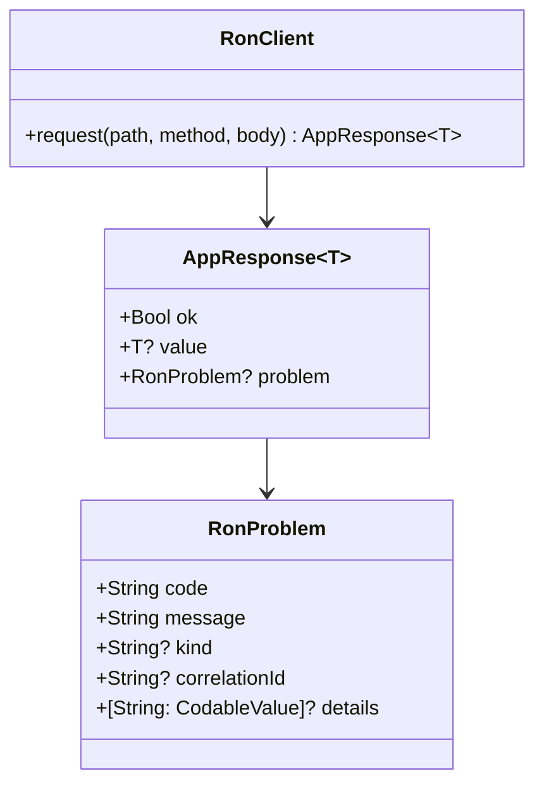
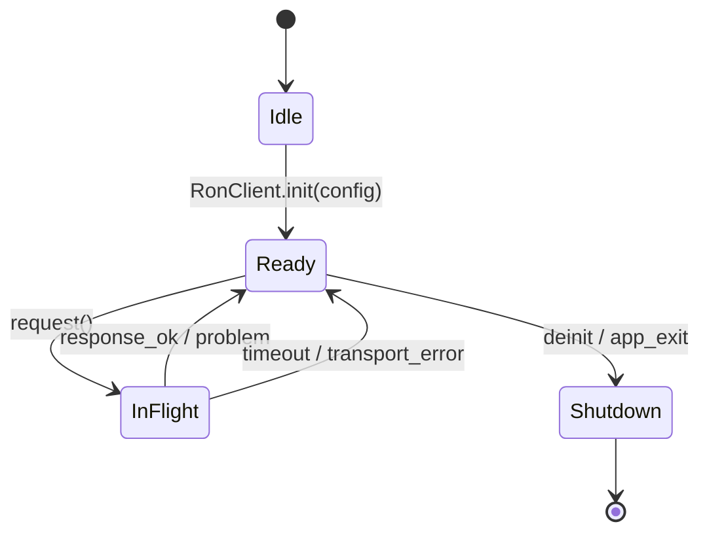

````md
# ron-app-sdk-swift

> **Role:** Swift app SDK (iOS/macOS client for RON-CORE App Plane)  
> **Owner:** Stevan White / RustyOnions  
> **Status:** developer preview (pre-beta)  
> **Swift:** 5.9+  
> **Platforms:** iOS 15+, iPadOS 15+, macOS 12+ (server-side SwiftPM targets too)  
> **Last reviewed:** 2025-12-03

Badges (future):  
[]() []() []()

---

## 1) Overview

**What it is (one paragraph):**  
`ron-app-sdk-swift` is the **official Swift client SDK** for talking to the RON-CORE App Plane via `svc-gateway` / omnigate. It wraps the RON-CORE HTTP contracts (App Plane `/app/*` surface) in a type-safe, `async/await`-first Swift API that works in both **Apple client apps** (iOS/macOS) and **server-side Swift** (SwiftPM / Vapor-style services). It gives you structured errors (`RonProblem`), predictable configuration (`RonConfig`), and sane defaults for timeouts, security, and capability handling—so you don’t have to hand-roll `URLSession` glue for every call.

**How it fits (RustyOnions topology):**  

- **Pillar:** P1 Ingress (App Plane via gateway) + P6 Content (when you call app handlers that touch storage/index)  
- **Upstream callers:**  
  - iOS/iPadOS/macOS apps (UIKit/SwiftUI)  
  - Server-side Swift (SwiftPM binaries, Vapor/Kitura/etc.), CLIs  
- **Downstream deps:**  
  - `svc-gateway` / omnigate (HTTP App Plane)  
  - RON-CORE Micronode/Macronode profiles (indirect through gateway)  
- **Data it touches:**  
  - In-memory config and DTOs (Codable structs)  
  - Network (HTTPS over `URLSession`)  
  - No direct disk/DB access (storage is your app’s concern)  
- **Security boundary:**  
  - Lives **outside** the node; runs in your app / service process  
  - Handles capabilities (macaroons/tokens) in memory only  
  - No PII storage; no key persistence; zero secrets logged  

### 1.1 High-Level Architecture (Mermaid REQUIRED)

```mermaid
flowchart LR
  subgraph SwiftApp[Swift App / Service]
    A[Caller: iOS app / Swift service] -->|API calls| B(ron-app-sdk-swift<br/>RonClient)
  end

  B -->|HTTPS /app/*| C[svc-gateway / omnigate]
  C -->|OAP/1| D[RON-CORE node<br/>Micronode/Macronode]

  B -->|Logs / Metrics Hooks| E[[App Logging / Metrics]]

  style B fill:#0b7285,stroke:#083344,color:#fff
  style C fill:#1d4ed8,stroke:#0b1f4a,color:#fff
  style D fill:#166534,stroke:#052e16,color:#fff
````

---

## 2) Responsibilities & Boundaries

**MUST do (core responsibilities):**

* [ ] Provide a small, idiomatic Swift API (`RonClient`, `RonConfig`, `AppResponse<T>`, `RonProblem`) over the RON-CORE App Plane HTTP surface.
* [ ] Handle config + timeouts + auth headers consistently (env vars + code config).
* [ ] Map canonical error envelopes to `RonProblem` and never leak raw bodies/tokens.
* [ ] Be safe to use in iOS/macOS apps (Keychain-friendly, no insecure storage baked in).

**MUST NOT do (anti-scope / boundaries):**

* [ ] Must **not** implement or embed RON-CORE node logic (no overlay, DHT, storage engines, or Web3).
* [ ] Must **not** manage long-term token storage (Keychain / vaults are app responsibility).
* [ ] Must **not** silently downgrade HTTPS to HTTP or auto-retry non-idempotent operations.
* [ ] Must **not** invent its own DTO shapes; must follow shared schemas (`SDK_SCHEMA_IDB.MD`).

**Acceptance Gates (PROOF you did it):**

* [ ] Unit tests for config, error mapping, logging redaction, and timeout behavior.
* [ ] Interop tests hitting a local Micronode/Macronode via gateway (happy path + auth failure).
* [ ] README quickstart examples compile and run end-to-end with a dev node.
* [ ] Security checklist (`SDK_SECURITY.MD`) ticked for caps, HTTPS, and error surfaces.

---

## 3) Public Interfaces (Swift API)

> This is a **Swift library**; there is no Rust API or direct HTTP server here.

### 3.1 Swift API (library)

Key types (expected, names may evolve slightly):

* `public struct RonConfig` — immutable configuration for `RonClient`

  * Fields: `baseUrl`, timeouts, `headerProvider`, optional debug hooks, optional `pqMode`.
* `public final class RonClient` — main entrypoint; wraps calls to RON-CORE App Plane

  * `init(config: RonConfig)`
  * `func request<T: Decodable>(_ path: String, method: HttpMethod, body: Encodable?) async throws -> AppResponse<T>`
  * Higher-level helpers (future): `get`, `post`, `listAll`, facet helpers, etc.
* `public struct AppResponse<T: Decodable>` — envelope for OK/error results

  * `let ok: Bool`
  * `let value: T?`
  * `let problem: RonProblem?`
* `public struct RonProblem: Error, Codable` — canonical error shape (see `SDK_SCHEMA_IDB.MD`)
* Support types: `HttpMethod`, `Page<T>`, idempotency-key helpers, etc.

**Tiny “hello world” example:**

```swift
import RonAppSdkSwift

@main
struct ExampleApp {
    static func main() async {
        // 1) Build config (env vars are optional but recommended)
        let config = RonConfig.fromEnvironment(
            defaultBaseUrl: "https://localhost:8090"
        )

        // 2) Create client
        let client = RonClient(config: config)

        // 3) Call a simple health-check handler on the App Plane
        do {
            struct Healthz: Decodable {
                let status: String
            }

            let response: AppResponse<Healthz> = try await client.request(
                "/app/healthz",
                method: .get,
                body: Optional<EmptyCodable>.none
            )

            if response.ok, let health = response.value {
                print("RON-CORE status: \(health.status)")
            } else if let problem = response.problem {
                print("RON-CORE error: \(problem.code) – \(problem.message)")
            } else {
                print("Unknown response from RON-CORE")
            }
        } catch {
            print("Transport/SDK error: \(error)")
        }
    }
}
```

---

## 4) Configuration

> Prefer environment variables **plus** explicit overrides in Swift code.

### 4.1 Environment

| Variable                     | Type   |             Default | Description                                     |
| ---------------------------- | ------ | ------------------: | ----------------------------------------------- |
| `RON_SDK_GATEWAY_ADDR`       | string | `https://127.0.0.1` | Base URL for gateway/omnigate (App Plane).      |
| `RON_SDK_OVERALL_TIMEOUT_MS` | int    |             `10000` | Overall request timeout in milliseconds.        |
| `RON_SDK_CONNECT_TIMEOUT_MS` | int    |              `3000` | Connection timeout in milliseconds.             |
| `RON_SDK_READ_TIMEOUT_MS`    | int    |              `7000` | Read timeout in milliseconds.                   |
| `RON_SDK_WRITE_TIMEOUT_MS`   | int    |              `7000` | Write timeout in milliseconds (if supported).   |
| `RON_SDK_INSECURE_HTTP`      | bool   |             `false` | If `1`, allow `http://` URLs (DEV ONLY).        |
| `RON_SDK_DEBUG`              | bool   |             `false` | Enable verbose logging (still redacts secrets). |

Swift implementation sketch:

```swift
extension RonConfig {
    public static func fromEnvironment(
        defaultBaseUrl: String = "https://127.0.0.1:8090"
    ) -> RonConfig {
        let env = ProcessInfo.processInfo.environment

        let baseUrl = env["RON_SDK_GATEWAY_ADDR"] ?? defaultBaseUrl
        let overall = Int(env["RON_SDK_OVERALL_TIMEOUT_MS"] ?? "") ?? 10_000

        return RonConfig(
            baseUrl: baseUrl,
            overallTimeoutMs: overall
            // plus other fields & defaults…
        )
    }
}
```

### 4.2 Code-based Config

Use `RonConfig` builder/initializer:

```swift
let config = RonConfig(
    baseUrl: "https://my-node.example.com",
    overallTimeoutMs: 10_000,
    connectTimeoutMs: 3_000,
    readTimeoutMs: 7_000,
    headerProvider: {
        // Read your token from Keychain / in-memory store
        let token = try tokenStore.current()
        return ["Authorization": "Bearer \(token)"]
    }
)

let client = RonClient(config: config)
```

---

## 5) Build, Run, Test (SwiftPM)

**Add to Package.swift**

```swift
// In your Package.swift dependencies:
dependencies: [
    .package(
        url: "https://github.com/rustyonions/ron-app-sdk-swift.git",
        from: "0.1.0"
    )
],

// In your target:
targets: [
    .target(
        name: "MyApp",
        dependencies: [
            .product(name: "RonAppSdkSwift", package: "ron-app-sdk-swift")
        ]
    )
]
```

**Build (library / example)**

```bash
swift build
```

**Run example target**

```bash
swift run ExampleApp
```

**Tests (unit / interop)**

```bash
swift test
# Future: target interop suite:
swift test --filter InteropTests
```

**Lint & format (if configured)**

```bash
swiftformat .      # or ./scripts/swiftformat.sh
swiftlint          # if using SwiftLint
```

**Security & dependencies (project-level)**

```bash
# Example: use your org’s SCA / dependency scanning tool here.
./scripts/check-deps.sh
```

---

## 6) Observability

This SDK **does not** expose `/metrics` or HTTP endpoints. Instead, it:

* Emits **structured errors** (`RonProblem`) for app logging.
* Provides hooks for integrating with your logging / metrics system.

**Canonical observability hooks (recommended pattern):**

* Config fields / closures for:

  * `onRequestStart(context: RequestContext)`
  * `onRequestEnd(context: RequestContext, result: Result<AppResponse<Any>, Error>)`

Where `RequestContext` includes:

* `method`, `path`, `requestId`, `correlationId`, timestamps.

**Metrics you may want to wire in your app:**

* `ron_sdk_requests_total{method,path,code}` — counter
* `ron_sdk_request_latency_seconds{method,path}` — histogram
* `ron_sdk_errors_total{kind,code}` — counter (from `RonProblem.kind/code`)

**Tracing**

* Attach correlation IDs from RON-CORE (`X-RON-Correlation-Id`) to your app logs.
* Include fields like `path`, `method`, `status`, `error.code`, `error.kind`.

---

## 7) Performance & SLOs

> These are **targets**, not guarantees. They depend on your node/network.

| Metric                |      Target | Notes                                     |
| --------------------- | ----------: | ----------------------------------------- |
| P50 client overhead   |        <5ms | SDK overhead vs raw `URLSession` request. |
| P99 client overhead   |       <10ms | On typical dev hardware.                  |
| Start-to-first-call   |      <100ms | Client init + first request.              |
| Max RPS (single node) | app-defined | Depends on node + network, not SDK only.  |

To reproduce overhead benchmarks:

* Use a local Micronode/Macronode on `localhost`.
* Compare raw `URLSession` vs `RonClient` for a simple `/app/healthz` call.
* Run `swift test --filter Benchmarks` (once we add benchmark tests).

---

## 8) Data & Schema

This SDK itself does **not** persist user data. It **does**:

* Deserialize/serialize DTOs from/to JSON per canonical schemas.
* Use `Codable` + helpers for `u64`/`i64`/timestamps to match `SDK_SCHEMA_IDB.MD`.

Relevant docs:

* `SDK_SCHEMA_IDB.MD` — unified DTO schema, error envelopes, pagination.
* `SDK_IDB.MD` — Swift SDK invariants, scope, and interop rules.



---

## 9) Security & Privacy (SDK Perspective)

* **Threat model (SDK-level):**

  * Assumes a trusted process (your app / service).
  * RON-CORE node is remote and reachable via TLS.
  * Network may be hostile; SDK must treat all inputs as untrusted.

* **Key handling / caps:**

  * SDK does **not** persist tokens; it only uses them in headers for each call.
  * No tokens in logs, errors, or DTOs.
  * Key storage (Keychain/secret manager) is left to app code.

* **PII:**

  * SDK is agnostic to your payloads; treat DTOs as potentially containing PII.
  * Avoid logging full DTOs in production.

* **AuthN/Z:**

  * Per RON-CORE design:

    * AuthZ happens in the node (capabilities/passports).
  * SDK simply attaches your tokens/caps to requests.

* **Input validation:**

  * SDK enforces timeouts and safe parsing.
  * Your app must enforce data-level validation of DTO contents.

For deeper security invariants, see `SDK_SECURITY.MD`.

---

## 10) Error Taxonomy (Swift)

| Category / Type              | When it happens                          | User hint                              | Retries             |
| ---------------------------- | ---------------------------------------- | -------------------------------------- | ------------------- |
| `RonSdkError.config`         | Misconfiguration (bad URL, http w/o opt) | Fix config, check env vars             | no                  |
| `RonSdkError.transport`      | DNS / TLS / timeout / connection issues  | Check network or node availability     | maybe, with backoff |
| `RonSdkError.decoding`       | JSON doesn’t match expected DTO          | Check schema/version compat            | no                  |
| `RonProblem.kind=auth`       | Bad/expired caps, unauthorized           | Refresh token / log in again           | no (until re-auth)  |
| `RonProblem.kind=policy`     | Policy denied by node                    | Check caps/scopes and node policy      | no                  |
| `RonProblem.kind=rate_limit` | 429 or similar backpressure              | Backoff and retry after suggested wait | yes, with backoff   |
| `RonProblem.kind=internal`   | Node-side error                          | Contact ops / check logs               | maybe, but beware   |

SDK behavior:

* All HTTP errors attempt to decode a canonical `RonProblem`.
* On failure, SDK surfaces a `transport`-kind problem with `status = 0`.

---

## 11) Concurrency Model

* **Runtime:** Swift concurrency (`async/await`, `Task`).
* **Networking:** `URLSession` (configurable session if needed).
* **Concurrency rules:**

  * `RonClient` is safe to share between tasks/threads, assuming its config is immutable.
  * We avoid global mutable state and singletons.
  * Cancellation:

    * `Task` cancellation is observed by ongoing requests and will cancel the underlying URLSession task.



---

## 12) Compatibility & Requirements

* **Swift:** 5.9+
* **Apple OS:** iOS 15+, iPadOS 15+, macOS 12+ (for official support)
* **Server-side:** SwiftPM on Linux/macOS (tested on recent Ubuntu LTS + macOS).
* **TLS:** Uses platform TLS via `URLSession`. Node must present a valid certificate (or you must configure dev-only trust).
* **RON-CORE:**

  * Targets App Plane HTTP contracts for RON-CORE `v0.x` (see matrix in `SDK_IDB.MD`).

---

## 13) Examples

### 13.1 Minimal “Hello RON-CORE” (Swift target)

```swift
import RonAppSdkSwift

@main
struct HelloRon {
    static func main() async {
        let config = RonConfig.fromEnvironment(
            defaultBaseUrl: "https://127.0.0.1:8090"
        )
        let client = RonClient(config: config)

        struct HelloReply: Decodable {
            let message: String
        }

        do {
            let response: AppResponse<HelloReply> = try await client.request(
                "/app/hello",
                method: .get,
                body: Optional<EmptyCodable>.none
            )

            if response.ok, let value = response.value {
                print("Server says: \(value.message)")
            } else {
                print("Problem: \(String(describing: response.problem))")
            }
        } catch {
            print("SDK/transport error: \(error)")
        }
    }
}
```

**Run it:**

```bash
RON_SDK_GATEWAY_ADDR=https://127.0.0.1:8090 \
swift run HelloRon
```

### 13.2 Simple curl against the same node (for comparison)

```bash
curl -sS https://127.0.0.1:8090/app/hello \
  -H "Authorization: Bearer <token>" | jq .
```

---

## 14) Troubleshooting

* **“Invalid base URL / insecure http”**

  * Ensure `RON_SDK_GATEWAY_ADDR` is `https://...`.
  * For local dev with `http://`, set `RON_SDK_INSECURE_HTTP=1` and never ship that config.

* **TLS / certificate errors**

  * Check that your RON-CORE gateway uses a valid cert (or dev CA trusted by your device).
  * On simulators/dev, you may need to trust your self-signed CA.

* **Timeouts**

  * Increase timeouts via `RonConfig`.
  * Verify the node is actually reachable and not overloaded.

* **Decoding errors**

  * Ensure your node version and SDK schema match.
  * Inspect the raw JSON (in a safe, dev-only log) to see what changed.

* **Auth failures**

  * Check caps / tokens are valid and not expired.
  * Verify `Authorization` header is set by your `headerProvider`.

---

## 15) Development Notes

**Project conventions (Swift / RON SDK):**

* `RonConfig` is an immutable struct; `RonClient` holds a `let config`.
* All public DTOs conform to `Codable` and map to canonical schemas.
* Error surfaces:

  * Local issues ⇒ `RonSdkError`.
  * Node errors ⇒ `RonProblem`.

**Pre-commit quickcheck**

```bash
swiftformat .
swiftlint
swift test
```

If you change DTOs or error mapping, also update:

* `SDK_SCHEMA_IDB.MD` (if schema changed)
* `SDK_SECURITY.MD` (if security behavior changed)
* Tests under `Tests/RonAppSdkSwiftTests/`

---

## 16) Mermaid Diagrams — Policy & Tooling

We keep `.mmd` sources under `docs/` and render to SVG if needed.

**Render locally (SVG)**

```bash
npm i -g @mermaid-js/mermaid-cli
mmdc -i docs/arch.mmd -o docs/arch.svg
```

**Render via Docker**

```bash
docker run --rm -v "$PWD":/data minlag/mermaid-cli \
  mmdc -i docs/arch.mmd -o docs/arch.svg
```

---

## 17) Roadmap & TODO

* [ ] **M1 — Developer Preview**

  * Core `RonClient` + `RonConfig` + `RonProblem` + `AppResponse<T>`.
  * Config-from-env + basic tests + interop happy-path.

* [ ] **M2 — Interop & Hardening**

  * Full error mapping + more DTOs per `SDK_SCHEMA_IDB.MD`.
  * Negative tests (invalid caps, misconfig, timeouts).

* [ ] **M3 — Facets & Helpers**

  * Optional facet manifest builders (TOML).
  * Convenience helpers for paginated endpoints.

* [ ] **M4 — Streaming & Advanced DX**

  * SSE/WebSocket helpers (opt-in, bounded).
  * Vapor integration examples and recipes.

* [ ] **M5 — God-Tier**

  * Property/chaos tests for error paths.
  * PQ toggles wired when RON-CORE transport supports it.

---

## 18) Changelog

See [CHANGELOG.md](./CHANGELOG.md).
This SDK follows SemVer and tracks RON-CORE protocol changes in `SDK_IDB.MD`.

---

## 19) License

Dual-licensed under **MIT** or **Apache-2.0**.
See [LICENSE-MIT](../LICENSE-MIT) and [LICENSE-APACHE](../LICENSE-APACHE).

---

## 20) Contributing

PRs welcome!

Please:

* Run `swiftformat .`, `swiftlint`, and `swift test`.
* Update docs and examples if you change public APIs.
* Mention any schema or security-relevant changes in your PR description.
* Keep DTOs aligned with `SDK_SCHEMA_IDB.MD` and invariants in `SDK_IDB.MD`.

> Also see: `SDK_IDB.MD`, `SDK_SCHEMA_IDB.MD`, and `SDK_SECURITY.MD` for invariant-driven design details of this SDK.

```
```
