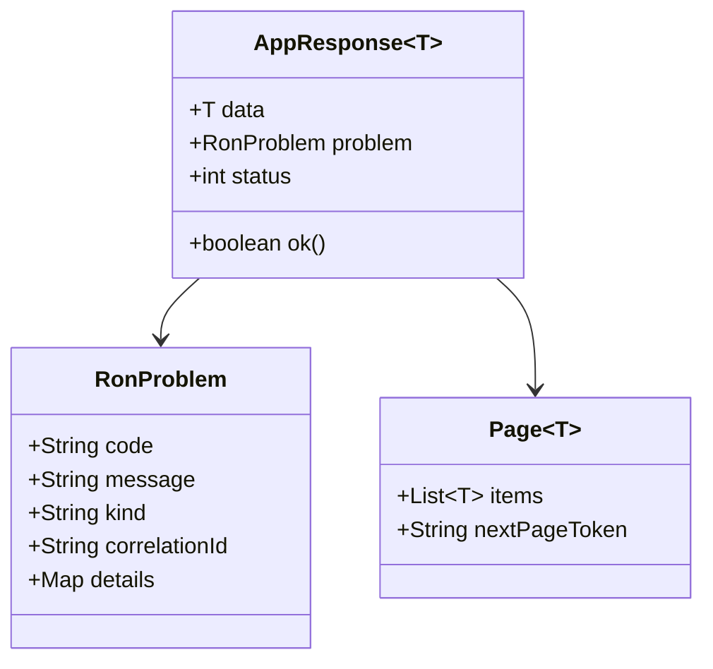
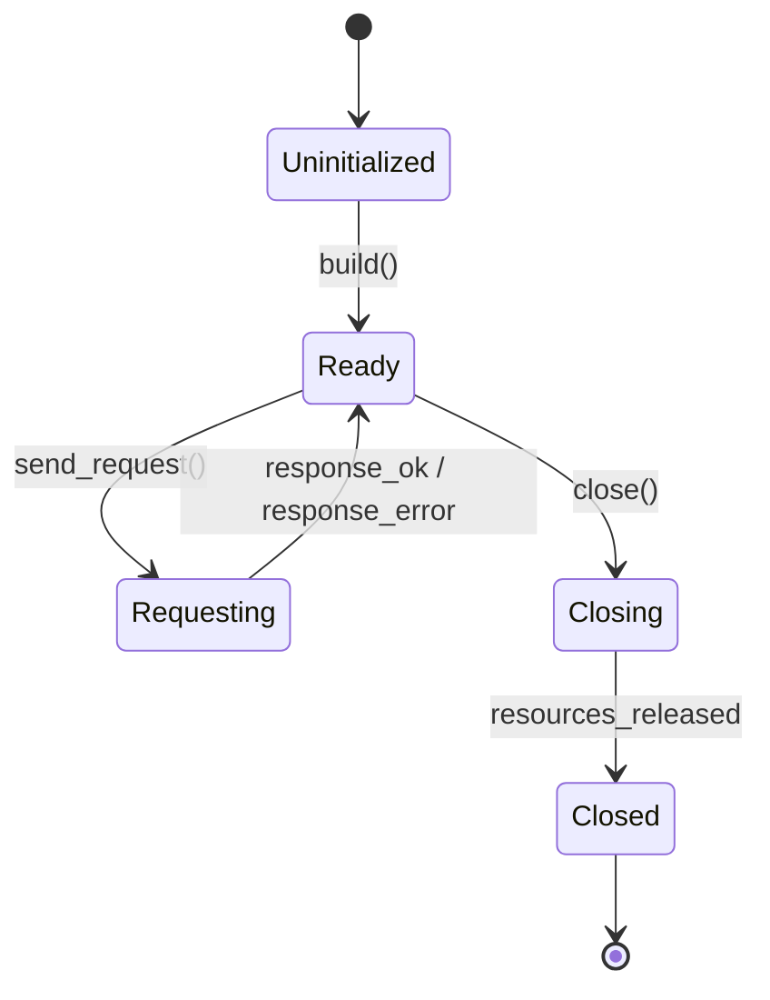
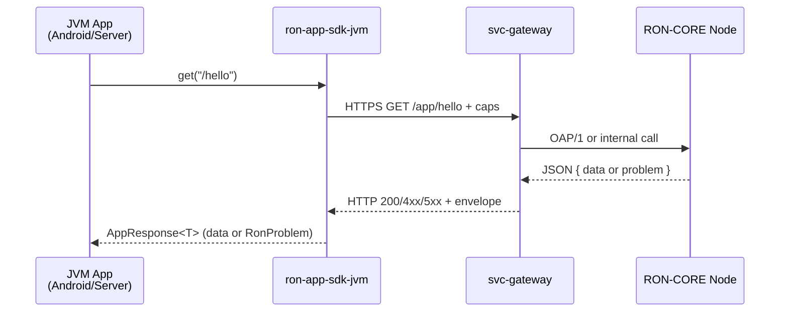

# ron-app-sdk-jvm

> **Role:** JVM app SDK (Java + Kotlin client for RON-CORE app plane)
> **Owner:** Stevan White / RustyOnions
> **Status:** draft (pre-beta)
> **JVM target:** Java 17+, Kotlin 1.9+
> **Last reviewed:** 2025-11-30

Badges (future):
[]() []() []()

---

## 1) Overview

**What it is (one paragraph):**
`ron-app-sdk-jvm` is the official JVM app SDK for RON-CORE’s **app plane**, providing a shared core for Java and Kotlin that speaks to `/app/*` endpoints on a RON-CORE node via `svc-gateway`/omnigate. It is designed for **Android apps**, JVM backends (Spring Boot, Ktor, Micronaut, Quarkus), desktop UIs, and CLI tools, with a single, schema-aligned client surface that respects RON-CORE’s security, reliability, and interop invariants.

**How it fits (RustyOnions topology):**

* **Pillar:** App Plane / SDK & Developer Experience
* **Upstream callers:** Android apps (Kotlin/Java), JVM services (Spring/Ktor/Quarkus/Micronaut), JVM CLIs and desktop tools.
* **Downstream deps:** `svc-gateway`/omnigate (HTTPS /app plane), optionally `svc-auth`/`svc-passport`, `svc-storage`, `svc-index` as those surfaces are exposed.
* **Data it touches:** In-memory DTOs; JSON over HTTPS; optional facet manifest TOML if using the facet builder helpers. No direct node storage.
* **Security boundary:** Handles app-plane capabilities/macaroons and request envelopes; must *never* log or persist secrets, and must behave safely on both trusted servers and hostile/mobile devices.

### 1.1 High-Level Architecture (Mermaid)

```mermaid
flowchart LR
  subgraph JVM App
    A[Android App<br/>Spring Boot Service<br/>CLI / Desktop] -->|SDK calls| B(ron-app-sdk-jvm<br/>(RonClient / Ron))
  end

  B -->|HTTPS /app/*| C[svc-gateway / omnigate]
  C -->|OAP/1, Storage, Index| D[(RON-CORE Micronode/Macronode)]
  B -->|Metrics hooks| E[[App Metrics<br/>(Micrometer / OpenTelemetry)]]

  style B fill:#0b7285,stroke:#083344,color:#fff
```

---

## 2) Responsibilities & Boundaries

**MUST do (core responsibilities):**

* [ ] Provide a **schema-aligned**, type-safe HTTP client for `/app/*` (GET/POST/PUT/PATCH/DELETE).
* [ ] Attach and manage capabilities/macaroons securely (no logging, short-lived, rotatable).
* [ ] Implement canonical **error and pagination envelopes** in idiomatic Java/Kotlin types.
* [ ] Offer Kotlin coroutine APIs and Java sync/async APIs built on the same core.
* [ ] Support Android, server, desktop, and CLI usage via a single shared core with environment-variable defaults on server/CLI.

**MUST NOT do (anti-scope / boundaries):**

* [ ] MUST NOT embed or generate node configuration, policies, or secrets; that belongs to the node and infra, not the SDK.
* [ ] MUST NOT invent incompatible DTO shapes or error formats; those are dictated by `ron-proto` and gateway OpenAPI.
* [ ] MUST NOT provide long-term storage for caps/macaroons (e.g., writing to disk) or any persistence of secrets by default.
* [ ] MUST NOT spin up its own long-lived background jobs without explicit configuration (no surprise schedulers / threads).

**Acceptance Gates (PROOF you did it):**

* [ ] Interop tests against a local Micronode+gateway show matching DTO, error, and pagination shapes vs canonical schema.
* [ ] Security tests show no tokens in logs or exception messages, including Android logcat.
* [ ] Benchmark suite shows SDK overhead <5% vs raw HTTP client for simple JSON calls.
* [ ] Property/chaos tests cover auth/error envelopes and basic network failure handling (timeouts, 5xx, flakiness).

---

## 3) JVM API (library)

### 3.1 Key modules/types

> Package names are illustrative; final names may differ slightly based on the build layout.

* `dev.roncore.sdk.RonClient` — core Java-first client (`builder()`, sync and async methods).
* `dev.roncore.sdk.kotlin.Ron` — idiomatic Kotlin facade with `suspend` functions and coroutine/Flow-based APIs.
* `dev.roncore.sdk.AppResponse<T>` — typed response envelope (`data` or `problem`).
* `dev.roncore.sdk.RonProblem` — canonical error envelope (`code`, `message`, `kind`, `correlationId`, `details`).
* `dev.roncore.sdk.config.RonConfig` — configuration model (base URL, timeouts, auth, retries).
* `dev.roncore.sdk.auth.TokenProvider` — pluggable capability/macroon provider for rotation.

**Java example (sync):**

```java
import dev.roncore.sdk.RonClient;
import dev.roncore.sdk.AppResponse;
import dev.roncore.sdk.RonProblem;

public class HelloWorld {
    public static void main(String[] args) {
        RonClient client = RonClient.builder()
                .baseUrl(System.getenv("RON_SDK_GATEWAY_ADDR"))
                .overallTimeoutMs(5_000L)
                .build();

        AppResponse<String> res = client.get("/hello", String.class);

        if (res.isOk()) {
            System.out.println("Server said: " + res.getData());
        } else {
            RonProblem p = res.getProblem();
            System.err.println("RON error [" + p.getCode() + "] " + p.getMessage());
        }

        client.close();
    }
}
```

**Kotlin example (coroutines):**

```kotlin
import dev.roncore.sdk.kotlin.Ron
import kotlinx.coroutines.runBlocking

fun main() = runBlocking {
    val ron = Ron {
        baseUrl(System.getenv("RON_SDK_GATEWAY_ADDR") ?: "https://localhost:5304")
        overallTimeoutMs(5_000)
    }

    val res = ron.get<String>("/hello")

    if (res.ok) {
        println("Server said: ${res.data}")
    } else {
        println("RON error [${res.problem?.code}]: ${res.problem?.message}")
    }

    ron.close()
}
```

---

## 4) Configuration

> For JVM backends/CLIs we prefer environment variables; Android/desktop apps use explicit config objects.

**Environment variables (server/CLI):**

| Variable                     | Type   | Default                  | Description                              |
| ---------------------------- | ------ | ------------------------ | ---------------------------------------- |
| `RON_SDK_GATEWAY_ADDR`       | string | `https://127.0.0.1:5304` | Base URL of RON-CORE gateway/omnigate.   |
| `RON_SDK_OVERALL_TIMEOUT_MS` | int    | `5000`                   | Overall request timeout in milliseconds. |
| `RON_SDK_CONNECT_TIMEOUT_MS` | int    | `1000`                   | Connect timeout in milliseconds.         |
| `RON_SDK_READ_TIMEOUT_MS`    | int    | `4000`                   | Read timeout in milliseconds.            |
| `RON_SDK_WRITE_TIMEOUT_MS`   | int    | `4000`                   | Write timeout in milliseconds.           |
| `RON_SDK_INSECURE_HTTP`      | bool   | `false`                  | Allow `http://` for dev/test only.       |

**Code-based configuration (Java):**

```java
RonClient client = RonClient.builder()
    .fromEnv()                          // loads env defaults where available
    .baseUrl("https://node.example.com")
    .connectTimeoutMs(1_000L)
    .readTimeoutMs(4_000L)
    .tokenProvider(() -> currentCapability())
    .build();
```

**Kotlin DSL:**

```kotlin
val ron = Ron {
    fromEnv()        // no-op on Android, meaningful on server
    baseUrl("https://node.example.com")
    connectTimeoutMs(1_000)
    readTimeoutMs(4_000)
    tokenProvider { currentCapability() }
}
```

**Android / desktop:**

* Do **not** rely on env vars; wire `baseUrl`, timeouts, and `tokenProvider` explicitly (e.g., via DI or BuildConfig).

---

## 5) Build, Run, Test

**Gradle (recommended)**

```bash
# Build all modules
./gradlew build

# Run unit tests
./gradlew test

# Run integration tests (if split into a separate task)
./gradlew integrationTest
```

**Maven (if used)**

```bash
mvn clean install
mvn -pl ron-app-sdk-jvm -DskipITs=false verify
```

**Lint / static analysis**

```bash
./gradlew ktlintCheck detektMain detektTest
./gradlew checkstyleMain checkstyleTest spotbugsMain spotbugsTest
```

**Android-specific (if a sample module exists)**

```bash
./gradlew :android-sample:connectedAndroidTest
```

---

## 6) Observability

`ron-app-sdk-jvm` does **not** expose HTTP endpoints itself; instead, it integrates with host app observability:

* **Metrics hooks:**

  * Timer/histogram for request latency per method/path.
  * Counters for successful/failed calls, grouped by `code`, `kind`, and HTTP status.
  * Exposed via Micrometer/OpenTelemetry so they surface in whatever metrics backend the app uses.

* **Canonical metric dimensions (suggested):**

  * `ron_request_latency_seconds{sdk="jvm", method, route, outcome}` — histogram.
  * `ron_requests_total{sdk="jvm", method, route, code, kind}` — counter.
  * `ron_backoff_total{sdk="jvm", reason}` — counter for retries/backoff events.

* **Tracing:**

  * Optional OpenTelemetry integration: span per request with attributes: `ron.route`, `ron.method`, `ron.status`, `ron.code`, `ron.correlation_id`.

Host apps are expected to configure the actual exporters (Prometheus, OTLP, etc.).

---

## 7) Performance & SLOs

**Targets (initial guidance):**

| Metric                 | Target           | Notes                                   |
| ---------------------- | ---------------- | --------------------------------------- |
| P50 client latency     | ~1–2 ms over raw | SDK overhead for small JSON over HTTPS. |
| P99 client latency     | <5 ms over raw   | Under nominal load, same host.          |
| Start-to-ready client  | <100 ms          | First request after client creation.    |
| Android battery impact | minimal          | Avoid high concurrency / busy polling.  |

**Repro guidance:**

* Run against a local Micronode/gateway on the same machine.
* Use JMH or equivalent for microbenchmarks and a simple `wrk`/`hey` harness for end-to-end tests.

---

## 8) Data & Schema

**Data model (summary):**

* All DTOs and envelopes derived from **canonical schemas** (`ron-proto` + HTTP/OpenAPI).
* JSON encoding rules:

  * `u64` / `i64` encoded as strings in JSON; mapped to `Long`/`BigInteger` in JVM.
  * Timestamps encoded as ISO-8601 strings; mapped to `Instant` / `OffsetDateTime` / `kotlinx.datetime.Instant`.
  * Optional fields omitted when unset; explicit `null` only where schema says so.



**Facet manifests (future helpers):**

* JVM builders emit TOML matching the shared facet schema (`[facet]`, `[facet.security]`, `[facet.meta]`, `[[route]]`, optional `limits`, `integrity`).

---

## 9) Security & Privacy

> See `SDK_SECURITY.MD` (ron-app-sdk-jvm profile) for the full checklist.

* **Threat model (short):**

  * **Server/CLI:** host is trusted but external traffic is not; secrets must stay in memory and logs must be scrubbed.
  * **Android/desktop:** device and logs are potentially hostile; assume attackers may see logcat, steal devices, and decompile apps.

* **Key handling / capabilities:**

  * No global static tokens; tokens live in client instances.
  * No writing tokens to disk; Android devs are nudged to use Keystore + `EncryptedSharedPreferences` only if absolutely needed.

* **AuthN/Z integration:**

  * Capability/macroon headers added automatically from `TokenProvider`.
  * Examples emphasize **least-privilege**, **short-lived** caps and server-issued tokens, not admin caps baked into apps.

* **Input validation & limits:**

  * Per-request timeouts and optional response-size / page-size limits to reduce DoS risk.

---

## 10) Error Taxonomy

> Backed by the canonical error envelope (`code`, `message`, `kind`, `correlation_id`, `details`).

| Code/Variant              | When it happens                          | User hint                                     | Retries                |
| ------------------------- | ---------------------------------------- | --------------------------------------------- | ---------------------- |
| `CONFIG_MISSING_BASE_URL` | `baseUrl` not set and env is empty       | set `RON_SDK_GATEWAY_ADDR` or pass baseUrl    | no                     |
| `CONFIG_INVALID_URL`      | base URL malformed                       | correct gateway URL                           | no                     |
| `LOCAL_TIMEOUT`           | overall/connection timeout reached       | check network or increase timeouts            | yes (idempotent)       |
| `LOCAL_NETWORK_FAILURE`   | DNS/TLS/socket issues                    | check gateway address / TLS config            | yes (idempotent)       |
| `AUTH_UNAUTHORIZED`       | 401 from node                            | refresh/reissue capability/macroon            | no                     |
| `AUTH_FORBIDDEN`          | 403 from node                            | scope insufficient; adjust caps               | maybe (after caps fix) |
| `RATE_LIMITED`            | 429 from node                            | backoff, respect `Retry-After` if present     | yes, with backoff      |
| `APP_ERROR`               | 4xx/5xx with problem body from app/facet | inspect `code` / `details`, handle per domain | no (usually)           |

Host apps should prefer inspecting `RonProblem.code`/`kind` over string matching on messages.

---

## 11) Concurrency Model

* **Core assumptions:**

  * Underlying HTTP client (e.g., OkHttp) uses connection pooling and a bounded dispatcher.
  * `RonClient` is thread-safe and designed to be shared across threads/coroutines.

* **Java:**

  * Sync methods block caller thread.
  * Async variants return `CompletableFuture<AppResponse<T>>` backed by the HTTP client’s executor.

* **Kotlin:**

  * Public API uses `suspend` functions; callsites control dispatcher (`Dispatchers.IO`, `Dispatchers.Default`, etc.).
  * Streaming (future) uses `Flow` with cancellation and backpressure.

* **Rules:**

  * No hidden global thread pools; all executors owned by HTTP client or injected from app.
  * No blocking on Android main thread; docs show `withContext(Dispatchers.IO)` usage.



---

## 12) Compatibility & Requirements

* **Java:** 17+ (target); may support 11+ with restrictions.
* **Kotlin:** 1.9+ (JVM), coroutines 1.8+.
* **Android:** minSdk TBD, targeting modern API levels; no reliance on deprecated networking stacks.
* **TLS:** uses platform TLS (OkHttp / Ktor client); PQ-mode config reserved for future when RON-CORE PQ profile is stable.

---

## 13) Examples

**Spring Boot (Java) bean configuration:**

```java
@Configuration
public class RonConfig {

    @Bean
    public RonClient ronClient() {
        return RonClient.builder()
                .fromEnv()
                .baseUrl("https://node.example.com")
                .build();
    }
}
```

**Ktor (Kotlin) usage in a route:**

```kotlin
fun Route.helloRoutes(ron: Ron) {
    get("/hello-from-ron") {
        val res = ron.get<String>("/hello")
        if (res.ok) {
            call.respond(res.data ?: "ok")
        } else {
            call.respond(HttpStatusCode.BadGateway, res.problem ?: "RON error")
        }
    }
}
```

**Android ViewModel sketch (Kotlin):**

```kotlin
class HelloViewModel(
    private val ron: Ron
) : ViewModel() {

    private val _text = MutableStateFlow("Loading…")
    val text: StateFlow<String> = _text

    fun load() {
        viewModelScope.launch {
            val res = ron.get<String>("/hello")
            _text.value = if (res.ok) res.data ?: "ok"
                          else "Error: ${res.problem?.code}"
        }
    }
}
```

---

## 14) Troubleshooting

* **“Connection refused / timeout”**

  * Check `RON_SDK_GATEWAY_ADDR`, timeouts, and ensure gateway is listening.

* **“Invalid certificate”**

  * Verify TLS config; in dev-only scenarios you *may* enable `insecureHttp(true)` or relaxed trust but never in production.

* **“Unauthorized / Forbidden”**

  * Token missing or scope insufficient. Confirm capability/macroon, tenant, and TTL.
  * For Android, ensure tokens are fetched from a backend, not hardcoded.

* **“High CPU or too many connections”**

  * Ensure you’re sharing a single `RonClient` instance per baseUrl, not creating per request.

---

## 15) Development Notes

**Project conventions (SDK-wide):**

* DTOs and envelopes must stay aligned with canonical schemas in `SDK_SCHEMA_IDB.MD` and the gateway OpenAPI; schema drift in CI is a **build failure**.
* Security invariants follow `SDK_SECURITY.MD` (no secret logging, bounded timeouts, safe defaults).
* JVM SDK is Tier-1: tests, benchmarks, interop checks, property/chaos tests are part of the expected pipeline.

**Pre-commit quickcheck**

```bash
./gradlew ktlintFormat ktlintCheck
./gradlew detektMain detektTest
./gradlew test
./gradlew integrationTest
```

---

## 16) Mermaid Diagrams — Policy & Tooling

We treat Mermaid diagrams as part of the “living documentation”:

1. **Architecture** — see §1.1.
2. **Sequence** — JVM API call path (below).
3. **State** — client lifecycle (see §11).

**Sequence diagram (common call path):**



**Local rendering (SVG):**

```bash
npm i -g @mermaid-js/mermaid-cli
mmdc -i docs/arch.mmd -o docs/arch.svg
```

---

## 17) Roadmap & TODO

* [ ] **Milestone 1 — MVP client**

  * Basic `RonClient`/`Ron` with sync + suspend APIs, JSON, canonical error/pagination envelopes, env-based config, and security invariants enforced.

* [ ] **Milestone 2 — Interop + Android**

  * Interop test suite against Micronode/gateway.
  * Android module with coroutine-friendly API and sample app.

* [ ] **Milestone 3 — Codegen & facets**

  * Wire OpenAPI/`ron-proto` codegen for DTOs.
  * Add facet manifest builders + TOML writer aligned with `SDK_SCHEMA_IDB`.

* [ ] **Hardening tasks**

  * Property tests for auth and error parsing.
  * Chaos tests (latency, drops, TLS failures).
  * Metrics/tracing integration examples (Micrometer, OpenTelemetry).

---

## 18) Changelog

See `CHANGELOG.md`. Follows SemVer; breaking changes and migration notes must be documented and tied back to protocol/schema version changes.

---

## 19) License

Dual-licensed under **MIT** or **Apache-2.0** (same as the rest of RustyOnions / RON-CORE).

---

## 20) Contributing

PRs welcome! Please:

* Keep API surfaces aligned with TS and Rust SDKs conceptually, but idiomatic to Java/Kotlin.
* Run formatting, static analysis, tests, and (when modified) interop tests before pushing.
* Update diagrams and docs when you change behavior, not just code.

Also see:

* `SDK_IDB.MD` — invariant-driven blueprint for `ron-app-sdk-jvm`.
* `SDK_SECURITY.MD` — JVM SDK security checklist.
* `SDK_SCHEMA_IDB.MD` — unified schema & facet contract.
