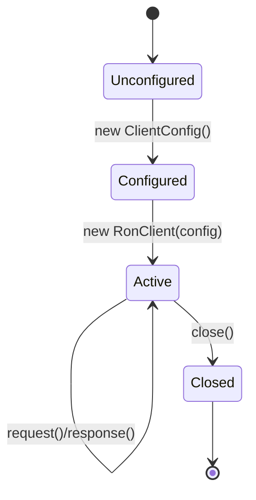

````md
# ron-app-sdk-php

> **Role:** PHP App SDK (client library for RON-CORE app plane)  
> **Owner:** Stevan White (RustyOnions / RON-CORE)  
> **Status:** draft (pre-beta, core SDK implemented)  
> **PHP target:** 8.1+  
> **Last reviewed:** 2025-11-25

Badges (future):  
[]() []() []()

---

## 1) Overview

**What it is (one paragraph):**  
`ron-app-sdk-php` is the official PHP app SDK for RON-CORE’s **app plane**. It provides an idiomatic `RonClient` that talks to RON-CORE via `svc-gateway`’s `/app/*` surface, handling HTTPS, timeouts, retries, structured error envelopes, and pagination for you. It targets **PHP backends and CLI workers** (Laravel, Symfony, Slim, custom apps), giving existing PHP/LAMP stacks a gentle migration path onto Micronode/Macronode without having to learn Rust or rewrite everything.

**How it fits (RustyOnions topology):**  

- **Pillar:** App plane / Developer Experience (SDKs)  
- **Upstream callers:** PHP web apps, CLI tools, job runners (Laravel commands, Symfony console, cron scripts)  
- **Downstream deps:**  
  - `svc-gateway` (primary, `/app/*`)  
  - `svc-edge` (optional, if fronting gateway)  
  - `svc-admin` (optional, for health checks in tests/tools)  
- **Data it touches:** In-memory PHP objects, HTTP/JSON over network; **no direct DB** access (all storage/indexing flows through RON-CORE).  
- **Security boundary:**  
  - Handles **capability tokens/macaroons** and auth headers.  
  - Must never log secrets.  
  - Assumes trusted server/worker environment (not browser), but still enforces sane timeouts & bounded retries.

### 1.1 High-Level Architecture (Mermaid REQUIRED)

```mermaid
flowchart LR
  subgraph PHP App / Worker
    A[Caller: Laravel/Symfony CLI/HTTP] -->|calls| B(RonClient)
  end

  B -->|HTTPS /app/*| C[svc-gateway]
  C -->|OAP/HTTP| D[omnigate]
  D -->|RPC/OAP| E[RON-CORE services]

  B -->|Logs/metrics hooks| F[[App Observability (PSR-3, OpenTelemetry)]]

  style B fill:#0b7285,stroke:#083344,color:#fff
````

*The SDK is a thin client: all authority and data live in RON-CORE; PHP apps only see the app-plane HTTP surface.*

---

## 2) Responsibilities & Boundaries

**MUST do (core responsibilities):**

* [x] Provide an idiomatic `RonClient` for PHP backends and CLI tools.
* [x] Attach capability/bearer tokens securely (no logging, no query-string caps).
* [x] Implement canonical error & pagination envelopes shared with other SDKs.
* [x] Enforce bounded network calls (timeouts, optional bounded retries).
* [x] Expose configuration via shared `RON_SDK_*` env vars with fail-closed validation.

**MUST NOT do (anti-scope / boundaries):**

* [x] MUST NOT talk directly to `svc-storage`, `svc-index`, or other core services—**all** app traffic goes through `svc-gateway`/omnigate (`/app/*`).
* [x] MUST NOT store caps/macaroons on disk by default (no built-in persistence to files, DB, cookies).
* [x] MUST NOT auto-retry non-idempotent writes without explicit idempotency keys and user opt-in.
* [x] MUST NOT ship browser-facing code or UI widgets (PHP SDK is backend-only; frontends use TS SDK).

**Acceptance Gates (PROOF you did it):**

* [x] PHPUnit **unit tests** for:

  * Config/env parsing (including invalid/env-missing cases).
  * Error envelope mapping (`Problem` / canonical error JSON → exceptions).
  * Pagination helper behavior.
  * Retry / idempotency behavior.
* [x] **Interop tests** against a local gateway:

  * `/app/hello` round-trip (currently treats `upstream_unavailable` as a structured, testable problem).
  * Paginated endpoint (`/app/resources` by default, overridable with `RON_SDK_PAGINATION_PATH`).
* [x] No secrets in logs:

  * Tests/assertions ensure debug logging and headers redaction never leak `Authorization` or capability-style headers.
* [ ] Benchmarks for simple `/app/hello` call:

  * Planned: measure SDK overhead vs raw HTTP client and document in `docs/benchmarks.md`.

---

## 3) Public Interfaces

> This is a **PHP SDK**, not a Rust crate. This section documents the main PHP API surface and how it’s typically used.

### 3.1 PHP API (library)

Key namespaces/types:

* `Ron\AppSdkPhp\ClientConfig` — configuration value object:

  * `fromEnv()` factory (reads `RON_SDK_*` env vars).
  * Validates base URL, timeouts, retry settings; fail-closed on invalid config.
  * Supports `allowInsecureHttp` flag (via `RON_SDK_INSECURE_HTTP`) for **dev-only** `http://` usage.

* `Ron\AppSdkPhp\RonClient` — main HTTP client:

  * `__construct(ClientConfig|array $config)`
  * `static fromEnv(): RonClient`
  * `get(string $path, array $query = [], array $headers = []): Response`
  * `post(string $path, mixed $body = null, array $headers = []): Response`
  * `put(string $path, mixed $body = null, array $headers = []): Response`
  * `delete(string $path, array $query = [], array $headers = []): Response`
  * `request(string $method, string $path, array $options = []): Response`
  * `close(): void` (currently a no-op, reserved for future pooled transports)

* `Ron\AppSdkPhp\Response` — immutable response wrapper:

  * `getStatusCode(): int`
  * `getHeaders(): array<string,array<int,string>>`
  * `getHeader(string $name): array<int,string>`
  * `json(bool $assoc = true): mixed`
  * `getRawBody(): string`

* Exceptions:

  * `Ron\AppSdkPhp\Exception\RonException` (base)
  * `Ron\AppSdkPhp\Exception\RonNetworkException`
  * `Ron\AppSdkPhp\Exception\RonTimeoutException`
  * `Ron\AppSdkPhp\Exception\RonAuthException`
  * `Ron\AppSdkPhp\Exception\RonConfigException`
  * `Ron\AppSdkPhp\Exception\RonProblemException` (wraps canonical `Problem` DTO)

* Error envelope DTO:

  * `Ron\AppSdkPhp\Problem` — wraps canonical error / RFC7807-like payloads, including:

    * `status`, `code`, `title`, `detail`, `correlationId`, and `extras`.

* Pagination helpers:

  * `Ron\AppSdkPhp\Page` — `{ items, nextPageToken }` shape.
  * `Ron\AppSdkPhp\Paginator` — generator-based pagination helper over a user-provided page fetcher.

Minimal example (CLI or controller):

```php
<?php

use Ron\AppSdkPhp\ClientConfig;
use Ron\AppSdkPhp\RonClient;
use Ron\AppSdkPhp\Exception\RonProblemException;
use Ron\AppSdkPhp\Exception\RonNetworkException;

require __DIR__ . '/vendor/autoload.php';

$config = ClientConfig::fromEnv(); // reads env, applies safe timeout defaults
$client = new RonClient($config);

try {
    $response = $client->get('/app/hello');
    $data = $response->json(true);

    echo "Hello from RON-CORE: " . json_encode($data) . PHP_EOL;
} catch (RonProblemException $e) {
    error_log('[RON] Problem: ' . $e->getProblem()->getCanonicalMessage());
} catch (RonNetworkException $e) {
    error_log('[RON] Network error: ' . $e->getMessage());
} finally {
    $client->close();
}
```

### 3.2 Framework integration (Laravel / Symfony)

**Laravel (recipe sketch):**

* Service provider registers `RonClient`:

```php
use Ron\AppSdkPhp\ClientConfig;
use Ron\AppSdkPhp\RonClient;

$this->app->singleton(RonClient::class, function ($app) {
    $config = ClientConfig::fromArray([
        'baseUrl'          => config('ron.base_url'),
        'token'            => config('ron.token'),
        'allowInsecureHttp'=> (bool) config('ron.insecure_http', false),
    ]);

    return new RonClient($config);
});
```

* Usage in controllers/services:

```php
use Ron\AppSdkPhp\RonClient;

class UserController
{
    public function __construct(private RonClient $ron) {}

    public function showCurrent()
    {
        $rsp = $this->ron->get('/app/users/current')->json(true);
        return response()->json($rsp);
    }
}
```

**Symfony (recipe sketch):**

* Define `RonClient` as a service in `services.yaml` with env-based config:

```yaml
services:
  Ron\AppSdkPhp\ClientConfig:
    factory: ['Ron\AppSdkPhp\ClientConfig', 'fromArray']
    arguments:
      - baseUrl: '%env(RON_SDK_GATEWAY_ADDR)%'
        token: '%env(default::RON_SDK_TOKEN)%'
        allowInsecureHttp: '%env(bool:RON_SDK_INSECURE_HTTP)%'

  Ron\AppSdkPhp\RonClient:
    arguments:
      - '@Ron\AppSdkPhp\ClientConfig'
```

### 3.3 HTTP Surface (what the SDK is wrapping)

* **Base URL:** `RON_SDK_GATEWAY_ADDR` (e.g., `https://gateway.example.com` or `http://127.0.0.1:5304` in dev).
* **Primary path:** `/app/*` exposed by `svc-gateway`/omnigate.
* Example gateway endpoints (subject to final app-plane contract):

  * `GET /app/hello`
  * `GET /app/resources?page_token=...`
  * `POST /app/items`
  * `POST /app/jobs/{id}/ack`

The SDK only wraps these HTTP endpoints; it does **not** expose lower-level OAP or internal admin APIs.

### 3.4 CLI / tools

Typical usage in a PHP CLI script:

```bash
RON_SDK_GATEWAY_ADDR=http://127.0.0.1:5304 \
RON_SDK_INSECURE_HTTP=1 \
php examples/hello.php
```

Example script (already shipped as `examples/hello.php`):

```php
#!/usr/bin/env php
<?php

require __DIR__ . '/../vendor/autoload.php';

use Ron\AppSdkPhp\ClientConfig;
use Ron\AppSdkPhp\RonClient;

$config = ClientConfig::fromEnv();
$client = new RonClient($config);

$rsp = $client->get('/app/hello')->json(true);
echo json_encode($rsp, JSON_PRETTY_PRINT) . PHP_EOL;

$client->close();
```

---

## 4) Configuration

> The SDK aligns with the **shared env schema** used by other SDKs.

### 4.1 Env vars

Current **env variables** consumed by `ClientConfig::fromEnv()`:

| Variable                     | Type   | Default                | Description                                  |
| ---------------------------- | ------ | ---------------------- | -------------------------------------------- |
| `RON_SDK_GATEWAY_ADDR`       | string | *(none, **required**)* | App-plane gateway URL (`svc-gateway` / edge) |
| `RON_SDK_TOKEN`              | string | `null`                 | Capability / bearer token (optional)         |
| `RON_SDK_INSECURE_HTTP`      | bool   | `false`                | Allow `http://` base URL (dev/test only)     |
| `RON_SDK_CONNECT_TIMEOUT_MS` | int    | `1000`                 | TCP connect timeout (ms)                     |
| `RON_SDK_READ_TIMEOUT_MS`    | int    | `5000`                 | Read timeout (ms)                            |
| `RON_SDK_WRITE_TIMEOUT_MS`   | int    | `5000`                 | Write timeout (ms)                           |
| `RON_SDK_OVERALL_TIMEOUT_MS` | int    | `10000`                | Overall request timeout (ms)                 |

Retries/idempotency are currently configured via `ClientConfig` options (and internal middleware), **not** via env vars yet:

* `maxRetries` (non-negative int, default `0`)
* `retryBackoffMs` (non-negative int, default `100`)

These are available via `ClientConfig::__construct()` and `ClientConfig::fromArray()` and used by the retry middleware.

### 4.2 Config objects & validation

`ClientConfig::fromEnv()`:

* Reads env vars above.
* Requires `RON_SDK_GATEWAY_ADDR` and throws `RonConfigException` if missing.
* Validates numeric envs as non-negative integers.
* Enforces HTTPS by default; `RON_SDK_INSECURE_HTTP=1` is required to allow `http://` base URLs in dev.

Example custom config:

```php
use Ron\AppSdkPhp\ClientConfig;

$config = new ClientConfig(
    baseUrl:          'https://gateway.example.com',
    token:            getenv('APP_RON_TOKEN') ?: null,
    allowInsecureHttp:false,
    connectTimeoutMs: 1_000,
    readTimeoutMs:    5_000,
    writeTimeoutMs:   5_000,
    overallTimeoutMs: 10_000,
    maxRetries:       2,
    retryBackoffMs:   200,
);
```

Or via array:

```php
$config = ClientConfig::fromArray([
    'baseUrl'          => 'https://gateway.example.com',
    'token'            => getenv('APP_RON_TOKEN') ?: null,
    'allowInsecureHttp'=> false,
    'connectTimeoutMs' => 1_000,
    'readTimeoutMs'    => 5_000,
    'writeTimeoutMs'   => 5_000,
    'overallTimeoutMs' => 10_000,
    'maxRetries'       => 2,
    'retryBackoffMs'   => 200,
]);
```

---

## 5) Build, Run, Test

This is a **PHP Composer** package, not a Rust crate.

### 5.1 Install (for consumers)

```bash
composer require ron-core/ron-app-sdk-php
```

### 5.2 Clone & set up (for contributors)

```bash
git clone https://github.com/RustyOnions/ron-app-sdk-php.git
cd ron-app-sdk-php
composer install
```

### 5.3 Run examples

Against a locally running gateway:

```bash
RON_SDK_GATEWAY_ADDR=http://127.0.0.1:5304 \
RON_SDK_INSECURE_HTTP=1 \
php examples/hello.php
```

### 5.4 Tests (unit + integration)

Composer scripts (from `composer.json`):

```bash
composer test        # PHPUnit test suite (unit + integration)
composer cs-check    # coding standards check
composer cs-fix      # coding standards auto-fix
composer stan        # phpstan static analysis
composer psalm       # psalm static analysis
composer lint        # combined lint (cs-check + phpstan)
composer check-all   # run lint + stan + psalm + tests
```

For local live tests that hit a running gateway:

```bash
RUST_LOG=info \
RON_GATEWAY_ADDR=127.0.0.1:5304 \
cargo run -p svc-gateway --bin svc-gateway

# In another terminal:
cd sdk/ron-app-sdk-php
RON_SDK_GATEWAY_ADDR=http://127.0.0.1:5304 \
RON_SDK_INSECURE_HTTP=1 \
composer test
```

`HelloWorldTest` and `PaginationLiveTest` will:

* Skip if `RON_SDK_GATEWAY_ADDR` is not set.
* Treat `upstream_unavailable` as a **structured, expected problem** while the app plane is not wired yet (marking the test incomplete rather than failing the suite).

### 5.5 Security & deps

Modern Composer includes `composer audit`:

```bash
composer audit   # scan for known vulnerabilities in dependencies
```

---

## 6) Observability

The SDK itself does not expose HTTP endpoints, but it integrates cleanly with your app’s observability stack.

**Logging & redaction:**

* Designed to work with PSR-3 loggers; you can log at the call-site using exception types and correlation IDs.
* Invariants:

  * Never logs `Authorization` headers or RON capability headers.
  * Keeps problem messages **generic enough** to avoid leaking sensitive payload details.
  * Correlation IDs from the gateway (`X-Correlation-Id`) are preserved on exceptions and can be logged.

**Metrics (hooks):**

* Common hook points (you can wrap `RonClient` or compose middleware):

  * Before request → increment `requests_total`.
  * After response → observe latency histogram.
  * On error → increment `errors_total{kind}`.

* Recommended metric names (aligned with RustyOnions):

  * `ron_sdk_http_requests_total{sdk="php",method,route}`
  * `ron_sdk_http_request_duration_seconds{sdk="php",method,route}`
  * `ron_sdk_errors_total{sdk="php",kind}`
  * `ron_sdk_retries_total{sdk="php",method,route}`

**Tracing:**

* Correlation ID headers (`X-Request-Id`, `X-Correlation-Id`) are passed through.
* You can propagate trace IDs into the SDK via custom headers on each call.

---

## 7) Performance & SLOs

| Metric              | Target           | Notes                                 |
| ------------------- | ---------------- | ------------------------------------- |
| P50 SDK overhead    | < 5% vs raw HTTP | For simple `/app/hello` on dev laptop |
| P99 SDK overhead    | < 10%            | Under moderate load                   |
| Start-to-first-call | < 100 ms         | After autoloader warmup               |
| Max RPS per worker  | “HTTP-bound”     | PHP worker is usually the bottleneck  |

> These are **guidelines**, not hard SLOs; future benchmark scripts will make regressions visible over time.

---

## 8) Data & Schema

The SDK does not persist data itself, but it must **honor the shared schema profile** across SDKs:

* DTOs for app-plane payloads, errors, and pagination follow `SDK_SCHEMA_IDB.MD`.
* `i64`/`u64` identifiers and counters are represented as **strings** in PHP DTOs to avoid overflow and drift across 32/64-bit platforms, with convenience accessors where safe.

Example DTO sketch:

```php
final class ResourceSummary
{
    public function __construct(
        private string $id,        // u64 as string
        private string $createdAt, // ISO8601 timestamp
        private array $meta = [],  // extra / extensions
    ) {}

    public function getId(): string
    {
        return $this->id;
    }

    public function getCreatedAt(): \DateTimeImmutable
    {
        return new \DateTimeImmutable($this->createdAt);
    }
}
```

Schema evolution is governed by RON-CORE’s protocol/versioning and reflected in new DTOs over time.

---

## 9) Security & Privacy

* **Threat model (high level):**

  * PHP apps/CLI tools are in a **trusted server environment** (not browser), but:

    * Network traffic and nodes may be untrusted or misconfigured.
    * Logs may be visible to more people than secrets should be.

* **Key/cap handling:**

  * Caps/tokens are passed via headers only.
  * SDK never writes caps to logs or disk by default.
  * Config encourages short-lived, scoped tokens and rotation patterns.

* **PII:**

  * The SDK does not inspect payload semantics; it treats DTOs as opaque JSON.
  * If apps include PII in DTOs, they must:

    * Avoid logging full payloads.
    * Use redaction hooks and log filters in their frameworks.

* **AuthN/Z:**

  * Auth is handled by RON-CORE via capability tokens/macaroons (`Authorization` header or similar).
  * SDK only attaches tokens; it does not make authorization decisions.

* **Input validation:**

  * Validates configuration (env, baseUrl, timeouts).
  * Validates HTTP methods / path shapes to avoid obviously malformed requests.
  * Leaves domain-level validation to RON-CORE and app logic.

* **Supply chain:**

  * Depends on widely used libraries (e.g. Guzzle HTTP client) pinned to stable versions.
  * `composer audit` must be clean in CI.

---

## 10) Error Taxonomy

| Class / Code           | When it happens                            | User hint                                  | Retries                           |
| ---------------------- | ------------------------------------------ | ------------------------------------------ | --------------------------------- |
| `RonConfigException`   | Bad env/config (URL, timeouts, etc.)       | Fix env or config and redeploy             | no                                |
| `RonNetworkException`  | DNS/TCP/TLS failure, unreachable gateway   | Check network, gateway address, TLS cert   | yes (with backoff, if idempotent) |
| `RonTimeoutException`  | Request exceeded configured timeout        | Increase timeout or reduce work per req    | yes (idempotent only)             |
| `RonAuthException`     | 401/403 from gateway                       | Refresh or fix token/caps; least-privilege | no (unless token refreshed)       |
| `RonProblemException`  | 4xx/5xx with Problem / error envelope      | Inspect `code`/`kind` and `details`        | maybe (depends on `kind`)         |
| Generic `RonException` | Unexpected response or SDK invariant issue | File issue / bug if reproducible           | no                                |

---

## 11) Concurrency Model

PHP is **synchronous** and process-based, but deployment modes differ.

* **PHP-FPM / Apache / Nginx+FPM:**

  * Each request runs in its own worker.
  * Typically, a `RonClient` is created per request or injected per controller; overhead is primarily HTTP, not the SDK.

* **Long-lived workers (Swoole, RoadRunner, Laravel Octane):**

  * The same `RonClient` instance may be reused across many requests.
  * Responsibility moves to the app to:

    * Rotate tokens periodically.
    * Handle config reloads where needed.

Concurrency rules:

* No global mutable singletons that carry caps; clients are explicit.
* No shared mutable state across workers beyond what the PHP runtime and app framework manage.
* No background threads; if future async variants are added, they will live in a separate package with explicit documentation.



---

## 12) Compatibility & Requirements

* **PHP:** 8.1+ (typed properties, union types, improved error handling).

* **Extensions:**

  * `ext-json` (required)
  * `ext-curl` (or compatible HTTP transport)
  * `ext-openssl` (TLS)

* **OS:** Linux, macOS, Windows (where PHP is supported).

* **Runtime:** FPM, CLI, Swoole/RoadRunner (with appropriate docs/recipes).

---

## 13) Examples

**1) Simple sync call (CLI or controller):**

```php
$config = Ron\AppSdkPhp\ClientConfig::fromEnv();
$client = new Ron\AppSdkPhp\RonClient($config);

$data = $client->get('/app/hello')->json(true);
echo "Hello: " . json_encode($data) . PHP_EOL;

$client->close();
```

**2) Laravel controller action:**

```php
use Ron\AppSdkPhp\RonClient;

class HelloController
{
    public function __construct(private RonClient $ron) {}

    public function __invoke()
    {
        $data = $this->ron->get('/app/hello')->json(true);
        return response()->json($data);
    }
}
```

**3) Worker loop (simple poller):**

```php
use Ron\AppSdkPhp\ClientConfig;
use Ron\AppSdkPhp\RonClient;

$config = ClientConfig::fromEnv();
$client = new RonClient($config);

while (true) {
    $page = $client->get('/app/jobs/next')->json(true);

    foreach ($page['items'] ?? [] as $job) {
        // process job...
        $client->post('/app/jobs/' . $job['id'] . '/ack', ['status' => 'done']);
    }

    sleep(1);
}

$client->close();
```

---

## 14) Troubleshooting

* **“RON_SDK_GATEWAY_ADDR is required” / connection errors:**

  * Ensure `RON_SDK_GATEWAY_ADDR` is set and reachable.
  * For dev against local gateway: `RON_SDK_GATEWAY_ADDR=http://127.0.0.1:5304` and `RON_SDK_INSECURE_HTTP=1`.

* **TLS errors:**

  * Ensure `https://` URL uses valid certificates.
  * Verify PHP `openssl` extension and CA bundle configuration.

* **Auth errors (401/403):**

  * Ensure `RON_SDK_TOKEN` or config token is set and scoped correctly.
  * Check that token isn’t expired; consider a refresh/rotation mechanism.

* **Strange numeric behavior (IDs truncated):**

  * Treat IDs as **strings** in application code; avoid casting `u64` to `int` on 32-bit environments.

* **High latency:**

  * Verify gateway & node health.
  * Check for unnecessary per-request client construction in hot paths; reuse `RonClient` where safe, especially in long-lived workers.

---

## 15) Development Notes

**Project conventions (RustyOnions SDKs):**

* Use `Ron\AppSdkPhp\...` namespace and PSR-4 autoloading.
* Exceptions live under `Ron\AppSdkPhp\Exception`.
* DTOs and envelopes map directly to schemas defined in `SDK_SCHEMA_IDB.MD`.
* Shared env var names (`RON_SDK_*`) align with other language SDKs.

**Pre-commit quickcheck (for contributors):**

```bash
composer cs-check
composer stan
composer psalm
composer test
# or just:
composer check-all
```

---

## 16) Mermaid Diagrams — Policy & Tooling (REQUIRED)

Diagrams in this README are written inline using Mermaid. For more complex diagrams, keep `.mmd` sources under `docs/` and render SVGs in CI if desired.

**Render locally (SVG) with Mermaid CLI:**

```bash
npm i -g @mermaid-js/mermaid-cli
mmdc -i docs/arch.mmd -o docs/arch.svg
```

**Render via Docker (no Node install):**

```bash
docker run --rm -v "$PWD":/data minlag/mermaid-cli \
  mmdc -i docs/arch.mmd -o docs/arch.svg
```

**Optional CI snippet (GitHub Actions):**

```yaml
name: render-mermaid
on: [push, pull_request]
jobs:
  mmdc:
    runs-on: ubuntu-latest
    steps:
      - uses: actions/checkout@v4
      - run: npm i -g @mermaid-js/mermaid-cli
      - run: |
          mkdir -p docs
          for f in $(git ls-files '*.mmd'); do
            out="${f%.mmd}.svg"
            mmdc -i "$f" -o "$out"
          done
```

---

## 17) Roadmap & TODO

* [x] **M1 — Core client MVP**

  * `RonClient`, `ClientConfig`, basic request/response, env config, canonical error mapping.

* [x] **M2 — Interop & framework adapters (initial)**

  * Live `/app/hello` and pagination tests wired to gateway.
  * Laravel/Symfony recipes documented in README (this file).

* [ ] **M3 — Hardening**

  * More exhaustive retries/idempotency helpers exposed at public API level.
  * Additional security checks (fuzzing of error envelopes, more log redaction tests).

* [ ] **M4 — Streaming & workers (optional)**

  * SSE-based `subscribe` API for CLI workers.
  * Examples for long-lived worker modes (Swoole/RoadRunner).

* [ ] **M5 — Codegen & advanced schema tooling**

  * DTO generation from canonical schema / OpenAPI.
  * Schema drift checks in CI.

---

## 18) Changelog

See [CHANGELOG.md](./CHANGELOG.md).
Follow SemVer; document breaking changes with migration notes and link them from release tags.

---

## 19) License

Dual-licensed under **MIT** or **Apache-2.0**.
See [LICENSE-MIT](./LICENSE-MIT) and [LICENSE-APACHE](./LICENSE-APACHE).

---

## 20) Contributing

PRs welcome! Please:

* Keep PHP code PSR-12 compliant.
* Run `composer check-all` (or at least `composer lint`, `composer stan`, `composer psalm`, `composer test`) before pushing.
* Update docs and examples when public APIs change.
* Include:

  * Tests for new behavior or bugfixes.
  * Notes in `CHANGELOG.md`.
  * Any new or updated diagrams (`docs/*.mmd` → `docs/*.svg` if used).

Also see the **IDBs** in this repo:

* [`SDK_IDB.MD`](./SDK_IDB.MD) — invariant-driven blueprint for this SDK.
* [`SDK_SECURITY.MD`](./SDK_SECURITY.MD) — security checklist and threat model.
* [`SDK_SCHEMA_IDB.MD`](./SDK_SCHEMA_IDB.MD) — unified schema & facet contract across SDKs.

```
```
