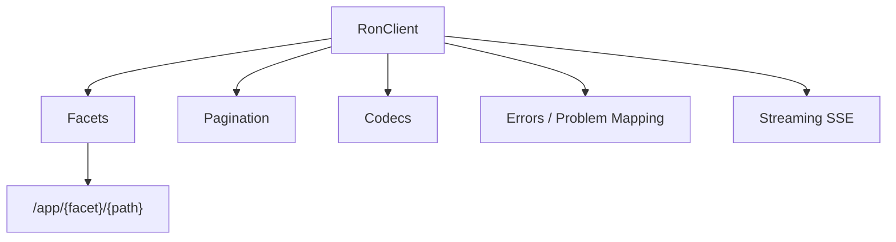
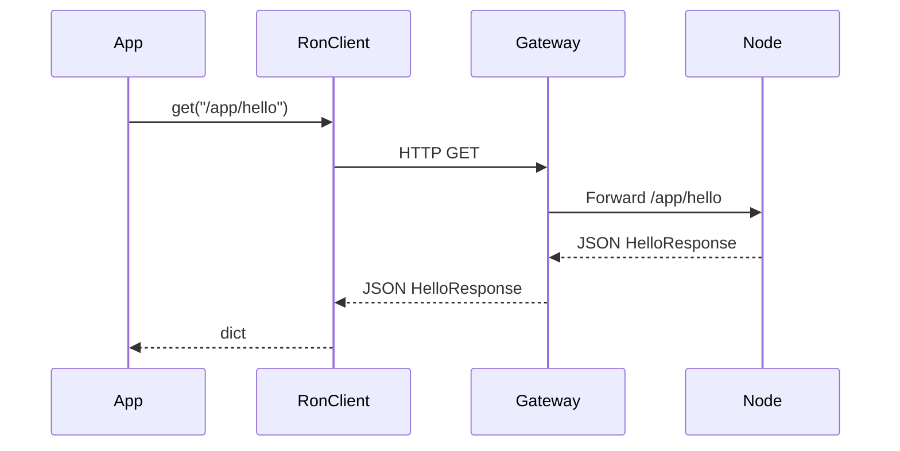
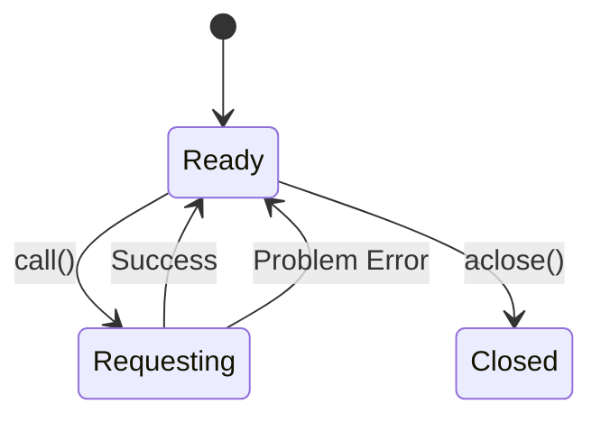

<!-- Generated by scripts/make_sdk_codex.sh on 2025-11-24T01:24:45Z -->
# Code Bundle — SDK `ron-app-sdk-py`

> Generated for review/sharing. Source of truth remains the repo.
> Includes all non-Markdown files under sdk/ron-app-sdk-py.
> Skips node_modules, dist, coverage, .git, virtualenvs, caches, and common junk files.

## Table of Contents
- [sdk/ron-app-sdk-py/.editorconfig](#sdk-ron-app-sdk-py--editorconfig)
- [sdk/ron-app-sdk-py/.gitignore](#sdk-ron-app-sdk-py--gitignore)
- [sdk/ron-app-sdk-py/.ruff.toml](#sdk-ron-app-sdk-py--ruff-toml)
- [sdk/ron-app-sdk-py/LICENSE-APACHE](#sdk-ron-app-sdk-py-LICENSE-APACHE)
- [sdk/ron-app-sdk-py/LICENSE-MIT](#sdk-ron-app-sdk-py-LICENSE-MIT)
- [sdk/ron-app-sdk-py/docs/arch.mmd](#sdk-ron-app-sdk-py-docs-arch-mmd)
- [sdk/ron-app-sdk-py/docs/arch.svg](#sdk-ron-app-sdk-py-docs-arch-svg)
- [sdk/ron-app-sdk-py/docs/sequence_call.mmd](#sdk-ron-app-sdk-py-docs-sequencecall-mmd)
- [sdk/ron-app-sdk-py/docs/sequence_call.svg](#sdk-ron-app-sdk-py-docs-sequencecall-svg)
- [sdk/ron-app-sdk-py/docs/state_client.mmd](#sdk-ron-app-sdk-py-docs-stateclient-mmd)
- [sdk/ron-app-sdk-py/docs/state_client.svg](#sdk-ron-app-sdk-py-docs-stateclient-svg)
- [sdk/ron-app-sdk-py/examples/__init__.py](#sdk-ron-app-sdk-py-examples-init-py)
- [sdk/ron-app-sdk-py/examples/hello_async.py](#sdk-ron-app-sdk-py-examples-helloasync-py)
- [sdk/ron-app-sdk-py/examples/hello_sync.py](#sdk-ron-app-sdk-py-examples-hellosync-py)
- [sdk/ron-app-sdk-py/examples/list_paginated_items.py](#sdk-ron-app-sdk-py-examples-listpaginateditems-py)
- [sdk/ron-app-sdk-py/examples/watch_events_async.py](#sdk-ron-app-sdk-py-examples-watcheventsasync-py)
- [sdk/ron-app-sdk-py/mypy.ini](#sdk-ron-app-sdk-py-mypy-ini)
- [sdk/ron-app-sdk-py/pyproject.toml](#sdk-ron-app-sdk-py-pyproject-toml)
- [sdk/ron-app-sdk-py/ron_app_sdk_py/__init__.py](#sdk-ron-app-sdk-py-ronappsdkpy-init-py)
- [sdk/ron-app-sdk-py/ron_app_sdk_py/_types.py](#sdk-ron-app-sdk-py-ronappsdkpy-types-py)
- [sdk/ron-app-sdk-py/ron_app_sdk_py/_version.py](#sdk-ron-app-sdk-py-ronappsdkpy-version-py)
- [sdk/ron-app-sdk-py/ron_app_sdk_py/client.py](#sdk-ron-app-sdk-py-ronappsdkpy-client-py)
- [sdk/ron-app-sdk-py/ron_app_sdk_py/client_sync.py](#sdk-ron-app-sdk-py-ronappsdkpy-clientsync-py)
- [sdk/ron-app-sdk-py/ron_app_sdk_py/codecs.py](#sdk-ron-app-sdk-py-ronappsdkpy-codecs-py)
- [sdk/ron-app-sdk-py/ron_app_sdk_py/config.py](#sdk-ron-app-sdk-py-ronappsdkpy-config-py)
- [sdk/ron-app-sdk-py/ron_app_sdk_py/errors.py](#sdk-ron-app-sdk-py-ronappsdkpy-errors-py)
- [sdk/ron-app-sdk-py/ron_app_sdk_py/facets.py](#sdk-ron-app-sdk-py-ronappsdkpy-facets-py)
- [sdk/ron-app-sdk-py/ron_app_sdk_py/logging_.py](#sdk-ron-app-sdk-py-ronappsdkpy-logging-py)
- [sdk/ron-app-sdk-py/ron_app_sdk_py/metrics.py](#sdk-ron-app-sdk-py-ronappsdkpy-metrics-py)
- [sdk/ron-app-sdk-py/ron_app_sdk_py/models.py](#sdk-ron-app-sdk-py-ronappsdkpy-models-py)
- [sdk/ron-app-sdk-py/ron_app_sdk_py/pagination.py](#sdk-ron-app-sdk-py-ronappsdkpy-pagination-py)
- [sdk/ron-app-sdk-py/ron_app_sdk_py/streaming.py](#sdk-ron-app-sdk-py-ronappsdkpy-streaming-py)
- [sdk/ron-app-sdk-py/tests/__init__.py](#sdk-ron-app-sdk-py-tests-init-py)
- [sdk/ron-app-sdk-py/tests/chaos/__init__.py](#sdk-ron-app-sdk-py-tests-chaos-init-py)
- [sdk/ron-app-sdk-py/tests/chaos/test_streaming_disconnects.py](#sdk-ron-app-sdk-py-tests-chaos-teststreamingdisconnects-py)
- [sdk/ron-app-sdk-py/tests/chaos/test_timeouts_and_retries_toxiproxy.py](#sdk-ron-app-sdk-py-tests-chaos-testtimeoutsandretriestoxiproxy-py)
- [sdk/ron-app-sdk-py/tests/integration/__init__.py](#sdk-ron-app-sdk-py-tests-integration-init-py)
- [sdk/ron-app-sdk-py/tests/integration/test_app_hello_roundtrip.py](#sdk-ron-app-sdk-py-tests-integration-testapphelloroundtrip-py)
- [sdk/ron-app-sdk-py/tests/integration/test_healthz_readyz.py](#sdk-ron-app-sdk-py-tests-integration-testhealthzreadyz-py)
- [sdk/ron-app-sdk-py/tests/integration/test_pagination_roundtrip.py](#sdk-ron-app-sdk-py-tests-integration-testpaginationroundtrip-py)
- [sdk/ron-app-sdk-py/tests/property/__init__.py](#sdk-ron-app-sdk-py-tests-property-init-py)
- [sdk/ron-app-sdk-py/tests/property/test_error_parsing_fuzz.py](#sdk-ron-app-sdk-py-tests-property-testerrorparsingfuzz-py)
- [sdk/ron-app-sdk-py/tests/property/test_idempotency_keys_hypothesis.py](#sdk-ron-app-sdk-py-tests-property-testidempotencykeyshypothesis-py)
- [sdk/ron-app-sdk-py/tests/unit/__init__.py](#sdk-ron-app-sdk-py-tests-unit-init-py)
- [sdk/ron-app-sdk-py/tests/unit/test_client_basic.py](#sdk-ron-app-sdk-py-tests-unit-testclientbasic-py)
- [sdk/ron-app-sdk-py/tests/unit/test_codecs.py](#sdk-ron-app-sdk-py-tests-unit-testcodecs-py)
- [sdk/ron-app-sdk-py/tests/unit/test_config_env.py](#sdk-ron-app-sdk-py-tests-unit-testconfigenv-py)
- [sdk/ron-app-sdk-py/tests/unit/test_errors_problem.py](#sdk-ron-app-sdk-py-tests-unit-testerrorsproblem-py)
- [sdk/ron-app-sdk-py/tests/unit/test_facets_basic.py](#sdk-ron-app-sdk-py-tests-unit-testfacetsbasic-py)
- [sdk/ron-app-sdk-py/tests/unit/test_models.py](#sdk-ron-app-sdk-py-tests-unit-testmodels-py)
- [sdk/ron-app-sdk-py/tests/unit/test_pagination.py](#sdk-ron-app-sdk-py-tests-unit-testpagination-py)
- [sdk/ron-app-sdk-py/tests/unit/test_security_headers.py](#sdk-ron-app-sdk-py-tests-unit-testsecurityheaders-py)

### sdk/ron-app-sdk-py/.editorconfig
<a id="sdk-ron-app-sdk-py--editorconfig"></a>

```
root = true

[*]
charset = utf-8
end_of_line = lf
insert_final_newline = true
indent_style = space
indent_size = 4
trim_trailing_whitespace = true

[*.md]
max_line_length = off

```

### sdk/ron-app-sdk-py/.gitignore
<a id="sdk-ron-app-sdk-py--gitignore"></a>

```
__pycache__/
*.pyc
*.pyo
*.pyd
*.egg-info/
dist/
build/
.venv/
.mypy_cache/
.pytest_cache/
.cache/

```

### sdk/ron-app-sdk-py/.ruff.toml
<a id="sdk-ron-app-sdk-py--ruff-toml"></a>

```toml
line-length = 100
target-version = "py311"

[lint]
select = ["E", "F", "W", "B"]
ignore = []

[format]
quote-style = "double"

```

### sdk/ron-app-sdk-py/LICENSE-APACHE
<a id="sdk-ron-app-sdk-py-LICENSE-APACHE"></a>

```

```

### sdk/ron-app-sdk-py/LICENSE-MIT
<a id="sdk-ron-app-sdk-py-LICENSE-MIT"></a>

```

```

### sdk/ron-app-sdk-py/docs/arch.mmd
<a id="sdk-ron-app-sdk-py-docs-arch-mmd"></a>



### sdk/ron-app-sdk-py/docs/arch.svg
<a id="sdk-ron-app-sdk-py-docs-arch-svg"></a>

```
<svg xmlns="http://www.w3.org/2000/svg" width="200" height="50">
  <text x="10" y="25">ron-app-sdk-py architecture</text>
</svg>

```

### sdk/ron-app-sdk-py/docs/sequence_call.mmd
<a id="sdk-ron-app-sdk-py-docs-sequencecall-mmd"></a>



### sdk/ron-app-sdk-py/docs/sequence_call.svg
<a id="sdk-ron-app-sdk-py-docs-sequencecall-svg"></a>

```
<svg xmlns="http://www.w3.org/2000/svg" width="200" height="50">
  <text x="10" y="25">ron-app-sdk-py architecture</text>
</svg>

```

### sdk/ron-app-sdk-py/docs/state_client.mmd
<a id="sdk-ron-app-sdk-py-docs-stateclient-mmd"></a>



### sdk/ron-app-sdk-py/docs/state_client.svg
<a id="sdk-ron-app-sdk-py-docs-stateclient-svg"></a>

```
<svg xmlns="http://www.w3.org/2000/svg" width="200" height="50">
  <text x="10" y="25">ron-app-sdk-py architecture</text>
</svg>

```

### sdk/ron-app-sdk-py/examples/__init__.py
<a id="sdk-ron-app-sdk-py-examples-init-py"></a>

```python
"""
Example scripts for ron-app-sdk-py.

These are not imported by the library at runtime; they are just
reference snippets for app developers.
"""

```

### sdk/ron-app-sdk-py/examples/hello_async.py
<a id="sdk-ron-app-sdk-py-examples-helloasync-py"></a>

```python
from __future__ import annotations

import asyncio

from ron_app_sdk_py import RonClient, ClientConfig


async def main() -> None:
    cfg = ClientConfig(
        base_url="http://localhost:8080",
        allow_insecure_http=True,
        token=None,
    )
    client = RonClient(config=cfg)

    resp = await client.get("/app/hello")
    print("hello async:", resp)

    await client.aclose()


if __name__ == "__main__":
    asyncio.run(main())

```

### sdk/ron-app-sdk-py/examples/hello_sync.py
<a id="sdk-ron-app-sdk-py-examples-hellosync-py"></a>

```python
from __future__ import annotations

from ron_app_sdk_py import RonClientSync, ClientConfig


def main() -> None:
    cfg = ClientConfig(
        base_url="http://localhost:8080",
        allow_insecure_http=True,
        token=None,
    )

    client = RonClientSync(config=cfg)
    resp = client.get("/app/hello")
    print("hello sync:", resp)
    client.close()


if __name__ == "__main__":
    main()

```

### sdk/ron-app-sdk-py/examples/list_paginated_items.py
<a id="sdk-ron-app-sdk-py-examples-listpaginateditems-py"></a>

```python
from __future__ import annotations

import asyncio

from ron_app_sdk_py import RonClient, ClientConfig, iter_pages


async def main() -> None:
    cfg = ClientConfig(
        base_url="http://localhost:8080",
        allow_insecure_http=True,
    )
    client = RonClient(config=cfg)

    async for page in iter_pages(client, "/app/items", page_size=25):
        print("Page:", page.items)

    await client.aclose()


if __name__ == "__main__":
    asyncio.run(main())

```

### sdk/ron-app-sdk-py/examples/watch_events_async.py
<a id="sdk-ron-app-sdk-py-examples-watcheventsasync-py"></a>

```python
from __future__ import annotations

import asyncio

from ron_app_sdk_py import RonClient, ClientConfig
from ron_app_sdk_py.streaming import sse_event_stream


async def main() -> None:
    cfg = ClientConfig(
        base_url="http://localhost:8080",
        allow_insecure_http=True,
    )
    client = RonClient(config=cfg)

    async for event in sse_event_stream(client._client, "/app/events"):
        print("EVENT:", event.json_data())


if __name__ == "__main__":
    asyncio.run(main())

```

### sdk/ron-app-sdk-py/mypy.ini
<a id="sdk-ron-app-sdk-py-mypy-ini"></a>

```
[mypy]
python_version = 3.11
warn_unused_configs = True
disallow_untyped_defs = True
disallow_incomplete_defs = True
check_untyped_defs = True
no_implicit_optional = True
warn_return_any = True
warn_unused_ignores = True

```

### sdk/ron-app-sdk-py/pyproject.toml
<a id="sdk-ron-app-sdk-py-pyproject-toml"></a>

```toml
[build-system]
requires = ["setuptools>=68", "wheel"]
build-backend = "setuptools.build_meta"

[project]
name = "ron-app-sdk-py"
version = "0.1.0"
description = "Python App SDK for RON-CORE"
readme = "README.md"
requires-python = ">=3.11"
license = { text = "MIT OR Apache-2.0" }
authors = [
  { name = "Stevan White", email = "n/a" }
]

dependencies = [
  "httpx>=0.27.0",
  "pydantic>=2.8.0",
]

[project.optional-dependencies]
dev = [
  "pytest",
  "pytest-asyncio",
  "pytest-benchmark",
  "hypothesis",
  "tox",
  "ruff",
  "black",
  "mypy",
  "pip-audit",
]

[tool.setuptools.package-dir]
"" = "."

[tool.setuptools.packages.find]
where = ["."]
include = ["ron_app_sdk_py*"]

```

### sdk/ron-app-sdk-py/ron_app_sdk_py/__init__.py
<a id="sdk-ron-app-sdk-py-ronappsdkpy-init-py"></a>

```python
from __future__ import annotations

from ._version import __version__
from .client import RonClient
from .client_sync import RonClientSync
from .config import ClientConfig
from .errors import (
    Problem,
    RonAuthError,
    RonConfigError,
    RonError,
    RonNetworkError,
    RonParseError,
    RonProblemError,
    RonTimeoutError,
)
from .pagination import Page, iter_pages

__all__ = [
    "__version__",
    "ClientConfig",
    "RonClient",
    "RonClientSync",
    "Problem",
    "RonError",
    "RonProblemError",
    "RonNetworkError",
    "RonAuthError",
    "RonTimeoutError",
    "RonConfigError",
    "RonParseError",
    "Page",
    "iter_pages",
]

```

### sdk/ron-app-sdk-py/ron_app_sdk_py/_types.py
<a id="sdk-ron-app-sdk-py-ronappsdkpy-types-py"></a>

```python
"""
Internal shared typing helpers for ron-app-sdk-py.

These keep the rest of the package imports light and avoid circular imports.
"""

from __future__ import annotations

from typing import Dict, Mapping, MutableMapping, Protocol, Union

# Generic JSON value used in response bodies
JsonValue = Union[
    str,
    int,
    float,
    bool,
    None,
    "JsonDict",
    "JsonList",
]

JsonDict = Dict[str, JsonValue]
JsonList = list[JsonValue]

# Narrower scalar type used for query parameters
QueryValue = Union[str, int, float, bool, None]
QueryParams = Mapping[str, QueryValue]

MutableHeaders = MutableMapping[str, str]


class TokenProvider(Protocol):
    """Callable that returns an access token string (e.g., macaroon or bearer).

    This can be implemented by the caller to refresh tokens on demand.
    """

    def __call__(self) -> str:  # pragma: no cover - protocol signature
        ...


__all__ = [
    "JsonValue",
    "JsonDict",
    "JsonList",
    "QueryValue",
    "QueryParams",
    "MutableHeaders",
    "TokenProvider",
]

```

### sdk/ron-app-sdk-py/ron_app_sdk_py/_version.py
<a id="sdk-ron-app-sdk-py-ronappsdkpy-version-py"></a>

```python
"""Package version for ron-app-sdk-py."""

__all__ = ["__version__"]

# Keep this in sync with pyproject.toml
__version__ = "0.1.0"

```

### sdk/ron-app-sdk-py/ron_app_sdk_py/client.py
<a id="sdk-ron-app-sdk-py-ronappsdkpy-client-py"></a>

```python
"""
Async client for talking to RON-CORE via svc-gateway.

RO:WHAT
    RonClient is the async-first HTTP client used by apps and tests.

RO:WHY
    - Centralize retries, timeouts, auth headers, and Problem parsing.
    - Provide a small, stable surface for polyglot SDKs to mirror.

RO:INVARIANTS
    - Structured errors only (Problem envelopes for 4xx/5xx where possible).
    - No unbounded retries; only idempotent ops get bounded backoff.
    - Response size is capped by max_response_bytes in ClientConfig.
"""

from __future__ import annotations

import asyncio
import logging
import random
import time
import uuid
from typing import Any, AsyncIterator, Dict, Optional

import httpx

from .config import ClientConfig
from .errors import (
    Problem,
    RonAuthError,
    RonConfigError,
    RonNetworkError,
    RonParseError,
    RonProblemError,
    RonTimeoutError,
)
from ._types import JsonDict, QueryParams, TokenProvider
from .logging_ import get_logger, log_request, log_response
from .metrics import RequestMetrics

__all__ = ["RonClient"]

_LOGGER = logging.getLogger(__name__)


class RonClient:
    """Async-first HTTP client for talking to RON-CORE via svc-gateway."""

    def __init__(
        self,
        *,
        config: Optional[ClientConfig] = None,
        base_url: Optional[str] = None,
        token: Optional[str] = None,
        token_provider: Optional[TokenProvider] = None,
        client: Optional[httpx.AsyncClient] = None,
    ) -> None:
        if config is None:
            config = ClientConfig.from_env()

        if base_url is not None:
            config = config.with_overrides(base_url=base_url)

        if token is not None and config.token is None:
            # Import locally so config.py can be imported without pydantic,
            # but we already depend on pydantic so this is cheap.
            from pydantic import SecretStr

            config = config.with_overrides(token=SecretStr(token))

        self._config: ClientConfig = config
        self._token_provider: Optional[TokenProvider] = token_provider
        self._client = client or httpx.AsyncClient(
            base_url=config.base_url,
            timeout=config.to_httpx_timeout(),
            verify=config.httpx_verify_arg(),
        )
        self._semaphore: Optional[asyncio.Semaphore] = (
            asyncio.Semaphore(config.max_concurrency)
            if config.max_concurrency and config.max_concurrency > 0
            else None
        )
        self._closed = False

        # Per-client logger and metrics, kept lightweight and opt-in.
        self._logger = get_logger()
        self._metrics = RequestMetrics()

        if (
            not config.allow_insecure_http
            and self._config.base_url.startswith("http://")
        ):
            raise RonConfigError(
                "Insecure HTTP base_url used without allow_insecure_http=True. "
                "For production nodes, always use HTTPS."
            )

    @classmethod
    def from_env(cls, **kwargs: Any) -> "RonClient":
        """Construct a client using ClientConfig.from_env()."""
        cfg = ClientConfig.from_env()
        return cls(config=cfg, **kwargs)

    @property
    def config(self) -> ClientConfig:
        """Return the current client configuration."""
        return self._config

    @property
    def metrics(self) -> RequestMetrics:
        """Return the per-client metrics object."""
        return self._metrics

    async def aclose(self) -> None:
        """Close underlying connections and best-effort zeroize caps."""
        if self._closed:
            return
        self._closed = True

        await self._client.aclose()

        # best-effort zeroize: drop references to caps/token provider
        if self._config.token is not None:
            self._config = self._config.with_overrides(token=None)
        self._token_provider = None

    def close(self) -> None:
        """Synchronous close helper for convenience."""
        asyncio.run(self.aclose())

    # ------------------------------------------------------------------ #
    # Public request helpers                                             #
    # ------------------------------------------------------------------ #

    async def get(self, path: str, *, query: Optional[QueryParams] = None) -> JsonDict:
        return await self.call("GET", path, query=query)

    async def post(
        self,
        path: str,
        *,
        json: Optional[JsonDict] = None,
        query: Optional[QueryParams] = None,
        idem: bool = False,
    ) -> JsonDict:
        return await self.call("POST", path, json=json, query=query, idem=idem)

    async def put(
        self,
        path: str,
        *,
        json: Optional[JsonDict] = None,
        query: Optional[QueryParams] = None,
        idem: bool = False,
    ) -> JsonDict:
        return await self.call("PUT", path, json=json, query=query, idem=idem)

    async def delete(
        self,
        path: str,
        *,
        query: Optional[QueryParams] = None,
        idem: bool = False,
    ) -> JsonDict:
        return await self.call("DELETE", path, query=query, idem=idem)

    async def call(
        self,
        method: str,
        path: str,
        *,
        json: Optional[JsonDict] = None,
        query: Optional[QueryParams] = None,
        idem: bool = False,
    ) -> JsonDict:
        """Low-level call primitive with basic retries and error mapping."""
        method = method.upper()
        is_idempotent = method in ("GET", "HEAD", "OPTIONS") or idem

        if is_idempotent and self._config.max_retries > 0:
            return await self._request_with_retries(
                method=method,
                path=path,
                json=json,
                query=query,
                idem=idem,
            )

        return await self._request_once(
            method=method,
            path=path,
            json=json,
            query=query,
            idem=idem,
        )

    # ------------------------------------------------------------------ #
    # Internal helpers                                                   #
    # ------------------------------------------------------------------ #

    def _current_token(self) -> Optional[str]:
        token: Optional[str] = None

        if self._token_provider is not None:
            try:
                token = self._token_provider()
            except Exception as exc:  # noqa: BLE001
                _LOGGER.exception("token_provider raised an error: %s", exc)
                raise RonConfigError("token_provider callable raised an error") from exc

        if token is None and self._config.token is not None:
            token = self._config.token.get_secret_value()

        return token

    def _build_headers(self, *, idem: bool) -> Dict[str, str]:
        headers: Dict[str, str] = {}

        token = self._current_token()
        if token:
            headers["Authorization"] = f"Bearer {token}"

        # Correlation ID for tracing; safe to log
        headers["X-Request-Id"] = uuid.uuid4().hex

        if idem:
            headers["Idempotency-Key"] = str(uuid.uuid4())

        return headers

    def _record_metrics_and_log(
        self,
        *,
        method: str,
        path: str,
        headers: Dict[str, str],
        status_code: int,
        elapsed_ms: float,
    ) -> None:
        """Record per-request metrics and emit a log line."""
        request_id = headers.get("X-Request-Id") or headers.get("x-request-id")
        idempotency_key = headers.get("Idempotency-Key") or headers.get(
            "idempotency-key"
        )

        if self._metrics is not None:
            if status_code >= 400:
                self._metrics.record_error(
                    method=method,
                    path=path,
                    status_code=status_code,
                    elapsed_ms=elapsed_ms,
                )
            else:
                self._metrics.record_success(
                    method=method,
                    path=path,
                    status_code=status_code,
                    elapsed_ms=elapsed_ms,
                )

        log_response(
            self._logger,
            method=method,
            path=path,
            status_code=status_code,
            elapsed_ms=elapsed_ms,
            request_id=request_id,
            idempotency_key=idempotency_key,
        )

    async def _request_with_retries(
        self,
        *,
        method: str,
        path: str,
        json: Optional[JsonDict],
        query: Optional[QueryParams],
        idem: bool,
    ) -> JsonDict:
        attempts = self._config.max_retries + 1
        last_error: Optional[Exception] = None

        for attempt in range(1, attempts + 1):
            try:
                return await self._request_once(
                    method=method,
                    path=path,
                    json=json,
                    query=query,
                    idem=idem,
                )
            except (RonTimeoutError, RonNetworkError) as exc:
                last_error = exc
                if attempt >= attempts:
                    raise

                # Jittered exponential backoff
                base = 0.2 * (2 ** (attempt - 1))
                jitter = random.uniform(0.0, 0.2)
                await asyncio.sleep(base + jitter)

        # Should not reach here
        assert last_error is not None
        raise last_error

    async def _request_once(
        self,
        *,
        method: str,
        path: str,
        json: Optional[JsonDict],
        query: Optional[QueryParams],
        idem: bool,
    ) -> JsonDict:
        if self._closed:
            raise RonConfigError("RonClient is closed")

        headers = self._build_headers(idem=idem)

        # Log outbound request (headers are redacted by logging_ helpers)
        log_request(self._logger, method=method, path=path, headers=headers)

        if self._semaphore is None:
            return await self._send_request(
                method=method,
                path=path,
                headers=headers,
                json=json,
                query=query,
            )

        async with self._semaphore:
            return await self._send_request(
                method=method,
                path=path,
                headers=headers,
                json=json,
                query=query,
            )

    async def _send_request(
        self,
        *,
        method: str,
        path: str,
        headers: Dict[str, str],
        json: Optional[JsonDict],
        query: Optional[QueryParams],
    ) -> JsonDict:
        start = time.perf_counter()

        try:
            response = await self._client.request(
                method,
                path,
                headers=headers,
                json=json,
                params=query,
            )
        except httpx.TimeoutException as exc:
            # Timeout is treated as a transient error for metrics purposes.
            if self._metrics is not None:
                self._metrics.record_timeout(method=method, path=path)
            raise RonTimeoutError("Request timed out") from exc
        except httpx.RequestError as exc:
            # Network-level failure (DNS/TLS/socket).
            if self._metrics is not None:
                self._metrics.record_network_error(method=method, path=path)
            raise RonNetworkError(
                "Network error while calling RON-CORE node"
            ) from exc

        elapsed_ms = (time.perf_counter() - start) * 1000.0
        status = response.status_code

        # Response size guard
        if (
            self._config.max_response_bytes is not None
            and len(response.content) > self._config.max_response_bytes
        ):
            if self._metrics is not None:
                self._metrics.record_network_error(method=method, path=path)
            raise RonNetworkError(
                f"Response exceeded max_response_bytes={self._config.max_response_bytes}"
            )

        # From here down, we have a valid response body; update metrics + logs
        self._record_metrics_and_log(
            method=method,
            path=path,
            headers=headers,
            status_code=status,
            elapsed_ms=elapsed_ms,
        )

        if status in (401, 403):
            raise RonAuthError(f"Auth failed with status {status}")

        if status >= 400:
            # Attempt to parse canonical Problem envelope
            try:
                data = response.json()
            except ValueError as exc:  # noqa: TRY003
                raise RonParseError(
                    "Failed to parse error response as JSON"
                ) from exc

            try:
                problem = Problem.model_validate(data)
            except Exception as exc:  # noqa: BLE001
                raise RonParseError("Failed to parse Problem envelope") from exc

            raise RonProblemError(problem, status)

        if status == 204:
            return {}

        try:
            data = response.json()
        except ValueError as exc:
            raise RonParseError("Failed to parse response JSON") from exc

        if not isinstance(data, dict):
            # For now, wrap non-dict JSON so callers still have a dict
            return {"value": data}

        return data

    # ------------------------------------------------------------------ #
    # Streaming (MVP stub)                                               #
    # ------------------------------------------------------------------ #

    async def subscribe(
        self,
        path: str,
        *,
        query: Optional[QueryParams] = None,
    ) -> AsyncIterator[JsonDict]:
        """Placeholder for SSE-style streaming.

        Future work will implement:

            async for event in client.subscribe("/app/events"):
                ...

        For now this is a stub so the surface exists but clearly unsupported.
        """
        raise NotImplementedError("Streaming/subscribe is not implemented yet")

```

### sdk/ron-app-sdk-py/ron_app_sdk_py/client_sync.py
<a id="sdk-ron-app-sdk-py-ronappsdkpy-clientsync-py"></a>

```python
"""
Synchronous wrapper for RonClient.

RO:WHAT
    RonClientSync wraps the async RonClient with blocking helpers.

RO:WHY
    - Make it easy to call nodes from small scripts / CLIs without async.
    - Keep the surface parallel to the async client for DX.

RO:INVARIANTS
    - Uses asyncio.run per call (simple, not tuned for high QPS).
    - For services, prefer the async RonClient directly.
"""

from __future__ import annotations

import asyncio
from typing import Optional

from ._types import JsonDict, QueryParams
from .client import RonClient

__all__ = ["RonClientSync"]


class RonClientSync:
    """Simple synchronous wrapper around :class:`RonClient`."""

    def __init__(
        self,
        *,
        base_url: Optional[str] = None,
        token: Optional[str] = None,
    ) -> None:
        self._client = RonClient(base_url=base_url, token=token)

    @classmethod
    def from_env(cls) -> "RonClientSync":
        """Construct a sync client using env-based defaults."""
        # RonClient() with no explicit config delegates to ClientConfig.from_env(),
        # so this keeps semantics aligned with the async client.
        return cls()

    def close(self) -> None:
        asyncio.run(self._client.aclose())

    def get(self, path: str, *, query: Optional[QueryParams] = None) -> JsonDict:
        return asyncio.run(self._client.get(path, query=query))

    def post(
        self,
        path: str,
        *,
        json: Optional[JsonDict] = None,
        query: Optional[QueryParams] = None,
        idem: bool = False,
    ) -> JsonDict:
        return asyncio.run(
            self._client.post(path, json=json, query=query, idem=idem)
        )

    def put(
        self,
        path: str,
        *,
        json: Optional[JsonDict] = None,
        query: Optional[QueryParams] = None,
        idem: bool = False,
    ) -> JsonDict:
        return asyncio.run(
            self._client.put(path, json=json, query=query, idem=idem)
        )

    def delete(
        self,
        path: str,
        *,
        query: Optional[QueryParams] = None,
        idem: bool = False,
    ) -> JsonDict:
        return asyncio.run(
            self._client.delete(path, query=query, idem=idem)
        )

    def call(
        self,
        method: str,
        path: str,
        *,
        json: Optional[JsonDict] = None,
        query: Optional[QueryParams] = None,
        idem: bool = False,
    ) -> JsonDict:
        return asyncio.run(
            self._client.call(
                method=method,
                path=path,
                json=json,
                query=query,
                idem=idem,
            )
        )

```

### sdk/ron-app-sdk-py/ron_app_sdk_py/codecs.py
<a id="sdk-ron-app-sdk-py-ronappsdkpy-codecs-py"></a>

```python
from __future__ import annotations

from datetime import datetime, timezone
import base64

"""
Small codec utilities for ron-app-sdk-py.

RO:WHAT
    Helpers for encoding/decoding common wire-level formats used by RON-CORE:
    - u64 as string in JSON
    - base64url for binary blobs
    - RFC 3339 / ISO-8601 timestamps

RO:WHY
    Keep these details out of client/business logic so apps and tests can share
    a single, well-tested implementation.

RO:INVARIANTS
    - u64 helpers never accept negative values.
    - base64url functions are padding-tolerant on decode.
    - Timestamps are normalized to UTC with a trailing "Z".
"""


__all__ = [
    "u64_to_str",
    "u64_from_str",
    "b64url_encode",
    "b64url_decode",
    "parse_iso8601",
    "format_iso8601",
]


def u64_to_str(value: int) -> str:
    """Encode a Python int as a JSON-friendly u64 string.

    Raises
    ------
    ValueError
        If the value is negative.
    """
    if value < 0:
        raise ValueError("u64 value cannot be negative")
    return str(value)


def u64_from_str(value: str) -> int:
    """Parse a JSON u64 string back into a Python int.

    Raises
    ------
    ValueError
        If the string is empty, not an integer, or represents a negative value.
    """
    if not value:
        raise ValueError("u64 string cannot be empty")

    num = int(value, 10)
    if num < 0:
        raise ValueError("u64 value cannot be negative")
    return num


def b64url_encode(data: bytes) -> str:
    """Encode bytes as URL-safe base64 without padding.

    This matches the usual JWS/JWT-style encoding that omits '=' padding.
    """
    if not isinstance(data, (bytes, bytearray, memoryview)):
        raise TypeError("b64url_encode expects a bytes-like object")

    encoded = base64.urlsafe_b64encode(bytes(data))
    return encoded.rstrip(b"=").decode("ascii")


def b64url_decode(data: str) -> bytes:
    """Decode a URL-safe base64 string (with or without padding)."""
    if not isinstance(data, str):
        raise TypeError("b64url_decode expects a string")

    raw = data.encode("ascii")

    # Pad to multiple of 4 as required by the base64 codec.
    pad_len = (4 - (len(raw) % 4)) % 4
    raw += b"=" * pad_len

    return base64.urlsafe_b64decode(raw)


def parse_iso8601(value: str) -> datetime:
    """Parse a timestamp string into a timezone-aware UTC datetime.

    Accepts the common "Z" suffix (e.g. "2025-01-01T00:00:00Z") and ensures
    the result is timezone-aware in UTC.
    """
    if not isinstance(value, str):
        raise TypeError("parse_iso8601 expects a string")

    # datetime.fromisoformat does not understand "Z", so normalize first.
    normalized = value.replace("Z", "+00:00")
    dt = datetime.fromisoformat(normalized)

    if dt.tzinfo is None:
        dt = dt.replace(tzinfo=timezone.utc)

    return dt.astimezone(timezone.utc)


def format_iso8601(dt: datetime) -> str:
    """Format a datetime as an ISO-8601 string in UTC with a trailing 'Z'."""
    if dt.tzinfo is None:
        dt = dt.replace(tzinfo=timezone.utc)

    dt_utc = dt.astimezone(timezone.utc)
    # Use ISO format then normalize "+00:00" to "Z".
    return dt_utc.isoformat().replace("+00:00", "Z")

```

### sdk/ron-app-sdk-py/ron_app_sdk_py/config.py
<a id="sdk-ron-app-sdk-py-ronappsdkpy-config-py"></a>

```python
"""
Client configuration for ron-app-sdk-py.

RO:WHAT
    ClientConfig encapsulates base URL, timeouts, retries, and TLS options.

RO:WHY
    - Centralize config logic (env vars, defaults, overrides).
    - Keep RonClient construction simple and explicit.

RO:INVARIANTS
    - Explicit arguments override environment variables.
    - When both RON_SDK_GATEWAY_ADDR and RON_APP_URL are set, the gateway addr wins.
    - Base URL may be HTTP in local dev; HTTPS strongly recommended in prod.
"""

from __future__ import annotations

import dataclasses
import os
from dataclasses import dataclass
from typing import Any, Optional, Union

import httpx
from pydantic import SecretStr

__all__ = ["ClientConfig"]


@dataclass
class ClientConfig:
    """Configuration for RonClient / RonClientSync.

    Times are stored in milliseconds to match env vars; the HTTP layer can
    convert to seconds as needed.
    """

    base_url: str
    verify_tls: bool = True
    tls_ca_path: Optional[str] = None

    overall_timeout_ms: int = 10_000
    connect_timeout_ms: int = 3_000
    read_timeout_ms: int = 7_000
    write_timeout_ms: int = 5_000

    max_retries: int = 3
    max_concurrency: Optional[int] = None

    allow_insecure_http: bool = False
    max_response_bytes: int = 16 * 1024 * 1024

    # PQ stub for future hybrid TLS
    tls_pq_mode: str = "off"

    # Optional capability/macaroon (kept in memory, redacted in repr)
    token: Optional[SecretStr] = None

    @classmethod
    def from_env(cls) -> "ClientConfig":
        """Build config from canonical env vars.

        Precedence:
        * RON_SDK_GATEWAY_ADDR (if set)
        * RON_APP_URL
        * fallback http://127.0.0.1:8080
        """
        env = os.environ

        base_url = (
            env.get("RON_SDK_GATEWAY_ADDR")
            or env.get("RON_APP_URL")
            or "http://127.0.0.1:8080"
        )

        overall_timeout_ms = int(env.get("RON_SDK_OVERALL_TIMEOUT_MS", "10000"))
        connect_timeout_ms = int(env.get("RON_SDK_CONNECT_TIMEOUT_MS", "3000"))
        read_timeout_ms = int(env.get("RON_SDK_READ_TIMEOUT_MS", "7000"))
        write_timeout_ms = int(env.get("RON_SDK_WRITE_TIMEOUT_MS", "5000"))

        token_env = env.get("RON_APP_TOKEN")
        token = SecretStr(token_env) if token_env else None

        return cls(
            base_url=base_url,
            overall_timeout_ms=overall_timeout_ms,
            connect_timeout_ms=connect_timeout_ms,
            read_timeout_ms=read_timeout_ms,
            write_timeout_ms=write_timeout_ms,
            token=token,
        )

    def with_overrides(self, **kwargs: Any) -> "ClientConfig":
        """Return a copy of this config with specific fields overridden."""
        data = dataclasses.asdict(self)
        data.update(kwargs)
        return ClientConfig(**data)

    def to_httpx_timeout(self) -> httpx.Timeout:
        """Build an httpx.Timeout instance from ms fields."""
        return httpx.Timeout(
            timeout=self.overall_timeout_ms / 1000.0,
            connect=self.connect_timeout_ms / 1000.0,
            read=self.read_timeout_ms / 1000.0,
            write=self.write_timeout_ms / 1000.0,
        )

    def httpx_verify_arg(self) -> Union[bool, str]:
        """Return the `verify` argument for httpx (bool or CA path).

        This is kept narrow to match httpx.AsyncClient's type expectations.
        """
        if not self.verify_tls:
            return False
        if self.tls_ca_path:
            return self.tls_ca_path
        return True

```

### sdk/ron-app-sdk-py/ron_app_sdk_py/errors.py
<a id="sdk-ron-app-sdk-py-ronappsdkpy-errors-py"></a>

```python
from __future__ import annotations

from typing import Any, Dict, Optional

from pydantic import BaseModel, ConfigDict, Field

__all__ = [
    "Problem",
    "RonError",
    "RonProblemError",
    "RonNetworkError",
    "RonAuthError",
    "RonTimeoutError",
    "RonConfigError",
    "RonParseError",
]


class Problem(BaseModel):
    """Canonical Problem envelope returned by RON-CORE nodes.

    Schema (from SDK_SCHEMA_IDB):

        {
            "code": "string",
            "kind": "string",
            "message": "string",
            "correlation_id": "string?",
            "details": { ... }
        }
    """

    code: str
    message: str
    kind: str
    correlation_id: Optional[str] = None
    details: Dict[str, Any] = Field(default_factory=dict)

    # Ignore unknown fields rather than blowing up if node adds extras
    model_config = ConfigDict(extra="ignore")


class RonError(Exception):
    """Base class for all SDK errors."""


class RonProblemError(RonError):
    """Raised when the node returns a canonical Problem envelope."""

    def __init__(self, problem: Problem, status_code: int) -> None:
        self.problem = problem
        self.status_code = status_code
        super().__init__(f"{problem.code} ({problem.kind}): {problem.message}")


class RonNetworkError(RonError):
    """Network-level error (DNS/TLS/socket failures)."""


class RonAuthError(RonError):
    """Authentication/authorization error (401/403, invalid caps)."""


class RonTimeoutError(RonError):
    """Request exceeded configured timeout."""


class RonConfigError(RonError):
    """Misconfiguration of client or environment."""


class RonParseError(RonError):
    """Response could not be parsed as expected JSON/Problem."""

```

### sdk/ron-app-sdk-py/ron_app_sdk_py/facets.py
<a id="sdk-ron-app-sdk-py-ronappsdkpy-facets-py"></a>

```python
from __future__ import annotations

from typing import Optional, TYPE_CHECKING

from ._types import JsonDict, QueryParams

if TYPE_CHECKING:
    from .client import RonClient  # pragma: no cover

"""
Facet-scoped helpers for ron-app-sdk-py.

RO:WHAT
    Provide a thin, typed wrapper around `RonClient` that prefixes all paths
    with a facet id:

        users = FacetClient(client, "users")
        await users.get("/me")  # -> GET /app/users/me

RO:WHY
    Keep app code from repeating facet segments and "/app" prefixes by hand.

RO:INVARIANTS
    - Facet ids never start with "/" internally (normalized).
    - `path` arguments may be with or without a leading "/".
    - Surface is a thin passthrough over RonClient.get/post/put/delete.
"""

__all__ = [
    "FacetClient",
]


class FacetClient:
    """Facet-scoped client that prefixes all paths with "/app/{facetId}"."""

    def __init__(self, ron: "RonClient", facet_id: str) -> None:
        # Normalize facet id to avoid accidental leading slashes.
        self._ron = ron
        self._facet_id = facet_id.lstrip("/")

    def _build_path(self, path: str) -> str:
        # Normalize path to always have a leading slash.
        if not path:
            suffix = ""
        else:
            suffix = path if path.startswith("/") else f"/{path}"
        return f"/app/{self._facet_id}{suffix}"

    async def get(
        self,
        path: str,
        *,
        query: Optional[QueryParams] = None,
    ) -> JsonDict:
        """Issue a GET against this facet."""
        return await self._ron.get(self._build_path(path), query=query)

    async def post(
        self,
        path: str,
        *,
        json: Optional[JsonDict] = None,
        query: Optional[QueryParams] = None,
        idem: bool = False,
    ) -> JsonDict:
        """Issue a POST against this facet."""
        return await self._ron.post(
            self._build_path(path),
            json=json,
            query=query,
            idem=idem,
        )

    async def put(
        self,
        path: str,
        *,
        json: Optional[JsonDict] = None,
        query: Optional[QueryParams] = None,
        idem: bool = False,
    ) -> JsonDict:
        """Issue a PUT against this facet."""
        return await self._ron.put(
            self._build_path(path),
            json=json,
            query=query,
            idem=idem,
        )

    async def delete(
        self,
        path: str,
        *,
        query: Optional[QueryParams] = None,
    ) -> JsonDict:
        """Issue a DELETE against this facet."""
        return await self._ron.delete(
            self._build_path(path),
            query=query,
        )

```

### sdk/ron-app-sdk-py/ron_app_sdk_py/logging_.py
<a id="sdk-ron-app-sdk-py-ronappsdkpy-logging-py"></a>

```python
from __future__ import annotations

import logging
from typing import Mapping, Optional

"""
Lightweight logging helpers for ron-app-sdk-py.

RO:WHAT
    Small helpers that integrate RonClient with the standard `logging` module
    without forcing any global configuration.

RO:WHY
    - Keep request/response logging consistent across SDKs.
    - Centralize header redaction (never log caps/tokens).

RO:INVARIANTS
    - Never log Authorization/capability headers in plaintext.
    - Safe to call even if logging is disabled or minimally configured.
"""

__all__ = [
    "get_logger",
    "log_request",
    "log_response",
]


def get_logger(name: str = "ron_app_sdk_py.client") -> logging.Logger:
    """Return the default logger used by RonClient.

    The caller is responsible for configuring handlers/formatters as needed.
    """
    return logging.getLogger(name)


def _redact_headers(headers: Mapping[str, str]) -> Mapping[str, str]:
    """Return a redacted copy of headers safe for logging.

    Sensitive values like Authorization / caps are replaced with a placeholder.
    """
    redacted: dict[str, str] = {}
    for key, value in headers.items():
        lower = key.lower()
        if lower in ("authorization", "x-ron-cap", "x-api-key"):
            redacted[key] = "***REDACTED***"
        else:
            redacted[key] = value
    return redacted


def log_request(
    logger: logging.Logger,
    *,
    method: str,
    path: str,
    headers: Mapping[str, str],
) -> None:
    """Log an outbound HTTP request at DEBUG level.

    This is intentionally lightweight; if DEBUG is disabled the cost is minimal.
    """
    if not logger.isEnabledFor(logging.DEBUG):
        return

    safe_headers = _redact_headers(headers)
    request_id = safe_headers.get("X-Request-Id") or safe_headers.get("x-request-id")
    idempotency_key = safe_headers.get("Idempotency-Key") or safe_headers.get(
        "idempotency-key"
    )

    logger.debug(
        "ron-client request %s %s",
        method,
        path,
        extra={
            "request_id": request_id,
            "idempotency_key": idempotency_key,
            "headers": safe_headers,
        },
    )


def log_response(
    logger: logging.Logger,
    *,
    method: str,
    path: str,
    status_code: int,
    elapsed_ms: float,
    request_id: Optional[str] = None,
    idempotency_key: Optional[str] = None,
) -> None:
    """Log an HTTP response at INFO/DEBUG level.

    Callers typically log once per completed request (success or error).
    """
    if not logger.isEnabledFor(logging.INFO):
        return

    logger.info(
        "ron-client response %s %s -> %d in %.1fms",
        method,
        path,
        status_code,
        elapsed_ms,
        extra={
            "request_id": request_id,
            "idempotency_key": idempotency_key,
        },
    )

```

### sdk/ron-app-sdk-py/ron_app_sdk_py/metrics.py
<a id="sdk-ron-app-sdk-py-ronappsdkpy-metrics-py"></a>

```python
from __future__ import annotations

from dataclasses import dataclass
from typing import Dict

"""
In-process request metrics for ron-app-sdk-py.

RO:WHAT
    Tiny, dependency-free counters for RonClient activity.

RO:WHY
    - Give apps a simple way to introspect SDK behavior during tests/dev.
    - Keep the shape close to other language SDKs without pulling in
      Prometheus or heavy exporters.

RO:INVARIANTS
    - No global mutable state; metrics are per-client instance.
    - Safe to ignore entirely if callers do not need metrics.
"""

__all__ = [
    "RequestMetrics",
]


@dataclass
class RequestMetrics:
    """Simple per-client counters for HTTP activity."""

    total_requests: int = 0
    total_errors: int = 0
    total_timeouts: int = 0
    total_network_errors: int = 0

    def record_success(
        self,
        *,
        method: str,
        path: str,
        status_code: int,
        elapsed_ms: float,
    ) -> None:
        # Parameters are currently unused but kept for future expansion
        # and to mirror other SDKs.
        del method, path, status_code, elapsed_ms
        self.total_requests += 1

    def record_error(
        self,
        *,
        method: str,
        path: str,
        status_code: int,
        elapsed_ms: float,
    ) -> None:
        del method, path, status_code, elapsed_ms
        self.total_requests += 1
        self.total_errors += 1

    def record_timeout(self, *, method: str, path: str) -> None:
        del method, path
        self.total_timeouts += 1

    def record_network_error(self, *, method: str, path: str) -> None:
        del method, path
        self.total_network_errors += 1

    def snapshot(self) -> Dict[str, int]:
        """Return a dict snapshot of current counters (useful for tests)."""
        return {
            "total_requests": self.total_requests,
            "total_errors": self.total_errors,
            "total_timeouts": self.total_timeouts,
            "total_network_errors": self.total_network_errors,
        }

```

### sdk/ron-app-sdk-py/ron_app_sdk_py/models.py
<a id="sdk-ron-app-sdk-py-ronappsdkpy-models-py"></a>

```python
from __future__ import annotations

from typing import Any, Dict, Optional
import json
from pydantic import BaseModel, Field

"""
Shared DTOs / models for ron-app-sdk-py.

RO:WHAT
    Typed representations for common app-plane responses that show up in
    examples and high-level helpers (hello, health, events).

RO:WHY
    Keep SDK examples and app code strongly typed without forcing callers
    to hand-roll Pydantic models for the most common shapes.

RO:INVARIANTS
    - Models are backwards-compatible with the TS SDK DTOs.
    - All fields are optional-tolerant where the server might omit them.
"""


__all__ = [
    "HelloResponse",
    "HealthzResponse",
    "ReadyzResponse",
    "Event",
]


class HelloResponse(BaseModel):
    """Simple hello-world response used in examples and smoke tests."""

    message: str = Field(..., description="Human-readable greeting message.")


class HealthzResponse(BaseModel):
    """Shape for /healthz responses exposed by app facets."""

    ok: bool = Field(..., description="Whether the service considers itself healthy.")
    service: str = Field(
        "app",
        description="Service name (usually 'app' or facet identifier).",
    )


class ReadyzResponse(BaseModel):
    """Shape for /readyz responses exposed by app facets."""

    ready: bool = Field(..., description="Whether the service is ready to serve traffic.")
    reason: Optional[str] = Field(
        None,
        description="Optional human-readable reason when not ready.",
    )


class Event(BaseModel):
    """Generic SSE/streaming event envelope.

    This maps closely to the standard EventSource semantics:

    - `id`: event id for at-most-once / resume behavior.
    - `event`: logical event type (e.g. "message", "state-change").
    - `data`: raw event payload as a single string (possibly multi-line).
    - `retry`: optional server hint for reconnection delay (milliseconds).
    """

    id: Optional[str] = None
    event: Optional[str] = None
    data: str
    retry: Optional[int] = None

    def json_data(self) -> Any:
        """Best-effort JSON parse of `data`.

        Returns the parsed JSON value on success; otherwise returns the raw
        string unchanged. This keeps callers from having to wrap try/except
        around every event when most payloads are JSON-encoded.
        """
        try:
            return json.loads(self.data)
        except Exception:
            return self.data

    @property
    def dict_data(self) -> Dict[str, Any]:
        """Convenience accessor for dict-shaped payloads.

        If the underlying data is not a JSON object, this returns an empty
        dict rather than raising.
        """
        parsed = self.json_data()
        if isinstance(parsed, dict):
            return parsed
        return {}

```

### sdk/ron-app-sdk-py/ron_app_sdk_py/pagination.py
<a id="sdk-ron-app-sdk-py-ronappsdkpy-pagination-py"></a>

```python
"""
Pagination helpers for ron-app-sdk-py.

Provides a generic Page[T] container plus an async iterator helper `iter_pages`
that walks a paginated collection endpoint until exhaustion.

This is intentionally minimal for the MVP and aligned with SDK_SCHEMA_IDB:

- The server returns JSON objects of the form:
  {
      "items": [...],
      "next_cursor": "opaque-string-or-null"
  }

- We surface:
  - `Page.items`: the list of items for that page.
  - `Page.next_cursor`: cursor to pass back to the server for the next page.
  - `Page.raw`: the full raw JSON response, in case callers need extra fields.
"""

from __future__ import annotations

from dataclasses import dataclass
from typing import AsyncIterator, Generic, List, Optional, TypeVar, TYPE_CHECKING

from ._types import JsonDict, JsonValue, QueryParams, QueryValue

if TYPE_CHECKING:
    # Imported only for typing; avoids a hard runtime dependency cycle.
    from .client import RonClient

T = TypeVar("T")


@dataclass
class Page(Generic[T]):
    """Generic page of results returned from a paginated endpoint."""

    items: List[T]
    next_cursor: Optional[str] = None
    raw: Optional[JsonDict] = None


__all__ = ["Page", "iter_pages"]


async def iter_pages(
    client: "RonClient",
    path: str,
    *,
    page_size: int = 100,
    query: Optional[QueryParams] = None,
) -> AsyncIterator[Page[JsonDict]]:
    """Iterate over all pages for a paginated endpoint.

    Parameters
    ----------
    client:
        A configured `RonClient` instance.
    path:
        The app-plane path, e.g. "/app/items".
    page_size:
        Page size hint; controls the `limit`/`page_size` query parameter.
    query:
        Optional base query mapping. This will be shallow-copied and extended
        with pagination keys.

    Yields
    ------
    Page[JsonDict]
        A page of JSON objects. The exact item schema is app-dependent.

    Notes
    -----
    This helper assumes a cursor-based contract:

    - The server returns an object with:
      - "items": list
      - "next_cursor": string or null/absent

    - When "next_cursor" is falsy/missing, iteration stops.
    """
    cursor: Optional[str] = None

    while True:
        # Start from the caller's query and add pagination hints.
        params: dict[str, QueryValue] = dict(query or {})
        # Allow either "limit" or "page_size" depending on how the app facet
        # implements pagination. We send both; the server can ignore one.
        params.setdefault("limit", page_size)
        params.setdefault("page_size", page_size)

        if cursor is not None:
            params["cursor"] = cursor

        # We expect `client.get` to return a parsed JSON dict.
        resp: JsonDict = await client.get(path, query=params)

        # Defensive parsing in case the server omits fields.
        raw_items = resp.get("items") or []
        if not isinstance(raw_items, list):
            # Normalize to list to avoid surprising callers.
            raw_items = [raw_items]

        items: list[JsonDict] = []
        for it in raw_items:
            if isinstance(it, dict):
                items.append(it)  # already a JSON object
            else:
                # Wrap scalar/other values in an object for consistency.
                items.append({"value": it})

        next_cursor_value: JsonValue | None = resp.get("next_cursor")
        next_cursor = str(next_cursor_value) if next_cursor_value else None

        page = Page[JsonDict](items=items, next_cursor=next_cursor, raw=resp)
        yield page

        if not next_cursor:
            break

        cursor = next_cursor

```

### sdk/ron-app-sdk-py/ron_app_sdk_py/streaming.py
<a id="sdk-ron-app-sdk-py-ronappsdkpy-streaming-py"></a>

```python
from __future__ import annotations

import asyncio
import random
from typing import AsyncIterator, Awaitable, Callable, Mapping, Optional, TYPE_CHECKING

import httpx

from .models import Event

if TYPE_CHECKING:
    # Imported only for typing to avoid a hard import cycle.
    from .client import RonClient  # pragma: no cover

"""
Streaming (SSE-style) helpers for ron-app-sdk-py.

RO:WHAT
    Utilities for consuming server-sent events (SSE) / streaming responses
    from RON-CORE app-plane endpoints.

RO:WHY
    - Keep SSE framing and reconnect behavior in one place.
    - Allow app code to work with typed `Event` objects instead of raw lines.

RO:INVARIANTS
    - At-most-once delivery from the perspective of the user callback.
    - Reconnects use exponential backoff + jitter when enabled.
    - Caller controls shutdown via an asyncio.Event.
"""


__all__ = [
    "sse_event_stream",
    "subscribe",
]


async def sse_event_stream(
    client: httpx.AsyncClient,
    path: str,
    *,
    headers: Optional[Mapping[str, str]] = None,
    last_event_id: Optional[str] = None,
) -> AsyncIterator[Event]:
    """Yield `Event` objects from an SSE endpoint.

    Parameters
    ----------
    client:
        An `httpx.AsyncClient` instance to use for the streaming request.
    path:
        Request path (e.g. "/app/events").
    headers:
        Optional additional headers. "Accept: text/event-stream" is added
        automatically if missing.
    last_event_id:
        Optional last event id for resume semantics.
    """
    req_headers: dict[str, str] = dict(headers or {})
    req_headers.setdefault("accept", "text/event-stream")
    if last_event_id:
        req_headers["last-event-id"] = last_event_id

    async with client.stream("GET", path, headers=req_headers, timeout=None) as resp:
        resp.raise_for_status()

        field_id: Optional[str] = None
        field_event: Optional[str] = None
        data_lines: list[str] = []
        retry_ms: Optional[int] = None

        async for raw_line in resp.aiter_lines():
            # SSE uses empty line as event delimiter.
            if raw_line == "":
                if data_lines:
                    data = "\n".join(data_lines)
                    yield Event(
                        id=field_id,
                        event=field_event,
                        data=data,
                        retry=retry_ms,
                    )
                # Reset buffers for next event.
                field_id = None
                field_event = None
                data_lines = []
                retry_ms = None
                continue

            if raw_line.startswith(":"):
                # Comment / heartbeat; ignore.
                continue

            # Field: value
            if ":" in raw_line:
                field, value = raw_line.split(":", 1)
                # Strip the single leading space from the value if present.
                if value.startswith(" "):
                    value = value[1:]
            else:
                field = raw_line
                value = ""

            if field == "id":
                field_id = value
            elif field == "event":
                field_event = value
            elif field == "data":
                data_lines.append(value)
            elif field == "retry":
                try:
                    retry_ms = int(value)
                except ValueError:
                    retry_ms = None

        # End-of-stream flush in case server didn't terminate with a blank line.
        if data_lines:
            data = "\n".join(data_lines)
            yield Event(
                id=field_id,
                event=field_event,
                data=data,
                retry=retry_ms,
            )


async def subscribe(
    ron: "RonClient",
    path: str,
    callback: Callable[[Event], Awaitable[None]],
    *,
    stop_event: Optional[asyncio.Event] = None,
    max_retries: Optional[int] = 5,
    initial_backoff: float = 0.5,
    max_backoff: float = 10.0,
) -> None:
    """Subscribe to an SSE endpoint and dispatch events to a callback.

    This helper uses the underlying httpx client held by `RonClient` and
    automatically reconnects with exponential backoff + jitter.
    """
    last_event_id: Optional[str] = None
    attempt = 0

    while True:
        if stop_event is not None and stop_event.is_set():
            return

        try:
            # Use the underlying httpx client to share connection pools.
            httpx_client = ron._client
            async for event in sse_event_stream(
                httpx_client,
                path,
                last_event_id=last_event_id,
            ):
                attempt = 0
                if event.id is not None:
                    last_event_id = event.id
                await callback(event)
        except Exception:
            attempt += 1
            if max_retries is not None and attempt > max_retries:
                raise

            delay = min(initial_backoff * (2 ** (attempt - 1)), max_backoff)
            # Add +/- 50% jitter.
            jitter = random.uniform(0.5 * delay, 1.5 * delay)
            await asyncio.sleep(jitter)
            continue

```

### sdk/ron-app-sdk-py/tests/__init__.py
<a id="sdk-ron-app-sdk-py-tests-init-py"></a>

```python

```

### sdk/ron-app-sdk-py/tests/chaos/__init__.py
<a id="sdk-ron-app-sdk-py-tests-chaos-init-py"></a>

```python

```

### sdk/ron-app-sdk-py/tests/chaos/test_streaming_disconnects.py
<a id="sdk-ron-app-sdk-py-tests-chaos-teststreamingdisconnects-py"></a>

```python

```

### sdk/ron-app-sdk-py/tests/chaos/test_timeouts_and_retries_toxiproxy.py
<a id="sdk-ron-app-sdk-py-tests-chaos-testtimeoutsandretriestoxiproxy-py"></a>

```python

```

### sdk/ron-app-sdk-py/tests/integration/__init__.py
<a id="sdk-ron-app-sdk-py-tests-integration-init-py"></a>

```python

```

### sdk/ron-app-sdk-py/tests/integration/test_app_hello_roundtrip.py
<a id="sdk-ron-app-sdk-py-tests-integration-testapphelloroundtrip-py"></a>

```python

```

### sdk/ron-app-sdk-py/tests/integration/test_healthz_readyz.py
<a id="sdk-ron-app-sdk-py-tests-integration-testhealthzreadyz-py"></a>

```python

```

### sdk/ron-app-sdk-py/tests/integration/test_pagination_roundtrip.py
<a id="sdk-ron-app-sdk-py-tests-integration-testpaginationroundtrip-py"></a>

```python

```

### sdk/ron-app-sdk-py/tests/property/__init__.py
<a id="sdk-ron-app-sdk-py-tests-property-init-py"></a>

```python

```

### sdk/ron-app-sdk-py/tests/property/test_error_parsing_fuzz.py
<a id="sdk-ron-app-sdk-py-tests-property-testerrorparsingfuzz-py"></a>

```python

```

### sdk/ron-app-sdk-py/tests/property/test_idempotency_keys_hypothesis.py
<a id="sdk-ron-app-sdk-py-tests-property-testidempotencykeyshypothesis-py"></a>

```python

```

### sdk/ron-app-sdk-py/tests/unit/__init__.py
<a id="sdk-ron-app-sdk-py-tests-unit-init-py"></a>

```python

```

### sdk/ron-app-sdk-py/tests/unit/test_client_basic.py
<a id="sdk-ron-app-sdk-py-tests-unit-testclientbasic-py"></a>

```python
from __future__ import annotations

import asyncio

import httpx
import pytest

from ron_app_sdk_py import (
    ClientConfig,
    Problem,
    RonAuthError,
    RonClient,
    RonNetworkError,
    RonProblemError,
    RonTimeoutError,
)


def test_client_basic_get_success() -> None:
    async def _run() -> None:
        async def handler(request: httpx.Request) -> httpx.Response:
            assert request.method == "GET"
            assert request.url.path == "/app/hello"
            # Basic "hello" payload
            return httpx.Response(200, json={"message": "hello from test"})

        transport = httpx.MockTransport(handler)
        async_client = httpx.AsyncClient(transport=transport, base_url="https://test")

        cfg = ClientConfig(base_url="https://test")
        client = RonClient(config=cfg, client=async_client)

        try:
            resp = await client.get("/app/hello")
            assert resp == {"message": "hello from test"}
        finally:
            await client.aclose()

    asyncio.run(_run())


def test_client_maps_problem_response_to_ron_problem_error() -> None:
    async def _run() -> None:
        async def handler(request: httpx.Request) -> httpx.Response:
            problem = {
                "code": "internal_error",
                "kind": "internal",
                "message": "Boom",
                "correlation_id": "req-xyz",
                "details": {"foo": "bar"},
            }
            return httpx.Response(500, json=problem)

        transport = httpx.MockTransport(handler)
        async_client = httpx.AsyncClient(transport=transport, base_url="https://test")

        cfg = ClientConfig(base_url="https://test")
        client = RonClient(config=cfg, client=async_client)

        try:
            with pytest.raises(RonProblemError) as excinfo:
                await client.get("/app/hello")

            err = excinfo.value
            assert err.status_code == 500
            assert isinstance(err.problem, Problem)
            assert err.problem.code == "internal_error"
            assert err.problem.details == {"foo": "bar"}
        finally:
            await client.aclose()

    asyncio.run(_run())


def test_client_maps_401_403_to_auth_error() -> None:
    async def _run() -> None:
        async def handler(request: httpx.Request) -> httpx.Response:
            return httpx.Response(401, json={"message": "nope"})

        transport = httpx.MockTransport(handler)
        async_client = httpx.AsyncClient(transport=transport, base_url="https://test")

        cfg = ClientConfig(base_url="https://test")
        client = RonClient(config=cfg, client=async_client)

        try:
            with pytest.raises(RonAuthError):
                await client.get("/app/hello")
        finally:
            await client.aclose()

    asyncio.run(_run())


def test_client_maps_timeout_and_network_errors() -> None:
    async def _run() -> None:
        async def handler_timeout(request: httpx.Request) -> httpx.Response:
            raise httpx.TimeoutException("timeout", request=request)

        async def handler_network(request: httpx.Request) -> httpx.Response:
            raise httpx.RequestError("boom", request=request)

        cfg = ClientConfig(base_url="https://test")

        # Timeout transport
        transport_timeout = httpx.MockTransport(handler_timeout)
        async_client_timeout = httpx.AsyncClient(
            transport=transport_timeout,
            base_url="https://test",
        )
        client_timeout = RonClient(config=cfg, client=async_client_timeout)

        try:
            with pytest.raises(RonTimeoutError):
                await client_timeout.get("/app/hello")
        finally:
            await client_timeout.aclose()

        # Network error transport
        transport_net = httpx.MockTransport(handler_network)
        async_client_net = httpx.AsyncClient(
            transport=transport_net,
            base_url="https://test",
        )
        client_net = RonClient(config=cfg, client=async_client_net)

        try:
            with pytest.raises(RonNetworkError):
                await client_net.get("/app/hello")
        finally:
            await client_net.aclose()

    asyncio.run(_run())

```

### sdk/ron-app-sdk-py/tests/unit/test_codecs.py
<a id="sdk-ron-app-sdk-py-tests-unit-testcodecs-py"></a>

```python
from __future__ import annotations

from datetime import datetime, timezone

from ron_app_sdk_py.codecs import (
    b64url_decode,
    b64url_encode,
    format_iso8601,
    parse_iso8601,
    u64_from_str,
    u64_to_str,
)


def test_u64_roundtrip() -> None:
    value = 12345678901234567890
    s = u64_to_str(value)
    assert s == "12345678901234567890"
    back = u64_from_str(s)
    assert back == value


def test_b64url_roundtrip() -> None:
    payload = b"hello-world"
    encoded = b64url_encode(payload)
    # No padding
    assert "=" not in encoded
    decoded = b64url_decode(encoded)
    assert decoded == payload


def test_iso8601_roundtrip() -> None:
    dt = datetime(2025, 1, 1, 12, 0, 0, tzinfo=timezone.utc)
    s = format_iso8601(dt)
    assert s.endswith("Z")
    parsed = parse_iso8601(s)
    assert parsed == dt

```

### sdk/ron-app-sdk-py/tests/unit/test_config_env.py
<a id="sdk-ron-app-sdk-py-tests-unit-testconfigenv-py"></a>

```python
from __future__ import annotations

import os
from typing import Dict

from ron_app_sdk_py import ClientConfig


def _with_env(env: Dict[str, str]) -> None:
    """Helper to patch os.environ in-place for the duration of a test."""
    os.environ.clear()
    os.environ.update(env)


def test_config_env_defaults() -> None:
    _with_env({})
    cfg = ClientConfig.from_env()

    assert cfg.base_url == "http://127.0.0.1:8080"
    assert cfg.overall_timeout_ms == 10_000
    assert cfg.connect_timeout_ms == 3_000
    assert cfg.read_timeout_ms == 7_000
    assert cfg.write_timeout_ms == 5_000
    # No token by default
    assert cfg.token is None


def test_config_env_app_url() -> None:
    _with_env({"RON_APP_URL": "https://example.com/app"})
    cfg = ClientConfig.from_env()

    assert cfg.base_url == "https://example.com/app"


def test_config_env_gateway_wins_over_app_url() -> None:
    _with_env(
        {
            "RON_APP_URL": "https://example.com/app",
            "RON_SDK_GATEWAY_ADDR": "https://gateway.ron-core.local:9443",
        }
    )
    cfg = ClientConfig.from_env()

    # Gateway addr takes precedence when both are set
    assert cfg.base_url == "https://gateway.ron-core.local:9443"


def test_config_env_timeouts_and_token() -> None:
    _with_env(
        {
            "RON_APP_URL": "https://example.com/app",
            "RON_SDK_OVERALL_TIMEOUT_MS": "12345",
            "RON_SDK_CONNECT_TIMEOUT_MS": "1111",
            "RON_SDK_READ_TIMEOUT_MS": "2222",
            "RON_SDK_WRITE_TIMEOUT_MS": "3333",
            "RON_APP_TOKEN": "cap-abc123",
        }
    )
    cfg = ClientConfig.from_env()

    assert cfg.overall_timeout_ms == 12_345
    assert cfg.connect_timeout_ms == 1_111
    assert cfg.read_timeout_ms == 2_222
    assert cfg.write_timeout_ms == 3_333
    assert cfg.token is not None
    assert cfg.token.get_secret_value() == "cap-abc123"

```

### sdk/ron-app-sdk-py/tests/unit/test_errors_problem.py
<a id="sdk-ron-app-sdk-py-tests-unit-testerrorsproblem-py"></a>

```python
from __future__ import annotations

from ron_app_sdk_py import Problem, RonProblemError


def test_problem_accepts_extra_fields_and_details_default() -> None:
    raw = {
        "code": "internal_error",
        "kind": "internal",
        "message": "Something went boom",
        "correlation_id": "abc123",
        "details": {"foo": "bar"},
        "extra_field": "ignored",
    }

    problem = Problem.model_validate(raw)

    assert problem.code == "internal_error"
    assert problem.kind == "internal"
    assert problem.message == "Something went boom"
    assert problem.correlation_id == "abc123"
    assert problem.details == {"foo": "bar"}
    # The extra field should not raise or appear on the model
    assert not hasattr(problem, "extra_field")


def test_problem_details_default_factory() -> None:
    problem = Problem(code="x", kind="y", message="z")
    assert problem.details == {}


def test_ron_problem_error_string_includes_code_and_message() -> None:
    problem = Problem(
        code="rate_limit",
        kind="client",
        message="Too many requests",
        correlation_id="req-1",
        details={"limit": 10},
    )
    err = RonProblemError(problem, status_code=429)

    s = str(err)
    assert "rate_limit" in s
    assert "Too many requests" in s

```

### sdk/ron-app-sdk-py/tests/unit/test_facets_basic.py
<a id="sdk-ron-app-sdk-py-tests-unit-testfacetsbasic-py"></a>

```python
from __future__ import annotations

import asyncio
from typing import Any, Dict, Optional

from ron_app_sdk_py.facets import FacetClient
from ron_app_sdk_py._types import JsonDict, QueryParams


class _FakeRonClient:
    def __init__(self) -> None:
        self.calls: list[Dict[str, Any]] = []

    async def get(self, path: str, *, query: Optional[QueryParams] = None) -> JsonDict:
        self.calls.append({"method": "GET", "path": path, "query": query})
        return {"ok": True}

    async def post(
        self,
        path: str,
        *,
        json: Any = None,
        query: Optional[QueryParams] = None,
        idem: bool = False,
    ) -> JsonDict:
        self.calls.append(
            {
                "method": "POST",
                "path": path,
                "query": query,
                "json": json,
                "idem": idem,
            }
        )
        return {"ok": True}

    async def delete(
        self,
        path: str,
        *,
        query: Optional[QueryParams] = None,
    ) -> JsonDict:
        self.calls.append({"method": "DELETE", "path": path, "query": query})
        return {"ok": True}


def test_facet_client_prefixes_paths() -> None:
    async def _run() -> None:
        ron = _FakeRonClient()
        users = FacetClient(ron, "users")

        await users.get("/me")
        await users.post("create", json={"name": "alice"}, idem=True)
        await users.delete("old")

        assert len(ron.calls) == 3

        assert ron.calls[0]["method"] == "GET"
        assert ron.calls[0]["path"] == "/app/users/me"

        assert ron.calls[1]["method"] == "POST"
        assert ron.calls[1]["path"] == "/app/users/create"
        assert ron.calls[1]["json"] == {"name": "alice"}
        assert ron.calls[1]["idem"] is True

        assert ron.calls[2]["method"] == "DELETE"
        assert ron.calls[2]["path"] == "/app/users/old"

    asyncio.run(_run())

```

### sdk/ron-app-sdk-py/tests/unit/test_models.py
<a id="sdk-ron-app-sdk-py-tests-unit-testmodels-py"></a>

```python
from __future__ import annotations

from ron_app_sdk_py.models import Event, HelloResponse, HealthzResponse, ReadyzResponse


def test_hello_response_model() -> None:
    obj = HelloResponse(message="hi")
    assert obj.message == "hi"


def test_healthz_readyz_models() -> None:
    h = HealthzResponse(ok=True, service="app")
    assert h.ok is True
    assert h.service == "app"

    r = ReadyzResponse(ready=False, reason="warming up")
    assert r.ready is False
    assert r.reason == "warming up"


def test_event_json_data_and_dict_data() -> None:
    e = Event(id="1", event="update", data='{"foo": 1, "bar": "x"}')
    parsed = e.json_data()
    assert isinstance(parsed, dict)
    assert parsed["foo"] == 1
    assert e.dict_data == {"foo": 1, "bar": "x"}

    # Non-JSON payload falls back to raw string / empty dict.
    e2 = Event(data="not-json")
    assert e2.json_data() == "not-json"
    assert e2.dict_data == {}

```

### sdk/ron-app-sdk-py/tests/unit/test_pagination.py
<a id="sdk-ron-app-sdk-py-tests-unit-testpagination-py"></a>

```python
from __future__ import annotations

import asyncio
from typing import Any, List

import pytest

from ron_app_sdk_py.pagination import Page, iter_pages
from ron_app_sdk_py._types import JsonDict, QueryParams


class FakeClient:
    """Minimal fake client with a `get` method that matches RonClient's surface."""

    def __init__(self, pages: List[JsonDict]) -> None:
        self._pages = pages
        self.calls: int = 0
        self.received_cursors: List[str | None] = []

    async def get(self, path: str, *, query: QueryParams | None = None) -> JsonDict:
        self.calls += 1

        cursor = None
        if query is not None:
            cursor_val: Any | None = query.get("cursor")
            cursor = str(cursor_val) if cursor_val is not None else None

        self.received_cursors.append(cursor)

        # Simple cursor == index scheme for tests
        if cursor is None:
            index = 0
        else:
            index = int(cursor)

        if index >= len(self._pages):
            # Simulate empty final page
            return {"items": [], "next_cursor": None}

        page = dict(self._pages[index])
        # Make next_cursor point to the next index, or None if done.
        if index + 1 < len(self._pages):
            page.setdefault("next_cursor", str(index + 1))
        else:
            page.setdefault("next_cursor", None)
        return page


def test_iter_pages_walks_all_pages() -> None:
    async def _run() -> None:
        pages = [
            {"items": [{"id": 1}, {"id": 2}]},
            {"items": [{"id": 3}]},
        ]
        client = FakeClient(pages)

        collected: list[Page[JsonDict]] = []
        async for page in iter_pages(client, "/app/items", page_size=2):
            collected.append(page)

        # We should have seen both pages
        assert len(collected) == 2
        all_ids = [item["id"] for page in collected for item in page.items]
        assert all_ids == [1, 2, 3]

        # FakeClient should have seen correct cursor progression: [None, "1"]
        assert client.calls == 2
        assert client.received_cursors == [None, "1"]

    asyncio.run(_run())

```

### sdk/ron-app-sdk-py/tests/unit/test_security_headers.py
<a id="sdk-ron-app-sdk-py-tests-unit-testsecurityheaders-py"></a>

```python
from __future__ import annotations

from typing import Optional

from pydantic import SecretStr

from ron_app_sdk_py import ClientConfig, RonClient


def test_build_headers_includes_auth_and_request_id() -> None:
    cfg = ClientConfig(
        base_url="https://test",
        token=SecretStr("cap-123"),
    )
    client = RonClient(config=cfg)

    try:
        # Access the internal helper to verify header shape
        headers = client._build_headers(idem=False)  # type: ignore[attr-defined]

        # Authorization header derived from token
        assert headers.get("Authorization") == "Bearer cap-123"
        # Correlation header always present
        assert "X-Request-Id" in headers
        assert isinstance(headers["X-Request-Id"], str)
        assert headers["X-Request-Id"]
        # No idempotency key when idem=False
        assert "Idempotency-Key" not in headers
    finally:
        client.close()


def test_build_headers_idempotency_key_and_token_provider_override() -> None:
    def token_provider() -> str:
        return "cap-from-provider"

    cfg = ClientConfig(
        base_url="https://test",
        token=SecretStr("cap-ignored"),
    )
    client = RonClient(config=cfg, token_provider=token_provider)

    try:
        headers = client._build_headers(idem=True)  # type: ignore[attr-defined]

        # Token provider should win over static config token
        assert headers.get("Authorization") == "Bearer cap-from-provider"

        # Idempotency key for idem=True
        idem_key: Optional[str] = headers.get("Idempotency-Key")
        assert idem_key is not None
        assert isinstance(idem_key, str)
        assert idem_key

        # Still has a request id
        assert "X-Request-Id" in headers
    finally:
        client.close()

```

