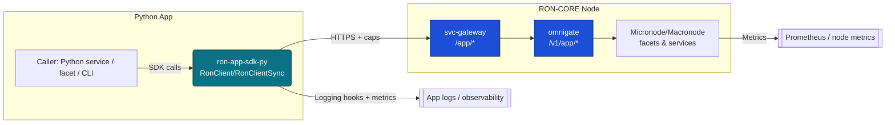
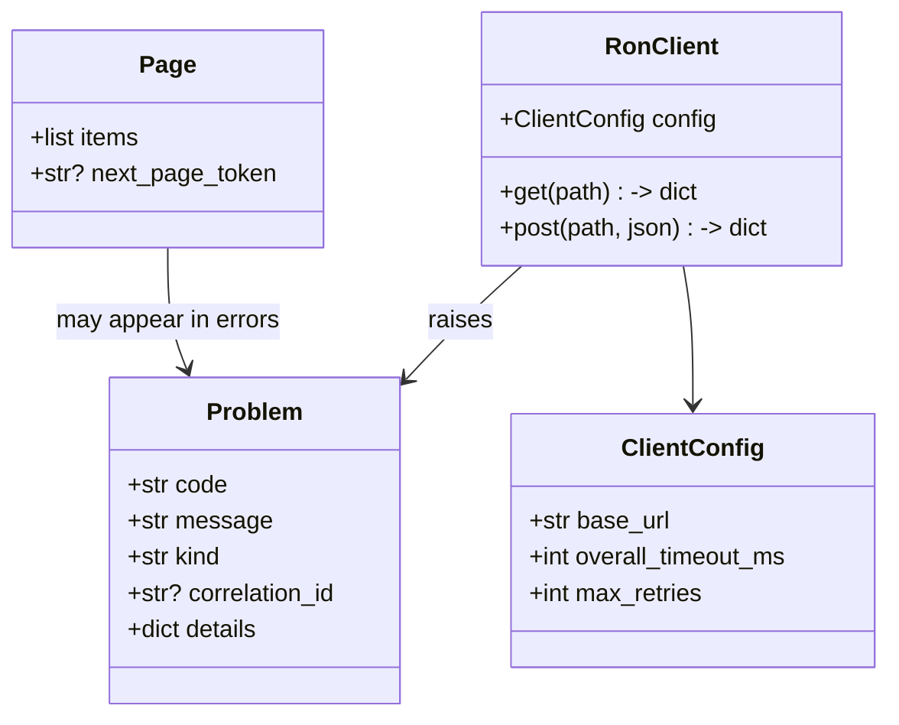
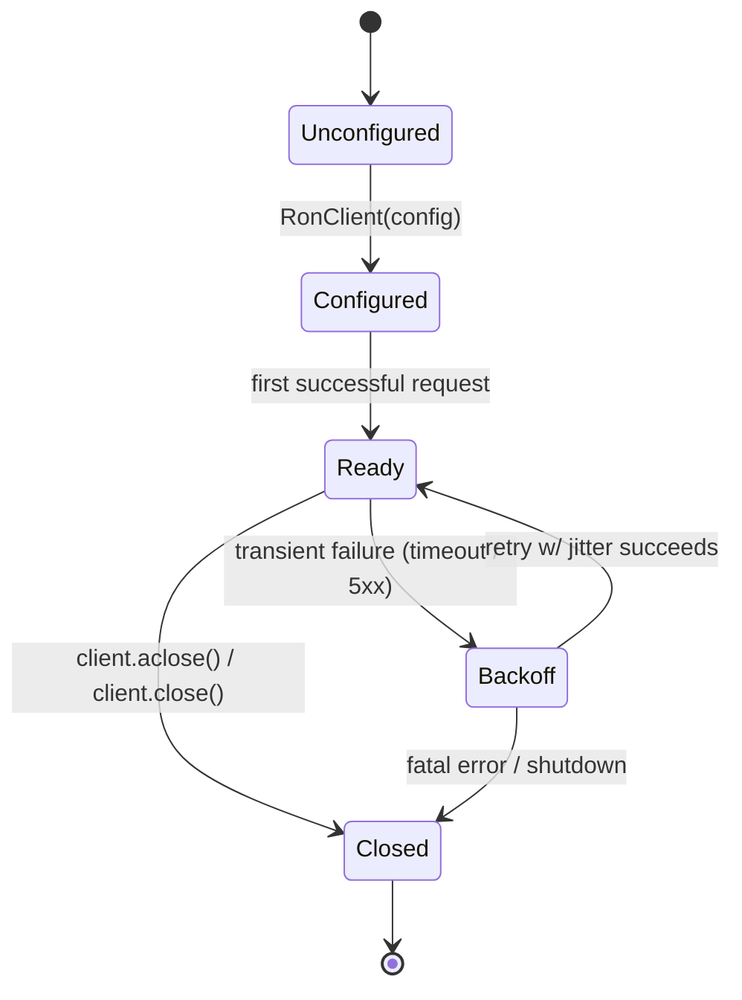
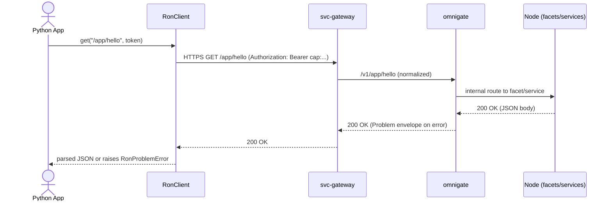

````md
# ron-app-sdk-py

> **Role:** Python App SDK for RON-CORE (client library)  
> **Owner:** Stevan White (RustyOnions / RON-CORE)  
> **Status:** MVP complete (pre-beta)  
> **Python:** 3.9+ (tested), 3.11+ (target)  
> **Last reviewed:** 2025-11-23

Badges (future):  
[]() []() []()

---

## 1) Overview

**What it is (one paragraph):**  
`ron-app-sdk-py` is the **Python client SDK for RON-CORE’s app plane**. It gives Python applications, services, and facets a typed, secure, async-first way to call `/app/*` endpoints exposed by `svc-gateway`/`omnigate`, handle canonical `Problem` errors, manage capabilities/macaroons, and subscribe to streaming updates. The SDK wraps `httpx` + `asyncio` with RON-CORE idioms (timeouts, idempotency keys, correlation IDs) and provides sync wrappers for scripts and CLIs. It is the Python counterpart to `ron-app-sdk-ts`, sharing the same schemas and error envelopes.

**How it fits (RustyOnions topology):**  
- **Pillar:** App Plane / Developer Experience / Polyglot Facets  
- **Upstream callers:** Python services, facets, CLIs, data/ML jobs using RON-CORE  
- **Downstream deps:** `svc-gateway` → `omnigate` → micronode/macronode app plane; `svc-passport` / `ron-auth` for caps; future `svc-registry` + `svc-storage`/`svc-index` via app routes  
- **Data it touches:** In-memory only (HTTP requests/responses, DTOs, optional small local cache); no DB by default  
- **Security boundary:** Handles **capabilities/macaroons** and auth headers; no private keys; must never log secrets; backend-only (no browser usage)

### 1.1 High-Level Architecture (Mermaid REQUIRED)



*The SDK sits **client-side**, speaking HTTP(S) into `svc-gateway`, which fronts omnigate + node services.*

---

## 2) Responsibilities & Boundaries

**MUST do (core responsibilities):**

* [x] Provide **async-first** `RonClient` with safe defaults (TLS, timeouts, retries).
* [x] Provide **sync wrapper** (`RonClientSync`) for scripts/CLIs.
* [x] Implement canonical **Problem** error envelope and pagination envelopes (see `SDK_SCHEMA_IDB.MD`).
* [x] Handle **capabilities/macaroons** securely (no logging, easy rotation).
* [x] Expose **idempotent write** helpers with idempotency keys.
* [x] Integrate with Python logging/tracing (correlation IDs, structured fields).
* [x] Expose basic per-client metrics (request/timeout/error counters).

**MUST NOT do (anti-scope / boundaries):**

* [ ] MUST NOT embed or manage RON-CORE private keys (that belongs in `ron-kms` / node config).
* [ ] MUST NOT attempt to run as an HTTP server or replace node services.
* [ ] MUST NOT bypass node security (e.g., no “debug mode” that skips caps).
* [ ] MUST NOT invent new DTO/error shapes that diverge from `ron-proto`/OpenAPI.

**Acceptance Gates (PROOF you did it):**

* [x] Unit + property tests for:
  * Problem error mapping
  * Idempotency keys
  * Header construction and redaction
* [ ] Interop tests hitting a local micronode/macronode via `svc-gateway`:
  * `/healthz`, `/readyz`, a sample `/app/*` route
* [ ] Benchmarks show **SDK overhead < 5%** vs raw `httpx` for simple calls.
* [x] Security gates:
  * Caps never appear in logs or exceptions
  * Timeouts+retries are bounded and configurable
* [x] CI green (locally today):
  * `ruff`, `mypy`, `pytest`  
  * (future) `black`, `pip-audit` (or equivalent)

---

## 3) Public Interfaces

> For SDKs, this section is about the **Python API** and how it calls HTTP behind the scenes.

### 3.1 Python API (library)

Key modules/types:

* `ron_app_sdk_py.client` — main client types:
  * `RonClient` (async)
  * `RonClientSync` (sync wrapper around async client)
* `ron_app_sdk_py.config` — configuration types:
  * `ClientConfig` (base_url, timeouts, TLS options, token provider, etc.)
* `ron_app_sdk_py.errors` — error types:
  * `Problem` (canonical error envelope; Pydantic model)
  * `RonProblemError` (Problem-based exception)
  * `RonNetworkError`, `RonAuthError`, `RonTimeoutError`, `RonConfigError`, `RonParseError`
* `ron_app_sdk_py.pagination` — helpers for paginated responses:
  * `Page`, `iter_pages`
* `ron_app_sdk_py.streaming` — streaming/SSE helpers:
  * `sse_event_stream(client, path, ...)`
  * `subscribe(ron_client, path, callback, ...)`
* `ron_app_sdk_py.facets` — facet-scoped client:
  * `FacetClient` (prefixes paths with `/app/{facetId}`)
* `ron_app_sdk_py.logging_` — SDK logging helpers:
  * `get_logger`, `log_request`, `log_response`
* `ron_app_sdk_py.metrics` — per-client metrics:
  * `RequestMetrics` (counters + `snapshot()`)

**Minimal async example:**

```python
from ron_app_sdk_py import RonClient, RonProblemError, ClientConfig
import asyncio

async def main() -> None:
    client = RonClient(
        config=ClientConfig(
            base_url="https://localhost:8080",
            allow_insecure_http=True,  # dev only
        )
    )

    try:
        result = await client.get("/app/hello")
        print("Hello result:", result)
    except RonProblemError as e:
        # Canonical Problem from RON-CORE
        p = e.problem
        print(f"Error: {p.code} ({p.kind}) — {p.message}, corr={p.correlation_id}")
    finally:
        await client.aclose()

if __name__ == "__main__":
    asyncio.run(main())
```

**Minimal sync example:**

```python
from ron_app_sdk_py import RonClientSync

client = RonClientSync(
    base_url="http://localhost:8080",
    allow_insecure_http=True,  # dev only
)

result = client.get("/app/hello")
print("Hello result:", result)

client.close()
```

### 3.2 HTTP Surface Used by the SDK

The SDK is a **client**; it does not expose HTTP endpoints but it calls these on the node:

* **Base URL:** from config/env, e.g. `https://localhost:8080` (gateway).
* **Core endpoints:**
  * `GET /healthz` → liveness (used for simple connectivity checks)
  * `GET /readyz` → readiness (optional)
  * `GET/POST/PUT/DELETE /app/*` → app-plane routes (facets, app services)
  * `GET /metrics` (optional) → node metrics (SDK may help query for diagnostics tools)

SDK invariants:

* Adds `Authorization: Bearer <cap/token>` or capability header as defined by `ron-auth/svc-passport`.
* Injects correlation ID header (`X-Request-Id` or similar) on each call.
* Applies timeouts and (bounded) retries per `SDK_SECURITY.MD`.

### 3.3 CLI (future)

A thin helper CLI **may** be added later (e.g., `ron-app-cli-py`) for:

* Inspecting node/app health
* Quick cURL-like requests via SDK semantics
* Generating facet manifests

(Not in the MVP scope for `ron-app-sdk-py` itself.)

---

## 4) Configuration

> For SDKs, “configuration” is primarily client URLs, auth, and timeouts.

### 4.1 Environment Variables

`ron-app-sdk-py` reads canonical RON-CORE env vars as defaults:

| Variable                     | Type   | Default                 | Description                                           |
| ---------------------------- | ------ | ----------------------- | ----------------------------------------------------- |
| `RON_APP_URL`                | string | `http://127.0.0.1:8080` | Convenience alias for local dev base URL              |
| `RON_SDK_GATEWAY_ADDR`       | string | (if set, overrides URL) | Canonical gateway/omnigate base URL                   |
| `RON_SDK_OVERALL_TIMEOUT_MS` | int    | `10000`                 | Overall request timeout (ms)                          |
| `RON_SDK_CONNECT_TIMEOUT_MS` | int    | `3000`                  | Connect timeout (ms)                                  |
| `RON_SDK_READ_TIMEOUT_MS`    | int    | `7000`                  | Read timeout (ms)                                     |
| `RON_SDK_WRITE_TIMEOUT_MS`   | int    | `5000`                  | Write timeout (ms)                                    |
| `RON_APP_TOKEN`              | string | (none)                  | Optional capability/macaroon for dev and scripts only |

Rules:

* Explicit arguments in `ClientConfig` / `RonClient` constructor **override env vars**.
* When both `RON_APP_URL` and `RON_SDK_GATEWAY_ADDR` are set, `RON_SDK_GATEWAY_ADDR` wins.

### 4.2 Flags / Options (Python API)

Typical config usage:

```python
from ron_app_sdk_py import ClientConfig, RonClient

cfg = ClientConfig.from_env().with_overrides(
    base_url="https://my-gateway.example.com",
    overall_timeout_ms=5000,
)

client = RonClient(config=cfg)
```

Key options (current implementation):

* `base_url` (string)
* `allow_insecure_http` (bool; dev-only for `http://` URLs)
* `overall_timeout_ms`, `connect_timeout_ms`, `read_timeout_ms`, `write_timeout_ms`
* `max_retries` (int)
* `max_concurrency` (int, for internal semaphore)
* `max_response_bytes` (optional cap on response size)
* `token` or `token_provider` (callable returning cap/macaroon)
* TLS verification via `httpx` `verify` parameter (CA bundle / bool)

No Cargo features; configuration is pure Python.

---

## 5) Build, Run, Test

This is a **Python library**, not a Rust crate.

Assume a `pyproject.toml` with dev extras; examples use a simple venv:

**Install (dev mode)**

```bash
python -m venv .venv
source .venv/bin/activate
pip install -U pip
pip install -e ".[dev]"
```

**Run examples**

```bash
python examples/hello_async.py
python examples/hello_sync.py
python examples/list_paginated_items.py
python examples/watch_events_async.py
```

**Tests (unit/prop/docs)**

```bash
ruff check ron_app_sdk_py
mypy ron_app_sdk_py
pytest
```

(Once wired in CI, we can also add: `pytest --hypothesis-show-statistics` and `pip-audit`.)

**Lint & format (optional extra)**

```bash
ruff check .
black .
mypy ron_app_sdk_py
pytest
```

---

## 6) Observability

The SDK itself does **not** expose HTTP endpoints, but it:

* Instruments **logging/tracing** for client calls.
* Surfaces **correlation IDs** and idempotency keys in log metadata.
* Exposes **per-client metrics** via `RequestMetrics`.

**Logging**

* Uses Python’s `logging` module.
* Logs at INFO/DEBUG:
  * Method (`GET/POST/...`), path, status code, duration.
  * Correlation ID (`X-Request-Id`) and idempotency key (if present).
* Sensitive headers (e.g., `Authorization`) are redacted.

**Metrics**

Every `RonClient` instance has a `metrics` property:

```python
snap = client.metrics.snapshot()
print(snap)
# {
#   "total_requests": ...,
#   "total_errors": ...,
#   "total_timeouts": ...,
#   "total_network_errors": ...,
# }
```

Apps can periodically scrape this and export to Prometheus/etc. The names in `snapshot()` are intentionally simple; external metrics systems can define final metric names.

---

## 7) Performance & SLOs

This SDK is a lightweight wrapper around `httpx` with structured errors and security invariants; the goal is **low overhead**.

| Metric                    |      Target | Notes                                     |
| ------------------------- | ----------: | ----------------------------------------- |
| P50 SDK overhead vs httpx |       <1 ms | simple GET, local node, Linux/macOS       |
| P99 SDK overhead vs httpx |       <5 ms | under nominal load                        |
| Max RPS (single process)  | 10k–20k RPS | simple GET, reuse client, async, tuned    |
| Streaming reconnect time  |        <1 s | after transient disconnect (with backoff) |

**Reproducing performance**

* Machine: 4–8 core dev laptop, Python 3.9+/3.11+, Linux/macOS.
* Node: micronode + svc-gateway on loopback, release mode.
* Tooling: `pytest-benchmark` or `time.perf_counter` inside tests.

---

## 8) Data & Schema

`ron-app-sdk-py` itself stores no durable data. Its “schema” responsibilities are:

* DTO shapes for RON-CORE app-plane payloads (Hello/health/ready/events).
* Error envelopes (canonical `Problem`).
* Pagination envelopes.
* (Future) facet manifest builders.

These are derived from:

* `ron-proto` (wire contracts).
* HTTP/OpenAPI spec for gateway/omnigate.
* `SDK_SCHEMA_IDB.MD`.

**Mermaid DTO overview (conceptual)**



---

## 9) Security & Privacy

See also: `SDK_SECURITY.MD` for full security blueprint.

**Threat model (brief):**

* **Spoofing / Tampering / Info disclosure:**
  * TLS enforced by default; HTTP only with explicit opt-in for dev (`allow_insecure_http=True`).
  * Capabilities/macaroons must be short-lived and never logged.
* **DoS:**
  * Timeouts + bounded retries; concurrency caps optional.
  * Response size guard via `max_response_bytes`.

**Key handling:**

* SDK handles **caps/tokens only**, not private keys.
* Tokens can be carried in Pydantic `SecretStr` for safe repr.
* Best-effort zeroization in `aclose()` by dropping token references; Python cannot guarantee perfect memory wipe (documented).

**PII:**

* The SDK is agnostic; any PII is in payloads from user code.
* Logging defaults never dump full bodies; headers are redacted where sensitive.

**AuthN/Z:**

* Authn: capability/macaroon tokens issued by `svc-passport`/`ron-auth`.
* Authz: enforced server-side by RON-CORE; SDK simply passes caps correctly.

**Input validation:**

* Length and type checks on configuration (URLs, timeouts).
* Timeouts on all network requests.
* Response size checks (max body size).

**Supply chain:**

* Pinned core deps in `pyproject.toml`.
* No optional/native extensions required (pure Python + `httpx`, `pydantic`).
* (Future) `pip-audit` to ensure deps are free of known vulnerabilities.

---

## 10) Error Taxonomy

High-level SDK error taxonomy (Python):

| Error Type        | When it happens                                | User hint                        | Retry?                 |
| ----------------- | ---------------------------------------------- | -------------------------------- | ---------------------- |
| `RonProblemError` | Node returns canonical Problem envelope        | Check `problem.code` / `kind`    | depends on `kind`      |
| `RonAuthError`    | 401/403 or invalid/expired caps                | Refresh capability; check scopes | no, until caps fixed   |
| `RonTimeoutError` | Request exceeds overall/phase timeout          | Check timeouts & node health     | yes (bounded/jittered) |
| `RonNetworkError` | DNS/TLS/socket failures                        | Check network, gateway address   | yes (bounded)          |
| `RonConfigError`  | Misconfigured base URL/env/token provider      | Fix configuration                | no                     |
| `RonParseError`   | Malformed JSON/response that isn’t Problem/DTO | Check node/version compatibility | maybe (non-fatal)      |

---

## 11) Concurrency Model

* **Runtime:** `asyncio` (Python 3.9+ / 3.11+), `httpx.AsyncClient`.
* **I/O:** `httpx.AsyncClient` with proper timeouts.
* **Concurrency:**
  * One client per process (recommended) with connection pooling.
  * Internal semaphore to enforce `max_concurrency`.
* **Rules:**
  * No blocking I/O in async paths.
  * Streaming subscriptions are cancellable and bounded by app logic.
  * No global shared state between processes (multiprocessing-safe by design).



---

## 12) Compatibility & Requirements

* **Python:** 3.9+ (tested on 3.9.6), 3.11+ (target)
* **OS:** macOS 10.15+, Linux x86_64, Windows 10+ (where `httpx` supports).
* **TLS:** system CA store or configured CA bundle.
* **Node:** Requires `svc-gateway` + `omnigate` speaking current RON-CORE protocol (e.g., v0.1).

---

## 13) Examples

Minimal async call:

```python
import asyncio
from ron_app_sdk_py import RonClient, RonProblemError

async def main() -> None:
    client = RonClient.from_env()  # uses RON_APP_URL, RON_APP_TOKEN if set
    try:
        resp = await client.get("/app/hello")
        print(resp)
    except RonProblemError as e:
        print("Problem:", e.problem.code, e.problem.message)
    finally:
        await client.aclose()

if __name__ == "__main__":
    asyncio.run(main())
```

Paginated list:

```python
from ron_app_sdk_py import RonClient, iter_pages
import asyncio

async def list_all_items() -> None:
    client = RonClient.from_env()
    async for page in iter_pages(client, "/app/items", page_size=100):
        for item in page.items:
            print(item)
    await client.aclose()

if __name__ == "__main__":
    asyncio.run(list_all_items())
```

Streaming (SSE-style, current helpers):

```python
import asyncio
from ron_app_sdk_py import RonClient, ClientConfig
from ron_app_sdk_py.streaming import sse_event_stream

async def watch_events() -> None:
    client = RonClient(
        config=ClientConfig(
            base_url="http://localhost:8080",
            allow_insecure_http=True,
        )
    )

    async for event in sse_event_stream(client._client, "/app/events"):
        print("Event:", event.json_data())

    await client.aclose()

if __name__ == "__main__":
    asyncio.run(watch_events())
```

---

## 14) Troubleshooting

* **“Connection refused” / timeouts:**
  * Check `RON_APP_URL` / `RON_SDK_GATEWAY_ADDR` and that `svc-gateway` is running.
  * Verify you are using HTTPS if the node expects it, or explicitly set `allow_insecure_http=True` for local `http://` dev.

* **TLS errors:**
  * Ensure correct hostname and CA configuration.
  * For local dev, you may temporarily use insecure HTTP with `allow_insecure_http=True` **only in dev**.

* **Auth failures (401/403):**
  * Check that your token/capability is valid and has sufficient scopes.
  * Ensure `RonClient` is constructed with the correct `token` or `token_provider`.

* **High latency:**
  * Check node load and network path.
  * Reduce logging verbosity and ensure you are reusing a single `RonClient` instance.

* **Unexpected JSON parse errors:**
  * Ensure the node and SDK target the same protocol version.
  * Check for proxies or middleboxes that may be altering responses.

---

## 15) Development Notes

**Project conventions (SDKs / RustyOnions):**

* All DTOs, errors, and manifests must align with:
  * `SDK_IDB.MD`
  * `SDK_SCHEMA_IDB.MD`
  * `SDK_SECURITY.MD`
* Python code:
  * `async`/`await` first, sync wrappers second.
  * No global mutable state with caps.
  * Type-hinted everywhere; `mypy` clean.

**Pre-commit quickcheck**

```bash
ruff check ron_app_sdk_py
mypy ron_app_sdk_py
pytest
```

(Optionally add `black .` and `pip-audit` once wired.)

---

## 16) Mermaid Diagrams — Policy & Tooling

Every SDK README includes:

1. **Architecture** diagram (above).
2. **Sequence** diagram (common call path).
3. **State** diagram (client lifecycle).

**Sequence: `RonClient.get("/app/hello")`**



---

## 17) Roadmap & TODO

* [x] **M1 – MVP**
  * Async `RonClient` + sync wrapper.
  * GET/POST/PUT/DELETE with timeouts, retries, and error mapping.
  * Problem envelope + pagination support.

* [ ] **M2 – Hardening**
  * Full `SDK_SECURITY.MD` compliance (caps, logging, DoS guardrails).
  * Hypothesis property tests, Toxiproxy chaos tests.
  * Basic perf benchmarks.

* [ ] **M3 – Facet & Schema helpers**
  * Facet manifest builder (TOML) aligned with `SDK_SCHEMA_IDB.MD`.
  * Codegen from ron-proto/OpenAPI for common DTOs.

* [ ] **M4 – Streaming & advanced DX**
  * Additional streaming ergonomics (e.g., higher-level `client.subscribe`).
  * Framework adapters (FastAPI, Flask).
  * CLI helpers.

---

## 18) Changelog

See [CHANGELOG.md](./CHANGELOG.md). Follow SemVer; document breaking changes with migration notes and protocol version alignment.

---

## 19) License

Dual-licensed under **MIT** or **Apache-2.0**. See [LICENSE-MIT](./LICENSE-MIT) and [LICENSE-APACHE](./LICENSE-APACHE).

---

## 20) Contributing

PRs welcome! Before opening a PR:

* Run format, lint, typecheck, tests, and (eventually) security audit.
* Update diagrams if topology or API surfaces change.
* Keep examples minimal but accurate; they should run against a local RON-CORE node.
* Ensure any new DTOs/errors are aligned with `SDK_SCHEMA_IDB.MD` and tested against a local node.

> Also see:
>
> * `SDK_IDB.MD` — Invariant-Driven Blueprint for `ron-app-sdk-py`.
> * `SDK_SECURITY.MD` — Security checklist and threat model.
> * `SDK_SCHEMA_IDB.MD` — Unified schema & facet contract.
````
