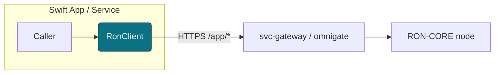
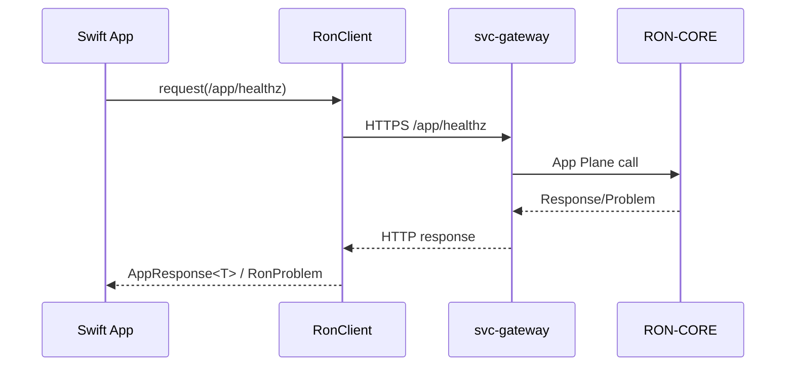
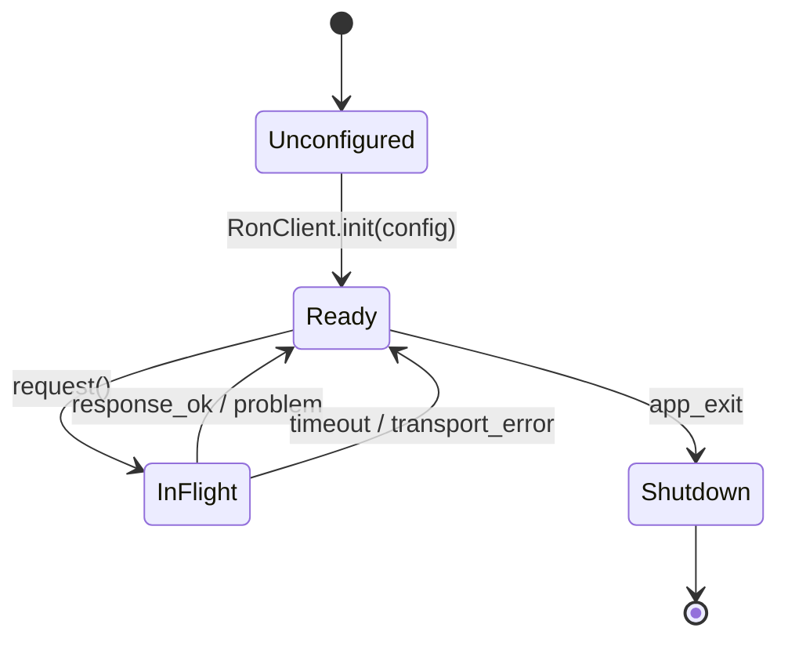

<!-- Generated by scripts/make_sdk_codex.sh on 2025-12-04T19:34:36Z -->
# Code Bundle — SDK `ron-app-sdk-swift`

> Generated for review/sharing. Source of truth remains the repo.
> Includes all non-Markdown files under sdk/ron-app-sdk-swift.
> Skips node_modules, dist, coverage, .git, virtualenvs, caches, vendor, var, and common junk files.

## Table of Contents
- [sdk/ron-app-sdk-swift/.editorconfig](#sdk-ron-app-sdk-swift--editorconfig)
- [sdk/ron-app-sdk-swift/.github/workflows/swift-ci.yml](#sdk-ron-app-sdk-swift--github-workflows-swift-ci-yml)
- [sdk/ron-app-sdk-swift/.gitignore](#sdk-ron-app-sdk-swift--gitignore)
- [sdk/ron-app-sdk-swift/LICENSE-APACHE](#sdk-ron-app-sdk-swift-LICENSE-APACHE)
- [sdk/ron-app-sdk-swift/LICENSE-MIT](#sdk-ron-app-sdk-swift-LICENSE-MIT)
- [sdk/ron-app-sdk-swift/Package.swift](#sdk-ron-app-sdk-swift-Package-swift)
- [sdk/ron-app-sdk-swift/Sources/RonAppSdkSwift/AppRequest.swift](#sdk-ron-app-sdk-swift-Sources-RonAppSdkSwift-AppRequest-swift)
- [sdk/ron-app-sdk-swift/Sources/RonAppSdkSwift/AppResponse.swift](#sdk-ron-app-sdk-swift-Sources-RonAppSdkSwift-AppResponse-swift)
- [sdk/ron-app-sdk-swift/Sources/RonAppSdkSwift/Env/EnvConfig.swift](#sdk-ron-app-sdk-swift-Sources-RonAppSdkSwift-Env-EnvConfig-swift)
- [sdk/ron-app-sdk-swift/Sources/RonAppSdkSwift/Facets/FacetClient.swift](#sdk-ron-app-sdk-swift-Sources-RonAppSdkSwift-Facets-FacetClient-swift)
- [sdk/ron-app-sdk-swift/Sources/RonAppSdkSwift/Internal/RequestBuilder.swift](#sdk-ron-app-sdk-swift-Sources-RonAppSdkSwift-Internal-RequestBuilder-swift)
- [sdk/ron-app-sdk-swift/Sources/RonAppSdkSwift/Internal/ResponseParser.swift](#sdk-ron-app-sdk-swift-Sources-RonAppSdkSwift-Internal-ResponseParser-swift)
- [sdk/ron-app-sdk-swift/Sources/RonAppSdkSwift/Logging/RonLogger.swift](#sdk-ron-app-sdk-swift-Sources-RonAppSdkSwift-Logging-RonLogger-swift)
- [sdk/ron-app-sdk-swift/Sources/RonAppSdkSwift/RonClient.swift](#sdk-ron-app-sdk-swift-Sources-RonAppSdkSwift-RonClient-swift)
- [sdk/ron-app-sdk-swift/Sources/RonAppSdkSwift/RonConfig.swift](#sdk-ron-app-sdk-swift-Sources-RonAppSdkSwift-RonConfig-swift)
- [sdk/ron-app-sdk-swift/Sources/RonAppSdkSwift/RonProblem.swift](#sdk-ron-app-sdk-swift-Sources-RonAppSdkSwift-RonProblem-swift)
- [sdk/ron-app-sdk-swift/Sources/RonAppSdkSwift/Transport/HttpTransport.swift](#sdk-ron-app-sdk-swift-Sources-RonAppSdkSwift-Transport-HttpTransport-swift)
- [sdk/ron-app-sdk-swift/Sources/RonAppSdkSwift/Transport/UrlSessionConfig.swift](#sdk-ron-app-sdk-swift-Sources-RonAppSdkSwift-Transport-UrlSessionConfig-swift)
- [sdk/ron-app-sdk-swift/Sources/RonAppSdkSwift/Types/CodableValue.swift](#sdk-ron-app-sdk-swift-Sources-RonAppSdkSwift-Types-CodableValue-swift)
- [sdk/ron-app-sdk-swift/Sources/RonAppSdkSwift/Types/Page.swift](#sdk-ron-app-sdk-swift-Sources-RonAppSdkSwift-Types-Page-swift)
- [sdk/ron-app-sdk-swift/Sources/RonAppSdkSwift/Types/StringInt64.swift](#sdk-ron-app-sdk-swift-Sources-RonAppSdkSwift-Types-StringInt64-swift)
- [sdk/ron-app-sdk-swift/Sources/RonAppSdkSwift/Types/StringUInt64.swift](#sdk-ron-app-sdk-swift-Sources-RonAppSdkSwift-Types-StringUInt64-swift)
- [sdk/ron-app-sdk-swift/Tests/RonAppSdkSwiftTests/ErrorMappingTests.swift](#sdk-ron-app-sdk-swift-Tests-RonAppSdkSwiftTests-ErrorMappingTests-swift)
- [sdk/ron-app-sdk-swift/Tests/RonAppSdkSwiftTests/InteropTests.swift](#sdk-ron-app-sdk-swift-Tests-RonAppSdkSwiftTests-InteropTests-swift)
- [sdk/ron-app-sdk-swift/Tests/RonAppSdkSwiftTests/PaginationTests.swift](#sdk-ron-app-sdk-swift-Tests-RonAppSdkSwiftTests-PaginationTests-swift)
- [sdk/ron-app-sdk-swift/Tests/RonAppSdkSwiftTests/RonClientTests.swift](#sdk-ron-app-sdk-swift-Tests-RonAppSdkSwiftTests-RonClientTests-swift)
- [sdk/ron-app-sdk-swift/Tests/RonAppSdkSwiftTests/RonConfigTests.swift](#sdk-ron-app-sdk-swift-Tests-RonAppSdkSwiftTests-RonConfigTests-swift)
- [sdk/ron-app-sdk-swift/Tests/RonAppSdkSwiftTests/UrlBuildingTests.swift](#sdk-ron-app-sdk-swift-Tests-RonAppSdkSwiftTests-UrlBuildingTests-swift)
- [sdk/ron-app-sdk-swift/docs/arch.mmd](#sdk-ron-app-sdk-swift-docs-arch-mmd)
- [sdk/ron-app-sdk-swift/docs/sequence.mmd](#sdk-ron-app-sdk-swift-docs-sequence-mmd)
- [sdk/ron-app-sdk-swift/docs/state.mmd](#sdk-ron-app-sdk-swift-docs-state-mmd)
- [sdk/ron-app-sdk-swift/examples/hello-ron/Package.swift](#sdk-ron-app-sdk-swift-examples-hello-ron-Package-swift)
- [sdk/ron-app-sdk-swift/examples/hello-ron/Sources/HelloRon/main.swift](#sdk-ron-app-sdk-swift-examples-hello-ron-Sources-HelloRon-main-swift)
- [sdk/ron-app-sdk-swift/examples/vapor-facet-demo/Package.swift](#sdk-ron-app-sdk-swift-examples-vapor-facet-demo-Package-swift)
- [sdk/ron-app-sdk-swift/examples/vapor-facet-demo/Sources/App/main.swift](#sdk-ron-app-sdk-swift-examples-vapor-facet-demo-Sources-App-main-swift)

### sdk/ron-app-sdk-swift/.editorconfig
<a id="sdk-ron-app-sdk-swift--editorconfig"></a>

```
root = true

[*]
charset = utf-8
end_of_line = lf
insert_final_newline = true
indent_style = space
indent_size = 4

[*.md]
indent_size = 2

[*.yml]
indent_size = 2

[*.swift]
indent_size = 4


```

### sdk/ron-app-sdk-swift/.github/workflows/swift-ci.yml
<a id="sdk-ron-app-sdk-swift--github-workflows-swift-ci-yml"></a>

```yaml
name: swift-ci

on:
  push:
    paths:
      - "sdk/ron-app-sdk-swift/**"
  pull_request:
    paths:
      - "sdk/ron-app-sdk-swift/**"

jobs:
  build-and-test:
    runs-on: macos-latest
    steps:
      - uses: actions/checkout@v4
      - name: Build
        run: |
          cd sdk/ron-app-sdk-swift
          swift build
      - name: Test
        run: |
          cd sdk/ron-app-sdk-swift
          swift test


```

### sdk/ron-app-sdk-swift/.gitignore
<a id="sdk-ron-app-sdk-swift--gitignore"></a>

```
.build/
.swiftpm/
.DS_Store
xcuserdata/
DerivedData/
*.xcodeproj/
.idea/
/*.log


```

### sdk/ron-app-sdk-swift/LICENSE-APACHE
<a id="sdk-ron-app-sdk-swift-LICENSE-APACHE"></a>

```
Apache License 2.0

<Fill with your standard Apache-2.0 license text or link to workspace licenses.>


```

### sdk/ron-app-sdk-swift/LICENSE-MIT
<a id="sdk-ron-app-sdk-swift-LICENSE-MIT"></a>

```
MIT License

<Fill with your standard MIT license text or link to workspace licenses.>


```

### sdk/ron-app-sdk-swift/Package.swift
<a id="sdk-ron-app-sdk-swift-Package-swift"></a>

```
// swift-tools-version: 5.9
import PackageDescription

let package = Package(
    name: "ron-app-sdk-swift",
    platforms: [
        .iOS(.v15),
        .macOS(.v12),
        .tvOS(.v15),
        .watchOS(.v8)
    ],
    products: [
        .library(
            name: "RonAppSdkSwift",
            targets: ["RonAppSdkSwift"]
        ),
    ],
    dependencies: [
        // Add SwiftLog or other dependencies here when needed.
        // .package(url: "https://github.com/apple/swift-log.git", from: "1.0.0"),
    ],
    targets: [
        .target(
            name: "RonAppSdkSwift",
            path: "Sources/RonAppSdkSwift"
        ),
        .testTarget(
            name: "RonAppSdkSwiftTests",
            dependencies: ["RonAppSdkSwift"],
            path: "Tests/RonAppSdkSwiftTests"
        ),
    ]
)


```

### sdk/ron-app-sdk-swift/Sources/RonAppSdkSwift/AppRequest.swift
<a id="sdk-ron-app-sdk-swift-Sources-RonAppSdkSwift-AppRequest-swift"></a>

```
/// Internal representation of a request issued via RonClient.
/// Encapsulates HTTP method, path, query params, headers, and optional body.

import Foundation

struct AppRequest {
    let method: String
    let path: String
    let queryItems: [URLQueryItem]
    let headers: [String: String]
    let body: Data?
}


```

### sdk/ron-app-sdk-swift/Sources/RonAppSdkSwift/AppResponse.swift
<a id="sdk-ron-app-sdk-swift-Sources-RonAppSdkSwift-AppResponse-swift"></a>

```
/// Canonical AppResponse<T> wrapper for SDK calls.
/// Mirrors the shared schema: either a value or a RonProblem.

import Foundation

public struct AppResponse<T: Decodable>: Decodable {
    public let ok: Bool
    public let value: T?
    public let problem: RonProblem?

    public init(ok: Bool, value: T?, problem: RonProblem?) {
        self.ok = ok
        self.value = value
        self.problem = problem
    }
}


```

### sdk/ron-app-sdk-swift/Sources/RonAppSdkSwift/Env/EnvConfig.swift
<a id="sdk-ron-app-sdk-swift-Sources-RonAppSdkSwift-Env-EnvConfig-swift"></a>

```
/// RO:WHAT — Helpers for reading standard SDK env vars (gateway URL, timeouts, flags).
/// RO:WHY  — Single place to normalize env parsing across config builders.
/// RO:INTERACTS — Used by RonConfig.fromEnvironment(overrides:).
/// RO:INVARIANTS —
///   - Never throws; returns nil on malformed values.
///   - Trims whitespace; case-insensitive bool parsing.
/// RO:METRICS/LOGS —
///   - None directly; callers may log config decisions.
/// RO:CONFIG —
///   - Canonical env names live in SDK_SCHEMA_IDB.MD.
/// RO:SECURITY —
///   - Env may contain secrets (tokens); do NOT log raw values from here.
/// RO:TEST_HOOKS —
///   - Covered by RonConfigTests (env → config behavior).

import Foundation

enum EnvConfig {
    static func string(_ key: String) -> String? {
        ProcessInfo.processInfo.environment[key]
    }

    static func trimmedString(_ key: String) -> String? {
        guard let raw = string(key) else { return nil }
        let trimmed = raw.trimmingCharacters(in: .whitespacesAndNewlines)
        return trimmed.isEmpty ? nil : trimmed
    }

    static func int(_ key: String) -> Int? {
        guard let raw = trimmedString(key) else { return nil }
        return Int(raw)
    }

    static func bool(_ key: String) -> Bool? {
        guard let raw = trimmedString(key)?.lowercased() else { return nil }
        switch raw {
        case "1", "true", "yes", "y", "on":
            return true
        case "0", "false", "no", "n", "off":
            return false
        default:
            return nil
        }
    }
}

```

### sdk/ron-app-sdk-swift/Sources/RonAppSdkSwift/Facets/FacetClient.swift
<a id="sdk-ron-app-sdk-swift-Sources-RonAppSdkSwift-Facets-FacetClient-swift"></a>

```
/// FacetClient — helper for addressing /facets/{id}{path} routes via RonClient.

import Foundation

public struct FacetClient {
    public let client: RonClient
    public let id: String

    public init(client: RonClient, id: String) {
        self.client = client
        self.id = id
    }
}


```

### sdk/ron-app-sdk-swift/Sources/RonAppSdkSwift/Internal/RequestBuilder.swift
<a id="sdk-ron-app-sdk-swift-Sources-RonAppSdkSwift-Internal-RequestBuilder-swift"></a>

```
//
// RequestBuilder.swift
// ron-app-sdk-swift
//
// RO:WHAT  — Turn an internal AppRequest into a Foundation.URLRequest.
// RO:WHY   — Keep URL construction, headers, and app-prefix/query handling encapsulated.
// RO:INVARIANTS —
//   - Always resolves paths under the `/app` prefix unless already present.
//   - Applies AppRequest.queryItems to the URL.
//   - Adds an Accept header if caller didn’t specify one.
//

import Foundation

enum RequestBuilder {
    enum Error: Swift.Error {
        case invalidBaseUrl(String)
        case invalidPath(String)
    }

    /// Build a URLRequest from our internal AppRequest + RonConfig.
    static func build(_ app: AppRequest, config: RonConfig) throws -> URLRequest {
        guard var components = URLComponents(
            url: config.baseUrl,
            resolvingAgainstBaseURL: false
        ) else {
            throw Error.invalidBaseUrl("Unable to resolve base URL: \(config.baseUrl.absoluteString)")
        }

        // Normalize path under /app prefix unless already provided.
        let pathUnderApp: String
        if app.path.hasPrefix("/app/") {
            pathUnderApp = app.path
        } else if app.path.hasPrefix("/") {
            pathUnderApp = "/app" + app.path
        } else {
            pathUnderApp = "/app/" + app.path
        }

        components.path = components.path.appending(pathUnderApp)

        // Attach query params if present.
        if !app.queryItems.isEmpty {
            components.queryItems = app.queryItems
        }

        guard let url = components.url else {
            throw Error.invalidPath(
                "Unable to construct URL from base + path: \(components) + \(pathUnderApp)"
            )
        }

        var request = URLRequest(url: url)
        request.httpMethod = app.method
        request.httpBody = app.body

        // Merge headers; allow caller to override defaults later.
        var headers = app.headers

        if headers["Accept"] == nil {
            headers["Accept"] = "application/json"
        }

        for (key, value) in headers {
            request.setValue(value, forHTTPHeaderField: key)
        }

        return request
    }
}

```

### sdk/ron-app-sdk-swift/Sources/RonAppSdkSwift/Internal/ResponseParser.swift
<a id="sdk-ron-app-sdk-swift-Sources-RonAppSdkSwift-Internal-ResponseParser-swift"></a>

```
//
// ResponseParser.swift
// ron-app-sdk-swift
//
// RO:WHAT  — Turn (Data, HTTPURLResponse) into AppResponse<T>.
// RO:WHY   — Centralize JSON decoding + local error mapping.
// RO:INVARIANTS —
//   - Always returns an AppResponse<T>; never throws.
//   - Respects the shared AppResponse<T> schema when present.
//   - On garbage/empty bodies, returns a local RonProblem.
//

import Foundation

enum ResponseParser {
    static func parse<T: Decodable>(
        data: Data,
        response: HTTPURLResponse
    ) -> AppResponse<T> {
        let status = response.statusCode
        let decoder = JSONDecoder()
        decoder.keyDecodingStrategy = .convertFromSnakeCase

        // Happy path: 2xx and well-formed AppResponse<T>.
        if (200..<300).contains(status) {
            if !data.isEmpty {
                do {
                    let decoded = try decoder.decode(AppResponse<T>.self, from: data)
                    return decoded
                } catch {
                    let problem = RonProblem.localDecodingError(
                        status: status,
                        message: "Failed to decode AppResponse<\(T.self)>: \(error)"
                    )
                    return AppResponse(ok: false, value: nil, problem: problem)
                }
            } else {
                // 2xx but empty body; treat as ok with nil value.
                return AppResponse(ok: true, value: nil, problem: nil)
            }
        }

        // Non-2xx: try to decode AppResponse<T> first.
        if !data.isEmpty {
            if let decoded = try? decoder.decode(AppResponse<T>.self, from: data) {
                return decoded
            }

            // Or a bare RonProblem.
            if let problem = try? decoder.decode(RonProblem.self, from: data) {
                return AppResponse(ok: false, value: nil, problem: problem)
            }
        }

        // Fallback: local HTTP status-based problem with a small body preview.
        let bodyPreview: String?
        if !data.isEmpty {
            bodyPreview = String(data: data.prefix(512), encoding: .utf8)
        } else {
            bodyPreview = nil
        }

        let problem = RonProblem.localHttpStatus(
            status: status,
            bodyPreview: bodyPreview
        )
        return AppResponse(ok: false, value: nil, problem: problem)
    }
}

```

### sdk/ron-app-sdk-swift/Sources/RonAppSdkSwift/Logging/RonLogger.swift
<a id="sdk-ron-app-sdk-swift-Sources-RonAppSdkSwift-Logging-RonLogger-swift"></a>

```
/// RonLogger — small logging facade; can be wired to SwiftLog or custom logger.

import Foundation

public struct RonLogger {
    public init() {}

    public func debug(_ message: String) {
        // TODO: Integrate with actual logging backend.
        print("[ron-sdk-swift][DEBUG] \(message)")
    }
}


```

### sdk/ron-app-sdk-swift/Sources/RonAppSdkSwift/RonClient.swift
<a id="sdk-ron-app-sdk-swift-Sources-RonAppSdkSwift-RonClient-swift"></a>

```
//
// RonClient.swift
// ron-app-sdk-swift
//
// RO:WHAT  — High-level Swift client for calling RON-CORE app plane.
// RO:WHY   — Give iOS/macOS devs a tiny, async/await-friendly wrapper around:
//            - config (RonConfig)
//            - transport (HttpTransport)
//            - request/response codecs (AppRequest/AppResponse/RonProblem).
// RO:INTERACTS —
//   - RonConfig        (base URL, timeouts, TLS mode)
//   - HttpTransport    (URLSession wrapper)
//   - RequestBuilder   (AppRequest -> URLRequest)
//   - ResponseParser   (Data + HTTPURLResponse -> AppResponse<T>)
// RO:INVARIANTS —
//   - Public call surface never throws; failures fold into AppResponse<RonProblem>.
//   - Low-level types (AppRequest) stay internal.
//   - HTTPS-only by default; plain HTTP requires explicit opt-in (allowInsecureHttp).
//

import Foundation

public final class RonClient {
    public let config: RonConfig

    private let transport: HttpTransport
    private let logger: RonLogger

    // MARK: - Lifecycle

    /// Primary initializer. Validates config invariants (e.g. HTTPS vs HTTP).
    ///
    /// May throw SdkConfigError when configuration is obviously unsafe or invalid.
    public init(config: RonConfig) throws {
        self.config = config
        self.logger = RonLogger()

        // Enforce HTTPS-by-default invariant.
        let scheme = config.baseUrl.scheme?.lowercased()

        if scheme == "http", !config.allowInsecureHttp {
            throw SdkConfigError(
                "Insecure HTTP base URL \(config.baseUrl.absoluteString) is not allowed; " +
                "set allowInsecureHttp = true for local dev only."
            )
        }

        self.transport = HttpTransport(config: config, logger: logger)
    }

    /// Convenience initializer that just takes a base URL.
    ///
    /// Uses default timeouts and disallows plain HTTP unless explicitly opted in later.
    public convenience init(baseUrl: URL) throws {
        try self.init(config: RonConfig(baseUrl: baseUrl))
    }

    // MARK: - Public high-level API

    /// Simple GET expecting a JSON body shaped like `AppResponse<T>`.
    ///
    /// Example:
    ///   let res: AppResponse<MyDto> = await client.get("/v1/hello")
    public func get<T: Decodable>(_ path: String) async -> AppResponse<T> {
        await getJson(path)
    }

    /// Explicit JSON GET helper (alias of `get` with a more descriptive name).
    ///
    /// Example:
    ///   let res: AppResponse<MyDto> = await client.getJson("/v1/hello")
    public func getJson<T: Decodable>(_ path: String) async -> AppResponse<T> {
        let req = AppRequest(
            method: "GET",
            path: path,
            queryItems: [],
            headers: ["Accept": "application/json"],
            body: nil
        )
        return await execute(appRequest: req)
    }

    /// POST JSON helper. Encodes `body` as JSON and expects `AppResponse<T>` back.
    ///
    /// Example:
    ///   struct HelloReq: Encodable { let name: String }
    ///   let res: AppResponse<MyDto> = await client.postJson("/v1/hello", body: HelloReq(name: "Stevan"))
    public func postJson<T: Decodable, Body: Encodable>(
        _ path: String,
        body: Body,
        headers: [String: String] = [:]
    ) async -> AppResponse<T> {
        let encoder = JSONEncoder()
        encoder.keyEncodingStrategy = .convertToSnakeCase

        do {
            let data = try encoder.encode(body)

            var mergedHeaders = headers
            mergedHeaders["Content-Type"] = "application/json"
            mergedHeaders["Accept"] = "application/json"

            let req = AppRequest(
                method: "POST",
                path: path,
                queryItems: [],
                headers: mergedHeaders,
                body: data
            )
            return await execute(appRequest: req)
        } catch {
            let problem = RonProblem.localEncodingError(
                message: "Failed to encode request body: \(error)"
            )
            return AppResponse(ok: false, value: nil, problem: problem)
        }
    }

    // MARK: - Internal low-level primitive

    /// Internal primitive: execute a fully-constructed AppRequest.
    ///
    /// Never throws; any local error (URL build, transport, parsing) becomes
    /// an AppResponse<T> with `ok == false` and a `RonProblem`.
    func execute<T: Decodable>(appRequest: AppRequest) async -> AppResponse<T> {
        do {
            let urlRequest = try RequestBuilder.build(appRequest, config: config)
            let (data, httpResponse) = try await transport.send(urlRequest)
            return ResponseParser.parse(data: data, response: httpResponse)
        } catch {
            let problem = RonProblem.localTransportOrBuildError(underlying: error)
            return AppResponse(ok: false, value: nil, problem: problem)
        }
    }
}

```

### sdk/ron-app-sdk-swift/Sources/RonAppSdkSwift/RonConfig.swift
<a id="sdk-ron-app-sdk-swift-Sources-RonAppSdkSwift-RonConfig-swift"></a>

```
/// RO:WHAT — SDK configuration: base URL, timeouts, auth/header providers, safety flags.
/// RO:WHY  — Central place to configure how the Swift SDK talks to RON-CORE.
/// RO:INTERACTS — Used by RonClient, HttpTransport, UrlSessionConfig, RequestBuilder.
/// RO:INVARIANTS —
///   - Immutable once constructed; safe to share across tasks.
///   - HTTPS-only by default; plain HTTP requires explicit opt-in.
///   - Timeouts are in milliseconds and always > 0 when used.
/// RO:METRICS/LOGS —
///   - Config decisions may influence timeout/latency metrics in transport.
/// RO:CONFIG —
///   - Reads `RON_SDK_GATEWAY_ADDR`, `RON_SDK_*_TIMEOUT_MS` via EnvConfig.
/// RO:SECURITY —
///   - No ambient caps: authToken/headerProvider are per-config, per-client.
/// RO:TEST_HOOKS —
///   - Covered by RonConfigTests and InteropTests.

import Foundation

/// Error type used when configuration is invalid or incomplete.
public struct SdkConfigError: Error, CustomStringConvertible {
    public let message: String

    public init(_ message: String) {
        self.message = message
    }

    public var description: String { message }
}

/// Immutable runtime configuration for RonClient.
public struct RonConfig {
    public typealias HeaderProvider = () async throws -> [String: String]

    public let baseUrl: URL
    public let overallTimeoutMs: Int
    public let connectTimeoutMs: Int
    public let readTimeoutMs: Int

    public let allowInsecureHttp: Bool
    public let debug: Bool

    public let authToken: String?
    public let headerProvider: HeaderProvider?

    public init(
        baseUrl: URL,
        overallTimeoutMs: Int = 10_000,
        connectTimeoutMs: Int = 3_000,
        readTimeoutMs: Int = 7_000,
        allowInsecureHttp: Bool = false,
        debug: Bool = false,
        authToken: String? = nil,
        headerProvider: HeaderProvider? = nil
    ) {
        self.baseUrl = baseUrl
        self.overallTimeoutMs = overallTimeoutMs
        self.connectTimeoutMs = connectTimeoutMs
        self.readTimeoutMs = readTimeoutMs
        self.allowInsecureHttp = allowInsecureHttp
        self.debug = debug
        self.authToken = authToken
        self.headerProvider = headerProvider
    }
}

/// Partial config used to override env-derived defaults.
public struct RonConfigOverrides {
    public var baseUrl: URL?
    public var overallTimeoutMs: Int?
    public var connectTimeoutMs: Int?
    public var readTimeoutMs: Int?

    public var allowInsecureHttp: Bool?
    public var debug: Bool?

    public var authToken: String?
    public var headerProvider: RonConfig.HeaderProvider?

    public init(
        baseUrl: URL? = nil,
        overallTimeoutMs: Int? = nil,
        connectTimeoutMs: Int? = nil,
        readTimeoutMs: Int? = nil,
        allowInsecureHttp: Bool? = nil,
        debug: Bool? = nil,
        authToken: String? = nil,
        headerProvider: RonConfig.HeaderProvider? = nil
    ) {
        self.baseUrl = baseUrl
        self.overallTimeoutMs = overallTimeoutMs
        self.connectTimeoutMs = connectTimeoutMs
        self.readTimeoutMs = readTimeoutMs
        self.allowInsecureHttp = allowInsecureHttp
        self.debug = debug
        self.authToken = authToken
        self.headerProvider = headerProvider
    }
}

public extension RonConfig {
    /// Build a RonConfig from canonical SDK env vars, with optional overrides.
    ///
    /// Precedence rules:
    ///   1. `overrides` values (if non-nil).
    ///   2. Env vars (`RON_SDK_GATEWAY_ADDR`, `RON_SDK_*_TIMEOUT_MS`).
    ///   3. Hard-coded defaults (10s overall, 3s connect, 7s read).
    ///
    /// Throws `SdkConfigError` if base URL is missing/invalid, or if insecure HTTP is used
    /// without `allowInsecureHttp` set to true.
    static func fromEnvironment(
        overrides: RonConfigOverrides = RonConfigOverrides()
    ) throws -> RonConfig {
        // Base URL.
        let baseUrl: URL? = {
            if let overrideUrl = overrides.baseUrl {
                return overrideUrl
            }

            if let rawUrl = EnvConfig.trimmedString("RON_SDK_GATEWAY_ADDR") {
                return URL(string: rawUrl)
            }

            return nil
        }()

        guard let resolvedBaseUrl = baseUrl else {
            throw SdkConfigError(
                "Missing base URL: set RON_SDK_GATEWAY_ADDR or provide overrides.baseUrl"
            )
        }

        // HTTPS vs HTTP check.
        let scheme = resolvedBaseUrl.scheme?.lowercased()
        let allowInsecure = overrides.allowInsecureHttp ?? false
        if scheme == "http", !allowInsecure {
            throw SdkConfigError(
                "Insecure HTTP base URL \(resolvedBaseUrl) is not allowed; " +
                "set overrides.allowInsecureHttp = true for local dev only."
            )
        }

        // Timeouts with env → overrides → default precedence.
        let overallTimeoutMs =
            overrides.overallTimeoutMs ??
            EnvConfig.int("RON_SDK_OVERALL_TIMEOUT_MS") ??
            10_000

        let connectTimeoutMs =
            overrides.connectTimeoutMs ??
            EnvConfig.int("RON_SDK_CONNECT_TIMEOUT_MS") ??
            3_000

        let readTimeoutMs =
            overrides.readTimeoutMs ??
            EnvConfig.int("RON_SDK_READ_TIMEOUT_MS") ??
            7_000

        // Other flags/hooks.
        let debug = overrides.debug ?? false
        let authToken = overrides.authToken
        let headerProvider = overrides.headerProvider

        return RonConfig(
            baseUrl: resolvedBaseUrl,
            overallTimeoutMs: overallTimeoutMs,
            connectTimeoutMs: connectTimeoutMs,
            readTimeoutMs: readTimeoutMs,
            allowInsecureHttp: allowInsecure,
            debug: debug,
            authToken: authToken,
            headerProvider: headerProvider
        )
    }
}

```

### sdk/ron-app-sdk-swift/Sources/RonAppSdkSwift/RonProblem.swift
<a id="sdk-ron-app-sdk-swift-Sources-RonAppSdkSwift-RonProblem-swift"></a>

```
//
// RonProblem.swift
// ron-app-sdk-swift
//
// RO:WHAT  — Problem detail object for RON-CORE + local SDK errors.
// RO:WHY   — Single shape for all error flows, remote and local.
//

import Foundation

public struct RonProblem: Codable, Error {
    public let code: String
    public let message: String
    public let kind: String
    public let correlationId: String?
    public let details: [String: CodableValue]?

    public init(
        code: String,
        message: String,
        kind: String,
        correlationId: String? = nil,
        details: [String: CodableValue]? = nil
    ) {
        self.code = code
        self.message = message
        self.kind = kind
        self.correlationId = correlationId
        self.details = details
    }
}

// MARK: - Local SDK error helpers

public extension RonProblem {
    static func localTransportError(message: String) -> RonProblem {
        RonProblem(
            code: "swift_sdk_transport_error",
            message: message,
            kind: "local",
            correlationId: nil,
            details: nil
        )
    }

    static func localTransportOrBuildError(underlying: Error) -> RonProblem {
        RonProblem(
            code: "swift_sdk_transport_error",
            message: "Transport or request build failed: \(underlying)",
            kind: "local",
            correlationId: nil,
            details: [
                "underlying": .string(String(describing: underlying))
            ]
        )
    }

    static func localEncodingError(message: String) -> RonProblem {
        RonProblem(
            code: "swift_sdk_encoding_error",
            message: message,
            kind: "local",
            correlationId: nil,
            details: nil
        )
    }

    static func localDecodingError(status: Int?, message: String) -> RonProblem {
        var details: [String: CodableValue] = [
            "message": .string(message)
        ]
        if let status {
            details["httpStatus"] = .int(status)
        }

        return RonProblem(
            code: "swift_sdk_decoding_error",
            message: message,
            kind: "local",
            correlationId: nil,
            details: details
        )
    }

    static func localHttpStatus(status: Int, bodyPreview: String?) -> RonProblem {
        var details: [String: CodableValue] = [
            "httpStatus": .int(status)
        ]
        if let preview = bodyPreview {
            details["bodyPreview"] = .string(preview)
        }

        return RonProblem(
            code: "swift_sdk_http_status",
            message: "Non-success HTTP status: \(status)",
            kind: "local",
            correlationId: nil,
            details: details
        )
    }
}

```

### sdk/ron-app-sdk-swift/Sources/RonAppSdkSwift/Transport/HttpTransport.swift
<a id="sdk-ron-app-sdk-swift-Sources-RonAppSdkSwift-Transport-HttpTransport-swift"></a>

```
//
// HttpTransport.swift
// ron-app-sdk-swift
//
// RO:WHAT  — Small wrapper around URLSession for RON app SDK.
// RO:WHY   — Centralize timeouts and logging; hide URLSession from public API.
// RO:INVARIANTS —
//   - Uses an ephemeral URLSession (no cookies, no disk caching).
//   - Uses RonConfig request/overall timeouts.
//   - Returns (Data, HTTPURLResponse) or throws a local transport error.
//

import Foundation

final class HttpTransport {
    private let session: URLSession
    private let logger: RonLogger
    private let config: RonConfig

    init(config: RonConfig, logger: RonLogger) {
        self.config = config
        self.logger = logger
        self.session = UrlSessionConfig.makeSession(config: config)
    }

    func send(_ request: URLRequest) async throws -> (Data, HTTPURLResponse) {
        logger.debug("HttpTransport.send \(request.httpMethod ?? "GET") \(request.url?.absoluteString ?? "<nil>")")

        let (data, response) = try await session.data(for: request)

        guard let httpResponse = response as? HTTPURLResponse else {
            throw RonProblem.localTransportError(
                message: "Non-HTTP response from URLSession for \(request.url?.absoluteString ?? "<nil>")"
            )
        }

        logger.debug("HttpTransport.recv status=\(httpResponse.statusCode) bytes=\(data.count)")

        return (data, httpResponse)
    }
}

```

### sdk/ron-app-sdk-swift/Sources/RonAppSdkSwift/Transport/UrlSessionConfig.swift
<a id="sdk-ron-app-sdk-swift-Sources-RonAppSdkSwift-Transport-UrlSessionConfig-swift"></a>

```
//
// UrlSessionConfig.swift
// ron-app-sdk-swift
//
// RO:WHAT  — Factory for URLSession configured for RON app SDK.
// RO:WHY   — Single place to tune timeouts, caching, and UA.
//

import Foundation

enum UrlSessionConfig {
    static func makeSession(config: RonConfig) -> URLSession {
        // Ephemeral configuration — no persistent cookies or caches.
        let cfg = URLSessionConfiguration.ephemeral

        // Timeouts from RonConfig (ms -> seconds).
        let overallSeconds = TimeInterval(config.overallTimeoutMs) / 1000.0
        cfg.timeoutIntervalForRequest = overallSeconds
        cfg.timeoutIntervalForResource = overallSeconds

        // No cookies or cache on disk; we keep this simple and predictable.
        cfg.httpCookieStorage = nil
        cfg.requestCachePolicy = .reloadIgnoringLocalAndRemoteCacheData
        cfg.urlCache = nil

        var headers: [AnyHashable: Any] = [:]
        headers["User-Agent"] = "ron-app-sdk-swift/0.1.0-dev"
        cfg.httpAdditionalHeaders = headers

        return URLSession(configuration: cfg)
    }
}

```

### sdk/ron-app-sdk-swift/Sources/RonAppSdkSwift/Types/CodableValue.swift
<a id="sdk-ron-app-sdk-swift-Sources-RonAppSdkSwift-Types-CodableValue-swift"></a>

```
//
// CodableValue.swift
// ron-app-sdk-swift
//
// RO:WHAT  — Loosely-typed JSON value used in RonProblem.details.
// RO:WHY   — Match the shared SDK schema (bool/number/string/array/object).
//

import Foundation

public enum CodableValue: Codable, Equatable {
    case string(String)
    case int(Int)
    case double(Double)
    case bool(Bool)
    case array([CodableValue])
    case object([String: CodableValue])

    // MARK: - Convenience constructors

    public static func from(_ value: String) -> CodableValue { .string(value) }
    public static func from(_ value: Int) -> CodableValue { .int(value) }
    public static func from(_ value: Double) -> CodableValue { .double(value) }
    public static func from(_ value: Bool) -> CodableValue { .bool(value) }

    // MARK: - Codable

    public init(from decoder: Decoder) throws {
        let container = try decoder.singleValueContainer()

        if let v = try? container.decode(Bool.self) {
            self = .bool(v)
            return
        }
        if let v = try? container.decode(Int.self) {
            self = .int(v)
            return
        }
        if let v = try? container.decode(Double.self) {
            self = .double(v)
            return
        }
        if let v = try? container.decode(String.self) {
            self = .string(v)
            return
        }
        if let v = try? container.decode([CodableValue].self) {
            self = .array(v)
            return
        }
        if let v = try? container.decode([String: CodableValue].self) {
            self = .object(v)
            return
        }

        throw DecodingError.dataCorruptedError(
            in: container,
            debugDescription: "Unsupported JSON value for CodableValue"
        )
    }

    public func encode(to encoder: Encoder) throws {
        var container = encoder.singleValueContainer()

        switch self {
        case .bool(let v):
            try container.encode(v)
        case .int(let v):
            try container.encode(v)
        case .double(let v):
            try container.encode(v)
        case .string(let v):
            try container.encode(v)
        case .array(let arr):
            try container.encode(arr)
        case .object(let obj):
            try container.encode(obj)
        }
    }
}

```

### sdk/ron-app-sdk-swift/Sources/RonAppSdkSwift/Types/Page.swift
<a id="sdk-ron-app-sdk-swift-Sources-RonAppSdkSwift-Types-Page-swift"></a>

```
/// Generic Page<T> type for paginated responses.
/// Mirrors the canonical pagination envelope (items + next_page_token).

import Foundation

public struct Page<T: Decodable>: Decodable {
    public let items: [T]
    public let nextPageToken: String?
}


```

### sdk/ron-app-sdk-swift/Sources/RonAppSdkSwift/Types/StringInt64.swift
<a id="sdk-ron-app-sdk-swift-Sources-RonAppSdkSwift-Types-StringInt64-swift"></a>

```
/// Wrapper for Int64 encoded/decoded as a JSON string (canonical i64 mapping).

import Foundation

public struct StringInt64: Codable {
    public let value: Int64

    public init(_ value: Int64) {
        self.value = value
    }
}


```

### sdk/ron-app-sdk-swift/Sources/RonAppSdkSwift/Types/StringUInt64.swift
<a id="sdk-ron-app-sdk-swift-Sources-RonAppSdkSwift-Types-StringUInt64-swift"></a>

```
/// Wrapper for UInt64 encoded/decoded as a JSON string (canonical u64 mapping).

import Foundation

public struct StringUInt64: Codable {
    public let value: UInt64

    public init(_ value: UInt64) {
        self.value = value
    }
}


```

### sdk/ron-app-sdk-swift/Tests/RonAppSdkSwiftTests/ErrorMappingTests.swift
<a id="sdk-ron-app-sdk-swift-Tests-RonAppSdkSwiftTests-ErrorMappingTests-swift"></a>

```
import XCTest
@testable import RonAppSdkSwift

final class ErrorMappingTests: XCTestCase {

    /// Non-2xx + bare `RonProblem` JSON should decode into `AppResponse<T>`
    /// with `ok == false`, `value == nil`, and a populated `RonProblem`.
    func testDecodesBareRonProblemOnNon2xx() throws {
        let json = """
        {
          "code": "upstream_unavailable",
          "message": "upstream says nope",
          "kind": "remote",
          "correlationId": "abc-123",
          "details": {
            "foo": "bar"
          }
        }
        """

        let data = Data(json.utf8)
        let response = HTTPURLResponse(
            url: URL(string: "https://example.com")!,
            statusCode: 503,
            httpVersion: nil,
            headerFields: [
                "Content-Type": "application/json"
            ]
        )!

        // Explicitly pin the generic so the compiler knows what T is.
        let appResponse: AppResponse<String> = ResponseParser.parse(
            data: data,
            response: response
        )

        XCTAssertFalse(appResponse.ok)
        XCTAssertNil(appResponse.value)

        let problem = try XCTUnwrap(appResponse.problem)
        XCTAssertEqual(problem.code, "upstream_unavailable")
        XCTAssertEqual(problem.message, "upstream says nope")
        XCTAssertEqual(problem.kind, "remote")
        XCTAssertEqual(problem.correlationId, "abc-123")
        XCTAssertEqual(problem.details?["foo"], CodableValue.string("bar"))
    }

    /// Non-2xx + non-JSON body should fall back to `RonProblem.localHttpStatus`.
    ///
    /// This is the Swift SDK’s local mapping:
    ///   - code:  "swift_sdk_http_status"
    ///   - kind:  "local"
    ///   - message: "Non-success HTTP status: <status>"
    ///   - details["httpStatus"] = .int(<status>)
    ///   - details["bodyPreview"] = truncated body (optional)
    func testLocalHttpStatusFallbackWhenBodyIsNotJson() throws {
        let body = "<html>503 Service Unavailable</html>"
        let data = Data(body.utf8)

        let response = HTTPURLResponse(
            url: URL(string: "https://example.com")!,
            statusCode: 503,
            httpVersion: nil,
            headerFields: [
                "Content-Type": "text/html"
            ]
        )!

        let appResponse: AppResponse<String> = ResponseParser.parse(
            data: data,
            response: response
        )

        XCTAssertFalse(appResponse.ok)
        XCTAssertNil(appResponse.value)

        let problem = try XCTUnwrap(appResponse.problem)
        XCTAssertEqual(problem.code, "swift_sdk_http_status")
        XCTAssertEqual(problem.message, "Non-success HTTP status: 503")
        XCTAssertEqual(problem.kind, "local")
        XCTAssertEqual(problem.details?["httpStatus"], CodableValue.int(503))

        // If we captured a preview, it should be a non-empty string.
        if let preview = problem.details?["bodyPreview"] {
            switch preview {
            case let .string(previewStr):
                XCTAssertFalse(previewStr.isEmpty)
            default:
                XCTFail("bodyPreview should be a string if present")
            }
        }
    }
}

```

### sdk/ron-app-sdk-swift/Tests/RonAppSdkSwiftTests/InteropTests.swift
<a id="sdk-ron-app-sdk-swift-Tests-RonAppSdkSwiftTests-InteropTests-swift"></a>

```
import XCTest
@testable import RonAppSdkSwift

final class InteropTests: XCTestCase {
    func testInteropPlaceholder() throws {
        // TODO: Wire this up to a real micronode/macronode in CI.
        XCTAssertTrue(true)
    }
}


```

### sdk/ron-app-sdk-swift/Tests/RonAppSdkSwiftTests/PaginationTests.swift
<a id="sdk-ron-app-sdk-swift-Tests-RonAppSdkSwiftTests-PaginationTests-swift"></a>

```
import XCTest
@testable import RonAppSdkSwift

final class PaginationTests: XCTestCase {

    func testPageDecodes() throws {
        let json = #"{"items":[1,2,3],"nextPageToken":null}"#
        let data = Data(json.utf8)

        let page = try JSONDecoder().decode(Page<Int>.self, from: data)

        XCTAssertEqual(page.items, [1, 2, 3])
        XCTAssertNil(page.nextPageToken)
    }

    func testPageDecodesWithNextPageToken() throws {
        let json = #"{"items":[42],"nextPageToken":"next-token"}"#
        let data = Data(json.utf8)

        let page = try JSONDecoder().decode(Page<Int>.self, from: data)

        XCTAssertEqual(page.items, [42])
        XCTAssertEqual(page.nextPageToken, "next-token")
    }
}

```

### sdk/ron-app-sdk-swift/Tests/RonAppSdkSwiftTests/RonClientTests.swift
<a id="sdk-ron-app-sdk-swift-Tests-RonAppSdkSwiftTests-RonClientTests-swift"></a>

```
import XCTest
@testable import RonAppSdkSwift

final class RonClientTests: XCTestCase {
    func testClientStoresConfig() throws {
        let url = URL(string: "https://example.com")!
        let config = RonConfig(baseUrl: url)
        let client = try RonClient(config: config)
        XCTAssertEqual(client.config.baseUrl, url)
    }

    func testInitDisallowsPlainHttpByDefault() {
        let url = URL(string: "http://example.com")!
        let config = RonConfig(baseUrl: url)

        XCTAssertThrowsError(try RonClient(config: config))
    }
}

```

### sdk/ron-app-sdk-swift/Tests/RonAppSdkSwiftTests/RonConfigTests.swift
<a id="sdk-ron-app-sdk-swift-Tests-RonAppSdkSwiftTests-RonConfigTests-swift"></a>

```
import XCTest
@testable import RonAppSdkSwift

final class RonConfigTests: XCTestCase {
    func testInitWithDefaults() throws {
        let url = URL(string: "https://example.com")!
        let config = RonConfig(baseUrl: url)
        XCTAssertEqual(config.baseUrl, url)
    }
}


```

### sdk/ron-app-sdk-swift/Tests/RonAppSdkSwiftTests/UrlBuildingTests.swift
<a id="sdk-ron-app-sdk-swift-Tests-RonAppSdkSwiftTests-UrlBuildingTests-swift"></a>

```
import XCTest
@testable import RonAppSdkSwift

final class UrlBuildingTests: XCTestCase {
    func testBuildsAppPathUnderAppPrefix() throws {
        let url = URL(string: "https://example.com")!
        let config = RonConfig(baseUrl: url)

        let appReq = AppRequest(
            method: "GET",
            path: "/hello",
            queryItems: [URLQueryItem(name: "foo", value: "bar")],
            headers: [:],
            body: nil
        )

        let urlRequest = try RequestBuilder.build(appReq, config: config)

        XCTAssertEqual(
            urlRequest.url?.absoluteString,
            "https://example.com/app/hello?foo=bar"
        )
    }

    func testDoesNotDoublePrefixAppPath() throws {
        let url = URL(string: "https://example.com")!
        let config = RonConfig(baseUrl: url)

        let appReq = AppRequest(
            method: "GET",
            path: "/app/hello",
            queryItems: [],
            headers: [:],
            body: nil
        )

        let urlRequest = try RequestBuilder.build(appReq, config: config)

        XCTAssertEqual(urlRequest.url?.path, "/app/hello")
    }
}

```

### sdk/ron-app-sdk-swift/docs/arch.mmd
<a id="sdk-ron-app-sdk-swift-docs-arch-mmd"></a>



### sdk/ron-app-sdk-swift/docs/sequence.mmd
<a id="sdk-ron-app-sdk-swift-docs-sequence-mmd"></a>



### sdk/ron-app-sdk-swift/docs/state.mmd
<a id="sdk-ron-app-sdk-swift-docs-state-mmd"></a>



### sdk/ron-app-sdk-swift/examples/hello-ron/Package.swift
<a id="sdk-ron-app-sdk-swift-examples-hello-ron-Package-swift"></a>

```
// swift-tools-version: 5.9
import PackageDescription

let package = Package(
    name: "hello-ron",
    platforms: [
        .iOS(.v15),
        .macOS(.v12)
    ],
    dependencies: [
        .package(path: "../../")
    ],
    targets: [
        .executableTarget(
            name: "HelloRon",
            dependencies: [
                .product(name: "RonAppSdkSwift", package: "ron-app-sdk-swift")
            ]
        )
    ]
)


```

### sdk/ron-app-sdk-swift/examples/hello-ron/Sources/HelloRon/main.swift
<a id="sdk-ron-app-sdk-swift-examples-hello-ron-Sources-HelloRon-main-swift"></a>

```
import Foundation
import RonAppSdkSwift

struct Greeting: Decodable {
    let message: String
}

@main
struct HelloRon {
    static func main() async {
        do {
            // Prefer env var for base URL in dev:
            //   RON_SDK_GATEWAY_ADDR=https://my-node.example.com
            // For local http:// use RON_SDK_INSECURE_HTTP=1 and never ship that config.
            let overrides = RonConfigOverrides(
                allowInsecureHttp: true, // local dev only
                debug: true
            )

            let config = try RonConfig.fromEnvironment(overrides: overrides)
            let client = try RonClient(config: config)

            let res: AppResponse<Greeting> = await client.get("/hello")

            if res.ok, let value = res.value {
                print("Server says:", value.message)
            } else if let problem = res.problem {
                print("Call failed:", problem.code, "-", problem.message)
            } else {
                print("Call failed with unknown error")
            }
        } catch {
            // SDK-local errors: misconfiguration, invalid URL, etc.
            print("RON SDK error:", error)
        }
    }
}

```

### sdk/ron-app-sdk-swift/examples/vapor-facet-demo/Package.swift
<a id="sdk-ron-app-sdk-swift-examples-vapor-facet-demo-Package-swift"></a>

```
// swift-tools-version: 5.9
import PackageDescription

let package = Package(
    name: "vapor-facet-demo",
    platforms: [
        .iOS(.v15),
        .macOS(.v12)
    ],
    dependencies: [
        // .package(url: "https://github.com/vapor/vapor.git", from: "4.0.0"),
        .package(path: "../../")
    ],
    targets: [
        .executableTarget(
            name: "App",
            dependencies: [
                .product(name: "RonAppSdkSwift", package: "ron-app-sdk-swift")
                // , .product(name: "Vapor", package: "vapor")
            ]
        )
    ]
)


```

### sdk/ron-app-sdk-swift/examples/vapor-facet-demo/Sources/App/main.swift
<a id="sdk-ron-app-sdk-swift-examples-vapor-facet-demo-Sources-App-main-swift"></a>

```
import Foundation
// import Vapor
import RonAppSdkSwift

@main
struct VaporFacetDemo {
    static func main() async {
        // TODO: Wire into Vapor routes; for now just a placeholder.
        print("Vapor facet demo placeholder — integrate RonClient here.")
    }
}


```

