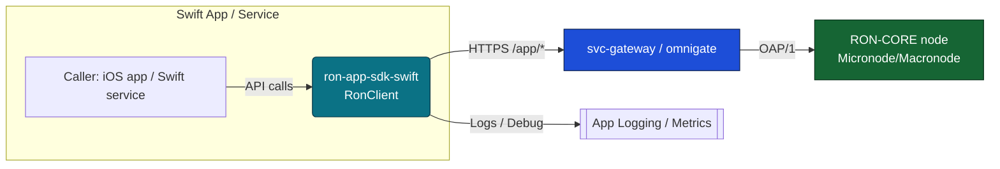
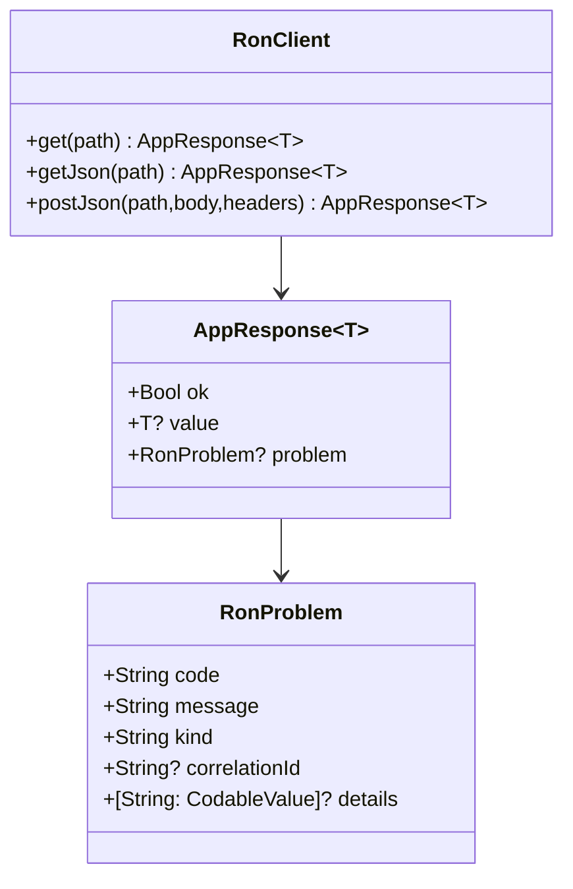
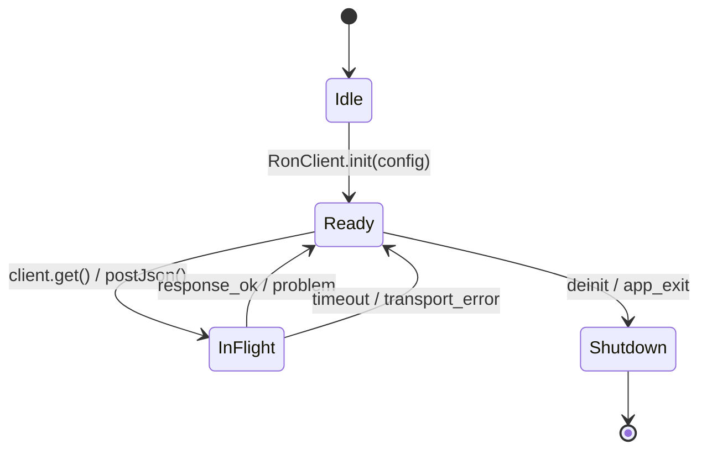

````md
# ron-app-sdk-swift

> **Role:** Swift app SDK (iOS/macOS client for RON-CORE App Plane)  
> **Owner:** Stevan White / RustyOnions  
> **Status:** developer preview (pre-beta)  
> **Swift:** 5.9+  
> **Platforms:** iOS 15+, iPadOS 15+, macOS 12+ (server-side SwiftPM targets too)  
> **Last reviewed:** 2025-12-04

Badges (future):  
[]() []() []()

---

## 1) Overview

**What it is (one paragraph):**  
`ron-app-sdk-swift` is the **official Swift client SDK** for talking to the RON-CORE App Plane via `svc-gateway` / omnigate. It wraps the RON-CORE HTTP contracts (App Plane `/app/*` surface) in a type-safe, `async/await`-first Swift API that works in both **Apple client apps** (iOS/macOS) and **server-side Swift** (SwiftPM / Vapor-style services). It gives you structured errors (`RonProblem`), predictable configuration (`RonConfig`), and sane defaults for timeouts and TLS — so you don’t have to hand-roll `URLSession` glue for every call.

**How it fits (RustyOnions topology):**

- **Pillar:** P1 Ingress (App Plane via gateway) + P6 Content (when you call app handlers that touch storage/index)  
- **Upstream callers:**
  - iOS/iPadOS/macOS apps (UIKit/SwiftUI)
  - Server-side Swift (SwiftPM binaries, Vapor/Kitura/etc.), CLIs
- **Downstream deps:**
  - `svc-gateway` / omnigate (HTTP App Plane)
  - RON-CORE Micronode/Macronode profiles (indirect through gateway)
- **Data it touches:**
  - In-memory config and DTOs (Codable structs)
  - Network (HTTPS over `URLSession`)
  - No direct disk/DB access (storage is your app’s concern)
- **Security boundary:**
  - Lives **outside** the node; runs in your app / service process
  - Handles capabilities/tokens in memory only
  - No PII storage; no key persistence; zero secrets logged

### 1.1 High-Level Architecture (Mermaid)



---

## 2) Responsibilities & Boundaries

**MUST do (core responsibilities):**

* ✅ Provide a small, idiomatic Swift API (`RonClient`, `RonConfig`, `AppResponse<T>`, `RonProblem`) over the RON-CORE App Plane HTTP surface.
* ✅ Handle config + timeouts consistently (env vars + code config).
* ✅ Map canonical error envelopes to `RonProblem` and avoid leaking raw HTML/text bodies as-is.
* ✅ Be safe to use in iOS/macOS apps (no built-in insecure storage).

**MUST NOT do (anti-scope / boundaries):**

* ❌ Must **not** implement or embed RON-CORE node logic (no overlay, DHT, storage engines, or Web3).
* ❌ Must **not** manage long-term token storage (Keychain / vaults are app responsibility).
* ❌ Must **not** silently downgrade HTTPS to HTTP.
* ❌ Must **not** invent its own DTO shapes; must follow shared schemas (`SDK_SCHEMA_IDB.MD`).

**Acceptance Gates (Dev Preview):**

* ✅ Unit tests for config, error mapping, pagination, URL building.
* ✅ CI workflow (`.github/workflows/swift-ci.yml`) running `swift build` + `swift test`.
* ✅ Example client (`examples/hello-ron`) that compiles and exercises a real call through the SDK.
* ✅ Security invariants in code: TLS-by-default, `AppResponse<T>`-based error surfaces.

Further gates for **beta/GA** are tracked in `SDK_IDB.MD` and `TODO.MD`.

---

## 3) Public Interfaces (Swift API)

> This is a **Swift library**; there is no Rust API or direct HTTP server here.

### 3.1 Core types

These types exist under `Sources/RonAppSdkSwift/`.

#### `RonConfig`

```swift
public struct RonConfig {
    public typealias HeaderProvider = () async throws -> [String: String]

    public let baseUrl: URL
    public let overallTimeoutMs: Int
    public let connectTimeoutMs: Int
    public let readTimeoutMs: Int

    public let allowInsecureHttp: Bool
    public let debug: Bool

    public let authToken: String?
    public let headerProvider: HeaderProvider?

    public init(
        baseUrl: URL,
        overallTimeoutMs: Int = 10_000,
        connectTimeoutMs: Int = 3_000,
        readTimeoutMs: Int = 7_000,
        allowInsecureHttp: Bool = false,
        debug: Bool = false,
        authToken: String? = nil,
        headerProvider: HeaderProvider? = nil
    )
}
```

**Invariants:**

- `baseUrl` **must** be HTTPS unless `allowInsecureHttp == true`.
- Timeouts are in milliseconds.
- `headerProvider` is an async hook for attaching headers (e.g. auth tokens).

#### `RonConfigOverrides`

```swift
public struct RonConfigOverrides {
    public var baseUrl: URL?
    public var overallTimeoutMs: Int?
    public var connectTimeoutMs: Int?
    public var readTimeoutMs: Int?

    public var allowInsecureHttp: Bool?
    public var debug: Bool?

    public var authToken: String?
    public var headerProvider: RonConfig.HeaderProvider?

    public init( /* all fields optional */ )
}
```

Used as a **builder** on top of environment-derived defaults.

#### `RonClient`

```swift
public final class RonClient {
    public let config: RonConfig

    public init(config: RonConfig) throws
    public convenience init(baseUrl: URL) throws

    public func get<T: Decodable>(_ path: String) async -> AppResponse<T>
    public func getJson<T: Decodable>(_ path: String) async -> AppResponse<T>

    public func postJson<T: Decodable, Body: Encodable>(
        _ path: String,
        body: Body,
        headers: [String: String] = [:]
    ) async -> AppResponse<T>
}
```

**Key points:**

- `init` may throw `SdkConfigError` if config is obviously unsafe (e.g. plain HTTP with `allowInsecureHttp == false`).
- **Public call surface does *not* throw**:
  - All call methods return `AppResponse<T>` and fold errors into `RonProblem`.
- `path` is an **App Plane path**, *not* a fully-qualified URL:
  - `client.get("/hello")` → `/app/hello` on the wire (prefixing is handled for you).

#### `AppResponse<T>`

```swift
public struct AppResponse<T: Decodable>: Decodable {
    public let ok: Bool
    public let value: T?
    public let problem: RonProblem?

    public init(ok: Bool, value: T?, problem: RonProblem?)
}
```

- For 2xx responses with decodable JSON payload:
  - `ok == true`, `value` set, `problem == nil`.
- For non-2xx or local parsing/transport failures:
  - `ok == false`, `value == nil`, `problem` set.

#### `RonProblem`

```swift
public struct RonProblem: Codable, Error {
    public let code: String
    public let message: String
    public let kind: String          // "remote" or "local"
    public let correlationId: String?
    public let details: [String: CodableValue]?
}
```

Helper constructors for local errors (subset):

```swift
public extension RonProblem {
    static func localEncodingError(message: String) -> RonProblem
    static func localDecodingError(status: Int?, message: String) -> RonProblem
    static func localHttpStatus(status: Int, bodyPreview: String?) -> RonProblem
    static func localTransportError(message: String) -> RonProblem
    static func localTransportOrBuildError(underlying: Error) -> RonProblem
}
```

**Canonical local codes:**

- `swift_sdk_encoding_error`
- `swift_sdk_decoding_error`
- `swift_sdk_http_status`
- `swift_sdk_transport_error`

These mirror patterns in other SDKs (TS/Python/PHP/JVM) so your app can treat problems uniformly.

#### Support types

Located in `Sources/RonAppSdkSwift/Types`:

- `CodableValue` — JSON “any” representation (string, number, bool, null, array, object).
- `Page<T>` — pagination envelope:

  ```swift
  public struct Page<T: Decodable>: Decodable {
      public let items: [T]
      public let nextPageToken: String?
  }
  ```

- `StringInt64` / `StringUInt64` — string-encoded 64-bit integers to avoid JSON/JS precision issues.

---

## 4) Configuration

### 4.1 Environment variables

The SDK reads environment variables via `EnvConfig` and `RonConfig.fromEnvironment(overrides:)`.

**Currently wired env vars:**

| Variable                     | Type   | Default             | Description                                         |
| ---------------------------- | ------ | ------------------- | --------------------------------------------------- |
| `RON_SDK_GATEWAY_ADDR`       | string | _none_ (**required**) | Base URL for gateway/omnigate (e.g. `https://host:8090`). |
| `RON_SDK_OVERALL_TIMEOUT_MS` | int    | `10000`             | Overall request timeout in milliseconds.            |
| `RON_SDK_CONNECT_TIMEOUT_MS` | int    | `3000`              | Connection timeout in milliseconds.                 |
| `RON_SDK_READ_TIMEOUT_MS`    | int    | `7000`              | Read timeout in milliseconds.                       |

**Reserved names (not yet wired in Swift, but used by other SDKs):**

- `RON_SDK_INSECURE_HTTP`
- `RON_SDK_DEBUG`

Right now, **Swift uses overrides for those behaviors**; env names are reserved for future parity.

### 4.2 `RonConfig.fromEnvironment(overrides:)`

`RonConfig` has an extension that builds config from env + optional overrides:

```swift
extension RonConfig {
    /// Build a RonConfig from env vars + overrides.
    ///
    /// Precedence:
    ///   1. overrides.* (if non-nil)
    ///   2. env vars (RON_SDK_*)
    ///   3. defaults (10s overall, 3s connect, 7s read)
    ///
    /// Throws SdkConfigError if base URL is missing/invalid, or if HTTP is used
    /// without allowInsecureHttp == true.
    static func fromEnvironment(
        overrides: RonConfigOverrides = RonConfigOverrides()
    ) throws -> RonConfig
}
```

**Usage (dev):**

```swift
let overrides = RonConfigOverrides(
    // For local http://127.0.0.1:8090 you must explicitly allow HTTP:
    allowInsecureHttp: true,  // DEV ONLY — do not ship this in production
    debug: true               // used by the SDK’s internal logger
)

let config = try RonConfig.fromEnvironment(overrides: overrides)
let client = try RonClient(config: config)
```

Set `RON_SDK_GATEWAY_ADDR` to point at your gateway:

```bash
export RON_SDK_GATEWAY_ADDR=http://127.0.0.1:8090   # local dev, HTTP
```

For production, you typically:

- Use `https://…` base URLs, and
- Avoid `allowInsecureHttp = true`.

### 4.3 Code-based config (no env)

You can also bypass env entirely and build config directly:

```swift
let config = RonConfig(
    baseUrl: URL(string: "https://my-node.example.com:8090")!,
    overallTimeoutMs: 10_000,
    connectTimeoutMs: 3_000,
    readTimeoutMs: 7_000,
    allowInsecureHttp: false,
    debug: false,
    headerProvider: {
        // Example: fetch a token from your own token store / Keychain.
        let token = try await tokenStore.currentToken()
        return ["Authorization": "Bearer \(token)"]
    }
)

let client = try RonClient(config: config)
```

---

## 5) Build, Run, Test (SwiftPM)

### 5.1 Add as a SwiftPM dependency

When this is published as its own package:

```swift
// Package.swift
dependencies: [
    .package(
        url: "https://github.com/rustyonions/ron-app-sdk-swift.git",
        from: "0.1.0"
    )
],
targets: [
    .target(
        name: "MyApp",
        dependencies: [
            .product(name: "RonAppSdkSwift", package: "ron-app-sdk-swift")
        ]
    )
]
```

In the monorepo, we currently depend via `.package(path: "../../")` from examples.

### 5.2 Build & test the SDK itself

From the repo root:

```bash
cd sdk/ron-app-sdk-swift

swift build
swift test -v
```

CI workflow (`.github/workflows/swift-ci.yml`) does essentially this on `macos-latest`.

You can also target individual test suites:

```bash
swift test --filter ErrorMappingTests
swift test --filter UrlBuildingTests
swift test --filter RonClientTests
# InteropTests currently contains a placeholder happy-path test.
```

---

## 6) Observability

The Swift SDK itself does not expose HTTP endpoints or metrics, but it is designed to work cleanly with your logging and metrics.

### 6.1 Logging

- SDK uses a small `RonLogger` facade internally.
- When `config.debug == true`, you’ll see log lines like:

  ```text
  [ron-sdk-swift][DEBUG] HttpTransport.send GET http://127.0.0.1:8090/app/hello
  [ron-sdk-swift][DEBUG] HttpTransport.recv status=404 bytes=0
  ```

These are safe to pipe into your logging system (they avoid printing secrets).

### 6.2 Metrics (recommended pattern in your app)

Typical metrics you might expose in your own app:

- `ron_sdk_requests_total{method,path,code}` – counter  
- `ron_sdk_request_latency_seconds{method,path}` – histogram  
- `ron_sdk_errors_total{code,kind}` – counter from `RonProblem.code/kind`

You can compute these by wrapping `RonClient` calls:

```swift
let res: AppResponse<MyDto> = await client.get("/hello")
// inspect res.ok/res.problem, record metrics in your own system
```

---

## 7) Performance & SLOs (Targets)

> These are **targets**, not guarantees. They depend on your node + network.

| Metric                | Target  | Notes                                     |
| --------------------- | ------- | ----------------------------------------- |
| P50 client overhead   | \< 5 ms | SDK overhead vs raw `URLSession`          |
| P99 client overhead   | \< 10 ms| On typical dev hardware                   |
| Start-to-first-call   | \< 100 ms | Client init + first request               |

Benchmarks will eventually live as dedicated tests/targets (tracked in `TODO.MD`), but the design keeps client overhead small: the SDK is mostly lightweight request/response wiring.

---

## 8) Data & Schema

The SDK:

- Does **not** persist data.
- Serializes/deserializes your DTOs using `Codable`.
- Uses canonical schema shapes defined in `SDK_SCHEMA_IDB.MD`:
  - `AppResponse<T>`
  - `RonProblem`
  - `Page<T>`
  - `StringInt64` / `StringUInt64`
  - `CodableValue`



---

## 9) Security & Privacy (SDK Perspective)

- **TLS-by-default:**  
  - If `baseUrl` uses `http://` and `allowInsecureHttp == false`, the SDK throws `SdkConfigError` at init.
- **Error surfaces:**  
  - Node-side errors → remote `RonProblem` from JSON body.  
  - SDK/local errors → local `RonProblem` with code starting with `swift_sdk_*`.
- **Tokens/caps:**
  - Passed via headers only (e.g. from `headerProvider` or `authToken`).
  - Not persisted, not logged.
- **PII:**
  - SDK treats all DTOs as opaque; you decide what to log.
  - Avoid logging full DTOs in production if they might contain PII.

See `SDK_SECURITY.MD` for the full checklist and invariants.

---

## 10) Error Taxonomy (Swift)

High-level categories:

| Category / Type                    | When it happens                               | Retry?            |
| ---------------------------------- | --------------------------------------------- | ----------------- |
| `SdkConfigError`                   | Misconfiguration, unsafe base URL             | No — fix config   |
| `RonProblem.code=swift_sdk_*`     | Local SDK errors (encoding/decoding/http)     | Maybe, with care  |
| Remote `RonProblem.kind="auth"`   | Bad/expired caps, unauthorized                 | No, re-auth first |
| Remote `RonProblem.kind="policy"` | Policy denied by node                          | No (until policy change) |
| Remote `RonProblem.kind="rate_limit"` | 429/backpressure                            | Yes, with backoff |
| Remote `RonProblem.kind="internal"`   | Node-side failures                           | Maybe, with caution |

Public call methods **never throw**; they always return `AppResponse<T>`. Only config/initialization can throw.

---

## 11) Concurrency Model

- Uses Swift concurrency (`async/await`, `Task`).
- Uses `URLSession` under the hood.
- `RonClient` is safe to share between tasks, as it holds immutable configuration and internal transport.

Cancellation is honored via `Task` cancellation and propagated down to `URLSession`.



---

## 12) Examples

### 12.1 Minimal “Hello RON-CORE” example (matches `examples/hello-ron`)

```swift
import Foundation
import RonAppSdkSwift

struct Greeting: Decodable {
    let message: String
}

@main
struct HelloRon {
    static func main() async {
        do {
            // Configure from env, with explicit HTTP opt-in for local dev.
            let overrides = RonConfigOverrides(
                allowInsecureHttp: true, // DEV ONLY
                debug: true
            )

            let config = try RonConfig.fromEnvironment(overrides: overrides)
            let client = try RonClient(config: config)

            // This calls /app/hello on the gateway (prefixing is handled by the SDK).
            let res: AppResponse<Greeting> = await client.get("/hello")

            if res.ok, let greeting = res.value {
                print("Server says:", greeting.message)
            } else if let problem = res.problem {
                print("Call failed:", problem.code, "-", problem.message)
            } else {
                print("Call failed with unknown error")
            }
        } catch {
            // SDK-local errors: misconfiguration, invalid URL, etc.
            print("RON SDK error:", error)
        }
    }
}
```

**Run it (from the monorepo):**

```bash
cd sdk/ron-app-sdk-swift/examples/hello-ron

RON_SDK_GATEWAY_ADDR=http://127.0.0.1:8090 \
swift run HelloRon
```

You should see debug logs from the transport, and either a successful decoded response or a `swift_sdk_http_status` problem if the route doesn’t exist yet.

> Note: you’ll need an app-plane handler mounted at `/app/hello` on your gateway for a real success path. The stock macronode may not expose this route by default; adjust the path to point at a real handler in your app-plane.

### 12.2 Calling a paginated facet endpoint

Assuming your app exposes:

```http
GET /app/facets/blog/posts
```

returning `Page<PostDto>`:

```swift
struct PostDto: Decodable {
    let id: StringInt64
    let title: String
}

func listPosts(client: RonClient) async {
    let res: AppResponse<Page<PostDto>> = await client.get("/facets/blog/posts")

    if res.ok, let page = res.value {
        print("Got \(page.items.count) posts; next page token:", page.nextPageToken ?? "none")
    } else {
        print("Failed:", res.problem ?? RonProblem.localTransportError(message: "Unknown error"))
    }
}
```

---

## 13) Troubleshooting

- **Config/URL errors (SdkConfigError):**
  - Check `RON_SDK_GATEWAY_ADDR`.
  - If using `http://`, make sure you pass `allowInsecureHttp: true` in overrides or config (dev only).

- **404 / `swift_sdk_http_status`:**
  - The route may not exist yet on your app-plane.
  - Verify path and method match your RON-CORE app handler.

- **TLS errors:**
  - Check gateway certificate and trust chain.
  - For local self-signed certs, trust your CA on the device/simulator.

- **Decoding errors (`swift_sdk_decoding_error`):**
  - Check that the JSON payload matches your DTO and `SDK_SCHEMA_IDB.MD`.
  - Inspect payload in dev logs (avoid logging sensitive data in prod).

- **Auth/capability problems (`kind="auth"`):**
  - Ensure tokens/caps are valid and attached via `headerProvider` or `authToken`.

---

## 14) Development Notes

- `RonConfig` is immutable; `RonClient` holds a `let config`.
- All public DTOs conform to `Codable` and follow schemas in `SDK_SCHEMA_IDB.MD`.
- Unit tests exist for:
  - Config/env parsing
  - URL building and `/app` prefix handling
  - Pagination decoding
  - Error mapping (`RonProblem` helpers, HTTP status handling)

**Quick pre-commit check:**

```bash
cd sdk/ron-app-sdk-swift
swift test
# (Add swiftformat/swiftlint later if desired)
```

If you change DTOs or error mapping, please also update:

- `SDK_SCHEMA_IDB.MD`
- `SDK_SECURITY.MD`
- Relevant tests under `Tests/RonAppSdkSwiftTests/`

---

## 15) Roadmap & TODO (high level)

Tracked in more depth in `SDK_IDB.MD` and `TODO.MD`, but roughly:

- **M1 — Developer Preview (✅)**  
  - Core `RonClient` + `RonConfig` + `AppResponse<T>` + `RonProblem`.  
  - Env-based config + overrides.  
  - Unit tests + basic CI + Hello example.

- **M2 — Interop & Hardening (WIP / Next)**  
  - Stronger interop tests against macronode (happy path + auth failure).  
  - More exhaustive error mapping tests and edge cases.

- **M3 — Facets & Helpers**  
  - Optional facet helpers (sugar over `client.get("/facets/...")`).  
  - Convenience helpers for common pagination patterns.

- **M4 — DX & Linting**  
  - Optional SwiftLint/swift-format integration.  
  - Vapor integration examples and recipes.

- **M5 — God-Tier**  
  - Property/chaos tests for error paths.  
  - Parity with other SDKs across all edge cases and interop suites.

---

## 16) Changelog

See [CHANGELOG.md](./CHANGELOG.md).  
This SDK follows SemVer and tracks RON-CORE protocol changes in `SDK_IDB.MD`.

---

## 17) License

Dual-licensed under **MIT** or **Apache-2.0**.  
See [LICENSE-MIT](./LICENSE-MIT) and [LICENSE-APACHE](./LICENSE-APACHE).

---

## 18) Contributing

PRs welcome!

Please:

- Run `swift test` before submitting.
- Update docs and examples if you change public APIs.
- Mention any schema or security-relevant changes in your PR description.
- Keep DTOs aligned with `SDK_SCHEMA_IDB.MD` and invariants in `SDK_IDB.MD`.

> Also see: `SDK_IDB.MD`, `SDK_SCHEMA_IDB.MD`, and `SDK_SECURITY.MD` for invariant-driven design details of this SDK.
````
