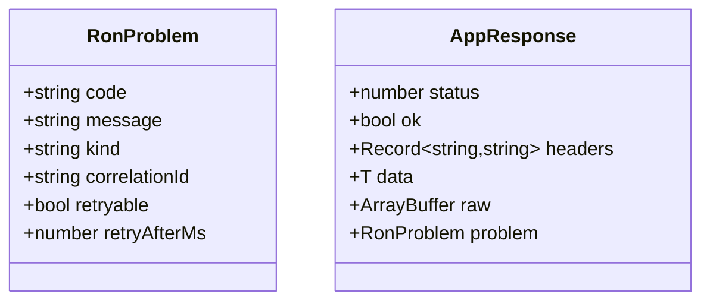
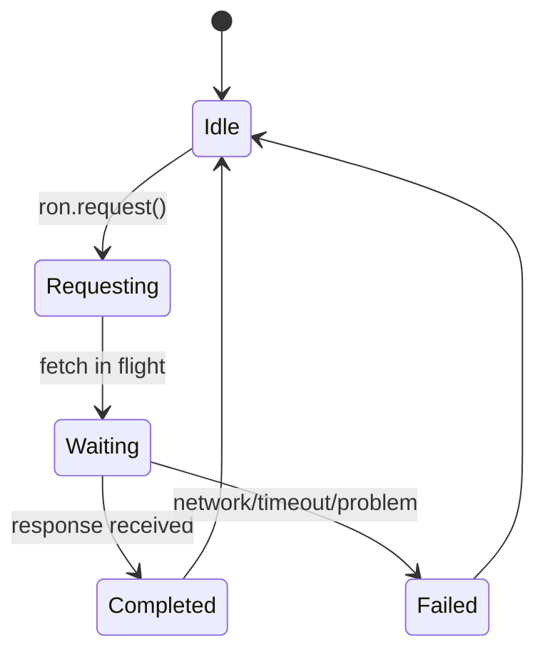

````md
# ron-app-sdk-ts

> **Role:** TypeScript / JavaScript App SDK  
> **Owner:** Stevan White (RustyOnions / RON-CORE)  
> **Status:** draft (pre-beta)  
> **Runtime targets:** Modern browsers, Node 18+ (with global `fetch`), Deno/Workers (future)  
> **Last reviewed:** 2025-11-22

Badges (future):  
[]() []() []()

---

## 1) Overview

**What it is (one paragraph):**  
`ron-app-sdk-ts` is the official TypeScript / JavaScript SDK for talking to the RON-CORE **app plane** over HTTP. It wraps `fetch` with a small, opinionated `Ron` client that builds `/app/*` URLs, injects observability headers (`x-request-id`, `x-correlation-id`), encodes/decodes JSON, and maps RON Problem JSON into safe, structured error values instead of thrown exceptions.:contentReference[oaicite:0]{index=0}

**How it fits (RustyOnions topology):**

- **Pillar:** App Plane + Developer Experience (DX) + Security (SEC)
- **Upstream callers:**
  - Browser apps (React/Next/Vite/etc.)
  - Node backends, serverless functions, edge workers
- **Downstream deps:**
  - `svc-gateway` at `https://<node>/app/*` (primary):contentReference[oaicite:1]{index=1}
  - indirectly `omnigate` (`/v1/app/*`) and app handlers via `ron-app-sdk-rs`:contentReference[oaicite:2]{index=2}
- **Data it touches:**
  - In-memory DTOs and HTTP bodies only (no local DB)
  - Canonical RON-CORE DTOs & error envelopes (schema-driven):contentReference[oaicite:3]{index=3}
- **Security boundary:**
  - Treats browser as **untrusted**; no long-term secret storage
  - Treats Node as **trusted but must not leak caps** (tokens/macaroons):contentReference[oaicite:4]{index=4}

### 1.1 High-Level Architecture (Mermaid REQUIRED)

```mermaid
flowchart LR
  subgraph App["App code (browser / Node)"]
    A[React/Next/Node service] -->|TS import| B[Ron client<br/>ron-app-sdk-ts]
  end

  B -->|HTTPS /app/*| C[svc-gateway]
  C -->|HTTP /v1/app/*| D[omnigate]
  D -->|App plane| E[App handlers<br/>(ron-app-sdk-rs)]

  style B fill:#0b7285,stroke:#083344,color:#fff
  style C fill:#1f2933,stroke:#111827,color:#fff
  style D fill:#111827,stroke:#020617,color:#fff
```
````

---

## 2) Responsibilities & Boundaries

**MUST do (core responsibilities):**

- [x] Provide a small, ergonomic `Ron` client that wraps `fetch` for `/app/*` calls (browser + Node).
- [x] Enforce security invariants from `SDK_SECURITY.md` (no secrets in logs, bounded timeouts/retries, no caps in URLs).
- [x] Implement the canonical `AppRequest`, `AppResponse<T>`, and `RonProblem` shapes defined in `SDK_IDB.md` / `SDK_SCHEMA_IDB.md`.
- [x] Preserve and/or inject observability headers (`x-request-id`, `x-correlation-id`) on every request.

**MUST NOT do (anti-scope / boundaries):**

- [x] Must **not** talk directly to `/v1/app/*` (that's gateway → omnigate internal).
- [x] Must **not** store capabilities/tokens in browser `localStorage`/`sessionStorage` internally.
- [x] Must **not** invent custom JSON schemas for core RON DTOs; must follow `ron-proto`/HTTP schemas.
- [x] Must **not** auto-retry non-idempotent operations (POST/DELETE) behind the user’s back.

**Acceptance Gates (PROOF you did it):**

- [ ] Unit tests covering URL building, header merge, JSON encode/decode, and error mapping for all status classes.
- [ ] Integration tests against a real `svc-gateway` that exercise `/app/ping`, JSON POST, header propagation, problem passthrough, 502, and network failure.
- [ ] Security tests verifying no caps in logs, no caps in URLs, and structured error envelopes for malformed responses.
- [ ] Benchmarks showing SDK overhead vs raw `fetch` is within the target (< ~5% latency overhead on simple calls).

---

## 3) TypeScript API (library)

### 3.1 Core types

```ts
export type HttpMethod = 'GET' | 'POST' | 'PUT' | 'PATCH' | 'DELETE';

export interface AppRequest {
  method: HttpMethod;
  path: string; // "/hello", "/kv/put", "/auth/register"
  query?: Record<string, string>;
  headers?: Record<string, string>;
  body?: unknown; // JSON-encoded if object
}

export interface RonProblem {
  code: string; // "upstream_unavailable", "problem_400", etc
  message?: string;
  kind?: string;
  correlationId?: string;
  retryable?: boolean;
  retryAfterMs?: number;
  reason?: string;
  details?: Record<string, unknown>;
}

export interface AppResponse<T = unknown> {
  status: number;
  ok: boolean; // status 200–299
  headers: Record<string, string>;
  data?: T; // parsed JSON, if JSON body
  raw?: ArrayBuffer; // raw bytes, if non-JSON
  problem?: RonProblem; // present when !ok
}
```

These shapes are derived from the canonical `SDK_IDB.md` + `SDK_SCHEMA_IDB.md` contract and the gateway Problem JSON spec.

### 3.2 Ron client

```ts
import { Ron } from 'ron-app-sdk-ts';

const ron = new Ron({
  baseUrl: 'https://my-node.example.com',
  // optional auth:
  authToken: 'Bearer <jwt-or-macaroon>',
  passportToken: '<capability-token>',
});

async function main() {
  const res = await ron.get<{ message: string }>('/hello');

  if (res.ok && res.data) {
    console.log('Hello from RON:', res.data.message);
  } else {
    console.error('RON error:', res.status, res.problem);
  }
}
```

#### Public surface (MVP)

```ts
class Ron {
  constructor(options: RonOptions);

  request<T = unknown>(req: AppRequest): Promise<AppResponse<T>>;

  get<T = unknown>(
    path: string,
    query?: Record<string, string>
  ): Promise<AppResponse<T>>;

  post<T = unknown>(
    path: string,
    body?: unknown,
    query?: Record<string, string>
  ): Promise<AppResponse<T>>;

  put<T = unknown>(...): Promise<AppResponse<T>>;
  patch<T = unknown>(...): Promise<AppResponse<T>>;
  delete<T = unknown>(...): Promise<AppResponse<T>>;
}
```

**Invariants:**

- `path` is **always app-relative** (e.g. `"/hello"`). The SDK constructs `baseUrl + "/app" + path`.
- The SDK **never** calls `/v1/app/*`.
- Server-originated errors (4xx/5xx/502) **never throw**; they appear as `AppResponse` with `ok === false` and `problem` populated. Only local SDK mis-use (e.g. invalid `baseUrl`) rejects the Promise.

---

## 4) HTTP / Wire Behavior

### 4.1 Base URL & paths

- **Base URL:** `https://<gateway-host>` (the node’s external address)
- **SDK target:** `baseUrl + "/app" + path`
- **Example:**
  - `baseUrl = "https://my-node.example.com"`
  - `path = "/hello"`
  - Request goes to `https://my-node.example.com/app/hello`.

### 4.2 Required outbound headers

The SDK ensures the following headers are present (merging with user headers):

- `x-request-id`: UUID v4 (if caller didn’t set)
- `x-correlation-id`: equals `x-request-id` by default; can be overridden
- `accept`: `application/json` (by default)
- `content-type`: `application/json` when `body` is an object and caller didn’t override

**Forbidden / hop-by-hop headers** (never set by SDK):

- `Host`, `Connection`, `Content-Length`, `Transfer-Encoding`, `Trailer`, `TE`, `Upgrade`

---

## 5) Configuration

> TS SDK uses a mix of **constructor options** and **env vars** (for Node). Browsers ignore env vars.

### 5.1 RonOptions

```ts
export interface RonOptions {
  baseUrl: string; // required; must be https:// in production

  // Auth / caps (optional)
  authToken?: string; // e.g. "Bearer <jwt>"
  passportToken?: string; // capability macaroon

  // Timeouts (ms)
  overallTimeoutMs?: number;
  connectTimeoutMs?: number; // Node/Workers only
  readTimeoutMs?: number;

  // Observability
  requestIdFactory?: () => string;
  onRequest?: (req: AppRequest & { url: string }) => void;
  onResponse?: <T>(res: AppResponse<T>) => void;

  // Dynamic header source (for rotation)
  headerProvider?: () =>
    | Record<string, string>
    | Promise<Record<string, string>>;

  // Dev-only
  allowInsecureHttp?: boolean; // default false
  debug?: boolean; // extra diagnostics w/ scrubbing
}
```

### 5.2 Environment variables (Node only)

| Variable                     | Type   | Default         | Description                                  |
| ---------------------------- | ------ | --------------- | -------------------------------------------- |
| `RON_SDK_GATEWAY_ADDR`       | string | _none_          | Default `baseUrl` if not provided in options |
| `RON_SDK_OVERALL_TIMEOUT_MS` | int    | `10000`         | Overall request timeout                      |
| `RON_SDK_CONNECT_TIMEOUT_MS` | int    | runtime default | Node: socket connect timeout                 |
| `RON_SDK_READ_TIMEOUT_MS`    | int    | runtime default | Node: read inactivity timeout                |

These env vars are defined in the shared schema IDB and must be honored as defaults by all SDKs.

---

## 6) Build, Run, Test

This is a pure TS/JS package; use your preferred package manager.

**Install (consumer app):**

```bash
npm install ron-app-sdk-ts
# or
pnpm add ron-app-sdk-ts
# or
yarn add ron-app-sdk-ts
```

**Build (library itself):**

```bash
pnpm install
pnpm build
```

Suggested stack:

- TypeScript 5.x (strict mode)
- bundler: Vite/Rollup/TSUP (ESM + CJS bundles)

**Tests (unit/integration):**

```bash
pnpm test           # Vitest/Jest unit tests
pnpm test:lint      # ESLint + Prettier
pnpm test:integration   # hits local `svc-gateway` /app/*
```

**Security & deps (TS analog of cargo-deny):**

```bash
pnpm audit
pnpm lint
```

**Bench (if provided):**

```bash
pnpm bench          # compare vs raw fetch
```

---

## 7) Observability

`ron-app-sdk-ts` doesn’t expose `/metrics` itself, but it is **observability-aware**:

- Always forwards / injects:
  - `x-request-id`
  - `x-correlation-id`

- Provides hooks:

  ```ts
  const ron = new Ron({
    baseUrl,
    onRequest: (req) => {
      console.log('RON request', { method: req.method, path: req.path });
    },
    onResponse: (res) => {
      console.log('RON response', { status: res.status, ok: res.ok });
    },
  });
  ```

**Canonical metrics (downstream services):**

While the SDK doesn’t emit Prometheus metrics itself, its behavior is designed so that downstream nodes can rely on standard metrics like:

- `gateway_http_requests_total{route="/app/...",method}`
- `request_latency_seconds{route="/app/...",method}`
- `errors_total{stage="gateway",kind}`

and the correlation IDs it forwards can be wired into logs / tracing.

---

## 8) Performance & SLOs

| Metric                   | Target (SDK)         | Notes                                         |
| ------------------------ | -------------------- | --------------------------------------------- |
| Added P50 latency        | ≤ 5% vs raw `fetch`  | simple `/app/ping` calls                      |
| Added P99 latency        | ≤ 10% vs raw `fetch` | under nominal load                            |
| Max sustainable RPS/node | HTTP-bound           | SDK should not be the bottleneck              |
| Overhead allocations     | minimal              | no unbounded buffers, no hidden global caches |

Repro path (Node):

- Run a local `svc-gateway` + test app.
- Benchmark `ron-app-sdk-ts` vs plain `fetch` to `/app/ping` at various concurrency levels.

---

## 9) Data & Schema

There is no local persistent data store inside the SDK. Instead, it speaks canonical RON-CORE schemas over HTTP:

- DTOs are defined by `ron-proto` + HTTP/OpenAPI, then mapped into TS via `SDK_SCHEMA_IDB.md`.
- Key rules:
  - `u64`/`i64` appear as **JSON strings** (TS type: `string`; optional helper to parse as `bigint`).
  - timestamps appear as ISO 8601 strings; apps may convert to `Date`.
  - optional fields are omitted when missing (not serialized as `null` by default).



Facet manifest generation helpers (TOML) are planned as **future** functionality, and must follow the uniform facet schema when implemented.

---

## 10) Security & Privacy

Security is driven by the shared `SDK_SECURITY.md` blueprint.

**Threat model (short):**

- **Browser:** hostile environment (XSS, extension snooping, stolen devices). Tokens must be short-lived; storage is dangerous.
- **Node:** trusted environment but may still leak secrets via logs/misconfig.

**Key handling:**

- No caps/tokens are ever logged by the SDK (including in debug mode; debug must scrub secrets).
- No caps/tokens are ever placed in URLs, query strings, or facet manifests.
- SDK does **not** internally persist tokens in browser storage; caller is responsible for secure acquisition/refresh.

**PII:**

- The SDK is **transport only**; it does not inspect or log bodies. It forwards whatever JSON you send. Apps must handle PII carefully.

**Input validation / limits:**

- Configurable timeouts (overall + connect/read).
- Optional response size caps and concurrency limits to mitigate accidental DoS amplification (planned as part of RES/SEC hardening).

---

## 11) Error Taxonomy

`ron-app-sdk-ts` surfaces **value-based** errors, not thrown exceptions, for all server-originated problems.

| Scenario                 | AppResponse shape                                                                   | Retry?                    |
| ------------------------ | ----------------------------------------------------------------------------------- | ------------------------- |
| 2xx success              | `ok=true`, `data` or `raw` set                                                      | n/a                       |
| 4xx app error            | `ok=false`, `status=4xx`, `problem.code="problem_400"`                              | maybe (depends on app)    |
| 5xx app error            | `ok=false`, `status=5xx`, `problem` filled                                          | maybe                     |
| 502 upstream unavailable | `ok=false`, `status=502`, `problem.code="upstream_unavailable"`, `retryable=true`   | maybe with backoff        |
| Network / DNS / timeout  | `ok=false`, `status=0`, `problem.code="local_network_failure"` or `"local_timeout"` | yes, with jitter          |
| Malformed non-JSON error | `ok=false`, `problem.code="transport_error"`                                        | maybe, depending on cause |

All errors expose a **canonical `RonProblem`** where possible; otherwise, a safe generic problem with no raw stack traces or tokens.

---

## 12) Concurrency Model

There is no explicit runtime like tokio; concurrency is the JS event loop and `Promise` scheduling.

**Rules:**

- Each `Ron` instance is independent; it holds config, not shared mutable global state.
- Node: concurrency is bounded by your `Promise` usage; you may layer a simple limiter (future helper).
- The SDK never spawns background loops or interval timers unless explicitly requested (e.g., future streaming/keepalive APIs).



---

## 13) Compatibility & Requirements

- **Node:** 18+ (global `fetch`, `AbortController`).
- **Browser:** Evergreen Chrome/Firefox/Safari/Edge, modern mobile WebView.
- **TypeScript:** 5.0+ (strict recommended).
- **Bundlers:** Vite, Webpack, Rollup, esbuild, TSUP (ESM + CJS builds).

Protocol compatibility:

- Initial line: `ron-app-sdk-ts` 0.1.x targets the same app-plane contract as the current `svc-gateway` + `omnigate` snapshot (schema/protocol `v0.1`).

---

## 14) Examples

### 14.1 Simple GET

```ts
import { Ron } from 'ron-app-sdk-ts';

const ron = new Ron({ baseUrl: 'https://my-node.example.com' });

async function ping() {
  const res = await ron.get<{ pong: string }>('/ping');

  if (!res.ok || !res.data) {
    console.error('Ping failed:', res.problem);
    return;
  }

  console.log('Ping:', res.data.pong);
}
```

### 14.2 POST with JSON body + query params

```ts
const ron = new Ron({
  baseUrl: 'https://my-node.example.com',
  authToken: 'Bearer <access-token>',
});

async function putKv() {
  const res = await ron.post<{ ok: boolean }>(
    '/kv/put',
    { key: 'foo', value: 'bar' },
    { region: 'us-west' },
  );

  if (!res.ok || !res.data) {
    console.error('KV put failed:', res.problem);
    return;
  }

  console.log('KV put ok:', res.data.ok);
}
```

### 14.3 Handling errors without try/catch

```ts
const res = await ron.get('/maybe-errors-here');

if (res.ok) {
  // happy path
} else if (res.problem) {
  switch (res.problem.code) {
    case 'upstream_unavailable':
      // show "please retry later"
      break;
    case 'local_network_failure':
      // suggest checking connection
      break;
    default:
    // generic error UI
  }
} else {
  // fallback – unknown condition
}
```

---

## 15) Troubleshooting

- **I’m getting CORS errors in the browser:**
  Ensure your node’s `svc-gateway` is configured with correct `Access-Control-Allow-Origin` and `Access-Control-Allow-Headers` including `Authorization` and RON headers.

- **Calls hang forever:**
  Check your `overallTimeoutMs` and env vars (`RON_SDK_OVERALL_TIMEOUT_MS`). Timeouts must be set and obeyed by the SDK.

- **Tokens show up in logs:**
  Audit your `onRequest` / `onResponse` hooks or custom loggers. The SDK never logs secrets by default; custom hooks must also scrub them.

- **I need to use HTTP in dev:**
  Set `allowInsecureHttp: true` only for local development. Never use it in production.

---

## 16) Mermaid Diagrams — Policy & Tooling

This README already includes:

1. An **architecture** diagram (client → SDK → gateway → omnigate).
2. A **state** diagram for request lifecycle.

You can add more (sequence diagrams for specific flows) under `docs/` as `.mmd` files and render to `.svg` with `@mermaid-js/mermaid-cli` if you want richer docs, mirroring the pattern used in other RON-CORE crates.

Example render command:

```bash
npm i -g @mermaid-js/mermaid-cli
mmdc -i docs/ron-app-sdk-ts-arch.mmd -o docs/ron-app-sdk-ts-arch.svg
```

---

## 17) Roadmap & TODO

- [ ] **M1 — Core client MVP**
  - Implement `Ron` client, `AppRequest`, `AppResponse<T>`, `RonProblem`.
  - Implement header injection, timeouts, and baseUrl + `/app` routing.
  - Unit tests for URL building, headers, JSON, and error mapping.

- [ ] **M2 — Integration & Security**
  - Integration tests with real `svc-gateway` and test app.
  - Security tests (no caps in logs/URLs, proper problem envelopes).
  - Basic benchmarks vs raw `fetch`.

- [ ] **M3 — Schema & Codegen**
  - Introduce DTO codegen from canonical schemas (`ron-proto`/OpenAPI).
  - Drift-check CI (fail on regenerated type diffs).

- [ ] **M4 — Framework helpers & DX**
  - React/Next examples or small helper package.
  - Richer docs and cookbook (“recipes”) for common app patterns.

- [ ] **M5 — Streaming & Advanced Features**
  - SSE/WebSocket support with bounded reconnection/backoff.
  - Facet manifest builders (static/proxy) aligned with `SDK_SCHEMA_IDB`.

---

## 18) Changelog

See [CHANGELOG.md](./CHANGELOG.md) (to be created).
Follow SemVer; document breaking changes and migration notes for each major release.

---

## 19) License

Dual-licensed under **MIT** or **Apache-2.0**.
See [LICENSE-MIT](../LICENSE-MIT) and [LICENSE-APACHE](../LICENSE-APACHE).

---

## 20) Contributing

PRs welcome!

Before opening a PR:

- Run `pnpm lint`, `pnpm test`, and integration tests if you touched HTTP behavior.
- Keep README and diagrams in sync with any topology/protocol changes.
- Ensure new features obey the invariants in:
  - `SDK_IDB.md`
  - `SDK_SECURITY.md`
  - `SDK_SCHEMA_IDB.md`

> For deeper design rationale and invariants, see `SDK_IDB.md` and the carry-over notes for `ron-app-sdk-ts` in `ALLNOTES.md`.

```

```
