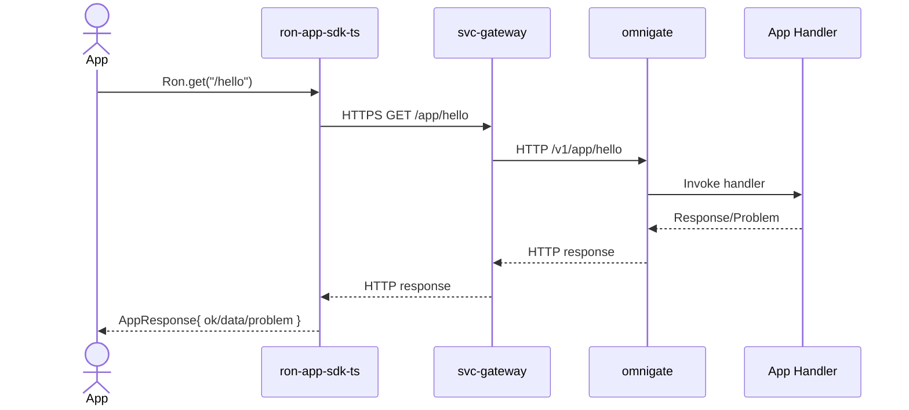
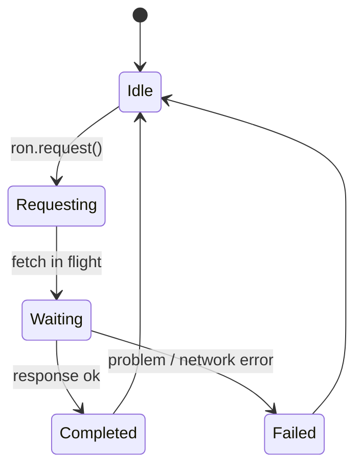

<!-- Generated by scripts/make_sdk_codex.sh on 2025-11-23T19:16:41Z -->
# Code Bundle — SDK `ron-app-sdk-ts`

> Generated for review/sharing. Source of truth remains the repo.
> Includes all non-Markdown files under sdk/ron-app-sdk-ts (skips node_modules, dist, coverage, .git, .DS_Store).

## Table of Contents
- [sdk/ron-app-sdk-ts/.gitignore](#sdk-ron-app-sdk-ts--gitignore)
- [sdk/ron-app-sdk-ts/.prettierignore](#sdk-ron-app-sdk-ts--prettierignore)
- [sdk/ron-app-sdk-ts/.prettierrc](#sdk-ron-app-sdk-ts--prettierrc)
- [sdk/ron-app-sdk-ts/docs/ron-app-sdk-ts-arch.mmd](#sdk-ron-app-sdk-ts-docs-ron-app-sdk-ts-arch-mmd)
- [sdk/ron-app-sdk-ts/docs/ron-app-sdk-ts-seq-app-call.mmd](#sdk-ron-app-sdk-ts-docs-ron-app-sdk-ts-seq-app-call-mmd)
- [sdk/ron-app-sdk-ts/docs/ron-app-sdk-ts-state.mmd](#sdk-ron-app-sdk-ts-docs-ron-app-sdk-ts-state-mmd)
- [sdk/ron-app-sdk-ts/eslint.config.mjs](#sdk-ron-app-sdk-ts-eslint-config-mjs)
- [sdk/ron-app-sdk-ts/package.json](#sdk-ron-app-sdk-ts-package-json)
- [sdk/ron-app-sdk-ts/pnpm-lock.yaml](#sdk-ron-app-sdk-ts-pnpm-lock-yaml)
- [sdk/ron-app-sdk-ts/src/client.ts](#sdk-ron-app-sdk-ts-src-client-ts)
- [sdk/ron-app-sdk-ts/src/config.ts](#sdk-ron-app-sdk-ts-src-config-ts)
- [sdk/ron-app-sdk-ts/src/errors.ts](#sdk-ron-app-sdk-ts-src-errors-ts)
- [sdk/ron-app-sdk-ts/src/facets/manifest.ts](#sdk-ron-app-sdk-ts-src-facets-manifest-ts)
- [sdk/ron-app-sdk-ts/src/index.ts](#sdk-ron-app-sdk-ts-src-index-ts)
- [sdk/ron-app-sdk-ts/src/transport.ts](#sdk-ron-app-sdk-ts-src-transport-ts)
- [sdk/ron-app-sdk-ts/src/types.ts](#sdk-ron-app-sdk-ts-src-types-ts)
- [sdk/ron-app-sdk-ts/src/utils/headers.ts](#sdk-ron-app-sdk-ts-src-utils-headers-ts)
- [sdk/ron-app-sdk-ts/src/utils/problem.ts](#sdk-ron-app-sdk-ts-src-utils-problem-ts)
- [sdk/ron-app-sdk-ts/src/utils/timeouts.ts](#sdk-ron-app-sdk-ts-src-utils-timeouts-ts)
- [sdk/ron-app-sdk-ts/src/utils/url.ts](#sdk-ron-app-sdk-ts-src-utils-url-ts)
- [sdk/ron-app-sdk-ts/test/client.basic.test.ts](#sdk-ron-app-sdk-ts-test-client-basic-test-ts)
- [sdk/ron-app-sdk-ts/test/errors.mapping.test.ts](#sdk-ron-app-sdk-ts-test-errors-mapping-test-ts)
- [sdk/ron-app-sdk-ts/test/facets.basic.test.ts](#sdk-ron-app-sdk-ts-test-facets-basic-test-ts)
- [sdk/ron-app-sdk-ts/test/schema.interop.test.ts](#sdk-ron-app-sdk-ts-test-schema-interop-test-ts)
- [sdk/ron-app-sdk-ts/test/security.no_secrets.test.ts](#sdk-ron-app-sdk-ts-test-security-nosecrets-test-ts)
- [sdk/ron-app-sdk-ts/test/transport.timeouts.test.ts](#sdk-ron-app-sdk-ts-test-transport-timeouts-test-ts)
- [sdk/ron-app-sdk-ts/tsconfig.build.json](#sdk-ron-app-sdk-ts-tsconfig-build-json)
- [sdk/ron-app-sdk-ts/tsconfig.json](#sdk-ron-app-sdk-ts-tsconfig-json)
- [sdk/ron-app-sdk-ts/vitest.config.ts](#sdk-ron-app-sdk-ts-vitest-config-ts)

### sdk/ron-app-sdk-ts/.gitignore
<a id="sdk-ron-app-sdk-ts--gitignore"></a>

```
dist
coverage
node_modules
*.log

```

### sdk/ron-app-sdk-ts/.prettierignore
<a id="sdk-ron-app-sdk-ts--prettierignore"></a>

```
dist
coverage
node_modules

```

### sdk/ron-app-sdk-ts/.prettierrc
<a id="sdk-ron-app-sdk-ts--prettierrc"></a>

```
{
  "singleQuote": true,
  "trailingComma": "all",
  "semi": true,
  "printWidth": 80
}

```

### sdk/ron-app-sdk-ts/docs/ron-app-sdk-ts-arch.mmd
<a id="sdk-ron-app-sdk-ts-docs-ron-app-sdk-ts-arch-mmd"></a>

```mermaid
flowchart LR
  subgraph App["App code (browser / Node)"]
    A[Caller] -->|import Ron| B[ron-app-sdk-ts]
  end

  B -->|HTTPS /app/*| C[svc-gateway]
  C -->|/v1/app/*| D[omnigate]
  D -->|app-plane| E[App handlers (ron-app-sdk-rs)]

  style B fill:#0b7285,stroke:#083344,color:#fff

```

### sdk/ron-app-sdk-ts/docs/ron-app-sdk-ts-seq-app-call.mmd
<a id="sdk-ron-app-sdk-ts-docs-ron-app-sdk-ts-seq-app-call-mmd"></a>



### sdk/ron-app-sdk-ts/docs/ron-app-sdk-ts-state.mmd
<a id="sdk-ron-app-sdk-ts-docs-ron-app-sdk-ts-state-mmd"></a>



### sdk/ron-app-sdk-ts/eslint.config.mjs
<a id="sdk-ron-app-sdk-ts-eslint-config-mjs"></a>

```javascript
import js from '@eslint/js';
import tseslint from 'typescript-eslint';

export default [
  // Ignore generated / external files
  {
    ignores: ['dist', 'coverage', 'node_modules'],
  },

  // TS + JS configs
  ...tseslint.config(js.configs.recommended, ...tseslint.configs.recommended, {
    languageOptions: {
      ecmaVersion: 'latest',
      sourceType: 'module',
    },
    rules: {
      'no-console': 'warn',
      'no-unused-vars': ['error', { argsIgnorePattern: '^_' }],
      '@typescript-eslint/no-explicit-any': 'error',
    },
  }),
];

```

### sdk/ron-app-sdk-ts/package.json
<a id="sdk-ron-app-sdk-ts-package-json"></a>

```json
{
  "name": "ron-app-sdk-ts",
  "version": "0.1.0",
  "description": "TypeScript SDK for the RON-CORE app plane (/app/*).",
  "main": "dist/index.cjs",
  "module": "dist/index.mjs",
  "types": "dist/index.d.ts",
  "sideEffects": false,
  "scripts": {
    "build": "tsc -p tsconfig.build.json",
    "lint": "eslint .",
    "format": "prettier --write .",
    "test": "vitest run",
    "test:watch": "vitest",
    "test:integration": "vitest run --config vitest.config.ts --dir test",
    "clean": "rm -rf dist coverage"
  },
  "keywords": [
    "ron-core",
    "sdk",
    "typescript",
    "app-plane"
  ],
  "license": "MIT OR Apache-2.0",
  "repository": {
    "type": "git",
    "url": "https://github.com/Y3LLOWVESTS/RON-CORE"
  },
  "engines": {
    "node": ">=18"
  },
  "devDependencies": {
    "typescript": "^5.6.0",
    "vitest": "^2.1.0",
    "@vitest/coverage-v8": "^2.1.0",
    "eslint": "^9.0.0",
    "@eslint/js": "^9.0.0",
    "typescript-eslint": "^8.0.0",
    "prettier": "^3.3.0"
  },
  "dependencies": {}
}

```

### sdk/ron-app-sdk-ts/pnpm-lock.yaml
<a id="sdk-ron-app-sdk-ts-pnpm-lock-yaml"></a>

```yaml
lockfileVersion: '9.0'

settings:
  autoInstallPeers: true
  excludeLinksFromLockfile: false

importers:
  .:
    devDependencies:
      '@eslint/js':
        specifier: ^9.0.0
        version: 9.39.1
      '@vitest/coverage-v8':
        specifier: ^2.1.0
        version: 2.1.9(vitest@2.1.9)
      eslint:
        specifier: ^9.0.0
        version: 9.39.1
      prettier:
        specifier: ^3.3.0
        version: 3.6.2
      typescript:
        specifier: ^5.6.0
        version: 5.9.3
      typescript-eslint:
        specifier: ^8.0.0
        version: 8.47.0(eslint@9.39.1)(typescript@5.9.3)
      vitest:
        specifier: ^2.1.0
        version: 2.1.9

packages:
  '@ampproject/remapping@2.3.0':
    resolution:
      {
        integrity: sha512-30iZtAPgz+LTIYoeivqYo853f02jBYSd5uGnGpkFV0M3xOt9aN73erkgYAmZU43x4VfqcnLxW9Kpg3R5LC4YYw==,
      }
    engines: { node: '>=6.0.0' }

  '@babel/helper-string-parser@7.27.1':
    resolution:
      {
        integrity: sha512-qMlSxKbpRlAridDExk92nSobyDdpPijUq2DW6oDnUqd0iOGxmQjyqhMIihI9+zv4LPyZdRje2cavWPbCbWm3eA==,
      }
    engines: { node: '>=6.9.0' }

  '@babel/helper-validator-identifier@7.28.5':
    resolution:
      {
        integrity: sha512-qSs4ifwzKJSV39ucNjsvc6WVHs6b7S03sOh2OcHF9UHfVPqWWALUsNUVzhSBiItjRZoLHx7nIarVjqKVusUZ1Q==,
      }
    engines: { node: '>=6.9.0' }

  '@babel/parser@7.28.5':
    resolution:
      {
        integrity: sha512-KKBU1VGYR7ORr3At5HAtUQ+TV3SzRCXmA/8OdDZiLDBIZxVyzXuztPjfLd3BV1PRAQGCMWWSHYhL0F8d5uHBDQ==,
      }
    engines: { node: '>=6.0.0' }
    hasBin: true

  '@babel/types@7.28.5':
    resolution:
      {
        integrity: sha512-qQ5m48eI/MFLQ5PxQj4PFaprjyCTLI37ElWMmNs0K8Lk3dVeOdNpB3ks8jc7yM5CDmVC73eMVk/trk3fgmrUpA==,
      }
    engines: { node: '>=6.9.0' }

  '@bcoe/v8-coverage@0.2.3':
    resolution:
      {
        integrity: sha512-0hYQ8SB4Db5zvZB4axdMHGwEaQjkZzFjQiN9LVYvIFB2nSUHW9tYpxWriPrWDASIxiaXax83REcLxuSdnGPZtw==,
      }

  '@esbuild/aix-ppc64@0.21.5':
    resolution:
      {
        integrity: sha512-1SDgH6ZSPTlggy1yI6+Dbkiz8xzpHJEVAlF/AM1tHPLsf5STom9rwtjE4hKAF20FfXXNTFqEYXyJNWh1GiZedQ==,
      }
    engines: { node: '>=12' }
    cpu: [ppc64]
    os: [aix]

  '@esbuild/android-arm64@0.21.5':
    resolution:
      {
        integrity: sha512-c0uX9VAUBQ7dTDCjq+wdyGLowMdtR/GoC2U5IYk/7D1H1JYC0qseD7+11iMP2mRLN9RcCMRcjC4YMclCzGwS/A==,
      }
    engines: { node: '>=12' }
    cpu: [arm64]
    os: [android]

  '@esbuild/android-arm@0.21.5':
    resolution:
      {
        integrity: sha512-vCPvzSjpPHEi1siZdlvAlsPxXl7WbOVUBBAowWug4rJHb68Ox8KualB+1ocNvT5fjv6wpkX6o/iEpbDrf68zcg==,
      }
    engines: { node: '>=12' }
    cpu: [arm]
    os: [android]

  '@esbuild/android-x64@0.21.5':
    resolution:
      {
        integrity: sha512-D7aPRUUNHRBwHxzxRvp856rjUHRFW1SdQATKXH2hqA0kAZb1hKmi02OpYRacl0TxIGz/ZmXWlbZgjwWYaCakTA==,
      }
    engines: { node: '>=12' }
    cpu: [x64]
    os: [android]

  '@esbuild/darwin-arm64@0.21.5':
    resolution:
      {
        integrity: sha512-DwqXqZyuk5AiWWf3UfLiRDJ5EDd49zg6O9wclZ7kUMv2WRFr4HKjXp/5t8JZ11QbQfUS6/cRCKGwYhtNAY88kQ==,
      }
    engines: { node: '>=12' }
    cpu: [arm64]
    os: [darwin]

  '@esbuild/darwin-x64@0.21.5':
    resolution:
      {
        integrity: sha512-se/JjF8NlmKVG4kNIuyWMV/22ZaerB+qaSi5MdrXtd6R08kvs2qCN4C09miupktDitvh8jRFflwGFBQcxZRjbw==,
      }
    engines: { node: '>=12' }
    cpu: [x64]
    os: [darwin]

  '@esbuild/freebsd-arm64@0.21.5':
    resolution:
      {
        integrity: sha512-5JcRxxRDUJLX8JXp/wcBCy3pENnCgBR9bN6JsY4OmhfUtIHe3ZW0mawA7+RDAcMLrMIZaf03NlQiX9DGyB8h4g==,
      }
    engines: { node: '>=12' }
    cpu: [arm64]
    os: [freebsd]

  '@esbuild/freebsd-x64@0.21.5':
    resolution:
      {
        integrity: sha512-J95kNBj1zkbMXtHVH29bBriQygMXqoVQOQYA+ISs0/2l3T9/kj42ow2mpqerRBxDJnmkUDCaQT/dfNXWX/ZZCQ==,
      }
    engines: { node: '>=12' }
    cpu: [x64]
    os: [freebsd]

  '@esbuild/linux-arm64@0.21.5':
    resolution:
      {
        integrity: sha512-ibKvmyYzKsBeX8d8I7MH/TMfWDXBF3db4qM6sy+7re0YXya+K1cem3on9XgdT2EQGMu4hQyZhan7TeQ8XkGp4Q==,
      }
    engines: { node: '>=12' }
    cpu: [arm64]
    os: [linux]

  '@esbuild/linux-arm@0.21.5':
    resolution:
      {
        integrity: sha512-bPb5AHZtbeNGjCKVZ9UGqGwo8EUu4cLq68E95A53KlxAPRmUyYv2D6F0uUI65XisGOL1hBP5mTronbgo+0bFcA==,
      }
    engines: { node: '>=12' }
    cpu: [arm]
    os: [linux]

  '@esbuild/linux-ia32@0.21.5':
    resolution:
      {
        integrity: sha512-YvjXDqLRqPDl2dvRODYmmhz4rPeVKYvppfGYKSNGdyZkA01046pLWyRKKI3ax8fbJoK5QbxblURkwK/MWY18Tg==,
      }
    engines: { node: '>=12' }
    cpu: [ia32]
    os: [linux]

  '@esbuild/linux-loong64@0.21.5':
    resolution:
      {
        integrity: sha512-uHf1BmMG8qEvzdrzAqg2SIG/02+4/DHB6a9Kbya0XDvwDEKCoC8ZRWI5JJvNdUjtciBGFQ5PuBlpEOXQj+JQSg==,
      }
    engines: { node: '>=12' }
    cpu: [loong64]
    os: [linux]

  '@esbuild/linux-mips64el@0.21.5':
    resolution:
      {
        integrity: sha512-IajOmO+KJK23bj52dFSNCMsz1QP1DqM6cwLUv3W1QwyxkyIWecfafnI555fvSGqEKwjMXVLokcV5ygHW5b3Jbg==,
      }
    engines: { node: '>=12' }
    cpu: [mips64el]
    os: [linux]

  '@esbuild/linux-ppc64@0.21.5':
    resolution:
      {
        integrity: sha512-1hHV/Z4OEfMwpLO8rp7CvlhBDnjsC3CttJXIhBi+5Aj5r+MBvy4egg7wCbe//hSsT+RvDAG7s81tAvpL2XAE4w==,
      }
    engines: { node: '>=12' }
    cpu: [ppc64]
    os: [linux]

  '@esbuild/linux-riscv64@0.21.5':
    resolution:
      {
        integrity: sha512-2HdXDMd9GMgTGrPWnJzP2ALSokE/0O5HhTUvWIbD3YdjME8JwvSCnNGBnTThKGEB91OZhzrJ4qIIxk/SBmyDDA==,
      }
    engines: { node: '>=12' }
    cpu: [riscv64]
    os: [linux]

  '@esbuild/linux-s390x@0.21.5':
    resolution:
      {
        integrity: sha512-zus5sxzqBJD3eXxwvjN1yQkRepANgxE9lgOW2qLnmr8ikMTphkjgXu1HR01K4FJg8h1kEEDAqDcZQtbrRnB41A==,
      }
    engines: { node: '>=12' }
    cpu: [s390x]
    os: [linux]

  '@esbuild/linux-x64@0.21.5':
    resolution:
      {
        integrity: sha512-1rYdTpyv03iycF1+BhzrzQJCdOuAOtaqHTWJZCWvijKD2N5Xu0TtVC8/+1faWqcP9iBCWOmjmhoH94dH82BxPQ==,
      }
    engines: { node: '>=12' }
    cpu: [x64]
    os: [linux]

  '@esbuild/netbsd-x64@0.21.5':
    resolution:
      {
        integrity: sha512-Woi2MXzXjMULccIwMnLciyZH4nCIMpWQAs049KEeMvOcNADVxo0UBIQPfSmxB3CWKedngg7sWZdLvLczpe0tLg==,
      }
    engines: { node: '>=12' }
    cpu: [x64]
    os: [netbsd]

  '@esbuild/openbsd-x64@0.21.5':
    resolution:
      {
        integrity: sha512-HLNNw99xsvx12lFBUwoT8EVCsSvRNDVxNpjZ7bPn947b8gJPzeHWyNVhFsaerc0n3TsbOINvRP2byTZ5LKezow==,
      }
    engines: { node: '>=12' }
    cpu: [x64]
    os: [openbsd]

  '@esbuild/sunos-x64@0.21.5':
    resolution:
      {
        integrity: sha512-6+gjmFpfy0BHU5Tpptkuh8+uw3mnrvgs+dSPQXQOv3ekbordwnzTVEb4qnIvQcYXq6gzkyTnoZ9dZG+D4garKg==,
      }
    engines: { node: '>=12' }
    cpu: [x64]
    os: [sunos]

  '@esbuild/win32-arm64@0.21.5':
    resolution:
      {
        integrity: sha512-Z0gOTd75VvXqyq7nsl93zwahcTROgqvuAcYDUr+vOv8uHhNSKROyU961kgtCD1e95IqPKSQKH7tBTslnS3tA8A==,
      }
    engines: { node: '>=12' }
    cpu: [arm64]
    os: [win32]

  '@esbuild/win32-ia32@0.21.5':
    resolution:
      {
        integrity: sha512-SWXFF1CL2RVNMaVs+BBClwtfZSvDgtL//G/smwAc5oVK/UPu2Gu9tIaRgFmYFFKrmg3SyAjSrElf0TiJ1v8fYA==,
      }
    engines: { node: '>=12' }
    cpu: [ia32]
    os: [win32]

  '@esbuild/win32-x64@0.21.5':
    resolution:
      {
        integrity: sha512-tQd/1efJuzPC6rCFwEvLtci/xNFcTZknmXs98FYDfGE4wP9ClFV98nyKrzJKVPMhdDnjzLhdUyMX4PsQAPjwIw==,
      }
    engines: { node: '>=12' }
    cpu: [x64]
    os: [win32]

  '@eslint-community/eslint-utils@4.9.0':
    resolution:
      {
        integrity: sha512-ayVFHdtZ+hsq1t2Dy24wCmGXGe4q9Gu3smhLYALJrr473ZH27MsnSL+LKUlimp4BWJqMDMLmPpx/Q9R3OAlL4g==,
      }
    engines: { node: ^12.22.0 || ^14.17.0 || >=16.0.0 }
    peerDependencies:
      eslint: ^6.0.0 || ^7.0.0 || >=8.0.0

  '@eslint-community/regexpp@4.12.2':
    resolution:
      {
        integrity: sha512-EriSTlt5OC9/7SXkRSCAhfSxxoSUgBm33OH+IkwbdpgoqsSsUg7y3uh+IICI/Qg4BBWr3U2i39RpmycbxMq4ew==,
      }
    engines: { node: ^12.0.0 || ^14.0.0 || >=16.0.0 }

  '@eslint/config-array@0.21.1':
    resolution:
      {
        integrity: sha512-aw1gNayWpdI/jSYVgzN5pL0cfzU02GT3NBpeT/DXbx1/1x7ZKxFPd9bwrzygx/qiwIQiJ1sw/zD8qY/kRvlGHA==,
      }
    engines: { node: ^18.18.0 || ^20.9.0 || >=21.1.0 }

  '@eslint/config-helpers@0.4.2':
    resolution:
      {
        integrity: sha512-gBrxN88gOIf3R7ja5K9slwNayVcZgK6SOUORm2uBzTeIEfeVaIhOpCtTox3P6R7o2jLFwLFTLnC7kU/RGcYEgw==,
      }
    engines: { node: ^18.18.0 || ^20.9.0 || >=21.1.0 }

  '@eslint/core@0.17.0':
    resolution:
      {
        integrity: sha512-yL/sLrpmtDaFEiUj1osRP4TI2MDz1AddJL+jZ7KSqvBuliN4xqYY54IfdN8qD8Toa6g1iloph1fxQNkjOxrrpQ==,
      }
    engines: { node: ^18.18.0 || ^20.9.0 || >=21.1.0 }

  '@eslint/eslintrc@3.3.1':
    resolution:
      {
        integrity: sha512-gtF186CXhIl1p4pJNGZw8Yc6RlshoePRvE0X91oPGb3vZ8pM3qOS9W9NGPat9LziaBV7XrJWGylNQXkGcnM3IQ==,
      }
    engines: { node: ^18.18.0 || ^20.9.0 || >=21.1.0 }

  '@eslint/js@9.39.1':
    resolution:
      {
        integrity: sha512-S26Stp4zCy88tH94QbBv3XCuzRQiZ9yXofEILmglYTh/Ug/a9/umqvgFtYBAo3Lp0nsI/5/qH1CCrbdK3AP1Tw==,
      }
    engines: { node: ^18.18.0 || ^20.9.0 || >=21.1.0 }

  '@eslint/object-schema@2.1.7':
    resolution:
      {
        integrity: sha512-VtAOaymWVfZcmZbp6E2mympDIHvyjXs/12LqWYjVw6qjrfF+VK+fyG33kChz3nnK+SU5/NeHOqrTEHS8sXO3OA==,
      }
    engines: { node: ^18.18.0 || ^20.9.0 || >=21.1.0 }

  '@eslint/plugin-kit@0.4.1':
    resolution:
      {
        integrity: sha512-43/qtrDUokr7LJqoF2c3+RInu/t4zfrpYdoSDfYyhg52rwLV6TnOvdG4fXm7IkSB3wErkcmJS9iEhjVtOSEjjA==,
      }
    engines: { node: ^18.18.0 || ^20.9.0 || >=21.1.0 }

  '@humanfs/core@0.19.1':
    resolution:
      {
        integrity: sha512-5DyQ4+1JEUzejeK1JGICcideyfUbGixgS9jNgex5nqkW+cY7WZhxBigmieN5Qnw9ZosSNVC9KQKyb+GUaGyKUA==,
      }
    engines: { node: '>=18.18.0' }

  '@humanfs/node@0.16.7':
    resolution:
      {
        integrity: sha512-/zUx+yOsIrG4Y43Eh2peDeKCxlRt/gET6aHfaKpuq267qXdYDFViVHfMaLyygZOnl0kGWxFIgsBy8QFuTLUXEQ==,
      }
    engines: { node: '>=18.18.0' }

  '@humanwhocodes/module-importer@1.0.1':
    resolution:
      {
        integrity: sha512-bxveV4V8v5Yb4ncFTT3rPSgZBOpCkjfK0y4oVVVJwIuDVBRMDXrPyXRL988i5ap9m9bnyEEjWfm5WkBmtffLfA==,
      }
    engines: { node: '>=12.22' }

  '@humanwhocodes/retry@0.4.3':
    resolution:
      {
        integrity: sha512-bV0Tgo9K4hfPCek+aMAn81RppFKv2ySDQeMoSZuvTASywNTnVJCArCZE2FWqpvIatKu7VMRLWlR1EazvVhDyhQ==,
      }
    engines: { node: '>=18.18' }

  '@isaacs/cliui@8.0.2':
    resolution:
      {
        integrity: sha512-O8jcjabXaleOG9DQ0+ARXWZBTfnP4WNAqzuiJK7ll44AmxGKv/J2M4TPjxjY3znBCfvBXFzucm1twdyFybFqEA==,
      }
    engines: { node: '>=12' }

  '@istanbuljs/schema@0.1.3':
    resolution:
      {
        integrity: sha512-ZXRY4jNvVgSVQ8DL3LTcakaAtXwTVUxE81hslsyD2AtoXW/wVob10HkOJ1X/pAlcI7D+2YoZKg5do8G/w6RYgA==,
      }
    engines: { node: '>=8' }

  '@jridgewell/gen-mapping@0.3.13':
    resolution:
      {
        integrity: sha512-2kkt/7niJ6MgEPxF0bYdQ6etZaA+fQvDcLKckhy1yIQOzaoKjBBjSj63/aLVjYE3qhRt5dvM+uUyfCg6UKCBbA==,
      }

  '@jridgewell/resolve-uri@3.1.2':
    resolution:
      {
        integrity: sha512-bRISgCIjP20/tbWSPWMEi54QVPRZExkuD9lJL+UIxUKtwVJA8wW1Trb1jMs1RFXo1CBTNZ/5hpC9QvmKWdopKw==,
      }
    engines: { node: '>=6.0.0' }

  '@jridgewell/sourcemap-codec@1.5.5':
    resolution:
      {
        integrity: sha512-cYQ9310grqxueWbl+WuIUIaiUaDcj7WOq5fVhEljNVgRfOUhY9fy2zTvfoqWsnebh8Sl70VScFbICvJnLKB0Og==,
      }

  '@jridgewell/trace-mapping@0.3.31':
    resolution:
      {
        integrity: sha512-zzNR+SdQSDJzc8joaeP8QQoCQr8NuYx2dIIytl1QeBEZHJ9uW6hebsrYgbz8hJwUQao3TWCMtmfV8Nu1twOLAw==,
      }

  '@nodelib/fs.scandir@2.1.5':
    resolution:
      {
        integrity: sha512-vq24Bq3ym5HEQm2NKCr3yXDwjc7vTsEThRDnkp2DK9p1uqLR+DHurm/NOTo0KG7HYHU7eppKZj3MyqYuMBf62g==,
      }
    engines: { node: '>= 8' }

  '@nodelib/fs.stat@2.0.5':
    resolution:
      {
        integrity: sha512-RkhPPp2zrqDAQA/2jNhnztcPAlv64XdhIp7a7454A5ovI7Bukxgt7MX7udwAu3zg1DcpPU0rz3VV1SeaqvY4+A==,
      }
    engines: { node: '>= 8' }

  '@nodelib/fs.walk@1.2.8':
    resolution:
      {
        integrity: sha512-oGB+UxlgWcgQkgwo8GcEGwemoTFt3FIO9ababBmaGwXIoBKZ+GTy0pP185beGg7Llih/NSHSV2XAs1lnznocSg==,
      }
    engines: { node: '>= 8' }

  '@pkgjs/parseargs@0.11.0':
    resolution:
      {
        integrity: sha512-+1VkjdD0QBLPodGrJUeqarH8VAIvQODIbwh9XpP5Syisf7YoQgsJKPNFoqqLQlu+VQ/tVSshMR6loPMn8U+dPg==,
      }
    engines: { node: '>=14' }

  '@rollup/rollup-android-arm-eabi@4.53.3':
    resolution:
      {
        integrity: sha512-mRSi+4cBjrRLoaal2PnqH82Wqyb+d3HsPUN/W+WslCXsZsyHa9ZeQQX/pQsZaVIWDkPcpV6jJ+3KLbTbgnwv8w==,
      }
    cpu: [arm]
    os: [android]

  '@rollup/rollup-android-arm64@4.53.3':
    resolution:
      {
        integrity: sha512-CbDGaMpdE9sh7sCmTrTUyllhrg65t6SwhjlMJsLr+J8YjFuPmCEjbBSx4Z/e4SmDyH3aB5hGaJUP2ltV/vcs4w==,
      }
    cpu: [arm64]
    os: [android]

  '@rollup/rollup-darwin-arm64@4.53.3':
    resolution:
      {
        integrity: sha512-Nr7SlQeqIBpOV6BHHGZgYBuSdanCXuw09hon14MGOLGmXAFYjx1wNvquVPmpZnl0tLjg25dEdr4IQ6GgyToCUA==,
      }
    cpu: [arm64]
    os: [darwin]

  '@rollup/rollup-darwin-x64@4.53.3':
    resolution:
      {
        integrity: sha512-DZ8N4CSNfl965CmPktJ8oBnfYr3F8dTTNBQkRlffnUarJ2ohudQD17sZBa097J8xhQ26AwhHJ5mvUyQW8ddTsQ==,
      }
    cpu: [x64]
    os: [darwin]

  '@rollup/rollup-freebsd-arm64@4.53.3':
    resolution:
      {
        integrity: sha512-yMTrCrK92aGyi7GuDNtGn2sNW+Gdb4vErx4t3Gv/Tr+1zRb8ax4z8GWVRfr3Jw8zJWvpGHNpss3vVlbF58DZ4w==,
      }
    cpu: [arm64]
    os: [freebsd]

  '@rollup/rollup-freebsd-x64@4.53.3':
    resolution:
      {
        integrity: sha512-lMfF8X7QhdQzseM6XaX0vbno2m3hlyZFhwcndRMw8fbAGUGL3WFMBdK0hbUBIUYcEcMhVLr1SIamDeuLBnXS+Q==,
      }
    cpu: [x64]
    os: [freebsd]

  '@rollup/rollup-linux-arm-gnueabihf@4.53.3':
    resolution:
      {
        integrity: sha512-k9oD15soC/Ln6d2Wv/JOFPzZXIAIFLp6B+i14KhxAfnq76ajt0EhYc5YPeX6W1xJkAdItcVT+JhKl1QZh44/qw==,
      }
    cpu: [arm]
    os: [linux]

  '@rollup/rollup-linux-arm-musleabihf@4.53.3':
    resolution:
      {
        integrity: sha512-vTNlKq+N6CK/8UktsrFuc+/7NlEYVxgaEgRXVUVK258Z5ymho29skzW1sutgYjqNnquGwVUObAaxae8rZ6YMhg==,
      }
    cpu: [arm]
    os: [linux]

  '@rollup/rollup-linux-arm64-gnu@4.53.3':
    resolution:
      {
        integrity: sha512-RGrFLWgMhSxRs/EWJMIFM1O5Mzuz3Xy3/mnxJp/5cVhZ2XoCAxJnmNsEyeMJtpK+wu0FJFWz+QF4mjCA7AUQ3w==,
      }
    cpu: [arm64]
    os: [linux]

  '@rollup/rollup-linux-arm64-musl@4.53.3':
    resolution:
      {
        integrity: sha512-kASyvfBEWYPEwe0Qv4nfu6pNkITLTb32p4yTgzFCocHnJLAHs+9LjUu9ONIhvfT/5lv4YS5muBHyuV84epBo/A==,
      }
    cpu: [arm64]
    os: [linux]

  '@rollup/rollup-linux-loong64-gnu@4.53.3':
    resolution:
      {
        integrity: sha512-JiuKcp2teLJwQ7vkJ95EwESWkNRFJD7TQgYmCnrPtlu50b4XvT5MOmurWNrCj3IFdyjBQ5p9vnrX4JM6I8OE7g==,
      }
    cpu: [loong64]
    os: [linux]

  '@rollup/rollup-linux-ppc64-gnu@4.53.3':
    resolution:
      {
        integrity: sha512-EoGSa8nd6d3T7zLuqdojxC20oBfNT8nexBbB/rkxgKj5T5vhpAQKKnD+h3UkoMuTyXkP5jTjK/ccNRmQrPNDuw==,
      }
    cpu: [ppc64]
    os: [linux]

  '@rollup/rollup-linux-riscv64-gnu@4.53.3':
    resolution:
      {
        integrity: sha512-4s+Wped2IHXHPnAEbIB0YWBv7SDohqxobiiPA1FIWZpX+w9o2i4LezzH/NkFUl8LRci/8udci6cLq+jJQlh+0g==,
      }
    cpu: [riscv64]
    os: [linux]

  '@rollup/rollup-linux-riscv64-musl@4.53.3':
    resolution:
      {
        integrity: sha512-68k2g7+0vs2u9CxDt5ktXTngsxOQkSEV/xBbwlqYcUrAVh6P9EgMZvFsnHy4SEiUl46Xf0IObWVbMvPrr2gw8A==,
      }
    cpu: [riscv64]
    os: [linux]

  '@rollup/rollup-linux-s390x-gnu@4.53.3':
    resolution:
      {
        integrity: sha512-VYsFMpULAz87ZW6BVYw3I6sWesGpsP9OPcyKe8ofdg9LHxSbRMd7zrVrr5xi/3kMZtpWL/wC+UIJWJYVX5uTKg==,
      }
    cpu: [s390x]
    os: [linux]

  '@rollup/rollup-linux-x64-gnu@4.53.3':
    resolution:
      {
        integrity: sha512-3EhFi1FU6YL8HTUJZ51imGJWEX//ajQPfqWLI3BQq4TlvHy4X0MOr5q3D2Zof/ka0d5FNdPwZXm3Yyib/UEd+w==,
      }
    cpu: [x64]
    os: [linux]

  '@rollup/rollup-linux-x64-musl@4.53.3':
    resolution:
      {
        integrity: sha512-eoROhjcc6HbZCJr+tvVT8X4fW3/5g/WkGvvmwz/88sDtSJzO7r/blvoBDgISDiCjDRZmHpwud7h+6Q9JxFwq1Q==,
      }
    cpu: [x64]
    os: [linux]

  '@rollup/rollup-openharmony-arm64@4.53.3':
    resolution:
      {
        integrity: sha512-OueLAWgrNSPGAdUdIjSWXw+u/02BRTcnfw9PN41D2vq/JSEPnJnVuBgw18VkN8wcd4fjUs+jFHVM4t9+kBSNLw==,
      }
    cpu: [arm64]
    os: [openharmony]

  '@rollup/rollup-win32-arm64-msvc@4.53.3':
    resolution:
      {
        integrity: sha512-GOFuKpsxR/whszbF/bzydebLiXIHSgsEUp6M0JI8dWvi+fFa1TD6YQa4aSZHtpmh2/uAlj/Dy+nmby3TJ3pkTw==,
      }
    cpu: [arm64]
    os: [win32]

  '@rollup/rollup-win32-ia32-msvc@4.53.3':
    resolution:
      {
        integrity: sha512-iah+THLcBJdpfZ1TstDFbKNznlzoxa8fmnFYK4V67HvmuNYkVdAywJSoteUszvBQ9/HqN2+9AZghbajMsFT+oA==,
      }
    cpu: [ia32]
    os: [win32]

  '@rollup/rollup-win32-x64-gnu@4.53.3':
    resolution:
      {
        integrity: sha512-J9QDiOIZlZLdcot5NXEepDkstocktoVjkaKUtqzgzpt2yWjGlbYiKyp05rWwk4nypbYUNoFAztEgixoLaSETkg==,
      }
    cpu: [x64]
    os: [win32]

  '@rollup/rollup-win32-x64-msvc@4.53.3':
    resolution:
      {
        integrity: sha512-UhTd8u31dXadv0MopwGgNOBpUVROFKWVQgAg5N1ESyCz8AuBcMqm4AuTjrwgQKGDfoFuz02EuMRHQIw/frmYKQ==,
      }
    cpu: [x64]
    os: [win32]

  '@types/estree@1.0.8':
    resolution:
      {
        integrity: sha512-dWHzHa2WqEXI/O1E9OjrocMTKJl2mSrEolh1Iomrv6U+JuNwaHXsXx9bLu5gG7BUWFIN0skIQJQ/L1rIex4X6w==,
      }

  '@types/json-schema@7.0.15':
    resolution:
      {
        integrity: sha512-5+fP8P8MFNC+AyZCDxrB2pkZFPGzqQWUzpSeuuVLvm8VMcorNYavBqoFcxK8bQz4Qsbn4oUEEem4wDLfcysGHA==,
      }

  '@typescript-eslint/eslint-plugin@8.47.0':
    resolution:
      {
        integrity: sha512-fe0rz9WJQ5t2iaLfdbDc9T80GJy0AeO453q8C3YCilnGozvOyCG5t+EZtg7j7D88+c3FipfP/x+wzGnh1xp8ZA==,
      }
    engines: { node: ^18.18.0 || ^20.9.0 || >=21.1.0 }
    peerDependencies:
      '@typescript-eslint/parser': ^8.47.0
      eslint: ^8.57.0 || ^9.0.0
      typescript: '>=4.8.4 <6.0.0'

  '@typescript-eslint/parser@8.47.0':
    resolution:
      {
        integrity: sha512-lJi3PfxVmo0AkEY93ecfN+r8SofEqZNGByvHAI3GBLrvt1Cw6H5k1IM02nSzu0RfUafr2EvFSw0wAsZgubNplQ==,
      }
    engines: { node: ^18.18.0 || ^20.9.0 || >=21.1.0 }
    peerDependencies:
      eslint: ^8.57.0 || ^9.0.0
      typescript: '>=4.8.4 <6.0.0'

  '@typescript-eslint/project-service@8.47.0':
    resolution:
      {
        integrity: sha512-2X4BX8hUeB5JcA1TQJ7GjcgulXQ+5UkNb0DL8gHsHUHdFoiCTJoYLTpib3LtSDPZsRET5ygN4qqIWrHyYIKERA==,
      }
    engines: { node: ^18.18.0 || ^20.9.0 || >=21.1.0 }
    peerDependencies:
      typescript: '>=4.8.4 <6.0.0'

  '@typescript-eslint/scope-manager@8.47.0':
    resolution:
      {
        integrity: sha512-a0TTJk4HXMkfpFkL9/WaGTNuv7JWfFTQFJd6zS9dVAjKsojmv9HT55xzbEpnZoY+VUb+YXLMp+ihMLz/UlZfDg==,
      }
    engines: { node: ^18.18.0 || ^20.9.0 || >=21.1.0 }

  '@typescript-eslint/tsconfig-utils@8.47.0':
    resolution:
      {
        integrity: sha512-ybUAvjy4ZCL11uryalkKxuT3w3sXJAuWhOoGS3T/Wu+iUu1tGJmk5ytSY8gbdACNARmcYEB0COksD2j6hfGK2g==,
      }
    engines: { node: ^18.18.0 || ^20.9.0 || >=21.1.0 }
    peerDependencies:
      typescript: '>=4.8.4 <6.0.0'

  '@typescript-eslint/type-utils@8.47.0':
    resolution:
      {
        integrity: sha512-QC9RiCmZ2HmIdCEvhd1aJELBlD93ErziOXXlHEZyuBo3tBiAZieya0HLIxp+DoDWlsQqDawyKuNEhORyku+P8A==,
      }
    engines: { node: ^18.18.0 || ^20.9.0 || >=21.1.0 }
    peerDependencies:
      eslint: ^8.57.0 || ^9.0.0
      typescript: '>=4.8.4 <6.0.0'

  '@typescript-eslint/types@8.47.0':
    resolution:
      {
        integrity: sha512-nHAE6bMKsizhA2uuYZbEbmp5z2UpffNrPEqiKIeN7VsV6UY/roxanWfoRrf6x/k9+Obf+GQdkm0nPU+vnMXo9A==,
      }
    engines: { node: ^18.18.0 || ^20.9.0 || >=21.1.0 }

  '@typescript-eslint/typescript-estree@8.47.0':
    resolution:
      {
        integrity: sha512-k6ti9UepJf5NpzCjH31hQNLHQWupTRPhZ+KFF8WtTuTpy7uHPfeg2NM7cP27aCGajoEplxJDFVCEm9TGPYyiVg==,
      }
    engines: { node: ^18.18.0 || ^20.9.0 || >=21.1.0 }
    peerDependencies:
      typescript: '>=4.8.4 <6.0.0'

  '@typescript-eslint/utils@8.47.0':
    resolution:
      {
        integrity: sha512-g7XrNf25iL4TJOiPqatNuaChyqt49a/onq5YsJ9+hXeugK+41LVg7AxikMfM02PC6jbNtZLCJj6AUcQXJS/jGQ==,
      }
    engines: { node: ^18.18.0 || ^20.9.0 || >=21.1.0 }
    peerDependencies:
      eslint: ^8.57.0 || ^9.0.0
      typescript: '>=4.8.4 <6.0.0'

  '@typescript-eslint/visitor-keys@8.47.0':
    resolution:
      {
        integrity: sha512-SIV3/6eftCy1bNzCQoPmbWsRLujS8t5iDIZ4spZOBHqrM+yfX2ogg8Tt3PDTAVKw3sSCiUgg30uOAvK2r9zGjQ==,
      }
    engines: { node: ^18.18.0 || ^20.9.0 || >=21.1.0 }

  '@vitest/coverage-v8@2.1.9':
    resolution:
      {
        integrity: sha512-Z2cOr0ksM00MpEfyVE8KXIYPEcBFxdbLSs56L8PO0QQMxt/6bDj45uQfxoc96v05KW3clk7vvgP0qfDit9DmfQ==,
      }
    peerDependencies:
      '@vitest/browser': 2.1.9
      vitest: 2.1.9
    peerDependenciesMeta:
      '@vitest/browser':
        optional: true

  '@vitest/expect@2.1.9':
    resolution:
      {
        integrity: sha512-UJCIkTBenHeKT1TTlKMJWy1laZewsRIzYighyYiJKZreqtdxSos/S1t+ktRMQWu2CKqaarrkeszJx1cgC5tGZw==,
      }

  '@vitest/mocker@2.1.9':
    resolution:
      {
        integrity: sha512-tVL6uJgoUdi6icpxmdrn5YNo3g3Dxv+IHJBr0GXHaEdTcw3F+cPKnsXFhli6nO+f/6SDKPHEK1UN+k+TQv0Ehg==,
      }
    peerDependencies:
      msw: ^2.4.9
      vite: ^5.0.0
    peerDependenciesMeta:
      msw:
        optional: true
      vite:
        optional: true

  '@vitest/pretty-format@2.1.9':
    resolution:
      {
        integrity: sha512-KhRIdGV2U9HOUzxfiHmY8IFHTdqtOhIzCpd8WRdJiE7D/HUcZVD0EgQCVjm+Q9gkUXWgBvMmTtZgIG48wq7sOQ==,
      }

  '@vitest/runner@2.1.9':
    resolution:
      {
        integrity: sha512-ZXSSqTFIrzduD63btIfEyOmNcBmQvgOVsPNPe0jYtESiXkhd8u2erDLnMxmGrDCwHCCHE7hxwRDCT3pt0esT4g==,
      }

  '@vitest/snapshot@2.1.9':
    resolution:
      {
        integrity: sha512-oBO82rEjsxLNJincVhLhaxxZdEtV0EFHMK5Kmx5sJ6H9L183dHECjiefOAdnqpIgT5eZwT04PoggUnW88vOBNQ==,
      }

  '@vitest/spy@2.1.9':
    resolution:
      {
        integrity: sha512-E1B35FwzXXTs9FHNK6bDszs7mtydNi5MIfUWpceJ8Xbfb1gBMscAnwLbEu+B44ed6W3XjL9/ehLPHR1fkf1KLQ==,
      }

  '@vitest/utils@2.1.9':
    resolution:
      {
        integrity: sha512-v0psaMSkNJ3A2NMrUEHFRzJtDPFn+/VWZ5WxImB21T9fjucJRmS7xCS3ppEnARb9y11OAzaD+P2Ps+b+BGX5iQ==,
      }

  acorn-jsx@5.3.2:
    resolution:
      {
        integrity: sha512-rq9s+JNhf0IChjtDXxllJ7g41oZk5SlXtp0LHwyA5cejwn7vKmKp4pPri6YEePv2PU65sAsegbXtIinmDFDXgQ==,
      }
    peerDependencies:
      acorn: ^6.0.0 || ^7.0.0 || ^8.0.0

  acorn@8.15.0:
    resolution:
      {
        integrity: sha512-NZyJarBfL7nWwIq+FDL6Zp/yHEhePMNnnJ0y3qfieCrmNvYct8uvtiV41UvlSe6apAfk0fY1FbWx+NwfmpvtTg==,
      }
    engines: { node: '>=0.4.0' }
    hasBin: true

  ajv@6.12.6:
    resolution:
      {
        integrity: sha512-j3fVLgvTo527anyYyJOGTYJbG+vnnQYvE0m5mmkc1TK+nxAppkCLMIL0aZ4dblVCNoGShhm+kzE4ZUykBoMg4g==,
      }

  ansi-regex@5.0.1:
    resolution:
      {
        integrity: sha512-quJQXlTSUGL2LH9SUXo8VwsY4soanhgo6LNSm84E1LBcE8s3O0wpdiRzyR9z/ZZJMlMWv37qOOb9pdJlMUEKFQ==,
      }
    engines: { node: '>=8' }

  ansi-regex@6.2.2:
    resolution:
      {
        integrity: sha512-Bq3SmSpyFHaWjPk8If9yc6svM8c56dB5BAtW4Qbw5jHTwwXXcTLoRMkpDJp6VL0XzlWaCHTXrkFURMYmD0sLqg==,
      }
    engines: { node: '>=12' }

  ansi-styles@4.3.0:
    resolution:
      {
        integrity: sha512-zbB9rCJAT1rbjiVDb2hqKFHNYLxgtk8NURxZ3IZwD3F6NtxbXZQCnnSi1Lkx+IDohdPlFp222wVALIheZJQSEg==,
      }
    engines: { node: '>=8' }

  ansi-styles@6.2.3:
    resolution:
      {
        integrity: sha512-4Dj6M28JB+oAH8kFkTLUo+a2jwOFkuqb3yucU0CANcRRUbxS0cP0nZYCGjcc3BNXwRIsUVmDGgzawme7zvJHvg==,
      }
    engines: { node: '>=12' }

  argparse@2.0.1:
    resolution:
      {
        integrity: sha512-8+9WqebbFzpX9OR+Wa6O29asIogeRMzcGtAINdpMHHyAg10f05aSFVBbcEqGf/PXw1EjAZ+q2/bEBg3DvurK3Q==,
      }

  assertion-error@2.0.1:
    resolution:
      {
        integrity: sha512-Izi8RQcffqCeNVgFigKli1ssklIbpHnCYc6AknXGYoB6grJqyeby7jv12JUQgmTAnIDnbck1uxksT4dzN3PWBA==,
      }
    engines: { node: '>=12' }

  balanced-match@1.0.2:
    resolution:
      {
        integrity: sha512-3oSeUO0TMV67hN1AmbXsK4yaqU7tjiHlbxRDZOpH0KW9+CeX4bRAaX0Anxt0tx2MrpRpWwQaPwIlISEJhYU5Pw==,
      }

  brace-expansion@1.1.12:
    resolution:
      {
        integrity: sha512-9T9UjW3r0UW5c1Q7GTwllptXwhvYmEzFhzMfZ9H7FQWt+uZePjZPjBP/W1ZEyZ1twGWom5/56TF4lPcqjnDHcg==,
      }

  brace-expansion@2.0.2:
    resolution:
      {
        integrity: sha512-Jt0vHyM+jmUBqojB7E1NIYadt0vI0Qxjxd2TErW94wDz+E2LAm5vKMXXwg6ZZBTHPuUlDgQHKXvjGBdfcF1ZDQ==,
      }

  braces@3.0.3:
    resolution:
      {
        integrity: sha512-yQbXgO/OSZVD2IsiLlro+7Hf6Q18EJrKSEsdoMzKePKXct3gvD8oLcOQdIzGupr5Fj+EDe8gO/lxc1BzfMpxvA==,
      }
    engines: { node: '>=8' }

  cac@6.7.14:
    resolution:
      {
        integrity: sha512-b6Ilus+c3RrdDk+JhLKUAQfzzgLEPy6wcXqS7f/xe1EETvsDP6GORG7SFuOs6cID5YkqchW/LXZbX5bc8j7ZcQ==,
      }
    engines: { node: '>=8' }

  callsites@3.1.0:
    resolution:
      {
        integrity: sha512-P8BjAsXvZS+VIDUI11hHCQEv74YT67YUi5JJFNWIqL235sBmjX4+qx9Muvls5ivyNENctx46xQLQ3aTuE7ssaQ==,
      }
    engines: { node: '>=6' }

  chai@5.3.3:
    resolution:
      {
        integrity: sha512-4zNhdJD/iOjSH0A05ea+Ke6MU5mmpQcbQsSOkgdaUMJ9zTlDTD/GYlwohmIE2u0gaxHYiVHEn1Fw9mZ/ktJWgw==,
      }
    engines: { node: '>=18' }

  chalk@4.1.2:
    resolution:
      {
        integrity: sha512-oKnbhFyRIXpUuez8iBMmyEa4nbj4IOQyuhc/wy9kY7/WVPcwIO9VA668Pu8RkO7+0G76SLROeyw9CpQ061i4mA==,
      }
    engines: { node: '>=10' }

  check-error@2.1.1:
    resolution:
      {
        integrity: sha512-OAlb+T7V4Op9OwdkjmguYRqncdlx5JiofwOAUkmTF+jNdHwzTaTs4sRAGpzLF3oOz5xAyDGrPgeIDFQmDOTiJw==,
      }
    engines: { node: '>= 16' }

  color-convert@2.0.1:
    resolution:
      {
        integrity: sha512-RRECPsj7iu/xb5oKYcsFHSppFNnsj/52OVTRKb4zP5onXwVF3zVmmToNcOfGC+CRDpfK/U584fMg38ZHCaElKQ==,
      }
    engines: { node: '>=7.0.0' }

  color-name@1.1.4:
    resolution:
      {
        integrity: sha512-dOy+3AuW3a2wNbZHIuMZpTcgjGuLU/uBL/ubcZF9OXbDo8ff4O8yVp5Bf0efS8uEoYo5q4Fx7dY9OgQGXgAsQA==,
      }

  concat-map@0.0.1:
    resolution:
      {
        integrity: sha512-/Srv4dswyQNBfohGpz9o6Yb3Gz3SrUDqBH5rTuhGR7ahtlbYKnVxw2bCFMRljaA7EXHaXZ8wsHdodFvbkhKmqg==,
      }

  cross-spawn@7.0.6:
    resolution:
      {
        integrity: sha512-uV2QOWP2nWzsy2aMp8aRibhi9dlzF5Hgh5SHaB9OiTGEyDTiJJyx0uy51QXdyWbtAHNua4XJzUKca3OzKUd3vA==,
      }
    engines: { node: '>= 8' }

  debug@4.4.3:
    resolution:
      {
        integrity: sha512-RGwwWnwQvkVfavKVt22FGLw+xYSdzARwm0ru6DhTVA3umU5hZc28V3kO4stgYryrTlLpuvgI9GiijltAjNbcqA==,
      }
    engines: { node: '>=6.0' }
    peerDependencies:
      supports-color: '*'
    peerDependenciesMeta:
      supports-color:
        optional: true

  deep-eql@5.0.2:
    resolution:
      {
        integrity: sha512-h5k/5U50IJJFpzfL6nO9jaaumfjO/f2NjK/oYB2Djzm4p9L+3T9qWpZqZ2hAbLPuuYq9wrU08WQyBTL5GbPk5Q==,
      }
    engines: { node: '>=6' }

  deep-is@0.1.4:
    resolution:
      {
        integrity: sha512-oIPzksmTg4/MriiaYGO+okXDT7ztn/w3Eptv/+gSIdMdKsJo0u4CfYNFJPy+4SKMuCqGw2wxnA+URMg3t8a/bQ==,
      }

  eastasianwidth@0.2.0:
    resolution:
      {
        integrity: sha512-I88TYZWc9XiYHRQ4/3c5rjjfgkjhLyW2luGIheGERbNQ6OY7yTybanSpDXZa8y7VUP9YmDcYa+eyq4ca7iLqWA==,
      }

  emoji-regex@8.0.0:
    resolution:
      {
        integrity: sha512-MSjYzcWNOA0ewAHpz0MxpYFvwg6yjy1NG3xteoqz644VCo/RPgnr1/GGt+ic3iJTzQ8Eu3TdM14SawnVUmGE6A==,
      }

  emoji-regex@9.2.2:
    resolution:
      {
        integrity: sha512-L18DaJsXSUk2+42pv8mLs5jJT2hqFkFE4j21wOmgbUqsZ2hL72NsUU785g9RXgo3s0ZNgVl42TiHp3ZtOv/Vyg==,
      }

  es-module-lexer@1.7.0:
    resolution:
      {
        integrity: sha512-jEQoCwk8hyb2AZziIOLhDqpm5+2ww5uIE6lkO/6jcOCusfk6LhMHpXXfBLXTZ7Ydyt0j4VoUQv6uGNYbdW+kBA==,
      }

  esbuild@0.21.5:
    resolution:
      {
        integrity: sha512-mg3OPMV4hXywwpoDxu3Qda5xCKQi+vCTZq8S9J/EpkhB2HzKXq4SNFZE3+NK93JYxc8VMSep+lOUSC/RVKaBqw==,
      }
    engines: { node: '>=12' }
    hasBin: true

  escape-string-regexp@4.0.0:
    resolution:
      {
        integrity: sha512-TtpcNJ3XAzx3Gq8sWRzJaVajRs0uVxA2YAkdb1jm2YkPz4G6egUFAyA3n5vtEIZefPk5Wa4UXbKuS5fKkJWdgA==,
      }
    engines: { node: '>=10' }

  eslint-scope@8.4.0:
    resolution:
      {
        integrity: sha512-sNXOfKCn74rt8RICKMvJS7XKV/Xk9kA7DyJr8mJik3S7Cwgy3qlkkmyS2uQB3jiJg6VNdZd/pDBJu0nvG2NlTg==,
      }
    engines: { node: ^18.18.0 || ^20.9.0 || >=21.1.0 }

  eslint-visitor-keys@3.4.3:
    resolution:
      {
        integrity: sha512-wpc+LXeiyiisxPlEkUzU6svyS1frIO3Mgxj1fdy7Pm8Ygzguax2N3Fa/D/ag1WqbOprdI+uY6wMUl8/a2G+iag==,
      }
    engines: { node: ^12.22.0 || ^14.17.0 || >=16.0.0 }

  eslint-visitor-keys@4.2.1:
    resolution:
      {
        integrity: sha512-Uhdk5sfqcee/9H/rCOJikYz67o0a2Tw2hGRPOG2Y1R2dg7brRe1uG0yaNQDHu+TO/uQPF/5eCapvYSmHUjt7JQ==,
      }
    engines: { node: ^18.18.0 || ^20.9.0 || >=21.1.0 }

  eslint@9.39.1:
    resolution:
      {
        integrity: sha512-BhHmn2yNOFA9H9JmmIVKJmd288g9hrVRDkdoIgRCRuSySRUHH7r/DI6aAXW9T1WwUuY3DFgrcaqB+deURBLR5g==,
      }
    engines: { node: ^18.18.0 || ^20.9.0 || >=21.1.0 }
    hasBin: true
    peerDependencies:
      jiti: '*'
    peerDependenciesMeta:
      jiti:
        optional: true

  espree@10.4.0:
    resolution:
      {
        integrity: sha512-j6PAQ2uUr79PZhBjP5C5fhl8e39FmRnOjsD5lGnWrFU8i2G776tBK7+nP8KuQUTTyAZUwfQqXAgrVH5MbH9CYQ==,
      }
    engines: { node: ^18.18.0 || ^20.9.0 || >=21.1.0 }

  esquery@1.6.0:
    resolution:
      {
        integrity: sha512-ca9pw9fomFcKPvFLXhBKUK90ZvGibiGOvRJNbjljY7s7uq/5YO4BOzcYtJqExdx99rF6aAcnRxHmcUHcz6sQsg==,
      }
    engines: { node: '>=0.10' }

  esrecurse@4.3.0:
    resolution:
      {
        integrity: sha512-KmfKL3b6G+RXvP8N1vr3Tq1kL/oCFgn2NYXEtqP8/L3pKapUA4G8cFVaoF3SU323CD4XypR/ffioHmkti6/Tag==,
      }
    engines: { node: '>=4.0' }

  estraverse@5.3.0:
    resolution:
      {
        integrity: sha512-MMdARuVEQziNTeJD8DgMqmhwR11BRQ/cBP+pLtYdSTnf3MIO8fFeiINEbX36ZdNlfU/7A9f3gUw49B3oQsvwBA==,
      }
    engines: { node: '>=4.0' }

  estree-walker@3.0.3:
    resolution:
      {
        integrity: sha512-7RUKfXgSMMkzt6ZuXmqapOurLGPPfgj6l9uRZ7lRGolvk0y2yocc35LdcxKC5PQZdn2DMqioAQ2NoWcrTKmm6g==,
      }

  esutils@2.0.3:
    resolution:
      {
        integrity: sha512-kVscqXk4OCp68SZ0dkgEKVi6/8ij300KBWTJq32P/dYeWTSwK41WyTxalN1eRmA5Z9UU/LX9D7FWSmV9SAYx6g==,
      }
    engines: { node: '>=0.10.0' }

  expect-type@1.2.2:
    resolution:
      {
        integrity: sha512-JhFGDVJ7tmDJItKhYgJCGLOWjuK9vPxiXoUFLwLDc99NlmklilbiQJwoctZtt13+xMw91MCk/REan6MWHqDjyA==,
      }
    engines: { node: '>=12.0.0' }

  fast-deep-equal@3.1.3:
    resolution:
      {
        integrity: sha512-f3qQ9oQy9j2AhBe/H9VC91wLmKBCCU/gDOnKNAYG5hswO7BLKj09Hc5HYNz9cGI++xlpDCIgDaitVs03ATR84Q==,
      }

  fast-glob@3.3.3:
    resolution:
      {
        integrity: sha512-7MptL8U0cqcFdzIzwOTHoilX9x5BrNqye7Z/LuC7kCMRio1EMSyqRK3BEAUD7sXRq4iT4AzTVuZdhgQ2TCvYLg==,
      }
    engines: { node: '>=8.6.0' }

  fast-json-stable-stringify@2.1.0:
    resolution:
      {
        integrity: sha512-lhd/wF+Lk98HZoTCtlVraHtfh5XYijIjalXck7saUtuanSDyLMxnHhSXEDJqHxD7msR8D0uCmqlkwjCV8xvwHw==,
      }

  fast-levenshtein@2.0.6:
    resolution:
      {
        integrity: sha512-DCXu6Ifhqcks7TZKY3Hxp3y6qphY5SJZmrWMDrKcERSOXWQdMhU9Ig/PYrzyw/ul9jOIyh0N4M0tbC5hodg8dw==,
      }

  fastq@1.19.1:
    resolution:
      {
        integrity: sha512-GwLTyxkCXjXbxqIhTsMI2Nui8huMPtnxg7krajPJAjnEG/iiOS7i+zCtWGZR9G0NBKbXKh6X9m9UIsYX/N6vvQ==,
      }

  file-entry-cache@8.0.0:
    resolution:
      {
        integrity: sha512-XXTUwCvisa5oacNGRP9SfNtYBNAMi+RPwBFmblZEF7N7swHYQS6/Zfk7SRwx4D5j3CH211YNRco1DEMNVfZCnQ==,
      }
    engines: { node: '>=16.0.0' }

  fill-range@7.1.1:
    resolution:
      {
        integrity: sha512-YsGpe3WHLK8ZYi4tWDg2Jy3ebRz2rXowDxnld4bkQB00cc/1Zw9AWnC0i9ztDJitivtQvaI9KaLyKrc+hBW0yg==,
      }
    engines: { node: '>=8' }

  find-up@5.0.0:
    resolution:
      {
        integrity: sha512-78/PXT1wlLLDgTzDs7sjq9hzz0vXD+zn+7wypEe4fXQxCmdmqfGsEPQxmiCSQI3ajFV91bVSsvNtrJRiW6nGng==,
      }
    engines: { node: '>=10' }

  flat-cache@4.0.1:
    resolution:
      {
        integrity: sha512-f7ccFPK3SXFHpx15UIGyRJ/FJQctuKZ0zVuN3frBo4HnK3cay9VEW0R6yPYFHC0AgqhukPzKjq22t5DmAyqGyw==,
      }
    engines: { node: '>=16' }

  flatted@3.3.3:
    resolution:
      {
        integrity: sha512-GX+ysw4PBCz0PzosHDepZGANEuFCMLrnRTiEy9McGjmkCQYwRq4A/X786G/fjM/+OjsWSU1ZrY5qyARZmO/uwg==,
      }

  foreground-child@3.3.1:
    resolution:
      {
        integrity: sha512-gIXjKqtFuWEgzFRJA9WCQeSJLZDjgJUOMCMzxtvFq/37KojM1BFGufqsCy0r4qSQmYLsZYMeyRqzIWOMup03sw==,
      }
    engines: { node: '>=14' }

  fsevents@2.3.3:
    resolution:
      {
        integrity: sha512-5xoDfX+fL7faATnagmWPpbFtwh/R77WmMMqqHGS65C3vvB0YHrgF+B1YmZ3441tMj5n63k0212XNoJwzlhffQw==,
      }
    engines: { node: ^8.16.0 || ^10.6.0 || >=11.0.0 }
    os: [darwin]

  glob-parent@5.1.2:
    resolution:
      {
        integrity: sha512-AOIgSQCepiJYwP3ARnGx+5VnTu2HBYdzbGP45eLw1vr3zB3vZLeyed1sC9hnbcOc9/SrMyM5RPQrkGz4aS9Zow==,
      }
    engines: { node: '>= 6' }

  glob-parent@6.0.2:
    resolution:
      {
        integrity: sha512-XxwI8EOhVQgWp6iDL+3b0r86f4d6AX6zSU55HfB4ydCEuXLXc5FcYeOu+nnGftS4TEju/11rt4KJPTMgbfmv4A==,
      }
    engines: { node: '>=10.13.0' }

  glob@10.5.0:
    resolution:
      {
        integrity: sha512-DfXN8DfhJ7NH3Oe7cFmu3NCu1wKbkReJ8TorzSAFbSKrlNaQSKfIzqYqVY8zlbs2NLBbWpRiU52GX2PbaBVNkg==,
      }
    hasBin: true

  globals@14.0.0:
    resolution:
      {
        integrity: sha512-oahGvuMGQlPw/ivIYBjVSrWAfWLBeku5tpPE2fOPLi+WHffIWbuh2tCjhyQhTBPMf5E9jDEH4FOmTYgYwbKwtQ==,
      }
    engines: { node: '>=18' }

  graphemer@1.4.0:
    resolution:
      {
        integrity: sha512-EtKwoO6kxCL9WO5xipiHTZlSzBm7WLT627TqC/uVRd0HKmq8NXyebnNYxDoBi7wt8eTWrUrKXCOVaFq9x1kgag==,
      }

  has-flag@4.0.0:
    resolution:
      {
        integrity: sha512-EykJT/Q1KjTWctppgIAgfSO0tKVuZUjhgMr17kqTumMl6Afv3EISleU7qZUzoXDFTAHTDC4NOoG/ZxU3EvlMPQ==,
      }
    engines: { node: '>=8' }

  html-escaper@2.0.2:
    resolution:
      {
        integrity: sha512-H2iMtd0I4Mt5eYiapRdIDjp+XzelXQ0tFE4JS7YFwFevXXMmOp9myNrUvCg0D6ws8iqkRPBfKHgbwig1SmlLfg==,
      }

  ignore@5.3.2:
    resolution:
      {
        integrity: sha512-hsBTNUqQTDwkWtcdYI2i06Y/nUBEsNEDJKjWdigLvegy8kDuJAS8uRlpkkcQpyEXL0Z/pjDy5HBmMjRCJ2gq+g==,
      }
    engines: { node: '>= 4' }

  ignore@7.0.5:
    resolution:
      {
        integrity: sha512-Hs59xBNfUIunMFgWAbGX5cq6893IbWg4KnrjbYwX3tx0ztorVgTDA6B2sxf8ejHJ4wz8BqGUMYlnzNBer5NvGg==,
      }
    engines: { node: '>= 4' }

  import-fresh@3.3.1:
    resolution:
      {
        integrity: sha512-TR3KfrTZTYLPB6jUjfx6MF9WcWrHL9su5TObK4ZkYgBdWKPOFoSoQIdEuTuR82pmtxH2spWG9h6etwfr1pLBqQ==,
      }
    engines: { node: '>=6' }

  imurmurhash@0.1.4:
    resolution:
      {
        integrity: sha512-JmXMZ6wuvDmLiHEml9ykzqO6lwFbof0GG4IkcGaENdCRDDmMVnny7s5HsIgHCbaq0w2MyPhDqkhTUgS2LU2PHA==,
      }
    engines: { node: '>=0.8.19' }

  is-extglob@2.1.1:
    resolution:
      {
        integrity: sha512-SbKbANkN603Vi4jEZv49LeVJMn4yGwsbzZworEoyEiutsN3nJYdbO36zfhGJ6QEDpOZIFkDtnq5JRxmvl3jsoQ==,
      }
    engines: { node: '>=0.10.0' }

  is-fullwidth-code-point@3.0.0:
    resolution:
      {
        integrity: sha512-zymm5+u+sCsSWyD9qNaejV3DFvhCKclKdizYaJUuHA83RLjb7nSuGnddCHGv0hk+KY7BMAlsWeK4Ueg6EV6XQg==,
      }
    engines: { node: '>=8' }

  is-glob@4.0.3:
    resolution:
      {
        integrity: sha512-xelSayHH36ZgE7ZWhli7pW34hNbNl8Ojv5KVmkJD4hBdD3th8Tfk9vYasLM+mXWOZhFkgZfxhLSnrwRr4elSSg==,
      }
    engines: { node: '>=0.10.0' }

  is-number@7.0.0:
    resolution:
      {
        integrity: sha512-41Cifkg6e8TylSpdtTpeLVMqvSBEVzTttHvERD741+pnZ8ANv0004MRL43QKPDlK9cGvNp6NZWZUBlbGXYxxng==,
      }
    engines: { node: '>=0.12.0' }

  isexe@2.0.0:
    resolution:
      {
        integrity: sha512-RHxMLp9lnKHGHRng9QFhRCMbYAcVpn69smSGcq3f36xjgVVWThj4qqLbTLlq7Ssj8B+fIQ1EuCEGI2lKsyQeIw==,
      }

  istanbul-lib-coverage@3.2.2:
    resolution:
      {
        integrity: sha512-O8dpsF+r0WV/8MNRKfnmrtCWhuKjxrq2w+jpzBL5UZKTi2LeVWnWOmWRxFlesJONmc+wLAGvKQZEOanko0LFTg==,
      }
    engines: { node: '>=8' }

  istanbul-lib-report@3.0.1:
    resolution:
      {
        integrity: sha512-GCfE1mtsHGOELCU8e/Z7YWzpmybrx/+dSTfLrvY8qRmaY6zXTKWn6WQIjaAFw069icm6GVMNkgu0NzI4iPZUNw==,
      }
    engines: { node: '>=10' }

  istanbul-lib-source-maps@5.0.6:
    resolution:
      {
        integrity: sha512-yg2d+Em4KizZC5niWhQaIomgf5WlL4vOOjZ5xGCmF8SnPE/mDWWXgvRExdcpCgh9lLRRa1/fSYp2ymmbJ1pI+A==,
      }
    engines: { node: '>=10' }

  istanbul-reports@3.2.0:
    resolution:
      {
        integrity: sha512-HGYWWS/ehqTV3xN10i23tkPkpH46MLCIMFNCaaKNavAXTF1RkqxawEPtnjnGZ6XKSInBKkiOA5BKS+aZiY3AvA==,
      }
    engines: { node: '>=8' }

  jackspeak@3.4.3:
    resolution:
      {
        integrity: sha512-OGlZQpz2yfahA/Rd1Y8Cd9SIEsqvXkLVoSw/cgwhnhFMDbsQFeZYoJJ7bIZBS9BcamUW96asq/npPWugM+RQBw==,
      }

  js-yaml@4.1.1:
    resolution:
      {
        integrity: sha512-qQKT4zQxXl8lLwBtHMWwaTcGfFOZviOJet3Oy/xmGk2gZH677CJM9EvtfdSkgWcATZhj/55JZ0rmy3myCT5lsA==,
      }
    hasBin: true

  json-buffer@3.0.1:
    resolution:
      {
        integrity: sha512-4bV5BfR2mqfQTJm+V5tPPdf+ZpuhiIvTuAB5g8kcrXOZpTT/QwwVRWBywX1ozr6lEuPdbHxwaJlm9G6mI2sfSQ==,
      }

  json-schema-traverse@0.4.1:
    resolution:
      {
        integrity: sha512-xbbCH5dCYU5T8LcEhhuh7HJ88HXuW3qsI3Y0zOZFKfZEHcpWiHU/Jxzk629Brsab/mMiHQti9wMP+845RPe3Vg==,
      }

  json-stable-stringify-without-jsonify@1.0.1:
    resolution:
      {
        integrity: sha512-Bdboy+l7tA3OGW6FjyFHWkP5LuByj1Tk33Ljyq0axyzdk9//JSi2u3fP1QSmd1KNwq6VOKYGlAu87CisVir6Pw==,
      }

  keyv@4.5.4:
    resolution:
      {
        integrity: sha512-oxVHkHR/EJf2CNXnWxRLW6mg7JyCCUcG0DtEGmL2ctUo1PNTin1PUil+r/+4r5MpVgC/fn1kjsx7mjSujKqIpw==,
      }

  levn@0.4.1:
    resolution:
      {
        integrity: sha512-+bT2uH4E5LGE7h/n3evcS/sQlJXCpIp6ym8OWJ5eV6+67Dsql/LaaT7qJBAt2rzfoa/5QBGBhxDix1dMt2kQKQ==,
      }
    engines: { node: '>= 0.8.0' }

  locate-path@6.0.0:
    resolution:
      {
        integrity: sha512-iPZK6eYjbxRu3uB4/WZ3EsEIMJFMqAoopl3R+zuq0UjcAm/MO6KCweDgPfP3elTztoKP3KtnVHxTn2NHBSDVUw==,
      }
    engines: { node: '>=10' }

  lodash.merge@4.6.2:
    resolution:
      {
        integrity: sha512-0KpjqXRVvrYyCsX1swR/XTK0va6VQkQM6MNo7PqW77ByjAhoARA8EfrP1N4+KlKj8YS0ZUCtRT/YUuhyYDujIQ==,
      }

  loupe@3.2.1:
    resolution:
      {
        integrity: sha512-CdzqowRJCeLU72bHvWqwRBBlLcMEtIvGrlvef74kMnV2AolS9Y8xUv1I0U/MNAWMhBlKIoyuEgoJ0t/bbwHbLQ==,
      }

  lru-cache@10.4.3:
    resolution:
      {
        integrity: sha512-JNAzZcXrCt42VGLuYz0zfAzDfAvJWW6AfYlDBQyDV5DClI2m5sAmK+OIO7s59XfsRsWHp02jAJrRadPRGTt6SQ==,
      }

  magic-string@0.30.21:
    resolution:
      {
        integrity: sha512-vd2F4YUyEXKGcLHoq+TEyCjxueSeHnFxyyjNp80yg0XV4vUhnDer/lvvlqM/arB5bXQN5K2/3oinyCRyx8T2CQ==,
      }

  magicast@0.3.5:
    resolution:
      {
        integrity: sha512-L0WhttDl+2BOsybvEOLK7fW3UA0OQ0IQ2d6Zl2x/a6vVRs3bAY0ECOSHHeL5jD+SbOpOCUEi0y1DgHEn9Qn1AQ==,
      }

  make-dir@4.0.0:
    resolution:
      {
        integrity: sha512-hXdUTZYIVOt1Ex//jAQi+wTZZpUpwBj/0QsOzqegb3rGMMeJiSEu5xLHnYfBrRV4RH2+OCSOO95Is/7x1WJ4bw==,
      }
    engines: { node: '>=10' }

  merge2@1.4.1:
    resolution:
      {
        integrity: sha512-8q7VEgMJW4J8tcfVPy8g09NcQwZdbwFEqhe/WZkoIzjn/3TGDwtOCYtXGxA3O8tPzpczCCDgv+P2P5y00ZJOOg==,
      }
    engines: { node: '>= 8' }

  micromatch@4.0.8:
    resolution:
      {
        integrity: sha512-PXwfBhYu0hBCPw8Dn0E+WDYb7af3dSLVWKi3HGv84IdF4TyFoC0ysxFd0Goxw7nSv4T/PzEJQxsYsEiFCKo2BA==,
      }
    engines: { node: '>=8.6' }

  minimatch@3.1.2:
    resolution:
      {
        integrity: sha512-J7p63hRiAjw1NDEww1W7i37+ByIrOWO5XQQAzZ3VOcL0PNybwpfmV/N05zFAzwQ9USyEcX6t3UO+K5aqBQOIHw==,
      }

  minimatch@9.0.5:
    resolution:
      {
        integrity: sha512-G6T0ZX48xgozx7587koeX9Ys2NYy6Gmv//P89sEte9V9whIapMNF4idKxnW2QtCcLiTWlb/wfCabAtAFWhhBow==,
      }
    engines: { node: '>=16 || 14 >=14.17' }

  minipass@7.1.2:
    resolution:
      {
        integrity: sha512-qOOzS1cBTWYF4BH8fVePDBOO9iptMnGUEZwNc/cMWnTV2nVLZ7VoNWEPHkYczZA0pdoA7dl6e7FL659nX9S2aw==,
      }
    engines: { node: '>=16 || 14 >=14.17' }

  ms@2.1.3:
    resolution:
      {
        integrity: sha512-6FlzubTLZG3J2a/NVCAleEhjzq5oxgHyaCU9yYXvcLsvoVaHJq/s5xXI6/XXP6tz7R9xAOtHnSO/tXtF3WRTlA==,
      }

  nanoid@3.3.11:
    resolution:
      {
        integrity: sha512-N8SpfPUnUp1bK+PMYW8qSWdl9U+wwNWI4QKxOYDy9JAro3WMX7p2OeVRF9v+347pnakNevPmiHhNmZ2HbFA76w==,
      }
    engines: { node: ^10 || ^12 || ^13.7 || ^14 || >=15.0.1 }
    hasBin: true

  natural-compare@1.4.0:
    resolution:
      {
        integrity: sha512-OWND8ei3VtNC9h7V60qff3SVobHr996CTwgxubgyQYEpg290h9J0buyECNNJexkFm5sOajh5G116RYA1c8ZMSw==,
      }

  optionator@0.9.4:
    resolution:
      {
        integrity: sha512-6IpQ7mKUxRcZNLIObR0hz7lxsapSSIYNZJwXPGeF0mTVqGKFIXj1DQcMoT22S3ROcLyY/rz0PWaWZ9ayWmad9g==,
      }
    engines: { node: '>= 0.8.0' }

  p-limit@3.1.0:
    resolution:
      {
        integrity: sha512-TYOanM3wGwNGsZN2cVTYPArw454xnXj5qmWF1bEoAc4+cU/ol7GVh7odevjp1FNHduHc3KZMcFduxU5Xc6uJRQ==,
      }
    engines: { node: '>=10' }

  p-locate@5.0.0:
    resolution:
      {
        integrity: sha512-LaNjtRWUBY++zB5nE/NwcaoMylSPk+S+ZHNB1TzdbMJMny6dynpAGt7X/tl/QYq3TIeE6nxHppbo2LGymrG5Pw==,
      }
    engines: { node: '>=10' }

  package-json-from-dist@1.0.1:
    resolution:
      {
        integrity: sha512-UEZIS3/by4OC8vL3P2dTXRETpebLI2NiI5vIrjaD/5UtrkFX/tNbwjTSRAGC/+7CAo2pIcBaRgWmcBBHcsaCIw==,
      }

  parent-module@1.0.1:
    resolution:
      {
        integrity: sha512-GQ2EWRpQV8/o+Aw8YqtfZZPfNRWZYkbidE9k5rpl/hC3vtHHBfGm2Ifi6qWV+coDGkrUKZAxE3Lot5kcsRlh+g==,
      }
    engines: { node: '>=6' }

  path-exists@4.0.0:
    resolution:
      {
        integrity: sha512-ak9Qy5Q7jYb2Wwcey5Fpvg2KoAc/ZIhLSLOSBmRmygPsGwkVVt0fZa0qrtMz+m6tJTAHfZQ8FnmB4MG4LWy7/w==,
      }
    engines: { node: '>=8' }

  path-key@3.1.1:
    resolution:
      {
        integrity: sha512-ojmeN0qd+y0jszEtoY48r0Peq5dwMEkIlCOu6Q5f41lfkswXuKtYrhgoTpLnyIcHm24Uhqx+5Tqm2InSwLhE6Q==,
      }
    engines: { node: '>=8' }

  path-scurry@1.11.1:
    resolution:
      {
        integrity: sha512-Xa4Nw17FS9ApQFJ9umLiJS4orGjm7ZzwUrwamcGQuHSzDyth9boKDaycYdDcZDuqYATXw4HFXgaqWTctW/v1HA==,
      }
    engines: { node: '>=16 || 14 >=14.18' }

  pathe@1.1.2:
    resolution:
      {
        integrity: sha512-whLdWMYL2TwI08hn8/ZqAbrVemu0LNaNNJZX73O6qaIdCTfXutsLhMkjdENX0qhsQ9uIimo4/aQOmXkoon2nDQ==,
      }

  pathval@2.0.1:
    resolution:
      {
        integrity: sha512-//nshmD55c46FuFw26xV/xFAaB5HF9Xdap7HJBBnrKdAd6/GxDBaNA1870O79+9ueg61cZLSVc+OaFlfmObYVQ==,
      }
    engines: { node: '>= 14.16' }

  picocolors@1.1.1:
    resolution:
      {
        integrity: sha512-xceH2snhtb5M9liqDsmEw56le376mTZkEX/jEb/RxNFyegNul7eNslCXP9FDj/Lcu0X8KEyMceP2ntpaHrDEVA==,
      }

  picomatch@2.3.1:
    resolution:
      {
        integrity: sha512-JU3teHTNjmE2VCGFzuY8EXzCDVwEqB2a8fsIvwaStHhAWJEeVd1o1QD80CU6+ZdEXXSLbSsuLwJjkCBWqRQUVA==,
      }
    engines: { node: '>=8.6' }

  postcss@8.5.6:
    resolution:
      {
        integrity: sha512-3Ybi1tAuwAP9s0r1UQ2J4n5Y0G05bJkpUIO0/bI9MhwmD70S5aTWbXGBwxHrelT+XM1k6dM0pk+SwNkpTRN7Pg==,
      }
    engines: { node: ^10 || ^12 || >=14 }

  prelude-ls@1.2.1:
    resolution:
      {
        integrity: sha512-vkcDPrRZo1QZLbn5RLGPpg/WmIQ65qoWWhcGKf/b5eplkkarX0m9z8ppCat4mlOqUsWpyNuYgO3VRyrYHSzX5g==,
      }
    engines: { node: '>= 0.8.0' }

  prettier@3.6.2:
    resolution:
      {
        integrity: sha512-I7AIg5boAr5R0FFtJ6rCfD+LFsWHp81dolrFD8S79U9tb8Az2nGrJncnMSnys+bpQJfRUzqs9hnA81OAA3hCuQ==,
      }
    engines: { node: '>=14' }
    hasBin: true

  punycode@2.3.1:
    resolution:
      {
        integrity: sha512-vYt7UD1U9Wg6138shLtLOvdAu+8DsC/ilFtEVHcH+wydcSpNE20AfSOduf6MkRFahL5FY7X1oU7nKVZFtfq8Fg==,
      }
    engines: { node: '>=6' }

  queue-microtask@1.2.3:
    resolution:
      {
        integrity: sha512-NuaNSa6flKT5JaSYQzJok04JzTL1CA6aGhv5rfLW3PgqA+M2ChpZQnAC8h8i4ZFkBS8X5RqkDBHA7r4hej3K9A==,
      }

  resolve-from@4.0.0:
    resolution:
      {
        integrity: sha512-pb/MYmXstAkysRFx8piNI1tGFNQIFA3vkE3Gq4EuA1dF6gHp/+vgZqsCGJapvy8N3Q+4o7FwvquPJcnZ7RYy4g==,
      }
    engines: { node: '>=4' }

  reusify@1.1.0:
    resolution:
      {
        integrity: sha512-g6QUff04oZpHs0eG5p83rFLhHeV00ug/Yf9nZM6fLeUrPguBTkTQOdpAWWspMh55TZfVQDPaN3NQJfbVRAxdIw==,
      }
    engines: { iojs: '>=1.0.0', node: '>=0.10.0' }

  rollup@4.53.3:
    resolution:
      {
        integrity: sha512-w8GmOxZfBmKknvdXU1sdM9NHcoQejwF/4mNgj2JuEEdRaHwwF12K7e9eXn1nLZ07ad+du76mkVsyeb2rKGllsA==,
      }
    engines: { node: '>=18.0.0', npm: '>=8.0.0' }
    hasBin: true

  run-parallel@1.2.0:
    resolution:
      {
        integrity: sha512-5l4VyZR86LZ/lDxZTR6jqL8AFE2S0IFLMP26AbjsLVADxHdhB/c0GUsH+y39UfCi3dzz8OlQuPmnaJOMoDHQBA==,
      }

  semver@7.7.3:
    resolution:
      {
        integrity: sha512-SdsKMrI9TdgjdweUSR9MweHA4EJ8YxHn8DFaDisvhVlUOe4BF1tLD7GAj0lIqWVl+dPb/rExr0Btby5loQm20Q==,
      }
    engines: { node: '>=10' }
    hasBin: true

  shebang-command@2.0.0:
    resolution:
      {
        integrity: sha512-kHxr2zZpYtdmrN1qDjrrX/Z1rR1kG8Dx+gkpK1G4eXmvXswmcE1hTWBWYUzlraYw1/yZp6YuDY77YtvbN0dmDA==,
      }
    engines: { node: '>=8' }

  shebang-regex@3.0.0:
    resolution:
      {
        integrity: sha512-7++dFhtcx3353uBaq8DDR4NuxBetBzC7ZQOhmTQInHEd6bSrXdiEyzCvG07Z44UYdLShWUyXt5M/yhz8ekcb1A==,
      }
    engines: { node: '>=8' }

  siginfo@2.0.0:
    resolution:
      {
        integrity: sha512-ybx0WO1/8bSBLEWXZvEd7gMW3Sn3JFlW3TvX1nREbDLRNQNaeNN8WK0meBwPdAaOI7TtRRRJn/Es1zhrrCHu7g==,
      }

  signal-exit@4.1.0:
    resolution:
      {
        integrity: sha512-bzyZ1e88w9O1iNJbKnOlvYTrWPDl46O1bG0D3XInv+9tkPrxrN8jUUTiFlDkkmKWgn1M6CfIA13SuGqOa9Korw==,
      }
    engines: { node: '>=14' }

  source-map-js@1.2.1:
    resolution:
      {
        integrity: sha512-UXWMKhLOwVKb728IUtQPXxfYU+usdybtUrK/8uGE8CQMvrhOpwvzDBwj0QhSL7MQc7vIsISBG8VQ8+IDQxpfQA==,
      }
    engines: { node: '>=0.10.0' }

  stackback@0.0.2:
    resolution:
      {
        integrity: sha512-1XMJE5fQo1jGH6Y/7ebnwPOBEkIEnT4QF32d5R1+VXdXveM0IBMJt8zfaxX1P3QhVwrYe+576+jkANtSS2mBbw==,
      }

  std-env@3.10.0:
    resolution:
      {
        integrity: sha512-5GS12FdOZNliM5mAOxFRg7Ir0pWz8MdpYm6AY6VPkGpbA7ZzmbzNcBJQ0GPvvyWgcY7QAhCgf9Uy89I03faLkg==,
      }

  string-width@4.2.3:
    resolution:
      {
        integrity: sha512-wKyQRQpjJ0sIp62ErSZdGsjMJWsap5oRNihHhu6G7JVO/9jIB6UyevL+tXuOqrng8j/cxKTWyWUwvSTriiZz/g==,
      }
    engines: { node: '>=8' }

  string-width@5.1.2:
    resolution:
      {
        integrity: sha512-HnLOCR3vjcY8beoNLtcjZ5/nxn2afmME6lhrDrebokqMap+XbeW8n9TXpPDOqdGK5qcI3oT0GKTW6wC7EMiVqA==,
      }
    engines: { node: '>=12' }

  strip-ansi@6.0.1:
    resolution:
      {
        integrity: sha512-Y38VPSHcqkFrCpFnQ9vuSXmquuv5oXOKpGeT6aGrr3o3Gc9AlVa6JBfUSOCnbxGGZF+/0ooI7KrPuUSztUdU5A==,
      }
    engines: { node: '>=8' }

  strip-ansi@7.1.2:
    resolution:
      {
        integrity: sha512-gmBGslpoQJtgnMAvOVqGZpEz9dyoKTCzy2nfz/n8aIFhN/jCE/rCmcxabB6jOOHV+0WNnylOxaxBQPSvcWklhA==,
      }
    engines: { node: '>=12' }

  strip-json-comments@3.1.1:
    resolution:
      {
        integrity: sha512-6fPc+R4ihwqP6N/aIv2f1gMH8lOVtWQHoqC4yK6oSDVVocumAsfCqjkXnqiYMhmMwS/mEHLp7Vehlt3ql6lEig==,
      }
    engines: { node: '>=8' }

  supports-color@7.2.0:
    resolution:
      {
        integrity: sha512-qpCAvRl9stuOHveKsn7HncJRvv501qIacKzQlO/+Lwxc9+0q2wLyv4Dfvt80/DPn2pqOBsJdDiogXGR9+OvwRw==,
      }
    engines: { node: '>=8' }

  test-exclude@7.0.1:
    resolution:
      {
        integrity: sha512-pFYqmTw68LXVjeWJMST4+borgQP2AyMNbg1BpZh9LbyhUeNkeaPF9gzfPGUAnSMV3qPYdWUwDIjjCLiSDOl7vg==,
      }
    engines: { node: '>=18' }

  tinybench@2.9.0:
    resolution:
      {
        integrity: sha512-0+DUvqWMValLmha6lr4kD8iAMK1HzV0/aKnCtWb9v9641TnP/MFb7Pc2bxoxQjTXAErryXVgUOfv2YqNllqGeg==,
      }

  tinyexec@0.3.2:
    resolution:
      {
        integrity: sha512-KQQR9yN7R5+OSwaK0XQoj22pwHoTlgYqmUscPYoknOoWCWfj/5/ABTMRi69FrKU5ffPVh5QcFikpWJI/P1ocHA==,
      }

  tinypool@1.1.1:
    resolution:
      {
        integrity: sha512-Zba82s87IFq9A9XmjiX5uZA/ARWDrB03OHlq+Vw1fSdt0I+4/Kutwy8BP4Y/y/aORMo61FQ0vIb5j44vSo5Pkg==,
      }
    engines: { node: ^18.0.0 || >=20.0.0 }

  tinyrainbow@1.2.0:
    resolution:
      {
        integrity: sha512-weEDEq7Z5eTHPDh4xjX789+fHfF+P8boiFB+0vbWzpbnbsEr/GRaohi/uMKxg8RZMXnl1ItAi/IUHWMsjDV7kQ==,
      }
    engines: { node: '>=14.0.0' }

  tinyspy@3.0.2:
    resolution:
      {
        integrity: sha512-n1cw8k1k0x4pgA2+9XrOkFydTerNcJ1zWCO5Nn9scWHTD+5tp8dghT2x1uduQePZTZgd3Tupf+x9BxJjeJi77Q==,
      }
    engines: { node: '>=14.0.0' }

  to-regex-range@5.0.1:
    resolution:
      {
        integrity: sha512-65P7iz6X5yEr1cwcgvQxbbIw7Uk3gOy5dIdtZ4rDveLqhrdJP+Li/Hx6tyK0NEb+2GCyneCMJiGqrADCSNk8sQ==,
      }
    engines: { node: '>=8.0' }

  ts-api-utils@2.1.0:
    resolution:
      {
        integrity: sha512-CUgTZL1irw8u29bzrOD/nH85jqyc74D6SshFgujOIA7osm2Rz7dYH77agkx7H4FBNxDq7Cjf+IjaX/8zwFW+ZQ==,
      }
    engines: { node: '>=18.12' }
    peerDependencies:
      typescript: '>=4.8.4'

  type-check@0.4.0:
    resolution:
      {
        integrity: sha512-XleUoc9uwGXqjWwXaUTZAmzMcFZ5858QA2vvx1Ur5xIcixXIP+8LnFDgRplU30us6teqdlskFfu+ae4K79Ooew==,
      }
    engines: { node: '>= 0.8.0' }

  typescript-eslint@8.47.0:
    resolution:
      {
        integrity: sha512-Lwe8i2XQ3WoMjua/r1PHrCTpkubPYJCAfOurtn+mtTzqB6jNd+14n9UN1bJ4s3F49x9ixAm0FLflB/JzQ57M8Q==,
      }
    engines: { node: ^18.18.0 || ^20.9.0 || >=21.1.0 }
    peerDependencies:
      eslint: ^8.57.0 || ^9.0.0
      typescript: '>=4.8.4 <6.0.0'

  typescript@5.9.3:
    resolution:
      {
        integrity: sha512-jl1vZzPDinLr9eUt3J/t7V6FgNEw9QjvBPdysz9KfQDD41fQrC2Y4vKQdiaUpFT4bXlb1RHhLpp8wtm6M5TgSw==,
      }
    engines: { node: '>=14.17' }
    hasBin: true

  uri-js@4.4.1:
    resolution:
      {
        integrity: sha512-7rKUyy33Q1yc98pQ1DAmLtwX109F7TIfWlW1Ydo8Wl1ii1SeHieeh0HHfPeL2fMXK6z0s8ecKs9frCuLJvndBg==,
      }

  vite-node@2.1.9:
    resolution:
      {
        integrity: sha512-AM9aQ/IPrW/6ENLQg3AGY4K1N2TGZdR5e4gu/MmmR2xR3Ll1+dib+nook92g4TV3PXVyeyxdWwtaCAiUL0hMxA==,
      }
    engines: { node: ^18.0.0 || >=20.0.0 }
    hasBin: true

  vite@5.4.21:
    resolution:
      {
        integrity: sha512-o5a9xKjbtuhY6Bi5S3+HvbRERmouabWbyUcpXXUA1u+GNUKoROi9byOJ8M0nHbHYHkYICiMlqxkg1KkYmm25Sw==,
      }
    engines: { node: ^18.0.0 || >=20.0.0 }
    hasBin: true
    peerDependencies:
      '@types/node': ^18.0.0 || >=20.0.0
      less: '*'
      lightningcss: ^1.21.0
      sass: '*'
      sass-embedded: '*'
      stylus: '*'
      sugarss: '*'
      terser: ^5.4.0
    peerDependenciesMeta:
      '@types/node':
        optional: true
      less:
        optional: true
      lightningcss:
        optional: true
      sass:
        optional: true
      sass-embedded:
        optional: true
      stylus:
        optional: true
      sugarss:
        optional: true
      terser:
        optional: true

  vitest@2.1.9:
    resolution:
      {
        integrity: sha512-MSmPM9REYqDGBI8439mA4mWhV5sKmDlBKWIYbA3lRb2PTHACE0mgKwA8yQ2xq9vxDTuk4iPrECBAEW2aoFXY0Q==,
      }
    engines: { node: ^18.0.0 || >=20.0.0 }
    hasBin: true
    peerDependencies:
      '@edge-runtime/vm': '*'
      '@types/node': ^18.0.0 || >=20.0.0
      '@vitest/browser': 2.1.9
      '@vitest/ui': 2.1.9
      happy-dom: '*'
      jsdom: '*'
    peerDependenciesMeta:
      '@edge-runtime/vm':
        optional: true
      '@types/node':
        optional: true
      '@vitest/browser':
        optional: true
      '@vitest/ui':
        optional: true
      happy-dom:
        optional: true
      jsdom:
        optional: true

  which@2.0.2:
    resolution:
      {
        integrity: sha512-BLI3Tl1TW3Pvl70l3yq3Y64i+awpwXqsGBYWkkqMtnbXgrMD+yj7rhW0kuEDxzJaYXGjEW5ogapKNMEKNMjibA==,
      }
    engines: { node: '>= 8' }
    hasBin: true

  why-is-node-running@2.3.0:
    resolution:
      {
        integrity: sha512-hUrmaWBdVDcxvYqnyh09zunKzROWjbZTiNy8dBEjkS7ehEDQibXJ7XvlmtbwuTclUiIyN+CyXQD4Vmko8fNm8w==,
      }
    engines: { node: '>=8' }
    hasBin: true

  word-wrap@1.2.5:
    resolution:
      {
        integrity: sha512-BN22B5eaMMI9UMtjrGd5g5eCYPpCPDUy0FJXbYsaT5zYxjFOckS53SQDE3pWkVoWpHXVb3BrYcEN4Twa55B5cA==,
      }
    engines: { node: '>=0.10.0' }

  wrap-ansi@7.0.0:
    resolution:
      {
        integrity: sha512-YVGIj2kamLSTxw6NsZjoBxfSwsn0ycdesmc4p+Q21c5zPuZ1pl+NfxVdxPtdHvmNVOQ6XSYG4AUtyt/Fi7D16Q==,
      }
    engines: { node: '>=10' }

  wrap-ansi@8.1.0:
    resolution:
      {
        integrity: sha512-si7QWI6zUMq56bESFvagtmzMdGOtoxfR+Sez11Mobfc7tm+VkUckk9bW2UeffTGVUbOksxmSw0AA2gs8g71NCQ==,
      }
    engines: { node: '>=12' }

  yocto-queue@0.1.0:
    resolution:
      {
        integrity: sha512-rVksvsnNCdJ/ohGc6xgPwyN8eheCxsiLM8mxuE/t/mOVqJewPuO1miLpTHQiRgTKCLexL4MeAFVagts7HmNZ2Q==,
      }
    engines: { node: '>=10' }

snapshots:
  '@ampproject/remapping@2.3.0':
    dependencies:
      '@jridgewell/gen-mapping': 0.3.13
      '@jridgewell/trace-mapping': 0.3.31

  '@babel/helper-string-parser@7.27.1': {}

  '@babel/helper-validator-identifier@7.28.5': {}

  '@babel/parser@7.28.5':
    dependencies:
      '@babel/types': 7.28.5

  '@babel/types@7.28.5':
    dependencies:
      '@babel/helper-string-parser': 7.27.1
      '@babel/helper-validator-identifier': 7.28.5

  '@bcoe/v8-coverage@0.2.3': {}

  '@esbuild/aix-ppc64@0.21.5':
    optional: true

  '@esbuild/android-arm64@0.21.5':
    optional: true

  '@esbuild/android-arm@0.21.5':
    optional: true

  '@esbuild/android-x64@0.21.5':
    optional: true

  '@esbuild/darwin-arm64@0.21.5':
    optional: true

  '@esbuild/darwin-x64@0.21.5':
    optional: true

  '@esbuild/freebsd-arm64@0.21.5':
    optional: true

  '@esbuild/freebsd-x64@0.21.5':
    optional: true

  '@esbuild/linux-arm64@0.21.5':
    optional: true

  '@esbuild/linux-arm@0.21.5':
    optional: true

  '@esbuild/linux-ia32@0.21.5':
    optional: true

  '@esbuild/linux-loong64@0.21.5':
    optional: true

  '@esbuild/linux-mips64el@0.21.5':
    optional: true

  '@esbuild/linux-ppc64@0.21.5':
    optional: true

  '@esbuild/linux-riscv64@0.21.5':
    optional: true

  '@esbuild/linux-s390x@0.21.5':
    optional: true

  '@esbuild/linux-x64@0.21.5':
    optional: true

  '@esbuild/netbsd-x64@0.21.5':
    optional: true

  '@esbuild/openbsd-x64@0.21.5':
    optional: true

  '@esbuild/sunos-x64@0.21.5':
    optional: true

  '@esbuild/win32-arm64@0.21.5':
    optional: true

  '@esbuild/win32-ia32@0.21.5':
    optional: true

  '@esbuild/win32-x64@0.21.5':
    optional: true

  '@eslint-community/eslint-utils@4.9.0(eslint@9.39.1)':
    dependencies:
      eslint: 9.39.1
      eslint-visitor-keys: 3.4.3

  '@eslint-community/regexpp@4.12.2': {}

  '@eslint/config-array@0.21.1':
    dependencies:
      '@eslint/object-schema': 2.1.7
      debug: 4.4.3
      minimatch: 3.1.2
    transitivePeerDependencies:
      - supports-color

  '@eslint/config-helpers@0.4.2':
    dependencies:
      '@eslint/core': 0.17.0

  '@eslint/core@0.17.0':
    dependencies:
      '@types/json-schema': 7.0.15

  '@eslint/eslintrc@3.3.1':
    dependencies:
      ajv: 6.12.6
      debug: 4.4.3
      espree: 10.4.0
      globals: 14.0.0
      ignore: 5.3.2
      import-fresh: 3.3.1
      js-yaml: 4.1.1
      minimatch: 3.1.2
      strip-json-comments: 3.1.1
    transitivePeerDependencies:
      - supports-color

  '@eslint/js@9.39.1': {}

  '@eslint/object-schema@2.1.7': {}

  '@eslint/plugin-kit@0.4.1':
    dependencies:
      '@eslint/core': 0.17.0
      levn: 0.4.1

  '@humanfs/core@0.19.1': {}

  '@humanfs/node@0.16.7':
    dependencies:
      '@humanfs/core': 0.19.1
      '@humanwhocodes/retry': 0.4.3

  '@humanwhocodes/module-importer@1.0.1': {}

  '@humanwhocodes/retry@0.4.3': {}

  '@isaacs/cliui@8.0.2':
    dependencies:
      string-width: 5.1.2
      string-width-cjs: string-width@4.2.3
      strip-ansi: 7.1.2
      strip-ansi-cjs: strip-ansi@6.0.1
      wrap-ansi: 8.1.0
      wrap-ansi-cjs: wrap-ansi@7.0.0

  '@istanbuljs/schema@0.1.3': {}

  '@jridgewell/gen-mapping@0.3.13':
    dependencies:
      '@jridgewell/sourcemap-codec': 1.5.5
      '@jridgewell/trace-mapping': 0.3.31

  '@jridgewell/resolve-uri@3.1.2': {}

  '@jridgewell/sourcemap-codec@1.5.5': {}

  '@jridgewell/trace-mapping@0.3.31':
    dependencies:
      '@jridgewell/resolve-uri': 3.1.2
      '@jridgewell/sourcemap-codec': 1.5.5

  '@nodelib/fs.scandir@2.1.5':
    dependencies:
      '@nodelib/fs.stat': 2.0.5
      run-parallel: 1.2.0

  '@nodelib/fs.stat@2.0.5': {}

  '@nodelib/fs.walk@1.2.8':
    dependencies:
      '@nodelib/fs.scandir': 2.1.5
      fastq: 1.19.1

  '@pkgjs/parseargs@0.11.0':
    optional: true

  '@rollup/rollup-android-arm-eabi@4.53.3':
    optional: true

  '@rollup/rollup-android-arm64@4.53.3':
    optional: true

  '@rollup/rollup-darwin-arm64@4.53.3':
    optional: true

  '@rollup/rollup-darwin-x64@4.53.3':
    optional: true

  '@rollup/rollup-freebsd-arm64@4.53.3':
    optional: true

  '@rollup/rollup-freebsd-x64@4.53.3':
    optional: true

  '@rollup/rollup-linux-arm-gnueabihf@4.53.3':
    optional: true

  '@rollup/rollup-linux-arm-musleabihf@4.53.3':
    optional: true

  '@rollup/rollup-linux-arm64-gnu@4.53.3':
    optional: true

  '@rollup/rollup-linux-arm64-musl@4.53.3':
    optional: true

  '@rollup/rollup-linux-loong64-gnu@4.53.3':
    optional: true

  '@rollup/rollup-linux-ppc64-gnu@4.53.3':
    optional: true

  '@rollup/rollup-linux-riscv64-gnu@4.53.3':
    optional: true

  '@rollup/rollup-linux-riscv64-musl@4.53.3':
    optional: true

  '@rollup/rollup-linux-s390x-gnu@4.53.3':
    optional: true

  '@rollup/rollup-linux-x64-gnu@4.53.3':
    optional: true

  '@rollup/rollup-linux-x64-musl@4.53.3':
    optional: true

  '@rollup/rollup-openharmony-arm64@4.53.3':
    optional: true

  '@rollup/rollup-win32-arm64-msvc@4.53.3':
    optional: true

  '@rollup/rollup-win32-ia32-msvc@4.53.3':
    optional: true

  '@rollup/rollup-win32-x64-gnu@4.53.3':
    optional: true

  '@rollup/rollup-win32-x64-msvc@4.53.3':
    optional: true

  '@types/estree@1.0.8': {}

  '@types/json-schema@7.0.15': {}

  '@typescript-eslint/eslint-plugin@8.47.0(@typescript-eslint/parser@8.47.0(eslint@9.39.1)(typescript@5.9.3))(eslint@9.39.1)(typescript@5.9.3)':
    dependencies:
      '@eslint-community/regexpp': 4.12.2
      '@typescript-eslint/parser': 8.47.0(eslint@9.39.1)(typescript@5.9.3)
      '@typescript-eslint/scope-manager': 8.47.0
      '@typescript-eslint/type-utils': 8.47.0(eslint@9.39.1)(typescript@5.9.3)
      '@typescript-eslint/utils': 8.47.0(eslint@9.39.1)(typescript@5.9.3)
      '@typescript-eslint/visitor-keys': 8.47.0
      eslint: 9.39.1
      graphemer: 1.4.0
      ignore: 7.0.5
      natural-compare: 1.4.0
      ts-api-utils: 2.1.0(typescript@5.9.3)
      typescript: 5.9.3
    transitivePeerDependencies:
      - supports-color

  '@typescript-eslint/parser@8.47.0(eslint@9.39.1)(typescript@5.9.3)':
    dependencies:
      '@typescript-eslint/scope-manager': 8.47.0
      '@typescript-eslint/types': 8.47.0
      '@typescript-eslint/typescript-estree': 8.47.0(typescript@5.9.3)
      '@typescript-eslint/visitor-keys': 8.47.0
      debug: 4.4.3
      eslint: 9.39.1
      typescript: 5.9.3
    transitivePeerDependencies:
      - supports-color

  '@typescript-eslint/project-service@8.47.0(typescript@5.9.3)':
    dependencies:
      '@typescript-eslint/tsconfig-utils': 8.47.0(typescript@5.9.3)
      '@typescript-eslint/types': 8.47.0
      debug: 4.4.3
      typescript: 5.9.3
    transitivePeerDependencies:
      - supports-color

  '@typescript-eslint/scope-manager@8.47.0':
    dependencies:
      '@typescript-eslint/types': 8.47.0
      '@typescript-eslint/visitor-keys': 8.47.0

  '@typescript-eslint/tsconfig-utils@8.47.0(typescript@5.9.3)':
    dependencies:
      typescript: 5.9.3

  '@typescript-eslint/type-utils@8.47.0(eslint@9.39.1)(typescript@5.9.3)':
    dependencies:
      '@typescript-eslint/types': 8.47.0
      '@typescript-eslint/typescript-estree': 8.47.0(typescript@5.9.3)
      '@typescript-eslint/utils': 8.47.0(eslint@9.39.1)(typescript@5.9.3)
      debug: 4.4.3
      eslint: 9.39.1
      ts-api-utils: 2.1.0(typescript@5.9.3)
      typescript: 5.9.3
    transitivePeerDependencies:
      - supports-color

  '@typescript-eslint/types@8.47.0': {}

  '@typescript-eslint/typescript-estree@8.47.0(typescript@5.9.3)':
    dependencies:
      '@typescript-eslint/project-service': 8.47.0(typescript@5.9.3)
      '@typescript-eslint/tsconfig-utils': 8.47.0(typescript@5.9.3)
      '@typescript-eslint/types': 8.47.0
      '@typescript-eslint/visitor-keys': 8.47.0
      debug: 4.4.3
      fast-glob: 3.3.3
      is-glob: 4.0.3
      minimatch: 9.0.5
      semver: 7.7.3
      ts-api-utils: 2.1.0(typescript@5.9.3)
      typescript: 5.9.3
    transitivePeerDependencies:
      - supports-color

  '@typescript-eslint/utils@8.47.0(eslint@9.39.1)(typescript@5.9.3)':
    dependencies:
      '@eslint-community/eslint-utils': 4.9.0(eslint@9.39.1)
      '@typescript-eslint/scope-manager': 8.47.0
      '@typescript-eslint/types': 8.47.0
      '@typescript-eslint/typescript-estree': 8.47.0(typescript@5.9.3)
      eslint: 9.39.1
      typescript: 5.9.3
    transitivePeerDependencies:
      - supports-color

  '@typescript-eslint/visitor-keys@8.47.0':
    dependencies:
      '@typescript-eslint/types': 8.47.0
      eslint-visitor-keys: 4.2.1

  '@vitest/coverage-v8@2.1.9(vitest@2.1.9)':
    dependencies:
      '@ampproject/remapping': 2.3.0
      '@bcoe/v8-coverage': 0.2.3
      debug: 4.4.3
      istanbul-lib-coverage: 3.2.2
      istanbul-lib-report: 3.0.1
      istanbul-lib-source-maps: 5.0.6
      istanbul-reports: 3.2.0
      magic-string: 0.30.21
      magicast: 0.3.5
      std-env: 3.10.0
      test-exclude: 7.0.1
      tinyrainbow: 1.2.0
      vitest: 2.1.9
    transitivePeerDependencies:
      - supports-color

  '@vitest/expect@2.1.9':
    dependencies:
      '@vitest/spy': 2.1.9
      '@vitest/utils': 2.1.9
      chai: 5.3.3
      tinyrainbow: 1.2.0

  '@vitest/mocker@2.1.9(vite@5.4.21)':
    dependencies:
      '@vitest/spy': 2.1.9
      estree-walker: 3.0.3
      magic-string: 0.30.21
    optionalDependencies:
      vite: 5.4.21

  '@vitest/pretty-format@2.1.9':
    dependencies:
      tinyrainbow: 1.2.0

  '@vitest/runner@2.1.9':
    dependencies:
      '@vitest/utils': 2.1.9
      pathe: 1.1.2

  '@vitest/snapshot@2.1.9':
    dependencies:
      '@vitest/pretty-format': 2.1.9
      magic-string: 0.30.21
      pathe: 1.1.2

  '@vitest/spy@2.1.9':
    dependencies:
      tinyspy: 3.0.2

  '@vitest/utils@2.1.9':
    dependencies:
      '@vitest/pretty-format': 2.1.9
      loupe: 3.2.1
      tinyrainbow: 1.2.0

  acorn-jsx@5.3.2(acorn@8.15.0):
    dependencies:
      acorn: 8.15.0

  acorn@8.15.0: {}

  ajv@6.12.6:
    dependencies:
      fast-deep-equal: 3.1.3
      fast-json-stable-stringify: 2.1.0
      json-schema-traverse: 0.4.1
      uri-js: 4.4.1

  ansi-regex@5.0.1: {}

  ansi-regex@6.2.2: {}

  ansi-styles@4.3.0:
    dependencies:
      color-convert: 2.0.1

  ansi-styles@6.2.3: {}

  argparse@2.0.1: {}

  assertion-error@2.0.1: {}

  balanced-match@1.0.2: {}

  brace-expansion@1.1.12:
    dependencies:
      balanced-match: 1.0.2
      concat-map: 0.0.1

  brace-expansion@2.0.2:
    dependencies:
      balanced-match: 1.0.2

  braces@3.0.3:
    dependencies:
      fill-range: 7.1.1

  cac@6.7.14: {}

  callsites@3.1.0: {}

  chai@5.3.3:
    dependencies:
      assertion-error: 2.0.1
      check-error: 2.1.1
      deep-eql: 5.0.2
      loupe: 3.2.1
      pathval: 2.0.1

  chalk@4.1.2:
    dependencies:
      ansi-styles: 4.3.0
      supports-color: 7.2.0

  check-error@2.1.1: {}

  color-convert@2.0.1:
    dependencies:
      color-name: 1.1.4

  color-name@1.1.4: {}

  concat-map@0.0.1: {}

  cross-spawn@7.0.6:
    dependencies:
      path-key: 3.1.1
      shebang-command: 2.0.0
      which: 2.0.2

  debug@4.4.3:
    dependencies:
      ms: 2.1.3

  deep-eql@5.0.2: {}

  deep-is@0.1.4: {}

  eastasianwidth@0.2.0: {}

  emoji-regex@8.0.0: {}

  emoji-regex@9.2.2: {}

  es-module-lexer@1.7.0: {}

  esbuild@0.21.5:
    optionalDependencies:
      '@esbuild/aix-ppc64': 0.21.5
      '@esbuild/android-arm': 0.21.5
      '@esbuild/android-arm64': 0.21.5
      '@esbuild/android-x64': 0.21.5
      '@esbuild/darwin-arm64': 0.21.5
      '@esbuild/darwin-x64': 0.21.5
      '@esbuild/freebsd-arm64': 0.21.5
      '@esbuild/freebsd-x64': 0.21.5
      '@esbuild/linux-arm': 0.21.5
      '@esbuild/linux-arm64': 0.21.5
      '@esbuild/linux-ia32': 0.21.5
      '@esbuild/linux-loong64': 0.21.5
      '@esbuild/linux-mips64el': 0.21.5
      '@esbuild/linux-ppc64': 0.21.5
      '@esbuild/linux-riscv64': 0.21.5
      '@esbuild/linux-s390x': 0.21.5
      '@esbuild/linux-x64': 0.21.5
      '@esbuild/netbsd-x64': 0.21.5
      '@esbuild/openbsd-x64': 0.21.5
      '@esbuild/sunos-x64': 0.21.5
      '@esbuild/win32-arm64': 0.21.5
      '@esbuild/win32-ia32': 0.21.5
      '@esbuild/win32-x64': 0.21.5

  escape-string-regexp@4.0.0: {}

  eslint-scope@8.4.0:
    dependencies:
      esrecurse: 4.3.0
      estraverse: 5.3.0

  eslint-visitor-keys@3.4.3: {}

  eslint-visitor-keys@4.2.1: {}

  eslint@9.39.1:
    dependencies:
      '@eslint-community/eslint-utils': 4.9.0(eslint@9.39.1)
      '@eslint-community/regexpp': 4.12.2
      '@eslint/config-array': 0.21.1
      '@eslint/config-helpers': 0.4.2
      '@eslint/core': 0.17.0
      '@eslint/eslintrc': 3.3.1
      '@eslint/js': 9.39.1
      '@eslint/plugin-kit': 0.4.1
      '@humanfs/node': 0.16.7
      '@humanwhocodes/module-importer': 1.0.1
      '@humanwhocodes/retry': 0.4.3
      '@types/estree': 1.0.8
      ajv: 6.12.6
      chalk: 4.1.2
      cross-spawn: 7.0.6
      debug: 4.4.3
      escape-string-regexp: 4.0.0
      eslint-scope: 8.4.0
      eslint-visitor-keys: 4.2.1
      espree: 10.4.0
      esquery: 1.6.0
      esutils: 2.0.3
      fast-deep-equal: 3.1.3
      file-entry-cache: 8.0.0
      find-up: 5.0.0
      glob-parent: 6.0.2
      ignore: 5.3.2
      imurmurhash: 0.1.4
      is-glob: 4.0.3
      json-stable-stringify-without-jsonify: 1.0.1
      lodash.merge: 4.6.2
      minimatch: 3.1.2
      natural-compare: 1.4.0
      optionator: 0.9.4
    transitivePeerDependencies:
      - supports-color

  espree@10.4.0:
    dependencies:
      acorn: 8.15.0
      acorn-jsx: 5.3.2(acorn@8.15.0)
      eslint-visitor-keys: 4.2.1

  esquery@1.6.0:
    dependencies:
      estraverse: 5.3.0

  esrecurse@4.3.0:
    dependencies:
      estraverse: 5.3.0

  estraverse@5.3.0: {}

  estree-walker@3.0.3:
    dependencies:
      '@types/estree': 1.0.8

  esutils@2.0.3: {}

  expect-type@1.2.2: {}

  fast-deep-equal@3.1.3: {}

  fast-glob@3.3.3:
    dependencies:
      '@nodelib/fs.stat': 2.0.5
      '@nodelib/fs.walk': 1.2.8
      glob-parent: 5.1.2
      merge2: 1.4.1
      micromatch: 4.0.8

  fast-json-stable-stringify@2.1.0: {}

  fast-levenshtein@2.0.6: {}

  fastq@1.19.1:
    dependencies:
      reusify: 1.1.0

  file-entry-cache@8.0.0:
    dependencies:
      flat-cache: 4.0.1

  fill-range@7.1.1:
    dependencies:
      to-regex-range: 5.0.1

  find-up@5.0.0:
    dependencies:
      locate-path: 6.0.0
      path-exists: 4.0.0

  flat-cache@4.0.1:
    dependencies:
      flatted: 3.3.3
      keyv: 4.5.4

  flatted@3.3.3: {}

  foreground-child@3.3.1:
    dependencies:
      cross-spawn: 7.0.6
      signal-exit: 4.1.0

  fsevents@2.3.3:
    optional: true

  glob-parent@5.1.2:
    dependencies:
      is-glob: 4.0.3

  glob-parent@6.0.2:
    dependencies:
      is-glob: 4.0.3

  glob@10.5.0:
    dependencies:
      foreground-child: 3.3.1
      jackspeak: 3.4.3
      minimatch: 9.0.5
      minipass: 7.1.2
      package-json-from-dist: 1.0.1
      path-scurry: 1.11.1

  globals@14.0.0: {}

  graphemer@1.4.0: {}

  has-flag@4.0.0: {}

  html-escaper@2.0.2: {}

  ignore@5.3.2: {}

  ignore@7.0.5: {}

  import-fresh@3.3.1:
    dependencies:
      parent-module: 1.0.1
      resolve-from: 4.0.0

  imurmurhash@0.1.4: {}

  is-extglob@2.1.1: {}

  is-fullwidth-code-point@3.0.0: {}

  is-glob@4.0.3:
    dependencies:
      is-extglob: 2.1.1

  is-number@7.0.0: {}

  isexe@2.0.0: {}

  istanbul-lib-coverage@3.2.2: {}

  istanbul-lib-report@3.0.1:
    dependencies:
      istanbul-lib-coverage: 3.2.2
      make-dir: 4.0.0
      supports-color: 7.2.0

  istanbul-lib-source-maps@5.0.6:
    dependencies:
      '@jridgewell/trace-mapping': 0.3.31
      debug: 4.4.3
      istanbul-lib-coverage: 3.2.2
    transitivePeerDependencies:
      - supports-color

  istanbul-reports@3.2.0:
    dependencies:
      html-escaper: 2.0.2
      istanbul-lib-report: 3.0.1

  jackspeak@3.4.3:
    dependencies:
      '@isaacs/cliui': 8.0.2
    optionalDependencies:
      '@pkgjs/parseargs': 0.11.0

  js-yaml@4.1.1:
    dependencies:
      argparse: 2.0.1

  json-buffer@3.0.1: {}

  json-schema-traverse@0.4.1: {}

  json-stable-stringify-without-jsonify@1.0.1: {}

  keyv@4.5.4:
    dependencies:
      json-buffer: 3.0.1

  levn@0.4.1:
    dependencies:
      prelude-ls: 1.2.1
      type-check: 0.4.0

  locate-path@6.0.0:
    dependencies:
      p-locate: 5.0.0

  lodash.merge@4.6.2: {}

  loupe@3.2.1: {}

  lru-cache@10.4.3: {}

  magic-string@0.30.21:
    dependencies:
      '@jridgewell/sourcemap-codec': 1.5.5

  magicast@0.3.5:
    dependencies:
      '@babel/parser': 7.28.5
      '@babel/types': 7.28.5
      source-map-js: 1.2.1

  make-dir@4.0.0:
    dependencies:
      semver: 7.7.3

  merge2@1.4.1: {}

  micromatch@4.0.8:
    dependencies:
      braces: 3.0.3
      picomatch: 2.3.1

  minimatch@3.1.2:
    dependencies:
      brace-expansion: 1.1.12

  minimatch@9.0.5:
    dependencies:
      brace-expansion: 2.0.2

  minipass@7.1.2: {}

  ms@2.1.3: {}

  nanoid@3.3.11: {}

  natural-compare@1.4.0: {}

  optionator@0.9.4:
    dependencies:
      deep-is: 0.1.4
      fast-levenshtein: 2.0.6
      levn: 0.4.1
      prelude-ls: 1.2.1
      type-check: 0.4.0
      word-wrap: 1.2.5

  p-limit@3.1.0:
    dependencies:
      yocto-queue: 0.1.0

  p-locate@5.0.0:
    dependencies:
      p-limit: 3.1.0

  package-json-from-dist@1.0.1: {}

  parent-module@1.0.1:
    dependencies:
      callsites: 3.1.0

  path-exists@4.0.0: {}

  path-key@3.1.1: {}

  path-scurry@1.11.1:
    dependencies:
      lru-cache: 10.4.3
      minipass: 7.1.2

  pathe@1.1.2: {}

  pathval@2.0.1: {}

  picocolors@1.1.1: {}

  picomatch@2.3.1: {}

  postcss@8.5.6:
    dependencies:
      nanoid: 3.3.11
      picocolors: 1.1.1
      source-map-js: 1.2.1

  prelude-ls@1.2.1: {}

  prettier@3.6.2: {}

  punycode@2.3.1: {}

  queue-microtask@1.2.3: {}

  resolve-from@4.0.0: {}

  reusify@1.1.0: {}

  rollup@4.53.3:
    dependencies:
      '@types/estree': 1.0.8
    optionalDependencies:
      '@rollup/rollup-android-arm-eabi': 4.53.3
      '@rollup/rollup-android-arm64': 4.53.3
      '@rollup/rollup-darwin-arm64': 4.53.3
      '@rollup/rollup-darwin-x64': 4.53.3
      '@rollup/rollup-freebsd-arm64': 4.53.3
      '@rollup/rollup-freebsd-x64': 4.53.3
      '@rollup/rollup-linux-arm-gnueabihf': 4.53.3
      '@rollup/rollup-linux-arm-musleabihf': 4.53.3
      '@rollup/rollup-linux-arm64-gnu': 4.53.3
      '@rollup/rollup-linux-arm64-musl': 4.53.3
      '@rollup/rollup-linux-loong64-gnu': 4.53.3
      '@rollup/rollup-linux-ppc64-gnu': 4.53.3
      '@rollup/rollup-linux-riscv64-gnu': 4.53.3
      '@rollup/rollup-linux-riscv64-musl': 4.53.3
      '@rollup/rollup-linux-s390x-gnu': 4.53.3
      '@rollup/rollup-linux-x64-gnu': 4.53.3
      '@rollup/rollup-linux-x64-musl': 4.53.3
      '@rollup/rollup-openharmony-arm64': 4.53.3
      '@rollup/rollup-win32-arm64-msvc': 4.53.3
      '@rollup/rollup-win32-ia32-msvc': 4.53.3
      '@rollup/rollup-win32-x64-gnu': 4.53.3
      '@rollup/rollup-win32-x64-msvc': 4.53.3
      fsevents: 2.3.3

  run-parallel@1.2.0:
    dependencies:
      queue-microtask: 1.2.3

  semver@7.7.3: {}

  shebang-command@2.0.0:
    dependencies:
      shebang-regex: 3.0.0

  shebang-regex@3.0.0: {}

  siginfo@2.0.0: {}

  signal-exit@4.1.0: {}

  source-map-js@1.2.1: {}

  stackback@0.0.2: {}

  std-env@3.10.0: {}

  string-width@4.2.3:
    dependencies:
      emoji-regex: 8.0.0
      is-fullwidth-code-point: 3.0.0
      strip-ansi: 6.0.1

  string-width@5.1.2:
    dependencies:
      eastasianwidth: 0.2.0
      emoji-regex: 9.2.2
      strip-ansi: 7.1.2

  strip-ansi@6.0.1:
    dependencies:
      ansi-regex: 5.0.1

  strip-ansi@7.1.2:
    dependencies:
      ansi-regex: 6.2.2

  strip-json-comments@3.1.1: {}

  supports-color@7.2.0:
    dependencies:
      has-flag: 4.0.0

  test-exclude@7.0.1:
    dependencies:
      '@istanbuljs/schema': 0.1.3
      glob: 10.5.0
      minimatch: 9.0.5

  tinybench@2.9.0: {}

  tinyexec@0.3.2: {}

  tinypool@1.1.1: {}

  tinyrainbow@1.2.0: {}

  tinyspy@3.0.2: {}

  to-regex-range@5.0.1:
    dependencies:
      is-number: 7.0.0

  ts-api-utils@2.1.0(typescript@5.9.3):
    dependencies:
      typescript: 5.9.3

  type-check@0.4.0:
    dependencies:
      prelude-ls: 1.2.1

  typescript-eslint@8.47.0(eslint@9.39.1)(typescript@5.9.3):
    dependencies:
      '@typescript-eslint/eslint-plugin': 8.47.0(@typescript-eslint/parser@8.47.0(eslint@9.39.1)(typescript@5.9.3))(eslint@9.39.1)(typescript@5.9.3)
      '@typescript-eslint/parser': 8.47.0(eslint@9.39.1)(typescript@5.9.3)
      '@typescript-eslint/typescript-estree': 8.47.0(typescript@5.9.3)
      '@typescript-eslint/utils': 8.47.0(eslint@9.39.1)(typescript@5.9.3)
      eslint: 9.39.1
      typescript: 5.9.3
    transitivePeerDependencies:
      - supports-color

  typescript@5.9.3: {}

  uri-js@4.4.1:
    dependencies:
      punycode: 2.3.1

  vite-node@2.1.9:
    dependencies:
      cac: 6.7.14
      debug: 4.4.3
      es-module-lexer: 1.7.0
      pathe: 1.1.2
      vite: 5.4.21
    transitivePeerDependencies:
      - '@types/node'
      - less
      - lightningcss
      - sass
      - sass-embedded
      - stylus
      - sugarss
      - supports-color
      - terser

  vite@5.4.21:
    dependencies:
      esbuild: 0.21.5
      postcss: 8.5.6
      rollup: 4.53.3
    optionalDependencies:
      fsevents: 2.3.3

  vitest@2.1.9:
    dependencies:
      '@vitest/expect': 2.1.9
      '@vitest/mocker': 2.1.9(vite@5.4.21)
      '@vitest/pretty-format': 2.1.9
      '@vitest/runner': 2.1.9
      '@vitest/snapshot': 2.1.9
      '@vitest/spy': 2.1.9
      '@vitest/utils': 2.1.9
      chai: 5.3.3
      debug: 4.4.3
      expect-type: 1.2.2
      magic-string: 0.30.21
      pathe: 1.1.2
      std-env: 3.10.0
      tinybench: 2.9.0
      tinyexec: 0.3.2
      tinypool: 1.1.1
      tinyrainbow: 1.2.0
      vite: 5.4.21
      vite-node: 2.1.9
      why-is-node-running: 2.3.0
    transitivePeerDependencies:
      - less
      - lightningcss
      - msw
      - sass
      - sass-embedded
      - stylus
      - sugarss
      - supports-color
      - terser

  which@2.0.2:
    dependencies:
      isexe: 2.0.0

  why-is-node-running@2.3.0:
    dependencies:
      siginfo: 2.0.0
      stackback: 0.0.2

  word-wrap@1.2.5: {}

  wrap-ansi@7.0.0:
    dependencies:
      ansi-styles: 4.3.0
      string-width: 4.2.3
      strip-ansi: 6.0.1

  wrap-ansi@8.1.0:
    dependencies:
      ansi-styles: 6.2.3
      string-width: 5.1.2
      strip-ansi: 7.1.2

  yocto-queue@0.1.0: {}

```

### sdk/ron-app-sdk-ts/src/client.ts
<a id="sdk-ron-app-sdk-ts-src-client-ts"></a>

```ts
/**
 * Ron client
 *
 * High-level client for calling /app/* on a RON-CORE node.
 *
 * Facet-level helpers:
 *   const ron = new Ron({ baseUrl: "https://node" });
 *   const auth = ron.facet("auth");
 *   const res = await auth.post("/login", { user, pass });
 *
 * This keeps app code from hard-coding "/auth/..." paths everywhere.
 */

import type { AppRequest, AppResponse, RonOptions } from './types';
import { resolveConfig } from './config';
import { sendRequest } from './transport';

/**
 * Primary SDK client for talking to the RON app plane.
 */
export class Ron {
  private readonly options: RonOptions;

  constructor(options: RonOptions) {
    // Enforce config invariants (baseUrl, HTTPS-by-default, env overrides).
    this.options = resolveConfig(options);
  }

  /**
   * Low-level request primitive.
   *
   * Responsibilities:
   * - Use resolved config (baseUrl, timeouts, auth/passport, hooks).
   * - Delegate to the transport layer (URL building, headers, fetch, problems).
   * - Never throw for server-originated problems; those land in AppResponse.problem.
   */
  async request<T = unknown>(req: AppRequest): Promise<AppResponse<T>> {
    return sendRequest<T>(this.options, req);
  }

  /**
   * Convenience HTTP helpers operating on app-plane paths.
   *
   * Paths are always relative to /app on the gateway:
   *   ron.get("/hello")   → GET https://node/app/hello
   */

  async get<T = unknown>(
    path: string,
    query?: Record<string, string>,
  ): Promise<AppResponse<T>> {
    return this.request<T>({ method: 'GET', path, query });
  }

  async post<T = unknown>(
    path: string,
    body?: unknown,
    query?: Record<string, string>,
  ): Promise<AppResponse<T>> {
    return this.request<T>({ method: 'POST', path, body, query });
  }

  async put<T = unknown>(
    path: string,
    body?: unknown,
    query?: Record<string, string>,
  ): Promise<AppResponse<T>> {
    return this.request<T>({ method: 'PUT', path, body, query });
  }

  async patch<T = unknown>(
    path: string,
    body?: unknown,
    query?: Record<string, string>,
  ): Promise<AppResponse<T>> {
    return this.request<T>({ method: 'PATCH', path, body, query });
  }

  async delete<T = unknown>(
    path: string,
    query?: Record<string, string>,
  ): Promise<AppResponse<T>> {
    return this.request<T>({ method: 'DELETE', path, query });
  }

  /**
   * Facet helper:
   *
   *   const auth = ron.facet("auth");
   *   await auth.post("/login", { user, pass });
   *
   * This prefixes all paths with "/{facetId}" so app code doesn’t have to
   * repeat facet segments by hand. The resulting URL becomes:
   *   baseUrl + "/app/" + facetId + path
   */
  facet(facetId: string): FacetClient {
    return new FacetClient(this, facetId);
  }
}

/**
 * Facet-scoped client that prefixes all paths with "/{facetId}" and
 * forwards to the underlying Ron instance.
 *
 * It is intentionally thin sugar on top of Ron’s HTTP methods.
 */
export class FacetClient {
  private readonly ron: Ron;
  private readonly facetId: string;

  constructor(ron: Ron, facetId: string) {
    this.ron = ron;
    this.facetId = facetId;
  }

  private buildPath(path: string): string {
    const normalized = path.startsWith('/') ? path : `/${path}`;
    // Result: "/facetId/normalizedPath"
    return `/${this.facetId}${normalized}`;
  }

  async get<T = unknown>(
    path: string,
    query?: Record<string, string>,
  ): Promise<AppResponse<T>> {
    return this.ron.get<T>(this.buildPath(path), query);
  }

  async post<T = unknown>(
    path: string,
    body?: unknown,
    query?: Record<string, string>,
  ): Promise<AppResponse<T>> {
    return this.ron.post<T>(this.buildPath(path), body, query);
  }

  async put<T = unknown>(
    path: string,
    body?: unknown,
    query?: Record<string, string>,
  ): Promise<AppResponse<T>> {
    return this.ron.put<T>(this.buildPath(path), body, query);
  }

  async patch<T = unknown>(
    path: string,
    body?: unknown,
    query?: Record<string, string>,
  ): Promise<AppResponse<T>> {
    return this.ron.patch<T>(this.buildPath(path), body, query);
  }

  async delete<T = unknown>(
    path: string,
    query?: Record<string, string>,
  ): Promise<AppResponse<T>> {
    return this.ron.delete<T>(this.buildPath(path), query);
  }
}

```

### sdk/ron-app-sdk-ts/src/config.ts
<a id="sdk-ron-app-sdk-ts-src-config-ts"></a>

```ts
/**
 * Config resolution for ron-app-sdk-ts.
 *
 * Merges RonOptions with environment-derived defaults (Node) and enforces
 * security invariants like HTTPS-only-by-default.
 */

import type { RonOptions } from './types';
import { SdkConfigError } from './errors';

// Minimal ambient declaration so TS understands `process` without pulling in
// full @types/node. Safe because runtime checks for typeof process.
declare const process:
  | {
      env?: Record<string, string | undefined>;
    }
  | undefined;

export function resolveConfig(options: RonOptions): RonOptions {
  const baseUrl =
    options.baseUrl ||
    (typeof process !== 'undefined'
      ? (process.env?.RON_SDK_GATEWAY_ADDR ?? '')
      : '');

  if (!baseUrl) {
    throw new SdkConfigError('baseUrl is required for Ron client');
  }

  if (!options.allowInsecureHttp && baseUrl.startsWith('http://')) {
    throw new SdkConfigError(
      'Insecure HTTP is disabled; set allowInsecureHttp: true for local dev only',
    );
  }

  return {
    overallTimeoutMs:
      options.overallTimeoutMs ??
      (typeof process !== 'undefined'
        ? Number(process.env?.RON_SDK_OVERALL_TIMEOUT_MS || 10000)
        : 10000),
    ...options,
    baseUrl,
  };
}

```

### sdk/ron-app-sdk-ts/src/errors.ts
<a id="sdk-ron-app-sdk-ts-src-errors-ts"></a>

```ts
/**
 * SDK-local error types for misconfiguration or catastrophic local failures.
 * Server-originated problems are represented as RonProblem inside AppResponse.
 */

export class SdkConfigError extends Error {
  constructor(message: string) {
    super(message);
    this.name = 'SdkConfigError';
  }
}

export class LocalNetworkError extends Error {
  constructor(message: string) {
    super(message);
    this.name = 'LocalNetworkError';
  }
}

```

### sdk/ron-app-sdk-ts/src/facets/manifest.ts
<a id="sdk-ron-app-sdk-ts-src-facets-manifest-ts"></a>

```ts
/**
 * Facet manifest types and helpers for emitting facet configs.
 *
 * This is aligned with the SDK_SCHEMA_IDB manifest schema and is intentionally
 * small and declarative: app code describes *what* routes exist, not how
 * they’re wired internally.
 */

export type FacetKind = 'static' | 'echo' | 'proxy';

export interface FacetSecurity {
  /**
   * If true, facet is world-readable (no auth required).
   * Useful for healthz/status/docs.
   */
  public?: boolean;
  /**
   * If true, facet requires some form of authentication/capability.
   * Exact mechanism is enforced by the node, not the SDK.
   */
  requiresAuth?: boolean;
}

export interface FacetMeta {
  /** Human-readable description for operators / dashboards. */
  description?: string;
  /** Owning team or contact, e.g. "payments" or "search". */
  owner?: string;
  /** Optional semantic version of the facet contract. */
  version?: string;
}

/**
 * Static file route served directly by gateway.
 * Example: GET /docs -> ./public/docs/index.html
 */
export interface FacetRouteStatic {
  kind?: 'static';
  method: 'GET' | 'HEAD';
  path: string;
  file: string;
}

/**
 * Upstream target for proxy/echo facets.
 */
export interface FacetUpstream {
  scheme: 'http' | 'https';
  host: string;
  port: number;
  /** Optional basePath prepended before upstreamPath. */
  basePath?: string;
}

/**
 * Proxy route forwarded to an upstream service via svc-gateway/omnigate.
 * Example: POST /kv/put -> http://kv-svc.internal/put
 */
export interface FacetRouteProxy {
  kind?: 'proxy' | 'echo';
  method: 'GET' | 'POST' | 'PUT' | 'PATCH' | 'DELETE';
  path: string;
  /**
   * Optional upstream path override. If omitted, `path` (minus /app prefix)
   * is reused on the upstream.
   */
  upstreamPath?: string;
}

export type FacetRoute = FacetRouteStatic | FacetRouteProxy;

interface FacetBase {
  /** Logical name for this facet (e.g. "docs", "kv", "search"). */
  name: string;
  kind: FacetKind;
  meta?: FacetMeta;
  security?: FacetSecurity;
}

/**
 * A facet that serves static assets only.
 */
export interface StaticFacetDefinition extends FacetBase {
  kind: 'static';
  routes: FacetRouteStatic[];
}

/**
 * A facet that proxies requests to an upstream service.
 * `kind === "proxy"` is the usual case; `"echo"` is reserved for
 * debugging/diagnostic facets.
 */
export interface ProxyFacetDefinition extends FacetBase {
  kind: 'proxy' | 'echo';
  upstream: FacetUpstream;
  routes: FacetRouteProxy[];
}

export type FacetDefinition = StaticFacetDefinition | ProxyFacetDefinition;

/**
 * Top-level manifest: a list of facets.
 * Actual on-disk / wire format (TOML/JSON/etc.) is handled by tooling;
 * this is the in-memory representation apps work with.
 */
export interface FacetManifest {
  facets: FacetDefinition[];
}

/**
 * Helper to define a static facet in a type-safe way.
 */
export function defineStaticFacet(args: {
  name: string;
  routes: FacetRouteStatic[];
  meta?: FacetMeta;
  security?: FacetSecurity;
}): StaticFacetDefinition {
  return {
    kind: 'static',
    ...args,
  };
}

/**
 * Helper to define a proxy (or echo) facet.
 */
export function defineProxyFacet(args: {
  name: string;
  upstream: FacetUpstream;
  routes: FacetRouteProxy[];
  meta?: FacetMeta;
  security?: FacetSecurity;
  kind?: 'proxy' | 'echo';
}): ProxyFacetDefinition {
  const { kind = 'proxy', ...rest } = args;
  return {
    kind,
    ...rest,
  };
}

/**
 * Helper to bundle a set of facets into a manifest.
 * This is primarily for tooling / future generators.
 */
export function buildFacetManifest(facets: FacetDefinition[]): FacetManifest {
  return { facets };
}

```

### sdk/ron-app-sdk-ts/src/index.ts
<a id="sdk-ron-app-sdk-ts-src-index-ts"></a>

```ts
/**
 * ron-app-sdk-ts
 *
 * Public entrypoint. Re-export the primary Ron client, core types,
 * config helpers, and facet helpers.
 */

// Core types & client
export * from './types';
export * from './client';

// Local error / config helpers (optional use by callers)
export * from './errors';
export { resolveConfig } from './config';

// Facet helpers under a namespaced export to avoid polluting top-level names.
export * as Facets from './facets/manifest';

```

### sdk/ron-app-sdk-ts/src/transport.ts
<a id="sdk-ron-app-sdk-ts-src-transport-ts"></a>

```ts
/**
 * Transport layer: wraps fetch() with URL construction, timeouts, and
 * response parsing.
 */

import type { AppRequest, AppResponse, RonOptions } from './types';
import {
  applyObservabilityHeaders,
  buildHeaders,
  generateRequestId,
} from './utils/headers';
import { withTimeout } from './utils/timeouts';
import { joinBaseAndPath, toQueryString } from './utils/url';
import { parseProblem } from './utils/problem';

/**
 * Core HTTP transport.
 *
 * Responsibilities:
 * - Build `<baseUrl>/app<path>` and append query string.
 * - Merge user headers + headerProvider + auth/passport headers.
 * - Attach x-request-id / x-correlation-id.
 * - Apply overall timeout via AbortController.
 * - Map:
 *   - 2xx JSON → data
 *   - 4xx/5xx JSON → RonProblem
 *   - non-JSON / malformed / local errors → safe RonProblem with kind "transport".
 *
 * Invariants:
 * - Never leaks authToken/passportToken into URLs or error messages.
 * - Never throws for server-originated problems; local network/timeout are
 *   represented as AppResponse with status = 0 and problem.kind = "transport".
 */
export async function sendRequest<T = unknown>(
  options: RonOptions,
  req: AppRequest,
): Promise<AppResponse<T>> {
  const {
    baseUrl,
    overallTimeoutMs = 10_000,
    requestIdFactory,
    headerProvider,
    onRequest,
    onResponse,
    authToken,
    passportToken,
  } = options;

  // 1) Build URL (never embed secrets into URL or query).
  const base = baseUrl;
  const urlPath = joinBaseAndPath(base, req.path);
  const qs = toQueryString(req.query);
  const url = `${urlPath}${qs ?? ''}`;

  // 2) Header provider (for token rotation, volatile caps, etc.).
  let extraHeaders: Record<string, string> = {};
  if (headerProvider) {
    const provided = await headerProvider();
    if (provided) {
      extraHeaders = provided;
    }
  }

  // 3) Observability headers (request/correlation IDs).
  const idFactory = requestIdFactory ?? generateRequestId;
  let effectiveReq: AppRequest = applyObservabilityHeaders(
    { ...req },
    idFactory,
  );

  // 4) Base headers: user + headerProvider.
  let headers = buildHeaders(effectiveReq.headers, extraHeaders);

  // 5) Auth / capabilities — headers only, never URL.
  if (authToken) {
    headers = buildHeaders(headers, {
      authorization: authToken,
    });
  }
  if (passportToken) {
    headers = buildHeaders(headers, {
      'x-ron-passport': passportToken,
    });
  }

  // 6) Content negotiation.
  headers = buildHeaders(headers, {
    accept: 'application/json',
  });

  // 7) Body handling and content-type.
  let body: BodyInit | undefined;
  if (
    effectiveReq.body !== undefined &&
    effectiveReq.body !== null &&
    effectiveReq.method !== 'GET'
  ) {
    const bodyValue = effectiveReq.body;

    if (typeof FormData !== 'undefined' && bodyValue instanceof FormData) {
      body = bodyValue;
      // browser will set content-type with boundary.
    } else if (typeof Blob !== 'undefined' && bodyValue instanceof Blob) {
      body = bodyValue;
    } else if (
      typeof ArrayBuffer !== 'undefined' &&
      bodyValue instanceof ArrayBuffer
    ) {
      body = bodyValue;
    } else {
      headers = buildHeaders(headers, {
        'content-type': 'application/json',
      });
      body = JSON.stringify(bodyValue);
    }
  }

  effectiveReq = { ...effectiveReq, headers };

  // 8) Optional onRequest hook (DX / debugging).
  if (onRequest) {
    try {
      onRequest({ ...effectiveReq, url });
    } catch {
      // Swallow hook errors; never break app calls.
    }
  }

  const { signal, cancel } = withTimeout(overallTimeoutMs);

  let appRes: AppResponse<T>;

  try {
    const fetchFn: typeof fetch =
      typeof fetch !== 'undefined'
        ? fetch
        : ((() => {
            throw new Error('global fetch is not available');
          }) as unknown as typeof fetch);

    const res = await fetchFn(url, {
      method: effectiveReq.method,
      headers,
      body,
      signal,
    });

    const headerObj: Record<string, string> = {};
    res.headers.forEach((value, key) => {
      headerObj[key.toLowerCase()] = value;
    });

    if (res.ok) {
      const respContentType = res.headers.get('content-type') ?? '';
      let data: T | undefined;
      let raw: ArrayBuffer | undefined;

      if (respContentType.includes('application/json')) {
        try {
          const json = (await res.json()) as unknown as T;
          data = json;
        } catch {
          const problem = await parseProblem(res);
          appRes = {
            status: res.status,
            ok: false,
            headers: headerObj,
            problem,
          };
          finalizeResponse(onResponse, appRes);
          return appRes;
        }
      } else {
        raw = await res.arrayBuffer();
      }

      appRes = {
        status: res.status,
        ok: true,
        headers: headerObj,
        data,
        raw,
      };
    } else {
      const problem = await parseProblem(res);
      appRes = {
        status: res.status,
        ok: false,
        headers: headerObj,
        problem,
      };
    }
  } catch (err) {
    // Local network / timeout / AbortError.
    const isAbortError =
      err &&
      typeof err === 'object' &&
      (err as { name?: string }).name === 'AbortError';

    const code = isAbortError ? 'local_timeout' : 'local_network_failure';
    const message = isAbortError ? 'Request timed out' : 'Network error';

    // Do NOT leak err.message (could theoretically contain tokens).
    appRes = {
      status: 0,
      ok: false,
      headers: {},
      problem: {
        code,
        message,
        kind: 'transport',
        retryable: true,
      },
    };
  } finally {
    cancel();
  }

  finalizeResponse(onResponse, appRes);
  return appRes;
}

function finalizeResponse<T>(
  hook: RonOptions['onResponse'] | undefined,
  res: AppResponse<T>,
): void {
  if (!hook) return;
  try {
    hook(res);
  } catch {
    // Hooks are best-effort only.
  }
}

```

### sdk/ron-app-sdk-ts/src/types.ts
<a id="sdk-ron-app-sdk-ts-src-types-ts"></a>

```ts
/**
 * Core types for ron-app-sdk-ts.
 *
 * These types are aligned with the SDK_IDB and SDK_SCHEMA_IDB documents.
 */

export type HttpMethod = 'GET' | 'POST' | 'PUT' | 'PATCH' | 'DELETE';

export interface AppRequest {
  method: HttpMethod;
  /**
   * App-relative path, e.g. "/hello" or "/auth/login".
   * The SDK will prepend "/app" and join with the baseUrl.
   */
  path: string;
  /**
   * Query parameters to append to the URL.
   */
  query?: Record<string, string>;
  /**
   * Request body. For non-GET/HEAD methods, this will be encoded as JSON
   * by default unless the caller passes a BodyInit-like type.
   */
  body?: unknown;
  /**
   * Additional headers to include on the request.
   */
  headers?: Record<string, string>;
}

/**
 * Canonical Problem envelope returned by gateway/omnigate or synthesized by
 * the SDK for local failures.
 */
export interface RonProblem {
  code: string;
  message: string;
  kind?: string;
  correlationId?: string;
  retryable?: boolean;
  retryAfterMs?: number;
  reason?: string;
  details?: unknown;
}

/**
 * Generic app response wrapper.
 *
 * - On success: ok=true, data/raw set, problem undefined.
 * - On failure: ok=false, problem set, data/raw usually undefined.
 */
export interface AppResponse<T = unknown> {
  status: number;
  ok: boolean;
  headers: Record<string, string>;
  data?: T;
  raw?: ArrayBuffer;
  problem?: RonProblem;
}

/**
 * Top-level configuration for a Ron client instance.
 */
export interface RonOptions {
  /**
   * Base URL of the gateway (e.g. "https://node.example.com").
   * The SDK will call `${baseUrl}/app/...`.
   */
  baseUrl: string;

  /**
   * Overall timeout in milliseconds (connect + read).
   * If exceeded, the SDK returns a synthetic AppResponse with
   * status=0 and problem.code = "local_timeout".
   */
  overallTimeoutMs?: number;

  /**
   * Optional lower-level timeouts (not yet wired for all transports).
   */
  connectTimeoutMs?: number;
  readTimeoutMs?: number;

  /**
   * Factory for request IDs. If omitted, the SDK will generate its own
   * opaque ID. The same value is used for x-request-id and, by default,
   * x-correlation-id when the caller does not set one.
   */
  requestIdFactory?: () => string;

  /**
   * Optional callback invoked before each request is sent.
   *
   * NOTE: Named `_req` so ESLint does not consider it unused.
   */
  onRequest?: (_req: AppRequest & { url: string }) => void;

  /**
   * Optional callback invoked after each response (success or failure).
   *
   * NOTE: Named `_res` so ESLint does not consider it unused.
   */
  onResponse?: <T>(_res: AppResponse<T>) => void;

  /**
   * Optional header provider for dynamic/rotating headers.
   * This is evaluated per-call.
   */
  headerProvider?:
    | (() => Record<string, string>)
    | (() => Promise<Record<string, string>>);

  /**
   * Auth token (e.g. "Bearer <capability>") attached as Authorization header.
   */
  authToken?: string;

  /**
   * Passport token attached as X-RON-Passport header.
   */
  passportToken?: string;

  /**
   * Allow plain HTTP in development. In production this should be false.
   */
  allowInsecureHttp?: boolean;

  /**
   * Enable additional debug behaviour (reserved for future use).
   */
  debug?: boolean;
}

```

### sdk/ron-app-sdk-ts/src/utils/headers.ts
<a id="sdk-ron-app-sdk-ts-src-utils-headers-ts"></a>

```ts
/**
 * Header utilities: merge user headers with required SDK headers,
 * and generate request/correlation IDs.
 */

import type { AppRequest } from '../types';

export function generateRequestId(): string {
  // Simple placeholder; will be replaced with a UUIDv4 implementation.
  return `ron-${Math.random().toString(16).slice(2)}-${Date.now()}`;
}

export function buildHeaders(
  base: Record<string, string> | undefined,
  extra: Record<string, string>,
): Record<string, string> {
  return { ...(base ?? {}), ...extra };
}

export function applyObservabilityHeaders(
  req: AppRequest,
  requestIdFactory: () => string,
): AppRequest {
  const requestId = requestIdFactory();
  const headers = buildHeaders(req.headers, {
    'x-request-id': requestId,
    'x-correlation-id': requestId,
  });
  return { ...req, headers };
}

```

### sdk/ron-app-sdk-ts/src/utils/problem.ts
<a id="sdk-ron-app-sdk-ts-src-utils-problem-ts"></a>

```ts
/**
 * Problem utilities: parse canonical RON Problem JSON into RonProblem.
 */

import type { RonProblem } from '../types';

function fallbackProblem(message: string): RonProblem {
  return {
    code: 'transport_error',
    message,
    kind: 'transport',
    retryable: false,
  };
}

export async function parseProblem(res: Response): Promise<RonProblem> {
  const contentType = res.headers.get('content-type') ?? '';
  if (!contentType.includes('application/json')) {
    return fallbackProblem('Non-JSON problem response');
  }

  let parsed: unknown;
  try {
    parsed = await res.json();
  } catch {
    return fallbackProblem('Failed to parse error body');
  }

  if (parsed === null || typeof parsed !== 'object') {
    return fallbackProblem('Malformed problem body');
  }

  const obj = parsed as Record<string, unknown>;

  const getString = (value: unknown, def?: string): string | undefined => {
    if (typeof value === 'string') {
      return value;
    }
    return def;
  };

  const getBoolean = (value: unknown): boolean | undefined =>
    typeof value === 'boolean' ? value : undefined;

  const getNumber = (value: unknown): number | undefined =>
    typeof value === 'number' ? value : undefined;

  const code = getString(obj['code'], 'unknown_error')!;
  const message = getString(obj['message']) ?? `HTTP ${res.status.toString()}`;
  const kind = getString(obj['kind']);
  const correlationId = getString(obj['correlation_id']);
  const retryable =
    getBoolean(obj['retryable']) ?? (res.status >= 500 && res.status < 600);
  const retryAfterMs = getNumber(obj['retry_after_ms']);
  const reason = getString(obj['reason']);
  const details = obj['details'];

  const problem: RonProblem = {
    code,
    message,
    kind,
    correlationId,
    retryable,
    retryAfterMs,
    reason,
    details,
  };

  return problem;
}

```

### sdk/ron-app-sdk-ts/src/utils/timeouts.ts
<a id="sdk-ron-app-sdk-ts-src-utils-timeouts-ts"></a>

```ts
/**
 * Timeout utilities: create AbortSignal for overall request timeout.
 */

export function withTimeout(
  ms: number,
  controller?: AbortController,
): { signal: AbortSignal; cancel: () => void } {
  const c = controller ?? new AbortController();
  const id = setTimeout(() => c.abort(), ms);
  const cancel = () => clearTimeout(id);
  return { signal: c.signal, cancel };
}

```

### sdk/ron-app-sdk-ts/src/utils/url.ts
<a id="sdk-ron-app-sdk-ts-src-utils-url-ts"></a>

```ts
/**
 * URL utilities: validate baseUrl, build /app/* URLs, and attach query strings.
 */

export function joinBaseAndPath(baseUrl: string, path: string): string {
  const base = baseUrl.replace(/\/+$/, '');
  const p = path.startsWith('/') ? path : `/${path}`;
  return `${base}/app${p}`;
}

export function toQueryString(
  query?: Record<string, string>,
): string | undefined {
  if (!query) return undefined;
  const params = new URLSearchParams();
  for (const [k, v] of Object.entries(query)) {
    params.set(k, v);
  }
  const s = params.toString();
  return s.length ? `?${s}` : undefined;
}

```

### sdk/ron-app-sdk-ts/test/client.basic.test.ts
<a id="sdk-ron-app-sdk-ts-test-client-basic-test-ts"></a>

```ts
import { describe, it, expect, vi } from 'vitest';
import { Ron } from '../src/client';
import type { AppResponse } from '../src/types';

describe('Ron client (basic)', () => {
  it('constructs with baseUrl', () => {
    const ron = new Ron({ baseUrl: 'https://example.com' });
    expect(ron).toBeInstanceOf(Ron);
  });

  it('performs a basic GET and maps JSON response', async () => {
    const payload = { message: 'hello' };

    const fetchMock = vi.fn<[string | URL, RequestInit?], Promise<Response>>(
      async () => {
        return new Response(JSON.stringify(payload), {
          status: 200,
          headers: { 'content-type': 'application/json' },
        });
      },
    );

    const g = globalThis as typeof globalThis & { fetch: typeof fetch };
    g.fetch = fetchMock as unknown as typeof fetch;

    const ron = new Ron({ baseUrl: 'https://my-node.example.com' });

    const res = await ron.get<typeof payload>('/hello');
    const typed = res as AppResponse<typeof payload>;

    expect(fetchMock).toHaveBeenCalledTimes(1);
    const [url, init] = fetchMock.mock.calls[0];

    expect(String(url)).toBe('https://my-node.example.com/app/hello');
    expect((init as RequestInit).method).toBe('GET');

    expect(typed.ok).toBe(true);
    expect(typed.status).toBe(200);
    expect(typed.data).toEqual(payload);
  });
});

```

### sdk/ron-app-sdk-ts/test/errors.mapping.test.ts
<a id="sdk-ron-app-sdk-ts-test-errors-mapping-test-ts"></a>

```ts
import { describe, it, expect } from 'vitest';
import { parseProblem } from '../src/utils/problem';

describe('error mapping → RonProblem', () => {
  it('parses canonical Problem JSON', async () => {
    const body = {
      code: 'bad_request',
      message: 'Nope',
      kind: 'validation',
      correlation_id: 'corr-123',
      retryable: false,
      retry_after_ms: 0,
      reason: 'bad_input',
      details: { field: 'name' },
    };

    const res = new Response(JSON.stringify(body), {
      status: 400,
      headers: { 'content-type': 'application/json' },
    });

    const problem = await parseProblem(res);

    expect(problem).toMatchObject({
      code: 'bad_request',
      message: 'Nope',
      kind: 'validation',
      correlationId: 'corr-123',
      retryable: false,
      retryAfterMs: 0,
      reason: 'bad_input',
      details: { field: 'name' },
    });
  });

  it('falls back to transport_error for non-JSON bodies', async () => {
    const res = new Response('oops', {
      status: 502,
      headers: { 'content-type': 'text/plain' },
    });

    const problem = await parseProblem(res);

    expect(problem.code).toBe('transport_error');
    expect(problem.kind).toBe('transport');
  });

  it('handles malformed JSON gracefully', async () => {
    const res = new Response('not-json', {
      status: 500,
      headers: { 'content-type': 'application/json' },
    });

    const problem = await parseProblem(res);

    expect(problem.code).toBe('transport_error');
    expect(problem.kind).toBe('transport');
  });
});

```

### sdk/ron-app-sdk-ts/test/facets.basic.test.ts
<a id="sdk-ron-app-sdk-ts-test-facets-basic-test-ts"></a>

```ts
import { describe, it, expect, vi } from 'vitest';
import { Ron } from '../src/client';

describe('FacetClient', () => {
  it('prefixes paths with "/{facetId}" when called with a leading slash', async () => {
    const fetchMock = vi.fn<[string | URL, RequestInit?], Promise<Response>>(
      async () => {
        return new Response(JSON.stringify({ ok: true }), {
          status: 200,
          headers: { 'content-type': 'application/json' },
        });
      },
    );

    const g = globalThis as typeof globalThis & { fetch: typeof fetch };
    g.fetch = fetchMock as unknown as typeof fetch;

    const ron = new Ron({ baseUrl: 'https://example.com' });
    const auth = ron.facet('auth');

    await auth.post('/login', { user: 'alice' });

    expect(fetchMock).toHaveBeenCalledTimes(1);
    const [url, init] = fetchMock.mock.calls[0];

    expect(String(url)).toBe('https://example.com/app/auth/login');
    const initTyped = init as RequestInit;
    expect(initTyped.method).toBe('POST');

    const body = initTyped.body as string | undefined;
    expect(body).toBeDefined();
    if (body) {
      const parsed = JSON.parse(body) as { user?: string };
      expect(parsed.user).toBe('alice');
    }
  });

  it('prefixes paths with "/{facetId}" when called without a leading slash', async () => {
    const fetchMock = vi.fn<[string | URL, RequestInit?], Promise<Response>>(
      async () => {
        return new Response(JSON.stringify({ ok: true }), {
          status: 200,
          headers: { 'content-type': 'application/json' },
        });
      },
    );

    const g = globalThis as typeof globalThis & { fetch: typeof fetch };
    g.fetch = fetchMock as unknown as typeof fetch;

    const ron = new Ron({ baseUrl: 'https://example.com' });
    const users = ron.facet('users');

    await users.get('me');

    expect(fetchMock).toHaveBeenCalledTimes(1);
    const [url, init] = fetchMock.mock.calls[0];

    expect(String(url)).toBe('https://example.com/app/users/me');
    const initTyped = init as RequestInit;
    expect(initTyped.method).toBe('GET');
  });
});

```

### sdk/ron-app-sdk-ts/test/schema.interop.test.ts
<a id="sdk-ron-app-sdk-ts-test-schema-interop-test-ts"></a>

```ts
import { describe, it, expect, vi } from 'vitest';
import { Ron } from '../src/client';

interface HelloResponse {
  id: string; // u64 serialized as string
  message: string;
}

describe('schema interop', () => {
  it('preserves string IDs and JSON shape', async () => {
    const payload: HelloResponse = {
      id: '18446744073709551615',
      message: 'hi',
    };

    const fetchMock = vi.fn<[string | URL, RequestInit?], Promise<Response>>(
      async () => {
        return new Response(JSON.stringify(payload), {
          status: 200,
          headers: { 'content-type': 'application/json' },
        });
      },
    );

    const g = globalThis as typeof globalThis & { fetch: typeof fetch };
    g.fetch = fetchMock as unknown as typeof fetch;

    const ron = new Ron({ baseUrl: 'https://example.com' });
    const res = await ron.get<HelloResponse>('/hello');

    expect(res.ok).toBe(true);
    expect(res.status).toBe(200);
    expect(res.data?.id).toBe(payload.id);
    expect(res.data?.message).toBe(payload.message);
  });

  it('maps error responses into RonProblem consistent with schema', async () => {
    const body = {
      code: 'forbidden',
      message: 'nope',
      kind: 'auth',
      correlation_id: 'corr-123',
      retryable: false,
      retry_after_ms: 0,
      reason: 'missing_cap',
      details: { cap: 'write:thing' },
    };

    const fetchMock = vi.fn<[string | URL, RequestInit?], Promise<Response>>(
      async () => {
        return new Response(JSON.stringify(body), {
          status: 403,
          headers: { 'content-type': 'application/json' },
        });
      },
    );

    const g = globalThis as typeof globalThis & { fetch: typeof fetch };
    g.fetch = fetchMock as unknown as typeof fetch;

    const ron = new Ron({ baseUrl: 'https://example.com' });
    const res = await ron.get('/forbidden');

    expect(res.ok).toBe(false);
    expect(res.status).toBe(403);
    expect(res.problem).toMatchObject({
      code: 'forbidden',
      message: 'nope',
      kind: 'auth',
      correlationId: 'corr-123',
      retryable: false,
      retryAfterMs: 0,
      reason: 'missing_cap',
      details: { cap: 'write:thing' },
    });
  });
});

```

### sdk/ron-app-sdk-ts/test/security.no_secrets.test.ts
<a id="sdk-ron-app-sdk-ts-test-security-nosecrets-test-ts"></a>

```ts
import { describe, it, expect, vi } from 'vitest';
import { Ron } from '../src/client';

describe('security invariants — no secrets in URLs or error messages', () => {
  it('never places authToken/passportToken in request URL', async () => {
    const calls: Array<[string | URL, RequestInit | undefined]> = [];

    const fetchMock = vi.fn<[string | URL, RequestInit?], Promise<Response>>(
      async (url, init) => {
        calls.push([url, init]);
        return new Response(JSON.stringify({ ok: true }), {
          status: 200,
          headers: { 'content-type': 'application/json' },
        });
      },
    );

    const g = globalThis as typeof globalThis & { fetch: typeof fetch };
    g.fetch = fetchMock as unknown as typeof fetch;

    const authToken = 'Bearer CAP_123_SECRET';
    const passportToken = 'PASS_456_SECRET';

    const ron = new Ron({
      baseUrl: 'https://example.com',
      authToken,
      passportToken,
    });

    const res = await ron.get('/secure', { q: '1' });
    expect(res.ok).toBe(true);

    expect(fetchMock).toHaveBeenCalledTimes(1);
    const [url, init] = fetchMock.mock.calls[0];

    const urlStr = String(url);
    expect(urlStr).toContain('/app/secure');
    expect(urlStr).not.toContain(authToken);
    expect(urlStr).not.toContain(passportToken);

    const headers = (init as RequestInit).headers as Record<string, string>;
    expect(headers.authorization).toBe(authToken);
    expect(headers['x-ron-passport']).toBe(passportToken);
  });

  it('does not leak tokens into local error messages', async () => {
    const authToken = 'Bearer CAP_TOKEN_ABC';
    const passportToken = 'PASS_TOKEN_DEF';

    const fetchMock = vi.fn<[string | URL, RequestInit?], Promise<Response>>(
      () => {
        return new Promise((_resolve, reject) => {
          const err = new Error('Network failed');
          reject(err);
        });
      },
    );

    const g = globalThis as typeof globalThis & { fetch: typeof fetch };
    g.fetch = fetchMock as unknown as typeof fetch;

    const ron = new Ron({
      baseUrl: 'https://example.com',
      authToken,
      passportToken,
    });

    const res = await ron.get('/will-fail');

    expect(res.ok).toBe(false);
    expect(res.problem?.code).toBe('local_network_failure');
    expect(res.problem?.kind).toBe('transport');

    const msg = res.problem?.message ?? '';
    expect(msg).toBe('Network error');
    expect(msg).not.toContain(authToken);
    expect(msg).not.toContain(passportToken);
  });
});

```

### sdk/ron-app-sdk-ts/test/transport.timeouts.test.ts
<a id="sdk-ron-app-sdk-ts-test-transport-timeouts-test-ts"></a>

```ts
import { describe, it, expect, vi } from 'vitest';
import { Ron } from '../src/client';

describe('transport timeouts', () => {
  it('maps AbortError into local_timeout RonProblem', async () => {
    vi.useFakeTimers();

    const abortingFetch = vi.fn<
      [string | URL, RequestInit?],
      Promise<Response>
    >((_url, init) => {
      return new Promise<Response>((_resolve, reject) => {
        const signal = init?.signal as AbortSignal | undefined;
        if (signal) {
          signal.addEventListener('abort', () => {
            const err = new Error('Aborted');
            (err as { name: string }).name = 'AbortError';
            reject(err);
          });
        }
      });
    });

    const g = globalThis as typeof globalThis & { fetch: typeof fetch };
    g.fetch = abortingFetch as unknown as typeof fetch;

    const ron = new Ron({
      baseUrl: 'https://example.com',
      overallTimeoutMs: 50,
    });

    const promise = ron.get('/timeout');

    await vi.advanceTimersByTimeAsync(51);

    const res = await promise;

    expect(res.ok).toBe(false);
    expect(res.status).toBe(0);
    expect(res.problem?.code).toBe('local_timeout');
    expect(res.problem?.kind).toBe('transport');
    expect(res.problem?.retryable).toBe(true);

    vi.useRealTimers();
  });
});

```

### sdk/ron-app-sdk-ts/tsconfig.build.json
<a id="sdk-ron-app-sdk-ts-tsconfig-build-json"></a>

```json
{
  "extends": "./tsconfig.json",
  "compilerOptions": {
    "noEmit": false
  },
  "include": ["src"],
  "exclude": ["test", "docs"]
}

```

### sdk/ron-app-sdk-ts/tsconfig.json
<a id="sdk-ron-app-sdk-ts-tsconfig-json"></a>

```json
{
  "compilerOptions": {
    "target": "ES2020",
    "module": "NodeNext",
    "moduleResolution": "NodeNext",
    "lib": ["ES2020", "DOM"],
    "strict": true,
    "noImplicitAny": true,
    "esModuleInterop": true,
    "skipLibCheck": true,
    "forceConsistentCasingInFileNames": true,
    "resolveJsonModule": true,
    "allowSyntheticDefaultImports": true,
    "outDir": "dist",
    "declaration": true,
    "declarationMap": true,
    "sourceMap": true,
    "rootDir": "src"
  },
  "include": ["src", "test"],
  "exclude": ["dist", "coverage", "node_modules"]
}

```

### sdk/ron-app-sdk-ts/vitest.config.ts
<a id="sdk-ron-app-sdk-ts-vitest-config-ts"></a>

```ts
import { defineConfig } from 'vitest/config';

export default defineConfig({
  test: {
    environment: 'node',
    globals: true,
    include: ['test/**/*.test.ts'],
    coverage: {
      provider: 'v8',
      reportsDirectory: 'coverage',
    },
  },
});

```

---

# IDB — `ron-app-sdk-ts` (TypeScript App SDK)

### SDK Tier & Profile

* **Tier:** **1**

  * Tier 1: Core/maintained (Rust, TS, Python, Go, Java, C#)—full rigor on tests, benchmarks, CI. 
* **Usage profile:**

  * [x] Front-end
  * [x] Backend/facet
  * [x] Dual-use
  * [ ] CLI/tools  (CLI helpers are future, not MVP)

This tier gates:

* §3.4 sandboxing expectations
* §4.3 idempotency helpers
* §5.3 benchmark rigor
* §10.3 property/chaos tests
* §9.3 CI/support levels 

---

### 0) RO:WHAT / WHY / INTERACTS

**RO:WHAT —**
`ron-app-sdk-ts` is the **TypeScript/JavaScript client SDK** for RON-CORE. It provides a high-level, ergonomic wrapper over the RON app plane:

````text
browser / Node app
  → https://<node>/app/*
  → svc-gateway
  → omnigate /v1/app/*
  → app handlers via ron-app-sdk-rs
``` :contentReference[oaicite:2]{index=2}

It exposes a `Ron` client with methods like `get`, `post`, and `request`, plus structured error handling and observability headers.

**RO:WHY —**

* TS/JS is the **primary language of the web**; most apps that talk to RON-CORE will have a browser or Node component.
* The SDK removes boilerplate around:
  * building `fetch` URLs and query strings,
  * setting RON headers and IDs,
  * parsing JSON vs raw bodies,
  * mapping RON Problem JSON into typed error values. :contentReference[oaicite:3]{index=3}
* It enforces **God-tier safety defaults** from the SDK security checklist:
  * no logging secrets,
  * bounded timeouts/retries,
  * structured errors instead of raw stack traces. :contentReference[oaicite:4]{index=4}

**RO:INTERACTS —**

Core RON-CORE components this SDK talks to (via HTTP):

* `svc-gateway` — primary entrypoint at `/app/*` (never `/v1/app/*`). :contentReference[oaicite:5]{index=5}
* `omnigate` — indirectly, via gateway’s `/v1/app/*`.
* `micronode` / `macronode` — node profiles behind the gateway (same HTTP contract).
* Future:
  * `svc-passport` / `ron-auth` for auth flows and caps/macaroons.
  * `svc-registry` for facet discovery and app manifests.
  * `svc-storage`, `svc-index` for data-plane APIs once exposed to app plane.

---

### 1) Scope & Target Profiles

**1.1 Supported usage modes** :contentReference[oaicite:6]{index=6}

* [x] Front-end only (browser / mobile via WebView)
* [x] Backend / facets (Node runtimes; serverless handlers)
* [x] Dual-use (browser + Node / server)
* [ ] CLI / tools (future: thin wrapper over `node` for simple scripts)

Explanation:

* **Browser:** primary target; must be CORS- and CSRF-friendly, never store long-lived caps in untrusted storage.
* **Node:** for backend app services and facet-like workers that want to call RON-CORE via HTTP instead of embedding Rust.
* CLIs are a nice-to-have on top of the Node story, not a separate design axis for MVP.

---

**1.2 Supported node profiles** :contentReference[oaicite:7]{index=7}

* [x] Micronode
* [x] Macronode
* [x] Both (default)

Assumptions:

* App-plane `/app/*` is uniformly exposed regardless of node profile; the SDK doesn’t care whether it’s talking to a micronode or macronode.
* Some **admin** / registry / facet-management APIs may be **macronode-only**; those belong to future helpers or a separate admin SDK.
* Docs must warn about:
  * writing persistent data to nodes in **amnesia mode** (micronode variants),
  * not assuming long-term state unless the node advertises persistence.

---

**1.3 Feature scope (MVP vs future)** :contentReference[oaicite:8]{index=8}

**MVP:**

* [ ] Auth (attach macaroon / token) — **basic pass-through**:
  * explicit `authToken` / `passportToken` option at client creation,
  * tokens attached to `Authorization` / `X-RON-Passport` headers only, with no storage. :contentReference[oaicite:9]{index=9}
* [x] Basic request/response calls
  * `ron.request`, `ron.get`, `ron.post`, `ron.put`, `ron.patch`, `ron.delete`. :contentReference[oaicite:10]{index=10}
* [ ] Streaming (SSE/WebSocket) subscribe
  * not in first commit; may be stubbed as “future” for TypeScript.
* [x] Error handling (idiomatic for TS)
  * `Promise` resolves to `AppResponse<T>` with `ok`, `status`, optional `problem`. :contentReference[oaicite:11]{index=11}
* [x] Minimal logging / tracing hooks
  * ability to plug in a callback for each request/response with redacted data.

**Future:**

* [ ] Schema-generated DTOs from `ron-proto` + HTTP/OpenAPI (via codegen) :contentReference[oaicite:12]{index=12}
* [ ] Auto-reconnect & backoff for streaming transports.
* [ ] Built-in metrics hooks (expose timing, request counters).
* [ ] Facet lifecycle helpers (register/heartbeat) once the facet-plane admin APIs are stable.
* [ ] Higher-level convenience APIs (domain-specific “recipes” for common patterns).

Also explicitly **future** per previous notes (do NOT burn time in MVP): :contentReference[oaicite:13]{index=13}

* app authentication flows (full passport/ron-auth dance),
* facet-generation codegen,
* multi-app tenancy,
* token refresh logic,
* retry policies beyond minimal “safe defaults”,
* websocket support.

---

### 2) API Design & DX Basics

**2.1 Primary abstraction** :contentReference[oaicite:14]{index=14}

Main entrypoint: a `Ron` client class.

```ts
import { Ron } from "ron-app-sdk-ts";

const ron = new Ron({
  baseUrl: "https://my-node.example.com",
  authToken: "Bearer <jwt-or-macaroon>",  // optional
  passportToken: "<cap>",                 // optional
});

const res = await ron.get<{ message: string }>("/hello");

if (res.ok && res.data) {
  console.log("Hello:", res.data.message);
} else {
  console.error("RON error:", res.status, res.problem);
}
````

- The snippet shows:
  1. Create a client.
  2. Make a simple call.
  3. Handle error via `ok`/`problem` instead of thrown exceptions.

**2.2 Core types / interfaces**

From the carry-over contract:

```ts
export interface AppRequest {
  method: 'GET' | 'POST' | 'PUT' | 'PATCH' | 'DELETE';
  path: string; // "/hello", "/kv/put", "/auth/register"
  query?: Record<string, string>;
  headers?: Record<string, string>;
  body?: unknown; // automatically JSON-encoded if object
}

export interface RonProblem {
  code: string; // "upstream_unavailable", "problem_400", etc
  message?: string;
  retryable?: boolean;
  retry_after_ms?: number;
  reason?: string;
}

export interface AppResponse<T = unknown> {
  status: number;
  ok: boolean; // status in 200–299
  headers: Record<string, string>;
  data?: T; // parsed JSON if content-type = JSON
  raw?: ArrayBuffer; // raw body if non-JSON
  problem?: RonProblem; // present only for 4xx/5xx/0 with problem envelope
}
```

**Design invariants:**

- SDK never prefixes `/app` in `path`; `path` is relative (“/hello”), and the SDK builds `<baseUrl>/app/<path>` itself.
- The SDK **never** talks to `/v1/app/*`—that’s gateway → omnigate internal.
- Server-originated errors **never throw**; they return as `AppResponse` with `ok=false`. Only programmer errors (bad URL, invalid options) reject the promise.

**2.3 Method surface**

- `request<T>(req: AppRequest): Promise<AppResponse<T>>`
- `get<T>(path: string, query?: Record<string, string>): Promise<AppResponse<T>>`
- `post<T>(path: string, body?: unknown, query?: Record<string, string>): Promise<AppResponse<T>>`
- `put`, `patch`, `delete` in same style.

Later, we add `ron.facet("auth").login(...)`-style helpers on top of `request`.

---

### 3) Security & Capabilities (SEC)

**3.1 Threat model & scope**

We adopt the **SDK_SECURITY** checklist across all app SDKs:

Invariants:

- No SDK logs secrets (tokens, caps, private headers).
- No “helpful” unbounded retries—especially not on non-idempotent calls.
- All network calls are bounded (timeouts, capped retries).
- Capabilities are treated like cryptographic plutonium—least privilege, short-lived, rotatable.
- Errors are structured; stack traces never include secrets.
- Debug/trace modes are opt-in and still scrub secrets.

**3.2 Cap / token handling**

Design:

- No global ambient caps; tokens are attached **per client instance**, not globals.

- Client options:

  ```ts
  interface RonOptions {
    baseUrl: string; // required
    authToken?: string; // e.g. "Bearer <jwt>"
    passportToken?: string; // capability token
    headerProvider?: () =>
      | Record<string, string>
      | Promise<Record<string, string>>;
    requestIdFactory?: () => string; // override UUID v4 generator (for tests)
    overallTimeoutMs?: number; // default from env
  }
  ```

- Rotation: encouraged via `headerProvider` or future `CapProvider`:
  - Each request can call a user-provided function to get fresh headers (rotated tokens).

Handling & storage:

- Browser:
  - SDK **does not** prescribe where tokens come from (cookie, memory, storage).
  - Docs strongly discourage long-term secrets in `localStorage`; suggest:
    - HTTP-only cookies for long-lived refresh,
    - in-memory access tokens with short TTL.

- Node:
  - Caps/tokens should live in process memory, not logs or config files.

**3.3 Transport constraints**

- HTTPS/TLS only for production; docs and examples always use `https://` (except local dev).
- Timeouts:
  - global `overallTimeoutMs` (from env `RON_SDK_OVERALL_TIMEOUT_MS` if present) with an `AbortController` around `fetch`.

- Bounded retries:
  - MVP: no automatic retries except maybe for explicitly marked **idempotent** requests and only with strict caps (e.g., max 2, jitter/backoff).
  - Future: full backoff strategy, aware of idempotency.

**3.4 Sandboxing for facets/UI**

- The SDK must be **sandbox-friendly**:
  - No hidden global singletons.
  - Client instances can be created in Web Workers, Service Workers, Node worker threads.

- Tier 1 requirement:
  - Provide docs and at least one helper/wrapper for worker-based usage (e.g., an example `workerClient.ts` demonstrating using `Ron` from a Web Worker).

- All configuration is passed via constructor; no process-wide mutable state.

---

### 4) Reliability & Resilience (RES)

**4.1 Connection behavior**

The TS SDK is **stateless between calls** (no connection pool at HTTP level). Behavior:

- DNS failures, connection errors, or TLS issues:
  - `fetch` rejects → mapped to a synthetic local problem:

    ````ts
    {
      ok: false,
      status: 0,
      problem: { code: "local_network_failure", retryable: true }
    }
    ``` :contentReference[oaicite:30]{index=30}

    ````

- Timeouts triggered by `AbortController` likewise map to a local problem code such as `"local_timeout"`.

**4.2 Streaming resilience**

MVP:

- Streaming (SSE/WebSocket) is **not implemented** yet; design this section as future-facing.
- When added:
  - Each subscription will have:
    - explicit max retry count,
    - randomized backoff,
    - clear semantics (at-least-once vs at-most-once) documented.

  - Cancellation is explicit (subscription handle with `.close()`).

**4.3 Backoff & rate limiting**

MVP:

- No hidden auto-retry loops; any retry helper is opt-in, with:
  - max attempts,
  - jittered backoff,
  - idempotency flag required.

Idempotency:

- Provide helpers for idempotent writes:

  ```ts
  const id = Ron.generateIdempotencyKey(); // UUID v4
  await ron.post('/payments/charge', body, { idempotency_key: id });
  ```

- Tier 1: This helper **must** be present and documented.

---

### 5) Performance (PERF)

**5.1 Expected usage profile**

- Browser:
  - per-user rate: low to medium RPS (UI-driven).
  - payload sizes: typically small (KBs to low MBs).

- Node backend:
  - moderate RPS per process (10s–100s RPS) for typical app servers.
  - streaming may increase concurrency once implemented.

**5.2 Implementation choices**

- HTTP client:
  - Browser: **native `fetch`**.
  - Node: `global.fetch` via a lightweight polyfill (e.g., node-fetch/undici) hidden behind a tiny abstraction.

- Serialization:
  - JSON baseline:
    - objects → `JSON.stringify`,
    - `content-type: application/json` auto-set when the body is an object and header not overridden.

  - Non-JSON:
    - if `body` is `FormData`, `Blob`, `ArrayBuffer`, `Uint8Array`, pass-through and avoid overriding content-type.

  - Proto/CBOR are future.

**5.3 Benchmarks**

Tier 1 requirement: we’ll maintain at least:

- Single-call latency baseline vs raw `fetch`.
- Sustained RPS for a simple call (e.g., `/app/ping`).
- Overhead target: SDK overhead < 5% vs raw HTTP for simple calls.

Bench harness:

- Simple Node script that:
  - warms up,
  - fires N calls through `ron-app-sdk-ts`,
  - then N calls via `fetch` directly to `/app/ping`,
  - compares latency/RPS.

---

### 6) Economics (ECON)

**6.1 Dev productivity**

The SDK should reduce app code to:

1. **Hello world call** — copy-paste snippet above.

2. **“Business” call with JSON, query, and headers:**

   ```ts
   const res = await ron.post(
     '/kv/put',
     { key: 'foo', value: 'bar' },
     { region: 'us' },
   );
   if (!res.ok) {
     console.error(res.problem);
   }
   ```

3. **(Future) subscribe to a stream** — once SSE/WebSockets land.

Goal: You should _never_ hand-build URLs or manually parse errors for routine app-plane work.

**6.2 Operational cost**

- Encourage reuse:
  - One `Ron` client per browser app or per Node service instance.

- No resource leaks:
  - Node: no extra timers/goroutines without cancellation (SSE/WebSocket later).
  - Browser: no hidden intervals or background polling; everything is explicitly created and closed.

---

### 7) Developer Experience (DX)

**7.1 “No manual” quickstart**

Required README snippets:

1. Hello world call (shown above).
2. Basic POST with JSON.
3. (Future) Subscribe to stream.

Each must fit 10–20 lines and be runnable with minimal config.

**7.2 Framework adapters / helpers**

Planned adapters:

- [ ] React hook: `useRonClient(options)` (or simple pattern docs).
- [ ] Next.js / Remix usage notes (focus on server-side `Ron` in loaders/actions).
- [ ] Node serverless recipes (e.g., AWS Lambda, Vercel Edge).
- [ ] Logging/tracing integration:
  - Optionally plug in a logger or tracing callback.

These can live either in this package or a sibling `ron-app-sdk-ts-react` / `ron-app-sdk-ts-next` package once stable.

**7.3 Language-idiomatic docs**

- Use idiomatic TS:
  - generics for typed responses (`AppResponse<T>`),
  - union types for methods, optional chaining.

- No Rust-isms:
  - avoid `Result`-style naming; we use the native Promise and value-based `ok` flag.

---

### 8) Extensibility & Plugins

**8.1 Extension points**

MVP:

- [x] Request/response middleware callbacks:

  ```ts
  const ron = new Ron({
    baseUrl,
    onRequest: (req) => {
      /* logging, tracing, etc. */
    },
    onResponse: (res) => {
      /* metrics, error tracking */
    },
  });
  ```

Future:

- [ ] Dedicated middleware stack (like Axios interceptors).
- [ ] Custom transport adapters (e.g., alt runtime or offline mode).

**8.2 UI widgets / components**

Because TS SDK will be used in GUIs:

- UI helpers should live in **separate packages** (`ron-app-sdk-ts-ui`), not in the core.
- Future widgets:
  - `NodeHealthBadge`
  - `MetricsPanel`
  - `EventLogViewer`

- Design goal: drop a widget into any React app, point it at a gateway base URL, and see metrics/health with minimal wiring.

**8.3 Plugin model (future)**

- Third-party extensions register as either:
  - request/response middleware,
  - or standalone helper libraries built on top of the public `Ron` API.

- Core SDK remains lean; heavy plugins live elsewhere.
- Avoid dynamic plugin loading patterns that create security footguns in browser environments.

---

### 9) Governance & Versioning (GOV)

**9.1 Version scheme**

- SDK uses semver:
  - `0.x` while RON-CORE protocols are pre-1.0.
  - `1.x` once app-plane is stable.

- Policy:
  - Breaking changes → major bump.
  - Deprecation window for Tier 1: at least 2 minor versions before removal.

**9.2 Compatibility matrix**

Example initial row:

| SDK version | Protocol version | Min node version                  | Notes      |
| ----------- | ---------------- | --------------------------------- | ---------- |
| 0.1.x       | v0.1             | macronode/micronode Beta snapshot | MVP TS SDK |

**9.3 Support expectations**

`ron-app-sdk-ts` is **Tier 1**:

- CI: lint, unit, integration, plus basic property tests for idempotency and header stability.
- Strong backward compatibility guarantees when updating across minor versions.

---

### 10) Testing & CI

**10.1 Unit tests**

Cover:

- Header merge logic.
- Query-string assembly.
- Body JSON serialization rules.
- Error mapping (HTTP 4xx/5xx, 502 upstream, network errors).
- Problem JSON parsing and classification.

**10.2 Integration tests**

Test topology:

- Spin up:
  - dummy omnigate (or test handler),
  - real `svc-gateway`.

- Then call SDK:

Test cases:

1. `GET /app/ping` → `ok=true`.
2. `POST` with JSON body → echo or mutate, asserts correct encoding.
3. `PUT` with query parameters → asserts query string correctness.
4. Header propagation: `Authorization`, `X-RON-Passport`, `x-request-id`, `x-correlation-id`.
5. Problem passthrough: forced `400`/`500` from app -> `problem` field filled.
6. 502 `upstream_unavailable` from gateway → `problem.code="upstream_unavailable"`, `retryable=true`.
7. Local network failure → status `0`, `problem.code="local_network_failure"`.

**10.3 Browser tests**

- CORS behavior:
  - preflight with auth headers,
  - responses with correct CORS headers from gateway.

- Test via a simple Vite app that imports `ron-app-sdk-ts` and calls a local node.

---

### 11) Interop & Schema (ron-proto, HTTP, Facets)

We apply the strengthened schema IDB guidance here.

**RO:WHAT —**
Ensure `ron-app-sdk-ts` uses the **same structural truth** (DTOs, errors, pagination, manifests) as Rust and Go SDKs.

**RO:INVARIANTS —**

- DTOs exposed by TS SDK are derived from canonical schemas (`ron-proto` + HTTP/OpenAPI).
- No TS-specific skew in request/response shapes.
- Facet manifests (TOML) follow the shared schema (`SDK_SCHEMA_IDB.MD`) when we later add manifest generation.
- Error and pagination envelopes have identical fields and semantics cross-language.

#### 11.1 Canonical Sources

- `ron-proto` — OAP/1 frames, storage/index DTOs, auth/passport payloads.
- HTTP/OpenAPI spec for gateway/omnigate — path/method/body and error envelopes.
- `SDK_SCHEMA_IDB.MD` — cross-language type mapping, JSON encoding rules, facet manifest schema.

#### 11.2 TS-specific type mapping

TS uses:

- `boolean` for `bool`.
- `number` for `u32` etc where safe; `string` or configurable `bigint` for `u64`/`i64`.
- `string` (ISO 8601) for timestamps.
- `Uint8Array`/`ArrayBuffer` or base64url string for binary payloads (document per API).

JSON encoding rules match SDK_SCHEMA (omit-null semantics, base64 for binary, ignore unknown fields or store in extension map).

#### 11.3 Drift avoidance

- If we add codegen for TS DTOs:
  - CI step regenerates types from the canonical schema and fails if git diff is non-empty.

- Interop tests:
  - For each “interop endpoint” (ping, KV put/get, etc.), we assert that runtime JSON matches compiled types and error envelopes.

---

### 12) Open Questions / Future Work

- Schema/codegen:
  - Decide on TS codegen toolchain (OpenAPI → TS types, or proto → TS).

- Streaming:
  - SSE vs WebSocket vs EventSource; design reconnection semantics and backpressure.

- Facet manifest generation:
  - TS helper to build facet TOML, aligning with shared schema and SRI/limits fields.

- Advanced security:
  - PQ-ready token fields, audit IDs, and signed manifests integration via `ron-kms`.

- Admin plane SDK vs app-plane SDK:
  - Decide if TS admin helpers belong here or in a separate `ron-admin-sdk-ts`.

---

# SDK_SCHEMA_IDB — Unified Schema & Facet Contract (ron-app-sdk-ts Profile)

> Applies to: all `ron-app-sdk-*` (Rust, TS, Go, Python, etc.)
> This document is **instantiated for `ron-app-sdk-ts`** (TypeScript SDK), with explicit TS mapping and behavior.

---

## RO:WHAT

Define a **single schema+contract profile** that every SDK must follow, and specify exactly how **`ron-app-sdk-ts`** maps to it:

- DTOs and envelopes (request/response) for RON-CORE services.
- Error, pagination, and metadata envelopes.
- **Facet manifests** (TOML) and their invariants.
- Cross-language type mappings (Rust ↔ TS ↔ Go ↔ Python).
- Codegen + CI rules to prevent drift.

For `ron-app-sdk-ts` this means:

- TS types/interfaces for DTOs derive from the canonical schema.
- Error envelopes and pagination envelopes are parsed into well-known TS shapes.
- Facet manifests are generated as TOML following the same schema as Rust.
- Any future TS codegen/regeneration is wired into CI to reject schema drift.

---

## RO:WHY

Without a unified schema profile:

- TS might treat timestamps as `Date`, Rust as `String`, Go as `time.Time`.
- One SDK might expect `{ error }` while gateway returns `{ message }`.
- Facet manifests could subtly differ per language, making nodes behave differently.

That would violate a core RON-CORE promise:

> “Same capability + same request ⇒ same behavior, regardless of SDK or language.”

This IDB ensures:

- One canonical schema from `ron-proto` and the HTTP contracts.
- `ron-app-sdk-ts` types and envelopes derive from that schema.
- Facet behavior is consistent and testable across Rust/TS/Go/Python.
- CI catches drift **early**, not in prod.

---

## RO:INVARIANTS

Across all SDKs and services, and **concretely enforced in `ron-app-sdk-ts`**:

1. **Single source of truth**
   - DTOs and envelopes come from **`ron-proto` + HTTP/OpenAPI contracts**.
   - TS **never** invents alternative JSON shapes for core RON-CORE DTOs.

2. **Stable envelopes**
   - There is one canonical error envelope and pagination envelope.
   - `ron-app-sdk-ts` parses them into stable TS types.

3. **Uniform facet schema**
   - All facet manifests (TOML) follow the same shape.
   - TS helpers that generate TOML **MUST** respect this schema.

4. **Predictable type mapping**
   - For tricky types (`u64`, timestamps, bytes), mapping is consistent:
     - TS uses `string` for `u64` in JSON by default, with an opt-in `bigint` parse mode.
     - Timestamps are **always ISO 8601 strings** in JSON.

5. **Forward compatibility**
   - New fields are added as **optional** in JSON and TS interfaces.
   - Unknown fields never crash the TS SDK; they’re either ignored or surfaced via an `extra` map.

---

## 0) TL;DR

- **Truth:** `ron-proto` + gateway/omnigate HTTP/OpenAPI schemas.
- **TS SDK (`ron-app-sdk-ts`):**
  - DTOs & envelopes **mirror** those schemas via explicit TS interfaces (and future codegen).
  - Error & pagination envelopes are unified across languages.
  - Facet TOML is generated in TS but must follow the shared manifest schema.

- **CI:** regenerating DTOs or updating schemas that cause drift is a **build failure**.

---

## 1) Canonical Sources of Truth

### 1.1 `ron-proto` (wire-level DTOs)

`ron-proto` defines:

- OAP/1 frames (internal; not directly exposed to TS).
- Storage/index DTOs (e.g., blobs, keys, cursor tokens).
- Auth/passport/capability payloads.
- Audit/registry DTOs exposed to app-plane endpoints.

For `ron-app-sdk-ts`, these show up as:

- JSON DTOs returned by `/app/*` facets that wrap OAP/1 or storage primitives.
- Future codegen: `ron-proto` → JSON schema → TS type definitions.

### 1.2 HTTP / OpenAPI Specification

`svc-gateway`/`omnigate` define:

- Paths, methods, query parameters, request/response bodies.
- Error envelopes (HTTP 4xx/5xx).
- Pagination fields (where applicable).

For `ron-app-sdk-ts`:

- The SDK’s `AppResponse<T>` and `RonProblem` types are aligned with these schemas.
- The TypeScript SDK’s tests treat OpenAPI schemas as **golden truth**.

### 1.3 Facet Manifest Schema (TOML)

Micronode facet plane is configured via TOML manifests.

`ron-app-sdk-ts`:

- May provide **builders** (e.g., `createStaticFacetManifest`) that emit TOML.
- These builders must emit TOML that conforms **exactly** to the shared facet schema.
- TS code never redefines schema; it just maps to it.

---

## 2) DTO & Type Mapping (Cross-language, TS-focused)

### 2.1 Core Types Mapping

| Canonical Type | Rust       | TypeScript / JS                             | Go          | Notes                                                              |
| -------------- | ---------- | ------------------------------------------- | ----------- | ------------------------------------------------------------------ |
| `bool`         | `bool`     | `boolean`                                   | `bool`      | Straightforward                                                    |
| `u32`          | `u32`      | `number`                                    | `uint32`    | Must be in JS safe integer range                                   |
| `i32`          | `i32`      | `number`                                    | `int32`     | Same as above                                                      |
| `i64`          | `i64`      | `string`                                    | `int64`     | TS: `string` to avoid precision issues                             |
| `u64`          | `u64`      | `string` (JSON) + optional `bigint` parsing | `uint64`    | TS JSON always string; optional runtime parse to bigint            |
| `string`       | `String`   | `string`                                    | `string`    | UTF-8                                                              |
| `bytes`        | `Vec<u8>`  | `Uint8Array` / `ArrayBuffer` / `Buffer`     | `[]byte`    | Over HTTP JSON: base64url string; raw body: ArrayBuffer/Uint8Array |
| `timestamp`    | `DateTime` | `string` (ISO 8601, RFC 3339)               | `time.Time` | TS: no `Date` in JSON; app can convert to `Date` as needed         |
| `uuid`/id      | `String`   | `string`                                    | `string`    | TS: treat as opaque string; helpers may validate format            |

**TS policy:**

- All JSON **wire types** for `u64` / `i64` are `string`.
- `ron-app-sdk-ts` may expose **helper functions** to parse `u64` as `bigint`, but the **JSON → TS interface** still uses `string` to avoid a breaking schema.

### 2.2 JSON Encoding Rules (ron-app-sdk-ts)

- **Optional fields**:
  - Missing optional fields are omitted from JSON and typed as `foo?: T` in TS.
  - `null` is reserved for semantically meaningful “explicit null”, not just “no value”.

- **Unknown fields**:
  - TS type definitions only include known fields.
  - At runtime, unknown fields are ignored or optionally collected in an `extra?: Record<string, unknown>` property for advanced clients.

- **Binary**:
  - HTTP JSON: base64url `string`.
  - Raw HTTP body: `ArrayBuffer` / `Uint8Array` via `AppResponse.raw`.

- **Canonical naming**:
  - Field names follow JSON snake_case or lowerCamelCase exactly as defined in the canonical schema.
  - `ron-app-sdk-ts` does **not** rename fields when mapping (no `userId` ↔ `user_id` translation behind the scenes).

---

## 3) Error Envelope Schema

### 3.1 Canonical Error Shape

Gateway/app-plane errors that the TS SDK sees must follow:

```json
{
  "code": "string",
  "message": "string",
  "kind": "string",
  "correlation_id": "string",
  "details": {}
}
```

Where:

- `code` – machine code (`"auth_unauthorized"`, `"problem_400"`, `"upstream_unavailable"`, etc.).
- `message` – safe human-readable message (no secrets).
- `kind` – category (`"auth"`, `"validation"`, `"internal"`, `"rate_limit"`, etc.).
- `correlation_id` – log/trace correlation.
- `details` – optional structured detail (e.g., per-field validation errors).

### 3.2 TS Mapping (`RonProblem`)

`ron-app-sdk-ts` unifies this with app-plane semantics (`retryable`, `retry_after_ms`, `reason`) into:

```ts
export interface RonProblem {
  code: string;
  message?: string;
  kind?: string;
  correlationId?: string;
  retryable?: boolean;
  retryAfterMs?: number;
  reason?: string;
  details?: Record<string, unknown>;
}
```

Rules:

- On parse:
  - `correlation_id` → `correlationId`
  - `retry_after_ms` → `retryAfterMs`

- If body parses as canonical error → set `problem` on `AppResponse`.
- If body is not JSON or not canonical → generate `problem` like:

```ts
{
  code: "transport_error",
  message: "Non-JSON or unknown error format",
  kind: "transport",
  retryable: false
}
```

### 3.3 Exception vs Value

- Server-originated errors are **never thrown** as exceptions in TS.
  They are represented as:

```ts
interface AppResponse<T = unknown> {
  status: number;
  ok: boolean;
  headers: Record<string, string>;
  data?: T;
  raw?: ArrayBuffer;
  problem?: RonProblem;
}
```

- TS only throws:
  - programmer errors (invalid base URL, invalid config),
  - catastrophic local errors (no `fetch` implementation, etc.).

---

## 4) Pagination & Collections

### 4.1 Canonical Pagination Envelope

For list endpoints, JSON:

```json
{
  "items": [ ... ],
  "next_page_token": "string or null"
}
```

Semantics:

- `items` – always present (possibly `[]`).
- `next_page_token`:
  - missing or `null` → no more pages.
  - non-empty string → feed back to `page_token` query param.

### 4.2 TS Types & Helpers

TS mapping:

```ts
export interface Page<T> {
  items: T[];
  nextPageToken?: string | null;
}
```

SDK helper pattern:

```ts
async function listAll<T>(
  listFn: (pageToken?: string) => Promise<Page<T>>,
  options?: { maxItems?: number; signal?: AbortSignal }
): Promise<T[]> { ... }
```

Constraints:

- `listAll` must:
  - respect `maxItems` and `signal`,
  - never spin infinite loops,
  - respect rate limiting and backoff (esp. when hitting 429).

---

## 5) Facet Manifest Schema (TOML)

This is a **shared schema**; `ron-app-sdk-ts` may generate it, but can’t change it.

### 5.1 Canonical TOML Shape

```toml
[facet]
id   = "docs"          # unique within node
kind = "static"        # "static" | "echo" | "proxy" (future others)

[facet.security]
public        = false  # safe for unauthenticated reads?
requires_auth = true   # always require caps?

[facet.meta]
description = "Docs facet"
owner       = "team-or-service-name"
version     = "1.0.0"

[[route]]
method = "GET"
path   = "/hello"
file   = "crates/micronode/dev_facets/hello.txt"
```

### 5.2 TS Representation

In `ron-app-sdk-ts`, we define **builder types**:

```ts
export type FacetKind = 'static' | 'echo' | 'proxy';

export interface FacetSecurity {
  public?: boolean;
  requiresAuth?: boolean;
}

export interface FacetMeta {
  description?: string;
  owner?: string;
  version?: string;
}

export interface FacetRouteStatic {
  method: 'GET' | 'HEAD';
  path: string;
  file: string;
  integrity?: {
    algo: 'sha256' | 'sha384' | 'sha512';
    value: string;
  };
}

export interface FacetUpstream {
  scheme: 'http' | 'https'; // future: "oap"
  host: string;
  port: number;
  basePath?: string;
}

export interface FacetRouteProxy {
  method: 'GET' | 'POST' | 'PUT' | 'PATCH' | 'DELETE';
  path: string;
  upstreamPath?: string;
}

export interface FacetManifestStatic {
  facet: {
    id: string;
    kind: 'static';
  };
  'facet.security'?: FacetSecurity;
  'facet.meta'?: FacetMeta;
  route: FacetRouteStatic[];
}

export interface FacetManifestProxy {
  facet: {
    id: string;
    kind: 'proxy';
  };
  'facet.security'?: FacetSecurity;
  'facet.meta'?: FacetMeta;
  'facet.upstream': FacetUpstream;
  route: FacetRouteProxy[];
}
```

TS **never** invents extra semantic fields beyond the schema. It simply presents builders that emit valid TOML.

### 5.3 Path & Routing Semantics

Invariant (enforced globally, and reflected in TS docs/helpers):

- Micronode path = `/facets/{facet.id}{route.path}`

TS code examples must reflect that:

```ts
// If facet.id = "docs" and route.path = "/hello"
// client calls GET /facets/docs/hello
```

### 5.4 Limits & SRI

Optional `limits` and `integrity`:

```toml
[facet.limits]
max_rps         = 100
max_concurrency = 16

[[route]]
method = "GET"
path   = "/app.js"
file   = "dist/app.js"

[route.integrity]
algo  = "sha256"
value = "base64-encoded-hash"
```

TS builders may expose this as optional fields; if set, generated TOML must adhere to the same field names and types.

---

## 6) SDK Config & Env Schema (TS Integration)

Canonical env vars:

- `RON_SDK_GATEWAY_ADDR`
- `RON_SDK_OVERALL_TIMEOUT_MS`
- `RON_SDK_CONNECT_TIMEOUT_MS`
- `RON_SDK_READ_TIMEOUT_MS`
- `RON_SDK_WRITE_TIMEOUT_MS` (if used)

`ron-app-sdk-ts`:

- Reads these as **defaults** in Node environments.
- Never uses them implicitly in browsers (env isn’t a stable concept there).
- Code-level options always override env defaults:

```ts
new Ron({
  baseUrl: process.env.RON_SDK_GATEWAY_ADDR ?? "https://...",
  overallTimeoutMs: Number(process.env.RON_SDK_OVERALL_TIMEOUT_MS) || 10_000,
  ...
});
```

---

## 7) Versioning & Compatibility

- Schema versioning:
  - New fields → optional, added without breaking TS types.
  - Breaking changes require bump of **protocol/schema version**.

`ron-app-sdk-ts` MUST:

- Announce which protocol/schema version it targets (e.g., in README and `package.json` metadata).
- Provide a way to retrieve at runtime:

```ts
Ron.schemaVersion(): string;
Ron.protocolVersion(): string;
```

If the SDK detects obvious version mismatches (e.g., gateway announces incompatible version via header), it should:

- Log a **structured warning**.
- Optionally set a flag inside `Ron` instances (e.g., `isCompatible: boolean`).

---

## 8) Codegen & CI Rules (TS Focus)

Ideal pipeline for TS DTOs:

1. `ron-proto` / OpenAPI → JSON schema
2. JSON schema → TS types (via codegen)
3. TS SDK uses those generated types directly

CI rules:

- Regenerate TS types in CI (or as a pre-commit).
- Fail build if generated TS types differ from committed ones (drift detection).
- Run **interop tests**:
  - call real gateway/omnigate with `ron-app-sdk-ts`
  - assert shapes of responses, errors, and pagination.

Even before full codegen:

- TS types for central DTOs (`RonProblem`, `Page<T>`, facet manifests) must be treated as **canonical** and updated only in sync with upstream schemas.

---

## 9) Open Questions / Future Extensions

Applies globally, but we call out **TS implications**:

- `kind = "wasm"` facets:
  - TS builder APIs for WASM facets that include:
    - module path,
    - allowed host functions,
    - resource limits.

- Signed manifests:
  - TS must leave space for including signatures in facet manifests (likely as additional TOML blocks).
  - Integration with `ron-kms` for secure signing.

- ZK-capable caps:
  - DTOs may acquire new fields for zero-knowledge proofs.
  - TS must treat them as **opaque** but correctly typed and forwarded.

- Strict schema validation:
  - Potential use of Zod or similar for runtime validation in TS.
  - Optional “strict mode” that validates responses against the canonical schema before exposing them to app code.

---
 ```
crates/ron-app-sdk-ts/SDK_SECURITY.md
```

---

# **SDK SECURITY CHECKLIST — `ron-app-sdk-ts` (TypeScript App SDK)**

> Applies to: `ron-app-sdk` (Rust), `ron-app-sdk-ts`, `ron-app-sdk-go`, future SDKs
> Specific instantiation: **browser + Node variants for TypeScript**
> Threat model: untrusted browser → trusted gateway → omnigate → app handler

---

# **RO:WHAT**

This is the **security blueprint** for the **TypeScript** version of the RON App SDK.
It defines the **minimum acceptable security baseline** and the **God-Tier future path**.

It applies to:

- Browser usage (React, Next.js, Vite apps, mobile webviews)
- Node usage (serverless, edge, backend facets, CLI-style scripts)
- Any TS consumer making outbound `/app/*` RON calls

---

# **RO:WHY**

SDKs are the **attack surface** between the outside world and RON-CORE.

If a TypeScript SDK fails to:

- protect caps/tokens,
- enforce timeout bounds,
- bound retries,
- sanitize errors/logs,
- prevent token leakage via URLs/storage,
- behave predictably under failure,

…then **all hardening in micronode/macronode/omnigate is bypassed**.

This checklist ensures:

- No leak of capabilities or correlation identifiers
- No unbounded requests or retries
- No XSS/CSRF footguns
- No DoS amplification via SDK misuse
- No browser-side long-term token persistence
- Safe future integration with PQ, audit, and manifest signing

---

# **RO:INVARIANTS (applies to ALL SDKs)**

### Absolute, always-on rules:

- **No SDK ever logs secrets** (caps, tokens, cookies, private headers).
- **No automatic retries on non-idempotent actions** EVER.
- Every network call is **bounded**:
  - overall timeout
  - connect timeout
  - read timeout

- Capabilities = **least-privilege**, **short-TTL**, **rotatable**, **never ambient**.
- Errors are **structured JSON envelopes**, not raw stack traces or random strings.
- Debug modes are **explicit opt-in**, and still scrub secrets.
- **No capability/token EVER appears in a URL**, query string, or path.
- **Browser variant must avoid persistent secrets** (localStorage considered dangerous).

---

# **0) TL;DR CHECKLIST (Beta Gate for `ron-app-sdk-ts`)**

Before this SDK is allowed to reach **Beta**:

- [ ] **Auth & capabilities**
  - explicit token config, no globals, rotation support
  - no logs, no URL embedding, no persistent plaintext storage

- [ ] **Transport**
  - HTTPS only (dev HTTP requires explicit override)
  - overall timeout + connect timeout + read timeout
  - retries only for GET/idempotent ops w/ strict bounds

- [ ] **Errors**
  - canonical Problem envelope parsing
  - no secret leakage into messages/stack

- [ ] **Logging**
  - correlation IDs only, no sensitive headers/body fragments

- [ ] **DoS protections**
  - response size checks
  - no unbounded streaming APIs
  - concurrency limits

- [ ] **Browser security**
  - no long-term token storage
  - CORS/CSRF-aware patterns
  - XSS-resistant usage guidance

- [ ] **Tests**
  - property tests (idempotency, header sanitization)
  - integration tests w/ real gateway failures
  - fuzz tests for malformed error envelopes

- [ ] **Docs**
  - quickstarts using secure patterns (no hardcoded tokens)

- [ ] **Future hooks**
  - PQ toggle reserved
  - audit ID support
  - signed caps + manifest integration

---

# **1) Capabilities & Auth (Critical)**

## **Design**

- [ ] **No ambient globals**
      All token/capability usage must be given **per Ron instance**, never global state.

- [ ] **Least privilege by default**
      Examples MUST use _minimal-scope_ tokens, not broad wildcard caps.

- [ ] **Short-lived caps**
      SDK encourages short TTL; docs show tokens renewed externally via secure flow.

- [ ] **Rotation via callback**
      `headerProvider?: () => Record<string,string> | Promise<...>`
      supports:
  - token refresh
  - rotating caps
  - volatile tokens for browser apps

## **Handling & Storage**

- [ ] **No caps in logs**
- [ ] **No caps in error messages**
- [ ] **No caps in stack traces**
- [ ] **No caps in URLs** (not even accidentally via `query` merges)
- [ ] **SDK never stores tokens in persistent storage** internally:
  - Browser: **MUST NOT** store in localStorage/sessionStorage
  - Node: NEVER writes caps to disk

Browser doc MUST warn:

> Do NOT store caps/tokens in localStorage. Use memory-only tokens with short TTL or HTTP-only cookies.

## **API Shape**

- [ ] `new Ron({ authToken, passportToken })` wraps caps in headers internally.
- [ ] Provide optional `ron.session().close()` to zero in-memory secrets.

---

# **2) Transport & Timeouts**

## **TLS**

- [ ] **HTTPS required**
      The SDK only accepts `https://` by default.
      Using `http://` requires `allowInsecureHttp: true`, strictly documented.

## **Timeouts**

Each request must apply:

- [ ] **Connect timeout**
- [ ] **Read timeout**
- [ ] **Overall timeout** enforced via `AbortController`.

Env override allowed:

```
RON_SDK_TIMEOUT_MS
RON_SDK_CONNECT_TIMEOUT_MS
RON_SDK_READ_TIMEOUT_MS
```

## **Retries**

- [ ] Allowed ONLY for idempotent calls (GET & PUT w/ idempotency key)
- [ ] **Max retries = 2**
- [ ] **Full jitter backoff** (avoid thundering herd)

No auto-retry on POST/DELETE or any call lacking idempotency key.

## **Idempotency Support**

- [ ] `Ron.generateIdempotencyKey()`
- [ ] Automatically inject if user provides `idempotent: true`

---

# **3) Errors & Logging**

## **Errors**

- [ ] Parse canonical Problem JSON envelope:

  ```
  { code, message, kind, correlation_id, details }
  ```

- [ ] If body is not JSON → generate safe problem:

  ```
  { code: "transport_error", message: "non-json response", ... }
  ```

- [ ] **No stack traces** unless `debug: true`
- [ ] Even in `debug: true`, stack traces MUST be token-scrubbed.

## **Logging**

- [ ] Never log:
  - Authorization
  - X-RON-Passport
  - Cookie
  - Bearer tokens

- [ ] Logs identify requests ONLY via:
  - `x-request-id`
  - `x-correlation-id`
  - status code + problem code

- [ ] Debug hooks must redact all token-like substrings by default.

---

# **4) DoS & Resource Use**

- [ ] Response-size caps for JSON responses (e.g., <= 5MB unless overridden)
- [ ] Streaming APIs require explicit opt-in (future SSE/WebSocket)
- [ ] Concurrency limit defaults (e.g., 16 concurrent requests per Ron instance)
- [ ] Respect server “slow down” signals:
  - 429 → exponential jitter backoff
  - 503 → bounded retry if idempotent

---

# **5) Browser-Specific Security (ron-app-sdk-ts)**

The browser is **the most dangerous environment** for caps/tokens.

- [ ] **No persistent cap storage**
      Must strongly discourage localStorage/sessionStorage.

- [ ] **CORS aware**
      Docs specify what RON nodes must expose:
  - `Access-Control-Allow-Origin`
  - `Access-Control-Allow-Headers` including `Authorization`
  - Preflight requirements documented

- [ ] **CSRF aware**
      Provide guidance:
  - use SameSite cookies for session/refresh tokens
  - attach CSRF headers for unsafe methods

- [ ] **XSS resistance**
      Responses from `/app/*` are **untrusted**.
      Docs must caution: sanitize before DOM insertion.

- [ ] **SRI hooks**
      For future facet static assets.

- [ ] **Never assume browser to be trusted**
      SDK must treat user environment as hostile.

---

# **6) Backend-Specific (Node)**

- [ ] Use env vars for caps
- [ ] Never print caps/tokens
- [ ] Compatible with middleware patterns:
  - request size limits
  - request ID injection
  - structured logging pipelines

- [ ] Node polyfill (`fetch`) must respect:
  - TLS
  - timeouts
  - AbortController cancellation

---

# **7) Testing & Verification**

## **Unit Tests**

- [ ] No secret leakage in logs
- [ ] Error envelope parsing
- [ ] Timeout enforcement
- [ ] URL-building excludes caps
- [ ] Headers scrubbed in debug modes

## **Property Tests / Fuzzing**

- [ ] Fuzz malformed error JSON
- [ ] Fuzz headers to ensure no accidental echo
- [ ] Test idempotency key repeatability

## **Integration Tests**

Using a real svc-gateway + test omnigate:

- [ ] Network failure → structured local problem (`local_network_failure`)
- [ ] 502 upstream → structured problem (`upstream_unavailable`)
- [ ] 400/500 from app → correct problem envelope
- [ ] CORS tests via browser harness
- [ ] Large response → controlled failure, no OOM

## **Negative Tests**

- [ ] Wrong caps → 403/401 with clean problem envelope
- [ ] Expired caps → structured error, no leaks
- [ ] HTTP downgrade → blocked unless insecure mode enabled

---

# **8) Docs & DX**

- [ ] Quickstart uses **env vars**, not inline tokens

- [ ] Warnings around:
  - browser storage
  - XSS
  - CSRF
  - CORS

- [ ] “Do NOT do this” section for:
  - plain HTTP
  - storing caps in localStorage
  - unbounded retries

- [ ] README includes threat model:
  - Browser = hostile
  - Node = privileged but must still avoid leaks

---

# **9) Future / God-Tier Hooks**

- [ ] **PQ readiness**
      Config flag to enable PQ hybrid handshake when transport supports it.

- [ ] **Audit integration**
      Allow:

  ```
  new Ron({ auditContext: { actorId, sessionId } })
  ```

- [ ] **Signed caps**
      Space in data structures reserved for future detached signatures.

- [ ] **Signed facet manifests**
      Leverage `signature`/`integrity` fields from schema.

- [ ] **Formal methods**
      Critical logic (header merging, idempotency) kept in small pure functions for future TLA+/Alloy modeling.

---

# **10) Schema & Security Interop**

## **10.1 Canonical Error Envelope**

- [ ] Must parse the canonical schema:

  ```
  code
  message
  kind
  correlation_id
  details
  ```

- [ ] Must downgrade malformed non-JSON error bodies into secure generic problems.

## **10.2 DTO & Auth Field Consistency**

- [ ] Follow SDK_SCHEMA_IDB.MD type mapping
      (`u64` as string, timestamps as ISO, etc.)
- [ ] Never embed caps inside DTOs or logs
- [ ] Headers only, never JSON fields

## **10.3 Facet Manifest Security**

- [ ] Never generate overly permissive manifests
- [ ] Never allow “public = true” without explicit developer opt-in
- [ ] Never generate unbounded proxy routes
- [ ] Support SRI and limits fields per schema

## **10.4 Schema Validation Tests**

- [ ] Snapshot tests for DTO and Problem envelopes
- [ ] Interop tests across SDKs (Rust/TS)

## **10.5 Browser vs Backend**

- [ ] Browser: treat responses as untrusted → sanitize before render
- [ ] Backend: logs must still redact PII

---

# **Verdict**

This is a **complete, zero-gaps, God-Tier security blueprint** for `ron-app-sdk-ts`.
It is aligned with **every** upstream blueprint, all invariants, and every requirement from:

- RON-CORE
- svc-gateway
- omnigate
- schema IDB
- security IDB
- six concerns
- 12 pillars


````md
# ron-app-sdk-ts

> **Role:** TypeScript / JavaScript App SDK  
> **Owner:** Stevan White (RustyOnions / RON-CORE)  
> **Status:** alpha (app-dev ready; security hardening & integration tests pending)  
> **Runtime targets:** Modern browsers, Node 18+ (with global `fetch`), Deno/Workers (future)  
> **Last reviewed:** 2025-11-23

Badges (future):  
[]() []() []()

---

## 1) Overview

**What it is (one paragraph):**  
`ron-app-sdk-ts` is the official TypeScript / JavaScript SDK for talking to the RON-CORE **app plane** over HTTP. It wraps `fetch` with a small, opinionated `Ron` client that builds `/app/*` URLs, injects observability headers (`x-request-id`, `x-correlation-id`), encodes/decodes JSON, and maps RON Problem JSON into safe, structured error values instead of thrown exceptions. It also includes **facet helpers** so app developers don’t have to hard-code route prefixes everywhere.

**How it fits (RustyOnions topology):**

- **Pillar:** App Plane + Developer Experience (DX) + Security (SEC)
- **Upstream callers:**
  - Browser apps (React/Next/Vite/etc.)
  - Node backends, serverless functions, edge workers
- **Downstream deps:**
  - `svc-gateway` at `https://<node>/app/*` (primary)
  - Indirectly `omnigate` (`/v1/app/*`) and app handlers implemented via `ron-app-sdk-rs`
- **Data it touches:**
  - In-memory DTOs and HTTP bodies only (no local DB)
  - Canonical RON-CORE DTOs & error envelopes (schema-driven)
- **Security boundary:**
  - Treats browser as **untrusted**; no long-term secret storage
  - Treats Node as **trusted but must not leak caps** (tokens/macaroons)

### 1.1 High-Level Architecture (Mermaid)

```mermaid
flowchart LR
  subgraph App["App code (browser / Node)"]
    A[React/Next/Node service] -->|TS import| B[Ron client<br/>ron-app-sdk-ts]
  end

  B -->|HTTPS /app/*| C[svc-gateway]
  C -->|HTTP /v1/app/*| D[omnigate]
  D -->|App plane| E[App handlers<br/>(ron-app-sdk-rs)]

  style B fill:#0b7285,stroke:#083344,color:#fff
  style C fill:#1f2933,stroke:#111827,color:#fff
  style D fill:#111827,stroke:#020617,color:#fff
````

---

## 2) Quickstart

> For a focused version of this QuickStart, see [`docs/QUICKSTART.MD`](./docs/QUICKSTART.MD).

### 2.1 Install

Using **pnpm** (recommended):

```bash
pnpm add ron-app-sdk-ts
```

Or with **npm**:

```bash
npm install ron-app-sdk-ts
```

The SDK targets:

* Modern browsers (with `fetch`)
* Node 18+ (with global `fetch` or a polyfill like `undici`)

---

### 2.2 Create a client

Point the SDK at your node’s **gateway** (not omnigate directly):

```ts
import { Ron } from "ron-app-sdk-ts";

const ron = new Ron({
  baseUrl: "https://my-node.example.com",
  // optional:
  // overallTimeoutMs: 10_000,
  // authToken: "Bearer CAP_...",
  // passportToken: "PASS_...",
});
```

By default:

* `baseUrl` **must** be HTTPS (unless you opt into `allowInsecureHttp` for local dev).
* `overallTimeoutMs` defaults to 10s if not set.

---

### 2.3 Call an app endpoint

Each call returns a **typed** `AppResponse<T>` with either `data` (ok) or `problem` (error) — it does **not** throw for server-side errors.

```ts
interface HelloResponse {
  id: string;          // u64 encoded as string
  message: string;
}

const res = await ron.get<HelloResponse>("/hello", { lang: "en" });

if (res.ok) {
  console.log("hello:", res.data?.message);
} else {
  console.error("problem:", res.problem?.code, res.problem?.message);
}
```

This hits:

* `GET https://my-node.example.com/app/hello?lang=en`

The SDK:

* Builds `/app/...` for you
* Attaches headers (auth/passport, observability)
* Maps non-2xx JSON bodies into a structured `RonProblem`.

---

### 2.4 Use facets instead of hard-coding paths

Facets are just **namespaces** under `/app`. Instead of sprinkling `/auth/...` or `/users/...` everywhere, use the facet helper:

```ts
const auth = ron.facet("auth");
const users = ron.facet("users");

const loginRes = await auth.post("/login", {
  username: "alice",
  password: "secret",
});

const meRes = await users.get("/me");
```

These calls become:

* `POST https://my-node.example.com/app/auth/login`
* `GET  https://my-node.example.com/app/users/me`

You can still use `ron.get("/foo")` directly for simple cases; facets are pure DX sugar.

---

### 2.5 Handling network errors & timeouts

The SDK never throws for normal HTTP errors. It only throws if something is catastrophically misconfigured. Network problems and timeouts are surfaced as **transport problems**:

```ts
const res = await ron.get("/sometimes-slow");

if (!res.ok && res.status === 0) {
  const problem = res.problem;
  if (problem?.code === "local_timeout") {
    console.warn("Request timed out, consider retrying");
  } else if (problem?.code === "local_network_failure") {
    console.warn("Network error, check connectivity");
  }
}
```

Invariants:

* No auth/passport tokens are ever placed in the URL.
* Local error messages do **not** contain secrets (only generic strings like `"Network error"` / `"Request timed out"`).
* Server-originated problems are available as `res.problem` with a consistent shape.

---

## 3) Responsibilities & Boundaries

**MUST do (core responsibilities):**

* ✅ Provide a small, ergonomic `Ron` client that wraps `fetch` for `/app/*` calls (browser + Node).
* ✅ Enforce key security invariants from `SDK_SECURITY.md`:

  * No secrets in URLs.
  * No caps in error messages produced by the SDK.
  * Bounded timeouts.
* ✅ Implement canonical `AppRequest`, `AppResponse<T>`, and `RonProblem` shapes defined in `SDK_IDB.md` / `SDK_SCHEMA_IDB.md`.
* ✅ Preserve and/or inject observability headers (`x-request-id`, `x-correlation-id`) on every request.
* ✅ Provide facet helpers (`ron.facet("auth")`) to avoid hard-coded prefixes.

**MUST NOT do (anti-scope / boundaries):**

* ❌ Must **not** talk directly to `/v1/app/*` (that’s gateway → omnigate internal).
* ❌ Must **not** store capabilities/tokens in browser `localStorage`/`sessionStorage` internally.
* ❌ Must **not** invent custom JSON schemas for core RON DTOs; must follow `ron-proto`/HTTP schemas.
* ❌ Must **not** auto-retry non-idempotent operations (POST/DELETE) behind the user’s back.

**Acceptance Gates (proof of done):**

* ✅ Unit tests covering URL building, header merge, JSON encode/decode, error mapping, timeouts, and facet behavior.
* ⏳ Integration tests against a real `svc-gateway` (`/app/ping`, JSON POST, header propagation, problem passthrough, 502, and network failure).
* ⏳ Security tests beyond unit scope (fuzzing, header scanning, etc.) — to be added in the “security hardening” phase.
* ⏳ Benchmarks showing SDK overhead vs raw `fetch` is within the target (< ~5% latency overhead on simple calls).

---

## 4) TypeScript API (library)

### 4.1 Core types

```ts
export type HttpMethod = "GET" | "POST" | "PUT" | "PATCH" | "DELETE";

export interface AppRequest {
  method: HttpMethod;
  path: string; // "/hello", "/kv/put", "/auth/register"
  query?: Record<string, string>;
  headers?: Record<string, string>;
  body?: unknown; // JSON-encoded if object
}

export interface RonProblem {
  code: string; // "upstream_unavailable", "problem_400", "local_timeout", etc.
  message?: string;
  kind?: string;
  correlationId?: string;
  retryable?: boolean;
  retryAfterMs?: number;
  reason?: string;
  details?: Record<string, unknown>;
}

export interface AppResponse<T = unknown> {
  status: number;
  ok: boolean; // status 200–299
  headers: Record<string, string>;
  data?: T; // parsed JSON, if JSON body
  raw?: ArrayBuffer; // raw bytes, if non-JSON (optional, future)
  problem?: RonProblem; // present when !ok
}
```

These shapes are derived from the canonical `SDK_IDB.md` + `SDK_SCHEMA_IDB.md` contract and the gateway Problem JSON spec.

### 4.2 Ron client

```ts
import { Ron } from "ron-app-sdk-ts";

const ron = new Ron({
  baseUrl: "https://my-node.example.com",
  authToken: "Bearer <jwt-or-macaroon>",
  passportToken: "<capability-token>",
});

async function main() {
  const res = await ron.get<{ message: string }>("/hello");

  if (res.ok && res.data) {
    console.log("Hello from RON:", res.data.message);
  } else {
    console.error("RON error:", res.status, res.problem);
  }
}
```

#### Public surface (MVP)

```ts
class Ron {
  constructor(options: RonOptions);

  request<T = unknown>(req: AppRequest): Promise<AppResponse<T>>;

  get<T = unknown>(
    path: string,
    query?: Record<string, string>
  ): Promise<AppResponse<T>>;

  post<T = unknown>(
    path: string,
    body?: unknown,
    query?: Record<string, string>
  ): Promise<AppResponse<T>>;

  put<T = unknown>(
    path: string,
    body?: unknown,
    query?: Record<string, string>
  ): Promise<AppResponse<T>>;

  patch<T = unknown>(
    path: string,
    body?: unknown,
    query?: Record<string, string>
  ): Promise<AppResponse<T>>;

  delete<T = unknown>(
    path: string,
    query?: Record<string, string>
  ): Promise<AppResponse<T>>;

  facet(facetId: string): FacetClient;
}

class FacetClient {
  get<T = unknown>(
    path: string,
    query?: Record<string, string>
  ): Promise<AppResponse<T>>;

  post<T = unknown>(
    path: string,
    body?: unknown,
    query?: Record<string, string>
  ): Promise<AppResponse<T>>;

  put<T = unknown>(
    path: string,
    body?: unknown,
    query?: Record<string, string>
  ): Promise<AppResponse<T>>;

  patch<T = unknown>(
    path: string,
    body?: unknown,
    query?: Record<string, string>
  ): Promise<AppResponse<T>>;

  delete<T = unknown>(
    path: string,
    query?: Record<string, string>
  ): Promise<AppResponse<T>>;
}
```

**Invariants:**

* `path` is **always app-relative** (e.g. `"/hello"`). The SDK constructs `baseUrl + "/app" + path`.
* Facet paths become `"/{facetId}{path}"` (e.g. facet `"auth"` + `"/login"` → `"/auth/login"`).
* The SDK **never** calls `/v1/app/*`.
* Server-originated errors (4xx/5xx/502) **never throw**; they appear as `AppResponse` with `ok === false` and `problem` populated. Only local SDK mis-use (e.g. invalid `baseUrl`) rejects the Promise.

---

## 5) Configuration

> TS SDK uses a mix of **constructor options** and **env vars** (for Node). Browsers ignore env vars.

### 5.1 RonOptions

```ts
export interface RonOptions {
  baseUrl: string; // required; must be https:// in production

  // Auth / caps (optional)
  authToken?: string; // e.g. "Bearer <jwt>"
  passportToken?: string; // capability macaroon

  // Timeouts (ms)
  overallTimeoutMs?: number;
  connectTimeoutMs?: number; // Node/Workers only
  readTimeoutMs?: number;

  // Observability
  requestIdFactory?: () => string;
  onRequest?: (req: AppRequest & { url: string }) => void;
  onResponse?: <T>(res: AppResponse<T>) => void;

  // Dynamic header source (for rotation)
  headerProvider?: () =>
    | Record<string, string>
    | Promise<Record<string, string>>;

  // Dev-only
  allowInsecureHttp?: boolean; // default false
  debug?: boolean; // extra diagnostics w/ scrubbing
}
```

### 5.2 Environment variables (Node only)

| Variable                     | Type   | Default         | Description                                  |
| ---------------------------- | ------ | --------------- | -------------------------------------------- |
| `RON_SDK_GATEWAY_ADDR`       | string | *none*          | Default `baseUrl` if not provided in options |
| `RON_SDK_OVERALL_TIMEOUT_MS` | int    | `10000`         | Overall request timeout                      |
| `RON_SDK_CONNECT_TIMEOUT_MS` | int    | runtime default | Node: socket connect timeout                 |
| `RON_SDK_READ_TIMEOUT_MS`    | int    | runtime default | Node: read inactivity timeout                |

These env vars are defined in the shared schema IDB and must be honored as defaults by all SDKs.

---

## 6) Facet Manifest Helpers (future-facing)

`src/facets/manifest.ts` defines small helpers for building facet manifests consistent with the shared schema (static / proxy facets).

Rough shapes:

```ts
type FacetKind = "static" | "echo" | "proxy";

interface FacetRouteStatic {
  kind?: "static";
  method: "GET" | "HEAD";
  path: string;
  file: string;
}

interface FacetRouteProxy {
  kind?: "proxy" | "echo";
  method: "GET" | "POST" | "PUT" | "PATCH" | "DELETE";
  path: string;
  upstreamPath?: string;
}

type FacetRoute = FacetRouteStatic | FacetRouteProxy;

interface FacetUpstream {
  scheme: "http" | "https";
  host: string;
  port: number;
  basePath?: string;
}

interface StaticFacetDefinition {
  kind: "static";
  name: string;
  routes: FacetRouteStatic[];
  // meta/security omitted for brevity
}

interface ProxyFacetDefinition {
  kind: "proxy" | "echo";
  name: string;
  upstream: FacetUpstream;
  routes: FacetRouteProxy[];
}

type FacetDefinition = StaticFacetDefinition | ProxyFacetDefinition;

interface FacetManifest {
  facets: FacetDefinition[];
}
```

Helpers:

* `defineStaticFacet(...)`
* `defineProxyFacet(...)`
* `buildFacetManifest([...])`

These are primarily for future tooling / generators and are kept in sync with `SDK_SCHEMA_IDB.md`.

---

## 7) HTTP / Wire Behavior

### 7.1 Base URL & paths

* **Base URL:** `https://<gateway-host>` (the node’s external address)
* **SDK target:** `baseUrl + "/app" + path`
* **Example:**

  * `baseUrl = "https://my-node.example.com"`
  * `path = "/hello"`
  * Request goes to `https://my-node.example.com/app/hello`.

### 7.2 Required outbound headers

The SDK ensures the following headers are present (merging with user headers):

* `x-request-id`: UUID-like string (if caller didn’t set)
* `x-correlation-id`: equals `x-request-id` by default; can be overridden
* `accept`: `application/json` (by default)
* `content-type`: `application/json` when `body` is an object and caller didn’t override

**Forbidden / hop-by-hop headers** (never set by SDK):

* `Host`, `Connection`, `Content-Length`, `Transfer-Encoding`, `Trailer`, `TE`, `Upgrade`

---

## 8) Security & Privacy

Security is driven by the shared `SDK_SECURITY.md` blueprint.

**Threat model (short):**

* **Browser:** hostile environment (XSS, extension snooping, stolen devices). Tokens must be short-lived; storage is dangerous.
* **Node:** trusted environment but may still leak secrets via logs/misconfig.

**Key handling:**

* No caps/tokens are ever placed in URLs, query strings, or facet manifests.
* No caps/tokens are ever included in SDK-generated error messages.
* The SDK does **not** internally persist tokens in browser storage; caller is responsible for secure acquisition/refresh.
* Debug logs (when enabled) must not print raw tokens.

**PII:**

* The SDK is **transport only**; it does not inspect or log bodies. It forwards whatever JSON you send. Apps must handle PII carefully.

---

## 9) Observability

`ron-app-sdk-ts` doesn’t expose `/metrics` itself, but it is **observability-aware**:

* Always forwards / injects:

  * `x-request-id`
  * `x-correlation-id`

* Provides hooks:

```ts
const ron = new Ron({
  baseUrl,
  onRequest: (req) => {
    console.log("RON request", { method: req.method, path: req.path });
  },
  onResponse: (res) => {
    console.log("RON response", { status: res.status, ok: res.ok });
  },
});
```

Downstream services can rely on these IDs to correlate logs and traces.

---

## 10) Error Taxonomy

`ron-app-sdk-ts` surfaces **value-based** errors, not thrown exceptions, for all server-originated problems.

| Scenario                 | AppResponse shape                                                                   | Retry?                    |
| ------------------------ | ----------------------------------------------------------------------------------- | ------------------------- |
| 2xx success              | `ok=true`, `data` set (if JSON), or `raw` for non-JSON                              | n/a                       |
| 4xx app error            | `ok=false`, `status=4xx`, `problem.code="problem_4xx"` (or similar)                 | app-dependent             |
| 5xx app error            | `ok=false`, `status=5xx`, `problem` filled                                          | maybe                     |
| 502 upstream unavailable | `ok=false`, `status=502`, `problem.code="upstream_unavailable"`, `retryable=true`   | maybe with backoff        |
| Network / DNS / timeout  | `ok=false`, `status=0`, `problem.code="local_network_failure"` or `"local_timeout"` | yes, with jitter/backoff  |
| Malformed non-JSON error | `ok=false`, `problem.code="transport_error"`                                        | maybe, depending on cause |

All errors expose a **canonical `RonProblem`** where possible; otherwise, a safe generic problem with no raw stack traces or tokens.

---

## 11) Build, Run, Test

This is a pure TS/JS package; use your preferred package manager.

**Install deps (for the SDK itself):**

```bash
pnpm install
```

**Standard local checks:**

```bash
pnpm format
pnpm lint
pnpm build
pnpm test
```

* `pnpm format` — Prettier
* `pnpm lint` — ESLint (strict, TS-aware)
* `pnpm build` — TypeScript build to `dist/`
* `pnpm test` — Vitest unit tests

Security & deps (TS analog of cargo-deny):

```bash
pnpm audit
pnpm lint
```

---

## 12) Roadmap & Status

High-level roadmap (TS SDK slice):

* ✅ **M1 — Core client MVP**

  * Implement `Ron` client, `AppRequest`, `AppResponse<T>`, `RonProblem`.
  * Implement header injection, timeouts, and baseUrl + `/app` routing.
  * Unit tests for URL building, headers, JSON, error mapping, timeouts.
  * Facet helpers (`ron.facet("auth")`) + tests.

* ⏳ **M2 — Integration & Security hardening**

  * Integration tests with real `svc-gateway` and test app.
  * Extra security tests (fuzz malformed responses, header scanning).
  * Basic benchmarks vs raw `fetch`.

* ⏳ **M3 — Schema & Codegen**

  * Introduce DTO codegen from canonical schemas (`ron-proto`/OpenAPI).
  * Drift-check CI (fail on regenerated type diffs).

* ⏳ **M4 — Framework helpers & DX**

  * React/Next example apps or small helper layer.
  * Richer docs and cookbook for common app patterns.

Streaming, SSE/WebSocket, and more advanced features are reserved for future milestones once core app-plane flows are stable.

---

## 13) License

Dual-licensed under **MIT** or **Apache-2.0**.
Intended for both open-source and commercial use.

---

## 14) Contributing

PRs welcome!

Before opening a PR:

* Run `pnpm format`, `pnpm lint`, `pnpm build`, and `pnpm test`.
* Keep README and diagrams in sync with any topology/protocol changes.
* Ensure new features obey the invariants in:

  * `SDK_IDB.md`
  * `SDK_SECURITY.md`
  * `SDK_SCHEMA_IDB.md`

For deeper design rationale and invariants, see:

* `SDK_IDB.MD`
* `SDK_SCHEMA_IDB.MD`
* `SDK_SECURITY.MD`
* carry-over notes for `ron-app-sdk-ts` in `ALLNOTES.MD` (RustyOnions root)

```

